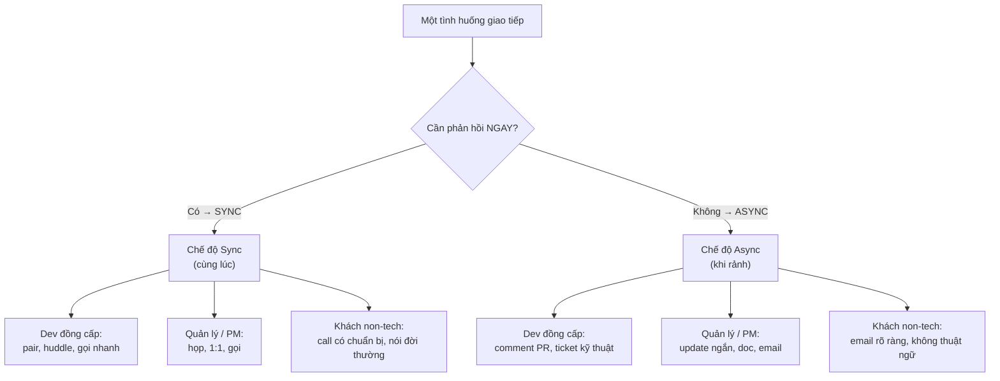

# Vì sao giao tiếp quyết định sự nghiệp dev

> **Tác giả:** Mr.Rom\
> **Phiên bản:** v1.0.0\
> **Tạo lúc:** 13/06/2026\
> **Cập nhật:** 13/06/2026\
> **Level:** Basic\
> **Tags:** career, soft-skills, communication, collaboration, sync-async, stakeholders, written-communication\
> **Yêu cầu trước:** (không bắt buộc — nên đã đọc career-path)

> 🎯 *Bạn đã đầu tư hàng nghìn giờ để code giỏi hơn. Nhưng tới một ngưỡng, thứ quyết định bạn lên Senior, được tin giao việc lớn, hay được lắng nghe trong phòng họp lại không phải là code — mà là cách bạn truyền đạt nó. Bài này mở cụm "giao tiếp": vì sao kỹ năng này thường quyết định thăng tiến hơn kỹ thuật thuần ở mức senior+, ba trục để định vị mọi tình huống giao tiếp (**sync vs async**, **đối tượng**, **kênh**), ba nguyên tắc nền, và cái giá rất thật của giao tiếp kém. Đây là bài dẫn — bốn bài sau sẽ đào sâu từng kỹ năng cụ thể.*

## 🎯 Sau bài này bạn sẽ

- [ ] Hiểu vì sao ở mức senior+ giao tiếp thường quyết định thăng tiến hơn kỹ thuật thuần
- [ ] Phân biệt được trục **sync vs async** và biết chọn đúng chế độ cho từng tình huống
- [ ] Nhận diện 4 nhóm **đối tượng** (dev đồng cấp / quản lý / PM / khách non-tech) và điều mỗi nhóm cần
- [ ] Chọn đúng **kênh** (chat / email / doc / họp / PR) theo độ phức tạp và tính khẩn
- [ ] Áp dụng ba nguyên tắc nền: **rõ ràng > đầy đủ**, **đúng đối tượng**, **tôn trọng thời gian người nhận**
- [ ] Định lượng được **chi phí của giao tiếp kém**: hiểu nhầm, rework, mất niềm tin

---

## Tình huống — hai dev giỏi ngang nhau, một người được cất nhắc

Hãy hình dung hai người trong cùng một team, kỹ thuật ngang nhau, chăm chỉ như nhau. Gọi họ là dev A và dev B.

Dev A viết code rất sạch nhưng gần như "ẩn mình". Pull request của bạn ấy không có mô tả, chỉ một dòng `fix bug`. Khi bị chặn việc, bạn ấy im lặng tự xoay xở ba ngày rồi mới nói ra trong buổi standup — lúc đó deadline đã trượt. Trong cuộc họp với khách hàng, bạn ấy giải thích lỗi bằng những câu như *"do race condition ở tầng cache khiến write bị stale"* — khách gật gù mà chẳng hiểu gì, ra về với cảm giác bất an.

Dev B code không giỏi hơn. Nhưng pull request của bạn ấy luôn có một đoạn mô tả ngắn: *làm gì, vì sao, rủi ro ở đâu, cần reviewer chú ý chỗ nào* — người review chỉ mất vài phút là nắm được. Khi bị chặn, bạn ấy nhắn ngay trong kênh chung kèm bối cảnh đủ để người khác gỡ hộ. Với khách hàng, bạn ấy nói: *"Có một lỗi khiến số dư hiển thị sai trong vài giây sau khi nạp tiền. Chúng tôi đã vá, và thêm kiểm tra để không tái diễn."*

Sáu tháng sau, dev B được đề xuất lên Senior. Dev A vẫn ở chỗ cũ, hoang mang *"mình code đâu có tệ hơn?"*.

Sự khác biệt không nằm ở tài năng kỹ thuật. Nó nằm ở chỗ: công việc của dev không chỉ là **tạo ra giá trị**, mà còn là **truyền đạt giá trị đó cho người khác** — để họ review được, tin được, dùng được, và ra quyết định dựa trên nó. Code chạy trong máy, nhưng sự nghiệp chạy trong đầu người khác. Bài này giải thích vì sao, và cho bạn bộ khung để không thành dev A.

---

## 1️⃣ Vì sao càng lên cao, giao tiếp càng quyết định

Ở những năm đầu, gần như toàn bộ giá trị bạn tạo ra đến từ code do chính tay bạn viết. Bạn được đánh giá bằng "task có xong không, có chạy không". Giao tiếp lúc này quan trọng nhưng chưa phải yếu tố sống còn — một junior ít nói nhưng làm tốt vẫn được quý.

Nhưng càng lên cao, **tỷ trọng giá trị đến từ code của riêng bạn càng giảm**, và phần đến từ việc bạn làm người khác làm tốt hơn càng tăng: bạn review code cho người khác, bạn thiết kế để cả team theo, bạn thuyết phục được hướng đi đúng, bạn giải thích cho non-tech hiểu để họ ra quyết định đúng. Tất cả những việc đó **đều là giao tiếp**.

🪞 **Ẩn dụ**: hãy nghĩ về việc leo từ **người chơi nhạc** lên **nhạc trưởng**. Một nghệ sĩ violin giỏi tạo giá trị bằng chính tiếng đàn của mình — kỹ năng cá nhân là tất cả. Nhưng một nhạc trưởng không chơi nhạc cụ nào trong buổi diễn; giá trị của ông đến hoàn toàn từ việc **điều phối, truyền đạt, đồng bộ** cả dàn nhạc. Lên Senior/Lead giống cú chuyển đó: cây đàn (code) vẫn quan trọng, nhưng cái quyết định dàn nhạc hay hay dở là cây đũa chỉ huy (giao tiếp).

Có một lý do cấu trúc khiến điều này gần như không tránh được. Ở [bài về phát triển & thăng tiến](../../../career-path/lessons/01_basic/04_growth-and-leveling-up.md), bạn đã thấy: lên level không phải là "làm cùng việc nhanh hơn" mà là **phạm vi ảnh hưởng rộng hơn**. Mà ảnh hưởng tới người khác thì chỉ truyền qua một phương tiện duy nhất — giao tiếp. Bảng dưới cho thấy sự dịch chuyển tỷ trọng này (con số minh hoạ xu hướng, không phải số đo chính xác):

| Level | Giá trị từ code của bản thân | Giá trị từ giao tiếp / ảnh hưởng | Câu hỏi định hình |
|---|---|---|---|
| **Junior** | Phần lớn | Phần nhỏ | "Mình làm xong task chưa?" |
| **Mid** | Quá nửa | Đáng kể | "Mình tự lo trọn một feature được chưa?" |
| **Senior** | Một phần | Phần lớn | "Mình làm team xung quanh tốt hơn chưa?" |
| **Staff+** | Nhỏ | Gần như tất cả | "Mình định hình hướng đi qua thuyết phục và viết được chưa?" |

→ Đọc theo chiều dọc cột thứ ba: càng lên cao, **phần lớn tác động của bạn đi qua miệng và ngòi bút, không qua bàn phím code**. Đây là lý do nhiều dev kỹ thuật xuất sắc bị "kẹt trần" ở Mid/Senior: họ tiếp tục mài kỹ năng đã mạnh (code) mà bỏ quên kỹ năng đang trở thành nút thắt (giao tiếp). Tin tốt: giao tiếp là kỹ năng học được — và cả cụm này tồn tại để dạy bạn điều đó.

> [!NOTE]
> Điều này **không** có nghĩa kỹ thuật hết quan trọng. Một người giao tiếp hay nhưng kỹ thuật rỗng sẽ bị nhìn thấu rất nhanh trong môi trường dev. Ý đúng là: ở mức senior+, kỹ thuật là **điều kiện cần** (ai cũng đủ giỏi rồi), còn giao tiếp trở thành **yếu tố phân hoá** — thứ tạo ra khác biệt giữa những người đều giỏi.

---

## 2️⃣ Ba trục để định vị mọi tình huống giao tiếp

Giao tiếp nghe có vẻ là một khối mơ hồ "ăn nói khéo léo". Nhưng thực ra mọi tình huống giao tiếp ở chỗ làm đều có thể định vị bằng **ba câu hỏi**: *Có cần trả lời ngay không?* (trục sync/async), *Mình đang nói với ai?* (trục đối tượng), và *Dùng phương tiện nào?* (trục kênh). Trả lời được ba câu này, bạn đã chọn đúng 90% cách giao tiếp.

🪞 **Ẩn dụ**: ba trục giống **ba núm chỉnh trên một chiếc loa**: âm lượng, độ trầm, độ bổng. Cùng một bản nhạc (thông điệp), chỉnh ba núm khác nhau cho ra trải nghiệm hoàn toàn khác. Giao tiếp giỏi không phải "nói to hơn" — mà là **vặn đúng ba núm cho đúng hoàn cảnh**.

### Trục 1 — Sync vs Async

Đây là trục nền tảng nhất, và là trục người mới hay chọn sai nhất.

- **Sync** (đồng bộ) — *Synchronous communication* (giao tiếp đồng bộ) là kiểu cả hai bên phải có mặt **cùng lúc**: gọi điện, họp, gọi video, nhắn chat rồi ngồi đợi trả lời ngay. Ưu: phản hồi tức thì, hợp việc cần bàn qua lại nhanh. Nhược: ngắt mạch công việc của người kia, không để lại dấu vết để tra cứu sau.
- **Async** (bất đồng bộ) — *Asynchronous communication* (giao tiếp bất đồng bộ) là kiểu bạn gửi đi và người nhận **trả lời khi họ rảnh**: email, ticket, tài liệu, comment trong pull request, tin nhắn không đòi reply ngay. Ưu: tôn trọng dòng tập trung của người khác, để lại bản ghi tra cứu được. Nhược: chậm hơn, đòi bạn **viết rõ ngay từ đầu** vì không có cơ hội hỏi lại tức thì.

🪞 **Ẩn dụ**: sync giống **gọi điện thoại** — phải bắt máy ngay, nói xong là bay hơi. Async giống **gửi thư** — người nhận đọc lúc nào tuỳ họ, và lá thư còn đó để đọc lại. Một văn phòng mà mọi thứ đều "gọi điện" thì không ai tập trung được; một văn phòng chỉ toàn "gửi thư" thì việc gấp chết kẹt. Nghệ thuật là biết khi nào cần cái nào.

Mặc định nên ưu tiên **async** cho phần lớn việc, vì nó bảo vệ thời gian tập trung (thứ quý nhất của dev) và tạo bản ghi. Chỉ chuyển sang **sync** khi việc thực sự cần nó:

| Tình huống | Nên chọn | Vì sao |
|---|---|---|
| Hỏi một thông tin không gấp | Async (chat/ticket) | Không cần cắt ngang người khác; họ trả lời khi rảnh |
| Đã nhắn qua lại > 3-4 lượt mà chưa thông | Sync (gọi nhanh) | Bàn miệng 5 phút gỡ được thứ chat cả buổi không xong |
| Quyết định quan trọng cần nhiều người | Sync (họp) + Async (biên bản) | Bàn trực tiếp rồi chốt lại bằng văn bản để khỏi quên |
| Sự cố production đang cháy | Sync (gọi/huddle ngay) | Mỗi phút đáng giá; async quá chậm |
| Chia sẻ một thiết kế để mọi người ngẫm | Async (doc) | Người đọc cần thời gian suy nghĩ, không hợp ép trả lời ngay |
| Phản hồi cảm xúc nhạy cảm (góp ý khó nghe) | Sync (nói riêng) | Văn bản dễ bị hiểu lạnh lùng; giọng nói truyền được thiện ý |

> [!TIP]
> Quy tắc ngón tay cái chống "họp vô tận": nếu một việc có thể giải quyết gọn bằng async (một tin nhắn rõ ràng, một doc) thì **đừng** triệu tập họp. Ngược lại, nếu một chủ đề đã qua nhiều lượt chat mà càng nói càng rối, **đừng** cố tiếp tục async — hãy đổi sang một cuộc gọi 5 phút. Chọn sai chiều nào cũng tốn thời gian cả team.

### Trục 2 — Đối tượng (bạn đang nói với ai)

Cùng một sự việc, bạn phải kể **khác nhau** cho người khác nhau — không phải để xu nịnh, mà vì mỗi người cần một loại thông tin khác nhau để làm việc của họ. Bốn nhóm đối tượng phổ biến nhất với một dev:

- **Dev đồng cấp** — cùng "ngôn ngữ" kỹ thuật với bạn. Họ cần **chi tiết kỹ thuật**: cách triển khai, trade-off, rủi ro, lý do chọn cách này. Dùng thuật ngữ thoải mái, đi thẳng vào vấn đề.
- **Quản lý (manager / team lead)** — quan tâm **tiến độ, rủi ro, và những gì cần họ gỡ**. Họ không cần biết bạn dùng thuật toán nào; họ cần biết *việc có đúng hạn không, có gì chặn không, có cần họ quyết gì không*. Nói ngắn, nêu trạng thái và đề xuất, đừng bắt họ tự suy ra kết luận.
- **PM (Product Manager)** — cầu nối giữa kỹ thuật và sản phẩm. Họ quan tâm **ảnh hưởng tới người dùng, phạm vi, và đánh đổi (scope vs thời gian)**. Dịch chi tiết kỹ thuật thành ngôn ngữ tác động: *"cách A nhanh hơn nhưng thiếu tính năng X; cách B đủ tính năng nhưng cần thêm thời gian"* — để họ ra quyết định ưu tiên.
- **Khách hàng / người non-tech** — không có nền kỹ thuật. Họ cần **kết quả và sự an tâm**, bằng ngôn ngữ đời thường, **không thuật ngữ**. Họ muốn biết *chuyện gì xảy ra với họ, đã xử lý chưa, có ảnh hưởng gì không* — chứ không phải "race condition ở tầng cache".

🪞 **Ẩn dụ**: nói cùng một việc cho bốn nhóm này giống **một bác sĩ giải thích cùng một chẩn đoán** cho bốn người: cho đồng nghiệp bác sĩ (dùng thuật ngữ y khoa đầy đủ), cho y tá (tập trung vào việc cần làm), cho người nhà bệnh nhân (nói rủi ro và bước tiếp theo dễ hiểu), và cho chính bệnh nhân (trấn an, ngôn ngữ đời thường). Bác sĩ giỏi không nói một kiểu cho tất cả.

Hãy xem cùng một sự việc — *"API thanh toán có lỗi làm số dư hiển thị sai trong vài giây"* — được "dịch" cho bốn đối tượng thế nào:

| Đối tượng | Họ cần gì | Cách diễn đạt |
|---|---|---|
| **Dev đồng cấp** | Chi tiết để cùng sửa | "Có race condition giữa write balance và read cache; mình fix bằng cách invalidate cache trong transaction, đã thêm test cho case đồng thời." |
| **Quản lý** | Tiến độ + rủi ro + cần gì | "Đã tìm ra nguyên nhân lỗi số dư, đang vá, dự kiến lên hôm nay. Không cần gì thêm, sẽ báo khi xong." |
| **PM** | Ảnh hưởng người dùng + đánh đổi | "Lỗi này khiến một số user thấy số dư sai vài giây sau khi nạp — không mất tiền thật. Bản vá an toàn, không ảnh hưởng feature khác." |
| **Khách non-tech** | Kết quả + an tâm | "Có một lỗi khiến số dư hiển thị sai trong giây lát sau khi nạp tiền. Tiền của bạn luôn an toàn. Chúng tôi đã sửa và thêm kiểm tra để không tái diễn." |

→ Để ý: **sự thật không đổi**, chỉ "độ phân giải kỹ thuật" thay đổi theo người nghe. Sai lầm kinh điển của dev là dùng đúng một phiên bản (thường là phiên bản dev-đồng-cấp đầy thuật ngữ) cho **tất cả** — khiến quản lý phải đoán, PM hiểu sai phạm vi, và khách hàng hoảng loạn.

### Trục 3 — Kênh (dùng phương tiện nào)

Trục thứ ba là chọn **phương tiện** mang thông điệp. Mỗi kênh có một "trọng lượng" riêng — dùng kênh quá nhẹ cho việc nặng thì thông tin trôi mất; dùng kênh quá nặng cho việc nhẹ thì phí thời gian mọi người.

| Kênh | Hợp nhất cho | Tránh dùng cho |
|---|---|---|
| **Chat** (Slack/Teams) | Hỏi nhanh, cập nhật ngắn, phối hợp tức thời | Quyết định quan trọng cần lưu lại (chat trôi mất); thảo luận dài nhiều người |
| **Email** | Thông báo trang trọng, giao tiếp với bên ngoài, việc cần dấu vết chính thức | Việc cần phản hồi gấp; trao đổi qua lại nhanh |
| **Doc** (tài liệu) | Thiết kế, đề xuất, quyết định cần nhiều người ngẫm và để lại lâu dài | Hỏi đáp vụn vặt; việc khẩn |
| **Họp** | Bàn bạc cần qua lại trực tiếp, ra quyết định nhóm, việc nhạy cảm | Thứ chỉ cần một thông báo một chiều (gửi doc/email là đủ) |
| **PR** (pull request) | Trao đổi gắn liền với code cụ thể, review thay đổi | Thảo luận về định hướng lớn không gắn với dòng code nào |

> [!IMPORTANT]
> Nguyên tắc kênh quan trọng nhất: **quyết định và những điều quan trọng phải sống ở kênh để lại dấu vết tra cứu được** (doc, ticket, email, comment PR) — không phải chỉ trong một câu chat sẽ trôi sau hai ngày, hay trong một cuộc họp không có biên bản. "Đã nói rồi mà" không cứu được bạn khi không ai tìm lại được nó ở đâu.

---

## 3️⃣ Ma trận sync/async × đối tượng — bức tranh tổng

Ba trục trên không hoạt động rời rạc — chúng đan vào nhau. Cách trực quan nhất để thấy điều đó là đặt hai trục quan trọng nhất (**sync/async** và **đối tượng**) lên một ma trận, rồi điền kênh phù hợp vào từng ô. Đây là khái niệm trừu tượng nhất của bài, nên ta hình dung nó qua sơ đồ trước khi rút ra quy luật.



→ Quy luật rút ra từ sơ đồ: **trục dọc (sync/async) quyết định tốc độ và phương tiện, trục ngang (đối tượng) quyết định ngôn ngữ và độ chi tiết**. Một thông điệp tốt là kết quả của việc chọn đúng cả hai cùng lúc — ví dụ "báo sự cố cho khách" rơi vào ô *sync + non-tech*, nên cách đúng là một cuộc gọi có chuẩn bị bằng ngôn ngữ đời thường, không phải một email đầy thuật ngữ (sai cả hai trục). Bốn bài sau của cụm sẽ lần lượt đi sâu vào từng vùng của ma trận này.

---

## 4️⃣ Ba nguyên tắc nền

Ba trục giúp bạn **chọn** cách giao tiếp. Ba nguyên tắc dưới đây quyết định **chất lượng** của nó — áp dụng được cho mọi ô trong ma trận trên.

### Nguyên tắc 1 — Rõ ràng hơn đầy đủ

Bản năng của dev là kể **mọi thứ**: mọi chi tiết kỹ thuật, mọi ngoại lệ, mọi cái "à mà còn". Kết quả là một bức tường chữ mà người nhận không tìm ra điểm chính. **Rõ ràng** nghĩa là người đọc nắm được *ý quan trọng nhất* trong vài giây — kể cả khi bạn phải lược bớt chi tiết.

🪞 **Ẩn dụ**: thông điệp giống **một bài báo**, không phải một biên bản. Bài báo đặt kết luận quan trọng nhất lên **tiêu đề và câu đầu**; ai vội thì đọc tiêu đề là đủ, ai muốn sâu thì đọc tiếp. Một biên bản kể tuần tự mọi thứ từ đầu thì người đọc phải lội tới cuối mới biết "vậy rốt cuộc là sao".

So sánh hai cách báo cùng một việc:

| ❌ Đầy đủ nhưng rối | ✅ Rõ ràng |
|---|---|
| "Mình đã xem qua module thanh toán, thấy nó dùng float để tính tiền, mà float thì có vấn đề làm tròn, với lại cache cũng không invalidate đúng lúc, ngoài ra còn vài chỗ tên biến khó hiểu, và mình nghĩ có thể có race condition nữa, nói chung là khá nhiều thứ..." | "**Tóm tắt: có 1 lỗi nghiêm trọng làm số dư hiển thị sai.** Nguyên nhân: cache không invalidate đúng lúc. Mình đang vá, xong trong hôm nay. (Có vài vấn đề nhỏ khác mình ghi vào ticket riêng để dọn sau.)" |

→ Bản bên phải **không đầy đủ hơn** — nó còn lược bớt. Nhưng nó **rõ ràng hơn**: nêu điểm chính trước, tách việc gấp khỏi việc vặt, cho người đọc biết ngay "cần lo gì, ai làm gì". Rõ ràng là sự tôn trọng dành cho não bộ người nhận.

### Nguyên tắc 2 — Đúng đối tượng

Như đã thấy ở trục 2: cùng một sự thật, hãy điều chỉnh **ngôn ngữ và độ chi tiết** theo người nhận. Trước khi gửi bất cứ gì, dừng lại một giây tự hỏi: *"Người này cần gì từ thông điệp này, và họ hiểu được tới mức nào?"*.

- Gửi cho **dev** mà giải thích những thứ họ đã biết → phí thời gian, hơi xem thường.
- Gửi cho **non-tech** mà dùng thuật ngữ chưa giải thích → họ hiểu sai hoặc hoảng, rồi ra quyết định sai.
- Gửi cho **quản lý** một bức tường chi tiết kỹ thuật → họ phải tự đào ra "vậy tóm lại có vấn đề gì cần tôi lo không?".

→ Nguyên tắc này không phải "nói dối tuỳ người". Sự thật giữ nguyên; chỉ **độ phân giải** thay đổi cho khớp người nghe.

### Nguyên tắc 3 — Tôn trọng thời gian người nhận

Mỗi tin nhắn, email, lời mời họp của bạn là một yêu cầu rút **sự chú ý** của người khác — tài nguyên hữu hạn và quý nhất ở chỗ làm. Giao tiếp tử tế là giao tiếp **tiết kiệm thời gian cho người nhận**, kể cả khi nó tốn thêm thời gian cho bạn.

🪞 **Ẩn dụ**: gửi một thông điệp lộn xộn giống **đẩy việc dọn dẹp sang cho người nhận**. Nếu bạn lười cấu trúc, mỗi người trong số 10 người đọc phải tự bỏ công giải mã — tổng chi phí gấp 10 lần công bạn tiết kiệm. "Viết gọn tốn thời gian của tôi, nhưng tiết kiệm thời gian của tất cả" là một khoản đầu tư luôn lời.

Vài biểu hiện cụ thể của việc tôn trọng thời gian người nhận:

- **Đặt kết luận / yêu cầu lên đầu** — đừng bắt người ta đọc hết mới biết bạn muốn gì.
- **Nói rõ bạn cần gì ở họ** — "cần anh duyệt", "chỉ để biết, không cần làm gì", "cần ý kiến trước thứ Sáu". Mơ hồ khiến người nhận phải đoán.
- **Gộp câu hỏi, đừng nhỏ giọt** — thay vì 5 tin nhắn rời rạc cả ngày, một tin gói gọn các câu hỏi liên quan.
- **Đừng triệu tập họp khi một tin nhắn là đủ** — và ngược lại, đừng kéo lê async khi một cuộc gọi 5 phút gỡ xong.
- **Tự tìm trước khi hỏi** — đọc doc, thử search, nêu rõ "mình đã thử X" khi hỏi, để người giúp không phải hỏi lại từ đầu.

> [!TIP]
> Một thước đo nhanh cho mọi thông điệp trước khi gửi: *"Nếu mình là người nhận đang bận, đọc cái này mất bao lâu để biết phải làm gì?"*. Nếu câu trả lời là "phải đọc kỹ hai lần mới hiểu" → viết lại. Năm phút bạn bỏ ra để làm rõ tiết kiệm hàng giờ tổng hợp của cả những người nhận.

---

## 5️⃣ Cái giá rất thật của giao tiếp kém

Giao tiếp kém không phải một khuyết điểm "mềm" vô hại — nó tạo ra chi phí **đo đếm được** bằng thời gian, tiền bạc, và thứ khó lấy lại nhất: niềm tin. Ba loại chi phí lớn nhất:

🪞 **Ẩn dụ**: giao tiếp giống **đường ống dẫn nước** giữa các thành viên. Ống tốt thì nước (thông tin) chảy đúng chỗ, đúng lượng. Ống rò (giao tiếp kém) thì nước thất thoát dọc đường — mỗi chỗ rò là một hiểu nhầm, và tới đầu kia thông tin đã méo mó hoặc cạn. Đội ngũ giỏi tới đâu mà đường ống rò thì giá trị vẫn rỉ mất giữa đường.

### Hiểu nhầm — thông tin méo mó khi truyền

Khi bạn truyền đạt mơ hồ, người nhận **lấp khoảng trống bằng phỏng đoán của họ** — và phỏng đoán đó thường sai. Một yêu cầu mơ hồ ("làm cái form đăng ký nhé") khiến mỗi người hình dung một thứ khác nhau; tới lúc demo mới lộ ra "ơ không phải cái này". Hiểu nhầm là gốc của phần lớn xung đột tưởng-là-tính-cách ở chỗ làm.

### Rework — làm lại vì lệch ngay từ đầu

Hiểu nhầm gần như luôn dẫn tới **rework** (làm lại): code xong một feature rồi mới biết hiểu sai yêu cầu, phải đập đi làm lại. Đây là loại lãng phí cay đắng nhất — công sức thật bỏ ra cho một thứ rồi vứt đi. Một câu hỏi làm rõ trước khi code (tốn vài phút) rẻ hơn rất nhiều so với làm lại cả feature (tốn nhiều ngày).

```text
Giao tiếp rõ trước khi làm:
  Hỏi rõ yêu cầu (5 phút) → Code đúng (2 ngày) → Xong ✅

Giao tiếp mơ hồ:
  Đoán yêu cầu (0 phút) → Code (2 ngày) → "Không phải cái này" →
  Code lại (2 ngày) → Xong muộn 😫
```

→ Sơ đồ trên cho thấy nghịch lý: bỏ qua bước làm rõ để "tiết kiệm 5 phút" lại tốn thêm cả ngày làm lại. Giao tiếp rõ ràng ở đầu là khoản đầu tư có tỷ suất sinh lời cao nhất mà một dev có thể làm.

### Mất niềm tin — chi phí khó lấy lại nhất

Hai loại trên còn đo bằng thời gian. Loại thứ ba đắt hơn nhiều: **niềm tin**. Khi bạn liên tục im lặng lúc bị chặn, báo cáo lập lờ, hay để người khác phát hiện vấn đề thay vì chủ động nói ra — người ta dần **không còn tin tưởng giao cho bạn việc quan trọng**. Mà như đã thấy ở section 1, được tin giao việc lớn chính là con đường lên level. Niềm tin mất đi vì giao tiếp kém kéo lùi sự nghiệp lâu hơn bất kỳ bug nào.

Bảng dưới tóm tắt ba loại chi phí và cách giao tiếp tốt chặn từng loại:

| Chi phí của giao tiếp kém | Biểu hiện | Giao tiếp tốt chặn nó thế nào |
|---|---|---|
| **Hiểu nhầm** | Người nhận đoán sai ý, mỗi người hiểu một kiểu | Nói rõ, xác nhận lại hiểu chung trước khi bắt tay làm |
| **Rework** | Làm xong mới biết lệch yêu cầu, phải đập đi | Hỏi làm rõ trước khi code; chốt phạm vi bằng văn bản |
| **Mất niềm tin** | Người khác ngại giao việc quan trọng cho bạn | Chủ động báo sớm khi có rủi ro; minh bạch tiến độ |

> [!WARNING]
> Loại giao tiếp kém âm thầm nguy hiểm nhất là **im lặng khi gặp vấn đề**. Giấu việc bị chặn vì ngại làm phiền, không báo khi deadline sắp trượt, "tự xoay được mà" cho tới khi quá muộn — đây là thứ phá niềm tin nhanh nhất. Báo sớm một tin xấu luôn tốt hơn để nó nổ ra muộn. Người ta tha thứ cho vấn đề được báo sớm, nhưng nhớ rất lâu một bất ngờ đáng lẽ tránh được.

---

## 6️⃣ Bốn bài tiếp theo của cụm

Bài này cho bạn **bản đồ**; bốn bài sau là **chi tiết từng vùng đất** trên bản đồ đó. Dưới đây là cách chúng nối tiếp nhau, để bạn biết mình đang ở đâu trong hành trình:

| Bài | Tập trung vào | Trên ma trận |
|---|---|---|
| **1. Giao tiếp async & viết** | Slack, email, ticket, tài liệu — viết rõ để không cần hỏi lại | Cột Async, mọi đối tượng |
| **2. Họp & giao tiếp trực tiếp** | Standup, trình bày, lắng nghe — nói hiệu quả khi gặp mặt | Cột Sync, mọi đối tượng |
| **3. Phản hồi & xử lý bất đồng** | Code review không làm tổn thương, gỡ xung đột | Chủ yếu Sync + dev đồng cấp |
| **4. Giao tiếp với stakeholder & non-tech** | Dịch kỹ thuật sang ngôn ngữ kinh doanh | Hàng PM + khách non-tech |

→ Thứ tự này có chủ đích: bắt đầu từ **viết** (async) vì đó là kỹ năng dev dùng nhiều nhất hằng ngày và dễ luyện nhất, rồi tiến dần tới những tình huống khó hơn về mặt con người (bất đồng, người non-tech). Bạn không cần học xong hết mới áp dụng — chỉ riêng ba nguyên tắc nền ở bài này, dùng ngay từ tin nhắn tiếp theo, đã tạo khác biệt thấy được.

---

## 💡 Cạm bẫy thường gặp & Best practice

### ❌ Cạm bẫy: "code tốt thì tự khắc được công nhận, khỏi cần nói"

- **Triệu chứng**: cắm đầu làm, PR không mô tả, im lặng khi bị chặn, tin rằng kết quả sẽ tự lên tiếng. Ngạc nhiên khi người giao tiếp tốt hơn (dù code ngang) lại được cất nhắc trước.
- **Nguyên nhân**: nhầm rằng giá trị bạn tạo ra **tự truyền đạt được**. Thực tế, người khác chỉ thấy được phần bạn truyền đạt cho họ thấy.
- **Cách tránh**: coi "truyền đạt giá trị" là một phần của công việc, không phải việc thêm. Viết mô tả PR rõ, báo trạng thái chủ động, làm cho công sức của bạn **nhìn thấy được**.

### ❌ Cạm bẫy: dùng một phiên bản thông điệp cho mọi đối tượng

- **Triệu chứng**: giải thích lỗi cho khách hàng bằng đúng những từ dùng với dev ("race condition ở tầng cache"); khách hoang mang, quản lý phải tự đoán "vậy có nghiêm trọng không?".
- **Nguyên nhân**: bỏ qua trục đối tượng — quên rằng mỗi người cần một độ phân giải kỹ thuật khác nhau.
- **Cách tránh**: trước khi gửi, hỏi *"người này cần gì và hiểu tới đâu?"*. Giữ nguyên sự thật, đổi ngôn ngữ và độ chi tiết theo người nhận.

### ❌ Cạm bẫy: chọn sai chế độ sync/async

- **Triệu chứng**: triệu tập cả team họp cho thứ chỉ cần một tin nhắn; hoặc ngược lại, chat qua lại cả buổi về một vấn đề rối mà một cuộc gọi 5 phút gỡ xong.
- **Nguyên nhân**: không dừng lại để hỏi "việc này có thực sự cần mọi người cùng lúc không?".
- **Cách tránh**: mặc định async cho việc không gấp; chuyển sang sync khi đã qua nhiều lượt mà càng nói càng rối, hoặc khi việc thực sự khẩn/nhạy cảm.

### ✅ Best practice: đặt kết luận và yêu cầu lên đầu

- **Vì sao**: người nhận thường bận và đọc lướt; chôn điểm chính ở cuối khiến họ bỏ lỡ hoặc phải đọc lại. Đưa kết luận lên đầu tôn trọng thời gian của họ.
- **Cách áp dụng**: mở mỗi thông điệp dài bằng một dòng tóm tắt ("Tóm tắt: ...") và nói rõ bạn cần gì ("cần anh duyệt trước thứ Sáu" / "chỉ để biết"). Chi tiết để phía sau cho ai muốn đọc sâu.

### ✅ Best practice: ghi quyết định quan trọng vào kênh tra cứu được

- **Vì sao**: quyết định chỉ tồn tại trong một câu chat hay một cuộc họp không biên bản sẽ bị quên, gây tranh cãi "đã chốt gì" sau này.
- **Cách áp dụng**: sau mỗi cuộc bàn quan trọng, chốt lại bằng văn bản trong doc/ticket/email — ai quyết gì, vì sao, bước tiếp theo là gì. "Đã nói rồi" không bằng "đã ghi rồi".

### ✅ Best practice: báo sớm tin xấu

- **Vì sao**: vấn đề được báo sớm còn cơ hội xử lý và giữ được niềm tin; bất ngờ phút chót phá niềm tin nặng nề và thường đã quá muộn để cứu.
- **Cách áp dụng**: ngay khi thấy rủi ro deadline trượt hay bị chặn, nói ra kèm bối cảnh và (nếu được) một đề xuất. Im lặng "tự xoay" tới phút cuối là cái bẫy đắt giá nhất.

---

## 🧠 Tự kiểm tra (Self-check)

**Q1.** Hai dev có kỹ thuật ngang nhau, nhưng một người được lên Senior trước. Theo bài, sự khác biệt thường nằm ở đâu, và vì sao càng lên cao điều đó càng đúng?

<details>
<summary>💡 Xem giải thích</summary>

Sự khác biệt thường nằm ở **giao tiếp** — cách họ truyền đạt giá trị mình tạo ra cho người khác (mô tả PR rõ, báo trạng thái chủ động, giải thích đúng đối tượng). Càng lên cao điều này càng đúng vì **tỷ trọng giá trị đến từ code của riêng bạn giảm dần, phần đến từ việc bạn làm người khác làm tốt hơn (review, thiết kế, thuyết phục, giải thích) tăng dần** — mà tất cả những việc đó đều truyền qua giao tiếp. Ở mức senior+, kỹ thuật là điều kiện cần (ai cũng đủ giỏi), còn giao tiếp trở thành yếu tố phân hoá.

</details>

**Q2.** Một đồng nghiệp và bạn đã nhắn qua lại trong chat hơn năm lượt về một thiết kế mà vẫn chưa thống nhất, mỗi tin càng làm rối thêm. Theo trục sync/async, bạn nên làm gì?

<details>
<summary>💡 Xem giải thích</summary>

Chuyển từ **async sang sync**: đề nghị một cuộc gọi nhanh (5-10 phút). Khi một chủ đề đã qua nhiều lượt async mà càng nói càng rối, đó là tín hiệu rõ rằng việc này cần phản hồi qua lại tức thời — bàn miệng vài phút gỡ được thứ chat cả buổi không xong. Sau khi thống nhất, nên chốt lại kết luận bằng văn bản (async) để khỏi quên. Mặc định async là tốt, nhưng cố ép async khi nó không còn hiệu quả lại tốn thời gian hơn.

</details>

**Q3.** Bạn vừa vá xong một lỗi và cần báo cho khách hàng (non-tech). Hai cách diễn đạt: (a) *"Đã fix race condition ở tầng cache gây stale read số dư"*; (b) *"Có một lỗi khiến số dư hiển thị sai trong giây lát sau khi nạp tiền — tiền của bạn luôn an toàn, chúng tôi đã sửa."* Cách nào đúng và vì sao?

<details>
<summary>💡 Xem giải thích</summary>

Cách **(b)**. Đây là trục đối tượng: khách non-tech cần **kết quả và sự an tâm bằng ngôn ngữ đời thường, không thuật ngữ**. Cách (a) dùng đúng phiên bản dành cho dev đồng cấp — khách sẽ không hiểu, thậm chí hoang mang vì nghe nguy hiểm. Lưu ý: cả hai cách đều **không nói dối** — sự thật giữ nguyên, chỉ độ phân giải kỹ thuật thay đổi cho khớp người nghe. Đó chính là nguyên tắc "đúng đối tượng".

</details>

**Q4.** Bài nói "rõ ràng > đầy đủ". Một báo cáo "đầy đủ" liệt kê hết mọi chi tiết kỹ thuật có thể vẫn là giao tiếp kém — vì sao? Một thông điệp "rõ ràng" khác nó thế nào?

<details>
<summary>💡 Xem giải thích</summary>

Một báo cáo nhồi mọi chi tiết tạo ra **bức tường chữ** mà người nhận không tìm ra điểm chính — họ phải tự lội và tự rút kết luận, dễ bỏ sót thứ quan trọng. "Rõ ràng" nghĩa là người đọc nắm được **ý quan trọng nhất trong vài giây**, kể cả khi phải lược bớt chi tiết: đặt kết luận/yêu cầu lên đầu (như tiêu đề một bài báo), tách việc gấp khỏi việc vặt, nói rõ "cần lo gì, ai làm gì". Rõ ràng đôi khi **ít đầy đủ hơn** nhưng phục vụ người đọc tốt hơn nhiều — đó là sự tôn trọng dành cho não bộ người nhận.

</details>

**Q5.** Bạn phát hiện task của mình sắp trượt deadline vì một phụ thuộc bị chặn. Bạn định "tự xoay thêm vài hôm xem sao rồi mới báo". Vì sao đây là cạm bẫy, và nó liên quan gì tới chi phí "mất niềm tin"?

<details>
<summary>💡 Xem giải thích</summary>

Im lặng khi gặp vấn đề là **loại giao tiếp kém phá niềm tin nhanh nhất**. Báo muộn biến một rủi ro còn xử lý được thành một bất ngờ phút chót mà người khác không kịp ứng phó — và họ sẽ nhớ rất lâu. Mất niềm tin là chi phí khó lấy lại nhất (đắt hơn cả hiểu nhầm và rework đo bằng thời gian), và vì được tin giao việc lớn chính là con đường lên level, mất niềm tin kéo lùi sự nghiệp lâu hơn bất kỳ bug nào. Cách đúng: báo sớm kèm bối cảnh và (nếu được) một đề xuất. Người ta tha thứ cho vấn đề được báo sớm, nhưng nhớ lâu một bất ngờ đáng lẽ tránh được.

</details>

---

## ⚡ Tra cứu nhanh (Cheatsheet)

**Ba trục định vị mọi tình huống giao tiếp:**

| Trục | Câu hỏi | Lựa chọn |
|---|---|---|
| **Sync / Async** | Cần phản hồi ngay không? | Sync (họp/gọi) ↔ Async (chat/email/doc/PR) |
| **Đối tượng** | Mình đang nói với ai? | Dev / Quản lý / PM / Khách non-tech |
| **Kênh** | Dùng phương tiện nào? | Chat / Email / Doc / Họp / PR |

**Chọn Sync hay Async:**

| Dùng Async khi | Dùng Sync khi |
|---|---|
| Việc không gấp, hỏi thông tin | Đã qua nhiều lượt async mà càng rối |
| Chia sẻ thiết kế để mọi người ngẫm | Sự cố production đang cháy |
| Việc cần để lại dấu vết tra cứu | Quyết định nhóm quan trọng / việc nhạy cảm |

**Đối tượng cần gì:**

| Đối tượng | Cần gì |
|---|---|
| Dev đồng cấp | Chi tiết kỹ thuật, trade-off, rủi ro |
| Quản lý | Tiến độ + rủi ro + cần họ gỡ gì |
| PM | Ảnh hưởng người dùng + đánh đổi phạm vi |
| Khách non-tech | Kết quả + an tâm, ngôn ngữ đời thường |

**Ba nguyên tắc nền:**

- **Rõ ràng > đầy đủ** — kết luận lên đầu, lược chi tiết phụ.
- **Đúng đối tượng** — giữ sự thật, đổi ngôn ngữ và độ chi tiết theo người nghe.
- **Tôn trọng thời gian người nhận** — nói rõ cần gì, gộp câu hỏi, tự tìm trước khi hỏi.

**Ba chi phí của giao tiếp kém:**

- **Hiểu nhầm** → người nhận đoán sai → chặn bằng xác nhận hiểu chung.
- **Rework** → làm xong mới biết lệch → chặn bằng hỏi rõ trước khi code.
- **Mất niềm tin** → ngại giao việc lớn → chặn bằng báo sớm, minh bạch.

---

## 📚 Từ Điển Thuật Ngữ (Glossary)

| EN | VN | Giải thích |
|---|---|---|
| Synchronous (sync) | Đồng bộ | Giao tiếp cần cả hai bên có mặt cùng lúc (họp, gọi điện) |
| Asynchronous (async) | Bất đồng bộ | Giao tiếp người nhận trả lời khi rảnh (email, ticket, doc) |
| Stakeholder | Bên liên quan | Người có quyền lợi/quan tâm tới dự án (PM, khách, sếp...) |
| Non-tech | Người ngoài kỹ thuật | Người không có nền kỹ thuật (khách hàng, kinh doanh) |
| PM (Product Manager) | Quản lý sản phẩm | Người định hướng sản phẩm, cầu nối kỹ thuật và kinh doanh |
| Manager / Team Lead | Quản lý / Trưởng nhóm | Người quản lý công việc, tiến độ, và phát triển của bạn |
| PR (Pull Request) | Yêu cầu hợp nhất code | Đề xuất thay đổi code để người khác review trước khi merge |
| Ticket | Phiếu công việc | Mục ghi một việc/lỗi trong hệ thống quản lý (Jira, ...) |
| Channel | Kênh | Phương tiện mang thông điệp (chat, email, doc, họp, PR) |
| Rework | Làm lại | Phải làm lại công việc vì hiểu sai hoặc lệch yêu cầu ban đầu |
| Standup | Họp đứng nhanh | Buổi họp ngắn định kỳ cập nhật tiến độ trong team |
| Trade-off | Đánh đổi | Sự cân nhắc được/mất khi chọn giữa các phương án |
| Scope | Phạm vi | Ranh giới những gì một công việc/tính năng bao gồm |
| Huddle | Gọi nhanh nhóm nhỏ | Cuộc gọi thoại tức thời, ngắn, để gỡ việc nhanh |

---

## 🔗 Liên kết & Tài nguyên

➡️ **Bài tiếp theo:** [Giao tiếp async & viết — Slack, email, ticket, tài liệu](01_async-and-written-communication.md)\
↑ **Về cụm:** [communication — README](../../README.md)

### 🧭 Định hướng lộ trình học

- [Phát triển & Thăng tiến — Lên level và biết khi nào đổi việc](../../../career-path/lessons/01_basic/04_growth-and-leveling-up.md) — vì sao phạm vi ảnh hưởng (qua giao tiếp) quyết định lên level
- [Sự nghiệp trong ngành tech là gì? — Bản đồ vai trò & nấc thang](../../../career-path/lessons/01_basic/00_what-is-a-tech-career.md) — bức tranh tổng vai trò, nền tảng để hiểu các đối tượng giao tiếp

### 🧩 Các chủ đề có thể bạn quan tâm

- [Phản hồi & xử lý bất đồng — Code review không làm tổn thương](03_feedback-and-conflict.md) — đào sâu giao tiếp khi góp ý và bất đồng
- [Giao tiếp với stakeholder & người non-tech](04_communicating-with-stakeholders.md) — đào sâu cách dịch kỹ thuật cho người ngoài ngành
- [Behavioral Interview & STAR — Kể chuyện thuyết phục](../../../interview-prep/lessons/01_basic/03_behavioral-interview-and-star.md) — giao tiếp có cấu trúc cũng quyết định bạn được nhận hay không

### 🌐 Tài nguyên tham khảo khác

- [GitLab — Communication (Handbook)](https://handbook.gitlab.com/handbook/communication/) — cẩm nang giao tiếp của một công ty remote-first, mẫu mực về ưu tiên async
- [The Pragmatic Engineer — Engineering soft skills](https://blog.pragmaticengineer.com/) — góc nhìn thực tế về vai trò soft skills trong sự nghiệp engineer

---

## 📌 Nhật ký thay đổi (Changelog)

- **v1.0.0 (13/06/2026)** — Bản đầu tiên. Bài INTRO mở cụm communication: tình huống mở bài "hai dev giỏi ngang nhau" + lý do giao tiếp quyết định thăng tiến ở senior+ (bảng dịch chuyển tỷ trọng code/giao tiếp theo level) + ba trục định vị (sync/async, đối tượng, kênh) với bảng chọn sync/async, bảng 4 đối tượng cần gì, bảng dịch một sự việc cho 4 đối tượng, bảng 5 kênh + sơ đồ mermaid ma trận sync/async × đối tượng + ba nguyên tắc nền (rõ ràng > đầy đủ, đúng đối tượng, tôn trọng thời gian) + ba chi phí giao tiếp kém (hiểu nhầm/rework/mất niềm tin) với sơ đồ rework + bảng dẫn vào 4 bài sau + các ẩn dụ nhạc trưởng/núm loa/gọi điện-gửi thư/bác sĩ/bài báo/đường ống nước + 3 cạm bẫy + 3 best practice + 5 self-check + cheatsheet + glossary 14 thuật ngữ. Mở cụm communication.
