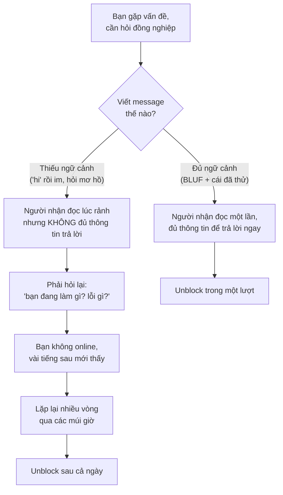

# Giao tiếp async & viết — Slack, email, ticket, tài liệu

> **Tác giả:** Mr.Rom\
> **Phiên bản:** v1.0.0\
> **Tạo lúc:** 13/06/2026\
> **Cập nhật:** 13/06/2026\
> **Level:** Basic\
> **Tags:** career, communication, soft-skills, async, written-communication, slack, bug-report, documentation\
> **Yêu cầu trước:** [Vì sao giao tiếp quyết định sự nghiệp dev](00_why-communication-matters.md)

> 🎯 *Bài trước đã thuyết phục bạn rằng giao tiếp quyết định sự nghiệp dev. Nhưng phần lớn giao tiếp của một dev hiện đại không phải là nói chuyện trực tiếp — nó là **chữ viết**: tin nhắn Slack, email, ticket, tài liệu. Bài này dạy bạn viết một message khiến người ta trả lời ngay thay vì lờ đi, hỏi đúng cách để được giúp, cập nhật trạng thái chủ động, viết bug report mà dev khác đọc xong là sửa được, và để lại tài liệu khiến người sau khỏi phải hỏi lại bạn. Kết bài bạn có sẵn các template message/bug-report để copy ra dùng ngay.*

## 🎯 Sau bài này bạn sẽ

- [ ] Hiểu vì sao **async** (bất đồng bộ) là mặc định của dev hiện đại và viết tốt quan trọng hơn nói hay
- [ ] Áp dụng được **BLUF** (Bottom Line Up Front) — đặt kết luận lên đầu mọi message dài
- [ ] Viết một câu hỏi rõ ràng theo công thức **context + câu hỏi cụ thể + cái đã thử**, tránh kiểu "hi" rồi im
- [ ] Cập nhật **status** chủ động để không ai phải đi hỏi "task đó tới đâu rồi?"
- [ ] Viết một **bug report / ticket** tốt với repro steps và expected vs actual
- [ ] Có **documentation mindset** — viết để người sau (kể cả bạn của 6 tháng sau) đỡ phải hỏi lại
- [ ] Nắm etiquette Slack cơ bản: dùng thread đúng cách, phân biệt `@here` và `@channel`

---

## Tình huống — một câu hỏi, hai cách hỏi, hai số phận

Bạn đang kẹt với một lỗi build. Bạn mở Slack, gõ cho một senior trong team: **"hi anh"**. Rồi bạn ngồi đợi. Anh ấy thấy thông báo, mở ra, thấy mỗi chữ "hi anh", không biết bạn cần gì, nên... để đó trả lời sau. Anh đang giữa một việc khác. Mười phút sau anh quên. Bạn vẫn kẹt. Một tiếng trôi qua, bạn vẫn chưa nhúc nhích, mà cũng ngại nhắn tiếp.

Bây giờ tua lại. Bạn gõ một message khác:

> *"Anh ơi, em build project trên máy mới bị fail ở bước `npm run build`, lỗi `Cannot find module 'sharp'`. Em đã thử `npm install` lại và xoá `node_modules` cài lại nhưng vẫn vậy. Em đang dùng Node 20 trên macOS. Anh từng gặp lỗi này chưa, có phải thiếu bước setup nào không ạ?"*

Anh ấy đọc lướt 5 giây, biết ngay vấn đề, gõ lại: *"À máy M1 cần `npm rebuild sharp` sau khi install. Em thử nhé."* Bạn unblock trong vòng vài phút.

Cùng một người, cùng một vấn đề, nhưng **cách viết** quyết định bạn được giúp trong vài phút hay kẹt cả buổi. Đây không phải chuyện may rủi — đó là một kỹ năng học được. Và trong môi trường làm việc của dev hiện đại, nơi phần lớn trao đổi diễn ra bằng chữ viết và không cùng lúc, kỹ năng này tạo ra khác biệt mỗi ngày. Bài này dạy bạn viết theo cách thứ hai một cách có hệ thống.

---

## 1️⃣ Async là mặc định — vì sao viết quan trọng hơn nói

Hãy để ý cách công việc dev thật sự diễn ra. Sếp giao task qua ticket. Bạn hỏi đồng nghiệp qua Slack. Code review để lại comment trên pull request. Quyết định kỹ thuật được ghi lại trong tài liệu. Rất ít trong số đó là "hai người ngồi nói chuyện cùng một lúc". Phần lớn là **bạn viết bây giờ, người kia đọc lúc khác** — đó chính là **async** (bất đồng bộ).

Vì sao async trở thành mặc định, chứ không chỉ là một lựa chọn:

- **Remote và đa múi giờ** — team ngày nay thường trải khắp nhiều nơi. Khi bạn bắt đầu ngày làm việc, đồng nghiệp ở múi giờ khác đang ngủ. Không thể đợi tất cả online cùng lúc.
- **Deep work cần liền mạch** — code đòi hỏi tập trung sâu. Mỗi lần bị ngắt để trả lời ngay, dev mất một quãng dài mới quay lại được mạch tư duy. Async cho phép người ta trả lời khi rảnh, không phá vỡ luồng làm việc.
- **Async để lại dấu vết** — một quyết định nói miệng trong phòng họp thì bay mất; một quyết định viết trong ticket hay tài liệu thì còn đó cho người sau tra cứu.

🪞 **Ẩn dụ**: giao tiếp **đồng bộ** (gọi điện, họp) giống một **cuộc điện thoại** — cả hai phải cầm máy cùng lúc, ai bận thì lỡ. Giao tiếp **async** giống **gửi thư** — bạn viết khi rảnh, người nhận đọc khi rảnh, và lá thư vẫn nằm đó dù hai người không bao giờ online cùng giờ. Dev hiện đại sống bằng "thư", không bằng "điện thoại". Mà thư thì người viết tệ sẽ bị hiểu lầm, người viết giỏi được việc trôi chảy.

Để thấy rõ vì sao hai kiểu này phục vụ mục đích khác nhau, hãy đặt chúng cạnh nhau. Không phải async luôn tốt hơn — mỗi kiểu mạnh ở chỗ riêng:

| Khía cạnh | 🟢 Async (viết, đọc lúc khác) | 🔵 Sync (nói, cùng lúc) |
|---|---|---|
| Tốc độ phản hồi | Chậm hơn từng lượt, nhưng không phá deep work | Tức thì, nhưng phải ngắt việc của cả hai |
| Để lại dấu vết | Có — tra cứu lại được sau này | Bay mất nếu không ai ghi chú |
| Hợp với việc gì | Câu hỏi rõ ràng, báo cáo, quyết định cần ghi lại | Việc phức tạp/nhạy cảm, brainstorm, gỡ hiểu lầm nhanh |
| Đa múi giờ | Hoạt động tốt — không cần online cùng giờ | Khó — phải tìm khung giờ chung |
| Đòi hỏi ở người viết | Viết rõ, đủ ngữ cảnh ngay từ đầu | Phản xạ nói, đọc cảm xúc trực tiếp |

→ Điểm rút ra không phải "luôn dùng async", mà là: phần lớn giao tiếp **mặc định** nên đi qua kênh viết (async) vì nó để lại dấu vết và không phá luồng làm việc; chỉ chuyển sang sync khi vấn đề quá phức tạp hoặc nhạy cảm để gõ chữ. Bài này tập trung vào phần async — phần chiếm đa số ngày làm việc; phần sync (họp, nói trực tiếp) là chủ đề của bài tiếp theo.

Hệ quả quan trọng nhất: **một message viết tốt là một message không cần hỏi lại**. Khi bạn viết đủ ngữ cảnh, người kia trả lời được trong một lượt. Khi bạn viết thiếu, họ phải hỏi lại — và mỗi vòng hỏi-đáp qua các múi giờ có thể tốn cả ngày. Sơ đồ dưới minh hoạ vì sao một message viết kém lại "đắt" đến vậy trong môi trường async. Đây là khái niệm trừu tượng nhất của bài — chi phí ẩn của giao tiếp lủng củng — nên ta hình dung nó trước.



→ Điểm cốt lõi của sơ đồ: trong async, mỗi "vòng hỏi lại" không tốn vài giây như khi nói chuyện trực tiếp — nó tốn cả khoảng thời gian chờ người kia online lại. Vì thế kỹ năng số một của giao tiếp async là **gói đủ thông tin vào một lượt** để cắt đứt vòng lặp hỏi-đáp. Phần còn lại của bài là các công cụ cụ thể để làm điều đó.

---

## 2️⃣ BLUF — đặt kết luận lên đầu

Người mới hay viết message theo trình tự **kể chuyện**: dẫn dắt bối cảnh từ từ, giải thích mình đã làm gì, rồi cuối cùng mới tới điều thật sự muốn nói. Vấn đề: người đọc bận, họ lướt qua dòng đầu để quyết định "cái này có cần mình xử lý ngay không". Nếu dòng đầu chỉ là dạo đầu, họ không biết message này quan trọng tới đâu — và dễ để đó.

**BLUF** (Bottom Line Up Front — "kết luận đặt lên đầu") là nguyên tắc mượn từ quân đội Mỹ: nói thẳng điều quan trọng nhất hoặc điều bạn cần ở **câu đầu tiên**, rồi mới bổ sung chi tiết bên dưới cho ai muốn đọc kỹ.

🪞 **Ẩn dụ**: BLUF giống cách viết một **bài báo**, không phải một **cuốn tiểu thuyết trinh thám**. Tiểu thuyết trinh thám giấu hung thủ tới chương cuối để gây hồi hộp. Bài báo thì ngược lại: tiêu đề và câu mở đã nói hết tin chính, các đoạn sau chỉ bổ sung chi tiết cho ai muốn đọc tiếp. Trong công việc, người đọc không tới để hồi hộp — họ tới để biết "có gì cần tôi làm". Đừng bắt họ đọc tới cuối mới biết bạn cần gì.

Cách áp dụng: trước khi gửi một message dài, tự hỏi *"điều quan trọng nhất ở đây là gì?"* rồi đẩy nó lên câu đầu. So sánh hai cách viết cùng một nội dung:

❌ **Kết luận giấu ở cuối** — người đọc phải lội hết mới biết bạn cần gì:

```text
Chào anh, hôm nay em làm tiếp cái phần import dữ liệu mà tuần trước
mình bàn. Em thấy file CSV khách gửi có một số dòng định dạng ngày
hơi lạ, em cũng đã thử mấy cách parse khác nhau, rồi em đọc thêm
docs của thư viện, loay hoay cũng được một lúc... Nói chung là em
đang không chắc nên xử lý mấy dòng lỗi đó thế nào. Anh nghĩ mình
nên bỏ qua dòng lỗi hay dừng cả import lại ạ?
```

✅ **BLUF — câu hỏi/quyết định cần lên đầu**:

```text
Anh ơi, em cần anh quyết một việc: với dòng dữ liệu sai định dạng
ngày trong file import, mình nên BỎ QUA dòng đó hay DỪNG cả import?

Bối cảnh: file CSV khách gửi có ~30/5000 dòng có ngày sai định dạng.
Em đã thử parse linh hoạt nhưng vẫn có dòng không cứu được. Cần
hướng xử lý để em làm tiếp.
```

→ Phiên bản BLUF cho người đọc biết **ngay dòng đầu** rằng đây là một quyết định cần họ, kèm hai lựa chọn rõ ràng. Họ trả lời được chỉ bằng một từ ("bỏ qua nhé"). Phiên bản đầu bắt họ đọc sáu dòng mới hiểu, và còn không nêu rõ lựa chọn. BLUF không có nghĩa là cộc lốc — bối cảnh vẫn có, chỉ là **xuống dưới**, nhường chỗ cho điều quan trọng nhất lên trên.

> [!TIP]
> Một mẹo nhanh để tự kiểm BLUF: đọc lại message và tưởng tượng người nhận **chỉ đọc đúng câu đầu tiên rồi bị gọi đi họp**. Nếu chỉ với câu đó họ vẫn nắm được "có việc gì, cần mình làm gì" thì bạn đã viết đúng BLUF. Nếu không, hãy kéo điều quan trọng nhất lên trên.

---

## 3️⃣ Hỏi đúng cách — context + câu hỏi cụ thể + cái đã thử

Phần lớn message của một dev là **đi hỏi** — hỏi để unblock, hỏi để làm rõ yêu cầu, hỏi vì kẹt. Biết cách hỏi là một siêu năng lực: nó quyết định bạn được giúp nhanh hay bị lờ. Và sai lầm phổ biến nhất bắt đầu ngay từ chữ đầu tiên.

### Đừng "hi" rồi im — quy ước nohello

Rất nhiều người mở đầu bằng một message trống rỗng: **"Hi"**, **"Anh ơi"**, **"Em hỏi xíu được không?"** — rồi dừng, đợi người kia đáp "ừ" mới chịu nói vấn đề. Cách này hại cả hai phía: người nhận thấy thông báo nhưng không có thông tin gì để hành động, nên không thể giúp lúc đọc; còn bạn thì phải đợi qua lại nhiều lượt mới vào được vấn đề chính — cực kỳ tốn trong môi trường async.

Có hẳn một quy ước cộng đồng đặt tên cho điều này: **nohello** ("đừng chỉ chào suông"). Tinh thần của nó: **gộp lời chào và toàn bộ vấn đề vào một message duy nhất**. Người kia đọc một lần là đủ để bắt đầu giúp.

❌ **Anti-pattern** — tách lời chào khỏi vấn đề, ép đợi qua lại:

```text
[9:00]  Bạn:   Hi anh
[9:15]  Senior: Ừ em
[9:40]  Bạn:   Anh rảnh không ạ?
[10:05] Senior: Có gì em nói đi
[10:30] Bạn:   Em bị lỗi deploy...
```

✅ **Pattern đúng** — một message đủ để bắt đầu giúp:

```text
[9:00] Bạn: Anh ơi, deploy staging của em fail ở bước migrate DB,
            lỗi "relation users already exists". Em đã thử rollback
            migration rồi chạy lại nhưng vẫn lỗi. Anh xem giúp em
            có phải state migration bị lệch không ạ?
```

→ Phiên bản đúng nén cả buổi sáng chờ đợi thành một lượt. Người senior đọc lúc nào rảnh là có ngay đủ thông tin để trả lời. Bạn **không cần** đợi họ chào lại mới nói vấn đề — cứ nói luôn, lịch sự nhưng đi thẳng.

> [!NOTE]
> "Nohello" không phải là thô lỗ hay bỏ phép lịch sự. Bạn vẫn chào ("Anh ơi", "Chào team") — chỉ là **chào và nói vấn đề trong cùng một message**, thay vì gửi lời chào rỗng rồi bắt người ta đợi. Nhiều team còn dán link `nohello` vào kênh chung như một chuẩn văn hoá, không phải để bắt bẻ ai.

### Công thức 3 phần cho một câu hỏi tốt

Một câu hỏi khiến người ta trả lời được ngay thường có đủ ba thành phần. Thiếu phần nào, người kia phải hỏi lại phần đó — và bạn lại rơi vào vòng lặp async tốn kém ở section 1.

| Thành phần | Trả lời câu hỏi | Vì sao cần |
|---|---|---|
| **Context** (ngữ cảnh) | "Tôi đang làm gì, ở đâu, môi trường nào?" | Người giúp cần biết bối cảnh để khỏi đoán mò hoặc hỏi lại |
| **Câu hỏi cụ thể** | "Tôi cần chính xác điều gì?" | Câu hỏi mơ hồ nhận câu trả lời mơ hồ; cụ thể mới hành động được |
| **Cái đã thử** | "Tôi đã làm gì rồi mà chưa được?" | Tránh bị chỉ lại thứ đã thử; cho thấy bạn đã tự nỗ lực |

Phần **cái đã thử** đặc biệt quan trọng và hay bị bỏ. Nó phục vụ hai mục đích: giúp người kia không phí công gợi ý lại thứ bạn đã làm, và cho thấy bạn đã **tự xử lý trước khi hỏi** — điều này xây dựng uy tín, khiến người ta sẵn lòng giúp bạn lần sau. Một dev luôn hỏi mà chưa thử gì sẽ dần bị coi là "lười tự tìm hiểu".

So sánh trực tiếp một câu hỏi thiếu và đủ ba phần:

❌ **Thiếu cả ba phần** — buộc người kia hỏi lại mọi thứ:

```text
Em chạy test không được, anh giúp với.
```

✅ **Đủ ba phần**:

```text
[Context]  Em đang viết test cho service thanh toán, chạy bằng
           `pytest tests/test_payment.py` trên branch feature/refund.
[Cụ thể]   Test `test_refund_partial` fail với AssertionError: số tiền
           hoàn trả ra 90000 nhưng em expect 100000.
[Đã thử]   Em đã in log thấy hàm `calc_refund` trả 90000, đọc lại code
           thì nghi nó đang trừ phí giao dịch. Nhưng theo spec thì
           hoàn tiền KHÔNG trừ phí. Anh xác nhận giúp em spec đúng là
           gì để em sửa cho chuẩn ạ?
```

→ Câu hỏi đủ ba phần này gần như "tự giải" — người đọc thấy ngay bạn đã khoanh vùng tới đâu và chỉ cần xác nhận một điểm. Đó là sự khác biệt giữa "làm hộ tôi" và "xác nhận giúp tôi điều này" — câu sau dễ được giúp hơn nhiều.

> [!TIP]
> Trước khi hỏi, hãy dành chút thời gian tự thử: đọc lỗi, search Google/nội bộ, đọc docs, thử một hai cách. Không phải để "không bao giờ được hỏi", mà để khi hỏi bạn có phần **"cái đã thử"** — phần biến câu hỏi của bạn từ "làm hộ tôi" thành "cùng tôi gỡ nốt điểm cuối". Nhưng cũng đừng cực đoan ngược lại: kẹt quá lâu không tiến triển thì hỏi là đúng, ôm việc một mình tới mức chậm cả team mới là sai.

---

## 4️⃣ Cập nhật status chủ động — đừng để ai phải đi hỏi

Có một loại im lặng gây hại âm thầm: bạn nhận một task, rồi lặn mất tăm. Không ai biết bạn đang làm tới đâu, có kẹt không, bao giờ xong. Sếp lo lắng phải đi hỏi *"task đó tới đâu rồi em?"* — và mỗi lần phải đi hỏi là một lần niềm tin vào bạn sứt mẻ một chút. Tệ hơn: nếu bạn đang kẹt mà không nói, cả team chỉ phát hiện vào phút chót, khi đã quá muộn để cứu deadline.

🪞 **Ẩn dụ**: làm việc mà không cập nhật status giống **đặt một món giao hàng rồi app không hiện gì cả** — không "đang chuẩn bị", không "shipper đang tới", không gì hết. Bạn ngồi thấp thỏm không biết món có tới không, có nên gọi hỏi không. Một dev cập nhật status đều giống một app giao hàng tốt: dù món chưa tới, bạn vẫn yên tâm vì luôn biết nó **đang ở đâu**. Sự yên tâm đó chính là niềm tin sếp đặt vào bạn.

Nguyên tắc vàng: **chủ động báo trước khi bị hỏi**. Đặc biệt là báo sớm khi có vấn đề — một tin xấu nói sớm luôn tốt hơn một tin xấu nói muộn. Có vài thời điểm nên chủ động cập nhật:

- **Khi bắt đầu** một task lớn — "Em nhận task X, bắt đầu làm, dự kiến xong khoảng [mốc]."
- **Khi có tiến triển đáng kể** hoặc qua một cột mốc — để người liên quan biết mọi thứ đang chạy.
- **Khi bị block** — báo ngay, đừng đợi. "Em đang kẹt ở X vì Y, cần Z để đi tiếp." Đây là cập nhật quan trọng nhất.
- **Khi lệch dự kiến** — nếu sắp trễ so với mốc đã hứa, báo sớm để cả team kịp điều chỉnh, đừng để tới hạn mới nói.

Một bản cập nhật status tốt nên trả lời ba câu mà người đọc đang thắc mắc: *đã xong gì, đang làm gì, có gì cản đường*. Một mẫu ngắn gọn, dễ copy cho cập nhật hằng ngày (kiểu daily standup viết):

```text
📌 Cập nhật task "Tích hợp cổng thanh toán" — 13/06

✅ Đã xong: gọi được API tạo giao dịch, nhận callback thành công.
🔨 Đang làm: xử lý case thanh toán thất bại + viết test.
⛔ Đang vướng: chưa có tài khoản sandbox để test refund — đã xin
   bộ phận X từ hôm qua, đang đợi. Nếu chiều nay chưa có, refund
   có thể trễ sang mai.
➡️ Dự kiến: xong phần chính trong hôm nay, refund tuỳ sandbox.
```

→ Bản cập nhật này khiến sếp **không cần hỏi gì thêm**: biết tiến độ, biết điểm vướng (và bạn đã chủ động xử lý), biết rủi ro trễ và lý do. Để ý dòng "đang vướng" — nó không chỉ kêu khó mà còn nói rõ *bạn đã làm gì để gỡ* (đã xin từ hôm qua) và *rủi ro nếu không gỡ được*. Đó là cập nhật của người đáng tin.

> [!IMPORTANT]
> Khi bị block, báo sớm **không phải** là dấu hiệu yếu kém hay "làm phiền sếp". Ngược lại — giấu việc bị kẹt mới là điều khiến bạn mất uy tín, vì nó cướp đi cơ hội cứu vãn của cả team. Một câu báo sớm *"em đang kẹt ở X, cần giúp"* được đánh giá cao hơn nhiều so với việc im lặng rồi lỡ deadline. Nói tin xấu sớm là dấu hiệu của sự trưởng thành, không phải sự yếu đuối.

---

## 5️⃣ Viết bug report / ticket tốt — repro steps, expected vs actual

Bug report là một dạng giao tiếp viết đặc biệt quan trọng, vì nó thường được đọc bởi người **không có sẵn ngữ cảnh trong đầu** — một dev khác, hoặc chính bạn ba tháng sau. Một bug report tệ ("không chạy được, fix giúp") khiến người sửa phải đoán mò, hỏi đi hỏi lại, hoặc tệ nhất là không tái hiện được lỗi và đóng ticket "không lặp lại được" trong khi bug vẫn còn đó.

🪞 **Ẩn dụ**: viết bug report giống **khai báo bệnh cho bác sĩ**. Nói "em thấy trong người không khoẻ" thì bác sĩ chịu, phải hỏi cả buổi. Nói "em sốt 39 độ từ tối qua, kèm ho khan, uống hạ sốt thì hạ rồi lại lên" thì bác sĩ khoanh vùng được ngay. Bug report tốt là một bản "khai bệnh" đầy đủ: triệu chứng cụ thể, khi nào xảy ra, đã thử gì — để "bác sĩ" (dev sửa lỗi) chẩn đoán đúng từ lần đầu.

Một bug report tốt có vài thành phần xương sống. Quan trọng nhất là hai cặp: **repro steps** (các bước tái hiện) và **expected vs actual** (mong đợi vs thực tế). Bảng dưới giải thích từng phần và vì sao nó không thể thiếu:

| Thành phần | Là gì | Vì sao quan trọng |
|---|---|---|
| **Tiêu đề** | Tóm tắt lỗi trong một dòng | Để người ta lọc/tìm ticket nhanh, biết ngay đây là lỗi gì |
| **Repro steps** | Các bước cụ thể để tái hiện lỗi | Sửa được lỗi gần như luôn bắt đầu từ việc **tái hiện được** nó |
| **Expected** (mong đợi) | Điều **lẽ ra** phải xảy ra | Định nghĩa "thế nào là đúng" — không có nó thì không biết đã sửa xong chưa |
| **Actual** (thực tế) | Điều **thực sự** xảy ra | Đối chiếu với expected để thấy rõ chỗ sai |
| **Môi trường** | OS, browser, version, môi trường (prod/staging) | Nhiều bug chỉ xuất hiện ở môi trường cụ thể |
| **Bằng chứng** | Log, screenshot, mã lỗi, request ID | Tăng tốc chẩn đoán, tránh "tả bằng lời" mơ hồ |

Trong các phần trên, **repro steps** là phần quyết định nhất: một lỗi không tái hiện được thì gần như không sửa được. Hãy viết các bước **đánh số, cụ thể tới mức người lạ làm theo đúng từng bước cũng ra đúng lỗi đó** — không bỏ bước, không "rồi làm vài thao tác".

Đây là một mẫu bug report đầy đủ bạn có thể copy làm khung:

```text
[Tiêu đề] Nút "Đặt hàng" không phản hồi khi giỏ hàng có >50 sản phẩm

## Repro steps (các bước tái hiện)
1. Đăng nhập tài khoản bất kỳ.
2. Thêm 51 sản phẩm vào giỏ hàng.
3. Vào trang giỏ hàng, bấm nút "Đặt hàng".

## Expected (mong đợi)
Chuyển sang trang thanh toán như khi giỏ có ít sản phẩm.

## Actual (thực tế)
Nút "Đặt hàng" không phản hồi, trang đứng im, không có thông báo lỗi.
Console hiện: "Uncaught RangeError: Maximum call stack size exceeded".

## Môi trường
- Trình duyệt: Chrome 126, macOS 14
- Môi trường: staging (build #482)
- Tài khoản test: test+cart@example.com

## Bằng chứng
- Screenshot console: (đính kèm)
- Request ID: req_8a3f...  (lấy từ tab Network)

## Ghi chú
Giỏ ≤50 sản phẩm thì hoạt động bình thường. Nghi liên quan tới
ngưỡng 50 ở đâu đó trong logic tính giỏ hàng.
```

→ Bug report này để dev sửa lỗi đọc một lần là bắt tay vào tái hiện được ngay — không cần hỏi lại gì. Để ý phần **Actual** không chỉ nói "không chạy" mà còn dán **mã lỗi cụ thể** (`RangeError`), và phần **Ghi chú** còn khoanh vùng giúp (ngưỡng 50). Đó là một bug report đáng giá gấp nhiều lần một dòng "nút đặt hàng bị lỗi". Cùng nguyên tắc đó áp dụng cho mọi **ticket** giao việc: nêu rõ bối cảnh, kết quả mong muốn, và tiêu chí "thế nào là xong".

> [!WARNING]
> Cạm bẫy kinh điển của bug report là chỉ mô tả **actual** mà quên **expected**. "Trang bị lỗi" — nhưng lẽ ra trang phải hiển thị cái gì? Nếu không nói rõ điều mong đợi, người sửa không có chuẩn để biết bug đã được vá hay chưa, và đôi khi "lỗi" bạn báo thực ra là hành vi đúng mà bạn hiểu nhầm. Luôn viết cả cặp expected vs actual.

---

## 6️⃣ Documentation mindset — viết để người sau đỡ hỏi lại

Có một kiểu giao tiếp viết mà phần thưởng đến muộn nhưng rất lớn: **tài liệu** (documentation). Khi bạn vừa setup xong một thứ rắc rối, vừa giải được một lỗi khó, hay vừa đưa ra một quyết định kỹ thuật — mọi thứ đang rõ ràng nhất **trong đầu bạn ngay lúc đó**. Vài tuần sau, chính bạn cũng quên. Và mỗi người mới vào team lại đi hỏi đúng câu hỏi cũ. **Documentation mindset** là thói quen ghi lại những thứ đó ngay khi còn nóng, để biến một câu trả lời thành tài sản dùng được nhiều lần.

🪞 **Ẩn dụ**: viết tài liệu giống **để lại tấm bản đồ cho người leo núi sau**. Bạn vừa tìm được đường lên đỉnh, biết chỗ nào trơn, khúc nào tránh vực. Nếu bạn không vẽ lại, người sau phải dò từ đầu — và có thể sa đúng cái hố bạn từng sa. Tấm bản đồ tốn của bạn vài phút nhưng tiết kiệm cho mỗi người sau cả buổi. Người để lại bản đồ tốt được cả team biết ơn.

Lợi ích của documentation mindset không chỉ là "giúp người khác" — nó còn trực tiếp có lợi cho bạn:

- **Giảm số lần bị hỏi lại** — thay vì giải thích miệng cùng một thứ năm lần, bạn viết một lần rồi gửi link. Thời gian được trả lại cho bạn.
- **Tự cứu chính mình** — "bạn của sáu tháng sau" cũng là một người dùng tài liệu. Bạn sẽ cảm ơn bản thân đã ghi lại.
- **Xây uy tín âm thầm** — người để lại tài liệu tốt được nhớ tới như người đáng tin, có trách nhiệm với việc chung.

Bạn **không cần** viết một cuốn sách. Tài liệu hữu ích nhất thường ngắn và thực dụng. Vài thứ đáng ghi lại ngay khi vừa làm xong:

- **README setup** — các bước để chạy được project từ con số 0. Người mới vào team đỡ phải hỏi.
- **Ghi lại lỗi đã gặp và cách sửa** — một dạng "nhật ký gỡ lỗi". Lần sau lỗi đó quay lại, bạn (hoặc người khác) tra ra ngay.
- **Quyết định kỹ thuật và lý do** — vì sao chọn cách này thay vì cách kia. Sáu tháng sau khi có người hỏi "sao hồi đó làm vậy", đã có câu trả lời.

Một mẫu ghi lại lỗi cực ngắn nhưng giá trị (kiểu một dòng trong file `TROUBLESHOOTING.md` của project):

```text
## Lỗi: `npm run build` báo "Cannot find module 'sharp'" trên máy Apple Silicon

Nguyên nhân: gói `sharp` build binary theo kiến trúc CPU; cài trên
máy Intel rồi copy sang máy M-series sẽ lệch kiến trúc.

Cách sửa:
1. Xoá node_modules: `rm -rf node_modules`
2. Cài lại: `npm install`
3. Rebuild riêng sharp: `npm rebuild sharp`

Ghi chú: gặp khi onboarding 2 bạn mới dùng MacBook M-series.
```

→ Ghi chú này tốn vài phút lúc bạn vừa giải xong lỗi, nhưng cắt đứt một câu hỏi sẽ lặp lại với **mọi** người mới dùng máy Apple Silicon. Đó chính là documentation mindset: biến một lần gỡ lỗi thành một lần viết, để khỏi gỡ đi gỡ lại — và khỏi bị hỏi đi hỏi lại.

> [!TIP]
> Quy tắc thực dụng để biết "khi nào nên viết tài liệu": nếu một câu hỏi/một cách làm bị hỏi tới **lần thứ hai**, hãy viết nó ra và lần sau gửi link thay vì gõ lại. Đừng cố viết tài liệu cho mọi thứ ngay từ đầu (phí công cho thứ không ai cần) — hãy để nhu cầu thực tế dẫn đường, viết đúng thứ người ta thật sự hỏi.

---

## 7️⃣ Etiquette Slack — thread và @here vs @channel

Slack (và các công cụ chat nhóm tương tự) là nơi diễn ra phần lớn giao tiếp async hằng ngày. Dùng nó đúng "phép" không chỉ là lịch sự — nó quyết định kênh chat của team là một nơi dễ theo dõi hay một mớ hỗn loạn khiến ai cũng tắt thông báo. Hai điểm gây phiền nhất cho người mới: không dùng thread, và lạm dụng mention cả kênh.

### Dùng thread — giữ kênh chung sạch sẽ

**Thread** (luồng trả lời) là tính năng cho phép trả lời "gắn" vào một message gốc, thay vì gửi thẳng ra kênh chính. Khi nhiều cuộc trò chuyện diễn ra song song trong một kênh mà ai cũng gửi thẳng ra ngoài, các dòng tin của nhiều chủ đề đan xen nhau — người đọc sau không biết câu nào trả lời câu nào.

🪞 **Ẩn dụ**: kênh chung không dùng thread giống một **bữa tiệc mà mọi người hét qua đầu nhau** — năm cuộc trò chuyện chồng lên nhau, không ai nghe rõ ai. Thread giống việc **tách thành từng nhóm nhỏ đứng riêng nói chuyện** — mỗi chủ đề một góc, ai quan tâm chủ đề nào thì ghé góc đó. Kết quả: kênh chính gọn gàng, mỗi cuộc trao đổi dễ theo dõi từ đầu tới cuối.

Quy tắc thực hành đơn giản:

- **Trả lời một message → dùng thread** của message đó, đừng gửi thẳng ra kênh.
- **Một chủ đề mới → một message gốc mới** ở kênh, rồi mọi thảo luận về nó nằm trong thread của nó.
- Chỉ "gửi cũng ra kênh" (broadcast) khi kết luận của thread thật sự cần mọi người thấy.

### `@here` vs `@channel` — đừng đánh thức cả làng

Đây là lỗi khiến người mới bị cả team khó chịu nhanh nhất. Hai cách mention này nghe giống nhau nhưng tác động rất khác:

| Mention | Báo cho ai | Khi nào dùng |
|---|---|---|
| `@here` | Chỉ những người **đang online** trong kênh | Việc cần chú ý tương đối gấp, trong giờ làm |
| `@channel` | **Tất cả** thành viên kênh, kể cả đang offline/ngủ | Chỉ khi thật sự khẩn cấp, cả kênh cần biết ngay |
| `@tên-người` | Đúng một người cụ thể | Khi việc chỉ liên quan tới người đó — ưu tiên cách này |

→ Vấn đề của `@channel` trong một kênh đông người: nó **đánh thức tất cả**, kể cả người đang ngủ ở múi giờ khác, kể cả người chẳng liên quan gì tới việc của bạn. Lạm dụng `@channel` cho việc không khẩn cấp là cách nhanh nhất để cả team tắt thông báo kênh đó — và rồi thông báo thật sự khẩn cấp cũng bị bỏ lỡ. Nguyên tắc: **mention hẹp nhất có thể**. Việc của một người thì `@tên-người`; cần vài người online để ý thì `@here`; chỉ dùng `@channel` khi sự cố thật sự cần cả kênh dừng việc lại — và nếu phải dùng, kèm luôn một dòng giải thích vì sao gấp.

> [!CAUTION]
> Đừng bao giờ dùng `@channel` để hỏi một câu bình thường ("ai biết cách deploy không?") hay thông báo không gấp. Mỗi `@channel` sai chỗ là một lần bạn làm phiền hàng chục, hàng trăm người — nhiều người đang ngủ. Sau vài lần như vậy, uy tín của bạn trong kênh giảm rõ rệt, và người ta bắt đầu mute mọi thứ bạn gửi. Khi nghi ngờ, luôn chọn mention hẹp hơn.

---

## 💡 Cạm bẫy thường gặp & Best practice

### ❌ Cạm bẫy: "hi" rồi im, bắt người ta đợi mới nói vấn đề

- **Triệu chứng**: gửi mỗi "Hi anh" / "Em hỏi xíu" rồi dừng, đợi người kia đáp lại mới nói vấn đề; mỗi câu hỏi tốn nhiều lượt qua lại.
- **Nguyên nhân**: thói quen giao tiếp đời thường (chào trước rồi mới vào chuyện), không nhận ra trong async mỗi lượt chờ tốn cả khoảng thời gian người kia online lại.
- **Cách tránh**: theo quy ước nohello — gộp lời chào và toàn bộ vấn đề vào **một message**. Vẫn lịch sự ("Anh ơi, ...") nhưng nói luôn context + câu hỏi cụ thể + cái đã thử.

### ❌ Cạm bẫy: hỏi mơ hồ, không kèm cái đã thử

- **Triệu chứng**: "chạy không được, fix giúp em", "lỗi này sao vậy anh" — không ngữ cảnh, không bước tái hiện, không nói đã thử gì.
- **Nguyên nhân**: ngại viết dài, hoặc chưa tự thử trước khi hỏi.
- **Cách tránh**: dùng công thức 3 phần — context (đang làm gì, môi trường nào) + câu hỏi cụ thể (cần chính xác điều gì) + cái đã thử (đã làm gì mà chưa được). Phần "đã thử" vừa giúp người kia khỏi gợi ý lại thứ cũ, vừa xây uy tín cho bạn.

### ❌ Cạm bẫy: nhận task rồi lặn, để sếp phải đi hỏi

- **Triệu chứng**: không cập nhật gì sau khi nhận task; sếp phải hỏi "tới đâu rồi"; khi kẹt thì giấu, tới phút chót mới lộ ra là không kịp.
- **Nguyên nhân**: nghĩ "xong rồi báo luôn thể", hoặc ngại báo khi bị kẹt vì sợ bị đánh giá.
- **Cách tránh**: chủ động cập nhật ở các mốc (bắt đầu / tiến triển / bị block / lệch dự kiến). Báo tin xấu **sớm** — một câu "em đang kẹt ở X" đúng lúc đáng giá hơn nhiều một sự im lặng rồi lỡ deadline.

### ❌ Cạm bẫy: bug report chỉ có "actual", thiếu "expected" và repro steps

- **Triệu chứng**: "trang bị lỗi", "không chạy được" — không có bước tái hiện, không nói lẽ ra phải thế nào.
- **Nguyên nhân**: trong đầu người báo mọi thứ đã rõ, quên rằng người sửa không có sẵn ngữ cảnh đó.
- **Cách tránh**: luôn viết đủ repro steps (đánh số, người lạ làm theo cũng ra lỗi) + cặp expected vs actual + môi trường + bằng chứng (log/screenshot/mã lỗi).

### ✅ Best practice: viết BLUF — kết luận và điều cần lên đầu

- **Vì sao**: người đọc bận, lướt câu đầu để quyết xử lý ngay hay để sau. Giấu kết luận ở cuối khiến message dễ bị bỏ qua hoặc hiểu nhầm mức quan trọng.
- **Cách áp dụng**: trước khi gửi message dài, đẩy điều quan trọng nhất / điều bạn cần lên câu đầu; chi tiết và bối cảnh để xuống dưới. Tự kiểm bằng câu hỏi "nếu họ chỉ đọc câu đầu rồi bị gọi đi, có nắm được không?".

### ✅ Best practice: documentation mindset — viết một lần, dùng nhiều lần

- **Vì sao**: giải thích miệng cùng một thứ nhiều lần tốn thời gian lặp lại; tài liệu biến một câu trả lời thành tài sản dùng được mãi, và tự cứu chính bạn sáu tháng sau.
- **Cách áp dụng**: khi một câu hỏi/cách làm bị hỏi tới lần thứ hai, viết nó ra (README setup, nhật ký lỗi, lý do quyết định) rồi lần sau gửi link. Ghi ngay khi còn nóng, ngắn gọn và thực dụng.

### ✅ Best practice: dùng thread và mention hẹp nhất có thể

- **Vì sao**: kênh chung không dùng thread thành mớ hỗn loạn khó theo dõi; lạm dụng `@channel` đánh thức cả người không liên quan và khiến mọi người mute kênh.
- **Cách áp dụng**: trả lời trong thread của message gốc; một chủ đề mới một message gốc mới. Mention đúng người (`@tên`) khi việc của một người; `@here` cho việc cần người online để ý; `@channel` chỉ khi thật sự khẩn cấp cho cả kênh.

---

## 🧠 Tự kiểm tra (Self-check)

**Q1.** Vì sao trong môi trường async, một message viết thiếu ngữ cảnh lại "đắt" hơn nhiều so với khi hỏi trực tiếp mặt đối mặt?

<details>
<summary>💡 Xem giải thích</summary>

Vì trong async, mỗi vòng "hỏi lại" không tốn vài giây như khi nói chuyện trực tiếp — nó tốn cả khoảng thời gian chờ người kia online lại (có thể là khác múi giờ, đang deep work, hay đã hết giờ làm). Một message thiếu thông tin buộc người nhận phải hỏi lại, rồi bạn lại không online, rồi vài tiếng sau mới thấy... vòng lặp đó kéo dài việc unblock từ vài phút thành cả ngày. Vì thế kỹ năng cốt lõi của async là **gói đủ thông tin vào một lượt** để cắt đứt vòng hỏi-đáp.

</details>

**Q2.** BLUF là gì? Áp dụng nó vào message sau như thế nào: *"Chào anh, hôm nay em làm tiếp phần import, em thấy file có vài dòng ngày sai định dạng, em đã thử mấy cách parse... nói chung em không chắc nên bỏ qua dòng lỗi hay dừng cả import ạ?"*

<details>
<summary>💡 Xem giải thích</summary>

**BLUF** (Bottom Line Up Front) = đặt điều quan trọng nhất / điều bạn cần ở **câu đầu tiên**, rồi mới bổ sung chi tiết bên dưới. Message trên giấu câu hỏi thật (bỏ qua hay dừng import) tận cuối, bắt người đọc lội hết mới hiểu.

Viết lại theo BLUF — câu hỏi/quyết định lên đầu:

> *"Anh ơi, em cần anh quyết: dòng dữ liệu sai định dạng ngày trong file import nên BỎ QUA hay DỪNG cả import?*
> *Bối cảnh: ~30/5000 dòng có ngày sai, em đã thử parse linh hoạt nhưng vẫn có dòng không cứu được."*

Người đọc biết ngay dòng đầu rằng đây là quyết định cần họ, kèm hai lựa chọn rõ, trả lời được chỉ bằng một từ.

</details>

**Q3.** Một câu hỏi tốt khi đi nhờ giúp gồm ba thành phần nào? Phần nào hay bị bỏ nhất và vì sao nó quan trọng?

<details>
<summary>💡 Xem giải thích</summary>

Ba thành phần: **context** (đang làm gì, môi trường nào) + **câu hỏi cụ thể** (cần chính xác điều gì) + **cái đã thử** (đã làm gì mà chưa được).

Phần hay bị bỏ nhất là **cái đã thử**. Nó quan trọng vì hai lý do: (1) giúp người giúp không phí công gợi ý lại thứ bạn đã làm, và (2) cho thấy bạn đã tự nỗ lực trước khi hỏi — điều này xây uy tín, biến câu hỏi từ "làm hộ tôi" thành "cùng tôi gỡ nốt điểm cuối", khiến người ta sẵn lòng giúp hơn.

</details>

**Q4.** Bạn nhận một task kéo dài nhiều ngày và đang bị kẹt vì đợi một bộ phận khác cấp quyền truy cập. Bạn nên im lặng làm tiếp việc khác và chỉ báo khi xong, hay làm gì khác?

<details>
<summary>💡 Xem giải thích</summary>

Nên **chủ động báo status ngay**, đặc biệt là báo bị block sớm — không đợi tới khi xong hay tới hạn mới nói. Một cập nhật tốt nêu rõ: đã xong gì, đang làm gì, **đang vướng gì + đã làm gì để gỡ + rủi ro nếu không gỡ được** (vd: "đã xin quyền từ hôm qua, nếu chiều nay chưa có thì phần refund có thể trễ sang mai"). Báo tin xấu sớm cho cả team cơ hội điều chỉnh; im lặng rồi lỡ deadline mới là điều làm mất uy tín. Báo bị kẹt không phải dấu hiệu yếu kém mà là sự trưởng thành.

</details>

**Q5.** Trong một bug report, "expected vs actual" nghĩa là gì, và vì sao thiếu phần "expected" lại là một sai lầm nghiêm trọng?

<details>
<summary>💡 Xem giải thích</summary>

**Expected** = điều lẽ ra phải xảy ra; **actual** = điều thực sự xảy ra. Cặp này đặt cạnh nhau cho thấy rõ chỗ sai.

Thiếu **expected** là sai lầm nghiêm trọng vì: nếu không nói rõ điều mong đợi, người sửa không có chuẩn để biết bug đã được vá hay chưa (không biết "đúng" là thế nào), và đôi khi cái bạn gọi là "lỗi" thực ra lại là hành vi đúng mà bạn hiểu nhầm. Luôn viết cả cặp expected vs actual, kèm repro steps để người sửa tái hiện được lỗi.

</details>

**Q6.** Khi nào nên dùng `@here`, khi nào `@channel`, và vì sao lạm dụng `@channel` lại có hại?

<details>
<summary>💡 Xem giải thích</summary>

`@here` chỉ báo cho người **đang online** — dùng cho việc cần chú ý tương đối gấp trong giờ làm. `@channel` báo cho **tất cả** thành viên kể cả người offline/đang ngủ — chỉ dùng khi thật sự khẩn cấp, cả kênh cần biết ngay. Nếu việc chỉ liên quan một người, tốt nhất dùng `@tên-người`.

Lạm dụng `@channel` có hại vì nó đánh thức cả người không liên quan, kể cả người đang ngủ ở múi giờ khác. Dùng sai cho việc không gấp khiến cả team mute kênh — và rồi thông báo thật sự khẩn cấp cũng bị bỏ lỡ. Nguyên tắc: **mention hẹp nhất có thể**.

</details>

---

## ⚡ Tra cứu nhanh (Cheatsheet)

### Công thức một câu hỏi tốt (chống "hi rồi im")

| Thành phần | Trả lời câu hỏi |
|---|---|
| **Context** | Đang làm gì, ở đâu, môi trường/version nào? |
| **Câu hỏi cụ thể** | Cần chính xác điều gì? (1 câu hỏi rõ) |
| **Cái đã thử** | Đã làm gì rồi mà chưa được? |

→ Gộp cả lời chào + 3 phần vào **một message** (nohello).

### BLUF — checklist trước khi gửi message dài

- [ ] Điều quan trọng nhất / điều mình cần đã ở **câu đầu** chưa?
- [ ] Nếu người đọc chỉ đọc câu đầu rồi bị gọi đi, họ có nắm được không?
- [ ] Chi tiết và bối cảnh đã để **xuống dưới** chưa?

### Khi nào nên chủ động cập nhật status

| Thời điểm | Nói gì |
|---|---|
| Bắt đầu task lớn | Nhận task gì, dự kiến mốc nào |
| Có tiến triển / qua cột mốc | Mọi thứ đang chạy đúng hướng |
| ⛔ Bị block | Kẹt ở đâu, cần gì để đi tiếp (quan trọng nhất) |
| Lệch dự kiến | Báo sớm để team kịp điều chỉnh |

### Khung bug report

| Phần | Lưu ý |
|---|---|
| Tiêu đề | Tóm tắt lỗi trong 1 dòng |
| Repro steps | Đánh số, cụ thể, người lạ làm theo cũng ra lỗi |
| Expected | Lẽ ra phải xảy ra gì |
| Actual | Thực sự xảy ra gì (+ mã lỗi cụ thể) |
| Môi trường | OS, browser, version, prod/staging |
| Bằng chứng | Log, screenshot, request ID |

### Etiquette Slack

| Hành động | Quy tắc |
|---|---|
| Trả lời một message | Dùng **thread**, đừng gửi thẳng ra kênh |
| Việc của một người | `@tên-người` (mention hẹp nhất) |
| Cần người online để ý | `@here` |
| Khẩn cấp, cả kênh cần biết | `@channel` (hiếm khi, kèm lý do gấp) |

### Documentation mindset

- Một thứ bị hỏi tới **lần thứ hai** → viết ra, lần sau gửi link.
- Ghi ngay khi còn nóng: README setup, nhật ký lỗi + cách sửa, lý do quyết định kỹ thuật.

---

## 📚 Từ Điển Thuật Ngữ (Glossary)

| EN | VN | Giải thích |
|---|---|---|
| Async (asynchronous) | Bất đồng bộ | Giao tiếp mà người viết và người đọc không cần online cùng lúc |
| Synchronous | Đồng bộ | Giao tiếp cần cả hai có mặt cùng lúc (gọi điện, họp) |
| Remote | Làm việc từ xa | Mô hình team không ngồi chung văn phòng, thường đa múi giờ |
| Deep work | Làm việc tập trung sâu | Quãng làm việc liền mạch, không bị ngắt — cần cho coding |
| BLUF | (giữ EN) | Bottom Line Up Front — đặt kết luận/điều cần ở câu đầu |
| nohello | (giữ EN) | Quy ước: đừng chỉ gửi "hi" rồi im; gộp chào + vấn đề vào một message |
| Context | Ngữ cảnh | Bối cảnh đang làm gì/ở đâu/môi trường nào, để người giúp hiểu |
| Status update | Cập nhật trạng thái | Báo tiến độ task: đã xong gì, đang làm gì, có gì cản đường |
| Block / Blocked | Bị chặn / kẹt | Tình trạng không đi tiếp được vì đợi một thứ bên ngoài |
| Bug report | Báo cáo lỗi | Mô tả một lỗi đủ để người khác tái hiện và sửa được |
| Ticket | Phiếu công việc | Một mục công việc/lỗi được ghi trong hệ thống quản lý (Jira, GitHub Issues...) |
| Repro steps | Các bước tái hiện | Các bước cụ thể để dựng lại đúng lỗi đó |
| Expected | Mong đợi | Điều lẽ ra phải xảy ra (chuẩn để đối chiếu) |
| Actual | Thực tế | Điều thực sự xảy ra (đối chiếu với expected) |
| Documentation | Tài liệu | Văn bản ghi lại cách làm/quyết định để người sau dùng lại |
| Documentation mindset | Tư duy viết tài liệu | Thói quen ghi lại để biến một câu trả lời thành tài sản dùng nhiều lần |
| README | (giữ EN) | File mô tả/hướng dẫn ở gốc project, thường gồm cách setup |
| Thread | Luồng trả lời | Trả lời gắn vào message gốc, giữ kênh chung gọn gàng |
| @here | (giữ EN) | Mention chỉ báo cho người đang online trong kênh |
| @channel | (giữ EN) | Mention báo cho tất cả thành viên kênh, kể cả offline |
| Mention | Nhắc tên | Gắn `@` vào tên ai đó để báo cho họ trong chat |

---

## 🔗 Liên kết & Tài nguyên

⬅️ **Bài trước:** [Vì sao giao tiếp quyết định sự nghiệp dev](00_why-communication-matters.md)\
➡️ **Bài tiếp theo:** [Họp & giao tiếp trực tiếp — Standup, trình bày, lắng nghe](02_meetings-and-verbal-communication.md)\
↑ **Về cụm:** [communication — README](../../README.md)

### 🧭 Định hướng lộ trình học

- [Vì sao giao tiếp quyết định sự nghiệp dev](00_why-communication-matters.md) — nền tảng vì sao kỹ năng viết quyết định sự nghiệp, đọc trước bài này
- [Họp & giao tiếp trực tiếp — Standup, trình bày, lắng nghe](02_meetings-and-verbal-communication.md) — phần đồng bộ (sync) bổ trợ cho phần async ở bài này

### 🧩 Các chủ đề có thể bạn quan tâm

- [Phản hồi & xử lý bất đồng — Code review không làm tổn thương](03_feedback-and-conflict.md) — viết comment code review là một dạng giao tiếp async đặc thù
- [Phát triển & Thăng tiến — Lên level và biết khi nào đổi việc](../../../career-path/lessons/01_basic/04_growth-and-leveling-up.md) — cập nhật status tốt và brag document đều dựa trên giao tiếp viết chủ động

### 🌐 Tài nguyên tham khảo khác

- [No Hello (nohello.net)](https://nohello.net/) — trang giải thích vì sao "hi rồi im" gây hại trong chat công việc, hay dùng để dán vào kênh team
- [How to ask good questions (Julia Evans)](https://jvns.ca/blog/good-questions/) — hướng dẫn kinh điển về cách đặt câu hỏi để được giúp hiệu quả
- [How to Report Bugs Effectively (Simon Tatham)](https://www.chiark.greenend.org.uk/~sgtatham/bugs.html) — bài viết nền tảng về cách viết bug report tốt, vẫn đúng tới nay

---

## 📌 Nhật ký thay đổi (Changelog)

- **v1.0.0 (13/06/2026)** — Bản đầu tiên. Tình huống mở bài "một câu hỏi, hai cách hỏi, hai số phận" + 7 section: async là mặc định (remote/đa múi giờ/deep work) với sơ đồ chi phí vòng hỏi-đáp (mermaid) + BLUF với ẩn dụ bài báo vs tiểu thuyết + hỏi đúng cách (nohello + công thức context/câu hỏi cụ thể/cái đã thử) + cập nhật status chủ động với ẩn dụ app giao hàng + bug report (repro steps + expected vs actual) với ẩn dụ khai bệnh + documentation mindset với ẩn dụ tấm bản đồ + etiquette Slack (thread + @here vs @channel). Kèm template message BLUF, công thức câu hỏi 3 phần, mẫu status update, mẫu bug report đầy đủ, mẫu nhật ký lỗi, nhiều ví dụ before/after + 4 cạm bẫy + 3 best practice + 6 self-check + cheatsheet + glossary 21 thuật ngữ.
