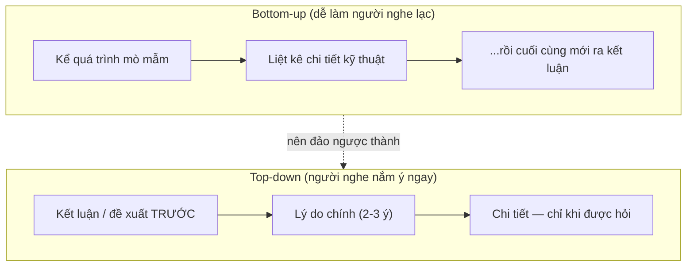

# Họp & giao tiếp trực tiếp — Standup, trình bày, lắng nghe

> **Tác giả:** Mr.Rom\
> **Phiên bản:** v1.0.0\
> **Tạo lúc:** 13/06/2026\
> **Cập nhật:** 13/06/2026\
> **Level:** Basic\
> **Tags:** communication, meetings, standup, presentation, active-listening, soft-skills, facilitation\
> **Yêu cầu trước:** [Giao tiếp async & viết](01_async-and-written-communication.md)

> 🎯 *Bài trước bạn đã học cách giao tiếp **async** — Slack, email, ticket, tài liệu — thứ không cần ai có mặt cùng lúc. Nhưng có những lúc bắt buộc phải gặp nhau **real-time**: standup mỗi sáng, buổi review, demo cho team, hay một cuộc họp gỡ vướng. Đây lại là nơi nhiều dev giỏi đánh mất điểm: họp lan man, standup biến thành buổi debug tập thể, trình bày ý tưởng rối như tơ vò, và quên sạch action item ngay khi tắt phòng họp. Bài này dạy bạn cách **họp ít mà chất**: biết khi nào một cuộc họp là không cần thiết, chuẩn bị agenda + mục tiêu rõ, làm standup đúng cách, trình bày mạch lạc kiểu top-down, lắng nghe chủ động, và theo dõi action item tới cùng. Kết bài bạn có một checklist họp và một cấu trúc standup dùng được ngay sáng mai.*

## 🎯 Sau bài này bạn sẽ

- [ ] Biết tự hỏi **"cuộc họp này có cần không, hay async được?"** trước khi đặt lịch
- [ ] Chuẩn bị một cuộc họp có **agenda + mục tiêu rõ** và phân **vai trò** (facilitator, note-taker)
- [ ] Làm **standup** đúng cách: ba câu gọn, không biến nó thành buổi giải quyết vấn đề
- [ ] Trình bày một ý tưởng **mạch lạc theo kiểu top-down** (kết luận trước, chi tiết sau)
- [ ] Thực hành **lắng nghe chủ động**: paraphrase, hỏi làm rõ, không cướp lời
- [ ] Nói trước nhóm / demo bớt run bằng vài kỹ thuật chuẩn bị đơn giản
- [ ] **Theo dõi action item** sau họp để cuộc họp tạo ra kết quả, không tan thành mây khói

---

## Tình huống — buổi họp một tiếng và không ai nhớ đã quyết gì

Sáng thứ Hai, lịch của bạn có một cuộc họp đề tên *"Sync nhanh về dự án"*. Không có agenda, không nói trước cần chuẩn bị gì. Tám người vào phòng. Người đặt lịch mở đầu *"Ờ thì mình họp để xem dự án sao rồi"*. Thế là mỗi người bắt đầu nói về phần của mình, lan man sang chuyện bên lề, hai người tranh luận về một chi tiết kỹ thuật mà sáu người còn lại ngồi nghe không liên quan. Một tiếng trôi qua.

Họp xong, bạn quay lại bàn làm việc và tự hỏi: *"Vừa rồi mình quyết được gì nhỉ? Ai làm gì tiếp theo?"*. Không ai ghi lại. Không có kết luận. Tuần sau, đúng vấn đề đó lại được lôi ra họp tiếp — vì lần trước "nói rồi mà chẳng đi tới đâu".

Đây là cảnh quen thuộc ở rất nhiều team. Họp nhiều nhưng không hiệu quả là một trong những thứ ngốn thời gian developer kinh khủng nhất — nó cắt vụn ngày làm việc, phá vỡ trạng thái tập trung (mỗi lần bị ngắt, quay lại flow rất tốn sức), và tệ nhất là **không tạo ra quyết định**.

Sự khác biệt giữa một cuộc họp tốt và một cuộc họp tệ không nằm ở chuyện họp dài hay ngắn. Nó nằm ở ba thứ rất cụ thể: cuộc họp đó **có thật sự cần gặp real-time không**, có **mục tiêu + agenda rõ không**, và có **kết quả được ghi lại + theo dõi không**. Bài này đi qua từng thứ một, cộng thêm các kỹ năng giao tiếp trực tiếp mà bạn dùng *bên trong* cuộc họp: trình bày, lắng nghe, và nói trước nhóm.

---

## 1️⃣ "Cuộc họp này có cần không?" — câu hỏi đầu tiên, quan trọng nhất

Trước khi học cách họp cho tốt, hãy học cách **không họp khi không cần**. Mỗi cuộc họp 1 tiếng với 6 người không tốn 1 tiếng — nó tốn 6 tiếng-người, cộng thêm chi phí ẩn: ai cũng phải dừng việc đang làm, mất trạng thái tập trung, rồi tốn thêm thời gian để quay lại. Cuộc họp là công cụ đắt tiền. Đắt thì phải dùng đúng chỗ.

🪞 **Ẩn dụ**: gọi một cuộc họp giống như **gọi cả đội cứu hoả tới hiện trường**. Khi có đám cháy thật (cần nhiều người phản ứng đồng thời, real-time), gọi đội cứu hoả là đúng. Nhưng nếu chỉ là *"cái bếp hơi bốc khói tí"* mà cũng hú còi gọi cả đội tới, bạn vừa lãng phí nguồn lực vừa làm phiền mọi người. Phần lớn "đám khói nhỏ" xử lý được bằng một tin nhắn async, không cần kéo còi.

### Phép thử: cái này async được không?

Phần lớn thứ người ta đem ra họp thật ra **giải quyết được bằng async** (Slack, ticket, tài liệu — đúng những thứ bài trước dạy). Trước khi đặt lịch, hãy chạy qua phép thử dưới đây. Cột bên trái là khi *nên* họp, cột bên phải là khi *nên async thay vì họp*:

| ✅ Nên họp (real-time) | 💬 Nên async (không cần họp) |
|---|---|
| Cần **thảo luận qua lại nhiều vòng** để ra quyết định (brainstorm, gỡ bế tắc) | Chỉ là **cập nhật trạng thái** một chiều ("tôi xong task A") |
| Chủ đề **nhạy cảm / dễ hiểu lầm** qua chữ (feedback cá nhân, xung đột) | Câu hỏi có **câu trả lời dứt khoát** ("API này dùng field nào?") |
| Cần **đồng thuận của nhiều người** ngay tại chỗ | Thông tin cần **lưu lại để tra cứu** sau (quyết định kiến trúc → ghi vào doc) |
| Vấn đề **mơ hồ**, chưa rõ phải hỏi gì (cần đào qua lại) | Việc một người **tự quyết được** sau khi đọc context |

> [!TIP]
> Một câu thần chú đáng dán lên màn hình trước khi đặt lịch họp: *"Cuộc họp này có thể là một tin nhắn không?"*. Nếu câu trả lời là "có" — hãy viết tin nhắn đó. Bạn sẽ tiết kiệm hàng giờ cho cả team và được nhớ tới như người tôn trọng thời gian người khác.

→ Quy tắc đọng lại: **họp là lựa chọn cuối cùng cho thứ async không kham nổi**, không phải phản xạ đầu tiên cho mọi vấn đề. Khi bạn đã chắc chắn cần họp thật, bước tiếp theo là làm cho nó đáng giá — bắt đầu từ khâu chuẩn bị.

---

## 2️⃣ Chuẩn bị — agenda, mục tiêu, và phân vai

Một cuộc họp tệ hầu như luôn là cuộc họp **không chuẩn bị**. Người ta nghĩ "cứ vào rồi nói" — nhưng vào rồi mới nghĩ thì cả phòng nghĩ cùng lúc, hỗn loạn. Chuẩn bị tốn vài phút của một người (người tổ chức), nhưng tiết kiệm hàng giờ của tất cả người còn lại.

🪞 **Ẩn dụ**: một cuộc họp không agenda giống **lái xe chở cả nhóm đi mà không biết đích đến**. Mỗi người hô một hướng, xe chạy lòng vòng, hết xăng vẫn chưa tới đâu. Agenda là **địa chỉ đích + lộ trình**: ai cũng biết đang đi đâu, qua những điểm nào, và khi nào thì tới nơi.

### Ba thứ một cuộc họp tốt bắt buộc có

Trước khi gửi lời mời họp, người tổ chức cần trả lời được ba câu. Thiếu bất kỳ câu nào, cuộc họp gần như chắc chắn trôi dạt:

- **Mục tiêu** — kết thúc cuộc họp, ta cần đạt được *điều gì cụ thể*? Không phải "bàn về X" (mơ hồ), mà "**quyết định** chọn thư viện nào cho X", hay "**thống nhất** scope của sprint tới". Mục tiêu là một kết quả, không phải một chủ đề.
- **Agenda** — các mục cần đi qua, theo thứ tự, kèm thời lượng dự kiến cho mỗi mục. Agenda giúp giữ cuộc họp không sa lầy vào một điểm.
- **Người tham dự đúng** — chỉ mời người *cần* có mặt. Mỗi người thừa là một chi phí và một nguồn gây lạc đề. Người chỉ "cần biết kết quả" thì gửi note sau, không cần mời vào họp.

### Mẫu lời mời họp có agenda

Một lời mời họp tốt cho người được mời biết trước họ vào để làm gì và cần chuẩn bị gì. So với câu *"Sync nhanh về dự án"* ở đầu bài, mẫu dưới đây khác hẳn về độ rõ ràng:

```text
Tiêu đề: [Quyết định] Chọn thư viện biểu đồ cho trang dashboard

Mục tiêu: Kết thúc buổi, chốt được 1 thư viện biểu đồ để bắt đầu code tuần sau.

Thời lượng: 30 phút.

Người cần có mặt: 2 dev frontend, 1 designer, 1 PM.

Agenda:
  1. (5')  Bối cảnh: vì sao cần chọn lại — link tài liệu so sánh đính kèm.
  2. (15') Bàn 3 ứng viên: ưu/nhược từng cái (đã tóm tắt trong doc).
  3. (5')  Chốt lựa chọn + lý do.
  4. (5')  Phân ai làm gì tiếp theo.

Chuẩn bị trước: đọc doc so sánh (5 phút) trước khi vào họp.
```

→ Để ý hai chi tiết quan trọng: tiêu đề có nhãn **[Quyết định]** nên ai cũng biết đây là họp để chốt (không phải họp để "tâm sự"), và dòng **"Chuẩn bị trước"** giúp mọi người vào họp đã có context — không tốn 15 phút đầu để giải thích lại từ đầu. Một cuộc họp mà mọi người đọc trước thường ngắn hơn một nửa.

### Vai trò trong cuộc họp — facilitator và note-taker

Cuộc họp đông người mà không ai cầm trịch thì giống như trận đấu không trọng tài. Hai vai trò tối thiểu nên có, đặc biệt khi họp từ 4 người trở lên:

| Vai trò | Làm gì | Vì sao cần |
|---|---|---|
| **Facilitator** (người điều phối) | Giữ cuộc họp bám agenda, cắt lạc đề ("ý này hay nhưng để ngoài lề bàn sau nhé"), đảm bảo người ít nói cũng được lên tiếng, canh thời gian | Không có người này, cuộc họp trôi dạt và người nói to lấn át người nói nhỏ |
| **Note-taker** (người ghi chú) | Ghi lại **quyết định** và **action item** (ai làm gì, hạn nào), không cần ghi từng lời | Không có người này, họp xong không ai nhớ đã quyết gì — đúng bi kịch đầu bài |

> [!IMPORTANT]
> Hai vai trò này **không nên là cùng một người với người trình bày chính**. Khó mà vừa hăng say trình bày ý tưởng vừa tỉnh táo canh giờ và ghi chú đầy đủ. Ở team nhỏ, có thể luân phiên: hôm nay bạn điều phối, mai người khác. Việc luân phiên cũng giúp mọi người học kỹ năng điều phối.

→ Chuẩn bị xong, agenda rõ, vai trò phân xong — giờ là lúc bước vào loại cuộc họp đặc biệt nhất mà gần như mọi dev đều dự hằng ngày: standup.

---

## 3️⃣ Standup đúng cách — ba câu, và đừng giải quyết vấn đề ở đây

**Standup** (họp đứng, hay daily standup) là cuộc họp ngắn hằng ngày của team, thường vào đầu ngày. Cái tên "đứng" có lý do: ban đầu người ta đứng họp để buổi họp **buộc phải ngắn** — đứng mỏi chân thì không ai muốn nói dài. Mục đích của standup không phải để báo cáo cho sếp, mà để cả team **đồng bộ nhanh** với nhau: ai đang làm gì, có ai bị kẹt cần giúp không.

🪞 **Ẩn dụ**: standup giống cảnh **một đội đua thuyền hô nhịp trước khi chèo**. Mục đích chỉ là để cả đội chèo cùng nhịp, biết ai ở vị trí nào, ai đang đuối cần hỗ trợ. Nó **không phải** lúc dừng thuyền lại giữa dòng để sửa mái chèo gãy — việc sửa chữa đó làm sau, ở một góc riêng, với đúng người liên quan, không bắt cả đội ngồi chờ.

### Cấu trúc ba câu

Phần phát biểu của mỗi người trong standup nên gói gọn trong **ba câu**, trả lời ba câu hỏi kinh điển:

1. **Hôm qua tôi làm gì?** — tóm tắt việc đã xong, không kể chi tiết kỹ thuật.
2. **Hôm nay tôi định làm gì?** — việc sẽ làm trong ngày.
3. **Tôi có bị chặn (blocker) gì không?** — có thứ gì cản tôi tiến tiếp không, ai gỡ giúp được.

Đây là phần dễ kể lể nhất, nên hãy xem một ví dụ before/after để thấy khác biệt. Cùng một người, cùng một ngày:

```text
❌ Lan man (gần 2 phút, cả team mất kiên nhẫn):
"Ờ hôm qua mình làm cái trang login, à mà cái này hơi rắc rối vì cái
thư viện auth nó bản mới đổi API, mình loay hoay mãi, lúc đầu tưởng do
config nhưng hoá ra do version, rồi mình thử cách A không được, cách B
cũng không, mãi mới ra... à nay chắc làm tiếp, mà cũng chưa chắc vì còn
tuỳ cái kia..."

✅ Gọn theo ba câu (20 giây):
"Hôm qua: xong màn hình login.
 Hôm nay: làm màn hình quên mật khẩu.
 Blocker: cần quyền truy cập email service để test gửi mail — ai cấp được
 cho mình sau buổi này nhé?"
```

→ Bản gọn truyền đạt **chính xác thứ team cần biết** trong 20 giây: đã xong gì, sắp làm gì, đang kẹt gì. Cái mớ chi tiết "thư viện đổi API, thử cách A cách B" ở bản lan man không sai — nó chỉ **không thuộc về standup**. Nó thuộc về một cuộc trò chuyện riêng với người liên quan.

### Quy tắc vàng: KHÔNG giải quyết vấn đề trong standup

Đây là lỗi phổ biến nhất phá hỏng standup. Ai đó nêu một blocker, lập tức hai người nhảy vào bàn cách sửa, một cuộc tranh luận kỹ thuật 15 phút nổ ra — trong khi tám người khác đứng ngó, vì vấn đề đó chẳng liên quan tới họ. Standup từ 5 phút phình thành 30 phút, và mọi người bắt đầu sợ standup.

Cách xử lý đúng khi một blocker xuất hiện: **ghi nhận, rồi hẹn bàn riêng sau standup** — đúng người liên quan ở lại, những người khác giải tán.

```text
A: "...Blocker: API thanh toán trả về sai mã lỗi, mình chưa rõ tại sao."
Facilitator: "OK, ghi nhận. Cái này B và A bàn riêng sau standup nhé,
              không cần cả team. Tiếp theo, tới lượt C..."
```

> [!WARNING]
> Cụm từ cứu standup mà mọi facilitator nên thuộc lòng: **"Cái này mình take offline nhé"** (tức là "bàn riêng sau, ngoài standup"). Mỗi khi một cuộc thảo luận chỉ liên quan 2-3 người bắt đầu kéo dài, hãy dùng câu này để cắt và hẹn bàn riêng. Nó giữ standup ngắn và giữ sự tôn trọng với thời gian của những người không liên quan.

→ Standup là cái nhịp đồng bộ ngắn ngủi. Còn khi bạn thật sự phải đứng lên trình bày một ý tưởng dài hơi hơn — một đề xuất kiến trúc, một bài demo — thì cần một kỹ năng khác: trình bày mạch lạc.

---

## 4️⃣ Trình bày ý tưởng mạch lạc — top-down, kết luận trước

Nhiều dev trình bày ý tưởng theo đúng cách họ *khám phá* ra nó: kể lể từ đầu — *"đầu tiên mình thử cái này, rồi gặp vấn đề kia, rồi mình đọc được bài blog nọ, rồi mình nghĩ..."* — và mãi tới cuối mới chốt *"...nên mình đề xuất dùng X"*. Người nghe phải đi hết hành trình dài mới biết đích đến, và thường lạc lối giữa đường.

🪞 **Ẩn dụ**: trình bày tốt giống cách viết một **bài báo**, không phải một cuốn tiểu thuyết trinh thám. Bài báo đặt kết luận quan trọng nhất ngay ở **tít và câu đầu** (*"Đội tuyển thắng 2-0"*), rồi mới khai triển chi tiết bên dưới cho ai muốn đọc sâu. Tiểu thuyết trinh thám thì giấu thủ phạm tới trang cuối — hấp dẫn cho giải trí, nhưng tai hoạ cho công việc, vì sếp bạn không có thời gian đọc tới trang cuối.

### Cấu trúc top-down (kim tự tháp)

**Top-down** nghĩa là: nói **kết luận / đề xuất trước**, rồi mới tới **lý do**, rồi mới tới **chi tiết** nếu người nghe cần. Đây là cách trình bày tôn trọng thời gian người nghe nhất — họ nắm được ý chính ngay câu đầu, và tự quyết định có cần nghe sâu hơn không.

Đây là khái niệm trừu tượng nhất của bài, nên ta hình dung nó qua sơ đồ. Sơ đồ dưới so sánh hai cách trình bày cùng một ý tưởng — một cái dẫn dắt lòng vòng (bottom-up), một cái đi thẳng vào kết luận (top-down):



→ Điểm cốt lõi của sơ đồ: mũi tên ở nhánh top-down đi **từ kết luận xuống chi tiết**, không phải ngược lại. Người nghe biết "đích đến" ngay từ câu đầu, nên mọi chi tiết sau đó họ nghe đều có chỗ để gắn vào. Còn bottom-up bắt người nghe ôm một đống chi tiết rời rạc mà chưa biết để làm gì — rất dễ rơi rụng.

### Before / after — cùng một đề xuất

Hãy xem cùng một ý tưởng được trình bày hai cách. Tình huống: bạn muốn đề xuất team chuyển sang dùng một công cụ CI mới.

```text
❌ Bottom-up (người nghe phải chờ tới cuối mới hiểu bạn muốn gì):
"Ừm, tuần trước build của tụi mình fail mấy lần, mình đi tìm hiểu thì
thấy cái config hiện tại nó cũ, rồi mình đọc được là nhiều team dùng cái
công cụ kia, mình thử cài thử ở nhánh riêng, chạy cũng ổn, tốc độ có vẻ
nhanh hơn, à mà còn có cả tính năng cache nữa... nên là, ờ, mình nghĩ
mình nên đổi sang công cụ đó."

✅ Top-down (kết luận ngay câu đầu):
"Mình đề xuất team chuyển CI sang công cụ X. (KẾT LUẬN)

 Ba lý do chính: (LÝ DO)
 1. Build nhanh hơn khoảng một nửa nhờ cache thông minh.
 2. Config gọn hơn, dễ bảo trì hơn cái hiện tại đang cũ.
 3. Mình đã thử ở nhánh riêng, chạy ổn định.

 Mình có sẵn số liệu so sánh và bản demo nếu mọi người muốn xem chi tiết." (CHI TIẾT — khi được hỏi)
```

→ Trong bản top-down, ngay câu đầu người nghe đã biết bạn muốn gì và bắt đầu suy nghĩ về nó. Ba lý do được đánh số nên dễ theo dõi và dễ phản biện từng cái. Phần chi tiết được "treo" lại — ai quan tâm thì hỏi, ai không thì đã đủ thông tin để quyết. Cùng một nội dung, nhưng bản top-down giúp người nghe ra quyết định nhanh hơn nhiều.

> [!TIP]
> Một mẹo luyện top-down: trước khi trình bày, tự ép mình tóm cả ý tưởng vào **một câu duy nhất** bắt đầu bằng *"Mình đề xuất..."* hoặc *"Kết luận là..."*. Nếu bạn không tóm được vào một câu, tức là bản thân bạn cũng chưa rõ mình muốn nói gì — và người nghe lại càng không. Câu đó chính là câu mở đầu của bạn.

---

## 5️⃣ Lắng nghe chủ động — kỹ năng bị xem nhẹ nhất

Giao tiếp không chỉ là nói cho hay. Một nửa của giao tiếp là **nghe** — và đây là phần nhiều dev xem nhẹ. Trong khi người khác nói, ta hay bận **nghĩ câu phản bác** thay vì thật sự nghe; ta cướp lời khi nghĩ mình đã hiểu; ta gật gù nhưng đầu đang ở chỗ khác. Kết quả: hiểu sai ý nhau, làm sai việc, và người nói cảm thấy không được tôn trọng.

🪞 **Ẩn dụ**: lắng nghe chủ động giống một **tổng đài viên xác nhận lại đơn hàng**. Sau khi khách đọc địa chỉ, tổng đài viên giỏi không "ờ ờ vâng vâng" rồi cúp máy — họ **đọc lại**: *"Vậy là em giao tới số 12 đường ABC, đúng không ạ?"*. Một câu đọc lại đó bắt được lỗi nghe nhầm ngay trước khi giao sai hàng đi cả thành phố. Trong công việc, một câu paraphrase cũng cứu bạn khỏi làm sai cả một feature.

### Hai công cụ cốt lõi: paraphrase và hỏi làm rõ

Lắng nghe chủ động (active listening) không phải là ngồi im gật đầu. Nó là **nghe để hiểu, rồi chứng minh là mình đã hiểu**. Hai công cụ chính:

- **Paraphrase** (diễn đạt lại) — sau khi người kia nói xong một ý quan trọng, bạn nói lại bằng lời của mình: *"Để mình xem mình hiểu đúng chưa: ý anh là ta nên ưu tiên sửa bug thanh toán trước, dời feature mới sang sprint sau, đúng không?"*. Việc này làm hai điều: bắt được hiểu lầm sớm, và cho người nói thấy bạn thật sự lắng nghe.
- **Hỏi làm rõ** (clarifying question) — khi có chỗ mơ hồ, hỏi thay vì tự đoán: *"Khi anh nói 'sớm', anh hình dung là trong tuần này hay trong hôm nay?"*. Câu hỏi làm rõ biến một yêu cầu mờ thành một yêu cầu rõ — tránh việc bạn làm xong mới biết hiểu sai.

Bảng dưới đối chiếu phản xạ kém với phản xạ lắng nghe chủ động trong vài tình huống thường gặp:

| Tình huống | ❌ Phản xạ kém | ✅ Lắng nghe chủ động |
|---|---|---|
| Người kia đang nói dở | Cắt lời: "À biết rồi, ý là..." | Để họ nói hết, rồi mới phản hồi |
| Nghe một yêu cầu mơ hồ | Tự đoán ý rồi làm | Hỏi làm rõ: "Cụ thể là gì ạ?" |
| Nghe xong một quyết định quan trọng | Gật đầu "ok ok" | Paraphrase: "Vậy là ta chốt X, đúng không?" |
| Không đồng ý với người nói | Phản bác ngay khi họ chưa dứt câu | Nghe hết, xác nhận đã hiểu, rồi mới nêu góc nhìn khác |

> [!NOTE]
> Lắng nghe chủ động đặc biệt quan trọng khi họp online. Qua màn hình, bạn mất phần lớn ngôn ngữ cơ thể, và độ trễ mạng khiến việc cướp lời dễ xảy ra hơn. Một câu paraphrase ngắn cuối mỗi ý lớn giúp cả nhóm chắc chắn đang hiểu giống nhau — bù lại phần tín hiệu bị mất qua màn hình.

→ Nghe tốt và nói rõ là hai mặt của giao tiếp trong phòng họp. Nhưng có một rào cản cảm xúc khiến nhiều người không thể hiện được kỹ năng mình có: nỗi sợ khi phải nói trước nhóm. Ta gỡ nó tiếp.

---

## 6️⃣ Nói trước nhóm / demo bớt run — vài kỹ thuật đơn giản

Run khi nói trước nhiều người là chuyện **hoàn toàn bình thường** — gần như ai cũng có, kể cả người trông rất tự tin. Tin tốt: bớt run không cần năng khiếu bẩm sinh, nó là kỹ năng luyện được bằng vài kỹ thuật cụ thể. Cảm giác run xuất phát chủ yếu từ một thứ: **sợ điều bất ngờ** (quên mất ý, demo lỗi, bị hỏi câu khó). Phần lớn kỹ thuật dưới đây thực chất là cách **loại bỏ những bất ngờ đó** từ trước.

🪞 **Ẩn dụ**: chuẩn bị cho một buổi nói/demo giống **phi công chạy checklist trước khi cất cánh**. Phi công không "tự tin bẩm sinh" nên không sợ — họ bình tĩnh vì đã kiểm tra mọi thứ theo danh sách, nên rất ít chỗ cho bất ngờ. Bạn cũng vậy: càng kiểm tra kỹ trước, càng ít chỗ cho cái run.

### Kỹ thuật trước buổi nói

Phần lớn sự tự tin được xây *trước khi* bạn mở miệng, không phải lúc đang nói. Vài việc đáng làm:

1. **Tập nói thành tiếng**, ít nhất một lần — không chỉ đọc thầm trong đầu. Nói thành tiếng phơi bày những chỗ vấp mà đọc thầm giấu đi, và giúp bạn quen với giọng mình.
2. **Chuẩn bị câu mở đầu thật kỹ** — học gần như thuộc câu đầu tiên. Phần run nhất luôn là 30 giây đầu; vượt qua được nó thì phần sau trôi chảy hẳn.
3. **Với demo: luôn có phương án dự phòng** — quay sẵn một video/ảnh chụp màn hình của demo chạy đúng. Nếu demo live lỗi (mạng, môi trường), bạn vẫn có thứ để trình bày thay vì đứng hình. *Demo lỗi giữa chừng là nỗi sợ số một, và bản ghi dự phòng xoá tan nó.*
4. **Lường trước 2-3 câu hỏi khó** và chuẩn bị sẵn câu trả lời. Bị hỏi câu đã lường trước cho cảm giác chủ động hẳn.

### Kỹ thuật trong lúc nói

Khi đã đứng trước nhóm, vài thói quen nhỏ giúp giữ bình tĩnh:

1. **Thở chậm trước khi bắt đầu** — một hơi thở sâu hạ nhịp tim, giọng đỡ run.
2. **Nói chậm hơn bạn nghĩ là cần** — khi hồi hộp, ai cũng có xu hướng nói nhanh vọt. Cố tình nói chậm lại nghe tự tin hơn và giúp người nghe theo kịp.
3. **Không sao nếu cần dừng một nhịp** — im lặng vài giây để nhìn lại note còn tốt hơn là lấp đầy bằng "ờ... à... ừm...".
4. **Nếu bí, thành thật** — *"Câu này hay, mình cần kiểm tra lại rồi trả lời chính xác sau nhé"* tốt hơn nhiều so với bịa một câu trả lời sai. Không ai chê người nói "để mình check lại"; người ta chỉ mất niềm tin vào người bịa.

> [!TIP]
> Cách giảm run hiệu quả nhất về lâu dài là **tích luỹ số lần nói**. Bắt đầu từ sân khấu nhỏ: phát biểu trong standup, trình bày một ý nhỏ trong họp team, demo một feature cho 2-3 người. Mỗi lần là một liều "vaccine" cho nỗi sợ. Đợi tới buổi nói lớn mới tập thì đã muộn.

---

## 7️⃣ Sau cuộc họp — action item, nếu không cuộc họp là vô nghĩa

Đây là phần bị bỏ quên nhiều nhất, và là lý do số một khiến cuộc họp đầu bài thất bại. Một cuộc họp dù chuẩn bị tốt, thảo luận hay tới đâu, mà **không sinh ra action item rõ ràng và không ai theo dõi** thì cũng vô nghĩa — vì không có gì *xảy ra* sau đó. Quyết định nằm trong đầu mọi người sẽ bốc hơi trong vài giờ.

🪞 **Ẩn dụ**: kết thúc cuộc họp mà không có action item giống **đi chợ về tay không vì quên mua gì**. Bạn đã bỏ công đi (họp), đi lòng vòng cả khu chợ (thảo luận), nhưng về nhà mở tủ lạnh vẫn trống không — vì không chốt "mua món gì, ai mua, khi nào". Action item chính là cái giỏ đồ bạn mang về.

### Một action item tốt gồm ba phần

Một dòng action item mơ hồ kiểu *"cần xem lại cái API"* gần như vô dụng — ai xem? bao giờ? Một action item dùng được luôn có đủ ba thứ:

- **Việc gì** — hành động cụ thể, có động từ rõ ("viết tài liệu", "sửa bug X", "hỏi team Y").
- **Ai làm** — một người chịu trách nhiệm, không phải "cả team" (việc của tất cả là việc của không ai).
- **Hạn nào** — một mốc thời gian, dù chỉ là "trước họp tuần sau".

Cuối mỗi cuộc họp, facilitator nên dành 2 phút **đọc lại các action item** cho cả phòng xác nhận. Note-taker ghi lại và gửi ra kênh chung (đúng tinh thần async của bài trước — để ai cũng tra được). Mẫu note sau họp gọn gàng:

```text
Note họp: Chọn thư viện biểu đồ — 13/06/2026

✅ Quyết định:
- Chọn thư viện X cho trang dashboard (lý do: nhẹ, hợp với stack hiện tại).

📋 Action item:
- [ ] Bạn A — dựng khung tích hợp X vào dashboard — trước thứ Sáu tuần này.
- [ ] Bạn B — viết doc hướng dẫn dùng X cho team — trước họp tuần sau.
- [ ] PM — cập nhật ticket trên bảng để phản ánh quyết định — trong hôm nay.

❓ Treo lại (bàn sau):
- Có cần chuẩn hoá thư viện này cho cả các trang khác không — bàn ở họp kiến trúc.
```

→ Note này biến một giờ thảo luận thành ba việc cụ thể có người và có hạn. Tuần sau, chỉ cần mở note ra là kiểm tra được việc nào xong, việc nào chưa — không còn cảnh "họp lại từ đầu vì lần trước chẳng đi tới đâu". **Theo dõi action item ở buổi họp kế tiếp** (điểm lại các checkbox) là vòng khép kín giúp cuộc họp thật sự tạo ra kết quả.

---

## 💡 Cạm bẫy thường gặp & Best practice

### ❌ Cạm bẫy: họp khi một tin nhắn là đủ

- **Triệu chứng**: đặt lịch họp cho mọi thứ, kể cả những việc chỉ là cập nhật một chiều hay một câu hỏi có câu trả lời dứt khoát. Lịch cả team kín mít, không còn thời gian làm việc sâu.
- **Nguyên nhân**: coi họp là phản xạ đầu tiên, ngại viết cho rõ ràng nên "thôi gọi nhau ra nói cho nhanh" (mà thực ra chậm cho 6 người).
- **Cách tránh**: chạy phép thử "cái này async được không?" trước khi đặt lịch. Phần lớn cập nhật trạng thái, câu hỏi dứt khoát, thông tin cần lưu trữ đều nên async.

### ❌ Cạm bẫy: standup biến thành buổi debug tập thể

- **Triệu chứng**: ai đó nêu blocker, hai người nhảy vào bàn cách sửa 15 phút, tám người còn lại đứng ngó. Standup 5 phút phình thành nửa tiếng, mọi người bắt đầu sợ standup.
- **Nguyên nhân**: nhầm standup (đồng bộ nhanh) với buổi giải quyết vấn đề (deep dive). Không có ai cắt khi thảo luận đi sâu.
- **Cách tránh**: giữ ba câu cho mỗi người; khi một blocker cần đào sâu, facilitator nói "cái này take offline nhé" và hẹn đúng người bàn riêng sau standup.

### ❌ Cạm bẫy: trình bày bottom-up, giấu kết luận tới cuối

- **Triệu chứng**: kể cả hành trình mò mẫm từ đầu, mãi câu cuối mới chốt đề xuất. Người nghe lạc giữa chừng, hỏi "rốt cuộc bạn muốn gì?".
- **Nguyên nhân**: trình bày theo đúng thứ tự mình *khám phá* ra ý tưởng, thay vì thứ tự người nghe *cần nghe*.
- **Cách tránh**: nói kết luận/đề xuất trước (top-down), rồi lý do (2-3 ý đánh số), rồi chi tiết chỉ khi được hỏi. Tự ép tóm ý tưởng vào một câu "Mình đề xuất..." làm câu mở đầu.

### ✅ Best practice: mọi cuộc họp có mục tiêu, agenda, và action item

- **Vì sao**: ba thứ này là khung xương biến một cuộc tụ tập thành một cuộc họp tạo kết quả. Mục tiêu cho biết đi đâu, agenda cho biết đi thế nào, action item cho biết sau đó ai làm gì.
- **Cách áp dụng**: trước họp, viết lời mời có mục tiêu + agenda + chuẩn bị trước. Trong họp, phân facilitator + note-taker. Sau họp, gửi note có quyết định + action item (việc / ai / hạn) ra kênh chung và theo dõi ở buổi kế.

### ✅ Best practice: paraphrase để xác nhận đã hiểu đúng

- **Vì sao**: hiểu lầm trong giao tiếp trực tiếp rất dễ xảy ra và rất tốn — bạn có thể làm sai cả một feature vì nghe nhầm một yêu cầu. Một câu diễn đạt lại bắt lỗi ngay tại chỗ.
- **Cách áp dụng**: sau mỗi quyết định hay yêu cầu quan trọng, nói lại bằng lời của mình: *"Để mình xác nhận: ta chốt X, mình làm Y trước thứ Sáu, đúng không?"*. Có chỗ mờ thì hỏi làm rõ thay vì tự đoán.

---

## 🧠 Tự kiểm tra (Self-check)

**Q1.** Bạn định đặt lịch họp 30 phút với 5 người chỉ để thông báo *"feature A đã xong, tuần sau chuyển sang feature B"*. Đây có phải lý do tốt để họp không? Nếu không, nên làm gì?

<details>
<summary>💡 Xem giải thích</summary>

Không. Đây là **cập nhật trạng thái một chiều** — đúng loại thông tin nên đi async. Một tin nhắn ngắn trên kênh chung là đủ, và còn tốt hơn ở chỗ nó **lưu lại để tra cứu** sau (họp thì nói xong là bay). Cuộc họp 30 phút x 5 người tốn 2,5 tiếng-người cho thứ một tin nhắn 30 giây làm được.

Phép thử "cái này async được không?" loại ngay tình huống này về phía async: không cần thảo luận qua lại, không nhạy cảm, không cần đồng thuận tại chỗ, có câu trả lời dứt khoát. Họp nên dành cho thứ async không kham nổi (brainstorm, gỡ bế tắc cần qua lại nhiều vòng, chủ đề nhạy cảm), không phải cho thông báo.

</details>

**Q2.** Trong standup, một thành viên nói: *"Blocker của em là API thanh toán trả sai mã lỗi, em chưa rõ nguyên nhân"*. Bạn (người liên quan) lập tức muốn bàn cách debug ngay. Có nên không? Vì sao?

<details>
<summary>💡 Xem giải thích</summary>

**Không nên bàn ngay trong standup.** Standup là buổi **đồng bộ nhanh**, không phải buổi giải quyết vấn đề. Nếu bạn và người đó lao vào debug 15 phút, cả team còn lại phải đứng nghe một vấn đề không liên quan tới họ — standup phình ra và mọi người chán.

Cách đúng: **ghi nhận blocker, rồi take offline** — tức là hẹn bàn riêng ngay sau standup, chỉ hai người liên quan ở lại, những người khác giải tán. Standup giữ được sự ngắn gọn, mà blocker vẫn được xử lý đúng người, đúng độ sâu.

</details>

**Q3.** Bạn muốn đề xuất team đổi sang một thư viện mới. Bạn định mở đầu bằng *"Tuần trước mình gặp vấn đề X, rồi mình tìm hiểu Y, rồi thử Z..."*. Theo nguyên tắc top-down, nên đổi cách mở đầu thế nào?

<details>
<summary>💡 Xem giải thích</summary>

Cách mở đầu trên là **bottom-up** — giấu kết luận tới cuối, bắt người nghe đi hết hành trình mò mẫm mới biết bạn muốn gì. Người nghe dễ lạc và sốt ruột.

Theo **top-down**, hãy nói **kết luận/đề xuất ngay câu đầu**: *"Mình đề xuất team chuyển sang thư viện X."*. Rồi mới tới **lý do chính** (2-3 ý, đánh số để dễ theo dõi), rồi để **chi tiết** (số liệu, demo) treo lại — ai quan tâm thì hỏi. Mẹo: trước khi nói, tự ép tóm cả ý tưởng vào một câu bắt đầu bằng "Mình đề xuất..." — đó chính là câu mở đầu của bạn.

</details>

**Q4.** Sếp giao bạn một việc và nói *"cái này làm sớm nhé"*. Bạn gật đầu "vâng ạ" rồi về làm. Theo lắng nghe chủ động, đáng ra nên phản hồi thế nào?

<details>
<summary>💡 Xem giải thích</summary>

"Sớm" là một từ **mơ hồ** — có thể là "trong hôm nay", "trong tuần này", hay "khi rảnh". Gật đầu rồi tự đoán dễ dẫn tới làm sai kỳ vọng (bạn nghĩ "tuần này", sếp nghĩ "hôm nay").

Theo lắng nghe chủ động, nên **hỏi làm rõ**: *"Khi anh nói 'sớm', anh hình dung là trong hôm nay hay trong tuần này ạ?"*. Và với việc quan trọng, **paraphrase** lại cả yêu cầu để chắc chắn hiểu đúng: *"Vậy là mình làm X, ưu tiên trước việc Y đang làm, xong trong hôm nay — đúng không ạ?"*. Một câu hỏi/diễn đạt lại ngắn tránh được việc làm sai cả một task.

</details>

**Q5.** Một cuộc họp một tiếng vừa kết thúc với rất nhiều thảo luận sôi nổi, nhưng không ai ghi gì lại và cũng không chốt ai làm gì tiếp. Khả năng cao điều gì sẽ xảy ra, và lẽ ra nên làm gì ở cuối họp?

<details>
<summary>💡 Xem giải thích</summary>

Khả năng cao: trong vài giờ, mọi người **quên sạch** đã quyết gì, không ai làm gì tiếp, và **tuần sau đúng vấn đề đó lại được lôi ra họp lại** — cuộc họp tạo ra cảm giác "đã làm việc" nhưng thực chất vô nghĩa vì không có gì xảy ra sau đó.

Lẽ ra ở cuối họp, **facilitator dành 2 phút đọc lại action item** cho cả phòng xác nhận, và **note-taker ghi + gửi note ra kênh chung**. Mỗi action item phải đủ ba phần: **việc gì / ai làm / hạn nào** (không phải "cả team xem lại" — việc của tất cả là việc của không ai). Buổi họp kế tiếp điểm lại các checkbox đó để khép vòng — đảm bảo việc thật sự được làm.

</details>

---

## ⚡ Tra cứu nhanh (Cheatsheet)

### Phép thử trước khi đặt lịch họp

| Hỏi | Nếu "có" |
|---|---|
| Chỉ là cập nhật một chiều? | → async (tin nhắn), không họp |
| Có câu trả lời dứt khoát? | → async, không họp |
| Cần lưu để tra cứu sau? | → viết doc/ticket, không họp |
| Cần thảo luận qua lại nhiều vòng / đồng thuận tại chỗ / chủ đề nhạy cảm? | → họp real-time |

### Checklist cuộc họp (trước / trong / sau)

**Trước họp:**
- [ ] Có **mục tiêu** rõ (một kết quả cụ thể, không phải "bàn về X")?
- [ ] Có **agenda** (các mục + thời lượng)?
- [ ] Mời **đúng người** (chỉ ai cần có mặt)?
- [ ] Nêu rõ **cần chuẩn bị gì** trước khi vào?

**Trong họp:**
- [ ] Có **facilitator** giữ bám agenda + canh giờ?
- [ ] Có **note-taker** ghi quyết định + action item?
- [ ] Cắt lạc đề bằng "cái này take offline nhé"?

**Sau họp:**
- [ ] Đọc lại **action item** cho cả phòng xác nhận?
- [ ] Gửi **note** (quyết định + action item) ra kênh chung?
- [ ] **Theo dõi** action item ở buổi họp kế tiếp?

### Cấu trúc standup (3 câu mỗi người)

| Câu | Nội dung |
|---|---|
| 1 | Hôm qua tôi làm gì? |
| 2 | Hôm nay tôi định làm gì? |
| 3 | Tôi có blocker gì không? (ai gỡ giúp được) |

→ Quy tắc vàng: **không giải quyết vấn đề trong standup** — blocker thì "take offline".

### Action item phải đủ 3 phần

| Phần | Ví dụ |
|---|---|
| **Việc gì** (động từ rõ) | "viết doc hướng dẫn dùng X" |
| **Ai làm** (một người) | "Bạn B" — không phải "cả team" |
| **Hạn nào** | "trước họp tuần sau" |

### Trình bày top-down + lắng nghe chủ động

- **Top-down:** kết luận/đề xuất TRƯỚC → lý do (2-3 ý đánh số) → chi tiết khi được hỏi.
- **Paraphrase:** "Để mình xác nhận: ta chốt X, đúng không?"
- **Hỏi làm rõ:** "Khi anh nói 'sớm' là hôm nay hay tuần này ạ?"
- **Demo bớt run:** tập nói thành tiếng + thuộc câu mở đầu + có bản ghi dự phòng + lường 2-3 câu hỏi khó.

---

## 📚 Từ Điển Thuật Ngữ (Glossary)

| EN | VN | Giải thích |
|---|---|---|
| Meeting | Cuộc họp | Buổi gặp real-time để thảo luận/quyết định; đắt vì tốn thời gian nhiều người |
| Async (asynchronous) | Bất đồng bộ | Giao tiếp không cần mọi người có mặt cùng lúc (Slack, email, ticket) |
| Agenda | Chương trình họp | Danh sách các mục cần đi qua trong họp, kèm thời lượng |
| Facilitator | Người điều phối | Người giữ cuộc họp bám agenda, canh giờ, cắt lạc đề |
| Note-taker | Người ghi chú | Người ghi lại quyết định và action item trong họp |
| Standup | Họp đứng hằng ngày | Cuộc họp ngắn đầu ngày để team đồng bộ nhanh (ai làm gì, có blocker không) |
| Daily standup | Standup hằng ngày | Tên đầy đủ của standup; "đứng" để buổi họp buộc phải ngắn |
| Blocker | Điểm chặn | Thứ cản trở bạn tiến tiếp, cần ai đó/việc gì đó gỡ |
| Take offline | Bàn riêng sau | Hẹn thảo luận một vấn đề ngoài cuộc họp chung, với đúng người liên quan |
| Top-down | Từ trên xuống | Cách trình bày: nói kết luận trước, rồi lý do, rồi chi tiết |
| Bottom-up | Từ dưới lên | Cách trình bày ngược: kể chi tiết/quá trình trước, kết luận sau (dễ làm lạc) |
| Active listening | Lắng nghe chủ động | Nghe để hiểu rồi chứng minh đã hiểu (paraphrase, hỏi làm rõ) |
| Paraphrase | Diễn đạt lại | Nói lại ý người kia bằng lời mình để xác nhận hiểu đúng |
| Clarifying question | Câu hỏi làm rõ | Câu hỏi để xoá chỗ mơ hồ thay vì tự đoán |
| Action item | Việc cần làm sau họp | Một việc cụ thể: việc gì / ai làm / hạn nào |
| Demo | Trình diễn | Buổi cho người khác xem sản phẩm/tính năng chạy thật |

---

## 🔗 Liên kết & Tài nguyên

⬅️ **Bài trước:** [Giao tiếp async & viết — Slack, email, ticket, tài liệu](01_async-and-written-communication.md)\
➡️ **Bài tiếp theo:** [Phản hồi & xử lý bất đồng — Code review không làm tổn thương](03_feedback-and-conflict.md)\
↑ **Về cụm:** [communication — README](../../README.md)

### 🧭 Định hướng lộ trình học

- [Vì sao giao tiếp quyết định sự nghiệp dev](00_why-communication-matters.md) — bức tranh tổng vì sao kỹ năng giao tiếp đáng đầu tư, nền cho cả cụm
- [Giao tiếp async & viết — Slack, email, ticket, tài liệu](01_async-and-written-communication.md) — họp ít hơn được phần lớn là nhờ làm async tốt; hai bài bổ trợ nhau

### 🧩 Các chủ đề có thể bạn quan tâm

- [Phản hồi & xử lý bất đồng — Code review không làm tổn thương](03_feedback-and-conflict.md) — kỹ năng nói/nghe trong bài này là nền cho việc đưa và nhận phản hồi
- [Giao tiếp với stakeholder & người non-tech](04_communicating-with-stakeholders.md) — trình bày top-down đặc biệt quan trọng khi nói với người không rành kỹ thuật
- [Behavioral Interview & STAR — Kể chuyện thuyết phục](../../../interview-prep/lessons/01_basic/03_behavioral-interview-and-star.md) — kỹ năng kể chuyện mạch lạc cũng quyết định ở vòng phỏng vấn hành vi

### 🌐 Tài nguyên tham khảo khác

- [Atlassian — How to run effective meetings](https://www.atlassian.com/team-playbook/plays/how-to-run-effective-meetings) — hướng dẫn thực dụng về agenda, vai trò và follow-up cho cuộc họp
- [The Pyramid Principle (Barbara Minto)](https://en.wikipedia.org/wiki/Minto_Pyramid_Principle) — nguồn gốc của tư duy trình bày top-down: kết luận trước, lý do sau

---

## 📌 Nhật ký thay đổi (Changelog)

- **v1.0.0 (13/06/2026)** — Bản đầu tiên. 7 section + tình huống mở bài "buổi họp một tiếng không ai nhớ đã quyết gì" + các ẩn dụ đội cứu hoả/lái xe không đích/đội đua thuyền/bài báo vs tiểu thuyết trinh thám/tổng đài viên/phi công checklist/đi chợ về tay không + sơ đồ so sánh top-down vs bottom-up (mermaid) + phép thử "async được không?" + ba thứ cuộc họp tốt cần có + mẫu lời mời họp có agenda + bảng vai trò facilitator/note-taker + cấu trúc standup ba câu với ví dụ before/after + quy tắc "không giải quyết vấn đề trong standup" (take offline) + trình bày top-down before/after + lắng nghe chủ động (paraphrase, hỏi làm rõ) với bảng đối chiếu + kỹ thuật nói trước nhóm/demo bớt run (trước + trong lúc nói) + action item ba phần với mẫu note sau họp + 3 cạm bẫy + 2 best practice + 5 self-check + cheatsheet (phép thử + checklist họp + cấu trúc standup + action item + top-down/lắng nghe) + glossary 16 thuật ngữ.
