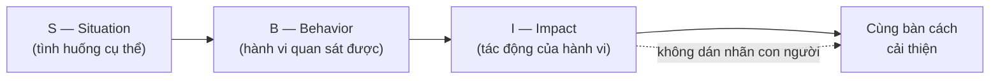

# Phản hồi & xử lý bất đồng — Code review không làm tổn thương

> **Tác giả:** Mr.Rom\
> **Phiên bản:** v1.0.0\
> **Tạo lúc:** 13/06/2026\
> **Cập nhật:** 13/06/2026\
> **Level:** Basic\
> **Tags:** communication, feedback, code-review, conflict, sbi, disagree-and-commit, soft-skills\
> **Yêu cầu trước:** [Họp & giao tiếp trực tiếp](02_meetings-and-verbal-communication.md)

> 🎯 *Bài trước bạn đã biết nói trong standup, present và lắng nghe trong họp. Nhưng có một loại giao tiếp khó hơn nhiều: lúc bạn phải **nói cho ai đó biết họ làm chưa tốt** — hoặc lúc bạn **bị chê** và bản năng muốn cãi lại. Bài này dạy bạn cho feedback bằng khung **SBI** (cụ thể, không đánh vào con người), nhận feedback mà không thủ thế, giao tiếp trong **code review** sao cho phê bình code chứ không phê bình người, và xử lý **bất đồng kỹ thuật** dựa trên data thay vì cái tôi — kể cả khi cuối cùng phải **disagree and commit**. Cuối bài bạn có sẵn các mẫu câu để viết một comment review vừa thẳng thắn vừa không làm tổn thương ai.*

## 🎯 Sau bài này bạn sẽ

- [ ] Cho feedback bằng khung **SBI** (Situation–Behavior–Impact) — cụ thể, kịp thời, riêng tư khi cần
- [ ] Nhận feedback mà **không phòng thủ**, biến lời chê thành dữ liệu để lớn lên
- [ ] Viết **comment code review** phê bình code chứ không phê bình người (hỏi thay vì ra lệnh, khen điểm tốt, dùng `nit:` cho góp ý nhỏ)
- [ ] Phân biệt comment review **tệ vs tốt** và viết lại được một comment tệ thành tốt
- [ ] Xử lý **bất đồng kỹ thuật** dựa trên data, đề xuất thử nghiệm, và biết khi nào **disagree and commit**
- [ ] Biết **leo thang** (escalate) đúng lúc và tránh biến mọi tranh luận thành cuộc thắng-thua

---

## Tình huống — một dòng comment làm hỏng cả tuần

Bạn mở một Pull Request (PR) đầu tiên ở công ty mới. Code chạy đúng, test pass, bạn khá tự hào. Vài giờ sau, một senior để lại đúng một comment:

> *"Code này viết kiểu gì vậy? Sao không dùng cách chuẩn? Sửa lại đi."*

Bạn đọc xong, mặt nóng bừng. Không có chỗ nào sai cụ thể, không gợi ý nên sửa thế nào, chỉ có cảm giác bị chê là "viết code dở". Bạn sửa lại trong ấm ức, và từ đó mỗi lần thấy tên người đó trong reviewer, bụng bạn lại thắt lại. Code thì xong, nhưng quan hệ thì sứt mẻ, và bạn bắt đầu né đặt câu hỏi vì sợ bị coi thường.

Bây giờ tưởng tượng cùng vấn đề đó, nhưng comment được viết khác:

> *"Mình thấy chỗ này đang tự parse JSON bằng tay (dòng 42). Ở dự án này tụi mình thường dùng helper `parseConfig()` ở `utils/` cho thống nhất và đỡ sót case. Bạn thử đổi sang đó xem có gọn hơn không? Phần xử lý lỗi phía trên bạn viết rất rõ ràng, mình thích cách đó. 👍"*

Cùng một nội dung kỹ thuật — "đừng parse JSON bằng tay" — nhưng comment thứ hai khiến bạn muốn sửa ngay, học được điều mới, và quý người review hơn. Khác biệt không nằm ở **bạn đúng hay sai về kỹ thuật**, mà ở **cách bạn nói ra điều đó**.

Đây là kỹ năng quyết định bạn được tin tưởng hay bị né tránh trong team. Một dev giỏi kỹ thuật nhưng review code như dao mổ sẽ khiến đồng đội sợ, giấu việc, và team chậm lại. Một dev biết cho và nhận feedback tử tế khiến cả team an toàn để học và lớn lên. Bài này dạy bạn cách thứ hai. Bắt đầu từ câu hỏi nền: feedback tốt khác feedback tệ ở đâu?

---

## 1️⃣ Vì sao feedback hay làm tổn thương — và cách sửa

Phần lớn feedback đi sai ở một điểm: nó **đánh vào con người** thay vì **mô tả hành vi**. *"Bạn cẩu thả"*, *"Bạn không có tâm"*, *"Code dở"* — những câu này không cho người nghe biết phải sửa gì, chỉ khiến họ thấy bị tấn công và lập tức phòng thủ. Khi não bộ cảm thấy bị đe doạ, nó chuyển sang chế độ "chiến hay chạy", và mọi lời góp ý sau đó đều bị bật ra.

🪞 **Ẩn dụ**: feedback tốt giống như **chỉ vết bẩn trên áo, không phải chê người mặc bẩn thỉu**. Nếu bạn nói *"Áo bạn có vết mực ở tay phải kìa"*, người ta cảm ơn và đi giặt. Nếu bạn nói *"Sao bạn ở bẩn thế"*, người ta tự ái dù vết bẩn y hệt. Vết bẩn (hành vi) thì sửa được; "ở bẩn" (con người) thì nghe như một bản án. Feedback giỏi luôn chỉ vào vết bẩn cụ thể, không dán nhãn con người.

Một feedback hữu ích cần ba tính chất, dễ nhớ bằng "3 chữ C":

- **Cụ thể (Concrete)** — chỉ rõ việc gì, ở đâu, lúc nào. *"Comment hôm qua trong PR"* tốt hơn *"dạo này em hay..."*.
- **Kịp thời (Current)** — nói gần lúc sự việc xảy ra. Feedback để dồn ba tháng rồi tuôn ra một lúc thì người nghe không nhớ ngữ cảnh và thấy như bị "phục kích".
- **Riêng tư khi cần (Considerate)** — khen có thể công khai, nhưng góp ý điểm yếu nên nói riêng. Chê ai đó trước mặt cả team là cách nhanh nhất để biến góp ý thành sỉ nhục.

> Hiểu được feedback tệ vì đánh vào con người rồi, ta cần một khung cụ thể để luôn nói về hành vi — đó chính là SBI ở mục sau.

---

## 2️⃣ SBI — khung cho feedback không làm tổn thương

Vấn đề lớn nhất khi cho feedback là người ta hay nhảy thẳng tới **phán xét** (*"em làm thế là sai"*) mà bỏ qua **bằng chứng** và **hậu quả**. Người nghe không biết bạn dựa vào đâu để nói vậy, nên dễ cãi hoặc tổn thương. **SBI** (Situation–Behavior–Impact) là một khung ba bước buộc bạn nói theo đúng thứ tự: tình huống → hành vi quan sát được → tác động của nó. Nói đủ ba phần, feedback của bạn trở thành một **quan sát có căn cứ**, không phải một lời chê chủ quan.

🪞 **Ẩn dụ**: SBI giống **biên bản của một trọng tài bóng đá**, không phải lời cổ động viên chửi rủa. Trọng tài không hét "cầu thủ tệ"; ông ghi: *"Phút 30 (Situation), số 7 vào bóng bằng gầm giày (Behavior), gây nguy hiểm cho đối thủ (Impact) → thẻ vàng."* Cụ thể, có căn cứ, ai cũng tâm phục. Feedback theo SBI cũng vậy: mô tả khách quan đến mức người nghe tự nhìn ra vấn đề.

Đây là khái niệm trừu tượng nhất của bài, nên ta hình dung dòng chảy ba bước qua sơ đồ. Sơ đồ dưới cho thấy SBI dẫn người nghe từ một sự kiện cụ thể tới hành động cải thiện, thay vì đẩy họ vào thế phòng thủ.

→ Điểm cốt lõi của sơ đồ: feedback dừng ở Impact rồi **mở ra một cuộc bàn bạc**, chứ không kết thúc bằng một bản án. Người nghe hiểu chuyện gì xảy ra (S), bạn quan sát thấy gì (B), vì sao nó đáng nói (I) — và họ tự nguyện muốn sửa. Giờ ta đi từng phần.

### S — Situation: neo vào một tình huống cụ thể

Bắt đầu bằng việc nói rõ **khi nào, ở đâu**. Mục tiêu là để cả hai cùng nhớ về đúng một sự việc, tránh kiểu nói chung chung "dạo này", "lúc nào cũng". Càng cụ thể, người nghe càng khó cãi và càng dễ nhận ra.

- ✅ Neo rõ: *"Trong buổi standup sáng nay..."* / *"Ở comment PR #214 hôm qua..."*
- ❌ Mơ hồ: *"Dạo này em hay..."* / *"Lúc nào anh cũng thấy..."* (nghe như buộc tội cả con người)

### B — Behavior: mô tả hành vi, không suy diễn động cơ

Đây là phần dễ sai nhất. Bạn chỉ được mô tả **điều quan sát được bằng mắt/tai**, không được suy diễn ý đồ bên trong. *"Bạn ngắt lời mình hai lần"* là hành vi (quan sát được). *"Bạn không tôn trọng mình"* là suy diễn động cơ — và suy diễn thì thường sai, lại châm ngòi cãi nhau.

- ✅ Hành vi: *"Bạn merge PR mà chưa đợi review của ai khác."*
- ❌ Suy diễn: *"Bạn coi thường ý kiến cả team."* (gán động cơ — người nghe sẽ phản bác ngay)

### I — Impact: nói rõ tác động, dùng "mình/team" làm chủ ngữ

Phần này trả lời câu *"thì sao?"* — vì sao hành vi đó đáng nói. Mẹo quan trọng: nói tác động lên **bạn** hoặc **team/dự án**, dùng "mình" thay vì "bạn". *"Mình thấy hơi khó theo dõi"* dễ nghe hơn *"bạn làm mọi người rối"*. Đây gọi là dùng **"I-statement"** (câu chủ ngữ "tôi") thay vì **"you-statement"** (câu chủ ngữ "bạn") — câu "tôi" mô tả cảm nhận/hậu quả nên khó bị phản bác, câu "bạn" nghe như kết tội.

- ✅ Tác động: *"...nên mình mất khá lâu mới hiểu logic, và nếu có bug thì khó lần ra ai đã đổi gì."*
- ❌ Kết tội: *"...nên bạn làm team chậm hết cả."*

### Ráp cả ba lại — một ví dụ hoàn chỉnh

Ráp S + B + I thành một câu liền mạch, bạn có một feedback vừa thẳng vừa không xúc phạm. So sánh trực tiếp:

| ❌ Feedback đánh vào người | ✅ Feedback theo SBI |
|---|---|
| "Em làm việc ẩu quá." | "Trong PR #214 hôm qua (S), mình thấy phần này được merge khi chưa có ai review (B). Việc đó khiến tụi mình mất dấu vết ai đổi gì, và sau bị một bug khó lần (I). Lần sau mình cùng đợi ít nhất một approve nhé?" |
| "Sao present dở thế." | "Lúc demo sáng nay (S), phần kiến trúc bạn nói khá nhanh và bỏ qua sơ đồ (B), nên một vài người mình ngồi cạnh chưa kịp nắm (I). Nếu có slide sơ đồ thì sẽ dễ theo hơn." |

> [!TIP]
> Sau phần Impact, hãy **dừng lại và để người kia nói**, đừng tuôn một tràng giải pháp. Một câu mở như *"Bạn thấy sao?"* biến feedback từ một chiều thành đối thoại — và người ta tiếp thu thứ họ được tham gia bàn bạc tốt hơn nhiều thứ bị áp đặt.

---

## 3️⃣ Nhận feedback mà không phòng thủ

Cho feedback đã khó, **nhận** feedback còn khó hơn — vì nó đụng thẳng vào cái tôi. Phản xạ tự nhiên của con người khi bị chê là **phòng thủ**: giải thích, biện minh, hoặc trong lòng phản bác *"ông có hiểu gì đâu mà nói"*. Nhưng nếu bạn cãi lại mỗi lần được góp ý, lần sau người ta sẽ ngại nói — và bạn mất luôn nguồn thông tin quý nhất để lớn lên.

🪞 **Ẩn dụ**: nhận feedback giống **nhận một gói quà chưa mở**. Bạn không biết bên trong là món hữu ích hay món vô duyên — nhưng nếu bạn đập gói quà ngay vào mặt người tặng (phòng thủ, cãi lại), lần sau không ai tặng bạn gì nữa. Người khôn nhận gói quà, **cảm ơn**, mở ra xem lúc bình tĩnh, giữ thứ hữu ích và lặng lẽ bỏ thứ không hợp. Bạn không bắt buộc phải dùng mọi món, nhưng luôn nên giữ thái độ biết nhận.

Có một quy trình bốn bước để nhận feedback một cách chuyên nghiệp, kể cả khi nó "đau":

1. **Nghe hết, không ngắt lời** — kể cả khi bạn thấy oan. Để người ta nói trọn ý trước khi bạn phản ứng.
2. **Cảm ơn trước, phản ứng sau** — *"Cảm ơn bạn đã thẳng thắn, điều này hữu ích với mình."* Một câu cảm ơn giữ cánh cửa feedback luôn mở cho lần sau.
3. **Hỏi làm rõ, đừng biện minh** — thay vì *"nhưng tại vì..."*, hãy hỏi *"Bạn cho mình một ví dụ cụ thể được không, để mình hình dung rõ hơn?"*. Câu hỏi biến thế đối đầu thành cùng tìm hiểu.
4. **Tách feedback khỏi cái tôi, rồi chọn lọc hành động** — người ta góp ý về **việc bạn làm**, không phải **con người bạn**. Nghe xong, ngẫm, rồi tự quyết cái nào đáng sửa. Không phải feedback nào cũng đúng — nhưng phản ứng trưởng thành là chọn lọc trong bình tĩnh, không bác bỏ trong nóng giận.

> [!TIP]
> Khi nhận một feedback khiến bạn nóng mặt, đừng phản ứng ngay trong cảm xúc. Cứ cảm ơn và nói *"Mình xin ngẫm thêm rồi trao đổi lại sau nhé"*. Cho mình một quãng để cái tôi nguội xuống — lúc đầu tỉnh, bạn thường thấy phần lớn feedback hợp lý hơn mình tưởng. Và việc lần sau quay lại cho người ta thấy bạn đã thay đổi chính là cách xây uy tín mạnh nhất.

---

## 4️⃣ Code review — giao tiếp khó nhất của dev

Code review là nơi feedback diễn ra **dày đặc nhất** trong đời một dev — và cũng là nơi quan hệ dễ sứt mẻ nhất. Lý do: feedback ở đây thường **viết ra (async)**, không có giọng nói và nét mặt để làm mềm. Một câu trung tính trong đầu bạn có thể đọc ra như cộc cằn trên màn hình. Vì vậy code review cần thêm một lớp tử tế có chủ đích.

🪞 **Ẩn dụ**: review code giống **biên tập một bài viết của đồng nghiệp**, không phải chấm bài thi của học sinh kém. Người biên tập giỏi sửa câu chữ để bài tốt hơn, vẫn tôn trọng tác giả; người chấm thi phán "đúng/sai" rồi cho điểm. Mục tiêu review là **làm code tốt hơn và làm tác giả giỏi lên**, không phải để chứng minh bạn thông minh hơn người viết.

Có một nguyên tắc gốc xuyên suốt mọi kỹ thuật dưới đây: **phê bình code, không phê bình người**. *"Code này"* (the code) chứ không *"Bạn"* (you). *"Hàm này có thể bị null ở đây"* nghe khác hẳn *"Bạn quên check null à"*. Cùng một vấn đề, nhưng một câu nói về code, một câu nói về sự thiếu sót của con người.

### Bốn kỹ thuật viết comment review tử tế

Bốn kỹ thuật dưới biến một reviewer đáng sợ thành một reviewer được quý. Mỗi kỹ thuật giải một thói quen xấu cụ thể:

- **Hỏi thay vì ra lệnh.** *"Sửa lại đi"* là mệnh lệnh, đóng cửa thảo luận. *"Mình nghĩ tách hàm này ra sẽ dễ test hơn, bạn thấy sao?"* là một câu hỏi, mở cửa cho người viết giải thích hoặc đồng ý. Câu hỏi cũng chừa chỗ cho khả năng **bạn** đang hiểu sai ngữ cảnh.
- **Khen điểm tốt, không chỉ moi lỗi.** Review chỉ toàn dấu trừ khiến người viết thấy mình vô dụng. Khi thấy một đoạn hay, hãy nói: *"Cách bạn xử lý lỗi ở đây rất sạch 👍"*. Lời khen thật làm người viết tiếp thu các góp ý còn lại dễ hơn nhiều.
- **Dùng `nit:` cho góp ý nhỏ.** `nit:` (viết tắt của *nitpick* — bắt bẻ chi tiết nhỏ) là quy ước báo cho người viết biết *"đây chỉ là ý kiến nhỏ, không bắt buộc, không chặn merge"*. Nó phân biệt rõ "lỗi phải sửa" với "gu cá nhân cho vui", giúp người viết không bị ngợp.
- **Giải thích "vì sao", đừng chỉ phán "sai".** *"Đừng dùng cái này"* để người viết hụt hẫng. *"Cái này có thể chậm khi list lớn vì nó duyệt O(n²) — thử dùng Set xem?"* vừa dạy được điều mới vừa thuyết phục.

> [!IMPORTANT]
> Phân biệt rõ **comment chặn merge** (blocking — lỗi đúng/sai, bảo mật, bug) với **comment góp ý** (non-blocking — gu code, tối ưu nhỏ). Dùng `nit:` cho loại không chặn, và nói thẳng *"cái này mình nghĩ cần sửa trước khi merge"* cho loại chặn. Nếu trộn lẫn hai loại, người viết hoặc bỏ qua lỗi thật, hoặc tốn thời gian sửa những thứ vốn không bắt buộc.

### Comment review tệ vs tốt — viết lại từng câu

Lý thuyết là vậy, giờ xem trực tiếp các comment thật. Bảng dưới đặt cạnh nhau comment tệ (đánh vào người, ra lệnh, mơ hồ) và comment tốt (nói về code, hỏi, có lý do). Đọc kỹ — phần lớn comment tệ ngoài đời đều rơi vào một trong các kiểu này:

| ❌ Comment tệ | ✅ Comment tốt | Vì sao tốt hơn |
|---|---|---|
| "Code này dở quá." | "Đoạn này hơi khó theo dõi với mình. Tách thành 2 hàm nhỏ theo trách nhiệm thì sao?" | Nói về code + đề xuất cụ thể, không phán xét |
| "Sai rồi, sửa đi." | "Chỗ này có thể bị `null` khi `user` chưa load (dòng 30). Mình nghĩ cần check trước khi `.name`, bạn xem giúp nhé?" | Chỉ rõ lỗi + vị trí + lý do, vẫn lịch sự |
| "Sao không dùng async?" | "Mình tò mò: ở đây dùng async/await thay vì callback có giúp đọc dễ hơn không nhỉ?" | Câu hỏi mở, chừa chỗ người viết có lý do riêng |
| "Biến đặt tên gì kỳ vậy." | "nit: `d` hơi khó đoán nghĩa — đổi thành `daysLeft` cho rõ hơn được không? (không bắt buộc)" | `nit:` báo là góp ý nhỏ + gợi ý tên cụ thể |
| (chỉ toàn comment chê) | "Phần validate input ở trên bạn viết rất chắc 👍. Còn mỗi chỗ parse JSON mình có một góp ý..." | Khen điểm tốt trước, người viết dễ tiếp thu |

> Comment tốt làm code tốt hơn mà giữ người viết muốn hợp tác tiếp. Nhưng đôi khi vấn đề không phải "câu chữ" — mà là hai bên thật sự **bất đồng về kỹ thuật**. Đó là chuyện của mục sau.

---

## 5️⃣ Bất đồng kỹ thuật — cãi nhau cho ra việc, không cho ra thắng

Sẽ có lúc bạn và đồng nghiệp **thật sự không đồng ý** về một quyết định kỹ thuật: dùng SQL hay NoSQL, tách microservice hay giữ monolith, viết test trước hay sau. Bất đồng kỹ thuật **không xấu** — ngược lại, một team mà ai cũng gật là một team không ai dám nghĩ. Vấn đề chỉ nảy sinh khi bất đồng biến thành **cuộc chiến cái tôi**, nơi mục tiêu là "tôi thắng" thay vì "ta tìm ra phương án tốt nhất".

🪞 **Ẩn dụ**: bất đồng kỹ thuật nên giống **hai kỹ sư cùng nhìn một bản vẽ cầu**, không phải hai võ sĩ trên sàn đấu. Hai kỹ sư chỉ vào bản vẽ và tranh luận *"trụ này chịu được tải không"* — họ cùng phía bàn, đối thủ chung là **vấn đề kỹ thuật**, không phải nhau. Khi bạn thấy mình đang muốn "đánh bại" đồng nghiệp thay vì "giải bài toán", bạn đã đứng nhầm sàn rồi.

### Cãi nhau dựa trên data, không dựa trên cái tôi

Cách nhanh nhất để hạ nhiệt một bất đồng là **kéo nó ra khỏi vùng ý kiến và đưa vào vùng dữ kiện**. *"Cách của tôi nhanh hơn"* là ý kiến, cãi mãi không xong. *"Mình benchmark thử, cách A chạy ~120ms còn cách B ~80ms với 10k bản ghi"* là dữ kiện, ai cũng phải nhìn vào con số. Vài cách chuyển từ cái tôi sang data:

- **Đưa bằng chứng cụ thể** — benchmark, link tài liệu chính thức, một bug thật đã từng xảy ra do cách kia.
- **Đề xuất một thử nghiệm nhỏ** — *"Hay mình làm một prototype cả hai cách rồi đo thử?"*. Một thí nghiệm 30 phút giải quyết được cuộc cãi vã cả buổi.
- **Tách "sự thật" khỏi "sở thích"** — nói rõ đâu là ràng buộc kỹ thuật cứng (vd: "DB này không hỗ trợ transaction kiểu đó") và đâu chỉ là gu cá nhân ("mình quen viết kiểu này hơn"). Gu cá nhân thì nên nhường; ràng buộc cứng thì nên giữ.

### Disagree and commit — khi nào nên gật dù chưa thuận

Có những bất đồng không có câu trả lời "đúng tuyệt đối", và team không thể tranh luận mãi — đến lúc phải **chốt và đi tiếp**. Đây là lúc dùng nguyên tắc **"disagree and commit"** (bất đồng nhưng vẫn cam kết): bạn đã nói hết quan điểm, được lắng nghe, nhưng quyết định cuối cùng khác ý bạn — và bạn vẫn **toàn tâm thực hiện** phương án đã chốt, không phá ngầm, không "tôi đã bảo rồi" khi nó trục trặc.

🪞 **Ẩn dụ**: disagree and commit giống **biểu quyết trong một nhóm bạn chọn quán ăn**. Bạn muốn quán A, cả nhóm chọn quán B. Bạn không phải giả vờ thích quán B — nhưng đã đi cùng thì bạn vào ăn vui vẻ, không ngồi mặt nặng phá hỏng bữa của mọi người. Tiếp tục cằn nhằn sau khi đã chốt mới là điều phá team, không phải việc bạn từng bất đồng.

Vì sao nguyên tắc này quan trọng: nếu mỗi người đều phá ngầm quyết định mình không thích, team tê liệt. "Disagree and commit" cho phép **bất đồng thoải mái ở khâu bàn bạc, nhưng đoàn kết tuyệt đối ở khâu thực thi**. Điều kiện để nó công bằng: bạn phải thật sự **được lắng nghe trước khi chốt** — commit không có nghĩa là bị bịt miệng.

> [!IMPORTANT]
> "Disagree and commit" chỉ áp dụng cho các quyết định **có thể đảo ngược hoặc rủi ro thấp** (chọn thư viện, đặt tên, kiểu code). Với quyết định **rủi ro cao, khó đảo ngược** (xoá data thật, đổi kiến trúc bảo mật, deploy thứ có thể gây mất tiền), nếu bạn thấy nó sai nghiêm trọng thì **không được im lặng commit** — đó là lúc cần leo thang (mục dưới), vì im lặng lúc này là đồng loã với rủi ro.

---

## 6️⃣ Leo thang đúng lúc — và tránh tranh luận thắng-thua

Đa số bất đồng nên được giải quyết **trực tiếp giữa hai người** — đó luôn là bước đầu tiên. Nhưng có lúc hai bên kẹt cứng, hoặc vấn đề quá quan trọng để "thôi cho qua". Khi đó bạn cần **leo thang** (escalate) — mời một người thứ ba có thẩm quyền hoặc kinh nghiệm hơn (tech lead, kiến trúc sư, sếp) ra quyết định. Leo thang **không phải mách lẻo** hay thua cuộc; nó là một công cụ chuyên nghiệp để gỡ bế tắc khi hai bên đã cố mà không xong.

🪞 **Ẩn dụ**: leo thang giống **nhờ trọng tài khi hai cầu thủ tranh cãi một pha bóng**. Hai người tự cãi mãi không ngã ngũ chỉ làm trận đấu dừng lại; gọi trọng tài (người có thẩm quyền + góc nhìn trung lập) để phân xử rồi chơi tiếp là cách chuyên nghiệp. Vấn đề là phải gọi **đúng lúc** — gọi quá sớm thì như trẻ con mách mọi chuyện, gọi quá muộn thì trận đấu đã hỏng.

### Khi nào nên leo thang

Không phải bất đồng nào cũng đáng leo thang. Bảng dưới giúp bạn phân biệt lúc nên tự xử với lúc nên mời người thứ ba:

| Tình huống | Nên làm gì |
|---|---|
| Bất đồng nhỏ, gu cá nhân, rủi ro thấp | Tự thống nhất hoặc disagree and commit, không leo thang |
| Đã bàn trực tiếp 1-2 lần mà vẫn kẹt cứng, đang chặn tiến độ | Leo thang lên tech lead để có người chốt |
| Bạn thiếu ngữ cảnh để quyết (vd: ảnh hưởng team khác) | Leo thang để người có bức tranh lớn quyết |
| Quyết định rủi ro cao mà bạn tin là sai nghiêm trọng | **Bắt buộc** leo thang — không im lặng commit |
| Vấn đề liên quan an toàn/bảo mật/dữ liệu thật | Leo thang ngay, kèm bằng chứng cụ thể |

Khi leo thang, hãy **trình bày trung lập cả hai phương án** kèm bằng chứng, đừng kéo bè. Một câu mở tốt: *"Tụi mình bàn về cách lưu session, mình nghiêng về A vì X, bạn ấy nghiêng về B vì Y, cả hai đều có lý. Anh giúp tụi em chốt hướng được không?"*. Cách này khiến cả hai bên thấy được tôn trọng, và người chốt có đủ thông tin để quyết đúng.

### Tránh biến mọi thứ thành thắng-thua

Cái bẫy lớn nhất trong bất đồng là chuyển từ *"tìm phương án tốt nhất"* sang *"tôi phải thắng"*. Một khi cái tôi vào cuộc, bạn bắt đầu cãi để không thua mặt chứ không vì điều đúng — và kể cả khi "thắng", bạn làm sứt mẻ quan hệ và khiến người kia lần sau ngại đóng góp. Vài dấu hiệu bạn đang sa vào thắng-thua và cách kéo lại:

- **Dấu hiệu**: bạn thấy vui khi tìm được lỗ hổng trong lập luận đối phương hơn là khi tìm ra giải pháp đúng. → **Kéo lại**: tự hỏi *"mình đang muốn đúng, hay muốn việc tốt?"*.
- **Dấu hiệu**: bạn dùng "luôn", "không bao giờ", nói to giọng, hoặc lôi chuyện cũ ra. → **Kéo lại**: hạ nhịp, quay về dữ kiện của đúng vấn đề hiện tại.
- **Dấu hiệu**: bạn từ chối thử nghiệm để kiểm chứng vì sợ mình sai. → **Kéo lại**: nhớ rằng dữ liệu thắng cái tôi; sai sớm nhờ thí nghiệm rẻ hơn sai muộn trên production.

> [!WARNING]
> Tuyệt đối tránh biến bất đồng kỹ thuật thành công kích cá nhân: *"cãi cùn"*, mỉa mai trong comment, hay lôi chuyện ngoài lề. Đồng nghiệp nhớ rất lâu cảm giác bị xúc phạm — lâu hơn nhiều so với việc ai đúng trong cuộc tranh luận. Một quan hệ tin cậy đáng giá hơn mọi cuộc cãi thắng, vì bạn sẽ còn làm việc với họ cả năm trời sau đó.

---

## 💡 Cạm bẫy thường gặp & Best practice

### ❌ Cạm bẫy: feedback đánh vào con người thay vì hành vi

- **Triệu chứng**: dùng nhãn dán như "cẩu thả", "không có tâm", "code dở" — người nghe lập tức phòng thủ, không sửa được gì.
- **Nguyên nhân**: nhảy thẳng tới phán xét, bỏ qua tình huống và hành vi cụ thể.
- **Cách tránh**: dùng khung SBI — neo vào tình huống cụ thể (S), mô tả hành vi quan sát được (B), nói tác động lên mình/team (I). Mô tả vết bẩn, đừng chê người ở bẩn.

### ❌ Cạm bẫy: ra lệnh và moi lỗi trong code review

- **Triệu chứng**: comment toàn "sửa đi", "sai rồi", không một lời khen, không lý do — tác giả ấm ức sửa rồi né bạn lần sau.
- **Nguyên nhân**: quên rằng review là async, thiếu giọng nói nên câu cộc dễ bị đọc thành thù địch; và quên rằng mục tiêu là làm người viết giỏi lên, không phải chứng minh mình hơn.
- **Cách tránh**: hỏi thay vì ra lệnh, khen điểm tốt, dùng `nit:` cho góp ý nhỏ, luôn kèm "vì sao". Phê bình code, không phê bình người.

### ❌ Cạm bẫy: biến bất đồng kỹ thuật thành cuộc chiến cái tôi

- **Triệu chứng**: cãi để thắng mặt, từ chối thử nghiệm vì sợ sai, dùng "luôn/không bao giờ", lôi chuyện cũ.
- **Nguyên nhân**: cái tôi lấn át mục tiêu chung; nhầm "tôi đúng" với "việc tốt".
- **Cách tránh**: kéo cuộc tranh luận về data và thử nghiệm nhỏ; tách sự thật khỏi sở thích; biết disagree and commit khi đã được lắng nghe; leo thang khi kẹt cứng hoặc rủi ro cao.

### ✅ Best practice: cảm ơn trước, ngẫm sau khi nhận feedback

- **Vì sao**: phòng thủ và cãi lại khiến người ta ngại góp ý lần sau, cắt mất nguồn thông tin để bạn lớn lên.
- **Cách áp dụng**: nghe hết → cảm ơn → hỏi làm rõ (không biện minh) → cho mình thời gian nguội cái tôi → chọn lọc cái đáng sửa rồi hành động. Lần sau cho người ta thấy bạn đã thay đổi.

### ✅ Best practice: phân biệt rõ comment chặn merge với góp ý nhỏ

- **Vì sao**: trộn lẫn khiến người viết hoặc bỏ qua lỗi thật, hoặc tốn công sửa thứ vốn không bắt buộc.
- **Cách áp dụng**: dùng `nit:` (không bắt buộc, không chặn) cho gu code/tối ưu nhỏ; nói thẳng "cần sửa trước khi merge" cho lỗi đúng/sai, bug, bảo mật.

---

## 🧠 Tự kiểm tra (Self-check)

**Q1.** Một đồng nghiệp merge PR mà chưa đợi ai review, gây ra một bug khó lần. Bạn muốn góp ý. Viết lại câu *"Em làm việc ẩu quá, đừng có tự merge nữa"* theo khung SBI.

💡 Xem giải thích

Câu gốc đánh vào con người ("ẩu") và ra lệnh trống không. Viết lại theo SBI (Situation → Behavior → Impact + mở ra bàn bạc):

*"Ở PR #214 hôm qua (**S** — tình huống cụ thể), mình thấy phần đó được merge khi chưa có ai review (**B** — hành vi quan sát được, không suy diễn động cơ). Việc đó khiến tụi mình mất dấu vết ai đã đổi gì, và sau bị một bug khá khó lần ra (**I** — tác động lên team, dùng "mình/tụi mình"). Lần sau mình cùng đợi ít nhất một approve trước khi merge nhé, bạn thấy sao?"*

Điểm mấu chốt: neo vào một sự việc cụ thể, mô tả hành vi chứ không gán nhãn "ẩu", nói tác động bằng chủ ngữ "mình/team", và kết bằng câu hỏi mở thay vì mệnh lệnh.

**Q2.** Một senior để lại comment trong PR của bạn: *"Code này viết kiểu gì vậy? Sửa lại đi."* Phản xạ đầu tiên của bạn là gõ lại *"Em viết vậy vì lý do A, B, C..."* để bảo vệ mình. Đây có phải cách nhận feedback tốt không?

💡 Xem giải thích

Biện minh ngay là **phòng thủ** — dù comment kia viết tệ (đánh vào người, không có lý do), việc bạn cãi lại sẽ làm căng thẳng leo thang và khiến lần sau ít người buồn góp ý. Cách tốt hơn:

1. **Cảm ơn trước** (kể cả khi comment cộc): *"Cảm ơn anh đã review."*
2. **Hỏi làm rõ thay vì biện minh**: *"Anh chỉ giúp em chỗ nào nên đổi và nên đổi theo hướng nào được không ạ? Em muốn hiểu cách chuẩn của team."*
3. Câu hỏi này vừa lấy được thông tin cụ thể (mà comment gốc thiếu), vừa giữ quan hệ, vừa cho thấy bạn cầu thị. Nếu thật sự bạn có lý do chính đáng, hãy nêu nó dưới dạng **thông tin** ("ở case này `null` có thể xảy ra nên em xử lý vậy") chứ không dưới dạng **phản công**.

**Q3.** Bạn review code của một bạn mới, thấy biến tên `d` khó hiểu (gu cá nhân, không phải lỗi) nhưng cũng thấy một chỗ có thể crash vì không check `null` (lỗi thật). Bạn nên viết hai comment này khác nhau thế nào?

💡 Xem giải thích

Phải **phân biệt rõ comment chặn merge với góp ý nhỏ**, nếu không người viết dễ lẫn lộn mức độ quan trọng:

- Biến `d` là gu cá nhân, không bắt buộc → dùng `nit:`: *"nit: `d` hơi khó đoán nghĩa, đổi thành `daysLeft` cho rõ hơn được không? (không bắt buộc)"*
- Chỗ thiếu check `null` là lỗi thật có thể gây crash → nói thẳng đây là blocking: *"Chỗ này có thể bị `null` khi `user` chưa load (dòng 30), cần check trước khi gọi `.name` — mình nghĩ nên sửa trước khi merge nhé."*

Đồng thời nên **khen một điểm tốt** trong PR để người mới không thấy ngợp toàn dấu trừ. Phê bình code, không phê bình người; hỏi cho cái nhỏ, nói rõ lý do cho cái lớn.

**Q4.** Bạn và một đồng nghiệp bất đồng về việc dùng thư viện A hay B. Cả hai đều "chắc chắn mình đúng" và đã cãi qua lại ba lượt. Cách nào tốt để thoát bế tắc, và khi nào thì nên leo thang?

💡 Xem giải thích

Trước hết, **kéo tranh luận từ ý kiến sang data**: thay vì ai cũng nói "cái của tôi tốt hơn", hãy **đề xuất một thử nghiệm nhỏ** — *"Hay mình làm prototype nhỏ cả hai cách rồi đo/so sánh thử?"*. Một thí nghiệm ngắn thường giải quyết được cuộc cãi vã dài. Cũng nên tách "sự thật" (ràng buộc kỹ thuật cứng) khỏi "sở thích" (gu cá nhân) — gu thì nên nhường.

Nếu đây là quyết định rủi ro thấp và vẫn không ngã ngũ, có thể **disagree and commit**: chọn một hướng, cả hai cam kết làm tốt. Nếu đã bàn trực tiếp nhiều lần mà **vẫn kẹt cứng và đang chặn tiến độ**, hoặc vấn đề **rủi ro cao** (ảnh hưởng kiến trúc, bảo mật, dữ liệu thật), thì **leo thang** lên tech lead — trình bày trung lập cả hai phương án kèm bằng chứng, để người có thẩm quyền/ngữ cảnh rộng hơn chốt. Leo thang đúng lúc là chuyên nghiệp, không phải mách lẻo.

**Q5.** "Disagree and commit" nghĩa là gì? Nó áp dụng cho mọi quyết định, kể cả khi bạn tin một quyết định là sai nghiêm trọng và rủi ro cao, đúng không?

💡 Xem giải thích

**Disagree and commit** = bạn đã nêu hết quan điểm, được lắng nghe, nhưng quyết định cuối khác ý bạn — và bạn vẫn **toàn tâm thực hiện** phương án đã chốt, không phá ngầm, không "tôi đã bảo rồi" khi nó trục trặc. Nó cho phép bất đồng thoải mái ở khâu bàn bạc nhưng đoàn kết ở khâu thực thi. Điều kiện công bằng: bạn phải thật sự được lắng nghe trước khi chốt.

**Không** áp dụng cho mọi quyết định. Nó hợp với quyết định **rủi ro thấp, có thể đảo ngược** (chọn thư viện, đặt tên, kiểu code). Với quyết định **rủi ro cao, khó đảo ngược** mà bạn tin là sai nghiêm trọng (xoá data thật, lỗ hổng bảo mật, deploy có thể gây mất tiền), bạn **không được im lặng commit** — đó là lúc phải leo thang, vì im lặng lúc này là đồng loã với rủi ro.

---

## ⚡ Tra cứu nhanh (Cheatsheet)

### Khung SBI cho feedback

| Bước | Là gì | Ví dụ |
|---|---|---|
| **S** — Situation | Neo vào tình huống cụ thể (khi nào, ở đâu) | "Trong PR #214 hôm qua..." |
| **B** — Behavior | Hành vi quan sát được, không suy diễn động cơ | "...phần này được merge khi chưa ai review..." |
| **I** — Impact | Tác động lên mình/team (dùng "mình") | "...nên tụi mình mất dấu vết, khó lần bug." |
| (mở ra) | Câu hỏi bàn cách cải thiện | "Lần sau mình cùng đợi 1 approve nhé?" |

### Nhận feedback không phòng thủ

| Bước | Làm gì |
|---|---|
| 1 | Nghe hết, không ngắt lời |
| 2 | Cảm ơn trước, phản ứng sau |
| 3 | Hỏi làm rõ (không biện minh) |
| 4 | Ngẫm khi nguội → chọn lọc → hành động |

### Viết comment code review tử tế

- **Hỏi thay vì ra lệnh** — "tách hàm này dễ test hơn, bạn thấy sao?" thay vì "sửa đi".
- **Khen điểm tốt** — "phần xử lý lỗi này rất sạch 👍".
- **`nit:` cho góp ý nhỏ** — báo là không bắt buộc, không chặn merge.
- **Giải thích "vì sao"** — kèm lý do/bằng chứng, không chỉ phán "sai".
- **Phê bình code, không phê bình người** — "hàm này có thể null" thay vì "bạn quên check null".

### Xử lý bất đồng kỹ thuật

| Tình huống | Hướng xử lý |
|---|---|
| Cãi mãi không xong | Đưa data / đề xuất thử nghiệm nhỏ |
| Gu cá nhân vs ràng buộc cứng | Gu thì nhường, ràng buộc cứng thì giữ |
| Rủi ro thấp, đã được lắng nghe | Disagree and commit |
| Kẹt cứng / rủi ro cao / chặn tiến độ | Leo thang lên tech lead (trình bày trung lập) |
| Quyết định nguy hiểm bạn tin là sai | **Không** im lặng commit — phải leo thang |

---

## 📚 Từ Điển Thuật Ngữ (Glossary)

| EN | VN | Giải thích |
|---|---|---|
| Feedback | Phản hồi / góp ý | Thông tin về việc làm tốt/cần cải thiện của ai đó |
| SBI | (giữ EN) | Khung feedback 3 phần: Situation–Behavior–Impact |
| Situation | Tình huống | Bối cảnh cụ thể (khi nào, ở đâu) để neo feedback |
| Behavior | Hành vi | Điều quan sát được bằng mắt/tai, không suy diễn động cơ |
| Impact | Tác động | Hậu quả của hành vi lên mình/team/dự án |
| I-statement | Câu chủ ngữ "tôi" | Cách nói "mình thấy/mình bị..." thay vì kết tội "bạn..." |
| Code review | Duyệt mã | Đồng nghiệp đọc và góp ý code trước khi merge |
| Pull Request (PR) | Yêu cầu hợp nhánh | Đề xuất gộp code vào nhánh chính, nơi diễn ra review |
| Reviewer | Người duyệt | Người đọc và góp ý cho PR |
| Blocking comment | Comment chặn merge | Góp ý về lỗi/bug/bảo mật, phải sửa trước khi merge |
| nit (nitpick) | Bắt bẻ nhỏ | Quy ước báo góp ý nhỏ, không bắt buộc, không chặn merge |
| Merge | Hợp nhất | Gộp code của PR vào nhánh chính |
| Disagree and commit | Bất đồng nhưng vẫn cam kết | Đã nêu ý kiến, được nghe, vẫn toàn tâm làm theo quyết định chung |
| Escalate | Leo thang | Mời người có thẩm quyền/ngữ cảnh rộng hơn ra quyết định khi kẹt |
| Tech lead | Trưởng nhóm kỹ thuật | Người dẫn dắt kỹ thuật, thường là nơi leo thang đầu tiên |
| Async (asynchronous) | Bất đồng bộ | Giao tiếp không cùng lúc (vd: comment viết để đọc sau) |
| Benchmark | Đo hiệu năng | Chạy thử để đo và so sánh tốc độ/tài nguyên giữa các cách làm |

---

## 🔗 Liên kết & Tài nguyên

⬅️ **Bài trước:** [Họp & giao tiếp trực tiếp — Standup, trình bày, lắng nghe](02_meetings-and-verbal-communication.md)\
➡️ **Bài tiếp theo:** [Giao tiếp với stakeholder & người non-tech](04_communicating-with-stakeholders.md)\
↑ **Về cụm:** [communication — README](../../README.md)

### 🧭 Định hướng lộ trình học

- [Vì sao giao tiếp quyết định sự nghiệp dev](00_why-communication-matters.md) — bức tranh lớn vì sao kỹ năng này nặng ký không kém kỹ thuật
- [Giao tiếp async & viết — Slack, email, ticket, tài liệu](01_async-and-written-communication.md) — comment review là một dạng giao tiếp viết, áp dụng chung nguyên tắc viết rõ ràng

### 🧩 Các chủ đề có thể bạn quan tâm

- [Phát triển & Thăng tiến — Lên level và biết khi nào đổi việc](../../../career-path/lessons/01_basic/04_growth-and-leveling-up.md) — xin và nhận feedback là nhiên liệu của phát triển sự nghiệp
- [Behavioral Interview & STAR — Kể chuyện thuyết phục](../../../interview-prep/lessons/01_basic/03_behavioral-interview-and-star.md) — câu hỏi "kể về một lần bất đồng đồng nghiệp" đo đúng kỹ năng trong bài này

### 🌐 Tài nguyên tham khảo khác

- [Google Engineering Practices — Code Review](https://google.github.io/eng-practices/review/) — bộ hướng dẫn code review kinh điển cho cả người review và người được review
- [Conventional Comments](https://conventionalcomments.org/) — quy ước gắn nhãn comment review (`nit:`, `suggestion:`, `issue:`...) để rõ mức độ
- [Center for Creative Leadership — The SBI Feedback Model](https://www.ccl.org/articles/leading-effectively-articles/sbi-feedback-model-a-quick-win-for-giving-effective-feedback/) — nguồn gốc và cách dùng khung SBI

---

## 📌 Nhật ký thay đổi (Changelog)

- **v1.0.0 (13/06/2026)** — Bản đầu tiên. Tình huống mở bài "một dòng comment làm hỏng cả tuần" (before/after) + vì sao feedback đánh vào người gây phòng thủ (3 chữ C: cụ thể/kịp thời/riêng tư) + khung SBI với sơ đồ mermaid 3 bước + ẩn dụ vết bẩn trên áo/biên bản trọng tài/gói quà/biên tập bài viết/hai kỹ sư nhìn bản vẽ/biểu quyết chọn quán/trọng tài + bảng feedback đánh-vào-người vs SBI + quy trình nhận feedback 4 bước không phòng thủ + 4 kỹ thuật comment review (hỏi thay ra lệnh / khen điểm tốt / nit: / giải thích vì sao) + bảng comment review tệ vs tốt viết lại từng câu + bất đồng kỹ thuật dựa data/thử nghiệm + disagree and commit (kèm giới hạn rủi ro cao) + leo thang đúng lúc với bảng khi-nào + tránh tranh luận thắng-thua + 3 cạm bẫy + 2 best practice + 5 self-check + cheatsheet + glossary 17 thuật ngữ.
