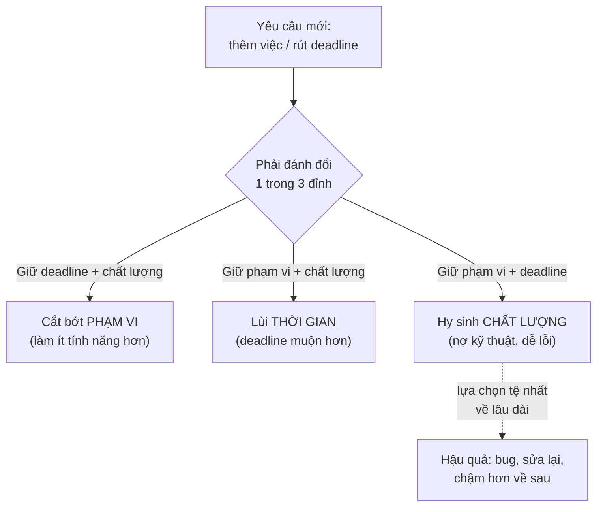

# Giao tiếp với stakeholder & người non-tech

> **Tác giả:** Mr.Rom\
> **Phiên bản:** v1.0.0\
> **Tạo lúc:** 13/06/2026\
> **Cập nhật:** 13/06/2026\
> **Level:** Basic\
> **Tags:** career, communication, soft-skills, stakeholders, non-technical, expectation-management, escalation, cross-team\
> **Yêu cầu trước:** [Phản hồi & xử lý bất đồng](03_feedback-and-conflict.md)

> 🎯 *Ba bài trước bạn đã học giao tiếp với những người **cùng ngành**: viết Slack/ticket gọn, họp gọn, review code không làm tổn thương. Nhưng phần lớn người quyết định lương, deadline và số phận dự án của bạn lại **không phải dev**: sếp, PM, sale, khách hàng. Họ không hiểu "race condition" hay "kỹ thuật nợ" — và nếu bạn nói chuyện với họ bằng ngôn ngữ của dev, bạn sẽ bị hiểu sai, bị ép deadline vô lý, hoặc tệ hơn là bị xem là "khó làm việc". Bài này dạy bạn cách dịch kỹ thuật sang ngôn ngữ **impact / rủi ro / chi phí**, ước lượng trung thực, nói "không" mà vẫn giữ quan hệ, báo tin xấu sớm, escalation đúng cách, và phối hợp cross-team. Đây là bài đóng cụm communication — nơi mọi kỹ năng trước hội tụ lại.*

## 🎯 Sau bài này bạn sẽ

- [ ] Giải thích một vấn đề kỹ thuật cho **người non-tech** mà không dùng jargon — nói **impact, rủi ro, chi phí** thay vì chi tiết bên trong
- [ ] **Quản lý kỳ vọng** và đưa ước lượng trung thực bằng **dải thời gian + buffer**, thay vì một con số đẹp rồi trễ
- [ ] Nói **"không" / pushback** một cách lịch sự: nêu trade-off + đề xuất thay thế, không phải từ chối cộc lốc
- [ ] Áp dụng nguyên tắc **no surprises** — báo tin xấu **sớm** thay vì giấu tới phút chót
- [ ] **Escalation** đúng lúc, đúng người, đúng cách — không phải "mách lẻo" cũng không phải im lặng chịu trận
- [ ] Phối hợp **cross-team** (làm việc với team khác) khi bạn không có quyền ra lệnh cho họ
- [ ] Dùng được **template status update** cho sếp và khung **trình bày trade-off** cho quyết định

---

## Tình huống — câu trả lời đúng kỹ thuật nhưng sai người nghe

Sếp bạn — một người làm kinh doanh, không phải dev — hỏi trong cuộc họp trước cả phòng:

> *"Sao tính năng xuất hoá đơn vẫn chưa xong? Tuần trước em nói gần xong rồi mà?"*

Bạn trả lời rất thật lòng, rất chính xác về mặt kỹ thuật:

> *"Dạ tại em phát hiện cái legacy service nó trả về timezone không nhất quán, rồi cái cron job tổng hợp data bị race condition khi có nhiều request đồng thời, nên em phải refactor lại layer aggregation và thêm một cái distributed lock, mà cái đó lại đụng tới schema của bảng invoices nên phải viết migration..."*

Sếp gật gù, nhưng ánh mắt trống rỗng. Câu duy nhất sếp rút ra được là: *"Nó nói cả tràng mà mình không hiểu gì, và tính năng vẫn chưa xong."* Tệ hơn, sếp bắt đầu nghĩ bạn đang **vẽ vời lý do để trốn việc** — vì với sếp, mọi từ bạn vừa nói đều như tiếng nước ngoài.

Bạn đã trả lời **đúng 100% về kỹ thuật**, nhưng **thất bại hoàn toàn về giao tiếp**. Vì bạn quên một điều: người nghe không quan tâm *cái gì hỏng bên trong*, họ quan tâm **ba thứ**: chuyện này ảnh hưởng gì (impact), rủi ro ra sao (risk), và tốn thêm bao nhiêu (cost — thời gian/tiền/người).

Bài này dạy bạn cách trả lời lại câu hỏi đó — và hàng chục tình huống tương tự — theo cách khiến người non-tech **hiểu, tin tưởng, và ra quyết định đúng**. Bắt đầu từ kỹ năng nền: dịch kỹ thuật sang ngôn ngữ của họ.

---

## 1️⃣ Dịch kỹ thuật sang ngôn ngữ của người non-tech

Sai lầm gốc rễ của hầu hết dev khi nói chuyện với sếp/PM/khách là: **kể cho họ nghe những gì mình thấy, thay vì những gì họ cần biết**. Bạn thấy code, service, schema; họ thấy doanh thu, khách hàng, deadline. Hai thế giới khác nhau, và **bạn là người phải bắc cầu** — không thể bắt họ học code.

🪞 **Ẩn dụ**: nói chuyện kỹ thuật với người non-tech giống như **một bác sĩ giải thích bệnh cho bệnh nhân**. Bác sĩ giỏi không nói *"bạch cầu trung tính của anh tăng kèm CRP cao gợi ý nhiễm khuẩn cấp"* — anh ấy nói *"anh bị nhiễm trùng, cần uống kháng sinh 5 ngày, nếu không có thể nặng hơn"*. Bác sĩ vẫn hiểu đầy đủ thuật ngữ y khoa (giống bạn vẫn hiểu race condition), nhưng anh ấy **dịch nó ra impact (nhiễm trùng), hành động (uống thuốc), và rủi ro (nặng hơn)** — đúng thứ bệnh nhân cần để quyết định. Bạn cũng là "bác sĩ" cho hệ thống của mình.

### Ba câu hỏi người non-tech luôn thật sự hỏi

Dù họ hỏi gì, đằng sau gần như luôn là ba câu hỏi này. Khi bạn trả lời thẳng vào chúng, bạn nói đúng tần số của họ:

| Họ hỏi (bề mặt) | Họ thật sự muốn biết (bên dưới) |
|---|---|
| "Cái này khó không?" | **Cost** — tốn bao nhiêu thời gian/người/tiền? |
| "Có làm được không?" | **Risk** — khả năng thất bại cao không, có gì chặn không? |
| "Để sau có sao không?" | **Impact** — không làm thì hậu quả gì cho khách/doanh thu? |

→ Ba trục **Impact – Risk – Cost** là bộ lọc vàng. Trước khi mở miệng nói với người non-tech, tự hỏi: *"Câu này mình đang nói về impact, risk, hay cost? Nếu không phải cả ba, mình đang nói chi tiết kỹ thuật thừa."*

### Bỏ jargon — hoặc dịch nó ngay tại chỗ

Jargon (thuật ngữ chuyên ngành) là kẻ thù số một. Không phải vì nó sai, mà vì nó **khiến người nghe cảm thấy ngu** — và người ta không thích cảm giác đó, nên họ gật gù cho qua thay vì hỏi lại. Kết quả: hiểu lầm âm thầm.

Có hai cách xử lý jargon, tuỳ ngữ cảnh. Bảng dưới cho thấy cách dịch một số thuật ngữ hay gặp sang ngôn ngữ impact:

| Jargon (dev nói) | ❌ Để nguyên | ✅ Dịch sang impact/đời thường |
|---|---|---|
| "Có technical debt" | "Code này đầy technical debt" | "Phần này được làm vội trước đây, giờ mỗi lần sửa đều chậm và dễ sinh lỗi — như nhà xây tạm, ở được nhưng càng để lâu càng tốn sửa" |
| "Cần refactor" | "Em phải refactor cái module này" | "Em cần dọn lại phần này để các tính năng sau làm nhanh hơn và ít lỗi hơn" |
| "Bị race condition" | "Có race condition trong cron job" | "Khi nhiều người dùng cùng lúc, hệ thống đôi khi tính sai — như hai thu ngân cùng bán một món hàng cuối cùng" |
| "Server bị scale không nổi" | "Service không scale được" | "Nếu lượng khách tăng gấp đôi dịp sale, hệ thống có thể chậm hoặc sập — cần chuẩn bị trước" |
| "Thiếu test coverage" | "Code không có test" | "Phần này chưa có lưới an toàn tự động, nên mỗi lần sửa em phải kiểm tra tay, chậm và dễ sót" |

> [!TIP]
> Quy tắc một câu: **"Nếu mẹ tôi hiểu được, thì sếp non-tech của tôi cũng hiểu được."** Trước khi gửi một câu giải thích cho stakeholder, đọc lại và tự hỏi mẹ bạn (người không làm IT) có hiểu không. Nếu không, còn jargon cần dịch.

### Dùng ẩn dụ — vũ khí mạnh nhất khi giải thích

Người non-tech không có mental model về hệ thống của bạn, nhưng họ có mental model về **đời sống thường ngày**. Ẩn dụ là cách nhanh nhất để mượn cái họ đã biết mà giải thích cái họ chưa biết. Vài ẩn dụ kinh điển dev hay dùng:

- **Server/capacity** → "đường cao tốc": thêm xe (user) thì phải mở thêm làn (server), không thì kẹt (chậm/sập).
- **Database migration** → "sửa móng nhà khi đang ở": làm được nhưng phải cẩn thận, có rủi ro, cần thời gian.
- **Cache** → "ghi chú dán trên bàn": tra nhanh hơn mở tủ hồ sơ, nhưng đôi khi ghi chú cũ không khớp bản gốc.
- **API của bên thứ ba** → "phụ thuộc nhà cung cấp": nếu họ trục trặc, mình cũng trục trặc, dù mình không sai.

> [!IMPORTANT]
> Ẩn dụ để **mở cửa hiểu biết**, không phải để thay thế sự thật. Sau khi dùng ẩn dụ, vẫn phải chốt lại bằng impact/risk/cost cụ thể. Đừng sa đà giải thích ẩn dụ tới mức quên mất câu hỏi gốc của họ là gì.

### Trước/sau — chữa lại câu trả lời ở đầu bài

Quay lại tình huống mở bài, đây là cách trả lời sếp lại đúng cách. Để ý nó **không hề nói dối hay giấu sự thật** — chỉ là dịch sự thật sang ngôn ngữ của người nghe:

> ❌ **Trước (jargon)**: *"Em phát hiện legacy service trả timezone không nhất quán, cron job bị race condition, phải refactor layer aggregation, thêm distributed lock, đụng schema bảng invoices nên phải viết migration..."*

> ✅ **Sau (impact/risk/cost)**: *"Khi làm em phát hiện một lỗi cũ tiềm ẩn: trong vài trường hợp, hoá đơn có thể bị tính sai số tiền — cái này nếu để lọt ra khách hàng thì rất nghiêm trọng (impact). Em đã quyết định sửa luôn cho chắc thay vì vá tạm (risk). Việc này cần thêm khoảng 2-3 ngày so với dự kiến (cost). Em nghĩ đáng để làm đúng — anh thấy sao ạ?"*

→ Cùng một sự thật, nhưng phiên bản sau khiến sếp **hiểu, tin, và tham gia quyết định**. Sếp giờ thấy bạn không trốn việc, mà đang bảo vệ công ty khỏi một rủi ro thật. Đó là sức mạnh của việc dịch đúng ngôn ngữ.

---

## 2️⃣ Quản lý kỳ vọng & ước lượng trung thực

Phần lớn xung đột giữa dev và stakeholder không đến từ việc dev làm chậm — mà từ việc **kỳ vọng và thực tế lệch nhau**. Bạn nói "thứ Sáu xong", trong đầu bạn nghĩ "nếu mọi thứ suôn sẻ thì thứ Sáu". Sếp nghe thành "chắc chắn thứ Sáu". Thứ Sáu chưa xong → bạn thành người "thất hứa", dù bạn đã làm việc chăm chỉ.

🪞 **Ẩn dụ**: ước lượng thời gian giống **dự báo thời gian giao hàng**. Một shop tử tế không hứa "hàng tới lúc 3h chiều thứ Ba" rồi để bạn đợi cả ngày. Họ nói "giao trong 2-4 ngày" — một **dải**, không phải một điểm. Khi hàng tới ngày thứ 3, bạn vẫn hài lòng vì nó nằm trong khoảng đã hứa. Ước lượng phần mềm cũng vậy: cho một dải trung thực, người ta lập kế hoạch quanh nó được; cho một điểm rồi trễ, bạn mất uy tín.

### Vì sao dev luôn ước lượng quá lạc quan

Có một quy luật kinh điển: dev gần như **luôn** đánh giá thấp thời gian cần thiết. Không phải vì lười tư duy, mà vì bản chất công việc:

- Bạn ước lượng phần **bạn nghĩ ra được** — code chính. Bạn quên phần **không nghĩ ra được**: bug bất ngờ, review chờ, môi trường trục trặc, yêu cầu đổi giữa chừng.
- Bạn ước lượng trong trạng thái lạc quan ("lần này chắc êm"), nhưng thực tế ít khi êm.
- Áp lực muốn làm hài lòng khiến bạn đưa con số người ta muốn nghe, không phải con số thật.

Cách chữa không phải là "ước lượng giỏi hơn" — gần như bất khả thi — mà là **đưa kỳ vọng vào chính cách bạn báo cáo con số**: dùng dải thời gian và buffer.

### Dải thời gian + buffer — công thức ước lượng trung thực

Thay vì một con số, hãy đưa một **dải** (khoảng từ–đến) phản ánh độ chắc chắn của bạn, kèm một **buffer** (đệm) cho những thứ bạn chưa lường được. Bảng dưới so sánh hai cách báo cáo:

| Tình huống | ❌ Ước lượng điểm | ✅ Dải + buffer + điều kiện |
|---|---|---|
| Tính năng vừa | "Thứ Sáu xong" | "Nếu không có gì bất ngờ thì khoảng thứ Năm–thứ Sáu. Em sẽ báo lại vào thứ Tư khi rõ hơn." |
| Việc nhiều ẩn số | "Khoảng 3 ngày" | "Em chưa làm phần này bao giờ nên còn nhiều ẩn số — em xin một ngày để tìm hiểu rồi đưa con số chắc chắn hơn." |
| Việc phụ thuộc người khác | "Tuần sau xong" | "Phần của em ~2 ngày, nhưng còn chờ team A cung cấp API. Nếu họ xong trước thứ Tư thì cuối tuần em xong." |

> [!TIP]
> Một thủ thuật đơn giản mà hiệu quả: ước lượng con số trong đầu, rồi **nhân thêm một hệ số đệm** trước khi nói ra, để phủ phần "ẩn số chưa thấy". Quan trọng hơn con số: luôn kèm câu **"em sẽ cập nhật lại khi rõ hơn"** — biến ước lượng từ một lời hứa cứng thành một dự báo có cập nhật.

### Tách "ước lượng" khỏi "cam kết"

Đây là một phân biệt cứu mạng. **Estimate** (ước lượng) là phỏng đoán dựa trên thông tin hiện có — nó có thể sai. **Commitment** (cam kết) là một lời hứa bạn phải giữ. Người non-tech hay nghe ước lượng thành cam kết. Việc của bạn là nói rõ bạn đang đưa cái nào:

- *"**Ước lượng** của em là khoảng 1 tuần, nhưng còn vài ẩn số."* → đang phỏng đoán.
- *"Em **cam kết** xong phần đăng nhập trước demo thứ Sáu."* → đang hứa chắc, đã trừ buffer.

> [!IMPORTANT]
> Đừng bao giờ để áp lực biến một ước lượng thành cam kết mà bạn chưa kịp nghĩ kỹ. Khi bị dồn *"Vậy chốt thứ Sáu nhé?"*, một câu an toàn là: *"Em cần xem kỹ rồi xác nhận lại trong hôm nay, để con số em đưa là con số em giữ được."* Hứa chắc rồi trễ tệ hơn nhiều so với xin thêm chút thời gian để hứa cho đúng.

---

## 3️⃣ Nói "không" và pushback một cách lịch sự

Dev mới hay rơi vào một trong hai cực: hoặc **nói "có" với mọi thứ** (rồi quá tải, trễ deadline, burnout), hoặc **nói "không" cộc lốc** (rồi bị xem là khó tính, thiếu hợp tác). Cả hai đều hại. Kỹ năng thật sự là nói "không" theo cách mà người nghe vẫn thấy bạn **đang giúp họ**, không phải đang cản họ.

🪞 **Ẩn dụ**: pushback đúng cách giống một **GPS dẫn đường**, không phải một **bức tường**. Khi bạn lái vào đường cấm, GPS không hét "KHÔNG ĐƯỢC ĐI!" rồi tắt máy. Nó nói: *"Đường này đang kẹt/cấm — tôi đề xuất hai tuyến thay thế: tuyến A nhanh hơn 5 phút, tuyến B tránh trạm thu phí."* GPS không cãi bạn, nó cho bạn **lựa chọn và trade-off** để bạn tự quyết. Nói "không" giỏi cũng vậy: không chặn đứng, mà mở ra phương án.

### Công thức "Có, và..." thay vì "Không, vì..."

Bí quyết là đừng từ chối yêu cầu — hãy **làm rõ cái giá** của nó rồi để người kia tự cân nhắc. Thay vì *"Không làm kịp đâu"*, hãy biến nó thành một bài toán đánh đổi:

| Tình huống | ❌ Từ chối cộc lốc | ✅ Pushback có trade-off + đề xuất |
|---|---|---|
| Sếp muốn thêm tính năng vào sprint đã đầy | "Không kịp đâu anh." | "Em làm được, nhưng để thêm cái này thì một trong hai việc đang làm phải lùi. Anh muốn ưu tiên cái nào ạ?" |
| PM muốn rút deadline còn một nửa | "Bất khả thi." | "Để xong sớm vậy, em đề xuất cắt bớt phạm vi: bản đầu làm 3 tính năng cốt lõi, phần còn lại bản sau. Vậy có ổn không ạ?" |
| Khách đòi một thứ rủi ro cao | "Cái đó không nên làm." | "Em làm được, nhưng có rủi ro X. Em đề xuất cách an toàn hơn là Y — hơi khác chút nhưng đạt cùng mục tiêu. Anh chị thấy sao?" |

→ Điểm chung của cột ✅: không bao giờ chỉ nói "không". Luôn có **(1) thừa nhận mong muốn của họ là chính đáng → (2) nêu trade-off rõ ràng → (3) đề xuất một phương án thay thế**. Người ta khó giận một người vừa tôn trọng mong muốn của họ vừa đưa ra lối đi.

### Trình bày trade-off — tam giác kinh điển

Khi cần giải thích vì sao "muốn thêm việc mà không lùi gì cả" là bất khả thi, có một mô hình ai cũng hiểu: **bạn không thể có cả ba thứ — phạm vi, thời gian, chất lượng — cùng lúc cố định**. Muốn nhiều hơn ở một đỉnh, phải nhường ở đỉnh khác. Sơ đồ dưới là khái niệm trừu tượng nhất của bài, nên ta hình dung nó trước:



→ Điểm cốt lõi của sơ đồ: khi stakeholder đòi "thêm việc nhưng giữ nguyên deadline", bạn không từ chối — bạn **đưa cái tam giác này ra** và để họ chọn nhường đỉnh nào. Phần lớn người non-tech chưa từng nghĩ theo cách này; khi bạn chỉ cho họ thấy, họ thường tự chọn cắt phạm vi hoặc lùi thời gian, và bạn tránh được con đường tệ nhất là âm thầm hy sinh chất lượng.

### Khung trình bày một quyết định trade-off

Khi cần đề xuất một quyết định có đánh đổi (chọn công nghệ, chọn cách làm, chọn cắt gì), đừng chỉ nói "em nghĩ nên làm X". Trình bày theo khung giúp stakeholder thấy bạn đã cân nhắc và tin tưởng quyết định của bạn:

```text
QUYẾT ĐỊNH CẦN CHỐT: <mô tả ngắn gọn>

Bối cảnh: <vì sao phải quyết, hạn chế hiện tại>

Các phương án:
  Phương án A — <tên>
    + Ưu: <lợi ích, nói bằng impact>
    − Nhược: <chi phí, rủi ro>
  Phương án B — <tên>
    + Ưu: ...
    − Nhược: ...

Đề xuất của em: chọn <A/B> — vì <lý do gắn với mục tiêu kinh doanh>

Cần anh/chị quyết: <điều cụ thể cần họ chốt, hoặc "em tự quyết nếu không có ý kiến khác trước [mốc]">
```

> [!TIP]
> Câu cuối — *"em tự quyết nếu không có ý kiến khác trước [mốc thời gian]"* — là một mẹo mạnh. Nó vừa thể hiện bạn chủ động, vừa không để quyết định bị treo vì chờ phản hồi. Phần lớn quyết định kỹ thuật nhỏ, stakeholder vui lòng để bạn tự lo nếu bạn cho họ cơ hội phản đối.

---

## 4️⃣ Báo tin xấu sớm — nguyên tắc "no surprises"

Đây có lẽ là kỹ năng giao tiếp **quan trọng nhất** với stakeholder, và cũng là thứ ngược với bản năng nhất. Bản năng khi gặp tin xấu (sẽ trễ deadline, làm hỏng gì đó, một rủi ro lớn) là **giấu**, hy vọng tự cứu được trước khi ai biết. Đây gần như luôn là sai lầm.

🪞 **Ẩn dụ**: giấu tin xấu giống **giấu một vết nứt nhỏ trên đập nước**. Lúc nứt nhỏ, vá rất dễ và ít người phải biết. Càng giấu, nước càng xói, đến lúc vỡ thì cả thung lũng phải gánh — và câu đầu tiên mọi người hỏi không phải "sửa thế nào" mà là **"sao không nói sớm?"**. Một vết nứt báo sớm là dấu hiệu bạn cẩn thận; một con đập vỡ vì giấu là dấu hiệu bạn không đáng tin.

### Vì sao báo sớm luôn thắng

Có một quy tắc bất biến trong công việc: **chi phí của một tin xấu tăng theo thời gian bạn giấu nó**. Cùng một sự thật "dự án sẽ trễ một tuần", báo ở hai thời điểm khác nhau cho kết quả khác nhau hoàn toàn:

| Thời điểm báo | Stakeholder có thể làm gì | Bạn được nhìn nhận thế nào |
|---|---|---|
| **Sớm** (ngay khi thấy rủi ro) | Còn thời gian xoay: dời lịch, thêm người, cắt phạm vi, báo khách trước | Người chủ động, đáng tin, biết kiểm soát rủi ro |
| **Muộn** (đến hạn mới nói) | Không xoay kịp gì cả, chỉ còn nhận hậu quả | Người giấu việc, gây bất ngờ tệ, mất uy tín |

→ Mấu chốt: stakeholder ghét **bất ngờ** hơn ghét **tin xấu**. Một tin xấu báo sớm cho họ quyền lựa chọn — và quyền lựa chọn là thứ họ trân trọng. Một tin xấu báo muộn cướp đi quyền đó. Vì vậy "no surprises" (không gây bất ngờ) là một trong những cam kết đáng giá nhất bạn có thể giữ với sếp.

### Cách báo tin xấu cho đỡ "xấu"

Báo sớm không có nghĩa là hoảng loạn chạy đi la làng. Một tin xấu được báo chuyên nghiệp gồm bốn phần: **sự thật + tác động + việc bạn đã/đang làm + đề xuất**. Ví dụ một tin nhắn báo trễ:

```text
Anh ơi, em cần báo sớm một việc về tính năng xuất hoá đơn:

📌 Tình hình: Em phát hiện một lỗi trong phần tính tiền, sửa cho đúng
   cần thêm 2-3 ngày so với kế hoạch ban đầu.

⚠️ Ảnh hưởng: Nếu giữ nguyên, tính năng sẽ trễ so với mốc thứ Sáu,
   lùi sang đầu tuần sau.

🔧 Em đang làm: Em đã khoanh được nguyên nhân và đang sửa, không phải
   bế tắc — chỉ là cần thời gian làm cho chắc.

💡 Đề xuất: (1) Lùi mốc sang thứ Hai để làm đúng, hoặc (2) ra bản tạm
   thứ Sáu với phần tính tiền tắt đi, bật lại tuần sau. Anh muốn cách nào ạ?
```

→ Tin nhắn này biến một tin xấu thành một **cuộc trao đổi có lối ra**. Sếp không hoảng vì thấy bạn đã kiểm soát, có phương án, và đang hỏi ý kiến chứ không đổ vấn đề lên đầu họ. So với việc im lặng tới thứ Sáu rồi nói "chưa xong", đây là một trời một vực.

> [!WARNING]
> Cạm bẫy chết người: báo tin xấu mà **chỉ có vấn đề, không có đề xuất**. Câu *"Em làm không kịp, giờ sao anh?"* đẩy toàn bộ gánh nặng lên sếp và khiến bạn trông bị động. Luôn kèm ít nhất một phương án — kể cả khi bạn không chắc nó tối ưu. Người mang theo lối ra được tin tưởng; người chỉ mang vấn đề thì không.

---

## 5️⃣ Escalation — leo thang đúng lúc, đúng người, đúng cách

**Escalation** (leo thang) là khi bạn đưa một vấn đề lên cấp cao hơn hoặc người có quyền hơn để giải quyết, vì bạn không tự xử lý được ở cấp hiện tại. Nhiều dev mới sợ escalation vì nghĩ nó giống "mách lẻo" hoặc "thừa nhận mình bất lực". Cả hai hiểu lầm này đều khiến họ **chịu trận trong im lặng** — và đó mới là cái hại thật.

🪞 **Ẩn dụ**: escalation giống **bấm chuông gọi y tá trong bệnh viện**. Bạn không bấm chuông cho mọi thứ vặt vãnh (sẽ làm phiền và bị xem là nhõng nhẽo). Nhưng khi có dấu hiệu nghiêm trọng — đau ngực, khó thở — bạn **phải** bấm ngay, im lặng chịu đựng mới là nguy hiểm. Bấm chuông không phải là yếu đuối; đó là dùng đúng hệ thống đã được tạo ra để xử lý việc vượt khả năng của bạn.

### Khi nào nên escalate, khi nào chưa

Ranh giới quan trọng: escalate khi bạn đã **thử ở cấp của mình mà không gỡ được** và việc đó **đang chặn tiến độ hoặc gây rủi ro thật**. Không escalate cho mọi vướng mắc nhỏ bạn tự lo được.

| Tình huống | Nên escalate? | Vì sao |
|---|---|---|
| Bị chặn 3 ngày vì chờ quyền truy cập, đã nhắc 2 lần | ✅ Có | Đã tự xử lý nhưng không thông, đang chặn việc — đúng lúc nhờ người có quyền |
| Bất đồng kỹ thuật với đồng nghiệp, hai bên chưa ngã ngũ | 🟡 Tuỳ | Thử thuyết phục bằng dữ liệu trước; nếu bế tắc và việc gấp thì nhờ người thứ ba quyết |
| Một bug nhỏ bạn tự fix được trong ngày | ❌ Chưa | Tự lo được — escalate sẽ làm phiền và mất uy tín "tự chủ" |
| Phát hiện rủi ro lớn (bảo mật, mất dữ liệu) vượt thẩm quyền bạn | ✅ Có ngay | Rủi ro nghiêm trọng phải lên đúng người càng sớm càng tốt |

### Cách escalate mà không biến thành "mách lẻo"

Sự khác biệt giữa escalation chuyên nghiệp và "mách lẻo" nằm ở **ý định và cách diễn đạt**: bạn đang tìm giải pháp cho vấn đề, không phải tìm cách hạ bệ ai. Vài nguyên tắc:

1. **Escalate vấn đề, không escalate con người** — nói *"việc X đang bị chặn"*, không phải *"anh Y làm chậm"*. Tập trung vào thứ cần gỡ, không vào ai có lỗi.
2. **Báo cho người liên quan trước khi leo lên trên họ** — nếu định nhờ sếp lớn can thiệp một việc đang vướng với đồng nghiệp, hãy báo đồng nghiệp đó trước: *"Việc này gấp quá, mình sẽ nhờ sếp giúp đẩy nhanh, cho bạn biết để khỏi bất ngờ."* Đừng bao giờ để ai phát hiện họ bị "vượt mặt" sau lưng.
3. **Mang theo bối cảnh và đề xuất** — người được escalate cần đủ thông tin để quyết nhanh: vấn đề là gì, đã thử gì, cần họ làm gì cụ thể.
4. **Đúng kênh, đúng người** — escalate cho người có **quyền hoặc khả năng** gỡ đúng việc đó, không phải cho người cao nhất chỉ vì họ to.

> [!IMPORTANT]
> Nguyên tắc "no surprises" áp dụng cả cho escalation: nếu bạn sắp leo thang một việc liên quan tới ai đó, **người đó phải được biết trước**. Escalation minh bạch là dấu hiệu chuyên nghiệp; escalation lén lút sau lưng phá huỷ niềm tin và đúng là "mách lẻo".

---

## 6️⃣ Giao tiếp cross-team — khi bạn không có quyền ra lệnh

Sớm hay muộn bạn sẽ cần một thứ từ **team khác**: một API, một quyền truy cập, một bản sửa lỗi ở service họ quản. Vấn đề: bạn **không phải sếp của họ**, không thể ra lệnh, và họ có ưu tiên riêng. Đây là một dạng giao tiếp đặc biệt khó vì bạn phải đạt được việc **bằng ảnh hưởng, không bằng quyền lực**.

🪞 **Ẩn dụ**: nhờ việc cross-team giống **nhờ hàng xóm tưới cây hộ khi đi vắng**. Bạn không trả lương cho hàng xóm, không ra lệnh được. Bạn nhờ được là nhờ **quan hệ tốt từ trước**, **nhờ rõ ràng** (cây nào, tưới mấy lần), và **biết ơn đúng mực**. Hàng xóm nào bạn từng giúp đỡ, từng chào hỏi tử tế, sẽ vui lòng giúp; hàng xóm bạn chỉ tìm tới khi cần thì dễ bị từ chối khéo.

### Nguyên tắc nhờ việc cross-team hiệu quả

Khi bạn cần gì đó từ team khác, cách bạn nhờ quyết định việc có được làm — và làm nhanh — hay không:

- **Nhờ rõ ràng và cụ thể** — đừng nói *"team mình cần các bạn hỗ trợ tích hợp"*. Hãy nói *"mình cần endpoint trả về field `created_at`, format ISO 8601 — các bạn ước lượng được không?"*. Yêu cầu mơ hồ tốn nhiều vòng qua lại.
- **Giải thích "vì sao" và mức độ ưu tiên** — họ có ưu tiên riêng. Cho họ biết việc này quan trọng đến đâu và vì sao, để họ xếp lịch đúng: *"Cái này chặn đợt ra mắt thứ Sáu của bên mình, nên khá gấp."*
- **Đi qua đúng kênh** — nhiều team có quy trình nhận yêu cầu (ticket, kênh chung). Nhảy thẳng vào DM một người có thể nhanh lúc đầu nhưng rối về sau. Hỏi *"mình nên gửi yêu cầu này qua đâu?"*.
- **Làm cho việc của họ dễ nhất có thể** — cung cấp sẵn ví dụ, tài liệu, mọi thứ họ cần. Bạn càng làm họ tốn ít công, họ càng làm nhanh.
- **Ghi nhận và cảm ơn công khai** — khi họ giúp xong, một lời cảm ơn trong kênh chung (để sếp họ thấy) là cách đầu tư quan hệ tốt nhất cho lần sau.

> [!TIP]
> Đầu tư quan hệ cross-team **trước khi cần**, không phải lúc nước tới chân. Chào hỏi, giúp lại khi họ cần, hiểu họ đang bận gì — để khi bạn cần nhờ, bạn không phải là "người lạ tự dưng xuất hiện đòi việc". Quan hệ tốt biến một yêu cầu cross-team từ "làm phiền" thành "giúp một người quen".

### Khi cross-team bế tắc

Đôi khi bạn nhờ đúng cách mà vẫn không được: team kia quá bận, hoặc ưu tiên của họ và bạn xung đột. Đây là lúc kết hợp với escalation (section 5): nếu việc gấp và bạn đã thử thiện chí, đưa vấn đề lên **sếp chung** của cả hai team để họ cân ưu tiên — vì chỉ người ở trên cả hai mới có quyền quyết "việc nào trước". Nhớ: escalate **vấn đề ưu tiên**, không phải đổ lỗi *"team kia không chịu làm"*.

---

## 7️⃣ Template status update cho sếp

Một trong những giao tiếp định kỳ quan trọng nhất với stakeholder là **status update** (cập nhật tiến độ): báo cho sếp/PM biết mọi thứ đang ở đâu. Làm tốt, nó xây niềm tin và giảm việc sếp phải hỏi han. Làm tệ (hoặc không làm), sếp lo lắng và bắt đầu micromanage.

🪞 **Ẩn dụ**: status update giống **bảng tin trạng thái chuyến bay ở sân bay**. Hành khách không cần biết phi công đang làm gì trong buồng lái (chi tiết kỹ thuật) — họ cần biết ba thứ: chuyến bay **đúng giờ / trễ / huỷ** (trạng thái), **trễ thì bao lâu** (impact), và **cần làm gì** (ra cổng nào). Một bảng tin tốt khiến cả sân bay vận hành trơn tru dù không ai hỏi nhau. Status update tốt cũng vậy: trả lời trước những câu sếp sắp hỏi.

### Cấu trúc một status update tốt

Một status update hiệu quả ngắn gọn, **viết cho người non-tech đọc lướt trong 30 giây**, và trả lời đúng những gì họ cần. Khung phổ biến nhất:

```text
📊 Cập nhật: Tính năng xuất hoá đơn — tuần 13/06

🟢 Trạng thái chung: Đúng tiến độ (hoặc 🟡 Có rủi ro / 🔴 Đang trễ)

✅ Đã xong tuần này:
- Hoàn thành phần tạo và lưu hoá đơn
- Sửa xong lỗi tính tiền phát hiện đầu tuần

🔨 Đang làm:
- Phần xuất file PDF — dự kiến xong thứ Năm

⚠️ Rủi ro / cần hỗ trợ:
- Đang chờ team Thanh toán cấp quyền API (đã nhờ, chưa có) — nếu
  quá thứ Tư chưa có sẽ ảnh hưởng mốc cuối tuần

📅 Dự kiến hoàn thành: Cuối tuần này (nếu quyền API có kịp)
```

→ Để ý cấu trúc này không có một dòng jargon nào, dùng đèn giao thông 🟢🟡🔴 để sếp nắm trạng thái trong một giây, và **chủ động nêu rủi ro + việc cần hỗ trợ** — đúng tinh thần no surprises. Sếp đọc xong yên tâm, biết chính xác cần can thiệp chỗ nào.

### Quy tắc viết status update

Vài nguyên tắc giúp status update của bạn được đọc và được tin:

- **Trạng thái lên đầu** — người bận đọc dòng đầu rồi quyết có đọc tiếp không. Đừng chôn kết luận ở cuối.
- **Trung thực về màu đèn** — nếu đang trễ, để 🔴 và nói thẳng. Tô hồng "🟢 ổn" rồi tuần sau sập là cách nhanh nhất mất uy tín.
- **Đều đặn, đúng nhịp** — gửi định kỳ (vd mỗi tuần) kể cả khi không có gì đặc biệt. Im lặng khiến sếp lo và phải đi hỏi.
- **Nêu rủi ro chủ động** — phần "cần hỗ trợ" là nơi bạn escalate nhẹ nhàng và cho sếp cơ hội gỡ trước khi muộn.

> [!IMPORTANT]
> Status update **không phải là nơi khoe mình bận**. Đừng liệt kê 20 task nhỏ để chứng tỏ chăm chỉ — sếp non-tech không đọc nổi và không quan tâm. Họ quan tâm: đúng tiến độ không, có gì chặn không, khi nào xong. Viết cho **mối quan tâm của họ**, không phải để ghi công cho mình.

---

## 💡 Cạm bẫy thường gặp & Best practice

### ❌ Cạm bẫy: trả lời người non-tech bằng chi tiết kỹ thuật

- **Triệu chứng**: sếp/khách hỏi một câu đơn giản, bạn trả lời cả tràng về service, schema, race condition; người nghe gật gù nhưng mắt trống rỗng, và thầm nghĩ bạn đang vẽ lý do.
- **Nguyên nhân**: bạn kể những gì **bạn thấy** (code, hệ thống) thay vì những gì **họ cần biết** (impact/risk/cost); quên rằng họ không có mental model kỹ thuật.
- **Cách tránh**: trước khi nói, lọc qua ba trục Impact – Risk – Cost; bỏ jargon hoặc dịch ngay tại chỗ bằng ẩn dụ đời thường; dùng phép thử "mẹ tôi có hiểu không".

### ❌ Cạm bẫy: ước lượng một con số rồi trễ

- **Triệu chứng**: bạn nói "thứ Sáu xong" trong đầu nghĩ "nếu suôn sẻ", sếp nghe thành cam kết chắc chắn; thứ Sáu chưa xong, bạn thành người thất hứa dù đã làm chăm chỉ.
- **Nguyên nhân**: dev gần như luôn ước lượng quá lạc quan (quên bug/review/ẩn số); và đưa con số người ta muốn nghe thay vì con số thật.
- **Cách tránh**: đưa **dải thời gian + buffer** thay vì một điểm; tách rõ "ước lượng" với "cam kết"; luôn kèm "em sẽ cập nhật lại khi rõ hơn".

### ❌ Cạm bẫy: giấu tin xấu cho tới phút chót

- **Triệu chứng**: biết sẽ trễ/có rủi ro từ sớm nhưng im lặng, hy vọng tự cứu được; đến hạn mới báo, khi đó không ai xoay kịp gì nữa.
- **Nguyên nhân**: bản năng sợ bị trách, hy vọng phép màu; không nhận ra chi phí tin xấu tăng theo thời gian giấu.
- **Cách tránh**: áp dụng no surprises — báo **ngay khi thấy rủi ro**, kèm tác động + việc đang làm + đề xuất phương án. Stakeholder ghét bất ngờ hơn ghét tin xấu.

### ✅ Best practice: luôn đi kèm đề xuất, không chỉ nêu vấn đề

- **Vì sao**: người mang theo lối ra được tin tưởng và xem là chủ động; người chỉ ném vấn đề lên đầu sếp bị xem là bị động, đẩy việc.
- **Cách áp dụng**: mọi tin xấu, mọi pushback, mọi escalation đều kèm ít nhất một phương án (kể cả khi chưa chắc tối ưu) và một câu hỏi rõ ràng cần họ quyết.

### ✅ Best practice: nói "không" bằng trade-off, không bằng tường chắn

- **Vì sao**: từ chối cộc lốc khiến bạn bị xem là khó hợp tác; trình bày trade-off khiến người kia tự thấy cái giá và cùng quyết — bạn giữ được cả deadline lành mạnh lẫn quan hệ.
- **Cách áp dụng**: dùng công thức thừa nhận mong muốn → nêu trade-off (tam giác phạm vi/thời gian/chất lượng) → đề xuất phương án thay thế, rồi để họ chọn.

### ✅ Best practice: gửi status update đều đặn, trạng thái lên đầu

- **Vì sao**: cập nhật đều đặn xây niềm tin và giảm việc sếp micromanage; im lặng khiến sếp lo và đi hỏi han liên tục.
- **Cách áp dụng**: gửi định kỳ với đèn 🟢🟡🔴 ở dòng đầu, viết không jargon trong 30 giây đọc, chủ động nêu rủi ro + việc cần hỗ trợ.

---

## 🧠 Tự kiểm tra (Self-check)

**Q1.** Khách hàng (không phải dev) hỏi *"Sao tính năng này lâu vậy?"*. Bạn định trả lời: *"Tại cái legacy service trả về data không nhất quán, em phải refactor và thêm distributed lock."* Câu này có vấn đề gì, và nên trả lời thế nào?

<details>
<summary>💡 Xem giải thích</summary>

Vấn đề: câu trả lời đầy **jargon** mà người non-tech không hiểu (legacy service, refactor, distributed lock) — họ sẽ gật gù cho qua nhưng không hiểu gì, và có thể nghĩ bạn đang vẽ lý do.

Nên dịch sang **impact / risk / cost**: *"Khi làm em phát hiện một lỗi cũ tiềm ẩn có thể khiến dữ liệu bị sai trong vài trường hợp (impact). Em quyết định sửa cho chắc thay vì vá tạm để tránh rủi ro sau này (risk), việc này cần thêm khoảng X ngày (cost). Em nghĩ đáng làm đúng — anh/chị thấy sao?"*. Cùng một sự thật, nhưng dịch sang ngôn ngữ họ hiểu và tin.

</details>

**Q2.** Sếp hỏi *"Khi nào xong?"* cho một việc bạn chưa làm bao giờ và còn nhiều ẩn số. Đáp *"Thứ Sáu xong anh"* có ổn không? Nên trả lời thế nào?

<details>
<summary>💡 Xem giải thích</summary>

Không ổn — đưa một **con số điểm** cho việc nhiều ẩn số gần như chắc chắn dẫn tới trễ, và sếp sẽ nghe nó thành cam kết cứng.

Nên dùng **dải + buffer + điều kiện**, hoặc xin thời gian tìm hiểu trước: *"Em chưa làm phần này bao giờ nên còn nhiều ẩn số. Cho em một ngày tìm hiểu rồi đưa con số chắc chắn hơn được không ạ? Sơ bộ em đoán khoảng [dải], nhưng em muốn xác nhận để con số đưa ra là con số giữ được."*. Đồng thời tách rõ đây là **ước lượng** (có thể sai), chưa phải **cam kết**.

</details>

**Q3.** PM muốn nhồi thêm một tính năng vào sprint đã đầy, deadline giữ nguyên. Bạn nên phản hồi thế nào — và mô hình nào giúp giải thích?

<details>
<summary>💡 Xem giải thích</summary>

Đừng từ chối cộc lốc ("không kịp đâu") cũng đừng nhận bừa rồi quá tải. Dùng **pushback có trade-off**: thừa nhận mong muốn chính đáng → nêu đánh đổi → đề xuất phương án. Ví dụ: *"Em làm được, nhưng để thêm cái này thì một việc đang làm phải lùi. Anh muốn ưu tiên cái nào ạ?"*.

Mô hình giúp giải thích là **tam giác phạm vi – thời gian – chất lượng**: không thể giữ cố định cả ba khi thêm việc. Muốn thêm tính năng mà giữ deadline + chất lượng thì phải cắt phạm vi khác; giữ phạm vi + chất lượng thì lùi thời gian; giữ phạm vi + deadline thì hy sinh chất lượng (lựa chọn tệ nhất về lâu dài). Đưa tam giác này ra để họ tự chọn nhường đỉnh nào.

</details>

**Q4.** Giữa tuần bạn nhận ra dự án sẽ trễ deadline cuối tuần. Bạn nên báo ngay hay cố làm thêm rồi tới hạn mới báo? Vì sao?

<details>
<summary>💡 Xem giải thích</summary>

Báo **ngay** — nguyên tắc **no surprises**. Chi phí của tin xấu tăng theo thời gian bạn giấu nó. Báo sớm, stakeholder còn thời gian xoay (dời lịch, thêm người, cắt phạm vi, báo khách trước) và xem bạn là người chủ động, đáng tin. Báo muộn (tới hạn mới nói), họ không xoay kịp gì cả và xem bạn là người giấu việc, gây bất ngờ tệ.

Cách báo: **sự thật + tác động + việc đang làm + đề xuất phương án** (vd: lùi mốc để làm đúng, hoặc ra bản tạm tắt phần chưa xong). Stakeholder ghét **bất ngờ** hơn ghét **tin xấu** — báo sớm cho họ quyền lựa chọn.

</details>

**Q5.** Bạn bị chặn 3 ngày vì chờ team khác cấp quyền truy cập, đã nhắc 2 lần không kết quả, việc đang gấp. Escalate lên sếp có phải "mách lẻo" không? Làm sao escalate cho đúng?

<details>
<summary>💡 Xem giải thích</summary>

Không phải mách lẻo — đây đúng là lúc nên **escalate**: bạn đã thử ở cấp của mình (nhắc 2 lần) mà không thông, và việc đang chặn tiến độ thật.

Escalate cho đúng: **(1)** escalate **vấn đề**, không phải con người — nói "việc X đang bị chặn vì chờ quyền", không "anh Y làm chậm"; **(2)** báo người liên quan trước khi leo lên trên họ ("việc gấp quá, mình sẽ nhờ sếp giúp đẩy nhanh, cho bạn biết để khỏi bất ngờ") — đúng tinh thần no surprises; **(3)** mang theo bối cảnh + đề xuất để người được nhờ quyết nhanh; **(4)** escalate cho người có **quyền/khả năng** gỡ đúng việc đó. Khác biệt giữa escalation chuyên nghiệp và mách lẻo nằm ở ý định (tìm giải pháp, không hạ bệ ai) và sự minh bạch (báo trước, không lén lút).

</details>

---

## ⚡ Tra cứu nhanh (Cheatsheet)

### Ba trục lọc khi nói với người non-tech

| Trục | Câu hỏi tự lọc |
|---|---|
| **Impact** | Chuyện này ảnh hưởng gì tới khách/doanh thu/sản phẩm? |
| **Risk** | Rủi ro/khả năng thất bại ra sao? Có gì đang chặn? |
| **Cost** | Tốn thêm bao nhiêu thời gian/người/tiền? |

→ Không thuộc 3 trục này = chi tiết kỹ thuật thừa, cắt đi.

### Ước lượng trung thực

| Thay vì | Hãy nói |
|---|---|
| "Thứ Sáu xong" | "Khoảng thứ Năm–thứ Sáu nếu không có gì bất ngờ, em cập nhật lại thứ Tư" |
| (đưa số ngay khi nhiều ẩn số) | "Cho em một ngày tìm hiểu rồi đưa con số chắc hơn" |
| (lẫn lộn) | Tách rõ "ước lượng" (có thể sai) vs "cam kết" (giữ chắc) |

### Nói "không" / pushback

- Công thức: thừa nhận mong muốn → nêu **trade-off** → đề xuất **phương án thay thế**.
- Tam giác đánh đổi: **phạm vi – thời gian – chất lượng**, không giữ cố định cả ba.
- "Có, và một việc khác phải lùi — anh chọn ưu tiên cái nào?"

### Báo tin xấu (no surprises)

- Báo **sớm** ngay khi thấy rủi ro, không đợi tới hạn.
- 4 phần: **sự thật + tác động + việc đang làm + đề xuất phương án**.
- Luôn kèm ít nhất 1 lối ra, không chỉ nêu vấn đề.

### Escalation

| Nguyên tắc | Cụ thể |
|---|---|
| Escalate **vấn đề**, không con người | "Việc X bị chặn", không "anh Y chậm" |
| Báo người liên quan trước | Không vượt mặt sau lưng |
| Mang bối cảnh + đề xuất | Để người được nhờ quyết nhanh |
| Đúng người có quyền/khả năng gỡ | Không phải người cao nhất chỉ vì to |

### Status update — đèn giao thông

| Đèn | Nghĩa |
|---|---|
| 🟢 | Đúng tiến độ |
| 🟡 | Có rủi ro, cần theo dõi |
| 🔴 | Đang trễ / cần can thiệp |

→ Trạng thái lên đầu, không jargon, đọc trong 30 giây, chủ động nêu rủi ro + việc cần hỗ trợ.

---

## 📚 Từ Điển Thuật Ngữ (Glossary)

| EN | VN | Giải thích |
|---|---|---|
| Stakeholder | Bên liên quan | Người có lợi ích/quyền quyết trong dự án: sếp, PM, sale, khách hàng |
| Non-technical | Người non-tech | Người không có nền kỹ thuật, không hiểu thuật ngữ lập trình |
| Jargon | Thuật ngữ chuyên ngành | Từ ngữ chỉ người trong ngành hiểu, gây rào cản với người ngoài |
| Impact | Tác động | Ảnh hưởng của một việc tới khách hàng/doanh thu/sản phẩm |
| Risk | Rủi ro | Khả năng và mức độ thất bại/sự cố của một việc |
| Cost | Chi phí | Nguồn lực tốn cho một việc: thời gian, người, tiền |
| Expectation management | Quản lý kỳ vọng | Giữ cho kỳ vọng của stakeholder khớp với thực tế khả thi |
| Estimate | Ước lượng | Phỏng đoán thời gian/công sức dựa trên thông tin hiện có — có thể sai |
| Commitment | Cam kết | Lời hứa chắc chắn phải giữ, khác với ước lượng |
| Buffer | Đệm | Phần thời gian dự phòng cho những ẩn số chưa lường được |
| Pushback | Phản đối/đẩy lùi | Lịch sự không đồng ý hoặc đề nghị xem lại một yêu cầu |
| Trade-off | Đánh đổi | Được cái này phải nhường cái kia (phạm vi/thời gian/chất lượng) |
| Scope | Phạm vi | Lượng tính năng/công việc cần làm trong một dự án |
| Technical debt | Nợ kỹ thuật | Code làm vội/tạm, để lâu càng tốn công sửa và dễ sinh lỗi |
| No surprises | Không gây bất ngờ | Nguyên tắc báo tin (nhất là tin xấu) sớm để không ai bị bất ngờ |
| Escalation | Leo thang | Đưa vấn đề lên cấp/người có quyền hơn khi không tự xử lý được |
| Cross-team | Liên nhóm | Phối hợp giữa các team khác nhau, không có quyền ra lệnh cho nhau |
| Status update | Cập nhật tiến độ | Báo cáo định kỳ về trạng thái công việc cho stakeholder |
| Micromanage | Quản lý vi mô | Sếp kiểm soát từng chi tiết nhỏ vì thiếu thông tin/niềm tin |
| PM (Product/Project Manager) | Quản lý sản phẩm/dự án | Người điều phối yêu cầu, ưu tiên và tiến độ dự án |

---

## 🔗 Liên kết & Tài nguyên

⬅️ **Bài trước:** [Phản hồi & xử lý bất đồng — Code review không làm tổn thương](03_feedback-and-conflict.md)\
↑ **Về cụm:** [communication — README](../../README.md)

### 🧭 Định hướng lộ trình học

- [Vì sao giao tiếp quyết định sự nghiệp dev](00_why-communication-matters.md) — nền tảng vì sao giao tiếp quan trọng, đặt bài này vào bức tranh lớn
- [Giao tiếp async & viết — Slack, email, ticket, tài liệu](01_async-and-written-communication.md) — status update và tin báo tin xấu phần lớn được viết, nên đọc lại cách viết gọn

### 🧩 Các chủ đề có thể bạn quan tâm

- [Họp & giao tiếp trực tiếp — Standup, trình bày, lắng nghe](02_meetings-and-verbal-communication.md) — trình bày trade-off và báo tin xấu nhiều khi diễn ra trực tiếp trong họp
- [Phản hồi & xử lý bất đồng — Code review không làm tổn thương](03_feedback-and-conflict.md) — pushback và escalation là họ hàng gần với xử lý bất đồng
- [Phát triển & Thăng tiến — Lên level và biết khi nào đổi việc](../../../career-path/lessons/01_basic/04_growth-and-leveling-up.md) — giao tiếp tốt với stakeholder là một trục được đánh giá khi promotion

### 🌐 Tài nguyên tham khảo khác

- [Mailchimp Content Style Guide — Writing for accessibility](https://styleguide.mailchimp.com/writing-for-accessibility/) — nguyên tắc viết rõ ràng, tránh jargon cho người đọc đa dạng
- [The Manager's Path (Camille Fournier)](https://www.oreilly.com/library/view/the-managers-path/9781491973882/) — sách kinh điển về giao tiếp với cấp trên, cross-team và escalation trong nghề tech

---

## 📌 Nhật ký thay đổi (Changelog)

- **v1.0.0 (13/06/2026)** — Bản đầu tiên. 7 section + tình huống mở bài "câu trả lời đúng kỹ thuật nhưng sai người nghe" + các ẩn dụ bác sĩ giải thích bệnh / dự báo giao hàng / GPS dẫn đường / vết nứt trên đập / bấm chuông gọi y tá / nhờ hàng xóm tưới cây / bảng tin sân bay + sơ đồ tam giác trade-off phạm vi–thời gian–chất lượng (mermaid) + ba trục lọc Impact–Risk–Cost + bảng dịch jargon sang impact + ví dụ trước/sau chữa câu trả lời + dải thời gian + buffer + tách ước lượng/cam kết + công thức pushback có trade-off + khung trình bày quyết định + nguyên tắc no surprises + template báo tin xấu + escalation đúng lúc/đúng người/đúng cách + nguyên tắc cross-team + template status update với đèn 🟢🟡🔴 + 3 cạm bẫy + 3 best practice + 5 self-check + cheatsheet + glossary 20 thuật ngữ. Đóng cụm communication.
