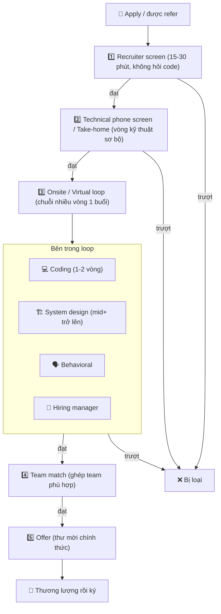

# Quy trình phỏng vấn tech — Bức tranh từ apply đến offer

> **Tác giả:** Mr.Rom\
> **Phiên bản:** v1.0.0\
> **Tạo lúc:** 13/06/2026\
> **Cập nhật:** 13/06/2026\
> **Level:** Basic\
> **Tags:** career, interview-prep, interview-pipeline, recruiter-screen, technical-screen, onsite-loop, system-design, behavioral, soft-skills\
> **Yêu cầu trước:** [Tìm việc & Đánh giá offer (career-path)](../../../career-path/lessons/01_basic/03_job-search-and-offer.md)

> 🎯 *Ở career-path bạn đã thấy pipeline tuyển dụng từ xa: recruiter screen → technical screen → onsite loop → team match → offer. Bài này phóng to bức tranh đó — đi qua từng vòng để hiểu **mỗi vòng người ta đánh giá điều gì**, vì sao FAANG khác startup khác outsource khác product VN, và cần mang theo "vũ khí" gì cho từng vòng. Đây là tấm bản đồ tổng để bạn không lạc, trước khi 4 bài sau dạy bạn cách thắng từng vòng cụ thể. Kết bài bạn sẽ biết chính xác mình đang phải chuẩn bị cho cái gì.*

## 🎯 Sau bài này bạn sẽ

- [ ] Vẽ được toàn cảnh pipeline phỏng vấn tech từ apply đến offer, biết mỗi vòng lọc thứ gì
- [ ] Phân biệt 4 vòng đánh giá lõi trong loop: coding, system design, behavioral, hiring manager
- [ ] Hiểu quy trình khác nhau ra sao giữa FAANG/big-tech, startup, outsource/agency, và product VN
- [ ] Biết mỗi vòng cần mang "vũ khí" gì — và bài nào trong cụm này dạy vũ khí đó
- [ ] Đặt được tâm thế đúng: phỏng vấn là đánh giá hai chiều và là kỹ năng học được, không phải cuộc thi định đoạt giá trị con người

---

## Tình huống — recruiter vừa gọi và bạn không biết phía trước có gì

Bạn nộp đơn (hoặc được refer) vào một công ty tech. Vài ngày sau, một recruiter nhắn: *"Bên mình muốn tiến hành quy trình phỏng vấn với bạn. Vòng đầu là một cuộc gọi 30 phút, sau đó sẽ có technical screen, rồi nếu ổn sẽ là onsite loop."*

Bạn gật đầu cho có, cúp máy, rồi ngồi ngẩn ra với một loạt câu hỏi không ai trả lời:

- "Technical screen" với "onsite loop" **khác nhau ở đâu**? Vòng nào hỏi code, vòng nào không?
- Có **bao nhiêu vòng** tất cả? Mất bao lâu? Mỗi vòng ai sẽ phỏng vấn mình?
- "System design" mà người ta nhắc tới là gì — mình mới ra trường thì có bị hỏi không?
- Mình nên **ôn cái gì trước**? Lao vào luyện thuật toán ngay, hay còn thứ khác quan trọng hơn?

Đa số người trượt phỏng vấn không phải vì dở code. Họ trượt vì **không biết phía trước có gì** — mang dao đi đánh trận cần súng, dồn hết sức luyện thuật toán rồi đứng hình ở vòng behavioral, hoặc hoảng loạn ở vòng system design vì tưởng "chỉ hỏi coding".

Phỏng vấn tech không phải một buổi duy nhất, cũng không phải trò may rủi. Nó là một **chuỗi vòng có cấu trúc**, mỗi vòng lọc một thứ rất cụ thể. Khi bạn nhìn được cả chuỗi, bạn chuẩn bị đúng thứ cho đúng vòng — và nỗi sợ "không biết phía trước có gì" tan biến. Bài này là tấm bản đồ đó.

Ở cụm career-path, bài *Tìm việc & Đánh giá offer* đã phác pipeline này từ góc nhìn "tìm việc" — chọn kênh apply, theo dõi nhiều công ty song song, đánh giá và thương lượng offer. Bài này đi sâu vào **bản thân quy trình phỏng vấn**: từng vòng đánh giá gì và chuẩn bị ra sao. Hai bài bổ sung cho nhau — career-path lo "làm sao có offer giữa nhiều lựa chọn", cụm này lo "làm sao qua được từng vòng".

---

## 1️⃣ Toàn cảnh pipeline — bạn sẽ đi qua những phòng nào?

Trước khi mổ xẻ từng vòng, hãy nhìn cả bản đồ một lần. Beginner hay tưởng "phỏng vấn" là một buổi gặp mặt rồi biết kết quả. Thực tế, một quy trình phỏng vấn tech điển hình là **một chuỗi nhiều vòng nối tiếp**, trải dài qua nhiều tuần, mỗi vòng do người khác phụ trách và lọc một tiêu chí khác.

🪞 **Ẩn dụ**: quy trình phỏng vấn như **một chuỗi cửa ải qua nhiều căn phòng**. Mỗi phòng có một người gác cửa hỏi một loại câu hỏi. Phòng đầu kiểm tra "bạn có đúng người chúng tôi tìm không"; phòng sau kiểm tra "bạn có viết được code không"; phòng trong cùng mới hỏi sâu về kỹ thuật, thiết kế, và cách bạn làm việc với người khác. Qua được phòng này mới mở được phòng sau. Cái hay: nếu bạn **biết trước phòng kế tiếp gác cửa hỏi gì**, bạn cầm sẵn đúng "chìa khoá" — đó chính là toàn bộ mục đích của việc chuẩn bị.

Sơ đồ dưới là pipeline điển hình ở một công ty tech tầm trung trở lên. Đây là khái niệm trừu tượng nhất của bài, nên ta vẽ ra trước để có khung nhìn chung, rồi mới đi vào từng vòng.

→ Điểm cốt lõi của sơ đồ: mỗi vòng **lọc một thứ khác nhau**, nên trượt một vòng không có nghĩa "bạn dở toàn diện". Bạn có thể code rất chắc nhưng trượt recruiter screen vì lệch kỳ vọng lương — đó là vấn đề thông tin, không phải năng lực. Càng vào sâu, cường độ càng tăng: vòng đầu sàng nhanh trong nửa tiếng, vòng loop có thể là cả một buổi gồm 3-5 cuộc phỏng vấn liên tiếp. Giờ ta đi qua từng vòng theo thứ tự.

---

## 2️⃣ Vòng 1 — Recruiter screen: lọc "có đúng người không"

Cuộc gọi đầu tiên thường là với một **recruiter** (người tuyển dụng) — *không phải kỹ sư*. Họ hiếm khi hỏi code. Nhiều người mới chủ quan bỏ qua vòng này vì nghĩ "chưa phải kỹ thuật, dễ mà", rồi trượt một cách lãng xẹt.

Mục tiêu của recruiter là **sàng lọc nhanh** vài thứ cơ bản trước khi tốn thời gian của cả team kỹ sư:

- Bạn có **thật sự quan tâm** vị trí/công ty này không, hay đang rải đơn?
- **Kỳ vọng lương** của bạn có nằm trong ngân sách của họ không?
- Bạn có đủ **điều kiện cơ bản** không (thời gian bắt đầu, on-site/remote, visa/work permit nếu cần)?
- **Giao tiếp** của bạn có rõ ràng, dễ chịu không?

Recruiter screen trượt nhiều nhất vì những lý do "không liên quan tới skill code": lệch kỳ vọng lương, không trả lời được "vì sao bạn muốn vào đây", hoặc nói lan man không thoát ý. Hai thứ nên chuẩn bị sẵn trước khi bốc máy:

- Một câu **giới thiệu bản thân** gọn (30-60 giây): bạn là ai, làm gì, đang tìm gì.
- Một **khoảng lương (range)** đã nghĩ sẵn — để không bị hỏi bất ngờ rồi nói đại một con số tự làm khó mình.

> [!TIP]
> Khi recruiter hỏi "kỳ vọng lương của bạn là bao nhiêu", đừng đưa một con số cứng ngay nếu bạn chưa rõ ngân sách của họ. Bạn có thể hỏi ngược lịch sự: *"Anh/chị có thể chia sẻ khoảng ngân sách (range) cho vị trí này không ạ? Em muốn chắc là kỳ vọng của hai bên khớp nhau."* Phần thương lượng chi tiết đã có ở bài *Tìm việc & Đánh giá offer* bên career-path.

→ Vòng này không khó về kỹ thuật, nhưng là **cửa đầu tiên dễ rơi vì chủ quan**. Qua được nó, bạn mới chạm tới phần kỹ thuật thật.

---

## 3️⃣ Vòng 2 — Technical phone screen / Take-home: lọc "có viết được code không"

Bây giờ mới tới kỹ thuật, nhưng vẫn là **sàng lọc**, chưa phải đánh giá sâu. Mục tiêu của vòng này khiêm tốn: lọc ra những người **không thể viết code hoạt động được**. Bạn chưa cần xuất sắc — chỉ cần chứng minh viết được code chạy đúng và nói được suy nghĩ của mình.

Vòng này thường có một trong ba dạng (đôi khi kết hợp):

| Dạng | Diễn ra thế nào | Đánh giá gì |
|---|---|---|
| **Technical phone screen / Live coding** | Bạn giải một bài thuật toán mức nhẹ-vừa trong khi một kỹ sư xem qua share màn hình (thường trên CoderPad, HackerRank, hoặc Google Doc) | Bạn nghĩ ra hướng giải, viết code chạy được, và **nói rõ suy nghĩ trong lúc làm** |
| **Take-home assignment** | Bài tập về nhà — thường là một feature nhỏ hoặc một bài toán; bạn làm trong vài ngày rồi nộp code | Code sạch, có cấu trúc, có test, README rõ ràng — chất lượng kỹ sư thật sự |
| **Online assessment (OA)** | Bài test tự động chấm trên nền tảng (HackerRank, Codility); thường gặp ở big-tech và một số công ty tuyển số lượng lớn | Giải đúng các test case trong thời gian giới hạn |

Lưu ý: **take-home** và **live coding** đo những thứ hơi khác nhau. Live coding đo khả năng nghĩ-và-nói dưới áp lực thời gian thực; take-home đo chất lượng code khi bạn có thời gian suy nghĩ kỹ. Một số người mạnh cái này yếu cái kia — biết trước dạng nào để luyện đúng. Với online assessment tự chấm, hãy đọc kỹ đề và cẩn thận edge case, vì máy chấm không "thông cảm" cho code gần đúng.

Điểm mấu chốt mà nhiều người bỏ lỡ: ở live coding, **cách bạn giao tiếp trong lúc code quan trọng ngang code chính nó**. Người phỏng vấn cần thấy bạn tư duy thế nào, đặt câu hỏi làm rõ đề ra sao, xử lý lúc bí ra sao — chứ không chỉ chấm đáp án cuối. Kỹ năng "vừa code vừa nói" này là trọng tâm của bài coding tiếp theo trong cụm.

→ Qua được vòng này nghĩa là họ tin bạn viết được code thật. Giờ mới tới phần nặng nhất — onsite loop.

---

## 4️⃣ Vòng 3 — Onsite / Virtual loop: chuỗi nhiều vòng đánh giá sâu

Đây là **vòng nặng nhất và quyết định nhất**: một chuỗi **nhiều buổi phỏng vấn liên tiếp** (thường 3-5 buổi trong một ngày, gọi là "loop"). "Onsite" là tên gọi cũ từ thời ứng viên phải tới văn phòng cả ngày; ngày nay rất nhiều công ty làm loop này qua video, gọi là **virtual onsite**. Mỗi buổi do một người khác phụ trách, đánh giá một khía cạnh khác — và thường có một buổi "bar raiser" hoặc người quyết định cuối.

Đừng để cụm từ "loop" làm bạn hoảng. Nó chỉ là cách gọi việc gom nhiều vòng vào một block thời gian. Bên trong loop điển hình có 4 loại vòng:

| Buổi trong loop | Đánh giá điều gì | Bài dạy trong cụm |
|---|---|---|
| **Coding** (1-2 buổi) | Giải bài khó hơn vòng screen, code sạch, xử lý edge case, độ phức tạp (Big-O) | [Coding Interview & DSA](01_coding-interview-and-dsa.md) |
| **System design** | Thiết kế hệ thống ở mức cao (thường cho mid+ trở lên) | [System Design Interview](02_system-design-interview.md) |
| **Behavioral** | Cách bạn làm việc nhóm, xử lý xung đột, kể lại dự án cũ | [Behavioral Interview & STAR](03_behavioral-interview-and-star.md) |
| **Hiring manager** | Sự phù hợp với team, động lực, định hướng — phỏng vấn hai chiều | (cover trong bài này + bài STAR) |

🪞 **Ẩn dụ**: nếu cả pipeline là chuỗi cửa ải, thì loop là **căn phòng trong cùng có nhiều giám khảo cùng chấm bạn từ các góc khác nhau** — một người chấm tay nghề (coding), một người chấm tầm nhìn (design), một người chấm tính cách làm việc (behavioral), một người chấm độ hợp gu (hiring manager). Bạn phải đủ tốt ở nhiều mặt, không chỉ giỏi một thứ. Đây là lý do "chỉ luyện thuật toán" không đủ để qua loop.

Ta đi nhanh qua từng loại vòng để bạn thấy chúng khác nhau ra sao.

### Vòng coding trong loop

Khó hơn vòng screen: bài có thể yêu cầu cấu trúc dữ liệu/thuật toán phức tạp hơn, và người phỏng vấn soi kỹ hơn — code có sạch không, bạn có nghĩ tới edge case không, có phân tích được độ phức tạp thời gian/bộ nhớ (Big-O) không. Quan trọng không kém: bạn **giao tiếp** thế nào khi code. Bài *Coding Interview & DSA* sẽ dạy cả tư duy giải bài lẫn cách nói trong lúc code.

### Vòng system design

Đây là vòng làm người mới sợ nhất vì nó **mở** — không có một đáp án đúng duy nhất. Câu hỏi kiểu *"Thiết kế một hệ thống rút gọn URL"* hay *"Thiết kế bảng tin (news feed)"*. Họ không chấm bạn ra "đáp án", mà chấm **cách bạn tiếp cận một bài toán mơ hồ**: làm rõ yêu cầu, ước lượng quy mô, vẽ kiến trúc, chọn trade-off và bảo vệ lựa chọn. Bài *System Design Interview* sẽ cho bạn một framework để không "đứng hình" trước câu hỏi mở.

> [!IMPORTANT]
> System design **thường chỉ áp dụng từ mid-level trở lên**. Nếu bạn ứng tuyển vị trí Junior/Fresher, loop của bạn nhiều khả năng **không có vòng này**, hoặc chỉ là một câu hỏi design rất nhẹ. Đừng để vòng này làm bạn hoảng nếu bạn mới ra trường — hãy hỏi recruiter trước: *"Loop của em có vòng system design không ạ?"* để biết chính xác mà ôn cho đúng.

### Vòng behavioral

Vòng này hỏi về **con người bạn trong công việc**: *"Kể về một lần bạn bất đồng với đồng đội"*, *"Mô tả một dự án bạn tự hào nhất"*, *"Lần bạn thất bại và học được gì"*. Đây không phải vòng "cho có" — ở nhiều công ty (đặc biệt big-tech), trượt behavioral là trượt cả loop, dù coding xuất sắc. Bí quyết là kể chuyện có cấu trúc bằng phương pháp **STAR** (Situation → Task → Action → Result), được dạy kỹ ở bài *Behavioral Interview & STAR*.

### Vòng hiring manager

**Hiring manager** thường là người sẽ làm sếp trực tiếp của bạn. Vòng này đánh giá sự phù hợp với team, động lực, và định hướng của bạn — đồng thời là **phỏng vấn hai chiều**: đây là cơ hội vàng để bạn hỏi ngược về công việc thực tế, văn hoá, và lộ trình phát triển. Đừng bỏ phí phần "bạn có câu hỏi gì không?" ở cuối — nó vừa giúp bạn ghi điểm, vừa giúp bạn phát hiện red flags (xem lại bài career-path).

---

## 5️⃣ Vòng 4 & 5 — Team match và Offer

Qua được loop là phần khó nhất đã xong, nhưng vẫn còn hai bước nhẹ hơn trước khi cầm offer.

### Team match

Ở nhiều công ty lớn, qua loop nghĩa là bạn đã "đạt chuẩn công ty" — nhưng **chưa thuộc team nào cụ thể**. **Team match** là bước ghép bạn với một team đang tuyển. Bạn có thể nói chuyện với 1-2 hiring manager để xem hợp gu không. Đây là cơ hội **hai chiều**: họ chọn bạn, nhưng bạn cũng được chọn team — đừng ngại hỏi kỹ về công việc thực tế, tech stack, và phong cách làm việc của team đó.

Ở công ty nhỏ và phần lớn công ty Việt Nam, bước này thường **không tồn tại riêng** — bạn phỏng vấn cho một vị trí cụ thể của một team cụ thể ngay từ đầu, nên qua loop là gần như chắc có offer.

### Offer

Bạn qua hết → recruiter gọi báo "chúng tôi muốn mời bạn". Họ gửi một **offer** (thư mời) ghi rõ lương cơ bản, các khoản khác (bonus, equity, benefit), ngày bắt đầu. **Đây chưa phải lúc gật đầu ngay** — đây là lúc đánh giá trên nhiều trục và thương lượng lịch sự.

> [!NOTE]
> Phần đánh giá offer (7 trục: base, bonus, equity, benefit, growth, team & sếp, remote) và cách thương lượng (negotiation) đã được dạy chi tiết ở bài *Tìm việc & Đánh giá offer* bên career-path — bài yêu cầu trước của bài này. Cụm interview-prep tập trung vào việc **qua được các vòng phỏng vấn**; khâu "đánh giá và chốt offer" thuộc về career-path. Hai mảnh ghép vào nhau thành bức tranh hoàn chỉnh.

---

## 6️⃣ Khác biệt theo loại công ty — không có một pipeline "chuẩn"

Cái khung 5 vòng ở trên là **mẫu số chung**, nhưng thực tế mỗi loại công ty xoay nó theo kiểu riêng. Hiểu sự khác biệt này cực kỳ quan trọng: nó quyết định bạn **ôn cái gì nhiều, cái gì ít**. Luyện thuật toán hard cho một công ty outsource có thể là phí công; xem nhẹ behavioral cho một big-tech có thể là tự sát.

🪞 **Ẩn dụ**: cùng là "thi tuyển", nhưng mỗi loại công ty như **một loại kỳ thi khác nhau**. Big-tech như một kỳ thi chuẩn hoá toàn quốc — đề bài rõ ràng, có công thức ôn, chấm theo rubric cứng. Startup như một buổi phỏng vấn việc thực tế — "làm được việc cho tôi ngay không". Outsource như kiểm tra tay nghề thợ — "thạo công cụ và làm nhanh không". Product VN nằm đâu đó giữa, đang dịch dần về phía chuẩn hoá.

Bảng dưới so sánh 4 nhóm công ty phổ biến mà người đi phỏng vấn ở Việt Nam hay gặp. Đọc để biết nhóm bạn đang nhắm tới đề cao gì.

| Tiêu chí | **FAANG / Big-tech** | **Startup** | **Outsource / Agency** | **Product VN** |
|---|---|---|---|---|
| **Số vòng** | Nhiều (4-6+), quy trình chuẩn hoá rõ | Ít, gọn (2-3), linh hoạt | Trung bình (2-4) | Trung bình (3-4), đang chuẩn hoá dần |
| **Coding / DSA** | Rất nặng, thuật toán mức medium-hard | Vừa, thiên về bài thực tế hơn lý thuyết | Vừa, thiên kỹ năng dùng framework/stack | Vừa-nặng tuỳ công ty |
| **System design** | Bắt buộc từ mid+, soi rất kỹ | Có nhưng thực dụng ("xây cái này sao") | Ít gặp, hoặc nhẹ | Có ở mid+ |
| **Behavioral** | Rất quan trọng, có rubric riêng (vd leadership principles) | Hỏi nhẹ, thiên "hợp gu founder/team" | Thường nhẹ | Tuỳ — công ty lớn hỏi kỹ hơn |
| **Take-home** | Hiếm (thiên live coding + OA) | Hay dùng (kiểm tra làm việc thật) | Hay dùng | Khá phổ biến |
| **Đề cao nhất** | Tư duy thuật toán + design + culture fit | "Làm được việc ngay" + nhiệt + đa năng | Thạo stack + giao tiếp client (có thể tiếng Anh) | Cân bằng nền tảng + thực chiến |

> [!IMPORTANT]
> Đừng ôn theo kiểu "một cỡ cho tất cả". **Hỏi recruiter ngay từ vòng screen** về quy trình: *"Quy trình phỏng vấn gồm mấy vòng ạ, có những loại vòng nào (coding, system design, take-home...)?"* Recruiter gần như luôn sẵn lòng nói — và câu trả lời cho bạn biết chính xác phải dồn sức ôn vào đâu. Một câu hỏi 10 giây tiết kiệm cho bạn hàng tuần ôn sai trọng tâm.

Vài lưu ý thực tế cho từng nhóm:

- **FAANG / Big-tech** — quy trình bài bản nhất, nhưng cũng "ôn được" nhất vì có công thức rõ. Đầu tư đều cho cả 3 trục coding + design + behavioral. Behavioral ở đây không phải "cho có" — nhiều công ty có bộ nguyên tắc văn hoá mà người phỏng vấn chấm theo.
- **Startup** — nhanh, ít vòng, nhưng "đậm đặc". Họ cần người **làm được việc ngay** và **đa năng**. Take-home hoặc bài thực tế phổ biến. Culture fit với founder/team nhỏ rất quan trọng vì mỗi người ảnh hưởng lớn.
- **Outsource / Agency** — đề cao **thạo stack cụ thể** và đôi khi **giao tiếp tiếng Anh** (vì làm việc với client nước ngoài). Thuật toán hard ít gặp; thay vào đó là bài sát công việc thật.
- **Product VN** — đa dạng, đang trên đà chuẩn hoá theo hướng big-tech. Công ty product lớn (ví, e-commerce, fintech) ngày càng hỏi system design và behavioral nghiêm túc hơn.

→ Bài học: **một CV, nhưng nhiều chiến lược ôn**. Biết mình đang thi "kỳ thi loại nào" rồi mới phân bổ thời gian ôn cho khớp.

---

## 7️⃣ Tổng quan cách chuẩn bị — vũ khí nào cho vòng nào

Giờ bạn đã có bản đồ các vòng và biết loại công ty xoay nó ra sao. Câu hỏi cuối: **ôn cái gì, ôn theo thứ tự nào?** Đây là phần dẫn bạn vào 4 bài còn lại của cụm.

Nguyên tắc nền: **mỗi vòng cần một loại vũ khí khác nhau**, và bạn chuẩn bị chúng song song chứ không tuần tự. Bảng dưới ánh xạ vòng → vũ khí → bài dạy, để bạn biết chính xác nên mở bài nào khi cần ôn vòng nào.

| Vòng phỏng vấn | Vũ khí cần có | Bài dạy trong cụm |
|---|---|---|
| Technical screen + Coding loop | Tư duy giải bài DSA + giao tiếp khi code (vừa code vừa nói, làm rõ đề, phân tích Big-O) | [Coding Interview & DSA — Tư duy giải bài + giao tiếp khi code](01_coding-interview-and-dsa.md) |
| System design loop | Framework trả lời câu hỏi mở (làm rõ yêu cầu → ước lượng → vẽ kiến trúc → trade-off) | [System Design Interview — Framework trả lời câu hỏi mở](02_system-design-interview.md) |
| Behavioral loop | Kho câu chuyện kể theo cấu trúc STAR (Situation-Task-Action-Result) | [Behavioral Interview & STAR — Kể chuyện thuyết phục](03_behavioral-interview-and-star.md) |
| Cả loop (tổng hợp) | Kế hoạch ôn có lịch + luyện mock interview để bớt run, quen áp lực | [Kế hoạch ôn & Mock Interview — Biến luyện tập thành offer](04_prep-plan-and-mock-interview.md) |

> [!TIP]
> Thứ tự gợi ý khi bắt đầu ôn: (1) đọc bài này để có bản đồ; (2) **hỏi recruiter pipeline cụ thể** để biết có những vòng nào; (3) ôn coding làm nền (vì gần như công ty nào cũng có); (4) thêm system design nếu loop của bạn có; (5) chuẩn bị behavioral (đừng để tới phút chót — viết sẵn 5-7 câu chuyện STAR); (6) chạy mock interview để ráp tất cả lại dưới áp lực thật. Bài 04 sẽ cho bạn một kế hoạch ôn cụ thể.

Một điểm nữa cần nói thẳng: **phỏng vấn là một kỹ năng riêng, tách khỏi kỹ năng làm việc thực tế**. Có người làm việc xuất sắc nhưng phỏng vấn kém, và ngược lại. Tin tốt: vì nó là kỹ năng, nó **luyện được**. Người "giỏi phỏng vấn" phần lớn không phải thiên tài — họ chỉ luyện đủ nhiều để quen với định dạng và bớt run. Đó là toàn bộ tinh thần của cụm này.

---

## 8️⃣ Tâm thế đúng — phỏng vấn là gì và không là gì

Kỹ thuật chỉ là một nửa. Nửa còn lại — thứ quyết định bạn có giữ được bình tĩnh để thể hiện hết khả năng hay không — là **tâm thế**. Rất nhiều người trượt không phải vì thiếu kiến thức, mà vì để nỗi sợ chiếm lấy.

Bốn cách nghĩ lại (reframe) dưới đây giúp bạn vào phòng phỏng vấn với đúng tâm thế. Hãy đọc kỹ, vì chúng quan trọng ngang bất kỳ thuật toán nào.

| ❌ Tâm thế gây hại | ✅ Tâm thế đúng |
|---|---|
| "Đây là kỳ thi định đoạt mình giỏi hay dở" | "Đây là một cuộc trò chuyện kỹ thuật hai chiều — họ xem mình có hợp không, **mình cũng xem họ có đáng vào không**" |
| "Trượt nghĩa là mình kém cỏi" | "Trượt thường là **lệch fit hoặc thiếu may mắn ở một vòng**, không phải bản án về giá trị con người mình" |
| "Mình phải biết mọi đáp án ngay lập tức" | "Bí một lúc là bình thường — **cách mình xử lý lúc bí** mới là thứ người ta chấm" |
| "Phải giấu chỗ mình không chắc" | "Nói thật khi không chắc + suy luận ra tiếng > giả vờ biết rồi sai. Người phỏng vấn quý sự trung thực và tư duy" |

🪞 **Ẩn dụ**: đừng coi phỏng vấn như **một bài kiểm tra cuối kỳ** (đúng/sai, qua/trượt, định đoạt số phận). Hãy coi nó như **một buổi hẹn đầu tiên** giữa hai bên đang tìm hiểu nhau. Buổi hẹn không hợp không có nghĩa ai đó "thất bại" — chỉ là chưa hợp gu. Tâm thế "buổi hẹn" giúp bạn thả lỏng, là chính mình, và quan sát đối phương — thay vì căng cứng tìm cách "làm hài lòng giám khảo".

Vài điều cụ thể rút ra từ tâm thế này:

- **Phỏng vấn là hai chiều.** Bạn không phải kẻ cầu xin. Họ cũng đang cần người, đã tốn công đưa bạn tới đây. Hãy hỏi ngược thật nhiều — vừa ghi điểm, vừa thu thập thông tin để quyết định.
- **Tư duy ra tiếng (think out loud).** Ở mọi vòng kỹ thuật, người phỏng vấn chấm **quá trình suy nghĩ** nhiều hơn đáp án cuối. Im lặng giải trong đầu rồi đưa kết quả là tự thiệt — họ không thấy được bạn giỏi ở đâu.
- **Trượt là dữ liệu, không phải bản án.** Mỗi lần trượt, xin feedback nếu được, ghi lại mình vấp ở đâu, rồi vá lỗ hổng đó. Người được offer cuối cùng thường là người đã trượt vài lần và học từ đó.
- **Run là bình thường — và luyện tập làm nó nhẹ đi.** Cách chống run hiệu quả nhất không phải "cố bình tĩnh", mà là **mock interview** đủ nhiều để định dạng phỏng vấn trở nên quen thuộc (bài 04).

> [!TIP]
> Trước mỗi buổi phỏng vấn, tự nhắc một câu: *"Mình tới đây để trò chuyện và cùng xem hai bên có hợp không — không phải để cầu xin một suất."* Một câu nhỏ nhưng đổi hẳn tư thế bạn bước vào phòng. Người tự tin (không phải tự cao) luôn dễ mến hơn người sợ sệt.

---

## 💡 Cạm bẫy thường gặp & Best practice

### ❌ Cạm bẫy: dồn 100% sức vào luyện thuật toán, bỏ quên các vòng khác

- **Triệu chứng**: cày hàng trăm bài LeetCode, nhưng đứng hình ở vòng behavioral ("kể về một xung đột bạn từng gặp") và lúng túng ở system design.
- **Nguyên nhân**: tưởng "phỏng vấn tech = thi thuật toán", không biết loop điển hình gồm 4 loại vòng đánh giá 4 thứ khác nhau.
- **Cách tránh**: phân bổ thời gian ôn theo **đúng pipeline của công ty mình nhắm** (hỏi recruiter để biết có vòng nào). Coding là nền, nhưng behavioral và system design (nếu áp dụng) cũng quyết định kết quả. Chuẩn bị cả ba song song.

### ❌ Cạm bẫy: coi nhẹ recruiter screen vì "chưa phải kỹ thuật"

- **Triệu chứng**: trượt ngay vòng đầu vì trả lời lan man "vì sao muốn vào công ty", hoặc nói một con số lương lệch hẳn ngân sách rồi bị loại trước cả khi tới phần code.
- **Nguyên nhân**: nghĩ "recruiter không hỏi code thì dễ", không chuẩn bị gì.
- **Cách tránh**: chuẩn bị sẵn câu giới thiệu bản thân 30-60 giây, một khoảng lương đã nghĩ kỹ, và lý do cụ thể vì sao muốn vào công ty này. Vòng đầu trượt thì mọi kỹ năng code phía sau thành vô nghĩa.

### ✅ Best practice: hỏi recruiter rõ pipeline ngay từ vòng đầu

- **Vì sao**: mỗi loại công ty xoay pipeline khác nhau; ôn sai trọng tâm là phí thời gian quý giá. Biết trước có vòng nào giúp bạn dồn sức đúng chỗ.
- **Cách áp dụng**: ở recruiter screen, hỏi thẳng: *"Quy trình gồm mấy vòng và có những loại vòng nào ạ (coding, system design, take-home, behavioral)?"* và *"Loop sẽ kéo dài bao lâu, mỗi vòng ai phụ trách?"*. Ghi lại vào bảng theo dõi pipeline (template ở bài career-path) để ôn cho khớp.

### ✅ Best practice: vào phòng với tâm thế "trò chuyện hai chiều", tư duy ra tiếng

- **Vì sao**: tâm thế "đi thi" gây căng cứng làm bạn thể hiện dưới khả năng thật; tâm thế "trò chuyện" giúp thả lỏng và là chính mình. Tư duy ra tiếng để người phỏng vấn thấy được quá trình suy nghĩ — thứ họ chấm nhiều hơn đáp án.
- **Cách áp dụng**: nhắc bản thân "đây là buổi tìm hiểu hai chiều" trước khi vào; chuẩn bị sẵn câu hỏi ngược cho mỗi vòng; trong vòng kỹ thuật, nói to suy nghĩ ("Mình đang nghĩ tới hai hướng: ... mình chọn hướng A vì ..."); khi bí, nói thật và suy luận ra tiếng thay vì im lặng hoặc giả vờ biết.

---

## 🧠 Tự kiểm tra (Self-check)

**Q1.** Recruiter nói "vòng đầu là recruiter screen, sau đó là technical screen, rồi onsite loop". Ba cụm này khác nhau ở đâu, mỗi vòng ai phụ trách và lọc gì?

💡 Xem giải thích

- **Recruiter screen** do một **recruiter** (không phải kỹ sư) thực hiện, ~15-30 phút, hiếm khi hỏi code. Lọc: bạn có nghiêm túc với vị trí, kỳ vọng lương có khớp ngân sách, điều kiện cơ bản (thời gian bắt đầu, remote/on-site), và giao tiếp có ổn.
- **Technical screen** do một **kỹ sư** thực hiện, là vòng kỹ thuật **sơ bộ** (live coding nhẹ-vừa, online assessment, hoặc take-home). Lọc ra người không viết được code hoạt động — chưa cần xuất sắc.
- **Onsite / loop** là chuỗi **nhiều buổi liên tiếp** (coding sâu + system design + behavioral + hiring manager), mỗi buổi một người, đánh giá sâu nhiều khía cạnh. Đây là vòng nặng và quyết định nhất.

Tóm lại: vòng 1 lọc "đúng người không", vòng 2 lọc "viết được code không", loop đánh giá sâu "giỏi tới đâu và hợp không".

**Q2.** Bạn là Fresher mới ra trường, ứng tuyển một công ty product VN. Bạn có cần lo lắng nhiều về vòng system design không? Nên làm gì để chắc chắn?

💡 Xem giải thích

System design **thường chỉ áp dụng từ mid-level trở lên**. Với vị trí Fresher/Junior, loop của bạn nhiều khả năng **không có vòng này**, hoặc nếu có chỉ là câu hỏi design rất nhẹ. Thay vì lo lắng đoán mò, hãy làm điều chắc chắn nhất: **hỏi recruiter** ngay từ vòng screen — *"Loop của em có vòng system design không ạ, và gồm những loại vòng nào?"*. Câu trả lời cho bạn biết chính xác phải ôn gì, tránh phí thời gian luyện một vòng có thể không xuất hiện. Với Fresher, trọng tâm thường là coding/DSA nền tảng và behavioral.

**Q3.** Một bạn nói: "Mình cứ cày thật nhiều LeetCode là chắc chắn qua phỏng vấn." Câu này thiếu sót ở đâu?

💡 Xem giải thích

Thiếu sót ở chỗ coi "phỏng vấn tech = thi thuật toán". Thực tế một loop điển hình gồm **4 loại vòng** đánh giá 4 thứ khác nhau: coding (DSA), system design, behavioral, và hiring manager fit. Cày LeetCode chỉ chuẩn bị cho **một** trong số đó. Người chỉ giỏi thuật toán nhưng kể chuyện behavioral lủng củng, hoặc đứng hình trước câu hỏi system design mở, vẫn trượt loop. Ngoài ra, ngay cả ở vòng coding, **cách giao tiếp trong lúc code** (tư duy ra tiếng, làm rõ đề) cũng được chấm, không chỉ đáp án. Chuẩn bị đúng nghĩa là ôn song song cả ba trục theo đúng pipeline của công ty mình nhắm.

**Q4.** Vì sao cùng một CV nhưng chiến lược ôn cho một big-tech và một công ty outsource lại nên khác nhau?

💡 Xem giải thích

Vì mỗi loại công ty **đề cao thứ khác nhau** và xoay pipeline theo kiểu riêng. **Big-tech** soi rất kỹ tư duy thuật toán (medium-hard), system design (từ mid+), và behavioral có rubric riêng — nên cần ôn đều cả ba trục bài bản. **Outsource/agency** đề cao **thạo stack cụ thể** và đôi khi **giao tiếp tiếng Anh với client**, ít hỏi thuật toán hard, hay dùng take-home sát công việc thật — nên dồn sức vào thực hành stack và giao tiếp hơn là cày thuật toán khó. Ôn "một cỡ cho tất cả" sẽ vừa thừa (luyện hard cho outsource) vừa thiếu (xem nhẹ behavioral cho big-tech). Cách an toàn nhất: hỏi recruiter pipeline cụ thể rồi phân bổ thời gian cho khớp.

**Q5.** Trong vòng coding, bạn bị bí giữa chừng, chưa nghĩ ra cách tối ưu. Phản ứng nào tốt hơn: (a) im lặng cố nghĩ cho ra rồi mới nói, hay (b) nói ra suy nghĩ hiện tại dù chưa hoàn chỉnh?

💡 Xem giải thích

Phản ứng (b) — **nói ra suy nghĩ (think out loud)** — tốt hơn hẳn. Người phỏng vấn chấm **quá trình tư duy** nhiều hơn đáp án cuối; nếu bạn im lặng, họ không thấy được bạn giỏi ở đâu, và có khi tưởng bạn "đứng hình". Khi bí, hãy nói thật: *"Mình thấy cách brute-force chạy được nhưng O(n²), mình đang nghĩ xem dùng hash map có giảm xuống O(n) không..."*. Cách này thường khiến người phỏng vấn **gợi ý** đúng hướng — họ ở đó để xem bạn làm việc thế nào, không phải để bẫy bạn. Nói thật khi không chắc + suy luận ra tiếng luôn tốt hơn giả vờ biết rồi sai. Đây cũng là một phần của tâm thế "trò chuyện hai chiều" thay vì "đi thi".

---

## ⚡ Tra cứu nhanh (Cheatsheet)

**Pipeline phỏng vấn điển hình:**

| Vòng | Ai phụ trách | Lọc gì |
|---|---|---|
| Recruiter screen | Recruiter (không phải kỹ sư) | Nghiêm túc + lương khớp + điều kiện cơ bản |
| Technical screen / Take-home / OA | Kỹ sư hoặc máy chấm | Viết được code hoạt động |
| Onsite / Virtual loop | Nhiều kỹ sư + hiring manager | Coding sâu + design + behavioral + fit |
| Team match | Hiring manager | Ghép với team phù hợp (công ty lớn) |
| Offer | Recruiter | Đãi ngộ chính thức → đánh giá + thương lượng |

**4 vòng lõi trong loop → vũ khí → bài dạy:**

| Vòng | Vũ khí | Bài |
|---|---|---|
| Coding | Tư duy DSA + giao tiếp khi code | Bài 01 |
| System design | Framework câu hỏi mở (mid+) | Bài 02 |
| Behavioral | Kể chuyện theo STAR | Bài 03 |
| Tổng hợp loop | Kế hoạch ôn + mock interview | Bài 04 |

**Khác biệt theo loại công ty (đề cao nhất):**

| Loại | Đề cao |
|---|---|
| FAANG / Big-tech | Thuật toán + system design + behavioral (rubric) |
| Startup | "Làm được việc ngay" + đa năng + culture fit |
| Outsource / Agency | Thạo stack + giao tiếp client (có thể tiếng Anh) |
| Product VN | Cân bằng nền tảng + thực chiến (đang chuẩn hoá) |

**Tâm thế đúng (4 reframe):**

| Đừng nghĩ | Hãy nghĩ |
|---|---|
| "Kỳ thi định đoạt giá trị mình" | "Trò chuyện kỹ thuật hai chiều" |
| "Trượt = mình kém" | "Trượt = lệch fit, là dữ liệu để cải thiện" |
| "Phải biết mọi đáp án ngay" | "Cách xử lý lúc bí mới là thứ được chấm" |
| "Giấu chỗ mình không chắc" | "Tư duy ra tiếng + nói thật khi chưa chắc" |

**Quy tắc vàng:** Hỏi recruiter pipeline cụ thể ngay từ vòng đầu → ôn cho khớp. Phỏng vấn là kỹ năng riêng, luyện được. Tư duy ra tiếng ở mọi vòng kỹ thuật.

---

## 📚 Từ Điển Thuật Ngữ (Glossary)

| EN | VN | Giải thích |
|---|---|---|
| Pipeline | Luồng tiến trình | Chuỗi các vòng phỏng vấn nối tiếp từ apply đến offer |
| Recruiter screen | Vòng sàng lọc sơ bộ | Cuộc gọi đầu với recruiter, lọc mức độ phù hợp & nghiêm túc |
| Recruiter | Người tuyển dụng | Người lo quy trình tuyển; có thể in-house hoặc headhunter |
| Technical phone screen | Vòng kỹ thuật sơ bộ | Vòng coding/bài đầu tiên qua điện thoại/video, lọc người không viết được code |
| Take-home assignment | Bài tập về nhà | Bài lập trình làm tại nhà rồi nộp lại trong vài ngày |
| Online assessment (OA) | Bài test tự chấm | Bài kiểm tra code chấm tự động trên nền tảng, có giới hạn thời gian |
| Live coding | Code trực tiếp | Giải bài lập trình ngay trong lúc người phỏng vấn theo dõi |
| Onsite | Phỏng vấn tại chỗ | Tên gọi cũ của loop — ngày trước phải tới văn phòng cả ngày |
| Virtual onsite | Loop qua video | Loop phỏng vấn thực hiện từ xa qua video thay vì tới văn phòng |
| Loop | Chuỗi phỏng vấn chính | Nhiều buổi phỏng vấn liên tiếp, mỗi buổi đánh giá một khía cạnh |
| Coding interview | Phỏng vấn lập trình | Vòng giải bài thuật toán/cấu trúc dữ liệu |
| DSA | Cấu trúc dữ liệu & giải thuật | Data Structures & Algorithms — nền tảng của vòng coding |
| Big-O | Độ phức tạp Big-O | Cách mô tả thời gian/bộ nhớ thuật toán tăng theo kích thước đầu vào |
| Edge case | Trường hợp biên | Tình huống hiếm/đặc biệt mà code dễ sai (mảng rỗng, số âm...) |
| System design | Thiết kế hệ thống | Vòng đánh giá khả năng thiết kế hệ thống ở mức cao, câu hỏi mở |
| Trade-off | Đánh đổi | Lựa chọn được-mất khi thiết kế (vd nhanh hơn nhưng tốn bộ nhớ) |
| Behavioral | Phỏng vấn hành vi | Vòng hỏi về cách làm việc nhóm, xử lý tình huống thực tế |
| STAR | Khung kể chuyện STAR | Situation-Task-Action-Result — cấu trúc trả lời câu hỏi behavioral |
| Hiring manager | Quản lý tuyển dụng | Người sẽ là sếp trực tiếp, ra quyết định tuyển cuối cùng |
| Culture fit | Hợp văn hoá | Mức độ ứng viên phù hợp với cách làm việc/giá trị của team |
| Team match | Ghép team | Bước ghép ứng viên đã đạt chuẩn với một team cụ thể |
| Offer | Thư mời làm việc | Đề nghị chính thức kèm lương & điều khoản |
| Negotiation | Thương lượng | Trao đổi để điều chỉnh đãi ngộ trước khi ký |
| FAANG / Big-tech | Công ty công nghệ lớn | Nhóm công ty tech quy mô lớn, quy trình phỏng vấn chuẩn hoá |
| Startup | Công ty khởi nghiệp | Công ty nhỏ, đang tăng trưởng, quy trình linh hoạt |
| Outsource / Agency | Công ty gia công | Công ty làm dự án thuê cho khách hàng (thường nước ngoài) |
| Think out loud | Tư duy ra tiếng | Nói to suy nghĩ trong lúc giải bài để người phỏng vấn theo dõi |
| Mock interview | Phỏng vấn thử | Buổi luyện tập mô phỏng phỏng vấn thật để quen áp lực |
| Red flag | Cờ đỏ cảnh báo | Dấu hiệu cho thấy công ty/môi trường có vấn đề |

---

## 🔗 Liên kết & Tài nguyên

➡️ **Bài tiếp theo:** [Coding Interview & DSA — Tư duy giải bài + giao tiếp khi code](01_coding-interview-and-dsa.md)\
↑ **Về cụm:** [interview-prep — README](../../README.md)

### 🧭 Định hướng lộ trình học

- [Tìm việc & Đánh giá offer — Từ apply đến nhận lời mời](../../../career-path/lessons/01_basic/03_job-search-and-offer.md) — bài yêu cầu trước, vẽ pipeline từ góc nhìn tìm việc + đánh giá/thương lượng offer
- [Coding Interview & DSA — Tư duy giải bài + giao tiếp khi code](01_coding-interview-and-dsa.md) — vũ khí cho vòng technical screen + coding loop

### 🧩 Các chủ đề có thể bạn quan tâm

- [System Design Interview — Framework trả lời câu hỏi mở](02_system-design-interview.md) — vũ khí cho vòng system design (mid+)
- [Behavioral Interview & STAR — Kể chuyện thuyết phục](03_behavioral-interview-and-star.md) — vũ khí cho vòng behavioral
- [Kế hoạch ôn & Mock Interview — Biến luyện tập thành offer](04_prep-plan-and-mock-interview.md) — ráp tất cả lại thành kế hoạch ôn + luyện mock
- [Sự nghiệp trong ngành tech là gì? — Bản đồ vai trò & nấc thang](../../../career-path/lessons/01_basic/00_what-is-a-tech-career.md) — hiểu level để biết loop của mình có những vòng nào

### 🌐 Tài nguyên tham khảo khác

- [Tech Interview Handbook](https://www.techinterviewhandbook.org/) — cẩm nang miễn phí rất đầy đủ về toàn bộ quy trình phỏng vấn tech
- [LeetCode](https://leetcode.com/) — nền tảng luyện bài coding/DSA phổ biến nhất
- [Pramp](https://www.pramp.com/) — luyện mock interview miễn phí với người thật (peer-to-peer)

---

## 📌 Nhật ký thay đổi (Changelog)

- **v1.0.0 (13/06/2026)** — Bản đầu tiên, bài mở đầu cụm interview-prep. Toàn cảnh pipeline phỏng vấn tech từ apply đến offer có sơ đồ mermaid (recruiter screen → technical/take-home screen → onsite/virtual loop gồm coding/system design/behavioral/hiring manager → team match → offer) + phân tích từng vòng đánh giá gì + bảng so sánh quy trình theo 4 loại công ty (FAANG/big-tech, startup, outsource/agency, product VN) + bảng ánh xạ vòng → vũ khí → bài dạy (dẫn vào bài 01-04) + tổng quan cách chuẩn bị + tâm thế đúng (4 reframe + ẩn dụ "buổi hẹn") + 2 cạm bẫy + 2 best practice + 5 self-check + cheatsheet + glossary 29 thuật ngữ.
