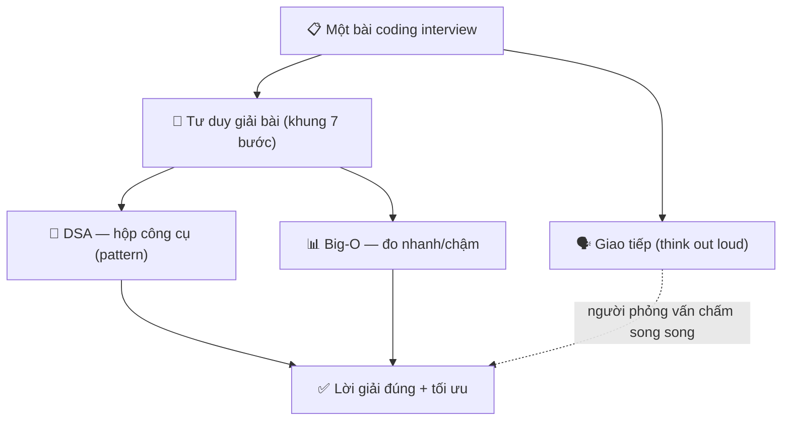
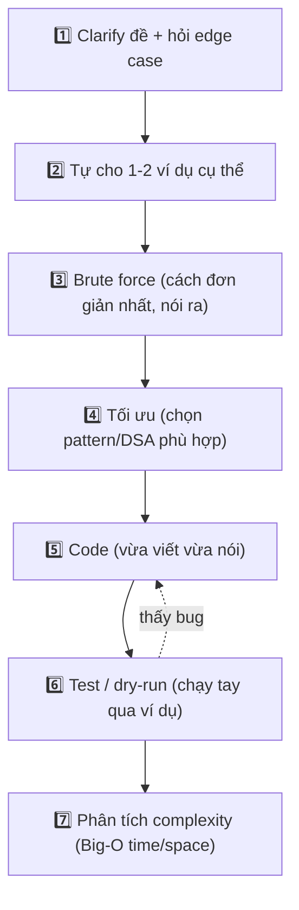

# 💻 Coding Interview & DSA — Tư duy giải bài + giao tiếp khi code

> **Tác giả:** Mr.Rom\
> **Phiên bản:** v1.0.0\
> **Tạo lúc:** 13/06/2026\
> **Cập nhật:** 13/06/2026\
> **Level:** Basic\
> **Tags:** interview, coding-interview, dsa, big-o, algorithms, patterns, leetcode, soft-skills\
> **Yêu cầu trước:** [Quy trình phỏng vấn tech](00_interview-process-overview.md)

> 🎯 *Ở bài trước bạn đã thấy "technical screen" và "coding" là những vòng gần như công ty nào cũng có. Bài này dạy bạn cách vượt qua chúng: nhận diện các nhóm thuật toán & cấu trúc dữ liệu (DSA) hay gặp, đọc được Big-O để biết lời giải nhanh hay chậm, dùng một khung tiếp cận có cấu trúc thay vì lao vào code mò, và quan trọng không kém — biết nói ra suy nghĩ của mình khi code. Kết bài bạn sẽ có một quy trình rõ ràng để bước vào bất kỳ bài coding interview nào mà không hoảng.*

## 🎯 Sau bài này bạn sẽ

- [ ] Nhận diện các nhóm **DSA cốt lõi** hay gặp và biết mỗi nhóm giải kiểu bài nào
- [ ] Đọc và ước lượng **Big-O** về time/space của một đoạn code, biết O(n) khác O(n²) ở đâu
- [ ] Áp dụng một **khung tiếp cận 7 bước** cho mọi bài coding (clarify → ví dụ → brute force → tối ưu → code → test → complexity)
- [ ] Hiểu vì sao **think out loud** (nói ra suy nghĩ) quan trọng ngang với việc giải đúng
- [ ] Luyện tập **theo pattern** thay vì cày số lượng bài một cách vô định hướng
- [ ] Viết được two-sum (hash map), BFS và binary search, và đọc được Big-O của chúng

---

## Tình huống — bạn vừa nhận lịch coding interview

Tuần sau bạn có một buổi live coding 45 phút. Bạn mở LeetCode lên, thấy hơn 3000 bài, và bắt đầu... giải lung tung từ đầu danh sách. Hai tuần sau, bạn đã "làm" 80 bài, nhưng khi gặp một bài mới hơi lạ một chút, đầu óc trống rỗng như chưa từng học gì.

Đây là sai lầm kinh điển. Vấn đề không phải bạn lười — bạn đã làm 80 bài cơ mà. Vấn đề nằm ở 4 câu hỏi gần như mọi người mới luyện coding interview đều bỏ qua:

- Mình đang **cày số lượng** một cách vô định hướng, hay học **theo nhóm pattern** để nhận ra "bài này giống bài kia"?
- Mình có biết lời giải của mình **nhanh hay chậm** (Big-O) không, hay chỉ cần "nó chạy được là xong"?
- Khi vào phòng phỏng vấn, mình có một **quy trình** để bám vào, hay sẽ lao vào gõ code ngay khi đọc xong đề?
- Mình có biết người phỏng vấn đang chấm điểm cả cách mình **nói ra suy nghĩ**, không chỉ kết quả cuối, không?

Coding interview không phải trò "ai nhớ nhiều bài hơn". Nó là bài kiểm tra xem bạn **tư duy giải vấn đề** và **giao tiếp khi giải** như thế nào. Khi bạn hiểu điều đó, bạn luyện ít bài hơn mà đậu nhiều hơn. Bài này là quy trình đó.

---

## 1️⃣ DSA là gì và vì sao phỏng vấn cứ hỏi mãi?

Trước khi đi vào kỹ thuật, cần trả lời câu hỏi nhiều người ấm ức: *"Đi làm thật mấy khi tự code binary search, sao phỏng vấn cứ bắt làm?"*.

**Trả lời tình huống trên**: công ty không kỳ vọng bạn tự viết lại thuật toán mỗi ngày. Họ dùng các bài DSA như một **bài kiểm tra tư duy chuẩn hoá** — giống như thi lý thuyết lái xe không phải vì ngoài đời bạn sẽ vẽ biển báo, mà để chứng minh bạn hiểu luật. Một bài DSA tốt cho người phỏng vấn thấy: bạn có chia nhỏ được vấn đề không, có biết đánh đổi giữa các cách giải không, có viết code sạch không, và có giao tiếp được khi bí không.

*DSA* (Data Structures & Algorithms — Cấu trúc dữ liệu & Giải thuật) là tập hợp các cách **tổ chức dữ liệu** (mảng, hash map, cây, đồ thị...) và các **quy trình xử lý** chúng (tìm kiếm, sắp xếp, duyệt...). Nắm DSA nghĩa là bạn có sẵn một "hộp công cụ" — gặp bài mới, bạn biết với rút công cụ nào ra.

🪞 **Ẩn dụ**: học DSA giống như **học nấu ăn theo kỹ thuật nền, không phải học thuộc từng món**. Một đầu bếp giỏi không nhớ 3000 công thức. Họ nắm vững vài chục **kỹ thuật nền** — xào, hầm, áp chảo, làm sốt — rồi gặp nguyên liệu lạ vẫn nấu được món ngon. Coding interview cũng vậy: bạn không học thuộc 3000 bài, bạn nắm ~15 **pattern nền**, rồi gặp bài lạ vẫn nhận ra "à, bài này áp chảo được".

Sơ đồ dưới đặt các thành phần của một bài coding interview cạnh nhau, để bạn thấy "giải đúng" chỉ là một phần — phần trừu tượng nhất mà người mới hay bỏ sót là **quy trình** và **giao tiếp** bọc quanh nó.



→ Điểm cần nhận ra từ sơ đồ: người phỏng vấn chấm **cả hai nhánh cùng lúc**. Một người giải đúng nhưng im lặng suốt buổi vẫn có thể trượt; một người chưa giải xong nhưng tư duy rõ ràng và giao tiếp tốt vẫn có thể đậu. Cả bài này sẽ đi qua từng nhánh: DSA & Big-O (mục 2-3), khung tiếp cận (mục 4), giao tiếp (mục 5), và cách luyện (mục 6).

---

## 2️⃣ Các nhóm DSA cốt lõi — hộp công cụ của bạn

Tin tốt: bạn không cần học hết mọi cấu trúc dữ liệu trên đời. Khoảng **12-15 nhóm** dưới đây phủ phần lớn các bài coding interview cấp Basic tới Intermediate. Đừng cố thuộc lòng cả bảng ngay — mục tiêu của bảng này là cho bạn một "bản đồ địa hình" để biết mình đang học gì và còn thiếu gì.

| Nhóm DSA / Pattern | Dùng để giải kiểu bài gì | Ví dụ bài kinh điển |
|---|---|---|
| **Array / String** | Xử lý dãy phần tử liên tiếp, chuỗi ký tự | Reverse string, rotate array |
| **Hash map / set** | Tra cứu / đếm tần suất trong O(1) trung bình | Two Sum, đếm ký tự trùng |
| **Two pointers** | Bài trên mảng/chuỗi đã sort, hoặc duyệt từ 2 đầu | Cặp tổng = target, kiểm tra palindrome |
| **Sliding window** | Tìm dãy con liên tiếp tối ưu (tổng/độ dài) | Dãy con tổng lớn nhất độ dài k |
| **Stack / queue** | Xử lý theo thứ tự LIFO / FIFO | Kiểm tra ngoặc cân bằng, BFS |
| **Linked list** | Bài về danh sách liên kết, con trỏ | Đảo linked list, phát hiện vòng lặp |
| **Tree / BST** | Cấu trúc cây, cây tìm kiếm nhị phân | Duyệt cây, độ sâu, tìm node trong BST |
| **Graph (BFS/DFS)** | Quan hệ giữa các node, đường đi | Số đảo, đường ngắn nhất không trọng số |
| **Recursion** | Bài tự định nghĩa theo bài con nhỏ hơn | Giai thừa, Fibonacci, duyệt cây |
| **Sorting** | Cần dữ liệu có thứ tự để xử lý tiếp | Sắp xếp rồi mới two pointers / binary search |
| **Binary search** | Tìm nhanh trên không gian đã sort / đơn điệu | Tìm vị trí trong mảng sort, tìm điểm xoay |
| **DP (nhập môn)** | Bài có "bài con gối nhau", tối ưu dần | Leo cầu thang, dãy con tăng dài nhất |

> [!NOTE]
> *DSA* không phải kiến thức "học cho phỏng vấn rồi quên". Hash map, BFS, binary search... xuất hiện thật trong code production hằng ngày — chỉ là thường được thư viện chuẩn lo giúp bạn (`dict` trong Python chính là hash map). Phỏng vấn chỉ yêu cầu bạn hiểu **bên dưới chúng hoạt động ra sao** để biết khi nào nên dùng cái nào.

Đừng học cả 12 nhóm cùng lúc. Một thứ tự hợp lý cho người mới: nắm vững **Array/String + Hash map** trước (chúng xuất hiện trong gần như mọi bài), rồi **Two pointers + Sliding window**, sau đó **Stack/Queue + Linked list**, rồi mới tới **Tree + Graph (BFS/DFS)**, và cuối cùng đụng tới **Binary search + DP nhập môn**. Ta sẽ xem code thật của vài nhóm quan trọng nhất ở mục 4.

---

## 3️⃣ Big-O — cách đo một lời giải nhanh hay chậm

Giả sử hai người cùng giải đúng một bài. Người phỏng vấn vẫn phân biệt được ai hơn — bằng cách hỏi *"độ phức tạp lời giải của bạn là bao nhiêu?"*. Nếu bạn ấp úng ở đây, bạn để lộ rằng mình không thật sự hiểu code mình viết.

🪞 **Ẩn dụ**: Big-O giống như **đo độ dốc của con đường, không phải đo bạn đang đứng ở đâu**. Một con đường dốc (O(n²)) thì đi được vài bước đầu vẫn nhẹ, nhưng càng xa càng đuối kinh khủng. Một con đường thoai thoải (O(n)) thì đi xa bao nhiêu vẫn đều chân. Big-O không quan tâm "10 phần tử thì chạy bao lâu" — nó quan tâm "**khi dữ liệu phình to ra, thời gian phình theo kiểu gì**".

*Big-O notation* (ký hiệu Big-O) — cách mô tả **tốc độ tăng** của thời gian chạy (time) hoặc bộ nhớ (space) khi kích thước đầu vào `n` lớn dần. Ta bỏ qua hằng số và chỉ giữ lại số hạng tăng nhanh nhất, vì khi `n` đủ lớn, chính số hạng đó quyết định.

Bảng dưới xếp các mức Big-O hay gặp từ nhanh nhất tới chậm nhất, kèm cảm nhận thực tế khi `n` lớn:

| Big-O | Tên gọi | Ý nghĩa | Ví dụ thao tác | Khi n = 1.000.000 |
|---|---|---|---|---|
| **O(1)** | Hằng số | Không phụ thuộc `n` | Tra `dict[key]`, `arr[i]` | Tức thì |
| **O(log n)** | Logarit | Mỗi bước cắt đôi không gian | Binary search | ~20 bước |
| **O(n)** | Tuyến tính | Duyệt qua mỗi phần tử 1 lần | Tìm max, đếm tần suất | 1 triệu bước |
| **O(n log n)** | Tuyến-log | Sort hiệu quả | `sorted()`, merge sort | ~20 triệu bước |
| **O(n²)** | Bình phương | 2 vòng lặp lồng nhau | So mọi cặp phần tử | 1 nghìn tỷ bước 😱 |
| **O(2ⁿ)** | Mũ | Mỗi bước nhân đôi nhánh | Đệ quy không tối ưu | Bất khả thi |

> [!TIP]
> Mẹo đọc Big-O nhanh trong đầu: đếm vòng lặp lồng nhau. Một vòng lặp qua `n` phần tử → O(n). Vòng lặp trong vòng lặp (cả hai qua `n`) → O(n²). Chia đôi không gian mỗi bước (như binary search) → O(log n). Thấy `sorted()` → cộng thêm O(n log n).

Một quy tắc quan trọng người mới hay quên: **space complexity** (độ phức tạp bộ nhớ) cũng được tính. Một lời giải O(n) time nhưng tạo thêm một hash map chứa `n` phần tử thì là **O(n) space**. Đôi khi người phỏng vấn hỏi *"giải bằng O(1) space được không?"* — nghĩa là không cho dùng thêm cấu trúc dữ liệu phụ tỉ lệ với `n`. Câu hỏi này phân biệt rõ ai chỉ "giải được" và ai "giải tối ưu".

→ Big-O là ngôn ngữ để bạn và người phỏng vấn nói chuyện về chất lượng lời giải. Giữ nó trong đầu suốt buổi: mỗi khi viết xong một cách, tự hỏi "cái này O bao nhiêu, có cách nào ít hơn không?".

---

## 4️⃣ Khung tiếp cận 7 bước — đừng bao giờ code ngay

Đây là phần quan trọng nhất của bài. Sai lầm chí mạng của người mới là: đọc xong đề, **lao vào gõ code ngay**. Người phỏng vấn nhìn thấy điều đó và lập tức trừ điểm — vì ngoài đời, một kỹ sư lao vào code mà chưa hiểu yêu cầu là một kỹ sư đáng lo.

🪞 **Ẩn dụ**: giải bài coding như **bác sĩ khám bệnh**, không phải như học sinh làm bài thi trắc nghiệm. Bác sĩ giỏi không kê đơn ngay khi bệnh nhân vừa bước vào. Họ hỏi triệu chứng (clarify), xem vài trường hợp cụ thể (ví dụ), nghĩ phương án an toàn trước (brute force), rồi mới chọn phương án tối ưu, kê đơn (code), và dặn theo dõi (test). Bỏ bước đầu = chẩn đoán sai.

Sơ đồ dưới là quy trình 7 bước — bám theo nó cho mọi bài, kể cả bài bạn nghĩ là dễ:



→ Để ý mũi tên đứt từ bước 6 quay về bước 5: tìm thấy bug khi test là chuyện **tốt**, không phải xấu — nó cho thấy bạn tự kiểm được code mình. Giờ ta đi qua từng bước, lấy bài **Two Sum** (kinh điển nhất) làm ví dụ xuyên suốt.

### Bước 1 — Clarify đề + hỏi edge case

Đề bài phỏng vấn **cố tình mơ hồ** để xem bạn có hỏi không. Đừng giả định — hãy hỏi. Với Two Sum (*"cho mảng số và một target, trả về chỉ số của 2 phần tử có tổng = target"*), những câu hỏi đáng giá:

- Mảng có **được sort sẵn** không? (quyết định dùng two pointers hay hash map)
- Có thể có **số âm**, số trùng không?
- Đảm bảo **luôn có đúng 1 đáp án**, hay có thể không có / có nhiều?
- Trả về **chỉ số** hay **giá trị**? Một phần tử có được dùng hai lần không?

→ Mỗi câu hỏi đều cho người phỏng vấn thấy bạn nghĩ tới edge case (trường hợp biên) — thứ phân biệt kỹ sư cẩn thận với người code ẩu.

### Bước 2 — Tự cho ví dụ cụ thể

Trước khi nghĩ thuật toán, viết ra một ví dụ nhỏ bằng tay để chắc mình hiểu đúng đề. Với Two Sum: `nums = [2, 7, 11, 15]`, `target = 9` → đáp án `[0, 1]` (vì `nums[0] + nums[1] = 2 + 7 = 9`). Ví dụ này còn dùng lại để test ở bước 6.

### Bước 3 — Brute force trước, và nói ra

Đừng cố tìm lời giải hoàn hảo ngay. Hãy nói ra cách **đơn giản nhất** trước, kể cả khi nó chậm — điều này cho thấy bạn không bị "đơ", và tạo điểm xuất phát để tối ưu. Với Two Sum, cách brute force là thử **mọi cặp**:

Cách này duyệt mọi cặp `(i, j)` và kiểm tra tổng. Đúng nhưng chậm — hai vòng lặp lồng nhau. Dưới đây là code brute force để bạn thấy nó trông như thế nào:

```python
def two_sum_brute(nums: list[int], target: int) -> list[int]:
    n = len(nums)
    # 1. Thử mọi cặp (i, j) với i < j
    for i in range(n):
        for j in range(i + 1, n):
            # 2. Nếu tổng đúng target, trả về 2 chỉ số
            if nums[i] + nums[j] == target:
                return [i, j]
    # 3. Không tìm thấy cặp nào
    return []

print(two_sum_brute([2, 7, 11, 15], 9))
```

Kết quả mong đợi:

```
[0, 1]
```

→ Output `[0, 1]` đúng như ví dụ ở bước 2. Nhưng hai vòng `for` lồng nhau cho thấy ngay đây là **O(n²)** — với mảng 1 triệu phần tử thì bất khả thi. Câu nói đúng lúc này trong phòng phỏng vấn: *"Cách này chạy được nhưng O(n²), em nghĩ có thể tối ưu xuống O(n) bằng hash map."*

### Bước 4 — Tối ưu bằng cách chọn đúng pattern

Câu hỏi tối ưu luôn là: *"mình đang làm lại việc gì thừa?"*. Brute force tính lại tổng cho mọi cặp. Điều ta thật sự cần với mỗi `x` là: *"đã từng thấy số `target - x` chưa?"*. Đây chính là dấu hiệu kinh điển của **hash map** — tra cứu trong O(1).

Ý tưởng: duyệt mảng một lần, với mỗi số `x`, tính phần bù `complement = target - x`. Nếu phần bù đã nằm trong hash map (đã thấy trước đó) thì tìm ra cặp; nếu chưa, lưu `x` vào map rồi đi tiếp.

### Bước 5 — Code, vừa viết vừa nói

Giờ mới viết code, và **nói ra từng dòng đang làm gì** (mục 5 sẽ nói kỹ về việc nói này). Comments đánh số bước giúp cả bạn lẫn người phỏng vấn theo dõi:

```python
def two_sum(nums: list[int], target: int) -> list[int]:
    seen = {}  # giá trị đã gặp -> chỉ số của nó

    for i, x in enumerate(nums):
        # 1. Số cần tìm để ghép với x cho đủ target
        complement = target - x

        # 2. Nếu đã gặp số đó trước đây -> tìm ra cặp
        if complement in seen:
            return [seen[complement], i]

        # 3. Chưa thấy -> ghi nhớ x và chỉ số của nó cho lần sau
        seen[x] = i

    # 4. Duyệt hết không tìm thấy cặp nào
    return []

print(two_sum([2, 7, 11, 15], 9))
```

Kết quả mong đợi:

```
[0, 1]
```

→ Cùng cho ra `[0, 1]` nhưng giờ chỉ **một vòng lặp**. Mỗi lần tra `complement in seen` là O(1) trung bình, nên tổng thể là **O(n) time**. Đổi lại, hash map `seen` có thể chứa tới `n` phần tử → **O(n) space**. Đây chính là một đánh đổi kinh điển: dùng thêm bộ nhớ để đổi lấy tốc độ.

### Bước 6 — Test / dry-run

Đừng nói "xong rồi" và ngồi im. Hãy **chạy tay** (dry-run) code qua ví dụ ở bước 2, đọc to từng bước:

- `i=0, x=2`: `complement = 9 - 2 = 7`. `seen` rỗng, chưa có `7`. Lưu `seen = {2: 0}`.
- `i=1, x=7`: `complement = 9 - 7 = 2`. `2` có trong `seen`! Trả về `[seen[2], 1] = [0, 1]`. ✅

Sau đó kiểm thêm vài edge case đã hỏi ở bước 1: mảng không có đáp án (`[1,2,3]`, target `100` → `[]`), số trùng, số âm. Tự bắt bug trước khi người phỏng vấn bắt được là một điểm cộng lớn.

### Bước 7 — Phân tích complexity

Khép lại bằng một câu rõ ràng về Big-O — đừng để người phỏng vấn phải hỏi:

> *"Lời giải này là O(n) time vì duyệt mảng đúng một lần, mỗi thao tác hash map là O(1) trung bình. Space là O(n) vì hash map có thể chứa tối đa n phần tử. So với brute force O(n²) time / O(1) space, em đã đổi một chút bộ nhớ để lấy tốc độ — với dữ liệu lớn thì đáng."*

→ Bảy bước này áp dụng cho **mọi** bài, không chỉ Two Sum. Bài khó hơn chỉ là bước 4 (tối ưu) tốn nhiều suy nghĩ hơn — khung vẫn y nguyên.

---

## 5️⃣ Giao tiếp khi code — think out loud

Người mới hay tưởng coding interview là bài kiểm tra im lặng như thi đại học. Thực ra ngược lại: **im lặng là cách trượt nhanh nhất**. Người phỏng vấn không đọc được suy nghĩ của bạn — nếu bạn ngồi im 10 phút rồi gõ ra code đúng, họ không biết bạn đã tư duy hay chỉ thuộc lòng bài này.

🪞 **Ẩn dụ**: think out loud giống như **hướng dẫn viên vừa lái xe vừa thuyết minh**. Hành khách (người phỏng vấn) không nhìn thấy con đường trong đầu bạn — họ chỉ biết bạn đang đi đâu nếu bạn nói ra. Một tài xế im lặng dù lái giỏi vẫn khiến khách lo "ông này có biết đường không?".

*Think out loud* (nói ra suy nghĩ) — nói thành lời quá trình tư duy của bạn trong lúc giải: bạn đang nghĩ gì, vì sao chọn cách này, đang phân vân điều gì. Đây là kỹ năng được **chấm điểm trực tiếp**, ngang hàng với việc giải đúng.

Bảng dưới đối chiếu kiểu giao tiếp khiến bạn mất điểm và kiểu ghi điểm, cho cùng một tình huống:

| Tình huống | ❌ Im lặng / lúng túng | ✅ Think out loud |
|---|---|---|
| Vừa đọc xong đề | (gõ code ngay) | "Em làm rõ vài điểm trước: mảng có sort sẵn không ạ?" |
| Đang nghĩ cách | (ngồi im 5 phút, mặt căng) | "Em đang nghĩ giữa hai pointers và hash map, để em cân nhắc..." |
| Nhận ra cách đầu chậm | (xoá hết, làm lại im lặng) | "Cách này O(n²), em nghĩ hash map sẽ đưa về O(n), đổi qua nhé." |
| Bị bí giữa chừng | (đơ, mất bình tĩnh) | "Em đang kẹt ở chỗ xử lý số trùng, em thử nghĩ to một chút..." |
| Viết xong | (báo "xong rồi") | "Để em chạy tay qua ví dụ `[2,7,11,15]` kiểm tra đã." |

Vài nguyên tắc để think out loud không thành "lảm nhảm":

- **Nói cấu trúc, không đọc từng ký tự.** Nói "em duyệt mảng và lưu mỗi số vào hash map", đừng đọc "for i in range...".
- **Hỏi khi bí, đừng đơ.** Bí là bình thường — nói ra chỗ bí thường khiến người phỏng vấn gợi ý, và họ chấm điểm cách bạn xử lý lúc kẹt.
- **Báo trước khi đổi hướng.** Trước khi xoá code làm lại, giải thích vì sao — để người phỏng vấn theo kịp thay vì hoang mang.
- **Đừng giả vờ biết khi không biết.** Thành thật "em chưa gặp dạng này, để em suy luận từ đầu" tốt hơn nhiều việc bịa.

> [!IMPORTANT]
> Quy tắc vàng: **một lời giải chưa hoàn chỉnh nhưng được giải thích rõ ràng** thường ăn điểm cao hơn một lời giải đúng nhưng câm lặng. Người phỏng vấn tuyển một đồng nghiệp để làm việc cùng nhiều năm — họ muốn thấy bạn tư duy và giao tiếp được, không chỉ thấy bạn thuộc bài.

---

## 6️⃣ Từ recursion tới DP nhập môn — nhận ra "tính lại việc cũ"

Hai pattern cuối trong bảng DSA — **recursion** (đệ quy) và **DP** (quy hoạch động) — khiến người mới sợ nhất, nhưng chúng liên quan chặt với nhau và một ví dụ nhỏ là đủ để nắm ý cốt lõi. Hiểu cặp này còn dạy bạn một bài học tối ưu quan trọng: **đừng tính lại thứ đã tính**.

🪞 **Ẩn dụ**: recursion không tối ưu giống như **mỗi lần cần biết "hôm nay thứ mấy" lại đếm lại từ ngày đầu năm**. Bạn ra đúng kết quả, nhưng lặp lại một đống công việc đã làm. DP là **dán một tờ giấy nhớ lên tường**: tính xong một kết quả thì ghi lại, lần sau cần là nhìn giấy, khỏi đếm lại. Cùng bài toán, chỉ khác ở chỗ "có nhớ kết quả cũ hay không".

Lấy bài kinh điển: *"Có `n` bậc cầu thang, mỗi lần leo 1 hoặc 2 bậc. Hỏi có bao nhiêu cách leo hết?"*. Nhìn kỹ, để lên bậc `n` bạn chỉ có thể tới từ bậc `n-1` (leo 1 bậc) hoặc bậc `n-2` (leo 2 bậc). Vậy *số cách lên bậc `n` = số cách lên bậc `n-1` + số cách lên bậc `n-2`* — một định nghĩa **tự gối lên chính nó**, dấu hiệu kinh điển của recursion.

### Cách 1 — recursion thẳng (đúng nhưng chậm)

Dịch thẳng định nghĩa trên thành code đệ quy. Nó đúng và dễ đọc, nhưng ẩn một vấn đề lớn về tốc độ:

```python
def climb_naive(n: int) -> int:
    # 1. Trường hợp cơ sở: 1 bậc có 1 cách, 2 bậc có 2 cách
    if n <= 2:
        return n
    # 2. Bài con: lên n = (lên n-1) + (lên n-2)
    return climb_naive(n - 1) + climb_naive(n - 2)

print(climb_naive(5))
```

Kết quả mong đợi:

```
8
```

→ Kết quả `8` đúng (với 5 bậc có 8 cách leo). Nhưng cách này tính lại `climb_naive(3)`, `climb_naive(2)`... rất nhiều lần ở các nhánh khác nhau — số lời gọi nhân đôi mỗi bậc, nên độ phức tạp là **O(2ⁿ)**, bất khả thi khi `n` lớn (thử `climb_naive(50)` sẽ treo). Đây đúng là cảnh "mỗi lần lại đếm lại từ đầu".

### Cách 2 — DP nhập môn (nhớ kết quả, O(n))

Cách sửa: ta nhận ra chỉ cần **nhớ hai kết quả gần nhất** là đủ để tính tiếp, không cần đệ quy. Đây là tinh thần DP ở dạng đơn giản nhất — đi từ dưới lên, mỗi bậc tính một lần:

```python
def climb_dp(n: int) -> int:
    if n <= 2:
        return n
    prev, curr = 1, 2          # số cách cho 1 bậc và 2 bậc
    # tính dần từ bậc 3 tới n, mỗi bậc chỉ cần 2 giá trị trước đó
    for _ in range(3, n + 1):
        prev, curr = curr, prev + curr
    return curr

print(climb_dp(5))
print(climb_dp(10))
```

Kết quả mong đợi:

```
8
89
```

→ Vẫn ra `8` cho 5 bậc, và `89` cho 10 bậc — cùng đáp án với recursion nhưng giờ chỉ **một vòng lặp**, mỗi bậc tính đúng một lần → **O(n) time** và **O(1) space** (chỉ giữ 2 biến). So với O(2ⁿ) của cách đệ quy thẳng, đây là một bước nhảy vọt. Bài học rút ra cho mọi bài DP: hễ thấy mình **tính lại cùng một bài con nhiều lần**, hãy nhớ kết quả lại (memoization) hoặc tính từ dưới lên.

> [!NOTE]
> Bạn không cần thành thạo DP để qua coding interview cấp Basic — phần lớn bài ở vòng technical screen rơi vào array/string, hash map, two pointers, BFS/DFS. DP chỉ cần ở mức "nhận ra bài có cấu trúc gối nhau và biết hướng tối ưu bằng cách nhớ kết quả". Đừng để DP làm bạn nản — nắm chắc các nhóm nền trước đã.

---

## 7️⃣ Luyện tập theo pattern — không cày số lượng

Quay lại sai lầm đầu bài: làm 80 bài random mà gặp bài mới vẫn trống rỗng. Lý do là **làm theo số lượng không xây được mental model** — bạn nhớ lời giải của từng bài riêng lẻ, nhưng không nhận ra bài mới "thuộc nhóm nào". Đến khi đề thay vài chữ, trí nhớ vô dụng.

🪞 **Ẩn dụ**: luyện theo pattern giống như **học nhận diện loài chim, không phải chụp ảnh từng con**. Người cày số lượng giống người chụp 1000 tấm ảnh chim khác nhau rồi cố nhớ từng tấm — gặp con mới vẫn lạ. Người học pattern học **vài đặc điểm nhóm** (mỏ cong = chim săn mồi, chân màng = chim nước) — gặp con chưa từng thấy vẫn xếp được vào nhóm. Trong coding, "nhóm" chính là pattern: thấy "dãy con liên tiếp tối ưu" → sliding window; thấy "tra cứu/đếm" → hash map.

Cách luyện theo pattern hiệu quả hơn nhiều:

- **Học gom theo nhóm.** Làm 5-8 bài *cùng một pattern* liên tiếp (vd: 6 bài sliding window) thay vì 6 bài random. Tới bài thứ 4-5 bạn sẽ bắt đầu **tự nhận ra dấu hiệu** của pattern đó.
- **Sau mỗi bài, hỏi "bài này thuộc pattern gì, dấu hiệu nào báo điều đó".** Ghi lại dấu hiệu. Lần sau gặp dấu hiệu tương tự là nhận ra ngay.
- **Ưu tiên hiểu sâu ít bài hơn là làm hời hợt nhiều bài.** Một bài bạn tự giải lại được sau một tuần đáng giá hơn 10 bài đã quên cách làm.
- **Làm lại bài đã sai sau vài ngày.** Spaced repetition (lặp lại ngắt quãng) áp dụng cho code rất tốt.

Một bộ pattern nền + ví dụ dấu hiệu nhận biết để bạn bắt đầu định hướng việc luyện:

| Pattern | Dấu hiệu trong đề (đọc thấy là nghĩ tới) |
|---|---|
| **Hash map / set** | "đếm", "tần suất", "đã từng xuất hiện", "tra cứu nhanh" |
| **Two pointers** | "mảng đã sort", "cặp/bộ ba", "từ hai đầu", "palindrome" |
| **Sliding window** | "dãy con / chuỗi con **liên tiếp**", "cửa sổ độ dài k", "max/min trong đoạn" |
| **BFS** | "đường ngắn nhất (không trọng số)", "theo từng lớp/level", "lan toả" |
| **DFS / Recursion** | "duyệt hết mọi nhánh", "cây", "tổ hợp/hoán vị", "đảo (island)" |
| **Binary search** | "mảng đã sort", "tìm trong O(log n)", "không gian đơn điệu" |

Về tài nguyên: **NeetCode** (neetcode.io) sắp xếp các bài LeetCode **theo pattern** đúng tinh thần này — đây là điểm khởi đầu tốt hơn nhiều so với việc duyệt LeetCode từ bài số 1. Hãy đi theo lộ trình nhóm của họ, mỗi nhóm làm vài bài tới khi nhận ra dấu hiệu.

Để củng cố, ta xem code hai pattern còn lại hay gặp nhất — BFS và binary search — và đọc Big-O của chúng.

### Ví dụ BFS — duyệt đồ thị theo từng lớp

BFS (Breadth-First Search — tìm kiếm theo chiều rộng) duyệt đồ thị **lan ra từng lớp** từ điểm xuất phát, dùng một **queue** (hàng đợi). Nó là công cụ cho bài "đường ngắn nhất khi mọi cạnh có trọng số như nhau". Đồ thị thường biểu diễn bằng *adjacency list* (danh sách kề) — một dict ánh xạ mỗi node tới danh sách các node kề nó.

```python
from collections import deque

def bfs(graph: dict[int, list[int]], start: int) -> list[int]:
    visited = {start}          # tập node đã thăm, tránh thăm lại
    order = []                 # thứ tự thăm các node
    queue = deque([start])     # hàng đợi FIFO, bắt đầu từ start

    while queue:
        # 1. Lấy node đầu hàng đợi ra xử lý
        node = queue.popleft()
        order.append(node)

        # 2. Duyệt các node kề chưa thăm
        for neighbor in graph[node]:
            if neighbor not in visited:
                visited.add(neighbor)     # đánh dấu đã thăm
                queue.append(neighbor)    # xếp vào cuối hàng đợi

    return order

graph = {
    0: [1, 2],
    1: [0, 3, 4],
    2: [0, 5],
    3: [1],
    4: [1, 5],
    5: [2, 4],
}
print(bfs(graph, 0))
```

Kết quả mong đợi:

```
[0, 1, 2, 3, 4, 5]
```

→ Thứ tự `[0, 1, 2, 3, 4, 5]` cho thấy BFS thăm node `0` trước, rồi tới các hàng xóm trực tiếp `1` và `2`, rồi mới tới lớp xa hơn `3, 4, 5` — đúng tinh thần "lan theo từng lớp". Về Big-O: mỗi node được đưa vào queue đúng một lần và mỗi cạnh được duyệt một lần, nên BFS là **O(V + E)** time (V = số node, E = số cạnh) và **O(V)** space cho `visited` + `queue`.

### Ví dụ binary search — tìm trên mảng đã sort

Binary search yêu cầu mảng **đã sort**. Mỗi bước nó so với phần tử giữa và **loại bỏ một nửa** không gian tìm kiếm — đó là lý do nó nhanh O(log n) thay vì O(n).

```python
def binary_search(arr: list[int], target: int) -> int:
    lo, hi = 0, len(arr) - 1

    while lo <= hi:
        # 1. Lấy phần tử giữa (tránh tràn số: lo + (hi-lo)//2 cũng được)
        mid = (lo + hi) // 2

        if arr[mid] == target:
            return mid              # tìm thấy, trả về chỉ số
        elif arr[mid] < target:
            lo = mid + 1            # 2a. target ở nửa phải -> bỏ nửa trái
        else:
            hi = mid - 1            # 2b. target ở nửa trái -> bỏ nửa phải

    return -1                       # 3. không tìm thấy

print(binary_search([1, 3, 5, 7, 9, 11], 7))   # tìm thấy
print(binary_search([1, 3, 5, 7, 9, 11], 8))   # không có
```

Kết quả mong đợi:

```
3
-1
```

→ `7` nằm ở chỉ số `3` nên trả về `3`; `8` không có trong mảng nên trả về `-1`. Vì mỗi vòng lặp cắt đôi khoảng `[lo, hi]`, số bước tối đa là log₂(n) → **O(log n) time** và **O(1) space** (chỉ dùng vài biến). Với mảng 1 triệu phần tử, binary search tìm xong trong khoảng 20 bước — so với O(n) phải duyệt cả triệu.

---

## 💡 Cạm bẫy thường gặp & Best practice

### ❌ Cạm bẫy: code trong im lặng

- **Triệu chứng**: đọc xong đề là cắm đầu gõ, không nói một lời; người phỏng vấn không biết bạn đang nghĩ gì, đánh giá thấp dù code cuối có thể đúng.
- **Nguyên nhân**: tưởng coding interview là bài thi im lặng giống thi cử ở trường, và ngại nói khi chưa chắc.
- **Cách tránh**: tập think out loud ngay từ lúc luyện ở nhà — giải bài và nói thành tiếng (hoặc giải thích cho một người/máy ghi âm). Nói cấu trúc và lý do, hỏi khi bí, báo trước khi đổi hướng.

### ❌ Cạm bẫy: nhảy vào code mà chưa clarify đề

- **Triệu chứng**: giải xong mới phát hiện hiểu sai đề (mảng không sort, có số âm, nhiều đáp án...), phải làm lại từ đầu và hết giờ.
- **Nguyên nhân**: đề phỏng vấn cố tình mơ hồ, mà người mới lại giả định thay vì hỏi.
- **Cách tránh**: luôn dành bước 1 và 2 (clarify + ví dụ) trước khi nghĩ thuật toán. Hỏi về sort, số âm, số trùng, edge case, định dạng output.

### ❌ Cạm bẫy: không test, không phân tích Big-O

- **Triệu chứng**: viết xong báo "xong rồi" rồi ngồi im; code có bug nhỏ (off-by-one, edge case rỗng) bị người phỏng vấn bắt; không trả lời được "lời giải này O bao nhiêu".
- **Nguyên nhân**: bỏ hai bước cuối của khung vì nghĩ "code chạy là đủ".
- **Cách tránh**: luôn dry-run qua ít nhất một ví dụ thường + một edge case, và chủ động nói Big-O time/space trước khi người phỏng vấn hỏi.

### ✅ Best practice: luyện theo pattern, hiểu sâu hơn cày số lượng

- **Vì sao**: số lượng bài không xây được khả năng nhận diện; pattern thì chuyển hoá được sang bài mới. Mục tiêu là gặp bài lạ vẫn xếp được vào nhóm quen.
- **Cách áp dụng**: làm gom 5-8 bài cùng một pattern liên tiếp, sau mỗi bài ghi lại "dấu hiệu nào báo pattern này", và làm lại bài đã sai sau vài ngày. Theo lộ trình nhóm của NeetCode thay vì duyệt LeetCode tuần tự.

### ✅ Best practice: bám khung 7 bước cho mọi bài

- **Vì sao**: khung cho bạn một lối đi an toàn khi căng thẳng, đảm bảo không bỏ sót bước nào và luôn có việc để làm/nói kể cả khi chưa nghĩ ra cách tối ưu.
- **Cách áp dụng**: tập khung này ngay từ những bài dễ ở nhà cho thành phản xạ; vào phòng phỏng vấn chỉ việc lặp lại quy trình đã quen — clarify, ví dụ, brute force, tối ưu, code, test, complexity.

---

## 🧠 Tự kiểm tra (Self-check)

**Q1.** Một lời giải dùng hai vòng `for` lồng nhau, mỗi vòng duyệt qua cả `n` phần tử. Big-O time của nó là gì? Vì sao đó thường là dấu hiệu "còn tối ưu được"?

<details>
<summary>💡 Xem giải thích</summary>

Đó là **O(n²)** — mỗi phần tử ở vòng ngoài lại quét toàn bộ `n` phần tử ở vòng trong, nên tổng cộng khoảng `n × n = n²` thao tác. O(n²) thường là dấu hiệu "còn tối ưu được" vì rất nhiều bài O(n²) có thể đưa về O(n) bằng **hash map** (tra cứu O(1) thay vì quét lại) hoặc về O(n log n) bằng cách **sort trước rồi two pointers / binary search**. Khi thấy mình viết hai vòng lồng nhau, hãy tự hỏi: "mình đang quét lại / tính lại cái gì thừa, có cấu trúc nào nhớ giúp được không?".

</details>

**Q2.** Vì sao Two Sum bằng hash map là O(n) time nhưng O(n) space, trong khi brute force là O(n²) time nhưng O(1) space? Đây minh hoạ đánh đổi gì?

<details>
<summary>💡 Xem giải thích</summary>

Bản hash map duyệt mảng **đúng một lần** (O(n) time), mỗi lần kiểm tra `complement in seen` và ghi vào map đều là O(1) trung bình. Nhưng nó phải lưu các số đã gặp vào hash map `seen`, tối đa `n` phần tử → **O(n) space**. Brute force không dùng cấu trúc phụ nào (chỉ vài biến) → **O(1) space**, nhưng phải thử mọi cặp → **O(n²) time**. Đây minh hoạ đánh đổi kinh điển **time vs space**: ta dùng thêm bộ nhớ (hash map) để đổi lấy tốc độ. Với dữ liệu lớn, đổi bộ nhớ lấy tốc độ thường đáng.

</details>

**Q3.** Trong buổi phỏng vấn, bạn nghĩ ra ngay cách brute force nhưng chưa nghĩ ra cách tối ưu. Bạn nên im lặng nghĩ tiếp tới khi ra cách tối ưu, hay nói gì đó? Nói gì?

<details>
<summary>💡 Xem giải thích</summary>

**Nên nói ra**, đừng im lặng nghĩ. Một câu tốt: *"Em có một cách brute force O(n²) bằng cách thử mọi cặp — em viết nhanh ra để có lời giải chạy được trước, rồi mình tối ưu sau nhé."* Việc này có 3 lợi ích: (1) cho người phỏng vấn thấy bạn không bị đơ và có hướng đi; (2) một lời giải chạy được + đúng luôn tốt hơn không có gì; (3) viết brute force ra thường giúp bạn **nhìn ra chỗ làm thừa** để tối ưu. Im lặng nghĩ lâu khiến người phỏng vấn lo lắng và không chấm được tư duy của bạn. Quy tắc: luôn có "một cái gì đó chạy được" trước, rồi cải thiện dần — và nói ra suốt quá trình.

</details>

**Q4.** Bạn đọc một đề: *"Tìm dãy con **liên tiếp** dài nhất chỉ chứa ký tự khác nhau"*. Từ khoá nào gợi ý pattern nào? Còn đề *"đếm xem mỗi số xuất hiện bao nhiêu lần"* thì sao?

<details>
<summary>💡 Xem giải thích</summary>

Đề đầu: cụm **"dãy con liên tiếp ... dài nhất"** là dấu hiệu kinh điển của **sliding window** (cửa sổ trượt) — ta duy trì một cửa sổ liên tiếp, mở rộng/thu hẹp nó để tối ưu. Đề thứ hai: **"đếm ... xuất hiện bao nhiêu lần"** là dấu hiệu của **hash map** (dùng dict ánh xạ giá trị → số lần đếm), tra cứu và cập nhật O(1). Đây chính là cách luyện theo pattern: thay vì nhớ lời giải từng bài, bạn học **liên kết "dấu hiệu trong đề → pattern phù hợp"**, để gặp bài mới vẫn nhận ra nhóm.

</details>

**Q5.** Binary search yêu cầu điều kiện tiên quyết gì với mảng đầu vào, và vì sao nó đạt O(log n) thay vì O(n)?

<details>
<summary>💡 Xem giải thích</summary>

Điều kiện tiên quyết: mảng phải **đã được sort** (hoặc không gian tìm kiếm phải đơn điệu — tăng/giảm theo một chiều). Nếu mảng chưa sort, binary search cho kết quả sai. Nó đạt **O(log n)** vì mỗi bước so target với phần tử giữa và **loại bỏ ngay một nửa** không gian còn lại — sau mỗi vòng, số phần tử cần xét giảm còn một nửa. Để giảm `n` phần tử về `1` bằng cách chia đôi liên tục cần khoảng log₂(n) bước (vd: 1 triệu phần tử ≈ 20 bước), trong khi duyệt tuần tự O(n) cần tới cả triệu bước. Lưu ý: nếu phải tự sort trước rồi mới binary search, tổng chi phí là O(n log n) cho phần sort.

</details>

---

## ⚡ Tra cứu nhanh (Cheatsheet)

**Các mức Big-O (nhanh → chậm):** O(1) < O(log n) < O(n) < O(n log n) < O(n²) < O(2ⁿ)

**Khung tiếp cận 7 bước:**

| Bước | Việc cần làm |
|---|---|
| 1 | Clarify đề + hỏi edge case (sort? số âm? trùng? nhiều đáp án?) |
| 2 | Tự cho 1-2 ví dụ cụ thể (dùng lại để test) |
| 3 | Brute force trước — nói ra, kể cả khi chậm |
| 4 | Tối ưu — chọn pattern/DSA, hỏi "đang làm thừa gì?" |
| 5 | Code — vừa viết vừa nói, comment đánh số bước |
| 6 | Test / dry-run qua ví dụ + edge case |
| 7 | Phân tích Big-O time/space, so với brute force |

**Dấu hiệu đề → pattern:**

| Đọc thấy trong đề | Nghĩ tới pattern |
|---|---|
| "đếm", "tần suất", "đã từng thấy" | Hash map / set |
| "mảng đã sort", "cặp tổng", "từ hai đầu" | Two pointers |
| "dãy con **liên tiếp** tối ưu", "cửa sổ k" | Sliding window |
| "đường ngắn nhất", "theo từng lớp" | BFS |
| "duyệt mọi nhánh", "cây", "đảo", "tổ hợp" | DFS / Recursion |
| "mảng sort + tìm O(log n)" | Binary search |

**Big-O các thuật toán trong bài:**

| Thuật toán | Time | Space |
|---|---|---|
| Two Sum (brute force) | O(n²) | O(1) |
| Two Sum (hash map) | O(n) | O(n) |
| BFS / DFS | O(V + E) | O(V) |
| Binary search | O(log n) | O(1) |
| Leo cầu thang (đệ quy thẳng) | O(2ⁿ) | O(n) |
| Leo cầu thang (DP) | O(n) | O(1) |
| Sort hiệu quả (`sorted()`) | O(n log n) | O(n) |

**Giao tiếp:** nói cấu trúc (không đọc từng dòng) · hỏi khi bí · báo trước khi đổi hướng · thành thật khi không biết.

---

## 📚 Từ Điển Thuật Ngữ (Glossary)

| EN | VN | Giải thích |
|---|---|---|
| DSA (Data Structures & Algorithms) | Cấu trúc dữ liệu & Giải thuật | Cách tổ chức dữ liệu và quy trình xử lý chúng — nền tảng coding interview |
| Big-O notation | Ký hiệu Big-O | Cách mô tả tốc độ tăng của thời gian/bộ nhớ khi đầu vào `n` lớn dần |
| Time complexity | Độ phức tạp thời gian | Thời gian chạy tăng thế nào theo kích thước đầu vào |
| Space complexity | Độ phức tạp bộ nhớ | Bộ nhớ phụ tốn thêm tăng thế nào theo đầu vào |
| Hash map | Bảng băm | Cấu trúc tra cứu key → value trong O(1) trung bình (`dict` trong Python) |
| Set | Tập hợp | Cấu trúc lưu các phần tử không trùng, kiểm tra "có chứa" trong O(1) |
| Two pointers | Hai con trỏ | Kỹ thuật duyệt mảng bằng hai chỉ số, thường trên mảng đã sort |
| Sliding window | Cửa sổ trượt | Kỹ thuật duy trì một đoạn liên tiếp, trượt qua mảng để tối ưu |
| Stack | Ngăn xếp | Cấu trúc LIFO — vào sau ra trước |
| Queue | Hàng đợi | Cấu trúc FIFO — vào trước ra trước |
| Linked list | Danh sách liên kết | Chuỗi node nối nhau bằng con trỏ, không liền kề trong bộ nhớ |
| Tree / BST | Cây / Cây tìm kiếm nhị phân | Cấu trúc phân cấp; BST giữ thứ tự để tìm kiếm O(log n) |
| Graph | Đồ thị | Tập node nối nhau bằng cạnh, mô tả quan hệ |
| Adjacency list | Danh sách kề | Cách biểu diễn đồ thị: mỗi node → danh sách node kề nó |
| BFS (Breadth-First Search) | Tìm kiếm theo chiều rộng | Duyệt đồ thị theo từng lớp, dùng queue — hợp cho đường ngắn nhất |
| DFS (Depth-First Search) | Tìm kiếm theo chiều sâu | Duyệt sâu vào một nhánh trước khi quay lui, dùng stack/đệ quy |
| Recursion | Đệ quy | Hàm tự gọi chính nó để giải bài con nhỏ hơn |
| Binary search | Tìm kiếm nhị phân | Tìm trên mảng đã sort bằng cách cắt đôi không gian mỗi bước — O(log n) |
| DP (Dynamic Programming) | Quy hoạch động | Giải bài bằng cách gộp kết quả các bài con gối nhau, tránh tính lại |
| Brute force | Vét cạn | Cách giải đơn giản nhất, thử mọi khả năng — thường chậm |
| Edge case | Trường hợp biên | Đầu vào đặc biệt dễ gây lỗi (rỗng, một phần tử, số âm, trùng...) |
| Dry-run | Chạy tay | Lần theo code bằng tay qua một ví dụ để kiểm tra logic |
| Think out loud | Nói ra suy nghĩ | Nói thành lời quá trình tư duy khi giải — được chấm điểm trực tiếp |
| Pattern | Mẫu giải | Nhóm kỹ thuật chung cho một dạng bài (sliding window, two pointers...) |
| Live coding | Code trực tiếp | Giải bài ngay trong lúc người phỏng vấn theo dõi |

---

## 🔗 Liên kết & Tài nguyên

⬅️ **Bài trước:** [Quy trình phỏng vấn tech — Bức tranh từ apply đến offer](00_interview-process-overview.md)\
➡️ **Bài tiếp theo:** [System Design Interview — Framework trả lời câu hỏi mở](02_system-design-interview.md)\
↑ **Về cụm:** [interview-prep — README](../../README.md)

### 🧭 Định hướng lộ trình học

- [Quy trình phỏng vấn tech — Bức tranh từ apply đến offer](00_interview-process-overview.md) — hiểu coding interview nằm ở vòng nào trong pipeline tổng thể
- [System Design Interview — Framework trả lời câu hỏi mở](02_system-design-interview.md) — vòng thiết kế hệ thống, cũng cần một khung tiếp cận có cấu trúc giống bài này

### 🧩 Các chủ đề có thể bạn quan tâm

- [Behavioral Interview & STAR — Kể chuyện thuyết phục](03_behavioral-interview-and-star.md) — vòng phỏng vấn hành vi, kỹ năng giao tiếp ở một dạng khác
- [Kế hoạch ôn & Mock Interview — Biến luyện tập thành offer](04_prep-plan-and-mock-interview.md) — biến cách luyện theo pattern trong bài này thành một kế hoạch ôn cụ thể

### 🌐 Tài nguyên tham khảo khác

- [NeetCode](https://neetcode.io) — lộ trình LeetCode sắp xếp **theo pattern**, đúng tinh thần "học nhóm thay vì cày số lượng"
- [LeetCode](https://leetcode.com) — kho bài luyện lớn nhất; nên đi theo nhóm/topic thay vì duyệt tuần tự
- [Big-O Cheat Sheet](https://www.bigocheatsheet.com) — bảng tra Big-O của các cấu trúc dữ liệu & thuật toán phổ biến

---

## 📌 Nhật ký thay đổi (Changelog)

- **v1.0.0 (13/06/2026)** — Bản đầu tiên. Giải thích DSA là gì & vì sao phỏng vấn hỏi (có sơ đồ thành phần một bài coding) + bảng 12 nhóm DSA cốt lõi + Big-O time/space (bảng 6 mức + mẹo đọc nhanh) + khung tiếp cận 7 bước có sơ đồ (clarify → ví dụ → brute force → tối ưu → code → test → complexity) chạy qua ví dụ Two Sum + 5 ví dụ code Python chạy đúng (two-sum brute O(n²) & hash map O(n), BFS O(V+E), binary search O(log n), leo cầu thang recursion O(2ⁿ) vs DP O(n)) + think out loud (bảng đối chiếu im lặng vs nói ra + nguyên tắc) + section recursion → DP nhập môn (nhận ra "tính lại việc cũ") + luyện theo pattern thay vì cày số lượng (bảng dấu hiệu đề → pattern, NeetCode) + 3 cạm bẫy (code im lặng, không clarify, không test/Big-O) + 2 best practice + 5 self-check + cheatsheet + glossary 25 thuật ngữ.
