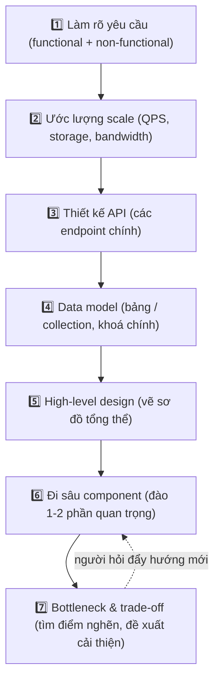
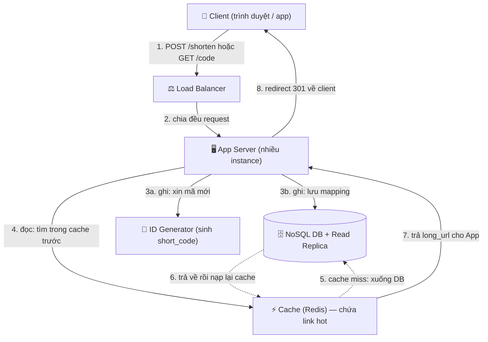

# 🎯 System Design Interview — Framework trả lời câu hỏi mở

> **Tác giả:** Mr.Rom\
> **Phiên bản:** v1.0.0\
> **Tạo lúc:** 13/06/2026\
> **Cập nhật:** 13/06/2026\
> **Level:** Basic\
> **Tags:** interview, system-design, scalability, building-blocks, trade-off, framework, soft-skills\
> **Yêu cầu trước:** [Coding Interview & DSA](01_coding-interview-and-dsa.md)

> 🎯 *Ở bài coding interview bạn được đưa một bài toán đóng — có đáp án đúng/sai rõ ràng. System design thì ngược lại: câu hỏi mở toang kiểu "thiết kế URL shortener đi", không có đáp án duy nhất, và đúng-sai phụ thuộc vào cách bạn suy nghĩ chứ không phải con số cuối cùng. Bài này cho bạn một **framework 7 bước** để không bao giờ ngồi đơ trước câu hỏi mở, một bộ **building block** (load balancer, cache, DB, queue, CDN, sharding, replication) như bộ Lego để lắp mọi hệ thống, cách **nói trade-off** cho ra dáng senior, và cách **quản lý thời gian** một buổi 45 phút. Kết bài bạn sẽ tự tin cầm marker đứng trước whiteboard.*

## 🎯 Sau bài này bạn sẽ

- [ ] Hiểu system design interview đánh giá điều gì và vì sao nó **khác hẳn** coding interview
- [ ] Áp dụng được **framework 7 bước** từ làm rõ yêu cầu → ước lượng scale → API → data model → high-level → đi sâu → bottleneck
- [ ] Nhận diện và đặt đúng chỗ **7 building block** cốt lõi (load balancer, cache, SQL vs NoSQL, message queue, CDN, sharding, replication)
- [ ] Ước lượng nhanh QPS và storage bằng phép tính nhẩm "back-of-the-envelope"
- [ ] Trình bày **trade-off** như một kỹ sư trưởng thành thay vì phán "cái này tốt hơn"
- [ ] Phân bổ thời gian một buổi 45 phút để không "cháy giờ" ở phần râu ria

---

## Tình huống — câu hỏi không có đáp án đúng

Bạn vừa qua được vòng coding, tự tin bước vào vòng tiếp theo. Người phỏng vấn vẽ một ô vuông lên whiteboard, viết chữ "bit.ly", rồi nói:

> *"Thiết kế cho mình một dịch vụ rút gọn URL như bit.ly nhé. Bạn có 45 phút."*

Rồi... im lặng. Không có input, không có output mong đợi, không có test case. Bạn quen với "cho mảng, trả về số" — giờ là một câu mở toang. Trong đầu bạn nổ ra một mớ câu hỏi hỗn loạn:

- Bắt đầu từ đâu? Vẽ database trước hay vẽ server trước?
- "Thiết kế" tới mức nào là đủ? Có cần viết code không?
- Họ muốn nghe gì — kiến trúc đẹp, hay con số chính xác?
- Mình có nên hỏi lại, hay hỏi nhiều quá bị chê "không tự tin"?

Đây là khoảnh khắc khiến rất nhiều dev giỏi code nhưng **vẫn trượt**. Lý do không phải họ thiếu kiến thức — mà là họ **không có quy trình**, nên nhảy lung tung, vẽ ra một mớ box và mũi tên rời rạc, rồi cháy giờ.

Tin tốt: system design interview là loại phỏng vấn **dễ "đóng khung" nhất** bằng một framework. Khi bạn có quy trình rõ ràng, một câu hỏi mở toang biến thành 7 ô việc tuần tự, mỗi ô bạn biết chính xác cần làm gì. Bài này là cái quy trình đó.

> [!NOTE]
> System design phổ biến nhất ở vòng phỏng vấn cho **mid-level trở lên** (3+ năm kinh nghiệm). Nếu bạn là junior/fresher, đa số sẽ chưa bị hỏi sâu — nhưng *biết trước* framework này giúp bạn (1) không hoảng nếu lỡ bị hỏi, và (2) hiểu cách các hệ thống thật được lắp ráp, cực kỳ có lợi cho công việc.

---

## 1️⃣ System design interview thật ra đánh giá cái gì?

Trước khi học cách làm, phải hiểu người phỏng vấn đang **chấm điểm gì** — vì làm đúng thứ họ cần mới ăn điểm, chứ không phải vẽ thật nhiều box.

**Trả lời tình huống trên**: họ *không* mong bạn thiết kế ra một bit.ly chạy được thật trong 45 phút — điều đó bất khả thi, cả một team làm nhiều tháng. Cái họ muốn nhìn là **cách bạn tư duy khi đối mặt với sự mơ hồ**: bạn có biết hỏi đúng câu, chia nhỏ vấn đề, ra quyết định có lý do, và thành thật về điểm yếu của thiết kế không.

🪞 **Ẩn dụ**: system design interview giống một buổi **phỏng vấn kiến trúc sư**, không phải thi xây nhà. Người ta không bắt bạn xây xong căn nhà tại chỗ. Họ đưa cho bạn một mảnh đất mơ hồ ("nhà cho gia đình 4 người") rồi xem bạn có biết **hỏi đúng câu** (ngân sách bao nhiêu? mấy tầng? có cần gara?), **phác thảo hợp lý** (móng, tường chịu lực, hệ thống điện nước), và **giải thích vì sao chọn vậy** (dùng bê tông cốt thép vì khu này hay động đất). Bản vẽ tay nguệch ngoạc mà tư duy chặt chẽ thắng xa một bản vẽ đẹp mà vô lý.

Cụ thể, người phỏng vấn quan sát 5 thứ. Bảng dưới đối chiếu "tín hiệu tốt" và "tín hiệu xấu" cho từng thứ, để bạn biết mình nên thể hiện điều gì.

| Họ chấm | ✅ Tín hiệu tốt | ❌ Tín hiệu xấu |
|---|---|---|
| **Xử lý mơ hồ** | Hỏi làm rõ yêu cầu trước khi vẽ | Lao vào vẽ ngay, đoán mò yêu cầu |
| **Tư duy có cấu trúc** | Đi theo trình tự rõ ràng (framework) | Nhảy cóc, vẽ box rời rạc không liên kết |
| **Kiến thức nền** | Biết đặt đúng building block đúng chỗ | Gọi tên đại công nghệ mà không hiểu vì sao |
| **Trao đổi trade-off** | "Chọn A vì... đánh đổi là..." | Phán "A tốt hơn B" không lý do |
| **Giao tiếp** | Nói to suy nghĩ, chốt phạm vi với người hỏi | Im lặng vẽ, không giải thích |

→ Điểm mấu chốt rút ra từ bảng: system design là một **cuộc đối thoại**, không phải bài thi viết. Người phỏng vấn là *đối tác thiết kế*, không phải giám thị. Họ sẽ gợi ý, "lái" bạn về hướng họ muốn đào sâu — biết lắng nghe tín hiệu đó cũng là một điểm cộng. Giờ ta học cái khung để cuộc đối thoại này luôn đi đúng quỹ đạo.

---

## 2️⃣ Framework 7 bước — cái la bàn cho mọi câu hỏi mở

Đây là phần xương sống của cả bài. Khi bạn thuộc 7 bước này, mọi câu hỏi system design — dù là URL shortener, news feed, hay chat app — đều đổ vào cùng một quy trình. Bạn không bao giờ phải tự hỏi "giờ làm gì tiếp".

🪞 **Ẩn dụ**: 7 bước này như **công thức nấu một món lạ**. Bạn chưa từng nấu món này, nhưng nếu theo đúng trình tự "sơ chế → ước lượng khẩu phần → lên thực đơn → chuẩn bị nguyên liệu → nấu khung chính → nêm nếm từng phần → kiểm tra món nào dễ hỏng", bạn ra được một bữa ăn tử tế dù chưa nấu bao giờ. Bỏ bước hoặc đảo lộn trình tự là cháy món.

Sơ đồ dưới vẽ 7 bước theo dòng chảy thời gian của buổi phỏng vấn — đây là khái niệm trừu tượng nhất của bài, nên hãy nhìn kỹ rồi ta sẽ mổ từng bước.



→ Để ý mũi tên đứt nét quay ngược: 7 bước **không cứng nhắc một chiều**. Người phỏng vấn thường ngắt giữa chừng để đào sâu một chỗ ("nếu 1 triệu user cùng truy cập 1 link thì sao?"), khi đó bạn nhảy về bước 6/7 rồi quay lại. Framework là *la bàn*, không phải đường ray. Giờ đi từng bước.

### Bước 1 — Làm rõ yêu cầu (đừng bỏ qua, đây là bước ăn điểm đầu tiên)

Tuyệt đối **không vẽ gì** trong 2-3 phút đầu. Việc đầu tiên là hỏi để biến câu mơ hồ thành một bài toán có biên giới rõ. Chia làm hai nhóm yêu cầu:

- **Functional requirements** (yêu cầu chức năng) — hệ thống *làm được gì*. Với URL shortener: "Rút gọn 1 URL dài thành URL ngắn", "Truy cập URL ngắn thì redirect về URL gốc". Bạn chốt 2-3 chức năng cốt lõi, gạt phần phụ (analytics, custom alias) sang "nếu còn giờ".
- **Non-functional requirements** (yêu cầu phi chức năng) — hệ thống *chạy tốt thế nào*. Đây là chỗ phân biệt junior với senior: độ trễ (latency) thấp? Sẵn sàng cao (high availability)? Đọc nhiều hay ghi nhiều (read-heavy vs write-heavy)? Nhất quán mạnh hay chấp nhận trễ (consistency)?

Vài câu hỏi làm rõ kinh điển bạn nên thuộc lòng để bật ra ngay:

| Câu hỏi | Vì sao quan trọng |
|---|---|
| "Hệ thống có bao nhiêu user / traffic?" | Quyết định toàn bộ phần ước lượng scale ở bước 2 |
| "Đọc nhiều hơn ghi hay ngược lại?" | URL shortener đọc nhiều gấp ~100 lần ghi → tối ưu cache |
| "Cần độ trễ thấp tới mức nào?" | Quyết định có cần cache/CDN không |
| "Dữ liệu cần nhất quán tức thì không?" | Quyết định SQL strong consistency vs NoSQL eventual |
| "Phạm vi: chỉ core hay cả analytics, expiry?" | Tránh ôm đồm, cháy giờ |

> [!IMPORTANT]
> Bỏ qua bước làm rõ yêu cầu là lỗi **trượt ngay** phổ biến nhất. Vẽ một hệ thống hoàn hảo cho bài toán *sai* còn tệ hơn vẽ dở cho bài toán *đúng*. Luôn chốt phạm vi với người hỏi trước khi cầm marker: *"Vậy mình tập trung vào 2 chức năng rút gọn + redirect, ưu tiên đọc nhanh và sẵn sàng cao, tạm bỏ analytics — anh/chị thấy ổn không ạ?"*

### Bước 2 — Ước lượng scale (back-of-the-envelope)

Bây giờ biến yêu cầu thành **con số**. Bạn không cần chính xác — cần *đúng bậc độ lớn* (order of magnitude) và **nói to cách bạn tính**. Đây gọi là "back-of-the-envelope estimation" (ước lượng kiểu tính nhẩm sau lưng phong bì).

Ta sẽ ước lượng cho URL shortener với giả định **100 triệu URL mới mỗi ngày**. Có vài con số trời cho cần nhớ: 1 ngày ≈ 86.400 giây, làm tròn cho dễ tính là **~100.000 giây/ngày**.

Tính **QPS ghi** (write — số URL tạo mới mỗi giây):

```text
Write QPS = 100.000.000 URL/ngày ÷ 100.000 giây/ngày = 1.000 QPS
```

Với URL shortener, **đọc nhiều hơn ghi rất nhiều** (mỗi link tạo ra được click nhiều lần). Giả định tỷ lệ đọc:ghi là 100:1:

```text
Read QPS = 1.000 × 100 = 100.000 QPS
```

Tính **storage** trong 5 năm. Mỗi bản ghi (URL gốc + mã ngắn + metadata) giả định ~500 byte:

```text
Số URL trong 5 năm = 100.000.000/ngày × 365 × 5 ≈ 182.500.000.000 ≈ 1,8 × 10¹¹ URL
Storage = 1,8 × 10¹¹ × 500 byte ≈ 9,1 × 10¹³ byte ≈ 91 TB
```

→ Phân tích nhanh từ 3 con số trên: hệ thống **đọc 100.000 lần/giây** nhưng chỉ ghi 1.000 lần/giây → kết luận thiết kế phải **tối ưu cho đọc** (cache mạnh, CDN), và cần ~91 TB lưu trữ trong 5 năm → một máy đơn không kham nổi, **bắt buộc phải sharding** (chia nhỏ database). Để ý: chính phép tính này *dẫn ra* các quyết định thiết kế ở bước sau — đó là lý do nó đáng giá, không phải để khoe số.

> [!TIP]
> Đừng sa đà tính toán quá lâu (tối đa vài phút). Mục tiêu là *ra được kết luận thiết kế* ("read-heavy → cần cache", "91 TB → cần sharding"), không phải ra con số đến từng byte. Nếu bí phép nhân, cứ hỏi *"em làm tròn 86.400 thành 100.000 giây cho dễ nhé?"* — người phỏng vấn luôn OK.

### Bước 3 — Thiết kế API

Có con số rồi, định nghĩa **giao diện** hệ thống — các endpoint chính. Đây là phần ít ỏi mà bạn nên "viết code", nhưng chỉ ở mức **signature** (chữ ký hàm/endpoint), không cần thân hàm. Với URL shortener chỉ cần 2 endpoint:

```text
POST /api/v1/shorten
  Body:     { "long_url": "https://example.com/very/long/path" }
  Response: { "short_url": "https://sho.rt/abc123" }

GET /{short_code}
  Ví dụ:    GET /abc123
  Response: HTTP 301 Redirect → Location: https://example.com/very/long/path
```

→ Hai endpoint này phản chiếu đúng 2 functional requirement ở bước 1: một để *tạo* (POST, đường ghi), một để *truy cập* (GET, đường đọc). Việc tách rõ đường đọc/ghi ở đây giúp bước 5 bạn biết tối ưu nhánh nào (nhánh GET đọc 100.000 QPS là nhánh cần cache).

> [!NOTE]
> Vì sao redirect là **301** (Moved Permanently) chứ không phải 302 (Found/tạm thời)? 301 cho phép trình duyệt **cache** kết quả redirect → lần sau user click cùng link, trình duyệt tự redirect không cần gọi server, giảm tải. Đánh đổi: nếu dùng 301, bạn khó đếm chính xác số click (analytics) vì nhiều lượt không chạm server. Nếu cần analytics chính xác thì chọn 302. Nói được đánh đổi nhỏ này là một điểm cộng tinh tế.

### Bước 4 — Data model

Xác định lưu dữ liệu gì, ở đâu, khoá chính là gì. Với URL shortener, model cực kỳ đơn giản — chỉ một bảng/collection ánh xạ mã ngắn ↔ URL gốc:

| Cột | Kiểu | Ghi chú |
|---|---|---|
| `short_code` | string (7 ký tự) | **Khoá chính** — mã ngắn, ví dụ `abc123X` |
| `long_url` | string | URL gốc đầy đủ |
| `created_at` | timestamp | Thời điểm tạo |
| `expires_at` | timestamp (nullable) | Hết hạn (nếu có tính năng này) |

Một câu hỏi thiết kế lõi nảy ra ở đây: **sinh `short_code` thế nào?** Đây là chỗ đáng đào, ta nói riêng ở bước 6. Tạm thời ghi nhận: 7 ký tự từ bộ 62 ký tự (`a-z`, `A-Z`, `0-9`) cho ra `62⁷ ≈ 3,5 × 10¹²` (hơn 3.500 tỷ) tổ hợp — thừa sức cho `1,8 × 10¹¹` URL đã tính ở bước 2.

→ Để ý cách data model **nối thẳng** vào phép ước lượng bước 2: ta chọn độ dài mã = 7 ký tự *vì* đã biết cần chứa ~1,8 × 10¹¹ URL. Mọi quyết định đều có dây dẫn về một con số trước đó — đó là dấu hiệu của thiết kế chặt chẽ.

### Bước 5 — High-level design (vẽ sơ đồ tổng thể)

Giờ mới tới lúc vẽ bức tranh lớn. Ghép các building block lại thành luồng đi của một request. Mục tiêu: người phỏng vấn nhìn sơ đồ là hiểu "request đi từ đâu, qua đâu, tới đâu". Ta sẽ vẽ sơ đồ mẫu này ở mục 4 (sau khi đã học building block). Tạm thời nhớ nguyên tắc: **vẽ đường đi của request**, từ client → vào hệ thống → ra kết quả.

### Bước 6 — Đi sâu component (deep dive)

Bạn không thể đào sâu mọi thứ trong 45 phút. Chọn **1-2 component thú vị nhất** và đào kỹ. Người phỏng vấn thường tự chỉ định ("nói kỹ hơn cách bạn sinh short_code đi"). Với URL shortener, các điểm đáng đào:

- **Sinh `short_code` không trùng**: dùng counter tăng dần rồi mã hoá base62? Dùng hash (MD5) rồi cắt? Dùng một dịch vụ phát ID riêng? (Mỗi cách có đánh đổi — ta bàn ở mục Trade-off.)
- **Cache cho đường đọc**: link "hot" (viral) được click hàng triệu lần → cache vào Redis để không đụng database mỗi lần.

### Bước 7 — Bottleneck & trade-off

Bước cuối tách hẳn senior khỏi junior: **tự chỉ ra điểm yếu của chính thiết kế mình** và đề xuất cách gỡ. Đừng đợi người hỏi vạch lỗi — chủ động nói:

- *"Single database sẽ là bottleneck ở 100.000 read QPS → em thêm read replica và cache."*
- *"Nếu cache server chết, toàn bộ tải dồn vào DB → em cần nhiều cache node và cơ chế dự phòng."*
- *"Counter sinh ID tập trung là single point of failure → có thể đánh đổi sang sinh ID phân tán."*

→ Tổng kết framework: 7 bước này không phải để học vẹt mà để *biến lo lắng thành checklist*. Khi đứng trước whiteboard mà tim đập nhanh, bạn chỉ cần tự hỏi "mình đang ở bước mấy, bước sau là gì" — và quy trình tự kéo bạn đi. Giờ ta học bộ Lego để lắp vào bước 5-6.

---

## 3️⃣ Building blocks — bộ Lego lắp được mọi hệ thống

Mọi hệ thống lớn, dù phức tạp tới đâu, đều lắp từ một số ít **building block** (khối xây dựng) lặp đi lặp lại. Thuộc 7 khối dưới đây, bạn lắp được phần lớn các bài system design phổ biến.

🪞 **Ẩn dụ**: building block như **các viên Lego chuẩn**. Bạn không tự đúc nhựa mỗi lần xây — bạn ráp từ các viên có sẵn (gạch, bánh xe, cửa sổ). Người chơi giỏi không phải người có nhiều loại viên nhất, mà là người **biết viên nào lắp vào chỗ nào** và **vì sao**.

Bảng dưới là "bộ sưu tập Lego" tối thiểu. Đọc xong, ta sẽ ghép chúng vào một sơ đồ thật ở mục 4.

| Building block | Giải quyết vấn đề gì | Ẩn dụ một dòng |
|---|---|---|
| **Load balancer** | Chia traffic đều ra nhiều server, không server nào quá tải | Người điều phối khách vào nhiều quầy ở siêu thị |
| **Cache** | Lưu sẵn kết quả hay dùng để trả nhanh, đỡ đụng DB | Để sẵn ly cà phê pha trước cho khách quen |
| **SQL database** | Lưu dữ liệu có quan hệ chặt, cần ACID/transaction | Tủ hồ sơ ngăn nắp có quy tắc nghiêm |
| **NoSQL database** | Lưu dữ liệu lớn, schema linh hoạt, scale ngang dễ | Kho hàng khổng lồ, xếp đồ thoải mái |
| **Message queue** | Tách việc nặng ra xử lý sau, hệ thống không nghẽn | Hộp thư nhận đơn, bếp làm dần không bắt khách đứng chờ |
| **CDN** | Đưa nội dung tĩnh tới gần user về mặt địa lý | Kho hàng đặt ngay trong thành phố của khách |
| **Sharding / Replication** | Chia nhỏ + nhân bản DB để chịu tải và an toàn | Chia kho ra nhiều chi nhánh + photo hồ sơ dự phòng |

Mỗi khối đáng được unpack thêm một chút vì người phỏng vấn hay đào.

### Load balancer

**Load balancer** (bộ cân bằng tải) đứng trước nhiều server giống nhau, nhận request rồi phân phối đều ra (round-robin, least-connections...). Lợi ích kép: (1) không server nào quá tải, (2) một server chết thì load balancer ngừng gửi request tới nó → hệ thống vẫn sống (high availability).

### Cache

**Cache** lưu dữ liệu hay đọc vào bộ nhớ nhanh (như Redis, Memcached) để trả về tức thì, tránh truy vấn database chậm. Với hệ thống read-heavy như URL shortener, cache là vũ khí số một. Hai khái niệm cần biết:

- **Cache hit / miss** — request tìm thấy trong cache (hit, nhanh) hay không thấy phải xuống DB (miss, chậm).
- **TTL (Time To Live)** — thời gian sống của một mục trong cache trước khi bị xoá để làm mới.

### SQL vs NoSQL — quyết định kinh điển

Đây là một trong những câu hỏi trade-off được hỏi nhiều nhất. Đừng học thuộc "cái nào tốt hơn" — không có. Học **khi nào chọn cái nào**. Bảng dưới so trực diện:

| Tiêu chí | SQL (PostgreSQL, MySQL) | NoSQL (MongoDB, Cassandra, DynamoDB) |
|---|---|---|
| Schema | Cố định, chặt chẽ | Linh hoạt, schema-less |
| Quan hệ / JOIN | Mạnh, hỗ trợ JOIN phức tạp | Yếu, thường phải tự xử lý ở app |
| Transaction / ACID | Đầy đủ, mạnh | Giới hạn (thường chỉ trong 1 document) |
| Scale | Scale dọc (máy mạnh hơn) là chính | Scale ngang (thêm máy) rất dễ |
| Nhất quán | Strong consistency | Thường eventual consistency |
| Khi nên chọn | Dữ liệu quan hệ chặt, cần transaction (ngân hàng, đơn hàng) | Dữ liệu lớn, đơn giản, cần scale ngang (URL mapping, log, feed) |

→ Với URL shortener, mapping `short_code → long_url` cực kỳ đơn giản (key-value, không JOIN, không transaction phức tạp) và cần scale ngang lên 91 TB → **NoSQL key-value là lựa chọn hợp lý**. Đây là cách *nói trade-off đúng*: gắn lựa chọn vào đặc tính bài toán, không phán bừa.

### Message queue

**Message queue** (hàng đợi tin nhắn, như Kafka, RabbitMQ, SQS) cho phép tách việc nặng/chậm ra xử lý **bất đồng bộ** (asynchronous). Thay vì bắt user chờ một việc nặng làm xong, hệ thống bỏ việc đó vào queue rồi trả lời user ngay; một worker phía sau xử lý dần. Với URL shortener bản cơ bản chưa cần queue, nhưng nếu thêm analytics (đếm click), bạn đẩy mỗi sự kiện click vào queue để xử lý sau, không làm chậm redirect.

### CDN

**CDN (Content Delivery Network)** là mạng máy chủ đặt rải rác địa lý, lưu (cache) nội dung tĩnh (ảnh, JS, CSS, video) ở gần user. User ở Việt Nam tải ảnh từ server đặt tại Singapore thay vì tận Mỹ → nhanh hơn nhiều. URL shortener core không cần CDN nhiều, nhưng nó là building block bắt buộc phải biết cho các bài như "thiết kế YouTube/Instagram".

### Sharding & Replication

Hai kỹ thuật giúp database vượt qua giới hạn một máy đơn — hay bị nhầm lẫn nên cần phân biệt rõ:

- **Replication** (nhân bản) — copy *toàn bộ* dữ liệu ra nhiều máy giống hệt. Mục đích: (1) an toàn (một máy chết còn máy khác), (2) chia tải đọc (read replica). Đây là cách gỡ bottleneck đọc 100.000 QPS của URL shortener.
- **Sharding** (phân mảnh) — chia *nhỏ* dữ liệu ra nhiều máy, mỗi máy giữ một phần (ví dụ shard theo `short_code`). Mục đích: vượt giới hạn dung lượng/ghi của một máy. Đây là cách chứa 91 TB không kham nổi trên một máy.

> [!TIP]
> Mẹo nhớ phân biệt: **Replication = copy giống hệt** (để an toàn + chia tải đọc), **Sharding = chia khác nhau** (để chứa nhiều + chia tải ghi). Một hệ thống lớn thường dùng *cả hai*: shard ra nhiều mảnh, rồi replicate từng mảnh.

---

## 4️⃣ Ghép lại — high-level design mẫu cho URL shortener

Giờ ta lắp các viên Lego vừa học vào một sơ đồ tổng thể, đúng như bạn sẽ vẽ ở bước 5 của framework. Đây là phần hội tụ tất cả: yêu cầu (read-heavy), ước lượng (100.000 read QPS, 91 TB), và building block (load balancer, cache, NoSQL, replication).

Sơ đồ dưới vẽ đường đi của **hai loại request** — ghi (tạo link) màu xám đi đường dài, đọc (truy cập link) đi qua cache để nhanh. Hãy theo dõi từng mũi tên.



→ Phân tích sơ đồ: đường **ghi** (3a, 3b) hiếm xảy ra (1.000 QPS) nên đi thẳng xuống DB cũng được. Đường **đọc** (4-7) là điểm nóng (100.000 QPS) nên *luôn hỏi cache trước*; chỉ khi cache miss (mũi tên đứt nét 5-6) mới đụng DB rồi nạp lại cache cho lần sau. Load balancer phía trước cho phép thêm app server tuỳ tải; read replica chia tải đọc còn sót khỏi cache. Mỗi building block ở đây *giải một con số cụ thể* từ bước ước lượng — đó là cái khiến thiết kế thuyết phục, không phải vì "có nhiều box".

> [!NOTE]
> Bài kinh điển thứ hai hay được hỏi là **news feed** (kiểu Facebook/Twitter timeline). Khác biệt cốt lõi: news feed *ghi nhiều, đọc cá nhân hoá* nên nảy ra câu hỏi lớn "**fan-out on write hay fan-out on read?**" — đẩy post vào feed của từng follower ngay khi đăng (tốn ghi, đọc nhanh), hay tổng hợp feed lúc user mở app (nhẹ ghi, tốn đọc)? Cùng một framework 7 bước, nhưng deep dive ở bước 6 hoàn toàn khác. Nắm vững URL shortener trước, rồi mở rộng sang news feed sau.

---

## 5️⃣ Nghệ thuật nói trade-off — câu thần chú "tuỳ vào..."

Nếu chỉ rút ra **một** điều từ cả bài, hãy là điều này: system design interview chấm cách bạn **lý luận về đánh đổi**, không chấm bạn biết "đáp án đúng". Mọi quyết định kỹ thuật đều có cái giá. Người phỏng vấn muốn nghe bạn *nhìn thấy* cái giá đó.

❌ **Anti-pattern** — phán xanh rờn không lý do:

> *"Mình dùng NoSQL vì nó nhanh hơn SQL."*

→ Sai cả về kiến thức (không phải lúc nào cũng nhanh hơn) lẫn về tư duy (không có đánh đổi, không có ngữ cảnh). Người phỏng vấn nghe câu này là tụt điểm ngay.

✅ **Pattern đúng** — gắn lựa chọn vào ngữ cảnh + nêu cái giá:

> *"Ở đây dữ liệu chỉ là mapping key-value đơn giản, không cần JOIN hay transaction phức tạp, mà lại cần scale ngang tới ~91 TB. Vì vậy mình chọn NoSQL key-value. **Đánh đổi** là mình mất đi transaction mạnh và truy vấn quan hệ — nhưng bài toán này không cần, nên chấp nhận được."*

→ Để ý cấu trúc câu trên, đây là **công thức nói trade-off** bạn có thể dùng cho mọi quyết định:

| Phần câu | Nội dung | Ví dụ |
|---|---|---|
| 1. Bối cảnh | Đặc tính bài toán dẫn tới lựa chọn | "dữ liệu key-value đơn giản, cần scale ngang" |
| 2. Lựa chọn | Quyết định cụ thể | "mình chọn NoSQL" |
| 3. Cái giá | Thành thật về đánh đổi | "mất transaction mạnh, mất JOIN" |
| 4. Biện minh | Vì sao cái giá đó chấp nhận được *ở đây* | "nhưng bài này không cần" |

Vài cặp trade-off kinh điển bạn nên có sẵn trong đầu để bật ra khi cần:

- **Consistency vs Availability** — nhất quán mạnh thì có lúc phải từ chối phục vụ; sẵn sàng cao thì có lúc đọc ra dữ liệu cũ. Không thể tối đa cả hai khi mạng có sự cố.
- **Latency vs Cost** — muốn nhanh thì thêm cache/CDN/server, tốn tiền hơn.
- **Read vs Write tối ưu** — tối ưu đọc (denormalize, cache) thường làm ghi phức tạp/chậm hơn, và ngược lại.
- **Đơn giản vs Scale** — thiết kế đơn giản dễ hiểu dễ bảo trì, nhưng có thể không chịu nổi tải lớn; thiết kế scale tốt thì phức tạp hơn.

> [!IMPORTANT]
> Câu cửa miệng của một kỹ sư trưởng thành là *"It depends..."* ("tuỳ vào..."). Nó **không phải** né tránh — nó là sự thật. Mỗi khi sắp phán "X tốt hơn Y", hãy dừng lại và hỏi "tốt hơn *trong trường hợp nào*, đánh đổi cái *gì*?". Trả lời được câu đó là bạn đang nói ngôn ngữ của senior.

---

## 6️⃣ Quản lý thời gian một buổi 45 phút

Có framework giỏi mà cháy giờ ở phần râu ria thì vẫn trượt. Một buổi system design điển hình kéo dài khoảng 45 phút — bạn cần phân bổ tỉnh táo, đừng để "kẹt" ở một bước. Bảng dưới là gợi ý phân bổ tỷ lệ (không phải con số cứng), ánh xạ thẳng vào 7 bước:

| Giai đoạn | Tỷ lệ thời gian | Việc làm |
|---|---|---|
| Làm rõ yêu cầu (bước 1) | ~10-15% | Hỏi, chốt phạm vi functional + non-functional |
| Ước lượng + API + data model (bước 2-4) | ~20% | Tính QPS/storage, phác endpoint, phác bảng |
| High-level design (bước 5) | ~25% | Vẽ sơ đồ tổng thể, giải thích luồng request |
| Deep dive (bước 6) | ~25% | Đào sâu 1-2 component người hỏi quan tâm |
| Bottleneck & trade-off (bước 7) | ~10-15% | Tự vạch điểm nghẽn, đề xuất cải thiện |
| Hỏi đáp cuối | ~5% | Người hỏi hỏi thêm / bạn hỏi ngược |

→ Hai lỗi thời gian phổ biến nhất: (1) **dành quá ít cho làm rõ yêu cầu** rồi thiết kế sai bài, và (2) **sa lầy ở một deep dive** (ví dụ tranh cãi cách sinh ID suốt 20 phút) tới mức không kịp nói trade-off. Cách phòng: **liên tục liếc đồng hồ và nói to** *"em tạm chốt phần này ở đây để còn kịp nói về bottleneck nhé"* — việc tự quản lý thời gian này cũng là một tín hiệu trưởng thành mà người phỏng vấn ghi nhận.

> [!TIP]
> Khi người phỏng vấn "lái" bạn sang một hướng cụ thể ("nói kỹ hơn về cache đi"), **đi theo họ** — đừng cố bám cứng kế hoạch của mình. Họ đang chỉ cho bạn biết họ muốn chấm điểm phần nào. Đó vừa là gợi ý, vừa là món quà.

---

## 💡 Cạm bẫy thường gặp & Best practice

### ❌ Cạm bẫy: lao vào vẽ ngay, bỏ qua làm rõ yêu cầu

- **Triệu chứng**: nghe đề xong cầm marker vẽ database, server liền; 20 phút sau mới nhận ra mình hiểu sai phạm vi (thiết kế cả analytics trong khi người hỏi chỉ cần core).
- **Nguyên nhân**: tưởng "nhanh tay vẽ = tự tin", và sợ im lặng đầu buổi.
- **Cách tránh**: ép bản thân dành 2-3 phút đầu **chỉ hỏi**, không vẽ. Chốt lại phạm vi thành lời với người hỏi rồi mới bắt đầu. Im lặng để suy nghĩ là bình thường; vẽ sai bài mới đáng sợ.

### ❌ Cạm bẫy: phán "công nghệ X tốt hơn Y" không lý do

- **Triệu chứng**: nói "dùng NoSQL vì nhanh hơn", "dùng Kafka vì xịn", mà không gắn vào bài toán hay nêu đánh đổi.
- **Nguyên nhân**: học building block kiểu danh sách "công nghệ hot" mà không hiểu *khi nào dùng*.
- **Cách tránh**: mỗi lựa chọn đi kèm công thức 4 phần (bối cảnh → lựa chọn → cái giá → biện minh). Nếu không nêu được đánh đổi của một công nghệ, nghĩa là bạn chưa hiểu nó đủ — hãy thành thật "em chưa rành phần này" thay vì phán bừa.

### ✅ Best practice: nói to mọi suy nghĩ (think out loud)

- **Vì sao**: người phỏng vấn chấm *quá trình tư duy*, không chỉ kết quả vẽ trên bảng. Im lặng vẽ khiến họ không biết bạn đang nghĩ gì — và không cho điểm được.
- **Cách áp dụng**: kể lại từng quyết định khi vừa nghĩ: "em đang phân vân giữa cache và đọc thẳng DB; vì đọc nhiều gấp 100 lần ghi nên em nghiêng về cache...". Cho họ thấy *vì sao* bạn đi tới mỗi box.

### ✅ Best practice: bắt đầu đơn giản, mở rộng dần

- **Vì sao**: cố vẽ kiến trúc "hoàn hảo cho 1 tỷ user" ngay từ đầu sẽ rối và dễ sai. Bắt đầu từ phiên bản chạy được rồi mở rộng cho thấy tư duy tiến hoá — đúng cách hệ thống thật được xây.
- **Cách áp dụng**: vẽ phiên bản tối giản trước (client → server → DB), rồi tự hỏi "ở 100.000 QPS chỗ nào nghẽn?" và thêm cache, replica, shard từng bước. Mỗi lần thêm một block, giải thích nó gỡ bottleneck nào.

---

## 🧠 Tự kiểm tra (Self-check)

**Q1.** Người phỏng vấn nói "Thiết kế Twitter đi". Việc đầu tiên bạn nên làm là gì, và vì sao tuyệt đối không nên vẽ ngay?

<details>
<summary>💡 Xem giải thích</summary>

Việc đầu tiên là **làm rõ yêu cầu** (bước 1 của framework) — hỏi để chốt phạm vi functional ("chỉ cần đăng tweet + xem timeline, hay cả follow, like, search?") và non-functional ("bao nhiêu user? read-heavy hay write-heavy? cần real-time tới mức nào?"). Không vẽ ngay vì "Twitter" quá rộng — nếu bạn đoán mò phạm vi và thiết kế một hệ thống hoàn hảo cho *sai* bài toán, bạn vẫn trượt. Vẽ sai bài còn tệ hơn vẽ dở đúng bài. Luôn chốt phạm vi thành lời với người hỏi trước khi cầm marker.

</details>

**Q2.** Một hệ thống tạo 50 triệu URL mỗi ngày, tỷ lệ đọc:ghi là 100:1. Ước lượng nhanh write QPS và read QPS.

<details>
<summary>💡 Xem giải thích</summary>

Làm tròn 1 ngày ≈ 100.000 giây.

- Write QPS = 50.000.000 ÷ 100.000 = **500 QPS**.
- Read QPS = 500 × 100 = **50.000 QPS**.

Kết luận thiết kế quan trọng hơn con số: hệ thống **read-heavy nặng** (đọc gấp 100 lần ghi) → bắt buộc tối ưu cho đọc bằng cache và read replica. Đây mới là điều người phỏng vấn muốn nghe, không phải con số đến từng đơn vị.

</details>

**Q3.** Phân biệt **sharding** và **replication**. Một hệ thống lưu 91 TB và phục vụ 100.000 read QPS nên dùng cái nào, hay cả hai?

<details>
<summary>💡 Xem giải thích</summary>

**Replication** = copy *toàn bộ* dữ liệu ra nhiều máy giống hệt → để an toàn (máy chết còn máy khác) và chia tải đọc (read replica). **Sharding** = chia *nhỏ* dữ liệu, mỗi máy giữ một phần khác nhau → để vượt giới hạn dung lượng và chia tải ghi.

Hệ thống này nên dùng **cả hai**: **sharding** để chứa 91 TB (một máy không kham nổi), và **replication** (read replica) để chịu 100.000 read QPS. Cách nhớ: replication = copy giống hệt, sharding = chia khác nhau.

</details>

**Q4.** Khi nào nên chọn SQL, khi nào nên chọn NoSQL? Cho một ví dụ mỗi loại.

<details>
<summary>💡 Xem giải thích</summary>

Không có cái nào "tốt hơn" — tuỳ bài toán:

- **SQL** khi dữ liệu **quan hệ chặt**, cần **transaction/ACID mạnh** và truy vấn JOIN phức tạp. Ví dụ: hệ thống ngân hàng (chuyển tiền phải atomic), hệ thống đơn hàng e-commerce.
- **NoSQL** khi dữ liệu **đơn giản** (key-value/document), cần **scale ngang dễ** và chấp nhận eventual consistency. Ví dụ: mapping `short_code → long_url` của URL shortener, lưu log, news feed.

Điểm ăn điểm là gắn lựa chọn vào *đặc tính bài toán* + nêu *đánh đổi*, không phán "cái nào nhanh hơn".

</details>

**Q5.** Trong URL shortener, vì sao đường **đọc** (GET redirect) cần cache còn đường **ghi** (POST tạo link) thường không cần gấp?

<details>
<summary>💡 Xem giải thích</summary>

Vì hệ thống **read-heavy**: đọc ~100.000 QPS còn ghi chỉ ~1.000 QPS (gấp ~100 lần). Đường đọc là điểm nóng → mỗi request truy vấn thẳng DB sẽ làm DB quá tải; đặt cache (Redis) phía trước, link "hot" được trả từ bộ nhớ tức thì, chỉ cache miss mới xuống DB. Đường ghi hiếm hơn nhiều nên đi thẳng xuống DB là chấp nhận được. Đây là ví dụ điển hình của việc *phép ước lượng dẫn ra quyết định thiết kế*: chính tỷ lệ 100:1 nói cho bạn biết phải tối ưu nhánh nào.

</details>

---

## ⚡ Tra cứu nhanh (Cheatsheet)

**Framework 7 bước (thuộc lòng):**

| Bước | Việc | Nhớ nhanh |
|---|---|---|
| 1 | Làm rõ yêu cầu | Functional + non-functional, chốt phạm vi |
| 2 | Ước lượng scale | QPS đọc/ghi, storage, bandwidth |
| 3 | Thiết kế API | Các endpoint chính (chỉ signature) |
| 4 | Data model | Bảng/collection, khoá chính |
| 5 | High-level design | Vẽ luồng request tổng thể |
| 6 | Deep dive | Đào 1-2 component quan trọng |
| 7 | Bottleneck & trade-off | Tự vạch điểm nghẽn, đề xuất gỡ |

**7 building block:** load balancer · cache · SQL · NoSQL · message queue · CDN · sharding/replication.

**Công thức ước lượng nhanh:**

| Cần tính | Công thức |
|---|---|
| QPS | tổng sự kiện/ngày ÷ ~100.000 giây |
| Read QPS | Write QPS × tỷ lệ đọc:ghi |
| Storage | số bản ghi × kích thước mỗi bản ghi |

**Công thức nói trade-off:** bối cảnh → lựa chọn → cái giá (đánh đổi) → vì sao chấp nhận được ở đây.

**Cặp trade-off kinh điển:** consistency ↔ availability · latency ↔ cost · tối ưu đọc ↔ tối ưu ghi · đơn giản ↔ scale.

**Phân bổ 45 phút:** yêu cầu (10-15%) → ước lượng+API+model (20%) → high-level (25%) → deep dive (25%) → trade-off (10-15%) → hỏi đáp (5%).

**SQL hay NoSQL?** Quan hệ chặt + transaction → SQL. Key-value đơn giản + scale ngang → NoSQL.

---

## 📚 Từ Điển Thuật Ngữ (Glossary)

| EN | VN | Giải thích |
|---|---|---|
| System design | Thiết kế hệ thống | Việc phác kiến trúc một hệ thống phần mềm ở mức cao |
| Functional requirement | Yêu cầu chức năng | Hệ thống *làm được gì* (rút gọn URL, redirect...) |
| Non-functional requirement | Yêu cầu phi chức năng | Hệ thống *chạy tốt thế nào* (latency, availability...) |
| QPS | Số truy vấn / giây | Queries Per Second — thước đo tải của hệ thống |
| Back-of-the-envelope | Ước lượng tính nhẩm | Tính nhanh theo bậc độ lớn, không cần chính xác |
| Latency | Độ trễ | Thời gian từ lúc gửi request tới lúc nhận response |
| Availability | Độ sẵn sàng | Tỷ lệ thời gian hệ thống còn phục vụ được |
| Read-heavy / Write-heavy | Đọc nhiều / Ghi nhiều | Hệ thống nghiêng về thao tác đọc hay ghi |
| Load balancer | Bộ cân bằng tải | Chia traffic đều ra nhiều server |
| Cache | Bộ nhớ đệm | Lưu sẵn dữ liệu hay dùng để trả nhanh, đỡ đụng DB |
| Cache hit / miss | Trúng / trượt cache | Tìm thấy / không thấy dữ liệu trong cache |
| TTL | Thời gian sống | Time To Live — thời gian một mục tồn tại trong cache |
| SQL database | CSDL quan hệ | DB có schema chặt, hỗ trợ transaction/ACID/JOIN |
| NoSQL database | CSDL phi quan hệ | DB schema linh hoạt, scale ngang dễ |
| ACID | Tính chất giao dịch | Atomicity, Consistency, Isolation, Durability của transaction |
| Consistency | Tính nhất quán | Mọi nơi đọc ra cùng một dữ liệu mới nhất |
| Eventual consistency | Nhất quán dần | Dữ liệu *cuối cùng* sẽ đồng bộ, nhưng có thể trễ |
| Message queue | Hàng đợi tin nhắn | Tách việc nặng ra xử lý bất đồng bộ qua queue |
| Asynchronous | Bất đồng bộ | Không bắt người gọi chờ việc xong mới trả lời |
| CDN | Mạng phân phối nội dung | Server đặt gần user để trả nội dung tĩnh nhanh hơn |
| Replication | Nhân bản | Copy toàn bộ dữ liệu ra nhiều máy giống hệt |
| Read replica | Bản sao chỉ đọc | Bản nhân bản dùng để chia tải đọc |
| Sharding | Phân mảnh | Chia nhỏ dữ liệu ra nhiều máy, mỗi máy giữ một phần |
| Bottleneck | Điểm nghẽn | Thành phần giới hạn hiệu năng cả hệ thống |
| Single point of failure | Điểm chết đơn | Một thành phần hỏng là cả hệ thống sập |
| Trade-off | Đánh đổi | Cái giá phải trả khi chọn một phương án |
| Fan-out | Phát tán | Đẩy một sự kiện tới nhiều đích (vd: post tới các follower) |
| Endpoint | Điểm cuối API | Một địa chỉ API cụ thể (vd: `POST /shorten`) |

---

## 🔗 Liên kết & Tài nguyên

⬅️ **Bài trước:** [Coding Interview & DSA — Tư duy giải bài + giao tiếp khi code](01_coding-interview-and-dsa.md)\
➡️ **Bài tiếp theo:** [Behavioral Interview & STAR — Kể chuyện thuyết phục](03_behavioral-interview-and-star.md)\
↑ **Về cụm:** [interview-prep — README](../../README.md)

### 🧭 Định hướng lộ trình học

- [Quy trình phỏng vấn tech — Bức tranh từ apply đến offer](00_interview-process-overview.md) — toàn cảnh pipeline để biết system design nằm ở vòng nào
- [Coding Interview & DSA — Tư duy giải bài + giao tiếp khi code](01_coding-interview-and-dsa.md) — vòng kỹ thuật đứng trước, rèn tư duy giải bài đóng
- [Kế hoạch ôn & Mock Interview — Biến luyện tập thành offer](04_prep-plan-and-mock-interview.md) — cách luyện system design qua mock interview

### 🧩 Các chủ đề có thể bạn quan tâm

- [Behavioral Interview & STAR — Kể chuyện thuyết phục](03_behavioral-interview-and-star.md) — vòng phỏng vấn hành vi thường đi kèm trong cùng một loop
- [Tìm việc & Đánh giá offer — Từ apply đến nhận lời mời](../../../career-path/lessons/01_basic/03_job-search-and-offer.md) — bức tranh lớn của quy trình tuyển dụng

### 🌐 Tài nguyên tham khảo khác

- [System Design Primer (GitHub)](https://github.com/donnemartin/system-design-primer) — kho tài liệu mở kinh điển nhất về system design interview, có cả URL shortener
- [ByteByteGo / Alex Xu — "System Design Interview"](https://bytebytego.com) — sách + blog vẽ sơ đồ rất trực quan, chuẩn công nghiệp
- [High Scalability blog](http://highscalability.com) — case study kiến trúc thật của các hệ thống lớn, đọc để có "vốn" trade-off

---

## 📌 Nhật ký thay đổi (Changelog)

- **v1.0.0 (13/06/2026)** — Bản đầu tiên. Giải thích system design interview chấm gì (bảng tín hiệu tốt/xấu) + framework 7 bước có sơ đồ flowchart (làm rõ yêu cầu → ước lượng scale → API → data model → high-level → deep dive → bottleneck/trade-off) + ví dụ URL shortener xuyên suốt (ước lượng QPS/storage có phép tính, API 2 endpoint, data model, high-level design có sơ đồ luồng đọc/ghi) + 7 building block (load balancer, cache, SQL vs NoSQL có bảng so sánh, message queue, CDN, sharding vs replication) + công thức nói trade-off 4 phần + 4 cặp trade-off kinh điển + bảng phân bổ thời gian 45 phút + 2 cạm bẫy + 2 best practice + 5 self-check + cheatsheet + glossary 28 thuật ngữ. Ghi chú mở rộng sang news feed (fan-out on write/read).
