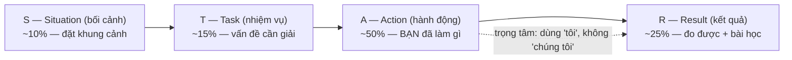

# Behavioral Interview & STAR — Kể chuyện thuyết phục

> **Tác giả:** Mr.Rom\
> **Phiên bản:** v1.0.0\
> **Tạo lúc:** 13/06/2026\
> **Cập nhật:** 13/06/2026\
> **Level:** Basic\
> **Tags:** career, interview-prep, behavioral, star, soft-skills, storytelling, culture-fit\
> **Yêu cầu trước:** [System Design Interview — Framework trả lời câu hỏi mở](02_system-design-interview.md)

> 🎯 *Bạn đã biết giải coding, đã biết vẽ system design trên bảng trắng. Nhưng có một vòng phỏng vấn nữa quyết định bạn được nhận hay không — và nó không hỏi một dòng code: vòng behavioral. Bài này dạy bạn cách biến những dự án, sai lầm, va chạm trong quá khứ thành các câu chuyện có cấu trúc theo phương pháp **STAR**, xây sẵn một kho 5-7 story tái dùng, tránh các bẫy "trả lời chung chung" và "đổ lỗi", chuẩn bị câu hỏi ngược để phỏng vấn lại công ty — và đọc red flag từ chính câu trả lời của interviewer. Kết bài bạn có một bộ story sẵn sàng kể trôi chảy ở bất kỳ buổi behavioral nào.*

## 🎯 Sau bài này bạn sẽ

- [ ] Hiểu vòng behavioral đánh giá gì (culture fit, collaboration) và vì sao nó quyết định không kém vòng kỹ thuật
- [ ] Áp dụng được phương pháp **STAR** (Situation–Task–Action–Result), với trọng tâm là **Action** + **Result định lượng**
- [ ] Nhận diện 6 nhóm câu hỏi behavioral phổ biến và biết mỗi nhóm interviewer đang dò điều gì
- [ ] Xây một **kho 5-7 story** tái dùng, mỗi story phủ được nhiều câu hỏi cùng lúc
- [ ] Tránh hai cái bẫy chết người: trả lời chung chung ("we") và đổ lỗi cho người khác
- [ ] Chuẩn bị câu hỏi ngược sắc bén và đọc red flag công ty qua cách họ trả lời

---

## Tình huống — bạn vừa "đậu" vòng kỹ thuật nhưng trượt

Bạn vừa trải qua một buổi loop tuyệt vời. Coding bạn giải sạch, system design bạn trình bày mạch lạc. Bạn tự tin chắc chắn đậu. Một tuần sau, recruiter gọi: *"Cảm ơn bạn rất nhiều, nhưng lần này team chưa chọn bạn."*

Bạn sốc. Kỹ thuật rõ ràng ổn. Vậy trượt ở đâu?

Câu trả lời thường nằm ở buổi cuối cùng — buổi mà bạn chủ quan nhất: **behavioral interview**. Khi được hỏi *"Kể về một lần bạn bất đồng với đồng nghiệp"*, bạn lúng túng, kể lan man không đầu không cuối, rồi vô tình nói *"thật ra tại bạn đó code ẩu nên mới có chuyện"*. Người phỏng vấn gật gù, ghi chú, và đánh trượt bạn ở trục "collaboration".

Đây là nghịch lý mà nhiều dev giỏi không tin: **bạn có thể trượt một buổi phỏng vấn mà không sai một dòng code nào.** Vì có những câu hỏi bạn không bao giờ luyện:

- Vòng behavioral thật ra **đo cái gì**, mà sao nó nặng ký đến vậy?
- Làm sao kể một câu chuyện công việc cho **có cấu trúc**, không lan man?
- Khi bị hỏi về **xung đột** hay **thất bại**, trả lời thế nào để ghi điểm thay vì tự bắn vào chân?
- Mình có nên hỏi ngược lại không, và hỏi gì để vừa ghi điểm vừa **lọc công ty tệ**?

Bài này là cẩm nang cho buổi phỏng vấn "không có code" nhưng quyết định không kém. Bắt đầu từ câu hỏi nền: vì sao nó quan trọng đến thế?

---

## 1️⃣ Behavioral interview thật ra đo cái gì?

Vòng coding đo bạn có **viết được code** không. Vòng system design đo bạn có **thiết kế được hệ thống** không. Nhưng cả hai đều không trả lời được câu hỏi mà hiring manager lo nhất: *"Người này vào team rồi, làm việc cùng người khác có ổn không, hay sẽ là một quả bom?"*

**Trả lời tình huống đầu bài**: bạn trượt không phải vì kém kỹ thuật, mà vì buổi behavioral để lại ấn tượng "người này khó hợp tác". Một engineer giỏi nhưng hay đổ lỗi, không nhận sai, không lắng nghe — về lâu dài gây hại cho team nhiều hơn lợi ích từ code họ viết. Vòng behavioral chính là cái lưới lọc rủi ro đó.

🪞 **Ẩn dụ**: tuyển một người vào team giống như **chọn bạn cùng nhà**. Bạn cùng nhà có thể nấu ăn rất ngon (kỹ thuật giỏi), nhưng nếu họ không bao giờ rửa bát, đổ lỗi cho người khác khi nhà bẩn, và cãi nhau mỗi tuần — thì tài nấu ăn cũng không cứu nổi. Vòng behavioral là buổi "hỏi thăm hàng xóm cũ" để xem bạn có phải người dễ sống chung không.

Cụ thể, một buổi behavioral cố gắng đo bốn trục mà CV và code không thể hiện được:

- **Culture fit** (hợp văn hoá) — cách bạn làm việc có khớp với cách team này vận hành không. Không phải "giống nhau", mà là "không xung khắc".
- **Collaboration** (hợp tác) — bạn làm việc nhóm thế nào, xử lý bất đồng ra sao, có chia sẻ công lao không.
- **Self-awareness** (tự nhận thức) — bạn có biết điểm yếu của mình, có học từ sai lầm, hay luôn nghĩ mình đúng.
- **Ownership** (tinh thần làm chủ) — gặp việc khó bạn nhận trách nhiệm và giải quyết, hay né tránh và chờ người khác.

> [!NOTE]
> Một hiểu lầm phổ biến: nghĩ behavioral là "vòng tâm sự cho vui, không tính điểm". Sai hoàn toàn. Ở nhiều công ty (đặc biệt big tech), behavioral có **rubric chấm điểm** riêng và một buổi behavioral tệ đủ để veto cả loop dù coding hoàn hảo. Hãy đối xử với nó nghiêm túc như một vòng kỹ thuật.

→ Hiểu được nó đo gì rồi, câu hỏi tiếp theo là: làm sao trả lời cho ăn điểm bốn trục đó? Đây là lúc phương pháp STAR vào cuộc.

---

## 2️⃣ STAR — bộ khung kể chuyện có cấu trúc

Khi bị hỏi *"Kể về một lần bạn xử lý một deadline gấp"*, phản xạ của hầu hết người mới là kể theo dòng ý thức: *"À thì hồi đó dự án nó gấp lắm, mọi người ai cũng mệt, em cũng làm này làm kia, rồi cuối cùng cũng xong..."*. Người nghe không rút ra được gì: bạn đã làm **gì cụ thể**? Kết quả **ra sao**? Vai trò của **bạn** ở đâu?

STAR ra đời để giải quyết đúng nỗi đau đó. **STAR là một khung kể chuyện 4 phần** giúp câu trả lời của bạn luôn có đầu có cuối, đo được, và làm nổi bật vai trò cá nhân.

🪞 **Ẩn dụ**: STAR giống **công thức nấu một món ăn**. Situation + Task là phần "nguyên liệu và yêu cầu của khách". Action là "các bước nấu" — phần chiếm nhiều thời gian nhất và là nơi thể hiện tay nghề. Result là "món ra đĩa" — thứ khách thật sự đánh giá. Thiếu bước nào món cũng hỏng; nhưng nếu chỉ kể nguyên liệu mà bỏ qua cách nấu, người nghe không biết bạn giỏi ở đâu.

Bốn chữ cái viết tắt cho bốn phần, đi theo đúng thứ tự:

- **S — Situation** (bối cảnh): chuyện xảy ra ở đâu, khi nào, nền cảnh là gì. Ngắn gọn, chỉ đủ để người nghe hiểu khung cảnh.
- **T — Task** (nhiệm vụ): vấn đề/mục tiêu cụ thể bạn phải giải quyết. Trách nhiệm của **bạn** là gì.
- **A — Action** (hành động): bạn đã làm **những gì cụ thể** để giải quyết. Đây là phần **quan trọng nhất**, chiếm nhiều thời gian nhất.
- **R — Result** (kết quả): chuyện kết thúc ra sao, **đo lường được** càng tốt, và bạn học được gì.

Đây là phần trừu tượng nhất của bài, nên ta hình dung tỷ trọng thời gian của từng phần qua sơ đồ. Sơ đồ dưới cho thấy một câu trả lời STAR cân đối nên dành phần lớn "thời lượng" cho Action và Result, chứ không phải lê thê ở Situation.



→ Điểm cốt lõi của sơ đồ: người mới hay làm ngược — kể Situation dài dòng (set up cả lịch sử công ty) rồi vội vàng "rồi xong" ở Result. Đúng ra Action phải là phần dày nhất, vì đó là nơi interviewer thấy được **bạn tư duy và hành động thế nào**. Giờ ta đi sâu từng phần.

### S — Situation: đặt khung cảnh, đừng kể tiểu thuyết

Mục tiêu của Situation chỉ là cho người nghe đủ ngữ cảnh để hiểu phần sau. **2-3 câu là đủ.** Sai lầm thường gặp là kể lể cả lịch sử dự án, tên đủ mọi người, kiến trúc hệ thống chi tiết — người nghe lạc lối trước khi tới phần hay.

- ✅ Đủ: *"Hồi làm ở dự án backend cho một app đặt đồ ăn, team mình có 4 người, đang chạy nước rút cho đợt ra mắt."*
- ❌ Thừa: kể chi tiết công ty thành lập năm nào, dùng framework gì, sếp tên gì, từng đổi tech stack mấy lần...

### T — Task: làm rõ trách nhiệm của BẠN

Task tách "vấn đề chung của team" khỏi "phần việc cụ thể của bạn". Interviewer cần biết **bạn** chịu trách nhiệm gì, để sau đó đánh giá Action của bạn cho đúng.

- ✅ Rõ: *"Hai ngày trước hạn, mình phát hiện API thanh toán trả về sai số tiền trong một số trường hợp. Mình là người phụ trách module đó, nên trách nhiệm sửa thuộc về mình."*

### A — Action: phần quan trọng nhất, dùng "tôi"

Đây là trái tim của câu trả lời. Interviewer chấm điểm bạn chủ yếu ở đây. Quy tắc vàng: **kể bằng "tôi/mình", không phải "chúng tôi"**. Nếu bạn nói "chúng tôi làm thế này thế kia", interviewer không biết phần nào là của bạn, phần nào là của team.

Action tốt nên:

- Liệt kê **các bước cụ thể** bạn làm, theo trình tự (nghĩ gì → quyết định gì → làm gì).
- Nêu **lý do** sau mỗi quyết định quan trọng — đây là nơi thể hiện tư duy.
- Dùng động từ chủ động: *"mình đề xuất"*, *"mình viết test"*, *"mình chủ động nhắn cho..."* — không phải *"việc đó được làm"*.

Ví dụ Action cho tình huống bug thanh toán ở trên:

> *"Đầu tiên mình khoanh vùng: viết một test tái hiện đúng case sai số tiền, để chắc chắn mình hiểu đúng lỗi. Mình phát hiện nguyên nhân là làm tròn số kiểu float thay vì dùng số nguyên đơn vị xu. Mình cân nhắc hai cách sửa — fix nhanh trước hạn hay refactor sạch sẽ tốn thời gian hơn. Vì sát deadline, mình chọn fix có kiểm soát: đổi sang tính bằng số nguyên cho riêng luồng thanh toán, thêm test bao các case biên, rồi nhắn cho team lead xin review gấp và giải thích trade-off để cả team biết còn món nợ kỹ thuật cần dọn sau."*

### R — Result: đo lường được + bài học

Result là nơi đóng câu chuyện. Một Result tốt **có con số** hoặc kết quả cụ thể, và (với câu hỏi về thất bại) kèm **bài học**.

- ❌ Mơ hồ: *"Cuối cùng cũng ổn, mọi người vui."*
- ✅ Định lượng: *"Bug được vá trước hạn, ra mắt đúng kế hoạch, không có giao dịch sai nào lọt ra production. Sau đó mình tạo một ticket refactor và một quy ước team: mọi xử lý tiền tệ phải dùng số nguyên đơn vị nhỏ nhất — quy ước đó vẫn được dùng tới giờ."*

> [!IMPORTANT]
> "Định lượng" không bắt buộc phải là phần trăm hoành tráng. Nếu bạn không có số đo chính xác, hãy định lượng bằng **kết quả quan sát được**: "không còn ai phàn nàn về lỗi đó", "giảm từ vài lần/tuần xuống gần như không", "rút thời gian build từ chờ lâu xuống còn rất nhanh". Quan trọng là **cụ thể và trung thực**, không phải bịa con số đẹp. Bịa số bị hỏi sâu là lộ ngay.

---

## 3️⃣ STAR-L — thêm chữ L cho câu hỏi về thất bại

Với nhóm câu hỏi về **thất bại/sai lầm**, có một biến thể đáng nhớ: **STAR-L**, thêm chữ **L — Learning** (bài học) ở cuối. Lý do: khi hỏi về thất bại, interviewer không quan tâm bạn có từng sai (ai cũng sai), mà quan tâm **bạn rút ra gì và đã thay đổi thế nào sau đó**.

Một câu trả lời về thất bại mà thiếu phần Learning sẽ bị coi là chưa có self-awareness. Ngược lại, một thất bại được kể với bài học rõ ràng và bằng chứng "lần sau mình đã làm khác" lại trở thành điểm cộng — nó cho thấy bạn là người **trưởng thành qua sai lầm**.

> [!TIP]
> Mẹo chọn câu chuyện thất bại: chọn một thất bại **thật, đủ lớn để đáng kể, nhưng đã được bạn khắc phục hoặc học được điều giá trị**. Tránh hai cực: thất bại quá nhỏ ("có lần em commit quên message") nghe như né tránh; thất bại quá nghiêm trọng và chưa khắc phục ("em làm sập production xong nghỉ việc") gây lo ngại. Điểm ngọt là: sai có hậu quả thật → bạn nhận trách nhiệm → bạn sửa → bạn thay đổi cách làm.

---

## 4️⃣ Sáu nhóm câu hỏi behavioral phổ biến

Câu hỏi behavioral nghe thì vô tận, nhưng thực ra quy về vài nhóm lớn. Hiểu mỗi nhóm interviewer đang dò trục nào giúp bạn kể đúng câu chuyện làm nổi bật đúng phẩm chất họ tìm.

🪞 **Ẩn dụ**: các nhóm câu hỏi như **các môn trong một kỳ thi tổng hợp**. Mỗi môn kiểm tra một năng lực khác nhau (toán, văn, ngoại ngữ). Bạn không thể dùng một bài văn để trả lời môn toán — tương tự, mỗi nhóm câu hỏi cần một loại câu chuyện làm nổi bật đúng phẩm chất nó đang đo.

Bảng dưới liệt kê 6 nhóm hay gặp nhất, kèm câu hỏi mẫu, trục được đo, và cái bẫy cần né ở mỗi nhóm. Đọc kỹ cột "Bẫy cần tránh" — đó là nơi nhiều người tự bắn vào chân.

| Nhóm câu hỏi | Câu hỏi mẫu | Trục được đo | Bẫy cần tránh |
|---|---|---|---|
| **Xung đột đồng nghiệp** | "Kể về lần bạn bất đồng với một đồng nghiệp." | Collaboration, EQ | Đổ lỗi, nói xấu người kia, "thắng" cuộc tranh luận |
| **Thất bại / sai lầm** | "Kể về một lần bạn thất bại." | Self-awareness, ownership | Né tránh, chọn thất bại giả, không có bài học |
| **Leadership / chủ động** | "Kể lần bạn dẫn dắt hoặc chủ động làm điều gì đó." | Ownership, initiative | Khoe chức danh thay vì hành động, dùng "chúng tôi" |
| **Áp lực / deadline** | "Kể lần bạn phải xử lý dưới áp lực thời gian." | Bình tĩnh, ưu tiên | Kể như nạn nhân, không nêu cách bạn quyết định ưu tiên |
| **Ambiguity (mơ hồ)** | "Kể lần bạn phải làm khi yêu cầu chưa rõ." | Tự chủ, judgment | Đợi người khác chỉ, không thể hiện cách tự làm rõ vấn đề |
| **Điểm yếu** | "Điểm yếu lớn nhất của bạn là gì?" | Trung thực, self-awareness | Điểm yếu giả ("em làm việc quá chăm") |

Ba nhóm dưới đây hay làm người mới lúng túng nhất, nên ta nói kỹ hơn.

### Nhóm "xung đột đồng nghiệp" — đừng cố thắng

Câu *"Kể về lần bạn bất đồng với đồng nghiệp"* là một cái bẫy tinh vi. Phản xạ sai là kể một câu chuyện trong đó **bạn đúng, người kia sai, và cuối cùng bạn thắng**. Nhưng interviewer không tìm người "luôn đúng" — họ tìm người **biết xử lý bất đồng cho ra kết quả tốt mà giữ được quan hệ**.

Cách kể ăn điểm:

- Trình bày **góc nhìn của người kia một cách công bằng** trước khi nói góc nhìn của bạn — thể hiện bạn biết lắng nghe.
- Tập trung vào **cách hai bên đi tới giải pháp** (dữ liệu, thử nghiệm, hỏi ý kiến thứ ba), không phải "ai thắng".
- Kết bằng một kết quả tốt cho **dự án/team**, kể cả khi cuối cùng phương án được chọn không phải của bạn.

> [!CAUTION]
> Tuyệt đối không nói xấu đồng nghiệp/sếp cũ trong câu trả lời xung đột. Interviewer nghe bạn chê người vắng mặt sẽ tự nghĩ: *"Mai mốt người này cũng sẽ nói xấu mình như vậy."* Dù người kia thật sự sai, hãy kể trung lập và tập trung vào hành động của bạn.

### Nhóm "leadership / chủ động" — không cần chức danh

Nhiều người mới hoảng: *"Em chưa làm lead bao giờ, lấy đâu story leadership?"*. Hiểu lầm ở đây: leadership trong behavioral **không phải chức danh**, mà là **hành vi chủ động tạo ảnh hưởng tích cực**. Bạn không cần là Team Lead để có story này.

Ví dụ leadership "không chức danh" hợp lệ:

- Bạn nhận thấy quy trình deploy hay lỗi, **tự đề xuất** và viết một checklist, rồi thuyết phục team áp dụng.
- Một bạn mới vào loay hoay, bạn **chủ động** kèm cặp dù không ai giao.
- Trong một cuộc họp bế tắc, bạn **đứng ra** tổng hợp các ý kiến và đề xuất hướng đi.

### Nhóm "điểm yếu" — trung thực nhưng có chiến lược

Câu *"Điểm yếu lớn nhất của bạn là gì?"* khiến nhiều người nói dối kiểu *"em làm việc quá chăm chỉ"* hoặc *"em cầu toàn quá"*. Interviewer nghe những câu này hàng trăm lần và biết ngay đó là né tránh — mất điểm self-awareness.

Công thức trả lời điểm yếu cho ăn điểm gồm ba phần: **(1) một điểm yếu thật và cụ thể → (2) tác động thật của nó → (3) bạn đang làm gì để cải thiện**. Điểm mấu chốt: chọn một điểm yếu **thật nhưng không phải năng lực cốt lõi của vị trí** (đừng nói "em yếu về lập trình" khi ứng tuyển dev).

Ví dụ tốt:

> *"Điểm yếu của mình là hay ôm việc một mình thay vì hỏi sớm — mình từng tự kẹt một bài cả ngày trời mà nếu hỏi sớm thì 30 phút là xong. Tác động là đôi khi mình làm chậm cả nhóm. Mình đang sửa bằng một quy tắc cá nhân: nếu kẹt quá một khoảng thời gian nhất định mà không tiến triển, mình bắt buộc phải hỏi. Từ khi áp dụng, mình ít bị kẹt lâu hơn hẳn và đồng đội cũng dễ giúp mình hơn."*

→ Để ý: điểm yếu này thật, có tác động thật, và có bằng chứng cải thiện — đúng ba phần của công thức.

---

## 5️⃣ Xây kho 5-7 story tái dùng

Đây là bí quyết lớn nhất của việc chuẩn bị behavioral, và là thứ phân biệt người chuẩn bị bài bản với người "tới đâu hay tới đó". Bạn **không cần** chuẩn bị một câu chuyện riêng cho từng câu hỏi (có vô số câu hỏi). Thay vào đó, bạn chuẩn bị một **kho 5-7 câu chuyện mạnh**, mỗi câu chuyện đã viết sẵn theo STAR — rồi tuỳ câu hỏi mà chọn story phù hợp và xoay góc nhìn.

🪞 **Ẩn dụ**: kho story giống **một tủ quần áo cơ bản phối được nhiều bộ**. Bạn không mua một bộ riêng cho mỗi sự kiện (tốn kém, không khả thi). Bạn sắm vài món chất lượng phối được linh hoạt — một câu chuyện "dự án cứu deadline" có thể mặc cho câu hỏi áp lực, câu hỏi leadership, lẫn câu hỏi ownership, chỉ cần đổi "phụ kiện" (nhấn mạnh khía cạnh khác).

Vì sao 5-7 story là đủ: một câu chuyện giàu chi tiết thường **phủ được nhiều nhóm câu hỏi**. Bảng dưới minh hoạ cách một số ít story phủ kín 6 nhóm câu hỏi — bạn chỉ nhấn mạnh khía cạnh khác nhau của cùng một câu chuyện.

| Story trong kho | Xung đột | Thất bại | Leadership | Áp lực | Ambiguity |
|---|---|---|---|---|---|
| Cứu một deadline gấp | | | ✅ | ✅ | |
| Bất đồng cách thiết kế với senior | ✅ | | | | ✅ |
| Một lần làm hỏng/sập gì đó | | ✅ | | | |
| Tự đề xuất cải tiến quy trình | | | ✅ | | ✅ |
| Kèm một người mới / dạy lại | | | ✅ | | |
| Dự án yêu cầu mơ hồ, tự làm rõ | | | | | ✅ |

→ Nhìn bảng: chỉ 6 story đã phủ toàn bộ 5 nhóm tình huống, nhiều story bắc cầu nhiều nhóm. Thêm một story "điểm yếu + cách cải thiện" nữa là bạn có bộ 7 phủ gần như mọi câu hỏi behavioral.

### Checklist chọn một story tốt cho kho

Không phải kỷ niệm nào cũng làm thành story phỏng vấn tốt. Dùng checklist dưới để sàng — một story đáng đưa vào kho nên tick được phần lớn:

- [ ] Có **vai trò cá nhân rõ ràng** của bạn (kể được bằng "tôi", không chỉ "team đã...")
- [ ] Có **xung đột/thử thách/độ khó thật** — không phải việc làng nhàng
- [ ] Có **kết quả đo được** hoặc quan sát được cụ thể
- [ ] Có **bài học** rút ra (đặc biệt nếu là story thất bại)
- [ ] Đủ **gần đây và bạn nhớ chi tiết** — để chịu được câu hỏi đào sâu
- [ ] **Trung thực 100%** — vì interviewer sẽ hỏi xoáy: "lúc đó bạn nghĩ gì?", "nếu làm lại bạn đổi gì?"

> [!TIP]
> Cách đào story từ trí nhớ: ngồi xuống liệt kê **mọi dự án/sự kiện đáng nhớ** trong vài năm gần nhất — lần nào căng thẳng nhất, lần nào tự hào nhất, lần nào sai be bét nhất, lần nào va chạm với ai đó. Mỗi sự kiện viết một dòng. Sau đó lọc theo checklist trên, giữ lại 5-7 cái mạnh nhất, rồi viết đầy đủ theo template STAR. Viết ra giấy/notes — đừng giữ trong đầu, vì lúc căng thẳng đầu bạn sẽ trống rỗng.

### Template STAR để điền cho từng story

Đây là template bạn copy ra notes và điền cho từng story trong kho. Mỗi story một bản. Phần Action để dày nhất.

```text
STORY #__: <tên gợi nhớ, vd: "Cứu deadline thanh toán">

PHỦ ĐƯỢC CÁC NHÓM: [ ] xung đột  [ ] thất bại  [ ] leadership
                    [ ] áp lực   [ ] ambiguity [ ] điểm yếu

S — Situation (2-3 câu, đặt khung cảnh):
  _______________________________________________

T — Task (trách nhiệm CỦA TÔI là gì):
  _______________________________________________

A — Action (BẠN làm gì — bước 1, 2, 3... + lý do mỗi quyết định):
  1. _____________________________________________
  2. _____________________________________________
  3. _____________________________________________

R — Result (đo được + bài học):
  - Kết quả cụ thể: ______________________________
  - Con số / quan sát: ___________________________

L — Learning (chỉ cho story thất bại — mình đã thay đổi gì):
  _______________________________________________

CÂU MỞ ĐẦU (1 câu hook để bắt đầu kể trôi chảy):
  _______________________________________________
```

> [!NOTE]
> Đừng **học thuộc lòng** từng chữ rồi đọc lại như trả bài — nghe rất giả và interviewer nhận ra ngay. Mục tiêu của template là để bạn **nhớ khung và các điểm mấu chốt**, rồi kể tự nhiên bằng lời của mình mỗi lần một chút khác. Hãy luyện kể thành tiếng vài lần (xem bài tiếp theo về mock interview) cho tới khi trôi chảy mà vẫn tự nhiên.

---

## 6️⃣ Câu hỏi ngược — bạn cũng đang phỏng vấn họ

Cuối mỗi buổi behavioral gần như luôn có câu *"Bạn có câu hỏi gì cho chúng tôi không?"*. Trả lời *"Dạ không, em ổn rồi"* là một sai lầm — nó phát tín hiệu bạn không thật sự quan tâm vị trí. Phần hỏi ngược (reverse questions) phục vụ **hai mục đích** cùng lúc:

- **Ghi điểm**: câu hỏi tốt cho thấy bạn nghiêm túc, đã tìm hiểu, và tư duy như người sẽ làm việc thật.
- **Lọc công ty**: phỏng vấn là hai chiều — đây là cơ hội để **bạn** đánh giá xem công ty này có đáng vào không, trước khi cam kết.

🪞 **Ẩn dụ**: nhớ lại ẩn dụ "chọn bạn cùng nhà" ở đầu bài — nhưng giờ đảo vai. Câu hỏi ngược là lúc **bạn** đi xem nhà: đừng chỉ gật gù khen, hãy mở tủ ra xem, gõ vào tường nghe có rỗng không. Người thuê nhà khôn ngoan luôn hỏi *"hàng xóm thế nào", "mùa mưa có dột không"* — bạn cũng nên hỏi những câu tương đương về team.

Vài câu hỏi ngược vừa ghi điểm vừa lọc được thông tin thật:

- *"Một ngày làm việc điển hình của vị trí này trông như thế nào ạ?"* → đo độ rõ ràng của công việc.
- *"Team đánh giá một thành viên làm tốt qua những tín hiệu gì?"* → hiểu kỳ vọng thật, và đo công ty có hệ thống đánh giá rõ không.
- *"Quy trình review code và xử lý bất đồng kỹ thuật trong team diễn ra thế nào?"* → đo văn hoá collaboration thật.
- *"Người ở vị trí này thường phát triển tiếp theo hướng nào trong 1-2 năm?"* → đo cơ hội growth.
- *"Anh/chị thích điều gì nhất và thấy thử thách nhất khi làm ở đây?"* → câu này khiến interviewer nói thật, lộ nhiều thông tin nhất.

> [!TIP]
> Chuẩn bị sẵn 4-5 câu hỏi ngược trước buổi phỏng vấn, vì cuối buổi bạn thường mệt và đầu trống. Tốt hơn nữa: ghi chú một điều cụ thể interviewer nhắc trong buổi rồi hỏi sâu vào đó — *"Lúc nãy anh nói team đang chuyển sang microservices, em tò mò điều gì thúc đẩy quyết định đó ạ?"*. Câu hỏi bắt từ buổi nói chuyện thật cho thấy bạn lắng nghe và tư duy.

### Đọc red flag qua chính câu trả lời của họ

Đây là phần tinh tế và quý giá: cách interviewer **trả lời** câu hỏi ngược của bạn tiết lộ rất nhiều về công ty — đôi khi nhiều hơn cả nội dung họ nói. Hãy quan sát.

Bảng dưới ghép từng câu hỏi ngược với "tín hiệu xanh" (đáng vào) và "red flag" (nên dè chừng) trong câu trả lời của họ. Một dấu hiệu xấu chưa chắc đã đáng bỏ; nhiều dấu hiệu cùng lúc thì nên suy nghĩ kỹ.

| Bạn hỏi | 🟢 Tín hiệu tốt | 🚩 Red flag trong câu trả lời |
|---|---|---|
| Một ngày điển hình? | Mô tả cụ thể, rõ ràng, nhất quán | Mơ hồ, mỗi người nói một kiểu, né tránh |
| Team tan làm lúc mấy giờ / cân bằng công việc? | Trả lời thẳng, có ranh giới rõ | "Ở đây như gia đình", "mọi người nhiệt huyết làm tới khuya" |
| Vì sao vị trí này trống? | Mở rộng team / người cũ được thăng tiến | Lảng tránh, ậm ừ, hoặc người cũ "nghỉ đột ngột" |
| Xử lý bất đồng kỹ thuật thế nào? | Có quy trình, tôn trọng tranh luận | "Sếp quyết hết", hoặc tránh trả lời |
| Lộ trình phát triển? | Có ví dụ người thật đã thăng tiến | Không ai trả lời được rõ, lảng sang chuyện khác |

> [!WARNING]
> Red flag nguy hiểm nhất là khi **chính interviewer tỏ ra thiếu tôn trọng bạn** trong buổi: ngắt lời liên tục, coi thường câu hỏi, hoặc nói xấu nhân viên cũ. Đây là lúc công ty đang "tỏ ra dễ thương nhất" để chiêu mộ — nếu họ đã tệ ngay lúc này, thực tế khi vào làm gần như chắc chắn tệ hơn. Đừng để một offer hấp dẫn che mất tín hiệu này. (Chủ đề red flag công ty được nói rộng hơn ở bài [Tìm việc & Đánh giá offer](../../../career-path/lessons/01_basic/03_job-search-and-offer.md).)

---

## 💡 Cạm bẫy thường gặp & Best practice

### ❌ Cạm bẫy: trả lời chung chung, dùng "chúng tôi" thay vì "tôi"

- **Triệu chứng**: cả câu trả lời toàn "chúng tôi làm thế này", "team đã giải quyết được", không có lấy một hành động cụ thể của riêng bạn. Interviewer gật gù nhưng không chấm được điểm nào cho bạn.
- **Nguyên nhân**: thói quen khiêm tốn của văn hoá làm việc nhóm, hoặc do chưa chuẩn bị nên kể vo theo trí nhớ mờ.
- **Cách tránh**: khi kể phần Action, ý thức đổi "chúng tôi" thành "tôi/mình" mỗi khi nói về hành động của chính bạn. Không phải để khoe, mà để interviewer **thấy được đóng góp riêng** của bạn. Việc chung của team thì nói "team", nhưng phần bạn làm thì phải là "tôi".

### ❌ Cạm bẫy: đổ lỗi cho người khác hoặc hoàn cảnh

- **Triệu chứng**: với câu xung đột thì "tại bạn đó code ẩu", với câu thất bại thì "tại requirement thay đổi liên tục", với câu áp lực thì kể như nạn nhân không có quyền quyết định gì.
- **Nguyên nhân**: bản năng tự vệ, muốn bảo vệ hình ảnh "mình không sai".
- **Cách tránh**: tập trung vào **phần bạn kiểm soát được** và bạn đã làm gì với nó. Kể cả khi lỗi thật sự do người khác, hãy kể trung lập về họ và nhấn vào cách **bạn** xử lý tình huống. Nhận trách nhiệm về phần của mình là tín hiệu ownership mạnh — interviewer đánh giá rất cao.

### ❌ Cạm bẫy: chọn "điểm yếu giả" hoặc "thất bại giả"

- **Triệu chứng**: "Điểm yếu của em là làm việc quá chăm chỉ / quá cầu toàn"; hoặc kể một "thất bại" thực ra là thành công trá hình.
- **Nguyên nhân**: sợ bị đánh giá nếu thừa nhận điểm yếu thật.
- **Cách tránh**: chọn điểm yếu/thất bại **thật** nhưng không đụng năng lực cốt lõi, rồi áp công thức: điểm yếu thật → tác động thật → đang cải thiện thế nào (có bằng chứng). Sự trung thực kèm hành động cải thiện được đánh giá cao hơn nhiều so với một câu trả lời "an toàn" mà giả tạo.

### ✅ Best practice: xây kho 5-7 story trước, kể tự nhiên sau

- **Vì sao**: khi căng thẳng, trí nhớ phản bội bạn — bạn sẽ không nghĩ ra câu chuyện hay tại chỗ. Có sẵn kho story đã viết theo STAR giúp bạn luôn có "đạn" để bắn, và một story tốt phủ được nhiều câu hỏi.
- **Cách áp dụng**: dùng template STAR ở mục 5, viết đầy đủ 5-7 story, mỗi story đánh dấu phủ được nhóm nào. Luyện kể thành tiếng cho trôi chảy nhưng **không học thuộc lòng** — nhớ khung và điểm mấu chốt, kể bằng lời tự nhiên của mình.

### ✅ Best practice: coi phỏng vấn là hai chiều

- **Vì sao**: bạn sẽ dành phần lớn thời gian thức của mình ở chỗ làm; chọn sai công ty còn tốn hơn trượt một offer. Câu hỏi ngược là cơ hội duy nhất để bạn thu thập thông tin thật trước khi cam kết.
- **Cách áp dụng**: chuẩn bị 4-5 câu hỏi ngược sắc bén, và trong lúc nghe họ trả lời, **quan sát chủ động** các tín hiệu xanh/đỏ. Đừng chỉ trả lời cho qua phần "bạn có câu hỏi gì không" — hãy thật sự dùng nó để phỏng vấn ngược công ty.

---

## 🧠 Tự kiểm tra (Self-check)

**Q1.** Bạn được hỏi *"Kể về một lần bạn cứu một deadline gấp"* và trả lời: *"Hồi đó dự án gấp lắm, chúng em ai cũng cố hết sức, làm ngày làm đêm, cuối cùng cũng kịp ra mắt, mọi người vui."* Câu trả lời này yếu ở những điểm nào theo khung STAR?

<details>
<summary>💡 Xem giải thích</summary>

Yếu ở gần như mọi phần STAR:
- **Situation/Task** quá mơ hồ — không rõ vấn đề cụ thể là gì, trách nhiệm riêng của bạn ở đâu.
- **Action** gần như trống và toàn "chúng em" — interviewer không biết **bạn** đã làm gì cụ thể. Đây là lỗi nặng nhất, vì Action là phần được chấm điểm chính.
- **Result** không định lượng — "cũng kịp", "mọi người vui" không phải kết quả đo được.

Cách sửa: nêu vấn đề cụ thể (Task: "phát hiện bug X hai ngày trước hạn, mình phụ trách module đó"), kể các bước **bạn** làm bằng "tôi/mình" kèm lý do (Action), và đóng bằng kết quả cụ thể ("vá xong trước hạn, không giao dịch sai nào lọt production, sau đó mình lập quy ước team về xử lý tiền tệ").

</details>

**Q2.** Trong câu trả lời STAR, phần nào nên chiếm nhiều thời lượng nhất và vì sao? Phần nào người mới hay kể lê thê một cách sai lầm?

<details>
<summary>💡 Xem giải thích</summary>

**Action** nên chiếm nhiều nhất (khoảng một nửa câu trả lời), vì đó là nơi interviewer thấy được **bạn tư duy và hành động thế nào** — chính là thứ họ đang chấm điểm. Action tốt liệt kê các bước cụ thể kèm lý do mỗi quyết định, và kể bằng "tôi/mình".

Người mới hay kể lê thê ở **Situation** — set up cả lịch sử công ty, tech stack, tên mọi người — khiến người nghe lạc lối trước khi tới phần hay, rồi lại vội vàng "rồi xong" ở Result. Đúng ra Situation chỉ cần 2-3 câu đủ đặt khung cảnh.

</details>

**Q3.** Với câu hỏi về thất bại, vì sao thêm chữ **L (Learning)** lại quan trọng? Một thất bại như thế nào là lựa chọn tốt để kể?

<details>
<summary>💡 Xem giải thích</summary>

Vì khi hỏi về thất bại, interviewer **không quan tâm bạn có từng sai** (ai cũng sai) — họ quan tâm bạn **rút ra gì và đã thay đổi thế nào sau đó**. Chữ L (Learning) là nơi bạn thể hiện self-awareness và sự trưởng thành. Một thất bại được kể kèm bài học rõ ràng + bằng chứng "lần sau mình làm khác" trở thành điểm cộng.

Thất bại tốt để kể: **thật, đủ lớn để đáng kể, nhưng đã được khắc phục hoặc học được điều giá trị**. Tránh thất bại quá nhỏ (nghe như né tránh) hoặc quá nghiêm trọng và chưa khắc phục (gây lo ngại). Điểm ngọt: sai có hậu quả thật → nhận trách nhiệm → sửa → thay đổi cách làm.

</details>

**Q4.** Bạn chưa từng giữ chức danh "lead" bao giờ. Khi gặp câu *"Kể về một lần bạn thể hiện leadership"*, bạn có nên nói "em chưa làm lead nên không có" không? Vì sao?

<details>
<summary>💡 Xem giải thích</summary>

**Không nên.** Leadership trong behavioral **không phải chức danh**, mà là **hành vi chủ động tạo ảnh hưởng tích cực** — bạn không cần là Team Lead để có story này. Các ví dụ hợp lệ: tự đề xuất và viết một checklist deploy rồi thuyết phục team áp dụng; chủ động kèm cặp một bạn mới dù không ai giao; đứng ra tổng hợp ý kiến và đề xuất hướng đi trong một cuộc họp bế tắc. Mấu chốt là kể bằng "tôi/mình" và nhấn vào **hành động chủ động** của bạn, không phải khoe chức danh.

</details>

**Q5.** Cuối buổi behavioral, interviewer hỏi *"Bạn có câu hỏi gì không?"*. Vì sao trả lời "Dạ không" là sai lầm, và bạn nên tận dụng phần này thế nào?

<details>
<summary>💡 Xem giải thích</summary>

Trả lời "Dạ không" phát tín hiệu bạn **không thật sự quan tâm** vị trí — mất điểm. Phần hỏi ngược phục vụ hai mục đích: **ghi điểm** (câu hỏi tốt cho thấy bạn nghiêm túc, tư duy như người sẽ làm việc thật) và **lọc công ty** (phỏng vấn là hai chiều — đây là cơ hội bạn đánh giá công ty trước khi cam kết).

Nên chuẩn bị sẵn 4-5 câu hỏi sắc bén (một ngày điển hình, cách team đánh giá người làm tốt, quy trình xử lý bất đồng, lộ trình phát triển, điều interviewer thích/thấy khó nhất). Đồng thời **quan sát cách họ trả lời** để đọc red flag: trả lời mơ hồ/lảng tránh, "ở đây như gia đình làm tới khuya", hay né nói vì sao vị trí trống đều là dấu hiệu cần dè chừng.

</details>

---

## ⚡ Tra cứu nhanh (Cheatsheet)

**Khung STAR (+L cho thất bại):**

| Phần | Là gì | Thời lượng | Lưu ý |
|---|---|---|---|
| **S** — Situation | Bối cảnh, khung cảnh | ~10% | 2-3 câu, đừng kể tiểu thuyết |
| **T** — Task | Trách nhiệm CỦA BẠN | ~15% | Tách việc của bạn khỏi việc của team |
| **A** — Action | Bạn làm gì cụ thể | ~50% | Dùng "tôi", nêu lý do mỗi quyết định |
| **R** — Result | Kết quả đo được | ~25% | Có số/quan sát cụ thể, trung thực |
| **L** — Learning | Bài học (story thất bại) | thêm | Bạn đã thay đổi gì sau đó |

**6 nhóm câu hỏi → trục được đo:**

| Nhóm | Đo gì | Bẫy né |
|---|---|---|
| Xung đột đồng nghiệp | Collaboration, EQ | Đổ lỗi, cố "thắng" |
| Thất bại / sai lầm | Self-awareness, ownership | Thất bại giả, không bài học |
| Leadership / chủ động | Ownership, initiative | Khoe chức danh, dùng "chúng tôi" |
| Áp lực / deadline | Bình tĩnh, ưu tiên | Kể như nạn nhân |
| Ambiguity (mơ hồ) | Tự chủ, judgment | Đợi người chỉ việc |
| Điểm yếu | Trung thực, self-awareness | Điểm yếu giả |

**Quy tắc vàng behavioral:**

- Kể bằng **"tôi/mình"**, không "chúng tôi" — interviewer cần thấy đóng góp riêng của bạn.
- **Không đổ lỗi**, không nói xấu người vắng mặt — tập trung phần bạn kiểm soát.
- **Result phải đo được** — con số hoặc quan sát cụ thể, trung thực, không bịa.
- Xây **kho 5-7 story** theo STAR, mỗi story phủ nhiều nhóm — nhớ khung, đừng học thuộc.
- Chuẩn bị **4-5 câu hỏi ngược** + quan sát cách họ trả lời để đọc red flag.

**Công thức trả lời điểm yếu:** điểm yếu thật (không đụng năng lực cốt lõi) → tác động thật → đang cải thiện thế nào (có bằng chứng).

**5 câu hỏi ngược nên hỏi:** một ngày điển hình? · team đánh giá người làm tốt qua gì? · xử lý bất đồng kỹ thuật thế nào? · lộ trình phát triển? · anh/chị thích & thấy khó nhất điều gì?

---

## 📚 Từ Điển Thuật Ngữ (Glossary)

| EN | VN | Giải thích |
|---|---|---|
| Behavioral interview | Phỏng vấn hành vi | Vòng hỏi về cách bạn làm việc, xử lý tình huống thực tế trong quá khứ |
| HR interview | Phỏng vấn nhân sự | Tên gọi khác của behavioral, do recruiter/HR hoặc hiring manager thực hiện |
| STAR | (giữ EN) | Khung kể chuyện 4 phần: Situation–Task–Action–Result |
| Situation | Bối cảnh | Khung cảnh, nền của câu chuyện — kể ngắn gọn |
| Task | Nhiệm vụ | Vấn đề/mục tiêu cụ thể mà bạn chịu trách nhiệm |
| Action | Hành động | Những việc cụ thể bạn đã làm — phần quan trọng nhất |
| Result | Kết quả | Chuyện kết thúc ra sao, đo lường được càng tốt |
| Learning | Bài học | Điều bạn rút ra; thêm vào STAR cho câu hỏi thất bại (STAR-L) |
| Culture fit | Hợp văn hoá | Cách bạn làm việc có khớp/không xung khắc với team |
| Collaboration | Hợp tác | Khả năng làm việc nhóm, xử lý bất đồng, chia sẻ công lao |
| Self-awareness | Tự nhận thức | Biết điểm yếu của mình và học được từ sai lầm |
| Ownership | Tinh thần làm chủ | Nhận trách nhiệm và giải quyết việc khó, không né tránh |
| Initiative | Sự chủ động | Tự đề xuất/làm điều có ích mà không cần ai giao |
| Ambiguity | Sự mơ hồ | Tình huống yêu cầu chưa rõ ràng, phải tự làm rõ |
| EQ | Trí tuệ cảm xúc | Khả năng hiểu và điều tiết cảm xúc trong giao tiếp |
| Reverse questions | Câu hỏi ngược | Câu bạn hỏi lại interviewer cuối buổi phỏng vấn |
| Red flag | Cờ đỏ cảnh báo | Dấu hiệu cho thấy công ty/môi trường có vấn đề |
| Rubric | Bảng chấm điểm | Tiêu chí chuẩn để interviewer đánh giá câu trả lời |
| Hiring manager | Quản lý tuyển dụng | Người sẽ là sếp trực tiếp, ra quyết định tuyển cuối cùng |

---

## 🔗 Liên kết & Tài nguyên

⬅️ **Bài trước:** [System Design Interview — Framework trả lời câu hỏi mở](02_system-design-interview.md)\
➡️ **Bài tiếp theo:** [Kế hoạch ôn & Mock Interview — Biến luyện tập thành offer](04_prep-plan-and-mock-interview.md)\
↑ **Về cụm:** [interview-prep — README](../../README.md)

### 🧭 Định hướng lộ trình học

- [Quy trình phỏng vấn tech — Bức tranh từ apply đến offer](00_interview-process-overview.md) — đặt vòng behavioral vào toàn cảnh pipeline phỏng vấn
- [Kế hoạch ôn & Mock Interview — Biến luyện tập thành offer](04_prep-plan-and-mock-interview.md) — cách luyện kể story behavioral thành tiếng cho trôi chảy

### 🧩 Các chủ đề có thể bạn quan tâm

- [Coding Interview & DSA — Tư duy giải bài + giao tiếp khi code](01_coding-interview-and-dsa.md) — vòng kỹ thuật bổ trợ cho behavioral trong cùng buổi loop
- [Tìm việc & Đánh giá offer — Từ apply đến nhận lời mời](../../../career-path/lessons/01_basic/03_job-search-and-offer.md) — đọc rộng hơn về red flag công ty và thương lượng offer

### 🌐 Tài nguyên tham khảo khác

- [Amazon Leadership Principles](https://www.amazon.jobs/content/en/our-workplace/leadership-principles) — bộ nguyên tắc behavioral được hỏi nhiều nhất ở big tech; đáng đọc để hiểu rubric chấm
- [The STAR method (Indeed Career Guide)](https://www.indeed.com/career-advice/interviewing/how-to-use-the-star-interview-response-technique) — hướng dẫn STAR kèm nhiều ví dụ mẫu

---

## 📌 Nhật ký thay đổi (Changelog)

- **v1.0.0 (13/06/2026)** — Bản đầu tiên. Behavioral interview đo 4 trục (culture fit / collaboration / self-awareness / ownership) + phương pháp STAR với sơ đồ tỷ trọng thời lượng (nhấn Action ~50% + Result định lượng) + biến thể STAR-L cho câu hỏi thất bại + 6 nhóm câu hỏi phổ biến kèm trục đo và bẫy (xung đột / thất bại / leadership / áp lực / ambiguity / điểm yếu) + đào sâu 3 nhóm khó (xung đột, leadership không chức danh, điểm yếu) + kho 5-7 story tái dùng với bảng phủ nhóm + checklist chọn story + template STAR điền + câu hỏi ngược ghi điểm/lọc công ty + bảng đọc red flag qua câu trả lời của interviewer + 3 cạm bẫy + 2 best practice + 5 self-check + cheatsheet + glossary 19 thuật ngữ.
</content>
</invoke>
