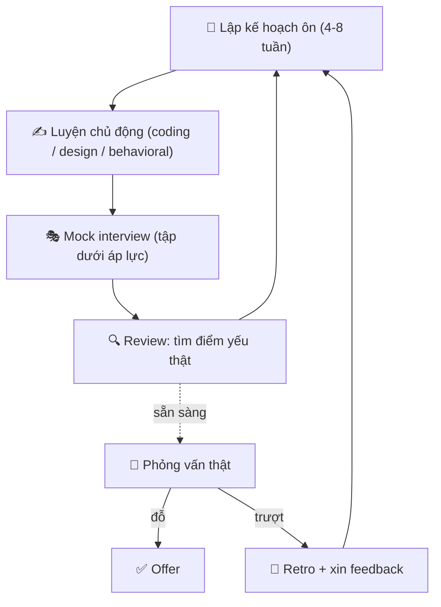

# 🎯 Kế hoạch ôn & Mock Interview — Biến luyện tập thành offer

> **Tác giả:** Mr.Rom\
> **Phiên bản:** v1.0.0\
> **Tạo lúc:** 13/06/2026\
> **Cập nhật:** 13/06/2026\
> **Level:** Basic\
> **Tags:** career, interview-prep, prep-plan, mock-interview, anxiety, interview-day, rejection, soft-skills\
> **Yêu cầu trước:** [Behavioral Interview & STAR](03_behavioral-interview-and-star.md)

> 🎯 *Ba bài trước đã dạy bạn từng "môn": coding, system design, behavioral. Nhưng biết từng môn không đảm bảo đỗ — bạn còn cần một **kế hoạch ôn** ghép chúng lại, **mock interview** để biến kiến thức thành phản xạ, một cái đầu **bình tĩnh** trong phòng phỏng vấn, và một quy trình **học từ thất bại** khi bị từ chối. Bài này là bài cuối của cụm — nó biến tất cả những gì bạn đã học thành một lịch luyện tập 4-8 tuần và những thói quen để bạn bước vào ngày phỏng vấn với sự tự tin có cơ sở.*

## 🎯 Sau bài này bạn sẽ

- [ ] Lập một **kế hoạch ôn 4-8 tuần** phân bổ thời gian cho coding / system design / behavioral theo level và thời gian còn lại
- [ ] Hiểu **mock interview** là gì, 4 cách mock (tự mock, peer, nền tảng, ghi hình) và rút bài học từ mỗi buổi
- [ ] Quản lý **lo lắng & áp lực** bằng combo chuẩn bị kỹ + kỹ thuật thở + reframe (đổi cách nhìn)
- [ ] Chuẩn bị **ngày phỏng vấn** đầy đủ: logistics, môi trường, thiết bị cho remote, thank-you note, follow-up
- [ ] Biến mỗi **rejection** (bị từ chối) thành dữ liệu cải thiện: xin feedback, làm retro, không nản
- [ ] Theo dõi **nhiều process song song** mà không lẫn lộn hay bỏ lỡ deadline

---

## Tình huống — bạn biết hết, nhưng vẫn trượt

Bạn đã đọc xong ba bài trước. Bạn hiểu cách tiếp cận một bài coding, biết khung trả lời system design, kể được câu chuyện STAR mạch lạc. Trên giấy, bạn đã "biết hết".

Rồi lịch phỏng vấn thật tới. Tim đập nhanh, tay run, đầu trống rỗng. Bài coding bạn từng giải trơn tru ở nhà bỗng "đơ" khi có người nhìn. Câu behavioral bạn từng kể trôi chảy bỗng lắp bắp. Hai tuần sau, email từ chối: *"Cảm ơn bạn, nhưng lần này chúng tôi chọn ứng viên khác."* Không một lời giải thích. Bạn ngồi đó, tự hỏi: *"Mình sai ở đâu? Mình đã biết hết rồi mà?"*

Đây là khoảng cách mà gần như **mọi người mới đi phỏng vấn đều rơi vào** — khoảng cách giữa **biết** và **làm được dưới áp lực**. Và nó đến từ bốn lỗ hổng mà ba bài trước chưa lấp:

- Bạn học **rời rạc** từng môn, chưa bao giờ **ôn theo lịch** để cả ba cùng sẵn sàng đúng ngày phỏng vấn.
- Bạn chỉ luyện **một mình**, chưa bao giờ tập **dưới áp lực có người nhìn** — nên ngày thật bị "sốc".
- Bạn không có **cách xử lý lo lắng**, nên cơ thể phản bội bạn đúng lúc cần nhất.
- Bạn coi **rejection là thất bại cá nhân**, không phải dữ liệu — nên trượt một lần là nản, không cải thiện được lần sau.

Bốn lỗ hổng này không phải vấn đề kỹ thuật. Chúng là vấn đề **chuẩn bị và tâm lý** — và đó chính xác là thứ bài này lấp đầy. Phỏng vấn là một kỹ năng riêng, tách biệt với kỹ năng code; và như mọi kỹ năng, nó **luyện được**.

---

## 1️⃣ Vì sao "biết" không bằng "luyện" — và mọi thứ bắt đầu từ một kế hoạch

Trước khi xếp lịch, cần hiểu vì sao chỉ "đọc cho biết" là không đủ. Não bộ học theo hai chế độ khác nhau: **nhận ra** (recognition — đọc lời giải và gật gù "à đúng rồi") và **gợi nhớ chủ động** (active recall — tự bật ra lời giải khi không có gợi ý). Phỏng vấn kiểm tra chế độ thứ hai, nhưng phần lớn người ôn lại chỉ luyện chế độ thứ nhất.

🪞 **Ẩn dụ xuyên bài**: chuẩn bị phỏng vấn giống như **luyện tập cho một trận đấu thể thao**. Bạn không thể chỉ *xem video* các trận đấu rồi mong ra sân chơi hay. Bạn phải có **giáo án tập** (kế hoạch ôn), **đấu tập với người thật** (mock interview), **giữ cái đầu lạnh khi vào trận** (quản lý lo lắng), chuẩn bị kỹ cho **ngày thi đấu** (ngày phỏng vấn), và **xem lại băng ghi hình mỗi trận thua** để sửa (học từ rejection). Cả bài này sẽ bám theo ẩn dụ "vận động viên luyện tập" đó.

Sơ đồ dưới là vòng lặp cốt lõi của việc luyện phỏng vấn — đây là khái niệm trừu tượng nhất của bài, nên ta vẽ ra trước khi đi vào chi tiết. Để ý nó là một **vòng tròn**, không phải đường thẳng: bạn lặp lại nó cho tới khi có offer.



→ Điểm cốt lõi của sơ đồ: **mock và review nằm trong vòng lặp**, không phải làm một lần rồi thôi. Mỗi vòng, bạn tìm ra một điểm yếu thật (qua mock hoặc qua rejection), rồi đưa nó vào kế hoạch ôn vòng sau. Đây là khác biệt giữa người "ôn 8 tuần mà không tiến" và người "tiến rõ rệt mỗi tuần": người sau **đóng được vòng lặp feedback**, người trước chỉ đi thẳng.

---

## 2️⃣ Kế hoạch ôn 4-8 tuần — phân bổ thời gian cho đúng

Câu hỏi đầu tiên ai cũng hỏi: *"Em nên ôn gì, ôn bao lâu?"*. Sai lầm phổ biến là ôn **dàn trải đều** mọi thứ, hoặc ôn **thứ mình thích** (thường là coding, vì có cảm giác tiến bộ rõ) mà bỏ bê thứ mình ngại (thường là behavioral và system design).

**Trả lời tình huống đầu bài**: bạn trượt không phải vì "không biết", mà vì ôn lệch — dồn hết vào coding, để behavioral và system design "tới đâu hay tới đó". Phỏng vấn loop đánh giá cả ba; yếu một môn là đủ trượt. Một kế hoạch tốt **phân bổ theo trọng số đúng**, không theo cảm xúc.

### Phân bổ theo level — bạn đang ứng tuyển vị trí nào?

Trọng số ba môn **thay đổi theo level vị trí** bạn nhắm. Đây là lý do không có một "công thức ôn" chung cho tất cả. Bảng dưới là điểm khởi đầu — điều chỉnh theo job description thực tế của vị trí bạn ứng tuyển.

| Level vị trí | Coding / DSA | System Design | Behavioral | Vì sao |
|---|---|---|---|---|
| **Intern / Junior** | ~60% | ~10% | ~30% | Loop nặng về coding; design hỏi nhẹ hoặc không hỏi |
| **Mid-level** | ~45% | ~25% | ~30% | Bắt đầu có vòng design thật; behavioral nặng dần |
| **Senior+** | ~30% | ~40% | ~30% | Design là trọng tâm; behavioral đo leadership |

→ Phân tích: nhìn cột Coding giảm dần và System Design tăng dần khi lên level — đây là điều người mới hay bỏ sót. Một bạn junior dồn 90% vào LeetCode thì hợp lý; nhưng một bạn ứng tuyển Senior mà vẫn cắm đầu vào LeetCode còn design thì "để sau" gần như chắc chắn trượt vòng design. **Behavioral giữ ~30% ở mọi level** vì nó luôn được hỏi và là môn dễ ăn điểm nhất nếu chuẩn bị (bài 03 đã dạy).

> [!IMPORTANT]
> Phân bổ phần trăm ở trên là **trọng số thời gian luyện**, không phải "học một lần là xong". Dù chỉ ôn 1 tuần, bạn vẫn phải chạm cả ba môn — đừng để môn nào về 0%. Một vòng phỏng vấn trượt thường vì **môn yếu nhất**, không phải môn mạnh nhất kéo lên.

### Phân bổ theo thời gian còn lại — bạn có mấy tuần?

Yếu tố thứ hai là **thời gian còn lại tới ngày phỏng vấn**. Cùng một người, nhưng còn 8 tuần thì ôn khác hẳn còn 1 tuần. Bảng dưới là chiến lược theo quỹ thời gian — chọn dòng khớp với hoàn cảnh của bạn.

| Thời gian còn | Chiến lược trọng tâm |
|---|---|
| **8 tuần** | Ôn nền tảng vững từng môn → tăng dần độ khó → 2 tuần cuối toàn mock. Lý tưởng nhất. |
| **4 tuần** | Bỏ qua nền tảng cơ bản (giả định đã có) → luyện pattern phổ biến + mock từ tuần 2. |
| **1-2 tuần** | Cấp tốc: chỉ luyện pattern hay gặp nhất + ôn lại STAR stories + 2-3 mock. Không tham. |
| **< 3 ngày** | Không ôn kiến thức mới. Chỉ ngủ đủ, review stories có sẵn, làm 1 mock cho quen nhịp. |

> [!WARNING]
> Cạm bẫy lớn nhất khi còn ít thời gian là **học kiến thức mới sát ngày phỏng vấn**. Học một thuật toán lạ tối hôm trước không giúp bạn đỗ — nó chỉ làm bạn lo thêm và mất ngủ. Khi còn < 3 ngày, **củng cố thứ đã chắc** quan trọng hơn nhồi thứ mới. Ngủ đủ giấc đêm trước có giá trị hơn mọi giờ ôn cuối.

### Timeline mẫu 8 tuần — bản đồ tuần-theo-tuần

Lý thuyết phân bổ là một chuyện, nhưng người mới cần một **lịch cụ thể** để bám theo. Dưới đây là một timeline 8 tuần mẫu cho một bạn ứng tuyển **Mid-level** (điều chỉnh trọng số nếu bạn ở level khác). Đây là khung — bạn copy vào lịch của mình và chỉnh theo thực tế.

| Tuần | Trọng tâm | Mục tiêu cụ thể của tuần |
|---|---|---|
| **1** | Nền tảng Coding | Ôn lại cấu trúc dữ liệu cơ bản: array, hash map, stack/queue. Giải 3-5 bài easy/ngày. |
| **2** | Coding + bắt đầu Behavioral | Pattern: two pointers, sliding window, binary search. Viết 3 STAR stories đầu tiên. |
| **3** | Coding sâu + System Design nhập môn | Trees, graphs (BFS/DFS), recursion. Học framework design (bài 02). Viết thêm 3 STAR stories. |
| **4** | System Design + Coding duy trì | Luyện 2-3 bài design kinh điển (URL shortener, news feed). Giải coding medium đều. |
| **5** | **Mock #1** + tổng ôn | Mock toàn diện (coding + behavioral). Review điểm yếu. Lấp lỗ hổng phát hiện được. |
| **6** | Lấp lỗ hổng theo kết quả mock | Dồn vào môn yếu nhất từ mock #1. Luyện thêm STAR stories còn lúng túng. |
| **7** | **Mock #2 + #3** (mô phỏng loop thật) | 2 mock với người khác nhau. Tập kể behavioral không nhìn ghi chú. |
| **8** | Tinh chỉnh + nghỉ ngơi | Review tất cả stories + pattern. **Giảm tải** dần. Ngủ đủ. Không học mới. |

→ Để ý ba điều trong timeline này: (1) **mock bắt đầu từ tuần 5**, không để tới phút chót — vì mock chính là thứ phát hiện điểm yếu để còn kịp sửa; (2) **tuần 6 không có nội dung cố định** mà "dồn vào môn yếu nhất từ mock #1" — kế hoạch tốt luôn chừa chỗ cho điều chỉnh; (3) **tuần cuối giảm tải** chứ không tăng tốc — giống vận động viên "taper" trước trận lớn, để cơ thể và đầu óc tươi tỉnh đúng ngày.

> [!TIP]
> Dù bận tới đâu, hãy đặt một **lịch cố định** thay vì "rảnh thì ôn". Não học tốt hơn với 1 giờ đều mỗi ngày so với 7 giờ dồn vào chủ nhật. Quan trọng hơn số giờ là **tính đều đặn** và **luyện chủ động** (tự giải rồi mới xem đáp án), không phải đọc lời giải cho "có cảm giác hiểu".

---

## 3️⃣ Mock interview — tập dưới áp lực để hết "đơ"

Đây là kỹ thuật **quan trọng nhất** của cả bài, và cũng là thứ người mới bỏ qua nhiều nhất vì ngại. Bạn có thể giải 500 bài LeetCode một mình mà vẫn "đơ" ngay câu đầu khi có người nhìn — vì bạn chưa bao giờ tập **dưới áp lực có người quan sát**.

🪞 **Quay lại ẩn dụ vận động viên**: mock interview là **đấu tập** (scrimmage). Đá một mình với tường khác hẳn đá với một người thật chặn bạn. Mock tạo ra đúng cái áp lực mà phòng phỏng vấn thật có — có người nhìn, có giới hạn thời gian, phải vừa nghĩ vừa nói — để khi vào trận thật, cảm giác đó đã **quen**, không còn "sốc".

Có bốn cách mock, từ dễ tổ chức tới sát thật nhất. Bảng dưới so sánh để bạn biết khi nào dùng cái nào — lý tưởng là dùng cả bốn ở các giai đoạn khác nhau.

| Cách mock | Sát thật tới đâu | Công sức tổ chức | Khi nào dùng |
|---|---|---|---|
| **Tự mock** (self-mock) | Thấp | Rất thấp | Giai đoạn đầu, làm quen nói-trong-lúc-giải |
| **Peer mock** (với bạn bè/đồng nghiệp) | Trung bình | Thấp | Có người quen cũng đang ôn — đổi vai cho nhau |
| **Nền tảng mock** (Pramp, interviewing.io) | Cao | Trung bình | Cần người lạ phỏng vấn, sát môi trường thật |
| **Ghi hình review** (record + xem lại) | (kèm bất kỳ cách nào) | Thấp | Luôn nên làm — soi tật của chính mình |

### Cách 1 — Tự mock (self-mock)

Khi chưa có ai mock cùng, bạn vẫn tập được một mình theo cách **mô phỏng áp lực**:

- Đặt **đồng hồ đếm ngược** (vd 35-45 phút cho một bài coding) — buộc mình làm dưới giới hạn thời gian.
- **Nói thành tiếng** suốt quá trình giải, như đang giải thích cho người phỏng vấn — đây là kỹ năng "think out loud" mà bài 01 dạy, và nó phải được **luyện thành phản xạ**.
- **Không nhìn đáp án** cho tới khi hết giờ — ép active recall.
- Với behavioral: tự đặt câu hỏi (vd *"Kể về một lần em gặp xung đột trong team"*) rồi **bấm giờ trả lời** thành tiếng, không đọc ghi chú.

→ Tự mock không thay được người thật, nhưng nó rẻ, làm được mọi lúc, và rèn đúng cái phản xạ "nói trong lúc nghĩ" — thứ khó nhất với người mới.

### Cách 2 — Peer mock (với bạn bè cùng ôn)

Nếu bạn quen ai cũng đang ôn phỏng vấn, **đổi vai cho nhau** là cách mock giá trị mà miễn phí. Một người đóng vai ứng viên, một người đóng vai người phỏng vấn (đọc đề có sẵn, bấm giờ, ghi nhận xét). Sau đó đổi vai.

Lợi ích kép: bạn không chỉ học khi **làm ứng viên**, mà còn học rất nhiều khi **làm người phỏng vấn** — bạn thấy người kia mắc lỗi gì, từ đó nhận ra mình cũng mắc lỗi tương tự. Đứng ở ghế người phỏng vấn cho bạn góc nhìn "họ đang đánh giá gì".

### Cách 3 — Nền tảng mock với người lạ

Mock với bạn bè có một điểm yếu: bạn **không sợ** người quen, nên áp lực giả. Mock với **người lạ** mới tạo đúng cái căng thẳng của phỏng vấn thật. Có những nền tảng kết nối bạn với người lạ để mock miễn phí hoặc trả phí:

- **Pramp** (nay là một phần của Exponent — tryexponent.com) — ghép cặp ngang hàng (peer-to-peer): bạn phỏng vấn người khác một lượt, rồi họ phỏng vấn lại bạn. Miễn phí.
- **interviewing.io** — mock với kỹ sư thật từ các công ty lớn, **ẩn danh**. Có cả mock miễn phí lẫn trả phí; điểm mạnh là feedback từ người phỏng vấn thật sự.

→ Mock với người lạ đáng giá nhất ở giai đoạn giữa-cuối kế hoạch (tuần 5 trở đi trong timeline), khi nền tảng kiến thức đã ổn và bạn cần "diễn tập" trong điều kiện gần thật nhất.

### Cách 4 — Ghi hình và xem lại (record review)

Đây là kỹ thuật **soi tật mạnh nhất** mà ít người làm vì... ngại nhìn lại chính mình. Bật ghi màn hình + camera trong lúc tự mock hoặc peer mock, rồi xem lại. Bạn sẽ phát hiện những tật mà lúc làm không hề biết:

- Nói "ờ", "ừm" quá nhiều, hoặc im lặng quá lâu (người phỏng vấn không biết bạn đang nghĩ gì).
- Nhảy vào code ngay mà không làm rõ đề (bài 01 đã cảnh báo).
- Kể behavioral lan man, không theo cấu trúc STAR.
- Ngôn ngữ cơ thể: nhìn đi chỗ khác, cau mày, ngồi gù.

> [!TIP]
> Đừng tự đánh giá cảm tính kiểu "buổi đó tệ/ổn". Sau mỗi mock, **viết ra 3 thứ**: (1) một điều làm tốt cần giữ, (2) một điều cần sửa cụ thể, (3) một hành động cho lần sau. Ba dòng này biến mock từ "tập cho có" thành dữ liệu cải thiện thật.

---

## 4️⃣ Quản lý lo lắng & áp lực — giữ cái đầu lạnh trong phòng

Bạn có thể chuẩn bị hoàn hảo mà vẫn trượt nếu lo lắng "đánh sập" bạn ngay câu đầu. Tim đập nhanh, tay đổ mồ hôi, đầu trống rỗng — đây là phản ứng sinh lý thật, không phải "yếu đuối". Hiểu nó để xử lý nó.

🪞 **Vẫn là vận động viên**: ngay cả vận động viên giỏi nhất cũng hồi hộp trước trận lớn. Khác biệt là họ không cố **dập tắt** sự hồi hộp (bất khả thi) — họ **điều khiển** nó. Có ba công cụ, dùng kết hợp.

### Công cụ 1 — Chuẩn bị kỹ (liều thuốc gốc rễ)

Phần lớn lo lắng đến từ **bất định**: "Mình không biết họ sẽ hỏi gì, mình không biết mình có làm được không." Cách chữa gốc rễ là **giảm bất định** bằng chuẩn bị — và đây chính là lý do mọi phần trên của bài tồn tại.

- Đã làm **mock** nhiều lần → cái cảm giác "có người nhìn" không còn lạ → bớt sốc.
- Đã viết sẵn **STAR stories** → không sợ câu behavioral "bất ngờ".
- Đã luyện **pattern coding** → gặp bài lạ vẫn có khung tiếp cận.

→ Lo lắng tỉ lệ nghịch với chuẩn bị. Một người chuẩn bị kỹ vẫn hồi hộp, nhưng đó là hồi hộp "sẵn sàng", không phải hoảng loạn "trống rỗng".

### Công cụ 2 — Kỹ thuật thở (xử lý tức thời)

Khi cơ thể đã vào trạng thái hoảng (ngay trước hoặc trong buổi phỏng vấn), bạn cần một nút "reset" tức thời. **Thở chậm và sâu** là cách nhanh nhất làm dịu hệ thần kինh — vì thở ra dài kích hoạt phản ứng "thư giãn" của cơ thể.

Một kỹ thuật đơn giản, dễ nhớ là **box breathing** (thở hộp) — hít, giữ, thở, giữ, mỗi nhịp đếm 4:

- **Hít vào** đếm 4 → **giữ** đếm 4 → **thở ra** đếm 4 → **giữ** đếm 4. Lặp 3-4 vòng.
- Làm được kín đáo ngay trước khi vào phòng (hoặc khi camera chưa bật), không ai biết.
- Khi bị hỏi một câu khó và đầu trống: hít một hơi sâu, nói *"Cho em một chút để suy nghĩ ạ"* — vài giây im lặng có chủ đích tốt hơn nhiều so với lắp bắp.

### Công cụ 3 — Reframe (đổi cách nhìn)

Cùng một sự kiện, cách bạn **gán nghĩa** cho nó quyết định bạn lo hay bình tĩnh. Reframe là chủ động đổi câu chuyện trong đầu. Bảng dưới đối chiếu cách nghĩ gây lo và cách nghĩ thay thế — tập nói câu bên phải với chính mình.

| ❌ Cách nghĩ gây lo | ✅ Reframe bình tĩnh |
|---|---|
| "Đây là bài kiểm tra, mình bị phán xét" | "Đây là cuộc trò chuyện kỹ thuật giữa hai dev" |
| "Mình PHẢI đỗ chỗ này" | "Đây là một trong nhiều cơ hội; mình đang luyện tập" |
| "Họ đang tìm lý do loại mình" | "Họ đang muốn mình thành công — họ cần tuyển người" |
| "Tim đập nhanh = mình đang sợ, hỏng rồi" | "Tim đập nhanh = cơ thể đang nạp năng lượng để tập trung" |
| "Nếu trượt thì mình kém cỏi" | "Nếu trượt thì mình học được điều gì đó, thử lại lần sau" |

> [!NOTE]
> Reframe cuối cùng — "tim đập nhanh = nạp năng lượng" — không phải tự huyễn. Hồi hộp và hào hứng có **cùng biểu hiện sinh lý** (tim nhanh, người nóng); chỉ khác ở cái nhãn ta dán. Dán nhãn "mình đang hào hứng" thay vì "mình đang sợ" thực sự giúp diễn đạt tốt hơn dưới áp lực. Đây là cách "đánh lừa" có cơ sở mà các diễn giả hay dùng.

---

## 5️⃣ Ngày phỏng vấn — đừng để tiểu tiết phá hỏng chuẩn bị

Bạn đã ôn 8 tuần, mock nhiều lần, biết cách thở. Rồi ngày phỏng vấn đến và bạn... vào nhầm link, mic rè, đèn ngược sáng làm mặt tối thui, hoặc tới muộn vì kẹt xe. Những tiểu tiết logistics tưởng nhỏ này phá hỏng cả tháng chuẩn bị, và tệ hơn — chúng làm bạn **hoảng ngay từ đầu**.

🪞 **Ngày phỏng vấn = ngày thi đấu**. Vận động viên chuyên nghiệp không tới sân vào phút chót. Họ tới sớm, làm quen sân, kiểm tra giày, khởi động. Bạn cũng nên có một **checklist ngày thi đấu** để không phải lo nghĩ về tiểu tiết và dồn toàn bộ năng lượng vào thi đấu.

### Logistics chung (mọi loại phỏng vấn)

Vài việc nhỏ làm trước giúp bạn vào buổi phỏng vấn với đầu óc trống lo:

- **Xác nhận thời gian + múi giờ** — nhất là khi phỏng vấn công ty nước ngoài (lệch múi giờ là lỗi kinh điển). Ghi rõ giờ địa phương của bạn.
- **Biết rõ format** — hỏi recruiter trước: vòng này là coding hay behavioral? Dùng tool gì (CoderPad, HackerRank, Google Meet)? Bao lâu?
- **Chuẩn bị sẵn câu hỏi ngược** — cuối buổi luôn có "bạn có câu hỏi gì không?". Có sẵn 2-3 câu thông minh (xem bài đầu cụm và bài job-search) thể hiện bạn nghiêm túc.
- **Để sẵn nước uống + giấy bút** — khô họng giữa buổi rất khó chịu; giấy bút để vẽ nháp khi nghĩ.

### Riêng cho phỏng vấn remote — thiết bị & môi trường

Phỏng vấn remote (qua video) phổ biến nhất hiện nay, và đây là nơi tiểu tiết kỹ thuật dễ phá hỏng nhất. Kiểm tra **trước ngày phỏng vấn**, không phải lúc đang vào:

- **Internet** — kiểm tra đường truyền ổn định; có phương án dự phòng (4G điện thoại) nếu wifi rớt.
- **Mic + camera** — test thử bằng một cuộc gọi nháp. Mic rè hoặc echo làm người phỏng vấn mệt mỏi và bạn mất điểm oan.
- **Ánh sáng** — ngồi **đối diện** nguồn sáng (cửa sổ/đèn ở trước mặt), không để sáng sau lưng (ngược sáng làm mặt tối thui).
- **Phông nền + tiếng ồn** — chọn nơi yên tĩnh, phông nền gọn gàng. Báo người nhà đừng làm phiền trong khung giờ đó.
- **Đăng nhập sớm 5-10 phút** — vào phòng chờ trước, kiểm tra mọi thứ chạy, để không cập rập đúng giờ G.

> [!CAUTION]
> Đừng bao giờ kiểm tra mic/camera/link **lần đầu** ngay lúc buổi phỏng vấn bắt đầu. Mọi sự cố kỹ thuật (cài extension lạ, xin quyền camera, link sai) phải được phát hiện **từ hôm trước** bằng một cuộc test nháp. Năm phút đầu cập rập vì mic không lên có thể đặt tông tiêu cực cho cả buổi.

### Sau buổi phỏng vấn — thank-you note & follow-up

Buổi phỏng vấn chưa kết thúc khi bạn tắt camera. Hai động tác nhỏ sau đó tạo khác biệt:

- **Thank-you note** — gửi một email cảm ơn ngắn trong vòng 24 giờ (qua recruiter hoặc người phỏng vấn nếu có email). Không sáo rỗng: cảm ơn + nhắc một chi tiết cụ thể bạn thấy thú vị trong buổi + khẳng định bạn vẫn hào hứng. Nó cho thấy bạn chuyên nghiệp và thật sự quan tâm.
- **Follow-up** — nếu quá thời gian recruiter hứa phản hồi (vd "tuần sau sẽ báo") mà im lặng, gửi một email lịch sự hỏi thăm tiến độ. Im lặng không đồng nghĩa trượt — recruiter rất bận, một email nhắc nhẹ kéo bạn lại vào tầm ngắm.

Một mẫu thank-you note ngắn gọn bạn có thể chỉnh cho giọng của mình:

```text
Tiêu đề: Cảm ơn về buổi phỏng vấn vị trí Backend Engineer

Chào anh/chị [Tên],

Cảm ơn anh/chị đã dành thời gian trao đổi với em hôm nay. Em đặc biệt
thấy thú vị khi nghe về [chi tiết cụ thể, vd: cách team đang chuyển
hệ thống sang event-driven]. Buổi nói chuyện càng làm em hào hứng với
cơ hội được làm việc cùng team.

Nếu anh/chị cần thêm thông tin gì từ phía em, em luôn sẵn sàng.
Cảm ơn anh/chị một lần nữa.

Trân trọng,
[Tên của bạn]
```

→ Lưu ý: thank-you note **không** phải nài nỉ hay liệt kê lại toàn bộ kinh nghiệm — nó ngắn, chân thành, và nhắc một chi tiết thật để chứng minh bạn có mặt và lắng nghe thật sự.

---

## 6️⃣ Học từ rejection — biến "trượt" thành dữ liệu

Đây là phần khó nhất về mặt cảm xúc và là nơi nhiều người **bỏ cuộc**. Một email từ chối lạnh lùng dễ làm bạn nghĩ "mình không đủ giỏi" rồi nản. Nhưng rejection là một phần **bình thường và không thể tránh** của quá trình — kể cả những kỹ sư giỏi nhất cũng bị từ chối nhiều lần. Vấn đề không phải có bị từ chối hay không, mà là bạn **làm gì với nó**.

🪞 **Vận động viên xem lại băng trận thua**: không ai thắng mọi trận. Vận động viên giỏi không né tránh trận thua — họ **xem lại băng ghi hình**, tìm ra mình hổng ở đâu, rồi tập đúng chỗ đó. Rejection là cái "băng ghi hình" của bạn. Né tránh nó = lặp lại sai lầm. Phân tích nó = tiến bộ.

### Xin feedback — dữ liệu quý nhất, dù khó lấy

Sau khi bị từ chối, bạn được phép (và nên) **lịch sự xin feedback**. Không phải lúc nào cũng được trả lời (nhiều công ty có chính sách không cho feedback chi tiết vì lý do pháp lý), nhưng hỏi không mất gì, và đôi khi bạn nhận được một câu gợi ý vàng. Cách hỏi lịch sự:

> *"Cảm ơn anh/chị đã thông báo. Em hoàn toàn tôn trọng quyết định. Nếu có thể, em rất mong nhận được một chút phản hồi về điểm em cần cải thiện cho những cơ hội sau — bất kỳ góp ý nào cũng quý với em. Cảm ơn anh/chị."*

→ Để ý giọng điệu: **không** chất vấn "tại sao loại em", **không** tranh luận quyết định — chỉ xin góp ý để tiến bộ. Đây là cách giữ quan hệ tốt (biết đâu công ty đó tuyển lại bạn sau này) và tăng khả năng nhận được phản hồi thật.

### Tự làm retro — khi không có feedback từ ngoài

Phần lớn rejection sẽ **không kèm lý do**. Khi đó, bạn tự làm một buổi **retro** (retrospective — nhìn lại) cho chính mình, dựa trên trí nhớ và ghi chú ngay sau buổi phỏng vấn (nên ghi lại cảm nhận **trong vòng vài giờ** khi còn nhớ rõ). Trả lời ba câu:

1. **Vòng nào mình cảm thấy yếu nhất?** (coding đơ ở bài nào, behavioral lúng túng câu nào, design bí ở phần nào)
2. **Nguyên nhân là gì?** (thiếu kiến thức cụ thể? lo lắng làm đơ? hay chỉ là không hợp lần này?)
3. **Hành động cụ thể cho lần sau là gì?** (đưa thẳng vào kế hoạch ôn vòng tiếp)

→ Buổi retro này chính là mũi tên "Retro + xin feedback → Lập kế hoạch" trong sơ đồ vòng lặp ở phần 1. Nó đóng vòng feedback, biến một lần trượt thành một mục cụ thể trong giáo án tuần sau.

> [!IMPORTANT]
> Phân biệt rạch ròi **"buổi phỏng vấn này không thành"** với **"mình là người kém cỏi"**. Một rejection nói lên rất ít về giá trị của bạn — nó chịu ảnh hưởng của vô số yếu tố ngoài tầm kiểm soát: số ứng viên khác, ngân sách thay đổi, một người phỏng vấn có hôm xấu trời, hay đơn giản là "chưa hợp lần này". Tách cảm xúc khỏi dữ liệu: lấy bài học (dữ liệu), bỏ lại sự tự trách (cảm xúc).

### Không nản — quản lý tinh thần đường dài

Tìm việc là một cuộc chạy đường dài, không phải nước rút. Vài thói quen giữ tinh thần:

- **Đặt kỳ vọng đúng**: rejection là mặc định, offer là ngoại lệ — kể cả người giỏi cũng trượt nhiều hơn đỗ. Biết trước điều này thì mỗi lần trượt không còn là cú sốc.
- **Đếm "input", không chỉ "output"**: thay vì ám ảnh số offer (output, ngoài tầm kiểm soát), hãy tự thưởng cho số mock đã làm, số bài đã luyện, số đơn đã nộp (input, trong tầm kiểm soát).
- **Nghỉ khi cần**: nếu thấy kiệt sức, nghỉ một-hai ngày không phải lười — đó là bảo trì để chạy đường dài. Một cái đầu burnout phỏng vấn còn tệ hơn.
- **Tìm bạn đồng hành**: ôn cùng một nhóm hoặc một người bạn giúp bạn không cô đơn và có người chia sẻ lúc nản.

---

## 7️⃣ Theo dõi nhiều process song song — đừng để rối

Khi bạn nghiêm túc tìm việc, bạn sẽ phỏng vấn **nhiều công ty cùng lúc**, mỗi công ty ở một vòng khác nhau. Trí nhớ sẽ phản bội bạn: quên đã hẹn phỏng vấn chỗ nào, quên gửi thank-you cho ai, quên công ty nào đã im lặng quá lâu cần follow-up. Mỗi lần quên là một cơ hội rơi.

🪞 **Huấn luyện viên quản lý nhiều vận động viên**: một HLV giỏi không nhớ lịch tập của từng người trong đầu — họ có một bảng theo dõi ai đang ở giai đoạn nào, cần làm gì tiếp. Bạn cũng nên coi mỗi công ty như một "process" cần theo dõi có hệ thống.

> [!NOTE]
> Việc theo dõi pipeline ứng tuyển được dạy chi tiết ở bài [Tìm việc & Đánh giá offer](../../../career-path/lessons/01_basic/03_job-search-and-offer.md) bên cụm career-path. Ở đây ta nhìn nó dưới góc độ **quản lý lịch phỏng vấn và chuẩn bị** — bổ sung thêm cột phục vụ riêng cho giai đoạn phỏng vấn.

Giải pháp đơn giản nhất là một bảng tính (Google Sheets / Notion / Excel). Dưới đây là cấu trúc cột tối thiểu — bạn copy vào bảng của mình là dùng được ngay.

| Công ty | Vòng hiện tại | Ngày phỏng vấn tới | Cần chuẩn bị gì | Đã gửi thank-you? | Bước tiếp theo |
|---|---|---|---|---|---|
| Công ty A | Technical screen | 16/06, 14:00 | Coding medium + 1 STAR story | — (chưa diễn ra) | Đăng nhập sớm, test mic trước |
| Công ty B | Onsite loop | 18/06, 09:00 | Design + 2 coding + behavioral | — (chưa diễn ra) | Ôn lại framework design tối 17/06 |
| Công ty C | Recruiter screen xong | — | (chờ kết quả) | ✅ đã gửi 12/06 | Follow-up nếu 19/06 chưa có tin |

→ Phân tích nhanh từ bảng: chỉ liếc một cái là biết hôm nay làm gì (chuẩn bị cho A chiều 16/06), tối nay ôn gì (design cho B), và chỗ nào đang chờ cần để ý (C — đặt nhắc follow-up 19/06). Không còn cảnh "không nhớ tới đâu". **Cập nhật bảng ngay sau mỗi tương tác**, không để dồn.

> [!TIP]
> Đặt một quy tắc đơn giản: **mỗi buổi phỏng vấn → ngay sau đó làm 3 việc**: (1) ghi nhanh cảm nhận + câu hỏi gặp phải (phục vụ retro), (2) gửi thank-you note trong 24h, (3) cập nhật bảng theo dõi + đặt nhắc follow-up. Ba thói quen này tách bạn khỏi đám đông ứng viên "phỏng vấn xong là quên".

---

## 💡 Cạm bẫy thường gặp & Best practice

### ❌ Cạm bẫy: ôn lệch — dồn hết vào môn mình thích

- **Triệu chứng**: cắm đầu giải LeetCode (vì có cảm giác tiến bộ rõ) trong khi behavioral và system design "để sau", rồi trượt đúng vòng yếu nhất.
- **Nguyên nhân**: chọn ôn theo cảm xúc (môn nào dễ chịu) thay vì theo trọng số đúng cho level vị trí.
- **Cách tránh**: phân bổ thời gian theo bảng level ở phần 2, không để môn nào về 0%. Một loop trượt thường vì **môn yếu nhất**, nên dồn sức lấp lỗ hổng quan trọng hơn mài giũa thế mạnh.

### ❌ Cạm bẫy: chỉ luyện một mình, không bao giờ mock

- **Triệu chứng**: giải được hàng trăm bài ở nhà nhưng vào phòng phỏng vấn là "đơ", quên cả thứ đã biết.
- **Nguyên nhân**: chưa bao giờ tập **dưới áp lực có người quan sát** — kỹ năng làm-được-khi-bị-nhìn không tự có, phải luyện.
- **Cách tránh**: đưa mock vào kế hoạch từ giữa giai đoạn ôn (không để phút chót). Tự mock có bấm giờ + nói thành tiếng là tối thiểu; peer mock và mock với người lạ (Pramp, interviewing.io) là lý tưởng.

### ❌ Cạm bẫy: coi rejection là bằng chứng "mình kém cỏi"

- **Triệu chứng**: bị từ chối một-hai lần là nản, nghi ngờ năng lực, ngừng nộp đơn.
- **Nguyên nhân**: nhầm "buổi phỏng vấn này không thành" với "mình là người không đủ giỏi", và không tách cảm xúc khỏi dữ liệu.
- **Cách tránh**: đặt kỳ vọng đúng (rejection là mặc định, kể cả người giỏi cũng trượt nhiều), làm retro để rút bài học cụ thể, đếm input (số mock, số đơn) thay vì ám ảnh output (số offer).

### ✅ Best practice: đóng vòng lặp feedback sau mỗi mock và mỗi rejection

- **Vì sao**: tiến bộ thật đến từ việc **tìm ra điểm yếu cụ thể rồi luyện đúng nó**, không phải "ôn nhiều giờ một cách mơ hồ". Người tiến nhanh là người đóng được vòng lặp luyện → mock → review → điều chỉnh.
- **Cách áp dụng**: sau mỗi mock viết 3 dòng (giữ gì / sửa gì / hành động gì); sau mỗi rejection làm retro 3 câu (vòng yếu nhất / nguyên nhân / hành động) và đưa kết quả thẳng vào kế hoạch ôn tuần sau.

### ✅ Best practice: chuẩn bị ngày phỏng vấn như ngày thi đấu

- **Vì sao**: tiểu tiết logistics (link sai, mic rè, ngược sáng, lệch múi giờ) có thể phá hỏng cả tháng chuẩn bị và đặt tông hoảng loạn ngay từ đầu.
- **Cách áp dụng**: test mic/camera/link **từ hôm trước**, ngồi đối diện nguồn sáng, đăng nhập sớm 5-10 phút, để sẵn nước + giấy bút + câu hỏi ngược; sau buổi gửi thank-you trong 24h.

---

## 🧠 Tự kiểm tra (Self-check)

**Q1.** Bạn ứng tuyển vị trí **Senior** và còn 6 tuần. Bạn rất giỏi coding nhưng yếu system design. Bạn nên phân bổ thời gian thế nào, và sai lầm cần tránh là gì?

<details>
<summary>💡 Xem giải thích</summary>

Với vị trí **Senior**, trọng số nên nghiêng về **system design (~40%)** và behavioral (~30%), coding chỉ ~30% — vì loop senior lấy design làm trọng tâm. Vì bạn đã giỏi coding, càng nên **giảm coding xuống mức duy trì** và **dồn vào design** (môn yếu). Sai lầm điển hình cần tránh: tiếp tục cắm đầu vào LeetCode vì nó "dễ chịu" và cho cảm giác tiến bộ, trong khi để design "tới đâu hay tới đó". Một loop trượt thường vì **môn yếu nhất** — ở đây là design — nên ưu tiên lấp lỗ hổng đó. Đừng để môn nào về 0%, nhưng phân bổ phải theo trọng số đúng, không theo cảm xúc.

</details>

**Q2.** Bạn giải được rất nhiều bài coding ở nhà nhưng cứ vào phỏng vấn thật là "đơ". Nguyên nhân gốc là gì và cách khắc phục cụ thể?

<details>
<summary>💡 Xem giải thích</summary>

Nguyên nhân gốc: bạn mới luyện ở chế độ **một mình, không áp lực**, chưa bao giờ tập **dưới áp lực có người quan sát + giới hạn thời gian + phải vừa nghĩ vừa nói**. Kỹ năng "làm được khi bị nhìn" tách biệt với kỹ năng giải bài, và phải luyện riêng. Khắc phục: đưa **mock interview** vào kế hoạch. Tối thiểu là tự mock (bấm giờ, nói thành tiếng suốt quá trình giải, không nhìn đáp án tới khi hết giờ). Lý tưởng hơn: peer mock (đổi vai với bạn cùng ôn) và mock với người lạ qua Pramp / interviewing.io để có áp lực thật. Kèm theo **ghi hình xem lại** để soi tật (nói "ờ ừm" nhiều, nhảy vào code không làm rõ đề...).

</details>

**Q3.** Ngay trước buổi phỏng vấn remote, bạn thấy tim đập nhanh, tay run, đầu hơi trống. Bạn làm gì trong 2 phút tới?

<details>
<summary>💡 Xem giải thích</summary>

Dùng combo xử lý tức thời: (1) **Thở** — box breathing: hít 4 - giữ 4 - thở ra 4 - giữ 4, lặp 3-4 vòng, làm kín đáo trước khi bật camera. Thở ra dài làm dịu hệ thần kinh. (2) **Reframe** — đổi nhãn cho cảm giác: "tim đập nhanh = cơ thể đang nạp năng lượng để tập trung", không phải "mình đang sợ, hỏng rồi"; và "đây là cuộc trò chuyện kỹ thuật giữa hai dev", không phải "bài kiểm tra phán xét mình". (3) Nhắc bản thân rằng **đã chuẩn bị kỹ** (mock nhiều, có STAR stories sẵn) — lo lắng tỉ lệ nghịch với chuẩn bị. Nếu trong buổi gặp câu khó và đầu trống, hít một hơi và nói "Cho em một chút để suy nghĩ ạ" — im lặng có chủ đích tốt hơn lắp bắp.

</details>

**Q4.** Bạn bị một công ty từ chối, email rất ngắn không nêu lý do. Bạn nên làm gì để lần sau tốt hơn?

<details>
<summary>💡 Xem giải thích</summary>

Hai việc. **Một**, lịch sự xin feedback: cảm ơn, tôn trọng quyết định, mong nhận một chút góp ý về điểm cần cải thiện — không chất vấn, không tranh luận. Có thể không được trả lời, nhưng hỏi không mất gì và đôi khi nhận được gợi ý quý; giữ quan hệ tốt cho lần sau. **Hai**, tự làm **retro** dựa trên ghi chú bạn viết ngay sau buổi phỏng vấn (nên ghi trong vài giờ khi còn nhớ): trả lời 3 câu — vòng nào yếu nhất? nguyên nhân (thiếu kiến thức / lo lắng / không hợp lần này)? hành động cụ thể cho lần sau? Đưa hành động đó thẳng vào kế hoạch ôn. Quan trọng: tách "buổi này không thành" khỏi "mình kém cỏi" — lấy bài học (dữ liệu), bỏ lại sự tự trách (cảm xúc). Rejection là mặc định, kể cả người giỏi cũng trượt nhiều.

</details>

**Q5.** Bạn đang phỏng vấn 3 công ty cùng lúc, mỗi chỗ một vòng khác nhau. Làm sao để không lẫn lộn và không bỏ lỡ?

<details>
<summary>💡 Xem giải thích</summary>

Dựng một **bảng theo dõi** (Google Sheets / Notion) với các cột tối thiểu: công ty, vòng hiện tại, ngày phỏng vấn tới, cần chuẩn bị gì, đã gửi thank-you chưa, bước tiếp theo. Liếc một cái là biết hôm nay làm gì, tối nay ôn gì, chỗ nào cần follow-up. Quan trọng: đặt quy tắc **sau mỗi buổi phỏng vấn làm ngay 3 việc** — (1) ghi nhanh cảm nhận + câu hỏi gặp phải (cho retro), (2) gửi thank-you trong 24h, (3) cập nhật bảng + đặt nhắc follow-up. Cập nhật ngay sau mỗi tương tác, không để dồn. Như vậy mỗi process được quản lý có hệ thống thay vì dựa vào trí nhớ.

</details>

---

## ⚡ Tra cứu nhanh (Cheatsheet)

**Phân bổ ôn theo level (trọng số coding · design · behavioral):**

| Level | Coding | Design | Behavioral |
|---|---|---|---|
| Intern/Junior | ~60% | ~10% | ~30% |
| Mid-level | ~45% | ~25% | ~30% |
| Senior+ | ~30% | ~40% | ~30% |

**Chiến lược theo thời gian còn:**

| Thời gian | Trọng tâm |
|---|---|
| 8 tuần | Nền tảng → tăng khó → 2 tuần cuối mock |
| 4 tuần | Bỏ nền tảng → pattern + mock từ tuần 2 |
| 1-2 tuần | Pattern hay gặp + ôn STAR + 2-3 mock |
| < 3 ngày | Không học mới — ngủ đủ, review, 1 mock |

**4 cách mock (dễ → sát thật):** tự mock (bấm giờ + nói thành tiếng) · peer mock (đổi vai) · nền tảng (Pramp / interviewing.io) · ghi hình xem lại.

**Sau mỗi mock viết 3 dòng:** giữ gì · sửa gì · hành động lần sau.

**Quản lý lo lắng — 3 công cụ:** chuẩn bị kỹ (gốc rễ) · box breathing 4-4-4-4 (tức thời) · reframe (đổi cách nhìn).

**Checklist remote ngày phỏng vấn:** internet + dự phòng 4G · test mic/camera trước · sáng đối diện · phông nền yên tĩnh · đăng nhập sớm 5-10 phút.

**Sau buổi phỏng vấn — 3 việc ngay:** ghi cảm nhận (cho retro) · thank-you note trong 24h · cập nhật bảng + nhắc follow-up.

**Retro sau rejection — 3 câu:** vòng nào yếu nhất? · nguyên nhân? · hành động cho lần sau?

---

## 📚 Từ Điển Thuật Ngữ (Glossary)

| EN | VN | Giải thích |
|---|---|---|
| Mock interview | Phỏng vấn thử | Buổi tập mô phỏng phỏng vấn thật để luyện dưới áp lực |
| Self-mock | Tự mock | Tự tập phỏng vấn một mình, bấm giờ + nói thành tiếng |
| Peer mock | Mock cặp đôi | Mock với bạn cùng ôn, hai người đổi vai cho nhau |
| Active recall | Gợi nhớ chủ động | Tự bật ra lời giải khi không có gợi ý — đối lập với chỉ "đọc cho hiểu" |
| Recognition | Nhận ra | Cảm giác "à đúng rồi" khi đọc đáp án — không bằng tự nhớ ra |
| Pattern | Mẫu lời giải | Dạng bài lặp lại (two pointers, sliding window...) có khung giải chung |
| Box breathing | Thở hộp | Kỹ thuật thở 4-4-4-4 (hít-giữ-thở-giữ) làm dịu căng thẳng |
| Reframe | Đổi cách nhìn | Chủ động gán nghĩa khác cho một sự kiện để bớt lo |
| Taper | Giảm tải | Giảm cường độ luyện trước "ngày thi" để đầu óc tươi tỉnh |
| STAR | (giữ EN) | Khung kể chuyện behavioral: Situation-Task-Action-Result (bài 03) |
| Loop / Onsite | Chuỗi phỏng vấn chính | Nhiều buổi phỏng vấn liên tiếp, mỗi buổi một khía cạnh |
| Thank-you note | Thư cảm ơn | Email cảm ơn ngắn gửi trong 24h sau buổi phỏng vấn |
| Follow-up | Theo dõi nhắc lại | Liên hệ lại lịch sự khi recruiter im lặng quá lâu |
| Rejection | Bị từ chối | Thông báo không trúng tuyển — bình thường và là dữ liệu để cải thiện |
| Retro (Retrospective) | Nhìn lại | Buổi tự đánh giá sau sự kiện để rút bài học cụ thể |
| Pipeline | Luồng tiến trình | Tập hợp các quá trình ứng tuyển đang ở các giai đoạn khác nhau |
| Pramp | (tên nền tảng) | Nền tảng mock interview ghép cặp ngang hàng, miễn phí |
| interviewing.io | (tên nền tảng) | Nền tảng mock ẩn danh với kỹ sư thật từ các công ty |

---

## 🔗 Liên kết & Tài nguyên

⬅️ **Bài trước:** [Behavioral Interview & STAR — Kể chuyện thuyết phục](03_behavioral-interview-and-star.md)\
↑ **Về cụm:** [interview-prep — README cụm](../../README.md)

### 🧭 Định hướng lộ trình học

- [Quy trình phỏng vấn tech — Bức tranh từ apply đến offer](00_interview-process-overview.md) — bản đồ toàn cảnh các vòng mà kế hoạch ôn này hướng tới
- [Tìm việc & Đánh giá offer — Từ apply đến nhận lời mời](../../../career-path/lessons/01_basic/03_job-search-and-offer.md) — sau khi luyện đỗ, cách đánh giá & thương lượng offer

### 🧩 Các chủ đề có thể bạn quan tâm

- [Coding Interview & DSA — Tư duy giải bài + giao tiếp khi code](01_coding-interview-and-dsa.md) — môn "coding" trong kế hoạch ôn này, kèm cách "think out loud"
- [System Design Interview — Framework trả lời câu hỏi mở](02_system-design-interview.md) — môn "system design" cần dồn sức khi lên level
- [Behavioral Interview & STAR — Kể chuyện thuyết phục](03_behavioral-interview-and-star.md) — môn "behavioral", viết sẵn STAR stories để mang vào mock

### 🌐 Tài nguyên tham khảo khác

- [Pramp (qua Exponent)](https://www.tryexponent.com/practice) — mock interview ghép cặp ngang hàng, miễn phí, luyện coding + behavioral
- [interviewing.io](https://interviewing.io/) — mock ẩn danh với kỹ sư thật, có feedback chi tiết
- [Tech Interview Handbook](https://www.techinterviewhandbook.org/) — hướng dẫn ôn phỏng vấn tech miễn phí, có cả kế hoạch theo tuần

---

## 📌 Nhật ký thay đổi (Changelog)

- **v1.0.0 (13/06/2026)** — Bản đầu tiên. Bài cuối cụm interview-prep: vòng lặp luyện phỏng vấn (kế hoạch → luyện → mock → review → lặp / phỏng vấn thật) có sơ đồ mermaid + kế hoạch ôn 4-8 tuần phân bổ coding/design/behavioral theo level (Junior/Mid/Senior) và theo thời gian còn lại + timeline mẫu 8 tuần theo từng tuần + 4 cách mock interview (tự mock, peer, Pramp/interviewing.io, ghi hình review) + quản lý lo lắng 3 công cụ (chuẩn bị kỹ + box breathing + reframe) + ngày phỏng vấn (logistics, thiết bị remote, thank-you note có mẫu, follow-up) + học từ rejection (xin feedback, retro 3 câu, không nản) + bảng theo dõi nhiều process song song + 4 cạm bẫy/best practice + 5 self-check + cheatsheet + glossary 18 thuật ngữ.
