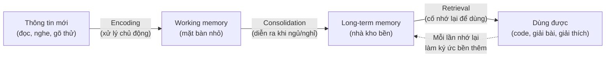
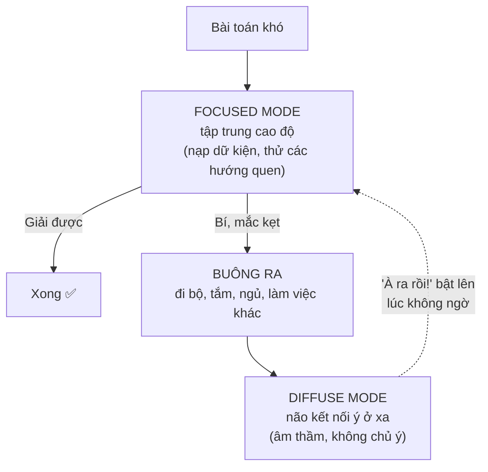

# Học diễn ra thế nào trong não — Nền tảng để học tốt hơn

> **Tác giả:** Mr.Rom\
> **Phiên bản:** v1.0.0\
> **Tạo lúc:** 13/06/2026\
> **Cập nhật:** 13/06/2026\
> **Level:** Basic\
> **Tags:** learning, meta-learning, memory, cognitive-load, focused-diffuse, soft-skills\
> **Yêu cầu trước:** (không bắt buộc)

> 🎯 *Bạn sẽ đi làm dev 30-40 năm, và trong khoảng đó ngôn ngữ, framework, công cụ sẽ thay mới vài lượt. Thứ duy nhất theo bạn suốt chặng đường không phải một công nghệ cụ thể, mà là **khả năng học nhanh và nhớ lâu bất cứ thứ gì mới**. Bài này mở cụm "học cách học": vì sao biết-cách-học là kỹ năng nền của nghề dev, bộ não thật sự nạp kiến thức qua các bước nào (working memory vs long-term memory, encoding → consolidation → retrieval, chunking), khái niệm **cognitive load** để bạn bớt làm khó chính mình, **hai chế độ tư duy** focused và diffuse (vì sao "để não nghỉ" lại giải được bài khó), vai trò của ngủ và vận động, và vì sao học nhồi (cramming) là cái bẫy bền vững nhất. Đây là bài dẫn — các bài sau biến những nguyên lý này thành kỹ thuật cụ thể.*

## 🎯 Sau bài này bạn sẽ

- [ ] Giải thích được vì sao "biết cách học" là kỹ năng nền sống còn của một dev, không phải kỹ năng phụ
- [ ] Phân biệt **working memory** (bộ nhớ làm việc) và **long-term memory** (trí nhớ dài hạn), hiểu giới hạn của từng cái
- [ ] Mô tả ba bước **encoding → consolidation → retrieval** và biết bước nào tạo ra trí nhớ bền
- [ ] Dùng **chunking** để gói nhiều thông tin nhỏ thành một khối, vượt giới hạn working memory
- [ ] Nhận diện và cắt bớt **extraneous cognitive load** (tải nhận thức thừa) khi học một thứ khó
- [ ] Hiểu **focused mode** và **diffuse mode**, biết khi nào nên "để não nghỉ" thay vì cố nhồi tiếp
- [ ] Lý giải vì sao ngủ và vận động ảnh hưởng trực tiếp tới việc học, và vì sao cramming kém bền

---

## Tình huống — học cả tối mà sáng ra như chưa từng học

Hãy nhớ lại một buổi tối điển hình của người mới học code.

Bạn ngồi vào bàn lúc 8 giờ, mở một chủ đề khó — giả sử là **recursion** (đệ quy). Bạn đọc đi đọc lại định nghĩa, xem một video, mở thêm hai tab Stack Overflow, tay vẫn để mở điện thoại "phòng khi có tin nhắn". Tới gần nửa đêm, mắt bạn đã trượt trên chữ mà đầu không vào nữa, nhưng bạn ép thêm một tiếng vì "sắp hiểu rồi". Bạn đi ngủ với cảm giác "tối nay mình học được nhiều".

Sáng hôm sau, một người bạn hỏi "đệ quy là gì", và bạn ú ớ. Cái bạn nhớ chỉ là cảm giác mệt, không phải kiến thức. Tệ hơn: có một bài toán đệ quy bạn vật lộn cả tối không ra — vậy mà lúc đang đánh răng sáng nay, lời giải tự nhiên hiện lên trong đầu.

Hai chuyện kỳ lạ này — **học nhiều mà nhớ ít**, và **buông ra thì lại nghĩ ra** — không phải do bạn kém hay may rủi. Chúng là hệ quả trực tiếp của **cách bộ não thật sự vận hành khi học**. Nếu bạn hiểu cơ chế đó, bạn sẽ thôi đánh nhau với bộ não mình và bắt đầu học cùng chiều với nó.

Bài này không dạy một công nghệ nào. Nó dạy **cái máy** mà bạn sẽ dùng để học mọi công nghệ trong 30 năm tới: chính bộ não của bạn.

---

## 1️⃣ Vì sao "biết cách học" là kỹ năng nền của dev

Trong hầu hết các nghề, kiến thức học ở trường dùng được nhiều năm. Nghề dev thì khác hẳn: một framework đỉnh cao hôm nay, vài năm sau có thể thành "legacy" ít người đụng; công cụ build, thư viện, thậm chí cả paradigm lập trình đều xoay vòng. Không ai — kể cả senior 15 năm kinh nghiệm — có thể "học xong" rồi nghỉ. **Học là một phần thường trực của công việc, không phải giai đoạn trước khi đi làm.**

Điều đó dẫn tới một sự thật hơi ngược đời: trong nghề dev, **kỹ năng học nhanh quan trọng hơn lượng kiến thức bạn đang có**. Một người biết ít hơn nhưng nạp cái mới trong vài ngày sẽ vượt qua một người biết nhiều nhưng học cái mới ì ạch — vì cái "biết nhiều" kia sẽ lỗi thời, còn tốc độ học thì không.

🪞 **Ẩn dụ**: kiến thức cụ thể (một framework, một ngôn ngữ) giống **lương thực dự trữ** — ăn mãi cũng hết, và có loại để lâu sẽ hỏng. "Biết cách học" giống **kỹ năng trồng trọt** — có nó thì bao giờ hết lương thực cũng tự trồng ra cái mới. Người đi đường dài không vác theo thật nhiều gạo; họ học cách kiếm gạo ở mọi vùng đất.

Để thấy rõ vì sao đây là **kỹ năng nền** (chứ không phải một mẹo học cho vui), bảng dưới đối chiếu hai loại tài sản trong nghề:

| Tiêu chí | Kiến thức một công nghệ cụ thể | Kỹ năng "biết cách học" |
|---|---|---|
| Tuổi thọ | Vài năm rồi lỗi thời | Suốt đời |
| Khi công nghệ đổi | Phải học lại từ đầu, vất vả | Học cái mới nhanh hơn mỗi lần |
| Đầu tư bây giờ | Trả ngay (làm được việc trước mắt) | Lãi kép (mỗi lần học sau dễ hơn lần trước) |
| Ai cũng tự lo được? | Có, nhưng phải lặp lại mãi | Học một lần, dùng cho mọi chủ đề |

→ Điểm cốt lõi từ bảng: học một công nghệ cho bạn **một bữa ăn**; học cách học cho bạn **một cái cần câu dùng cả đời**. Vì vậy, đầu tư thời gian hiểu cơ chế học không phải là "trì hoãn việc học code" — nó là khoản đầu tư có lãi kép cao nhất bạn làm được ở giai đoạn đầu sự nghiệp. Phần còn lại của bài đi vào chính cơ chế đó.

> [!NOTE]
> Bộ não không phải máy quay phim — nó **không** lưu lại y nguyên mọi thứ bạn nhìn thấy. Nó là một hệ thống **chủ động chọn lọc**: thứ gì được xử lý kỹ và dùng lại mới được giữ; thứ gì lướt qua thụ động bị xoá đi để nhường chỗ. Hầu hết "học kém" không phải do não tệ, mà do ta cho não toàn tín hiệu "cái này không quan trọng, quên đi".

---

## 2️⃣ Hai loại bộ nhớ — phòng làm việc chật và nhà kho khổng lồ

Để hiểu vì sao tối qua học nhiều mà nhớ ít, phải biết kiến thức đi qua những "ngăn" nào trong đầu. Có hai loại bộ nhớ liên quan trực tiếp tới việc học.

**Working memory** (bộ nhớ làm việc) — nơi bạn **giữ và xử lý thông tin ngay lúc này**: con số bạn đang nhẩm, dòng code bạn đang đọc, ý tưởng bạn đang ghép lại. Điểm quan trọng nhất về working memory là nó **cực kỳ nhỏ và dễ đầy**: người ta ước lượng nó chỉ giữ được khoảng **4 mục** thông tin mới cùng lúc, và mục nào không được nhắc lại sẽ biến mất sau vài chục giây.

**Long-term memory** (trí nhớ dài hạn) — nơi **lưu trữ bền** mọi thứ bạn đã thật sự học: cú pháp ngôn ngữ bạn dùng thành thạo, khái niệm bạn đã hiểu sâu, kỷ niệm. Sức chứa của nó gần như **vô hạn**, và thông tin ở đây tồn tại nhiều năm.

🪞 **Ẩn dụ**: working memory là **mặt bàn làm việc nhỏ** — chỉ đặt được vài món đồ một lúc, để thêm là rơi. Long-term memory là **nhà kho khổng lồ** phía sau. Học chính là quá trình chuyển một món từ mặt bàn chật vào nhà kho và **dán nhãn cẩn thận để sau này tìm lại được**. Mọi vấn đề của việc học đều xoay quanh hai chỗ nghẽn: mặt bàn quá nhỏ, và món đồ cất vào kho mà không dán nhãn thì coi như mất.

Sự khác biệt giữa hai loại này giải thích rất nhiều hiện tượng quen thuộc, như bảng dưới:

| Đặc điểm | Working memory (bộ nhớ làm việc) | Long-term memory (trí nhớ dài hạn) |
|---|---|---|
| Sức chứa | Rất nhỏ (~4 mục mới cùng lúc) | Gần như vô hạn |
| Thời gian giữ | Vài chục giây nếu không nhắc lại | Nhiều năm |
| Vai trò | Xử lý, suy nghĩ, ghép ý **ngay lúc này** | Lưu trữ bền để dùng lại sau |
| Khi quá tải | "Tràn" — không nạp thêm được, thấy rối | Không có khái niệm tràn |
| Ví dụ dev | Đang nhẩm logic một hàm trong đầu | Cú pháp `for` loop bạn gõ không cần nghĩ |

→ Đây là chìa khoá hiểu cả bài: **bạn học bằng working memory, nhưng bạn cần kiến thức nằm ở long-term memory**. Buổi tối học recursion thất bại không phải vì bạn thiếu thời gian — mà vì bạn dồn quá nhiều thứ lên cái mặt bàn nhỏ (định nghĩa + video + 2 tab + điện thoại) khiến nó tràn liên tục, và bạn không làm bước cần thiết để chuyển kiến thức xuống kho. Hai section sau giải thích cả hai vấn đề đó: làm sao chuyển xuống kho (encoding → retrieval), và làm sao đừng để mặt bàn tràn (cognitive load + chunking).

---

## 3️⃣ Ba bước của trí nhớ — encoding → consolidation → retrieval

Việc chuyển kiến thức từ mặt bàn xuống nhà kho rồi lấy ra dùng không phải một động tác duy nhất, mà là **ba bước riêng biệt**. Nhầm lẫn giữa chúng là lý do phổ biến nhất khiến người ta "học chăm mà nhớ ít".

- **Encoding** (mã hoá) — đưa thông tin mới **vào** trí nhớ. Đây là lúc bạn đọc, nghe, gõ thử một concept lần đầu. Encoding **tốt** xảy ra khi bạn xử lý thông tin *chủ động và sâu* (tự giải thích, liên hệ cái đã biết); encoding **tệ** khi bạn chỉ lướt mắt thụ động.
- **Consolidation** (củng cố) — quá trình não **làm bền** ký ức mới đã encode, biến nó từ mong manh thành ổn định. Phần lớn việc này diễn ra **trong lúc bạn ngủ và nghỉ**, không phải lúc đang học. Đây là lý do "học rồi ngủ một giấc" nhớ tốt hơn "học thâu đêm".
- **Retrieval** (truy xuất) — **lấy** kiến thức từ kho ra dùng khi cần. Điều bất ngờ nhất của khoa học trí nhớ: **mỗi lần truy xuất thành công lại làm ký ức bền thêm**. Nói cách khác, *cố nhớ lại* là một hành động học, mạnh hơn nhiều so với *đọc lại*.

🪞 **Ẩn dụ**: hãy nghĩ về việc cất một món vào nhà kho rồi lấy ra. **Encoding** là lúc bạn mang món đồ vào và đặt nó lên kệ — đặt cẩu thả (lướt thụ động) thì sau khó tìm; đặt ngay ngắn có dán nhãn (xử lý sâu) thì dễ lấy. **Consolidation** là lúc kho "đóng cửa nghỉ" để nhân viên sắp xếp lại đồ cho gọn — diễn ra khi bạn không có mặt. **Retrieval** là lúc bạn quay lại tìm món đồ; và điều lạ là: **càng tìm-rồi-lấy-được nhiều lần, con đường tới món đồ đó càng mòn rõ, lần sau lấy càng nhanh**.

Khái niệm ba bước này hơi trừu tượng, nên hình dung bằng sơ đồ sẽ rõ hơn — đặc biệt là vòng lặp retrieval quay ngược lại làm bền ký ức:

> 📖 *Mũi tên đứt nét quay ngược từ "Dùng được" về "Long-term memory" là phần hay bị bỏ quên nhất: học không phải đường thẳng một chiều. Mỗi lần bạn tự bắt mình nhớ lại (thay vì mở tài liệu ra đọc), bạn vừa kiểm tra vừa **gia cố** kiến thức — đó là cơ chế đằng sau kỹ thuật active recall mà bài sau sẽ dạy.*

Hiểu ba bước này lập tức vạch ra ba sai lầm tương ứng, tóm trong bảng:

| Bước | Học sai (yếu) | Học đúng (mạnh) |
|---|---|---|
| Encoding | Đọc lướt thụ động, highlight cho có | Tự giải thích lại, gõ thử, liên hệ cái đã biết |
| Consolidation | Học thâu đêm, cắt giấc ngủ | Học vừa đủ rồi ngủ đủ giấc để não sắp xếp |
| Retrieval | Đọc lại tài liệu (cảm giác "đã thuộc") | Gập tài liệu, tự nhớ lại trước khi xem đáp án |

→ Để ý cái bẫy ở cột giữa: cả ba đều cho **cảm giác** đang học (mắt có đọc, tay có highlight), nhưng đều là tín hiệu yếu. Buổi tối recursion thất bại của bạn vướng cả ba: encoding thụ động (đọc đi đọc lại), cắt consolidation (thức khuya), và không hề retrieval (chưa bao giờ gập sách tự nhớ lại). Sửa cả ba là nội dung chính của bài kỹ thuật tiếp theo.

---

## 4️⃣ Chunking — gói nhỏ thành lớn để vượt giới hạn mặt bàn

Working memory chỉ giữ ~4 mục. Vậy làm sao một senior đọc một đoạn code phức tạp mà không "tràn", trong khi người mới đọc cùng đoạn đó thì rối tung? Câu trả lời là **chunking**.

**Chunking** (gom khối) — gom nhiều mẩu thông tin nhỏ rời rạc thành **một khối có nghĩa duy nhất**, để working memory chỉ phải giữ một mục thay vì nhiều mục. Mấu chốt: giới hạn ~4 mục là đếm theo **khối**, không phải theo mẩu nhỏ — nên nếu mỗi khối chứa nhiều thông tin, bạn xử lý được nhiều hơn hẳn mà mặt bàn vẫn không tràn.

🪞 **Ẩn dụ**: nhớ dãy số `1 9 7 5 2 0 2 6` dưới dạng 8 chữ số rời thì gần chạm trần working memory. Nhưng nếu bạn nhận ra đó là **hai cái năm** — `1975` và `2026` — thì giờ chỉ còn **2 khối**, nhẹ tênh. Thông tin y hệt, nhưng cách *gói* khác nhau quyết định nó có vừa cái mặt bàn nhỏ hay không.

Với dev, chunking xảy ra liên tục khi bạn thành thạo dần:

| Giai đoạn | Cái não phải giữ | Số khối |
|---|---|---|
| Mới học | `f`, `o`, `r`, `(`, `i`, `=`, `0`... từng ký tự | Rất nhiều — rối |
| Quen cú pháp | "một vòng `for` lặp" | 1 khối |
| Thành thạo | "đoạn này duyệt mảng, lọc, rồi tính tổng" | 1 khối lớn gói cả chục dòng |

→ Đây là vì sao senior "đọc code nhanh hơn": không phải họ đọc nhanh hơn theo nghĩa mắt lướt lẹ, mà mỗi cái liếc của họ **nuốt một khối lớn hơn nhiều**. Mỗi pattern họ đã học (một vòng lặp, một mẫu thiết kế, một cấu trúc quen) là một chunk có sẵn trong long-term memory, nên working memory của họ được giải phóng để lo phần khó thật sự. Tin tốt cho người mới: chunking **học được** — mỗi lần bạn luyện một pattern tới mức không cần nghĩ, bạn vừa đúc thêm một cái khuôn để gói thông tin sau này. Học là quá trình tích luỹ dần các chunk.

---

## 5️⃣ Cognitive load — đừng chất quá nhiều lên mặt bàn

Nếu working memory là mặt bàn nhỏ, thì **cognitive load** (tải nhận thức) là **tổng lượng đồ bạn đang chất lên đó cùng lúc**. Học hiệu quả không phải "cố nhồi nhiều hơn" — mà là **quản lý tải này khôn ngoan**, để phần não trống dành cho thứ đáng học. Tải nhận thức có hai loại bạn cần phân biệt rõ.

- **Intrinsic load** (tải nội tại) — độ khó **vốn có** của chính nội dung. Recursion khó hơn vòng `for` vì bản chất nó có nhiều phần phải giữ trong đầu cùng lúc. Bạn **không xoá được** loại này, nhưng có thể chia nhỏ để nuốt từng phần.
- **Extraneous load** (tải thừa) — gánh nặng **không đến từ nội dung** mà đến từ *cách bạn học*: vừa học vừa liếc điện thoại, tài liệu trình bày lộn xộn, nhảy giữa 5 tab, môi trường ồn, học bằng tiếng nước ngoài chưa vững. Loại này **cắt được** — và cắt nó là cách dễ nhất để học khá hơn ngay lập tức.

🪞 **Ẩn dụ**: mặt bàn (working memory) có diện tích cố định. **Intrinsic load** là cái máy bạn buộc phải sửa — nó to bao nhiêu thì to, không bỏ được. **Extraneous load** là đống tách cà phê, điện thoại, giấy nháp linh tinh bạn để bừa quanh đó. Bạn không thu nhỏ cái máy được, nhưng dọn sạch đống linh tinh thì tự nhiên có chỗ để xoay xở cái máy. Học một thứ khó mà còn để extraneous load cao thì như sửa máy trên cái bàn ngập rác.

Phân biệt hai loại tải này cho bạn một chiến lược rõ ràng, tóm trong bảng:

| Loại tải | Đến từ đâu | Xử lý thế nào | Ví dụ dev |
|---|---|---|---|
| **Intrinsic** (nội tại) | Bản chất khó của nội dung | Không xoá được — **chia nhỏ**, học nền trước | Recursion, con trỏ, bất đồng bộ |
| **Extraneous** (thừa) | Cách học / môi trường | **Cắt bỏ tối đa** | Điện thoại, 5 tab, tài liệu rối, ồn ào |

> [!IMPORTANT]
> Quy tắc thực hành quan trọng nhất từ section này: **khi học một thứ có intrinsic load cao (khó vốn dĩ), hãy đẩy extraneous load xuống gần 0**. Tắt thông báo, đóng tab thừa, chọn một tài liệu rõ ràng duy nhất, ngồi chỗ yên. Bạn càng học cái khó, càng phải dọn sạch mặt bàn — vì cái máy đã chiếm gần hết chỗ rồi.

→ Quay lại buổi tối recursion: recursion vốn đã intrinsic load cao, vậy mà bạn còn chất thêm extraneous load tối đa (điện thoại + 2 tab + video chạy song song). Mặt bàn tràn liên tục nên gần như không có encoding nào tử tế xảy ra. Chỉ cần dọn riêng phần extraneous — một tài liệu, không điện thoại — là buổi học đã khác hẳn, dù nội dung vẫn khó y như cũ.

---

## 6️⃣ Hai chế độ tư duy — focused và diffuse

Giờ tới câu đố thứ hai từ đầu bài: vì sao bài toán vật lộn cả tối không ra, lúc đánh răng sáng hôm sau lại tự bật ra lời giải? Đáp án nằm ở chỗ não có **hai chế độ tư duy** rất khác nhau, và bạn chỉ mới dùng một.

- **Focused mode** (chế độ tập trung) — khi bạn **chú tâm cao độ** vào một vấn đề: đọc kỹ, gõ code, lần theo logic từng bước. Chế độ này mạnh ở **đi sâu theo lối quen** — áp dụng cái đã biết, làm việc tỉ mỉ, chính xác. Nhưng nó có nhược: nó đi theo những "đường mòn" sẵn có, nên dễ **mắc kẹt** trong một hướng sai mà không thoát ra được.
- **Diffuse mode** (chế độ khuếch tán) — khi bạn **thả lỏng, không chú tâm vào gì cụ thể**: đi bộ, tắm, rửa bát, ngủ. Lúc này não chuyển sang lối nghĩ rộng và lỏng, **kết nối những ý ở xa nhau** mà focused mode không bắc cầu được. Đây chính là lúc "tự dưng nghĩ ra".

🪞 **Ẩn dụ**: focused mode như **soi đèn pin trong đêm** — chùm sáng hẹp, rõ nét, chiếu sâu đúng một chỗ, nhưng chỉ thấy được vùng nó đang rọi. Diffuse mode như **bật đèn trần mờ cả phòng** — không chỗ nào sáng rực, nhưng bạn thấy được bố cục tổng thể và những thứ ở góc khuất mà đèn pin bỏ sót. Giải bài khó cần **cả hai**: đèn pin để làm việc chi tiết, đèn trần để thấy đường đi mới khi đèn pin bị tường chặn.

Điểm mấu chốt: **hai chế độ không chạy cùng lúc — não chuyển qua lại**. Bạn không thể "ra lệnh" cho diffuse mode bật lên; nó chỉ xuất hiện khi bạn **rời khỏi** vấn đề. Đó là vì sao "để não nghỉ" không phải lười biếng mà là **một bước của quá trình giải bài**: bạn nạp dữ kiện bằng focused mode, rồi buông ra để diffuse mode âm thầm ghép nối.

Sơ đồ dưới cho thấy vòng luân phiên này — và vì sao bước "buông ra" lại là nơi lời giải xuất hiện:

> 📖 *Đọc sơ đồ: nhánh "Bí, mắc kẹt → Buông ra" là nhánh người mới hay bỏ qua nhất — họ tưởng buông ra là bỏ cuộc. Thật ra diffuse mode chỉ làm việc được trên những dữ kiện bạn đã nạp kỹ bằng focused mode trước đó. Nên công thức là: **tập trung hết sức trước, rồi buông hẳn ra** — không phải buông ra ngay khi chưa nạp gì.*

Điều này biến thành một mẹo cực thực dụng khi bạn bí một bug hay một thuật toán: thay vì cắm mặt thêm hai tiếng (focused mode đang mắc kẹt sẽ càng đào sâu cái hố sai), hãy **đứng dậy đi bộ 15 phút, hoặc để qua đêm**. Rất nhiều dev có kinh nghiệm "fix bug trong lúc tắm" — đó không phải mê tín, đó là diffuse mode đang làm đúng việc của nó.

> [!TIP]
> Một cách dùng có chủ đích hai chế độ: khi gặp bài thật khó, hãy **focused thật mạnh vào buổi tối** (nạp đủ dữ kiện vào đầu), rồi **đi ngủ** và để diffuse mode + consolidation làm việc qua đêm. Sáng ra quay lại, vấn đề thường "mềm" hơn hẳn. Đây là lý do câu khuyên kinh điển "ngủ một đêm rồi tính" có cơ sở khoa học, không phải an ủi suông.

---

## 7️⃣ Ngủ và vận động — hai thứ ít ai nghĩ là "học"

Hai section trước đã hé lộ: ngủ là lúc **consolidation** diễn ra, và nghỉ ngơi là lúc **diffuse mode** làm việc. Vậy nên ngủ và vận động **không phải là thứ trừ vào thời gian học — chúng là một phần của việc học**. Bỏ chúng để học thêm giờ là tự bắn vào chân.

**Ngủ** làm ba việc trực tiếp cho việc học, mà thức thì không thể thay thế:

- **Củng cố ký ức** — trong giấc ngủ, não "phát lại" những gì học ban ngày và chuyển nó từ trí nhớ mong manh sang bền. Cắt giấc ngủ là cắt đúng bước consolidation.
- **Dọn rác chuyển hoá** — khi ngủ, não dọn các sản phẩm thải tích tụ lúc thức. Thiếu ngủ làm working memory chậm và dễ tràn hơn ngay hôm sau.
- **Nuôi diffuse mode** — phần lớn "à ra rồi" xảy ra sau một giấc ngủ, vì ngủ là trạng thái diffuse sâu nhất.

**Vận động** (đi bộ, chạy, tập) thì:

- Tăng tưới máu và yếu tố nuôi dưỡng tế bào thần kinh ở vùng liên quan trí nhớ — nói nôm na là làm "đất" cho ký ức mới bám tốt hơn.
- Một buổi đi bộ giữa các phiên học vừa **reset working memory** (dọn mặt bàn) vừa **kích hoạt diffuse mode** — nên nó đáng giá gấp đôi.

🪞 **Ẩn dụ**: nếu ban ngày học là lúc **nhập hàng vào kho** thì ban đêm ngủ là lúc **kho đóng cửa để nhân viên sắp xếp, dán nhãn, dọn lối đi**. Một cái kho cứ nhập hàng liên tục mà không bao giờ đóng cửa sắp xếp sẽ sớm thành đống hỗn loạn không tìm được gì — đúng cảm giác "học nhiều mà nhớ lộn xộn". Vận động thì như **mở toang cửa sổ cho kho thông thoáng** trước khi nhập đợt hàng mới.

> [!WARNING]
> Cạm bẫy phổ biến nhất của người mới (và dev mùa deadline): **hi sinh giấc ngủ để học/làm thêm giờ**. Thức tới 2 giờ sáng học thêm hai tiếng nghe có vẻ "được thêm", nhưng bạn vừa cắt bước consolidation của *cả ngày hôm đó*, vừa làm working memory hôm sau chậm chạp. Kết cục thường là âm: học thêm 2 tiếng, mất hiệu quả cả ngày mai. Giấc ngủ là khoản đầu tư cho trí nhớ, không phải thứ xa xỉ cắt được.

---

## 8️⃣ Ghép tất cả lại — học lại "buổi tối recursion" cho đúng

Bảy section vừa rồi mỗi cái là một mảnh ghép. Giờ ráp chúng lại bằng cách quay về đúng tình huống mở bài: học recursion. Lần này ta thiết kế buổi học **thuận** cách bộ não vận hành, để bạn thấy các nguyên lý không phải lý thuyết suông mà ăn khớp với nhau thành một quy trình.

Đầu tiên, so sánh trực diện hai phiên bản của cùng một việc — học recursion — để thấy mỗi quyết định nhỏ tác động lên cơ chế nào:

| Quyết định | ❌ Buổi tối thất bại | ✅ Buổi học thuận não | Cơ chế liên quan |
|---|---|---|---|
| Môi trường | Điện thoại mở, 5 tab, video chạy nền | 1 tài liệu, tắt thông báo, chỗ yên | Cắt extraneous load (§5) |
| Cách tiếp nội dung khó | Nuốt cả recursion một lúc | Tách: trước hết hiểu "hàm tự gọi chính nó", rồi tới base case, rồi tới ngăn xếp gọi | Chia nhỏ intrinsic load (§5) |
| Cách đọc | Đọc đi đọc lại thụ động | Đọc một lần rồi **gập lại tự giải thích** bằng lời mình | Encoding chủ động (§3) |
| Khi bí một bài | Cắm mặt thêm 2 tiếng | Thử hết sức 30 phút, bí thì **đi bộ / để qua đêm** | Focused → diffuse (§6) |
| Cuối phiên | Thức khuya học thêm | Dừng đúng giờ, **ngủ đủ** | Consolidation (§3, §7) |
| Ngày hôm sau | Không đụng lại | **Gập sách tự nhớ lại** trước khi học tiếp | Retrieval + spaced (§3) |

→ Nhìn cột phải theo chiều dọc: không có quyết định nào là "mẹo thông minh" riêng lẻ — mỗi cái chỉ là *làm đúng một cơ chế* đã học ở trên. Cộng lại, chúng biến một buổi tối kiệt sức nhớ-được-ít thành một quy trình nhẹ nhàng mà nhớ bền.

Diễn lại thành một quy trình bốn nhịp bạn có thể áp dụng cho **bất kỳ** chủ đề khó nào, không riêng recursion:

1. **Dọn bàn trước khi học** — tắt thông báo, đóng tab thừa, chọn đúng một tài liệu. Đây là việc rẻ nhất nhưng tác động lớn nhất, vì nó giải phóng mặt bàn cho phần khó thật sự.
2. **Chia nội dung thành các miếng nuốt được** — đừng nuốt cả chủ đề. Với recursion: miếng 1 là "hàm gọi lại chính nó", miếng 2 là "điều kiện dừng (base case)", miếng 3 là "thứ tự gọi và trả về". Học vững miếng này mới sang miếng kia — mỗi miếng học xong là một chunk mới.
3. **Sau mỗi miếng, gập tài liệu và tự tái tạo** — viết lại định nghĩa bằng lời mình, hoặc gõ một ví dụ nhỏ từ trang trắng. Chỗ ú ớ chính là chỗ chưa encode xong, quay lại đúng chỗ đó — đừng đọc lại từ đầu.
4. **Bí thì buông, hết phiên thì ngủ** — khi một bài tắc, đứng dậy đi bộ để diffuse mode vào việc; hết giờ học thì ngủ đủ để consolidation làm bền những gì vừa nạp. Hôm sau mở đầu bằng tự-nhớ-lại, không phải đọc lại.

> [!TIP]
> Để ý quy trình này **không hề tốn nhiều giờ hơn** buổi tối thất bại — thậm chí ít hơn, vì bạn dừng đúng lúc thay vì cố nhồi tới nửa đêm. Khác biệt nằm ở *cách phân bổ và xử lý*, không ở *số giờ bỏ ra*. Đây là toàn bộ tinh thần của cụm bài này: học khôn hơn, không phải học nhiều hơn.

---

## 9️⃣ Vì sao cramming (học nhồi) kém bền

Giờ ta gộp mọi thứ ở trên để mổ xẻ cái bẫy lớn nhất: **cramming** (học nhồi) — dồn toàn bộ việc học vào một phiên dài sát hạn, học đi học lại liên tục trong thời gian ngắn.

Cramming **có hiệu quả thật** cho một việc duy nhất: vượt qua một bài kiểm tra ngày mai. Vấn đề là kiến thức nhồi **bay hơi gần hết chỉ sau vài ngày**. Với học sinh đi thi thì còn tạm; với một dev cần kiến thức nằm lại để **dùng trong dự án thật nhiều tháng sau**, cramming gần như vô dụng. Hãy soi nó qua đúng những cơ chế đã học:

| Cơ chế đã học | Cramming vi phạm thế nào |
|---|---|
| **Consolidation cần ngủ/nghỉ** | Nhồi liên tục, không có khoảng nghỉ để não làm bền ký ức |
| **Retrieval làm ký ức bền** | Chỉ đọc-lại (re-read), gần như không có lần tự-nhớ-lại nào |
| **Cognitive load** | Dồn quá nhiều mục mới một lúc → mặt bàn tràn, encoding hỏng |
| **Diffuse mode** | Không có khoảng buông ra → không kết nối ý, hiểu nông |

→ Cramming sai ở **cả bốn** cơ chế cùng lúc — đó là vì sao nó kém bền tới vậy. Đối nghịch với cramming là **spaced repetition** (lặp lại ngắt quãng): chia cùng lượng thời gian đó ra nhiều phiên ngắn, **giãn cách nhau qua nhiều ngày**, mỗi phiên có nghỉ và có tự-nhớ-lại. Cùng tổng số giờ, nhưng phân bố theo kiểu này nhớ lâu hơn gấp nhiều lần — vì nó *thuận* cả bốn cơ chế thay vì *nghịch*.

Có một sự thật phản trực giác cần nói rõ, vì nó là lý do người ta cứ rơi vào cramming: **học trong sự dễ chịu (đọc lại, nhồi liên tục) cho cảm giác "đã thuộc" nhưng nhớ kém; học trong sự khó chịu vừa phải (cố nhớ lại, giãn cách tới mức gần quên) cảm thấy chật vật nhưng nhớ bền**. Khoa học gọi sự chật vật có ích này là **desirable difficulty** (khó khăn đáng có). Cái bẫy là ta hay chọn theo *cảm giác trơn tru* mà bỏ cái *thật sự hiệu quả*.

🪞 **Ẩn dụ**: cramming như **bơm hơi thật căng vào một quả bóng thủng** — căng phồng ngay trước giờ thi, nhưng xì hết chỉ sau vài hôm. Spaced repetition như **xây một bức tường, mỗi ngày đặt vài viên gạch và để vữa khô** — chậm hơn, có vẻ "không thấy tiến bộ" mỗi ngày, nhưng cái xây xong thì đứng vững nhiều năm.

> [!TIP]
> Nếu phải rút một câu mang về từ cả bài: **chia nhỏ, giãn cách, tự nhớ lại, ngủ đủ**. Cramming thua không phải vì bạn lười hay thiếu giờ — nó thua vì đi *ngược* cách bộ não thật sự lưu kiến thức. Bài tiếp theo biến chính câu này thành các kỹ thuật cụ thể bạn dùng được ngay (active recall, spaced repetition, lịch ôn giãn dần).

---

## 💡 Cạm bẫy thường gặp & Best practice

### ❌ Cạm bẫy: nhầm "cảm giác trôi chảy" với "đã hiểu"

- **Triệu chứng**: đọc lại tài liệu / xem lại video thấy "cái gì cũng quen, hợp lý cả", tự tin là đã nắm — nhưng tới lúc tự làm thì đơ.
- **Nguyên nhân**: đọc-lại tạo *cảm giác trôi chảy* (fluency) vì não nhận ra thông tin quen mặt, nhưng "nhận ra" (recognition) khác xa "tự tái tạo được" (recall). Cảm giác quen đánh lừa thành "đã hiểu".
- **Cách tránh**: thay đọc-lại bằng **tự nhớ lại** — gập tài liệu, tự viết/nói lại concept bằng lời mình, hoặc tự code lại từ trang trắng. Chỗ nào ú ớ chính là chỗ chưa thật học. Đây là retrieval ở §3.

### ❌ Cạm bẫy: học một thứ khó với mặt bàn đầy rác

- **Triệu chứng**: học chủ đề khó (recursion, bất đồng bộ) trong khi mở điện thoại, 5 tab, nhạc có lời, vừa học vừa chat — học hoài không vào.
- **Nguyên nhân**: nội dung đã có **intrinsic load** cao, lại cộng thêm **extraneous load** từ môi trường → working memory tràn, không còn chỗ cho encoding tử tế.
- **Cách tránh**: trước khi học cái khó, **dọn extraneous load về gần 0**: tắt thông báo, đóng tab thừa, một tài liệu duy nhất, chỗ yên. Càng khó càng phải dọn sạch (§5).

### ✅ Best practice: focused trước, rồi buông ra cho diffuse

- **Vì sao**: focused mode mắc kẹt thì càng cố càng đào sâu hướng sai; diffuse mode mới là nơi kết nối ý mới — nhưng nó chỉ làm việc được trên dữ kiện đã nạp kỹ trước đó.
- **Cách áp dụng**: tập trung hết sức nạp đủ dữ kiện vào đầu; khi bí thật thì **đứng dậy đi bộ / để qua đêm** thay vì cắm mặt thêm. Lời giải thường tự bật ra lúc không ngồi trước màn hình (§6).

### ✅ Best practice: chia nhỏ và giãn cách thay vì nhồi

- **Vì sao**: cùng một tổng thời gian, học chia thành nhiều phiên ngắn giãn cách qua nhiều ngày nhớ lâu hơn nhồi một lèo gấp nhiều lần — vì nó thuận cả bốn cơ chế (consolidation, retrieval, cognitive load, diffuse) thay vì nghịch (§9).
- **Cách áp dụng**: thay vì học 4 tiếng liền một tối, chia thành 4 phiên ~1 tiếng trải qua nhiều ngày, mỗi phiên có nghỉ ngắn và mở đầu bằng tự-nhớ-lại buổi trước. Chấp nhận cảm giác "chật vật vừa phải" — đó là dấu hiệu đang học bền.

---

## 🧠 Tự kiểm tra (Self-check)

**Q1.** Một người bạn nói: "Mình học thâu đêm cả tuần, đọc đi đọc lại tài liệu mấy chục lần rồi, chắc chắn nhớ kỹ." Dựa trên ba bước của trí nhớ, hãy chỉ ra hai chỗ sai trong cách học đó.

💡 Xem giải thích

Có (ít nhất) hai chỗ sai:

1. **Cắt consolidation** — học thâu đêm hi sinh giấc ngủ, mà consolidation (bước làm bền ký ức) diễn ra chủ yếu khi ngủ. Học nhiều mà không ngủ thì ký ức vẫn mong manh, dễ mất.
2. **Toàn re-read, không retrieval** — "đọc đi đọc lại" chỉ là encoding lặp lại thụ động và tạo cảm giác trôi chảy giả. Thứ làm ký ức bền là *tự nhớ lại* (retrieval): gập tài liệu, tự tái tạo concept. Đọc lại 30 lần yếu hơn nhiều so với vài lần tự nhớ lại.

Cách đúng: chia nhỏ giãn cách qua nhiều ngày, mỗi phiên tự-nhớ-lại trước khi xem, và ngủ đủ để não consolidation.

**Q2.** Working memory chỉ giữ được khoảng 4 mục. Vậy vì sao một senior đọc một đoạn code dài 30 dòng vẫn nắm được, còn người mới thì rối? Khái niệm nào giải thích điều này?

💡 Xem giải thích

**Chunking** (gom khối). Giới hạn ~4 mục đếm theo **khối có nghĩa**, không theo từng mẩu nhỏ. Người mới phải giữ từng dòng, từng cú pháp như những mục rời → tràn nhanh. Senior đã đúc sẵn nhiều **chunk** trong long-term memory (mỗi pattern, mỗi cấu trúc quen là một khối), nên 30 dòng với họ có thể chỉ là vài khối ("duyệt mảng, lọc, tính tổng"). Một liếc mắt của họ nuốt một khối lớn hơn nhiều, để working memory rảnh lo phần khó thật sự. Chunking học được — luyện pattern tới mức không cần nghĩ là đang đúc thêm khuôn.

**Q3.** Phân biệt intrinsic load và extraneous load. Khi học một chủ đề khó, bạn nên ưu tiên xử lý loại nào, và bằng cách nào?

💡 Xem giải thích

- **Intrinsic load** = độ khó **vốn có** của nội dung (recursion vốn khó vì nhiều phần phải giữ cùng lúc). **Không xoá được**, chỉ chia nhỏ để nuốt từng phần và học nền trước.
- **Extraneous load** = gánh nặng từ **cách học / môi trường** (điện thoại, 5 tab, tài liệu rối, ồn). **Cắt được**.

Khi học cái khó (intrinsic cao), hãy **đẩy extraneous load về gần 0**: tắt thông báo, đóng tab thừa, một tài liệu duy nhất, chỗ yên. Vì cái máy (intrinsic) đã chiếm gần hết mặt bàn, ta phải dọn sạch phần linh tinh để còn chỗ xoay xở. Đây là cách dễ nhất để học khá lên ngay lập tức.

**Q4.** Bạn bí một bug suốt hai tiếng, càng nhìn càng rối. Theo lý thuyết hai chế độ tư duy, nên làm gì, và vì sao "đi chỗ khác chơi" lại có thể giúp giải bug?

💡 Xem giải thích

Nên **dừng focused mode và buông ra** — đứng dậy đi bộ, tắm, làm việc khác, hoặc để qua đêm. Lý do: khi bí, **focused mode đang mắc kẹt trong một "đường mòn" sai và càng cố càng đào sâu cái hố đó**. **Diffuse mode** (chỉ bật khi bạn rời khỏi vấn đề) mới là chế độ kết nối những ý ở xa nhau mà focused bỏ sót — đây là lúc "à ra rồi" xuất hiện. Quan trọng: diffuse chỉ làm việc được trên dữ kiện bạn đã nạp kỹ trước đó, nên công thức đúng là *tập trung hết sức nạp dữ kiện → rồi buông hẳn ra*, không phải buông ngay khi chưa nạp gì.

**Q5.** Cramming (nhồi sát hạn) "giúp qua bài kiểm tra ngày mai" nhưng bị coi là cách học kém cho dev. Hãy chỉ ra cramming đi ngược những cơ chế học nào, và cái gì đối nghịch với nó.

💡 Xem giải thích

Cramming đi ngược **cả bốn** cơ chế: (1) **consolidation** — nhồi liên tục, không có ngủ/nghỉ để làm bền ký ức; (2) **retrieval** — chỉ đọc-lại, gần như không tự-nhớ-lại; (3) **cognitive load** — dồn quá nhiều mục mới một lúc, mặt bàn tràn, encoding hỏng; (4) **diffuse mode** — không có khoảng buông ra để kết nối ý, hiểu nông. Vì sai cả bốn cùng lúc nên kiến thức nhồi bay hơi sau vài ngày — vô dụng với dev cần dùng kiến thức nhiều tháng sau.

Đối nghịch là **spaced repetition** (lặp lại ngắt quãng): cùng tổng giờ nhưng chia thành nhiều phiên ngắn giãn cách qua nhiều ngày, có nghỉ và có tự-nhớ-lại — thuận cả bốn cơ chế nên nhớ bền hơn gấp nhiều lần. Lưu ý **desirable difficulty**: cách học hiệu quả thường cảm thấy chật vật hơn cách học dễ chịu mà kém bền.

---

## ⚡ Tra cứu nhanh (Cheatsheet)

**Hai loại bộ nhớ:**

| | Working memory | Long-term memory |
|---|---|---|
| Sức chứa | ~4 mục mới (theo khối) | Gần như vô hạn |
| Giữ được | Vài chục giây | Nhiều năm |
| Vai trò | Xử lý, suy nghĩ ngay lúc này | Lưu trữ bền để dùng lại |

**Ba bước của trí nhớ:**

- **Encoding** — đưa vào (xử lý chủ động > lướt thụ động)
- **Consolidation** — làm bền (diễn ra khi ngủ/nghỉ)
- **Retrieval** — lấy ra dùng (mỗi lần nhớ lại làm ký ức bền thêm)

**Hai loại cognitive load:**

| Intrinsic (nội tại) | Extraneous (thừa) |
|---|---|
| Độ khó vốn có của nội dung | Gánh nặng từ cách học / môi trường |
| Không xoá được → chia nhỏ | **Cắt bỏ tối đa** |

**Hai chế độ tư duy:**

- **Focused** — tập trung cao, đi sâu lối quen, dễ mắc kẹt
- **Diffuse** — thả lỏng (đi bộ/tắm/ngủ), kết nối ý xa, nơi "à ra rồi" xuất hiện
- Công thức: focused nạp dữ kiện → buông ra cho diffuse ghép nối

**Nguyên tắc học thuận não:**

- Dọn extraneous load về gần 0 khi học cái khó
- Chunking — luyện pattern tới mức không cần nghĩ
- Tự nhớ lại (retrieval) thay vì đọc lại
- Chia nhỏ + giãn cách thay vì nhồi (cramming)
- Ngủ đủ + vận động = một phần của việc học, không trừ vào giờ học
- Chấp nhận desirable difficulty: chật vật vừa phải = đang học bền

---

## 📚 Từ Điển Thuật Ngữ (Glossary)

| EN | VN | Giải thích |
|---|---|---|
| Working memory | Bộ nhớ làm việc | Nơi giữ và xử lý thông tin ngay lúc này, sức chứa rất nhỏ (~4 mục) |
| Long-term memory | Trí nhớ dài hạn | Kho lưu trữ bền, sức chứa gần như vô hạn, giữ nhiều năm |
| Encoding | Mã hoá | Bước đưa thông tin mới vào trí nhớ |
| Consolidation | Củng cố | Quá trình não làm bền ký ức mới, diễn ra chủ yếu khi ngủ/nghỉ |
| Retrieval | Truy xuất | Lấy kiến thức ra dùng; mỗi lần nhớ lại làm ký ức bền thêm |
| Chunking | Gom khối | Gói nhiều mẩu thông tin nhỏ thành một khối có nghĩa duy nhất |
| Cognitive load | Tải nhận thức | Tổng lượng thông tin đang chất lên working memory cùng lúc |
| Intrinsic load | Tải nội tại | Độ khó vốn có của bản thân nội dung, không xoá được |
| Extraneous load | Tải thừa | Gánh nặng từ cách học / môi trường, cắt bỏ được |
| Focused mode | Chế độ tập trung | Chú tâm cao độ vào một vấn đề, đi sâu theo lối quen |
| Diffuse mode | Chế độ khuếch tán | Thả lỏng không chú tâm, não kết nối các ý ở xa nhau |
| Cramming | Học nhồi | Dồn toàn bộ việc học vào một phiên dài sát hạn, kém bền |
| Spaced repetition | Lặp lại ngắt quãng | Chia học thành nhiều phiên ngắn giãn cách qua nhiều ngày |
| Desirable difficulty | Khó khăn đáng có | Sự chật vật vừa phải khi học làm kiến thức nhớ bền hơn |
| Recognition | Nhận ra | Thấy thông tin quen mặt — khác xa với tự tái tạo được |
| Recall | Tự nhớ lại | Tái tạo kiến thức từ đầu không nhìn tài liệu — dấu hiệu hiểu thật |

---

## 🔗 Liên kết & Tài nguyên

➡️ **Bài tiếp theo:** [Kỹ thuật học hiệu quả — Active recall, spaced repetition](01_effective-learning-techniques.md)\
↑ **Về cụm:** [learning-how-to-learn — README](../../README.md)

### 🧭 Định hướng lộ trình học

- [Kỹ thuật học hiệu quả — Active recall, spaced repetition](01_effective-learning-techniques.md) — biến các nguyên lý ở bài này thành kỹ thuật cụ thể dùng được ngay
- [Kỹ năng & Lộ trình học cá nhân — Thoát khỏi tutorial hell](../../../career-path/lessons/01_basic/01_skills-and-learning-roadmap.md) — vì sao học suốt đời là bắt buộc với dev và cách lập lộ trình học

### 🧩 Các chủ đề có thể bạn quan tâm

- [Luyện tập có chủ đích & học qua dự án](02_deliberate-practice-and-projects.md) — encoding mạnh nhất xảy ra khi tự build, không khi xem thụ động
- [Quản lý thông tin & ghi chú — Second brain cho dev](03_managing-information-and-notes.md) — bù cho giới hạn working memory bằng một bộ nhớ ngoài có tổ chức
- [Thói quen, động lực & tránh burnout](04_habits-motivation-and-burnout.md) — vì sao ngủ, nghỉ và nhịp độ bền vững là một phần của việc học

### 🌐 Tài nguyên tham khảo khác

- [Learning How to Learn (Coursera — Barbara Oakley & Terrence Sejnowski)](https://www.coursera.org/learn/learning-how-to-learn) — khoá học gốc về focused/diffuse mode, chunking, chống cramming
- [Make It Stick (Brown, Roediger, McDaniel)](https://www.retrievalpractice.org/make-it-stick) — sách tổng hợp nghiên cứu về retrieval practice và desirable difficulty

---

## 📌 Nhật ký thay đổi (Changelog)

- **v1.0.0 (13/06/2026)** — Bản đầu tiên. Bài INTRO mở cụm learning-how-to-learn: tình huống "học cả tối mà sáng ra quên" + vì sao biết-cách-học là kỹ năng nền của dev (bảng kiến thức cụ thể vs kỹ năng học, ẩn dụ lương thực vs trồng trọt) + working memory vs long-term memory (ẩn dụ mặt bàn vs nhà kho, bảng đối chiếu) + ba bước encoding/consolidation/retrieval có sơ đồ mermaid vòng lặp retrieval + chunking (ẩn dụ dãy số, bảng giai đoạn) + cognitive load intrinsic/extraneous (ẩn dụ máy vs rác trên bàn, bảng + alert dọn extraneous) + hai chế độ focused/diffuse có sơ đồ mermaid (ẩn dụ đèn pin vs đèn trần) + vai trò ngủ và vận động (ẩn dụ kho đóng cửa sắp xếp) + vì sao cramming kém bền (bảng 4 cơ chế bị vi phạm, desirable difficulty, ẩn dụ bóng thủng vs xây tường) + 2 cạm bẫy + 2 best practice + 5 self-check + cheatsheet + glossary 16 thuật ngữ. Mở cụm learning-how-to-learn.
