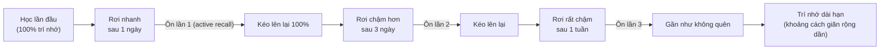
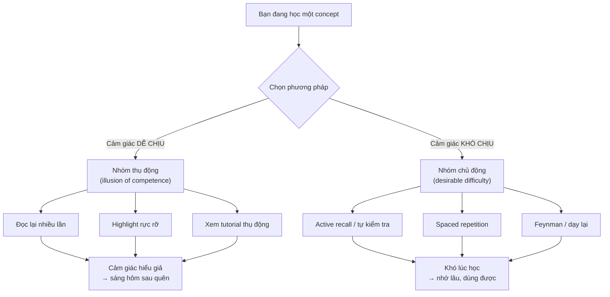

# Kỹ thuật học hiệu quả — Active recall, spaced repetition

> **Tác giả:** Mr.Rom\
> **Phiên bản:** v1.0.0\
> **Tạo lúc:** 13/06/2026\
> **Cập nhật:** 13/06/2026\
> **Level:** Basic\
> **Tags:** learning, soft-skills, active-recall, spaced-repetition, interleaving, feynman, anki, meta-learning\
> **Yêu cầu trước:** [Học diễn ra thế nào trong não](00_how-learning-works.md)

> 🎯 *Bài trước bạn đã hiểu não học bằng cách củng cố kết nối neuron và kiến thức sẽ phai nếu không dùng lại. Bài này biến hiểu biết đó thành **công cụ hằng ngày**: 5 kỹ thuật học đã được kiểm chứng bằng nghiên cứu (active recall, spaced repetition, interleaving, elaboration, Feynman) — và quan trọng không kém, 3 **ảo giác thông thạo** khiến bạn tưởng đã hiểu nhưng thật ra chưa. Với một dev phải học suốt đời vì công nghệ đổi liên tục, học **đúng cách** quan trọng hơn học **nhiều giờ**.*

## 🎯 Sau bài này bạn sẽ

- [ ] Hiểu vì sao **active recall** (tự kiểm tra) nhớ lâu hơn nhiều so với đọc lại, và áp dụng được ngay
- [ ] Áp dụng **spaced repetition** dựa trên đường cong quên Ebbinghaus, biết khi nào nên dùng **Anki**
- [ ] Phân biệt **interleaving** (xen kẽ chủ đề) với **blocking** (học khối liền) và biết khi nào dùng cái nào
- [ ] Dùng **elaboration** để nối kiến thức mới với cái đã biết, và **Feynman technique** để lộ chỗ chưa hiểu
- [ ] Nhận diện và tránh 3 **illusions of competence**: đọc lại, highlight, xem tutorial thụ động

---

## Tình huống — học cả buổi tối mà sáng hôm sau quên sạch

Hãy hình dung một buổi tối rất quen thuộc của một dev đang học một thứ mới — có thể là chính bạn.

Bạn mở tài liệu về một concept khó, ví dụ cách hoạt động của một thuật toán. Bạn đọc đi đọc lại đoạn giải thích ba lần, gật gù "à hiểu rồi". Bạn highlight vàng những câu quan trọng nhất, thấy trang tài liệu sáng rực lên rất "năng suất". Bạn xem thêm một video giảng giải cùng concept, người ta nói trôi chảy quá, bạn theo được từng câu — cảm giác **rõ ràng tuyệt đối**.

Sáng hôm sau, một đồng nghiệp hỏi: "Ê, cái thuật toán hôm qua mày học hoạt động sao?". Bạn mở miệng... và đơ. Bạn nhớ là "có liên quan tới chia đôi gì đó", nhưng giải thích mạch lạc thì không nổi. Cái cảm giác "rõ ràng tuyệt đối" tối qua đã bốc hơi.

Đây **không** phải vì bạn kém trí nhớ. Đây là vì bạn đã dùng những kỹ thuật học **cảm giác** hiệu quả nhưng thực chất rất yếu — đọc lại, highlight, xem thụ động. Chúng tạo ra cái bài trước gọi là *illusion of competence* (ảo giác thông thạo): não bạn nhận ra thông tin quen thuộc rồi nhầm "quen" thành "biết".

Bài này cho bạn bộ kỹ thuật **ngược lại**: cảm giác khó hơn, mệt hơn lúc học, nhưng nhớ lâu gấp nhiều lần. Điều tuyệt vời là không cái nào đòi năng khiếu — chúng chỉ đòi bạn đổi **cách** học. Bắt đầu từ kỹ thuật mạnh nhất.

---

## 1️⃣ Active recall — tự kiểm tra mạnh hơn đọc lại

Đây là kỹ thuật có nền tảng bằng chứng vững nhất trong cả bài, nên ta học nó trước và kỹ nhất.

**Active recall** (gợi nhớ chủ động) — là hành động **tự lôi kiến thức ra khỏi đầu** mà không nhìn tài liệu, thay vì nạp kiến thức vào (đọc, nghe, xem). Cụ thể: bạn đóng sách lại rồi tự hỏi "concept này là gì, hoạt động ra sao?" và **cố gắng trả lời từ trí nhớ** trước khi kiểm tra đáp án.

Điều phản trực giác là: chính cái **nỗ lực moi ra** ấy — kể cả khi bạn moi không nổi — mới là thứ củng cố trí nhớ, chứ không phải việc nạp thêm lần nữa. Hiện tượng này có tên trong nghiên cứu là *testing effect* (hiệu ứng kiểm tra): việc tự kiểm tra bản thân là một **hành vi học**, không chỉ là cách đo xem đã học chưa.

🪞 **Ẩn dụ**: trí nhớ giống một **cái giếng có gàu kéo**. Mỗi lần bạn thả gàu xuống kéo nước lên (gợi nhớ), sợi dây ròng rọc mòn vào rãnh sâu hơn, lần sau kéo dễ hơn. Đọc lại tài liệu giống đứng nhìn xuống giếng thấy có nước — bạn *biết nước ở đó*, nhưng không hề luyện động tác kéo. Tới lúc cần dùng thật (phỏng vấn, gặp bug), bạn phải **kéo** — mà cơ kéo thì chưa bao giờ tập.

Vì sao active recall mạnh đến vậy, so với đọc lại:

| Tiêu chí | Đọc lại (passive) | Active recall (chủ động) |
|---|---|---|
| Hành động của não | Nhận diện "quen quen" | Tái tạo lại từ con số 0 |
| Cảm giác lúc làm | Trôi chảy, dễ chịu, "hiểu rồi" | Khó, hơi khó chịu, đôi khi bí |
| Củng cố trí nhớ | Yếu — chỉ làm quen thêm bề mặt | Mạnh — đào sâu đường truy xuất |
| Lộ lỗ hổng kiến thức | Không — ảo giác "biết hết" | Có ngay — chỗ nào bí là chỗ chưa chắc |
| Mô phỏng lúc dùng thật | Không giống | Rất giống (lúc làm việc cũng phải tự moi ra) |

→ Điểm cốt lõi từ bảng: cái **cảm giác khó chịu** khi tự moi kiến thức ra chính là dấu hiệu việc học đang diễn ra. Nghiên cứu giáo dục gọi đây là *desirable difficulty* (khó khăn đáng có) — học mà thấy quá trơn tru thường là đang học nông.

### Áp dụng active recall cho dev

Kỹ thuật này không cần công cụ gì đặc biệt, chỉ cần đổi thói quen:

- **Đóng tài liệu, tự giải thích lại**: học xong một concept, gập máy/sách lại, tự nói (hoặc viết) lại nó như đang dạy người khác. Bí chỗ nào → đó là chỗ cần học lại.
- **Tự đặt câu hỏi trước khi đọc đáp án**: đọc tiêu đề một section, tự hỏi "mình nghĩ phần này nói gì?" trước khi đọc nội dung.
- **Học bằng cách code lại từ trí nhớ**: xem một ví dụ code xong, **đóng nó lại**, tự gõ lại từ đầu. Chỗ nào phải lén mở ra xem là chỗ chưa nắm.
- **Dùng câu hỏi cuối bài**: phần `## 🧠 Tự kiểm tra` của mọi bài trong kho này chính là công cụ active recall — đừng đọc đáp án ngay, tự trả lời trước.

> [!IMPORTANT]
> Active recall hiệu quả **kể cả khi bạn trả lời sai**. Nỗ lực moi ra (rồi phát hiện mình sai, rồi sửa) củng cố trí nhớ mạnh hơn việc đọc đáp án đúng ngay từ đầu. Đừng sợ bí — bí là tín hiệu bạn vừa tìm đúng chỗ cần học.

---

## 2️⃣ Spaced repetition — chống lại đường cong quên

Active recall trả lời câu hỏi *học thế nào*. Spaced repetition trả lời câu hỏi *học khi nào* — và hai cái này ghép lại là cặp đôi mạnh nhất của việc học dài hạn.

Bài trước đã nhắc: kiến thức không dùng lại sẽ phai. Nhà tâm lý học Hermann Ebbinghaus (thế kỷ 19) là người đầu tiên đo hiện tượng này một cách hệ thống và mô tả nó bằng **forgetting curve** (đường cong quên) — biểu đồ cho thấy lượng kiến thức còn lại **rơi rất nhanh** ngay sau khi học, rồi chậm dần.

**Spaced repetition** (lặp lại ngắt quãng) — là kỹ thuật ôn lại kiến thức tại các **khoảng cách giãn dần** (1 ngày → 3 ngày → 1 tuần → 2 tuần → 1 tháng...), mỗi lần ôn đúng lúc kiến thức **sắp phai** để kéo nó lên lại. Quan trọng: mỗi lần "ôn" nên là một lần **active recall** (tự moi ra), không phải đọc lại.

Đây là khái niệm trừu tượng nhất của bài, nên ta hình dung nó bằng sơ đồ trước. Đường đứt nét cho thấy nếu **không ôn**, trí nhớ rơi nhanh; mỗi mũi tên ôn (review) kéo nó lên lại, và lần sau đường rơi **thoải hơn** — tức là quên chậm hơn.

> 📖 *Điểm mấu chốt của sơ đồ: mỗi lần ôn không chỉ kéo trí nhớ lên lại, mà còn làm đường cong quên **thoải dần** — nên khoảng cách giữa các lần ôn được phép giãn rộng ra. Đây là lý do bạn ôn một concept vài lần trong tháng đầu, rồi vài tháng mới cần đụng lại một lần.*

🪞 **Ẩn dụ**: trí nhớ như **một bức tường mới sơn**. Sơn một lớp rồi phơi, vài hôm sau lớp sơn phai. Sơn lại đúng lúc nó vừa phai (không quá sớm khi còn ướt, không quá muộn khi đã tróc hết) thì màu bám chắc dần. Spaced repetition chính là lịch "sơn lại đúng lúc sắp phai" — sơn liên tục trong một ngày (cramming/nhồi) tốn sơn mà chẳng bám hơn.

### Vì sao "nhồi" (cramming) thất bại

Cách học phổ biến nhất lại là cách yếu nhất: dồn tất cả vào một buổi dài (cram). Nó ngược hẳn với đường cong quên:

| Cách học | Cách phân bổ | Kết quả dài hạn |
|---|---|---|
| Cramming (nhồi) | Học dồn nhiều giờ trong 1 buổi, không ôn lại | Nhớ tốt vài ngày rồi rơi gần hết — đúng đường cong quên |
| Spaced repetition | Cùng tổng thời gian nhưng chia nhỏ, giãn cách | Nhớ lâu hơn nhiều với **cùng** tổng thời gian bỏ ra |

→ Điều đáng giá nhất: spaced repetition **không tốn thêm thời gian** so với nhồi — nó chỉ **sắp xếp lại** cùng lượng thời gian đó cho thông minh hơn. Hiệu quả gấp nhiều lần mà không phải học nhiều hơn.

### Khi nào nên dùng Anki

Việc theo dõi "concept nào sắp phai, cần ôn hôm nay" rất khó làm thủ công khi số lượng nhiều. Đó là lúc dùng **Anki** — phần mềm flashcard miễn phí, mã nguồn mở, tự động lên lịch ôn dựa trên thuật toán spaced repetition.

Cơ chế của Anki đơn giản: mỗi card có một mặt hỏi và một mặt đáp. Khi ôn, bạn thấy mặt hỏi, **tự trả lời** (đây chính là active recall), rồi lật xem đáp án và tự chấm độ khó. Anki dùng điểm đó để quyết định **bao lâu nữa** hiện lại card này — trả lời dễ thì giãn cách dài ra, trả lời khó thì cho gặp lại sớm.

| Hợp dùng Anki cho... | Không hợp dùng Anki cho... |
|---|---|
| Kiến thức rời rạc cần thuộc lòng (cú pháp lệnh, shortcut, thuật ngữ, port mặc định) | Kỹ năng cần luyện bằng tay (viết code, debug) — cái này phải build project |
| Định nghĩa, khái niệm cần nhớ chính xác | Hiểu sâu một hệ thống lớn — cái này cần elaboration + dự án |
| Kiến thức học một lần dễ quên (vd lệnh `git` ít dùng) | Thứ tra cứu được trong 10 giây và hiếm khi cần |

> [!TIP]
> Quy tắc viết flashcard tốt: **mỗi card một ý** (atomic), mặt hỏi buộc phải *moi ra* chứ không *chọn lại*. ❌ Card "Docker là gì?" quá rộng. ✅ Card "Lệnh xem các container đang chạy?" → `docker ps`. Đừng nhồi cả đoạn văn vào một card — card khó nhớ là card viết sai, không phải đầu bạn kém.

---

## 3️⃣ Interleaving — xen kẽ chủ đề thay vì học khối liền

Hai kỹ thuật trên nói về *lặp lại*. Interleaving nói về *thứ tự* sắp xếp những thứ bạn học — và nó cũng phản trực giác như active recall.

Cách học mặc định của hầu hết mọi người là **blocking** (học khối liền): học xong hẳn chủ đề A (làm 20 bài tập A liên tiếp), rồi mới chuyển sang B, rồi C. Cảm giác rất gọn gàng, có tổ chức.

**Interleaving** (xen kẽ) — là trộn lẫn nhiều chủ đề liên quan trong cùng một buổi học: làm vài bài A, rồi vài bài B, rồi C, rồi quay lại A... Cảm giác lộn xộn hơn, khó hơn — nhưng nghiên cứu cho thấy nó giúp **nhớ lâu hơn** và quan trọng hơn là **biết khi nào dùng cái gì**.

🪞 **Ẩn dụ**: học blocking giống tập đấm bốc mà huấn luyện viên báo trước mỗi cú: "giờ đỡ cú móc trái... giờ đỡ cú thẳng phải". Bạn đỡ ngon vì biết trước. Interleaving giống tập đối kháng thật — đối thủ tung cú nào bạn không biết trước, buộc bạn phải **nhận diện** rồi mới phản ứng. Trận đấu thật (công việc thật) không bao giờ báo trước cú đấm.

Vì sao blocking "ngon" lúc học nhưng yếu lúc dùng:

| Tiêu chí | Blocking (khối liền) | Interleaving (xen kẽ) |
|---|---|---|
| Trong buổi học | Trôi chảy, làm đúng liên tục, thấy "giỏi" | Vấp nhiều hơn, chậm hơn, thấy "kém" |
| Vì sao trôi chảy/vấp | Não đang lặp cùng một pattern, không cần chọn | Não phải **chọn** đúng cách mỗi lần — đó là việc khó thật |
| Kỹ năng nhận diện vấn đề | Yếu — vì lúc học đã biết trước "đây là bài loại A" | Mạnh — luyện đúng việc "đây là vấn đề loại nào?" |
| Lúc làm việc thật | Vất vả — đời thật không gắn nhãn loại bài | Sẵn sàng — đã quen tự nhận diện rồi chọn cách |

→ Cái bẫy ở đây giống hệt active recall: cảm giác "giỏi" lúc blocking là **ảo giác**, vì sự trôi chảy đến từ việc lặp pattern chứ không từ kỹ năng chọn cách giải. Lúc làm việc thật, không ai gắn nhãn "đây là bài loại A" cho bạn — interleaving luyện đúng kỹ năng còn thiếu đó.

### Áp dụng interleaving cho dev

- **Trộn loại bài khi luyện**: luyện thuật toán thì đừng làm 10 bài "two pointers" liên tiếp; trộn two-pointers, hashmap, recursion lẫn lộn để luyện việc **nhận ra nên dùng cách nào**.
- **Học vài chủ đề liền kề song song**: thay vì "tháng này chỉ học SQL", xen SQL với một chút API và một chút Git trong tuần — miễn là các chủ đề có liên hệ.
- **Đừng lạm dụng**: interleaving áp dụng cho các chủ đề **đã có nền cơ bản** và **liên quan nhau**. Với một concept hoàn toàn mới, hãy blocking để nắm nền trước, rồi mới interleave để luyện phân biệt.

---

## 4️⃣ Elaboration — nối kiến thức mới với cái đã biết

Ba kỹ thuật trên giúp kiến thức **bám lại**. Elaboration giúp kiến thức **kết nối** — và kiến thức kết nối thì vừa dễ nhớ vừa dễ dùng hơn nhiều so với kiến thức rời rạc.

**Elaboration** (diễn giải mở rộng) — là việc chủ động **hỏi "vì sao" và "liên quan gì tới cái mình đã biết"** khi học một thứ mới, thay vì chỉ ghi nhận nó như một sự thật đứng một mình. Bạn nối concept mới vào mạng lưới kiến thức sẵn có bằng so sánh, ví dụ, và quan hệ nhân quả.

🪞 **Ẩn dụ**: trí nhớ giống một **tấm lưới** chứ không phải một dãy ngăn kéo rời. Một mẩu kiến thức được buộc vào lưới bằng càng nhiều sợi dây (liên hệ) thì càng khó rơi và càng dễ kéo ra — chạm vào bất kỳ sợi nào cũng lần ra được nó. Kiến thức học kiểu "nhồi rời" giống một viên bi đặt hờ trên lưới: không buộc dây nào, lăn mất ngay.

Cách elaboration trong thực tế là tự đặt cho mình những câu hỏi nối:

- **"Cái này giống cái gì mình đã biết?"** — vd: "Promise trong JavaScript giống cái phiếu nhận đồ ở tiệm giặt — cầm phiếu trước, đồ về sau."
- **"Vì sao nó hoạt động như vậy?"** — không dừng ở "nó là vậy", hỏi tới cơ chế bên dưới.
- **"Nó khác cái tương tự ở chỗ nào?"** — vd: "Process khác Thread ở chỗ nào? Vì sao có cả hai?"
- **"Nếu bỏ nó đi thì sao?"** — hình dung thế giới không có concept này để hiểu nó giải quyết vấn đề gì.

→ Để ý: elaboration chính là lý do mọi bài trong kho này luôn mở đầu bằng một **tình huống thực tế** và một **ẩn dụ đời thường** — đó là cách buộc concept mới vào lưới kiến thức bạn đã có, thay vì ném cho bạn một định nghĩa khô đứng một mình.

---

## 5️⃣ Feynman technique — giải thích đơn giản để lộ chỗ chưa hiểu

Đây là kỹ thuật gói gọn cả bốn cái trên thành một quy trình duy nhất, và là cách kiểm tra "hiểu thật hay ảo giác" rẻ nhất.

**Feynman technique** — đặt theo tên nhà vật lý Richard Feynman — là kỹ thuật **giải thích một concept bằng ngôn ngữ đơn giản nhất, như đang dạy cho một người hoàn toàn chưa biết gì** (thậm chí một đứa trẻ). Nguyên lý: nếu bạn không giải thích được nó một cách đơn giản, nghĩa là bạn **chưa thật sự hiểu** — bạn chỉ đang mượn thuật ngữ to tát để che chỗ trống.

Quy trình gồm 4 bước, lặp lại tới khi thông:

1. **Chọn concept** và viết tên nó lên đầu một trang giấy trắng.
2. **Giải thích bằng lời đơn giản** như dạy người mới — cấm dùng thuật ngữ chưa định nghĩa, cấm "copy" câu chữ từ tài liệu.
3. **Tìm chỗ kẹt**: chỗ nào bạn phải ngập ngừng, nói vòng vo, hoặc lén mở tài liệu — đó chính là lỗ hổng hiểu biết.
4. **Quay lại tài liệu** lấp đúng lỗ hổng đó, rồi giải thích lại từ đầu. Lặp tới khi trơn tru bằng lời của chính mình.

🪞 **Ẩn dụ**: Feynman technique giống **bật đèn pin trong một căn phòng bạn tưởng đã thuộc**. Khi đọc lại, bạn để đèn tắt và "cảm giác" mình nhớ vị trí mọi đồ vật. Khi buộc phải giải thích, bạn bật đèn lên — và mọi góc tối (chỗ chưa hiểu) hiện ra ngay. Ánh sáng phũ phàng đó chính là giá trị: nó cho bạn biết **chính xác** cần học lại chỗ nào.

Vì sao kỹ thuật này mạnh: nó kích hoạt cả active recall (moi ra từ trí nhớ), elaboration (phải nối thành câu chuyện mạch lạc), và **phơi bày ảo giác thông thạo** một cách tàn nhẫn. Bạn không thể "giả vờ hiểu" với một trang giấy trắng.

> [!TIP]
> Phiên bản dev của Feynman technique: **viết một đoạn giải thích ngắn** trong README/blog, hoặc giải thích cho một đồng nghiệp. Như cụm career-path đã nói, đây cũng chính là *learning in public* — vừa kiểm tra hiểu biết, vừa tạo bằng chứng portfolio. Một mũi tên trúng hai đích.

---

## 6️⃣ Illusions of competence — 3 cái bẫy cảm giác hiểu giả

Năm kỹ thuật trên chỉ phát huy nếu bạn **dừng** làm những thứ tạo cảm giác hiểu giả. Bài trước đã đặt tên hiện tượng này: *illusion of competence* — não nhầm "quen thuộc" thành "thành thạo". Phần này điểm mặt 3 thủ phạm phổ biến nhất, vì nhận ra chúng là điều kiện để bỏ chúng.

Ba cái bẫy này có một điểm chung nguy hiểm: chúng đều **dễ chịu** và **trông giống đang học chăm chỉ**, nên rất khó tự bỏ.

| Cái bẫy | Vì sao nó tạo ảo giác | Thay bằng |
|---|---|---|
| **Đọc lại (re-reading)** | Lần đọc thứ hai trôi chảy hơn → não nhầm "trôi chảy" thành "hiểu". Thực ra chỉ là quen mặt chữ | Đóng tài liệu, active recall (§1) |
| **Highlight / gạch chân** | Tay bận rộn, trang đầy màu → cảm giác "đã xử lý". Thực ra chỉ chọn chữ, chưa xử lý ý | Tự tóm tắt bằng lời của mình (elaboration §4) |
| **Xem tutorial thụ động** | Giảng viên nói trôi chảy → bạn theo được từng câu → nhầm "theo được" thành "tự làm được" | Tắt video, tự code lại từ đầu (active recall) |

Cái bẫy thứ ba — **xem tutorial thụ động** — chính là gốc của *tutorial hell* mà cụm career-path đã mổ xẻ: xem mãi mà không bao giờ tự build được. Nó nguy hiểm nhất với dev vì video lập trình tạo cảm giác hiểu cực mạnh: mọi thứ giảng viên gõ ra đều chạy, mạch lạc, không lỗi — nhưng đó là **kỹ năng của họ**, không phải của bạn.

Để thấy rõ sự đối lập giữa hai nhóm phương pháp, sơ đồ dưới chia chúng theo trục "cảm giác lúc học" và "kết quả thật". Nhóm trái cho cảm giác tốt nhưng kết quả yếu; nhóm phải cho cảm giác khó chịu nhưng kết quả mạnh.

> 📖 *Quy luật rút ra từ sơ đồ — và là một câu đáng dán lên màn hình: **học mà thấy quá dễ chịu thường là đang học nông.** Cảm giác hơi khó, hơi vấp, đôi khi bí chính là dấu hiệu việc học thật đang diễn ra. Đừng tin cái cảm giác "trôi chảy", hãy tin tín hiệu "tự làm lại được".*

---

## 💡 Cạm bẫy thường gặp & Best practice

### ❌ Cạm bẫy: tin vào cảm giác "trôi chảy" thay vì tín hiệu thật

- **Triệu chứng**: học xong thấy "rõ ràng quá, hiểu hết rồi", nhưng vài hôm sau không giải thích lại hay tự làm lại được. Học chăm mà không tiến.
- **Nguyên nhân**: dùng các phương pháp thụ động (đọc lại, highlight, xem tutorial) — chúng tạo cảm giác trôi chảy mà không củng cố trí nhớ truy xuất. Não nhầm "quen" thành "biết".
- **Cách tránh**: thay thước đo. Đừng hỏi "đọc thấy hiểu chưa?" mà hỏi **"đóng tài liệu lại, mình tự giải thích / tự làm lại được không?"**. Tín hiệu thật là tái tạo được, không phải nhận ra được.

### ❌ Cạm bẫy: nhồi (cramming) sát giờ thay vì giãn cách

- **Triệu chứng**: dồn học một concept khó vào một buổi dài duy nhất, không bao giờ đụng lại — rồi quên gần hết sau một tuần.
- **Nguyên nhân**: nhồi cho cảm giác "đã cày xong" và nhớ tốt **ngay sau đó**, nên dễ tưởng là hiệu quả. Nhưng nó đi ngược đường cong quên Ebbinghaus.
- **Cách tránh**: chia **cùng** lượng thời gian đó thành nhiều buổi ngắn giãn cách (spaced repetition §2). Mỗi buổi ôn bằng active recall, không đọc lại. Hiệu quả cao hơn nhiều mà không tốn thêm giờ.

### ✅ Best practice: kết hợp active recall + spaced repetition làm vòng lặp mặc định

- **Vì sao**: đây là cặp đôi có nền tảng bằng chứng mạnh nhất. Active recall quyết định *học thế nào* (moi ra, không nạp vào), spaced repetition quyết định *học khi nào* (ôn đúng lúc sắp quên). Ghép lại, mỗi lần ôn vừa chống quên vừa đào sâu trí nhớ.
- **Cách áp dụng**: học xong một concept → viết 2-3 câu hỏi tự kiểm tra (hoặc card Anki) → ôn theo lịch giãn dần, mỗi lần **tự trả lời trước** khi xem đáp án. Với kiến thức rời cần thuộc, để Anki tự lên lịch.

### ✅ Best practice: dùng Feynman technique làm "bài kiểm tra cuối" cho mọi concept quan trọng

- **Vì sao**: giải thích đơn giản bằng lời của mình kích hoạt cùng lúc active recall + elaboration, và phơi bày ảo giác thông thạo tàn nhẫn nhất — bạn không thể giả vờ hiểu với một trang giấy trắng.
- **Cách áp dụng**: với mỗi concept quan trọng, thử giải thích nó cho "một người chưa biết gì" (viết ra, hoặc nói với đồng nghiệp). Chỗ nào vấp → quay lại học đúng chỗ đó. Bonus: đoạn giải thích đó thành nội dung learning in public.

---

## 🧠 Tự kiểm tra (Self-check)

**Q1.** Một người bạn nói: "Mình đọc lại chương này ba lần rồi, highlight kỹ lắm, chắc chắn hiểu rồi." Theo bài, vì sao đây có thể là ảo giác, và bạn khuyên bạn ấy kiểm tra lại bằng cách nào?

💡 Đáp án

Đọc lại và highlight đều thuộc nhóm phương pháp **thụ động** tạo *illusion of competence*: lần đọc thứ ba trôi chảy hơn nên não nhầm "trôi chảy/quen mặt chữ" thành "hiểu thật"; highlight làm tay bận và trang đầy màu nên có cảm giác "đã xử lý" dù mới chỉ chọn chữ. Cách kiểm tra thật là **active recall**: đóng tài liệu lại, tự giải thích chương đó bằng lời của mình (Feynman technique) hoặc tự trả lời câu hỏi từ trí nhớ. Chỗ nào vấp/bí chính là lỗ hổng thật cần học lại.

**Q2.** Vì sao học cùng một lượng thời gian nhưng chia nhỏ giãn cách (spaced repetition) lại nhớ lâu hơn nhồi tất cả vào một buổi (cramming)? Đường cong quên Ebbinghaus liên quan gì ở đây?

💡 Đáp án

Đường cong quên cho thấy trí nhớ **rơi rất nhanh** ngay sau khi học rồi chậm dần. Cramming nhồi tất cả vào một buổi → nhớ tốt ngay sau đó nhưng không có lần ôn nào để chặn đà rơi, nên một tuần sau quên gần hết. Spaced repetition ôn lại **đúng lúc kiến thức sắp phai** (1 ngày → 3 ngày → 1 tuần...), mỗi lần ôn kéo trí nhớ lên lại và làm đường cong quên thoải dần (quên chậm hơn). Điểm hay: spaced repetition dùng **cùng** tổng thời gian, chỉ sắp xếp lại cho thông minh — hiệu quả gấp nhiều lần mà không học nhiều hơn.

**Q3.** Bạn đang luyện thuật toán. Bạn định làm 15 bài "two pointers" liên tiếp cho "thật vững" rồi mới chuyển loại khác. Đây là blocking hay interleaving? Có nên không, và vì sao?

💡 Đáp án

Đây là **blocking** (học khối liền). Nó cho cảm giác trôi chảy và "vững" vì não đang lặp đúng một pattern, không phải chọn cách giải — nhưng đó là **ảo giác**. Lúc làm việc/phỏng vấn thật, không ai gắn nhãn "đây là bài two pointers" cho bạn; kỹ năng thật cần là **nhận diện** nên dùng cách nào. **Interleaving** (trộn two-pointers, hashmap, recursion lẫn lộn) luyện đúng kỹ năng nhận diện đó — vấp nhiều hơn lúc học nhưng dùng được lúc thật. Lưu ý: nên blocking đủ để nắm nền cơ bản từng loại trước, rồi mới interleave để luyện phân biệt.

**Q4.** Khi nào nên dùng Anki, và khi nào KHÔNG nên? Cho một ví dụ cho mỗi trường hợp trong ngữ cảnh học dev.

💡 Đáp án

**Nên dùng Anki** cho kiến thức **rời rạc cần thuộc lòng và dễ quên**: cú pháp lệnh ít dùng, shortcut, thuật ngữ, port mặc định, định nghĩa cần nhớ chính xác. Ví dụ: card "Lệnh xem các container đang chạy?" → `docker ps`. **Không nên dùng Anki** cho **kỹ năng cần luyện bằng tay** (viết code, debug — phải build project) hoặc **hiểu sâu một hệ thống lớn** (cần elaboration + dự án), hoặc thứ tra cứu được trong 10 giây và hiếm khi cần. Ví dụ không hợp: cố nhồi "cách thiết kế một REST API tốt" vào flashcard — cái này phải học qua làm dự án thật.

**Q5.** Feynman technique nói "nếu không giải thích được đơn giản thì chưa thật sự hiểu". Vì sao việc buộc phải giải thích đơn giản lại phơi bày được chỗ chưa hiểu mà việc đọc lại không làm được?

💡 Đáp án

Khi **đọc lại**, bạn ở thế thụ động — chỉ nhận diện thông tin quen thuộc, nên "cảm giác hiểu" (ảo giác) không bị thử thách. Khi **buộc phải giải thích bằng lời đơn giản của mình** cho người chưa biết gì, bạn phải (1) moi kiến thức ra từ trí nhớ — active recall, và (2) nối nó thành một câu chuyện mạch lạc không dùng thuật ngữ che đậy — elaboration. Bất kỳ chỗ nào bạn ngập ngừng, nói vòng vo, hay phải lén mở tài liệu chính là lỗ hổng hiểu biết hiện ra rõ ràng. Trang giấy trắng không cho bạn "giả vờ hiểu" như khi đọc lại.

---

## ⚡ Tra cứu nhanh (Cheatsheet)

**5 kỹ thuật học evidence-based:**

| Kỹ thuật | Một câu cốt lõi | Áp dụng nhanh cho dev |
|---|---|---|
| **Active recall** | Moi ra từ trí nhớ > nạp vào | Đóng tài liệu, tự giải thích / tự code lại từ đầu |
| **Spaced repetition** | Ôn đúng lúc sắp quên, giãn cách dần | Lịch ôn 1d → 3d → 1w → 2w; dùng Anki cho kiến thức rời |
| **Interleaving** | Xen kẽ chủ đề > học khối liền | Trộn loại bài khi luyện thuật toán, học vài chủ đề liền kề song song |
| **Elaboration** | Nối cái mới với cái đã biết | Tự hỏi "giống cái gì? vì sao? khác gì? bỏ đi thì sao?" |
| **Feynman technique** | Giải thích đơn giản để lộ chỗ kẹt | Viết đoạn giải thích / dạy đồng nghiệp; vấp chỗ nào học lại chỗ đó |

**3 illusions of competence cần tránh:**

| Bỏ cái này (ảo giác) | Thay bằng (thật) |
|---|---|
| Đọc lại nhiều lần | Đóng tài liệu rồi tự kiểm tra |
| Highlight / gạch chân | Tự tóm tắt bằng lời của mình |
| Xem tutorial thụ động | Tắt video, tự code lại từ đầu |

**Thước đo "học thật hay ảo giác" — tự hỏi sau mỗi buổi:**

- [ ] Đóng tài liệu lại, mình **tự giải thích lại** concept này được không?
- [ ] Mình **tự làm lại / code lại** từ trang trắng được không, không nhìn mẫu?
- [ ] Mình đã lên lịch **ôn lại** concept này (không phải học một lần rồi bỏ)?
- [ ] Lúc học mình có thấy **hơi khó, hơi vấp** không — hay quá trôi chảy (dấu hiệu học nông)?

**Quy tắc viết flashcard tốt (Anki):**

- Mỗi card **một ý** (atomic) — không nhồi cả đoạn văn.
- Mặt hỏi buộc phải **moi ra** (recall), không phải chọn lại (recognize).
- Trả lời card xong tự chấm trung thực để Anki lên lịch đúng.

---

## 📚 Từ Điển Thuật Ngữ (Glossary)

| EN | VN | Giải thích |
|---|---|---|
| Active recall | Gợi nhớ chủ động | Tự moi kiến thức ra khỏi trí nhớ thay vì đọc/nghe lại |
| Testing effect | Hiệu ứng kiểm tra | Tự kiểm tra bản thân tự nó là một hành vi học, không chỉ để đo |
| Spaced repetition | Lặp lại ngắt quãng | Ôn kiến thức tại các khoảng cách giãn dần để nhớ lâu |
| Forgetting curve | Đường cong quên | Biểu đồ (Ebbinghaus) cho thấy trí nhớ rơi nhanh sau khi học |
| Cramming | Nhồi nhét | Học dồn tất cả vào một buổi dài, không ôn lại — nhớ ngắn hạn |
| Anki | Anki (giữ nguyên) | Phần mềm flashcard miễn phí, tự lên lịch ôn theo spaced repetition |
| Flashcard | Thẻ ghi nhớ | Thẻ một mặt hỏi một mặt đáp, dùng để tự kiểm tra |
| Interleaving | Xen kẽ | Trộn nhiều chủ đề liên quan trong cùng buổi học |
| Blocking | Học khối liền | Học hết hẳn một chủ đề rồi mới sang chủ đề khác |
| Elaboration | Diễn giải mở rộng | Nối kiến thức mới với cái đã biết bằng "vì sao / giống gì" |
| Feynman technique | Kỹ thuật Feynman | Giải thích concept bằng lời đơn giản nhất để lộ chỗ chưa hiểu |
| Illusion of competence | Ảo giác thông thạo | Cảm giác "đã hiểu" giả do não nhầm "quen" thành "biết" |
| Desirable difficulty | Khó khăn đáng có | Độ khó lúc học giúp nhớ lâu hơn (vd phải tự moi ra, vấp) |
| Tutorial hell | Địa ngục tutorial | Vòng lặp xem tutorial mãi mà không bao giờ tự build được |

---

## 🔗 Liên kết & Tài nguyên

⬅️ **Bài trước:** [Học diễn ra thế nào trong não — Nền tảng để học tốt hơn](00_how-learning-works.md)\
➡️ **Bài tiếp theo:** [Luyện tập có chủ đích & học qua dự án](02_deliberate-practice-and-projects.md)\
↑ **Về cụm:** [learning-how-to-learn — README](../../README.md)

### 🧭 Định hướng lộ trình học

- [Học diễn ra thế nào trong não — Nền tảng để học tốt hơn](00_how-learning-works.md) — nền khoa học (đường cong quên, ảo giác thông thạo) mà các kỹ thuật bài này dựa lên
- [Luyện tập có chủ đích & học qua dự án](02_deliberate-practice-and-projects.md) — biến các kỹ thuật này thành luyện tập có chủ đích qua dự án thật

### 🧩 Các chủ đề có thể bạn quan tâm

- [Quản lý thông tin & ghi chú — Second brain cho dev](03_managing-information-and-notes.md) — nơi lưu lại kiến thức đã active-recall để ôn và tra cứu
- [Thói quen, động lực & tránh burnout](04_habits-motivation-and-burnout.md) — biến các kỹ thuật này thành thói quen bền vững, không kiệt sức
- [Kỹ năng & Lộ trình học cá nhân — Thoát khỏi tutorial hell](../../../career-path/lessons/01_basic/01_skills-and-learning-roadmap.md) — cùng vũ khí spaced repetition & build-project trong bối cảnh lộ trình nghề

### 🌐 Tài nguyên tham khảo khác

- [Anki (apps.ankiweb.net)](https://apps.ankiweb.net) — phần mềm flashcard spaced repetition miễn phí, mã nguồn mở
- [Make It Stick (Brown, Roediger, McDaniel)](https://www.hup.harvard.edu/books/9780674729018) — sách tổng hợp nghiên cứu về active recall, spaced repetition, interleaving
- [Learning How to Learn — Coursera (Oakley & Sejnowski)](https://www.coursera.org/learn/learning-how-to-learn) — khoá học phổ biến nhất về chủ đề này, nguồn của nhiều thuật ngữ trong bài

---

## 📌 Nhật ký thay đổi (Changelog)

- **v1.0.0 (13/06/2026)** — Bản đầu tiên. Mở bằng tình huống "học cả buổi tối mà sáng quên sạch" + 5 kỹ thuật evidence-based: active recall (bảng so sánh với đọc lại, testing effect, desirable difficulty), spaced repetition (đường cong quên Ebbinghaus, sơ đồ forgetting curve + spaced review, bảng cramming vs spaced, khi nào dùng Anki + cách viết flashcard), interleaving (bảng so sánh blocking, ẩn dụ tập đối kháng), elaboration (ẩn dụ tấm lưới + câu hỏi nối), Feynman technique (quy trình 4 bước) + 3 illusions of competence (bảng + sơ đồ mermaid chia nhóm thụ động/chủ động) + 2 cạm bẫy + 2 best practice + 5 self-check + cheatsheet (5 kỹ thuật, 3 ảo giác, thước đo, quy tắc flashcard) + glossary 14 thuật ngữ. Hai sơ đồ mermaid: forgetting curve với spaced review, và phân nhóm phương pháp thụ động vs chủ động.
