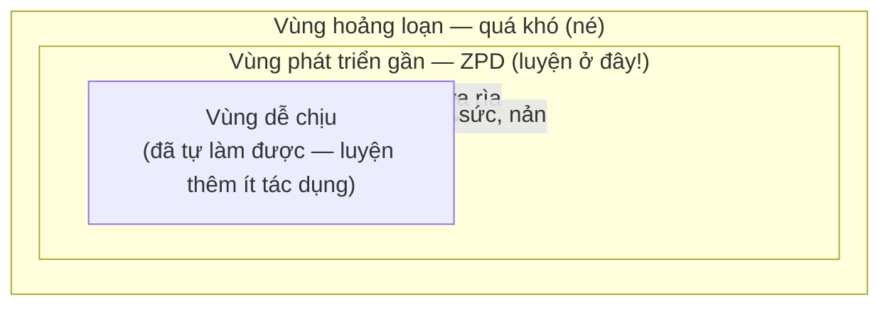
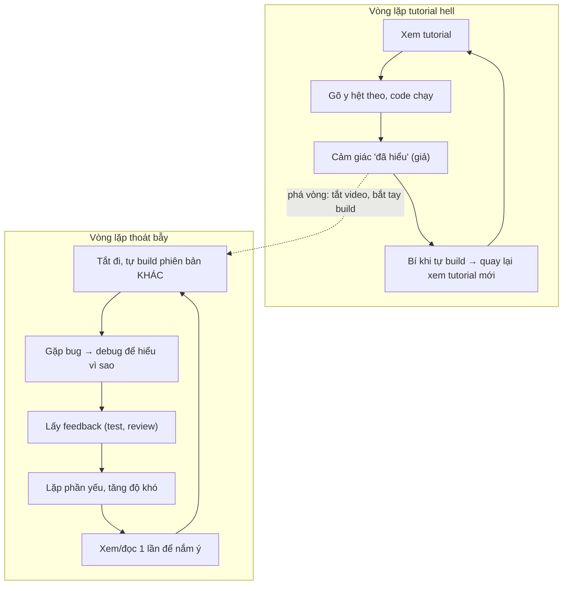

# Luyện tập có chủ đích & học qua dự án

> **Tác giả:** Mr.Rom\
> **Phiên bản:** v1.0.0\
> **Tạo lúc:** 13/06/2026\
> **Cập nhật:** 13/06/2026\
> **Level:** Basic\
> **Tags:** learning, soft-skills, deliberate-practice, project-based-learning, debugging, feedback, tutorial-hell\
> **Yêu cầu trước:** [Kỹ thuật học hiệu quả](01_effective-learning-techniques.md)

> 🎯 *Bài trước bạn đã có active recall và spaced repetition — hai cách nạp kiến thức vào đầu cho chắc. Nhưng với nghề dev, "biết" chưa đủ — phải **làm được**. Công nghệ đổi liên tục, nên thứ quyết định bạn theo kịp không phải số giờ đã ngồi, mà là **cách bạn luyện**. Bài này dạy bạn luyện tập có chủ đích (deliberate practice) thay vì "cày giờ" thụ động, vì sao học qua dự án mạnh nhất cho dev, cách biến đọc code/đọc docs và cả debugging thành công cụ học, cách lấy feedback đúng, và cách dùng "build" để thoát tutorial hell.*

## 🎯 Sau bài này bạn sẽ

- [ ] Hiểu **deliberate practice** là gì và vì sao nó khác hẳn "cày giờ" thụ động
- [ ] Định vị được **vùng khó vừa sức** (zone of proximal development) để luyện cho đúng chỗ
- [ ] Giải thích được vì sao **học qua dự án** (project-based learning) là cách học mạnh nhất cho dev
- [ ] Biến **đọc code** và **đọc docs** thành hành động học chủ động, không chỉ lướt qua
- [ ] Coi mỗi lần **debug** là một cơ hội học — hiểu *vì sao* sai, không chỉ *vá cho chạy*
- [ ] Thiết lập được vòng **feedback** đúng (mentor, code review, test) để biết mình sai ở đâu
- [ ] Dùng build project để **thoát tutorial hell** và tự thiết kế một buổi luyện có chủ đích

---

## Tình huống — hai người cùng "code 1000 giờ", kết quả khác nhau một trời một vực

Hãy hình dung hai người mới vào nghề, cùng bỏ ra một lượng thời gian ngồi trước máy như nhau.

Người thứ nhất mỗi tối mở một khoá học, gõ lại y hệt giảng viên, code chạy đúng thì hài lòng đóng máy. Hôm sau lại một video khác. Bạn ấy luôn chọn những bài "vừa tầm dễ chịu" — cái gì hơi khó là lướt qua, tự nhủ "để sau". Sau rất nhiều giờ như vậy, bạn ấy vẫn loay hoay đúng những thứ đã loay hoay từ đầu: vẫn lúng túng khi tự dựng project từ trang trắng, vẫn sợ mỗi khi gặp lỗi lạ.

Người thứ hai cũng ngồi từng đó thời gian, nhưng cách khác hẳn. Mỗi buổi bạn ấy chọn **một thứ hơi quá sức** — một concept chưa nắm chắc, một bug chưa từng gặp — rồi cố vật lộn với nó. Bạn ấy build những thứ nhỏ nhưng tự nghĩ ra, sai thì dừng lại hỏi "vì sao sai", nhờ người giỏi hơn review, và lần sau cố ý lặp lại đúng phần mình yếu. Sau từng đó giờ, bạn ấy tiến bộ thấy rõ — và quan trọng hơn, bạn ấy **tự học tiếp được** mọi thứ mới.

Khác biệt không phải IQ, không phải số giờ. Khác biệt là **chất lượng của mỗi giờ luyện**. Người thứ nhất "cày giờ" — lặp lại cái đã làm được. Người thứ hai luyện tập **có chủ đích** — luôn ở rìa năng lực, có mục tiêu, có feedback. Đây chính là khái niệm trung tâm của bài: không phải *luyện bao nhiêu*, mà *luyện thế nào*.

---

## 1️⃣ Deliberate practice — luyện có chủ đích, không phải cày giờ

Người ta hay tin vào "quy tắc 10.000 giờ": cứ làm gì đủ 10.000 giờ là thành chuyên gia. Nhưng đó là cách hiểu sai. Người đầu tiên đưa ra con số này — nhà nghiên cứu Anders Ericsson — về sau phải đính chính: không phải *số giờ*, mà là **loại luyện tập**. Một người chơi đàn 10.000 giờ vẫn có thể dở nếu suốt 10.000 giờ đó chỉ lặp lại những bản đã thuộc lòng. Cái tạo ra chuyên gia là một kiểu luyện rất đặc biệt, có tên: **deliberate practice** (luyện tập có chủ đích).

**Định nghĩa**: *Deliberate practice* (luyện tập có chủ đích) là kiểu luyện tập **có mục tiêu cụ thể**, diễn ra ở **rìa năng lực hiện tại** (vùng khó vừa sức), có **feedback ngay để biết đúng/sai**, và **lặp lại có chọn lọc đúng phần còn yếu** — chứ không phải lặp lại đại trà cái đã làm được.

🪞 **Ẩn dụ**: deliberate practice giống cách một **vận động viên tập tạ** lên cơ. Họ không nâng mức tạ đang nhấc nhẹ tênh hàng nghìn lần — như thế cơ chẳng lớn thêm. Họ nâng mức **vừa đủ nặng để lần thứ 8-10 run tay**, đúng tới ngưỡng cơ bị "quá tải" một chút, rồi tăng dần. Cơ chỉ lớn lên ở ngưỡng quá tải đó. Bộ não học kỹ năng cũng vậy: chỉ "lên cơ" khi bị đẩy ra rìa, không lên khi quẩn quanh vùng dễ chịu.

Để thấy rõ deliberate practice khác "cày giờ" thế nào, bảng dưới đặt hai kiểu luyện cạnh nhau trên đúng các tiêu chí định nghĩa:

| Tiêu chí | ❌ Cày giờ thụ động | ✅ Deliberate practice |
|---|---|---|
| Độ khó | Quanh vùng dễ chịu, làm lại cái đã biết | Rìa năng lực — hơi quá sức một chút |
| Mục tiêu | Mơ hồ ("học cho giỏi"), hoặc chỉ "cho xong giờ" | Cụ thể, nhỏ ("hôm nay viết được recursion không nhìn mẫu") |
| Feedback | Không có, hoặc rất trễ | Ngay lập tức (test chạy, lỗi hiện ra, mentor chỉ) |
| Tập trung | Nửa vời, vừa làm vừa lướt mạng | Tập trung cao độ, ngắn nhưng đậm đặc |
| Lặp lại | Lặp đại trà cả phần đã thạo | Lặp đúng phần yếu, có chủ đích |
| Cảm giác | Thoải mái, "trôi đều" | Hơi khó chịu, phải gắng sức |

→ Hàng cuối là điểm dễ gây hiểu lầm nhất: **deliberate practice thường KHÓ CHỊU**. Cảm giác "trôi đều, dễ chịu" lúc học thường là tín hiệu bạn đang ở vùng quá dễ — không học được mấy. Ngược lại, cảm giác "hơi vật vã, phải nghĩ" thường là tín hiệu bạn đang đúng vùng để tiến bộ. Đây cũng là lý do nhiều người vô thức né deliberate practice: nó không "phê" như xem hết một video mượt mà.

> [!IMPORTANT]
> "Cày giờ" tạo ra **cảm giác** tiến bộ (đã ngồi nhiều, đã xem nhiều) mà ít tiến bộ thật. Deliberate practice tạo ra **tiến bộ thật** mà cảm giác lại khó chịu. Nếu bạn đo bản thân bằng "đã học bao nhiêu giờ", bạn đang đo nhầm thứ. Hãy đo bằng "tự làm được gì mới mà tuần trước chưa làm được" — đúng tín hiệu thật như [bài trước](01_effective-learning-techniques.md) đã nói về phân biệt "nhận ra" và "tái tạo được".

---

## 2️⃣ Zone of proximal development — luyện cho đúng chỗ

Deliberate practice yêu cầu luyện ở "rìa năng lực". Nhưng rìa đó nằm ở đâu? Nhà tâm lý học Lev Vygotsky đặt tên cho vùng này: **zone of proximal development** (vùng phát triển gần) — gọi tắt ZPD.

**Định nghĩa**: *Zone of proximal development* (vùng phát triển gần) là vùng nằm **giữa** thứ bạn **đã tự làm được** và thứ bạn **chưa làm nổi kể cả khi cố** — tức là những thứ bạn **làm được nếu cố gắng, hoặc có một chút trợ giúp** (gợi ý, mentor, tài liệu). Đây chính là vùng học hiệu quả nhất.

🪞 **Ẩn dụ**: hãy nghĩ tới ba mức bài tập của một học sinh. Bài quá dễ (đã làm trôi chảy) — làm thêm chẳng giỏi lên. Bài quá khó (nhìn vào không hiểu gì, không biết bắt đầu từ đâu) — làm chỉ nản và bỏ cuộc. Bài **vừa khó tới mức phải nghĩ, nhưng có manh mối để bám vào** — đó là bài làm cho học sinh giỏi lên nhanh nhất. ZPD chính là loại bài thứ ba.

Khái niệm "ba vùng" này khá trừu tượng, nên hình dung qua sơ đồ ba lớp đồng tâm sẽ rõ hơn — vòng trong cùng là cái đã thạo, vòng ngoài cùng là cái còn quá xa, và vòng ở giữa mới là nơi đáng dồn sức luyện:



> 📖 *Sơ đồ cho thấy điểm cốt lõi: ZPD là một **vành đai hẹp**, không cố định. Khi bạn luyện và giỏi lên, vùng dễ chịu nở rộng ra, và ZPD cũng **trượt ra ngoài** theo. Thứ hôm nay là ZPD (vừa khó) thì vài tuần sau thành vùng dễ chịu — lúc đó phải tìm thử thách mới, nếu không bạn rơi lại vào "cày giờ".*

Làm sao biết mình đang ở vùng nào? Dùng tín hiệu cảm giác — không tuyệt đối nhưng đủ dùng để tự điều chỉnh:

| Tín hiệu khi luyện | Bạn đang ở vùng | Nên làm gì |
|---|---|---|
| "Làm trôi, chẳng phải nghĩ, hơi chán" | Dễ chịu | Tăng độ khó — thêm ràng buộc, bỏ gợi ý |
| "Phải dừng nghĩ, sai vài lần rồi ra, mệt nhưng làm được" | ZPD ✅ | Ở đây — đây là chỗ vàng |
| "Nhìn vào không hiểu gì, không biết bắt đầu từ đâu, muốn bỏ" | Hoảng loạn | Hạ độ khó — chia nhỏ, học phần nền còn thiếu trước |

→ Quy tắc thực hành: **nếu quá dễ thì tự thêm ràng buộc, nếu quá khó thì chia nhỏ hoặc xin trợ giúp** để kéo nó về ZPD. Một bài "quá khó" thường chỉ là một chuỗi nhiều bài ZPD chưa được tách ra. Ví dụ "tự build cả một web app" có thể là vùng hoảng loạn cho người mới, nhưng "build riêng phần form đăng nhập" lại nằm gọn trong ZPD.

---

## 3️⃣ Learn by building — vì sao học qua dự án mạnh nhất cho dev

Có một câu nói cũ trong nghề: *"You don't learn to code by reading about code."* (Bạn không học code bằng cách đọc về code). Với dev, cách học mạnh nhất là **learn by building** — học qua việc tự xây ra một thứ thật.

**Định nghĩa**: *Project-based learning* (học qua dự án) là cách học mà bạn **chọn một thứ để xây trước**, rồi học kiến thức **theo nhu cầu** (just-in-time) để hoàn thành nó — thay vì học hết lý thuyết rồi mới (định) làm.

Vì sao cách này mạnh đến vậy với riêng nghề dev? Có bốn lý do, và mỗi lý do gắn với một cơ chế học đã nói ở [bài trước](01_effective-learning-techniques.md):

- **Buộc active recall, không cho ngồi yên nhận diện.** Khi build, bạn phải **tự lôi kiến thức ra dùng** từ trang trắng — đúng là active recall (truy hồi chủ động), cách ghi nhớ mạnh nhất. Xem video chỉ cho não "nhận ra", build mới bắt não "tái tạo".
- **Phơi bày lỗ hổng kiến thức ngay lập tức.** Đọc lý thuyết, bạn dễ tưởng mình hiểu. Build thì không giấu được: code không chạy nghĩa là có chỗ bạn chưa thật sự hiểu. Lỗ hổng lộ ra đúng lúc, đúng chỗ.
- **Gắn kiến thức vào ngữ cảnh thật.** Kiến thức học "cho biết" trôi đi nhanh; kiến thức gắn với một việc cụ thể ("mình dùng index này để query đơn hàng nhanh hơn") bám rất chắc vì có móc neo trong trí nhớ.
- **Tạo ra feedback tự nhiên và liên tục.** Mỗi lần chạy thử là một lần được chấm điểm ngay. Vòng feedback này (sẽ nói kỹ ở §6) là thành phần bắt buộc của deliberate practice — và build cung cấp nó miễn phí.

🪞 **Ẩn dụ**: học code mà chỉ đọc/xem giống **học bơi qua sách**. Bạn có thể thuộc lòng mọi động tác tay chân, hiểu lý thuyết nổi-chìm, nhưng nhảy xuống nước vẫn chìm — vì cơ thể chưa từng *trải* cảm giác nước. Build chính là **xuống nước**. Uống vài ngụm nước (gặp bug) là một phần của việc học bơi, không phải dấu hiệu bạn kém.

> 📖 *Một điểm quan trọng để khỏi hiểu lầm: "build trước" không có nghĩa "bỏ lý thuyết". Lý thuyết vẫn cần — nhưng học theo nhu cầu, khi project đòi tới, nên nó luôn được áp dụng ngay và nhớ lâu. Đây là cách kéo lý thuyết khô vào đúng ZPD: bạn học một concept đúng lúc bạn cần nó để vượt qua một chỗ kẹt cụ thể.*

Một điểm tinh tế: project tốt cho việc học **không phải project to nhất**, mà là project **vừa đủ khó trên ZPD** và **buộc bạn chạm vào đúng kỹ năng cần luyện**. Một project quá tham vọng đẩy bạn vào vùng hoảng loạn; một project chép y tutorial thì nằm trong vùng dễ chịu. Phần [Cheatsheet](#-tra-cứu-nhanh-cheatsheet) cuối bài có một thang project tăng dần độ khó để bạn chọn cho đúng vùng.

---

## 4️⃣ Đọc code & đọc docs — cũng là một cách học chủ động

Build là cách học chủ động số một, nhưng không phải lúc nào cũng build. Hai nguồn học thường bị xem nhẹ vì tưởng là "thụ động" — **đọc code người khác** và **đọc docs** — thật ra có thể biến thành luyện tập chủ động cực mạnh, nếu đọc đúng cách.

### Đọc code — học từ người giỏi hơn

Đọc code của project tốt (thư viện open source bạn đang dùng, code của senior trong team) là cách hấp thụ **lối tư duy và pattern** mà không tài liệu nào dạy trực tiếp. Nhưng "đọc lướt cho có" thì vô ích — phải đọc **chủ động**.

🪞 **Ẩn dụ**: đọc code giống **học nấu ăn bằng cách xem đầu bếp giỏi làm**. Xem thụ động thì chỉ thấy "à, họ cho cái này vào". Xem chủ động là tự hỏi "vì sao họ cho cái này *trước*? bỏ bước kia thì sao?" — và quan trọng nhất là **về tự nấu lại** để kiểm tra mình hiểu thật.

Cách đọc code để thật sự học được, không chỉ lướt qua cho có:

- **Đặt câu hỏi trước khi đọc**: "Hàm này nhận gì, trả gì, xử lý ca lỗi nào?" — đọc để *trả lời câu hỏi*, không đọc để "xem cho biết".
- **Tự đoán trước, rồi đối chiếu**: trước khi đọc tiếp một hàm, đoán xem nó làm gì. Đoán sai chính là lúc học được nhiều nhất (đây là active recall).
- **Chạy thử và sửa**: đừng chỉ đọc — clone về, chạy, đặt breakpoint, **thử đổi một dòng xem gãy chỗ nào**. Code chỉ thật sự "vào đầu" khi bạn động tay.
- **Tự diễn giải lại**: viết một-hai câu giải thích đoạn code bằng lời của mình. Giải thích được mới là hiểu (kỹ thuật Feynman ở bài trước).

### Đọc docs — kỹ năng nền của người tự học

Công nghệ đổi liên tục, nên kỹ năng **đọc được documentation chính thức** quý hơn việc thuộc lòng một framework cụ thể. Framework sẽ lỗi thời; khả năng tự tra docs thì theo bạn cả đời. Nhiều người mới sợ docs vì nó "khô" — nhưng docs chính là nguồn **chính xác và cập nhật nhất**, đáng tin hơn blog rời rạc.

Cách đọc docs hiệu quả thay vì đọc tuần tự từ đầu tới cuối:

- **Đọc theo nhu cầu, không đọc hết**: docs là để **tra**, không phải để học thuộc. Tìm đúng phần bạn cần cho việc đang làm.
- **Ưu tiên phần "Getting started" và ví dụ chạy được**: docs tốt luôn có ví dụ — **chạy thử ví dụ đó trước**, rồi sửa nó theo ý mình.
- **Học cấu trúc docs, không học nội dung**: biết "API reference nằm đâu, tutorial nằm đâu, phần config nằm đâu" giúp bạn quay lại tra cực nhanh về sau.
- **Đối chiếu phiên bản**: luôn kiểm tra docs đang đọc đúng phiên bản bạn dùng — đây là lỗi âm thầm hay gặp khi công nghệ thay đổi nhanh.

→ Cả đọc code lẫn đọc docs đều có chung một bí quyết: **chuyển từ "đọc để biết" sang "đọc để làm"**. Đọc xong phải động tay — chạy, sửa, diễn giải lại — thì mới biến hành động trông-có-vẻ-thụ-động này thành deliberate practice thật.

---

## 5️⃣ Debugging là cơ hội học — hiểu *vì sao* sai

Người mới ghét debug: mỗi lỗi là một nỗi bực dọc, một thứ "cản đường". Nhưng người học giỏi nhìn ngược lại: **mỗi bug là một bài học miễn phí đúng vào lỗ hổng kiến thức của bạn**. Bug xuất hiện chính xác ở chỗ hiểu biết của bạn còn lệch — không có giáo viên nào chỉ trúng điểm yếu của bạn nhanh như một cái lỗi.

🪞 **Ẩn dụ**: một bug giống **đèn cảnh báo trên bảng đồng hồ xe**. Người vội bực mình lấy băng dính dán cái đèn lại cho khuất mắt (vá đại cho hết lỗi mà không hiểu). Người khôn thì mở nắp capo xem **vì sao** đèn sáng — vì đó là xe của họ, lần sau gặp lại họ tự sửa được. Vá mù làm lỗi biến mất tạm thời; hiểu nguyên nhân làm bạn giỏi lên thật.

Khác biệt nằm ở chỗ này: **vá cho chạy** (fix triệu chứng) hay **hiểu vì sao sai** (fix nguyên nhân và *học* từ nó). Bảng dưới đối chiếu hai thái độ trên cùng một tình huống bug:

| | ❌ Vá cho chạy | ✅ Debug để học |
|---|---|---|
| Mục tiêu | Làm lỗi biến mất, nhanh nhất | Hiểu *vì sao* lỗi xảy ra |
| Cách làm | Copy lời giải đầu tiên tìm được, dán vào | Đọc message, dựng giả thuyết, kiểm chứng từng cái |
| Sau khi xong | Quên ngay, gặp lại vẫn bí | Rút ra bài học, gặp dạng tương tự là nhận ra |
| Kiến thức | Không tăng | Lấp đúng một lỗ hổng |

Để biến debug thành deliberate practice, hãy debug **có phương pháp** thay vì thử mò ngẫu nhiên. Một quy trình gọn để bám theo:

1. **Đọc kỹ error message** — đừng bỏ qua. Message thường nói thẳng lỗi gì, ở dòng nào. Người mới hay hoảng và bỏ qua phần quý nhất.
2. **Tái hiện lỗi ổn định** — tìm các bước khiến lỗi xảy ra *mỗi lần*. Lỗi tái hiện được là lỗi đã nửa đường được sửa.
3. **Dựng giả thuyết** — "mình nghĩ lỗi do biến này null". Một giả thuyết cụ thể, kiểm chứng được.
4. **Kiểm chứng từng giả thuyết** — `print`/log/debugger để xác nhận đúng/sai. **Đổi một thứ mỗi lần**, không đổi loạn nhiều thứ cùng lúc.
5. **Sửa rồi tự hỏi "vì sao nó xảy ra ngay từ đầu"** — đây là bước biến debug thành học. Ghi lại bài học (xem [bài quản lý ghi chú](03_managing-information-and-notes.md) — đây là nguyên liệu vàng cho ghi chú).

> [!TIP]
> Sau khi sửa xong một bug khó, dành một phút viết lại **một câu**: "Lỗi này là gì, do đâu, lần sau nhận ra bằng dấu hiệu nào". Một dòng đó tích lại thành một cuốn "sổ tay debug" cá nhân — và đây chính là kiến thức khó kiếm nhất, vì nó đến từ chính sai lầm của bạn, không sao chép được từ ai.

> [!WARNING]
> Cạm bẫy lớn nhất thời nay: dán nguyên error message vào một AI hoặc Stack Overflow, **copy lời giải dán vào mà không hiểu**, code chạy thì đóng máy. Lỗi biến mất nhưng bạn **không học được gì** — lần sau gặp lại vẫn bí y như cũ. Dùng AI/search để *hiểu nguyên nhân* thì tốt; dùng để *bỏ qua việc hiểu* thì bạn đang tự cướp mất bài học của chính mình.

---

## 6️⃣ Lấy feedback — không có feedback thì không có deliberate practice

Quay lại định nghĩa ở §1: deliberate practice **bắt buộc có feedback**. Lý do đơn giản — nếu không biết mình sai ở đâu, bạn sẽ luyện đi luyện lại **cái sai** và càng ngày càng thành thạo... cái sai đó. Feedback là tấm gương cho bạn thấy khoảng cách giữa "mình nghĩ mình làm đúng" và "thực tế đúng tới đâu".

🪞 **Ẩn dụ**: luyện không có feedback giống **tập ném bóng vào rổ trong bóng tối**. Bạn ném hàng nghìn quả, nhưng không thấy quả nào vào quả nào trượt — nên không bao giờ chỉnh được tay. Bật đèn lên (có feedback) thì chỉ vài chục quả đã đủ để bạn tự điều chỉnh. Feedback chính là "bật đèn".

Một dev có nhiều nguồn feedback, từ nhanh-nhỏ tới chậm-sâu. Hiểu mỗi nguồn cho gì để dùng đúng:

| Nguồn feedback | Cho bạn biết | Tốc độ | Lưu ý |
|---|---|---|---|
| **Test tự động** | Code có chạy đúng theo kỳ vọng không | Tức thì | Vòng feedback nhanh nhất — viết test cho chính mình |
| **Compiler / linter / type checker** | Lỗi cú pháp, kiểu, code smell | Tức thì | Đọc cảnh báo, đừng tắt cho khuất mắt |
| **Code review** | Cách viết, kiến trúc, thứ bạn không tự thấy | Vài giờ - vài ngày | Nguồn feedback chất lượng cao nhất từ con người |
| **Mentor / senior** | Hướng đi, lỗi tư duy, cái không hỏi không biết | Tuỳ | Hỏi câu cụ thể, kèm "mình đã thử X" |
| **Người dùng thật** | Sản phẩm có thật sự dùng được không | Chậm | Sự thật cuối cùng — ngoài đời mới biết |

→ Để ý cột tốc độ: **vòng feedback càng nhanh, bạn học càng nhanh**. Đây là lý do test tự động đáng giá với người học — nó biến mỗi lần chạy thành một lần được chấm điểm tức thì. Nhưng feedback nhanh (test, compiler) chỉ trả lời "đúng/sai về mặt chạy"; feedback con người (code review, mentor) mới trả lời "có *tốt* không" — cả hai loại đều cần.

Hai nguồn feedback con người quan trọng nhất đáng nói riêng:

- **Code review** — khi người khác đọc code bạn viết, họ thấy những thứ bạn mù: tên biến khó hiểu, một cách viết gọn hơn, một ca lỗi bạn quên. Hãy coi mỗi comment review là một bài học, **không phải lời chê** — đây là điểm người mới hay vấp về mặt cảm xúc. Người giỏi *xin* được review nhiều hơn, không né nó.
- **Mentor / senior** — một người đi trước giúp bạn tránh hàng tháng đi sai đường. Nhưng feedback từ mentor chỉ tốt khi bạn **hỏi đúng cách**: nêu câu hỏi cụ thể, kèm "mình đã thử X, Y rồi", thay vì "em bí rồi, anh giúp với". Tôn trọng thời gian người giúp chính là cách giữ được nguồn feedback quý này lâu dài.

> [!IMPORTANT]
> Feedback chỉ có giá trị nếu bạn **đón nhận không phòng thủ**. Phản ứng "nhưng mà...", tự ái, giải thích vòng vo khi bị góp ý sẽ làm người khác ngại cho bạn feedback thật — và bạn mất đi tấm gương quý nhất. Tách "code của mình" khỏi "con người mình": người ta chê code, không chê bạn. Đây là một soft skill nền cho cả sự nghiệp, không chỉ cho việc học.

---

## 7️⃣ Thoát tutorial hell bằng build — ghép tất cả lại

Bây giờ ghép mọi mảnh ở trên lại để giải một vấn đề cụ thể mà gần như ai mới học cũng dính: **tutorial hell** (địa ngục tutorial) — vòng lặp xem tutorial mãi mà không bao giờ tự build được gì.

Vì sao tutorial hell xảy ra, nhìn qua lăng kính cả bài này? Vì xem tutorial là **hoạt động vùng dễ chịu hoàn hảo**: nó cho cảm giác tiến bộ (đang học mà!), không đòi gắng sức (chỉ cần gõ theo), không phơi bày lỗ hổng (luôn có người dắt tay). Nó vi phạm gần như mọi nguyên tắc của deliberate practice — không ở ZPD, không buộc active recall, feedback đến từ giảng viên chứ không từ chính bạn vật lộn.

Lối thoát duy nhất là **dịch chuyển từ tiêu thụ (xem) sang tạo ra (build)**. Sơ đồ dưới cho thấy hai vòng lặp — một vòng giam bạn lại, một vòng đẩy bạn ra:



> 📖 *Điểm mấu chốt của sơ đồ: vòng bên trái khép kín ở "cảm giác đã hiểu (giả)" — nó luôn quay về xem thêm tutorial. Mũi tên đứt nét là chỗ phá vòng: **chủ động tắt video và build**. Vòng bên phải tự đẩy bạn tiến lên vì nó tích hợp đủ bốn thứ của deliberate practice: ZPD (build cái khác, khó hơn), active recall (tự build), feedback (test/review), lặp phần yếu.*

Quy tắc thực hành để áp dụng ngay, không cần đợi:

- **Quy tắc "xem một, build hai"**: mỗi giờ xem tutorial, dành ít nhất gấp đôi thời gian tự build **một cái tương tự nhưng khác đi** — đổi chủ đề, thêm tính năng, không nhìn lại video.
- **Project-first thay vì tutorial-first**: chọn một thứ muốn build trước, rồi học đúng cái cần để hoàn thành nó (đã nói ở §3). "Học hết lý thuyết rồi mới làm" là một cái đích không bao giờ tới.
- **Bug là để debug, không phải để tua video**: khi gặp lỗi, tự đọc message và thử trước (§5), chỉ xem lại tutorial khi bí thật. Tự gỡ được một bug dạy nhiều hơn xem mười video.

→ Tóm lại cả bài: tutorial hell không chữa được bằng "xem chăm chỉ hơn" — nó chữa bằng **đổi loại hoạt động**, từ tiêu thụ thụ động sang luyện tập có chủ đích quanh việc build. Mọi nguyên tắc trong bài này hội tụ về đúng một câu: *học là một động từ chủ động — bạn học bằng tay, không bằng mắt.*

---

## 💡 Cạm bẫy thường gặp & Best practice

### ❌ Cạm bẫy: chỉ luyện ở vùng dễ chịu (illusion of competence)

- **Triệu chứng**: luôn chọn bài/project "vừa tầm, làm trơn tru", thấy thoải mái khi học, nhưng kỹ năng đứng yên hàng tháng. Né những thứ "hơi khó" với lý do "để sau".
- **Nguyên nhân**: vùng dễ chịu cho cảm giác giỏi (illusion of competence — ảo giác về năng lực) mà không đẩy bạn ra rìa. Luyện ở đó không tạo "quá tải" để não lên cơ.
- **Cách tránh**: chủ động kéo việc luyện về ZPD (§2) — thêm ràng buộc khi thấy quá dễ ("làm lại nhưng không nhìn mẫu", "viết thêm test", "làm trong giới hạn thời gian"). Cảm giác hơi khó chịu khi luyện thường là tín hiệu đúng.

### ❌ Cạm bẫy: vá bug cho chạy mà không hiểu vì sao

- **Triệu chứng**: gặp lỗi là copy lời giải đầu tiên (từ search/AI) dán vào, chạy được thì thôi. Gặp lại lỗi tương tự vẫn bí, lại đi copy tiếp.
- **Nguyên nhân**: coi bug là "chướng ngại cần dẹp gấp" thay vì "bài học chỉ đúng lỗ hổng của mình". Bỏ qua bước hiểu nguyên nhân.
- **Cách tránh**: debug có phương pháp (§5) — đọc message, dựng giả thuyết, kiểm chứng, rồi tự hỏi "vì sao nó xảy ra ngay từ đầu". Ghi lại một câu bài học. Dùng AI/search để *hiểu*, không phải để *bỏ qua việc hiểu*.

### ✅ Best practice: thiết kế mỗi buổi luyện quanh một mục tiêu cụ thể + feedback

- **Vì sao**: deliberate practice yêu cầu mục tiêu rõ và feedback ngay (§1). Một buổi "học chung chung" trượt về cày giờ; một buổi có mục tiêu nhỏ + cách kiểm tra biến nó thành luyện thật.
- **Cách áp dụng**: trước mỗi buổi, viết một câu "hôm nay mình làm được gì mà giờ chưa làm được" + chọn sẵn cách lấy feedback (test, chạy thử, nhờ review). Phần [Cheatsheet](#-tra-cứu-nhanh-cheatsheet) có checklist 6 bước thiết kế buổi luyện.

### ✅ Best practice: xin code review và đón nhận không phòng thủ

- **Vì sao**: code review là nguồn feedback con người chất lượng cao nhất (§6) — nó cho thấy thứ bạn tự mù. Người *xin* review nhiều giỏi nhanh hơn người né nó.
- **Cách áp dụng**: chủ động nhờ người giỏi hơn đọc code (kèm mô tả bạn muốn họ chú ý đâu). Coi mỗi comment là một bài học, không phải lời chê. Tách "code của mình" khỏi "con người mình".

---

## 🧠 Tự kiểm tra (Self-check)

**Q1.** Một người nói: "Mình code mỗi ngày 3 tiếng suốt nửa năm rồi, sao vẫn thấy mình không giỏi lên?". Theo bài, vấn đề có thể nằm ở đâu?

<details>
<summary>💡 Đáp án</summary>

Vấn đề không phải *số giờ* mà là *loại luyện tập*. Nhiều khả năng bạn ấy đang **cày giờ ở vùng dễ chịu** — lặp lại những thứ đã làm được, chọn cái "vừa tầm dễ chịu", né cái hơi khó. Đó không phải deliberate practice. Để giỏi lên cần kéo việc luyện về **ZPD** (vùng khó vừa sức): chọn thứ hơi quá sức, đặt mục tiêu cụ thể mỗi buổi, có feedback ngay, và lặp đúng phần còn yếu. Đo bản thân bằng "tự làm được gì mới", không bằng "đã ngồi bao nhiêu giờ".

</details>

**Q2.** Zone of proximal development (ZPD) là gì? Nếu một bài tập đang nằm ở "vùng hoảng loạn" (quá khó), bạn làm gì để kéo nó về ZPD?

<details>
<summary>💡 Đáp án</summary>

ZPD là vùng nằm **giữa** thứ bạn đã tự làm được và thứ bạn chưa làm nổi kể cả khi cố — tức những thứ bạn làm được *nếu gắng sức hoặc có chút trợ giúp*. Đây là vùng học hiệu quả nhất. Khi một bài ở vùng hoảng loạn (nhìn vào không biết bắt đầu từ đâu), kéo về ZPD bằng cách **chia nhỏ** (một bài quá khó thường là chuỗi nhiều bài ZPD chưa tách ra) hoặc **học phần nền còn thiếu trước**, hoặc **xin một chút trợ giúp/gợi ý** để có manh mối bám vào. Ví dụ: "build cả web app" (hoảng loạn) → tách thành "build riêng phần form đăng nhập" (ZPD).

</details>

**Q3.** Vì sao học qua dự án (build) lại mạnh hơn xem video cho người học code? Nêu ít nhất hai cơ chế.

<details>
<summary>💡 Đáp án</summary>

Vài cơ chế (nêu hai là đủ): (1) **Buộc active recall** — build bắt bạn tự lôi kiến thức ra dùng từ trang trắng, cách ghi nhớ mạnh nhất; xem video chỉ cho não "nhận ra". (2) **Phơi bày lỗ hổng ngay** — code không chạy nghĩa là có chỗ chưa hiểu thật, không giấu được như khi đọc lý thuyết. (3) **Gắn kiến thức vào ngữ cảnh thật** nên nhớ lâu. (4) **Tạo feedback tự nhiên liên tục** — mỗi lần chạy thử là một lần được chấm điểm ngay, mà feedback là thành phần bắt buộc của deliberate practice.

</details>

**Q4.** Hai cách xử lý một bug: (a) dán error vào AI, copy lời giải, chạy được thì đóng máy; (b) đọc message, dựng giả thuyết, kiểm chứng, sửa, rồi tự hỏi "vì sao nó xảy ra". Cách nào giúp bạn học, và vì sao cách kia là cạm bẫy?

<details>
<summary>💡 Đáp án</summary>

Cách **(b)** giúp bạn học. Mỗi bug xuất hiện đúng vào lỗ hổng kiến thức của bạn — debug để *hiểu vì sao* sẽ lấp đúng lỗ hổng đó, và lần sau gặp dạng tương tự bạn nhận ra ngay. Cách (a) là cạm bẫy "vá cho chạy": lỗi biến mất tạm thời nhưng kiến thức **không tăng** — gặp lại vẫn bí, lại đi copy tiếp. Dùng AI/search để *hiểu nguyên nhân* thì tốt; dùng để *bỏ qua việc hiểu* là tự cướp mất bài học của chính mình.

</details>

**Q5.** Vì sao feedback là thành phần *bắt buộc* của deliberate practice, không phải "có thì tốt"? Và vì sao test tự động đặc biệt giá trị với người học?

<details>
<summary>💡 Đáp án</summary>

Vì không có feedback thì bạn **không biết mình sai ở đâu** — và sẽ luyện đi luyện lại *cái sai*, càng ngày càng thành thạo cái sai đó (ẩn dụ "ném bóng trong bóng tối"). Feedback là tấm gương cho thấy khoảng cách giữa "mình nghĩ mình đúng" và "thực tế đúng tới đâu", nên nó là điều kiện cần để luyện tập có hiệu quả. Test tự động đặc biệt giá trị vì nó là **vòng feedback nhanh nhất** — tức thì — biến mỗi lần chạy code thành một lần được chấm điểm ngay; vòng feedback càng nhanh thì học càng nhanh.

</details>

---

## ⚡ Tra cứu nhanh (Cheatsheet)

**Checklist thiết kế một buổi deliberate practice (6 bước):**

```text
== BUỔI LUYỆN CÓ CHỦ ĐÍCH ==

[1] MỤC TIÊU cụ thể, nhỏ, đo được
    "Hôm nay mình làm được ____ mà giờ chưa làm được"
    (không phải "học cho giỏi" — phải kiểm tra được là xong)

[2] ĐỘ KHÓ ở ZPD (vùng khó vừa sức)
    Quá dễ → thêm ràng buộc (không nhìn mẫu / có giới hạn / viết test)
    Quá khó → chia nhỏ / học phần nền thiếu trước / xin gợi ý

[3] TẬP TRUNG cao, ngắn mà đậm
    Tắt thông báo. Một việc duy nhất. Thà 45 phút tập trung hơn 3h nửa vời.

[4] FEEDBACK ngay (chọn trước cách kiểm tra)
    Test tự động / chạy thử / compiler / nhờ review

[5] VẬT LỘN với phần khó — KHÔNG bỏ qua khi bí
    Cảm giác hơi khó chịu = đang đúng vùng. Thử trước khi tra lời giải.

[6] LẶP phần yếu + GHI lại bài học
    Phần nào sai → lặp lại đúng phần đó. Viết 1 câu bài học rút ra.
```

**Thang project tăng dần độ khó (chọn cái nằm trên ZPD của bạn):**

| Mức | Loại project | Kỹ năng luyện chính |
|---|---|---|
| 1 | CLI tool nhỏ (vd app to-do dòng lệnh) | Cú pháp ngôn ngữ, đọc/ghi dữ liệu cơ bản, Git |
| 2 | Script tự động hoá một việc thật của bạn | Phân rã bài toán, xử lý lỗi, đọc docs thư viện |
| 3 | App có giao diện + lưu dữ liệu (ghi chú, chi tiêu) | Kết nối UI ↔ logic ↔ lưu trữ, state |
| 4 | REST API có CRUD + auth + database thật | Thiết kế API, database, authentication |
| 5 | Thêm test + đóng gói (Docker) + deploy | Viết test, vòng feedback, vận hành |
| 6 | Đóng góp 1 PR nhỏ cho project open source | Đọc code lớn của người khác, code review thật |

**Bảng tra nhanh — khung trong bài:**

| Mục đích | Khung / công cụ |
|---|---|
| Luyện cho tiến bộ thật | Deliberate practice: mục tiêu + ZPD + feedback + lặp phần yếu |
| Tìm đúng độ khó | ZPD: giữa "đã làm được" và "chưa làm nổi" — vừa khó để phải nghĩ |
| Học code mạnh nhất | Build project (just-in-time), không học hết lý thuyết rồi mới làm |
| Đọc code/docs | Chuyển "đọc để biết" → "đọc để làm": chạy, sửa, diễn giải lại |
| Tận dụng bug | Debug để *hiểu vì sao*, ghi 1 câu bài học — không vá mù |
| Biết mình sai đâu | Feedback: test (nhanh) → code review/mentor (sâu) |
| Thoát tutorial hell | "Xem một build hai", project-first, bug để debug không để tua |

---

## 📚 Từ Điển Thuật Ngữ (Glossary)

| EN | VN | Giải thích |
|---|---|---|
| Deliberate practice | Luyện tập có chủ đích | Luyện có mục tiêu, ở rìa năng lực, có feedback ngay, lặp phần yếu |
| Zone of proximal development (ZPD) | Vùng phát triển gần | Vùng giữa "đã tự làm được" và "chưa làm nổi" — nơi học hiệu quả nhất |
| Comfort zone | Vùng dễ chịu | Những thứ đã làm trôi chảy — luyện thêm ít tác dụng |
| Project-based learning | Học qua dự án | Chọn thứ để build trước, học kiến thức theo nhu cầu để hoàn thành |
| Learn by building | Học qua xây dựng | Học code bằng tự tạo ra thứ thật, không chỉ đọc/xem |
| Just-in-time learning | Học theo nhu cầu | Học đúng kiến thức cần, đúng lúc cần, không học thừa trước |
| Active recall | Truy hồi chủ động | Tự lôi kiến thức ra dùng từ trí nhớ, không nhìn lại đáp án |
| Feedback loop | Vòng phản hồi | Chu trình làm → biết kết quả → điều chỉnh; càng nhanh học càng nhanh |
| Code review | Duyệt code | Người khác đọc code bạn viết để góp ý trước khi merge |
| Mentor | Người dẫn dắt | Người đi trước giúp định hướng, chỉ lỗi tư duy bạn không tự thấy |
| Debugging | Gỡ lỗi | Quá trình tìm và sửa lỗi trong code |
| Tutorial hell | Địa ngục tutorial | Vòng lặp xem tutorial mãi mà không bao giờ tự build được gì |
| Illusion of competence | Ảo giác về năng lực | Cảm giác "đã giỏi/đã hiểu" sai lệch, không khớp với khả năng thật |
| Linter | Công cụ soát code | Công cụ tự động cảnh báo lỗi cú pháp / code smell khi viết |

---

## 🔗 Liên kết & Tài nguyên

⬅️ **Bài trước:** [Kỹ thuật học hiệu quả — Active recall, spaced repetition](01_effective-learning-techniques.md)\
➡️ **Bài tiếp theo:** [Quản lý thông tin & ghi chú — Second brain cho dev](03_managing-information-and-notes.md)\
↑ **Về cụm:** [learning-how-to-learn — README](../../README.md)

### 🧭 Định hướng lộ trình học

- [Học diễn ra thế nào trong não — Nền tảng để học tốt hơn](00_how-learning-works.md) — cơ chế trí nhớ phía sau vì sao build và feedback hiệu quả
- [Kỹ thuật học hiệu quả — Active recall, spaced repetition](01_effective-learning-techniques.md) — nền cho bài này: build chính là active recall ở quy mô lớn

### 🧩 Các chủ đề có thể bạn quan tâm

- [Quản lý thông tin & ghi chú — Second brain cho dev](03_managing-information-and-notes.md) — nơi cất các "bài học từ bug" thành kho tri thức cá nhân
- [Thói quen, động lực & tránh burnout](04_habits-motivation-and-burnout.md) — duy trì deliberate practice đều đặn mà không kiệt sức
- [Kỹ năng & Lộ trình học cá nhân — Thoát khỏi tutorial hell](../../../career-path/lessons/01_basic/01_skills-and-learning-roadmap.md) — góc nhìn lộ trình nghề về thoát tutorial hell bằng project

### 🌐 Tài nguyên tham khảo khác

- [Peak: Secrets from the New Science of Expertise (Anders Ericsson)](https://www.goodreads.com/book/show/26312997-peak) — sách gốc về deliberate practice từ chính nhà nghiên cứu
- [The Pragmatic Programmer (Hunt & Thomas)](https://pragprog.com/titles/tpp20/the-pragmatic-programmer-20th-anniversary-edition/) — kinh điển về tư duy học và làm nghề dev qua thực hành
- [How to read source code (kentcdodds.com)](https://kentcdodds.com/blog/how-to-read-source-code) — hướng dẫn cụ thể cách đọc code người khác để học

---

## 📌 Nhật ký thay đổi (Changelog)

- **v1.0.0 (13/06/2026)** — Bản đầu tiên. Deliberate practice vs cày giờ (bảng đối chiếu 6 tiêu chí, ẩn dụ tập tạ) + zone of proximal development có sơ đồ 3 vùng đồng tâm + bảng tín hiệu cảm giác định vị vùng + learn by building với 4 cơ chế gắn với active recall/feedback (ẩn dụ học bơi) + đọc code & đọc docs như học chủ động + debugging là cơ hội học (bảng vá-cho-chạy vs debug-để-học + quy trình 5 bước) + lấy feedback (bảng 5 nguồn, code review & mentor, ẩn dụ ném bóng trong bóng tối) + thoát tutorial hell bằng build có sơ đồ 2 vòng lặp + 2 cạm bẫy + 2 best practice + 5 self-check + checklist 6 bước thiết kế buổi luyện + thang 6 mức project tăng độ khó + glossary 14 thuật ngữ.
