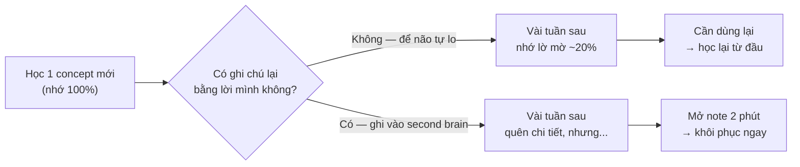
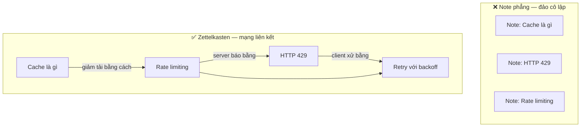

# Quản lý thông tin & ghi chú — Second brain cho dev

> **Tác giả:** Mr.Rom\
> **Phiên bản:** v1.0.0\
> **Tạo lúc:** 13/06/2026\
> **Cập nhật:** 13/06/2026\
> **Level:** Basic\
> **Tags:** learning, soft-skills, note-taking, second-brain, zettelkasten, para, learning-in-public\
> **Yêu cầu trước:** [Luyện tập có chủ đích & học qua dự án](02_deliberate-practice-and-projects.md)

> 🎯 *Bài trước bạn đã biết luyện tập có chủ đích và học qua dự án — cách "nạp" kỹ năng vào người. Nhưng nghề dev nạp vào quá nhiều: docs, bài blog, lỗi đã từng fix, snippet hay, quyết định kiến trúc... và phần lớn bay hơi sau vài tuần. Bài này dạy bạn xây một **second brain** (bộ não thứ hai): ghi chú đúng cách (viết bằng lời mình thay vì chép nguyên, link các ý tưởng), tổ chức bằng Zettelkasten và PARA, học thẳng từ docs gốc thay vì chỉ tutorial, curate nguồn chất lượng thay vì nhảy nguồn liên tục, và learning in public để vừa củng cố vừa xây uy tín. Cuối bài có template hệ ghi chú tối giản copy về dùng ngay.*

## 🎯 Sau bài này bạn sẽ

- [ ] Hiểu vì sao **quá tải thông tin** (information overload) là vấn đề thật của nghề dev, không phải "lười đọc"
- [ ] Phân biệt ghi chú **hiệu quả** (viết lại bằng lời mình, có link) với chép-nguyên vô dụng
- [ ] Nắm hai khung tổ chức nền: **Zettelkasten** (note nguyên tử + liên kết) và **PARA** (Projects/Areas/Resources/Archives)
- [ ] Hiểu khái niệm **second brain** — ngoại hoá trí nhớ để não rảnh cho việc suy nghĩ
- [ ] Biết khi nào học từ **docs gốc / source code** thay vì chỉ tutorial
- [ ] Biết cách **curate nguồn** chất lượng và dừng nhảy nguồn liên tục
- [ ] Áp dụng được **learning in public** để vừa củng cố kiến thức vừa xây uy tín
- [ ] Dựng được một hệ ghi chú tối giản từ template trong bài

---

## Tình huống — "Mình từng fix lỗi này rồi mà..."

Hãy hình dung một buổi chiều rất quen.

Bạn gặp một lỗi build kỳ lạ: một thư viện báo xung đột phiên bản, terminal nhả ra một đống chữ đỏ. Bạn cau mày — *cảm giác này quen lắm*. Đúng rồi, sáu tháng trước bạn từng gặp đúng lỗi này, và đã mất nửa ngày mò ra cách sửa. Vấn đề là: bạn **không nhớ nổi đã sửa thế nào**. Bạn lục lại lịch sử trình duyệt, mở lại vài tab Stack Overflow, thử lại từ đầu cái quy trình mò mẫm mà bạn đã làm một lần rồi. Lại tốn nửa ngày nữa.

Cùng lúc đó, thư mục Bookmarks của bạn có 400 link "để đọc sau" — và bạn chưa mở lại cái nào quá ba lần. Trong Notes có vài chục mẩu copy-paste rời rạc, không tiêu đề, không biết của project nào. Bạn đọc một bài blog hay tuần trước, gật gù, nhưng giờ hỏi lại thì chỉ nhớ "hình như nó nói về caching gì đó".

Đây không phải bạn kém trí nhớ. Đây là hệ quả tự nhiên của một nghề mà **lượng thông tin nạp vào vượt xa khả năng nhớ của bộ não sinh học** — gọi là **information overload** (quá tải thông tin). Và cách thoát không phải là "cố nhớ nhiều hơn", mà là **ngừng bắt não làm việc của một cái ổ cứng**. Não người giỏi kết nối và suy nghĩ; nó rất tệ trong việc lưu trữ chính xác. Bài này dạy bạn tách hai việc đó ra: để một hệ thống bên ngoài lo việc lưu trữ, còn não bạn rảnh tay để nghĩ.

---

## 1️⃣ Quá tải thông tin là vấn đề thật

Trước khi nói tới giải pháp, phải thấy rõ vấn đề — nếu không bạn sẽ tưởng "chỉ cần chăm chỉ hơn" là xong, và lại rơi vào đúng cái bẫy cũ.

Nghề dev có một đặc điểm hiếm nghề nào sánh được: **thông tin vừa nhiều, vừa đổi liên tục, vừa cần truy xuất chính xác**. Một ngày bình thường bạn có thể chạm vào: cú pháp của ba ngôn ngữ, năm thư viện, một config tool mới, một quyết định kiến trúc của team, một lỗi production và cách nó được sửa. Tuần sau, một nửa số đó bạn đã quên. Tháng sau, framework bạn vừa học ra phiên bản mới đổi luôn API.

Có một quy luật trí nhớ tàn nhẫn mà bạn cần chấp nhận: **đường cong lãng quên** (forgetting curve) — nếu không ôn lại, phần lớn thứ vừa học sẽ rơi rụng rất nhanh theo thời gian. Bạn đã gặp khái niệm này khi học spaced repetition ở [bài kỹ thuật học hiệu quả](01_effective-learning-techniques.md). Đường cong lãng quên là lý do vì sao "đọc một lần rồi để đó" gần như vô dụng với thông tin kỹ thuật.

Để thấy nó trực quan, hãy hình dung điều gì xảy ra với một mẩu kiến thức sau khi bạn học nó — trong hai kịch bản: bỏ mặc, và có một hệ thống ghi chú đỡ lưng.



> 📖 *Điểm cốt lõi của sơ đồ: ghi chú **không** giúp bạn "nhớ mãi mãi" — quên vẫn là điều tự nhiên. Cái nó cho bạn là **khôi phục nhanh**: thay vì học lại nửa ngày, bạn mở note ra và đứng dậy lại trong vài phút. Mục tiêu của quản lý thông tin không phải chống quên, mà là biến cái quên thành chuyện rẻ.*

🪞 **Ẩn dụ**: trí nhớ sinh học của bạn giống **RAM của máy tính** — cực nhanh để xử lý cái đang làm, nhưng **mất sạch khi tắt máy**. Một hệ ghi chú là **ổ cứng (disk)** — chậm hơn để truy cập, nhưng **bền**. Không ai thiết kế chương trình bằng cách nhét toàn bộ dữ liệu vào RAM rồi cầu cho đừng mất điện. Bạn cũng đừng thiết kế việc học theo kiểu nhét tất cả vào đầu rồi cầu cho đừng quên.

> [!NOTE]
> Quá tải thông tin không phải dấu hiệu bạn yếu. Ngược lại — người càng học nhiều, đọc nhiều, càng dễ quá tải, vì lượng nạp vào lớn. Người "không bao giờ quá tải" thường chỉ là người ngừng học. Vấn đề cần giải không phải "nạp ít lại", mà "có hệ thống để dòng thông tin lớn không trôi mất".

---

## 2️⃣ Ghi chú hiệu quả — viết bằng lời mình, không chép nguyên

Phần lớn người ta ghi chú sai cách, và vì sai cách nên kết luận "ghi chú vô dụng, mình nhớ trong đầu cho nhanh". Hãy sửa cái gốc trước.

Có một khác biệt một-trời-một-vực giữa hai hành động trông giống nhau:

- **Chép nguyên** (transcribing) — copy-paste đoạn doc, đoạn code, câu trả lời Stack Overflow vào note y nguyên. Tay bạn bận, nhưng **não không xử lý gì cả**. Bạn chỉ di chuyển chữ từ chỗ này sang chỗ khác.
- **Viết lại bằng lời mình** (encoding) — đóng tài liệu gốc lại, rồi diễn đạt ý đó **bằng câu của chính bạn**, như đang giải thích cho một người mới hơn. Đây là lúc não thật sự làm việc: nó phải hiểu mới diễn đạt lại được.

🪞 **Ẩn dụ**: chép nguyên giống **chụp ảnh một món ăn**; viết lại bằng lời mình giống **tự nấu lại món đó**. Bức ảnh đẹp nhưng bạn vẫn không biết nấu. Chỉ khi tự đứng bếp, vụng về, nêm sai rồi sửa — bạn mới thật sự "có" món ăn đó. Note chép nguyên là album ảnh đẹp mà vô dụng khi đói.

Vì sao viết lại bằng lời mình mạnh đến vậy? Vì hành động diễn đạt lại **buộc lộ ra lỗ hổng hiểu ngay lập tức**. Khi bạn cố viết "caching hoạt động thế nào" bằng câu của mình mà viết không nổi, đó là tín hiệu vàng: bạn tưởng đã hiểu nhưng thật ra chưa. Chép nguyên thì che mất tín hiệu đó — note trông đầy đủ mà đầu bạn rỗng.

Hãy so sánh trực tiếp hai note cho cùng một thứ — ý nghĩa của HTTP status `429`:

| ❌ Note chép nguyên (vô dụng) | ✅ Note viết bằng lời mình (dùng được) |
|---|---|
| `429 Too Many Requests — The user has sent too many requests in a given amount of time ("rate limiting").` (copy y từ MDN) | `429 = server bảo "bạn gọi nhiều quá, chậm lại". Gặp khi vượt rate limit. Cách xử: đọc header Retry-After để biết chờ bao lâu rồi thử lại. Mình gặp lần đầu khi gọi API thời tiết trong vòng lặp không có delay.` |

→ Note bên phải **ngắn hơn về thông tin gốc** nhưng giàu hơn về giá trị: nó có cách xử lý, có ngữ cảnh bạn từng gặp, và viết bằng giọng bạn sẽ hiểu lại sau này. Note bên trái thì Google ra trong 2 giây — chép vào note chỉ tổ chiếm chỗ.

### Quy tắc viết note hiệu quả

Gom lại thành vài quy tắc bạn áp dụng được ngay từ note tiếp theo:

- **Đóng nguồn rồi mới viết** — không nhìn doc gốc khi gõ note. Nhìn vào là tay tự chép.
- **Viết như dạy người mới hơn một bước** — nếu giải thích không nổi, bạn chưa hiểu, quay lại học tiếp.
- **Kèm ngữ cảnh "mình gặp ở đâu"** — note có câu chuyện thì dễ nhớ và dễ tìm lại hơn note khô.
- **Một note một ý** — đừng nhồi mười thứ vào một file (lý do sẽ rõ ở phần Zettelkasten).
- **Link sang note liên quan** — kiến thức có giá trị khi nó **nối** với cái khác, không phải nằm cô lập.

> [!TIP]
> Mẹo "feynman rút gọn" cho mỗi concept khó: viết một dòng mở đầu *"Giải thích cho mình của 6 tháng trước:..."*. Ép mình viết cho một người chưa biết gì (chính bạn ngày xưa) khiến bạn bỏ hết thuật ngữ rỗng và chỉ giữ phần thật sự hiểu.

---

## 3️⃣ Zettelkasten — note nguyên tử + liên kết

Bạn đã biết "viết bằng lời mình". Câu hỏi tiếp theo: **một note nên to cỡ nào, và tổ chức ra sao?**. Đây là lúc Zettelkasten vào cuộc.

**Zettelkasten** (tiếng Đức, nghĩa "hộp phiếu ghi") — một phương pháp ghi chú do nhà xã hội học Niklas Luhmann phổ biến, dựa trên hai nguyên tắc đơn giản:

1. **Note nguyên tử** (atomic note) — mỗi note chỉ chứa **đúng một ý**, đủ nhỏ để tự đứng vững một mình.
2. **Liên kết** (linking) — các note **trỏ sang nhau** bằng link, tạo thành một mạng lưới ý tưởng thay vì một danh sách phẳng.

🪞 **Ẩn dụ**: Zettelkasten giống **những viên gạch Lego** thay vì một bức tượng đúc liền. Mỗi viên gạch (note nguyên tử) nhỏ, đơn giản, tự nó chẳng là gì đặc biệt. Nhưng vì chúng có **mấu nối chuẩn** (link), bạn ghép lại được vô số thứ — và khi cần ý tưởng mới, bạn tháo ra lắp lại được. Một bức tượng đúc liền (note khổng lồ nhồi mọi thứ) thì đẹp nhưng cứng đờ: muốn lấy một phần ra dùng chỗ khác là không thể.

Vì sao "một ý một note" lại quan trọng? Vì nó là điều kiện để **liên kết** hoạt động. Nếu một note chứa mười ý, bạn không thể link chính xác tới "ý số 7" — bạn chỉ link được tới cả khối. Note càng nguyên tử, mạng lưới càng sắc nét, và càng dễ xảy ra điều quý nhất: **bạn vô tình nối hai ý tưởng từng học rời nhau, và nảy ra một hiểu biết mới**.

Hãy nhìn sự khác biệt giữa một đống note phẳng (kiểu thư mục bookmark) và một mạng note có liên kết:



> 📖 *So sánh hai cụm: bên trái mỗi note là một hòn đảo, cần dùng phải nhớ ra nó tồn tại. Bên phải, đi vào một note bất kỳ là bạn được dẫn sang các note liên quan — kiến thức tự kể thành một câu chuyện. Đây là khác biệt giữa "kho chứa" và "bộ não".*

### Cách áp dụng Zettelkasten cho dev — thực dụng

Bạn **không cần** dựng đúng hệ thống của Luhmann với phiếu giấy và mã số. Phiên bản thực dụng cho dev:

- Mỗi concept / pattern / lỗi đã fix → **một note riêng**, tiêu đề là một câu khẳng định ngắn (vd `Retry phải có exponential backoff để tránh dồn tải`).
- Trong note, ở cuối, thêm một mục **"Liên quan"** trỏ tới các note khác.
- Dùng công cụ hỗ trợ link hai chiều (vd Obsidian, Logseq) — gõ `[[tên note]]` là tạo link. Nhưng kể cả Markdown thường với link tương đối cũng đủ bắt đầu.
- Đừng phân loại theo thư mục cứng. Để **link** làm việc phân loại — một note có thể được nhiều note khác trỏ tới, điều mà thư mục không làm được.

> [!NOTE]
> Đừng để cái tên Đức nghe học thuật làm bạn sợ. Cốt lõi Zettelkasten chỉ là hai câu: **"mỗi note một ý"** và **"note nối với note"**. Mọi thứ còn lại là biến thể. Bắt đầu với hai câu đó là đủ — đừng đợi hiểu hết lý thuyết mới ghi note đầu tiên.

---

## 4️⃣ PARA — tổ chức theo mức độ hành động

Zettelkasten trả lời "note to cỡ nào và nối ra sao". Nhưng còn một câu hỏi khác: **toàn bộ ghi chú và file của bạn nên xếp vào đâu** — không chỉ note học, mà cả tài liệu project, ghi chú công việc, thứ lưu trữ? Đây là việc của **PARA**.

**PARA** là một hệ tổ chức do Tiago Forte đề xuất, chia **mọi thông tin** của bạn vào đúng bốn nhóm — viết tắt của bốn chữ đầu:

- **P — Projects** (dự án) — những việc có **mục tiêu rõ và điểm kết thúc**, đang làm bây giờ. Vd: "Xây API auth cho app X", "Học xong khoá Docker và deploy 1 service".
- **A — Areas** (lĩnh vực) — những mảng bạn **duy trì lâu dài, không có điểm kết thúc**. Vd: "Sức khoẻ", "Kiến thức Backend", "Tài chính cá nhân".
- **R — Resources** (tài nguyên) — chủ đề bạn **quan tâm, để tham khảo sau**. Vd: snippet hay, bài viết về một công nghệ bạn để mắt, cheatsheet.
- **A — Archives** (lưu trữ) — những thứ ở ba nhóm trên đã **xong / không còn hoạt động**, cất đi cho gọn nhưng không xoá.

🪞 **Ẩn dụ**: PARA giống cách sắp xếp **bàn làm việc và tủ hồ sơ**. Projects là **những giấy tờ đang mở trên bàn** — việc tuần này. Areas là **các ngăn kéo bạn mở thường xuyên** — mảng bạn chăm lo dài hạn. Resources là **tủ sách tham khảo** ở góc phòng — lấy khi cần. Archives là **thùng các-tông trong kho** — không vứt, nhưng không chiếm chỗ trên bàn. Bàn bừa là vì bốn loại này bị trộn vào nhau.

Nguyên tắc thiên tài của PARA là **phân loại theo "mức độ hành động", không theo chủ đề**. Người ta thường xếp theo chủ đề (folder "JavaScript", folder "Database"...) và rồi không bao giờ tìm lại được, vì một thứ thuộc nhiều chủ đề. PARA hỏi câu khác: *"Thứ này phục vụ việc gì mình đang làm?"* — câu hỏi đó luôn có một câu trả lời rõ.

Bảng dưới giúp bạn quyết định một mẩu thông tin nên vào đâu:

| Nhóm | Câu hỏi nhận diện | Ví dụ với dev | Khi nào chuyển đi |
|---|---|---|---|
| **Projects** | Có mục tiêu + deadline + đang làm? | "Deploy app lên cloud trước cuối tháng" | Xong → chuyển sang Archives |
| **Areas** | Mảng duy trì lâu dài, không kết thúc? | "Kiến thức Backend", "Sức khoẻ" | Hết quan tâm → Archives |
| **Resources** | Quan tâm chung, để tham khảo? | Note về một công nghệ chưa dùng tới | Bắt đầu dùng cho project → kéo vào Project |
| **Archives** | Đã xong / không còn hoạt động? | Project năm ngoái, khoá học đã hoàn thành | (điểm cuối — chỉ lấy lại khi cần) |

> [!IMPORTANT]
> Đừng nhầm PARA với Zettelkasten — chúng giải hai bài toán khác nhau và **bổ trợ nhau**. PARA tổ chức **toàn bộ tệp tin và thư mục** của bạn theo mức độ hành động (nơi để đồ). Zettelkasten tổ chức **các ý tưởng học được** thành mạng liên kết (cách ý tưởng nối nhau). Một hệ thực tế thường dùng PARA cho cấu trúc thư mục lớn, và Zettelkasten bên trong khu vực kiến thức.

---

## 5️⃣ Second brain — ngoại hoá trí nhớ

Bạn đã có cách viết note (lời mình), cách tổ chức ý (Zettelkasten) và cách tổ chức file (PARA). Ghép tất cả lại, bạn có cái mà mọi người gọi là **second brain**.

**Second brain** (bộ não thứ hai) — một hệ thống bên ngoài đầu bạn, nơi bạn **ngoại hoá trí nhớ** (externalize memory): chủ động chuyển việc ghi nhớ chi tiết sang một hệ thống đáng tin, để bộ não sinh học rảnh tay làm thứ nó giỏi nhất — **suy nghĩ, kết nối, sáng tạo**.

🪞 **Ẩn dụ**: bộ não sinh học của bạn nên hoạt động như một **CPU**, không phải một **ổ cứng**. CPU mạnh ở chỗ xử lý logic, kết nối ý, ra quyết định nhanh. Nhưng nếu bạn bắt nó kiêm luôn việc lưu trữ — nhớ cú pháp, nhớ config, nhớ link, nhớ cách fix lỗi cũ — nó nghẹt và chậm hẳn lại, hệt như một máy tính hết RAM. Second brain là cái ổ cứng bạn cắm thêm: dữ liệu chuyển ra đó, CPU (não bạn) nhẹ gánh và chạy nhanh trở lại.

Điểm hay nhất của khái niệm này không phải "nhớ được nhiều hơn", mà là **giải phóng tải nhận thức** (cognitive load). Khi bạn tin chắc "thứ này đã nằm an toàn trong note rồi", não thôi căng thẳng giữ nó, và bạn có thêm chỗ trống để nghĩ sâu về vấn đề trước mặt. Một dev có second brain tốt không phải người nhớ nhiều — mà là người **đầu óc luôn nhẹ** vì không phải gồng nhớ.

Một second brain không cần phức tạp. Nó chỉ cần làm tròn bốn việc — gọi tắt là **C.O.D.E** (Capture / Organize / Distill / Express):

| Bước | Tên | Việc cụ thể | Công cụ tối thiểu |
|---|---|---|---|
| 1 | **Capture** (bắt giữ) | Ghi nhanh thứ đáng giữ ngay khi gặp, đừng tin vào trí nhớ | Một file `inbox.md`, ghi thô |
| 2 | **Organize** (sắp xếp) | Định kỳ đưa note thô vào đúng chỗ theo PARA | Thư mục PARA |
| 3 | **Distill** (chắt lọc) | Viết lại bằng lời mình, rút còn phần cốt lõi | Note nguyên tử |
| 4 | **Express** (thể hiện) | Dùng note để tạo ra cái gì đó: code, bài viết, giải thích | Project, blog |

> 📖 *Bốn bước này không phải làm tuần tự một lần rồi xong — chúng là một vòng quay. Bạn Capture liên tục cả ngày, Organize định kỳ (vd cuối tuần), Distill khi đọc lại, và Express khi đủ chín. Bước Express ở cuối chính là cầu nối tới learning in public ở §8.*

> [!TIP]
> Đừng over-engineer second brain ngay từ đầu. Cái bẫy phổ biến là dành cả tuần chọn app, thiết kế template, vẽ sơ đồ thư mục đẹp — rồi không ghi note nào. Bắt đầu thô: một thư mục, vài file Markdown, một `inbox.md` để vứt mọi thứ vào. Hệ thống tốt nhất là hệ thống bạn **thật sự dùng**, không phải hệ thống đẹp nhất.

---

## 6️⃣ Học từ docs gốc & source code, không chỉ tutorial

Một phần lớn của quản lý thông tin là **chọn nguồn để nạp**. Và ở đây có một nâng cấp lớn mà nhiều dev mãi không làm: chuyển từ "chỉ học qua tutorial" sang "đọc được docs gốc và source code".

Ở [bài luyện tập có chủ đích & học qua dự án](02_deliberate-practice-and-projects.md) bạn đã thấy nguy cơ mắc kẹt khi chỉ tiêu thụ nội dung được nhai sẵn. Tutorial có giá trị thật — nó cho bạn lộ trình tuyến tính, dễ vào. Nhưng nó có ba giới hạn cố hữu:

- **Luôn chậm hơn thực tế** — tutorial hay được viết cho phiên bản cũ; docs gốc luôn mới nhất.
- **Chỉ phủ "đường chính"** — tutorial dạy ca phổ biến; cái bạn cần lúc 11h đêm thường là ca hiếm chỉ docs/source mới có.
- **Là góc nhìn của một người** — người viết tutorial cũng có thể hiểu sai; docs gốc và source code là **sự thật gốc** (source of truth).

🪞 **Ẩn dụ**: học chỉ qua tutorial giống **đi du lịch theo tour có sẵn**. Tiện, an toàn, thấy được các điểm nổi tiếng. Nhưng bạn chỉ đi đúng lộ trình hướng dẫn viên vạch, và không bao giờ biết tự xoay sở khi lạc. Đọc được docs gốc và source code giống **biết đọc bản đồ và nói được tiếng địa phương** — chậm hơn lúc đầu, nhưng từ đó bạn đi đâu cũng được, kể cả những chỗ chưa ai viết tour.

Đây **không** phải lời kêu gọi bỏ tutorial. Nó là lời kêu gọi **leo thang nguồn** theo nhu cầu:

| Tầng nguồn | Khi nào dùng | Đặc điểm |
|---|---|---|
| Tutorial / khoá học | Mới bắt đầu một mảng, cần lộ trình | Dễ vào, nhưng chậm & chỉ đường chính |
| Docs chính thức | Cần dùng đúng, tra cú pháp, hiểu option | Mới nhất, đầy đủ — khô nhưng là sự thật gốc |
| Source code | Docs không nói rõ, cần hiểu "nó thật sự làm gì" | Tuyệt đối chính xác — nó *là* hành vi thật |

Cách luyện đọc docs gốc cho người mới, để bớt thấy nó "khô và đáng sợ":

- Bắt đầu từ phần **Getting Started / Quickstart** của docs — phần này thường viết thân thiện như tutorial.
- Khi tutorial dùng một hàm, **tra hàm đó trong docs** thay vì tin tutorial 100%. Quen dần với cấu trúc docs.
- Khi docs mơ hồ về một hành vi, mở **source code** của hàm đó (hầu hết thư viện open source cho xem trực tiếp). Đọc được vài lần là hết sợ.
- Đọc cả phần **CHANGELOG / Release notes** — đây là nơi biết API nào vừa đổi, thứ tutorial không kịp cập nhật.

> [!IMPORTANT]
> Khi docs và một bài blog mâu thuẫn nhau, **docs gốc thắng** — và khi docs và source code mâu thuẫn, **source code thắng**. Source code là hành vi thật của chương trình; mọi tài liệu khác chỉ là mô tả về nó, và mô tả có thể sai hoặc cũ. Tập phản xạ "kiểm chứng tận gốc" này sẽ cứu bạn vô số giờ debug.

---

## 7️⃣ Curate nguồn — đừng nhảy nguồn liên tục

Có docs gốc và tutorial là tốt, nhưng vấn đề ngược lại cũng nguy hiểm không kém: **quá nhiều nguồn**. Internet cho bạn vô hạn blog, video, newsletter, khoá học — và chính sự vô hạn đó là cái bẫy.

Bạn đã gặp người (có thể là chính bạn) học một thứ bằng cách mở năm tab cho cùng một chủ đề, đọc mỗi tab vài phút, thấy tab này nói khác tab kia, hoang mang, rồi mở tab thứ sáu để "tìm câu trả lời đúng". Cuối buổi: mệt, rối, và không hoàn thành nguồn nào. Đây là **source-hopping** (nhảy nguồn liên tục) — anh em họ của tutorial hell mà bạn đã biết ở bài đầu cụm.

🪞 **Ẩn dụ**: nhảy nguồn liên tục giống **đào mười cái giếng cạn thay vì một cái giếng sâu**. Mỗi giếng bạn đào được vài mét rồi bỏ sang chỗ khác vì "biết đâu chỗ kia có nước sớm hơn". Kết cục mười cái hố nông, không cái nào chạm mạch nước. Một cái giếng đào tới cùng cho bạn nước; mười cái nửa vời chỉ cho bạn mệt và một bãi đất lỗ chỗ.

**Curate nguồn** (curation — tuyển chọn nguồn) là kỷ luật chủ động chọn một số ít nguồn chất lượng và **đi tới cùng với chúng**, thay vì để thuật toán đề xuất kéo bạn chạy lung tung. Vài quy tắc cụ thể:

- **Một nguồn chính cho một thứ đang học** — chọn một (một khoá, một cuốn sách, một bộ docs), học hết, rồi mới mở nguồn thứ hai để bổ sung góc nhìn. (Đúng nguyên tắc "một nguồn chính" bạn đã gặp ở roadmap học.)
- **Phân biệt nguồn nền tảng và nguồn tin tức** — nguồn nền (docs, sách kinh điển) để học sâu; newsletter/feed chỉ để *biết có gì mới*, không để học nền từ đó.
- **Giữ một danh sách nguồn tin cậy ngắn** — vài blog/người bạn thật sự thấy chất lượng, thay vì đọc tất cả những gì thuật toán đẩy tới.
- **Bookmark có kỷ luật** — link "để đọc sau" mà không bao giờ đọc thì vô giá trị. Hoặc đọc-và-chắt-lọc-thành-note trong vài ngày, hoặc xoá. Một thư mục 400 bookmark là một nghĩa địa, không phải tài sản.

| ❌ Nhảy nguồn | ✅ Curate nguồn |
|---|---|
| Mở 5 tab cho cùng 1 câu hỏi, đọc lướt từng tab | Chọn 1 nguồn đáng tin, đọc hết rồi mới so sánh |
| Bookmark mọi thứ "để đọc sau", không bao giờ đọc | Đọc trong vài ngày → chắt thành note, hoặc xoá |
| Học nền tảng từ các bài blog rời rạc | Học nền từ docs/sách; blog chỉ để giải vấn đề cụ thể |
| Theo dõi 50 newsletter, đọc không kịp, FOMO | Vài nguồn chất lượng; tin tức chỉ để "biết", không để học |

> [!WARNING]
> Cảm giác "càng đọc nhiều nguồn càng an toàn vì không bỏ sót" là một ảo giác tốn kém. Sự thật ngược lại: nhảy nguồn liên tục khiến bạn **không bao giờ đủ sâu ở đâu** để thật sự dùng được. Sâu một nguồn tốt giá trị hơn lướt mười nguồn. Khi thấy mình mở tab thứ tư cho cùng một câu hỏi, đó là tín hiệu dừng lại và quay về nguồn chính.

---

## 8️⃣ Learning in public — củng cố & xây uy tín

Bước cuối của vòng C.O.D.E là **Express** — và cách Express mạnh nhất là **learning in public** (học công khai): chia sẻ ra ngoài những gì bạn đang học, dưới dạng bài blog ngắn, một post kỹ thuật, một README giải thích project, hay note công khai.

Bạn đã gặp khái niệm này ở [bài kỹ năng & lộ trình học](../../../career-path/lessons/01_basic/01_skills-and-learning-roadmap.md) như một vũ khí thoát tutorial hell. Ở đây ta nhìn nó dưới góc độ quản lý thông tin: **learning in public là cách biến note riêng tư thành tài sản công khai có hai lớp lợi ích**.

🪞 **Ẩn dụ**: viết note riêng cho mình giống **tập đàn một mình trong phòng kín** — tiến bộ, nhưng chậm và không ai biết. Learning in public giống **chơi nhạc ở nơi công cộng**: áp lực có người nghe khiến bạn tập nghiêm túc hơn, người qua đường góp ý chỉ ra chỗ sai bạn không tự thấy, và dần dần có người nhớ tới bạn. Cùng số giờ tập, nhưng kết quả khác hẳn.

Hai lớp lợi ích cụ thể:

- **Củng cố kiến thức (cho bạn)** — để viết công khai cho người khác hiểu, bạn buộc phải hiểu thật. Đây là hiệu ứng dạy-lại (protégé effect) ở mức cao nhất: lỗ hổng hiểu lộ ra ngay khi bạn cố viết cho người lạ đọc. Một bài blog là một bài kiểm tra "hiểu thật hay tưởng hiểu" không thể gian lận.
- **Xây uy tín (cho sự nghiệp)** — note công khai và bài viết tích luỹ thành một dấu vết có thể tìm thấy: nhà tuyển dụng, đồng nghiệp tương lai, cộng đồng đều thấy được bạn học gì, nghĩ gì, giải quyết vấn đề ra sao. Đây là portfolio sống, mạnh hơn nhiều một dòng "thành thạo X" trong CV.

Cách bắt đầu mà không bị "chưa đủ giỏi để chia sẻ" cản:

- Viết ở **đúng trình độ hiện tại** — người mới hơn bạn một bước hiểu bạn dễ hơn hiểu chuyên gia. Bài *"Mình vừa hiểu được X, ghi lại kẻo quên"* hoàn toàn đáng đăng.
- **Tái dùng note có sẵn** — note "viết bằng lời mình" ở §2 đã là 80% một bài blog. Express chỉ là dọn lại cho người khác đọc được.
- **Bắt đầu nhỏ và đều** — một note công khai ngắn mỗi tuần giá trị hơn một bài hoành tráng mỗi năm rồi bỏ.
- **Đừng sợ sai trước công chúng** — bị góp ý chỉ ra chỗ sai chính là cách học nhanh nhất; im lặng vì sợ sai mới là mất mát.

> [!TIP]
> Một mẹo hạ thấp rào cản: coi blog/note công khai của bạn là **"second brain mở một phần ra ngoài"**, không phải "tạp chí kỹ thuật phải thật chỉn chu". Mục tiêu là ghi lại quá trình học thật của bạn, không phải tỏ ra đã biết tuốt. Sự chân thật "đây là thứ mình mới hiểu" thường thu hút hơn vẻ hoàn hảo giả tạo.

---

## 💡 Cạm bẫy thường gặp & Best practice

### ❌ Cạm bẫy: collector's fallacy — sưu tầm thay vì tiêu hoá

- **Triệu chứng**: thư mục bookmark hàng trăm link, hàng chục video "để xem sau", note đầy đoạn copy-paste — nhưng khi cần thì không tìm ra, không nhớ, không dùng được gì.
- **Nguyên nhân**: nhầm hành động **thu thập** thông tin với hành động **học**. Lưu một link cho cảm giác tiến bộ giả mà không tốn công hiểu thật. Não tưởng "mình có nó rồi" nên thôi xử lý.
- **Cách tránh**: áp dụng quy tắc "không lưu thô quá vài ngày" — mỗi thứ Capture vào phải được Distill (viết lại bằng lời mình) trong thời gian ngắn, hoặc xoá. Một note bạn tự viết giá trị hơn 100 link bạn lưu.

### ❌ Cạm bẫy: over-engineering hệ thống ghi chú

- **Triệu chứng**: dành rất nhiều công chọn app hoàn hảo, thiết kế template cầu kỳ, vẽ sơ đồ thư mục đẹp — nhưng số note thật sự viết ra gần bằng không. "Đang setup hệ thống" trở thành cách trốn việc học.
- **Nguyên nhân**: nhầm "công cụ đẹp" với "kết quả". Tinh chỉnh hệ thống cho cảm giác làm việc mà không phải đối mặt với phần khó là hiểu kiến thức.
- **Cách tránh**: bắt đầu thô nhất có thể — một thư mục, vài file Markdown, một `inbox.md`. Chỉ nâng cấp công cụ **khi gặp giới hạn thật** trong lúc dùng, không phải để phòng xa.

### ✅ Best practice: note phải dẫn tới hành động (Express)

- **Vì sao**: kiến thức chỉ thật sự thuộc về bạn khi được **dùng** — viết thành bài, gắn vào project, giải thích cho người khác. Note nằm im trong kho mãi mãi cũng vô dụng như link chưa đọc.
- **Cách áp dụng**: định kỳ (vd cuối tuần) nhìn lại note và hỏi *"mình tạo được gì từ cái này?"* — một đoạn blog, một snippet đưa vào project, một câu trả lời cho ai đó. Đóng vòng Capture → ... → Express là điều phân biệt second brain sống với một nghĩa địa note.

### ✅ Best practice: ghi ngay khi gặp, đừng tin trí nhớ

- **Vì sao**: ý hay, lỗi vừa fix, snippet hữu ích — tất cả bay hơi rất nhanh. "Để tí ghi" gần như luôn thành "quên mất". Capture tức thời là điểm bắt đầu của mọi hệ thống tốt.
- **Cách áp dụng**: luôn có một chỗ ghi nhanh trong tầm tay (file `inbox.md`, app note trên điện thoại). Ghi thô, xấu cũng được — Organize và Distill để sau. Quan trọng là **bắt giữ** trước khi nó biến mất.

---

## 🧠 Tự kiểm tra (Self-check)

**Q1.** Một bạn nói: "Mình ghi chú đầy đủ lắm — copy hết doc với mọi câu trả lời Stack Overflow vào Notes." Vì sao cách này phần lớn vô dụng, và nên sửa thế nào?

<details>
<summary>💡 Xem giải thích</summary>

Copy-paste là **chép nguyên** (transcribing): tay bận nhưng não không xử lý gì, chỉ di chuyển chữ. Nó còn che mất tín hiệu "mình chưa hiểu" — note trông đầy đủ mà đầu rỗng. Hơn nữa, thông tin chép nguyên thường Google ra trong vài giây, lưu vào chỉ tổ chiếm chỗ. Sửa: **viết lại bằng lời mình** — đóng nguồn gốc, diễn đạt ý đó bằng câu của mình như đang dạy người mới hơn, kèm ngữ cảnh "mình gặp ở đâu" và cách xử lý. Nếu viết lại không nổi → đó là tín hiệu bạn chưa hiểu, cần học tiếp.

</details>

**Q2.** Phân biệt Zettelkasten và PARA. Chúng cạnh tranh hay bổ trợ nhau?

<details>
<summary>💡 Xem giải thích</summary>

Chúng giải hai bài toán khác nhau và **bổ trợ**. **Zettelkasten** tổ chức các **ý tưởng học được**: mỗi note một ý (nguyên tử) và các note nối nhau bằng link, tạo mạng lưới — trả lời "note to cỡ nào, nối ra sao". **PARA** tổ chức **toàn bộ file/thư mục** theo mức độ hành động — Projects (đang làm, có deadline) / Areas (duy trì lâu dài) / Resources (tham khảo) / Archives (đã xong) — trả lời "để đồ ở đâu". Một hệ thực tế dùng PARA cho cấu trúc thư mục lớn, và Zettelkasten bên trong khu vực kiến thức.

</details>

**Q3.** "Second brain" giúp bạn nhớ được nhiều hơn — đúng hay sai? Giải thích lợi ích thật của nó.

<details>
<summary>💡 Xem giải thích</summary>

**Sai** (hoặc ít nhất không phải lợi ích chính). Quên vẫn là điều tự nhiên — second brain không chống quên. Lợi ích thật là **ngoại hoá trí nhớ**: chuyển việc lưu trữ chi tiết sang một hệ thống đáng tin, để bộ não sinh học (vốn giỏi suy nghĩ/kết nối, dở lưu trữ) **rảnh tay làm việc nó giỏi**. Hệ quả là **giải phóng tải nhận thức** — khi tin "thứ này đã nằm an toàn trong note", não thôi gồng giữ và có chỗ trống để nghĩ sâu. Ẩn dụ: não nên là CPU, không phải ổ cứng. Ngoài ra, khi cần dùng lại, bạn **khôi phục trong vài phút** thay vì học lại từ đầu.

</details>

**Q4.** Khi nào nên đọc docs gốc / source code thay vì tutorial? Khi docs và một bài blog mâu thuẫn, tin cái nào?

<details>
<summary>💡 Xem giải thích</summary>

Tutorial tốt để **bắt đầu** một mảng (lộ trình tuyến tính, dễ vào), nhưng nó luôn chậm hơn thực tế, chỉ phủ đường chính, và là góc nhìn một người. Nên leo lên **docs gốc** khi cần dùng đúng / tra option / hiểu hành vi mới nhất; lên **source code** khi docs mơ hồ về "nó thật sự làm gì". Khi mâu thuẫn: **docs gốc thắng blog**, và **source code thắng docs** — vì source code *là* hành vi thật của chương trình, mọi tài liệu khác chỉ là mô tả về nó (có thể sai/cũ).

</details>

**Q5.** Bạn đang học một chủ đề và thấy mình mở tab thứ tư cho cùng một câu hỏi, mỗi tab nói hơi khác nhau, càng đọc càng rối. Chuyện gì đang xảy ra và nên làm gì?

<details>
<summary>💡 Xem giải thích</summary>

Đây là **source-hopping** (nhảy nguồn liên tục) — đào nhiều giếng cạn thay vì một giếng sâu. Cảm giác "đọc nhiều nguồn cho an toàn" là ảo giác: nó khiến bạn không bao giờ đủ sâu ở đâu để thật sự dùng được. Nên làm: **dừng nhảy, quay về một nguồn chính đáng tin** (một bộ docs/khoá/sách), đọc hết tới cùng, rồi mới mở nguồn thứ hai để bổ sung góc nhìn. Mở tab thứ tư cho cùng câu hỏi chính là tín hiệu dừng lại.

</details>

---

## ⚡ Tra cứu nhanh (Cheatsheet)

**Template hệ ghi chú tối giản (PARA + Zettelkasten)** — tạo cấu trúc thư mục này để bắt đầu:

```text
== SECOND BRAIN CỦA TÔI (PARA) ==

second-brain/
├── inbox.md            ← CAPTURE: vứt mọi thứ thô vào đây trước
├── 1-projects/         ← việc đang làm, có mục tiêu + deadline
│   └── deploy-app-x/
├── 2-areas/            ← mảng duy trì lâu dài (không kết thúc)
│   └── backend/        ← (chứa các note nguyên tử Zettelkasten)
├── 3-resources/        ← tham khảo sau (snippet, bài hay)
└── 4-archives/         ← đã xong / không còn hoạt động
```

**Template một note nguyên tử** — copy cho mỗi concept:

```text
# <Tiêu đề = 1 câu khẳng định, vd: "Retry phải có exponential backoff">

## Giải thích cho mình của 6 tháng trước
<viết bằng lời mình, đóng nguồn gốc lại — KHÔNG copy-paste>

## Mình gặp ở đâu
<ngữ cảnh thật: project nào, lỗi nào, lúc nào>

## Cách dùng / cách xử
<bước cụ thể hoặc snippet>

## Liên quan
- [[note khác A]]
- [[note khác B]]

Nguồn: <link docs gốc — để tra lại, KHÔNG để chép vào>
```

**Vòng C.O.D.E của second brain:**

| Bước | Việc | Nhịp độ |
|---|---|---|
| **C**apture | Ghi thô ngay khi gặp, vào `inbox.md` | Liên tục cả ngày |
| **O**rganize | Đưa note thô vào đúng nhóm PARA | Định kỳ (vd cuối tuần) |
| **D**istill | Viết lại bằng lời mình, rút phần cốt lõi | Khi đọc lại |
| **E**xpress | Dùng note tạo ra gì đó (code/blog/giải thích) | Khi đủ chín |

**Bảng tra nhanh — khung & quy tắc trong bài:**

| Mục đích | Khung / quy tắc |
|---|---|
| Viết note dùng được | Đóng nguồn → viết bằng lời mình → kèm ngữ cảnh → link |
| Note to cỡ nào | Zettelkasten: 1 ý 1 note + nối note bằng link |
| Để file ở đâu | PARA: Projects / Areas / Resources / Archives (theo mức hành động) |
| Giải phóng đầu óc | Second brain: ngoại hoá trí nhớ, não làm CPU không làm ổ cứng |
| Chọn nguồn học | Leo thang: tutorial → docs gốc → source code; source là sự thật cuối |
| Tránh rối nguồn | Curate: 1 nguồn chính/thứ, không bookmark vô tội vạ |
| Củng cố + xây uy tín | Learning in public: biến note riêng thành bài công khai |

**Checklist "second brain đã sống chưa?":**

- [ ] Có một chỗ Capture nhanh (file `inbox.md` / app note) luôn trong tầm tay
- [ ] Note viết bằng **lời mình**, không phải copy-paste
- [ ] Mỗi note chỉ **một ý** và có link sang note liên quan
- [ ] File tổ chức theo **PARA**, không phải đống folder chủ đề lộn xộn
- [ ] Có thói quen **Distill** thứ thô trong vài ngày, hoặc xoá
- [ ] Khi cần "nguồn thật", biết tra **docs gốc / source code**, không dừng ở tutorial
- [ ] Đang theo **một nguồn chính** cho thứ đang học, không nhảy nguồn
- [ ] Có ít nhất một thứ đã **Express** ra ngoài (blog/README/post)

---

## 📚 Từ Điển Thuật Ngữ (Glossary)

| EN | VN | Giải thích |
|---|---|---|
| Information overload | Quá tải thông tin | Lượng thông tin nạp vào vượt khả năng xử lý/nhớ của bộ não |
| Forgetting curve | Đường cong lãng quên | Quy luật: kiến thức rơi rụng nhanh theo thời gian nếu không ôn lại |
| Second brain | Bộ não thứ hai | Hệ thống bên ngoài lưu trữ kiến thức, giải phóng não để suy nghĩ |
| Externalize memory | Ngoại hoá trí nhớ | Chuyển việc ghi nhớ chi tiết ra một hệ thống bên ngoài đáng tin |
| Cognitive load | Tải nhận thức | Lượng "bộ nhớ làm việc" não phải gồng giữ cùng lúc |
| Zettelkasten | Hộp phiếu ghi | Phương pháp ghi chú: note nguyên tử + liên kết thành mạng lưới |
| Atomic note | Note nguyên tử | Note chỉ chứa đúng một ý, đủ nhỏ để tự đứng vững |
| PARA | PARA | Hệ tổ chức file theo 4 nhóm: Projects/Areas/Resources/Archives |
| C.O.D.E | C.O.D.E | Vòng vận hành second brain: Capture/Organize/Distill/Express |
| Source of truth | Sự thật gốc | Nguồn chính xác nhất để đối chiếu (vd source code so với blog) |
| Curation | Tuyển chọn nguồn | Chủ động chọn ít nguồn chất lượng và đi tới cùng với chúng |
| Source-hopping | Nhảy nguồn liên tục | Đổi nguồn liên tục, không hoàn thành nguồn nào |
| Learning in public | Học công khai | Chia sẻ thứ đang học ra ngoài (blog, post, README, note công khai) |
| Collector's fallacy | Ngộ nhận sưu tầm | Nhầm việc thu thập thông tin với việc thật sự học/hiểu |
| Protégé effect | Hiệu ứng dạy lại | Dạy/giải thích cho người khác giúp chính mình hiểu sâu hơn |

---

## 🔗 Liên kết & Tài nguyên

⬅️ **Bài trước:** [Luyện tập có chủ đích & học qua dự án](02_deliberate-practice-and-projects.md)\
➡️ **Bài tiếp theo:** [Thói quen, động lực & tránh burnout](04_habits-motivation-and-burnout.md)\
↑ **Về cụm:** [learning-how-to-learn — README](../../README.md)

### 🧭 Định hướng lộ trình học

- [Kỹ thuật học hiệu quả — Active recall, spaced repetition](01_effective-learning-techniques.md) — đường cong lãng quên và lý do ghi chú cần có ôn lại
- [Luyện tập có chủ đích & học qua dự án](02_deliberate-practice-and-projects.md) — bước "nạp" kỹ năng mà bài này lo phần "giữ lại"
- [Thói quen, động lực & tránh burnout](04_habits-motivation-and-burnout.md) — biến việc ghi chú & học công khai thành thói quen bền

### 🧩 Các chủ đề có thể bạn quan tâm

- [Học diễn ra thế nào trong não — Nền tảng để học tốt hơn](00_how-learning-works.md) — vì sao não giỏi kết nối mà dở lưu trữ
- [Kỹ năng & Lộ trình học cá nhân — Thoát khỏi tutorial hell](../../../career-path/lessons/01_basic/01_skills-and-learning-roadmap.md) — learning in public và "một nguồn chính" dưới góc độ lộ trình nghề
- [Vì sao giao tiếp quyết định sự nghiệp dev](../../../communication/lessons/01_basic/00_why-communication-matters.md) — viết rõ ràng (kỹ năng song sinh của ghi chú tốt)

### 🌐 Tài nguyên tham khảo khác

- [Building a Second Brain (Tiago Forte)](https://www.buildingasecondbrain.com/) — nguồn gốc của PARA và vòng C.O.D.E
- [Zettelkasten.de — Introduction](https://zettelkasten.de/introduction/) — giới thiệu đầy đủ phương pháp Zettelkasten
- [Learn In Public (swyx)](https://www.swyx.io/learn-in-public) — bài viết gốc về triết lý learning in public

---

## 📌 Nhật ký thay đổi (Changelog)

- **v1.0.0 (13/06/2026)** — Bản đầu tiên. Quá tải thông tin là vấn đề thật (ẩn dụ RAM/disk) có sơ đồ đường cong lãng quên + ghi chú hiệu quả (viết bằng lời mình > chép nguyên, ẩn dụ chụp ảnh vs tự nấu, bảng so sánh note 429) + Zettelkasten (note nguyên tử + liên kết, ẩn dụ Lego) có sơ đồ note phẳng vs mạng liên kết + PARA (Projects/Areas/Resources/Archives, ẩn dụ bàn làm việc) có bảng nhận diện + second brain (ngoại hoá trí nhớ, ẩn dụ CPU/ổ cứng) với vòng C.O.D.E + học từ docs gốc/source code (ẩn dụ tour vs đọc bản đồ, bảng leo thang nguồn) + curate nguồn chống source-hopping (ẩn dụ giếng cạn) + learning in public (ẩn dụ tập đàn nơi công cộng) + 2 cạm bẫy + 2 best practice + 5 self-check + template hệ ghi chú tối giản + template note nguyên tử + checklist + glossary 15 thuật ngữ.
