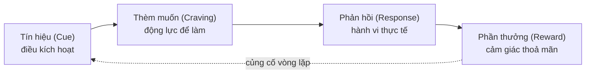
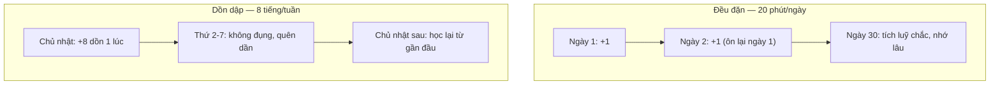

# Thói quen, động lực & tránh burnout

> **Tác giả:** Mr.Rom\
> **Phiên bản:** v1.0.0\
> **Tạo lúc:** 13/06/2026\
> **Cập nhật:** 13/06/2026\
> **Level:** Basic\
> **Tags:** learning, habits, motivation, growth-mindset, burnout, tutorial-hell, soft-skills\
> **Yêu cầu trước:** [Quản lý thông tin & ghi chú](03_managing-information-and-notes.md)

> 🎯 *Bốn bài trước đã cho bạn cách học (active recall, spaced repetition), cách luyện (deliberate practice, dự án) và cách lưu (second brain). Nhưng tất cả kỹ thuật đó vô dụng nếu bạn không **duy trì được nhiều năm** — vì công nghệ đổi liên tục, một dev là người học suốt đời. Bài cuối cụm này dạy phần khó nhất: biến học thành **thói quen** không cần ý chí, hiểu **động lực** để không bỏ cuộc, nuôi **growth mindset** để coi cái khó là cơ hội, và nhận diện sớm **burnout** trước khi nó dập tắt mọi thứ. Đây là bài đóng cụm — nó dán keo cho cả 4 bài còn lại.*

## 🎯 Sau bài này bạn sẽ

- [ ] Hiểu vì sao **thói quen bền hơn ý chí**, và 4 đòn bẩy của Atomic Habits (nhỏ + đều, habit stacking, môi trường, consistency > intensity)
- [ ] Phân biệt **động lực nội tại (intrinsic)** và **ngoại tại (extrinsic)**, biết thiết kế mục tiêu có "lý do" để giữ lửa lâu dài
- [ ] Áp dụng **growth mindset** (Dweck) để coi khó/sai là cơ hội học, và vượt qua **impostor syndrome**
- [ ] Nhận diện và thoát hai cái bẫy ngược nhau: **tutorial hell** (làm hoài không nghỉ đúng) và **burnout** (kiệt sức)
- [ ] Tự thiết kế một **learning routine** bền vững theo tuần và theo dõi tiến bộ bằng tín hiệu thật
- [ ] Đọc được các **dấu hiệu sớm của burnout** trên chính bạn và biết cách phục hồi

---

## Tình huống — tuần thứ ba luôn là tuần bỏ cuộc

Hãy nhìn lại lần gần nhất bạn quyết tâm học một thứ mới.

Tối Chủ nhật, đầy hứng khởi, bạn lập một kế hoạch hoành tráng: "Mỗi ngày học 3 tiếng, hết tháng này phải xong React". Hai ngày đầu bạn cày đúng 3 tiếng, thấy mình thật kỷ luật. Ngày thứ ba mệt, học 1 tiếng. Ngày thứ tư có việc đột xuất, bỏ luôn. Ngày thứ năm thấy hôm qua bỏ rồi nên "thôi tuần sau làm lại từ đầu". Tuần sau không bao giờ tới. Một tháng sau bạn nhìn lại, thấy mình y như tháng trước — và tự trách "chắc mình thiếu ý chí".

Đây không phải lỗi ý chí. Đây là một **lỗi thiết kế**. Bạn đã đặt cược toàn bộ kế hoạch vào một thứ cạn rất nhanh: ý chí. Ý chí giống pin điện thoại — sáng đầy, tối cạn, và stress làm nó tụt nhanh hơn. Ai cũng có những ngày pin yếu. Một hệ thống học chỉ chạy được khi pin đầy thì chắc chắn sẽ sập.

Người học bền không phải người có ý chí thép. Họ là người đã **biến học thành thói quen tự động** — chạy được kể cả ngày pin yếu, vì nó gần như không tốn ý chí. Và họ biết khi nào phải **dừng để nghỉ** trước khi kiệt sức, thay vì cày tới sập.

Bài này cho bạn cả hai mặt: cách dựng một hệ thống học **tự chạy** (thói quen + động lực + mindset), và cách **bảo trì chính mình** để không cháy giữa đường (tránh burnout). Vì một dev cần học cả đời — cuộc đua này là marathon, không phải chạy nước rút.

---

## 1️⃣ Vì sao thói quen bền hơn ý chí

Trước khi nói cách xây thói quen, phải hiểu vì sao ý chí không đáng tin để dựa vào.

**Ý chí (willpower)** là một nguồn lực **hữu hạn và dao động**. Nó cao khi bạn ngủ đủ, ít stress, đang hứng; nó tụt khi bạn mệt, đói, lo lắng, hay vừa cãi nhau với ai đó. Một kế hoạch học đòi hỏi "mỗi ngày phải quyết tâm ngồi vào bàn" tức là mỗi ngày bạn phải **chiến thắng một trận đánh** — và bạn không thể thắng mọi trận, mãi mãi.

**Thói quen (habit)** thì khác hẳn. Nó là một hành vi đã được **tự động hoá** — não chạy nó gần như không tốn năng lượng quyết định, giống cách bạn đánh răng buổi sáng mà không cần "quyết tâm đánh răng". Đó chính là điều bạn muốn: học mà không phải đấu tranh để bắt đầu.

🪞 **Ẩn dụ**: ý chí giống **đẩy một chiếc xe bằng tay** — mệt rã, và chỉ cần buông một giây là xe dừng. Thói quen giống **xe có động cơ chạy theo quán tính** — khởi động khó lúc đầu, nhưng khi đã lăn bánh thì tự đi, bạn chỉ cần giữ vô lăng. Người học giỏi không khoẻ hơn bạn ở khoản đẩy xe; họ chỉ đã chuyển xong từ "đẩy tay" sang "chạy máy" từ lâu.

Khái niệm này khá trừu tượng, nên hình dung qua vòng lặp thói quen (habit loop) sẽ rõ hơn. Mọi thói quen đều chạy theo một vòng 4 bước lặp đi lặp lại, và muốn xây thói quen mới ta phải tác động đúng vào từng mắt xích.

> 📖 *Nhìn vòng lặp này, điểm mấu chốt là: mũi tên đứt nét quay lại từ "Phần thưởng" về "Tín hiệu" — mỗi lần được thưởng, não ghi nhớ tín hiệu mạnh hơn, nên lần sau thấy tín hiệu là tự động muốn làm. Xây thói quen = thiết kế cả 4 mắt xích này cho dễ, thay vì chỉ "cố gắng hơn" ở mắt xích thứ ba (hành vi).*

Đây là lý do quyển *Atomic Habits* (James Clear) gói toàn bộ thành một câu đáng nhớ: **bạn không vươn tới mục tiêu, bạn rơi xuống mức của hệ thống mình có**. Mục tiêu "giỏi React" ai cũng có; thứ phân biệt là hệ thống thói quen hằng ngày đẩy bạn tới đó. Bốn section tiếp theo là bốn đòn bẩy để thiết kế hệ thống đó.

---

## 2️⃣ Bốn đòn bẩy của Atomic Habits

*Atomic Habits* (tạm dịch "Thói quen nguyên tử") — cuốn sách của James Clear — có một ý cốt lõi: thay đổi lớn đến từ những thói quen **nhỏ xíu nhưng đều đặn**, tích luỹ như lãi kép. Dưới đây là bốn đòn bẩy thực tế nhất cho người học code.

### 2.1 Nhỏ tới mức không thể từ chối

Sai lầm kinh điển là đặt thói quen **quá to ngay từ đầu** ("mỗi ngày học 3 tiếng"). Thói quen to tốn nhiều ý chí để khởi động, nên ngày pin yếu là bỏ. Nguyên tắc ngược lại: đặt thói quen **nhỏ tới mức buồn cười, không thể viện cớ từ chối**.

- ❌ "Mỗi ngày học 3 tiếng" → ngày mệt là bỏ, rồi bỏ luôn.
- ✅ "Mỗi ngày mở editor và viết **đúng 1 dòng code**" → ngày nào cũng làm được, kể cả 11h đêm kiệt sức.

Nghe vô lý, nhưng cơ chế tâm lý rất mạnh: thứ khó nhất luôn là **bắt đầu**. Khi đã mở editor và gõ 1 dòng, gần như lần nào bạn cũng làm thêm 20-30 phút vì đã "lăn bánh". Còn những ngày thật sự kiệt, bạn vẫn giữ được **chuỗi không đứt** — và giữ chuỗi mới là thứ quyết định thành bại đường dài (xem 2.4).

> [!TIP]
> Quy tắc "không bao giờ bỏ hai ngày liên tiếp". Bỏ một ngày là chuyện thường, ai cũng có ngày hỏng. Nhưng bỏ hai ngày là bắt đầu của một chuỗi đứt. Nếu hôm qua lỡ, hôm nay chỉ cần làm phiên bản nhỏ nhất (1 dòng code) để chuỗi sống lại.

### 2.2 Habit stacking — gắn thói quen mới vào thói quen cũ

Não rất giỏi giữ những thói quen đã có (uống cà phê sáng, ăn trưa, đi ngủ). **Habit stacking** (xếp chồng thói quen) tận dụng điều đó: gắn thói quen học **mới** ngay sau một thói quen **cũ** đã vững, dùng thói quen cũ làm tín hiệu (cue) cho cái mới.

Công thức một câu: **"Sau khi [thói quen cũ], tôi sẽ [thói quen học mới]."**

- "Sau khi pha xong cà phê sáng, tôi sẽ đọc 1 trang doc."
- "Sau khi ăn trưa xong, tôi sẽ giải 1 bài luyện code nhỏ."
- "Sau khi đóng máy hết giờ làm, tôi sẽ viết lại 1 thứ học được hôm nay vào ghi chú."

🪞 **Ẩn dụ**: habit stacking giống **móc toa tàu mới vào một đoàn tàu đang chạy**. Bạn không cần tự kéo toa mới đi từ con số 0 — chỉ cần móc nó vào đoàn tàu (thói quen cũ) vốn đã có đà, nó được kéo theo. Thói quen cũ càng vững, "đoàn tàu" càng khoẻ để kéo cái mới.

Điều này nối thẳng với bài [quản lý thông tin & ghi chú](03_managing-information-and-notes.md): thói quen "viết lại 1 thứ học được vào second brain" gắn ngay sau giờ làm chính là một habit stack — biến việc ghi chú thành phản xạ thay vì việc-phải-nhớ-làm.

### 2.3 Thiết kế môi trường — để đúng việc thành việc dễ nhất

Ý chí thua môi trường gần như mọi lần. Nếu mở máy lên thấy ngay tab YouTube, bạn sẽ xem YouTube; nếu thấy ngay editor với file đang dở, bạn sẽ code. **Thiết kế môi trường** nghĩa là sắp đặt xung quanh để hành vi tốt thành dễ nhất và hành vi xấu thành khó nhất — thay vì dựa vào "cố cưỡng lại".

Cách áp dụng cho dev:

| Mục tiêu | Làm môi trường dễ cho việc tốt | Làm môi trường khó cho việc xấu |
|---|---|---|
| Ngồi học ngay khi mở máy | Để sẵn editor + file project đang dở mở từ tối qua | Đăng xuất mạng xã hội, gỡ app game khỏi màn hình chính |
| Đọc doc thay vì lướt feed | Mở sẵn tab doc cần đọc, bookmark đầu thanh | Bật chế độ "Focus" chặn site gây xao nhãng trong giờ học |
| Luyện đều mỗi ngày | Đặt một khung giờ + chỗ ngồi cố định cho việc học | Tắt thông báo điện thoại, để điện thoại ở phòng khác |

→ Quy luật chung: **giảm số bước (friction) để bắt đầu việc tốt, tăng số bước để sa đà việc xấu**. Mỗi cú click hay mỗi rào cản nhỏ đều có sức nặng lớn hơn ta tưởng đối với một bộ não đang mệt.

### 2.4 Consistency > intensity — đều đặn thắng dồn dập

Đây là nguyên tắc quan trọng nhất, và là thứ phân biệt người học bền với người "bùng rồi tắt". **Consistency (đều đặn) quan trọng hơn intensity (cường độ).** 20 phút mỗi ngày trong 6 tháng đánh bại 8 tiếng cày một ngày Chủ nhật rồi nghỉ cả tuần — mỗi lần.

Vì sao? Hai lý do kỹ thuật từ chính các bài trước trong cụm:

- **Spaced repetition** (bài [01](01_effective-learning-techniques.md)): trí nhớ chỉ bền khi được nhắc lại **giãn cách qua nhiều ngày**. Học dồn 8 tiếng một hôm là nhồi (cram) — quên gần hết sau một tuần. Học đều mỗi ngày tự tạo ra hiệu ứng spaced repetition.
- **Thói quen**: chỉ hình thành qua **lặp lại đều**, không qua một lần dữ dội. Cày 8 tiếng một hôm không tạo ra thói quen nào cả; nó chỉ làm bạn kiệt sức và sợ học.

Ta hình dung sự khác biệt qua hai đường tích luỹ kiến thức theo thời gian. Đường "đều đặn" tăng chậm mà chắc; đường "dồn dập" nhảy vọt rồi rơi vì quên.

> 📖 *So hai nhánh: nhánh đều đặn mỗi bước đều có "ôn lại ngày trước" nên kiến thức dính lại; nhánh dồn dập cứ học rồi quên, tuần sau lại học gần lại từ đầu — tốn công mà không tiến. Đây là lý do "ít mà đều" gần như luôn thắng "nhiều mà thưa" trong việc học dài hạn.*

> [!IMPORTANT]
> Đừng nhầm "consistency > intensity" thành "không bao giờ cần học sâu". Có những ngày bạn cần một phiên deep work dài để vật lộn với một concept khó (xem [deliberate practice](02_deliberate-practice-and-projects.md)) — điều đó tốt. Ý của nguyên tắc là: **nền tảng phải là đều đặn**, còn những phiên dồn sức là gia vị thêm vào, không phải là toàn bộ chế độ ăn. Một chế độ chỉ-toàn-dồn-dập là công thức của burnout.

---

## 3️⃣ Động lực — intrinsic vs extrinsic

Thói quen lo phần "bắt đầu mỗi ngày". Nhưng để theo đuổi nhiều tháng, bạn cần thứ trả lời câu hỏi sâu hơn: **vì sao mình làm việc này ngay từ đầu?** Đó là động lực (motivation), và có hai loại với tuổi thọ rất khác nhau.

**Động lực ngoại tại (extrinsic motivation)** — đến từ **phần thưởng/áp lực bên ngoài**: lương cao, được khen, deadline, sợ thua kém bạn bè, muốn có cái danh "biết code". Nó mạnh và dễ kích hoạt, nhưng **cạn nhanh** — khi không còn thưởng hay áp lực trước mắt, lửa tắt.

**Động lực nội tại (intrinsic motivation)** — đến từ **bên trong việc học**: tò mò muốn hiểu cách thứ này chạy, niềm vui khi giải xong một bài khó, cảm giác mình đang giỏi lên. Nó nhen chậm hơn nhưng **bền** — vì phần thưởng nằm ngay trong việc làm, không phụ thuộc cái gì bên ngoài.

🪞 **Ẩn dụ**: extrinsic giống **đốt giấy** — bùng to ngay, sáng rực, nhưng tàn trong tích tắc. Intrinsic giống **than củi** — lâu mới bén, nhưng cháy âm ỉ rất lâu và toả nhiệt đều. Người học cả đời sống nhờ "than củi" (tò mò, vui khi hiểu được điều mới); "giấy" (deadline, tiền) chỉ dùng để mồi lửa lúc đầu.

Bảng dưới đối chiếu để bạn nhận ra mình đang chạy bằng loại nào:

| Tiêu chí | Động lực ngoại tại (extrinsic) | Động lực nội tại (intrinsic) |
|---|---|---|
| Nguồn | Bên ngoài (lương, khen, sợ, deadline) | Bên trong (tò mò, vui, tiến bộ) |
| Khởi động | Nhanh, mạnh tức thì | Chậm, nhen dần |
| Tuổi thọ | Ngắn — tắt khi mất phần thưởng | Dài — tự duy trì |
| Rủi ro | Hết thưởng là bỏ; dễ kiệt sức nếu chỉ chạy bằng sợ | Hầu như không có |
| Vai trò | Tốt để **mồi lửa** ban đầu | Tốt để **duy trì** đường dài |

→ Điểm quan trọng: hai loại **không loại trừ nhau**. Cách dùng khôn ngoan là dùng extrinsic để **mồi** (đặt một mục tiêu nghề rõ ràng để bắt đầu), rồi chủ động **chuyển dần sang intrinsic** bằng cách tìm phần thú vị trong chính việc học. Nếu sau nhiều tháng bạn vẫn chỉ chạy bằng "sợ thua kém" hay "phải có việc", đó là tín hiệu sớm của kiệt sức.

### Mục tiêu rõ + lý do "vì sao" (your why)

Động lực nội tại được nuôi bằng một thứ cụ thể: **một lý do "vì sao" đủ sâu**. Người bỏ cuộc giữa chừng thường không phải vì mục tiêu sai, mà vì họ chưa bao giờ làm rõ **vì sao mục tiêu đó quan trọng với riêng họ**.

So sánh hai cách đặt mục tiêu:

| ❌ Mục tiêu trống lý do | ✅ Mục tiêu có "vì sao" |
|---|---|
| "Học backend cho biết" | "Học backend để **tự build được sản phẩm ý tưởng của mình** mà không phải chờ ai" |
| "Học vì ai cũng học" | "Học để **đổi sang công việc mình thấy có ý nghĩa hơn** trong một năm tới" |
| "Phải giỏi React" | "Học React để **làm được phần frontend cho dự án mình tin tưởng**" |

Cách thực hành "nối với why" rất gọn: mỗi lần bắt đầu nản, hỏi liên tiếp **"để làm gì?"** ba lần. "Học SQL — để làm gì? — để dựng được API có dữ liệu thật — để làm gì? — để build sản phẩm của mình — để làm gì? — để sống bằng thứ mình tạo ra." Tới tầng cuối thường là một why đủ mạnh để kéo bạn qua ngày nản.

> [!TIP]
> Viết "vì sao" của bạn ra một câu, dán nơi học (đầu file ghi chú, sticky note trên màn hình). Động lực không phải thứ tự nhiên có mỗi sáng — nó cần được **nhắc lại**. Đây cũng là một dạng habit cue: thấy câu why là nhớ ra mình đang đi đâu.

---

## 4️⃣ Growth mindset — coi khó và sai là cơ hội học

Bạn có thể có thói quen tốt và động lực rõ, nhưng nếu **cách bạn diễn giải thất bại** sai lệch, bạn vẫn sẽ bỏ cuộc khi gặp cái khó. Đây là nơi nghiên cứu của nhà tâm lý học **Carol Dweck** về *mindset* (tư duy) trở nên cực kỳ thực tế cho dev.

Dweck phân ra hai kiểu tư duy:

- **Fixed mindset (tư duy cố định)** — tin rằng năng lực là **bẩm sinh, cố định**: "mình không có đầu óc lập trình", "đứa kia giỏi sẵn rồi". Với người này, một bài khó hay một lỗi là **bằng chứng mình kém** → nên họ né cái khó, giấu lỗi, bỏ cuộc sớm.
- **Growth mindset (tư duy phát triển)** — tin rằng năng lực **lớn lên qua luyện tập**: "mình **chưa** làm được" (chú ý chữ *chưa*). Với người này, một bài khó hay một lỗi là **dữ liệu để học** → nên họ lao vào cái khó, mổ xẻ lỗi, kiên trì.

🪞 **Ẩn dụ**: fixed mindset coi não như **một chiếc bình đã đổ đầy sẵn từ lúc sinh** — đầy bao nhiêu là cố định, học chỉ để khoe phần đã có. Growth mindset coi não như **một cơ bắp** — càng tập (nhất là tập những bài nặng, đau) càng to ra. Với cơ bắp, "đau khi tập" không phải dấu hiệu mình yếu — nó là chính cơ chế cơ lớn lên.

Sự khác biệt thực tế nằm ở phản ứng trước **cùng một tình huống**:

| Tình huống | Fixed mindset phản ứng | Growth mindset phản ứng |
|---|---|---|
| Gặp bài quá khó | "Mình không hợp với cái này" → bỏ | "Đây đúng là chỗ mình sẽ học được nhiều nhất" → lao vào |
| Code lỗi, bug khó | "Mình dở quá" → nản, giấu | "Bug này dạy mình gì?" → đọc kỹ, ghi lại |
| Thấy người khác giỏi hơn | Thấy bị đe doạ, ganh tị | "Họ làm được nghĩa là học được — học cách họ làm" |
| Bị chê / review gắt | Tự ái, phòng thủ | "Feedback này giúp mình lên" → cảm ơn, sửa |

→ Chìa khoá ngôn ngữ: thay "mình không làm được" bằng "mình **chưa** làm được". Một chữ *chưa* (yet) chuyển một câu kết án vĩnh viễn thành một câu mô tả trạng thái tạm thời. Đây không phải tự huyễn — nó đúng về mặt khoa học: kỹ năng lập trình của ai cũng được xây qua luyện tập, không ai sinh ra biết code.

### Vượt impostor syndrome

Một biểu hiện rất phổ biến của fixed mindset ở dev là **impostor syndrome** (hội chứng kẻ mạo danh) — cảm giác dai dẳng rằng "mình không thật sự giỏi, chỉ may mắn, sớm muộn người ta sẽ phát hiện mình là đồ giả". Gần như **mọi dev**, kể cả những người rất giỏi, đều trải qua cảm giác này — chính vì ngành này quá rộng và đổi liên tục, lúc nào cũng có thứ mình chưa biết.

Vài cách hoá giải dựa trên growth mindset:

- **Đổi tiêu chuẩn so sánh**: đừng so mình-hôm-nay với người-giỏi-nhất; so mình-hôm-nay với mình-sáu-tháng-trước. Tiến bộ là thật, dù còn xa người khác.
- **Hiểu rằng "không biết hết" là bình thường**: không ai biết hết cả ngành. Senior giỏi không phải người biết mọi thứ — họ là người **biết cách tìm ra thứ chưa biết nhanh**. (Đây cũng là lý do cả cụm này dạy *cách học*, không dạy "biết tất cả".)
- **Ghi lại bằng chứng tiến bộ**: dùng second brain ([bài 03](03_managing-information-and-notes.md)) lưu lại những thứ "tháng trước mình không làm được mà giờ làm được". Khi impostor syndrome ập tới, đọc lại — nó là đối trọng cụ thể với cảm giác "mình chả biết gì".

> [!NOTE]
> Impostor syndrome và growth mindset là hai mặt của một đồng xu. Impostor syndrome nói "mình chưa biết → mình là đồ giả" (fixed). Growth mindset nói "mình chưa biết → mình đang ở đúng chỗ để học" (growth). Cùng một sự thật ("còn nhiều thứ chưa biết"), hai cách diễn giải dẫn tới hai số phận khác nhau.

---

## 5️⃣ Hai cái bẫy ngược nhau — tutorial hell & burnout

Khi học dài hạn, có hai cái bẫy nằm ở **hai cực đối nghịch**: một bên là làm sai cách (tutorial hell), một bên là làm quá sức (burnout). Hiểu cả hai giúp bạn giữ được vùng an toàn ở giữa.

### 5.1 Tutorial hell — bận rộn mà không tiến

**Tutorial hell** (địa ngục tutorial) — vòng lặp xem hết khoá này tới khoá khác mà không bao giờ tự build được gì. Bài [learning roadmap](../../../career-path/lessons/01_basic/01_skills-and-learning-roadmap.md) ở cụm career-path đã mổ kỹ cái bẫy này; ở đây ta nhìn nó dưới góc độ **động lực và thói quen**.

Tutorial hell nguy hiểm về mặt động lực vì nó cho **cảm giác tiến bộ giả**. Xem hết một video, gật gù "à hiểu rồi", não tiết ra cảm giác thành tựu — nhưng tay chưa từng tự gõ gì. Cảm giác giả này êm ái nên gây nghiện, trong khi việc tự build thì khó chịu (gặp lỗi, bí, nản). Não tự nhiên chọn cái êm.

Cách thoát, gói trong một nguyên tắc thói quen: **mỗi giờ xem tutorial phải đi kèm gấp đôi thời gian tự build cái khác đi**. Biến "build project" thành thói quen có cue rõ (vd: "sau khi xem xong 1 phần tutorial, tôi tắt video và tự làm lại không nhìn") — đúng tinh thần habit stacking ở §2.2.

### 5.2 Burnout — kiệt sức vì cày quá sức quá lâu

Ở cực ngược lại là **burnout** (kiệt sức) — trạng thái cạn kiệt cả thể chất, cảm xúc lẫn động lực sau khi gắng sức quá lâu mà không phục hồi đủ. Đây không phải "mệt một hôm" — đó là một trạng thái sâu, kéo dài, và rất dễ gặp ở người học chăm chỉ nhất (nghịch lý: người lười không bao giờ burnout).

Tổ chức Y tế Thế giới (WHO) mô tả burnout qua ba dấu hiệu lõi, rất hữu ích để tự soi:

- **Kiệt sức (exhaustion)** — lúc nào cũng cạn năng lượng, ngủ dậy vẫn mệt.
- **Hoài nghi / xa cách (cynicism)** — mất hứng thú với thứ trước đây mình thích, thấy việc học/việc làm vô nghĩa, cáu kỉnh.
- **Giảm hiệu quả (reduced efficacy)** — cảm thấy mình làm gì cũng kém đi, không còn tin vào khả năng của mình.

🪞 **Ẩn dụ**: học mà không nghỉ giống **chạy động cơ xe không bao giờ tắt máy và không thay dầu**. Một thời gian thì máy nóng, công suất tụt, rồi cháy. Nghỉ ngơi không phải "lười" hay "phản bội mục tiêu" — nó là **thay dầu và để máy nguội**, là một phần bắt buộc của việc chạy bền. Bạn không bỏ bê chiếc xe khi tắt máy qua đêm; bạn đang bảo dưỡng nó.

#### Dấu hiệu sớm của burnout — bắt trước khi quá muộn

Burnout hiếm khi ập đến đột ngột; nó bò tới qua nhiều tín hiệu nhỏ. Nhận ra sớm thì chỉ cần nghỉ ngơi là phục hồi; để muộn thì cần dừng hẳn rất lâu. Các tín hiệu sớm đáng chú ý:

| Nhóm | Dấu hiệu sớm |
|---|---|
| Năng lượng | Mệt dai dẳng dù ngủ đủ; sáng dậy đã thấy nặng nề |
| Cảm xúc | Mất hứng với thứ từng thích; cáu kỉnh, dễ nản; "chán không muốn mở máy" |
| Nhận thức | Khó tập trung, đọc một đoạn phải đọc lại nhiều lần; hay quên |
| Hành vi | Trì hoãn việc trước đây làm dễ; học mãi không vào dù ngồi lâu |
| Thể chất | Đau đầu, mất ngủ, hay ốm vặt |

> [!WARNING]
> Một niềm tin nguy hiểm cần gỡ bỏ: **"nghỉ ngơi là lãng phí thời gian học"**. Sự thật ngược lại — não củng cố trí nhớ và kết nối ý tưởng **trong lúc nghỉ và ngủ**, không phải lúc cày (đây chính là cơ chế "diffuse mode" ở [bài 00](00_how-learning-works.md)). Học 5 ngày rồi nghỉ ngơi tử tế cho ra kết quả tốt hơn cày 7 ngày tới kiệt rồi sập cả tuần sau. Nghỉ là một phần của việc học, không phải kẻ thù của nó.

#### Dựng ranh giới và phục hồi

Phòng burnout chủ yếu là việc **dựng ranh giới (boundaries)** trước, không phải chữa cháy sau:

- **Ranh giới thời gian**: định một giờ dừng học cố định mỗi ngày và **tôn trọng nó**. "Học tới khi nào mệt thì nghỉ" luôn dẫn tới học tới khi kiệt.
- **Nghỉ trong phiên**: dùng các phiên có nghỉ xen kẽ (vd kỹ thuật Pomodoro — làm một khoảng rồi nghỉ ngắn) thay vì ngồi liền tù tì hàng giờ. Não tập trung tốt theo từng đợt, không phải một mạch dài.
- **Ngày nghỉ thật**: có ít nhất một ngày trong tuần **không học gì** mà không thấy tội lỗi. Đó là ngày để máy nguội.
- **Tách khỏi màn hình**: phục hồi tốt nhất thường ở ngoài màn hình — đi bộ, ngủ đủ, gặp người, vận động. Não cần khoảng lặng để diffuse mode chạy.

Nếu đã lỡ chạm burnout (không chỉ dấu hiệu sớm mà đã kiệt thật), cách xử lý khác: **dừng hẳn việc cày một thời gian** đủ dài để phục hồi, hạ kỳ vọng xuống mức nhỏ nhất (về lại "1 dòng code mỗi ngày" ở §2.1 để giữ chuỗi mà không áp lực), và nếu kéo dài thì tìm hỗ trợ thật sự. Cố "vượt qua burnout bằng ý chí" thường làm nó nặng hơn.

---

## 6️⃣ Dựng learning routine bền vững & theo dõi tiến bộ

Giờ ghép tất cả lại thành một thứ chạy được: một **learning routine** (lịch trình học) bền vững, đủ nhẹ để theo cả năm, có nghỉ ngơi xây sẵn vào.

Một routine tốt cho người học suốt đời có bốn đặc tính, rút ra từ năm section trên: **nhỏ và đều** (§2), **gắn vào lịch sẵn có** (habit stacking §2.2), **có ranh giới nghỉ** (§5.2), và **đo bằng tín hiệu thật** (dưới đây).

### Khung routine một tuần mẫu

Đây là một khung **mẫu để bạn sửa**, không phải luật. Điểm cần giữ là tỷ lệ: phần lớn là phiên ngắn đều đặn, có một phiên sâu, và **có ngày nghỉ nằm trong kế hoạch** ngay từ đầu.

| Thứ | Nội dung | Thời lượng (tự điều chỉnh) |
|---|---|---|
| Thứ 2 | Học concept mới (input) + ghi chú vào second brain | Phiên ngắn |
| Thứ 3 | Tự build / luyện áp dụng concept Thứ 2 (output) | Phiên ngắn |
| Thứ 4 | Phiên sâu (deep work) cho một bài/feature khó | Phiên dài hơn |
| Thứ 5 | Ôn lại (spaced repetition) thứ học đầu tuần + build tiếp | Phiên ngắn |
| Thứ 6 | Học công khai: viết lại 1 thứ đã học / cập nhật project | Phiên ngắn |
| Thứ 7 | Tự kiểm tra tuần (3 câu, xem dưới) + lên kế hoạch tuần sau | Ngắn |
| Chủ nhật | **Nghỉ thật** — không học, để máy nguội | Nghỉ |

→ Để ý: ngày nghỉ (Chủ nhật) được **viết thẳng vào lịch** như một phần chính thức, không phải "nếu rảnh thì nghỉ". Và mỗi ngày đều có cue rõ (gắn vào giờ cố định) để thành thói quen, không phải "khi nào nhớ thì học".

### Theo dõi tiến bộ — đo bằng tín hiệu thật, không bằng cảm giác

Bạn cần biết routine có hiệu quả không — nhưng phải đo đúng thứ. Cảm giác "đã hiểu" sau khi đọc là tín hiệu **giả**. Tín hiệu **thật** là thứ bạn **tạo ra được**.

| Tín hiệu GIẢ (đừng tin) | Tín hiệu THẬT (đáng tin) |
|---|---|
| "Tuần này mình học chăm lắm, ngồi nhiều giờ" | Tuần này mình tự build được gì mà tuần trước chưa làm được |
| "Đọc xong, thấy hợp lý, gật gù" | Giải thích lại được concept cho người khác (hoặc viết ra) |
| "Đã xem hết khoá học" | Debug được lỗi mới chưa từng gặp bằng kiến thức đã học |
| "Cảm thấy mình tiến bộ" | Có bằng chứng cụ thể trong second brain: "trước không làm được X, giờ làm được" |

Thước đo gọn để chạy mỗi cuối tuần (Thứ 7 trong routine) — **kiểm tra 3 câu**:

1. Tuần này mình **tự tạo ra** (build / viết / giải) được gì mà tuần trước chưa làm được?
2. Có concept nào mình **giải thích lại được** cho người khác không?
3. Về năng lượng: tuần này mình thấy hào hứng hay đang có dấu hiệu sớm của burnout (§5.2)?

> [!NOTE]
> Câu thứ ba quan trọng ngang hai câu đầu. Theo dõi tiến bộ **kiến thức** mà bỏ qua theo dõi **năng lượng** là cách người chăm chỉ nhất tự lái mình vào burnout. Một routine bền theo dõi cả hai: bạn học được gì, **và** bạn còn khoẻ để học tiếp không.

---

## 💡 Cạm bẫy thường gặp & Best practice

### ❌ Cạm bẫy: dựa vào ý chí thay vì hệ thống

- **Triệu chứng**: lập kế hoạch học hoành tráng mỗi đầu tuần/đầu tháng, cày được vài ngày rồi tắt; tự trách "mình thiếu kỷ luật" rồi lại lập kế hoạch mới y hệt.
- **Nguyên nhân**: đặt cược toàn bộ kế hoạch vào ý chí — một nguồn lực cạn nhanh và dao động theo ngày. Mỗi ngày phải "quyết tâm" là mỗi ngày một trận đánh không thể thắng mãi.
- **Cách tránh**: chuyển từ ý chí sang **hệ thống thói quen** — đặt thói quen nhỏ tới mức không từ chối được (§2.1), gắn vào lịch sẵn có (§2.2), thiết kế môi trường (§2.3), giữ chuỗi đều thay vì cày dồn (§2.4).

### ❌ Cạm bẫy: cày tới kiệt vì sợ "nghỉ là tụt lại"

- **Triệu chứng**: học liên tục không ngày nghỉ, thấy tội lỗi mỗi khi nghỉ; dần mất hứng, khó tập trung, ngủ dậy vẫn mệt, "chán không muốn mở máy".
- **Nguyên nhân**: tin rằng nghỉ ngơi là lãng phí thời gian học, và nhiều giờ = nhiều tiến bộ.
- **Cách tránh**: hiểu nghỉ ngơi là **một phần của việc học** (não củng cố trí nhớ lúc nghỉ và ngủ). Dựng ranh giới trước (giờ dừng cố định, ngày nghỉ nằm trong lịch), và đọc dấu hiệu sớm của burnout (§5.2) để dừng kịp.

### ✅ Best practice: nhỏ + đều, giữ chuỗi không đứt

- **Vì sao**: thứ khó nhất là bắt đầu; thói quen siêu nhỏ vượt qua rào cản đó kể cả ngày kiệt sức, và đều đặn tạo ra cả thói quen lẫn hiệu ứng spaced repetition mà cày dồn không có.
- **Cách áp dụng**: đặt phiên bản nhỏ nhất ("1 dòng code mỗi ngày") làm sàn không bao giờ bỏ; áp dụng quy tắc "không bỏ hai ngày liên tiếp"; ưu tiên consistency hơn intensity (§2.4).

### ✅ Best practice: nối việc học với một "vì sao" đủ sâu

- **Vì sao**: động lực ngoại tại (deadline, tiền, sợ thua) cạn nhanh; chỉ một lý do nội tại đủ sâu mới kéo bạn qua những ngày nản. Người bỏ cuộc thường chưa từng làm rõ vì sao mục tiêu quan trọng với riêng họ.
- **Cách áp dụng**: hỏi "để làm gì?" ba lần liên tiếp tới khi chạm một why thật; viết nó ra một câu và dán ở nơi học để nhắc lại mỗi khi nản.

---

## 🧠 Tự kiểm tra (Self-check)

**Q1.** Bạn của bạn nói: "Mình thiếu ý chí quá, cứ quyết tâm học rồi vài ngày là bỏ." Dựa vào bài, bạn khuyên bạn ấy đổi cách tiếp cận thế nào?

💡 Đáp án

Vấn đề gần như chắc chắn không phải thiếu ý chí mà là **lỗi thiết kế** — dựa vào ý chí (nguồn lực cạn nhanh, dao động) thay vì hệ thống thói quen. Khuyên bạn ấy: (1) đặt thói quen **nhỏ tới mức không thể từ chối** ("1 dòng code mỗi ngày" thay vì "3 tiếng mỗi ngày") để vượt rào cản bắt đầu kể cả ngày mệt; (2) **habit stacking** — gắn việc học ngay sau một thói quen cũ đã vững (sau cà phê sáng); (3) **thiết kế môi trường** để việc học thành dễ nhất; (4) giữ **consistency** (đều) thay vì intensity (dồn), áp dụng quy tắc "không bỏ hai ngày liên tiếp". Đổi từ "đẩy xe bằng tay" sang "chạy máy theo quán tính".

**Q2.** Phân biệt động lực nội tại và ngoại tại. Vì sao chỉ chạy bằng động lực ngoại tại lâu dài lại nguy hiểm, và cách dùng khôn ngoan là gì?

💡 Đáp án

**Ngoại tại (extrinsic)** đến từ bên ngoài (lương, khen, deadline, sợ thua) — bùng nhanh nhưng cạn nhanh, tắt khi mất phần thưởng. **Nội tại (intrinsic)** đến từ bên trong việc học (tò mò, vui khi hiểu, cảm giác tiến bộ) — nhen chậm nhưng bền vì phần thưởng nằm ngay trong việc làm. Chỉ chạy bằng ngoại tại lâu dài nguy hiểm vì lửa tắt khi hết thưởng/áp lực, và chạy bằng "sợ" kéo dài dễ dẫn tới kiệt sức. Cách khôn ngoan: dùng ngoại tại để **mồi lửa** ban đầu (mục tiêu nghề rõ ràng), rồi chủ động **chuyển sang nội tại** bằng cách tìm phần thú vị trong chính việc học. (Ẩn dụ: đốt giấy mồi cho than củi.)

**Q3.** Một bạn mới học gặp một bug khó và nghĩ "chắc mình không có đầu óc lập trình". Đây là mindset nào? Một người growth mindset sẽ diễn giải cùng tình huống đó ra sao, và một thay đổi ngôn ngữ nhỏ nào giúp chuyển?

💡 Đáp án

Đây là **fixed mindset** — tin năng lực là bẩm sinh cố định, nên coi bug khó là bằng chứng "mình kém" và muốn bỏ. **Growth mindset** diễn giải cùng bug đó là **dữ liệu để học**: "bug này dạy mình gì?" — đào sâu, ghi lại, kiên trì, vì tin năng lực lớn lên qua luyện tập (não như cơ bắp, càng tập bài nặng càng to). Thay đổi ngôn ngữ nhỏ mà mạnh: thay "mình **không** làm được" bằng "mình **chưa** làm được" — chữ *chưa* chuyển một câu kết án vĩnh viễn thành trạng thái tạm thời, và đúng về mặt khoa học vì không ai sinh ra biết code.

**Q4.** Tại sao "nghỉ ngơi là lãng phí thời gian học" là một niềm tin sai và nguy hiểm? Liệt kê ít nhất ba dấu hiệu sớm của burnout.

💡 Đáp án

Niềm tin đó sai vì **não củng cố trí nhớ và kết nối ý tưởng trong lúc nghỉ và ngủ** (diffuse mode), không phải lúc cày liên tục — học 5 ngày rồi nghỉ tử tế thường tốt hơn cày 7 ngày tới kiệt rồi sập cả tuần. Nó nguy hiểm vì dẫn người chăm chỉ nhất vào burnout (người lười không bao giờ burnout). Dấu hiệu sớm (kể ba bất kỳ): mệt dai dẳng dù ngủ đủ; mất hứng với thứ từng thích / cáu kỉnh / "chán không muốn mở máy"; khó tập trung, đọc phải đọc lại; trì hoãn việc trước đây làm dễ; đau đầu / mất ngủ / hay ốm vặt. Burnout WHO mô tả qua ba lõi: kiệt sức, hoài nghi/xa cách, giảm hiệu quả.

**Q5.** Cuối tuần bạn thấy "mình học chăm lắm, ngồi nhiều giờ và xem xong cả khoá". Vì sao đây chưa phải bằng chứng tiến bộ đáng tin, và bạn nên đo bằng tín hiệu nào?

💡 Đáp án

"Ngồi nhiều giờ" và "xem xong khoá" là **tín hiệu giả** — chúng đo thời gian bỏ ra và cảm giác "đã hiểu", không đo năng lực thật (đây cũng là cảm giác tiến bộ giả của tutorial hell). Tín hiệu **thật** là thứ bạn **tạo ra được**: tự build được gì mà tuần trước chưa làm được; giải thích lại được concept cho người khác; debug được lỗi mới chưa từng gặp; có bằng chứng cụ thể trong second brain "trước không làm được X, giờ làm được". Nên chạy "kiểm tra 3 câu" mỗi cuối tuần — và câu thứ ba phải về **năng lượng** (còn khoẻ để học tiếp không), vì theo dõi kiến thức mà bỏ qua năng lượng là cách tự lái vào burnout.

---

## ⚡ Tra cứu nhanh (Cheatsheet)

**Bốn đòn bẩy Atomic Habits:**

| Đòn bẩy | Một câu áp dụng |
|---|---|
| Nhỏ tới mức không từ chối được | "1 dòng code mỗi ngày" thay vì "3 tiếng mỗi ngày" |
| Habit stacking | "Sau khi [thói quen cũ], tôi sẽ [thói quen học mới]" |
| Thiết kế môi trường | Giảm bước cho việc tốt, tăng bước cho việc xấu |
| Consistency > intensity | 20 phút mỗi ngày thắng 8 tiếng một hôm rồi nghỉ cả tuần |

**Động lực — mồi bằng extrinsic, duy trì bằng intrinsic:**

- Hỏi "để làm gì?" **ba lần** liên tiếp tới khi chạm một "vì sao" đủ sâu.
- Viết "vì sao" ra một câu, dán nơi học.

**Growth mindset — đổi một chữ:**

- "Mình **không** làm được" → "Mình **chưa** làm được".
- Bug/khó = dữ liệu để học, không phải bằng chứng mình kém.
- So mình-hôm-nay với mình-6-tháng-trước, không so với người giỏi nhất.

**Tín hiệu sớm của burnout (dừng khi thấy):**

- [ ] Mệt dai dẳng dù ngủ đủ
- [ ] Mất hứng với thứ từng thích / "chán không muốn mở máy"
- [ ] Khó tập trung, đọc phải đọc lại nhiều lần
- [ ] Trì hoãn việc trước đây làm dễ
- [ ] Đau đầu, mất ngủ, hay ốm vặt

**Checklist routine tuần bền vững:**

- [ ] Có giờ học cố định mỗi ngày (cue rõ, gắn vào lịch sẵn có)
- [ ] Phiên bản nhỏ nhất ("1 dòng code") làm sàn không bao giờ bỏ
- [ ] Có xen kẽ: input (học mới) + output (tự build) + ôn lại (spaced)
- [ ] Có một phiên sâu (deep work) trong tuần
- [ ] **Ngày nghỉ nằm thẳng trong lịch** — nghỉ không thấy tội lỗi
- [ ] Cuối tuần chạy "kiểm tra 3 câu" (build được gì / giải thích được không / năng lượng ra sao)

**Kiểm tra 3 câu mỗi cuối tuần:**

1. Tự **tạo ra** được gì mà tuần trước chưa làm được?
2. **Giải thích lại** được concept nào cho người khác không?
3. **Năng lượng**: đang hào hứng hay có dấu hiệu sớm của burnout?

---

## 📚 Từ Điển Thuật Ngữ (Glossary)

| EN | VN | Giải thích |
|---|---|---|
| Habit | Thói quen | Hành vi đã tự động hoá, chạy gần như không tốn ý chí |
| Willpower | Ý chí | Nguồn lực hữu hạn, dao động theo ngày; không nên dựa hẳn vào |
| Atomic Habits | Thói quen nguyên tử | Sách của James Clear: thay đổi lớn từ thói quen nhỏ + đều |
| Habit stacking | Xếp chồng thói quen | Gắn thói quen mới ngay sau một thói quen cũ đã vững |
| Habit loop | Vòng lặp thói quen | Chu trình 4 bước: cue → craving → response → reward |
| Cue | Tín hiệu | Điều kích hoạt một thói quen |
| Consistency | Đều đặn | Làm thường xuyên, ổn định qua thời gian |
| Intensity | Cường độ | Mức độ dồn sức trong một lần |
| Intrinsic motivation | Động lực nội tại | Động lực từ bên trong việc làm (tò mò, vui, tiến bộ) — bền |
| Extrinsic motivation | Động lực ngoại tại | Động lực từ phần thưởng/áp lực bên ngoài — cạn nhanh |
| Growth mindset | Tư duy phát triển | Tin năng lực lớn lên qua luyện tập; coi khó/sai là cơ hội học |
| Fixed mindset | Tư duy cố định | Tin năng lực bẩm sinh cố định; né khó, sợ sai |
| Impostor syndrome | Hội chứng kẻ mạo danh | Cảm giác dai dẳng "mình không thật giỏi, chỉ may mắn" |
| Tutorial hell | Địa ngục tutorial | Vòng lặp xem tutorial mãi mà không bao giờ tự build |
| Burnout | Kiệt sức | Cạn kiệt thể chất/cảm xúc/động lực vì gắng sức quá lâu không phục hồi |
| Boundaries | Ranh giới | Giới hạn tự đặt (giờ dừng, ngày nghỉ) để bảo vệ năng lượng |
| Deep work | Làm việc sâu | Phiên tập trung cao, không gián đoạn, cho việc khó |
| Diffuse mode | Chế độ khuếch tán | Trạng thái não thư giãn, kết nối ý tưởng — chạy khi nghỉ/ngủ |

---

## 🔗 Liên kết & Tài nguyên

⬅️ **Bài trước:** [Quản lý thông tin & ghi chú — Second brain cho dev](03_managing-information-and-notes.md)\
↑ **Về cụm:** [learning-how-to-learn — README](../../README.md)

### 🧭 Định hướng lộ trình học

- [Học diễn ra thế nào trong não — Nền tảng để học tốt hơn](00_how-learning-works.md) — focused vs diffuse mode, nền cho lý do "nghỉ ngơi là một phần của học"
- [Kỹ năng & Lộ trình học cá nhân — Thoát khỏi tutorial hell](../../../career-path/lessons/01_basic/01_skills-and-learning-roadmap.md) — đào sâu tutorial hell và cách lập learning roadmap đo lường được

### 🧩 Các chủ đề có thể bạn quan tâm

- [Kỹ thuật học hiệu quả — Active recall, spaced repetition](01_effective-learning-techniques.md) — vì sao "đều đặn" tự tạo hiệu ứng spaced repetition
- [Luyện tập có chủ đích & học qua dự án](02_deliberate-practice-and-projects.md) — phiên deep work và build project trong routine tuần
- [Quản lý thông tin & ghi chú — Second brain cho dev](03_managing-information-and-notes.md) — nơi lưu bằng chứng tiến bộ để chống impostor syndrome

### 🌐 Tài nguyên tham khảo khác

- [Atomic Habits (James Clear)](https://jamesclear.com/atomic-habits) — sách nền tảng về xây thói quen nhỏ + đều
- [Carol Dweck — Mindset](https://www.mindsetonline.com/) — nghiên cứu gốc về growth vs fixed mindset
- [WHO — Burn-out an "occupational phenomenon"](https://www.who.int/news/item/28-05-2019-burn-out-an-occupational-phenomenon-international-classification-of-diseases) — định nghĩa chính thức ba dấu hiệu lõi của burnout

---

## 📌 Nhật ký thay đổi (Changelog)

- **v1.0.0 (13/06/2026)** — Bản đầu tiên, đóng cụm learning-how-to-learn. Tình huống mở bài "tuần thứ ba luôn là tuần bỏ cuộc" + vì sao thói quen bền hơn ý chí (sơ đồ habit loop 4 bước) + bốn đòn bẩy Atomic Habits (nhỏ + đều, habit stacking, môi trường, consistency > intensity có sơ đồ đều-vs-dồn) + động lực intrinsic vs extrinsic (bảng đối chiếu + kỹ thuật "hỏi để làm gì 3 lần") + growth mindset Dweck (bảng phản ứng fixed vs growth, vượt impostor syndrome) + hai cái bẫy ngược tutorial hell & burnout (ba dấu hiệu lõi WHO, bảng dấu hiệu sớm, dựng ranh giới + phục hồi) + dựng learning routine tuần mẫu có ngày nghỉ + theo dõi tiến bộ bằng tín hiệu thật (kiểm tra 3 câu) + các ẩn dụ đẩy-xe-vs-chạy-máy / móc-toa-tàu / đốt-giấy-vs-than-củi / não-như-cơ-bắp / chạy-máy-không-thay-dầu + 2 cạm bẫy + 2 best practice + 5 self-check + cheatsheet (4 checklist) + glossary 18 thuật ngữ.
