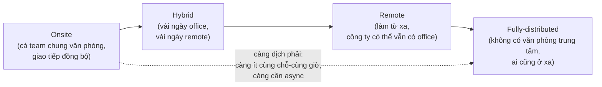

# Làm việc từ xa là gì? — Remote, hybrid & async-first

> **Tác giả:** Mr.Rom\
> **Phiên bản:** v1.0.0\
> **Tạo lúc:** 13/06/2026\
> **Cập nhật:** 13/06/2026\
> **Level:** Basic\
> **Tags:** career, remote-work, hybrid, async-first, distributed-team, soft-skills, work-from-home\
> **Yêu cầu trước:** (không bắt buộc)

> 🎯 *Bạn nghe "remote", "hybrid", "work from home", "distributed team" suốt — nhưng chúng khác nhau ra sao, và vì sao ngành dev lại dẫn đầu xu hướng này? Bài mở đầu cụm này dựng cho bạn bức tranh nền: bốn mô hình từ onsite tới fully-distributed, vì sao remote hợp với dev, **async-first** là gì và vì sao nó là xương sống của remote, được/mất cho cả bạn lẫn công ty, và những ngộ nhận tai hại nhất ("remote = luôn rảnh", "phải online 100% thời gian"). Nắm xong bài này, bốn bài sau (setup, cộng tác, năng suất, sức khoẻ tinh thần) sẽ vào đúng chỗ.*

## 🎯 Sau bài này bạn sẽ

- [ ] Phân biệt rõ bốn mô hình làm việc: **onsite / hybrid / remote / fully-distributed**
- [ ] Giải thích được vì sao remote phổ biến với dev (talent toàn cầu, linh hoạt, công việc số hoá được)
- [ ] Hiểu **async-first culture** là gì và vì sao nó là xương sống của remote (nhất là team đa múi giờ)
- [ ] Cân được pros/cons của remote cho **cả cá nhân lẫn công ty** — không tô hồng, không bôi đen
- [ ] Phân biệt **distributed team** với **co-located team** và hệ quả của mỗi kiểu
- [ ] Gỡ hai ngộ nhận tai hại: "remote = luôn rảnh" và "phải online 100% thời gian" — đều sai

---

## Tình huống — cùng một công việc, ba người ở ba nơi

Hãy hình dung một buổi sáng thứ Ba của một team sản phẩm bình thường.

Một bạn dev mở laptop ở bàn bếp căn hộ tại Đà Nẵng, pha cà phê, bắt đầu đọc các comment code review để lại từ tối qua. Một đồng nghiệp của bạn ấy lúc này đang ngủ — vì đang ở múi giờ lệch bảy tiếng tại châu Âu, và sẽ chỉ bắt đầu ngày làm việc khi Đà Nẵng đã gần trưa. Một bạn thứ ba thì đang trên tàu điện tới văn phòng công ty, vì hôm nay là ngày bạn ấy chọn lên office gặp team trực tiếp.

Ba người, cùng một team, cùng một sản phẩm — nhưng ba **mô hình làm việc** khác nhau, và quan trọng hơn: họ **gần như không bao giờ online cùng lúc**. Vậy làm sao công việc vẫn chạy? Làm sao bạn dev ở Đà Nẵng "bàn giao" việc cho đồng nghiệp châu Âu khi người kia còn đang ngủ? Làm sao một quyết định kỹ thuật được chốt khi cả team không thể họp cùng giờ?

Câu trả lời cho tất cả những câu hỏi đó nằm gọn trong vài khái niệm: **remote**, **hybrid**, **distributed**, và đặc biệt là **async-first**. Đây không phải mấy từ thời thượng để ghi vào tin tuyển dụng — chúng mô tả những cách tổ chức công việc rất khác nhau, mỗi cách có cái giá và cái lợi riêng. Hiểu chúng là điều kiện đầu tiên để làm việc từ xa cho ra hồn, thay vì chỉ "ngồi nhà mở laptop mà lạc lõng".

Bài này dựng nền cho bạn: làm rõ từng mô hình, vì sao dev là ngành đi đầu, và vì sao "viết tốt khi không ai online" lại là kỹ năng sống còn của thời đại này.

---

## 1️⃣ Bốn mô hình làm việc — từ onsite tới fully-distributed

Trước khi nói remote tốt hay xấu, phải định nghĩa cho rõ "remote" thật ra là gì — vì nó không phải một thứ duy nhất, mà là một **phổ** (spectrum) trải từ "tất cả ngồi chung văn phòng" tới "không có văn phòng nào cả".

Hãy đi qua bốn mốc chính trên phổ đó:

- **Onsite (làm tại văn phòng)** — cả team đến cùng một văn phòng vật lý, làm việc mặt đối mặt. Đây là mô hình truyền thống: muốn hỏi ai thì quay sang bàn bên cạnh, họp là vào phòng họp. Giao tiếp chủ yếu là **đồng bộ** (sync) — nói trực tiếp, ngay lúc đó.
- **Hybrid (kết hợp)** — pha trộn giữa onsite và remote. Phổ biến là "vài ngày lên văn phòng, vài ngày làm nhà" (ví dụ 3 ngày office + 2 ngày remote mỗi tuần). Một số nơi cho nhân viên **tự chọn** ngày lên office, một số nơi quy định cứng ngày nào cả team phải có mặt.
- **Remote (làm từ xa)** — nhân viên làm việc từ bất cứ đâu không phải văn phòng công ty: ở nhà, ở quán cà phê, ở không gian làm việc chung (coworking). Công ty **vẫn có thể có một văn phòng**, nhưng việc lên đó không bắt buộc, và phần lớn công việc diễn ra qua các công cụ số.
- **Fully-distributed (phân tán hoàn toàn)** — một bước xa hơn remote: công ty **không có văn phòng trung tâm nào cả**, hoặc văn phòng chỉ mang tính tượng trưng. Mọi người đều ở xa, không ai có "đặc quyền ngồi gần sếp". Nhiều công ty công nghệ nổi tiếng (như GitLab, Automattic — công ty đứng sau WordPress.com) vận hành theo kiểu này với hàng nghìn người trải khắp thế giới.

🪞 **Ẩn dụ**: bốn mô hình này giống bốn cách tổ chức một **ban nhạc**. *Onsite* là cả ban nhạc tập chung trong một phòng — ai cũng nghe được nhau ngay, nhưng phải gom đủ người cùng giờ cùng chỗ. *Hybrid* là tuần tập chung vài buổi, còn lại ai về nhà tự luyện phần mình. *Remote* là mỗi người luyện ở studio riêng nhưng vẫn có một phòng tập chung nếu cần ghé. *Fully-distributed* là không có phòng tập chung nào hết — mỗi người thu phần của mình ở nhà rồi ghép lại thành bản hoàn chỉnh, như cách nhiều bản nhạc hiện đại được thu. Càng về cuối phổ, càng ít phụ thuộc vào "cùng một chỗ, cùng một lúc" — và càng đòi hỏi cách phối hợp thông minh hơn.

Để thấy rõ phổ này dịch chuyển theo hướng nào, hãy hình dung nó như một trục liên tục thay vì bốn ô tách rời. Đây là khái niệm trừu tượng nhất của bài — "remote không phải bật/tắt mà là một dải" — nên ta hình dung nó trước khi đi sâu.



> 📖 *Điểm cốt lõi của sơ đồ: càng dịch sang phải, công việc càng **ít phụ thuộc vào việc mọi người cùng có mặt một chỗ, một lúc**. Mà khi không thể trông cậy vào "cùng lúc" nữa, ta buộc phải dựa vào cách phối hợp khác — đó chính là async-first ở section 3. Vị trí của một công ty trên phổ này quyết định gần như mọi thứ về cách họ giao tiếp, họp hành, và ra quyết định.*

Một điểm hay nhầm cần nói rõ ngay: nhiều người dùng lẫn lộn **"remote"** với **"work from home" (WFH — làm việc tại nhà)**. WFH chỉ là một *địa điểm* cụ thể (ở nhà); remote là một *mô hình tổ chức* (làm từ bất cứ đâu không phải office). Bạn có thể remote mà làm ở quán cà phê hay coworking, không nhất thiết ở nhà. Trong bài này, "remote" luôn hiểu theo nghĩa mô hình rộng đó.

---

## 2️⃣ Vì sao remote đặc biệt phổ biến với dev

Không phải ngành nào cũng remote được dễ như nhau. Một đầu bếp không thể nấu phở từ xa, một bác sĩ phẫu thuật không thể mổ qua màn hình. Nhưng nghề dev thì gần như sinh ra để remote — và đây là lý do ngành công nghệ đi đầu làn sóng này.

Hãy nhìn vào bản chất công việc của một dev:

- **Công cụ làm việc đã số hoá hoàn toàn** — thứ một dev cần để làm việc là một chiếc laptop, kết nối internet, và quyền truy cập vào code. Không có "máy móc vật lý" nào phải đứng cạnh. Code sống trên Git, deploy lên cloud, trao đổi qua chat và ticket — tất cả đều truy cập được từ bất cứ đâu.
- **Sản phẩm bàn giao là thứ kiểm tra được khách quan** — output của dev (code, pull request, tính năng chạy được) có thể được review và đánh giá mà **không cần nhìn thấy người làm**. Một code review tốt không quan tâm bạn ngồi đâu; nó quan tâm code có đúng không. Điều này khiến "có mặt ở văn phòng" trở nên ít liên quan tới chất lượng công việc.
- **Công việc cần tập trung sâu (deep work)** — viết code đòi hỏi những quãng tập trung dài, liền mạch. Văn phòng mở ồn ào, đồng nghiệp ghé hỏi liên tục lại thường **phá** sự tập trung đó. Nhiều dev làm việc hiệu quả hơn ở nhà yên tĩnh, không bị ngắt quãng.

Nhưng lý do mạnh nhất — và là thứ làm cả công ty lẫn dev cùng có lợi — nằm ở hai chữ: **talent toàn cầu** và **linh hoạt**.

🪞 **Ẩn dụ**: tuyển dev mà bắt buộc onsite giống như **mở một nhà hàng chỉ phục vụ khách đi bộ tới được**. Bạn tự giới hạn mình trong bán kính vài cây số. Remote thì giống mở một bếp giao hàng toàn quốc — bỗng dưng cả nước là khách hàng tiềm năng. Với tuyển dụng cũng vậy: công ty onsite chỉ tuyển được người sống quanh văn phòng (hoặc chịu chuyển nhà tới đó); công ty remote tuyển được người giỏi nhất ở **bất cứ đâu**.

Cụ thể hai chiều cùng có lợi này:

| Góc nhìn | Remote mở ra điều gì |
|---|---|
| **Công ty tuyển người** | Không bị giới hạn bởi địa lý — tuyển được người giỏi ở thành phố khác, nước khác; tiết kiệm chi phí văn phòng; tiếp cận thị trường lao động rộng hơn rất nhiều |
| **Dev tìm việc** | Không cần chuyển nhà để làm cho công ty tốt; có thể làm cho công ty nước ngoài với mức lương cao hơn mặt bằng địa phương; tự chọn nơi sống theo chất lượng cuộc sống chứ không theo chỗ có việc |
| **Cả hai** | Linh hoạt giờ giấc (làm lúc mình tập trung nhất); tiết kiệm thời gian và tiền đi lại; nhân sự gắn bó hơn vì được sống nơi mình muốn |

→ Sự cộng hưởng này — công ty muốn talent rộng, dev muốn linh hoạt, và công việc thì số hoá được — là lý do nền tảng khiến remote không chỉ là một "đặc quyền mùa dịch" mà đã trở thành một cách tổ chức công việc lâu dài trong ngành. Nhưng để nó *chạy được* chứ không sụp đổ, cần một thứ keo kết dính. Đó là async-first.

---

## 3️⃣ Async-first culture — xương sống của remote

Đây là khái niệm quan trọng nhất của bài, và là thứ tách biệt một team remote chạy tốt với một team remote hỗn loạn. Để hiểu nó, hãy quay lại tình huống đầu bài: bạn dev ở Đà Nẵng làm việc khi đồng nghiệp châu Âu đang ngủ. Nếu mọi việc đều cần "hai người nói chuyện cùng lúc mới xong" thì team này tê liệt — vì cửa sổ thời gian cả hai cùng thức rất hẹp, có khi chỉ vài tiếng mỗi ngày.

**Giao tiếp đồng bộ (synchronous)** là kiểu cần cả hai có mặt cùng lúc: gọi video, họp, nhắn tin chat đòi trả lời ngay. **Giao tiếp bất đồng bộ (asynchronous — gọi tắt async)** là kiểu **một người viết bây giờ, người kia đọc lúc khác**: comment trên pull request, viết ticket, để lại tài liệu, gửi tin nhắn không đòi trả lời tức thì.

**Async-first** (ưu tiên bất đồng bộ) là một *triết lý văn hoá*: team mặc định mọi trao đổi đi qua kênh **viết và đọc-lúc-khác**, chỉ chuyển sang họp/gọi khi thật sự cần. Nó không có nghĩa "cấm họp" — nó có nghĩa "đừng mặc định họp; mặc định viết".

🪞 **Ẩn dụ**: async-first giống cách một **đội tiếp sức chạy bộ** bàn giao gậy mà không cần dừng lại nhìn mặt nhau. Vận động viên trước đặt gậy vào đúng vị trí đã thỏa thuận, vận động viên sau chạy tới là cầm được, chạy tiếp — không cần cả hai đứng yên cùng lúc để "trao tay". Trong team remote đa múi giờ, "cây gậy" là công việc, và "vị trí thỏa thuận" là nơi bạn viết lại đầy đủ: ticket, tài liệu, comment. Bạn dev Đà Nẵng làm xong phần mình, viết lại rõ ràng "đã làm gì, còn gì, đang vướng gì" rồi đặt gậy xuống. Đồng nghiệp châu Âu thức dậy, đọc, cầm gậy chạy tiếp — dù hai người không bao giờ online cùng giờ. Đó là cả bí quyết của remote đa múi giờ.

Vì sao async-first lại là *xương sống* của remote, chứ không chỉ là một lựa chọn dễ chịu? Ba lý do:

- **Đa múi giờ khiến sync trở nên đắt đỏ** — khi team trải khắp các châu lục, "tìm một giờ họp ai cũng tỉnh táo" gần như bất khả thi. Async cho phép công việc trôi chảy mà không cần cửa sổ thời gian chung.
- **Async để lại dấu vết** — một quyết định nói miệng trong cuộc họp thì bay mất; một quyết định viết trong ticket hay tài liệu thì còn đó để người vắng mặt (hoặc người mới vào sau) tra cứu. Trong team phân tán, "ai cũng truy cập được thông tin" quan trọng hơn rất nhiều so với onsite.
- **Async bảo vệ deep work** — nếu mọi tin nhắn đều đòi trả lời ngay, dev không bao giờ có quãng tập trung dài. Văn hoá async cho phép người ta trả lời khi rảnh, không phá luồng làm việc của nhau.

Để thấy rõ async-first thay đổi mặc định ra sao, hãy đặt hai văn hoá cạnh nhau. Lưu ý: async-first **không** phải là "không bao giờ họp" — nó là đảo ngược thứ tự mặc định:

| Tình huống | Văn hoá sync-first (mặc định họp) | Văn hoá async-first (mặc định viết) |
|---|---|---|
| Cần làm rõ một yêu cầu | "Gọi nhau 15 phút cho nhanh" | Viết câu hỏi rõ trong ticket, người kia trả lời khi đọc |
| Chốt một quyết định kỹ thuật | Họp cả team, ai vắng thì lỡ | Viết đề xuất ra tài liệu, mọi người comment theo giờ của mình, rồi chốt |
| Bàn giao việc qua múi giờ | Phải chờ cửa sổ giờ chung mới trao đổi được | Viết lại đầy đủ "đã làm gì, còn gì" — người kia đọc khi thức dậy |
| Báo tiến độ | Đợi tới buổi standup gọi video | Viết status update để ai liên quan đọc bất cứ lúc nào |
| Khi nào vẫn nên họp | Mặc định cho mọi thứ | Chỉ khi việc quá phức tạp/nhạy cảm để viết, hoặc cần gỡ hiểu lầm nhanh |

→ Điểm rút ra: async-first không loại bỏ giao tiếp đồng bộ — nó đặt lại **thứ tự ưu tiên**. Mặc định là viết (để lại dấu vết, không phá deep work, vượt được múi giờ); họp là ngoại lệ dành cho thứ thật sự cần thời gian thực. Một team remote không có async-first sẽ chìm trong các cuộc gọi vô tận và những người ở múi giờ "lệch" luôn bị bỏ rơi.

> [!IMPORTANT]
> Async-first **không** đồng nghĩa với "trả lời chậm cũng được" hay "mặc kệ nhau". Ngược lại, nó đòi hỏi kỷ luật cao hơn ở khâu *viết*: bạn phải viết đủ rõ, đủ ngữ cảnh để người kia hành động được mà không cần hỏi lại — vì mỗi vòng hỏi-đáp qua các múi giờ có thể tốn cả ngày. Async-first chạy tốt khi mọi người viết tốt; nó sụp đổ khi mọi người viết cẩu thả rồi đổ lỗi cho "remote khó giao tiếp".

Kỹ năng viết async cụ thể (cách viết một message được trả lời ngay, viết status, viết bug report) là cả một chủ đề riêng — cụm communication đã đào sâu trong bài [Giao tiếp async & viết](../../../communication/lessons/01_basic/01_async-and-written-communication.md). Ở cụm remote này, ta sẽ nhìn async dưới góc độ *vận hành team từ xa và vượt rào múi giờ* trong bài [Cộng tác async khi remote](02_async-collaboration-remote.md), không lặp lại phần kỹ thuật viết message.

---

## 4️⃣ Được và mất của remote — cho cả cá nhân lẫn công ty

Remote không phải thiên đường, cũng không phải địa ngục — nó là một **đánh đổi (trade-off)** với cái được và cái mất rõ ràng ở cả hai phía. Hiểu cả hai mặt giúp bạn vào remote với mắt mở to, thay vì vỡ mộng sau vài tháng.

🪞 **Ẩn dụ**: chọn remote giống chọn **tự nấu ăn ở nhà thay vì luôn ra hàng**. Tự nấu cho bạn tự do (ăn lúc nào cũng được, theo khẩu vị riêng, tiết kiệm) — nhưng cũng đẩy trách nhiệm về phía bạn (tự đi chợ, tự dọn, dễ lười bỏ bữa nếu không có kỷ luật). Remote trao cho bạn tự do và đặt lên vai bạn trách nhiệm tự quản lý. Ai có kỷ luật thì hưởng phần ngon; ai buông thả thì dễ "bỏ bữa".

Trước hết, nhìn từ phía **cá nhân (bạn — người dev)**:

| Phía cá nhân | 🟢 Được | 🔴 Mất / Rủi ro |
|---|---|---|
| Thời gian & đi lại | Không tốn thời gian, tiền, sức cho việc đi làm hằng ngày | — |
| Linh hoạt | Tự sắp lịch quanh lúc mình tập trung nhất; chủ động việc cá nhân | Ranh giới công việc–đời sống dễ nhòe; dễ làm quá giờ vì "bàn làm việc luôn ở đó" |
| Nơi sống | Sống nơi mình thích, không lệ thuộc chỗ có việc | — |
| Kết nối con người | — | Cô đơn, ít tương tác xã hội; cảm giác tách rời khỏi team |
| Sự nghiệp | — | Khó được "nhìn thấy" (visibility) nếu không chủ động; lo bị bỏ qua khi thăng tiến |
| Kỷ luật | — | Dễ xao nhãng nếu thiếu tự quản lý; ranh giới nghỉ ngơi mờ dễ dẫn tới kiệt sức |

→ Để ý: phần lớn cái "mất" của cá nhân không phải bản chất cố hữu của remote, mà là **rủi ro cần chủ động quản lý**. Cô đơn, mờ ranh giới, thiếu visibility — cả ba đều có cách xử lý, và đó chính là nội dung các bài sau của cụm (setup môi trường, năng suất, sức khoẻ tinh thần).

Tiếp theo, nhìn từ phía **công ty**:

| Phía công ty | 🟢 Được | 🔴 Mất / Rủi ro |
|---|---|---|
| Tuyển dụng | Tiếp cận talent toàn cầu, không giới hạn địa lý | Cạnh tranh tuyển người cũng toàn cầu — nhân viên dễ bị công ty khác "vợt" |
| Chi phí | Tiết kiệm chi phí văn phòng, điện nước, chỗ ngồi | Cần đầu tư công cụ, bảo mật, đôi khi hỗ trợ thiết bị tại nhà |
| Giữ người | Nhân sự gắn bó hơn vì được linh hoạt | — |
| Phối hợp | — | Khó xây dựng văn hoá, gắn kết đội ngũ; phối hợp đa múi giờ phức tạp hơn |
| Quản lý | — | Phải chuyển từ quản lý "có mặt" sang quản lý "kết quả"; khó nếu quen giám sát kiểu cũ |
| Bảo mật & vận hành | — | Dữ liệu truy cập từ nhiều nơi, nhiều thiết bị — rủi ro bảo mật tăng |

> [!NOTE]
> Một điểm thú vị: nhiều cái "mất" của công ty trong remote thực ra là **buộc công ty phải làm điều lẽ ra nên làm từ đầu** — như đánh giá nhân viên bằng kết quả thật thay vì "thấy mặt ở văn phòng", hay viết tài liệu rõ ràng thay vì truyền miệng. Những team chuyển sang remote tốt thường nói rằng nó khiến cả tổ chức minh bạch và kỷ luật hơn, kể cả với người onsite.

Điểm cân bằng cuối cùng: remote **khuếch đại** cả điểm mạnh lẫn điểm yếu sẵn có. Một dev kỷ luật, giao tiếp tốt sẽ tỏa sáng khi remote (tự do mà vẫn năng suất). Một dev hay xao nhãng, ngại giao tiếp sẽ chật vật hơn khi không có văn phòng "ép" mình vào khuôn. Tin tốt: các kỹ năng để remote tốt đều **học được** — và đó là lý do cụm này tồn tại.

---

## 5️⃣ Distributed team vs co-located team

Hai khái niệm này dễ bị trộn lẫn với "remote", nhưng chúng mô tả một thứ khác: **cách team được phân bố trong không gian**, và điều đó định hình cách team vận hành sâu hơn cả việc "có lên office hay không".

- **Co-located team (đội đồng vị trí)** — cả team ở **cùng một nơi** (cùng văn phòng, hoặc ít nhất cùng một thành phố/múi giờ). Họ có thể trao đổi trực tiếp, họp dễ dàng, và chia sẻ chung một nhịp ngày làm việc.
- **Distributed team (đội phân tán)** — các thành viên ở **nhiều nơi khác nhau**, thường khác thành phố, khác nước, khác múi giờ. Họ phối hợp chủ yếu qua công cụ số.

🪞 **Ẩn dụ**: co-located team giống một **gia đình sống chung một mái nhà** — muốn nói gì thì gọi với sang phòng bên, bữa tối ai cũng có mặt. Distributed team giống một **gia đình mỗi người một thành phố** — vẫn là một nhà, vẫn chung mục tiêu, nhưng phải chủ động gọi điện, nhắn tin, lên lịch gặp; không thể trông cậy vào việc "tự nhiên gặp nhau ở bếp". Gia đình xa cần *cố ý* giữ liên lạc nhiều hơn gia đình chung nhà — và team phân tán cũng vậy.

Điểm mấu chốt cần phân biệt: **remote nói về *địa điểm làm việc của từng người*; distributed nói về *sự phân tán của cả team***. Một team có thể remote nhưng vẫn co-located (tất cả làm ở nhà nhưng cùng một thành phố, cùng múi giờ); ngược lại, một team distributed gần như luôn phải remote. Bảng dưới làm rõ khác biệt và hệ quả:

| Khía cạnh | Co-located team | Distributed team |
|---|---|---|
| Vị trí thành viên | Cùng nơi / cùng múi giờ | Nhiều nơi / thường khác múi giờ |
| Giao tiếp chủ đạo | Đồng bộ (nói trực tiếp dễ) | Bất đồng bộ (async) là bắt buộc |
| Cửa sổ giờ chung | Rộng — gần như cả ngày làm việc | Hẹp hoặc không có — phải tôn trọng "giờ vàng" giao nhau |
| Tài liệu hoá | Tốt thì có, không có vẫn xoay được bằng nói | **Sống còn** — không viết lại thì thông tin thất lạc |
| Rủi ro | Khó tuyển ngoài khu vực; dễ nhóm họp bất chợt | Dễ lệch thông tin, người "lệch giờ" bị bỏ rơi nếu thiếu kỷ luật async |

→ Hệ quả quan trọng nhất: **team càng phân tán, async-first và tài liệu hoá càng không còn là tùy chọn mà là điều kiện sống còn**. Một co-located team viết tài liệu kém vẫn có thể "chữa cháy" bằng cách quay sang hỏi nhau; một distributed team viết kém thì thông tin rơi vãi khắp nơi, người ở múi giờ lệch luôn là người chịu thiệt. Đây là lý do càng về cuối phổ (section 1), kỷ luật giao tiếp viết càng phải cao.

---

## 6️⃣ Hai ngộ nhận tai hại — "remote = luôn rảnh" và "phải online 100%"

Phần lớn người mới remote thất bại không phải vì kỹ thuật, mà vì mang theo hai niềm tin sai ngược nhau. Gỡ được chúng là nửa chặng đường thành công.

### Ngộ nhận 1: "Remote = luôn rảnh, muốn làm gì thì làm"

Nhiều người tưởng làm remote nghĩa là một ngày thảnh thơi: ngủ nướng, vừa làm vừa xem phim, công việc nhẹ tênh vì "không ai quản". Đây là hiểu lầm tai hại nhất, và nó dẫn thẳng tới mất việc.

Sự thật: remote **không giảm khối lượng công việc** — nó chỉ thay đổi *chỗ* và *cách* bạn làm. Thực tế, nhiều team remote đánh giá nhân viên **chặt hơn** bằng kết quả cụ thể (output) chứ không bằng "thấy mặt ở văn phòng". Khi không ai nhìn bạn ngồi đó, thứ duy nhất nói lên giá trị của bạn là **việc bạn làm xong** — và điều đó đòi hỏi kỷ luật tự thân cao hơn, không phải thấp hơn.

❌ **Niềm tin sai** — "remote = thư giãn, công việc tự trôi":

```text
Tưởng tượng: ngủ tới 10h, ăn sáng thong thả, vừa làm vừa lướt mạng,
chiều đi cà phê, "đằng nào cũng không ai biết mình làm hay chơi".
→ Kết quả: việc dồn lại, deadline trễ, output kém — và vì remote
   đo bằng kết quả, sự lười này lộ ra rất nhanh.
```

✅ **Sự thật** — remote đòi kỷ luật tự thân cao hơn:

```text
Thực tế: tự dựng một nhịp làm việc rõ ràng, tự chịu trách nhiệm
hoàn thành output, chủ động báo tiến độ dù không ai hỏi.
→ Tự do về GIỜ GIẤC đi kèm trách nhiệm về KẾT QUẢ. Tự do càng lớn,
   kỷ luật tự thân càng phải lớn theo.
```

→ Cách hiểu đúng: remote trao cho bạn tự do về *cách sắp xếp thời gian*, nhưng giữ nguyên (thậm chí tăng) yêu cầu về *kết quả*. Tự do và trách nhiệm là hai mặt của một đồng xu — bạn không thể nhận mặt này mà chối mặt kia.

### Ngộ nhận 2: "Phải online 100% thời gian để chứng minh mình đang làm"

Đây là ngộ nhận ngược lại, và nó cũng tai hại không kém — đặc biệt với người mới, lo lắng, sợ bị nghĩ là "trốn việc". Họ bật chat cả ngày, trả lời mọi tin nhắn trong vài giây, để icon "online" sáng xanh liên tục, thậm chí lay chuột để tránh hiện "away".

Sự thật: **luôn online không phải là làm việc — nó thường là *kẻ thù* của việc làm tốt**. Một dev cắm mặt vào chat để trả lời tức thì mọi thứ thì không bao giờ có quãng deep work để viết code tử tế. Văn hoá remote lành mạnh (async-first) **không** mong bạn online 100%; nó mong bạn **giao ra kết quả** và **viết rõ khi cần trao đổi**.

🪞 **Ẩn dụ**: ám ảnh "phải online 100%" giống một nhân viên cửa hàng đứng ngay cửa vẫy tay chào suốt 8 tiếng để "trông có vẻ bận", trong khi kệ hàng thì chẳng ai sắp. Khách (và sếp) cuối cùng đánh giá bạn qua **kệ hàng gọn gàng**, không qua việc bạn vẫy tay bao lâu. "Online" là vẫy tay; "output" là kệ hàng.

So sánh hai cái sai để thấy chúng là hai cực của cùng một hiểu lầm về bản chất remote:

| | Ngộ nhận 1: "luôn rảnh" | Ngộ nhận 2: "online 100%" |
|---|---|---|
| Niềm tin sai | Remote = ít việc, không ai quản | Remote = phải luôn hiện diện để chứng tỏ |
| Hành vi dẫn tới | Lười, xao nhãng, output kém | Cắm chat cả ngày, không có deep work, dễ kiệt sức |
| Hiểu đúng | Tự do giờ giấc + trách nhiệm kết quả | Đo bằng output, không bằng thời gian "sáng đèn" |
| Chuẩn mực remote thật | Hoàn thành việc với kỷ luật tự thân | Tập trung sâu + giao tiếp rõ khi cần, không cần online liên tục |

> [!TIP]
> Một câu hỏi tự kiểm rất gọn để tránh cả hai ngộ nhận: cuối ngày, đừng hỏi *"hôm nay mình online bao lâu?"* hay *"hôm nay mình thảnh thơi cỡ nào?"*, mà hỏi **"hôm nay mình giao ra được gì, và có ai phải chờ mình mà mình chưa báo không?"**. Câu hỏi đó kéo bạn về đúng trọng tâm của remote: kết quả và giao tiếp chủ động — không phải thời gian sáng đèn, cũng không phải sự rảnh rỗi.

→ Cả hai ngộ nhận đều xuất phát từ việc đo sai thứ. Văn hoá remote trưởng thành đo bằng **output (kết quả)** và **giao tiếp chủ động**, không đo bằng "giờ ngồi" hay "đèn xanh online". Nắm chắc điều này, bạn đã đứng đúng tâm thế để vào bốn bài tiếp theo.

---

## 💡 Cạm bẫy thường gặp & Best practice

### ❌ Cạm bẫy: nhầm "remote = luôn rảnh"

- **Triệu chứng**: vào remote với tâm thế thư giãn, ngủ nướng, vừa làm vừa giải trí, nghĩ "không ai quản nên thoải mái"; vài tuần sau việc dồn lại, output kém, deadline trễ.
- **Nguyên nhân**: hiểu lầm rằng tự do về giờ giấc đồng nghĩa với ít trách nhiệm; không nhận ra remote thường đo bằng kết quả chặt hơn cả onsite.
- **Cách tránh**: tách bạch hai thứ — remote cho tự do *cách sắp xếp thời gian* nhưng giữ nguyên (hoặc tăng) yêu cầu *kết quả*. Dựng nhịp làm việc rõ, tự chịu trách nhiệm output, chủ động báo tiến độ. Tự do càng lớn, kỷ luật tự thân càng phải lớn theo.

### ❌ Cạm bẫy: ám ảnh "phải online 100% mới ra dáng đang làm"

- **Triệu chứng**: bật chat cả ngày, trả lời mọi thứ trong vài giây, giữ icon online xanh liên tục, sợ bị nghĩ là trốn việc; cuối cùng không có quãng tập trung nào, mệt mỏi mà output vẫn ít.
- **Nguyên nhân**: lo lắng về visibility, mang theo tư duy "có mặt = đang làm" của văn phòng vào môi trường remote.
- **Cách tránh**: hiểu rằng văn hoá async-first đo bằng **output**, không bằng thời gian sáng đèn. Cho phép mình có quãng deep work không bị làm phiền; giao tiếp rõ ràng *khi cần* thay vì hiện diện liên tục. Cuối ngày tự hỏi "mình giao ra được gì", không phải "mình online bao lâu".

### ✅ Best practice: lấy async làm mặc định, sync làm ngoại lệ

- **Vì sao**: trong team remote (nhất là đa múi giờ), mặc định họp/gọi khiến người lệch giờ bị bỏ rơi, phá deep work, và làm mất dấu vết quyết định. Async để lại dấu vết, vượt được múi giờ, và bảo vệ sự tập trung.
- **Cách áp dụng**: trước khi đặt một cuộc họp, hỏi "việc này có thể viết ra ticket/tài liệu để mọi người đọc theo giờ của họ không?". Chỉ chuyển sang sync khi việc quá phức tạp/nhạy cảm để viết, hoặc cần gỡ hiểu lầm nhanh. Bù lại, đầu tư vào *viết rõ* để người kia hành động được mà không phải hỏi lại.

### ✅ Best practice: chủ động tài liệu hoá và báo cáo, đừng chờ bị hỏi

- **Vì sao**: team càng phân tán, thông tin không được viết lại càng dễ thất lạc, và người ở múi giờ lệch càng dễ chịu thiệt. Visibility của bạn trong remote phần lớn đến từ những gì bạn viết và chia sẻ.
- **Cách áp dụng**: viết lại "đã làm gì, còn gì, đang vướng gì" khi bàn giao việc qua múi giờ (như đặt cây gậy tiếp sức đúng chỗ); cập nhật trạng thái chủ động để không ai phải đi hỏi; ghi lại quyết định kỹ thuật vào nơi cả team truy cập được.

---

## 🧠 Tự kiểm tra (Self-check)

**Q1.** Phân biệt bốn mô hình onsite, hybrid, remote, fully-distributed. Điểm chung của chiều dịch chuyển từ onsite sang fully-distributed là gì?

<details>
<summary>💡 Xem giải thích</summary>

- **Onsite**: cả team đến cùng một văn phòng, giao tiếp chủ yếu đồng bộ (mặt đối mặt).
- **Hybrid**: pha trộn — vài ngày office, vài ngày remote (cố định hoặc tự chọn).
- **Remote**: làm từ bất cứ đâu không phải office; công ty *vẫn có thể* có văn phòng nhưng lên đó không bắt buộc.
- **Fully-distributed**: không có văn phòng trung tâm nào cả, ai cũng ở xa, không ai có "đặc quyền ngồi gần sếp".

Điểm chung của chiều dịch chuyển: càng về phía fully-distributed, công việc càng **ít phụ thuộc vào việc mọi người cùng có mặt một chỗ, một lúc** — và do đó càng buộc phải dựa vào giao tiếp async thay cho sync. Đây là một *phổ* liên tục, không phải bốn ô tách rời. (Lưu ý: "remote" là mô hình tổ chức, khác với "work from home" vốn chỉ là một địa điểm cụ thể.)

</details>

**Q2.** Vì sao nghề dev đặc biệt hợp với remote so với nhiều ngành khác? Nêu ít nhất ba lý do.

<details>
<summary>💡 Xem giải thích</summary>

Ba (hoặc hơn) lý do từ bản chất công việc dev:

1. **Công cụ đã số hoá hoàn toàn** — chỉ cần laptop + internet + quyền truy cập code; code sống trên Git, deploy lên cloud, không có máy móc vật lý phải đứng cạnh.
2. **Output kiểm tra được khách quan** — code/pull request/tính năng có thể review và đánh giá mà không cần nhìn thấy người làm; "có mặt ở office" ít liên quan tới chất lượng.
3. **Cần deep work** — viết code cần quãng tập trung dài, mà văn phòng mở ồn ào thường phá sự tập trung đó; nhiều dev hiệu quả hơn ở nhà yên tĩnh.

Cộng thêm hai động lực lớn khiến cả hai phía cùng có lợi: công ty tiếp cận được **talent toàn cầu** (không giới hạn địa lý), còn dev có **linh hoạt** (sống nơi mình thích, làm lúc tập trung nhất, không cần chuyển nhà).

</details>

**Q3.** Async-first culture là gì? Vì sao nó được gọi là "xương sống" của remote, đặc biệt với team đa múi giờ?

<details>
<summary>💡 Xem giải thích</summary>

**Async-first** là triết lý văn hoá mà team **mặc định** mọi trao đổi đi qua kênh viết-và-đọc-lúc-khác (ticket, tài liệu, comment, status), chỉ chuyển sang họp/gọi (sync) khi thật sự cần. Nó *không* có nghĩa "cấm họp" — mà là "đừng mặc định họp; mặc định viết".

Nó là xương sống của remote vì ba lý do: (1) **đa múi giờ khiến sync đắt đỏ** — tìm giờ họp ai cũng tỉnh táo gần như bất khả thi, async cho việc trôi chảy không cần cửa sổ giờ chung; (2) **async để lại dấu vết** — quyết định viết ra thì còn đó cho người vắng/người mới tra cứu, quan trọng hơn nhiều trong team phân tán; (3) **async bảo vệ deep work** — không phải trả lời tức thì mọi thứ, nên giữ được quãng tập trung. Ẩn dụ: đội chạy tiếp sức bàn giao gậy mà không cần dừng nhìn mặt nhau — người trước đặt gậy (viết lại đầy đủ) đúng chỗ, người sau cầm chạy tiếp dù không online cùng giờ.

</details>

**Q4.** Một bạn nói: "Mình muốn remote để được thảnh thơi, đỡ áp lực hơn đi làm văn phòng." Bạn phản hồi thế nào dựa trên bài?

<details>
<summary>💡 Xem giải thích</summary>

Đây là ngộ nhận "remote = luôn rảnh" — và nó tai hại. Remote **không giảm khối lượng công việc**; nó chỉ thay đổi *chỗ* và *cách* làm. Thực tế nhiều team remote đánh giá **chặt hơn** bằng kết quả cụ thể (output), vì khi không ai nhìn bạn ngồi đó, thứ duy nhất nói lên giá trị của bạn là việc bạn làm xong. Remote cho tự do về *giờ giấc* nhưng giữ nguyên (thậm chí tăng) yêu cầu về *kết quả* — tự do và trách nhiệm là hai mặt của một đồng xu. Vì vậy remote đòi **kỷ luật tự thân cao hơn**, không phải thấp hơn; ai buông thả thì sự lười lộ ra rất nhanh qua output.

</details>

**Q5.** Một bạn mới remote bật chat cả ngày, trả lời mọi tin nhắn trong vài giây, giữ icon online xanh liên tục để "chứng minh đang làm". Vấn đề ở đây là gì và đâu là chuẩn mực remote đúng?

<details>
<summary>💡 Xem giải thích</summary>

Đây là ngộ nhận "phải online 100%". Vấn đề: **luôn online không phải là làm việc — nó thường là kẻ thù của làm việc tốt**. Cắm mặt vào chat trả lời tức thì mọi thứ thì không bao giờ có quãng deep work để viết code tử tế, lại dễ kiệt sức. Văn hoá async-first **không** mong bạn online 100%; nó mong bạn **giao ra kết quả** và **viết rõ khi cần trao đổi**. Chuẩn mực đúng: đo bằng output, không bằng thời gian "sáng đèn"; cho phép mình quãng tập trung không bị làm phiền; giao tiếp rõ ràng *khi cần* thay vì hiện diện liên tục. Ẩn dụ: khách và sếp đánh giá bạn qua "kệ hàng gọn gàng" (output), không qua việc bạn "vẫy tay chào suốt 8 tiếng" (online).

</details>

**Q6.** Remote và distributed khác nhau ở điểm nào? Vì sao team càng phân tán thì async-first và tài liệu hoá càng trở nên sống còn?

<details>
<summary>💡 Xem giải thích</summary>

**Remote** nói về *địa điểm làm việc của từng người* (làm từ đâu không phải office). **Distributed** nói về *sự phân tán của cả team* (thành viên ở nhiều nơi, thường khác múi giờ). Một team có thể remote nhưng vẫn co-located (cùng làm ở nhà nhưng cùng thành phố/múi giờ); còn team distributed thì gần như luôn phải remote.

Team càng phân tán, async-first và tài liệu hoá càng sống còn vì: cửa sổ giờ chung hẹp hoặc không có, nên không thể trông cậy vào sync; và thông tin không được viết lại sẽ thất lạc, khiến người ở múi giờ lệch luôn chịu thiệt. Một co-located team viết tài liệu kém vẫn "chữa cháy" được bằng cách quay sang hỏi nhau; một distributed team viết kém thì thông tin rơi vãi và phối hợp đổ vỡ. Vì thế càng về cuối phổ onsite→fully-distributed, kỷ luật giao tiếp viết càng phải cao.

</details>

---

## ⚡ Tra cứu nhanh (Cheatsheet)

### Bốn mô hình làm việc (phổ onsite → fully-distributed)

| Mô hình | Một câu mô tả |
|---|---|
| Onsite | Cả team chung văn phòng, giao tiếp đồng bộ |
| Hybrid | Vài ngày office, vài ngày remote |
| Remote | Làm từ xa; công ty có thể vẫn có office, lên không bắt buộc |
| Fully-distributed | Không có văn phòng trung tâm; ai cũng ở xa |

### Vì sao dev hợp remote

- Công cụ số hoá hoàn toàn (laptop + internet + code).
- Output kiểm tra khách quan (review code, không cần thấy người).
- Cần deep work — nhà yên tĩnh thường hơn office ồn.
- Mở **talent toàn cầu** (công ty) + **linh hoạt** (dev).

### Async-first — đảo thứ tự mặc định

| Mặc định cũ (sync-first) | Mặc định mới (async-first) |
|---|---|
| "Gọi nhau cho nhanh" | Viết ra ticket/tài liệu, đọc theo giờ của mình |
| Họp để chốt, ai vắng thì lỡ | Viết đề xuất, comment async, rồi chốt |
| Họp cho mọi thứ | Họp chỉ khi quá phức tạp/nhạy cảm để viết |

→ Async-first ≠ trả lời chậm. Nó đòi *viết rõ hơn* để khỏi phải hỏi lại.

### Remote vs Distributed

- **Remote** = địa điểm của từng người (làm từ đâu).
- **Distributed** = sự phân tán của cả team (nhiều nơi/múi giờ).
- Càng phân tán → async + tài liệu hoá càng **sống còn**.

### Hai ngộ nhận cần gỡ

- [ ] "Remote = luôn rảnh" → SAI. Tự do giờ giấc + trách nhiệm kết quả; đo bằng output.
- [ ] "Phải online 100%" → SAI. Đo bằng output, không bằng đèn xanh; deep work quan trọng hơn hiện diện liên tục.

### Câu hỏi tự kiểm cuối ngày

> "Hôm nay mình **giao ra được gì**, và có ai phải **chờ mình mà mình chưa báo** không?"

---

## 📚 Từ Điển Thuật Ngữ (Glossary)

| EN | VN | Giải thích |
|---|---|---|
| Onsite | Làm tại văn phòng | Cả team đến cùng một văn phòng vật lý, giao tiếp chủ yếu trực tiếp |
| Hybrid | Kết hợp | Pha trộn onsite và remote — vài ngày office, vài ngày làm xa |
| Remote | Làm từ xa | Mô hình làm việc từ bất cứ đâu không phải văn phòng công ty |
| Work from home (WFH) | Làm việc tại nhà | Một địa điểm cụ thể của remote (ở nhà); remote rộng hơn WFH |
| Fully-distributed | Phân tán hoàn toàn | Công ty không có văn phòng trung tâm; mọi người đều ở xa |
| Co-located team | Đội đồng vị trí | Team ở cùng nơi/cùng múi giờ, dễ giao tiếp trực tiếp |
| Distributed team | Đội phân tán | Team trải nhiều nơi, thường khác múi giờ, phối hợp qua công cụ số |
| Synchronous (sync) | Đồng bộ | Giao tiếp cần cả hai có mặt cùng lúc (gọi, họp) |
| Asynchronous (async) | Bất đồng bộ | Một người viết bây giờ, người kia đọc lúc khác |
| Async-first | Ưu tiên bất đồng bộ | Triết lý: mặc định trao đổi qua kênh viết, họp chỉ là ngoại lệ |
| Deep work | Làm việc tập trung sâu | Quãng làm việc liền mạch, không bị ngắt — cần cho coding |
| Output | Kết quả/sản phẩm giao ra | Thứ bạn làm xong (code, tính năng) — thước đo thật của remote |
| Visibility | Sự được nhìn nhận | Mức độ người khác thấy được đóng góp của bạn trong team |
| Trade-off | Đánh đổi | Được cái này phải mất/chấp nhận cái kia |
| Time zone | Múi giờ | Vùng giờ địa lý; team phân tán thường trải nhiều múi giờ |
| Documentation | Tài liệu hoá | Viết lại cách làm/quyết định để cả team (và người sau) dùng lại |

---

## 🔗 Liên kết & Tài nguyên

➡️ **Bài tiếp theo:** [Thiết lập môi trường remote — Home office & công cụ](01_setup-and-environment.md)\
↑ **Về cụm:** [remote-work — README](../../README.md)

### 🧭 Định hướng lộ trình học

- [Thiết lập môi trường remote — Home office & công cụ](01_setup-and-environment.md) — bước tiếp theo: dựng góc làm việc và bộ công cụ để remote chạy được
- [Cộng tác async khi remote — Vượt rào múi giờ](02_async-collaboration-remote.md) — đào sâu cách vận hành team từ xa và bàn giao việc qua múi giờ

### 🧩 Các chủ đề có thể bạn quan tâm

- [Giao tiếp async & viết — Slack, email, ticket, tài liệu](../../../communication/lessons/01_basic/01_async-and-written-communication.md) — kỹ năng viết message/status/bug report làm nền cho async-first
- [Thói quen, động lực & tránh burnout](../../../learning-how-to-learn/lessons/01_basic/04_habits-motivation-and-burnout.md) — kỷ luật tự thân và phòng kiệt sức, đặc biệt quan trọng khi remote làm mờ ranh giới

### 🌐 Tài nguyên tham khảo khác

- [GitLab — The Remote Playbook (All-Remote)](https://about.gitlab.com/company/culture/all-remote/) — bộ tài liệu công khai của một công ty fully-distributed lớn về cách vận hành async
- [Async (Doist) — async communication guide](https://twist.com/async) — giải thích vì sao và làm sao xây văn hoá async-first cho team phân tán

---

## 📌 Nhật ký thay đổi (Changelog)

- **v1.0.0 (13/06/2026)** — Bản đầu tiên, mở cụm remote-work. Tình huống mở bài "cùng một công việc, ba người ở ba nơi" + 6 section: bốn mô hình onsite/hybrid/remote/fully-distributed (sơ đồ phổ mermaid + phân biệt remote vs WFH) + vì sao dev hợp remote (số hoá, output khách quan, deep work, talent toàn cầu + linh hoạt) + async-first culture là xương sống của remote (ẩn dụ chạy tiếp sức, bảng sync-first vs async-first, ba lý do đa múi giờ/dấu vết/deep work) + pros-cons cho cả cá nhân và công ty (hai bảng được-mất) + distributed vs co-located (bảng khác biệt + hệ quả tài liệu hoá sống còn) + gỡ hai ngộ nhận "remote = luôn rảnh" và "phải online 100%" (before/after + bảng đối chiếu hai cực) + các ẩn dụ ban-nhạc / nhà-hàng-đi-bộ-vs-giao-hàng / tự-nấu-ăn / gia-đình-chung-nhà-vs-mỗi-người-một-nơi / vẫy-tay-vs-kệ-hàng + 2 cạm bẫy + 2 best practice + 6 self-check + cheatsheet + glossary 16 thuật ngữ. Dẫn vào 4 bài sau của cụm (setup, cộng tác async, năng suất, sức khoẻ tinh thần).
