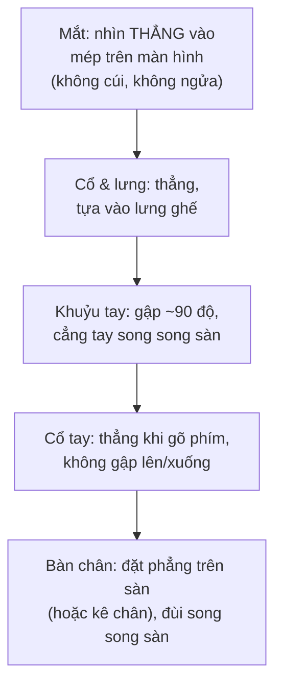

# Thiết lập môi trường remote — Home office & công cụ

> **Tác giả:** Mr.Rom\
> **Phiên bản:** v1.0.0\
> **Tạo lúc:** 13/06/2026\
> **Cập nhật:** 13/06/2026\
> **Level:** Basic\
> **Tags:** career, remote-work, home-office, ergonomics, work-from-home, tools, soft-skills, productivity\
> **Yêu cầu trước:** [Làm việc từ xa là gì](00_what-is-remote-work.md)

> 🎯 *Bài trước đã cho bạn bức tranh lớn: remote là gì, async-first là xương sống của nó. Nhưng trước khi bàn chuyện cộng tác qua múi giờ hay giữ năng suất, có một thứ nền tảng phải dựng xong: **chỗ ngồi và bộ đồ nghề**. Một góc làm việc đau lưng, một cái mic rè khiến cả cuộc họp hỏi lại "em nói gì cơ?", một đường mạng rớt giữa lúc demo — những thứ tưởng nhỏ này âm thầm bào mòn cả sức khoẻ lẫn uy tín của bạn mỗi ngày. Bài này dựng cho bạn một home office **thực dụng** (không cần đắt): ergonomics đúng cách, phần cứng tối thiểu đủ tốt, ranh giới không gian work/life, và bộ công cụ remote chuẩn — kèm checklist setup và ngân sách thiết bị gợi ý để bạn bắt tay vào ngay.*

## 🎯 Sau bài này bạn sẽ

- [ ] Dựng được một góc làm việc đúng **ergonomics** (màn hình ngang mắt, ghế đỡ lưng, ánh sáng, gõ thẳng cổ tay) để không đau lưng/mỏi cổ/mỏi mắt
- [ ] Biết **phần cứng tối thiểu** đủ tốt cho công việc remote: mic/webcam cho call, internet ổn + **backup** khi rớt mạng, tai nghe chống ồn
- [ ] Dựng được **ranh giới không gian** work/life (góc làm việc riêng, nghi thức "commute giả") để não tách bạch giờ làm và giờ nghỉ
- [ ] Nắm **bộ công cụ remote** chuẩn theo từng nhóm: chat, video, doc/wiki, board, quản lý mật khẩu — và vai trò của mỗi nhóm
- [ ] Cấu hình **thông báo (notifications)** để không rơi vào trạng thái always-on, vẫn không bỏ lỡ việc gấp
- [ ] Tự lên một **ngân sách thiết bị** theo mức (tối thiểu → thoải mái) để đầu tư đúng chỗ, không phí tiền vào thứ chưa cần

---

## Tình huống — cái mic rẻ tiền và buổi họp mất uy tín

Hãy hình dung một buổi demo quan trọng. Bạn đã code xong tính năng, chuẩn bị kỹ, chỉ việc trình bày 10 phút cho cả team và sếp lớn nghe. Bạn mở Zoom, bắt đầu nói. Nhưng cái mic tích hợp trong laptop hứng trọn tiếng quạt trần, tiếng xe ngoài đường, và vọng âm của căn phòng trống. Cứ vài câu lại có người chen vào: *"Em ơi nghe không rõ, nói lại được không?"*. Bạn lặp lại, mất nhịp. Đường mạng nhà bạn lại chậm đúng lúc, hình bạn đứng cứng, tiếng méo đi. Mười phút demo biến thành hai mươi phút chật vật. Nội dung của bạn tốt — nhưng thứ đọng lại trong đầu người nghe là *"buổi đó nghe mệt quá"*.

Bây giờ tua lại với một setup khác. Cùng buổi demo, nhưng bạn đeo một tai nghe có mic gần miệng, tiếng ra rõ và sạch. Webcam ngang tầm mắt, ánh sáng từ phía trước nên mặt bạn sáng rõ chứ không tối thui ngược sáng. Mạng chính ổn định, mà kể cả nó rớt thì điện thoại bạn đã bật sẵn phát 4G làm backup, bạn chuyển sang trong vài giây. Mười phút trôi mượt, không ai phải hỏi lại. Người nghe tập trung vào **nội dung**, không vào tiếng ồn.

Cùng một con người, cùng một nội dung — nhưng **môi trường làm việc** quyết định bạn được nhìn nhận là chuyên nghiệp hay luộm thuộm. Và đây không phải chuyện tiền: cái khác biệt ở trên tốn rất ít, chỉ cần biết đầu tư đúng chỗ. Quan trọng hơn, một home office tốt không chỉ phục vụ những buổi demo — nó là nơi bạn ngồi tám tiếng mỗi ngày, năm này qua năm khác. Một cái ghế sai có thể huỷ hoại lưng bạn còn lâu hơn bất kỳ deadline nào.

Bài này dựng cho bạn cái nền vật lý đó: ngồi sao cho không hỏng người, mua gì cho đủ tốt mà không phí, tách work khỏi life ngay trong chính căn nhà mình, và lắp bộ công cụ để remote chạy trơn.

---

## 1️⃣ Ergonomics — ngồi sao để không huỷ hoại cơ thể

Trước khi bàn tới máy móc đắt tiền, hãy nói về thứ quan trọng nhất nhưng hay bị bỏ qua nhất: **tư thế ngồi**. Một dev remote ngồi trung bình tám tiếng mỗi ngày trước màn hình. Nhân lên hàng trăm ngày một năm, một tư thế sai không gây đau ngay — nó tích luỹ âm thầm thành đau lưng mãn tính, mỏi cổ, hội chứng ống cổ tay, khô mắt. Đây là loại "nợ" trả bằng sức khoẻ, và rất khó hồi phục.

**Ergonomics** (công thái học) là khoa học sắp đặt chỗ làm việc cho khớp với cơ thể người, sao cho làm việc lâu mà ít tổn hại nhất. Tin tốt: phần lớn nguyên tắc ergonomics quan trọng đều **miễn phí** — chúng là cách bạn sắp xếp, không phải đồ bạn mua.

🪞 **Ẩn dụ**: cơ thể bạn khi ngồi làm việc giống một **cây cầu chịu tải**. Nếu các trụ đỡ (chân chạm sàn, lưng tựa ghế, khuỷu tay đặt đúng) thẳng hàng và cân, cây cầu chịu được tải trọng lâu dài. Nếu một trụ lệch — màn hình quá thấp khiến bạn cúi cổ suốt ngày — toàn bộ sức nặng dồn sai chỗ, và chỗ đó sẽ nứt trước. Ergonomics là việc xếp các trụ cho thẳng, để cơ thể chịu tải tám tiếng mà không "nứt".

Năm nguyên tắc ergonomics này là khái niệm trừu tượng nhất của bài — cách cả cơ thể ăn khớp với bàn ghế màn hình — nên ta hình dung chúng cùng nhau qua một sơ đồ tư thế chuẩn trước, rồi mới đi vào từng phần.

> 📖 *Điểm cốt lõi của sơ đồ: cả năm điểm phải đúng **cùng lúc** thì tư thế mới chuẩn — sửa mỗi màn hình mà ghế vẫn sai thì cổ đỡ nhưng lưng vẫn hỏng. Hãy đi từ trên xuống (mắt → cổ → khuỷu tay → cổ tay → chân) như một checklist mỗi khi ngồi vào bàn.*

### 1.1 Màn hình ngang tầm mắt — chống cúi cổ

Đây là lỗi phổ biến nhất của dev mới remote: dùng laptop đặt thẳng trên bàn, màn hình thấp tè, nên bạn **cúi cổ** xuống nhìn suốt ngày. Cúi cổ liên tục dồn áp lực khổng lồ lên đốt sống cổ — đây là nguyên nhân số một của đau cổ-vai-gáy ở dân văn phòng.

Nguyên tắc: **mép trên màn hình ngang hoặc hơi dưới tầm mắt**, để khi nhìn thẳng tự nhiên, mắt bạn rơi vào khoảng 1/3 trên của màn hình. Khoảng cách màn hình tới mắt khoảng một sải tay (50-70cm).

Vấn đề: laptop **không thể** đạt điều này — màn hình và bàn phím dính liền, nâng màn hình lên thì bàn phím cũng lên theo, cổ tay sai. Giải pháp rẻ và hiệu quả:

- **Kê laptop lên cao** (bằng giá đỡ laptop, hoặc đơn giản là một chồng sách) cho màn hình ngang mắt, rồi **cắm thêm bàn phím + chuột rời** để gõ ở độ cao đúng. Đây là combo rẻ nhất giải quyết được cả hai vấn đề cùng lúc.
- **Hoặc dùng màn hình rời** đặt ngang mắt, laptop để bên cạnh làm màn hình phụ. Màn hình rời còn cho bạn diện tích lớn hơn — rất đáng giá cho việc code.

> [!TIP]
> Bạn không cần mua giá đỡ đắt tiền ngay. Một chồng sách giáo trình cũ kê dưới laptop nâng nó lên đúng tầm mắt là đủ để bắt đầu — nhiều dev kỳ cựu vẫn dùng "giá đỡ sách" này. Đầu tư giá đỡ xịn hay màn hình rời để sau, khi bạn chắc mình gắn bó lâu dài với remote.

### 1.2 Ghế và tư thế — đỡ lưng, chân chạm sàn

Sau màn hình, cái ghế là khoản đáng đầu tư nhất cho sức khoẻ dài hạn — vì lưng là thứ khó chữa nhất khi đã hỏng. Một cái ghế tốt không cần đắt, nhưng cần đủ vài thứ:

- **Đỡ được phần lưng dưới** (lumbar support) — đường cong tự nhiên của lưng dưới phải được tựa đỡ, không để lưng cong gù hay võng ra sau.
- **Điều chỉnh được độ cao** — để khi ngồi, **đùi song song sàn** và **bàn chân đặt phẳng** trên sàn. Nếu ghế cao quá mà chân lơ lửng, hãy kê một cái bục để chân (footrest) — một cái hộp chắc chắn cũng được.
- **Khuỷu tay gập khoảng 90 độ** khi tay đặt trên bàn phím, cẳng tay song song mặt sàn. Nếu bàn quá cao khiến vai bạn nhún lên, hạ ghế hoặc kê tay.

→ Nếu ngân sách eo hẹp, một cái ghế văn phòng tầm trung có tựa lưng điều chỉnh còn tốt hơn nhiều một cái ghế gaming hào nhoáng nhưng đệm cứng. Quy luật: **tiền vào ghế ít khi phí**, vì nó bảo vệ thứ bạn không mua lại được — cái lưng của bạn.

> [!IMPORTANT]
> Không có tư thế nào "đúng" nếu giữ nguyên cả ngày — kể cả tư thế chuẩn nhất. Cơ thể cần **chuyển động**. Cứ khoảng mỗi 30-60 phút, đứng dậy, đi lại, vươn vai, nhìn ra xa cho mắt nghỉ. Tư thế tốt nhất là tư thế **tiếp theo** — đổi thế thường xuyên quan trọng ngang việc ngồi đúng.

### 1.3 Ánh sáng — chống mỏi mắt và lên hình đẹp

Ánh sáng phục vụ hai mục đích: bảo vệ mắt khi làm việc, và làm bạn lên hình rõ khi gọi video. Hai nguyên tắc đơn giản:

- **Đừng ngồi ngược sáng** — nếu cửa sổ hay đèn ở **sau lưng** bạn, camera sẽ thấy một cái bóng đen vì nền sáng hơn mặt bạn; còn mắt bạn phải gồng để nhìn màn hình giữa nền chói. Hãy để nguồn sáng chính **phía trước hoặc bên cạnh** bạn (ánh sáng tự nhiên từ cửa sổ trước mặt là lý tưởng).
- **Tránh chênh lệch sáng quá gắt** — một màn hình sáng rực trong phòng tối om khiến mắt mỏi nhanh. Hãy có một nguồn sáng môi trường (đèn phòng, đèn bàn) để giảm tương phản giữa màn hình và xung quanh.

→ Để lên hình đẹp trong call mà không cần mua đèn chuyên dụng: ngồi quay mặt về phía cửa sổ ban ngày, hoặc đặt một đèn bàn hắt sáng nhẹ vào mặt từ phía sau màn hình. Mặt sáng rõ trong video tạo cảm giác chuyên nghiệp và dễ kết nối hơn nhiều một khung hình tối thui.

---

## 2️⃣ Phần cứng tối thiểu — đủ tốt, không cần đắt

Có một hiểu lầm khiến nhiều người mới chần chừ: "remote cần đầu tư cả một dàn thiết bị xịn". Sai. Bạn chỉ cần **vài món đủ tốt** ở đúng chỗ quan trọng. Triết lý ở đây: tiền nên đổ vào những thứ **người khác trải nghiệm qua bạn** (mic, mạng) và **thứ bạn dùng tám tiếng** (ghế, màn hình) — chứ không phải vào đồ trông oách mà ít tác dụng.

🪞 **Ẩn dụ**: chọn thiết bị remote giống **gói hành lý cho một chuyến đi dài**. Bạn không cần mang cả tủ quần áo — bạn cần đúng vài món thiết yếu, chất lượng đủ tốt để dùng bền. Nhồi nhét đồ thừa chỉ làm nặng hành lý; thiếu món thiết yếu (như cái mic, đường mạng dự phòng) thì cả chuyến đi khốn khổ. Bí quyết là biết **đâu là thiết yếu**.

Thứ tự ưu tiên đầu tư, từ tác động lớn nhất:

| Ưu tiên | Thiết bị | Vì sao quan trọng | Mức "đủ tốt" |
|---|---|---|---|
| 1 | **Internet ổn định + backup** | Mạng rớt = bạn biến mất khỏi mọi cuộc họp, mọi việc | Gói cáp quang ổn định + điện thoại phát 4G/5G dự phòng |
| 2 | **Mic / tai nghe có mic** | Tiếng của bạn là thứ cả team nghe mỗi ngày | Tai nghe có mic gần miệng — hơn hẳn mic laptop |
| 3 | **Ghế + bàn đúng tầm** | Bạn ngồi 8 tiếng/ngày, lưng khó chữa khi hỏng | Ghế đỡ lưng + bàn đủ cao (xem §1) |
| 4 | **Webcam** | Mặt bạn trong call — quan trọng nhưng kém mic | Webcam laptop thường đủ; rời nếu hay lên hình |
| 5 | **Màn hình rời** | Diện tích code lớn hơn, đặt ngang mắt | Một màn hình tầm trung là nâng cấp lớn |

→ Để ý thứ tự: **mạng và mic đứng trên cả webcam**. Lý do đơn giản — người ta tha thứ cho hình mờ dễ hơn nhiều so với tiếng rè không nghe được. Một cuộc họp có thể tắt camera vẫn chạy tốt; nhưng tiếng đứt quãng thì cuộc họp sụp đổ.

### 2.1 Internet ổn + backup 4G — đừng để "rớt mạng" làm bạn biến mất

Với một dev remote, đường mạng là **đường sống**. Mạng rớt không chỉ làm bạn lỡ một cuộc họp — nó cắt đứt bạn khỏi code trên cloud, khỏi chat, khỏi mọi thứ. Và mạng nhà thì không bao giờ ổn định 100%: nhà mạng bảo trì, mất điện, modem treo.

Vì thế nguyên tắc số một: **luôn có phương án dự phòng (backup)**. Cách rẻ và hiệu quả nhất là dùng chính **điện thoại phát 4G/5G** (tethering) làm mạng dự phòng. Khi mạng chính rớt, bạn chuyển laptop sang dùng mạng điện thoại trong vài giây, không gián đoạn cuộc họp.

Một vài điểm thực dụng về mạng:

- **Ưu tiên cắm dây LAN** cho máy chính nếu có thể — kết nối dây ổn định hơn Wi-Fi rất nhiều, ít rớt giữa chừng. Nếu phải dùng Wi-Fi, ngồi gần router.
- **Biết trước cách bật tethering** trên điện thoại (cả iPhone lẫn Android đều có sẵn), test thử một lần để lúc khẩn cấp không lóng ngóng.
- **Để ý dung lượng data** của gói điện thoại nếu hay phải dùng backup — gọi video tốn data đáng kể.

> [!WARNING]
> Cạm bẫy kinh điển: chỉ phát hiện mình **không có** phương án backup đúng vào lúc mạng rớt giữa một cuộc họp quan trọng. Đừng để tới lúc đó. Hãy test tethering từ điện thoại **trước**, ngay hôm nay, khi mọi thứ còn yên ổn — biết chắc nó hoạt động và bạn chuyển sang được nhanh. Một phút chuẩn bị lúc rảnh đáng giá cả buổi cứu vãn lúc nguy.

### 2.2 Mic và tai nghe — tiếng rõ quan trọng hơn bạn nghĩ

Như tình huống mở bài đã cho thấy, **mic là khoản đầu tư có tỷ lệ lợi ích/chi phí cao nhất** trong cả bộ thiết bị remote. Mic tích hợp trong laptop nằm xa miệng, hứng đủ thứ tiếng ồn xung quanh và vọng âm phòng. Chỉ cần một **tai nghe có mic** (kể cả tai nghe điện thoại đi kèm) đã hơn hẳn, vì mic nằm gần miệng — tiếng vào rõ, ít ồn nền.

- **Tai nghe có mic** là lựa chọn tối thiểu, rẻ, và cải thiện rõ rệt. Đây nên là món bạn mua đầu tiên nếu chưa có.
- **Tai nghe chống ồn (noise-cancelling)** là nâng cấp đáng giá nếu bạn làm trong môi trường ồn (gần đường, nhà đông người, quán cà phê). Nó chặn tiếng ồn để **bạn tập trung** — phục vụ deep work, không chỉ cho call.
- Khi nói chuyện, **đặt mic cách miệng vừa phải** và ở môi trường yên tĩnh nhất có thể; tắt mic (mute) khi không nói trong cuộc họp đông người để khỏi lọt tiếng ồn của bạn vào.

→ Phân biệt hai thứ hay bị gộp: tai nghe **chống ồn** giúp *bạn* không nghe tiếng ồn (để tập trung); còn *chất lượng mic* quyết định *người khác* nghe tiếng bạn rõ hay không. Một món tốt sẽ làm tốt cả hai, nhưng nếu phải chọn ưu tiên, hãy đảm bảo **mic ra tiếng rõ** trước — đó là thứ ảnh hưởng tới cả team.

### 2.3 Webcam — đủ tốt cho call

Webcam quan trọng nhưng đứng sau mic và mạng. Trong phần lớn trường hợp, **webcam tích hợp của laptop là đủ** cho các cuộc họp thường ngày — miễn là bạn xử lý tốt phần ánh sáng (§1.3), vì ánh sáng ảnh hưởng tới hình ảnh nhiều hơn cả chất lượng camera.

- Đặt webcam **ngang tầm mắt** (hệ quả của việc kê màn hình đúng ở §1.1) — webcam quá thấp cho góc nhìn từ dưới lên kém thiện cảm.
- Chỉ nên cân nhắc **webcam rời** chất lượng cao nếu công việc của bạn lên hình nhiều (làm nội dung, gặp khách hàng thường xuyên, dẫn họp lớn).
- Một mẹo miễn phí: nền phía sau bạn gọn gàng còn quan trọng hơn camera xịn. Một bức tường trống hay góc gọn cho cảm giác chuyên nghiệp; nhiều công cụ video còn cho làm mờ nền sẵn.

---

## 3️⃣ Ranh giới không gian — tách work khỏi life ngay trong nhà

Một trong những cái khó nhất của remote không phải kỹ thuật, mà là tâm lý: khi nhà **cũng là** chỗ làm, ranh giới giữa "đang làm việc" và "đang nghỉ" nhoè đi. Bạn mở laptop trên giường, trả lời tin nhắn công việc lúc ăn tối, và rồi không bao giờ thật sự "tan làm". Hệ quả là làm quá giờ triền miên, khó tập trung, và về lâu dài là kiệt sức.

Văn phòng truyền thống cho bạn ranh giới đó **miễn phí**: bạn đi tới một nơi để làm, rồi rời nơi đó để về. Quãng đi lại (commute) tuy mệt nhưng đóng vai một **nghi thức chuyển trạng thái** — não biết "giờ bắt đầu làm" và "giờ kết thúc". Khi remote, bạn mất nghi thức này, nên phải **tự dựng lại** nó.

🪞 **Ẩn dụ**: làm việc không có ranh giới không gian giống **nấu ăn, ngủ và làm việc trên cùng một cái bàn**. Cái bàn không bao giờ "sạch" khỏi việc nào — bạn ăn cũng thấy laptop công việc, ngủ cũng thấy nó cạnh giường, nên đầu óc không bao giờ thật sự nghỉ. Tách góc làm việc ra giống có **một cái bàn riêng cho mỗi việc**: bàn ăn để ăn, giường để ngủ, bàn làm việc để làm — bước tới bàn nào, não tự chuyển sang chế độ ấy.

### 3.1 Góc làm việc riêng — dù chỉ là một góc

Lý tưởng là có một phòng riêng làm việc, nhưng phần lớn người không có điều kiện đó — và **không cần**. Điều quan trọng là một **góc cố định chỉ dành cho làm việc**, dù nhỏ:

- **Cố định một chỗ** — cùng một bàn, cùng một góc mỗi ngày. Sự lặp lại này tạo tín hiệu cho não: "ngồi vào đây = chế độ làm việc".
- **Tránh làm trên giường hay sofa** — không chỉ vì ergonomics tệ (hỏng lưng), mà vì nó trộn lẫn không gian nghỉ với không gian làm, khiến cả hai đều kém. Giường nên chỉ để ngủ.
- **Nếu chỗ ở chật**, hãy tạo ranh giới bằng nghi thức thay vì tường: ví dụ chỉ làm việc khi ngồi ở một vị trí nhất định của bàn ăn, và "dọn dẹp" dấu vết công việc (gập laptop, cất tai nghe) khi hết giờ để không gian "trở lại" là nhà.

→ Mục tiêu không phải sự sang trọng mà là sự **phân tách**: một ranh giới rõ giữa "đây là chỗ tôi làm" và "đây là chỗ tôi sống", để khi rời góc đó, bạn thật sự rời công việc.

### 3.2 "Commute giả" — nghi thức bắt đầu và kết thúc ngày

Vì remote lấy mất quãng đi lại vốn giúp não chuyển trạng thái, một kỹ thuật hữu hiệu là tự tạo một **"commute giả" (fake commute)** — một nghi thức ngắn đánh dấu ranh giới giữa giờ làm và giờ nghỉ.

Nghi thức này không cần phức tạp; cốt lõi là nó **đều đặn và có chủ đích**. Vài ví dụ:

- **Buổi sáng (vào ca)**: đi bộ một vòng ngắn quanh nhà rồi mới ngồi vào bàn; pha một ly cà phê theo đúng thứ tự mỗi ngày; thay từ đồ ngủ sang "đồ làm việc". Bất kỳ hành động nào báo cho não "bắt đầu rồi".
- **Buổi tối (tan ca)**: gập laptop và cất nó đi (không để mở trên bàn ăn tối); đi dạo một vòng như "đi làm về"; viết nhanh việc ngày mai rồi đóng máy. Một dấu chấm hết rõ ràng.

> [!TIP]
> Một "commute giả" hiệu quả bất ngờ: dùng đúng quãng thời gian lẽ ra để đi làm cho một việc tách biệt khỏi màn hình — đi bộ, tập thể dục, đọc sách. Nó vừa đánh dấu ranh giới, vừa trả lại cho bạn phần lợi ích sức khoẻ mà việc "lăn từ giường ra bàn làm" đã lấy mất. Ranh giới rõ ràng chính là tuyến phòng thủ đầu tiên chống lại việc làm quá giờ triền miên khi remote.

→ Chủ đề ranh giới work/life và phòng kiệt sức còn được đào sâu ở góc độ sức khoẻ tinh thần và văn hoá đội trong bài [Sức khoẻ tinh thần & văn hoá đội remote](04_wellbeing-and-remote-culture.md); ở đây ta tập trung vào phần *không gian vật lý* — dựng cái khung để ranh giới đó có chỗ đứng.

---

## 4️⃣ Bộ công cụ remote — mỗi nhóm một vai trò

Có chỗ ngồi tốt và thiết bị đủ rồi, giờ tới phần mềm. Một team remote vận hành bằng một **bộ công cụ (toolset)** — và điều quan trọng không phải nhớ tên từng app, mà là hiểu **mỗi nhóm công cụ phục vụ vai trò gì**. Tên app có thể đổi tuỳ công ty (Slack hay Teams, Notion hay Confluence), nhưng các *nhóm vai trò* thì gần như cố định ở mọi nơi.

🪞 **Ẩn dụ**: bộ công cụ remote giống các **phòng ban trong một toà nhà văn phòng**. Có phòng trò chuyện nhanh ngoài hành lang (chat), có phòng họp để gặp mặt (video), có thư viện lưu hồ sơ tra cứu lâu dài (doc/wiki), có bảng kanban dán việc trên tường (board), và có két sắt giữ chìa khoá (quản lý mật khẩu). Khi remote, toà nhà vật lý biến mất, nhưng **từng phòng ban đó vẫn cần tồn tại** — chỉ là dưới dạng phần mềm. Hiểu mỗi "phòng" để làm gì thì bạn dùng đúng app cho đúng việc, thay vì nhét mọi thứ vào chat.

Năm nhóm công cụ cốt lõi và vai trò của chúng:

| Nhóm công cụ | Vai trò | Ví dụ phổ biến | Dùng cho việc gì |
|---|---|---|---|
| **Chat** | Trao đổi nhanh, async hằng ngày | Slack, Microsoft Teams | Hỏi nhanh, thông báo, thảo luận theo kênh/thread |
| **Video call** | Gặp mặt đồng bộ (sync) khi cần | Zoom, Google Meet | Họp, demo, pair-programming, gỡ hiểu lầm nhanh |
| **Doc / Wiki** | Lưu kiến thức lâu dài, tra cứu | Notion, Confluence | Tài liệu, quyết định kỹ thuật, hướng dẫn onboarding |
| **Board / Task** | Theo dõi công việc & tiến độ | Jira, Trello, Linear, GitHub Projects | Quản lý task, sprint, trạng thái việc |
| **Quản lý mật khẩu** | Lưu & chia sẻ bí mật an toàn | 1Password, Bitwarden | Mật khẩu, API key, truy cập dùng chung |

→ Điểm mấu chốt: **đừng dùng sai phòng cho sai việc**. Một quyết định kỹ thuật quan trọng mà chỉ nhắn trong chat sẽ trôi mất sau vài ngày — nó thuộc về doc/wiki (nơi lưu lâu dài). Một câu hỏi nhanh mà mở cả cuộc họp video thì phí thời gian cả team — nó thuộc về chat. Dùng đúng công cụ cho đúng loại thông tin chính là cách giữ cho team remote không hỗn loạn.

### 4.1 Chat và video — async mặc định, sync khi cần

Hai nhóm này phủ phần lớn giao tiếp hằng ngày, và cách dùng chúng phản ánh đúng tinh thần **async-first** đã học ở bài trước: **mặc định là chat (async)**, chỉ chuyển sang **video (sync)** khi thật sự cần thời gian thực.

- **Chat** là nơi diễn ra phần lớn trao đổi: hỏi nhanh, báo tiến độ, thảo luận theo kênh. Dùng **thread** để giữ kênh gọn và **mention đúng người** để không làm phiền cả kênh — kỹ năng etiquette chat này được đào kỹ ở cụm communication, nên ở đây chỉ nhắc tới như một phần của bộ công cụ.
- **Video** dành cho thứ cần thời gian thực: họp định kỳ, demo, pair-programming, hoặc gỡ một hiểu lầm mà gõ chữ qua lại mãi không xong. Đừng mặc định mở video cho mọi thứ — mỗi cuộc gọi cắt một quãng deep work của tất cả người tham gia.

→ Kỹ năng *viết một message để được trả lời ngay*, viết status, viết bug report là chủ đề riêng đã được đào sâu ở bài [Giao tiếp async & viết](../../../communication/lessons/01_basic/01_async-and-written-communication.md). Ở bài này, ta chỉ cần biết **công cụ nào cho vai trò nào**; cách vận hành team từ xa qua các công cụ đó là nội dung của bài tiếp theo.

### 4.2 Doc/wiki và board — trí nhớ chung của team

Trong team remote (nhất là phân tán), thứ gì không được **viết lại** sẽ thất lạc. Hai nhóm công cụ này là **trí nhớ chung** của team — nơi thông tin sống lâu hơn một cuộc trò chuyện.

- **Doc / Wiki** (Notion, Confluence) là nơi lưu kiến thức cần tra cứu lại: tài liệu hướng dẫn, quyết định kỹ thuật và lý do, quy trình onboarding cho người mới. Khác với chat (trôi đi), doc được tổ chức để **tìm lại được** sau hàng tháng.
- **Board / Task** (Jira, Trello, Linear, GitHub Projects) là nơi công việc được **nhìn thấy**: ai đang làm gì, task nào tới đâu, sprint còn gì. Trong remote, khi không ai "thấy" bạn làm việc, một cái board cập nhật tử tế chính là cách bạn thể hiện tiến độ — và là cách cả team biết việc đang chạy mà không cần đi hỏi từng người.

→ Hai nhóm này là hiện thân cụ thể của nguyên tắc "async để lại dấu vết" ở bài trước: doc giữ *kiến thức*, board giữ *trạng thái công việc*. Một team remote mạnh là team có hai thứ này luôn được cập nhật, để bất kỳ ai ở bất kỳ múi giờ nào cũng tự tra ra thông tin mình cần.

### 4.3 Quản lý mật khẩu — 1Password và bảo mật cơ bản

Khi làm remote, bạn truy cập đủ thứ hệ thống từ máy ở nhà: dashboard, database, API của bên thứ ba, tài khoản dùng chung của team. Quản lý đống mật khẩu và bí mật này an toàn là một phần **bắt buộc** của setup remote, không phải tuỳ chọn — vì máy của bạn giờ là một cửa ngõ vào hệ thống công ty.

Một **trình quản lý mật khẩu (password manager)** như 1Password hay Bitwarden giải quyết việc này: nó tạo và lưu mật khẩu mạnh, độc nhất cho từng dịch vụ, và cho phép **chia sẻ bí mật an toàn** trong team (thay vì gửi mật khẩu qua chat — một thói quen cực kỳ nguy hiểm).

🪞 **Ẩn dụ**: dùng cùng một mật khẩu cho mọi nơi giống dùng **một chiếc chìa khoá mở cả nhà, cả xe, cả két sắt** — mất một chìa là mất tất cả. Password manager giống một **chùm chìa khoá riêng cho từng ổ**, cất trong một két an toàn mà chỉ bạn mở được bằng một chìa chủ (master password). Mất một chìa lẻ cũng không ảnh hưởng các ổ khác.

Vài nguyên tắc bảo mật cơ bản cho dev remote:

- **Mỗi dịch vụ một mật khẩu mạnh, độc nhất** — để password manager sinh tự động, bạn không cần nhớ.
- **Bật xác thực hai lớp (2FA)** ở mọi nơi quan trọng — kể cả mật khẩu lộ, kẻ xấu vẫn thiếu lớp thứ hai.
- **Đừng bao giờ gửi mật khẩu/API key qua chat hay email** — dùng tính năng chia sẻ an toàn của password manager.
- **Khoá máy khi rời đi** (kể cả ở nhà) và bật mã hoá ổ đĩa — máy của bạn là cửa vào hệ thống công ty.

> [!CAUTION]
> Đừng bao giờ commit mật khẩu, API key, hay token thật vào code/Git, kể cả repo private. Một bí mật đã lọt vào lịch sử Git rất khó xoá sạch và là một trong những nguồn rò rỉ bảo mật phổ biến nhất. Hãy để chúng trong password manager hoặc biến môi trường (`.env` đã thêm vào `.gitignore`), không bao giờ trong mã nguồn.

---

## 5️⃣ Cấu hình thông báo — thoát khỏi always-on

Có một cái bẫy mà gần như mọi người mới remote rơi vào: để **mọi thông báo** của mọi công cụ bật hết, kêu cả ngày. Mỗi tin Slack rung điện thoại, mỗi email ping máy tính, mỗi cập nhật task hiện banner. Kết quả: bạn không bao giờ có một phút yên để tập trung, và cảm thấy buộc phải trả lời mọi thứ tức thì — trạng thái **always-on** (luôn bật) độc hại dẫn thẳng tới kiệt sức.

Nghịch lý là: **để mọi thông báo bật KHÔNG khiến bạn làm việc tốt hơn** — nó khiến bạn làm việc kém hơn, vì cứ vài phút lại bị ngắt khỏi mạch tư duy. Một dev liên tục bị thông báo cắt ngang thì không bao giờ vào được quãng deep work cần thiết để code tử tế.

🪞 **Ẩn dụ**: để mọi thông báo bật giống có một **cái chuông cửa kêu mỗi lần ai đó đi ngang qua nhà** — không phải mỗi lần có khách thật sự cần gặp. Bạn chạy ra mở cửa liên tục cho những người chỉ đi ngang, và chẳng làm được việc gì. Cấu hình thông báo thông minh giống dạy cái chuông **chỉ kêu khi có khách thật sự bấm chuông** — việc gấp thì báo, còn lại để yên cho bạn làm việc.

Nguyên tắc cốt lõi: **mặc định là yên tĩnh, chỉ mở thông báo cho thứ thật sự cần bạn ngay**. Cụ thể:

- **Tắt thông báo cho kênh ồn** — phần lớn kênh chat không cần báo từng tin. Đặt chúng về chế độ chỉ báo khi bạn được **mention trực tiếp** (`@tên`), bỏ qua phần còn lại.
- **Dùng chế độ tập trung (Focus / Do Not Disturb)** trong các phiên deep work — tắt hết thông báo trong một khoảng, kiểm tra chat theo đợt thay vì liên tục. Async-first cho phép điều này: bạn không cần trả lời tức thì.
- **Đặt giờ yên (quiet hours)** ngoài giờ làm — để công cụ chat không ping bạn lúc tối/cuối tuần. Đây là cách công cụ tôn trọng ranh giới work/life mà bạn đã dựng ở §3.
- **Tách bạch gấp và không gấp** — chỉ để những kênh/người thật sự khẩn cấp xuyên qua được chế độ yên tĩnh. Đa số việc trong remote là async và **không** cần bạn xử lý trong vài giây.

→ Việc cấu hình này nối thẳng với hai ngộ nhận ở bài trước: bạn **không cần** online 100% để chứng tỏ đang làm; đo bằng output, không bằng tốc độ trả lời tin nhắn. Tắt bớt thông báo không phải là lười biếng hay vô trách nhiệm — nó là điều kiện để bạn có quãng tập trung mà giao ra kết quả thật.

> [!IMPORTANT]
> Tắt thông báo **không** đồng nghĩa với mất liên lạc hay bỏ bê đồng đội. Hãy báo cho team biết nhịp làm việc của bạn (ví dụ: "mình check chat theo đợt mỗi vài giờ; việc gấp thì gọi điện/mention trực tiếp"). Khi mọi người biết cách liên lạc khi thật sự cần, việc bạn tắt thông báo để tập trung được tôn trọng — và cả team cùng thoát khỏi văn hoá always-on.

---

## 6️⃣ Checklist setup & ngân sách thiết bị gợi ý

Giờ ghép tất cả lại thành thứ bạn dùng được ngay: một checklist để dựng home office, và một khung ngân sách để đầu tư đúng thứ tự ưu tiên.

### 6.1 Checklist setup home office

Chạy qua checklist này khi dựng (hoặc rà soát lại) góc làm việc remote của bạn. Không cần làm hết một lúc — nhưng càng tick được nhiều, môi trường càng bền và càng dễ chịu.

**Ergonomics (sức khoẻ — ưu tiên cao nhất):**

- [ ] Mép trên màn hình ngang hoặc hơi dưới tầm mắt (kê laptop + dùng bàn phím rời, hoặc màn hình rời)
- [ ] Ghế đỡ được lưng dưới; ngồi thì đùi song song sàn, bàn chân đặt phẳng (kê chân nếu cần)
- [ ] Khuỷu tay gập ~90 độ khi gõ phím, cổ tay thẳng
- [ ] Nguồn sáng ở phía trước/bên cạnh (không ngược sáng); có ánh sáng môi trường chống mỏi mắt
- [ ] Có thói quen đứng dậy/nghỉ mắt mỗi 30-60 phút

**Phần cứng (đủ tốt, đúng ưu tiên):**

- [ ] Internet chính ổn định (ưu tiên cắm dây LAN nếu được)
- [ ] **Backup mạng** đã test: điện thoại phát 4G/5G, biết cách chuyển nhanh
- [ ] Tai nghe có mic (gần miệng) — đã test tiếng ra rõ, không ồn nền
- [ ] Webcam ngang tầm mắt; nền phía sau gọn gàng
- [ ] (Nếu có) tai nghe chống ồn cho môi trường ồn / deep work

**Ranh giới không gian:**

- [ ] Có một góc cố định chỉ dành cho làm việc (không làm trên giường/sofa)
- [ ] Có nghi thức "commute giả" đánh dấu vào ca và tan ca
- [ ] Cuối ngày "dọn" dấu vết công việc để không gian trở lại là nhà

**Công cụ & bảo mật:**

- [ ] Đã cài và đăng nhập đủ bộ: chat, video, doc/wiki, board
- [ ] Dùng password manager (1Password/Bitwarden); không gửi mật khẩu qua chat
- [ ] Bật 2FA cho các tài khoản quan trọng; khoá máy khi rời đi; mã hoá ổ đĩa
- [ ] Đã cấu hình thông báo: kênh ồn chỉ báo khi được mention; có giờ yên ngoài giờ làm
- [ ] Đã báo team nhịp làm việc & cách liên lạc khi gấp

### 6.2 Ngân sách thiết bị gợi ý — đầu tư theo mức

Bạn **không cần** sắm tất cả ngay. Khung dưới chia theo ba mức để bạn đầu tư dần, đúng thứ tự tác động. Cột "ưu tiên" cho biết nên mua trước món nào nếu ngân sách hạn chế.

| Mức | Triết lý | Gồm những gì | Ưu tiên |
|---|---|---|---|
| **Tối thiểu** (bắt đầu ngay) | Tận dụng đồ có sẵn, chỉ vá chỗ yếu nhất | Tai nghe có mic; kê laptop bằng sách + bàn phím/chuột rời; điện thoại làm backup 4G; sắp lại ánh sáng & góc làm việc (miễn phí) | Mua **tai nghe có mic** trước tiên |
| **Thoải mái** (gắn bó remote) | Đầu tư vào thứ dùng 8 tiếng/ngày | Ghế đỡ lưng tử tế; màn hình rời đặt ngang mắt; giá đỡ laptop; webcam rời nếu hay lên hình | Ưu tiên **ghế tốt** rồi tới **màn hình rời** |
| **Nâng cao** (chuyên sâu / lên hình nhiều) | Hoàn thiện trải nghiệm | Tai nghe chống ồn; mic chuyên dụng; đèn cho video call; bàn nâng hạ (standing desk) | Tuỳ nhu cầu thật, không mua cho "oách" |

→ Quy luật xuyên suốt: **tiền nên đổ vào thứ người khác trải nghiệm qua bạn (mic, mạng) và thứ bạn dùng tám tiếng (ghế, màn hình)** trước khi đổ vào đồ trông oách. Một dev có tai nghe mic rõ, mạng có backup, ghế đỡ lưng và màn hình ngang mắt đã có một setup tốt hơn rất nhiều người sắm đủ đồ đắt tiền nhưng đặt sai chỗ. Đầu tư theo tác động, không theo giá tiền.

---

## 💡 Cạm bẫy thường gặp & Best practice

### ❌ Cạm bẫy: dùng laptop "trần" đặt thẳng trên bàn, cúi cổ cả ngày

- **Triệu chứng**: ngồi gập cổ nhìn xuống màn hình laptop thấp suốt ngày; sau vài tháng đau cổ-vai-gáy, mỏi lưng, tê tay.
- **Nguyên nhân**: laptop dính liền màn hình và bàn phím nên không thể vừa để màn hình ngang mắt vừa gõ đúng tư thế; không dùng giá kê + phụ kiện rời.
- **Cách tránh**: kê laptop lên cao (giá đỡ hoặc chồng sách) cho mép trên màn hình ngang mắt, rồi cắm **bàn phím + chuột rời** để gõ ở độ cao đúng; hoặc dùng màn hình rời. Đứng dậy nghỉ mỗi 30-60 phút.

### ❌ Cạm bẫy: không có backup mạng, biến mất giữa cuộc họp khi mạng rớt

- **Triệu chứng**: mạng nhà rớt đúng lúc họp/demo quan trọng, bạn văng ra khỏi cuộc gọi, lóng ngóng không biết xử lý, mất cả buổi.
- **Nguyên nhân**: dựa hoàn toàn vào một đường mạng duy nhất, chưa từng chuẩn bị phương án dự phòng.
- **Cách tránh**: luôn có backup — biết và **test trước** cách phát 4G/5G từ điện thoại (tethering) để chuyển sang trong vài giây. Ưu tiên cắm dây LAN cho máy chính để ổn định hơn Wi-Fi.

### ❌ Cạm bẫy: để mọi thông báo bật hết, rơi vào always-on

- **Triệu chứng**: mọi tin chat/email/task đều rung báo; cảm thấy buộc phải trả lời tức thì mọi thứ; không bao giờ có quãng tập trung; mệt mỏi mà output vẫn ít.
- **Nguyên nhân**: nghĩ rằng phản hồi nhanh = làm việc tốt, hoặc sợ bị coi là trốn việc nếu không trả lời ngay (ngộ nhận "online 100%").
- **Cách tránh**: mặc định yên tĩnh — kênh ồn chỉ báo khi được mention; dùng chế độ tập trung trong phiên deep work; đặt giờ yên ngoài giờ làm; báo team cách liên lạc khi thật sự gấp. Đo bằng output, không bằng tốc độ trả lời.

### ✅ Best practice: đầu tư theo tác động, không theo giá tiền

- **Vì sao**: ngân sách có hạn nên phải đổ tiền đúng chỗ. Thứ người khác trải nghiệm qua bạn (mic, mạng) và thứ bạn dùng tám tiếng (ghế, màn hình) ảnh hưởng lớn hơn nhiều so với đồ trông oách nhưng ít tác dụng.
- **Cách áp dụng**: mua tai nghe có mic và chuẩn bị backup mạng trước tiên (rẻ, tác động lớn); rồi tới ghế đỡ lưng và màn hình rời ngang mắt; đồ nâng cao (mic xịn, đèn, standing desk) chỉ khi nhu cầu thật sự cần.

### ✅ Best practice: dựng ranh giới không gian + nghi thức chuyển trạng thái

- **Vì sao**: khi nhà cũng là chỗ làm, ranh giới work/life nhoè đi, dẫn tới làm quá giờ triền miên và khó tập trung. Văn phòng cho ranh giới đó miễn phí (đi tới/rời khỏi); remote thì phải tự dựng lại.
- **Cách áp dụng**: cố định một góc chỉ để làm việc (không làm trên giường/sofa); tạo "commute giả" đánh dấu vào ca và tan ca (đi bộ, đổi đồ, pha cà phê, gập laptop cuối ngày); "dọn" dấu vết công việc khi hết giờ để không gian trở lại là nhà.

---

## 🧠 Tự kiểm tra (Self-check)

**Q1.** Bạn mới remote, chỉ có một chiếc laptop và ngân sách rất hạn chế. Theo nguyên tắc ergonomics, hai thay đổi (gần như miễn phí) đầu tiên bạn nên làm cho góc làm việc là gì, và vì sao?

💡 Xem giải thích

Hai thay đổi gần như miễn phí và tác động lớn nhất:

1. **Kê laptop lên cao cho mép trên màn hình ngang tầm mắt** (dùng chồng sách cũng được), rồi cắm **bàn phím + chuột rời** để gõ ở độ cao đúng. Lý do: laptop "trần" đặt thẳng buộc bạn cúi cổ cả ngày — nguyên nhân số một của đau cổ-vai-gáy. Kê cao giải quyết tầm mắt, phụ kiện rời giải quyết tư thế tay.
2. **Sắp lại ánh sáng**: ngồi sao cho nguồn sáng ở phía trước/bên cạnh (không ngược sáng), có ánh sáng môi trường để giảm tương phản với màn hình. Lý do: chống mỏi mắt và lên hình rõ trong call — cả hai đều miễn phí, chỉ là cách bố trí.

Cốt lõi: phần lớn ergonomics quan trọng là **cách sắp xếp**, không phải đồ phải mua.

**Q2.** Trong bộ thiết bị remote, vì sao **mic và internet backup** lại được ưu tiên cao hơn cả webcam?

💡 Xem giải thích

Vì người ta **tha thứ cho hình mờ dễ hơn nhiều so với tiếng rè không nghe được**. Một cuộc họp có thể tắt camera vẫn chạy tốt; nhưng tiếng đứt quãng/méo thì cuộc họp sụp đổ — người nghe phải hỏi lại liên tục, mất nhịp, và bạn mất uy tín dù nội dung tốt.

- **Mic**: tiếng của bạn là thứ cả team nghe mỗi ngày; mic laptop hứng ồn nền và vọng âm, còn tai nghe có mic (mic gần miệng) cho tiếng rõ và sạch — đây là khoản đầu tư có tỷ lệ lợi ích/chi phí cao nhất.
- **Internet backup**: mạng rớt = bạn biến mất khỏi mọi cuộc họp và bị cắt khỏi code/chat. Có backup (phát 4G/5G từ điện thoại, đã test trước) đảm bảo bạn không "tàng hình" giữa lúc quan trọng.

Webcam quan trọng nhưng đứng sau, vì với cuộc họp thường ngày, webcam laptop + ánh sáng tốt là đủ.

**Q3.** "Commute giả" (fake commute) là gì, nó giải quyết vấn đề nào của remote, và cho hai ví dụ.

💡 Xem giải thích

**"Commute giả"** là một nghi thức ngắn, đều đặn, tự tạo để đánh dấu ranh giới giữa giờ làm và giờ nghỉ — thay cho quãng đi lại (commute) mà remote đã lấy mất.

Nó giải quyết vấn đề **ranh giới work/life bị nhoè** khi nhà cũng là chỗ làm: không có nghi thức "đi tới nơi làm / rời nơi làm", não không biết khi nào bắt đầu và khi nào kết thúc, dẫn tới làm quá giờ triền miên và không bao giờ thật sự nghỉ. Văn phòng cho ranh giới này miễn phí qua quãng commute; remote phải tự dựng lại.

Hai ví dụ (mỗi ví dụ cho một đầu ngày):
- **Vào ca**: đi bộ một vòng ngắn quanh nhà rồi mới ngồi vào bàn; hoặc thay từ đồ ngủ sang "đồ làm việc".
- **Tan ca**: gập và cất laptop, đi dạo một vòng như "đi làm về"; hoặc viết nhanh việc ngày mai rồi đóng máy.

**Q4.** Liệt kê năm nhóm công cụ remote cốt lõi và vai trò của mỗi nhóm. Vì sao "dùng đúng phòng cho đúng việc" lại quan trọng?

💡 Xem giải thích

Năm nhóm và vai trò:

1. **Chat** (Slack, Teams) — trao đổi nhanh, async hằng ngày: hỏi nhanh, thông báo, thảo luận theo kênh.
2. **Video call** (Zoom, Meet) — gặp mặt đồng bộ khi cần: họp, demo, pair-programming, gỡ hiểu lầm nhanh.
3. **Doc / Wiki** (Notion, Confluence) — lưu kiến thức lâu dài, tra cứu: tài liệu, quyết định kỹ thuật, onboarding.
4. **Board / Task** (Jira, Trello, Linear, GitHub Projects) — theo dõi công việc & tiến độ: ai làm gì, task tới đâu.
5. **Quản lý mật khẩu** (1Password, Bitwarden) — lưu & chia sẻ bí mật an toàn.

"Dùng đúng phòng cho đúng việc" quan trọng vì mỗi công cụ giữ thông tin theo cách khác nhau. Một quyết định kỹ thuật quan trọng mà chỉ nhắn trong **chat** sẽ trôi mất sau vài ngày — nó thuộc về **doc/wiki** (lưu lâu dài, tìm lại được). Một câu hỏi nhanh mà mở cả cuộc **video** thì phí thời gian cả team — nó thuộc về **chat**. Dùng sai phòng khiến thông tin thất lạc hoặc lãng phí thời gian, làm team remote hỗn loạn.

**Q5.** Vì sao để mọi thông báo bật hết lại khiến bạn làm việc **kém** hơn, và bốn cách cấu hình thông báo để thoát khỏi always-on là gì?

💡 Xem giải thích

Để mọi thông báo bật khiến làm việc kém hơn vì cứ vài phút lại bị **ngắt khỏi mạch tư duy** — một dev liên tục bị cắt ngang thì không bao giờ vào được quãng **deep work** cần thiết để code tử tế. Nó cũng tạo cảm giác phải trả lời tức thì mọi thứ (always-on), dẫn tới kiệt sức. Phản hồi nhanh không bằng giao ra kết quả thật.

Bốn cách cấu hình (nguyên tắc: mặc định yên tĩnh, chỉ mở cho thứ thật sự cần ngay):
1. **Tắt thông báo cho kênh ồn** — chỉ báo khi được mention trực tiếp (`@tên`).
2. **Dùng chế độ tập trung (Focus / Do Not Disturb)** trong phiên deep work; check chat theo đợt.
3. **Đặt giờ yên (quiet hours)** ngoài giờ làm để tôn trọng ranh giới work/life.
4. **Tách bạch gấp/không gấp** — chỉ kênh/người thật sự khẩn cấp xuyên qua được chế độ yên.

Quan trọng: báo cho team nhịp làm việc và cách liên lạc khi gấp, để việc tắt thông báo được tôn trọng chứ không bị hiểu là bỏ bê.

**Q6.** Bạn cần chia sẻ mật khẩu một tài khoản dùng chung cho đồng nghiệp ở xa. Cách an toàn là gì, cách nguy hiểm cần tránh là gì, và hai nguyên tắc bảo mật cơ bản khác cho dev remote?

💡 Xem giải thích

**Cách an toàn**: dùng tính năng **chia sẻ bí mật** của một password manager (1Password, Bitwarden) — nó cho phép chia sẻ có kiểm soát, an toàn.

**Cách nguy hiểm cần tránh**: gửi mật khẩu/API key qua **chat hoặc email** — chúng nằm lại trong lịch sử, dễ bị lộ; đây là thói quen cực kỳ rủi ro.

Hai (hoặc hơn) nguyên tắc bảo mật cơ bản khác:
- **Bật xác thực hai lớp (2FA)** ở mọi nơi quan trọng — kể cả mật khẩu lộ, kẻ xấu vẫn thiếu lớp thứ hai.
- **Mỗi dịch vụ một mật khẩu mạnh, độc nhất** (để password manager sinh tự động).
- **Khoá máy khi rời đi** và bật mã hoá ổ đĩa — máy bạn là cửa vào hệ thống công ty.
- **Không bao giờ commit mật khẩu/key thật vào code/Git**; để trong password manager hoặc biến môi trường (`.env` đã thêm vào `.gitignore`).

---

## ⚡ Tra cứu nhanh (Cheatsheet)

### Tư thế ergonomics chuẩn (đi từ trên xuống)

| Bộ phận | Đúng |
|---|---|
| Mắt | Nhìn thẳng vào mép trên màn hình (không cúi/ngửa); cách ~50-70cm |
| Cổ & lưng | Thẳng, tựa vào lưng ghế (đỡ lưng dưới) |
| Khuỷu tay | Gập ~90 độ, cẳng tay song song sàn |
| Cổ tay | Thẳng khi gõ, không gập lên/xuống |
| Bàn chân | Đặt phẳng trên sàn (hoặc kê chân); đùi song song sàn |
| Nghỉ | Đứng dậy / nghỉ mắt mỗi 30-60 phút |

### Thứ tự ưu tiên thiết bị (tác động giảm dần)

1. Internet ổn + **backup 4G/5G** (đã test tethering)
2. Tai nghe có mic (mic gần miệng)
3. Ghế đỡ lưng + bàn đúng tầm
4. Webcam (laptop thường đủ) + ánh sáng phía trước
5. Màn hình rời đặt ngang mắt

### Ánh sáng & mạng — mẹo nhanh

- Nguồn sáng **phía trước/bên cạnh**, không ngược sáng; có ánh sáng môi trường.
- Cắm **dây LAN** cho máy chính nếu được (ổn hơn Wi-Fi).
- Backup mạng = điện thoại phát 4G/5G; **test trước** khi cần.

### Bộ công cụ remote — đúng phòng cho đúng việc

| Nhóm | Ví dụ | Dùng cho |
|---|---|---|
| Chat | Slack, Teams | Hỏi nhanh, async hằng ngày (dùng thread) |
| Video | Zoom, Meet | Họp/demo/pair — sync khi cần |
| Doc/Wiki | Notion, Confluence | Kiến thức lưu lâu, tra cứu |
| Board | Jira, Trello, Linear | Trạng thái công việc |
| Mật khẩu | 1Password, Bitwarden | Lưu & chia sẻ bí mật an toàn |

### Cấu hình thông báo (thoát always-on)

- [ ] Kênh ồn → chỉ báo khi được **mention** (`@tên`)
- [ ] Bật **Focus / Do Not Disturb** trong phiên deep work
- [ ] Đặt **giờ yên** ngoài giờ làm
- [ ] Chỉ việc gấp xuyên qua được; báo team cách liên lạc khẩn

### Bảo mật cơ bản

- [ ] Password manager — không gửi mật khẩu qua chat
- [ ] Bật **2FA** cho tài khoản quan trọng
- [ ] Khoá máy khi rời đi; mã hoá ổ đĩa
- [ ] Không commit mật khẩu/key vào Git (dùng `.env` + `.gitignore`)

### Ngân sách theo mức

| Mức | Mua trước |
|---|---|
| Tối thiểu | Tai nghe có mic; kê laptop + phím/chuột rời; backup 4G (đa phần miễn phí/rẻ) |
| Thoải mái | Ghế tốt → màn hình rời ngang mắt → giá đỡ laptop |
| Nâng cao | Tai nghe chống ồn, mic xịn, đèn video, standing desk (theo nhu cầu thật) |

---

## 📚 Từ Điển Thuật Ngữ (Glossary)

| EN | VN | Giải thích |
|---|---|---|
| Home office | Văn phòng tại nhà | Góc/không gian làm việc dựng tại nhà cho công việc remote |
| Ergonomics | Công thái học | Khoa học sắp đặt chỗ làm khớp với cơ thể, làm lâu ít tổn hại |
| Lumbar support | Đỡ lưng dưới | Phần ghế tựa đỡ đường cong tự nhiên của lưng dưới |
| Footrest | Bục để chân | Vật kê chân khi ghế cao khiến chân không chạm sàn |
| Backup (internet) | Mạng dự phòng | Đường mạng thứ hai dùng khi mạng chính rớt |
| Tethering | Phát mạng từ điện thoại | Dùng điện thoại chia sẻ 4G/5G cho laptop |
| LAN cable | Dây mạng | Cáp cắm trực tiếp, ổn định hơn Wi-Fi |
| Webcam | Camera | Máy quay cho video call |
| Noise-cancelling | Chống ồn | Công nghệ tai nghe chặn tiếng ồn xung quanh |
| Mic (microphone) | Micro | Thiết bị thu tiếng — tiếng của bạn trong call |
| Commute | Quãng đi lại | Đoạn đường đi tới/rời chỗ làm |
| Fake commute | Commute giả | Nghi thức tự tạo thay cho commute, đánh dấu vào/tan ca |
| Deep work | Làm việc tập trung sâu | Quãng làm việc liền mạch, không bị ngắt — cần cho coding |
| Always-on | Luôn bật | Trạng thái luôn online/sẵn sàng trả lời — dễ dẫn tới kiệt sức |
| Notification | Thông báo | Tín hiệu báo có tin/sự kiện từ một công cụ |
| Do Not Disturb (DND) | Không làm phiền | Chế độ tắt thông báo trong một khoảng thời gian |
| Quiet hours | Giờ yên | Khoảng thời gian công cụ không gửi thông báo (vd ngoài giờ làm) |
| Async (asynchronous) | Bất đồng bộ | Một người viết bây giờ, người kia đọc lúc khác |
| Toolset | Bộ công cụ | Tập hợp phần mềm team dùng để vận hành remote |
| Wiki | (giữ EN) | Hệ thống tài liệu nội bộ tổ chức để tra cứu lại |
| Board (kanban) | Bảng công việc | Bảng theo dõi task theo cột trạng thái |
| Password manager | Trình quản lý mật khẩu | Phần mềm tạo/lưu mật khẩu mạnh và chia sẻ bí mật an toàn |
| 2FA (two-factor auth) | Xác thực hai lớp | Lớp bảo vệ thứ hai ngoài mật khẩu |
| Master password | Mật khẩu chủ | Mật khẩu duy nhất mở password manager |

---

## 🔗 Liên kết & Tài nguyên

⬅️ **Bài trước:** [Làm việc từ xa là gì? — Remote, hybrid & async-first](00_what-is-remote-work.md)\
➡️ **Bài tiếp theo:** [Cộng tác async khi remote — Vượt rào múi giờ](02_async-collaboration-remote.md)\
↑ **Về cụm:** [remote-work — README](../../README.md)

### 🧭 Định hướng lộ trình học

- [Làm việc từ xa là gì? — Remote, hybrid & async-first](00_what-is-remote-work.md) — nền tảng về remote và async-first, đọc trước bài này
- [Cộng tác async khi remote — Vượt rào múi giờ](02_async-collaboration-remote.md) — bước tiếp: vận hành team từ xa qua chính bộ công cụ dựng ở bài này

### 🧩 Các chủ đề có thể bạn quan tâm

- [Năng suất & tập trung khi remote — Output trên giờ ngồi](03_productivity-and-focus-remote.md) — cấu hình thông báo và deep work là nền cho giữ tập trung khi remote
- [Sức khoẻ tinh thần & văn hoá đội remote](04_wellbeing-and-remote-culture.md) — ranh giới work/life và phòng kiệt sức nhìn từ góc độ sức khoẻ tinh thần
- [Giao tiếp async & viết — Slack, email, ticket, tài liệu](../../../communication/lessons/01_basic/01_async-and-written-communication.md) — kỹ năng viết message/status/bug report trên bộ công cụ chat/doc ở đây

### 🌐 Tài nguyên tham khảo khác

- [OSHA — Computer Workstations eTool](https://www.osha.gov/etools/computer-workstations) — hướng dẫn ergonomics chuẩn cho chỗ làm việc với máy tính, có hình minh hoạ tư thế
- [GitLab — The Remote Playbook (All-Remote)](https://about.gitlab.com/company/culture/all-remote/) — bộ tài liệu công khai về cách một công ty fully-distributed dựng môi trường và công cụ remote
- [1Password — Get started](https://support.1password.com/getting-started/) — hướng dẫn bắt đầu với một password manager, gồm chia sẻ bí mật an toàn trong team

---

## 📌 Nhật ký thay đổi (Changelog)

- **v1.0.0 (13/06/2026)** — Bản đầu tiên. Tình huống mở bài "cái mic rẻ tiền và buổi họp mất uy tín" + 6 section: ergonomics (sơ đồ tư thế chuẩn 5 điểm mermaid — màn hình ngang mắt, ghế đỡ lưng, ánh sáng, cổ tay thẳng, chân chạm sàn) + phần cứng tối thiểu (bảng ưu tiên internet+backup 4G/mic/ghế/webcam/màn hình, test tethering, tai nghe chống ồn) + ranh giới không gian work/life (góc làm việc riêng, "commute giả" vào/tan ca) + bộ công cụ remote (bảng 5 nhóm chat/video/doc-wiki/board/password manager + đúng phòng cho đúng việc) + cấu hình thông báo thoát always-on (mention-only, Focus/DND, giờ yên) + checklist setup 4 nhóm + ngân sách thiết bị 3 mức. Các ẩn dụ cây-cầu-chịu-tải / gói-hành-lý / nhiều-bàn-cho-nhiều-việc / phòng-ban-trong-toà-nhà / chùm-chìa-khoá-trong-két / chuông-cửa-kêu-mỗi-người-đi-ngang + 3 cạm bẫy + 2 best practice + 6 self-check + cheatsheet + glossary 24 thuật ngữ. Cross-link sang async-collaboration (vận hành team), productivity/wellbeing (deep work/ranh giới) và cụm communication (viết async).
