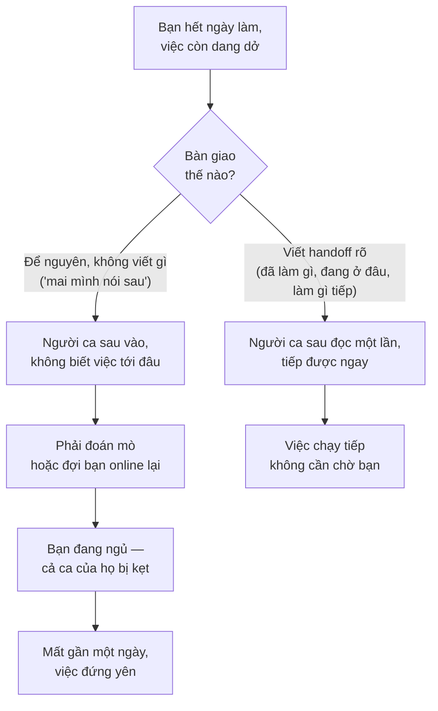

# Cộng tác async khi remote — Vượt rào múi giờ

> **Tác giả:** Mr.Rom\
> **Phiên bản:** v1.0.0\
> **Tạo lúc:** 13/06/2026\
> **Cập nhật:** 13/06/2026\
> **Level:** Basic\
> **Tags:** career, remote-work, soft-skills, async, timezone, handoff, documentation, standup\
> **Yêu cầu trước:** [Thiết lập môi trường remote](01_setup-and-environment.md)

> 🎯 *Bài trước đã giúp bạn dựng xong góc làm việc và bộ công cụ remote. Nhưng có một bộ công cụ tốt mà cả team không cùng giờ online thì vẫn tắc — người này hỏi lúc người kia ngủ, một quyết định bay mất vì "đã nói trong call rồi". Bài này dạy cách để một nhóm remote chạy trơn dù trải khắp múi giờ: chia giờ trùng (overlap) để đồng bộ vs giờ deep-work, viết handoff để người ca sau tiếp được việc, lấy tài liệu làm nguồn sự thật chung, họp ít mà chất, và biến "nói nhiều một chút" thành điểm mạnh thay vì điểm yếu. Kết bài bạn có sẵn template async standup và handoff để copy ra dùng.*

## 🎯 Sau bài này bạn sẽ

- [ ] Hiểu vì sao một nhóm **remote đa múi giờ** phải lấy **async-first** làm mặc định, không phải "cố ép cả team online cùng lúc"
- [ ] Chia ngày làm việc thành **overlap hours** (giờ trùng để đồng bộ) và **deep-work hours**, biết việc gì để vào khung nào
- [ ] Viết một **handoff** (bàn giao trạng thái) xuyên múi giờ để người ca sau tiếp được việc mà không phải hỏi lại
- [ ] Áp dụng **default to documentation** — mọi quyết định/quy trình được ghi lại vào một **single source of truth**
- [ ] Tổ chức họp remote **ít mà chất**, luôn có biên bản/ghi âm cho người vắng
- [ ] Hiểu vì sao **over-communication** trong remote là tính năng, không phải bug, và tránh "họp chỉ để cập nhật"

---

## Tình huống — câu hỏi gửi đi lúc người kia đang ngủ

Bạn ở một team remote trải ba múi giờ. 4 giờ chiều giờ bạn, bạn kẹt: không biết schema bảng `orders` đã chốt thêm cột `refund_status` hay chưa — việc tiếp theo của bạn phụ thuộc vào đó. Người nắm rõ nhất là một đồng nghiệp lệch bạn bảy tiếng. Lúc này bên đó là rạng sáng, họ đang ngủ.

Cách làm theo phản xạ văn phòng: nhắn "anh ơi, cho em hỏi cái này xíu" rồi ngồi đợi. Bảy tiếng sau họ thức dậy, thấy mỗi câu chào, nhắn lại "ừ em hỏi gì". Lúc đó tới lượt **bạn** đã hết giờ làm, đi ngủ. Họ đợi. Sáng hôm sau bạn mới trả lời câu hỏi thật. Một câu hỏi lẽ ra giải trong một câu đã ngốn gần hai ngày — không phải vì ai lười, mà vì hai người **không bao giờ online cùng lúc**.

Bây giờ tua lại. Bạn viết một message khác, gói đủ mọi thứ: *"Mình cần xác nhận: bảng `orders` đã có cột `refund_status` chưa? Mình thấy migration `0042` thêm nó nhưng chưa rõ đã chạy trên staging chưa. Nếu rồi mình làm tiếp phần A; nếu chưa mình chuyển sang phần B trước. Để lại câu trả lời ở thread này nhé, không cần đợi mình online."* Bạn không ngồi đợi — bạn chuyển sang phần B luôn. Đồng nghiệp thức dậy, đọc một lần, trả lời một câu, mọi thứ chạy tiếp.

Khác biệt không nằm ở công cụ — cả hai đều dùng cùng một Slack. Khác biệt nằm ở chỗ bạn **thiết kế công việc cho một thế giới không cùng giờ**: hỏi đủ trong một lượt, không chặn mình vào việc đang đợi người khác, và để lại câu trả lời ở nơi người sau tìm thấy. Đó chính là **cộng tác async** — và với nhóm remote đa múi giờ, đây không phải tuỳ chọn mà là điều kiện sống còn. Bài này dạy bạn làm điều đó một cách có hệ thống.

> [!NOTE]
> Bài [Giao tiếp async & viết](../../../communication/lessons/01_basic/01_async-and-written-communication.md) ở cụm communication đã dạy *cách viết* một message async tốt (BLUF, nohello, hỏi đúng cách). Bài này **không lặp lại** phần đó — ở đây ta nhìn một tầng cao hơn: làm sao điều phối **cả một nhóm** remote khi không ai cùng giờ. Nếu bạn chưa nắm cách viết message async, đọc bài kia trước sẽ bổ trợ rất tốt.

---

## 1️⃣ Vì sao nhóm remote phải async-first

Ở văn phòng, điều phối nhóm gần như miễn phí: cần gì thì quay sang bàn bên hỏi, cả team ngồi họp đứng buổi sáng, một quyết định nói ra là ai cũng nghe. Mọi thứ chạy bằng **đồng bộ** (synchronous) — mọi người có mặt cùng lúc, cùng chỗ.

Đem nguyên cách đó vào một team remote trải nhiều múi giờ thì vỡ ngay. Khi bạn bắt đầu ngày làm việc, một nửa team đang ngủ. "Họp đứng buổi sáng" của bạn là nửa đêm của người khác. "Quay sang hỏi" biến thành "nhắn rồi đợi nửa ngày". Vấn đề cốt lõi: **thời gian online của các thành viên chỉ chồng lên nhau một phần nhỏ**, phần còn lại lệch nhau hoàn toàn.

Vì thế nhóm remote thành công lấy **async-first** (ưu tiên bất đồng bộ) làm mặc định: thiết kế công việc sao cho **chạy được kể cả khi người ta không online cùng lúc**, và chỉ dùng đồng bộ (call, họp) cho phần thật sự cần. Async-first không có nghĩa "cấm họp" — nó có nghĩa "đừng mặc định mọi thứ đều phải họp".

🪞 **Ẩn dụ**: một team đồng bộ giống một **dàn nhạc chơi live** — tất cả phải có mặt cùng lúc, nhìn nhạc trưởng, sai một nhịp là lệch cả bài. Một team async giống một nhóm **thu âm từng bè rồi ghép lại** — tay trống thu phần của mình lúc rảnh, tay guitar thu lúc khác, kỹ sư âm thanh ghép lại thành bản hoàn chỉnh. Không ai cần ngồi phòng thu cùng giờ, nhưng kết quả vẫn liền mạch — **với điều kiện** mỗi người để lại bản thu rõ ràng (đúng tone, đúng nhịp) để người ghép không phải đoán. Cộng tác async là vậy: mỗi người để lại "bản thu" đủ rõ để người sau dùng được mà không cần hỏi lại.

Để thấy rõ async-first khác cách làm văn phòng ở đâu, hãy đặt hai mô hình cạnh nhau. Không phải async luôn thắng — mỗi mô hình mạnh ở chỗ riêng, vấn đề là **chọn mặc định nào** cho một team không cùng giờ:

| Khía cạnh | 🟢 Async-first (mặc định viết, đọc lúc khác) | 🔵 Sync-first (mặc định họp/gọi) |
|---|---|---|
| Hợp với team | Đa múi giờ, remote/hybrid | Cùng phòng, cùng giờ |
| Chờ phản hồi | Không chặn — làm việc khác trong lúc đợi | Phải đợi tất cả rảnh cùng lúc |
| Để lại dấu vết | Có — tra cứu lại được sau này | Bay mất nếu không ai ghi biên bản |
| Bảo vệ deep work | Tốt — người ta trả lời khi rảnh | Kém — mỗi cuộc gọi cắt ngang luồng làm |
| Điểm yếu | Từng lượt chậm hơn; đòi viết rõ | Khó tìm khung giờ chung; phá tập trung |

→ Điểm rút ra không phải "bỏ hết họp", mà là **đảo mặc định**: thay vì "có việc gì thì họp, lúc nào kẹt mới viết", team remote nên "có việc gì thì viết/ghi lại, lúc nào thật sự cần mới họp". Phần còn lại của bài là các công cụ cụ thể để vận hành mặc định đó: chia giờ làm (overlap vs deep-work), handoff xuyên ca, tài liệu làm nguồn sự thật, và họp ít mà chất.

---

## 2️⃣ Overlap hours vs deep-work hours — chia ngày làm hai loại

Một sai lầm phổ biến của người mới làm remote đa múi giờ là cố online suốt từ sáng tới khuya để "luôn có mặt khi ai cần". Cách này vừa kiệt sức vừa vô ích — vì dù bạn online 12 tiếng, phần **trùng** với mỗi đồng nghiệp vẫn chỉ là một khung nhỏ. Giải pháp không phải online nhiều hơn, mà là **chia ngày làm việc thành hai loại giờ có mục đích khác nhau**.

- **Overlap hours** (giờ trùng) — khung giờ mà bạn và (phần lớn) đồng nghiệp **cùng online**. Đây là tài nguyên hiếm và quý nhất của team đa múi giờ. Dành nó cho những việc **cần qua lại nhanh**: gỡ một hiểu lầm, brainstorm, pair programming, ra quyết định cần bàn.
- **Deep-work hours** (giờ làm sâu) — phần còn lại của ngày, khi đồng nghiệp ở múi khác đang ngủ hoặc ngoài giờ. Đây là lúc lý tưởng để **code tập trung, không bị ngắt** — vì gần như không ai nhắn bạn.

🪞 **Ẩn dụ**: overlap hours giống **giờ cao điểm của một quán cà phê** — đông người, ồn ào, là lúc gặp gỡ trao đổi; bạn không ngồi đọc sách sâu vào giờ đó. Deep-work hours giống **lúc quán vắng đầu giờ chiều** — yên tĩnh, đúng lúc để làm việc cần tập trung. Người làm remote khôn ngoan không cố "mở quán 24/7" — họ biết giờ nào để gặp người, giờ nào để làm việc một mình.

Mấu chốt là **dùng đúng loại giờ cho đúng loại việc**. Đổ việc qua lại nhanh vào deep-work hours thì phải chờ cả ngày mới có người trả lời; ngược lại, ngồi code đầu óc căng thẳng đúng vào khung overlap thì lãng phí khung giờ chung quý giá. Bảng dưới phân loại:

| Loại việc | Khung nên dùng | Vì sao |
|---|---|---|
| Brainstorm, bàn thiết kế, gỡ bất đồng | Overlap hours | Cần qua lại nhiều lượt, sync nhanh hơn nhiều |
| Pair programming, review trực tiếp | Overlap hours | Tương tác liên tục, khó làm async |
| Ra quyết định cần tranh luận | Overlap hours | Hội tụ nhanh, tránh thread dài lê thê |
| Code một feature, viết test | Deep-work hours | Cần tập trung dài, ít bị ngắt nhất |
| Viết tài liệu, đọc code, nghiên cứu | Deep-work hours | Việc một mình, không cần ai online |
| Câu hỏi không gấp, cập nhật status | Async bất kỳ lúc nào | Người kia đọc khi rảnh, không cần trùng giờ |

→ Một thói quen tốt: **bảo vệ deep-work hours như bảo vệ một cuộc họp** — chặn lịch, tắt thông báo, để dành sức tập trung cho nó; và **gom các việc cần qua lại vào khung overlap** thay vì rải rác cả ngày. Việc giữ ranh giới giờ giấc này cũng liên quan tới sức khoẻ và work-life balance khi remote, sẽ được bàn ở [bài về wellbeing & văn hoá remote](04_wellbeing-and-remote-culture.md); ở đây ta chỉ cần nắm: chia giờ làm hai loại là nền tảng để vừa cộng tác được vừa làm sâu được.

### Tìm khung overlap chung — một ví dụ cụ thể

Lý thuyết "gom việc qua lại vào overlap" chỉ dùng được khi bạn biết **khung overlap thật sự nằm ở đâu**. Cách tìm rất đơn giản: quy mọi giờ làm về **một múi giờ tham chiếu**, rồi nhìn phần giao nhau. Giả sử team bạn có ba thành viên:

| Thành viên | Múi giờ | Giờ làm (giờ địa phương) | Quy về giờ GMT+7 |
|---|---|---|---|
| Bạn | GMT+7 (Việt Nam) | 09:00 – 18:00 | 09:00 – 18:00 |
| Đồng nghiệp EU | GMT+1 (Đức) | 09:00 – 17:00 | 15:00 – 23:00 |
| Đồng nghiệp US | GMT-5 (New York) | 09:00 – 17:00 | 21:00 – 05:00 (hôm sau) |

→ Nhìn cột "quy về GMT+7", phần cả ba **cùng online** gần như không có — đây là thực tế phổ biến của team trải rộng toàn cầu. Nhưng từng **cặp** vẫn có overlap: bạn và EU trùng nhau khoảng **15:00 – 18:00** (giờ bạn), EU và US trùng khoảng **21:00 – 23:00** (giờ bạn). Bài học rút ra: với team trải quá rộng, đừng cố tìm một khung chung cho tất cả — hãy **lên lịch theo từng cặp/nhóm có overlap**, và để mọi việc còn lại chạy hoàn toàn async (handoff, tài liệu). Đây chính là lý do các kỹ năng async ở các section sau không phải "tuỳ chọn cho tiện" mà là **xương sống** giữ team trải rộng vận hành được.

> [!TIP]
> Khai báo khung giờ làm của bạn ở nơi cả team thấy (status Slack, một dòng trong profile, hoặc một bảng "working hours" chung). Khi mọi người biết khung overlap chung là khoảng nào, họ tự gom việc cần-qua-lại vào đó và không nhắn bạn những câu gấp vào giờ bạn đang ngủ. Một dòng nhỏ này tiết kiệm cho cả team rất nhiều vòng chờ.

---

## 3️⃣ Handoff — bàn giao trạng thái để người sau tiếp được việc

Đây là kỹ năng đặc trưng nhất của cộng tác xuyên múi giờ, và là **khái niệm trừu tượng nhất của bài** — nên ta hình dung nó qua sơ đồ trước. Trong một team trải nhiều múi giờ, công việc có thể "chạy theo mặt trời": bạn làm phần của mình, hết ngày thì **bàn giao (handoff)** trạng thái cho người ở múi giờ kế tiếp vừa bắt đầu ngày của họ, để họ tiếp tục mà không phải dựng lại từ đầu.

Sơ đồ dưới minh hoạ vì sao một handoff viết kém lại "đắt" trong môi trường này — nó cho thấy hai nhánh số phận của cùng một lần bàn giao:



→ Điểm cốt lõi của sơ đồ: trong một team cùng giờ, "quên bàn giao" chỉ tốn vài phút hỏi lại; trong team xuyên múi giờ, nó tốn **cả khoảng thời gian chờ bạn ngủ dậy**. Vì thế handoff tốt chính là thứ giữ cho công việc "chạy theo mặt trời" thay vì "đứng yên qua đêm".

Một handoff không cần dài — nó cần **trả lời đúng các câu mà người tiếp theo sẽ hỏi**: việc đã tới đâu, còn vướng gì, làm gì tiếp, có gì cần biết để không dẫm bẫy. Trước khi xem template, hãy nắm bốn phần xương sống của một handoff:

| Phần | Trả lời câu hỏi | Vì sao cần |
|---|---|---|
| **Đã làm xong** | "Cái gì đã chốt, không cần đụng nữa?" | Để người sau khỏi làm lại thứ đã xong |
| **Đang dang dở** | "Việc đang ở đâu, chỗ nào còn mở?" | Điểm để người sau tiếp nối chính xác |
| **Việc tiếp theo** | "Bước kế là gì, ai nên làm?" | Không để khoảng trống "rồi sao nữa?" |
| **Cảnh báo / context** | "Có cạm bẫy gì, cần lưu ý gì?" | Tránh người sau sa đúng hố bạn vừa thoát |

Đây là một **template handoff** bạn có thể copy làm khung — ngắn gọn, để lại ở nơi cả ca sau thấy (thread của task, ticket, hoặc kênh handoff chung):

```text
🔁 Handoff — task "Tích hợp cổng thanh toán" — hết ngày 13/06 (giờ GMT+7)

✅ Đã làm xong:
   - Gọi được API tạo giao dịch, có test pass.
   - Đã merge nhánh payment-core vào develop.

🚧 Đang dang dở:
   - Đang làm xử lý callback thanh toán thất bại.
   - Code ở nhánh feature/payment-fail-handling, commit cuối: "wip:
     parse error response". Chỗ dừng: hàm handle_failed() mới viết
     phần parse, CHƯA viết phần lưu trạng thái vào DB.

➡️ Việc tiếp theo (ai vào ca sau có thể tiếp):
   1. Viết tiếp phần lưu trạng thái failed vào bảng transactions.
   2. Thêm test cho case callback thất bại.

⚠️ Cần biết:
   - Sandbox refund vẫn chưa có tài khoản — đã xin bộ phận X, đang đợi.
     Đừng test refund vội, sẽ lỗi 403.
   - Spec mới nhất ở Notion trang "Payment v2" (link), KHÁC bản cũ ở
     chỗ phí giao dịch không trừ vào tiền hoàn.

❓ Nếu kẹt cần hỏi mình: để câu hỏi ở thread này, mình online lại
   khoảng 9h sáng giờ GMT+7 sẽ trả lời.
```

→ Handoff này để người ca sau đọc một lần là **tiếp được việc ngay**: biết chỗ nào đã xong (khỏi đụng), chỗ nào đang mở (tiếp vào đâu), bước kế là gì, và những cái bẫy cần tránh (đừng test refund, dùng spec mới). Để ý dòng "chỗ dừng" — nó chỉ chính xác con trỏ đang ở đâu trong code, thứ quý nhất với người tiếp nối. Một handoff như vậy biến "qua đêm việc đứng yên" thành "qua đêm việc vẫn chạy".

> [!IMPORTANT]
> Handoff phải để ở **nơi gắn với công việc** (thread của task, ticket, kênh handoff), KHÔNG phải nhắn riêng (DM) cho một người. Lý do: người tiếp ca có thể là người khác với người bạn dự tính, và sáu tuần sau ai đó cần tra lại "hôm đó việc tới đâu" cũng tìm được. Handoff trong DM là handoff bị chôn — không ai khác thấy.

---

## 4️⃣ Default to documentation — tài liệu là nguồn sự thật chung

Ở section 1 ta nói team remote nên "đảo mặc định" sang viết/ghi lại. **Default to documentation** (mặc định ghi vào tài liệu) là nguyên tắc cụ thể hoá điều đó: mọi **quyết định, quy trình, cách làm** đáng cho người khác biết đều được ghi lại vào một nơi cố định — thay vì chỉ tồn tại trong đầu một người, trong một câu nói ở call, hay trôi mất trong một thread chat.

Vì sao điều này đặc biệt quan trọng với remote? Vì ở văn phòng, kiến thức "ngầm" vẫn truyền được qua nói chuyện hành lang, hỏi nhanh bàn bên. Remote đa múi giờ cắt đứt kênh đó: người cần biết và người nắm thông tin thường **không online cùng lúc**. Thứ duy nhất luôn "online" 24/7 cho mọi múi giờ là **tài liệu**.

🪞 **Ẩn dụ**: một quyết định chỉ nói trong call giống **vẽ trên cát ở bãi biển** — rõ ràng lúc đó, nhưng sóng (thời gian, người mới, trí nhớ) xoá sạch. Một quyết định ghi vào tài liệu giống **khắc lên bia đá** — ai tới sau cũng đọc được nguyên văn, không phụ thuộc vào việc người khắc có ở đó hay không. Team remote sống bằng "bia đá", không bằng "vẽ trên cát".

Khái niệm then chốt đi kèm là **single source of truth (SSOT)** — "nguồn sự thật duy nhất". Với mỗi loại thông tin, team chốt **một nơi chính thức** để tra, thay vì để thông tin nằm rải ở năm chỗ mâu thuẫn nhau. Khi có một SSOT rõ, không ai phải hỏi "thông tin này tra ở đâu cho đúng?" — và không có cảnh ba người làm theo ba phiên bản khác nhau của cùng một quy trình.

Không phải mọi tin nhắn đều cần thành tài liệu — ghi quá nhiều thì loãng. Bảng dưới phân biệt cái gì **nên** thành tài liệu (sống lâu, dùng lại) và cái gì để ở chat là đủ (nhất thời):

| Nên ghi vào tài liệu (SSOT) | Để ở chat là đủ |
|---|---|
| Quyết định kỹ thuật + lý do ("chọn X thay Y vì...") | Hẹn giờ call, chuyện phiếm |
| Quy trình lặp lại (cách deploy, cách onboard người mới) | Một câu hỏi đã được trả lời và không lặp lại |
| Cách setup môi trường, biến cấu hình | "Mình đi ăn trưa nhé" |
| Định nghĩa thuật ngữ nội bộ, sơ đồ kiến trúc | Phản ứng cảm xúc, lời cảm ơn |
| Tiêu chí "thế nào là xong" của một feature | Thông báo nhất thời (sẽ hết giá trị sau hôm nay) |

→ Một quy tắc thực dụng để biết khi nào nên ghi: **nếu một câu hỏi/cách làm bị hỏi tới lần thứ hai, hãy ghi nó vào tài liệu rồi lần sau gửi link** thay vì gõ lại. Đừng cố ghi mọi thứ ngay từ đầu (phí công cho thứ không ai cần) — để nhu cầu thực tế dẫn đường. Mỗi lần biến một câu trả lời thành một dòng tài liệu là một lần bạn cắt đứt một câu hỏi sẽ lặp lại với mọi người sau.

> [!TIP]
> Khi chốt một quyết định trong call, hãy biến nó thành tài liệu **ngay khi call còn nóng**: một người được phân công viết lại "đã quyết gì, vì sao" vào SSOT rồi dán link vào kênh chung. Một quyết định không được ghi lại trong vài phút sau call gần như chắc chắn sẽ trở thành "ơ hồi đó mình quyết gì nhỉ?" vài tuần sau.

---

## 5️⃣ Họp remote — ít mà chất, luôn có biên bản cho người vắng

Async-first không xoá bỏ họp — có những việc (gỡ bất đồng phức tạp, brainstorm, gắn kết đội) vẫn cần người ta nói chuyện cùng lúc. Vấn đề là họp trong team đa múi giờ **đắt gấp nhiều lần** so với văn phòng: một cuộc họp "tiện cho mọi người" gần như không tồn tại khi team trải các múi giờ — luôn có người phải họp lúc sáng sớm hoặc tối muộn của họ. Vì thế nguyên tắc là **ít mà chất**: họp ít hơn, nhưng mỗi cuộc họp đáng giá và không bỏ rơi người vắng.

🪞 **Ẩn dụ**: với team remote, một cuộc họp giống **gọi tất cả thợ rời khỏi xưởng để ra phòng họp** — trong lúc họp, không ai đang làm việc, và với người ở múi giờ lệch thì đó còn là kéo họ ra khỏi giường. Họp không "miễn phí" như cảm giác; nó tốn giờ tập trung của tất cả những người dự. Vì đắt như vậy, mỗi cuộc họp phải xứng đáng với cái giá kéo cả xưởng dừng tay.

Vài nguyên tắc giữ cho họp remote ít mà chất:

- **Hỏi trước: việc này có cần họp không?** Nếu chỉ là cập nhật một chiều hoặc một câu hỏi có câu trả lời rõ — viết async, đừng họp. Chỉ họp khi thật sự cần **qua lại tức thì** (tranh luận, brainstorm, gỡ hiểu lầm).
- **Mỗi cuộc họp có mục tiêu và agenda rõ** gửi trước. Không có agenda thì không họp — họp "để xem có gì nói không" là cách lãng phí giờ cả team chắc chắn nhất.
- **Mời đúng người cần**, không mời cả team "cho biết". Người chỉ cần "biết kết quả" thì đọc biên bản sau là đủ, không cần ngồi cả cuộc.
- **Chọn giờ xoay vòng cho công bằng** nếu không có khung chung dễ chịu — đừng để luôn cùng một múi giờ phải họp lúc nửa đêm.

Điều quan trọng nhất cho team đa múi giờ: **luôn có biên bản hoặc ghi âm cho người vắng**. Vì không thể có cuộc họp nào mọi người đều dự được, mọi cuộc họp phải mặc định rằng **sẽ có người vắng** — và người vắng đó phải nắm được kết quả mà không cần đi hỏi từng người.

Một bản biên bản họp tối thiểu nhưng đủ dùng (ghi vào SSOT, dán link vào kênh chung sau họp):

```text
📝 Biên bản họp — "Chốt hướng xử lý refund" — 13/06

Người dự: A, B, C. Vắng: D (lệch múi giờ, đọc biên bản).

🎯 Mục tiêu họp: chốt có hoàn phí giao dịch khi refund hay không.

✅ Quyết định:
   - Refund KHÔNG trừ phí giao dịch (hoàn nguyên số tiền khách trả).
   - Lý do: theo điều khoản dịch vụ đã cam kết với khách.

📌 Việc cần làm (action items):
   - [ ] B: sửa hàm calc_refund bỏ phần trừ phí — xong trước 15/06.
   - [ ] C: cập nhật spec "Payment v2" cho khớp quyết định này.

🔗 Ghi âm: (link) — phần thảo luận chi tiết ở phút 12-20.
❓ D hoặc ai vắng có thắc mắc: để câu hỏi ở thread này.
```

→ Biên bản này để người vắng (D ở múi giờ lệch) **đọc một lần là nắm đủ**: quyết định gì, vì sao, ai làm gì tiếp, và nếu muốn nghe chi tiết thì có ghi âm. Để ý phần **action items** có người chịu trách nhiệm và hạn rõ — đó là thứ biến một cuộc họp thành kết quả thay vì "nói cho vui". Không có biên bản, người vắng buộc phải đi hỏi từng người dự — đúng kiểu vòng lặp tốn kém mà async-first muốn tránh.

> [!WARNING]
> Cạm bẫy lớn nhất là **"họp chỉ để cập nhật trạng thái"** — kiểu mỗi người lần lượt đọc "hôm qua tôi làm X, hôm nay làm Y". Loại nội dung này hoàn toàn có thể viết async (xem section 6) — bắt cả team, gồm người ở múi giờ lệch, dừng việc để ngồi nghe nhau đọc status là lãng phí giờ tập trung của tất cả. Hãy hỏi trước mỗi cuộc họp: "cái này có thể là một message thay vì một cuộc họp không?". Nếu có — viết, đừng họp.

---

## 6️⃣ Async standup & over-communication — nói nhiều một chút là tính năng

Section trên kết bằng một câu hỏi: nếu "cập nhật trạng thái" không nên là một cuộc họp, thì nó nên là gì? Câu trả lời là **async standup** (cập nhật kiểu standup nhưng viết, không họp). Thay vì kéo cả team — gồm người đang ngủ ở múi giờ khác — vào một cuộc gọi để đọc status, mỗi người **viết** cập nhật của mình vào một kênh chung, vào lúc thuận tiện với họ. Ai cần đọc thì đọc khi rảnh.

Một async standup tốt trả lời đúng ba câu mà người trong team thắc mắc về bạn: *đã xong gì, đang làm gì, có gì cản đường*. Đây là một **template async standup** để copy dùng hằng ngày (đăng vào kênh standup chung của team):

```text
📌 Standup — [Tên bạn] — 13/06

✅ Hôm qua: làm xong phần gọi API tạo giao dịch, test pass và merge.
🔨 Hôm nay: viết phần xử lý callback thất bại + test cho nó.
⛔ Đang vướng: chưa có sandbox để test refund — đã xin bộ phận X từ
   hôm qua, đang đợi. Nếu chiều nay chưa có, refund có thể trễ sang mai.
🕐 Giờ làm hôm nay: 9h–18h (GMT+7) — overlap với team EU khoảng 14h–18h.
```

→ Async standup này khiến không ai phải đi hỏi "bạn tới đâu rồi" và **không tốn một phút họp nào của cả team**. Để ý dòng "đang vướng" — nó không chỉ kêu khó mà nói rõ *đã làm gì để gỡ* và *rủi ro nếu không gỡ được*; và dòng "giờ làm" cho người ở múi giờ khác biết khi nào có thể bắt được bạn online. So với một cuộc họp standup, bản viết này còn **để lại dấu vết** — ai vắng hôm nay vẫn đọc được, và tuần sau tra lại vẫn còn.

Đằng sau tất cả những kỹ thuật trên là một thay đổi tư duy quan trọng: trong remote, **over-communication** (giao tiếp dư một chút) là **tính năng, không phải bug**. Ở văn phòng, nói quá kỹ điều ai cũng thấy có thể thừa; nhưng remote thì người khác **không thấy** những gì bạn đang làm — họ không thấy bạn đang cắm mặt vào một bug khó, không thấy bạn đang đợi một thứ, không thấy bạn sắp xong. Khoảng trống thông tin đó, nếu bạn không chủ động lấp, sẽ bị lấp bằng **suy đoán** (và suy đoán thường tệ hơn sự thật).

🪞 **Ẩn dụ**: làm việc remote mà giao tiếp thiếu giống **lái xe trong sương mù không bật đèn** — bạn biết mình đang đi đâu, nhưng xe khác quanh bạn thì không, và thế là va chạm. Over-communication là **bật đèn và xi-nhan rõ ràng**: bạn liên tục phát tín hiệu "tôi đang ở đây, đang rẽ hướng này, sắp dừng" để mọi người quanh bạn phối hợp được. Trong sương mù (remote), bật đèn dư một chút không bao giờ là thừa.

Over-communication trong thực tế nghĩa là chủ động nói ra những thứ ở văn phòng vốn "tự hiểu":

- **Báo trạng thái chủ động** — qua async standup, qua handoff, qua cập nhật khi có thay đổi. Đừng để ai phải đi hỏi.
- **Báo sớm khi bị kẹt hoặc sắp trễ** — một tin xấu nói sớm luôn tốt hơn một tin xấu nói muộn; remote càng cần vì không ai "thấy" bạn kẹt để hỏi thăm.
- **Viết rõ hơn mức bạn nghĩ là cần** — thêm một câu ngữ cảnh, một dòng "vì sao", một link tới tài liệu liên quan. Người đọc ở múi giờ khác không có bạn bên cạnh để hỏi lại.
- **Xác nhận đã đọc / đã hiểu** — một emoji 👍 hay một câu "ok mình nắm rồi" cũng là tín hiệu giúp người kia yên tâm không cần đợi.

> [!IMPORTANT]
> "Over-communication" không có nghĩa là spam hay làm phiền — nó là **chủ động lấp khoảng trống thông tin mà remote tạo ra**, đặt đúng nơi (kênh/thread/tài liệu chung, không phải DM tràn lan). Trong văn phòng, im lặng mà vẫn ổn vì người ta thấy bạn; trong remote, im lặng bị đọc là "không biết bạn đang làm gì, có ổn không". Nói dư một chút và rõ ràng luôn rẻ hơn rất nhiều so với một hiểu lầm phải gỡ qua nhiều múi giờ.

---

## 💡 Cạm bẫy thường gặp & Best practice

### ❌ Cạm bẫy: cố ép cả team online cùng lúc như ở văn phòng

- **Triệu chứng**: mặc định mọi việc đều phải họp/gọi; nhắn rồi đợi người ở múi giờ khác trả lời ngay; bản thân cố online suốt cả ngày để "luôn có mặt".
- **Nguyên nhân**: đem nguyên cách làm văn phòng (đồng bộ) vào team remote đa múi giờ, nơi thời gian online chỉ chồng nhau một phần nhỏ.
- **Cách tránh**: đảo mặc định sang **async-first** — viết/ghi lại trước, chỉ họp khi thật cần qua lại tức thì; chia ngày làm thành overlap hours (việc cần qua lại) và deep-work hours (việc một mình), không cố online 24/7.

### ❌ Cạm bẫy: hết ngày không bàn giao, để việc đứng yên qua đêm

- **Triệu chứng**: hết giờ làm tắt máy, việc dang dở không ai biết tới đâu; người ca sau (hoặc chính bạn hôm sau) phải dựng lại context từ đầu hoặc đợi bạn online.
- **Nguyên nhân**: nghĩ "mai mình nói sau" — quên rằng trong team xuyên múi giờ, "mai" của bạn là cả một ca làm của người khác bị kẹt.
- **Cách tránh**: viết **handoff** cuối ngày vào nơi gắn với task (thread/ticket/kênh handoff): đã làm xong gì, đang dang dở ở đâu (chỉ rõ chỗ dừng), việc tiếp theo, và cảnh báo cần biết.

### ❌ Cạm bẫy: họp chỉ để cập nhật trạng thái

- **Triệu chứng**: họp định kỳ mà nội dung chỉ là mỗi người lần lượt đọc "hôm qua làm X, hôm nay làm Y"; người ở múi giờ lệch phải dậy sớm/thức khuya chỉ để nghe status.
- **Nguyên nhân**: mặc định "cập nhật thì phải họp", không nhận ra status là loại nội dung một chiều, viết async là đủ.
- **Cách tránh**: chuyển cập nhật sang **async standup** (viết vào kênh chung); chỉ giữ họp cho việc cần qua lại tức thì (tranh luận, brainstorm, gỡ hiểu lầm), và mọi họp đều có agenda + biên bản cho người vắng.

### ✅ Best practice: default to documentation — ghi vào single source of truth

- **Vì sao**: remote cắt đứt kênh truyền kiến thức "ngầm" của văn phòng; thứ duy nhất "online" 24/7 cho mọi múi giờ là tài liệu. Quyết định chỉ nói trong call sẽ bay mất như vẽ trên cát.
- **Cách áp dụng**: ghi mọi quyết định (kèm lý do), quy trình lặp lại, cách setup vào **một nơi chính thức** (SSOT); chốt quyết định trong call thì viết lại ngay khi còn nóng; quy tắc thực dụng — thứ gì bị hỏi tới lần thứ hai thì ghi ra rồi gửi link.

### ✅ Best practice: over-communication là tính năng — chủ động lấp khoảng trống

- **Vì sao**: remote khiến người khác không "thấy" bạn đang làm gì; khoảng trống thông tin không được lấp sẽ bị lấp bằng suy đoán. Nói dư một chút rẻ hơn nhiều một hiểu lầm phải gỡ qua các múi giờ.
- **Cách áp dụng**: báo status chủ động (async standup, handoff), báo sớm khi kẹt/sắp trễ, viết rõ hơn mức bạn nghĩ là cần (thêm ngữ cảnh + link), và xác nhận đã đọc/đã hiểu — tất cả đặt ở kênh/thread chung, không phải DM tràn lan.

---

## 🧠 Tự kiểm tra (Self-check)

**Q1.** Vì sao một nhóm remote đa múi giờ nên lấy async-first làm mặc định thay vì cố ép cả team online cùng lúc như văn phòng?

<details>
<summary>💡 Đáp án</summary>

Vì trong team đa múi giờ, thời gian online của các thành viên chỉ **chồng lên nhau một phần nhỏ** — khi bạn bắt đầu ngày, một nửa team đang ngủ. Cách làm văn phòng (đồng bộ: quay sang hỏi, họp cùng lúc) vỡ ngay vì không thể tập hợp mọi người cùng giờ. Async-first nghĩa là thiết kế công việc để **chạy được kể cả khi người ta không online cùng lúc** — viết/ghi lại làm mặc định, chỉ dùng đồng bộ (họp/gọi) cho phần thật sự cần qua lại tức thì. Nó không có nghĩa "cấm họp", mà là "đừng mặc định mọi thứ đều phải họp". (Ẩn dụ: team async như nhóm thu âm từng bè rồi ghép, không cần ngồi phòng thu cùng giờ.)

</details>

**Q2.** Phân biệt overlap hours và deep-work hours. Cho một ví dụ việc nên làm ở mỗi loại giờ và giải thích vì sao.

<details>
<summary>💡 Đáp án</summary>

**Overlap hours** (giờ trùng) = khung giờ bạn và đồng nghiệp **cùng online** — tài nguyên hiếm của team đa múi giờ; dành cho việc **cần qua lại nhanh**: brainstorm, gỡ bất đồng, pair programming, ra quyết định cần bàn (vì sync nhanh hơn async nhiều lượt). **Deep-work hours** = phần còn lại của ngày khi đồng nghiệp ở múi khác đang ngủ — lúc lý tưởng để **code/viết tài liệu tập trung** vì gần như không ai ngắt bạn. Mấu chốt: dùng đúng loại giờ cho đúng việc — đổ việc qua-lại vào deep-work thì phải chờ cả ngày; ngồi code căng thẳng đúng vào overlap thì lãng phí khung giờ chung quý giá.

</details>

**Q3.** Bạn hết ngày làm với một feature đang dang dở, và một đồng nghiệp ở múi giờ lệch sắp bắt đầu ngày của họ. Một handoff tốt cần có những phần nào? Phần nào quý nhất với người tiếp nối?

<details>
<summary>💡 Đáp án</summary>

Bốn phần xương sống: **đã làm xong** (để người sau khỏi làm lại), **đang dang dở** (việc ở đâu, chỗ nào còn mở), **việc tiếp theo** (bước kế là gì), **cảnh báo/context** (cạm bẫy cần tránh). Phần quý nhất với người tiếp nối thường là **chỗ dừng chính xác** trong phần "đang dang dở" — chỉ rõ con trỏ đang ở đâu (nhánh nào, commit cuối, hàm nào, đã viết tới đâu, còn thiếu gì), để họ tiếp nối đúng điểm thay vì đoán mò. Handoff phải để ở **nơi gắn với task** (thread/ticket/kênh handoff), không phải DM riêng — vì người tiếp ca có thể khác dự tính và người sau cần tra lại.

</details>

**Q4.** "Default to documentation" và "single source of truth" nghĩa là gì, và vì sao chúng đặc biệt quan trọng với team remote? Mọi tin nhắn đều nên thành tài liệu chứ?

<details>
<summary>💡 Đáp án</summary>

**Default to documentation** = mặc định ghi mọi quyết định/quy trình/cách làm đáng biết vào một nơi cố định, thay vì chỉ tồn tại trong đầu một người hay trong một câu nói ở call. **Single source of truth (SSOT)** = với mỗi loại thông tin, chốt **một nơi chính thức** để tra, tránh thông tin nằm rải ở nhiều chỗ mâu thuẫn. Quan trọng với remote vì remote cắt đứt kênh truyền kiến thức "ngầm" (hỏi nhanh bàn bên); thứ duy nhất "online" 24/7 cho mọi múi giờ là tài liệu (ẩn dụ: bia đá vs vẽ trên cát). **Không** phải mọi tin nhắn đều nên thành tài liệu — chuyện nhất thời (hẹn giờ, chuyện phiếm, câu hỏi đã trả lời không lặp) để ở chat là đủ. Quy tắc thực dụng: thứ gì bị hỏi tới lần thứ hai thì ghi ra.

</details>

**Q5.** Vì sao "họp chỉ để cập nhật trạng thái" là một cạm bẫy trong team đa múi giờ, và nên thay bằng gì?

<details>
<summary>💡 Đáp án</summary>

Vì cập nhật trạng thái là nội dung **một chiều** (mỗi người đọc "hôm qua làm X, hôm nay làm Y") — không cần qua lại tức thì nên hoàn toàn viết async được. Bắt cả team, gồm người ở múi giờ lệch (phải dậy sớm/thức khuya), dừng việc để ngồi nghe nhau đọc status là lãng phí giờ tập trung của tất cả; họp với team remote còn "đắt" vì kéo cả người đang ngủ. Nên thay bằng **async standup**: mỗi người viết cập nhật (đã xong gì / đang làm gì / vướng gì + giờ làm) vào kênh chung lúc thuận tiện, ai cần đọc khi rảnh. Vừa không tốn phút họp nào, vừa để lại dấu vết cho người vắng và tra lại sau. Chỉ giữ họp cho việc cần qua lại tức thì.

</details>

**Q6.** Vì sao trong remote, "over-communication" được coi là tính năng chứ không phải bug? Cho hai ví dụ áp dụng cụ thể.

<details>
<summary>💡 Đáp án</summary>

Vì remote khiến người khác **không thấy** những gì bạn đang làm (không thấy bạn đang cắm mặt vào bug khó, đang đợi một thứ, hay sắp xong). Khoảng trống thông tin đó nếu bạn không chủ động lấp sẽ bị lấp bằng **suy đoán**, thường tệ hơn sự thật (ẩn dụ: lái xe trong sương mù — phải bật đèn, xi-nhan rõ để người quanh phối hợp). Ví dụ áp dụng (kể hai bất kỳ): báo status chủ động qua async standup/handoff để không ai phải đi hỏi; báo sớm khi bị kẹt hoặc sắp trễ; viết rõ hơn mức nghĩ là cần (thêm ngữ cảnh + link tài liệu); xác nhận đã đọc/đã hiểu. Lưu ý: over-communication là **lấp khoảng trống đúng nơi** (kênh/thread/tài liệu chung), không phải spam hay DM tràn lan.

</details>

---

## ⚡ Tra cứu nhanh (Cheatsheet)

### Async-first — đảo mặc định

- Mặc định: **viết/ghi lại** trước; chỉ họp khi cần qua lại tức thì.
- Hỏi trước mỗi cuộc họp: "cái này có thể là một message không?"

### Overlap hours vs deep-work hours

| Loại giờ | Dành cho |
|---|---|
| **Overlap** (cùng online) | Brainstorm, gỡ bất đồng, pair, ra quyết định cần bàn |
| **Deep-work** (người khác ngủ) | Code, viết test, viết tài liệu, đọc/nghiên cứu |
| **Async bất kỳ lúc nào** | Câu hỏi không gấp, cập nhật status |

→ Khai báo khung giờ làm ở nơi cả team thấy.

### Khung handoff (cuối ngày, để ở thread/ticket)

| Phần | Nội dung |
|---|---|
| ✅ Đã làm xong | Cái gì đã chốt, khỏi đụng |
| 🚧 Đang dang dở | Việc ở đâu — **chỉ rõ chỗ dừng** (nhánh, commit, hàm) |
| ➡️ Việc tiếp theo | Bước kế, ai làm |
| ⚠️ Cần biết | Cạm bẫy, context, spec mới nhất |

### Default to documentation

- Quyết định + lý do, quy trình lặp lại, cách setup → ghi vào **SSOT**.
- Chốt trong call → viết lại **ngay khi còn nóng**, dán link.
- Thứ gì bị hỏi tới **lần thứ hai** → ghi ra, lần sau gửi link.

### Họp remote ít mà chất

- Có cần họp không? → chỉ họp khi cần **qua lại tức thì**.
- Mỗi họp: agenda gửi trước + mời đúng người + **biên bản/ghi âm cho người vắng**.
- Biên bản gồm: quyết định + lý do + action items (ai, hạn nào).

### Over-communication (lấp khoảng trống)

- Báo status chủ động (async standup, handoff).
- Báo sớm khi kẹt / sắp trễ.
- Viết rõ hơn mức nghĩ là cần (+ ngữ cảnh, + link).
- Xác nhận đã đọc/đã hiểu. Đặt ở kênh/thread chung, không DM tràn lan.

---

## 📚 Từ Điển Thuật Ngữ (Glossary)

| EN | VN | Giải thích |
|---|---|---|
| Async (asynchronous) | Bất đồng bộ | Cộng tác mà người viết và người đọc không cần online cùng lúc |
| Synchronous | Đồng bộ | Cộng tác cần mọi người có mặt cùng lúc (call, họp) |
| Async-first | Ưu tiên bất đồng bộ | Lấy async làm mặc định, chỉ dùng đồng bộ khi thật cần |
| Overlap hours | Giờ trùng | Khung giờ các thành viên ở các múi giờ cùng online |
| Deep-work hours | Giờ làm sâu | Quãng làm việc tập trung, ít bị ngắt — lúc người khác offline |
| Handoff | Bàn giao | Viết lại trạng thái việc cuối ngày để người ca sau tiếp được |
| Default to documentation | Mặc định ghi tài liệu | Mọi quyết định/quy trình đáng biết đều ghi lại, không chỉ nói |
| Single source of truth (SSOT) | Nguồn sự thật duy nhất | Một nơi chính thức để tra mỗi loại thông tin |
| Async standup | Standup viết | Cập nhật kiểu standup nhưng viết vào kênh chung, không họp |
| Over-communication | Giao tiếp dư | Chủ động lấp khoảng trống thông tin mà remote tạo ra |
| Action item | Việc cần làm | Một việc cụ thể giao cho người chịu trách nhiệm + hạn |
| Agenda | Chương trình họp | Danh sách điểm cần bàn, gửi trước cuộc họp |
| Timezone | Múi giờ | Vùng giờ địa lý — lệch nhau khiến online không trùng |

---

## 🔗 Liên kết & Tài nguyên

⬅️ **Bài trước:** [Thiết lập môi trường remote — Home office & công cụ](01_setup-and-environment.md)\
➡️ **Bài tiếp theo:** [Năng suất & tập trung khi remote — Output trên giờ ngồi](03_productivity-and-focus-remote.md)\
↑ **Về cụm:** [remote-work — README](../../README.md)

### 🧭 Định hướng lộ trình học

- [Thiết lập môi trường remote — Home office & công cụ](01_setup-and-environment.md) — bộ công cụ và góc làm việc là nền cho cách cộng tác ở bài này
- [Sức khoẻ tinh thần & văn hoá đội remote — Wellbeing & văn hoá remote](04_wellbeing-and-remote-culture.md) — giữ work-life balance, tránh burnout và xây niềm tin từ xa

### 🧩 Các chủ đề có thể bạn quan tâm

- [Giao tiếp async & viết — Slack, email, ticket, tài liệu](../../../communication/lessons/01_basic/01_async-and-written-communication.md) — cách viết một message async tốt (BLUF, nohello, hỏi đúng cách), bổ trợ trực tiếp cho bài này
- [Làm việc từ xa là gì? — Remote, hybrid & async-first](00_what-is-remote-work.md) — bức tranh tổng về các mô hình remote và vì sao async-first

### 🌐 Tài nguyên tham khảo khác

- [GitLab Handbook — Communication](https://handbook.gitlab.com/handbook/communication/) — sổ tay của một công ty all-remote nổi tiếng, mẫu mực về default to documentation và async
- [The Art of Working Remotely (Atlassian) — async communication](https://www.atlassian.com/blog/distributed-work/asynchronous-communication-for-remote-teams) — hướng dẫn thực tế về cộng tác async cho team phân tán

---

## 📌 Nhật ký thay đổi (Changelog)

- **v1.0.0 (13/06/2026)** — Bản đầu tiên. Tình huống mở bài "câu hỏi gửi đi lúc người kia đang ngủ" + 6 section: vì sao remote phải async-first (bảng async-first vs sync-first, ẩn dụ dàn nhạc live vs thu âm ghép) + overlap hours vs deep-work hours (bảng việc-theo-khung-giờ, ẩn dụ quán cà phê cao điểm vs vắng) + handoff xuyên múi giờ (sơ đồ mermaid hai nhánh số phận + bốn phần xương sống + template handoff) + default to documentation & SSOT (ẩn dụ bia đá vs vẽ trên cát, bảng nên-ghi vs để-chat) + họp remote ít mà chất (ẩn dụ kéo cả xưởng ra phòng họp + template biên bản có action items + cảnh báo "họp chỉ để cập nhật") + async standup & over-communication là tính năng (template async standup, ẩn dụ lái xe trong sương mù). Kèm template handoff, template async standup, template biên bản họp + 3 cạm bẫy + 2 best practice + 6 self-check + cheatsheet + glossary 13 thuật ngữ. Nhấn góc remote/đa múi giờ, không lặp phần cách-viết-message của cụm communication.
