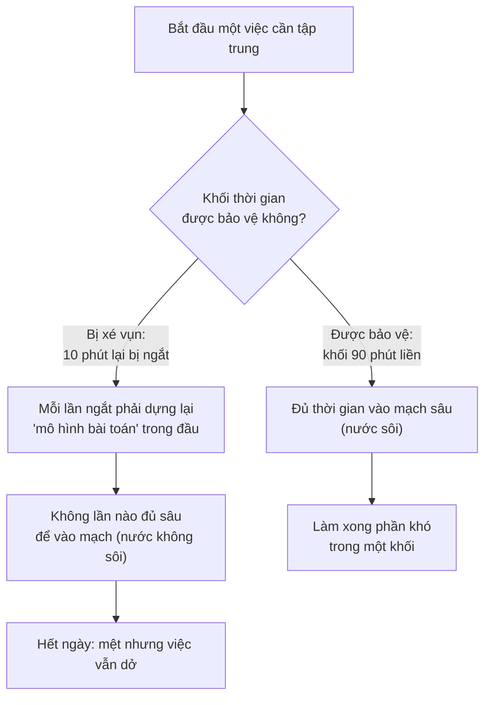

# Năng suất & tập trung khi remote — Output trên giờ ngồi

> **Tác giả:** Mr.Rom\
> **Phiên bản:** v1.0.0\
> **Tạo lúc:** 13/06/2026\
> **Cập nhật:** 13/06/2026\
> **Level:** Basic\
> **Tags:** career, remote-work, soft-skills, productivity, deep-work, focus, time-blocking, pomodoro, distractions, output-over-hours\
> **Yêu cầu trước:** [Cộng tác async khi remote](02_async-collaboration-remote.md)

> 🎯 *Bài trước dạy cách một nhóm remote chạy trơn dù khác múi giờ — phối hợp với người khác. Bài này quay vào trong: làm sao **chính bạn** giữ được tập trung và làm ra việc thật khi ngồi một mình ở nhà, nơi không sếp nào nhìn nhưng đầy thứ kéo bạn ra khỏi màn hình — gia đình, việc nhà, mạng xã hội, ba mươi tab đang mở. Bạn sẽ học cách dựng và bảo vệ khối deep work bằng time blocking và Pomodoro, dập từng loại xao nhãng tại nhà, đo bản thân bằng **output thay vì giờ online** (và vì sao "rung chuột giả bận" là tự hại), chống bẫy **always-on**, dựng một lịch ngày remote mẫu, và xếp việc theo nhịp năng lượng của chính bạn. Kết bài có checklist một ngày remote năng suất để dùng ngay.*

## 🎯 Sau bài này bạn sẽ

- [ ] Hiểu vì sao remote thưởng cho **output/impact** chứ không phải **giờ ngồi**, và vì sao "productivity theater" (diễn năng suất) là tự hại
- [ ] Dựng được khối **deep work** bằng **time blocking** và bảo vệ nó khỏi bị xé vụn
- [ ] Dùng **Pomodoro** để vào việc khi đầu óc ì và giữ tập trung theo từng đợt
- [ ] Nhận diện và dập bốn nguồn **xao nhãng tại nhà**: gia đình, việc nhà, mạng xã hội, tab/thông báo
- [ ] Chống bẫy **always-on** bằng cách đặt status, giờ làm rõ ràng và nghi thức tắt máy
- [ ] Xếp việc theo **nhịp sinh học** (chronotype) — làm việc khó vào giờ đầu óc sắc nhất
- [ ] Có một **lịch ngày remote mẫu** (sync + deep work + nghỉ) và checklist một ngày năng suất để áp dụng

---

## Tình huống — ngồi mười tiếng mà chẳng xong gì

Tua lại một ngày remote điển hình của rất nhiều người mới.

Bạn mở máy lúc 9 giờ, định "vào việc luôn". Nhưng trước hết kiểm tra Slack một chút — có ba tin nhắn, trả lời. Lướt email. Một thông báo điện thoại nhảy lên, cầm lên xem, dính mười phút Facebook. Quay lại định code thì mẹ nhờ ra nhận hàng. Về bàn, quên mất nãy đang làm tới đâu, mở lại file, đọc lại code của chính mình. Vừa bắt nhịp thì có người mention trong Slack, nhảy sang trả lời. Cứ thế. Đến tối nhìn lại, bạn đã ngồi trước màn hình gần mười tiếng, thấy **mệt như đã làm rất nhiều** — nhưng tính năng đang dở vẫn dở y như sáng. Tệ hơn, vì sợ team nghĩ mình lười, suốt ngày bạn để mắt tới Slack để "luôn hiện active", thi thoảng rung chuột cho status khỏi chuyển sang "away".

Vấn đề ở đây không phải bạn lười — bạn ngồi mười tiếng cơ mà. Vấn đề là mười tiếng đó bị **băm thành hàng chục mảnh vụn**, và không mảnh nào đủ dài để làm được việc thật. Đây là cái bẫy lớn nhất của remote: ở văn phòng, không gian và nhịp chung phần nào ép bạn vào guồng; ở nhà, **không có gì ép cả** — bạn vừa là người làm, vừa là người phải tự dựng hàng rào bảo vệ sự tập trung của mình.

Và có một sự thật giải phóng: trong môi trường remote, **không ai trả lương cho số giờ bạn ngồi** — họ trả cho thứ bạn **làm ra**. Tính năng chạy được, bug được sửa, tài liệu được viết. Mười tiếng bị băm vụn thua xa bốn tiếng tập trung sâu cộng phần còn lại nghỉ ngơi tử tế. Bài này dạy bạn cách dựng những khối tập trung sâu đó, dập thứ phá chúng, và đo mình bằng đúng thước đo — output, không phải giờ.

---

## 1️⃣ Output trên giờ ngồi — thước đo thật của remote

Trước khi nói kỹ thuật tập trung, phải chỉnh lại **thước đo** trong đầu bạn. Vì nếu bạn vẫn ngầm tin "làm việc chăm = ngồi nhiều giờ, luôn online", mọi kỹ thuật phía dưới sẽ bị bạn dùng sai mục đích.

Ở văn phòng truyền thống, người ta dễ lẫn lộn **sự hiện diện** với **năng suất**. Bạn tới sớm, ngồi lâu, trông bận rộn — sếp thấy và yên tâm, dù thực tế bạn làm được bao nhiêu thì khó đo. Remote phá vỡ ảo giác đó: sếp không nhìn thấy bạn ngồi, nên thứ duy nhất họ thấy là **kết quả bạn giao**. Điều này nghe đáng sợ với người quen "diễn sự chăm chỉ", nhưng thật ra là một món quà — nó thưởng cho người làm ra việc thật, bất kể họ mất bốn giờ hay tám giờ.

🪞 **Ẩn dụ**: hãy nghĩ về sự khác nhau giữa **trả công thợ may theo giờ** và **trả theo số áo may xong**. Trả theo giờ thì người ngồi lề mề cả ngày may được một áo cũng nhận như người may ba áo — và ai cũng có động cơ "ngồi cho hết giờ". Remote giống trả theo số áo: ai may được nhiều áo tốt thì được ghi nhận, còn "ngồi ở xưởng bao lâu" không còn là thứ được tính. Khi hiểu mình được trả theo áo, bạn tự nhiên thôi đếm giờ và bắt đầu hỏi "làm sao may được nhiều áo tốt hơn".

Để thấy rõ sự dịch chuyển này, hãy đặt hai thước đo cạnh nhau. Cột bên trái là cách nghĩ cũ kéo bạn vào cái bẫy mười tiếng băm vụn; cột bên phải là cách nghĩ giúp bạn làm ít giờ hơn mà giao nhiều hơn:

| Khía cạnh | ❌ Đo bằng giờ / sự hiện diện | ✅ Đo bằng output / impact |
|---|---|---|
| Câu hỏi tự kiểm cuối ngày | "Mình đã ngồi đủ 8 tiếng chưa?" | "Hôm nay mình giao được gì có giá trị?" |
| Dấu hiệu "đang làm việc" | Status luôn xanh, trả lời chat tức thì | Tính năng/PR/tài liệu hoàn thành |
| Điều được khen | "Lúc nào cũng thấy online" | "Việc giao luôn xong và chất lượng" |
| Khi cần nghỉ | Thấy tội lỗi vì "chưa đủ giờ" | Nghỉ thoải mái nếu việc trong ngày đã xong tốt |
| Phản ứng tự nhiên | Kéo dài thời gian ngồi cho "an tâm" | Tối ưu để làm xong nhanh và tốt hơn |

→ Điểm cốt lõi không phải "làm ít giờ đi", mà là **đổi câu hỏi cuối ngày** từ *"mình ngồi đủ chưa"* sang *"mình giao được gì chưa"*. Khi câu hỏi đổi, mọi thứ khác đổi theo: bạn thôi tối ưu cho việc "trông bận", và bắt đầu tối ưu cho việc làm ra kết quả. Phần còn lại của bài là các công cụ để làm ra kết quả đó.

> [!NOTE]
> Đo bằng output **không có nghĩa là** bỏ giao tiếp hay biến mất khỏi team. Trả lời kịp thời, cập nhật status, có mặt trong giờ overlap vẫn quan trọng — đó là phần "cộng tác" đã học ở [bài async](02_async-collaboration-remote.md). Ý ở đây là: đừng nhầm *việc luôn-hiện-online* là *mục tiêu*. Online là để cộng tác khi cần, không phải để chứng minh mình chăm.

### Productivity theater — "rung chuột giả bận" là tự hại

Khi sợ bị đánh giá là lười, nhiều người remote rơi vào **productivity theater** (diễn năng suất) — bỏ công sức để **trông** bận thay vì để **làm ra việc**. Biểu hiện kinh điển: cài app rung chuột tự động cho status khỏi chuyển sang "away", trả lời chat trong vài giây để chứng minh "em luôn ở đây", gửi tin nhắn lúc nửa đêm để sếp thấy "em làm khuya".

Vì sao đây là **tự hại**, chứ không chỉ vô hại:

- **Tốn năng lượng thật cho việc giả** — mỗi lần nhảy ra trả lời chat ngay để "trông active" là một lần bạn phá vỡ khối tập trung của chính mình. Bạn đốt nhiên liệu quý nhất (sự tập trung) vào việc diễn, rồi không còn đủ cho việc thật.
- **Tự nuôi một tiêu chuẩn sẽ giết bạn** — nếu bạn xây hình ảnh "luôn trả lời trong 30 giây, luôn online tới khuya", người ta sẽ **kỳ vọng** đúng vậy mãi. Bạn tự đặt mình vào bẫy always-on (xem §6).
- **Không qua mặt được lâu** — output mới là thứ hiện ra cuối cùng. Người rung chuột giả bận nhưng tính năng không xong sẽ lộ ra sớm; còn người tập trung làm ra việc thì không cần diễn gì cả.

> [!WARNING]
> Đừng dùng "đo bằng output" làm cớ để biến mất hoàn toàn rồi đến hạn mới xuất hiện. Đo bằng output đi **đôi với** cập nhật status chủ động (đã học ở bài async): bạn vẫn báo "đang làm gì, tới đâu, có kẹt không" để team yên tâm — nhưng bằng **kết quả và cập nhật thật**, không bằng cách diễn sự hiện diện. Im lặng cả ngày rồi nói "em làm việc theo output" là hiểu sai, không phải làm đúng.

---

## 2️⃣ Deep work — vì sao khối tập trung dài là vàng

Bạn đã chỉnh thước đo sang output. Câu hỏi tiếp theo: output của một dev được tạo ra **trong trạng thái nào**? Câu trả lời gần như luôn là **deep work**.

**Deep work** (làm việc sâu) — khái niệm phổ biến bởi Cal Newport — là **những quãng tập trung cao độ, không gián đoạn, vào một việc đòi hỏi nhận thức cao**. Với dev, đó là lúc bạn giữ được cả một bài toán trong đầu: cấu trúc code, các nhánh logic, dữ liệu chạy qua đâu. Ngược lại là **shallow work** (làm việc nông) — những việc nhẹ nhàng, dễ làm trong lúc phân tâm: trả lời chat, sắp lịch, sửa một dòng vặt.

Điều khiến deep work đặc biệt đắt giá với lập trình là **chi phí khởi động lại sau khi bị ngắt**. Khi đang giữ cả mô hình bài toán trong đầu mà bị một thông báo kéo ra, bạn không mất "vài giây" — bạn mất cả công sức dựng lại mô hình đó từ đầu. Đây gọi là **context switching** (chuyển ngữ cảnh), và nó là kẻ thù số một của năng suất dev.

🪞 **Ẩn dụ**: deep work giống **đun một nồi nước lên sôi**. Phải mất một lúc nước mới nóng dần tới sôi (vào được mạch tập trung). Mỗi lần bạn bị ngắt và nhấc nồi ra khỏi bếp — dù chỉ một phút trả lời chat — nước **nguội lại**, và lần sau bạn phải đun lại gần từ đầu. Mười lần ngắt trong một giờ nghĩa là nồi nước **không bao giờ sôi**: bạn tốn nhiên liệu cả buổi mà chẳng nấu được gì. Một khối hai giờ liền mạch đun được nước sôi và nấu xong món; còn mười hai khối mười phút thì chỉ làm nước âm ấm.

Khái niệm "chi phí ngắt quãng" này khá trừu tượng, nên hãy hình dung qua sơ đồ dưới: nó so cùng một lượng thời gian, một bên bị xé vụn, một bên giữ liền khối, và vì sao kết quả khác nhau một trời một vực.



→ Điểm rút ra từ sơ đồ: thời gian tập trung **không cộng tuyến tính**. Sáu khối mười phút **không** bằng một khối sáu mươi phút — vì mỗi khối nhỏ tốn phần lớn thời gian chỉ để khởi động lại, chưa kịp sâu đã hết. Vì thế mục tiêu không phải "có nhiều giờ tập trung" mà là "có vài **khối liền** đủ dài". Hai section tiếp theo là hai công cụ để tạo và bảo vệ những khối đó: time blocking và Pomodoro.

---

## 3️⃣ Time blocking — đặt lịch hẹn với chính mình

Nếu deep work cần những khối dài được bảo vệ, thì câu hỏi là: làm sao **dành chỗ** cho chúng giữa một ngày đầy chat, họp và việc vặt? Câu trả lời là **time blocking** (chia khối thời gian).

**Time blocking** là việc chia ngày thành các khối thời gian, mỗi khối **gán trước cho một loại việc cụ thể**, thay vì để cả ngày trôi theo "việc gì nổi lên thì làm nấy". Khác biệt cốt lõi: thay vì một danh sách to-do mơ hồ (dễ bị chat và thông báo xén dần), bạn đặt **lịch hẹn cụ thể** cho từng việc — kể cả việc deep work.

🪞 **Ẩn dụ**: một ngày không time-block giống một **cái vali nhét đồ lung tung** — bạn cứ ném đại vào, cuối cùng đầy mà vẫn thiếu chỗ cho thứ quan trọng, và món to (deep work) không bao giờ lọt vào vì toàn món vụn chiếm chỗ. Time blocking giống **xếp vali có ngăn**: ngăn to dành sẵn cho món to (khối deep work), ngăn nhỏ cho món vặt (chat, email). Có ngăn riêng thì món to luôn có chỗ, và món vặt không tràn lan chiếm hết.

Cách làm cụ thể, gói trong ba bước:

1. **Đặt khối deep work trước, vào giờ đầu óc sắc nhất.** Đây là việc quan trọng nhất nên được "chỗ ngồi tốt nhất". Đa số người làm não sắc nhất vào buổi sáng (xem §7 về nhịp sinh học) — hãy đặt khối khó ở đó, **trước** khi mở chat.
2. **Gom việc vặt thành vài khối cố định.** Thay vì trả lời chat/email rải rác cả ngày (mỗi lần là một cú ngắt), gom chúng vào 2-3 khối "xử lý liên lạc" (vd giữa buổi, đầu giờ chiều). Ngoài các khối đó, chat ở chế độ không-quấy-rầy.
3. **Đặt cả khối nghỉ và khối đệm.** Nghỉ không phải "thời gian thừa" — nó là một phần của lịch (xem §6). Khối đệm (buffer) là khoảng trống nhỏ giữa các khối để việc tràn giờ không phá đổ cả ngày.

Để dễ hình dung, đây là một buổi sáng được time-block — chú ý khối deep work nằm **đầu tiên** và chat bị gom lại, không rải rác:

```text
09:00 – 09:15  Lên kế hoạch ngày: chọn 1-2 việc QUAN TRỌNG NHẤT
09:15 – 11:00  🔒 DEEP WORK — làm việc khó nhất (chat ở chế độ DND)
11:00 – 11:15  Nghỉ ngắn (rời màn hình)
11:15 – 11:45  Khối liên lạc: trả lời chat/email gom lại, review PR nhẹ
11:45 – 12:30  🔒 DEEP WORK (tiếp) hoặc việc quan trọng thứ hai
12:30 – 13:30  Nghỉ trưa thật (không vừa ăn vừa nhìn màn hình)
```

→ So với ngày "việc gì nổi lên làm nấy" ở đầu bài, lịch này khác ở chỗ deep work **được đặt chỗ trước và bảo vệ**, còn chat — thứ hay băm vụn ngày nhất — bị nhốt vào một khối 30 phút thay vì rải khắp nơi. Bạn không cần theo lịch này y hệt; điều cần giữ là **nguyên tắc**: việc khó đi trước và liền khối, việc vặt gom lại.

> [!TIP]
> Một mẹo nhỏ tạo khác biệt lớn: **đặt khối deep work thành một sự kiện thật trong lịch (calendar)**, không chỉ ghi trong đầu. Khi nó là một "cuộc hẹn" hiện trên calendar, hai điều xảy ra: chính bạn tôn trọng nó hơn (như tôn trọng một cuộc họp), và đồng nghiệp nhìn calendar thấy bạn "bận" nên không xếp họp đè lên. Một số người đặt tên thẳng là "Focus block" để team hiểu đây là giờ không nên ngắt.

### Bảo vệ khối tập trung — hàng rào quanh giờ deep work

Đặt được khối deep work mới là một nửa; nửa còn lại khó hơn: **giữ cho nó không bị xé**. Một khối deep work không được bảo vệ thì chẳng khác gì không có. Vài hàng rào cụ thể, từ dễ tới mạnh:

- **Tắt thông báo trong khối** — đặt chat (Slack/Teams) ở chế độ Do Not Disturb, tắt thông báo điện thoại. Mỗi thông báo là một cú nhấc nồi khỏi bếp.
- **Báo trước cho team** — đặt status kiểu "🔒 Focus tới 11:00, ngoài việc gấp nhắn sau giúp em". Người ta tôn trọng nếu họ **biết**; họ ngắt bạn vì họ tưởng bạn rảnh.
- **Đóng mọi tab/app không liên quan** — chỉ để mở đúng thứ cần cho việc đang làm (xem §5 về tab). Tab Facebook mở sẵn là một lời mời gọi.
- **Một việc một khối** — một khối deep work chỉ làm **một** việc. "Vừa code vừa thi thoảng liếc email" không phải deep work, đó là shallow work ngụy trang.

> [!IMPORTANT]
> Bảo vệ khối tập trung **không** mâu thuẫn với việc trả lời kịp thời. Mấu chốt là phân biệt "gấp thật" và "tưởng gấp". Hầu hết chat **không** cần trả lời trong 30 giây — chúng có thể đợi tới khối liên lạc kế tiếp. Bạn vẫn nên có mặt cho việc thực sự khẩn cấp (sự cố production, sếp gọi gấp) — nên hãy báo rõ cho team kênh nào dùng cho "gấp thật" để bạn yên tâm tắt thông báo cho phần còn lại. Đây chính là tinh thần async đã học ở bài trước, áp dụng cho việc bảo vệ giờ riêng.

---

## 4️⃣ Pomodoro — vào việc khi đầu óc ì, giữ nhịp khi đang chạy

Time blocking dành chỗ cho deep work, nhưng có một vấn đề rất người: nhiều khi đã đặt khối rồi mà vẫn **không vào được việc** — ngồi xuống là thấy ngại, mở file ra là muốn lướt điện thoại. Đây là lúc **Pomodoro** giúp bạn.

**Pomodoro** (kỹ thuật Pomodoro, do Francesco Cirillo đặt ra) là cách chia việc thành các phiên ngắn cố định: làm **tập trung một khoảng** (kinh điển là 25 phút), rồi **nghỉ ngắn** (5 phút), lặp lại; sau khoảng bốn phiên thì nghỉ dài hơn (15-30 phút). "Pomodoro" tiếng Ý nghĩa là "quả cà chua" — theo tên chiếc đồng hồ hẹn giờ hình cà chua tác giả dùng.

Vì sao một mẹo đơn giản vậy lại hiệu quả? Vì nó đánh đúng hai điểm yếu của bộ não khi làm việc:

- **Hạ rào cản bắt đầu.** Phần khó nhất luôn là *bắt đầu*. "Làm việc này cho xong" nghe nặng nề; "tập trung đúng 25 phút rồi được nghỉ" nghe nhẹ tênh — ai cũng chịu được 25 phút. Mà một khi đã bắt đầu và vào nhịp, bạn thường làm tiếp qua cả tiếng. Pomodoro là cách lừa bản thân vượt qua sức ì ban đầu.
- **Ép nghỉ trước khi kiệt.** Nghỉ ngắn đều đặn giữ đầu óc tươi, tránh kiểu cày liền tù tì tới mức tập trung tụt dần mà không nhận ra. Não tập trung tốt theo **từng đợt**, không phải một mạch dài vô tận.

🪞 **Ẩn dụ**: Pomodoro giống **chạy bộ theo quãng (interval)** thay vì cố chạy marathon một mạch không nghỉ. Người mới cố chạy liền 10 km thường gục giữa đường; chạy xen kẽ "chạy nhanh một quãng — đi bộ hồi sức — lại chạy" thì đi được xa hơn nhiều. 25 phút tập trung là một "quãng chạy", 5 phút nghỉ là "đi bộ hồi sức". Bí quyết không phải gồng để không bao giờ nghỉ, mà là **nghỉ đúng nhịp để chạy được lâu**.

Cách áp dụng cho một buổi làm việc dev, theo từng bước:

1. **Chọn đúng một việc** cho phiên này (không phải "làm linh tinh"). Ví dụ: "viết hàm xử lý thanh toán thất bại".
2. **Đặt hẹn giờ 25 phút**, tắt thông báo, làm **chỉ việc đó** — không liếc chat, không mở tab mới.
3. **Hết 25 phút, dừng và nghỉ 5 phút** — đứng dậy, rời màn hình, nhìn ra xa, uống nước. **Không** lướt điện thoại (màn hình không phải nghỉ ngơi cho mắt và não).
4. **Lặp lại.** Sau bốn phiên (≈ 2 giờ), nghỉ dài 15-30 phút.

> [!TIP]
> Đừng cứng nhắc với con số 25/5. Nó chỉ là điểm khởi đầu. Nếu bạn đã vào sâu mạch tập trung khi chuông reo, **cứ làm tiếp** — đừng phá mạch chỉ để theo luật (lúc này bạn đã vào deep work, để nồi nước sôi tiếp). Nhiều dev thích phiên dài hơn (45-50 phút làm, 10 phút nghỉ) cho công việc cần ngâm sâu. Pomodoro là công cụ phục vụ bạn, không phải luật để bạn phục tùng. Dùng nó **đặc biệt cho những ngày khó vào việc** — như một cú hích để bắt đầu.

Time blocking và Pomodoro không loại trừ nhau — chúng ghép rất hợp: time blocking quyết định **khi nào** làm deep work (đặt khối 90 phút buổi sáng), còn Pomodoro quyết định **làm thế nào** để duy trì tập trung **bên trong** khối đó (chia khối 90 phút thành các phiên có nghỉ xen kẽ).

---

## 5️⃣ Xao nhãng tại nhà — dập từng nguồn một

Văn phòng cũng có xao nhãng (đồng nghiệp tán gẫu, họp), nhưng nhà có một bộ xao nhãng riêng, âm thầm và dai dẳng hơn — vì ở nhà, ranh giới giữa "đang làm việc" và "đang ở nhà" mờ đi. Có bốn nguồn lớn, và mỗi nguồn cần một cách dập khác nhau. Đánh đồng tất cả thành "thiếu kỷ luật" là vô ích; phải gọi tên và xử từng nguồn.

Bảng dưới gom bốn nguồn xao nhãng tại nhà phổ biến nhất, vì sao chúng đặc biệt khó ở nhà, và cách dập cụ thể từng cái:

| Nguồn xao nhãng | Vì sao khó ở nhà | Cách dập |
|---|---|---|
| **Gia đình / người ở chung** | Người nhà tưởng "ở nhà = rảnh", dễ nhờ vặt; trẻ con không phân biệt giờ làm | Thống nhất **quy ước rõ**: giờ này con đang làm việc; dùng tín hiệu thị giác (đóng cửa / đeo tai nghe = "đừng ngắt"); báo trước khung giờ deep work |
| **Việc nhà** | Đống bát, máy giặt, nhà bừa luôn trong tầm mắt, "làm nốt cho xong" rất cám dỗ | **Tách giờ rạch ròi**: việc nhà vào giờ nghỉ/sau giờ làm, không xen vào khối deep work; coi giờ làm như đang ở văn phòng (không ai rửa bát giữa giờ làm ở công ty) |
| **Mạng xã hội** | Một cú chạm là vào, thiết kế để gây nghiện; "xem 1 phút" thành 30 phút | Đăng xuất khỏi mạng xã hội trên máy làm việc; để điện thoại **ngoài tầm với** trong khối deep work; dùng app chặn site trong giờ tập trung |
| **Tab / thông báo** | 30 tab mở sẵn + thông báo nhảy liên tục = mời gọi context switching mọi lúc | Đóng mọi tab không liên quan trước khối deep work; tắt thông báo (DND); để điện thoại im lặng, úp màn hình |

→ Để ý điểm chung của cột "Cách dập": gần như tất cả đều là **thiết kế môi trường trước**, không phải "cố cưỡng lại" trong lúc làm. Ý chí thua môi trường gần như mọi lần — bạn sẽ không thắng nổi cú cám dỗ "xem Facebook một phút" nếu nó chỉ cách một cú chạm; nhưng nếu đã đăng xuất và để điện thoại ở phòng khác, cám dỗ đó gần như biến mất vì rào cản tăng lên. Dập xao nhãng = dựng rào trước, không phải gồng mình sau.

Hai nguồn đầu (gia đình, việc nhà) đáng nói thêm vì chúng là đặc sản của remote và hay bị xem nhẹ.

### Gia đình & người ở chung — quy ước trước, không cáu sau

Người nhà ngắt bạn không phải vì họ vô tâm — mà vì với họ, "bạn đang ở nhà" trông không khác gì "bạn đang rảnh". Lỗi thường nằm ở chỗ bạn **chưa bao giờ nói rõ** khi nào mình thật sự không nên bị ngắt. Cách xử lý là một cuộc trao đổi đơn giản, **trước**, không phải một cơn bực **sau**:

- Thống nhất **khung giờ làm** với người nhà, đặc biệt nêu rõ khối deep work ("9 đến 11 sáng là lúc con cần tập trung nhất, có gì để sau 11 giờ giúp con nha").
- Dùng **tín hiệu thị giác** dễ hiểu: cửa đóng = đang họp/tập trung; đeo tai nghe = "đừng ngắt trừ khi gấp". Tín hiệu rõ giúp người nhà khỏi phải đoán.
- Cho người nhà biết **khi nào bạn rảnh** (giờ nghỉ, giờ ăn) để họ có "cửa" hợp lý nhờ vả — họ dễ tôn trọng giờ làm của bạn hơn khi biết mình vẫn có lúc tiếp cận được.

### Việc nhà — kẻ xao nhãng "trông như có ích"

Việc nhà nguy hiểm hơn mạng xã hội ở một điểm: nó **trông có ích**, nên dễ tự lừa "mình đâu có lười, mình đang rửa bát mà". Nhưng giữa khối deep work, rửa bát cũng là một cú nhấc nồi khỏi bếp y như lướt Facebook — nó cắt mạch tập trung của bạn không thương tiếc. Cách chữa là **tách giờ rạch ròi**: việc nhà có giờ của nó (giờ nghỉ, trước/sau giờ làm), không lấn vào khối làm việc. Một mẹo tư duy hữu ích: trong giờ làm, hãy coi mình **như đang ở văn phòng** — ở văn phòng bạn không đứng dậy rửa bát giữa giờ, thì ở nhà cũng vậy. Đống việc nhà sẽ vẫn còn đó lúc bạn nghỉ; nó không đi đâu cả.

---

## 6️⃣ Chống always-on — giờ làm rõ ràng và nghi thức tắt máy

Có một nghịch lý của remote: ban đầu bạn sợ không đủ tập trung; nhưng một cái bẫy ngược, âm thầm và nguy hiểm hơn, là **always-on** — không bao giờ thật sự *tắt máy*. Khi nơi làm việc cũng là nơi ở, ranh giới "hết giờ làm" tan biến: laptop luôn ở đó, chat luôn trong túi, và "làm thêm chút nữa" không bao giờ kết thúc. Hệ quả không chỉ là mệt — nó dẫn thẳng tới burnout (chủ đề của bài tiếp theo về sức khoẻ tinh thần).

🪞 **Ẩn dụ**: ở văn phòng, hành động **đứng dậy ra về** là một nghi thức rõ ràng — bạn đóng máy, đi ra cửa, và bộ não nhận tín hiệu "hết giờ rồi, được tắt". Remote xoá mất nghi thức đó: bạn không "ra về" khỏi chính phòng mình. Kết quả là não **không bao giờ nhận được tín hiệu tắt**, cứ lấn cấn công việc cả buổi tối — như một cái máy không có nút tắt, chỉ luôn ở chế độ chờ, nóng âm ỉ. Chống always-on chính là **tự dựng lại cái nút tắt** đó.

Vì sao always-on lại đặc biệt hại với người mới remote:

- **Không có nút tắt thì không bao giờ hồi sức** — nghỉ ngơi thật cần một ranh giới rõ. "Lúc nào cũng hơi-đang-làm" nghĩa là lúc nào cũng không-thật-nghỉ, và năng lượng cạn dần mà không kịp nạp lại.
- **Tự đặt một tiêu chuẩn không bền** — nếu bạn trả lời chat lúc 11 giờ đêm, người ta học được rằng "nhắn lúc nào cũng được trả lời", và kỳ vọng đó lớn dần. Bạn vô tình tự ký một hợp đồng làm-không-giờ-giấc.
- **Năng suất hôm sau tụt** — làm khuya cướp giấc ngủ, mà giấc ngủ chính là lúc não củng cố thứ học được và nạp lại năng lượng cho deep work ngày mai. Cày đêm nay là vay năng suất của ngày mai.

Cách dựng lại ranh giới, rất cụ thể:

- **Đặt giờ làm rõ ràng và công khai** — quyết định "mình làm từ mấy giờ tới mấy giờ" và cho team biết (qua giờ làm trong calendar/profile). Có giờ kết thúc rõ thì mới có cái để tôn trọng.
- **Đặt status và tôn trọng nó** — hết giờ thì để status "ngoài giờ làm", tắt thông báo chat trên điện thoại. Status không chỉ báo cho người khác — nó báo cho **chính bạn** rằng đã hết giờ.
- **Tạo nghi thức tắt máy (shutdown ritual)** — một chuỗi hành động nhỏ cố định cuối ngày để báo não "xong rồi": ghi nhanh việc đã làm + việc mai làm, đóng hết tab, **đóng laptop hẳn**, rời khỏi bàn làm việc. Nghi thức này thay cho hành động "ra về" đã mất.
- **Tách không gian nếu có thể** — nếu nhà đủ chỗ, một góc chỉ-để-làm-việc giúp "rời góc đó" trở thành tín hiệu hết giờ (đã bàn ở bài [thiết lập môi trường](01_setup-and-environment.md)).

Một nghi thức tắt máy mẫu, đủ ngắn để làm được mỗi ngày:

```text
🔚 Nghi thức tắt máy cuối ngày (làm nhanh vài thao tác)

1. Ghi nhanh: hôm nay xong gì, mai làm gì đầu tiên (cho "mình của ngày mai")
2. Đẩy code / lưu lại việc đang dở để khỏi mất
3. Đóng hết tab và app công việc
4. Đặt status chat sang "ngoài giờ làm" + tắt thông báo trên điện thoại
5. Đóng laptop hẳn, đứng dậy rời bàn — "tan ca"
```

→ Bước 1 không chỉ để nhớ việc — nó "đổ" những lo lắng công việc còn lởn vởn trong đầu ra giấy, để bạn thôi nghĩ về chúng buổi tối (não bám vào việc dở chính là thứ khiến bạn không nghỉ được). Bước 5 — *đóng laptop hẳn và rời bàn* — là cú "ra về" tượng trưng quan trọng nhất: nó là tín hiệu rõ ràng nhất báo cho não rằng ngày làm việc đã thật sự kết thúc.

> [!IMPORTANT]
> Chống always-on **không phải** là cứng nhắc bỏ mặc mọi thứ đúng giờ bất kể tình huống. Sẽ có ngày sự cố production hay deadline gấp cần bạn làm thêm — điều đó bình thường. Vấn đề là **đường mặc định**: mặc định của bạn nên là *có giờ tắt rõ ràng*, và làm-thêm là **ngoại lệ có chủ đích**, không phải trạng thái thường trực. Một người luôn online "phòng khi cần" sẽ kiệt sức trước khi cái "khi cần" thật sự tới.

---

## 7️⃣ Nhịp sinh học — xếp việc theo lúc đầu óc sắc nhất

Đến giờ ta đã có công cụ tạo và bảo vệ khối tập trung. Câu hỏi cuối làm chúng hiệu quả gấp bội: **đặt khối khó nhất vào lúc nào trong ngày?** Một lợi thế lớn (mà ít người tận dụng) của remote là bạn thường **tự chọn được** điều này — và nên chọn theo **nhịp sinh học** của chính mình.

Năng lượng tinh thần của bạn **không phẳng** suốt ngày — nó lên xuống theo một nhịp. Đa số người có một quãng **đầu óc sắc nhất** (thường buổi sáng sau khi tỉnh táo hẳn), một quãng **chùng xuống** (kinh điển là sau bữa trưa, đầu giờ chiều), rồi đôi khi nhích lên lại. Kiểu nhịp riêng của mỗi người gọi là **chronotype** (kiểu nhịp sinh học): có người là "chim sớm" (sắc nhất buổi sáng), có người "cú đêm" (sắc nhất buổi tối).

Nguyên tắc vàng đơn giản tới mức dễ bị bỏ qua: **làm việc khó nhất vào giờ đầu óc sắc nhất; để việc nhẹ vào giờ chùng.** Phần lớn người mới làm **ngược lại** — sáng tỉnh táo thì đem "khởi động nhẹ" bằng cách dọn email và lướt chat, đến lúc đầu óc đã cùn (đầu chiều) mới ngồi vào việc khó. Thế là bạn tiêu hoang quãng vàng vào việc vặt, rồi vật lộn với việc khó bằng một cái đầu đã hết pin.

🪞 **Ẩn dụ**: năng lượng đầu óc trong ngày giống **pin điện thoại**: sáng đầy, rồi vơi dần, dùng nhiều thì tụt nhanh. Việc khó (deep work) là **app ngốn pin nhất**. Người khôn ngoan mở app ngốn pin khi pin còn đầy (sáng), để các app nhẹ (đọc email, họp nhẹ) cho lúc pin yếu (chiều). Người làm ngược — đợi pin gần cạn mới mở app nặng — thì máy giật lag, làm gì cũng ì ạch. Bạn không tạo thêm được pin, nhưng bạn **chọn được dùng nó cho việc gì lúc nào**.

Cách xếp việc theo các quãng năng lượng điển hình trong ngày:

| Quãng trong ngày | Mức năng lượng (điển hình) | Loại việc nên xếp |
|---|---|---|
| Đầu buổi (sau khi tỉnh hẳn) | Cao nhất với "chim sớm" | 🔒 Deep work — việc khó, cần nghĩ sâu (code logic phức tạp, thiết kế) |
| Giữa buổi | Còn cao | Tiếp deep work hoặc việc quan trọng thứ hai |
| Sau trưa (đầu chiều) | Chùng xuống rõ | Việc nhẹ: trả lời chat/email, review nhẹ, họp, việc hành chính |
| Cuối buổi | Nhích lên lại (tuỳ người) | Việc vừa: dọn dẹp, lên kế hoạch mai, học/đọc nhẹ |

→ Bảng trên là **mẫu cho người "chim sớm"** — nếu bạn là "cú đêm" và làm việc cho team cho phép giờ linh hoạt, hãy đảo lại: đặt deep work vào quãng bạn thật sự sắc nhất. Điểm bất biến không phải "phải làm việc khó buổi sáng", mà là **biết quãng sắc nhất của riêng mình và dành nó cho việc khó nhất**. Để tìm ra quãng đó, hãy để ý trong một tuần: lúc nào bạn vào mạch tập trung dễ nhất, lúc nào chỉ muốn làm việc tay chân nhẹ.

> [!TIP]
> Một cách tự khám phá chronotype của bạn: trong một tuần, mỗi vài tiếng tự chấm "mức tỉnh táo" của mình (1-5) và ghi lại. Sau một tuần bạn sẽ thấy một khuôn mẫu — quãng nào điểm cao đều là quãng vàng của bạn. Đừng đoán theo "người ta bảo sáng tốt nhất"; đo trên chính bạn. Đây là một trong những phần thưởng lớn nhất của remote: bạn được uốn ngày làm việc theo sinh học của mình thay vì theo một giờ hành chính cứng.

---

## 8️⃣ Lịch ngày remote mẫu — ghép tất cả lại

Giờ ghép mọi mảnh — deep work, time blocking, Pomodoro, dập xao nhãng, chống always-on, nhịp sinh học — thành một **lịch ngày remote** chạy được. Đây là một **khung mẫu để bạn sửa**, không phải luật; điều cần giữ là **các nguyên tắc** đằng sau nó, sẽ chỉ ra ngay bên dưới lịch.

Lịch này giả định một người "chim sớm" làm giờ hành chính linh hoạt; bạn đổi giờ cho hợp nhịp của mình:

```text
🌅 08:30 – 09:00   Bắt đầu mềm: cà phê, KHÔNG mở chat ngay
                   (giữ quãng vàng cho deep work, không để chat xén)

📝 09:00 – 09:15   Lên kế hoạch ngày: chọn 1-2 việc QUAN TRỌNG NHẤT
                   Đặt status "🔒 Focus tới 11:00"

🔒 09:15 – 11:00   DEEP WORK #1 — việc khó nhất (chat DND, tab sạch)
                   Bên trong: các phiên Pomodoro có nghỉ ngắn xen kẽ

☕ 11:00 – 11:15   Nghỉ ngắn THẬT — rời màn hình, đi lại, uống nước

💬 11:15 – 12:00   Khối liên lạc: trả lời chat/email gom lại, review PR,
                   giờ overlap để đồng bộ với team (xem bài async)

🍜 12:00 – 13:00   Nghỉ trưa THẬT — không vừa ăn vừa nhìn màn hình

🔒 13:00 – 14:30   DEEP WORK #2 — việc quan trọng thứ hai
                   (nếu đầu chiều chùng: chọn việc khó VỪA, không nặng nhất)

💬 14:30 – 15:30   Việc nhẹ theo nhịp chiều: họp, review, việc hành chính

🔁 15:30 – 16:30   Việc vừa / dọn dẹp / học-đọc nhẹ / đệm cho việc tràn giờ

🔚 16:30 – 17:00   Nghi thức tắt máy: ghi việc mai, đẩy code, đóng tab,
                   đặt status "ngoài giờ", ĐÓNG LAPTOP, rời bàn — tan ca
```

→ Lịch trông kín, nhưng để ý nó thể hiện đúng các nguyên tắc đã học, không phải nhồi cho đầy:

- **Deep work đi trước, vào quãng vàng** (§3, §7) — việc khó nhất nằm ở 09:15, không phải đầu chiều.
- **Chat bị gom thành khối** (§3) — không rải rác cả ngày; quãng vàng buổi sáng được giữ sạch khỏi chat.
- **Nghỉ là một phần của lịch, không phải thời gian thừa** (§4, §6) — nghỉ ngắn giữa khối, nghỉ trưa thật, đều có chỗ chính thức.
- **Việc xếp theo năng lượng** (§7) — deep work nặng nhất buổi sáng, việc nhẹ vào đầu chiều khi chùng.
- **Có nghi thức tắt máy đóng ngày** (§6) — ngày kết thúc bằng một cú "tan ca" rõ ràng, không lấn cấn buổi tối.
- **Có khối đệm** (15:30–16:30) — để việc tràn giờ không phá đổ cả lịch.

So với "ngày mười tiếng băm vụn" ở đầu bài, lịch này có thể **ít giờ ngồi hơn** nhưng làm ra **nhiều hơn hẳn** — vì nó dành những quãng tốt nhất, liền nhất cho việc quan trọng nhất, và bảo vệ chúng. Đó chính là "output trên giờ ngồi" trong thực tế.

---

## 💡 Cạm bẫy thường gặp & Best practice

### ❌ Cạm bẫy: đo bản thân bằng giờ online, rơi vào productivity theater

- **Triệu chứng**: cả ngày để mắt giữ status xanh, trả lời chat trong vài giây để "trông active", rung chuột giả bận, gửi tin nửa đêm để thể hiện chăm; cuối ngày mệt nhưng việc thật vẫn dở.
- **Nguyên nhân**: mang tư duy "chăm = ngồi nhiều giờ, luôn hiện diện" từ văn phòng vào remote; sợ bị đánh giá lười nên tối ưu cho việc *trông* bận thay vì *làm ra* việc.
- **Cách tránh**: đổi câu hỏi cuối ngày từ "mình ngồi đủ chưa" sang "mình giao được gì chưa". Dồn năng lượng vào output; báo tiến độ bằng kết quả và cập nhật status thật (không bằng diễn hiện diện). Hiểu rằng diễn bận đốt đúng nhiên liệu (sự tập trung) mà đáng ra dành cho việc thật.

### ❌ Cạm bẫy: để khối tập trung bị băm vụn bởi chat và thông báo

- **Triệu chứng**: cứ vài phút lại liếc Slack/điện thoại, "việc gì nổi lên làm nấy"; không lần nào vào được mạch sâu; tính năng khó kéo dài nhiều ngày không xong.
- **Nguyên nhân**: tưởng mọi chat đều cần trả lời ngay; không có khối deep work được đặt chỗ và bảo vệ; thông báo bật suốt nên mỗi cái là một cú context switching.
- **Cách tránh**: time-block một khối deep work vào quãng vàng, đặt nó thành sự kiện calendar; trong khối bật DND, đóng tab thừa, báo status "Focus"; gom chat thành 2-3 khối liên lạc. Phân biệt "gấp thật" (có kênh riêng) với "tưởng gấp" (đợi được tới khối kế).

### ❌ Cạm bẫy: always-on — không bao giờ thật sự tắt máy

- **Triệu chứng**: trả lời chat lúc khuya, "làm thêm chút nữa" mỗi tối, laptop luôn mở; dần kiệt sức, năng suất hôm sau tụt, không còn ranh giới giữa làm và nghỉ.
- **Nguyên nhân**: nơi làm cũng là nơi ở nên mất nghi thức "ra về"; sợ không trả lời ngay thì bị coi là lười; tự đặt tiêu chuẩn "luôn sẵn sàng".
- **Cách tránh**: đặt giờ làm rõ ràng và công khai; hết giờ để status "ngoài giờ" và tắt thông báo điện thoại; làm một nghi thức tắt máy (ghi việc mai, đóng tab, đóng laptop hẳn, rời bàn). Coi làm-thêm là ngoại lệ có chủ đích, không phải mặc định.

### ✅ Best practice: bảo vệ khối deep work như bảo vệ một cuộc họp

- **Vì sao**: output của dev được tạo ra trong deep work; thời gian tập trung không cộng tuyến tính (sáu khối 10 phút không bằng một khối 60 phút) vì mỗi lần ngắt phải khởi động lại cả mô hình bài toán.
- **Cách áp dụng**: đặt khối deep work thành sự kiện thật trên calendar (đặt tên "Focus block"); trong khối chỉ làm một việc, bật DND, đóng tab thừa, báo team status Focus; giữ kênh riêng cho việc gấp thật để yên tâm tắt thông báo phần còn lại.

### ✅ Best practice: thiết kế môi trường trước, đừng dựa vào ý chí

- **Vì sao**: ý chí thua môi trường gần như mọi lần; bạn khó cưỡng "xem mạng xã hội một phút" khi nó chỉ cách một cú chạm, nhưng cám dỗ gần như biến mất khi rào cản tăng lên.
- **Cách áp dụng**: đăng xuất mạng xã hội trên máy làm việc, để điện thoại ngoài tầm với trong khối deep work, đóng tab thừa trước khi bắt đầu, tắt thông báo. Với gia đình/việc nhà: thống nhất quy ước và tách giờ rạch ròi **trước**, thay vì cáu giận xử lý sau.

### ✅ Best practice: xếp việc khó vào quãng đầu óc sắc nhất

- **Vì sao**: năng lượng tinh thần lên xuống theo ngày; tiêu quãng vàng vào email/chat rồi vật lộn việc khó lúc đầu đã cùn là lãng phí lớn nhất của một ngày remote.
- **Cách áp dụng**: tự đo chronotype trong một tuần (chấm mức tỉnh táo vài tiếng một lần); đặt deep work vào quãng vàng của riêng bạn, để việc nhẹ (chat, họp, hành chính) vào quãng chùng. Tận dụng quyền tự xếp giờ mà remote cho phép.

---

## 🧠 Tự kiểm tra (Self-check)

**Q1.** Vì sao trong môi trường remote, đo bản thân bằng "số giờ online" lại là một thước đo sai, và nên thay bằng câu hỏi nào?

<details>
<summary>💡 Xem giải thích</summary>

Vì remote phá vỡ ảo giác "hiện diện = năng suất" của văn phòng: sếp không nhìn thấy bạn ngồi, nên thứ duy nhất họ thấy (và thưởng) là **kết quả bạn giao** — tính năng chạy, bug sửa, tài liệu viết — bất kể bạn mất bốn giờ hay tám giờ. Đo bằng giờ kéo bạn vào việc "trông bận" (productivity theater) thay vì làm ra việc, và đốt đúng nhiên liệu quý (sự tập trung) vào việc diễn. Nên đổi câu hỏi cuối ngày từ *"mình đã ngồi đủ 8 tiếng chưa?"* sang *"hôm nay mình giao được gì có giá trị?"*. (Ẩn dụ: được trả theo số áo may xong, không theo giờ ngồi ở xưởng.) Lưu ý: đo bằng output vẫn đi đôi với cập nhật status thật và có mặt giờ overlap — không phải biến mất cả ngày.

</details>

**Q2.** "Productivity theater" (diễn năng suất) là gì? Cho ví dụ, và giải thích vì sao nó là tự hại chứ không chỉ vô hại.

<details>
<summary>💡 Xem giải thích</summary>

Là việc bỏ công để **trông** bận thay vì **làm ra** việc — ví dụ: cài app rung chuột tự động giữ status khỏi "away", trả lời chat trong vài giây để chứng tỏ "luôn ở đây", gửi tin nửa đêm để sếp thấy "làm khuya". Nó tự hại vì: (1) **tốn năng lượng thật cho việc giả** — mỗi lần nhảy ra trả lời chat ngay để trông active là một lần phá vỡ khối tập trung của chính mình; (2) **tự nuôi một tiêu chuẩn sẽ giết bạn** — xây hình ảnh "luôn online, luôn trả lời ngay" khiến người ta kỳ vọng đúng vậy mãi, đẩy bạn vào bẫy always-on; (3) **không qua mặt được lâu** — output mới là thứ hiện ra cuối cùng, người diễn bận mà việc không xong sẽ lộ ra sớm.

</details>

**Q3.** Vì sao "sáu khối mười phút không bằng một khối sáu mươi phút" với công việc deep work? Khái niệm nào giải thích điều này?

<details>
<summary>💡 Xem giải thích</summary>

Vì thời gian tập trung **không cộng tuyến tính**. Với deep work, mỗi khi bị ngắt bạn không chỉ mất vài giây — bạn mất công sức dựng lại cả "mô hình bài toán" trong đầu (cấu trúc code, các nhánh logic, dữ liệu chạy qua đâu). Khái niệm giải thích là **context switching** (chuyển ngữ cảnh): mỗi khối nhỏ tốn phần lớn thời gian chỉ để khởi động lại, chưa kịp vào mạch sâu đã hết. Sáu khối 10 phút phần lớn là sáu lần khởi động dở dang; một khối 60 phút đủ để vào mạch và làm xong phần khó. (Ẩn dụ: đun nước — mỗi lần nhấc nồi khỏi bếp nước nguội lại, ngắt liên tục thì nước không bao giờ sôi.)

</details>

**Q4.** Time blocking và Pomodoro khác nhau ở vai trò gì, và chúng ghép với nhau như thế nào?

<details>
<summary>💡 Xem giải thích</summary>

**Time blocking** quyết định **khi nào** làm gì: chia ngày thành các khối gán trước cho từng loại việc, đặt khối deep work vào quãng vàng và gom việc vặt thành vài khối — để dành chỗ và bảo vệ deep work khỏi bị chat/họp xén. **Pomodoro** quyết định **làm thế nào để duy trì tập trung bên trong** một khối: chia thành các phiên ngắn (vd 25 phút làm, 5 phút nghỉ), giúp hạ rào cản bắt đầu và ép nghỉ trước khi kiệt. Chúng ghép hợp nhau: time blocking đặt khối deep work 90 phút buổi sáng, còn Pomodoro chia 90 phút đó thành các phiên có nghỉ xen kẽ. Pomodoro đặc biệt hữu ích cho ngày khó vào việc — như một cú hích để bắt đầu.

</details>

**Q5.** Bốn nguồn xao nhãng tại nhà phổ biến là gì? Điểm chung trong cách dập chúng là gì?

<details>
<summary>💡 Xem giải thích</summary>

Bốn nguồn: **gia đình/người ở chung** (tưởng "ở nhà = rảnh", nhờ vặt), **việc nhà** (luôn trong tầm mắt, "trông có ích" nên dễ tự lừa), **mạng xã hội** (một chạm là vào, gây nghiện), **tab/thông báo** (mời gọi context switching liên tục). Điểm chung trong cách dập: gần như tất cả là **thiết kế môi trường trước**, không phải "cố cưỡng lại" trong lúc làm — vì ý chí thua môi trường gần như mọi lần. Cụ thể: thống nhất quy ước + tín hiệu thị giác với người nhà; tách giờ rạch ròi cho việc nhà (coi như đang ở văn phòng); đăng xuất mạng xã hội + để điện thoại ngoài tầm với; đóng tab thừa + tắt thông báo trước khối deep work. Dựng rào trước, không gồng mình sau.

</details>

**Q6.** Always-on là gì, vì sao nó đặc biệt hại với remote, và một "nghi thức tắt máy" giải quyết điều đó ra sao?

<details>
<summary>💡 Xem giải thích</summary>

**Always-on** là trạng thái không bao giờ thật sự *tắt máy* — laptop luôn mở, chat luôn trong túi, "làm thêm chút nữa" không kết thúc. Nó đặc biệt hại với remote vì nơi làm cũng là nơi ở nên mất nghi thức "ra về" của văn phòng, khiến não **không bao giờ nhận tín hiệu tắt**: không có nút tắt thì không bao giờ hồi sức (cạn năng lượng dần), tự đặt tiêu chuẩn "luôn sẵn sàng" không bền (người ta kỳ vọng bạn trả lời mọi lúc), và làm khuya cướp giấc ngủ làm tụt năng suất hôm sau. **Nghi thức tắt máy** dựng lại "cái nút tắt" đã mất: ghi việc đã làm + việc mai (đổ lo lắng ra giấy), đẩy code, đóng hết tab, đặt status "ngoài giờ" + tắt thông báo điện thoại, và quan trọng nhất là **đóng laptop hẳn rồi rời bàn** — cú "tan ca" tượng trưng báo não rằng ngày làm đã thật sự kết thúc.

</details>

**Q7.** Nguyên tắc xếp việc theo nhịp sinh học là gì, và đa số người mới remote làm sai ở đâu?

<details>
<summary>💡 Xem giải thích</summary>

Năng lượng tinh thần không phẳng suốt ngày mà lên xuống theo nhịp (chronotype) — đa số có quãng đầu óc sắc nhất (thường buổi sáng) và quãng chùng (đầu chiều). Nguyên tắc vàng: **làm việc khó nhất vào quãng sắc nhất, để việc nhẹ vào quãng chùng**. Đa số người mới làm **ngược lại**: sáng tỉnh táo thì đem dọn email và lướt chat ("khởi động nhẹ"), đến đầu chiều đầu óc đã cùn mới ngồi vào việc khó — tiêu hoang quãng vàng vào việc vặt rồi vật lộn việc khó bằng cái đầu hết pin. (Ẩn dụ: mở app ngốn pin nhất khi pin còn đầy, không phải lúc gần cạn.) Điểm bất biến không phải "phải làm việc khó buổi sáng" mà là **biết quãng vàng của riêng mình và dành nó cho việc khó nhất** — tự đo bằng cách chấm mức tỉnh táo trong một tuần.

</details>

---

## ⚡ Tra cứu nhanh (Cheatsheet)

### Đổi thước đo: output trên giờ ngồi

| ❌ Đo bằng giờ | ✅ Đo bằng output |
|---|---|
| "Mình ngồi đủ 8 tiếng chưa?" | "Hôm nay mình giao được gì?" |
| Status luôn xanh, trả lời tức thì | Tính năng/PR/tài liệu hoàn thành |
| Kéo dài giờ ngồi cho an tâm | Làm xong nhanh và tốt rồi nghỉ |

→ Tránh productivity theater (rung chuột giả bận); báo tiến độ bằng kết quả + status thật.

### Bảo vệ khối deep work

- [ ] Đặt khối deep work thành sự kiện calendar (đặt tên "Focus block")
- [ ] Vào quãng đầu óc sắc nhất của bạn (đo chronotype trong 1 tuần)
- [ ] Trong khối: chỉ một việc, bật DND, đóng tab thừa, status "Focus"
- [ ] Có kênh riêng cho "gấp thật" để yên tâm tắt thông báo phần còn lại

### Pomodoro (cú hích vào việc)

| Bước | Việc |
|---|---|
| 1 | Chọn đúng một việc cho phiên |
| 2 | Hẹn giờ 25 phút, tắt thông báo, làm chỉ việc đó |
| 3 | Nghỉ 5 phút — rời màn hình, KHÔNG lướt điện thoại |
| 4 | Sau 4 phiên, nghỉ dài 15-30 phút |

→ Đang vào mạch khi chuông reo thì cứ làm tiếp; 25/5 chỉ là điểm khởi đầu.

### Dập bốn nguồn xao nhãng tại nhà

| Nguồn | Cách dập (thiết kế môi trường trước) |
|---|---|
| Gia đình | Quy ước giờ làm + tín hiệu thị giác (cửa đóng / tai nghe) |
| Việc nhà | Tách giờ rạch ròi — coi giờ làm như đang ở văn phòng |
| Mạng xã hội | Đăng xuất trên máy làm; điện thoại ngoài tầm với |
| Tab / thông báo | Đóng tab thừa + tắt thông báo trước khối deep work |

### Chống always-on

- [ ] Đặt giờ làm rõ ràng và công khai (calendar/profile)
- [ ] Hết giờ: status "ngoài giờ" + tắt thông báo điện thoại
- [ ] Nghi thức tắt máy: ghi việc mai → đẩy code → đóng tab → đóng laptop hẳn → rời bàn
- [ ] Làm-thêm là ngoại lệ có chủ đích, không phải mặc định

### Checklist một ngày remote năng suất

- [ ] **Đầu ngày**: chọn 1-2 việc QUAN TRỌNG NHẤT trước khi mở chat
- [ ] **Quãng vàng**: dành cho deep work việc khó nhất (không để chat xén)
- [ ] **Khối deep work**: được bảo vệ (DND, tab sạch, status Focus, một việc)
- [ ] **Chat/email**: gom vào 2-3 khối, không rải rác cả ngày
- [ ] **Nghỉ**: có nghỉ ngắn giữa khối + nghỉ trưa thật (rời màn hình)
- [ ] **Việc nhẹ**: xếp vào quãng năng lượng chùng (đầu chiều)
- [ ] **Xao nhãng**: môi trường đã dựng rào trước (không gồng cưỡng lại)
- [ ] **Cuối ngày**: nghi thức tắt máy + đóng laptop hẳn — tan ca rõ ràng
- [ ] **Tự kiểm**: hỏi "hôm nay mình giao được gì?" (không phải "ngồi đủ chưa")

---

## 📚 Từ Điển Thuật Ngữ (Glossary)

| EN | VN | Giải thích |
|---|---|---|
| Output | Kết quả/sản phẩm làm ra | Thứ thật sự giao được: tính năng, PR, bug đã sửa, tài liệu |
| Impact | Tác động/giá trị | Giá trị mà output tạo ra cho team/sản phẩm |
| Productivity theater | Diễn năng suất | Bỏ công để TRÔNG bận thay vì LÀM ra việc (vd rung chuột giả bận) |
| Deep work | Làm việc sâu | Quãng tập trung cao, không gián đoạn, vào việc cần nhận thức cao |
| Shallow work | Làm việc nông | Việc nhẹ làm được lúc phân tâm: trả lời chat, sắp lịch, sửa vặt |
| Context switching | Chuyển ngữ cảnh | Chuyển qua lại giữa các việc; mỗi lần tốn công dựng lại mô hình trong đầu |
| Time blocking | Chia khối thời gian | Chia ngày thành khối, mỗi khối gán trước cho một loại việc |
| Buffer | Khối đệm | Khoảng trống giữa các khối để việc tràn giờ không phá đổ cả lịch |
| Pomodoro | (giữ EN) | Kỹ thuật chia việc thành phiên ngắn (vd 25p làm, 5p nghỉ) có nghỉ xen kẽ |
| DND (Do Not Disturb) | Không quấy rầy | Chế độ tắt thông báo để không bị ngắt trong khối tập trung |
| Always-on | Luôn-trực-tuyến | Trạng thái không bao giờ thật sự tắt máy/ngừng việc |
| Shutdown ritual | Nghi thức tắt máy | Chuỗi hành động cố định cuối ngày báo não "hết giờ rồi" |
| Status | Trạng thái | Dấu hiệu cho team biết bạn đang Focus / rảnh / ngoài giờ |
| Chronotype | Kiểu nhịp sinh học | Khuôn mẫu năng lượng riêng của mỗi người (chim sớm / cú đêm) |
| Circadian rhythm | Nhịp sinh học (ngày-đêm) | Nhịp lên xuống năng lượng/tỉnh táo theo chu kỳ ngày |
| Overlap hours | Giờ trùng | Khoảng team cùng online để đồng bộ (xem bài async) |
| Friction | Rào cản/ma sát | Số bước/khó khăn để bắt đầu một việc; tăng để chặn việc xấu, giảm cho việc tốt |

---

## 🔗 Liên kết & Tài nguyên

⬅️ **Bài trước:** [Cộng tác async khi remote — Vượt rào múi giờ](02_async-collaboration-remote.md)\
➡️ **Bài tiếp theo:** [Sức khoẻ tinh thần & văn hoá đội remote](04_wellbeing-and-remote-culture.md)\
↑ **Về cụm:** [remote-work — README](../../README.md)

### 🧭 Định hướng lộ trình học

- [Cộng tác async khi remote — Vượt rào múi giờ](02_async-collaboration-remote.md) — phần "phối hợp với người khác"; bài này bổ sung phần "giữ tập trung của chính mình", hai mặt của cùng một ngày remote
- [Sức khoẻ tinh thần & văn hoá đội remote](04_wellbeing-and-remote-culture.md) — chống always-on ở bài này là tuyến phòng thủ đầu chống burnout, đào sâu ở bài tiếp

### 🧩 Các chủ đề có thể bạn quan tâm

- [Thiết lập môi trường remote — Home office & công cụ](01_setup-and-environment.md) — tách không gian làm/nghỉ và bộ công cụ hỗ trợ tập trung
- [Thói quen, động lực & tránh burnout](../../../learning-how-to-learn/lessons/01_basic/04_habits-motivation-and-burnout.md) — thiết kế môi trường, consistency, dấu hiệu sớm burnout — nền tâm lý cho các kỹ thuật ở bài này
- [Giao tiếp async & viết — Slack, email, ticket, tài liệu](../../../communication/lessons/01_basic/01_async-and-written-communication.md) — cách cập nhật status thật và etiquette chat, bổ trợ cho việc "đo bằng output không phải hiện diện"

### 🌐 Tài nguyên tham khảo khác

- [Cal Newport — Deep Work](https://www.calnewport.com/books/deep-work/) — sách nền tảng về vì sao khối tập trung sâu là kỹ năng quý nhất thời nay
- [The Pomodoro Technique (trang chính thức)](https://www.pomodorotechnique.com/) — mô tả gốc kỹ thuật Pomodoro từ tác giả Francesco Cirillo
- [GitLab — All Remote handbook](https://handbook.gitlab.com/handbook/company/culture/all-remote/) — sổ tay công khai của một công ty all-remote, nhiều thực hành về tập trung và làm theo output

---

## 📌 Nhật ký thay đổi (Changelog)

- **v1.0.0 (13/06/2026)** — Bản đầu tiên. Tình huống mở bài "ngồi mười tiếng mà chẳng xong gì" + 8 section: output trên giờ ngồi (bảng đo giờ vs đo output, productivity theater / rung chuột giả bận) + deep work (sơ đồ chi phí ngắt quãng / context switching, ẩn dụ đun nước) + time blocking (ba bước + lịch sáng mẫu + bảo vệ khối) + Pomodoro (bốn bước, ẩn dụ chạy interval, ghép với time blocking) + bốn nguồn xao nhãng tại nhà (bảng gia đình/việc nhà/mạng xã hội/tab + thiết kế môi trường trước) + chống always-on (giờ làm rõ, status, nghi thức tắt máy mẫu, ẩn dụ nút tắt) + nhịp sinh học/chronotype (bảng xếp việc theo quãng năng lượng, ẩn dụ pin) + lịch ngày remote mẫu ghép tất cả. Kèm các ẩn dụ thợ-may-theo-áo / đun-nước / xếp-vali / chạy-interval / pin-điện-thoại / nút-tắt + 3 cạm bẫy + 3 best practice + 7 self-check + cheatsheet (6 mục gồm checklist một ngày remote năng suất) + glossary 17 thuật ngữ.
