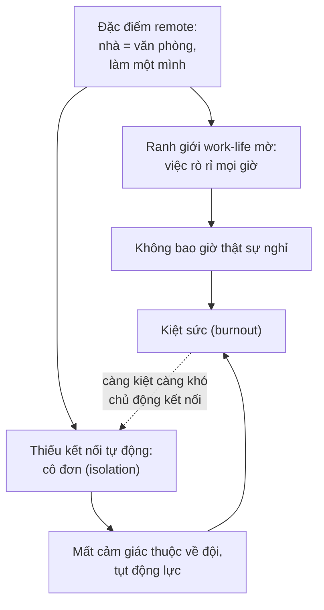

# Sức khoẻ tinh thần & văn hoá đội remote

> **Tác giả:** Mr.Rom\
> **Phiên bản:** v1.0.0\
> **Tạo lúc:** 13/06/2026\
> **Cập nhật:** 13/06/2026\
> **Level:** Basic\
> **Tags:** career, remote-work, soft-skills, wellbeing, burnout, work-life-balance, remote-culture, trust\
> **Yêu cầu trước:** [Năng suất & tập trung khi remote](03_productivity-and-focus-remote.md)

> 🎯 *Ba bài trước đã cho bạn cách dựng môi trường, cộng tác async và giữ năng suất khi remote. Nhưng remote có một mặt tối mà ít ai cảnh báo trước: làm ở nhà một mình rất dễ **cô đơn**, và khi nhà cũng là văn phòng thì ranh giới công việc nhoè đi — bạn cày tới kiệt sức (**burnout**) mà không nhận ra. Bài cuối cụm này dạy bạn giữ **work-life balance** bằng ritual bắt đầu/kết thúc và nghỉ thật, xây **quan hệ + niềm tin từ xa** khi không gặp mặt, hiểu một **văn hoá đội remote** lành mạnh trông như thế nào (tin tưởng thay vì giám sát, hoà nhập cho người vắng/đa múi giờ), và đọc được dấu hiệu kiệt sức trên chính bạn. Đây là bài đóng cụm remote-work — nó bảo trì "con người" đằng sau mọi kỹ thuật ở ba bài trước.*

## 🎯 Sau bài này bạn sẽ

- [ ] Hiểu hai mặt tối lớn nhất của remote: **cô đơn (isolation)** và **ranh giới work-life mờ** dẫn tới **burnout**
- [ ] Dựng được **ritual bắt đầu/kết thúc ngày** và ranh giới để tách việc khỏi đời sống khi nhà = văn phòng
- [ ] Biết cách xây **quan hệ và niềm tin từ xa**: virtual coffee, 1:1, bật cam khi hợp lý, ghi nhận công khai
- [ ] Phân biệt **văn hoá tin tưởng** với **văn hoá giám sát**, và vì sao giám sát giết chết đội remote
- [ ] Làm việc **inclusive** (hoà nhập) cho người vắng họp và người ở múi giờ khác — tài liệu hoá thay vì khẩu truyền
- [ ] Đọc được **dấu hiệu kiệt sức** sớm trên chính bạn và biết các bước tự chăm sóc + phục hồi

---

## Tình huống — căn phòng không bao giờ tan ca

Hãy hình dung một ngày remote rất bình thường của bạn.

Bạn thức dậy, đi vài bước ra bàn làm việc — chính cái bàn đó, trong chính căn phòng đó. Bạn mở máy, code cả ngày. Bữa trưa bạn ăn ngay tại bàn để "tranh thủ". Hết giờ làm, bạn... vẫn ngồi đúng chỗ đó, chỉ là giờ mở Netflix thay vì mở editor. Tối, một tin nhắn Slack sáng lên — "chỉ một việc nhỏ thôi" — và bạn xử lý luôn vì laptop ngay đây. Cả tuần trôi qua, bạn nhận ra mình gần như không nói chuyện trực tiếp với ai. Đồng nghiệp chỉ là những avatar tròn trong Slack. Cuối tuần, bạn mệt một kiểu khó tả — không phải mệt cơ thể, mà là một sự cạn kiệt âm ỉ.

Đây không phải bạn "yếu đuối" hay "không hợp remote". Đây là **hai cái bẫy có thật và rất phổ biến** của làm việc từ xa, và gần như ai làm remote lâu cũng gặp:

- **Nhà = văn phòng → không có ranh giới.** Khi chỗ ngủ, chỗ ăn và chỗ làm là một, não không có tín hiệu nào để biết "giờ là lúc tan ca". Việc rò rỉ vào mọi giờ. Bạn không bao giờ thật sự *tan ca* — và thứ đó tích tụ thành burnout.
- **Một mình cả ngày → cô đơn (isolation).** Văn phòng cũ có những thứ vô hình mà quý: câu chuyện phiếm bên máy pha cà phê, ăn trưa cùng nhau, một ánh mắt đồng cảm khi cả hai cùng kẹt. Remote cắt sạch những thứ đó nếu không ai chủ động bù lại.

Ba bài trước trong cụm lo phần "làm việc cho tốt" khi remote. Bài này lo phần dễ bị bỏ quên nhất nhưng quyết định bạn trụ được bao lâu: **giữ cho con người đằng sau cái máy không bị cô đơn và không cháy**. Vì remote là một cuộc chơi đường dài — và một dev kiệt sức thì mọi kỹ thuật năng suất ở bài 03 đều vô nghĩa.

---

## 1️⃣ Mặt tối của remote — cô đơn & ranh giới mờ

Trước khi nói cách chữa, phải hiểu rõ hai cái bẫy này hoạt động ra sao, vì chúng đến **âm thầm** — không có cú sốc nào báo hiệu, chỉ là một sự trượt dốc chậm mà bạn không để ý.

### Cô đơn (isolation) — thiếu kết nối con người

Ở văn phòng, kết nối xã hội đến **miễn phí và tự động**: bạn va phải đồng nghiệp ở hành lang, nghe lỏm câu chuyện bàn bên, đi ăn trưa theo nhóm. Bạn không phải *cố gắng* để có những kết nối đó — chúng tự xảy ra. Remote xoá sạch lớp kết nối tự động này. Nếu không ai chủ động tạo lại, một ngày remote có thể trôi qua mà bạn chỉ trao đổi với người khác qua những dòng chữ về công việc — không một câu chuyện ngoài lề, không một tiếng cười chung.

Cô đơn không chỉ làm bạn buồn. Nó ăn mòn **động lực** (chẳng còn cảm giác "mình thuộc về một đội") và làm **niềm tin** trong team khó hình thành — khó tin một người mà bạn chưa từng thật sự "biết". Đây là lý do isolation và "xây niềm tin từ xa" (§3) là hai mặt của cùng một vấn đề.

### Ranh giới work-life mờ → burnout

Cái bẫy thứ hai tinh vi hơn. Ở văn phòng, hành động **rời toà nhà** là một ranh giới vật lý rõ ràng: bạn bước ra cửa, quãng đường về nhà là một "vùng đệm" để não chuyển từ chế độ-làm sang chế độ-nghỉ. Remote xoá luôn cái cửa đó. Không có hành trình về nhà, không có "rời văn phòng" — chỉ có việc gập laptop lại đúng nơi bạn vừa ngủ dậy sáng nay.

Hệ quả: công việc **rò rỉ** vào mọi ngóc ngách của đời sống. Trả lời Slack lúc 10h tối vì "laptop ngay đây". Mở máy kiểm tra một thứ vào Chủ nhật. Không bao giờ có cảm giác *thật sự tan ca*. Và đây chính là con đường dẫn tới **burnout** (kiệt sức) — không phải vì một ngày quá tải, mà vì **không bao giờ thật sự nghỉ** trong nhiều tháng.

🪞 **Ẩn dụ**: làm remote không có ranh giới giống một **cái bếp không bao giờ tắt lửa**. Ở văn phòng, hết giờ là "tắt bếp, ra về" — bếp được nguội. Remote mà không tự dựng ranh giới thì lửa cứ liu riu cháy suốt ngày đêm: bạn không nấu rầm rộ, nhưng nồi không bao giờ được nhấc xuống. Một thời gian thì cạn nước, cháy đáy. Nghỉ ngơi không phải "lười" — nó là việc **nhấc nồi xuống và tắt bếp**, là một phần bắt buộc để cái bếp còn dùng được lâu dài.

Hai cái bẫy này nghe có vẻ rời rạc, nhưng thực ra chúng nuôi nhau và cùng đổ về một đích là burnout. Sơ đồ dưới đây là khái niệm trừu tượng nhất của bài — vòng xoáy âm thầm từ "đặc điểm của remote" trượt dần tới kiệt sức — nên ta hình dung nó trước khi đi vào cách chặn.

> 📖 *Điểm cốt lõi của sơ đồ: hai nhánh (ranh giới mờ và cô đơn) cùng đổ về burnout, và mũi tên đứt nét cho thấy vòng xoáy tự nuôi — càng kiệt sức bạn càng không còn năng lượng để chủ động kết nối, lại càng cô đơn hơn. Vì thế cách chặn không phải "cố chịu đựng" mà là **chủ động dựng ranh giới (§2) và chủ động tạo kết nối (§3)** trước khi vòng xoáy khởi động.*

---

## 2️⃣ Giữ work-life balance — ritual & nghỉ thật

Khi nhà cũng là văn phòng, ranh giới sẽ **không tự có** — bạn phải chủ động tạo ra nó. Tin tốt: bạn không cần một cánh cửa văn phòng thật, bạn chỉ cần những **tín hiệu** thay thế cho cánh cửa đó. Đây gọi là **ritual** (nghi thức) — những hành động lặp lại có chủ đích để báo cho não biết "bắt đầu làm" và "kết thúc làm".

### Ritual bắt đầu và kết thúc ngày — dựng lại cánh cửa văn phòng

Não con người học rất nhanh các **tín hiệu chuyển trạng thái**. Ở văn phòng, quãng đường đi làm chính là tín hiệu "vào chế độ làm việc", và quãng đường về là tín hiệu "tan ca". Remote mất hai quãng đường này, nên ta tự tạo lại bằng ritual — một chuỗi hành động nhỏ, cố định, đánh dấu hai đầu ngày làm việc.

🪞 **Ẩn dụ**: ritual giống **một cánh cửa vô hình**. Bạn không có cửa văn phòng thật, nên bạn dựng một cánh cửa bằng thói quen: làm xong chuỗi-bắt-đầu là "đã bước vào", làm xong chuỗi-kết-thúc là "đã bước ra". Cánh cửa này tưởng tượng nhưng não tin nó thật — miễn là bạn lặp lại đủ đều để nó thành phản xạ.

Ritual không cần cầu kỳ. Quan trọng là **cố định và lặp lại**. Vài ví dụ để bạn chọn và sửa:

| Loại ritual | Bắt đầu ngày (vào chế độ làm) | Kết thúc ngày (tan ca) |
|---|---|---|
| Di chuyển nhỏ | Đi một vòng quanh nhà rồi mới ngồi vào bàn (giả lập "đi làm") | Đi bộ 10 phút sau khi gập máy (giả lập "đường về") |
| Trang phục | Thay đồ ra dáng làm việc (không mặc đồ ngủ code) | Thay sang đồ ở nhà thoải mái |
| Không gian | Mở rèm, dọn bàn, pha cà phê rồi mới mở editor | Tắt máy, cất laptop khỏi tầm mắt |
| Lập kế hoạch | Viết 3 việc chính cần làm hôm nay | Viết "đã xong gì + ngày mai bắt đầu từ đâu" rồi đóng lại |
| Thông báo | (tuỳ chọn) đặt Slack về "đang làm" | Đặt Slack về "ngoài giờ", tắt thông báo trên điện thoại |

→ Quy luật chung: ritual **kết thúc** quan trọng hơn ritual bắt đầu, vì cái bẫy lớn của remote là *không bao giờ tan ca*. Một ritual kết thúc tốt giúp bạn "đóng cửa" tâm lý với công việc, để buổi tối thật sự là buổi tối của bạn.

### Tách không gian — dù chỉ là một góc

Lý tưởng là có một phòng làm việc riêng, nhưng phần lớn người mới remote không có. Không sao — điều quan trọng không phải diện tích, mà là **sự tách biệt về tín hiệu**. Bộ não cần một nơi mà "ngồi vào đây = làm việc" và những nơi khác là "không phải chỗ làm".

- **Có một góc cố định để làm việc**, dù chỉ là một đầu bàn ăn. Tránh làm việc trên giường — giường là nơi não gắn với nghỉ ngơi, làm việc ở đó phá cả giấc ngủ lẫn sự tập trung.
- **Khi hết giờ, "rời" khỏi góc đó** — cất laptop đi, dọn bàn. Việc dọn dẹp vật lý cũng là một tín hiệu kết thúc.
- Nếu không gian quá hẹp, dùng tín hiệu thay thế: một chiếc đèn bàn chỉ bật khi làm việc, một bộ tai nghe chỉ đeo trong giờ làm — "phụ kiện" cũng có thể đóng vai cánh cửa.

Phần này nối thẳng với bài [thiết lập môi trường remote](01_setup-and-environment.md): một góc làm việc tách biệt không chỉ tốt cho năng suất, nó còn là **ranh giới vật lý** bảo vệ sức khoẻ tinh thần.

### Nghỉ thật — nghỉ mà không thấy tội lỗi

Cái bẫy tinh vi nhất của remote là nghỉ **nửa vời**: bạn rời bàn nhưng đầu vẫn nghĩ về task, hoặc "nghỉ trưa" mà tay vẫn lướt Slack. Đó không phải nghỉ — đó là làm việc ở chế độ nền, và nó không phục hồi gì cả.

Vài nguyên tắc cho việc nghỉ thật:

- **Nghỉ giữa ngày là rời khỏi màn hình**, không phải đổi từ tab code sang tab mạng xã hội. Đứng dậy, đi lại, nhìn ra xa, ăn trưa **không trước màn hình**.
- **Bảo vệ giờ ngoài làm việc**: sau ritual kết thúc, công việc đã "đóng cửa". Tin nhắn không khẩn cấp để mai trả lời — đó là quyền của bạn, không phải sự lười biếng. (Một team async lành mạnh không kỳ vọng trả lời tức thì ngoài giờ — xem bài [cộng tác async khi remote](02_async-collaboration-remote.md).)
- **Có ngày nghỉ thật sự**: cuối tuần hoặc ngày phép là không mở máy kiểm tra việc. Não cần khoảng lặng dài để phục hồi, không chỉ vài giờ.

> [!IMPORTANT]
> Một niềm tin nguy hiểm cần gỡ bỏ: **"vì làm ở nhà nên mình phải sẵn sàng mọi lúc để chứng tỏ chăm chỉ"**. Đây là cái bẫy lo lắng phổ biến của người mới remote — sợ bị nghĩ là "ở nhà thì lười", nên over-compensate bằng cách luôn online. Sự thật: giá trị của bạn đo bằng **kết quả công việc** (đã bàn ở bài 03), không bằng đèn xanh Slack lúc 10h tối. Luôn-sẵn-sàng không làm bạn được đánh giá cao hơn — nó chỉ đưa bạn tới burnout nhanh hơn.

---

## 3️⃣ Xây quan hệ & niềm tin từ xa

Ranh giới (§2) chống cái bẫy "làm quá sức". Còn cái bẫy "cô đơn" cần một liều thuốc khác: **chủ động xây kết nối con người** mà remote đã xoá đi. Ở văn phòng kết nối tự đến; ở remote, nó chỉ đến khi ai đó **cố ý tạo ra** — và bạn không cần đợi sếp làm điều đó, bạn có thể bắt đầu từ chính mình.

🪞 **Ẩn dụ**: quan hệ trong team văn phòng giống **một khu vườn mọc hoang** — đất tốt, mưa đều, cây tự lên. Quan hệ trong team remote giống **trồng cây trong chậu trên ban công** — không có mưa tự nhiên, bạn phải **chủ động tưới**. Bỏ bê là cây héo. Nhưng nếu chịu tưới đều, chậu cây ban công vẫn xanh tốt không kém vườn hoang. Niềm tin từ xa cũng vậy: nó không tự mọc, nhưng có thể vun được.

### Niềm tin từ xa được xây bằng gì

Khi không gặp mặt, niềm tin trong team không đến từ "thấy nhau ngồi làm". Nó đến từ những thứ rất cụ thể mà bạn kiểm soát được:

- **Làm đúng điều đã nói** — giao đúng thứ đã hứa, đúng mốc; nếu lệch thì báo sớm. Sự nhất quán này là nền của niềm tin remote (nối với cập nhật status chủ động ở bài [năng suất & tập trung khi remote](03_productivity-and-focus-remote.md)).
- **Minh bạch về tiến độ** — làm việc "lộ thiên": cập nhật ở kênh chung, để người khác thấy bạn đang ở đâu mà không phải đi hỏi. Minh bạch tạo tin tưởng; im lặng tạo nghi ngờ.
- **Hiện diện như một con người** — không chỉ trao đổi về task. Một câu chuyện ngoài lề, một biểu cảm, một lời hỏi thăm — những thứ này biến đồng nghiệp từ "avatar" thành "người".

### Những cách cụ thể để kết nối từ xa

Dưới đây là các hành động thực tế để bù lại lớp kết nối tự động mà văn phòng từng cho miễn phí. Bạn không cần làm hết — chọn vài cái và làm đều.

| Cách kết nối | Là gì | Vì sao hiệu quả |
|---|---|---|
| **Virtual coffee** | Hẹn 15-20 phút gọi video chỉ để tán gẫu, không bàn việc | Tái tạo "chuyện phiếm bên máy cà phê" — nơi quan hệ thật sự hình thành |
| **1:1 đều đặn** | Buổi nói chuyện riêng định kỳ với sếp/đồng nghiệp | Không gian an toàn để chia sẻ khó khăn, không chỉ báo cáo task |
| **Bật cam khi hợp lý** | Mở camera trong các buổi gọi quan trọng/thân mật | Khuôn mặt và biểu cảm truyền tải thứ chữ viết không có |
| **Ghi nhận công khai** | Khen/cảm ơn người khác ở kênh chung, không nhắn riêng | Người được khen thấy được nhìn nhận; cả team thấy đóng góp được trân trọng |
| **Kênh ngoài lề** | Một kênh chat riêng cho chuyện không-công-việc (sở thích, ảnh, meme) | Giữ "chất người" cho team, nơi quan hệ nảy nở tự nhiên |

→ Trong các cách trên, **virtual coffee** và **ghi nhận công khai** là hai thứ tác động mạnh nhất mà tốn ít công nhất. Một lời cảm ơn cụ thể ở kênh chung ("Cảm ơn bạn A đã giúp mình gỡ cái lỗi deploy hôm qua, mình kẹt cả buổi") vừa làm người kia thấy ấm lòng, vừa lan toả văn hoá ghi nhận cho cả đội.

### Bật cam — khi nào nên, khi nào không

"Bật cam" là chủ đề dễ gây tranh cãi, nên cần nói rõ: bật cam **có giá trị thật** (khuôn mặt tạo kết nối, giảm cảm giác nói chuyện với hư không), nhưng ép bật cam mọi lúc lại gây mệt mỏi (gọi là *Zoom fatigue* — mệt vì họp video liên tục) và xâm phạm không gian riêng. Nguyên tắc cân bằng:

- **Nên bật**: buổi 1:1, họp nhỏ cần trao đổi sâu, lần đầu gặp một đồng nghiệp mới, các dịp gắn kết team. Đây là lúc khuôn mặt tạo khác biệt lớn.
- **Không cần ép**: họp đông người chỉ nghe thông tin, ngày mệt, hoặc khi đường truyền yếu. Tắt cam để nghe rõ còn tốt hơn.
- **Văn hoá lành mạnh**: bật cam là **khuyến khích, không bắt buộc**. Ép cả team bật cam mọi cuộc gọi là một dạng giám sát trá hình (xem §4) và làm mọi người kiệt sức.

> [!TIP]
> Nếu bạn là người mới trong một team remote và thấy cô đơn, đừng đợi người khác kéo bạn vào. Hãy chủ động: rủ một đồng nghiệp một buổi virtual coffee 15 phút ("Mình mới vào, muốn làm quen, anh/bạn có rảnh tán gẫu 15 phút tuần này không?"). Phần lớn người sẽ vui vẻ nhận lời — và đó thường là khởi đầu của những quan hệ giúp bạn trụ lại lâu dài. Chủ động kết nối là một kỹ năng remote, không phải sự làm phiền.

---

## 4️⃣ Văn hoá đội remote — tin tưởng thay vì giám sát

Hai section trên là những thứ **bạn** làm cho chính mình. Section này nói về thứ lớn hơn bạn: **văn hoá của cả đội** — tập hợp những chuẩn mực ngầm quyết định remote là một nơi dễ thở hay ngột ngạt. Hiểu nó giúp bạn nhận ra mình đang ở trong một văn hoá lành mạnh hay độc hại, và biết cách góp phần xây nó tốt hơn.

### Tin tưởng vs giám sát — sự chia đôi quyết định tất cả

Có hai triết lý quản lý remote đối nghịch nhau, và lựa chọn giữa chúng định hình toàn bộ trải nghiệm:

- **Văn hoá giám sát (surveillance)** — đo người bằng *thời gian online*, đèn xanh Slack, số giờ ngồi, thậm chí phần mềm chụp màn hình. Triết lý ngầm: "không nhìn thấy thì không tin được nó đang làm việc."
- **Văn hoá tin tưởng (trust)** — đo người bằng *kết quả giao ra*. Triết lý ngầm: "miễn việc xong tốt và đúng hẹn, làm lúc nào ở đâu là chuyện của họ."

🪞 **Ẩn dụ**: quản lý giám sát giống **một huấn luyện viên đứng sau lưng đếm từng nhịp thở của vận động viên** — gây áp lực, làm người ta cứng người, và đo sai thứ (nhịp thở chứ không phải thành tích). Quản lý tin tưởng giống **một huấn luyện viên chỉ nhìn kết quả trên đường chạy** — cho vận động viên tự lo cách tập, miễn về đích đúng giờ. Vận động viên dưới trướng người thứ hai chạy tốt hơn, vì họ được tin và không phải diễn.

Vì sao giám sát **giết chết** đội remote, không chỉ "kém dễ chịu hơn":

| Khía cạnh | Văn hoá giám sát | Văn hoá tin tưởng |
|---|---|---|
| Đo cái gì | Thời gian online, đèn xanh, giờ ngồi | Kết quả, chất lượng, đúng hẹn |
| Người làm cảm thấy | Bị nghi ngờ → diễn "bận rộn", thêm stress | Được tin → tập trung vào việc thật |
| Hệ quả với năng suất | Khuyến khích *trông có vẻ làm*, hại deep work | Khuyến khích làm thật, output cao |
| Hệ quả với sức khoẻ | Lo lắng triền miên, đẩy nhanh burnout | Bền vững hơn, ít kiệt sức |
| Niềm tin trong team | Bị bào mòn — giám sát ngụ ý "không tin" | Được củng cố — tin tưởng nuôi tin tưởng |

→ Điểm mấu chốt: giám sát đo **sai thứ**. Đèn xanh Slack 10 tiếng không nói gì về việc có gì được làm xong; nó chỉ khiến người ta học cách *trông có vẻ bận* (rê chuột cho khỏi "away") thay vì làm việc thật. Một văn hoá tin tưởng giải phóng năng lượng đó về cho công việc — và đồng thời bảo vệ sức khoẻ tinh thần, vì không ai phải sống trong cảm giác bị soi.

> [!WARNING]
> Nếu bạn ở trong một văn hoá giám sát (bị hỏi liên tục "sao status away", bị yêu cầu cài phần mềm theo dõi, bị đánh giá qua giờ online), đừng vội kết luận "mình kém". Đó là dấu hiệu của **văn hoá quản lý chưa trưởng thành với remote**, không phải lỗi của bạn. Cách lành mạnh: chủ động làm việc **minh bạch về kết quả** (cập nhật rõ đã giao gì, đang làm gì) để chuyển sự chú ý của sếp từ "có online không" sang "có làm xong không". Và nếu văn hoá độc hại kéo dài, đó là một tín hiệu đáng cân nhắc về nơi làm việc.

---

## 5️⃣ Inclusive — hoà nhập cho người vắng & đa múi giờ

Một văn hoá remote tin tưởng vẫn có thể **loại trừ người một cách vô tình** nếu không cẩn thận. Đây là khía cạnh ít được nói nhưng cực kỳ quan trọng với sức khoẻ tinh thần của những người *không có mặt đúng lúc* — người ở múi giờ khác, người vắng họp vì lý do cá nhân, hay người làm hybrid trong khi phần còn lại ngồi văn phòng.

### Cái bẫy "khẩu truyền" — quyết định bay trong không khí

Cái bẫy phổ biến nhất: những quyết định quan trọng được chốt trong một cuộc gọi ngẫu hứng, hay tệ hơn, trong một cuộc trò chuyện ngoài lề giữa vài người **đang ngồi cùng văn phòng**. Người ở múi giờ khác ngủ dậy thấy mọi thứ đã quyết xong mà không hề được tham gia. Lặp lại nhiều lần, họ thành **công dân hạng hai** — luôn là người biết sau cùng, không có tiếng nói. Đó là một dạng cô đơn và mất kết nối rất hại.

🪞 **Ẩn dụ**: một team không tài liệu hoá giống **một lớp học nơi bài giảng quan trọng nhất chỉ được nói miệng, không ghi bảng**. Ai có mặt đúng tiết đó thì nghe được; ai nghỉ ốm hôm đó mất luôn, không cách nào học lại. Tài liệu hoá giống **ghi mọi thứ quan trọng lên bảng và chụp lại** — ai vắng vẫn theo kịp, ai ở múi giờ khác vẫn đọc được khi tỉnh dậy. Nó biến lớp học "phải có mặt" thành lớp học "ai cũng theo được".

### Làm việc inclusive — nguyên tắc thực tế

Hoà nhập trong team remote không phải khẩu hiệu, nó là vài thói quen cụ thể:

- **Quyết định quan trọng phải được viết ra**, không chỉ nói trong họp. Sau mỗi cuộc gọi có quyết định, đăng tóm tắt vào kênh chung để người vắng đọc được. "Nếu nó không được viết ra, nó coi như chưa xảy ra."
- **Tài liệu hoá onboarding** — người mới (đặc biệt ở múi giờ khác) không thể "ngồi cạnh hỏi". Một tài liệu onboarding tốt cho phép họ tự lên đường mà không phụ thuộc vào việc ai đó đang online để trả lời.
- **Họp thân thiện với async** — ghi lại quyết định (và lý tưởng là cả bản ghi) để người vắng theo kịp; không bắt mọi quyết định phải chờ một cuộc họp "tất cả cùng có mặt" mà nhiều khi bất khả thi qua các múi giờ.
- **Cẩn thận với người hybrid** — khi vài người ngồi văn phòng còn vài người ở xa, dễ vô tình loại người ở xa khỏi các trao đổi "hành lang". Nguyên tắc tốt: nếu một người gọi video, mọi người gọi video riêng từng máy (thay vì vài người chụm vào một camera trong phòng họp, người ở xa thành khán giả).

→ Inclusive remote về bản chất là **tài liệu hoá thay vì khẩu truyền** — dịch chuyển từ "phải có mặt mới biết" sang "ai cũng theo được dù không có mặt". Điều này nối thẳng với tinh thần documentation và async đã học ở cụm communication; ở đây ta nhấn vào hệ quả **con người**: một người không bị bỏ rơi là một người không cô đơn.

> [!NOTE]
> Inclusive không chỉ là "tử tế với người ở xa" — nó trực tiếp tốt cho cả team. Một team buộc mình tài liệu hoá quyết định để người vắng theo kịp cũng tự nhiên có một kho tri thức tra cứu được, ít phụ thuộc vào trí nhớ của vài cá nhân, và sống sót tốt hơn khi có người nghỉ phép hay rời đi. Thiết kế cho người vắng mặt khiến team khoẻ hơn cho tất cả mọi người.

---

## 6️⃣ Dấu hiệu kiệt sức & tự chăm sóc

Tất cả những thứ trên là để **phòng** burnout. Nhưng phòng không phải lúc nào cũng đủ, nên bạn cần biết **đọc dấu hiệu** trên chính mình — để bắt nó sớm, khi chỉ cần nghỉ ngơi là phục hồi, thay vì để muộn tới mức phải dừng hẳn rất lâu.

### Burnout là gì — và vì sao nó âm thầm

**Burnout** (kiệt sức) không phải "mệt một hôm". Đó là trạng thái cạn kiệt sâu cả thể chất, cảm xúc lẫn động lực sau khi gắng sức quá lâu mà không phục hồi đủ. Tổ chức Y tế Thế giới (WHO) mô tả burnout qua ba dấu hiệu lõi, rất hữu ích để tự soi:

- **Kiệt sức (exhaustion)** — lúc nào cũng cạn năng lượng, ngủ dậy vẫn mệt.
- **Hoài nghi / xa cách (cynicism)** — mất hứng thú với công việc từng thích, thấy mọi thứ vô nghĩa, cáu kỉnh.
- **Giảm hiệu quả (reduced efficacy)** — cảm thấy mình làm gì cũng kém đi, không còn tin vào khả năng của mình.

Remote làm burnout đặc biệt nguy hiểm vì **không ai nhìn thấy**. Ở văn phòng, đồng nghiệp có thể nhận ra bạn đang xuống tinh thần qua nét mặt, qua việc bạn ít nói hẳn. Remote che giấu hết — bạn có thể trượt dài vào burnout sau một avatar im lặng mà không ai hay, kể cả chính bạn. Vì thế **tự soi** là kỹ năng sống còn.

### Dấu hiệu sớm — bắt trước khi quá muộn

Burnout hiếm khi ập đến đột ngột; nó bò tới qua nhiều tín hiệu nhỏ. Nhận ra sớm thì chỉ cần điều chỉnh là ổn; để muộn thì cần dừng hẳn rất lâu. Các tín hiệu sớm đáng chú ý:

| Nhóm | Dấu hiệu sớm |
|---|---|
| Năng lượng | Mệt dai dẳng dù ngủ đủ; sáng dậy đã thấy nặng nề, ngại mở máy |
| Cảm xúc | Mất hứng với việc từng thích; cáu kỉnh, dễ nản; cảm giác cô đơn tăng dần |
| Nhận thức | Khó tập trung, đọc một đoạn phải đọc lại nhiều lần; hay quên |
| Hành vi | Trì hoãn việc trước đây làm dễ; cày tới khuya nhưng không ra việc; cắt liên hệ với đồng nghiệp |
| Thể chất | Đau đầu, mỏi vai gáy, mất ngủ, hay ốm vặt |
| Ranh giới | Không nhớ lần cuối thật sự nghỉ; làm việc cả cuối tuần thành bình thường |

→ Hai dòng cuối là tín hiệu đặc thù của burnout-kiểu-remote: cảm giác cô đơn dâng lên (nhánh isolation ở §1) và ranh giới biến mất (làm cả cuối tuần thành "bình thường"). Nếu bạn gật đầu với nhiều dòng trong bảng, đó là lúc dừng lại và điều chỉnh, không phải lúc "cố thêm chút nữa".

### Tự chăm sóc & phục hồi

Khi thấy dấu hiệu sớm, đừng cố vượt qua bằng ý chí (cày tiếp thường làm nặng hơn). Các bước tự chăm sóc theo thứ tự:

1. **Dựng lại ranh giới ngay** — quay về ritual kết thúc ngày nghiêm túc (§2), bảo vệ giờ ngoài làm việc, có ít nhất một ngày nghỉ thật trong tuần.
2. **Phục hồi ngoài màn hình** — ngủ đủ, vận động, ra ngoài, gặp người thật. Phục hồi tốt nhất hầu như luôn ở **ngoài** màn hình, không phải đổi từ tab này sang tab khác.
3. **Chữa cô đơn bằng kết nối** — chủ động một buổi virtual coffee, một cuộc gặp bạn bè ngoài đời (§3). Cô đơn là một phần lớn của burnout-remote, và kết nối là thuốc trực tiếp.
4. **Nói ra** — chia sẻ với sếp hoặc đồng nghiệp tin tưởng trong buổi 1:1. Trong một văn hoá tin tưởng (§4), nói "em đang quá tải, cần điều chỉnh" là dấu hiệu trưởng thành, không phải yếu kém. Giấu mới là điều khiến nó nặng hơn.
5. **Nếu đã kiệt thật** (không chỉ dấu hiệu sớm) — cần dừng hẳn một thời gian đủ dài để phục hồi, hạ kỳ vọng xuống mức thấp nhất, và nếu kéo dài thì tìm hỗ trợ chuyên môn. Cố "vượt burnout bằng ý chí" thường phản tác dụng.

> [!CAUTION]
> Đừng đợi tới khi "sập" mới hành động. Burnout giống một vết nứt trên tường: bắt sớm thì trám vài phút là xong; để mặc thì tới lúc sập cả mảng tường mới sửa, tốn gấp nhiều lần. Một buổi nghỉ đúng lúc khi thấy dấu hiệu sớm rẻ hơn rất nhiều so với hai tuần dừng hẳn khi đã kiệt. Tự chăm sóc không phải là phần thưởng cho khi rảnh — nó là **bảo trì định kỳ** bắt buộc để chạy được đường dài.

---

## 7️⃣ Checklist wellbeing remote

Gói tất cả lại thành một bộ checklist bạn có thể chạy định kỳ để tự kiểm sức khoẻ remote của mình. Đây là **khung để bạn sửa**, không phải luật — giữ lại cái hợp với bạn.

### Checklist ranh giới & work-life balance (chạy hằng tuần)

- [ ] Có **ritual bắt đầu** ngày cố định (di chuyển nhỏ / thay đồ / lập kế hoạch 3 việc)
- [ ] Có **ritual kết thúc** ngày cố định (gập máy / cất laptop / ghi "mai bắt đầu từ đâu")
- [ ] Có **góc làm việc tách biệt** — không làm việc trên giường
- [ ] Có **giờ tan ca cố định** và tôn trọng nó (không "chỉ một việc nhỏ" lúc tối)
- [ ] Nghỉ trưa **rời màn hình**, không vừa ăn vừa lướt Slack
- [ ] Có ít nhất **một ngày nghỉ thật** mỗi tuần — không mở máy kiểm tra việc
- [ ] Tắt thông báo công việc trên điện thoại ngoài giờ làm

### Checklist kết nối & chống cô đơn (chạy hằng tuần)

- [ ] Tuần này mình đã có **ít nhất một trao đổi ngoài-công-việc** với đồng nghiệp
- [ ] Đã **ghi nhận / cảm ơn** ai đó công khai ở kênh chung
- [ ] Có **1:1 đều đặn** với sếp hoặc một đồng nghiệp
- [ ] Cảm giác **thuộc về đội** còn ở mức ổn (không thấy mình như "người ngoài")
- [ ] Đã có kết nối con người **ngoài màn hình** trong tuần (bạn bè, gia đình, vận động cùng người khác)

### Checklist tự soi burnout (chạy hằng tuần — câu quan trọng nhất)

- [ ] Năng lượng: ngủ dậy thấy đỡ mệt, không "ngại mở máy" mỗi sáng
- [ ] Cảm xúc: vẫn còn hứng thú với việc, không cáu kỉnh/hoài nghi dai dẳng
- [ ] Tập trung: đọc/code vào được, không phải đọc đi đọc lại
- [ ] Ranh giới: **nhớ được lần cuối mình thật sự nghỉ** (không phải làm cả cuối tuần)
- [ ] Nếu nhiều ô ở trên **không tích được** → đó là tín hiệu dừng lại điều chỉnh, không phải "cố thêm"

### Khi là thành viên của văn hoá đội (góp phần xây)

- [ ] Mình làm việc **minh bạch về kết quả** (cập nhật rõ, không cần ai đi hỏi)
- [ ] Mình **viết ra quyết định quan trọng** thay vì chỉ nói miệng
- [ ] Mình để ý **người vắng / người ở múi giờ khác** không bị bỏ rơi khỏi thông tin
- [ ] Mình **không đo người khác bằng đèn xanh Slack** mà bằng việc họ giao ra

→ Gợi ý thực dụng: gắn việc chạy ba checklist đầu vào một thời điểm cố định mỗi tuần (vd cuối chiều thứ Sáu, ngay trong ritual kết thúc tuần). Biến tự-kiểm-sức-khoẻ thành một thói quen có lịch, đừng để "khi nào nhớ thì kiểm" — vì đúng lúc burnout là lúc bạn dễ quên nhất.

---

## 💡 Cạm bẫy thường gặp & Best practice

### ❌ Cạm bẫy: không có ranh giới — làm việc rò rỉ vào mọi giờ

- **Triệu chứng**: trả lời Slack lúc tối muộn vì "laptop ngay đây"; mở máy kiểm tra việc cuối tuần; không nhớ lần cuối thật sự tan ca; mệt một kiểu cạn kiệt âm ỉ.
- **Nguyên nhân**: nhà = văn phòng nên mất hết tín hiệu vật lý để não biết "đã tan ca"; thêm nỗi lo "phải luôn online để chứng tỏ chăm chỉ".
- **Cách tránh**: dựng **ritual bắt đầu/kết thúc** ngày (cánh cửa vô hình), tách một góc làm việc, đặt giờ tan ca cố định và tôn trọng nó, nghỉ thật (rời màn hình), bảo vệ giờ ngoài làm việc.

### ❌ Cạm bẫy: cô đơn vì đợi kết nối tự đến như ở văn phòng

- **Triệu chứng**: cả tuần chỉ trao đổi với đồng nghiệp về task, không một câu chuyện ngoài lề; thấy mình như "người ngoài"; tụt động lực, đồng nghiệp chỉ là avatar.
- **Nguyên nhân**: remote xoá lớp kết nối tự động của văn phòng; bạn đợi nó tự quay lại thay vì chủ động tạo.
- **Cách tránh**: chủ động "tưới cây" — rủ virtual coffee, tham gia kênh ngoài lề, ghi nhận người khác công khai, có 1:1 đều, và kết nối ngoài màn hình ngoài đời.

### ❌ Cạm bẫy: tự đẩy mình vào văn hoá giám sát (luôn online để "trông chăm")

- **Triệu chứng**: rê chuột cho khỏi "away"; lo lắng mỗi khi status không xanh; đo giá trị bản thân bằng số giờ online thay vì việc giao ra.
- **Nguyên nhân**: sợ bị nghĩ "ở nhà thì lười", nên over-compensate bằng cách luôn hiện diện.
- **Cách tránh**: chuyển sự chú ý sang **kết quả** — làm việc minh bạch về output (cập nhật rõ đã giao gì). Giá trị đo bằng việc xong, không bằng đèn xanh. Luôn-online chỉ đẩy nhanh burnout, không làm bạn được đánh giá cao hơn.

### ✅ Best practice: dựng ranh giới bằng ritual trước khi cần

- **Vì sao**: cái bẫy lớn nhất của remote là "không bao giờ tan ca", và nó âm thầm tích thành burnout. Ranh giới không tự có khi nhà = văn phòng — phải chủ động tạo bằng tín hiệu.
- **Cách áp dụng**: chọn một ritual kết thúc ngày cố định và lặp đều (gập máy → cất laptop → ghi mai bắt đầu từ đâu → đi bộ 10 phút); tách một góc làm việc; đặt và tôn trọng giờ tan ca; có ngày nghỉ thật mỗi tuần.

### ✅ Best practice: chủ động xây kết nối & ghi nhận công khai

- **Vì sao**: niềm tin và cảm giác thuộc về đội không tự mọc từ xa; cô đơn ăn mòn động lực và là phần lớn của burnout-remote. Ghi nhận công khai vừa ấm lòng người nhận vừa lan toả văn hoá tốt.
- **Cách áp dụng**: đều đặn virtual coffee + 1:1; bật cam ở các buổi cần kết nối sâu; cảm ơn/khen cụ thể ở kênh chung; với người mới thì chủ động rủ làm quen thay vì đợi.

### ✅ Best practice: tài liệu hoá thay vì khẩu truyền (inclusive)

- **Vì sao**: quyết định nói miệng loại trừ người vắng và người ở múi giờ khác, đẩy họ thành "công dân hạng hai" cô đơn; đồng thời làm team phụ thuộc trí nhớ vài cá nhân.
- **Cách áp dụng**: viết quyết định quan trọng vào kênh chung sau mỗi cuộc gọi; tài liệu hoá onboarding; họp thân thiện async (ghi lại quyết định); cẩn thận để người hybrid/ở xa không bị bỏ khỏi trao đổi.

---

## 🧠 Tự kiểm tra (Self-check)

**Q1.** Hai mặt tối lớn nhất của remote là gì, và vì sao chúng đặc biệt nguy hiểm khi "nhà = văn phòng"?

💡 Đáp án

Hai mặt tối: **cô đơn (isolation)** — remote xoá lớp kết nối xã hội tự động của văn phòng (chuyện phiếm, ăn trưa chung), nếu không ai chủ động bù thì cả ngày chỉ trao đổi về task; và **ranh giới work-life mờ → burnout** — khi chỗ ngủ/ăn/làm là một, não mất tín hiệu để biết "đã tan ca", việc rò rỉ vào mọi giờ và không bao giờ thật sự nghỉ.

Đặc biệt nguy hiểm vì cả hai đến **âm thầm** (không có cú sốc báo hiệu, chỉ trượt dốc chậm) và vì remote **che giấu** chúng — không ai nhìn thấy bạn xuống tinh thần đằng sau một avatar im lặng. Hai nhánh này nuôi nhau và cùng đổ về burnout (càng kiệt càng khó chủ động kết nối, lại càng cô đơn).

**Q2.** "Ritual bắt đầu/kết thúc ngày" là gì và giải quyết vấn đề gì của remote? Cho ví dụ một ritual kết thúc, và giải thích vì sao ritual kết thúc quan trọng hơn ritual bắt đầu.

💡 Đáp án

**Ritual** là chuỗi hành động nhỏ, cố định, lặp lại để báo cho não "bắt đầu làm" / "kết thúc làm" — thay thế cho hai quãng đường đi-làm và về-nhà mà văn phòng từng cung cấp như tín hiệu chuyển trạng thái. Nó dựng lại "cánh cửa văn phòng" vô hình khi nhà = văn phòng.

Ví dụ ritual kết thúc: gập máy → ghi "đã xong gì + mai bắt đầu từ đâu" → cất laptop khỏi tầm mắt → đi bộ 10 phút (giả lập đường về).

Ritual kết thúc quan trọng hơn vì **cái bẫy lớn của remote là không bao giờ tan ca** — việc rò rỉ vào buổi tối và cuối tuần. Một ritual kết thúc tốt "đóng cửa" tâm lý với công việc, để buổi tối thật sự là của bạn, chặn con đường dẫn tới burnout.

**Q3.** Niềm tin từ xa được xây bằng những gì (khi không gặp mặt)? Kể vài cách cụ thể để chống cô đơn và xây kết nối trong team remote.

💡 Đáp án

Khi không gặp mặt, niềm tin đến từ: **làm đúng điều đã nói** (giao đúng thứ đã hứa đúng hẹn, lệch thì báo sớm — sự nhất quán); **minh bạch về tiến độ** (làm việc lộ thiên, cập nhật ở kênh chung để khỏi ai phải đi hỏi); và **hiện diện như một con người** (không chỉ nói về task).

Cách cụ thể chống cô đơn / xây kết nối: **virtual coffee** (gọi 15-20 phút chỉ tán gẫu, tái tạo chuyện phiếm bên máy cà phê); **1:1 đều đặn**; **bật cam khi hợp lý** (khuôn mặt truyền tải thứ chữ viết không có); **ghi nhận công khai** (khen/cảm ơn cụ thể ở kênh chung); **kênh ngoài lề** cho chuyện không-công-việc. Hai cái mạnh-mà-rẻ nhất: virtual coffee và ghi nhận công khai.

**Q4.** Phân biệt văn hoá giám sát và văn hoá tin tưởng trong team remote. Vì sao giám sát không chỉ "kém dễ chịu" mà thực sự **giết chết** đội remote?

💡 Đáp án

**Giám sát (surveillance)** đo người bằng *thời gian online* — đèn xanh Slack, giờ ngồi, phần mềm chụp màn hình; triết lý ngầm "không nhìn thấy thì không tin nó làm việc". **Tin tưởng (trust)** đo bằng *kết quả giao ra*; triết lý "miễn việc xong tốt đúng hẹn, làm lúc nào ở đâu là chuyện của họ".

Giám sát giết chết đội remote vì nó **đo sai thứ**: đèn xanh 10 tiếng không nói gì về việc có gì được làm xong, nó chỉ dạy người ta cách *trông có vẻ bận* (rê chuột cho khỏi away) thay vì làm thật — hại deep work và năng suất. Đồng thời nó tạo cảm giác bị nghi ngờ, gây lo lắng triền miên (đẩy nhanh burnout) và bào mòn niềm tin (vì giám sát ngụ ý "không tin"). Văn hoá tin tưởng giải phóng năng lượng đó về cho công việc và bảo vệ sức khoẻ tinh thần.

**Q5.** "Inclusive cho người vắng và đa múi giờ" nghĩa là gì? Cái bẫy "khẩu truyền" là gì và cách chặn nó?

💡 Đáp án

**Inclusive** nghĩa là không vô tình loại trừ người không-có-mặt-đúng-lúc (người ở múi giờ khác, người vắng họp, người hybrid). Về bản chất là **tài liệu hoá thay vì khẩu truyền** — dịch từ "phải có mặt mới biết" sang "ai cũng theo được dù không có mặt".

**Cái bẫy khẩu truyền**: quyết định quan trọng được chốt trong một cuộc gọi ngẫu hứng hoặc trò chuyện giữa vài người ngồi cùng văn phòng; người ở múi giờ khác ngủ dậy thấy mọi thứ đã quyết mà không được tham gia, lặp lại thành "công dân hạng hai" cô đơn và mất tiếng nói.

Cách chặn: **viết quyết định quan trọng ra kênh chung** sau mỗi cuộc gọi ("nếu không viết ra coi như chưa xảy ra"); **tài liệu hoá onboarding** để người mới tự lên đường không cần ai online; **họp thân thiện async** (ghi lại quyết định/bản ghi); cẩn thận với người hybrid (mỗi người gọi video riêng máy thay vì chụm vào một camera). Bonus: tài liệu hoá còn làm team khoẻ hơn cho tất cả — bớt phụ thuộc trí nhớ vài cá nhân.

**Q6.** Burnout WHO mô tả qua ba dấu hiệu lõi nào? Vì sao burnout đặc biệt nguy hiểm trong môi trường remote, và bước đầu tiên nên làm khi thấy dấu hiệu sớm là gì?

💡 Đáp án

Ba dấu hiệu lõi (WHO): **kiệt sức (exhaustion)** — luôn cạn năng lượng, ngủ dậy vẫn mệt; **hoài nghi/xa cách (cynicism)** — mất hứng với việc từng thích, cáu kỉnh, thấy vô nghĩa; **giảm hiệu quả (reduced efficacy)** — cảm thấy mình làm gì cũng kém, mất tự tin.

Đặc biệt nguy hiểm trong remote vì **không ai nhìn thấy** — văn phòng có đồng nghiệp nhận ra bạn xuống tinh thần qua nét mặt, còn remote che giấu hết sau một avatar im lặng, nên bạn có thể trượt dài mà không ai hay, kể cả chính mình. Vì thế **tự soi** là kỹ năng sống còn.

Bước đầu tiên khi thấy dấu hiệu sớm: **dựng lại ranh giới ngay** (ritual kết thúc nghiêm túc, bảo vệ giờ ngoài làm, có ngày nghỉ thật) — không cố vượt qua bằng ý chí (cày tiếp thường làm nặng hơn). Tiếp đó: phục hồi ngoài màn hình, chữa cô đơn bằng kết nối, nói ra trong 1:1, và nếu đã kiệt thật thì dừng hẳn đủ lâu / tìm hỗ trợ.

---

## ⚡ Tra cứu nhanh (Cheatsheet)

### Hai mặt tối của remote → cách chặn

| Mặt tối | Cơ chế | Cách chặn |
|---|---|---|
| Cô đơn (isolation) | Mất kết nối tự động của văn phòng | Chủ động kết nối: virtual coffee, 1:1, kênh ngoài lề, ghi nhận công khai (§3) |
| Ranh giới mờ → burnout | Nhà = văn phòng, việc rò rỉ mọi giờ | Ritual bắt đầu/kết thúc, tách góc làm việc, nghỉ thật (§2) |

### Ritual giữ work-life balance

- **Bắt đầu ngày**: di chuyển nhỏ / thay đồ / pha cà phê / viết 3 việc chính.
- **Kết thúc ngày** (quan trọng hơn): gập máy → ghi "mai bắt đầu từ đâu" → cất laptop → đi bộ.
- **Nghỉ thật**: rời màn hình (không đổi tab), một ngày nghỉ thật/tuần, tắt thông báo ngoài giờ.

### Xây niềm tin & kết nối từ xa

| Cách | Một câu áp dụng |
|---|---|
| Virtual coffee | Hẹn 15-20 phút gọi video chỉ tán gẫu |
| 1:1 đều đặn | Không gian an toàn để chia sẻ khó khăn |
| Bật cam khi hợp lý | Buổi cần kết nối sâu — khuyến khích, không ép |
| Ghi nhận công khai | Cảm ơn/khen cụ thể ở kênh chung |

### Tin tưởng vs giám sát (đo cái gì)

- ❌ Giám sát: đèn xanh Slack, giờ online → dạy người ta *trông có vẻ bận*.
- ✅ Tin tưởng: kết quả giao ra → khuyến khích làm thật, bền vững hơn.

### Inclusive cho người vắng / đa múi giờ

- Viết quyết định quan trọng ra kênh chung — "không viết ra coi như chưa xảy ra".
- Tài liệu hoá onboarding; họp ghi lại quyết định; người hybrid mỗi người gọi video riêng máy.

### Dấu hiệu sớm của burnout (dừng khi thấy)

- [ ] Mệt dai dẳng dù ngủ đủ, ngại mở máy mỗi sáng
- [ ] Mất hứng với việc từng thích / cáu kỉnh / cô đơn tăng dần
- [ ] Khó tập trung, đọc phải đọc lại nhiều lần
- [ ] Không nhớ lần cuối thật sự nghỉ; làm cả cuối tuần thành "bình thường"

### Bước tự chăm sóc (theo thứ tự)

1. Dựng lại ranh giới ngay (ritual kết thúc, ngày nghỉ thật).
2. Phục hồi ngoài màn hình (ngủ, vận động, gặp người thật).
3. Chữa cô đơn bằng kết nối (virtual coffee, gặp bạn bè).
4. Nói ra trong 1:1 — trưởng thành, không yếu kém.
5. Nếu đã kiệt thật: dừng hẳn đủ lâu, hạ kỳ vọng, tìm hỗ trợ.

---

## 📚 Từ Điển Thuật Ngữ (Glossary)

| EN | VN | Giải thích |
|---|---|---|
| Wellbeing | Sức khoẻ tinh thần | Trạng thái khoẻ mạnh về tâm lý, cảm xúc — phần bài này bảo vệ |
| Remote work | Làm việc từ xa | Mô hình làm việc không ngồi chung văn phòng |
| Isolation | Cô đơn / cách ly | Thiếu kết nối con người do làm việc một mình từ xa |
| Work-life balance | Cân bằng công việc - cuộc sống | Giữ ranh giới giữa giờ làm và đời sống riêng |
| Burnout | Kiệt sức | Cạn kiệt thể chất/cảm xúc/động lực vì gắng sức quá lâu không phục hồi |
| Ritual | Nghi thức | Chuỗi hành động lặp lại có chủ đích, báo hiệu chuyển trạng thái |
| Boundaries | Ranh giới | Giới hạn tự đặt (giờ tan ca, ngày nghỉ) để bảo vệ năng lượng |
| Trust culture | Văn hoá tin tưởng | Đo người bằng kết quả giao ra, không bằng thời gian online |
| Surveillance culture | Văn hoá giám sát | Đo người bằng giờ online/đèn xanh — đo sai thứ, hại đội remote |
| Virtual coffee | Cà phê ảo | Gọi video ngắn chỉ để tán gẫu, tái tạo chuyện phiếm văn phòng |
| 1:1 (one-on-one) | Buổi nói chuyện riêng | Buổi trao đổi riêng định kỳ với sếp/đồng nghiệp |
| Inclusive | Hoà nhập | Không loại trừ người vắng / ở múi giờ khác khỏi thông tin và quyết định |
| Onboarding | Nhập môn | Quá trình đưa người mới vào team; tài liệu hoá để họ tự lên đường |
| Zoom fatigue | Mệt vì họp video | Cảm giác kiệt sức do quá nhiều cuộc gọi video liên tục |
| Recognition | Ghi nhận | Khen/cảm ơn đóng góp của người khác, hiệu quả nhất khi công khai |
| Hybrid | Lai (hybrid) | Mô hình vừa có người ở văn phòng vừa có người làm từ xa |

---

## 🔗 Liên kết & Tài nguyên

⬅️ **Bài trước:** [Năng suất & tập trung khi remote — Output trên giờ ngồi](03_productivity-and-focus-remote.md)\
↑ **Về cụm:** [remote-work — README](../../README.md)

### 🧭 Định hướng lộ trình học

- [Làm việc từ xa là gì? — Remote, hybrid & async-first](00_what-is-remote-work.md) — bức tranh tổng quan của cả cụm, nền cho vì sao remote cần wellbeing riêng
- [Năng suất & tập trung khi remote — Output trên giờ ngồi](03_productivity-and-focus-remote.md) — đo bằng kết quả (không giờ ngồi) là nền của văn hoá tin tưởng ở bài này

### 🧩 Các chủ đề có thể bạn quan tâm

- [Thiết lập môi trường remote — Home office & công cụ](01_setup-and-environment.md) — góc làm việc tách biệt vừa tốt cho năng suất vừa là ranh giới bảo vệ sức khoẻ
- [Cộng tác async khi remote — Vượt rào múi giờ](02_async-collaboration-remote.md) — async lành mạnh là nền của inclusive đa múi giờ và không-kỳ-vọng-trả-lời-tức-thì
- [Thói quen, động lực & tránh burnout](../../../learning-how-to-learn/lessons/01_basic/04_habits-motivation-and-burnout.md) — đào sâu cơ chế burnout, thói quen và động lực bền vững

### 🌐 Tài nguyên tham khảo khác

- [WHO — Burn-out an "occupational phenomenon"](https://www.who.int/news/item/28-05-2019-burn-out-an-occupational-phenomenon-international-classification-of-diseases) — định nghĩa chính thức ba dấu hiệu lõi của burnout
- [GitLab — All-Remote Guide](https://handbook.gitlab.com/handbook/company/culture/all-remote/) — cẩm nang remote công khai chi tiết nhất, nhiều phần về wellbeing và văn hoá tin tưởng
- [GitLab — Combating burnout, isolation, and anxiety in the remote workplace](https://handbook.gitlab.com/handbook/company/culture/all-remote/mental-health/) — riêng về sức khoẻ tinh thần khi remote

---

## 📌 Nhật ký thay đổi (Changelog)

- **v1.0.0 (13/06/2026)** — Bản đầu tiên, đóng cụm remote-work. Tình huống mở bài "căn phòng không bao giờ tan ca" + 7 section: hai mặt tối remote (cô đơn & ranh giới mờ → burnout) với sơ đồ vòng xoáy âm thầm (mermaid) + giữ work-life balance (ritual bắt đầu/kết thúc, tách góc, nghỉ thật) với ẩn dụ bếp-không-tắt-lửa + cánh-cửa-vô-hình + xây quan hệ & niềm tin từ xa (virtual coffee, 1:1, bật cam, ghi nhận công khai) với ẩn dụ vườn-hoang-vs-chậu-ban-công + văn hoá tin tưởng vs giám sát với ẩn dụ huấn-luyện-viên + bảng đối chiếu + inclusive cho người vắng/đa múi giờ (tài liệu hoá thay khẩu truyền) với ẩn dụ lớp-học-không-ghi-bảng + dấu hiệu kiệt sức & tự chăm sóc (ba lõi WHO, bảng dấu hiệu sớm remote, 5 bước phục hồi) + checklist wellbeing remote (4 nhóm checklist). Kèm nhiều ẩn dụ, 3 cạm bẫy + 3 best practice + 6 self-check + cheatsheet + glossary 16 thuật ngữ.
