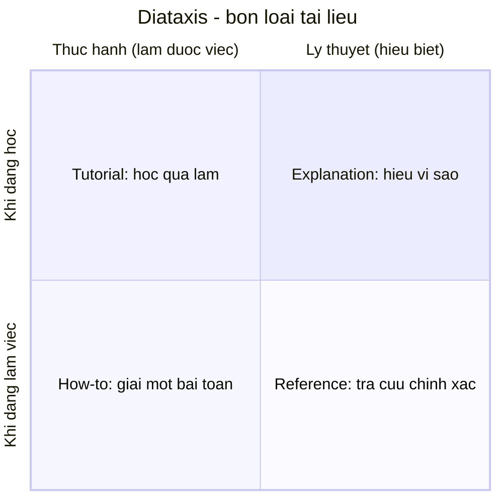

# Vì sao dev cần viết tài liệu kỹ thuật tốt

> **Tác giả:** Mr.Rom\
> **Phiên bản:** v1.0.0\
> **Tạo lúc:** 13/06/2026\
> **Cập nhật:** 13/06/2026\
> **Level:** Basic\
> **Tags:** career, technical-writing, documentation, soft-skills, diataxis, readme, adr, runbook\
> **Yêu cầu trước:** (không bắt buộc)

> 🎯 *Code bạn viết hôm nay được máy đọc, nhưng tài liệu bạn viết hôm nay được **người** đọc — và chính những người đó (đồng nghiệp, người mới vào, và cả bạn của sáu tháng sau) quyết định code đó còn sống hay chết. Bài mở đầu cụm này thuyết phục bạn rằng viết tài liệu kỹ thuật là một siêu năng lực bị đánh giá thấp, chỉ cho bạn các **loại tài liệu** một dev thật sự hay viết (README, API docs, design doc/RFC, ADR, runbook, tutorial, changelog), chỉ ra cái giá của tài liệu kém hoặc lỗi thời, và trao bạn bốn nguyên tắc nền cùng một bản đồ phân loại — **Diátaxis** — để biết mình đang viết loại tài liệu nào và viết cho ai. Kết bài bạn có một khung tư duy dùng được cho mọi bài còn lại trong cụm.*

## 🎯 Sau bài này bạn sẽ

- [ ] Giải thích được vì sao viết tài liệu tốt là một kỹ năng nhân giá trị (leverage) chứ không phải việc vặt
- [ ] Nhận diện được **7 loại tài liệu** dev hay viết và mỗi loại phục vụ ai, giải quyết gì
- [ ] Hiểu cái giá cụ thể của tài liệu **kém** và tài liệu **lỗi thời** (đôi khi tệ hơn không có)
- [ ] Áp dụng được bốn nguyên tắc nền: **audience-first**, rõ ràng hơn hoa mỹ, viết để **skim**, giữ tài liệu sống
- [ ] Dùng được mô hình **Diátaxis** để phân loại một tài liệu vào đúng một trong bốn ô (tutorial / how-to / reference / explanation)

---

## Tình huống — cùng một dòng lệnh, hai số phận

Bạn vừa join một team mới. Việc đầu tiên: chạy được project ở máy mình. Bạn `git clone` về, mở thư mục ra, và thấy một file `README.md` vỏn vẹn ba dòng:

```text
# payments-service

Microservice xử lý thanh toán.

TODO: viết hướng dẫn setup sau.
```

Cái "sau" đó không bao giờ tới. Bạn đoán mò: cài Node? Phiên bản nào? Có cần database không? Biến môi trường nào? Bạn nhắn hỏi một senior, anh ấy bận, vài tiếng sau mới rep. Bạn lại hỏi tiếp một câu. Hết buổi sáng bạn vẫn chưa chạy được một dòng nào — không phải vì code khó, mà vì **không ai viết lại cách chạy nó**.

Bây giờ tua lại sang một project khác trong cùng công ty. Bạn clone về, mở README, thấy đúng năm bước đánh số, copy-paste từng lệnh, và mười lăm phút sau project chạy local thành công, chưa cần hỏi ai một câu. Bạn lập tức thấy quý người đã viết cái README đó — dù bạn còn chưa gặp họ bao giờ.

Cùng một loại việc (giúp người mới chạy được project), nhưng **chất lượng tài liệu** quyết định người sau mất nửa ngày hay mười lăm phút, và quyết định luôn ấn tượng của họ về cả team. Đây không phải chuyện tài lẻ văn chương — đó là một kỹ năng kỹ thuật học được, và là kỹ năng mà cả bài này (và cả cụm bài sau nó) sẽ rèn cho bạn.

---

## 1️⃣ Viết tài liệu là siêu năng lực bị đánh giá thấp của dev

Hầu hết người mới coi viết tài liệu là một việc phụ — thứ "làm cho có", làm sau khi code xong "nếu còn giờ", thậm chí là một hình phạt. Cách nghĩ đó bỏ lỡ điều quan trọng nhất: tài liệu là cách **một** lần bạn suy nghĩ được dùng lại bởi **nhiều** người, nhiều lần, mà không cần bạn có mặt.

Hãy nghĩ về sự khác nhau giữa hai cách trả lời cùng một câu hỏi "làm sao deploy service này?":

- Bạn giải thích miệng cho từng người hỏi. Lần thứ nhất, thứ hai, thứ năm — mỗi lần tốn thời gian của bạn, và bạn phải có mặt đúng lúc người ta hỏi.
- Bạn viết một lần vào một file `DEPLOY.md`, rồi mỗi lần ai hỏi chỉ cần gửi link. Bạn trả lời được cả những người hỏi lúc bạn đang ngủ, đang nghỉ phép, hay đã chuyển sang công ty khác.

🪞 **Ẩn dụ**: viết tài liệu giống **trồng cây ăn quả** so với **đi hái quả dại mỗi ngày**. Giải thích miệng là đi hái quả dại: hôm nào cũng phải đi, hôm nào không đi thì không có quả. Viết tài liệu là trồng một cái cây: tốn công lúc đầu, nhưng sau đó nó tự ra quả cho mọi người tới hái, kể cả khi bạn không ở vườn. Người trồng cây tốt làm một lần, hưởng (và cho người khác hưởng) nhiều lần.

Cụ thể hơn, một tài liệu tốt tạo ra **leverage** (đòn bẩy — một công sức tạo ra nhiều lần giá trị) qua bốn cách rõ rệt. Bảng dưới đặt cạnh nhau "không có tài liệu" và "có tài liệu tốt" để thấy khác biệt không chỉ là tiện hơn, mà là đổi hẳn cách giá trị được nhân lên:

| Khía cạnh | ❌ Không / kém tài liệu | ✅ Tài liệu tốt |
|---|---|---|
| **Scale kiến thức** | Kiến thức nằm trong đầu một người; người đó nghỉ là mất | Kiến thức nằm trong văn bản, ai cũng đọc được, không phụ thuộc một người |
| **Số lần bị hỏi lại** | Cùng một câu hỏi bị hỏi đi hỏi lại, mỗi lần ngắt việc bạn | Hỏi tới lần hai thì có link để gửi; thời gian được trả lại cho bạn |
| **Onboarding người mới** | Người mới phải hỏi từng li từng tí, mất nhiều ngày mới tự đứng được | Người mới đọc README/tài liệu là tự chạy được, tự tin sớm |
| **Quyết định được lưu vết** | "Sao hồi đó làm vậy?" — không ai nhớ, lặp lại sai lầm cũ | Lý do mỗi quyết định lớn còn đó (trong design doc/ADR), tra ra được |

→ Điểm cốt lõi của bảng: tài liệu tốt không chỉ giúp người khác — nó **nhân giá trị công sức của chính bạn** và biến kiến thức cá nhân thành tài sản chung của team. Đó là lý do nó là một siêu năng lực, và là lý do nó hay bị đánh giá thấp: vì phần thưởng đến **muộn** và đến cho **người khác**, nên dễ bị bỏ qua lúc đang vội. Phần còn lại của bài cho bạn công cụ để viết loại tài liệu đó một cách có hệ thống.

> [!NOTE]
> Một sự thật hay bị bỏ qua: người đọc tài liệu của bạn nhiều nhất, trong nhiều trường hợp, chính là **bạn của tương lai**. Cái logic rắc rối bạn viết hôm nay, cái lý do bạn chọn cách này thay vì cách kia — sáu tháng sau bạn cũng quên sạch. Viết lại không phải lòng tốt với người lạ; nhiều khi đó là lòng tốt với chính mình.

---

## 2️⃣ Các loại tài liệu một dev thật sự hay viết

"Viết tài liệu" nghe mơ hồ vì nó không phải một thứ duy nhất. Một dev trong công việc thật chạm vào nhiều loại tài liệu rất khác nhau — khác cả về người đọc, mục đích, lẫn độ dài. Hiểu có những loại nào là bước đầu để mỗi lần ngồi xuống viết, bạn biết mình đang viết loại gì.

Bảng dưới liệt kê bảy loại phổ biến nhất. Với mỗi loại, để ý cột "viết cho ai" — vì như ta sẽ thấy ở nguyên tắc audience-first, người đọc khác nhau đòi hỏi cách viết khác nhau:

| Loại tài liệu | Viết cho ai | Trả lời câu hỏi | Ví dụ thường gặp |
|---|---|---|---|
| **README** | Người mới gặp project lần đầu | "Đây là cái gì, chạy nó thế nào?" | File `README.md` ở gốc repo |
| **API docs** | Dev khác *dùng* code/service của bạn | "Hàm/endpoint này nhận gì, trả gì?" | Docstring, OpenAPI/Swagger, trang API reference |
| **Design doc / RFC** | Team, trước khi xây | "Mình định xây cái này thế nào, sao lại vậy?" | Tài liệu thiết kế một feature lớn trước khi code |
| **ADR** (Architecture Decision Record) | Người sau, sau khi đã quyết | "Vì sao hồi đó chọn cách này?" | File ngắn ghi *một* quyết định kiến trúc + lý do |
| **Runbook / SOP** | Người trực vận hành (kể cả lúc 3h sáng) | "Khi sự cố X xảy ra thì làm gì, theo thứ tự nào?" | Quy trình xử lý sự cố, các bước deploy/rollback |
| **Tutorial** | Người học, chưa biết gì về chủ đề | "Dẫn tôi đi từng bước để học làm X" | Bài hướng dẫn "getting started", lab dạy tay |
| **Changelog** | Người dùng / dev khác, qua các phiên bản | "Phiên bản này đổi gì so với bản trước?" | File `CHANGELOG.md`, ghi chú release |

Một vài loại đáng nói thêm vì người mới hay nhầm chúng với nhau:

- **Design doc và RFC** gần như cùng họ. Cả hai viết **trước khi xây** để thống nhất cách làm và xin góp ý. *RFC* (Request For Comments — "đề nghị góp ý") nhấn vào việc lấy ý kiến tập thể trước khi chốt; design doc nhấn vào mô tả thiết kế. Bài 02 của cụm này dạy riêng về chúng.
- **ADR** thì ngược dòng thời gian với design doc: nó viết **sau khi đã quyết**, mỗi file chỉ ghi *một* quyết định (vd "chọn PostgreSQL thay vì MongoDB") cùng bối cảnh và lý do, để người sau khỏi đặt lại câu hỏi cũ hay vô tình đảo ngược một quyết định có chủ đích.
- **Runbook và SOP** (Standard Operating Procedure — quy trình vận hành chuẩn) là loại tài liệu "cứu mạng": nó được đọc lúc căng thẳng nhất, khi một thứ đang hỏng và người đọc có thể không phải người viết. Vì thế nó phải cực kỳ tuần tự, rõ ràng, không chỗ cho mơ hồ.

Để bốn loại "lạ" hơn (ADR, runbook, changelog) bớt trừu tượng, đây là hình dáng thật của chúng — đều ngắn một cách đáng ngạc nhiên. Một **ADR** điển hình chỉ là một file vài chục dòng theo một khung cố định:

```text
# ADR-007: Dùng PostgreSQL thay vì MongoDB cho service đơn hàng

Trạng thái: Đã chấp nhận (2026-06-10)

## Bối cảnh
Service đơn hàng cần lưu đơn + các dòng hàng, với ràng buộc:
- Một đơn và các dòng hàng phải ghi cùng nhau (atomic), không được lệch.
- Có nhiều truy vấn JOIN giữa đơn, khách, sản phẩm để lên báo cáo.

## Quyết định
Dùng PostgreSQL (SQL) làm database chính cho service này.

## Lý do
- Cần transaction mạnh (ACID) cho việc ghi đơn + dòng hàng atomic.
- Cần JOIN phức tạp cho báo cáo — SQL làm tốt, MongoDB phải tự ghép ở app.

## Đánh đổi
- Scale ngang khó hơn MongoDB. Chấp nhận được vì tải hiện ở mức một
  máy đủ chịu, và ta ưu tiên tính đúng đắn của dữ liệu đơn hàng.
```

→ Giá trị của ADR không nằm ở độ dài mà ở chỗ nó **đóng băng lý do** tại thời điểm quyết định. Sáu tháng sau, khi có người hỏi "sao không xài MongoDB cho dễ scale?", câu trả lời đã nằm sẵn ở mục "Đánh đổi" — khỏi tranh luận lại từ đầu, và quan trọng hơn, khỏi vô tình đảo ngược một quyết định vốn có chủ đích.

Tương tự, một **changelog** tốt cũng có khung quen thuộc — nhóm thay đổi theo phiên bản, theo loại (thêm / sửa / vá lỗi), viết cho *người đọc* chứ không phải dán nguyên commit log:

```text
## [2.1.0] - 2026-06-12
### Thêm
- Hỗ trợ thanh toán qua ví điện tử.
### Sửa
- Trang giỏ hàng tải nhanh hơn khi có nhiều sản phẩm.
### Vá lỗi
- Sửa lỗi nút "Đặt hàng" không phản hồi khi giỏ có >50 sản phẩm.
```

→ Để ý changelog mô tả thay đổi bằng **ngôn ngữ người dùng quan tâm** ("nút Đặt hàng không phản hồi"), không bằng ngôn ngữ kỹ thuật nội bộ ("fix off-by-one in cart reducer"). Đó cũng là audience-first — nguyên tắc ta bàn ngay sau đây.

> [!TIP]
> Bạn **không** cần viết cả bảy loại cho mọi project. Một service nhỏ chỉ cần một README tốt là đủ đi xa. Bảng trên là để bạn *nhận ra* mình đang ở loại nào khi cần, không phải một checklist bắt buộc tích cho đủ. Mỗi loại sẽ được đào sâu ở các bài sau của cụm — bài này chỉ vẽ bản đồ tổng thể.

→ Để ý: bảy loại này khác nhau chủ yếu ở **người đọc và mục đích**, không phải ở "format đẹp hay xấu". Đây chính là manh mối dẫn tới nguyên tắc nền quan trọng nhất của cả nghề viết tài liệu, mà ta bàn ngay sau đây.

---

## 3️⃣ Bốn nguyên tắc nền

Dù viết loại nào trong bảy loại trên, có bốn nguyên tắc đi xuyên suốt. Thuộc bốn cái này là bạn đã đi được nửa đường tới một tài liệu tốt.

### Nguyên tắc 1 — Audience-first: viết cho người đọc, không cho mình

Đây là nguyên tắc gốc, sai nó là sai tất cả. **Audience-first** ("người đọc trước hết") nghĩa là trước khi viết một chữ, bạn xác định *ai sẽ đọc cái này và họ đã biết gì*, rồi viết đúng cho họ — chứ không viết theo thứ tiện cho người **đã hiểu sẵn** như bạn.

🪞 **Ẩn dụ**: viết tài liệu mà không nghĩ tới người đọc giống **chỉ đường cho khách lạ bằng các mốc chỉ trong đầu mình**: "rẽ chỗ cái cây hồi xưa nhà bà Tư". Bạn biết cây đó ở đâu, nhưng khách thì không. Người chỉ đường giỏi dùng mốc mà *khách* nhìn thấy được (ngã tư có đèn đỏ, cây xăng), không phải mốc trong ký ức riêng mình. Tài liệu audience-first cũng vậy: nó dùng kiến thức nền mà *người đọc* có, không phải kiến thức chỉ bạn có.

Cùng một nội dung, viết cho hai đối tượng khác nhau sẽ khác hẳn. So sánh một câu mô tả cùng một bước setup:

❌ **Bỏ quên người đọc** — giả định họ biết mọi thứ như mình:

```text
Set up env như bình thường rồi chạy migration là xong.
```

✅ **Audience-first** — viết cho người mới chưa có ngữ cảnh:

```text
1. Copy file `.env.example` thành `.env`:  cp .env.example .env
2. Mở `.env`, điền `DATABASE_URL` (xin từ team lead nếu chưa có).
3. Tạo bảng trong database:  npm run migrate
```

→ Phiên bản đầu chỉ "đúng" với người **đã biết** project — tức là người không cần đọc. Phiên bản thứ hai phục vụ đúng người *cần* tài liệu: người mới, chưa biết "env như bình thường" là gì. Quy tắc thực hành: trước khi viết, hỏi *"người đọc cái này biết gì rồi, và cần gì để đi tiếp?"* — câu trả lời định hình toàn bộ cách viết.

### Nguyên tắc 2 — Rõ ràng hơn hoa mỹ

Tài liệu kỹ thuật **không** phải văn nghị luận. Mục tiêu duy nhất là người đọc hiểu nhanh và đúng — không phải để câu văn nghe sang. Câu dài, từ to, vòng vo làm chậm người đọc và dễ gây hiểu lầm. Ưu tiên: câu ngắn, từ thông dụng, một ý một câu.

❌ **Hoa mỹ, vòng vo**:

```text
Trong trường hợp người dùng có nhu cầu tiến hành việc khởi tạo một
phiên làm việc mới với hệ thống, việc đầu tiên cần được thực hiện đó
là tiến hành quá trình xác thực danh tính.
```

✅ **Rõ ràng, đi thẳng**:

```text
Để bắt đầu một phiên làm việc, trước hết hãy đăng nhập.
```

→ Hai câu nói cùng một điều, nhưng câu thứ hai ngắn hơn một nửa và hiểu ngay. Trong tài liệu kỹ thuật, "đẹp" được định nghĩa lại là "rõ và nhanh hiểu", không phải "nhiều chữ kêu". Khi phân vân giữa một câu nghe sang và một câu hiểu nhanh, luôn chọn cái hiểu nhanh.

### Nguyên tắc 3 — Viết để quét (skim), không để đọc từng chữ

Sự thật phũ phàng: gần như **không ai** đọc tài liệu kỹ thuật từ đầu tới cuối. Người ta **quét** (skim) — đảo mắt tìm đúng phần mình cần, nhảy cóc, đọc tiêu đề trước rồi mới đọc nội dung. Một tài liệu tốt được thiết kế để *chiều* cách đọc đó, không chống lại nó.

🪞 **Ẩn dụ**: người đọc tài liệu giống người tìm đồ trong **siêu thị**, không phải người đọc tiểu thuyết. Họ không đi từ kệ đầu tới kệ cuối — họ nhìn **biển chỉ dẫn trên cao** (gia vị / đồ đông lạnh / nước uống) để nhảy thẳng tới khu cần. Tài liệu cũng cần "biển chỉ dẫn": tiêu đề rõ, danh sách, bảng, đoạn ngắn — để người đọc nhảy đúng chỗ. Một bức tường chữ liền không tiêu đề giống một siêu thị không biển nào: người ta lạc và bỏ đi.

Vài kỹ thuật giúp tài liệu dễ quét, áp dụng được ngay:

- **Tiêu đề và đề mục rõ** — để mắt nhảy tìm phần cần. Một người chỉ muốn "cách deploy" phải thấy ngay mục "Deploy".
- **Danh sách thay vì câu văn dài liệt kê** — ba thứ cần làm thì ba gạch đầu dòng, đừng nhồi vào một câu.
- **Bảng cho thông tin có cấu trúc** — so sánh, tham số, tuỳ chọn nên ở dạng bảng để liếc là thấy.
- **Đoạn ngắn** — một ý một đoạn; đoạn dài là rào cản với người đang quét.
- **Code block và phần quan trọng nổi bật** — cái cần copy-paste phải dễ tìm, không lẫn trong văn xuôi.

Để thấy khác biệt rõ ràng, đây là **cùng một nội dung** viết hai cách — một bức tường chữ và một bản dễ quét:

❌ **Bức tường chữ** — đúng nội dung nhưng không quét được:

```text
Để chạy project bạn cần cài Node 20 trở lên và PostgreSQL 15, sau đó
copy file môi trường mẫu thành .env rồi điền DATABASE_URL vào, tiếp
theo cài dependency bằng npm install và chạy migration bằng npm run
migrate, cuối cùng khởi động bằng npm run dev và mở localhost:3000,
lưu ý nếu cổng 3000 bận thì đổi biến PORT trong .env.
```

✅ **Dễ quét** — cùng nội dung, chia mục + đánh số:

```text
## Yêu cầu
- Node 20+
- PostgreSQL 15

## Chạy local
1. cp .env.example .env   (rồi điền DATABASE_URL)
2. npm install
3. npm run migrate
4. npm run dev            → mở http://localhost:3000

> Cổng 3000 bận? Đổi biến PORT trong .env.
```

→ Hai bản chứa đúng từng ấy thông tin, nhưng bản thứ hai cho người đọc *nhảy thẳng* tới bước họ đang kẹt mà không phải đọc lại từ đầu. Để ý chính bài bạn đang đọc cũng được viết theo cách này: tiêu đề đánh số, bảng so sánh, danh sách, đoạn ngắn — để bạn quét tới đúng phần cần. Viết để skim không phải làm tài liệu "cạn" hơn; nó là làm chiều sâu *tìm thấy được*.

### Nguyên tắc 4 — Giữ tài liệu sống (living documentation)

Tài liệu không phải viết một lần rồi xong. Code thay đổi, và tài liệu mô tả code cũng phải đổi theo. Tài liệu **không** được cập nhật sẽ dần lệch khỏi thực tế — và như mục sau sẽ chỉ ra, một tài liệu lệch thực tế đôi khi **tệ hơn** không có tài liệu nào.

🪞 **Ẩn dụ**: tài liệu giống **bản đồ một thành phố đang xây**. Thành phố mọc đường mới, phá đường cũ liên tục. Một tấm bản đồ in từ mười năm trước không chỉ vô dụng — nó **dẫn bạn đi sai**, vào con đường đã bị chặn. Bản đồ chỉ có giá trị khi được cập nhật theo thành phố. Tài liệu cũng vậy: nó phải sống cùng code, không phải một bức ảnh chụp quá khứ.

Cách giữ tài liệu sống một cách thực tế (sẽ được đào sâu ở bài về docs-as-code):

- **Để tài liệu gần code** — nằm cùng repo, sửa code và sửa tài liệu trong cùng một pull request.
- **Coi tài liệu lỗi thời là một loại bug** — phát hiện chỗ sai thì sửa hoặc báo, đừng kệ.
- **Đừng viết thứ chóng lỗi thời nếu không cần** — ví dụ chép tay từng giá trị output rất dễ lệch; mô tả nguyên tắc bền hơn chép chi tiết hay đổi.

> [!IMPORTANT]
> Bốn nguyên tắc này không độc lập — chúng chụm về một gốc: **phục vụ người đọc**. Audience-first là biết người đọc là ai; rõ ràng là tôn trọng thời gian của họ; viết để skim là chiều cách họ thật sự đọc; giữ tài liệu sống là không phản bội lòng tin của họ bằng thông tin sai. Khi phân vân bất cứ điều gì lúc viết, quay về câu hỏi gốc: *"điều này có giúp người đọc không?"*

---

## 4️⃣ Cái giá của tài liệu kém và tài liệu lỗi thời

Để thấy vì sao đáng đầu tư viết tốt, hãy nhìn thẳng vào cái giá của việc viết kém — hoặc viết rồi để mặc cho lỗi thời. Có hai loại "nợ" khác nhau ở đây.

**Tài liệu kém** (thiếu, sơ sài, mơ hồ) đẩy chi phí sang người đọc và sang tương lai:

- Người mới onboarding chậm, phải hỏi từng li từng tí, tốn cả thời gian của họ lẫn của người bị hỏi.
- Cùng một câu hỏi bị hỏi đi hỏi lại, ngắt việc người đang nắm kiến thức (thường là người bận nhất team).
- Kiến thức kẹt trong đầu một người — người đó nghỉ phép hay nghỉ việc là cả team kẹt theo (gọi là **bus factor** — "yếu tố xe buýt": bao nhiêu người bị xe buýt tông là dự án đứng).
- Quyết định không được lưu vết → vài tháng sau không ai nhớ "sao hồi đó làm vậy", dễ lặp lại sai lầm cũ hoặc phá đi một thứ vốn có chủ đích.

**Tài liệu lỗi thời** thì nguy hiểm theo một kiểu khác — và đây là điểm phản trực giác quan trọng nhất của mục này: một tài liệu **sai** đôi khi tệ hơn **không có** tài liệu nào.

🪞 **Ẩn dụ**: quay lại tấm bản đồ thành phố. Không có bản đồ, bạn biết mình không biết đường, nên cẩn thận hỏi đường, đi chậm, dò từng bước — và tới nơi. Có một bản đồ **sai**, bạn **tin** nó, đi tự tin theo nó, và lao thẳng vào con đường cụt. Cái nguy của tài liệu lỗi thời không nằm ở chỗ nó vô dụng, mà ở chỗ nó **trông đáng tin** trong khi đã sai — người đọc tin theo mới là chỗ chết người.

Một ví dụ cụ thể trong nghề: một runbook xử lý sự cố ghi "chạy lệnh X để restart service". Sáu tháng trước lệnh đó đúng. Nhưng hệ thống đã đổi, giờ lệnh X xoá nhầm dữ liệu. Lúc 3h sáng, người trực — tin tưởng runbook — chạy đúng lệnh đó và biến một sự cố nhỏ thành một thảm hoạ. Nếu runbook **không** ghi lệnh nào, người trực đã phải dừng lại tìm hiểu kỹ trước khi hành động.

> [!WARNING]
> Đây là lý do nguyên tắc "giữ tài liệu sống" không phải lời khuyên cho có. Một tài liệu lỗi thời ở đúng chỗ nhạy cảm (runbook sự cố, hướng dẫn deploy, lệnh thao tác database) có thể trực tiếp gây mất dữ liệu hoặc downtime. Nếu không chắc một tài liệu còn đúng không, thà ghi rõ "⚠️ phần này có thể đã lỗi thời, kiểm tra lại trước khi dùng" còn hơn để nó trông đáng tin một cách giả tạo.

→ Tổng lại: tài liệu kém đẩy chi phí sang thời gian và onboarding; tài liệu lỗi thời đẩy rủi ro sang cả sự an toàn của hệ thống. Cả hai đều là cái giá thật, chỉ là đến muộn — nên dễ bị xem nhẹ. Đầu tư viết tốt và giữ nó sống chính là trả trước để khỏi trả cái giá lớn hơn về sau.

---

## 5️⃣ Diátaxis — bản đồ phân loại bốn loại tài liệu

Bốn nguyên tắc nền cho bạn *cách viết tốt*. Nhưng còn một câu hỏi đứng trước cả đó: **mình đang viết loại tài liệu gì?** Đây là chỗ người mới hay sai nhất — họ trộn lẫn nhiều mục đích vào một tài liệu, khiến nó không phục vụ tốt cho ai. Một bài "hướng dẫn" mà giữa chừng lại sa đà giải thích lý thuyết kiến trúc làm người học mất mạch; một trang "tham khảo" mà chen vào lời khuyên dạy dỗ làm khó tra cứu.

**Diátaxis** (đọc gần như "đi-a-tắc-xít", gốc Hy Lạp nghĩa là "sắp xếp xuyên suốt") là một mô hình giúp gỡ đúng mớ bòng bong đó. Nó nói: mọi tài liệu kỹ thuật thực ra phục vụ một trong **bốn nhu cầu** khác nhau của người đọc, và bốn nhu cầu đó nên là **bốn loại tài liệu tách biệt**, mỗi loại viết theo một kiểu riêng.

Bốn loại đó được sắp theo hai trục: người đọc đang **học** hay đang **làm việc**, và họ cần **thực hành** hay cần **lý thuyết**. Đây là khái niệm trừu tượng nhất của bài, nên ta nhìn nó qua sơ đồ trước rồi mới mổ từng ô:



→ Phân tích sơ đồ: trục dọc chia theo *bối cảnh* người đọc — họ đang **học** (nửa trên) hay đang **làm việc thật** (nửa dưới); trục ngang chia theo *nhu cầu* — họ cần **thực hành cụ thể** (bên trái) hay cần **hiểu biết lý thuyết** (bên phải). Bốn góc cho ra bốn loại tài liệu. Điều cốt lõi: một tài liệu tốt nên nằm gọn trong **một** ô, không cố ôm cả bốn. Khi bạn biết mình đang ở ô nào, bạn biết nên viết kiểu gì.

Bảng dưới mổ từng ô — mỗi loại trả lời một câu hỏi khác nhau của người đọc, nên giọng văn và nội dung cũng khác:

| Loại | Phục vụ khi người đọc... | Trả lời | Giọng viết | Ví dụ |
|---|---|---|---|---|
| **Tutorial** | Đang **học**, cần **thực hành** | "Dẫn tôi đi từng bước để học làm được X lần đầu" | Cầm tay chỉ việc, đảm bảo thành công, không rẽ nhánh | "Getting started: dựng app đầu tiên trong 10 bước" |
| **How-to guide** | Đang **làm việc**, cần **thực hành** | "Tôi cần giải đúng bài toán cụ thể này, chỉ tôi cách" | Tập trung một mục tiêu, giả định đã biết cơ bản | "Cách cấu hình HTTPS cho service" |
| **Reference** | Đang **làm việc**, cần **lý thuyết/dữ kiện** | "Tham số/endpoint này nhận gì, trả gì, chính xác?" | Khô, đầy đủ, chính xác, dễ tra; không dạy | API reference, mô tả từng option của lệnh |
| **Explanation** | Đang **học**, cần **lý thuyết** | "Vì sao thứ này thiết kế như vậy, bối cảnh là gì?" | Bàn luận, nối ý, cho ngữ cảnh và lý do | "Vì sao chúng tôi chọn kiến trúc event-driven" |

Để thấy bốn loại khác nhau thế nào trong thực tế, hãy lấy **cùng một chủ đề** — "database của hệ thống" — và xem mỗi loại nói gì:

- **Tutorial**: "Bài 1: cùng tạo bảng `users` đầu tiên của bạn" — dẫn người mới làm từng bước, đảm bảo cuối bài chạy ra kết quả.
- **How-to**: "Cách thêm một cột mới mà không downtime" — một bài toán cụ thể, cho người đã biết database cơ bản.
- **Reference**: "Bảng `users`: danh sách đầy đủ các cột, kiểu, ràng buộc" — tra cứu khô, chính xác.
- **Explanation**: "Vì sao chúng tôi tách bảng `users` và `profiles`" — bàn luận lý do thiết kế, đánh đổi.

Giá trị thực tế của Diátaxis lộ rõ nhất khi bạn dùng nó để **gỡ một tài liệu bị trộn**. Đây là lỗi phổ biến nhất của người mới: gom mọi thứ vào một file. Một "hướng dẫn cài đặt" thường biến dạng thành như sau:

❌ **Một tài liệu ôm cả bốn ô** — phục vụ kém cho mọi người:

```text
# Hướng dẫn Redis

Redis là một in-memory data store, ra đời năm 2009, dùng mô hình
key-value và vì sao nó nhanh hơn database trên đĩa là vì...   ← explanation

Để cài: chạy `brew install redis`, rồi `redis-server`...        ← tutorial

Lệnh SET nhận cú pháp: SET key value [EX seconds] [NX|XX]...     ← reference

Nếu Redis bị đầy bộ nhớ thì cấu hình maxmemory-policy...         ← how-to
```

→ Người mới muốn *học* bị ngợp bởi cú pháp reference khô khan; người đang *tra* cú pháp `SET` phải lội qua đoạn lịch sử Redis; người đang *xử lý sự cố đầy bộ nhớ* không tìm thấy phần mình cần. Một file, không ai được phục vụ tốt.

✅ **Tách theo Diátaxis** — bốn tài liệu, mỗi cái một ô:

```text
docs/
├── tutorial/getting-started-redis.md      ← học: cài + chạy lệnh đầu tiên
├── how-to/xu-ly-day-bo-nho.md             ← làm việc: giải sự cố cụ thể
├── reference/cac-lenh-redis.md            ← làm việc: tra cú pháp đầy đủ
└── explanation/vi-sao-redis-nhanh.md      ← học: hiểu lý thuyết
```

→ Sau khi tách, mỗi người đi thẳng tới đúng tài liệu mình cần, và mỗi tài liệu giữ được một giọng nhất quán. Đây không phải lý thuyết suông — đó chính là cách các bộ tài liệu lớn (như tài liệu của nhiều framework nổi tiếng) được tổ chức.

> [!TIP]
> Mẹo thực hành dùng Diátaxis ngay: trước khi viết, hỏi hai câu — *"người đọc đang **học** hay đang **làm việc**?"* và *"họ cần **làm được** một việc hay **hiểu** một điều?"*. Hai câu trả lời chỉ thẳng vào một trong bốn ô. Nếu bạn thấy mình đang viết một tài liệu rơi vào *nhiều* ô cùng lúc, đó là tín hiệu nên **tách** nó thành nhiều tài liệu — mỗi cái phục vụ tốt một nhu cầu.

→ Diátaxis không phải luật cứng phải tuân từng chữ; nó là một *bản đồ* giúp bạn không bị lạc. Khi viết bất kỳ tài liệu nào ở các bài sau (README, API docs, design doc...), bạn sẽ thấy chúng rơi vào các ô này — README thường trộn tutorial + how-to + reference một cách có chủ đích, API docs là reference thuần, design doc nghiêng về explanation. Biết ô giúp bạn viết đúng giọng cho đúng mục đích.

---

## 💡 Cạm bẫy thường gặp & Best practice

### ❌ Cạm bẫy: viết cho chính mình, quên người đọc thật sự là ai

- **Triệu chứng**: tài liệu dùng đầy thuật ngữ nội bộ, viết tắt không giải thích, bỏ qua các bước "ai cũng biết" — nhưng người mới đọc xong vẫn không làm được; chỉ người *đã hiểu sẵn* mới hiểu (mà họ thì không cần đọc).
- **Nguyên nhân**: người viết đang ở trong đầu mình, dùng kiến thức nền chỉ mình có (như chỉ đường bằng mốc trong ký ức riêng), không đặt mình vào vị trí người chưa biết.
- **Cách tránh**: trước khi viết, xác định rõ *ai đọc và họ đã biết gì*; viết đủ chi tiết cho người đó. Sau khi viết, đọc lại với con mắt "mình là người mới hoàn toàn" — hoặc nhờ một người mới thật đọc thử xem họ có làm theo được không.

### ❌ Cạm bẫy: để tài liệu lỗi thời mà vẫn trông đáng tin

- **Triệu chứng**: README ghi bước setup từ phiên bản cũ, runbook ghi lệnh đã đổi, API docs mô tả tham số đã bỏ — nhưng không có dấu hiệu gì cảnh báo, nên người đọc tin theo và làm sai.
- **Nguyên nhân**: code đổi nhưng tài liệu không đổi theo; tài liệu nằm tách rời code nên dễ bị quên cập nhật; không ai coi tài liệu sai là một loại bug.
- **Cách tránh**: để tài liệu gần code (cùng repo), sửa tài liệu trong cùng pull request với code; coi tài liệu lỗi thời là bug cần sửa. Chỗ chưa kịp kiểm tra thì ghi rõ cảnh báo "có thể đã lỗi thời" thay vì để nó trông đáng tin giả tạo.

### ❌ Cạm bẫy: trộn lẫn nhiều loại tài liệu vào một

- **Triệu chứng**: một bài "hướng dẫn nhanh" mà giữa chừng sa đà giải thích lý thuyết kiến trúc; một trang "tham khảo API" mà chen vào lời khuyên dạy dỗ — kết quả là người học bị mất mạch, người tra cứu bị nhiễu.
- **Nguyên nhân**: chưa phân biệt được người đọc đang *học* hay đang *làm việc*, cần *thực hành* hay cần *lý thuyết* (bốn ô Diátaxis).
- **Cách tránh**: xác định tài liệu này thuộc ô nào (tutorial / how-to / reference / explanation) và viết gọn trong ô đó. Nếu thấy nội dung rơi vào nhiều ô, tách thành nhiều tài liệu, mỗi cái phục vụ một nhu cầu.

### ✅ Best practice: audience-first — luôn hỏi "người đọc là ai" trước khi viết

- **Vì sao**: cùng một nội dung viết cho người mới và người đã rành sẽ khác hẳn về độ chi tiết và thuật ngữ. Viết sai đối tượng thì tài liệu hoặc quá khó (người mới bỏ cuộc) hoặc quá dài dòng (người rành mất kiên nhẫn).
- **Cách áp dụng**: mở đầu mỗi lần viết bằng câu hỏi *"ai đọc cái này, họ biết gì rồi, cần gì để đi tiếp?"*. Để câu trả lời quyết định độ chi tiết, thuật ngữ nào cần giải thích, bước nào không được bỏ.

### ✅ Best practice: viết để quét được, không bắt đọc từng chữ

- **Vì sao**: gần như không ai đọc tài liệu kỹ thuật tuyến tính; người ta quét tìm phần cần. Một bức tường chữ không cấu trúc khiến họ không tìm thấy và bỏ đi, dù nội dung có đúng.
- **Cách áp dụng**: dùng tiêu đề rõ để mắt nhảy tới đúng phần; danh sách thay câu liệt kê dài; bảng cho thông tin có cấu trúc; đoạn ngắn một ý; làm nổi bật code/phần quan trọng. Thiết kế tài liệu như "siêu thị có biển chỉ dẫn", không như tiểu thuyết.

---

## 🧠 Tự kiểm tra (Self-check)

**Q1.** Vì sao nói viết tài liệu tốt là một dạng "leverage" (đòn bẩy), và vì sao kỹ năng này lại hay bị dev đánh giá thấp?

<details>
<summary>💡 Xem giải thích</summary>

Viết tài liệu là leverage vì **một** lần bạn suy nghĩ và viết ra được dùng lại bởi **nhiều** người, nhiều lần, mà không cần bạn có mặt — trái với giải thích miệng (mỗi lần tốn thời gian, phải đúng lúc người hỏi). Nó nhân giá trị công sức qua bốn cách: scale kiến thức (không kẹt trong đầu một người), giảm số lần bị hỏi lại (gửi link thay vì lặp lại), onboarding nhanh hơn, và lưu vết quyết định.

Nó hay bị đánh giá thấp vì phần thưởng đến **muộn** (giá trị xuất hiện sau, không ngay lúc viết) và đến cho **người khác** (người đọc tương lai, dù người đó nhiều khi chính là bạn sáu tháng sau) — nên lúc đang vội rất dễ bỏ qua.

</details>

**Q2.** Kể tên ít nhất năm loại tài liệu một dev hay viết, và nói mỗi loại phục vụ ai / trả lời câu hỏi gì.

<details>
<summary>💡 Xem giải thích</summary>

Bảy loại (kể được năm là đạt):

- **README** — cho người mới gặp project, trả lời "đây là gì, chạy nó thế nào?".
- **API docs** — cho dev *dùng* code/service của bạn, trả lời "hàm/endpoint này nhận gì, trả gì?".
- **Design doc / RFC** — cho team trước khi xây, trả lời "định xây thế nào, vì sao vậy?".
- **ADR** — cho người sau, ghi *một* quyết định kiến trúc + lý do, trả lời "sao hồi đó chọn cách này?".
- **Runbook / SOP** — cho người trực vận hành, trả lời "khi sự cố X xảy ra thì làm gì, theo thứ tự nào?".
- **Tutorial** — cho người học chưa biết gì, "dẫn tôi đi từng bước để học làm X".
- **Changelog** — cho người dùng/dev qua các phiên bản, "phiên bản này đổi gì?".

</details>

**Q3.** "Audience-first" nghĩa là gì? Áp dụng nó vào câu setup sau cho người **mới hoàn toàn**: *"Set up env như bình thường rồi chạy migration là xong."*

<details>
<summary>💡 Xem giải thích</summary>

**Audience-first** = trước khi viết, xác định *ai đọc và họ đã biết gì*, rồi viết đúng cho họ — không viết theo thứ tiện cho người đã hiểu sẵn. Câu gốc chỉ "đúng" với người đã biết project (tức người không cần đọc): "env như bình thường" và "migration" là gì thì người mới không biết.

Viết lại audience-first cho người mới:

```text
1. Copy file `.env.example` thành `.env`:  cp .env.example .env
2. Mở `.env`, điền `DATABASE_URL` (xin từ team lead nếu chưa có).
3. Tạo bảng trong database:  npm run migrate
```

Mỗi bước cụ thể, không bỏ bước, không giả định kiến thức người mới chưa có.

</details>

**Q4.** Vì sao một tài liệu **lỗi thời** đôi khi còn tệ hơn **không có** tài liệu nào? Cho một ví dụ.

<details>
<summary>💡 Xem giải thích</summary>

Vì tài liệu lỗi thời **trông đáng tin** trong khi đã sai, nên người đọc tin theo và hành động sai. Ngược lại, khi *không có* tài liệu, người đọc biết mình không biết, nên cẩn thận hỏi/dò trước khi làm.

Ẩn dụ bản đồ: không có bản đồ thì bạn hỏi đường, đi chậm nhưng tới nơi; có bản đồ **sai** thì bạn tự tin đi theo và lao vào đường cụt.

Ví dụ: một runbook ghi "chạy lệnh X để restart service" — sáu tháng trước đúng, nhưng hệ thống đã đổi khiến lệnh X giờ xoá nhầm dữ liệu. Lúc 3h sáng, người trực tin runbook chạy đúng lệnh đó và biến sự cố nhỏ thành thảm hoạ. Nếu runbook không ghi lệnh nào, người trực đã phải dừng lại tìm hiểu kỹ trước.

</details>

**Q5.** Diátaxis chia tài liệu thành bốn loại. Với chủ đề "database của hệ thống", một trang liệt kê đầy đủ các cột/kiểu/ràng buộc của bảng `users` để dev tra cứu thuộc loại nào? Vì sao?

<details>
<summary>💡 Xem giải thích</summary>

Thuộc loại **reference** (tham khảo). Vì người đọc đang **làm việc** (không phải đang học) và cần **dữ kiện chính xác** (không phải lý thuyết bàn luận) — họ chỉ muốn tra "cột này kiểu gì, ràng buộc gì" rồi quay lại làm việc. Giọng viết của reference phải khô, đầy đủ, chính xác, dễ tra — không dạy dỗ, không kể chuyện.

(So sánh: nếu nội dung là "vì sao tách bảng `users` và `profiles`" thì đó là **explanation**; "cùng tạo bảng đầu tiên từng bước" là **tutorial**; "cách thêm cột không downtime" là **how-to**.)

</details>

**Q6.** Người ta nói "viết để skim". Điều đó nghĩa là gì, và kể ba kỹ thuật cụ thể giúp tài liệu dễ quét.

<details>
<summary>💡 Xem giải thích</summary>

"Viết để skim" = thiết kế tài liệu cho cách người ta **thật sự** đọc: gần như không ai đọc tuyến tính từ đầu tới cuối, mà **quét** tìm đúng phần cần, nhảy cóc, đọc tiêu đề trước. Ẩn dụ: người đọc như người tìm đồ trong siêu thị nhìn biển chỉ dẫn, không như người đọc tiểu thuyết.

Ba (trong nhiều) kỹ thuật: (1) tiêu đề/đề mục rõ để mắt nhảy tới phần cần; (2) danh sách thay vì câu văn dài liệt kê; (3) bảng cho thông tin có cấu trúc. Ngoài ra: đoạn ngắn một ý, làm nổi bật code/phần quan trọng.

</details>

---

## ⚡ Tra cứu nhanh (Cheatsheet)

### 7 loại tài liệu dev hay viết

| Loại | Trả lời câu hỏi |
|---|---|
| README | "Đây là gì, chạy nó thế nào?" |
| API docs | "Hàm/endpoint này nhận gì, trả gì?" |
| Design doc / RFC | "Định xây thế nào, vì sao vậy?" (trước khi xây) |
| ADR | "Sao hồi đó chọn cách này?" (sau khi quyết, mỗi file một quyết định) |
| Runbook / SOP | "Sự cố X xảy ra thì làm gì, theo thứ tự nào?" |
| Tutorial | "Dẫn tôi từng bước học làm X" |
| Changelog | "Phiên bản này đổi gì?" |

### 4 nguyên tắc nền

- **Audience-first** — hỏi "ai đọc, biết gì rồi, cần gì" trước khi viết một chữ.
- **Rõ ràng hơn hoa mỹ** — câu ngắn, từ thông dụng, một ý một câu; "đẹp" = "hiểu nhanh".
- **Viết để skim** — tiêu đề rõ, danh sách, bảng, đoạn ngắn, làm nổi bật phần cần copy.
- **Giữ tài liệu sống** — gần code, sửa cùng PR, coi tài liệu lỗi thời là bug.

### Diátaxis — chọn ô bằng 2 câu hỏi

| Người đọc đang... | Cần thực hành | Cần lý thuyết |
|---|---|---|
| **Học** | Tutorial (học qua làm từng bước) | Explanation (hiểu vì sao) |
| **Làm việc** | How-to (giải một bài toán cụ thể) | Reference (tra cứu chính xác) |

→ Một tài liệu nên nằm gọn trong **một** ô. Rơi vào nhiều ô → tách ra nhiều tài liệu.

### Tự kiểm trước khi xuất bản

- [ ] Mình đã xác định **người đọc là ai** chưa?
- [ ] Người mới hoàn toàn đọc có **làm theo được** không?
- [ ] Quét nhanh có **thấy ngay** phần mình cần không (tiêu đề/bảng/list)?
- [ ] Tài liệu này thuộc **ô Diátaxis nào**, có bị trộn nhiều ô không?
- [ ] Có chỗ nào **dễ lỗi thời** mà nên ghi nguyên tắc thay vì chép chi tiết không?

---

## 📚 Từ Điển Thuật Ngữ (Glossary)

| EN | VN | Giải thích |
|---|---|---|
| Technical writing | Viết tài liệu kỹ thuật | Kỹ năng viết để truyền đạt thông tin kỹ thuật rõ ràng, chính xác cho người đọc |
| Documentation | Tài liệu | Văn bản ghi lại cách dùng/cách làm/quyết định để người sau dùng lại |
| Leverage | Đòn bẩy | Một công sức tạo ra nhiều lần giá trị (viết một lần, nhiều người dùng) |
| Audience-first | Người đọc trước hết | Xác định người đọc là ai và họ biết gì *trước khi* viết, rồi viết đúng cho họ |
| Skim | Quét / đọc lướt | Đảo mắt tìm đúng phần cần thay vì đọc từng chữ tuyến tính |
| Living documentation | Tài liệu sống | Tài liệu được cập nhật liên tục theo code, không phải viết một lần rồi bỏ |
| README | (giữ EN) | File mô tả/hướng dẫn ở gốc repo: project là gì, cách chạy |
| API docs | Tài liệu API | Mô tả cách dùng một API: tham số, kết quả trả về, ví dụ |
| Design doc | Tài liệu thiết kế | Mô tả cách định xây một feature/hệ thống *trước khi* code |
| RFC | (giữ EN) | Request For Comments — đề nghị thiết kế đưa ra để team góp ý trước khi chốt |
| ADR | (giữ EN) | Architecture Decision Record — file ngắn ghi *một* quyết định kiến trúc + lý do |
| Runbook | Sổ tay vận hành | Tài liệu hướng dẫn các bước xử lý một tình huống vận hành/sự cố cụ thể |
| SOP | Quy trình vận hành chuẩn | Standard Operating Procedure — các bước chuẩn để làm một việc lặp lại |
| Tutorial | Bài hướng dẫn học | Tài liệu dẫn người học làm từng bước để học một kỹ năng lần đầu |
| How-to guide | Bài hướng dẫn giải việc | Tài liệu chỉ cách giải một bài toán cụ thể cho người đã biết cơ bản |
| Reference | Tài liệu tra cứu | Mô tả khô, đầy đủ, chính xác để tra (vd: danh sách tham số) |
| Explanation | Bài giải thích | Tài liệu bàn luận lý do/bối cảnh/đánh đổi của một thiết kế |
| Changelog | Nhật ký thay đổi | File ghi mỗi phiên bản đổi những gì so với bản trước |
| Diátaxis | (giữ EN) | Mô hình phân loại tài liệu thành 4 loại: tutorial / how-to / reference / explanation |
| Bus factor | Yếu tố xe buýt | Số người nắm kiến thức then chốt mà nếu mất đi thì dự án đứng |
| Onboarding | Hội nhập người mới | Quá trình giúp người mới vào team bắt đầu làm việc được |
| Docs-as-code | Tài liệu như code | Cách quản lý tài liệu cùng repo với code, qua Git/pull request |

---

## 🔗 Liên kết & Tài nguyên

➡️ **Bài tiếp theo:** [Viết README & tài liệu dự án — Docs-as-code](01_writing-readme-and-docs.md)\
↑ **Về cụm:** [technical-writing — README](../../README.md)

### 🧭 Định hướng lộ trình học

- [Viết README & tài liệu dự án — Docs-as-code](01_writing-readme-and-docs.md) — bài tiếp theo, áp dụng ngay các nguyên tắc nền vào loại tài liệu phổ biến nhất
- [Design Doc & RFC — Viết để quyết định kỹ thuật](02_design-docs-and-rfc.md) — đào sâu loại tài liệu "explanation" viết trước khi xây
- [Sơ đồ kỹ thuật — Truyền đạt bằng hình ảnh](04_diagrams-and-visual-communication.md) — viết để skim ở mức cao nhất: truyền đạt bằng hình

### 🧩 Các chủ đề có thể bạn quan tâm

- [Giao tiếp async & viết — Slack, email, ticket, tài liệu](../../../communication/lessons/01_basic/01_async-and-written-communication.md) — documentation mindset và kỹ năng viết async bổ trợ trực tiếp cho viết tài liệu
- [Vì sao giao tiếp quyết định sự nghiệp dev](../../../communication/lessons/01_basic/00_why-communication-matters.md) — bức tranh lớn vì sao kỹ năng giao tiếp (gồm viết) quyết định sự nghiệp
- [Phát triển & Thăng tiến — Lên level và biết khi nào đổi việc](../../../career-path/lessons/01_basic/04_growth-and-leveling-up.md) — viết tài liệu tốt là một tín hiệu trưởng thành được ghi nhận khi lên level

### 🌐 Tài nguyên tham khảo khác

- [Diátaxis (diataxis.fr)](https://diataxis.fr/) — trang gốc của mô hình Diátaxis, giải thích đầy đủ bốn loại tài liệu và cách áp dụng
- [Write the Docs](https://www.writethedocs.org/) — cộng đồng và kho tài nguyên hàng đầu về viết tài liệu kỹ thuật cho dev
- [Google Technical Writing Courses](https://developers.google.com/tech-writing) — khoá học miễn phí của Google về viết kỹ thuật, rất thực dụng cho dev

---

## 📌 Nhật ký thay đổi (Changelog)

- **v1.0.0 (13/06/2026)** — Bản đầu tiên. Tình huống mở bài "cùng một dòng lệnh, hai số phận" (README ba dòng vs README năm bước) + 5 section: viết tài liệu là siêu năng lực leverage (bảng không/kém vs tốt, ẩn dụ trồng cây) + 7 loại tài liệu dev hay viết (README, API docs, design doc/RFC, ADR, runbook/SOP, tutorial, changelog) + 4 nguyên tắc nền (audience-first, rõ ràng hơn hoa mỹ, viết để skim, giữ tài liệu sống) với ví dụ before/after + cái giá của tài liệu kém vs lỗi thời (ẩn dụ bản đồ sai, ví dụ runbook 3h sáng) + mô hình Diátaxis với sơ đồ quadrant (tutorial/how-to/reference/explanation) và ví dụ cùng chủ đề database. Kèm 3 cạm bẫy + 2 best practice + 6 self-check + cheatsheet + glossary 22 thuật ngữ. Bài INTRO mở đầu cụm technical-writing.
