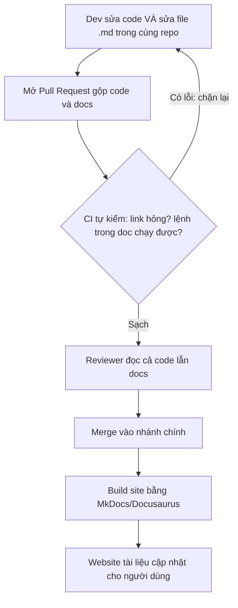

# Viết README & tài liệu dự án — Docs-as-code

> **Tác giả:** Mr.Rom\
> **Phiên bản:** v1.0.0\
> **Tạo lúc:** 13/06/2026\
> **Cập nhật:** 13/06/2026\
> **Level:** Basic\
> **Tags:** technical-writing, readme, documentation, docs-as-code, diataxis, mkdocs, soft-skills\
> **Yêu cầu trước:** [Vì sao dev cần viết tài liệu kỹ thuật tốt](00_why-technical-writing.md)

> 🎯 *Bài trước đã thuyết phục bạn rằng tài liệu tốt là một phần của công việc dev, không phải việc làm thêm. Bài này bắt tay vào loại tài liệu đầu tiên và quan trọng nhất bạn sẽ viết: **README** — cánh cửa của mọi project. Bạn sẽ học cấu trúc một README chuẩn, viết một quick-start để người lạ chạy được project trong vài phút, áp dụng **docs-as-code** (đối xử tài liệu như code: ở trong repo, review qua PR, sinh thành website), dùng khung **Diátaxis** để biết đang viết loại tài liệu nào, và giữ cho tài liệu không "trôi" khỏi code. Kết bài bạn có sẵn một template README và checklist để copy ra dùng ngay.*

## 🎯 Sau bài này bạn sẽ

- [ ] Hiểu README đóng vai trò gì và vì sao nó là tài liệu được đọc nhiều nhất của project
- [ ] Viết được một README đủ phần: **what + why + quick start + usage + config + contribute + license**
- [ ] Viết một **quick-start** mà người lạ làm theo là chạy được project, không phải đi hỏi
- [ ] Hiểu và áp dụng **docs-as-code** — tài liệu sống trong repo, review qua PR, sinh site bằng MkDocs/Docusaurus
- [ ] Dùng khung **Diátaxis** để chọn đúng loại tài liệu (tutorial / how-to / reference / explanation)
- [ ] Giữ tài liệu **khớp với code**: đặt doc gần code, dùng CI kiểm tra link hỏng và lệnh trong doc

---

## Tình huống — hai project, một quyết định trong ba mươi giây

Bạn cần một thư viện xử lý ngày tháng cho dự án của mình. Lên GitHub tìm, ra hai kết quả gần như giống nhau về số sao, cùng làm đúng việc bạn cần. Bạn mở cái thứ nhất. README của nó vỏn vẹn vài dòng:

```text
# datelib

A date library.

TODO: write docs
```

Bạn không biết nó cài thế nào, gọi ra sao, có chạy với phiên bản ngôn ngữ của bạn không. Đóng tab. Mở cái thứ hai. README của nó mở đầu bằng một câu nói rõ nó làm gì và vì sao nên dùng, rồi ngay bên dưới là ba dòng cài đặt và một đoạn code sáu dòng mà bạn copy vào chạy thử — chạy được luôn. Bạn chọn cái thứ hai. Quyết định mất ba mươi giây.

Điều quyết định không phải code bên trong (bạn còn chưa đọc), mà là **README** — thứ duy nhất bạn đọc trước khi quyết. Cùng một chất lượng code, project có README tốt được dùng, project kia bị bỏ qua. Và điều này không chỉ đúng với thư viện open source: chính bạn, sáu tháng sau, quay lại project cũ của mình cũng sẽ đọc README đầu tiên — và nếu nó tệ, người bạn làm khổ chính là bản thân mình.

README là **cánh cửa**. Người ta nhìn cánh cửa để quyết định có bước vào hay không. Bài này dạy bạn xây một cánh cửa khiến người ta muốn vào — và rộng hơn, dạy cách tổ chức toàn bộ tài liệu của một project sao cho nó không mục nát theo thời gian.

---

## 1️⃣ README là gì và vì sao nó được đọc nhiều nhất

**README** là file văn bản (gần như luôn là `README.md` viết bằng Markdown) đặt ở **gốc của repo**. Cái tên viết hoa toàn bộ — `README` — là một quy ước có từ thời lập trình viên để lại lời nhắn "READ ME" (đọc tôi đi) ở đầu thư mục để người sau biết bắt đầu từ đâu. GitHub, GitLab và mọi nền tảng git đều **tự động hiển thị** nội dung file này ngay trên trang chính của repo. Nói cách khác, đây là thứ đầu tiên đập vào mắt bất cứ ai ghé project.

🪞 **Ẩn dụ**: README giống **mặt tiền và biển hiệu của một cửa hàng**. Người đi đường không vào bên trong xem hàng trước — họ nhìn biển hiệu để biết "đây bán gì", nhìn cái cửa để biết "có nên bước vào không". Một cửa hàng có sản phẩm tốt nhưng biển hiệu mờ, cửa khóa, không ghi giờ mở cửa thì khách cứ thế đi qua. README chính là biển hiệu đó: nó không phải toàn bộ project, nhưng nó quyết định người ta có bước vào project của bạn hay không.

Vì sao README lại quan trọng hơn mọi tài liệu khác trong project? Vì nó được đọc bởi nhiều nhóm người khác nhau, và mỗi nhóm tới với một câu hỏi:

- **Người đánh giá** (đang cân nhắc có dùng project này không) — hỏi: *"Nó làm gì? Có hợp việc của tôi không?"*
- **Người dùng mới** (đã quyết dùng, cần bắt đầu) — hỏi: *"Cài thế nào? Chạy ví dụ đầu tiên ra sao?"*
- **Người đóng góp** (muốn sửa/thêm tính năng) — hỏi: *"Setup môi trường dev kiểu gì? Quy ước contribute là gì?"*
- **Chính bạn của tương lai** — hỏi: *"Sáu tháng trước mình chạy cái này kiểu gì nhỉ?"*

Một README tốt trả lời được cho cả bốn nhóm mà không bắt ai phải đi hỏi. Đó là tiêu chí thành công: **README tốt là README khiến người đọc không cần hỏi lại bạn**.

> [!NOTE]
> README không phải là *toàn bộ* tài liệu của project — nó là **điểm vào**. Với project nhỏ, README có thể chứa hết mọi thứ. Với project lớn, README giữ vai trò "trang bìa": nói nhanh project là gì, cách bắt đầu, rồi **trỏ** sang các tài liệu sâu hơn (full docs site, CONTRIBUTING, CHANGELOG). Đừng cố nhồi mọi thứ vào một file dài vô tận.

---

## 2️⃣ Cấu trúc một README chuẩn — bảy phần xương sống

Một README tốt không phải viết tùy hứng — nó có một bộ xương khá ổn định mà phần lớn project chất lượng đều theo. Bảy phần dưới đây xếp theo đúng thứ tự người đọc cần: cái họ hỏi trước thì đặt trước. Không phải project nào cũng cần đủ cả bảy (một thư viện nội bộ có thể bỏ phần license), nhưng biết bộ khung đầy đủ giúp bạn không sót phần quan trọng.

Trước khi xem từng phần, hãy nắm bức tranh tổng: README đi từ "cao" xuống "thấp" — từ câu hỏi *nó là gì* (trừu tượng, cho người mới ghé) xuống dần tới *làm sao đóng góp* (cụ thể, cho người ở lại lâu). Bảng dưới liệt kê bảy phần, mỗi phần trả lời câu hỏi gì và vì sao cần:

| # | Phần | Trả lời câu hỏi | Vì sao cần |
|---|---|---|---|
| 1 | **What** (project là gì) | "Cái này là gì, làm được gì?" | Người đọc quyết trong vài giây có đọc tiếp không |
| 2 | **Why** (vì sao tồn tại) | "Vì sao tôi nên dùng nó thay vì cái khác?" | Phân biệt project của bạn với hàng chục cái tương tự |
| 3 | **Quick start / Install** | "Làm sao chạy được nó ngay?" | Phần được đọc nhiều nhất — quyết định người ta ở lại hay bỏ đi |
| 4 | **Usage** (cách dùng) | "Dùng các tính năng chính thế nào?" | Người dùng cần ví dụ thật, không phải mô tả chung chung |
| 5 | **Config** (cấu hình) | "Tùy chỉnh được gì, qua biến/file nào?" | Người dùng thật luôn cần đổi cấu hình mặc định |
| 6 | **Contribute** (đóng góp) | "Tôi muốn sửa/thêm thì làm sao?" | Mở đường cho người khác cùng làm, giảm câu hỏi lặp |
| 7 | **License** (giấy phép) | "Tôi được dùng nó vào việc gì?" | Không có license = về mặt pháp lý không ai được dùng |

→ Để ý trật tự không phải ngẫu nhiên: **what → why → quick start** là ba phần đầu vì chúng phục vụ người đọc trong "ba mươi giây quyết định" ở tình huống đầu bài. Nếu ba phần này yếu, người ta đóng tab trước khi đọc tới phần usage. Giờ ta đi qua từng phần để biết viết cái gì vào đó.

### What — project này là gì (một, hai câu là đủ)

Mở đầu README bằng **một câu nói rõ project làm gì**, viết cho người chưa biết gì về nó. Không vòng vo, không "Welcome to the official repository of...". Câu này thường nằm ngay dưới tên project.

❌ **Mơ hồ** — đọc xong vẫn không biết nó làm gì:

```text
# SuperParse

A powerful, modern, blazing-fast solution for your needs.
```

✅ **Rõ ràng** — một câu biết ngay nó là gì, cho ai:

```text
# SuperParse

SuperParse là thư viện Python đọc file CSV/Excel cỡ lớn (hàng triệu dòng)
mà không nạp hết vào RAM, dành cho pipeline xử lý dữ liệu.
```

→ Phiên bản đúng trả lời cả ba thứ trong một câu: nó là gì (thư viện Python), làm gì (đọc file lớn không tốn RAM), cho ai (pipeline dữ liệu). Người đọc đủ thông tin để quyết "có hợp việc tôi không" ngay lập tức. Những từ rỗng như "powerful", "blazing-fast" không cho ai biết điều gì — cắt hết.

### Why — vì sao nên chọn nó

Phần này trả lời câu *"đã có hàng chục thư viện làm việc này, sao tôi chọn của bạn?"*. Không cần dài — vài gạch đầu dòng nêu điểm khác biệt thật là đủ. Tránh khoe khoang; nêu **fact cụ thể**: nó nhanh hơn ở điểm nào, nó giải quyết vấn đề gì mà cái khác không.

### Quick start / Install — phần quan trọng nhất

Đây là phần được đọc nhiều nhất và quyết định nhiều nhất, nên ta dành riêng cả section 3 cho nó. Tạm thời nhớ: phần này phải để người lạ **copy-paste là chạy được**, không bỏ bước.

### Usage — cách dùng các tính năng chính

Sau khi chạy được ví dụ đầu tiên, người dùng cần biết dùng các tính năng khác. Phần này gồm vài ví dụ code thật cho các use case phổ biến — không phải liệt kê hết mọi hàm (cái đó để dành cho tài liệu reference, xem Diátaxis ở section 5).

### Config — tùy chỉnh

Người dùng thật gần như luôn cần đổi cấu hình mặc định. Phần này liệt kê các biến môi trường, file config, hoặc tham số mà người dùng có thể chỉnh. Dùng bảng cho dễ tra.

### Contribute — cho người muốn đóng góp

Phần này nói cách setup môi trường dev, chạy test, và quy ước gửi pull request. Với project lớn, phần này thường tách ra một file riêng `CONTRIBUTING.md` và README chỉ trỏ tới nó.

### License — giấy phép sử dụng

Một dòng nói rõ project dùng giấy phép gì (MIT, Apache-2.0, GPL...). Điều này quan trọng về pháp lý: **một project không có license thì về mặc định người khác không được phép sao chép, sửa, hay dùng nó** — kể cả khi code công khai. Nếu bạn muốn người ta dùng, phải nói rõ họ được dùng thế nào.

> [!TIP]
> Đừng coi bảy phần này là một biểu mẫu cứng phải điền đủ. Với một script nhỏ chạy nội bộ, một README ba phần (what + quick start + config) đã quá đủ. Với một thư viện open source nhiều người dùng, bạn cần đủ bảy phần và thường tách contribute/changelog ra file riêng. **Quy mô tài liệu nên tương xứng quy mô project** — viết thừa cũng tệ như viết thiếu, vì tài liệu thừa rồi cũng không ai cập nhật.

---

## 3️⃣ Quick-start — để người lạ chạy được project trong vài phút

Trong tất cả các phần của README, **quick-start** (hay "Getting Started") là phần đáng đầu tư nhất. Lý do đơn giản: đây là khoảnh khắc người dùng quyết định ở lại hay bỏ đi. Nếu họ làm theo hướng dẫn mà gặp lỗi ngay bước đầu, phần lớn sẽ bỏ luôn — không phải vì project tệ, mà vì hướng dẫn làm họ thất vọng.

🪞 **Ẩn dụ**: quick-start giống **tờ hướng dẫn lắp ráp của đồ nội thất IKEA**. Cái hay của IKEA không phải gỗ tốt — mà là một người chưa lắp bao giờ, theo từng bước có hình, cũng ráp xong cái tủ. Một quick-start tốt cũng vậy: người chưa biết gì về project, làm đúng từng bước, là chạy được — không cần hiểu nội bộ, không cần đi hỏi. Nếu tờ hướng dẫn IKEA bỏ qua bước "vặn con ốc A vào lỗ B", người mua kẹt ngay; quick-start bỏ bước cũng vậy.

Tiêu chí của một quick-start tốt nằm gọn trong một câu: **người lạ, máy sạch, copy-paste tuần tự, là chạy được**. Để đạt được điều đó, có vài nguyên tắc:

- **Bắt đầu từ con số 0** — giả định người đọc chưa cài gì ngoài những thứ phổ biến (ngôn ngữ, git). Nêu rõ yêu cầu trước (prerequisites) nếu có.
- **Mỗi lệnh là một dòng copy được** — không "rồi cấu hình file config" mơ hồ; viết đúng lệnh cần gõ.
- **Không bỏ bước, không dùng `...`** — bước nào cần thì viết hết. Người mới không tự đoán được bước bị thiếu.
- **Kết thúc bằng một kết quả thấy được** — sau khi làm xong, người đọc thấy gì để biết "à, chạy đúng rồi" (một dòng output, một trang web mở ra).

Dưới đây là một quick-start mẫu cho một thư viện Python giả định. Để ý mỗi bước đều copy-paste được và kết thúc bằng output để người đọc tự đối chiếu:

````markdown
## Quick start

Yêu cầu: Python 3.10 trở lên.

1. Cài đặt qua pip:

```bash
pip install superparse
```

2. Tạo file `demo.py` với nội dung:

```python
from superparse import read_csv

# Đọc file CSV lớn theo từng dòng, không nạp hết vào RAM
for row in read_csv("data.csv"):
    print(row["name"])
```

3. Chạy thử:

```bash
python demo.py
```

Kết quả mong đợi (in ra cột `name` của từng dòng):

```text
Nguyen Van A
Le Van B
Tran Van C
```
````

→ Quick-start này thành công vì người đọc đi từ "chưa có gì" tới "thấy output thật" mà không phải tự suy luận bước nào. Để ý dòng "Yêu cầu: Python 3.10 trở lên" ở đầu — nó cứu người dùng đang chạy Python cũ khỏi một lỗi khó hiểu giữa chừng. Và phần "Kết quả mong đợi" cho họ một mốc để tự kiểm: nếu output khớp, họ yên tâm đi tiếp; nếu không, họ biết ngay có gì sai.

> [!IMPORTANT]
> Cách kiểm tra quick-start tốt nhất: **đưa cho một người chưa từng đụng project của bạn và bảo họ làm theo, đừng giải thích gì thêm**. Mọi chỗ họ khựng lại, hỏi "bước này nghĩa là gì", hay gặp lỗi — đó chính là chỗ quick-start thiếu. Bạn quá quen project nên không thấy được lỗ hổng; người lạ thì thấy ngay. Đây là cách rẻ nhất để tìm ra điểm yếu của tài liệu.

### Badge, ảnh và demo — tăng độ tin và tốc độ hiểu

Một vài yếu tố trực quan giúp README chuyên nghiệp hơn và truyền đạt nhanh hơn:

- **Badge** (huy hiệu) — những hình chữ nhật nhỏ ở đầu README hiển thị trạng thái: build có pass không, version mới nhất là gì, độ phủ test bao nhiêu, license loại nào. Chúng cho người đánh giá tín hiệu "project này còn sống và được chăm sóc". Badge thường lấy từ dịch vụ như [Shields.io](https://shields.io/).
- **Ảnh chụp màn hình (screenshot)** — với project có giao diện, một ảnh nói hơn nhiều đoạn mô tả. Người ta thấy ngay nó trông như thế nào.
- **Demo động (GIF / video)** — với công cụ CLI hay app, một đoạn GIF ngắn quay lại lúc dùng thật còn mạnh hơn ảnh tĩnh: người xem thấy được luồng hoạt động.

Một dòng badge mẫu, viết bằng Markdown chuẩn (mỗi badge là một ảnh có thể bọc thêm link):

```markdown


```

→ Ba badge trên cho người đánh giá biết ngay: build đang xanh (project hoạt động), bản mới nhất là 1.2.0, dùng giấy phép MIT (thoải mái dùng). Đừng lạm dụng — năm, bảy badge xếp chật một dòng thì thành nhiễu. Chọn vài cái nói lên điều thật sự quan trọng.

---

## 4️⃣ Docs-as-code — đối xử tài liệu như đối xử code

Đến đây bạn đã biết viết một README tốt. Nhưng có một vấn đề lớn hơn rình rập mọi tài liệu: **nó mục nát theo thời gian**. Code đổi, tài liệu không đổi theo, và sáu tháng sau tài liệu nói một đằng còn code làm một nẻo — lúc đó tài liệu còn nguy hiểm hơn không có, vì nó *lừa* người đọc. Câu hỏi đặt ra: làm sao giữ tài liệu luôn khớp code?

Câu trả lời của ngành phần mềm hiện đại là một triết lý tên là **docs-as-code** ("tài liệu như mã nguồn"): đối xử với tài liệu **y hệt cách ta đối xử với code**. Cụ thể nghĩa là:

- Tài liệu viết bằng **plain text** (Markdown), không phải file Word hay Google Docs rời rạc.
- Tài liệu **sống trong cùng repo với code**, được quản lý bằng git.
- Mọi thay đổi tài liệu đi qua **pull request và review**, giống như code.
- Tài liệu được **build và kiểm tra tự động** trong CI (kiểm link hỏng, kiểm lệnh chạy được).
- Từ Markdown, một công cụ **sinh ra website tài liệu** đẹp (như MkDocs, Docusaurus).

🪞 **Ẩn dụ**: tài liệu kiểu cũ (file Word gửi qua email, trang wiki tách rời code) giống **một tấm bản đồ in treo trên tường** — lúc in thì đúng, nhưng thành phố cứ xây thêm đường, vài tháng sau bản đồ sai mà không ai sửa. Docs-as-code giống **bản đồ số cập nhật cùng lúc với đường thật** — mỗi khi có con đường mới (code mới), người làm đường (dev) cập nhật luôn bản đồ trong cùng một lần, và có người kiểm tra (review + CI) trước khi nó tới tay người dùng. Bản đồ và lãnh thổ không bao giờ lệch nhau quá lâu.

Sơ đồ dưới là phần trừu tượng nhất của bài — nó cho thấy vòng đời của một thay đổi tài liệu trong mô hình docs-as-code, từ lúc dev sửa Markdown tới lúc nó thành một trang web người dùng đọc. Hãy nhìn kỹ luồng này rồi ta phân tích.



→ Điểm cốt lõi của sơ đồ: docs đi qua **cùng một đường ống chất lượng** với code — cùng PR, cùng review, cùng CI. Vì tài liệu nằm chung repo và được sửa trong **cùng commit** với code, reviewer thấy ngay "anh đổi hàm này mà chưa cập nhật doc của nó". Còn CI thì tự động chặn các lỗi máy bắt được (link chết, lệnh sai) trước khi tới người dùng. Kết quả: tài liệu không còn "trôi" khỏi code, vì sửa code mà quên sửa doc sẽ bị chặn ngay ở khâu review/CI.

### Sinh website từ Markdown — MkDocs và Docusaurus

Viết Markdown trong repo là một chuyện; biến nó thành một website tài liệu đẹp, có tìm kiếm và điều hướng là chuyện khác. Đây là việc của các **static site generator** (công cụ sinh web tĩnh) chuyên cho tài liệu. Hai cái phổ biến nhất:

| Công cụ | Hệ sinh thái | Hợp với |
|---|---|---|
| **MkDocs** (+ theme Material) | Python | Project Python, tài liệu thuần, dựng nhanh, cấu hình đơn giản |
| **Docusaurus** | JavaScript/React | Project JS, cần trang phức tạp, blog, đa phiên bản, tùy biến giao diện sâu |

→ Hai công cụ cùng giải một bài toán (Markdown → website) nhưng hợp với hệ sinh thái khác nhau. Nguyên tắc chọn đơn giản: dùng công cụ cùng ngôn ngữ với team bạn, để cài đặt và bảo trì không thành gánh nặng. Nếu chỉ cần tài liệu thuần và dựng nhanh, MkDocs + theme Material là lựa chọn an toàn.

Để thấy nó cụ thể tới mức nào, đây là toàn bộ những gì cần để dựng một site tài liệu bằng MkDocs. Trước hết là file cấu hình `mkdocs.yml` đặt ở gốc repo — nó khai báo tên site và cấu trúc menu:

```yaml
site_name: SuperParse Docs
theme:
  name: material
nav:
  - Trang chu: index.md
  - Huong dan bat dau: getting-started.md
  - Tham khao API: reference.md
```

File trên rất ngắn nhưng đủ: `site_name` là tên hiển thị, `theme.name: material` chọn giao diện Material, và `nav` định nghĩa menu trỏ tới các file Markdown trong thư mục `docs/`. Có file này rồi, ba lệnh sau là đủ để cài, xem thử ở local, và build ra website tĩnh:

```bash
# 1. Cài MkDocs kèm theme Material
pip install mkdocs-material

# 2. Chạy server xem trước ở local (mở http://127.0.0.1:8000)
mkdocs serve

# 3. Build ra thư mục site/ chứa HTML tĩnh để deploy
mkdocs build
```

→ Sau lệnh `mkdocs serve`, bạn mở trình duyệt vào `http://127.0.0.1:8000` là thấy ngay website tài liệu render từ các file `.md`, tự cập nhật mỗi khi bạn sửa file. Lệnh `mkdocs build` sinh ra thư mục `site/` chứa HTML tĩnh — đem deploy lên bất cứ đâu (GitHub Pages, Netlify...). Điểm hay: nội dung vẫn là Markdown trong git, chỉ "trình bày" mới là website. Bạn viết doc như viết code, công cụ lo phần đẹp.

> [!NOTE]
> Docs-as-code không bắt buộc với project nhỏ. Một script cá nhân chỉ cần một README là quá đủ — dựng cả site MkDocs cho nó là thừa thãi. Triết lý này tỏa sáng khi tài liệu **đủ lớn để nhiều người cùng sửa và đủ quan trọng để không được sai** (thư viện nhiều người dùng, tài liệu nội bộ của team). Lúc đó, việc cho tài liệu đi qua cùng quy trình với code là thứ giữ nó không mục nát.

---

## 5️⃣ Diátaxis — chọn đúng loại tài liệu cho đúng nhu cầu

Khi project lớn lên, README một file không chứa nổi mọi thứ, và bạn bắt đầu viết nhiều trang tài liệu. Lúc này nảy ra một lỗi rất phổ biến: **trộn lẫn các loại tài liệu vào nhau**. Một trang vừa muốn dạy người mới từng bước, vừa muốn liệt kê đầy đủ mọi tham số, vừa muốn giải thích triết lý thiết kế — kết quả là không phục vụ tốt cho ai cả. Người mới bị ngợp vì quá nhiều chi tiết; người tra cứu phải lội qua phần dạy dỗ để tìm một thông số.

**Diátaxis** là một khung tổ chức tài liệu (do Daniele Procida đề xuất) giải quyết đúng vấn đề này. Ý tưởng cốt lõi: có **bốn loại tài liệu khác nhau**, phục vụ bốn nhu cầu khác nhau, và **không nên trộn chúng**. Bốn loại chia theo hai trục: người đọc đang **học** hay đang **làm việc**, và họ cần **thực hành** hay cần **lý thuyết**.

🪞 **Ẩn dụ**: bốn loại tài liệu này giống bốn loại sách khác nhau về nấu ăn. **Tutorial** như một **lớp học nấu ăn cho người chưa từng vào bếp** — cầm tay chỉ việc làm một món cụ thể từ đầu đến cuối. **How-to guide** như một **công thức cho người đã biết nấu** — "làm sao kho cá", giả định bạn đã biết cầm dao. **Reference** như **bảng tra cứu thành phần dinh dưỡng** — tra nhanh một con số, không kể chuyện. **Explanation** như một **bài viết về vì sao món Việt hay dùng nước mắm** — đọc để hiểu sâu, không phải để làm theo. Nhầm bốn loại này với nhau giống đưa người mới vào bếp một bảng tra dinh dưỡng và bảo "nấu đi".

Bảng dưới là trái tim của Diátaxis — bốn loại, phục vụ ai, và đặc trưng:

| Loại | Người đọc đang… | Phục vụ nhu cầu | Câu hỏi nó trả lời | Ví dụ |
|---|---|---|---|---|
| **Tutorial** (hướng dẫn học) | Học, lần đầu | Thực hành có dẫn dắt | "Dắt tôi đi từ đầu tới khi chạy được" | Quick-start, "Bài 1: làm app to-do đầu tiên" |
| **How-to guide** (hướng dẫn làm việc) | Làm việc, đã biết cơ bản | Giải một việc cụ thể | "Làm sao để làm việc X?" | "Cách kết nối database PostgreSQL" |
| **Reference** (tài liệu tra cứu) | Làm việc, cần tra | Thông tin chính xác, đầy đủ | "Hàm này nhận tham số gì, trả về gì?" | Bảng API, danh sách config, signature hàm |
| **Explanation** (giải thích) | Học, muốn hiểu sâu | Bối cảnh, lý do | "Vì sao nó được thiết kế như vậy?" | "Vì sao chúng tôi chọn kiến trúc event-driven" |

→ Giá trị lớn nhất của Diátaxis không phải để bạn "phân loại cho đúng tên", mà để **trước khi viết một trang, bạn tự hỏi: trang này phục vụ ai, họ đang học hay đang làm?**. Trả lời được câu đó, bạn biết nên viết kiểu gì: nếu là tutorial thì cầm tay từng bước và đừng nhồi mọi tham số; nếu là reference thì liệt kê đầy đủ và đừng kể chuyện. Một README điển hình chứa chủ yếu **tutorial** (quick-start) và một ít **how-to** (usage) — phần **reference** đầy đủ và **explanation** sâu thường nằm ở docs site riêng.

Một ví dụ cụ thể về cùng một chủ đề ("kết nối database") viết theo hai cách, để thấy chúng khác ra sao:

❌ **Trộn lẫn** — một trang vừa dạy vừa liệt kê, phục vụ kém cho cả hai:

```text
## Database

Để dùng được database bạn cần hiểu rằng SuperParse hỗ trợ nhiều loại
driver, mỗi driver có lịch sử riêng... [3 đoạn lý thuyết]. Giờ hãy chạy
lệnh này. Tham số host nhận string, port nhận int, pool_size mặc định 5,
timeout mặc định 30, retry mặc định 3... [bảng 20 tham số]. Sau đó bạn
gọi connect() rồi...
```

✅ **Tách đúng loại** — how-to ngắn gọn cho người cần làm việc:

```text
## Cách kết nối PostgreSQL

1. Cài driver: `pip install superparse[postgres]`
2. Đặt biến môi trường DATABASE_URL:
   export DATABASE_URL="postgresql://user@localhost/mydb"
3. Gọi connect() — nó tự đọc biến môi trường.

→ Danh sách đầy đủ tham số kết nối: xem trang Reference.
→ Vì sao dùng connection pool: xem trang Explanation.
```

→ Phiên bản đúng làm đúng một việc: dắt người ta kết nối được PostgreSQL trong ba bước, rồi **trỏ** sang reference (cho ai cần đủ tham số) và explanation (cho ai muốn hiểu sâu). Người chỉ cần kết nối không bị chôn vùi trong hai mươi tham số và ba đoạn lịch sử driver. Mỗi loại tài liệu ở đúng chỗ của nó.

---

## 6️⃣ Giữ tài liệu khớp code — chống "drift"

Ta đã chạm vấn đề này ở section docs-as-code, giờ nói thẳng vào nó vì đây là nguyên nhân số một khiến tài liệu mất giá trị. **Documentation drift** ("trôi tài liệu") là hiện tượng code thay đổi nhưng tài liệu không thay đổi theo, khiến hai cái lệch nhau dần. Một README bảo cài bằng `pip install oldname` trong khi gói đã đổi tên, một ví dụ code gọi hàm đã bị xóa — đó là drift. Và như đã nói, tài liệu sai còn tệ hơn không có tài liệu: nó khiến người đọc tin vào điều không đúng và mất thời gian gấp đôi.

Có hai vũ khí thực dụng chống drift, cả hai đều xuất phát từ một nguyên tắc: **giảm khoảng cách giữa code và tài liệu**.

### Vũ khí 1 — đặt tài liệu gần code

Tài liệu càng xa code (file Word trên máy ai đó, wiki tách rời) thì càng dễ bị quên cập nhật. Tài liệu càng gần code thì người sửa code càng dễ thấy và sửa luôn. "Gần" có nhiều mức:

- **Gần nhất**: docstring/comment ngay trong file code (sẽ học ở bài về tài liệu API & code).
- **Gần**: file Markdown trong cùng repo, lý tưởng là trong cùng pull request với code thay đổi.
- **Xa**: tài liệu ở một hệ thống tách rời, sửa ở nơi khác, thời điểm khác — dễ trôi nhất.

Nguyên tắc thực hành: **sửa code trong PR nào thì sửa luôn doc liên quan trong PR đó**. Khi review, người duyệt thấy ngay nếu code đổi mà doc không đổi.

### Vũ khí 2 — để CI kiểm tra tài liệu tự động

Con người hay quên, nhưng máy thì không. Bạn có thể để **CI** (Continuous Integration — hệ thống tự động chạy kiểm tra mỗi khi có thay đổi) bắt một số loại drift tự động. Hai kiểm tra phổ biến và rẻ:

- **Kiểm link hỏng (link check)** — quét toàn bộ tài liệu, báo lỗi nếu có link trỏ tới trang đã chết hoặc file đã xóa.
- **Kiểm lệnh trong tài liệu chạy được** — chạy thử các đoạn code/lệnh trong doc để chắc chúng vẫn hoạt động, không phải ví dụ đã hỏng.

Đây là một workflow GitHub Actions tối giản kiểm link hỏng mỗi khi có push hoặc pull request. Nó dùng một action có sẵn để quét file Markdown:

```yaml
name: Kiem tra tai lieu

on: [push, pull_request]

jobs:
  check-links:
    runs-on: ubuntu-latest
    steps:
      # 1. Lay ma nguon ve may chay CI
      - uses: actions/checkout@v4

      # 2. Quet link hong trong moi file Markdown
      - name: Kiem link hong
        uses: lycheeverse/lychee-action@v2
        with:
          args: --no-progress './**/*.md'
```

→ Workflow này chạy tự động: mỗi lần ai đó push code hay mở pull request, GitHub Actions lấy mã nguồn về (bước 1) rồi quét toàn bộ file `.md` tìm link hỏng (bước 2). Nếu một link trong README trỏ tới trang đã chết, CI báo đỏ và chặn merge — drift bị bắt trước khi tới người đọc. Cùng cơ chế đó, bạn có thể thêm bước chạy thử các ví dụ code (ví dụ với công cụ như `doctest` của Python) để chắc chúng không lỗi thời.

> [!WARNING]
> Cạm bẫy lớn nhất với tài liệu không phải viết dở — mà là **viết xong rồi bỏ mặc**. Một README chi tiết nhưng đã lỗi thời sáu tháng còn gây hại hơn một README sơ sài nhưng đúng, vì nó khiến người đọc tin và làm theo điều sai. Khi viết tài liệu, hãy luôn tự hỏi *"khi code này đổi, ai/cái gì sẽ nhắc tôi cập nhật chỗ này?"*. Nếu câu trả lời là "không ai cả", hãy đưa nó gần code hơn hoặc để CI canh giùm.

---

## 💡 Cạm bẫy thường gặp & Best practice

### ❌ Cạm bẫy: README mơ hồ, không nói rõ project là gì

- **Triệu chứng**: mở đầu bằng "A powerful modern solution..." hoặc một câu chào mừng dài dòng; đọc hết đoạn đầu vẫn không biết project làm gì, cho ai.
- **Nguyên nhân**: người viết quá quen project nên quên rằng người đọc chưa biết gì; hoặc cố làm nó nghe "kêu" bằng tính từ rỗng.
- **Cách tránh**: câu đầu tiên nói thẳng *nó là gì, làm gì, cho ai* bằng từ ngữ cụ thể — "thư viện Python đọc CSV lớn không tốn RAM", không phải "giải pháp mạnh mẽ hiện đại". Cắt mọi tính từ không mang thông tin.

### ❌ Cạm bẫy: quick-start bỏ bước, người lạ không chạy được

- **Triệu chứng**: hướng dẫn có chỗ "rồi cấu hình như bình thường", "cài các dependency cần thiết" mà không nói cụ thể; người mới làm theo gặp lỗi giữa chừng rồi bỏ project.
- **Nguyên nhân**: người viết đã có sẵn môi trường nên không thấy các bước ngầm mình đã làm từ trước.
- **Cách tránh**: viết từng lệnh copy-paste được, nêu yêu cầu trước (prerequisites), kết thúc bằng output để người đọc tự đối chiếu. Kiểm tra bằng cách đưa cho một người chưa từng đụng project làm theo mà không giải thích gì thêm.

### ❌ Cạm bẫy: trộn lẫn các loại tài liệu vào một trang

- **Triệu chứng**: một trang vừa dạy người mới từng bước, vừa liệt kê đủ hai mươi tham số, vừa giải thích triết lý thiết kế — dài, rối, không phục vụ tốt cho ai.
- **Nguyên nhân**: không phân biệt người đọc đang *học* hay đang *làm việc*, cần *thực hành* hay cần *tra cứu*.
- **Cách tránh**: áp Diátaxis — trước khi viết một trang, xác định nó là tutorial / how-to / reference / explanation, rồi viết đúng kiểu loại đó. Tách reference đầy đủ và explanation sâu sang trang riêng, link qua lại.

### ❌ Cạm bẫy: viết tài liệu xong rồi bỏ mặc cho nó trôi

- **Triệu chứng**: README chi tiết nhưng lệnh cài đã sai, ví dụ code gọi hàm đã xóa, link trỏ tới trang chết — tài liệu lệch hẳn với code thật.
- **Nguyên nhân**: tài liệu nằm xa code, sửa code mà không ai nhắc sửa doc; không có cơ chế tự động bắt lỗi.
- **Cách tránh**: theo docs-as-code — đặt doc trong cùng repo, sửa doc trong cùng PR với code, để CI kiểm link hỏng và lệnh chạy được. Giảm khoảng cách giữa code và tài liệu.

### ✅ Best practice: docs-as-code — tài liệu đi qua cùng quy trình với code

- **Vì sao**: tài liệu để trong repo, review qua PR, kiểm bằng CI sẽ không trôi khỏi code, vì sửa code mà quên sửa doc bị chặn ngay ở khâu review/CI; đồng thời sinh được website đẹp từ Markdown.
- **Cách áp dụng**: viết tài liệu bằng Markdown trong repo; mỗi thay đổi đi qua pull request và review; thêm CI kiểm link/lệnh; dùng MkDocs hoặc Docusaurus (cùng hệ sinh thái với team) để sinh site khi tài liệu đủ lớn.

### ✅ Best practice: đầu tư mạnh vào quick-start, vì đó là nơi quyết định

- **Vì sao**: quick-start là phần được đọc nhiều nhất và là khoảnh khắc người dùng quyết ở lại hay bỏ đi; gặp lỗi ngay bước đầu là phần lớn bỏ luôn dù project tốt.
- **Cách áp dụng**: viết từ con số 0, mỗi bước copy-paste được, không bỏ bước, kết thúc bằng kết quả thấy được; nhờ một người lạ test thử để tìm chỗ thiếu.

---

## 🧠 Tự kiểm tra (Self-check)

**Q1.** Vì sao README được coi là tài liệu quan trọng nhất của một project, và tiêu chí nào cho biết một README là "tốt"?

<details>
<summary>💡 Xem giải thích</summary>

README là file ở gốc repo mà GitHub/GitLab **tự động hiển thị** trên trang chính, nên nó là thứ đầu tiên mọi người đọc — và được đọc bởi nhiều nhóm khác nhau (người đánh giá có nên dùng không, người dùng mới cần bắt đầu, người đóng góp cần setup, và chính bạn của tương lai). Nó là "cánh cửa" quyết định người ta có bước vào project hay không, thường chỉ trong vài chục giây.

Tiêu chí "tốt": **README tốt là README khiến người đọc không cần hỏi lại bạn** — nó trả lời đủ cho cả bốn nhóm người trên (nó là gì, cài/chạy thế nào, đóng góp ra sao) mà không bắt ai đi hỏi.

</details>

**Q2.** Liệt kê bảy phần xương sống của một README chuẩn theo thứ tự, và giải thích vì sao ba phần đầu (what, why, quick start) lại được đặt trước.

<details>
<summary>💡 Xem giải thích</summary>

Bảy phần: **what** (project là gì) → **why** (vì sao nên dùng) → **quick start / install** (chạy ngay thế nào) → **usage** (dùng tính năng chính) → **config** (tùy chỉnh) → **contribute** (đóng góp) → **license** (giấy phép).

Ba phần đầu được đặt trước vì chúng phục vụ "ba mươi giây quyết định": người đọc dùng what + why để quyết có hợp việc của họ không, rồi dùng quick start để thử ngay. Nếu ba phần này yếu, người ta đóng tab trước khi đọc tới usage. Trật tự đi từ câu hỏi được hỏi sớm nhất (nó là gì) tới câu hỏi của người ở lại lâu (làm sao đóng góp).

</details>

**Q3.** Một quick-start "tốt" cần đạt tiêu chí gì? Nêu cách kiểm tra rẻ nhất để biết quick-start của bạn có lỗ hổng.

<details>
<summary>💡 Xem giải thích</summary>

Tiêu chí: **người lạ, máy sạch, copy-paste tuần tự, là chạy được**. Cụ thể: bắt đầu từ con số 0 (nêu rõ prerequisites), mỗi lệnh là một dòng copy được, không bỏ bước và không dùng `...`, kết thúc bằng một kết quả thấy được (output, trang web) để người đọc tự đối chiếu.

Cách kiểm tra rẻ nhất: **đưa cho một người chưa từng đụng project và bảo họ làm theo, không giải thích gì thêm**. Mọi chỗ họ khựng lại, hỏi, hay gặp lỗi chính là chỗ quick-start thiếu — bạn quá quen project nên không tự thấy được, người lạ thì thấy ngay.

</details>

**Q4.** Docs-as-code là gì? Kể ba đặc điểm cụ thể của nó và nói nó giúp chống "documentation drift" như thế nào.

<details>
<summary>💡 Xem giải thích</summary>

**Docs-as-code** là triết lý đối xử với tài liệu y hệt code. Ba đặc điểm cụ thể (kể ba trong số này): tài liệu viết bằng **Markdown plain text**; **sống trong cùng repo** với code, quản lý bằng git; mọi thay đổi đi qua **pull request và review**; được **CI kiểm tra tự động** (link hỏng, lệnh chạy được); và sinh ra **website** bằng MkDocs/Docusaurus.

Nó chống drift vì tài liệu nằm chung repo và được sửa trong **cùng PR** với code, nên reviewer thấy ngay nếu code đổi mà doc chưa cập nhật; còn CI tự động chặn các lỗi máy bắt được (link chết, lệnh sai) trước khi tới người dùng. Tài liệu không còn "trôi" khỏi code vì sửa code mà quên doc sẽ bị chặn ở khâu review/CI.

</details>

**Q5.** Diátaxis chia tài liệu thành bốn loại nào? Một người dùng đã biết cơ bản, đang cần "cách kết nối PostgreSQL" thì nên đọc loại nào, và loại đó khác tutorial ở điểm gì?

<details>
<summary>💡 Xem giải thích</summary>

Bốn loại: **tutorial** (dạy người mới từng bước), **how-to guide** (giải một việc cụ thể cho người đã biết cơ bản), **reference** (tra cứu chính xác, đầy đủ), **explanation** (giải thích bối cảnh/lý do).

"Cách kết nối PostgreSQL" cho người đã biết cơ bản là một **how-to guide**. Nó khác tutorial ở chỗ: tutorial dắt người **chưa biết gì** đi từ đầu tới khi chạy được (mang tính học), còn how-to giả định người đọc **đã biết nền tảng** và chỉ cần giải đúng một việc (mang tính làm việc) — nên nó ngắn gọn, đi thẳng vào các bước, và trỏ sang reference/explanation cho ai cần sâu hơn thay vì nhồi hết vào.

</details>

**Q6.** Nêu hai vũ khí thực dụng để chống documentation drift và nguyên tắc chung đằng sau cả hai.

<details>
<summary>💡 Xem giải thích</summary>

Hai vũ khí: (1) **đặt tài liệu gần code** — lý tưởng là sửa doc trong cùng PR với code thay đổi, để người review thấy ngay nếu code đổi mà doc không đổi; (2) **để CI kiểm tra tự động** — kiểm link hỏng (link check) và kiểm các lệnh/ví dụ trong doc còn chạy được.

Nguyên tắc chung đằng sau cả hai: **giảm khoảng cách giữa code và tài liệu**. Tài liệu càng xa code (file rời, wiki tách biệt) càng dễ bị quên cập nhật; càng gần (cùng repo, cùng PR, docstring trong code) thì người sửa code càng dễ sửa luôn doc, và máy càng dễ canh giùm.

</details>

---

## ⚡ Tra cứu nhanh (Cheatsheet)

### Bảy phần của một README chuẩn

| # | Phần | Trả lời |
|---|---|---|
| 1 | What | Project là gì, làm gì, cho ai (1-2 câu) |
| 2 | Why | Vì sao chọn nó thay vì cái khác |
| 3 | Quick start / Install | Chạy được ngay thế nào (copy-paste được) |
| 4 | Usage | Dùng các tính năng chính (ví dụ code thật) |
| 5 | Config | Tùy chỉnh qua biến môi trường / file / tham số |
| 6 | Contribute | Setup dev, chạy test, quy ước PR |
| 7 | License | Được dùng project vào việc gì (MIT, Apache...) |

### Checklist quick-start

- [ ] Bắt đầu từ con số 0, có nêu yêu cầu trước (prerequisites)
- [ ] Mỗi lệnh là một dòng copy-paste được, không `...`
- [ ] Không bỏ bước ngầm nào
- [ ] Kết thúc bằng một kết quả thấy được (output / trang web)
- [ ] Đã nhờ một người lạ test thử

### Bốn loại tài liệu Diátaxis

| Loại | Người đọc | Khi viết, nhớ |
|---|---|---|
| Tutorial | Học, lần đầu | Cầm tay từng bước, đừng nhồi tham số |
| How-to | Làm việc, đã biết cơ bản | Giải một việc, ngắn gọn, trỏ đi nơi khác cho phần sâu |
| Reference | Làm việc, cần tra | Đầy đủ, chính xác, đừng kể chuyện |
| Explanation | Học, muốn hiểu sâu | Bối cảnh + lý do, không phải các bước |

### Lệnh MkDocs hay dùng

| Mục đích | Lệnh |
|---|---|
| Cài MkDocs + theme Material | `pip install mkdocs-material` |
| Xem trước ở local | `mkdocs serve` |
| Build ra HTML tĩnh | `mkdocs build` |

### Chống documentation drift

- Sửa code trong PR nào → sửa luôn doc liên quan trong PR đó.
- Đặt doc gần code (cùng repo, lý tưởng là docstring trong code).
- Để CI kiểm link hỏng (vd `lychee-action`) và lệnh trong doc chạy được.

---

## 📚 Từ Điển Thuật Ngữ (Glossary)

| EN | VN | Giải thích |
|---|---|---|
| README | (giữ EN) | File ở gốc repo, được nền tảng git tự hiển thị; điểm vào của project |
| Markdown | (giữ EN) | Định dạng văn bản thuần dùng cú pháp đơn giản để tạo tiêu đề, link, code... |
| Quick start / Getting started | Hướng dẫn bắt đầu nhanh | Phần dắt người mới từ cài đặt tới chạy được ví dụ đầu tiên |
| Prerequisites | Yêu cầu trước | Những thứ cần có sẵn trước khi làm theo hướng dẫn |
| Usage | Cách dùng | Ví dụ dùng các tính năng chính của project |
| Config / Configuration | Cấu hình | Các tùy chỉnh qua biến môi trường, file, hoặc tham số |
| Contribute / Contributing | Đóng góp | Hướng dẫn cách người khác sửa/thêm vào project |
| License | Giấy phép | Quy định pháp lý người khác được dùng project thế nào |
| Badge | Huy hiệu | Hình nhỏ hiển thị trạng thái (build, version, license...) ở đầu README |
| Docs-as-code | Tài liệu như mã nguồn | Triết lý đối xử tài liệu giống code: trong repo, review qua PR, kiểm bằng CI |
| Static site generator | Công cụ sinh web tĩnh | Công cụ biến file văn bản (Markdown) thành website tĩnh |
| MkDocs | (giữ EN) | Công cụ sinh site tài liệu từ Markdown, hệ sinh thái Python |
| Docusaurus | (giữ EN) | Công cụ sinh site tài liệu từ Markdown, hệ sinh thái JavaScript/React |
| Pull request (PR) | Yêu cầu gộp mã | Đề nghị gộp một thay đổi vào nhánh chính, thường kèm review |
| CI (Continuous Integration) | Tích hợp liên tục | Hệ thống tự động chạy kiểm tra mỗi khi có thay đổi mã/tài liệu |
| GitHub Actions | (giữ EN) | Dịch vụ CI tích hợp sẵn của GitHub, cấu hình bằng file YAML |
| Diátaxis | (giữ EN) | Khung chia tài liệu thành 4 loại: tutorial, how-to, reference, explanation |
| Tutorial | Hướng dẫn học | Tài liệu dắt người mới từng bước tới khi làm được, mang tính học |
| How-to guide | Hướng dẫn làm việc | Tài liệu giải một việc cụ thể cho người đã biết cơ bản |
| Reference | Tài liệu tra cứu | Thông tin chính xác, đầy đủ để tra (bảng API, danh sách config) |
| Explanation | Giải thích | Tài liệu nói về bối cảnh, lý do, triết lý thiết kế |
| Documentation drift | Trôi tài liệu | Hiện tượng code đổi nhưng tài liệu không đổi theo, gây lệch nhau |
| Link check | Kiểm link hỏng | Quét tài liệu để bắt các link trỏ tới trang/đối tượng đã chết |

---

## 🔗 Liên kết & Tài nguyên

⬅️ **Bài trước:** [Vì sao dev cần viết tài liệu kỹ thuật tốt](00_why-technical-writing.md)\
➡️ **Bài tiếp theo:** [Design Doc & RFC — Viết để quyết định kỹ thuật](02_design-docs-and-rfc.md)\
↑ **Về cụm:** [technical-writing — README](../../README.md)

### 🧭 Định hướng lộ trình học

- [Vì sao dev cần viết tài liệu kỹ thuật tốt](00_why-technical-writing.md) — nền tảng vì sao viết tài liệu là một phần của công việc dev, đọc trước bài này
- [Design Doc & RFC — Viết để quyết định kỹ thuật](02_design-docs-and-rfc.md) — loại tài liệu tiếp theo: viết để đưa ra và ghi lại quyết định kỹ thuật
- [Tài liệu API & code — Docstring, comment, changelog](03_api-and-code-documentation.md) — mức "gần code nhất" của tài liệu, nối tiếp ý docs-as-code ở bài này

### 🧩 Các chủ đề có thể bạn quan tâm

- [Sơ đồ kỹ thuật — Truyền đạt bằng hình ảnh](04_diagrams-and-visual-communication.md) — cách bổ sung sơ đồ vào README và tài liệu để truyền đạt nhanh hơn
- [Giao tiếp async & viết — Slack, email, ticket, tài liệu](../../../communication/lessons/01_basic/01_async-and-written-communication.md) — documentation mindset và viết để người sau đỡ hỏi lại, cùng tinh thần với bài này
- [System Design Interview — Framework trả lời câu hỏi mở](../../../interview-prep/lessons/01_basic/02_system-design-interview.md) — kỹ năng vẽ sơ đồ kiến trúc và nói trade-off, bổ trợ cho viết design doc

### 🌐 Tài nguyên tham khảo khác

- [Diátaxis (diataxis.fr)](https://diataxis.fr/) — trang gốc của tác giả về khung 4 loại tài liệu, ngắn gọn và rất đáng đọc
- [Make a README (makeareadme.com)](https://www.makeareadme.com/) — hướng dẫn và mẫu README chuẩn, giải thích từng phần
- [Material for MkDocs](https://squidfunk.github.io/mkdocs-material/) — tài liệu của theme MkDocs phổ biến nhất, bản thân nó là một ví dụ docs-as-code đẹp
- [Write the Docs](https://www.writethedocs.org/) — cộng đồng và kho tài nguyên về viết tài liệu kỹ thuật

---

## 📌 Nhật ký thay đổi (Changelog)

- **v1.0.0 (13/06/2026)** — Bản đầu tiên. Tình huống mở bài "hai project, một quyết định ba mươi giây" + 6 section: README là gì và vì sao đọc nhiều nhất (ẩn dụ biển hiệu cửa hàng, 4 nhóm người đọc) + cấu trúc 7 phần (what/why/quick start/usage/config/contribute/license) có bảng + quick-start (ẩn dụ hướng dẫn IKEA, mẫu copy-paste được, badge/ảnh/demo) + docs-as-code có sơ đồ vòng đời PR→CI→site (mermaid) và mẫu MkDocs (mkdocs.yml + 3 lệnh) + Diátaxis 4 loại có bảng và ví dụ trộn vs tách + chống documentation drift (đặt doc gần code + CI kiểm link với mẫu GitHub Actions). Kèm ví dụ README tệ vs tốt, template README, checklist quick-start + 4 cạm bẫy + 2 best practice + 6 self-check + cheatsheet + glossary 22 thuật ngữ.
</content>
