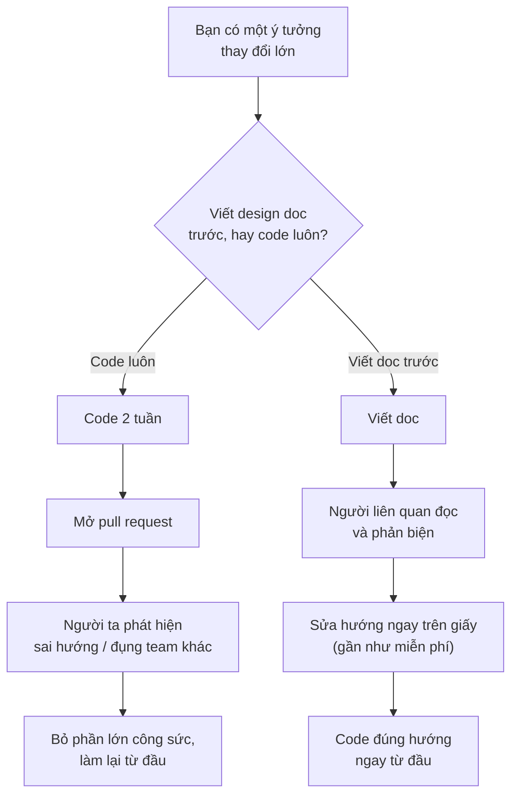
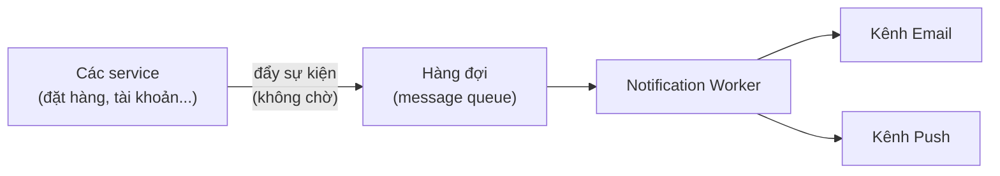
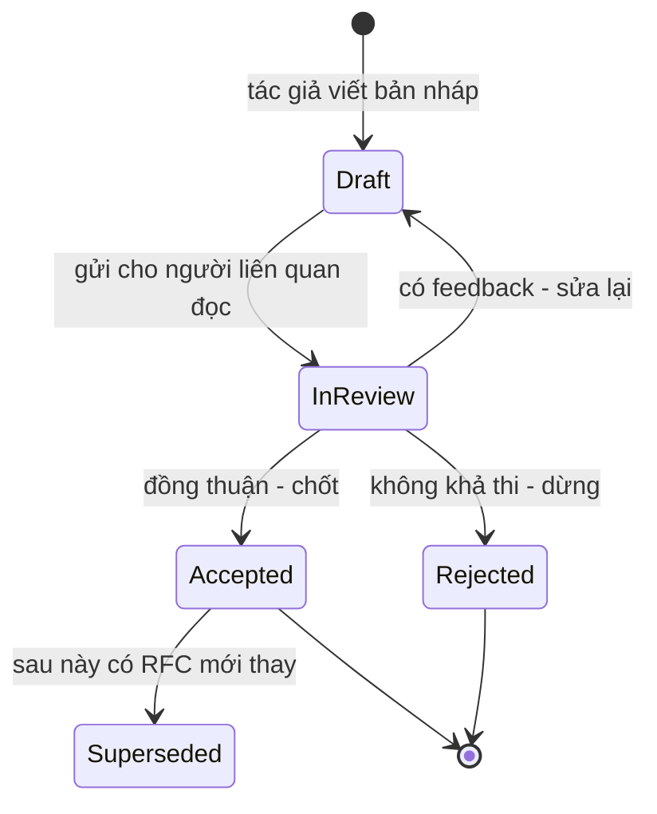

# Design Doc & RFC — Viết để quyết định kỹ thuật

> **Tác giả:** Mr.Rom\
> **Phiên bản:** v1.0.0\
> **Tạo lúc:** 13/06/2026\
> **Cập nhật:** 13/06/2026\
> **Level:** Basic\
> **Tags:** technical-writing, design-doc, rfc, adr, architecture-decision, soft-skills, documentation\
> **Yêu cầu trước:** [Viết README & tài liệu dự án](01_writing-readme-and-docs.md)

> 🎯 *Bài trước bạn đã học viết README và tài liệu mô tả thứ **đã có**. Bài này ngược lại: viết về thứ **sắp làm** — một thay đổi lớn, một kiến trúc mới, một quyết định kỹ thuật ảnh hưởng nhiều người. Đó là lúc cần một **design doc** hoặc **RFC**: tài liệu bạn viết TRƯỚC khi code để suy nghĩ cho rõ, lấy đồng thuận, và để lại vết tích cho người sau. Bài này cho bạn cấu trúc một design doc tử tế (context → goals/non-goals → đề xuất → alternatives → trade-off → rollout → open questions), cách viết một **ADR** ghi lại một quyết định trong vài dòng, quy trình review doc, và template copy ra dùng ngay. Kết bài bạn sẽ tự tin mở một tài liệu trắng và biết phải điền gì vào đâu.*

## 🎯 Sau bài này bạn sẽ

- [ ] Hiểu **design doc / RFC** là gì và biết **khi nào cần viết** (thay đổi lớn, nhiều người ảnh hưởng) — khi nào thì không
- [ ] Nắm **cấu trúc chuẩn** của một design doc: context → goals + non-goals → đề xuất → alternatives → trade-off/risk → rollout → open questions
- [ ] Giải thích được vì sao viết doc **TRƯỚC khi code** rẻ hơn rất nhiều so với viết sau
- [ ] Phân biệt **goals vs non-goals** và biết vì sao non-goals quan trọng không kém goals
- [ ] Viết một **ADR** (Architecture Decision Record) ghi lại một quyết định trong khung context → decision → consequences
- [ ] Chạy được một **vòng review doc** lành mạnh: xin feedback, nhận comment, chốt và để lại lịch sử
- [ ] Có sẵn **template RFC + ADR** để copy ra dùng cho thay đổi tiếp theo

---

## Tình huống — code xong rồi mới biết đi sai đường

Bạn được giao một việc nghe có vẻ rõ ràng: "thêm tính năng gửi thông báo cho người dùng". Bạn hào hứng, mở editor, code luôn. Hai tuần sau bạn có một hệ thống gửi email chạy ngon trên máy mình. Bạn mở pull request, tự tin tag cả team vào review.

Rồi gáo nước lạnh dội xuống trong phần comment:

- Một người: *"Sao lại gửi email? Yêu cầu là push notification trên mobile mà, email mình đã có hệ thống riêng rồi."*
- Người khác: *"Cái này gọi thẳng SMTP đồng bộ trong request à? Lúc nhà cung cấp email chậm là treo cả API đấy."*
- Sếp: *"Phần này đụng tới hệ thống billing, sao không ai bàn với team đó trước?"*

Hai tuần code coi như bỏ. Không phải vì bạn code dở — code rất ổn. Mà vì bạn **giải đúng một bài toán sai**, và **không ai có cơ hội nói điều đó với bạn trước khi bạn bỏ công ra làm**. Mọi vấn đề trên đây — gửi sai kênh, kiến trúc đồng bộ sai, đụng team khác — đều có thể phát hiện trong một buổi đọc tài liệu, **trước khi viết một dòng code nào**.

Đây chính là khoảng trống mà **design doc** lấp vào. Thay vì "code xong rồi mới biết", bạn viết ra ý định của mình thành một tài liệu ngắn, gửi cho những người liên quan đọc, và để họ vạch lỗi khi sửa lỗi còn **rẻ** — lúc nó mới là chữ trên màn hình, chưa phải code đã viết. Bài này dạy bạn viết tài liệu đó.

> [!NOTE]
> "Design doc" và "RFC" trong thực tế hay được dùng thay nhau. **RFC** (Request for Comments) là tên gọi nhấn vào *quá trình xin ý kiến*; **design doc** nhấn vào *nội dung thiết kế*. Nhiều công ty gọi tài liệu của họ là "RFC", nhiều nơi gọi là "design doc", một số gọi "tech spec" — cùng một thứ. Bài này dùng hai tên gần như đồng nghĩa, ưu tiên "design doc" cho nội dung và "RFC" cho vòng review.

---

## 1️⃣ Design doc / RFC là gì — và khi nào thật sự cần?

Hãy trả lời thẳng tình huống trên. Cái còn thiếu không phải kỹ năng code, mà là một bước **suy nghĩ ra giấy và lấy đồng thuận** trước khi bắt tay. Đó là design doc.

**Design doc** (tài liệu thiết kế) là một văn bản ngắn, viết **trước khi xây**, mô tả: ta đang giải vấn đề gì, đề xuất giải pháp nào, đã cân nhắc những cách nào khác, đánh đổi và rủi ro ra sao, và triển khai thế nào. Mục đích không phải để "có tài liệu cho đẹp" — mà để **người khác đọc, phản biện, và đồng thuận** trước khi công sức code bị đổ ra.

**RFC** (Request for Comments — "đề nghị cho ý kiến") là chính tài liệu đó khi được đưa ra cho một nhóm người đọc và bình luận có quy trình. Tên gọi này có gốc từ cách Internet được thiết kế: các chuẩn như HTTP, TCP/IP đều ra đời dưới dạng "RFC" — ai cũng được đọc và góp ý trước khi nó thành chuẩn.

🪞 **Ẩn dụ**: design doc giống **bản vẽ thiết kế nhà trước khi xây**. Không một nhà thầu tỉnh táo nào đổ móng, dựng tường rồi mới hỏi chủ nhà "à mà nhà mấy phòng ngủ nhỉ?". Người ta vẽ bản thiết kế trước, đưa chủ nhà duyệt, đưa kỹ sư kết cấu kiểm tra — vì **sửa một nét bút trên bản vẽ tốn vài giây, còn đập một bức tường đã xây tốn cả tháng và đống tiền**. Code cũng y hệt: sửa một câu trong design doc gần như miễn phí, sửa một kiến trúc đã code xong thì đắt khủng khiếp.

### Không phải việc gì cũng cần design doc

Đây là điểm người mới hay hiểu sai: viết doc cho **mọi** thay đổi sẽ làm chậm cả team và biến thành thủ tục giấy tờ vô nghĩa. Design doc chỉ đáng viết khi thay đổi **đủ lớn** hoặc **đủ rộng ảnh hưởng**. Bảng dưới giúp bạn quyết định nhanh:

| Tình huống | Cần design doc? | Vì sao |
|---|---|---|
| Sửa một bug, đổi text, thêm một field nhỏ | ❌ Không | Quá nhỏ, viết doc tốn hơn làm; cứ mở PR |
| Thêm một endpoint theo pattern đã có sẵn | ❌ Thường không | Đã có khuôn mẫu, không có quyết định mới |
| Chọn một thư viện/công nghệ mới cho dự án | ✅ Có | Quyết định khó đảo ngược, ảnh hưởng lâu dài |
| Thiết kế một service/tính năng mới đáng kể | ✅ Có | Nhiều cách làm, cần chốt hướng trước khi xây |
| Thay đổi đụng tới nhiều team / nhiều hệ thống | ✅ Có (bắt buộc) | Nhiều người ảnh hưởng, phải đồng thuận trước |
| Thay đổi khó đảo ngược (schema DB, format dữ liệu, API public) | ✅ Có | Sai là rất đắt để sửa, phải cân nhắc kỹ |

Hai câu hỏi vàng để tự kiểm: **(1) Quyết định này có khó/đắt để đảo ngược không?** và **(2) Có nhiều người sẽ bị ảnh hưởng hoặc cần đồng thuận không?** Nếu một trong hai là "có" — viết doc. Nếu cả hai là "không" — đừng phí công, cứ làm.

> 💡 Hiểu khi nào cần rồi, nhưng vẫn còn một câu hỏi lớn hơn: vì sao tốn công viết ra thay vì cứ code? Sơ đồ dưới đây trả lời câu đó — đây là khái niệm trừu tượng nhất của cả bài (chi phí của một quyết định sai theo thời gian), nên ta hình dung nó trước khi đi vào cấu trúc.



> 📖 *Điểm cốt lõi của sơ đồ: chi phí sửa một quyết định sai **tăng vọt theo thời gian** — rẻ nhất khi nó còn là chữ trong doc, đắt nhất khi nó đã thành code chạy production. Design doc kéo thời điểm "người ta vạch lỗi" về sớm nhất có thể. Giờ ta xem một doc tử tế gồm những phần gì.*

---

## 2️⃣ Cấu trúc một design doc — bộ khung điền vào là xong

Nỗi sợ lớn nhất khi viết design doc là nhìn vào trang trắng không biết bắt đầu từ đâu. Tin tốt: design doc có một **bộ khung khá chuẩn**, và phần lớn việc viết chỉ là điền vào từng mục theo thứ tự. Bạn không cần sáng tạo ra cấu trúc — chỉ cần điền cho thật.

🪞 **Ẩn dụ**: cấu trúc design doc giống một **tờ khai có sẵn các ô**. Bạn không phải nghĩ "khai cái gì trước cái gì sau" — tờ khai đã hỏi đúng thứ tự: tên trước, địa chỉ sau, lý do cuối. Bạn chỉ việc trả lời từng ô cho trung thực. Design doc cũng vậy: mỗi mục là một câu hỏi mà người đọc chắc chắn sẽ hỏi, bạn trả lời trước để họ khỏi phải hỏi.

Dưới đây là 7 mục xương sống, theo đúng thứ tự nên viết. Mỗi mục trả lời một câu hỏi cụ thể trong đầu người đọc:

| Mục | Trả lời câu hỏi | Vì sao không thể thiếu |
|---|---|---|
| **1. Context / Problem** | "Ta đang giải vấn đề gì, vì sao bây giờ?" | Không hiểu vấn đề thì mọi giải pháp đều vô nghĩa |
| **2. Goals + Non-goals** | "Cái gì tính là thành công? Cái gì cố tình KHÔNG làm?" | Khoanh vùng phạm vi, chống "ôm đồm" |
| **3. Đề xuất (Proposed solution)** | "Cụ thể ta định làm thế nào?" | Trái tim của doc — phương án bạn chọn |
| **4. Alternatives đã cân nhắc** | "Còn cách nào khác? Vì sao không chọn?" | Chứng minh bạn đã suy nghĩ, chống phản biện "sao không làm X?" |
| **5. Trade-off & Risk** | "Cái giá của phương án này là gì? Rủi ro nào?" | Không có giải pháp miễn phí; thành thật về cái giá |
| **6. Rollout plan** | "Triển khai ra production thế nào cho an toàn?" | Ý tưởng hay mà rollout ẩu vẫn gây sự cố |
| **7. Open questions** | "Còn điều gì chưa chốt, cần bàn thêm?" | Mời người đọc giúp gỡ đúng chỗ bạn còn vướng |

Giờ ta đi qua từng mục, vì mỗi mục có cách viết riêng và một cạm bẫy riêng.

### Mục 1 — Context / Problem: kể vấn đề trước khi kể giải pháp

Đây là mục **quan trọng nhất** và bị viết ẩu nhất. Người mới hay nhảy thẳng vào "tôi định làm X" mà quên rằng người đọc chưa có sẵn bối cảnh trong đầu như bạn. Phần context phải làm người đọc gật đầu "à, đúng là có vấn đề này" **trước khi** họ nghe giải pháp.

Một context tốt trả lời: hệ thống đang thế nào, vấn đề gì đang xảy ra (kèm con số/triệu chứng cụ thể nếu có), vì sao phải giải **bây giờ**. So sánh hai cách viết cùng một context:

❌ **Context mơ hồ** — không ai thấy được vấn đề thật:

```text
## Context
Hệ thống thông báo của chúng ta cần cải thiện. Tôi đề xuất xây
một service thông báo mới.
```

✅ **Context cụ thể** — người đọc thấy ngay nỗi đau:

```text
## Context / Problem

Hiện tại mỗi nơi cần gửi thông báo (đặt hàng, đổi mật khẩu, khuyến
mãi) tự gọi thẳng SMTP đồng bộ trong request xử lý. Việc này gây 2
vấn đề đang thấy rõ trên production:

1. Khi nhà cung cấp email chậm (>3s), request người dùng bị treo
   theo — tuần trước có 1 sự cố API đặt hàng timeout vì email chậm.
2. Logic gửi thông báo bị lặp ở 6 chỗ khác nhau, mỗi chỗ một kiểu,
   khó thêm kênh mới (đang cần thêm push notification cho mobile).

Cần một chỗ tập trung xử lý thông báo, gửi bất đồng bộ, và dễ thêm
kênh mới. Bây giờ là thời điểm vì team mobile đang chờ push noti
cho bản release tháng sau.
```

→ Phiên bản thứ hai làm người đọc *cảm nhận được* vấn đề: có triệu chứng cụ thể (request treo, sự cố tuần trước), có con số (6 chỗ lặp, timeout >3s), có lý do "tại sao bây giờ". Người đọc gật đầu trước khi nghe giải pháp — đó là nền móng cho mọi mục sau.

### Mục 2 — Goals + Non-goals: vẽ đường biên của bài toán

Sau khi rõ vấn đề, ta khoanh vùng: cái gì **tính là thành công** (goals), và cái gì **cố tình không làm trong lần này** (non-goals). Phần goals thì ai cũng viết. Phần **non-goals** thì hay bị bỏ — và đó là một sai lầm lớn.

Vì sao non-goals quan trọng ngang goals? Vì nó **chặn đứng việc ôm đồm** và **chống hiểu lầm**. Khi bạn ghi rõ "lần này KHÔNG làm X", bạn đạt hai thứ: (1) người đọc không tốn thời gian phản biện "sao không làm X" — bạn đã trả lời trước rằng X cố tình để sau, và (2) phạm vi công việc không phình ra vô tận giữa chừng.

🪞 **Ẩn dụ**: non-goals giống **hàng rào quanh một công trường**. Hàng rào không phải để "không làm gì bên ngoài mãi mãi" — mà để nói rõ "đợt này ta xây trong phạm vi này thôi". Không có hàng rào, ai đi qua cũng góp ý "sao không làm thêm cái sân, cái hồ bơi" và công trình không bao giờ xong.

Một ví dụ goals/non-goals cho service thông báo:

```text
## Goals
- Gửi thông báo BẤT ĐỒNG BỘ, không làm treo request gốc.
- Một interface chung để các service khác gửi thông báo (không lặp logic).
- Hỗ trợ 2 kênh ngay: email và push notification.

## Non-goals (cố tình KHÔNG làm lần này)
- KHÔNG làm SMS/Zalo trong đợt này — sẽ tính sau khi có nhu cầu rõ.
- KHÔNG xây giao diện quản lý template thông báo cho non-dev — đợt
  này template để trong code.
- KHÔNG xử lý cá nhân hoá nội dung theo hành vi người dùng — ngoài
  phạm vi, thuộc về team data.
```

→ Để ý mỗi non-goal đều có **lý do ngắn** đi kèm ("sẽ tính sau", "đợt này để trong code"). Đó là khác biệt giữa "lười không làm" và "có chủ đích để sau". Người đọc thấy bạn đã *cân nhắc và quyết định gạt ra*, không phải bỏ sót.

### Mục 3 — Đề xuất (Proposed solution): phương án bạn chọn

Đây là trái tim doc: cụ thể bạn định làm gì. Tuỳ độ phức tạp, mục này có thể gồm sơ đồ kiến trúc, mô tả luồng dữ liệu, thay đổi data model, hay phác API. Nguyên tắc: **đủ chi tiết để người đọc hình dung được cách nó hoạt động**, nhưng không phải viết sẵn toàn bộ code.

Một sơ đồ thường đáng giá hơn nhiều đoạn văn. Với service thông báo, đề xuất có thể kèm một sơ đồ luồng như sau (bạn sẽ học vẽ sơ đồ kỹ ở bài [Sơ đồ kỹ thuật](04_diagrams-and-visual-communication.md)):



→ Sơ đồ này nói ngay điều quan trọng nhất của đề xuất: các service **đẩy sự kiện vào hàng đợi rồi đi tiếp ngay** (không treo chờ gửi xong), một worker phía sau lấy ra và gửi qua từng kênh. Người đọc nhìn một cái là hiểu vì sao thiết kế này gỡ được vấn đề "request bị treo" ở phần context.

### Mục 4 — Alternatives đã cân nhắc: chứng minh bạn đã suy nghĩ

Đây là mục **tách người viết doc nghiêm túc khỏi người viết qua loa**. Với mỗi phương án thay thế, ghi rõ: nó là gì, và **vì sao bạn không chọn**. Mục này phục vụ hai mục đích cực lớn.

Thứ nhất, nó **chống lại phản biện "sao không làm X?"**. Khi người review đọc tới và thấy bạn đã liệt kê X kèm lý do loại, họ yên tâm bạn đã cân nhắc — thay vì nghi ngờ bạn bỏ sót. Thứ hai, nó **lưu lại vết tích cho người sau**: sáu tháng sau có người hỏi "sao hồi đó không dùng cron job cho đơn giản?", doc đã có câu trả lời.

```text
## Alternatives đã cân nhắc

### A. Gọi SMTP đồng bộ nhưng bọc trong try/timeout (giữ kiến trúc cũ)
- Ưu: ít thay đổi, làm nhanh.
- Vì sao loại: không giải quyết gốc — vẫn treo request khi email
  chậm, vẫn lặp logic ở nhiều nơi, vẫn khó thêm kênh mới.

### B. Dùng dịch vụ thông báo của bên thứ ba (SaaS)
- Ưu: không phải tự xây, có sẵn nhiều kênh.
- Vì sao loại: dữ liệu người dùng phải đẩy ra ngoài (lo ngại
  riêng tư + chi phí tăng theo lượng gửi), và khó tích hợp với
  hệ thống template nội bộ hiện có.

### C. Cron job quét DB định kỳ rồi gửi (thay vì hàng đợi)
- Ưu: đơn giản, không cần message queue.
- Vì sao loại: độ trễ cao (chờ tới lượt quét mới gửi), khó gửi
  thông báo cần tức thì như OTP đổi mật khẩu.
```

→ Để ý mỗi alternative có **cả ưu điểm**, không chỉ nhược điểm. Đây là dấu hiệu trung thực: nếu mọi phương án khác đều "toàn nhược điểm" thì người đọc sẽ nghi ngờ bạn dựng bù nhìn để hạ. Nêu ưu điểm thật rồi vẫn loại có lý do — đó mới thuyết phục.

### Mục 5 — Trade-off & Risk: thành thật về cái giá

Không có giải pháp nào miễn phí. Phương án bạn chọn cũng có cái giá của nó — và **nói thẳng cái giá đó làm doc của bạn đáng tin hơn**, không yếu đi. Người review dày dạn sẽ tự tìm ra điểm yếu; bạn nêu trước thì vừa tiết kiệm thời gian, vừa cho thấy bạn nhìn vấn đề toàn diện.

Phân biệt hai thứ: **trade-off** là cái giá bạn *chấp nhận đánh đổi* (chọn A nghĩa là mất đặc tính của B); **risk** là điều *có thể đi sai* và bạn cần phòng. Ví dụ:

```text
## Trade-off
- Thêm message queue làm hệ thống phức tạp hơn (thêm một thành
  phần phải vận hành, giám sát). Chấp nhận được vì lợi ích gỡ
  treo request + dễ mở rộng kênh lớn hơn chi phí này.
- Thông báo trở thành "eventual" (có độ trễ nhỏ), không còn tức
  thì 100%. Với phần lớn thông báo điều này ổn.

## Risk & cách giảm thiểu
- Nguy cơ: message queue chết → thông báo không gửi được.
  Giảm thiểu: hàng đợi có cơ chế retry + cảnh báo khi tồn đọng.
- Nguy cơ: worker xử lý lỗi làm mất sự kiện.
  Giảm thiểu: chỉ xoá sự kiện khỏi hàng đợi sau khi gửi thành công
  (at-least-once), chấp nhận khả năng gửi trùng và xử lý idempotent.
```

> [!TIP]
> Một mẹo để mục Risk không sáo rỗng: với mỗi rủi ro, luôn viết kèm **"giảm thiểu thế nào"**. Một rủi ro nêu ra mà không có cách phòng chỉ làm người đọc lo lắng; một rủi ro kèm phương án phòng cho thấy bạn đã nghĩ tới nước tiếp theo. Cặp "nguy cơ → giảm thiểu" luôn đi với nhau.

### Mục 6 — Rollout plan: đưa ra production sao cho an toàn

Một thiết kế hay vẫn có thể gây sự cố nếu bật lên cho 100% người dùng cùng lúc. Mục rollout mô tả **các bước triển khai an toàn**: thường là bật dần, có đường lùi, có cách theo dõi. Người mới hay quên mục này vì nghĩ "code xong là xong" — nhưng phần lớn sự cố production đến từ lúc *triển khai*, không phải lúc *viết code*.

Một rollout plan cơ bản:

```text
## Rollout plan
1. Deploy service mới nhưng tắt qua feature flag (chưa ai dùng).
2. Bật cho 1 luồng ít rủi ro trước (vd: thông báo nội bộ cho team),
   theo dõi log + tỷ lệ gửi thành công 1-2 ngày.
3. Chuyển dần từng nơi gọi thông báo sang service mới, mỗi lần một
   luồng, quan sát giữa các bước.
4. Khi ổn định, gỡ code gửi SMTP đồng bộ cũ.

## Đường lùi (rollback)
- Tắt feature flag là quay lại đường cũ ngay, không cần deploy lại.
```

> [!IMPORTANT]
> Phần **đường lùi (rollback)** là bắt buộc, không phải tuỳ chọn. Trước khi bật bất cứ thay đổi lớn nào ra production, bạn phải trả lời được câu *"nếu hỏng thì quay lại trạng thái an toàn bằng cách nào, nhanh tới mức nào?"*. Một thay đổi không có đường lùi rõ ràng là một quả bom hẹn giờ — review nên chặn lại cho tới khi có.

### Mục 7 — Open questions: mời người đọc giúp đúng chỗ

Doc không cần phải hoàn hảo mới đem đi review — ngược lại, để lại các **câu hỏi còn mở** giúp người đọc biết chính xác chỗ nào bạn cần ý kiến của họ. Đây là nơi bạn thành thật về những gì chưa chốt.

```text
## Open questions
- Nên dùng message queue có sẵn (Redis) hay dựng riêng (RabbitMQ)?
  Nghiêng về Redis vì đã có, nhưng muốn nghe ý team hạ tầng.
- Thông báo gửi trùng (do at-least-once) có chấp nhận được với
  team mobile không, hay cần khử trùng phía client?
```

→ Open questions biến doc từ "bài thuyết trình một chiều" thành "lời mời cùng giải quyết". Người đọc thấy được chỗ nào việc của họ — và việc review trở nên tập trung, hiệu quả hơn nhiều.

---

## 3️⃣ Vì sao viết doc TRƯỚC khi code — ba lợi ích lớn

Ta đã thấy cấu trúc. Giờ chốt lại lý do sâu xa: vì sao bỏ công viết ra thay vì cứ code? Có ba lợi ích, và chúng không thay thế được bằng việc viết tài liệu *sau khi* đã code xong.

🪞 **Ẩn dụ**: viết doc trước khi code giống **đo hai lần, cắt một lần** của thợ mộc. Đo (suy nghĩ ra giấy) mất vài phút; cắt sai một tấm gỗ đắt tiền (code sai cả tuần) thì không lấy lại được. Người thợ giỏi không phải người cắt nhanh nhất, mà là người đo kỹ để không phải cắt lại.

Ba lợi ích, theo thứ tự từ riêng tư tới tập thể:

- **Suy nghĩ cho rõ (cho chính bạn)** — hành động viết ra buộc bạn phải nghĩ tới những thứ mà khi code "ào ào" bạn bỏ qua: edge case, luồng lỗi, đụng độ với hệ thống khác. Rất nhiều lỗ hổng thiết kế lộ ra ngay lúc bạn cố viết nó thành câu mạch lạc. Viết là một dạng *suy nghĩ chậm lại*.
- **Lấy buy-in / đồng thuận (với người khác)** — doc cho những người liên quan cơ hội phản biện **khi sửa còn rẻ**. Một comment "cái này đụng billing đấy" trên doc cứu bạn hai tuần code; cùng comment đó trên pull request thì đã muộn. Đồng thuận trước cũng nghĩa là khi bạn code xong, review PR nhẹ nhàng hơn nhiều vì hướng đi đã được chốt.
- **Lưu vết cho người sau (cho tương lai)** — sáu tháng sau, người mới (hoặc chính bạn) sẽ hỏi "sao hồi đó làm thế này?". Nếu quyết định chỉ nằm trong đầu vài người hoặc trong một cuộc họp đã quên, câu trả lời mất luôn. Doc giữ lại *bối cảnh và lý do* — thứ mà code không bao giờ kể được (code chỉ cho biết *làm gì*, không cho biết *vì sao chọn vậy*).

> [!NOTE]
> Viết doc trước **không** có nghĩa là phải biết hết mọi thứ trước khi code. Doc là một bản nháp sống — bạn viết với hiểu biết hiện có, đem review, và cập nhật khi học thêm trong lúc làm. Mục tiêu không phải "doc hoàn hảo", mà là "đủ rõ để người ta phản biện được hướng đi". Một doc 80% đúng đem review sớm tốt hơn nhiều một doc 100% đúng viết sau khi đã code xong.

---

## 4️⃣ ADR — ghi lại một quyết định trong vài dòng

Design doc hợp với một **thiết kế lớn**. Nhưng nhiều khi bạn chỉ ra một **quyết định đơn lẻ** không cần cả một doc dài: "dùng PostgreSQL hay MongoDB?", "đặt tên branch theo quy ước nào?", "dùng REST hay gRPC cho service nội bộ?". Cho những thứ này, có một dạng tài liệu nhỏ gọn hơn nhiều: **ADR**.

**ADR** (Architecture Decision Record — "bản ghi quyết định kiến trúc") là một file ngắn ghi lại **một quyết định kỹ thuật quan trọng**: ta đã quyết gì, trong bối cảnh nào, và hệ quả ra sao. Mỗi ADR là một file, thường đánh số (`0001-...`, `0002-...`) và lưu ngay trong repo (vd thư mục `docs/adr/`). Theo thời gian, chúng tạo thành một **nhật ký các quyết định** của dự án.

🪞 **Ẩn dụ**: nếu design doc là **bản vẽ thiết kế cả căn nhà**, thì ADR là **một dòng trong nhật ký thi công**: "Ngày X, quyết dùng mái tôn thay vì mái ngói, vì khu này hay bão và ngân sách giới hạn; hệ quả: ồn hơn khi mưa, chấp nhận được." Ngắn, nhưng người sau đọc lại là hiểu *vì sao* hồi đó chọn vậy, khỏi đào lại từ đầu.

ADR có cấu trúc cực gọn, chỉ **ba phần cốt lõi**:

| Phần | Là gì | Ví dụ |
|---|---|---|
| **Context** (bối cảnh) | Tình huống dẫn tới phải quyết, các ràng buộc | "Cần lưu mapping key-value, scale ngang, không cần JOIN" |
| **Decision** (quyết định) | Chính xác đã quyết làm gì | "Dùng một cơ sở dữ liệu NoSQL key-value" |
| **Consequences** (hệ quả) | Cái được, cái mất, ảnh hưởng kéo theo | "Được scale ngang dễ; mất transaction mạnh và JOIN" |

Nhiều ADR thêm một phần **Status** (Trạng thái: `Proposed` / `Accepted` / `Deprecated` / `Superseded` — bị thay bởi quyết định sau) để biết quyết định còn hiệu lực hay đã bị thay. Một ADR đầy đủ trông như sau:

```text
# 0007. Dùng NoSQL key-value cho dữ liệu rút gọn URL

Status: Accepted (13/06/2026)

## Context
Hệ thống rút gọn URL chỉ cần lưu mapping short_code → long_url:
dữ liệu đơn giản, không quan hệ, không cần JOIN hay transaction
phức tạp, nhưng cần chứa hàng trăm tỷ bản ghi và scale ngang dễ.

## Decision
Dùng một cơ sở dữ liệu NoSQL key-value cho bảng mapping này, thay
vì cơ sở dữ liệu quan hệ (SQL) như phần còn lại của hệ thống.

## Consequences
- Được: scale ngang đơn giản, đọc/ghi key-value rất nhanh, hợp với
  tải đọc cao của hệ thống.
- Mất: không có transaction mạnh và JOIN — nhưng nghiệp vụ này không
  cần, nên chấp nhận được.
- Kéo theo: team phải vận hành thêm một loại DB bên cạnh SQL hiện có.
```

→ Để ý ADR này không dài, đọc trong chưa tới một phút, nhưng nó **trả lời trọn vẹn câu "sao hồi đó chọn NoSQL?"** cho bất cứ ai hỏi sau này. Đó là toàn bộ giá trị của ADR: chi phí viết cực thấp, giá trị lưu vết cực cao.

> [!TIP]
> Quy tắc thực dụng để biết "doc hay ADR": nếu bạn đang **thiết kế cách làm một thứ** (nhiều thành phần, nhiều bước) → design doc. Nếu bạn đang **chọn giữa vài phương án cho một điểm quyết định** → ADR. Một design doc lớn có thể *sinh ra* vài ADR (mỗi quyết định con một ADR). Và đừng sửa lại ADR cũ khi đổi ý — hãy viết một ADR **mới** đánh dấu cái cũ là `Superseded`, để lịch sử quyết định còn nguyên vẹn.

---

## 5️⃣ Quy trình review doc — biến tài liệu thành đồng thuận

Viết doc xong mới là một nửa. Nửa còn lại — và là lý do tồn tại của chữ "RFC" — là **đưa nó cho người ta đọc và bình luận**. Một doc viết hay nhưng không ai review thì không đạt được mục đích lớn nhất là *lấy đồng thuận*.

🪞 **Ẩn dụ**: vòng review một RFC giống **gửi bản thảo cho biên tập trước khi in sách**. Tác giả không tự xuất bản ngay — họ gửi bản thảo, biên tập viên ghi chú bên lề ("chỗ này chưa rõ", "đoạn này mâu thuẫn với chương 2"), tác giả sửa, rồi mới in. Comment bên lề lúc còn bản thảo sửa dễ; sửa sau khi in hàng nghìn cuốn thì không thể.

Một vòng review lành mạnh có vài bước, và doc đi qua một vài **trạng thái** rõ ràng. Sơ đồ dưới mô tả vòng đời một RFC từ lúc viết tới lúc được chấp nhận — đây là phần trừu tượng còn lại của bài, nên ta nhìn nó để thấy bức tranh tổng thể của quy trình:



→ Điểm cốt lõi của sơ đồ: một RFC **không đi thẳng** từ nháp tới chấp nhận. Nó có thể lặp qua lại giữa `Draft` và `InReview` nhiều vòng khi có feedback — và điều đó là *lành mạnh*, không phải thất bại. Một RFC bị `Rejected` cũng không phải công cốc: nó để lại vết tích "đã cân nhắc hướng này và quyết định không làm", giúp người sau khỏi đề xuất lại. Giờ ta xem cách hành xử trong từng bước.

### Phía người viết: mở doc đúng cách

- **Cho người đọc biết bạn cần gì** — đính kèm một câu khi gửi: *"Mình cần feedback về hướng tổng thể trước cuối tuần; đặc biệt hai open question ở cuối."* Đừng để người ta đoán mò nên đọc kỹ tới đâu.
- **Mời đúng người** — những người *bị ảnh hưởng* (team đụng tới) và những người *có chuyên môn* về phần đó. Mời cả làng vào review một doc nhỏ chỉ làm loãng; mời thiếu người liên quan thì như tình huống "đụng billing" đầu bài.
- **Đừng phòng thủ** — feedback là về *cái doc*, không phải về *bạn*. Một comment vạch lỗi thiết kế là một món quà cứu bạn khỏi code sai, không phải lời chê.

### Phía người review: comment cho hữu ích

- **Phân biệt "phải sửa" và "góp ý nhỏ"** — nói rõ comment nào là chặn (blocking — "không nên merge nếu chưa giải quyết") và comment nào chỉ là gợi ý (nit — "không bắt buộc"). Người viết cần biết cái gì sống còn, cái gì tuỳ.
- **Comment vào cái cụ thể, kèm lý do** — "phần này có vấn đề" thì khó sửa; "phần rollout chưa có đường lùi, nếu worker lỗi thì sao?" thì hành động được ngay.
- **Đề xuất, đừng chỉ phán** — thay vì "cách này sai", viết "cách này có rủi ro X, cân nhắc Y xem sao?". (Đây cũng là tinh thần của code review tử tế — xem thêm [Phản hồi & xử lý bất đồng](../../../communication/lessons/01_basic/03_feedback-and-conflict.md).)

### Chốt và để lại lịch sử

Khi đã đồng thuận, **cập nhật trạng thái doc thành `Accepted`** và ghi ngày. Đừng xoá các comment hay các phần đã tranh luận — chúng là một phần của lịch sử quyết định. Nếu sau này đổi hướng, viết một quyết định mới đánh dấu cái cũ là `Superseded`, đừng âm thầm sửa lại như chưa từng có gì xảy ra. **Lịch sử quyết định cũng đáng giá ngang quyết định cuối cùng** — vì nó cho người sau biết *những gì đã được cân nhắc và loại bỏ*.

---

## 6️⃣ Template copy ra dùng ngay — RFC + ADR

Lý thuyết đủ rồi. Đây là hai bộ khung bạn copy thẳng vào một file mới và điền. Bắt đầu một thay đổi lớn? Copy template RFC. Cần ghi một quyết định đơn lẻ? Copy template ADR.

### Template RFC / Design doc

Đây là khung đầy đủ 7 mục đã học, kèm phần header để theo dõi trạng thái và người liên quan:

```text
# RFC: <Tên ngắn gọn của thay đổi>

- Tác giả: <tên>
- Trạng thái: Draft | In Review | Accepted | Rejected | Superseded
- Ngày tạo: <DD/MM/YYYY>
- Người review: <liệt kê người/team được mời>

## 1. Context / Problem
<Hệ thống đang thế nào? Vấn đề gì, kèm triệu chứng/con số cụ thể?
Vì sao phải giải bây giờ?>

## 2. Goals
- <Cái gì tính là thành công — đo lường được nếu có thể>

## 2b. Non-goals (cố tình KHÔNG làm lần này)
- <Thứ gạt ra khỏi phạm vi + lý do ngắn vì sao để sau>

## 3. Đề xuất (Proposed solution)
<Cụ thể định làm gì. Kèm sơ đồ kiến trúc/luồng, thay đổi data
model, phác API nếu cần. Đủ để người đọc hình dung cách hoạt động.>

## 4. Alternatives đã cân nhắc
### A. <Phương án thay thế>
- Ưu: <điểm tốt thật>
- Vì sao loại: <lý do không chọn>

## 5. Trade-off & Risk
- Trade-off: <cái giá của phương án đã chọn>
- Nguy cơ → giảm thiểu: <rủi ro có thể xảy ra + cách phòng>

## 6. Rollout plan
1. <Các bước triển khai an toàn, bật dần>
- Đường lùi (rollback): <quay lại trạng thái an toàn thế nào>

## 7. Open questions
- <Điều chưa chốt, cần ý kiến — chỉ rõ cần ai trả lời>
```

→ Đừng cảm thấy phải điền dày đặc mọi mục cho mọi doc. Thay đổi nhỏ hơn thì mỗi mục một hai dòng là đủ; thay đổi lớn thì đào sâu các mục Đề xuất và Trade-off. Cái khung đảm bảo bạn *không bỏ sót câu hỏi nào người đọc sẽ hỏi*.

### Template ADR

Khung ADR cực gọn cho một quyết định đơn lẻ — đặt trong `docs/adr/NNNN-ten-quyet-dinh.md`:

```text
# NNNN. <Tên quyết định, dạng động từ: "Dùng X cho Y">

Status: Proposed | Accepted | Deprecated | Superseded
Ngày: <DD/MM/YYYY>

## Context
<Tình huống dẫn tới phải quyết. Các ràng buộc, yêu cầu liên quan.>

## Decision
<Chính xác đã quyết làm gì. Một-hai câu, rõ ràng.>

## Consequences
- Được: <cái lợi của quyết định này>
- Mất: <cái giá phải trả / đánh đổi>
- Kéo theo: <ảnh hưởng tới phần khác, việc phải làm thêm>
```

→ Quy ước đặt tên file đánh số tăng dần (`0001-`, `0002-`, ...) cho bạn một dòng thời gian các quyết định: đọc lướt tên file trong thư mục `adr/` là thấy lịch sử kiến trúc dự án tiến hoá ra sao. Cách lưu tài liệu trong repo này (docs-as-code) bạn đã làm quen ở bài [Viết README & tài liệu dự án](01_writing-readme-and-docs.md).

---

## 💡 Cạm bẫy thường gặp & Best practice

### ❌ Cạm bẫy: code xong rồi mới viết doc (hoặc không viết)

- **Triệu chứng**: lao vào code ngay khi nhận việc lớn; doc (nếu có) chỉ viết sau khi đã xong để "hợp thức hoá"; review PR mới phát hiện sai hướng / đụng team khác.
- **Nguyên nhân**: nghĩ "viết doc tốn thời gian, code mới là việc thật"; sợ doc làm chậm tiến độ.
- **Cách tránh**: với thay đổi lớn hoặc ảnh hưởng nhiều người, viết doc TRƯỚC và đem review sớm — khi sửa hướng còn rẻ. Doc 80% đem review sớm tốt hơn doc 100% viết sau khi code xong. Doc viết sau mất hết tác dụng "phát hiện sớm".

### ❌ Cạm bẫy: bỏ qua non-goals và alternatives

- **Triệu chứng**: doc chỉ có "tôi định làm X" mà không nói cái gì cố tình không làm, cũng không nói đã cân nhắc cách nào khác; phần review ngập trong câu hỏi "sao không làm Y?", "phạm vi tới đâu?".
- **Nguyên nhân**: tưởng chỉ cần trình bày phương án đã chọn là đủ; thấy non-goals/alternatives "thừa".
- **Cách tránh**: luôn viết non-goals (kèm lý do để sau) để khoanh phạm vi, và liệt kê alternatives kèm cả ưu điểm thật + lý do loại. Hai mục này chặn trước phần lớn phản biện và chứng minh bạn đã suy nghĩ.

### ❌ Cạm bẫy: rollout không có đường lùi

- **Triệu chứng**: thiết kế hay nhưng phần triển khai là "deploy rồi bật cho tất cả"; khi hỏng không có cách quay lại nhanh, phải vá nóng trong hoảng loạn.
- **Nguyên nhân**: nghĩ "code xong là xong", quên rằng phần lớn sự cố đến từ lúc triển khai.
- **Cách tránh**: luôn có rollout bật dần (feature flag, một luồng nhỏ trước) và một đường lùi rõ ràng trả lời được "hỏng thì quay lại an toàn bằng cách nào, nhanh tới đâu". Review nên chặn doc thiếu rollback.

### ✅ Best practice: viết để người đọc phản biện, không để khoe

- **Vì sao**: mục đích lớn nhất của doc là lấy được feedback đúng chỗ khi sửa còn rẻ; một doc viết để "trông cho ngầu" mà giấu điểm yếu sẽ không nhận được phản biện hữu ích.
- **Cách áp dụng**: nêu thẳng trade-off và risk của chính phương án mình chọn; để lại open questions chỉ rõ chỗ cần ý kiến; khi gửi review nói rõ "cần feedback gì, từ ai, trước khi nào". Coi mỗi comment vạch lỗi là món quà cứu mình khỏi code sai.

### ✅ Best practice: ghi ADR cho mọi quyết định khó đảo ngược

- **Vì sao**: code chỉ cho biết *làm gì*, không kể *vì sao chọn vậy*; sáu tháng sau, lý do của một quyết định khó đảo ngược (chọn DB, format dữ liệu, API public) sẽ biến mất nếu không ghi lại.
- **Cách áp dụng**: với mỗi quyết định kiến trúc đáng kể, viết một ADR ngắn (context → decision → consequences) lưu trong repo, đánh số tăng dần. Đổi ý thì viết ADR mới đánh dấu cái cũ là `Superseded`, đừng sửa lén — giữ nguyên lịch sử quyết định.

---

## 🧠 Tự kiểm tra (Self-check)

**Q1.** Hai câu hỏi vàng nào giúp bạn quyết định một thay đổi có cần design doc hay không? Cho một ví dụ cần và một ví dụ không cần.

<details>
<summary>💡 Xem giải thích</summary>

Hai câu hỏi: **(1) Quyết định này có khó/đắt để đảo ngược không?** và **(2) Có nhiều người sẽ bị ảnh hưởng hoặc cần đồng thuận không?** Nếu một trong hai là "có" → viết doc; nếu cả hai "không" → đừng phí công.

- **Cần doc**: thiết kế một service mới đụng tới nhiều team, hoặc đổi schema DB (khó đảo ngược, ảnh hưởng rộng).
- **Không cần**: sửa một bug nhỏ, đổi text, thêm một endpoint theo pattern đã có sẵn (nhỏ, không quyết định mới, dễ đảo ngược) — cứ mở PR.

</details>

**Q2.** Vì sao **non-goals** quan trọng không kém goals trong một design doc?

<details>
<summary>💡 Xem giải thích</summary>

Non-goals làm hai việc quan trọng: **(1) chống ôm đồm** — ghi rõ phạm vi để công việc không phình ra vô tận giữa chừng; và **(2) chống hiểu lầm khi review** — khi bạn ghi rõ "lần này cố tình KHÔNG làm X", người đọc không tốn thời gian phản biện "sao không làm X", vì bạn đã trả lời trước rằng X được cân nhắc và quyết định để sau. Mỗi non-goal nên kèm lý do ngắn để phân biệt "có chủ đích gạt ra" với "lười/bỏ sót".

</details>

**Q3.** Liệt kê 7 mục xương sống của một design doc theo đúng thứ tự.

<details>
<summary>💡 Xem giải thích</summary>

1. **Context / Problem** — đang giải vấn đề gì, vì sao bây giờ.
2. **Goals + Non-goals** — cái gì tính là thành công, cái gì cố tình không làm.
3. **Đề xuất (Proposed solution)** — cụ thể định làm thế nào.
4. **Alternatives đã cân nhắc** — còn cách nào khác, vì sao không chọn.
5. **Trade-off & Risk** — cái giá và rủi ro của phương án đã chọn.
6. **Rollout plan** — triển khai ra production sao cho an toàn (kèm đường lùi).
7. **Open questions** — điều chưa chốt, cần bàn thêm.

</details>

**Q4.** Ba lợi ích của việc viết doc TRƯỚC khi code là gì? Vì sao viết tài liệu *sau khi* code xong không thay thế được?

<details>
<summary>💡 Xem giải thích</summary>

Ba lợi ích: **(1) suy nghĩ cho rõ** — hành động viết buộc bạn nghĩ tới edge case, luồng lỗi, đụng độ mà code "ào ào" bỏ qua; **(2) lấy buy-in/đồng thuận** — người liên quan phản biện khi sửa còn rẻ (chữ trên màn hình), không phải khi đã code xong; **(3) lưu vết cho người sau** — giữ lại *bối cảnh và lý do*, thứ code không kể được.

Viết sau khi code xong mất hai lợi ích đầu hoàn toàn: không còn "suy nghĩ trước để tránh code sai", và phản biện đến quá muộn (đã code rồi, sửa đắt). Chỉ còn lại lợi ích lưu vết — và đó là lý do doc viết sau thường được coi là "hợp thức hoá" hơn là thiết kế thật.

</details>

**Q5.** ADR là gì, gồm ba phần cốt lõi nào, và khác design doc ở chỗ nào?

<details>
<summary>💡 Xem giải thích</summary>

**ADR** (Architecture Decision Record) là một file ngắn ghi lại **một quyết định kỹ thuật**, gồm ba phần: **Context** (bối cảnh dẫn tới phải quyết), **Decision** (chính xác đã quyết gì), **Consequences** (cái được, cái mất, ảnh hưởng kéo theo). Nhiều ADR thêm **Status** để biết quyết định còn hiệu lực hay đã bị thay.

Khác design doc: design doc *thiết kế cách làm một thứ* (nhiều thành phần, dài); ADR *ghi lại một điểm quyết định đơn lẻ* (rất ngắn). Một design doc lớn có thể sinh ra vài ADR. ADR thường đánh số, lưu trong repo, tạo thành nhật ký các quyết định kiến trúc.

</details>

**Q6.** Trong vòng review một RFC, vì sao một RFC bị `Rejected` vẫn không phải là "công cốc", và vì sao không nên xoá lịch sử tranh luận?

<details>
<summary>💡 Xem giải thích</summary>

Một RFC `Rejected` vẫn để lại vết tích "**đã cân nhắc hướng này và quyết định không làm**" — điều này giúp người sau khỏi đề xuất lại cùng một ý đã bị loại, và hiểu được vì sao. Không nên xoá lịch sử tranh luận/comment vì **lịch sử quyết định đáng giá ngang quyết định cuối cùng**: nó cho người sau biết những gì đã được cân nhắc và loại bỏ. Khi đổi hướng, viết quyết định mới đánh dấu cái cũ là `Superseded` thay vì sửa lén như chưa từng có gì xảy ra.

</details>

---

## ⚡ Tra cứu nhanh (Cheatsheet)

### Khi nào viết design doc? (hai câu hỏi vàng)

| Câu hỏi | Nếu "có" |
|---|---|
| Khó/đắt để đảo ngược? (schema, API public, format dữ liệu) | → Viết doc |
| Nhiều người ảnh hưởng / cần đồng thuận? | → Viết doc |
| Cả hai đều "không"? (bug nhỏ, đổi text, pattern có sẵn) | → Đừng phí công, mở PR |

### Cấu trúc design doc (7 mục)

| # | Mục | Trả lời |
|---|---|---|
| 1 | Context / Problem | Vấn đề gì, vì sao bây giờ (kèm con số) |
| 2 | Goals + Non-goals | Thành công là gì / cố tình không làm gì |
| 3 | Đề xuất | Cụ thể làm thế nào (kèm sơ đồ) |
| 4 | Alternatives | Cách khác + vì sao loại (kèm ưu điểm thật) |
| 5 | Trade-off & Risk | Cái giá + nguy cơ → giảm thiểu |
| 6 | Rollout plan | Bật dần + đường lùi (rollback) |
| 7 | Open questions | Chưa chốt, cần ai trả lời |

### Cấu trúc ADR (3 phần)

| Phần | Nội dung |
|---|---|
| Context | Bối cảnh + ràng buộc dẫn tới phải quyết |
| Decision | Chính xác đã quyết gì |
| Consequences | Được / mất / kéo theo |

→ Thêm `Status`: Proposed → Accepted → (Deprecated / Superseded).

### Doc hay ADR?

- **Thiết kế cách làm một thứ** (nhiều phần, nhiều bước) → design doc.
- **Chọn giữa vài phương án cho một điểm** → ADR.

### Vòng đời RFC

`Draft → In Review ⇄ (sửa) → Accepted / Rejected → (sau này) Superseded`

### Review doc

- Người viết: nói rõ cần feedback gì + từ ai + trước khi nào; mời đúng người; đừng phòng thủ.
- Người review: phân biệt "phải sửa" (blocking) vs "góp ý nhỏ" (nit); comment cụ thể kèm lý do; đề xuất chứ đừng chỉ phán.

---

## 📚 Từ Điển Thuật Ngữ (Glossary)

| EN | VN | Giải thích |
|---|---|---|
| Design doc | Tài liệu thiết kế | Văn bản mô tả một thay đổi/thiết kế viết TRƯỚC khi code, để review và đồng thuận |
| RFC | (giữ EN) | Request for Comments — design doc khi đưa ra cho nhóm đọc và bình luận có quy trình |
| Tech spec | Đặc tả kỹ thuật | Tên gọi khác của design doc ở một số nơi |
| Context | Bối cảnh | Tình hình hệ thống + vấn đề dẫn tới cần thay đổi |
| Goals | Mục tiêu | Cái gì tính là thành công của thay đổi |
| Non-goals | Phi mục tiêu | Cái cố tình KHÔNG làm trong lần này, để khoanh phạm vi |
| Proposed solution | Giải pháp đề xuất | Phương án cụ thể bạn chọn để giải vấn đề |
| Alternatives | Các phương án thay thế | Những cách làm khác đã cân nhắc và lý do không chọn |
| Trade-off | Đánh đổi | Cái giá phải trả khi chọn một phương án |
| Risk | Rủi ro | Điều có thể đi sai, cần phòng (kèm cách giảm thiểu) |
| Rollout plan | Kế hoạch triển khai | Các bước đưa thay đổi ra production một cách an toàn |
| Rollback | Đường lùi | Cách quay lại trạng thái an toàn nhanh chóng khi hỏng |
| Feature flag | Cờ tính năng | Công tắc bật/tắt một tính năng mà không cần deploy lại |
| Open questions | Câu hỏi còn mở | Điều chưa chốt, cần ý kiến người đọc |
| Buy-in | Sự đồng thuận | Việc người liên quan đồng ý với hướng đi trước khi làm |
| ADR | (giữ EN) | Architecture Decision Record — file ngắn ghi lại một quyết định kiến trúc |
| Decision | Quyết định | Lựa chọn cụ thể đã chốt trong một ADR |
| Consequences | Hệ quả | Cái được, cái mất, ảnh hưởng kéo theo của một quyết định |
| Status | Trạng thái | Tình trạng của doc/quyết định (Draft, Accepted, Superseded...) |
| Superseded | Bị thay thế | Quyết định cũ đã bị một quyết định mới hơn thay thế |
| Blocking comment | Góp ý chặn | Comment review cho rằng không nên merge nếu chưa giải quyết |
| Nit | Góp ý nhỏ | Comment review không bắt buộc, chỉ là gợi ý nhỏ |
| Idempotent | Tính bất biến lặp | Thực hiện nhiều lần cho cùng kết quả như một lần (an toàn khi gửi trùng) |
| At-least-once | Ít nhất một lần | Đảm bảo gửi tối thiểu một lần, chấp nhận khả năng gửi trùng |

---

## 🔗 Liên kết & Tài nguyên

⬅️ **Bài trước:** [Viết README & tài liệu dự án — Docs-as-code](01_writing-readme-and-docs.md)\
➡️ **Bài tiếp theo:** [Tài liệu API & code — Docstring, comment, changelog](03_api-and-code-documentation.md)\
↑ **Về cụm:** [technical-writing — README](../../README.md)

### 🧭 Định hướng lộ trình học

- [Vì sao dev cần viết tài liệu kỹ thuật tốt](00_why-technical-writing.md) — nền tảng vì sao kỹ năng viết quyết định ảnh hưởng của một dev
- [Viết README & tài liệu dự án — Docs-as-code](01_writing-readme-and-docs.md) — viết tài liệu cho thứ đã có, nền cho bài này (viết cho thứ sắp làm)
- [Tài liệu API & code — Docstring, comment, changelog](03_api-and-code-documentation.md) — sau khi chốt thiết kế, tài liệu hoá API và code thực tế

### 🧩 Các chủ đề có thể bạn quan tâm

- [Sơ đồ kỹ thuật — Truyền đạt bằng hình ảnh](04_diagrams-and-visual-communication.md) — vẽ sơ đồ kiến trúc/luồng cho mục Đề xuất trong design doc
- [Giao tiếp async & viết — Slack, email, ticket, tài liệu](../../../communication/lessons/01_basic/01_async-and-written-communication.md) — design doc là một dạng giao tiếp async; cùng tinh thần "viết để người sau đỡ hỏi lại"
- [Phản hồi & xử lý bất đồng — Code review không làm tổn thương](../../../communication/lessons/01_basic/03_feedback-and-conflict.md) — review doc cùng tinh thần với review code: comment cụ thể, đề xuất chứ đừng phán
- [System Design Interview — Framework trả lời câu hỏi mở](../../../interview-prep/lessons/01_basic/02_system-design-interview.md) — tư duy trade-off và building block dùng được cả trong design doc thật

### 🌐 Tài nguyên tham khảo khác

- [Design Docs at Google (industrial empathy)](https://www.industrialempathy.com/posts/design-docs-at-google/) — bài viết kinh điển của một kỹ sư Google về cách họ dùng design doc trong thực tế
- [Architecture Decision Records (adr.github.io)](https://adr.github.io/) — trang tập hợp công cụ, mẫu và bài viết về ADR
- [Michael Nygard — "Documenting Architecture Decisions"](https://cognitect.com/blog/2011/11/15/documenting-architecture-decisions) — bài gốc giới thiệu khái niệm ADR, ngắn và rõ
- [The RFC process (oxide.computer)](https://rfd.shared.oxide.computer/rfd/0001) — một công ty mô tả công khai quy trình RFC của họ, tham khảo thực tế

---

## 📌 Nhật ký thay đổi (Changelog)

- **v1.0.0 (13/06/2026)** — Bản đầu tiên. Tình huống mở bài "code xong rồi mới biết đi sai đường" + 6 section: design doc/RFC là gì và khi nào cần (hai câu hỏi vàng + bảng quyết định) với sơ đồ chi phí quyết định sai theo thời gian (mermaid flowchart) + cấu trúc 7 mục (context → goals/non-goals → đề xuất → alternatives → trade-off/risk → rollout → open questions) với ví dụ before/after và sơ đồ luồng service thông báo + vì sao viết trước khi code (3 lợi ích: suy nghĩ rõ / buy-in / lưu vết) với ẩn dụ đo hai lần cắt một lần + ADR (context/decision/consequences) với ví dụ đầy đủ + quy trình review doc với sơ đồ vòng đời RFC (mermaid stateDiagram draft→review→accepted) + template RFC và ADR copy-paste. Kèm 3 cạm bẫy + 2 best practice + 6 self-check + cheatsheet + glossary 24 thuật ngữ + cross-link sang communication, interview-prep, và các bài trong cụm.
