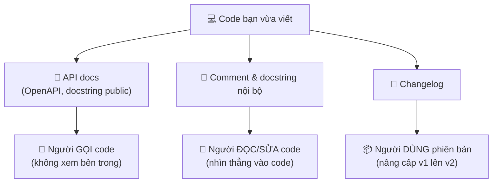

# Tài liệu API & code — Docstring, comment, changelog

> **Tác giả:** Mr.Rom\
> **Phiên bản:** v1.0.0\
> **Tạo lúc:** 13/06/2026\
> **Cập nhật:** 13/06/2026\
> **Level:** Basic\
> **Tags:** technical-writing, documentation, api, openapi, swagger, docstring, comment, changelog, semver, soft-skills\
> **Yêu cầu trước:** [Design Doc & RFC](02_design-docs-and-rfc.md)

> 🎯 *Bài trước bạn đã viết tài liệu để **quyết định** trước khi code (Design Doc, RFC). Bài này lo phần tài liệu **đi kèm code đã viết ra**: mô tả API để người khác gọi đúng, viết comment/docstring giải thích chỗ code không tự nói được, và ghi changelog để người dùng biết phiên bản nào đổi gì. Kết bài bạn phân biệt được comment tốt với comment thừa, viết được docstring chuẩn cho Python/JS, mô tả một REST API bằng OpenAPI, và lập một changelog theo chuẩn Keep a Changelog + SemVer.*

## 🎯 Sau bài này bạn sẽ

- [ ] Hiểu ba lớp tài liệu kỹ thuật đi cùng code — API docs, comment/docstring, changelog — phục vụ ai và khác nhau ra sao
- [ ] Mô tả một REST API bằng **OpenAPI/Swagger**, hiểu vì sao nó sinh được docs + client tự động, và cách versioning tài liệu API
- [ ] Viết comment giải thích **WHY** (vì sao) chứ không lặp lại **WHAT** (cái code đã nói), và nhận diện comment thừa cần xoá
- [ ] Đặt tên rõ để code **tự diễn giải** (self-documenting), giảm nhu cầu comment
- [ ] Viết **docstring** chuẩn cho hàm Python và JavaScript (JSDoc)
- [ ] Lập một **changelog** theo chuẩn **Keep a Changelog** + **SemVer**, phân biệt khi nào tài liệu nên inline và khi nào nên external

---

## Tình huống — cùng một hàm, hai lập trình viên, hai số phận

Bạn nhận maintain một codebase cũ. Mở ra, gặp một hàm như thế này:

```python
def calc(p, d, t):
    # multiply price by discount
    x = p * d
    if t:
        x = x * 1.1
    return x
```

Bạn ngồi đoán suốt mười phút: `p` là price, nhưng `d` là discount *rate* hay *amount*? `t` là gì — `tax`? Mà `1.1` từ đâu ra? Thuế 10%? Của nước nào? Comment `# multiply price by discount` thì... đọc code cũng thấy, chẳng giúp gì. Cuối cùng bạn phải đi `git blame`, tìm người viết, mà người đó đã nghỉ. Bạn sửa bừa, rồi cầu trời không vỡ gì.

Bây giờ tua lại. Cùng logic đó, nhưng người viết để lại thế này:

```python
def tinh_gia_sau_giam(gia_goc: float, ty_le_giam: float, chiu_thue_vat: bool) -> float:
    gia_sau_giam = gia_goc * (1 - ty_le_giam)
    if chiu_thue_vat:
        # VAT 10% theo Luật thuế GTGT VN — chỉ áp với mặt hàng chịu thuế
        gia_sau_giam = gia_sau_giam * 1.1
    return gia_sau_giam
```

Lần này bạn đọc một lượt là hiểu hết: tên hàm nói rõ nó làm gì, tham số có tên + kiểu, và comment duy nhất giải thích đúng cái code **không tự nói được** — vì sao lại `× 1.1` (luật thuế VN, 10%) và khi nào áp. Bạn sửa trong vài phút, tự tin.

Cùng một logic, nhưng **tài liệu đi kèm code** quyết định người sau (kể cả chính bạn sáu tháng nữa) mất mười phút đoán mò hay vài phút hiểu ngay. Đây không phải chuyện "viết cho đẹp" — nó là khoản đầu tư trả lãi mỗi lần ai đó (gồm cả bạn) đọc lại code. Bài này dạy ba lớp tài liệu đi cùng code: mô tả API cho người *gọi* code, comment/docstring cho người *đọc* code, và changelog cho người *dùng* phiên bản.

---

## 1️⃣ Ba lớp tài liệu đi cùng code — ai đọc cái gì

Tài liệu kỹ thuật không phải một khối đồng nhất. Khi bạn vừa viết xong một module, có **ba nhóm người** sẽ cần thông tin khác nhau, và mỗi nhóm cần một lớp tài liệu riêng. Lẫn lộn ba lớp này là nguồn gốc của phần lớn tài liệu vừa thừa vừa thiếu.

- **Người *gọi* code của bạn** (frontend gọi API backend, team khác dùng thư viện của bạn) — họ không quan tâm code bên trong, chỉ cần biết: gọi endpoint nào, truyền gì, nhận lại gì. Đây là việc của **API docs**.
- **Người *đọc/sửa* code của bạn** (đồng nghiệp maintain, chính bạn về sau) — họ nhìn thẳng vào code, cần hiểu *vì sao* code làm vậy ở những chỗ không hiển nhiên. Đây là việc của **comment & docstring**.
- **Người *dùng* phiên bản của bạn** (dev nâng cấp thư viện từ v1 lên v2, người dùng cuối) — họ cần biết giữa hai phiên bản đã đổi gì, có gì hỏng (breaking), có gì mới. Đây là việc của **changelog**.

🪞 **Ẩn dụ**: hãy hình dung code của bạn là một **chiếc máy giặt** bạn bán ra. API docs là **bảng nút bấm + sách hướng dẫn sử dụng** dán bên ngoài — người dùng chỉ cần biết bấm nút nào ra chế độ nào, không cần mở máy ra xem. Comment/docstring là **ghi chú của thợ dán bên trong vỏ máy** — chỉ thợ sửa mở ra mới thấy, giải thích "dây này nối vậy vì model 2023 đổi mạch". Còn changelog là **tờ "có gì mới ở đời máy này"** — người đang dùng máy đời cũ đọc để biết nên lên đời không, đời mới bỏ mất nút nào. Ba thứ phục vụ ba người khác nhau; đừng nhét hướng dẫn sử dụng vào trong vỏ máy, cũng đừng bắt người dùng đọc ghi chú của thợ.

Để thấy rõ ba lớp này không thay thế nhau mà bổ sung nhau, hãy đặt chúng cạnh nhau. Đây là khái niệm nền của cả bài — phân biệt được ba lớp thì các phần sau chỉ là đi sâu từng lớp.



→ Điểm cốt lõi của sơ đồ: ba lớp tài liệu cùng sinh ra từ một codebase nhưng **toả về ba loại độc giả khác nhau**. Khi viết bất kỳ dòng tài liệu nào, câu hỏi đầu tiên luôn là "*ai* sẽ đọc cái này, và họ có nhìn thấy code không?". Trả lời được câu đó, bạn biết nên viết lớp nào và viết tới đâu là đủ. Ta đi từng lớp, bắt đầu từ lớp người ngoài nhìn vào nhiều nhất: API docs.

---

## 2️⃣ Tài liệu API với OpenAPI/Swagger

Giả sử bạn viết một REST API cho team frontend dùng. Bạn nhắn Slack: *"endpoint là `/users/{id}`, GET nhé"*. Hôm sau frontend hỏi: trả về field gì? `id` là số hay chuỗi? lỗi thì status code mấy? cần header auth không? Bạn lại trả lời từng câu. Tuần sau có người mới vào team, hỏi lại y hệt. API mà mô tả bằng miệng/Slack thì **không bao giờ đầy đủ và luôn lỗi thời**.

Cách giải quyết của ngành: mô tả API bằng một **file đặc tả chuẩn máy đọc được**, để từ đó sinh ra tài liệu và công cụ tự động. Chuẩn phổ biến nhất cho REST API là **OpenAPI** (tên cũ là *Swagger* — giờ Swagger là tên bộ công cụ, còn đặc tả gọi là OpenAPI).

🪞 **Ẩn dụ**: OpenAPI giống **bản vẽ kỹ thuật của một ổ cắm điện theo tiêu chuẩn**. Khi ổ cắm tuân chuẩn, nhà sản xuất phích cắm khắp nơi cứ theo bản vẽ mà làm, cắm vào là khớp — không ai phải gọi điện hỏi "lỗ cắm rộng mấy mm". OpenAPI cũng vậy: một khi API được mô tả theo chuẩn, mọi công cụ hiểu chuẩn đó đều dùng được — sinh trang tài liệu đẹp, sinh code client cho frontend, kiểm thử tự động — mà không cần bạn giải thích bằng miệng lần nào nữa.

### OpenAPI là gì và nó cho bạn cái gì

**OpenAPI** là một đặc tả (specification) viết bằng YAML hoặc JSON, mô tả đầy đủ một REST API: có những endpoint nào, mỗi endpoint nhận method gì (GET/POST/...), tham số ra sao, request body và response trông thế nào, mã lỗi gì. File này máy đọc được, nên từ một file duy nhất bạn nhận về ba thứ:

| Từ một file OpenAPI, sinh ra | Lợi ích |
|---|---|
| **Trang tài liệu tương tác** (Swagger UI, Redoc) | Frontend tự đọc, thậm chí bấm "Try it out" gọi thử ngay trên trình duyệt |
| **Code client** nhiều ngôn ngữ | Frontend không cần gõ tay code gọi API — sinh tự động từ spec |
| **Kiểm thử & validate** | Công cụ kiểm tra request/response có đúng spec không, bắt lỗi sớm |

> [!NOTE]
> Nhiều framework hiện đại **tự sinh** file OpenAPI từ code, bạn gần như không phải viết tay. Ví dụ FastAPI (Python) đọc type hint + Pydantic model rồi tự dựng Swagger UI ở đường dẫn `/docs`. Nhưng hiểu cấu trúc file OpenAPI thủ công vẫn quan trọng: để đọc được spec người khác viết, và để bổ sung mô tả mà code không tự suy ra được.

### Một file OpenAPI tối thiểu

Để thấy nó trông thế nào, đây là một spec OpenAPI mô tả đúng một endpoint: `GET /users/{id}` trả về thông tin một user. File này hợp lệ và đủ nhỏ để đọc hết. Phần dưới ta sẽ mổ từng khối.

```yaml
openapi: 3.0.3
info:
  title: User API
  description: API quản lý người dùng cho ứng dụng demo
  version: 1.0.0
servers:
  - url: https://api.example.com/v1
paths:
  /users/{id}:
    get:
      summary: Lấy thông tin một user theo id
      parameters:
        - name: id
          in: path
          required: true
          description: Định danh duy nhất của user
          schema:
            type: integer
      responses:
        "200":
          description: Tìm thấy user
          content:
            application/json:
              schema:
                $ref: "#/components/schemas/User"
        "404":
          description: Không tìm thấy user với id đã cho
components:
  schemas:
    User:
      type: object
      properties:
        id:
          type: integer
          example: 1
        name:
          type: string
          example: Nguyen Van A
        email:
          type: string
          format: email
          example: nguyenvana@example.com
      required:
        - id
        - name
        - email
```

→ Đọc file trên từ trên xuống: khối `info` khai báo tên + phiên bản API; `servers` cho biết gọi vào host nào; `paths` liệt kê endpoint — ở đây `GET /users/{id}` có một `parameter` là `id` nằm trong path, bắt buộc, kiểu số; phần `responses` mô tả hai khả năng (200 tìm thấy, 404 không thấy); và `components/schemas/User` định nghĩa cấu trúc một user dùng lại được qua `$ref`. Tách schema ra `components` để **một định nghĩa dùng lại nhiều nơi** — y như đặt tên biến để khỏi lặp.

### Ví dụ request/response thật

Tài liệu API tốt luôn kèm **ví dụ cụ thể** — vì người đọc hiểu một mẫu request/response thật nhanh hơn nhiều so với đọc bảng field khô. Để ý spec trên đã nhúng `example:` ở từng field; đây là phần Swagger UI dùng để hiển thị mẫu. Một lượt gọi thật khớp với spec đó trông như sau.

Request — gọi lấy user có `id = 1`:

```bash
curl -s https://api.example.com/v1/users/1 \
  -H "Accept: application/json"
```

Response khi tìm thấy (HTTP 200), thân là JSON đúng schema `User` đã khai báo:

```json
{
  "id": 1,
  "name": "Nguyen Van A",
  "email": "nguyenvana@example.com"
}
```

Response khi không tìm thấy (HTTP 404) — tài liệu tốt mô tả **cả trường hợp lỗi**, không chỉ happy path:

```json
{
  "error": "user_not_found",
  "message": "Không tìm thấy user với id = 999"
}
```

→ Để ý: mẫu response thành công khớp **từng field** với schema `User` trong spec (id/name/email), còn mẫu lỗi cho người gọi biết format lỗi để xử lý phía client. Một tài liệu API chỉ mô tả happy path mà bỏ qua lỗi sẽ khiến frontend lúng túng khi gặp 404/500 thật. Luôn tài liệu hoá cả mã lỗi và hình dạng body lỗi.

### Versioning tài liệu API — đừng làm vỡ người đang dùng

API sống lâu sẽ phải đổi. Vấn đề: có những app/đối tác đang gọi API phiên bản cũ của bạn — nếu bạn đổi cấu trúc response, app của họ vỡ ngay. Vì thế tài liệu (và bản thân) API cần được **version hoá**. Có hai cách phổ biến, dùng kèm nhau:

| Cách version | Trông như thế nào | Khi nào dùng |
|---|---|---|
| **Version trong URL path** | `https://api.example.com/v1/users` → `.../v2/users` | Phổ biến nhất, dễ thấy, dễ route — đa số dùng cách này |
| **Version qua header** | Gửi header `Accept: application/vnd.example.v2+json` | URL gọn hơn, nhưng khó nhìn/khó test hơn |

Nguyên tắc cốt lõi: khi thay đổi **phá vỡ tương thích** (breaking change — đổi tên field, xoá field, đổi kiểu dữ liệu), bạn tăng version (`v1` → `v2`) và **giữ `v1` chạy song song một thời gian** để người dùng kịp chuyển. Thay đổi **thêm mà không phá** (thêm một field optional mới) thì không cần lên version mới. Đây chính là tư duy của **SemVer** mà ta sẽ gặp lại ở phần changelog — cùng một logic "đổi gì thì có phá người dùng không".

> [!IMPORTANT]
> Số `version` trong khối `info` của file OpenAPI (`version: 1.0.0`) là phiên bản của **tài liệu/đặc tả API**, còn `/v1` trong URL là phiên bản của **bản thân API endpoint**. Hai thứ liên quan nhưng không phải một: bạn có thể sửa mô tả tài liệu (bump `1.0.0` → `1.0.1`) mà không đổi endpoint (`/v1` giữ nguyên). Đừng nhầm lẫn hai con số này khi viết.

---

## 3️⃣ Comment tốt — giải thích WHY, không lặp lại WHAT

Chuyển sang lớp thứ hai: comment cho người đọc code. Đây là nơi sai lầm nhiều nhất, vì trực giác của người mới thường ngược với best practice. Người mới được dạy "code phải có nhiều comment" nên đi **mô tả lại từng dòng code làm gì** — và đó chính là loại comment tệ nhất.

Lý do: code đã tự nói nó **làm gì** (WHAT) rồi. Comment lặp lại điều đó vừa thừa, vừa nguy hiểm — vì khi code đổi mà quên sửa comment, comment thành **lời nói dối**. Comment thật sự có giá trị là comment nói điều code **không thể tự nói**: **vì sao** (WHY) lại làm thế này, bối cảnh, ràng buộc, cạm bẫy.

🪞 **Ẩn dụ**: code giống **lời thoại của một vở kịch** — đọc là biết nhân vật *nói gì, làm gì*. Comment tốt giống **ghi chú đạo diễn bên lề kịch bản**: "*câu này nói mỉa, vì nhân vật đang giận*". Ghi chú đạo diễn không chép lại lời thoại (thừa) — nó giải thích cái **ý đồ phía sau** mà đọc lời thoại không thấy. Comment chép lại code thì như ghi chú đạo diễn viết "*nhân vật nói câu này*" — vô dụng và chỉ tổ rối mắt.

### Comment thừa vs comment tốt — đặt cạnh nhau

So sánh trực tiếp để thấy ranh giới. Cùng một đoạn code, hai kiểu comment:

❌ **Comment thừa** — chép lại đúng cái code đã nói (WHAT):

```python
# tăng count lên 1
count += 1

# lặp qua từng user trong danh sách
for user in users:
    # gửi email cho user
    send_email(user)

# trả về tổng
return total
```

→ Mọi comment ở trên chỉ dịch lại code sang tiếng Việt. Xoá hết đi, code **không khó hiểu hơn chút nào** — chứng tỏ chúng vô giá trị. Tệ hơn, nếu mai đổi `send_email` thành `send_notification` mà quên comment, comment thành sai.

✅ **Comment tốt** — giải thích cái code không tự nói được (WHY):

```python
# Retry tối đa 3 lần: cổng thanh toán đối tác hay timeout lúc cao điểm,
# nhưng request thứ 2-3 thường thành công (xác nhận với team họ 06/2026).
for attempt in range(3):
    if charge(order):
        break

# Cộng 1 ngày vì đối tác chốt đơn theo giờ GMT+7, lệch ngày với UTC của ta.
deadline = base_date + timedelta(days=1)

# KHÔNG dùng float cho tiền: sai số làm lệch vài đồng khi đối soát.
total = Decimal("0")
```

→ Không comment nào ở đây lặp lại code. Mỗi comment nói một điều mà nhìn code **không bao giờ đoán được**: vì sao đúng 3 lần (kinh nghiệm với đối tác), vì sao cộng 1 ngày (lệch múi giờ), vì sao dùng `Decimal` (tránh sai số tiền). Đây là loại comment cứu người sau khỏi *vô tình phá* logic mà họ tưởng là thừa.

### Khi nào nên comment

Gom lại, một comment xứng đáng tồn tại khi nó trả lời được một trong các câu sau:

| Comment trả lời được câu này | Ví dụ |
|---|---|
| **Vì sao** làm cách này thay vì cách hiển nhiên hơn? | "Dùng vòng lặp thủ công vì thư viện X có bug với chuỗi rỗng" |
| Con số/hằng số **ma thuật** này từ đâu ra? | "300 = timeout 5 phút theo yêu cầu SLA của đối tác" |
| **Cảnh báo** cạm bẫy cho người sửa sau | "Đừng sort lại ở đây — DB đã sort, sort lần nữa làm chậm gấp đôi" |
| **Bối cảnh** ngoài code (link ticket, quyết định) | "Workaround tạm cho bug #1234, xoá khi lib lên 2.0" |

→ Nếu một comment không rơi vào nhóm nào ở trên — nhiều khả năng nó đang lặp lại code và nên xoá. Nguyên tắc gọn: **comment giải thích ý định và bối cảnh, code thể hiện cơ chế**.

> [!WARNING]
> Comment lỗi thời còn tệ hơn không có comment. Khi sửa code, **luôn sửa cả comment liên quan** — nếu không, người sau sẽ tin vào comment sai và đi sai hướng. Một comment nói "hàm này trả về danh sách" trong khi code đã đổi sang trả về dict là một cái bẫy chết người. Comment là một phần của code, phải được bảo trì như code.

---

## 4️⃣ Self-documenting code — đặt tên rõ để khỏi cần comment

Có một sự thật giải phóng: **comment tốt nhất là comment bạn không cần viết**. Nếu code tự rõ ràng, người đọc hiểu ngay mà không cần chú thích. Đây gọi là **self-documenting code** (code tự diễn giải) — và vũ khí số một của nó là **đặt tên tốt**.

Nhớ lại hàm `calc(p, d, t)` ở đầu bài: nó *buộc* phải có comment chỉ vì tên quá tệ. Khi đổi thành `tinh_gia_sau_giam(gia_goc, ty_le_giam, chiu_thue_vat)`, nhu cầu comment biến mất gần hết — cái tên đã làm việc của comment. Đặt tên rõ rẻ hơn và bền hơn comment, vì tên không bao giờ "lỗi thời" tách khỏi code như comment.

🪞 **Ẩn dụ**: đặt tên biến/hàm giống **dán nhãn hộp đồ khi chuyển nhà**. Một hộp ghi "Đồ" thì bạn phải mở ra xem (như đọc code đoán biến `x` là gì). Một hộp ghi "Bát đĩa bếp — dễ vỡ" thì nhìn nhãn là biết bên trong gì, xếp ở đâu, cầm thế nào — không cần mở. Tên tốt là cái nhãn khiến người sau khỏi phải "mở hộp" code ra đoán.

### Đổi tên thay cho comment — đặt cạnh nhau

Nhiều comment "giải thích WHAT" thật ra là dấu hiệu một cái tên xấu đang cầu cứu. Thay vì thêm comment, hãy đổi tên:

❌ **Phải comment vì tên/biểu thức tối nghĩa**:

```python
# kiểm tra user đã kích hoạt và chưa bị khoá
if u.s == 1 and u.l == 0:
    ...

# số giây trong 1 ngày
x = 86400
```

✅ **Đặt tên rõ → comment trở nên thừa, xoá luôn**:

```python
if user.da_kich_hoat and not user.bi_khoa:
    ...

SECONDS_PER_DAY = 86400
```

→ Ở phiên bản đúng, biểu thức `if user.da_kich_hoat and not user.bi_khoa` tự đọc lên như một câu tiếng Việt — comment thành thừa. Hằng số `SECONDS_PER_DAY` tự nói nó là gì. Code tự diễn giải không có nghĩa là *cấm* comment, mà là: **dùng tên để xử lý phần WHAT, dành comment cho phần WHY** mà tên không gánh nổi.

### Vài đòn bẩy self-documenting hay dùng

Ngoài đặt tên, vài kỹ thuật giúp code tự nói nhiều hơn, comment ít đi:

- **Tách biểu thức điều kiện phức tạp ra biến có tên** — `if (a > 18 and b and not c)` → đặt `du_dieu_kien_dang_ky = a >= 18 and da_xac_thuc and not bi_cam` rồi `if du_dieu_kien_dang_ky:`.
- **Đặt tên hằng số thay cho "số ma thuật"** — `0.1` rải khắp code → `THUE_VAT = 0.1`, sửa một chỗ và đọc rõ nghĩa.
- **Tách hàm con có tên mô tả** — một khối 20 dòng làm "validate đơn hàng" → rút thành hàm `kiem_tra_don_hang_hop_le(...)`, tên hàm thay cho comment đầu khối.

> [!TIP]
> Một mẹo nhận diện "tên xấu đang cầu cứu comment": mỗi khi bạn sắp gõ một comment kiểu *"# đoạn này tính/kiểm tra/xử lý X"*, hãy dừng lại tự hỏi — *"mình có thể đặt tên biến/hàm để khỏi cần câu comment này không?"*. Phần lớn trường hợp là có. Đổi tên thắng thêm comment, vì tên đi liền code còn comment dễ bị bỏ quên khi sửa.

---

## 5️⃣ Docstring — tài liệu nằm ngay trong code

Comment thường là chú thích **rải rác bên trong** thân hàm. Nhưng có một loại tài liệu đặc biệt: mô tả **toàn bộ một hàm/lớp/module** — nó làm gì, nhận tham số gì, trả về gì. Loại này gọi là **docstring**, và nó khác comment ở chỗ: docstring **máy đọc được**, công cụ có thể trích ra sinh tài liệu tự động, và IDE hiện nó lên khi bạn rê chuột vào hàm.

🪞 **Ẩn dụ**: docstring giống **tờ hướng dẫn dán trên hộp thuốc** — liều dùng, công dụng, tác dụng phụ. Người dùng (lập trình viên gọi hàm) chỉ cần đọc tờ này là biết uống thế nào, không cần "mổ viên thuốc" ra phân tích (đọc code bên trong). Comment bên trong thân hàm thì như ghi chú của dược sĩ trong xưởng — chỉ người sản xuất quan tâm.

### Docstring trong Python

Python có cú pháp docstring sẵn: một chuỗi đặt ngay dòng đầu thân hàm. Có vài phong cách viết (Google, NumPy, reStructuredText); dưới đây là **phong cách Google** vì dễ đọc nhất cho người mới. Một docstring đầy đủ mô tả: hàm làm gì, từng tham số, giá trị trả về, và lỗi có thể ném ra.

```python
def tinh_gia_sau_giam(gia_goc: float, ty_le_giam: float, chiu_thue_vat: bool) -> float:
    """Tính giá cuối cùng sau khi giảm giá và (tuỳ chọn) cộng thuế VAT.

    Args:
        gia_goc: Giá gốc của sản phẩm, đơn vị VND. Phải >= 0.
        ty_le_giam: Tỷ lệ giảm dạng thập phân, ví dụ 0.2 nghĩa là giảm 20%.
        chiu_thue_vat: True nếu mặt hàng chịu thuế VAT 10%.

    Returns:
        Giá sau giảm (và sau thuế nếu áp dụng), đơn vị VND.

    Raises:
        ValueError: Nếu gia_goc âm hoặc ty_le_giam ngoài khoảng [0, 1].
    """
    if gia_goc < 0 or not (0 <= ty_le_giam <= 1):
        raise ValueError("gia_goc phải >= 0 và ty_le_giam trong [0, 1]")
    gia = gia_goc * (1 - ty_le_giam)
    if chiu_thue_vat:
        gia = gia * 1.1  # VAT 10% theo Luật thuế GTGT VN
    return gia
```

→ Đọc docstring này, người **gọi** hàm biết mọi thứ cần thiết mà không phải đọc thân hàm: ý nghĩa từng tham số (đặc biệt là `ty_le_giam` là *thập phân* chứ không phải phần trăm — một nguồn lỗi kinh điển), giá trị trả về, và điều kiện ném lỗi. Để ý: docstring lo phần "hợp đồng" của hàm (interface), còn comment `# VAT 10%` bên trong lo phần WHY của một dòng cụ thể — hai loại không giẫm chân nhau.

Bạn kiểm chứng được docstring đã gắn vào hàm bằng cách chạy thử trong Python:

```bash
python3 -c "
def f(x):
    '''Tra ve binh phuong cua x.'''
    return x * x
print(f.__doc__)
print(f(5))
"
```

Kết quả in ra:

```text
Tra ve binh phuong cua x.
25
```

→ Dòng đầu output là nội dung docstring lấy qua thuộc tính `__doc__` — chứng minh docstring không phải comment thường mà là **dữ liệu chương trình truy cập được**. Đây chính là cơ chế giúp IDE và công cụ như Sphinx trích docstring ra dựng tài liệu tự động; dòng `25` chỉ để xác nhận hàm vẫn chạy đúng.

### Docstring trong JavaScript (JSDoc)

JavaScript không có docstring built-in như Python, nhưng có quy ước **JSDoc**: một block comment đặc biệt mở bằng `/**` đặt ngay trên hàm, dùng các thẻ `@param`, `@returns`. IDE (VS Code) đọc JSDoc để gợi ý kiểu và hiện mô tả khi rê chuột.

```javascript
/**
 * Tính giá cuối cùng sau khi giảm giá và (tuỳ chọn) cộng thuế VAT.
 *
 * @param {number} giaGoc - Giá gốc của sản phẩm (VND), phải >= 0.
 * @param {number} tyLeGiam - Tỷ lệ giảm dạng thập phân, vd 0.2 = giảm 20%.
 * @param {boolean} chiuThueVat - true nếu mặt hàng chịu VAT 10%.
 * @returns {number} Giá sau giảm (và sau thuế nếu áp dụng), đơn vị VND.
 * @throws {RangeError} Nếu tyLeGiam nằm ngoài khoảng [0, 1].
 */
function tinhGiaSauGiam(giaGoc, tyLeGiam, chiuThueVat) {
  if (tyLeGiam < 0 || tyLeGiam > 1) {
    throw new RangeError("tyLeGiam phải trong khoảng [0, 1]");
  }
  let gia = giaGoc * (1 - tyLeGiam);
  if (chiuThueVat) {
    gia = gia * 1.1; // VAT 10% theo Luật thuế GTGT VN
  }
  return gia;
}
```

→ JSDoc làm đúng việc docstring Python làm: mô tả hợp đồng của hàm cho người gọi, kèm kiểu của từng tham số (`{number}`, `{boolean}`). Khác biệt chỉ là cú pháp — Python dùng chuỗi `"""..."""` trong thân hàm, JS dùng block comment `/** ... */` phía trên hàm. Cả hai đều **máy đọc được** nên sinh được tài liệu và gợi ý IDE, đó là điểm khiến chúng khác hẳn comment thường.

> [!NOTE]
> Không phải hàm nào cũng cần docstring đầy đủ. Hàm **public** (người khác gọi, API của thư viện) thì nên có docstring kỹ. Hàm private nhỏ, tên đã rõ (`def la_so_chan(n): return n % 2 == 0`) thì docstring chỉ tổ rườm rà — chính cái tên đã là tài liệu. Cân nhắc theo độ "công khai" và độ phức tạp, đừng máy móc nhồi docstring vào mọi hàm.

---

## 6️⃣ Changelog — Keep a Changelog + SemVer

Lớp tài liệu thứ ba phục vụ người **dùng phiên bản**. Hình dung bạn dùng một thư viện, hôm nay nó nhảy từ `2.3.1` lên `3.0.0`. Bạn có nên nâng cấp không? Nâng lên có vỡ code đang chạy không? Có gì mới đáng để nâng? Nếu thư viện đó không có **changelog** (nhật ký thay đổi), bạn phải đi đọc từng commit để đoán — cực hình. Changelog tốt trả lời mọi câu đó trong vài dòng.

🪞 **Ẩn dụ**: changelog giống **mục "Có gì mới" khi cập nhật app trên điện thoại**. Trước khi bấm "Update", bạn liếc qua: "sửa lỗi crash khi mở camera", "thêm dark mode". Một dòng đó giúp bạn quyết định cập nhật hay khoan. App nào để phần đó trống trơn ("various bug fixes") thì bạn chẳng biết có nên cập nhật không. Changelog cho code/thư viện cũng đóng đúng vai đó cho lập trình viên.

### SemVer — ba con số biết nói

Trước khi viết changelog, cần hiểu cách **đánh số phiên bản** cho có ý nghĩa. Chuẩn phổ biến nhất là **SemVer** (Semantic Versioning — đánh số ngữ nghĩa): mỗi phiên bản là ba số `MAJOR.MINOR.PATCH`, và việc tăng số nào *mang thông điệp rõ ràng* cho người dùng.

| Phần | Tăng khi | Thông điệp cho người dùng |
|---|---|---|
| **MAJOR** (số đầu) | Thay đổi **phá vỡ tương thích** (breaking) — xoá/đổi API cũ | "Nâng cấp có thể làm vỡ code của bạn — đọc kỹ trước khi lên" |
| **MINOR** (số giữa) | **Thêm tính năng mới** mà vẫn tương thích ngược | "Có đồ mới dùng được, code cũ vẫn chạy nguyên" |
| **PATCH** (số cuối) | **Sửa lỗi** mà không đổi tính năng, không phá gì | "Chỉ vá lỗi, nâng vô tư" |

Ví dụ cụ thể: từ `2.3.1`...

- ...sửa một bug → `2.3.2` (tăng PATCH).
- ...thêm một hàm mới không ảnh hưởng cái cũ → `2.4.0` (tăng MINOR, reset PATCH về 0).
- ...đổi tên một hàm public khiến code cũ gọi sẽ lỗi → `3.0.0` (tăng MAJOR, reset MINOR và PATCH).

→ Đây chính là cùng logic versioning API ở section 2 ("đổi gì thì có phá người dùng không"). Nhờ SemVer, người dùng nhìn con số là *đoán được mức rủi ro* khi nâng cấp mà chưa cần đọc changelog — `x.y.Z` tăng thì yên tâm, `X.y.z` tăng thì cảnh giác.

### Keep a Changelog — format chuẩn để viết

Biết đánh số rồi, giờ viết nội dung "đổi gì". Đừng tự bịa format — có một chuẩn cộng đồng tên **Keep a Changelog**, được dùng rộng rãi, quy ước viết file `CHANGELOG.md` ở gốc project. Quy tắc chính của nó:

- Mỗi phiên bản là một mục, **mới nhất ở trên cùng** (ngược thứ tự thời gian), kèm số version + ngày.
- Trong mỗi phiên bản, gom thay đổi theo **nhóm chuẩn**: `Added` (thêm), `Changed` (đổi), `Deprecated` (sắp bỏ), `Removed` (đã bỏ), `Fixed` (sửa lỗi), `Security` (vá bảo mật).
- Có mục `[Unreleased]` ở trên cùng để gom thay đổi chưa phát hành.
- Viết **cho con người đọc**, không phải dump commit log.

Một file `CHANGELOG.md` theo chuẩn này trông như sau:

```markdown
# Changelog

Tất cả thay đổi đáng kể của dự án được ghi lại trong file này.
Định dạng theo Keep a Changelog, phiên bản đánh theo SemVer.

## [Unreleased]

### Added
- Thêm endpoint `GET /users/{id}/orders` để lấy đơn hàng của user.

## [2.0.0] - 2026-06-10

### Changed
- BREAKING: đổi field `username` trong response `GET /users/{id}`
  thành `name`. Code cũ đọc `username` sẽ không còn thấy field.

### Removed
- Bỏ endpoint `GET /users-list` đã deprecated từ v1.5.0. Dùng
  `GET /users` thay thế.

## [1.5.0] - 2026-05-22

### Added
- Thêm phân trang cho `GET /users` qua query `?page=` và `?limit=`.

### Deprecated
- Endpoint `GET /users-list` sẽ bị bỏ ở v2.0.0, dùng `GET /users`.

### Fixed
- Sửa lỗi trả về 500 khi `id` user chứa ký tự không phải số.
```

→ Đọc file trên, một người dùng thư viện nắm ngay: bản `2.0.0` có **BREAKING** (đổi `username` → `name`) nên phải sửa code trước khi nâng — và đúng là số MAJOR đã tăng từ 1 lên 2, khớp với SemVer. Bản `1.5.0` chỉ thêm tính năng + sửa lỗi (MINOR tăng), nâng an toàn. Để ý nhóm `Deprecated` ở `1.5.0` đã **báo trước** việc bỏ endpoint, để tới `2.0.0` mới thật sự `Removed` — đó là cách lịch sự: cảnh báo trước rồi mới xoá, không bỏ đột ngột.

> [!TIP]
> Mẹo để changelog không thành gánh nặng: thêm một dòng vào mục `[Unreleased]` **ngay khi** bạn làm xong một thay đổi đáng kể, đừng đợi tới lúc release mới ngồi nhớ lại cả tháng đã đổi gì. Tới khi phát hành, chỉ việc đổi `[Unreleased]` thành số version + ngày, rồi mở mục `[Unreleased]` trống mới. Ghi dần "khi còn nóng" rẻ hơn nhiều so với khảo cổ commit log lúc release.

---

## 7️⃣ Inline vs external — tài liệu nên nằm ở đâu

Câu hỏi cuối: tài liệu nên đặt **trong code** (inline) hay **ngoài code** (external — file `.md` riêng, trang wiki, site docs)? Không có câu trả lời đúng tuyệt đối — mỗi loại tài liệu có chỗ thuộc về nó, và đặt sai chỗ khiến tài liệu hoặc bị bỏ quên hoặc gây nhiễu.

Nguyên tắc nền: **tài liệu càng gắn chặt với một đoạn code cụ thể thì càng nên ở gần code đó** (inline), còn **tài liệu mô tả bức tranh lớn, dành cho người chưa đọc code** thì nên tách ra ngoài (external). Lý do thực dụng: tài liệu inline được sửa cùng lúc với code (ít bị lỗi thời), còn tài liệu external dễ đọc tổng quan hơn nhưng cần kỷ luật cập nhật riêng.

Bảng dưới đối chiếu hai kiểu để biết loại tài liệu nào về đâu:

| Khía cạnh | 🟢 Inline (trong code) | 🔵 External (ngoài code) |
|---|---|---|
| Gồm những gì | Comment, docstring/JSDoc | README, docs site, wiki, design doc |
| Phục vụ ai | Người đang đọc/sửa code | Người mới, người dùng API, bức tranh lớn |
| Ưu điểm | Sửa cùng code → ít lỗi thời, ở ngay nơi cần | Đọc tổng quan dễ, có hình/sơ đồ, không lẫn vào code |
| Nhược điểm | Khó cho cái nhìn toàn cảnh | Dễ lỗi thời nếu quên cập nhật khi code đổi |
| Hợp với | "Vì sao dòng này làm vậy", hợp đồng của hàm | Cách cài đặt, kiến trúc tổng thể, hướng dẫn dùng |

→ Trong thực tế hai kiểu **bổ sung** nhau, không loại trừ: docstring (inline) mô tả từng hàm, còn OpenAPI/Swagger UI (external) cho cái nhìn toàn API; comment WHY (inline) cứu người sửa một dòng khó, còn README (external) giúp người mới chạy được project. Một dự án khoẻ mạnh có cả hai, mỗi loại đặt đúng chỗ của nó. Mẹo "docs-as-code" từ bài README ở cụm này áp dụng tốt cho cả hai: giữ external docs **trong cùng repo** với code để chúng được review và version cùng nhau, giảm chuyện lỗi thời.

---

## 💡 Cạm bẫy thường gặp & Best practice

### ❌ Cạm bẫy: comment lặp lại code (giải thích WHAT)

- **Triệu chứng**: mỗi dòng code kèm một comment dịch lại đúng dòng đó (`count += 1  # tăng count lên 1`); xoá hết comment đi code chẳng khó hiểu hơn.
- **Nguyên nhân**: bị dạy "code phải nhiều comment" nên mô tả lại cơ chế thay vì ý định; tưởng càng nhiều comment càng chuyên nghiệp.
- **Cách tránh**: chỉ comment khi trả lời được WHY/bối cảnh/cạm bẫy/số ma thuật. Phần WHAT để code và tên biến tự lo. Trước khi viết một comment, hỏi "câu này code đã tự nói chưa?" — rồi mới hỏi "có đổi tên để khỏi cần comment không?".

### ❌ Cạm bẫy: comment/docstring lỗi thời

- **Triệu chứng**: comment nói "trả về list" nhưng code đã đổi sang trả dict; docstring mô tả tham số không còn tồn tại. Người sau tin vào tài liệu sai và đi sai hướng.
- **Nguyên nhân**: sửa code mà quên sửa tài liệu đi kèm; coi comment là "thứ phụ" không cần bảo trì.
- **Cách tránh**: coi comment/docstring là **một phần của code** — sửa code thì sửa luôn tài liệu trong cùng commit. Ưu tiên self-documenting code để có ít comment hơn nhưng comment nào còn lại đều đáng tin.

### ❌ Cạm bẫy: đánh số phiên bản tuỳ tiện, changelog "various bug fixes"

- **Triệu chứng**: nhảy version lung tung (sửa lỗi nhỏ cũng lên `3.0.0`), changelog chỉ ghi "cập nhật, sửa vài lỗi" không nói rõ gì.
- **Nguyên nhân**: không theo SemVer; viết changelog cho có lúc release thay vì ghi dần.
- **Cách tránh**: theo SemVer (PATCH=sửa lỗi, MINOR=thêm mà không phá, MAJOR=phá tương thích) + Keep a Changelog (nhóm Added/Changed/Fixed..., mới nhất trên cùng). Ghi vào `[Unreleased]` ngay khi vừa làm xong một thay đổi.

### ✅ Best practice: ưu tiên đặt tên rõ hơn là thêm comment

- **Vì sao**: tên đi liền code nên không bị lỗi thời tách rời như comment; một cái tên rõ xử lý phần WHAT, để dành comment cho phần WHY thật sự cần.
- **Cách áp dụng**: đổi `calc(p, d, t)` thành `tinh_gia_sau_giam(gia_goc, ty_le_giam, chiu_thue_vat)`; tách biểu thức điều kiện khó thành biến có tên; đặt tên hằng số thay "số ma thuật". Mỗi lần định viết "# đoạn này làm X", thử đổi tên trước.

### ✅ Best practice: viết docstring đầy đủ cho hàm public

- **Vì sao**: người gọi hàm (đặc biệt API thư viện) cần biết hợp đồng — tham số, giá trị trả về, lỗi — mà không phải đọc thân hàm; docstring còn sinh được tài liệu tự động và gợi ý IDE.
- **Cách áp dụng**: với hàm public, viết docstring (Google style cho Python, JSDoc cho JS) gồm mô tả ngắn, từng tham số (kèm kiểu + ràng buộc), giá trị trả về, lỗi có thể ném. Hàm private nhỏ tên đã rõ thì không cần nhồi docstring.

### ✅ Best practice: đặt tài liệu đúng chỗ — inline cho chi tiết, external cho toàn cảnh

- **Vì sao**: tài liệu gắn chặt với một đoạn code (WHY, hợp đồng hàm) ở inline thì ít lỗi thời; tài liệu bức tranh lớn (cài đặt, kiến trúc) ở external thì dễ đọc tổng quan.
- **Cách áp dụng**: comment/docstring để inline; README/docs site/OpenAPI để external. Giữ external docs trong cùng repo với code (docs-as-code) để được version và review cùng nhau, giảm lỗi thời.

---

## 🧠 Tự kiểm tra (Self-check)

**Q1.** Ba lớp tài liệu đi cùng code là gì, mỗi lớp phục vụ ai?

<details>
<summary>💡 Xem giải thích</summary>

- **API docs** (OpenAPI, docstring public) — phục vụ người **gọi** code mà không xem bên trong (frontend gọi backend, người dùng thư viện): cần biết gọi gì, truyền gì, nhận lại gì.
- **Comment & docstring** — phục vụ người **đọc/sửa** code (đồng nghiệp maintain, chính bạn về sau): cần hiểu *vì sao* code làm vậy.
- **Changelog** — phục vụ người **dùng phiên bản** (dev nâng cấp v1 lên v2): cần biết giữa hai phiên bản đổi gì, có gì breaking.

Câu hỏi đầu tiên khi viết bất kỳ tài liệu nào: "*ai* đọc cái này, họ có nhìn thấy code không?".

</details>

**Q2.** Vì sao một REST API nên được mô tả bằng file OpenAPI thay vì giải thích qua Slack/miệng? OpenAPI cho ta sinh ra những gì?

<details>
<summary>💡 Xem giải thích</summary>

Mô tả qua miệng/Slack thì không bao giờ đầy đủ và luôn lỗi thời — mỗi người mới lại hỏi lại. OpenAPI là một file đặc tả chuẩn (YAML/JSON) **máy đọc được**, mô tả đầy đủ endpoint/tham số/request/response/lỗi. Từ một file đó sinh tự động được: (1) trang tài liệu tương tác (Swagger UI, Redoc) — thậm chí gọi thử ngay, (2) code client nhiều ngôn ngữ cho frontend, (3) công cụ kiểm thử/validate request-response đúng spec. Một nguồn sự thật, nhiều thứ tự sinh.

</details>

**Q3.** Comment nào tốt, comment nào nên xoá? Cho ví dụ cụ thể từng loại.

<details>
<summary>💡 Xem giải thích</summary>

- **Nên xoá** — comment lặp lại WHAT (cái code đã tự nói): `count += 1  # tăng count lên 1`, `for user in users:  # lặp qua từng user`. Xoá đi code không khó hiểu hơn → vô giá trị, lại dễ thành lời nói dối khi code đổi.
- **Comment tốt** — giải thích WHY/bối cảnh/cạm bẫy/số ma thuật mà code không tự nói: `# KHÔNG dùng float cho tiền: sai số làm lệch vài đồng khi đối soát`, `# Cộng 1 ngày vì đối tác chốt đơn theo GMT+7, lệch với UTC`.

Nguyên tắc: comment giải thích *ý định và bối cảnh*, code thể hiện *cơ chế*.

</details>

**Q4.** "Self-documenting code" là gì? Cho một ví dụ biến code phải-có-comment thành code tự rõ.

<details>
<summary>💡 Xem giải thích</summary>

Self-documenting code = code tự diễn giải nhờ **đặt tên rõ**, giảm nhu cầu comment. Tên đi liền code nên không lỗi thời tách rời như comment.

Ví dụ — phải comment vì tối nghĩa:

```python
# kiểm tra user đã kích hoạt và chưa bị khoá
if u.s == 1 and u.l == 0:
    ...
```

Đặt tên rõ → comment thành thừa, xoá luôn:

```python
if user.da_kich_hoat and not user.bi_khoa:
    ...
```

Biểu thức `if user.da_kich_hoat and not user.bi_khoa` tự đọc như một câu. Dùng tên xử lý phần WHAT, dành comment cho phần WHY.

</details>

**Q5.** Docstring khác comment thường ở điểm gì? Một docstring Python đầy đủ nên mô tả những gì?

<details>
<summary>💡 Xem giải thích</summary>

Khác biệt cốt lõi: docstring **máy đọc được** — công cụ trích ra sinh tài liệu tự động, IDE hiện lên khi rê chuột, Python truy cập qua `__doc__`. Comment thường chỉ là chú thích cho người đọc code, máy không xử lý.

Một docstring đầy đủ (Google style) mô tả: (1) hàm làm gì — một dòng tóm tắt, (2) `Args` — từng tham số kèm ý nghĩa/kiểu/ràng buộc, (3) `Returns` — giá trị trả về, (4) `Raises` — lỗi có thể ném và khi nào. Nó mô tả "hợp đồng" của hàm cho người *gọi*, để họ không phải đọc thân hàm.

</details>

**Q6.** Theo SemVer, từ phiên bản `2.3.1` bạn sẽ lên số nào trong mỗi trường hợp: (a) sửa một bug nhỏ, (b) thêm một hàm mới không ảnh hưởng cái cũ, (c) đổi tên một hàm public khiến code cũ gọi sẽ lỗi?

<details>
<summary>💡 Xem giải thích</summary>

SemVer là `MAJOR.MINOR.PATCH`:

- **(a) Sửa bug nhỏ** → tăng PATCH: `2.3.1` → **`2.3.2`**. Không đổi tính năng, nâng vô tư.
- **(b) Thêm tính năng, tương thích ngược** → tăng MINOR, reset PATCH: `2.3.1` → **`2.4.0`**. Có đồ mới, code cũ vẫn chạy.
- **(c) Phá vỡ tương thích (breaking)** → tăng MAJOR, reset MINOR + PATCH: `2.3.1` → **`3.0.0`**. Nâng có thể làm vỡ code người dùng — phải báo rõ trong changelog (nhóm `Changed`/`Removed`, ghi BREAKING).

</details>

**Q7.** Khi nào nên đặt tài liệu inline (trong code), khi nào external (ngoài code)?

<details>
<summary>💡 Xem giải thích</summary>

Nguyên tắc: tài liệu càng **gắn chặt với một đoạn code cụ thể** thì càng nên inline (comment WHY, docstring/JSDoc) — vì được sửa cùng code nên ít lỗi thời. Tài liệu mô tả **bức tranh lớn, cho người chưa đọc code** thì nên external (README, docs site, OpenAPI/Swagger UI) — vì dễ đọc tổng quan, có hình/sơ đồ.

Hai kiểu bổ sung nhau: docstring (inline) tả từng hàm, OpenAPI (external) cho toàn cảnh API. Mẹo docs-as-code: giữ external docs trong cùng repo với code để được version và review chung, giảm lỗi thời.

</details>

---

## ⚡ Tra cứu nhanh (Cheatsheet)

### Ba lớp tài liệu — ai đọc

| Lớp | Gồm gì | Phục vụ ai |
|---|---|---|
| API docs | OpenAPI/Swagger, docstring public | Người **gọi** code |
| Comment & docstring | Comment WHY, docstring/JSDoc | Người **đọc/sửa** code |
| Changelog | `CHANGELOG.md` | Người **dùng** phiên bản |

### Comment — quy tắc vàng

- ✅ Comment WHY: vì sao làm vậy, số ma thuật, cảnh báo cạm bẫy, bối cảnh/ticket.
- ❌ Đừng comment WHAT: lặp lại cái code đã tự nói.
- 🔧 Trước khi comment → thử đổi tên để khỏi cần comment (self-documenting).
- ⚠️ Sửa code thì sửa luôn comment trong cùng commit.

### Docstring nên có gì

| Phần | Python (Google style) | JavaScript (JSDoc) |
|---|---|---|
| Mô tả | Dòng đầu trong `"""..."""` | Dòng đầu trong `/** ... */` |
| Tham số | `Args:` | `@param {kiểu} tên - mô tả` |
| Trả về | `Returns:` | `@returns {kiểu} mô tả` |
| Lỗi | `Raises:` | `@throws {kiểu} điều kiện` |

### SemVer — `MAJOR.MINOR.PATCH`

| Tăng số | Khi | Ví dụ từ `2.3.1` |
|---|---|---|
| PATCH | Sửa lỗi, không phá gì | `2.3.2` |
| MINOR | Thêm tính năng, tương thích ngược | `2.4.0` |
| MAJOR | Phá vỡ tương thích (breaking) | `3.0.0` |

### Keep a Changelog — nhóm thay đổi

`Added` (thêm) · `Changed` (đổi) · `Deprecated` (sắp bỏ) · `Removed` (đã bỏ) · `Fixed` (sửa lỗi) · `Security` (vá bảo mật). Mới nhất trên cùng, có mục `[Unreleased]`, viết cho người đọc.

### Versioning API

| Cách | Trông thế nào |
|---|---|
| Trong URL path | `/v1/users` → `/v2/users` (phổ biến nhất) |
| Qua header | `Accept: application/vnd.example.v2+json` |

→ Breaking change → lên version mới + giữ bản cũ chạy song song một thời gian.

---

## 📚 Từ Điển Thuật Ngữ (Glossary)

| EN | VN | Giải thích |
|---|---|---|
| API documentation | Tài liệu API | Mô tả cách gọi một API: endpoint, tham số, request/response, lỗi |
| OpenAPI | (giữ EN) | Chuẩn đặc tả REST API bằng YAML/JSON, máy đọc được |
| Swagger | (giữ EN) | Bộ công cụ quanh OpenAPI (Swagger UI hiển thị tài liệu tương tác) |
| Endpoint | Điểm cuối API | Một địa chỉ API cụ thể, vd `GET /users/{id}` |
| REST | (giữ EN) | Kiểu kiến trúc API dùng HTTP method (GET/POST/...) trên tài nguyên |
| Schema | Lược đồ | Định nghĩa cấu trúc một đối tượng dữ liệu (field, kiểu) |
| Request / Response | Yêu cầu / Phản hồi | Dữ liệu client gửi lên / server trả về |
| Happy path | Luồng thuận lợi | Trường hợp mọi thứ thành công, không lỗi |
| Comment | Chú thích | Ghi chú trong code, máy bỏ qua khi chạy |
| Docstring | Chuỗi tài liệu | Tài liệu hàm/lớp/module máy đọc được, sinh được docs tự động |
| JSDoc | (giữ EN) | Quy ước viết docstring cho JavaScript bằng block comment `/** */` |
| Self-documenting code | Code tự diễn giải | Code rõ nghĩa nhờ đặt tên tốt, giảm nhu cầu comment |
| Magic number | Số ma thuật | Hằng số rời rạc trong code không rõ ý nghĩa (vd `86400`) |
| WHY / WHAT | Vì sao / Cái gì | Comment nên giải thích "vì sao", code đã thể hiện "cái gì" |
| Changelog | Nhật ký thay đổi | File ghi lại thay đổi giữa các phiên bản |
| Keep a Changelog | (giữ EN) | Chuẩn cộng đồng để viết `CHANGELOG.md` (nhóm Added/Changed/...) |
| SemVer (Semantic Versioning) | Đánh số ngữ nghĩa | Quy ước `MAJOR.MINOR.PATCH` mang ý nghĩa rõ về mức thay đổi |
| Breaking change | Thay đổi phá tương thích | Thay đổi làm code đang dùng phiên bản cũ bị lỗi |
| Backward compatible | Tương thích ngược | Thay đổi mà code/phiên bản cũ vẫn chạy được |
| Deprecated | Sắp bị loại bỏ | Đánh dấu một thứ còn dùng được nhưng sẽ bị bỏ ở bản sau |
| Inline documentation | Tài liệu trong code | Comment/docstring nằm ngay trong mã nguồn |
| External documentation | Tài liệu ngoài code | README, docs site, wiki — tách khỏi mã nguồn |
| Docs-as-code | Tài liệu như code | Viết/version/review tài liệu trong repo cùng code |

---

## 🔗 Liên kết & Tài nguyên

⬅️ **Bài trước:** [Design Doc & RFC — Viết để quyết định kỹ thuật](02_design-docs-and-rfc.md)\
➡️ **Bài tiếp theo:** [Sơ đồ kỹ thuật — Truyền đạt bằng hình ảnh](04_diagrams-and-visual-communication.md)\
↑ **Về cụm:** [technical-writing — README](../../README.md)

### 🧭 Định hướng lộ trình học

- [Viết README & tài liệu dự án — Docs-as-code](01_writing-readme-and-docs.md) — nền tảng về tài liệu external và docs-as-code, bổ trợ phần inline vs external ở bài này
- [Design Doc & RFC — Viết để quyết định kỹ thuật](02_design-docs-and-rfc.md) — tài liệu *trước khi* code, đứng ngay trước bài này trong cụm
- [Sơ đồ kỹ thuật — Truyền đạt bằng hình ảnh](04_diagrams-and-visual-communication.md) — cách dùng sơ đồ minh hoạ kiến trúc API và luồng dữ liệu

### 🧩 Các chủ đề có thể bạn quan tâm

- [Vì sao dev cần viết tài liệu kỹ thuật tốt](00_why-technical-writing.md) — bức tranh lớn vì sao kỹ năng viết tài liệu quyết định sự nghiệp dev
- [Giao tiếp async & viết — Slack, email, ticket, tài liệu](../../../communication/lessons/01_basic/01_async-and-written-communication.md) — documentation mindset và viết bug report là họ hàng gần của tài liệu code

### 🌐 Tài nguyên tham khảo khác

- [OpenAPI Specification (chính thức)](https://spec.openapis.org/oas/latest.html) — đặc tả chuẩn OpenAPI mới nhất, tra cứu cấu trúc file
- [Swagger Editor (online)](https://editor.swagger.io/) — gõ thử file OpenAPI và xem Swagger UI render ngay trên trình duyệt
- [Keep a Changelog](https://keepachangelog.com/vi/1.1.0/) — chuẩn viết changelog, có bản tiếng Việt
- [Semantic Versioning (semver.org)](https://semver.org/lang/vi/) — quy ước SemVer đầy đủ, có bản tiếng Việt

---

## 📌 Nhật ký thay đổi (Changelog)

- **v1.0.0 (13/06/2026)** — Bản đầu tiên. Tình huống mở bài "cùng một hàm, hai lập trình viên, hai số phận" + 7 section: ba lớp tài liệu đi cùng code (API docs / comment-docstring / changelog) với sơ đồ toả về ba độc giả (mermaid) và ẩn dụ máy giặt + tài liệu API với OpenAPI/Swagger (file YAML mẫu một endpoint, ví dụ request/response thành công + lỗi bằng curl/JSON, versioning API qua URL path vs header) + comment WHY không WHAT (before/after comment thừa vs tốt, bảng khi nào nên comment) + self-documenting code (đổi tên thay comment, các đòn bẩy đặt tên) + docstring Python (Google style, kiểm chứng qua `__doc__`) và JSDoc + changelog theo SemVer (bảng MAJOR/MINOR/PATCH) + Keep a Changelog (file CHANGELOG.md mẫu đầy đủ nhóm Added/Changed/Removed/Fixed) + inline vs external (bảng đối chiếu). Kèm 3 cạm bẫy + 3 best practice + 7 self-check + cheatsheet + glossary 23 thuật ngữ.
