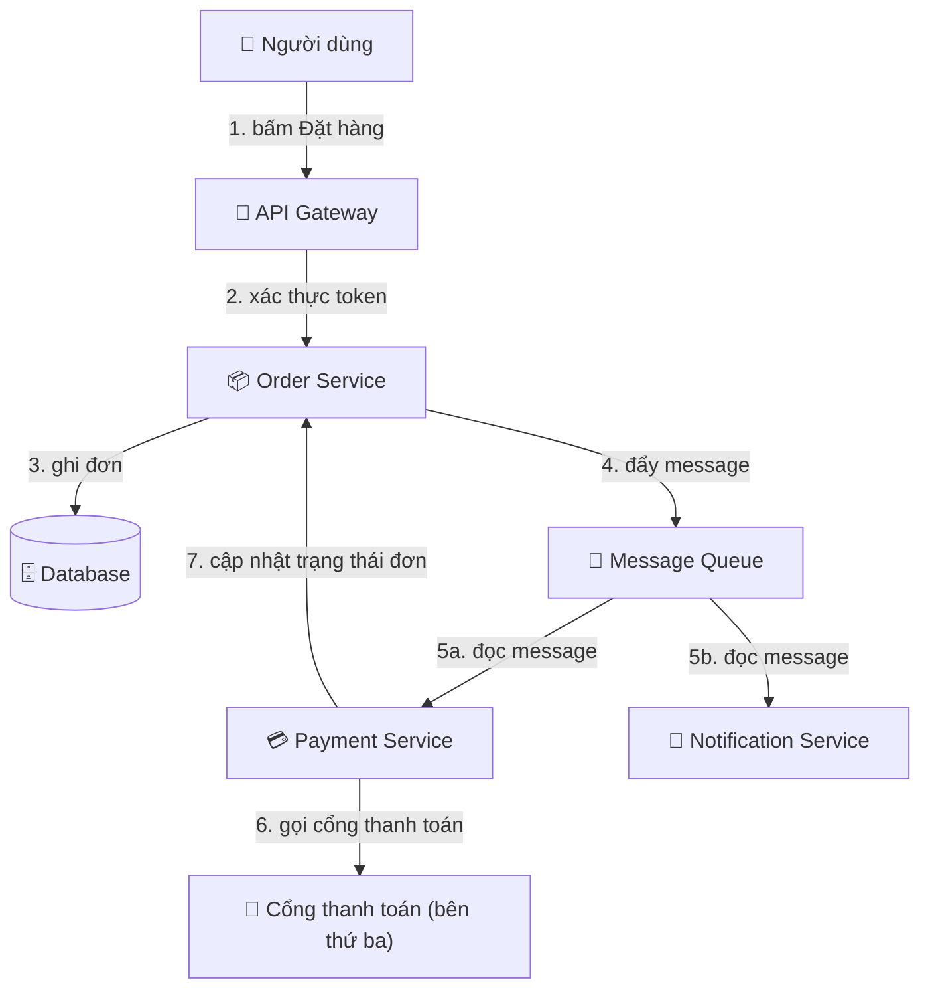
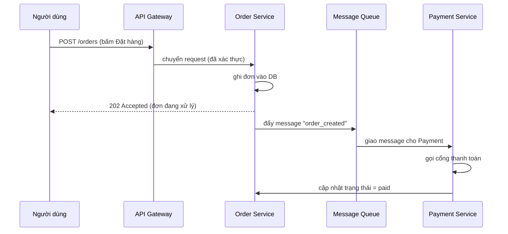
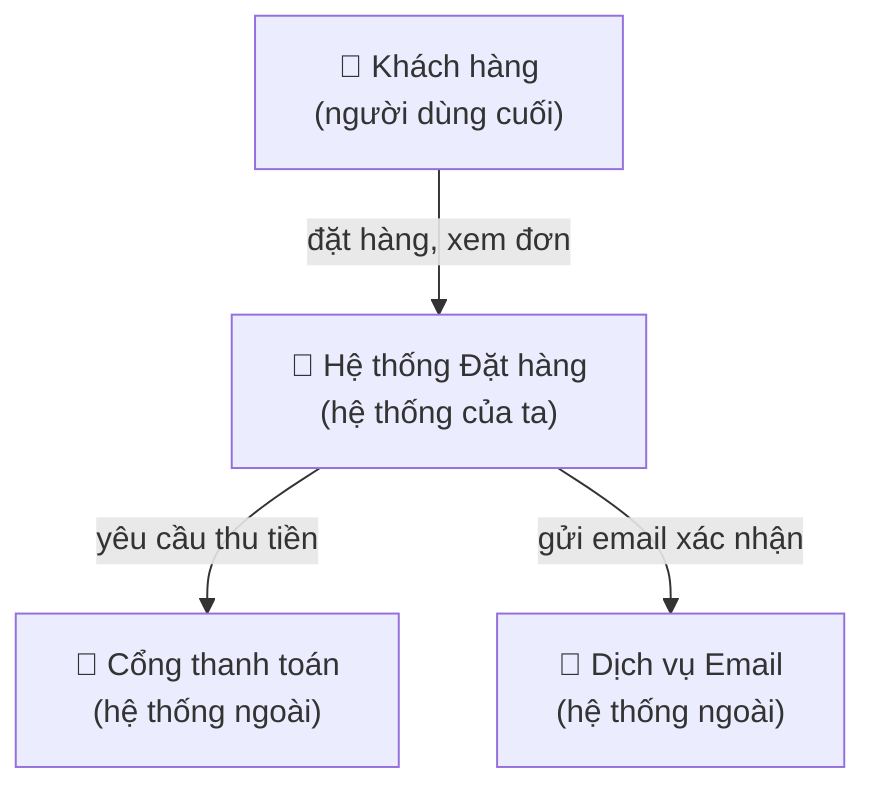
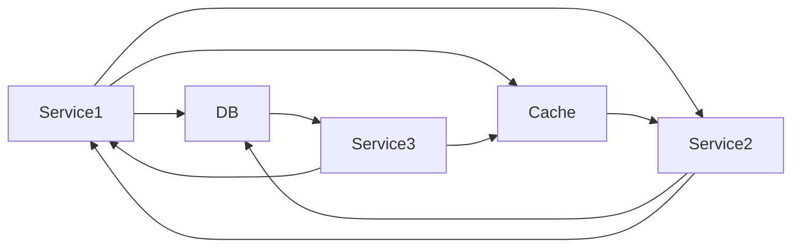
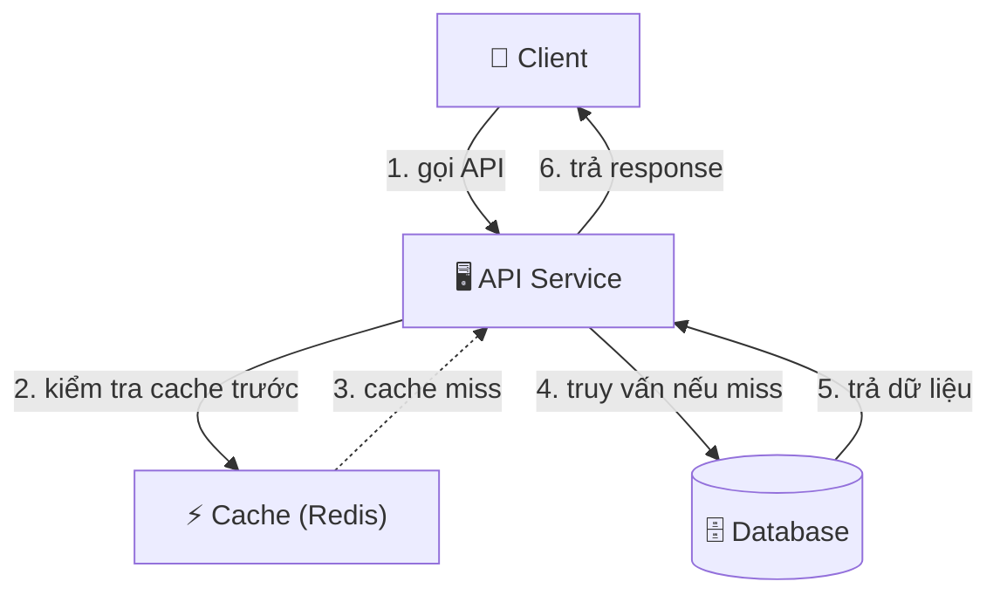

# Sơ đồ kỹ thuật — Truyền đạt bằng hình ảnh

> **Tác giả:** Mr.Rom\
> **Phiên bản:** v1.0.0\
> **Tạo lúc:** 13/06/2026\
> **Cập nhật:** 13/06/2026\
> **Level:** Basic\
> **Tags:** technical-writing, diagrams, mermaid, c4-model, sequence-diagram, flowchart, erd, documentation, soft-skills\
> **Yêu cầu trước:** [Tài liệu API & code](03_api-and-code-documentation.md)

> 🎯 *Cả cụm này bạn đã học viết bằng chữ: README, design doc, docstring. Nhưng có những thứ viết cả trang vẫn rối — kiến trúc hệ thống, luồng một request đi qua mười service, quan hệ giữa năm bảng database. Bài này dạy bạn khi nào một sơ đồ thay được ngàn chữ, các loại sơ đồ dev hay dùng (architecture, sequence, flowchart, ERD, state), công cụ vẽ sơ đồ bằng code ngay trong markdown (**mermaid**) cùng Excalidraw và draw.io, mô hình **C4** để zoom kiến trúc theo bốn mức, và nguyên tắc phân biệt một sơ đồ tệ với một sơ đồ tốt. Kết bài bạn vẽ được sơ đồ chạy thật, versioned cùng code.*

## 🎯 Sau bài này bạn sẽ

- [ ] Nhận ra **khi nào nên vẽ sơ đồ** thay vì viết chữ (kiến trúc, luồng, quan hệ) và khi nào sơ đồ chỉ làm rối thêm
- [ ] Phân biệt **5 loại sơ đồ dev** hay dùng: architecture/component, sequence, flowchart, ERD, state — và chọn đúng loại cho đúng việc
- [ ] Viết được sơ đồ bằng **mermaid** (diagram-as-code) ngay trong markdown, version cùng code trong Git
- [ ] Biết khi nào chọn **Excalidraw** (vẽ tay nhanh) hay **draw.io** (kéo thả tỉ mỉ) thay vì mermaid
- [ ] Dùng **C4 model** để mô tả kiến trúc theo 4 mức zoom (Context → Container → Component → Code)
- [ ] Áp dụng nguyên tắc một sơ đồ tốt: một thông điệp, label rõ, ít hộp, hướng đọc nhất quán

---

## Tình huống — đoạn văn không ai đọc nổi

Bạn vừa viết xong phần "Kiến trúc" trong design doc. Bạn mô tả luồng đặt hàng bằng chữ, rất cẩn thận:

> *"Khi người dùng bấm Đặt hàng, frontend gọi tới API Gateway, gateway xác thực token rồi chuyển request sang Order Service. Order Service ghi đơn vào database, sau đó đẩy một message vào queue. Payment Service đọc message đó, gọi sang cổng thanh toán bên thứ ba, nhận kết quả, rồi cập nhật lại trạng thái đơn qua Order Service, đồng thời Notification Service cũng đọc cùng message để gửi email cho khách..."*

Người review đọc tới câu thứ hai đã phải kéo ngược lên đọc lại. "Khoan, Payment Service đọc từ queue hay gọi thẳng Order Service? Notification đọc *cùng* message hay message khác?" Họ không phải không hiểu tiếng Việt — họ không **giữ nổi** sáu thành phần và các mũi tên giữa chúng trong đầu cùng lúc. Văn xuôi bắt người đọc tự dựng lại bức tranh trong đầu, từng câu một, theo đúng thứ tự bạn viết.

Bây giờ thử thay cả đoạn đó bằng một sơ đồ tám dòng: sáu hộp, vài mũi tên có nhãn. Người review liếc ba giây là thấy toàn cảnh — ai gọi ai, cái gì đi qua queue, nhánh nào song song. Câu hỏi "đọc từ queue hay gọi thẳng" biến mất vì mũi tên đã trả lời rồi.

Đó là sức mạnh của sơ đồ: với **quan hệ và cấu trúc**, mắt người xử lý hình ảnh nhanh hơn xử lý chuỗi chữ rất nhiều. Bài này dạy bạn nhận ra đúng những lúc như vậy, và vẽ sơ đồ sao cho nó *giúp* người đọc chứ không làm họ rối thêm.

---

## 1️⃣ Khi nào một sơ đồ hơn ngàn chữ?

Sơ đồ không phải lúc nào cũng tốt hơn chữ. Một định nghĩa, một lý do, một danh sách bước tuần tự đơn giản — chữ viết rõ ràng và nhanh hơn. Sơ đồ chỉ thắng chữ ở ba loại nội dung, và đều có chung một đặc điểm: chúng có **cấu trúc nhiều chiều** mà văn xuôi (vốn tuyến tính, đọc từ trên xuống) diễn đạt rất vụng.

🪞 **Ẩn dụ**: mô tả một thứ bằng chữ giống **đọc chỉ đường qua điện thoại** — "đi thẳng 200m, rẽ phải ở ngã tư thứ hai, qua cây xăng thì rẽ trái...". Người nghe phải dựng bản đồ trong đầu theo từng câu, lệch một bước là lạc. Một sơ đồ giống **đưa thẳng tấm bản đồ** — người ta thấy cả khu vực một lần, tự định vị mình ở đâu, đường nào dẫn đi đâu. Với những gì có *hình dạng không gian*, đưa bản đồ luôn nhanh hơn đọc chỉ đường.

Ba loại nội dung mà sơ đồ gần như luôn thắng chữ:

| Loại nội dung | Vì sao chữ viết đuối | Loại sơ đồ phù hợp |
|---|---|---|
| **Kiến trúc** (các thành phần và liên kết) | Văn xuôi không cho thấy "toàn cảnh" cùng lúc — phải đọc tuần tự mới ghép lại | Architecture / component, C4 |
| **Luồng** (thứ tự việc xảy ra, ai gọi ai) | Nhiều nhánh song song / quay vòng làm câu văn rối, dễ hiểu sai thứ tự | Sequence, flowchart |
| **Quan hệ** (dữ liệu liên kết nhau ra sao) | "Bảng A liên kết bảng B qua khoá C" lặp lại mười lần là không theo nổi | ERD |

Ngược lại, **đừng** vẽ sơ đồ khi: nội dung chỉ là một danh sách bước thẳng không nhánh (chữ đánh số rõ hơn), một định nghĩa hay một quyết định (chữ trực tiếp hơn), hoặc khi sơ đồ sẽ có quá nhiều hộp tới mức rối hơn cả đoạn văn nó thay thế. Một sơ đồ 30 hộp chằng chịt còn khó đọc hơn ba đoạn văn mạch lạc.

> [!TIP]
> Một phép thử nhanh để biết có nên vẽ sơ đồ: thử mô tả nội dung đó bằng lời cho một người, và để ý xem bạn có liên tục phải nói *"à khoan, để tôi vẽ ra"* hay quơ tay trong không khí không. Nếu có — não bạn đang muốn một hình ảnh, đó là tín hiệu rõ ràng rằng nội dung này thuộc loại "bản đồ", nên vẽ sơ đồ.

---

## 2️⃣ Năm loại sơ đồ dev hay dùng

Phần lớn sơ đồ trong tài liệu kỹ thuật của một dev rơi vào năm loại. Không cần biết hàng chục ký hiệu UML hàn lâm — chỉ cần dùng đúng năm loại này cho đúng việc là đã giải quyết gần hết nhu cầu thực tế. Mỗi loại trả lời một *câu hỏi* khác nhau, và chọn sai loại là cách nhanh nhất khiến sơ đồ trở nên khó hiểu.

Bảng dưới gom năm loại lại để bạn nắm tổng quan trước, rồi ta đi sâu hai loại quan trọng nhất ở các mục sau:

| Loại sơ đồ | Trả lời câu hỏi | Khi nào dùng | Mermaid |
|---|---|---|---|
| **Architecture / component** | "Hệ thống gồm những gì, nối với nhau ra sao?" | Mô tả kiến trúc tổng thể, các service và liên kết | `flowchart` / `graph` |
| **Sequence diagram** | "Theo thời gian, ai gọi ai, theo thứ tự nào?" | Luồng một request/giao dịch qua nhiều thành phần | `sequenceDiagram` |
| **Flowchart** | "Logic rẽ nhánh thế nào, quyết định ở đâu?" | Mô tả thuật toán, luồng quyết định có if/else | `flowchart` |
| **ERD** (Entity-Relationship) | "Các bảng dữ liệu liên kết nhau ra sao?" | Thiết kế schema database, quan hệ giữa các bảng | `erDiagram` |
| **State diagram** | "Một thứ đi qua những trạng thái nào?" | Vòng đời của đơn hàng, kết nối, máy trạng thái | `stateDiagram-v2` |

→ Điểm cốt lõi: **sequence** và **flowchart** dễ bị nhầm lẫn vì cùng nói về "luồng". Phân biệt thế này — sequence diagram nhấn vào *ai* làm (các thành phần tương tác qua lại theo thời gian), còn flowchart nhấn vào *logic* (rẽ nhánh, quyết định, vòng lặp). Một request đi qua các service → sequence. Một thuật toán có nhiều if/else → flowchart. Hai mục tới đây sẽ cho bạn ví dụ chạy thật của từng loại.

### Architecture / component — bức tranh tĩnh

Sơ đồ kiến trúc trả lời câu hỏi tĩnh: hệ thống *có gì* và *nối với nhau ra sao*, không quan tâm thứ tự thời gian. Đây là loại bạn dùng cho phần "Kiến trúc" trong design doc hay README. Quy tắc đọc: mỗi hộp là một thành phần (service, database, queue), mỗi mũi tên là một liên kết (gọi API, ghi dữ liệu), nhãn trên mũi tên nói rõ *liên kết đó là gì*.

### State diagram — vòng đời một thực thể

State diagram trả lời: một thực thể (đơn hàng, kết nối, task) đi qua **những trạng thái nào** và **sự kiện nào** đẩy nó từ trạng thái này sang trạng thái khác. Nó cực hữu ích khi tài liệu hoá vòng đời mà code của bạn quản lý — ví dụ đơn hàng đi từ `pending` → `paid` → `shipped` → `delivered`, và có thể nhảy sang `cancelled` từ vài trạng thái. Vẽ ra thì ai cũng thấy ngay "từ trạng thái X có thể đi đâu", thay vì lần mò trong code.

### ERD — quan hệ dữ liệu

ERD (Entity-Relationship Diagram — sơ đồ thực thể-quan hệ) vẽ các bảng database và cách chúng liên kết: một user *có nhiều* đơn hàng, một đơn hàng *thuộc về* một user. Ký hiệu "chân quạ" (crow's foot) ở đầu mũi tên cho biết quan hệ một-nhiều hay nhiều-nhiều. Đây là cách chuẩn để tài liệu hoá schema mà không bắt người đọc lội qua hàng chục câu lệnh `CREATE TABLE`.

---

## 3️⃣ Mermaid — vẽ sơ đồ bằng code ngay trong markdown

Cách "truyền thống" để vẽ sơ đồ là mở một công cụ kéo-thả, vẽ tay, export ra ảnh PNG, rồi nhúng ảnh vào tài liệu. Cách này có một vấn đề chí mạng với dev: **ảnh không version được**. Sáu tháng sau kiến trúc đổi, không ai tìm lại được file gốc để sửa, ảnh trong README thành sai sự thật, và Git chỉ thấy "ảnh thay đổi" chứ không cho bạn diff xem *cái gì* đổi.

**Mermaid** giải quyết đúng nỗi đau đó. Nó là một cú pháp text để mô tả sơ đồ — bạn viết vài dòng chữ, công cụ render tự vẽ thành hình. Vì nó là *text*, nó sống ngay trong file markdown, được Git theo dõi như code, diff được từng dòng, và sửa chỉ cần gõ chữ chứ không cần mở phần mềm vẽ.

🪞 **Ẩn dụ**: vẽ sơ đồ bằng công cụ kéo-thả giống **chụp ảnh một tấm bảng trắng** — đẹp tức thì, nhưng muốn sửa một mũi tên phải lau bảng vẽ lại từ đầu rồi chụp lại. Mermaid giống **viết công thức nấu ăn** — bạn mô tả "hai hộp, một mũi tên từ A sang B", và cái bếp (trình render) nấu ra hình. Đổi món chỉ cần sửa chữ trong công thức, không cần nấu lại từ đầu. Và công thức thì cất vào sổ (Git) được, ảnh chụp thì không.

> [!NOTE]
> Mermaid render được trực tiếp trên GitHub, GitLab, Notion, Obsidian, và nhiều trình xem markdown khác — bạn dán code vào là nó tự thành hình, không cần cài gì. Đó là lý do nó trở thành mặc định cho "diagram-as-code" trong tài liệu dev hiện đại.

### Ví dụ 1 — flowchart kiến trúc luồng đặt hàng

Quay lại đúng đoạn văn rối ở đầu bài — luồng đặt hàng qua sáu thành phần. Ta sẽ vẽ nó bằng mermaid `flowchart`. Cú pháp cốt lõi rất ít: khai báo hướng (`TD` = top-down, từ trên xuống; `LR` = left-right, trái sang phải), mỗi hộp là `Tên[Nhãn]`, mỗi mũi tên là `A --> B`, và nhãn trên mũi tên viết là `A -->|"nhãn"| B`.

````markdown

````

Đoạn code trên render ra sơ đồ sau:


→ So với đoạn văn ở đầu bài, sơ đồ này trả lời ngay những câu khiến người review phải đọc lại: Payment và Notification cùng *đọc từ queue* (5a, 5b song song — không phải gọi thẳng nhau), Payment *gọi ngược* về Order để cập nhật trạng thái (mũi tên 7). Để ý chi tiết cú pháp `DB[("...")]` — hai ngoặc tròn lồng trong ngoặc vuông vẽ hình trụ, ký hiệu quy ước cho database. Và mọi nhãn có dấu câu hay dấu cách đều được bọc trong dấu `"..."` — đây là quy tắc bắt buộc của mermaid, quên là sơ đồ không render.

> [!WARNING]
> Cạm bẫy mermaid hay gặp nhất: nhãn chứa dấu ngoặc, dấu hai chấm, hay ký tự đặc biệt mà **không bọc trong dấu nháy kép**. Ví dụ `A[Cổng thanh toán (bên thứ ba)]` sẽ làm mermaid hiểu nhầm dấu `(` là cú pháp hình và báo lỗi parse. Luôn viết `A["Cổng thanh toán (bên thứ ba)"]` — bọc nhãn trong `"..."` mỗi khi nó có gì hơn chữ và số đơn thuần.

### Ví dụ 2 — sequence diagram cho cùng luồng

Flowchart trên cho thấy *cấu trúc* (ai nối ai), nhưng nó không nhấn mạnh **thứ tự thời gian** và đặc biệt là *phản hồi đi ngược lại*. Khi bạn muốn kể "request đi qua từng bước theo đúng trình tự, và mỗi bước trả về gì", **sequence diagram** là lựa chọn đúng. Mỗi cột dọc (`participant`) là một thành phần; thời gian chảy từ trên xuống; `A->>B` là lời gọi đồng bộ, `A-->>B` (nét đứt) là phản hồi trả về.

````markdown

````

Render ra:


→ Sequence diagram làm rõ một điều flowchart giấu mất: Order Service **trả lời người dùng `202 Accepted` ngay** (mũi tên nét đứt về U) *trước khi* thanh toán xong — tức luồng này **bất đồng bộ**, khách không phải đứng chờ cổng thanh toán phản hồi. Đó chính là loại thông tin "theo thời gian" mà chỉ sequence diagram nói tốt. Để ý `participant U as Người dùng` — phần `as` đặt tên hiển thị có dấu tiếng Việt, trong khi định danh `U` ngắn gọn để gõ các dòng sau.

> [!TIP]
> Khi phân vân giữa flowchart và sequence cho một luồng: nếu điều quan trọng là *thứ tự các bước và phản hồi trả về* (đặc biệt khi có gọi đồng bộ/bất đồng bộ) → dùng sequence. Nếu điều quan trọng là *cấu trúc tĩnh các thành phần nối nhau* → dùng flowchart. Cùng một luồng đặt hàng, hai loại sơ đồ kể hai câu chuyện bổ sung cho nhau, như vừa thấy ở trên.

---

## 4️⃣ Excalidraw và draw.io — khi mermaid chưa đủ

Mermaid mạnh vì là code, nhưng nó không phải lúc nào cũng là công cụ đúng. Có hai tình huống mermaid đuối: khi bạn cần **phác ý tưởng thật nhanh** lúc đang brainstorm (gõ cú pháp lúc đó làm chậm dòng suy nghĩ), và khi bạn cần **bố cục tỉ mỉ, đẹp** cho một sơ đồ kiến trúc quan trọng (mermaid tự sắp xếp layout, bạn không kiểm soát được từng vị trí). Hai công cụ bổ sung lấp đúng hai khoảng đó.

Bảng dưới đặt ba công cụ cạnh nhau để bạn chọn đúng cái cho đúng việc, thay vì cố nhét mọi sơ đồ vào một công cụ:

| Công cụ | Bản chất | Mạnh nhất khi | Versioned? |
|---|---|---|---|
| **mermaid** | Diagram-as-code (text) | Sơ đồ sống trong tài liệu/Git, cần diff & sửa bằng chữ | ✅ Có — là text |
| **Excalidraw** | Vẽ tay phong cách phác thảo | Brainstorm nhanh, sơ đồ "nháp" trong buổi họp | 🟡 Lưu file `.excalidraw` (JSON) được |
| **draw.io** (diagrams.net) | Kéo-thả hộp/mũi tên tỉ mỉ | Sơ đồ kiến trúc phức tạp cần bố cục đẹp, chính xác | 🟡 Lưu `.drawio` (XML) được |

- **Excalidraw** cho ra nét vẽ trông như viết tay nguệch ngoạc — và đó là *chủ ý*. Phong cách "phác thảo" ngầm báo "đây là nháp, đừng bắt bẻ chi tiết", rất hợp lúc đang bàn ý tưởng trên một bảng trắng ảo cùng cả team. Nhanh, vui, ít áp lực phải hoàn hảo.
- **draw.io** (nay là diagrams.net) là công cụ kéo-thả đầy đủ: thư viện hình AWS/GCP/Azure, căn lề pixel-perfect, export đủ định dạng. Dùng khi sơ đồ kiến trúc sẽ đi vào tài liệu chính thức và cần trông chuyên nghiệp, chính xác.

> [!NOTE]
> Cả Excalidraw lẫn draw.io đều lưu được file nguồn (`.excalidraw` là JSON, `.drawio` là XML) và **commit file đó vào Git** — nhờ vậy bạn vẫn version được "bản gốc sửa được", không chỉ ảnh PNG export ra. Mẹo thực dụng: commit *cả* file nguồn lẫn ảnh export; ảnh để hiển thị trong tài liệu, file nguồn để người sau mở ra sửa. Nhưng nếu sơ đồ đủ đơn giản để mermaid vẽ được, hãy ưu tiên mermaid — không gì version tốt bằng text thuần.

→ Quy tắc chọn gọn: **mermaid trước tiên** (nếu vẽ được, vì nó version tốt nhất) → **Excalidraw** khi cần phác nhanh/nháp → **draw.io** khi cần sơ đồ kiến trúc tỉ mỉ, đẹp, chính thức.

---

## 5️⃣ C4 model — bốn mức zoom cho kiến trúc

Khi vẽ sơ đồ kiến trúc, sai lầm kinh điển là **trộn lẫn các mức chi tiết** trong cùng một hình: một hộp là "cả hệ thống thanh toán", hộp bên cạnh lại là "hàm `validateToken()`". Người xem không biết mình đang nhìn ở "độ cao" nào. **C4 model** (do Simon Brown đề xuất) giải quyết bằng cách tách kiến trúc thành **bốn mức zoom** rõ ràng — như Google Maps cho phần mềm: zoom ra thấy cả nước, zoom vào thấy từng con phố, và mỗi mức zoom chỉ hiện đúng chi tiết phù hợp với mức đó.

🪞 **Ẩn dụ**: C4 chính là **các mức zoom của bản đồ số**. Mức xa nhất bạn thấy cả quốc gia và các nước láng giềng (hệ thống của ta và các hệ thống ngoài nó nói chuyện). Zoom vào một bậc thấy các thành phố (các ứng dụng/dịch vụ chạy được riêng). Zoom tiếp thấy các khu phố trong một thành phố (các module bên trong một dịch vụ). Zoom hết cỡ thấy từng ngôi nhà (lớp/hàm code cụ thể). Không ai mở bản đồ ở mức "từng ngôi nhà" để xem đường từ Việt Nam sang Nhật — mỗi câu hỏi có một mức zoom đúng.

Bốn chữ "C" là bốn mức, đi từ xa nhất tới gần nhất:

| Mức | Tên | Trả lời câu hỏi | Khán giả |
|---|---|---|---|
| **C1** | **Context** (ngữ cảnh) | "Hệ thống của ta nằm đâu, nói chuyện với ai/cái gì bên ngoài?" | Ai cũng hiểu — kể cả người không kỹ thuật |
| **C2** | **Container** (vùng chứa) | "Hệ thống gồm những ứng dụng/dịch vụ/DB chạy được nào?" | Dev, kiến trúc sư, DevOps |
| **C3** | **Component** (thành phần) | "Bên trong một container có những module/khối nào?" | Dev làm trên container đó |
| **C4** | **Code** (mã) | "Một component được hiện thực bằng lớp/hàm nào?" | Hiếm khi cần vẽ tay — IDE tự sinh được |

Ở mức **Context** (C1), sơ đồ chỉ có một hộp duy nhất là "hệ thống của ta" cùng những người dùng và hệ thống ngoài tương tác với nó. Đây là mức trừu tượng nhất — nó cố tình giấu mọi chi tiết bên trong để ai nhìn cũng hiểu hệ thống *phục vụ ai* và *phụ thuộc cái gì*. Vì là mức trừu tượng nhất, ta vẽ nó ra trước để thấy "bức tranh từ vũ trụ" trước khi zoom vào:



→ Để ý sơ đồ Context cố tình **chỉ có một hộp** cho cả hệ thống của ta — nó không quan tâm bên trong có bao nhiêu service. Người không kỹ thuật (sếp, khách hàng) nhìn vào hiểu ngay: hệ thống phục vụ khách, và phụ thuộc hai bên ngoài (thanh toán, email). Khi cần chi tiết hơn, bạn **zoom xuống C2** và "mở" hộp đó ra thành các container (frontend, API, các service, database) — đúng sáu hộp ta đã vẽ ở mục 3 chính là một sơ đồ mức Container. Mỗi mức là một sơ đồ riêng, không trộn lẫn.

> [!TIP]
> Trong thực tế, **đa số tài liệu chỉ cần C1 và C2** là đủ. C3 (Component) chỉ vẽ cho các container phức tạp đáng đào sâu, và C4 (Code) gần như không ai vẽ tay — IDE và công cụ tự sinh sơ đồ lớp được. Đừng cảm thấy phải vẽ đủ bốn mức cho mọi hệ thống; sức mạnh của C4 model nằm ở việc *không trộn lẫn* các mức, chứ không phải ở việc luôn vẽ đủ cả bốn.

---

## 6️⃣ Sơ đồ tệ vs sơ đồ tốt — bốn nguyên tắc

Một sơ đồ có thể *tệ hơn* cả văn xuôi nếu vẽ sai cách. Sơ đồ tệ điển hình: hai mươi hộp chằng chịt mũi tên đi mọi hướng, nhãn cụt lủn hoặc không có, trộn ba mức chi tiết, mũi tên cắt nhau như mạng nhện. Người xem nhìn vào còn hoang mang hơn đọc chữ. Bốn nguyên tắc dưới đây tách một sơ đồ giúp người đọc khỏi một sơ đồ tra tấn họ.

Bảng dưới đối chiếu trực tiếp tệ vs tốt cho từng nguyên tắc:

| Nguyên tắc | ❌ Sơ đồ tệ | ✅ Sơ đồ tốt |
|---|---|---|
| **Một thông điệp** | Nhồi kiến trúc + luồng + dữ liệu vào một hình | Mỗi sơ đồ trả lời đúng *một* câu hỏi |
| **Label rõ** | Hộp ghi "Service1", mũi tên trống trơn | Hộp ghi rõ vai trò, mũi tên ghi *làm gì* |
| **Ít hộp** | 20+ hộp trong một hình | ~5-9 hộp; nhiều hơn thì tách hoặc zoom |
| **Hướng đọc nhất quán** | Mũi tên đi tứ phía, cắt nhau loạn | Một hướng chủ đạo (trên→dưới hoặc trái→phải) |

### ❌ Sơ đồ tệ — nhồi nhét, mơ hồ

Đây là kiểu sơ đồ "vẽ cho có", trộn mọi thứ và đặt tên qua loa. Người xem không biết nên đọc từ đâu, mỗi hộp là gì, mũi tên nghĩa là gì:



→ Vì sao tệ: tên hộp (`Service1`, `Service2`) không cho biết *chúng làm gì*; không có nhãn nào trên mũi tên (gọi API? ghi dữ liệu? đọc cache?); mũi tên đi hai chiều lẫn lộn và cắt nhau; và nó cố nhồi cả luồng gọi lẫn quan hệ dữ liệu vào một hình. Người xem phải đoán mọi thứ.

### ✅ Sơ đồ tốt — một thông điệp, label rõ, hướng nhất quán

Cùng những thành phần đó, nhưng tập trung vào *một* thông điệp ("một request đọc dữ liệu đi qua đâu"), đặt tên rõ vai trò, ghi nhãn mọi mũi tên, và giữ một hướng đọc trên→dưới:



→ Vì sao tốt: mỗi hộp ghi rõ vai trò (`API Service`, `Cache (Redis)`), mỗi mũi tên có nhãn đánh số nói *làm gì* và theo thứ tự, hướng đọc nhất quán từ trên xuống, và sơ đồ trả lời đúng *một* câu hỏi ("đường đọc dữ liệu đi qua đâu") thay vì cố nói mọi thứ. Mũi tên nét đứt phân biệt nhánh phụ (cache miss) khỏi luồng chính. Cùng các thành phần, nhưng giờ liếc ba giây là hiểu.

> [!IMPORTANT]
> Nguyên tắc **"một sơ đồ — một thông điệp"** là quan trọng nhất trong bốn cái. Nếu bạn thấy sơ đồ đang phình to vì muốn nói cả kiến trúc *lẫn* luồng *lẫn* quan hệ dữ liệu, đừng nhồi — hãy **tách thành nhiều sơ đồ**, mỗi cái trả lời một câu hỏi. Hai sơ đồ rõ ràng luôn thắng một sơ đồ ôm đồm. Đây cũng chính là tinh thần của C4 model: mỗi mức zoom là một sơ đồ riêng.

---

## 💡 Cạm bẫy thường gặp & Best practice

### ❌ Cạm bẫy: nhúng ảnh PNG export thay vì sơ đồ-as-code

- **Triệu chứng**: README có ảnh kiến trúc đẹp nhưng sáu tháng sau đã sai sự thật; không ai sửa được vì mất file gốc; Git chỉ thấy "ảnh thay đổi" không diff được nội dung.
- **Nguyên nhân**: vẽ bằng công cụ kéo-thả rồi export PNG dán vào, không lưu nguồn; coi sơ đồ là "ảnh trang trí" chứ không phải tài sản sống cùng code.
- **Cách tránh**: ưu tiên mermaid (text thuần, version trong Git, sửa bằng chữ). Nếu buộc dùng Excalidraw/draw.io thì commit *cả* file nguồn (`.excalidraw`/`.drawio`) lẫn ảnh export, để người sau mở ra sửa được.

### ❌ Cạm bẫy: sơ đồ "tô vẽ" cho có nhưng làm rối hơn chữ

- **Triệu chứng**: sơ đồ 20+ hộp chằng chịt mũi tên cắt nhau, nhãn cụt lủn (`Service1`, `Module2`), trộn ba mức chi tiết; người xem nhìn xong còn hoang mang hơn đọc đoạn văn.
- **Nguyên nhân**: nghĩ "có sơ đồ là chuyên nghiệp" mà không hỏi sơ đồ này nói *điều gì*; cố nhồi mọi thứ vào một hình.
- **Cách tránh**: áp dụng bốn nguyên tắc — một thông điệp, label rõ vai trò + nhãn mọi mũi tên, giữ ~5-9 hộp, một hướng đọc nhất quán. Phình to thì tách thành nhiều sơ đồ.

### ❌ Cạm bẫy: nhãn mermaid có dấu câu nhưng không bọc dấu nháy

- **Triệu chứng**: sơ đồ không render, báo lỗi parse khó hiểu, hoặc render méo mó; thường do nhãn chứa `()`, `:`, `,` hay dấu cách đặc biệt.
- **Nguyên nhân**: viết `A[Cổng thanh toán (bên thứ ba)]` — mermaid hiểu nhầm dấu `(` là cú pháp hình.
- **Cách tránh**: bọc mọi nhãn có gì hơn chữ-và-số trong dấu nháy kép: `A["Cổng thanh toán (bên thứ ba)"]`. Khi nghi ngờ, cứ bọc — thừa dấu nháy không hại gì.

### ✅ Best practice: chọn đúng loại sơ đồ cho đúng câu hỏi

- **Vì sao**: dùng sai loại (vẽ flowchart cho thứ cần sequence, hay nhồi quan hệ dữ liệu vào sơ đồ kiến trúc) khiến sơ đồ vừa khó vẽ vừa khó đọc.
- **Cách áp dụng**: hỏi "sơ đồ này trả lời câu gì?". Cấu trúc tĩnh (ai nối ai) → architecture/flowchart. Thứ tự theo thời gian, ai gọi ai → sequence. Logic rẽ nhánh → flowchart. Quan hệ bảng dữ liệu → ERD. Vòng đời trạng thái → state diagram.

### ✅ Best practice: một sơ đồ — một thông điệp, tách thay vì nhồi

- **Vì sao**: một sơ đồ ôm đồm cả kiến trúc lẫn luồng lẫn dữ liệu rối hơn cả ba đoạn văn; người đọc không biết tập trung vào đâu.
- **Cách áp dụng**: mỗi sơ đồ trả lời đúng một câu hỏi. Cần nói nhiều khía cạnh thì vẽ nhiều sơ đồ, hoặc dùng C4 model tách theo mức zoom (Context → Container → Component). Hai sơ đồ rõ thắng một sơ đồ tham lam.

---

## 🧠 Tự kiểm tra (Self-check)

**Q1.** Khi nào một sơ đồ thật sự hơn ngàn chữ, và khi nào ngược lại — chữ viết tốt hơn vẽ sơ đồ?

<details>
<summary>💡 Xem giải thích</summary>

Sơ đồ thắng chữ ở **ba loại nội dung có cấu trúc nhiều chiều** mà văn xuôi tuyến tính diễn đạt vụng: **kiến trúc** (các thành phần và liên kết), **luồng** (thứ tự việc xảy ra, ai gọi ai, nhất là khi có nhánh song song), và **quan hệ** (dữ liệu liên kết nhau ra sao). Mắt người xử lý cấu trúc không gian nhanh hơn chuỗi chữ tuần tự.

Ngược lại, **chữ tốt hơn** khi nội dung là: một danh sách bước thẳng không nhánh (chữ đánh số rõ hơn), một định nghĩa hay quyết định (chữ trực tiếp hơn), hoặc khi sơ đồ sẽ có quá nhiều hộp tới mức rối hơn cả đoạn văn nó thay. Phép thử nhanh: nếu khi mô tả bằng lời bạn cứ phải "khoan để tôi vẽ ra" — đó là tín hiệu nên vẽ sơ đồ.

</details>

**Q2.** Phân biệt **sequence diagram** và **flowchart** — cùng nói về "luồng" nhưng khác nhau ở đâu? Cho ví dụ mỗi loại.

<details>
<summary>💡 Xem giải thích</summary>

Cả hai nói về luồng nhưng nhấn vào điều khác nhau:

- **Sequence diagram** nhấn vào *ai làm gì theo thời gian* — các thành phần (participant) tương tác qua lại, thời gian chảy từ trên xuống, thấy rõ lời gọi và phản hồi trả về (đồng bộ/bất đồng bộ). Ví dụ: một request đặt hàng đi qua Gateway → Order Service → Queue → Payment.
- **Flowchart** nhấn vào *logic rẽ nhánh* — các bước, quyết định (if/else), vòng lặp. Ví dụ: thuật toán xử lý một đơn (nếu còn hàng thì..., nếu hết thì...).

Quy tắc chọn: quan trọng là *thứ tự bước và phản hồi* → sequence; quan trọng là *cấu trúc/logic rẽ nhánh* → flowchart.

</details>

**Q3.** Vì sao mermaid (diagram-as-code) thường tốt hơn nhúng ảnh PNG cho tài liệu của dev?

<details>
<summary>💡 Xem giải thích</summary>

Vì mermaid là **text thuần**, nên nó: (1) sống ngay trong file markdown, được Git theo dõi như code; (2) **diff được từng dòng** — review thấy chính xác cái gì đổi, không chỉ "ảnh thay đổi"; (3) sửa chỉ cần gõ chữ, không cần mở lại phần mềm vẽ và tìm file gốc. Ảnh PNG export thì version kém: mất file gốc là không sửa được, sáu tháng sau ảnh thành sai sự thật mà không ai cập nhật nổi. Mermaid còn render trực tiếp trên GitHub/GitLab/Notion, dán vào là thành hình.

</details>

**Q4.** Trong mermaid, vì sao `A[Cổng thanh toán (bên thứ ba)]` gây lỗi, còn `A["Cổng thanh toán (bên thứ ba)"]` thì chạy?

<details>
<summary>💡 Xem giải thích</summary>

Vì dấu `(` trong nhãn bị mermaid hiểu nhầm là **cú pháp khai báo hình** (ngoặc tròn nghĩa là hình bo tròn/hình trụ), nên nó parse sai và báo lỗi. Khi **bọc nhãn trong dấu nháy kép** `"..."`, mermaid coi toàn bộ phần trong nháy là text thuần và không diễn giải các ký tự đặc biệt nữa. Quy tắc an toàn: mọi nhãn chứa dấu câu, dấu ngoặc, dấu hai chấm, hay ký tự đặc biệt đều phải bọc trong `"..."` — khi nghi ngờ cứ bọc, thừa dấu nháy không hại gì.

</details>

**Q5.** C4 model có bốn mức Context / Container / Component / Code. Mức nào trừu tượng nhất, mức nào ai cũng hiểu kể cả người không kỹ thuật, và vì sao thực tế đa số tài liệu chỉ cần hai mức đầu?

<details>
<summary>💡 Xem giải thích</summary>

**Context (C1)** là mức trừu tượng nhất *và* cũng là mức ai cũng hiểu kể cả người không kỹ thuật — nó chỉ có một hộp "hệ thống của ta" cùng người dùng và các hệ thống ngoài tương tác với nó, cố tình giấu mọi chi tiết bên trong. Bốn mức đi từ xa tới gần: Context (cả hệ thống nằm đâu) → Container (các app/service/DB chạy được) → Component (module bên trong một container) → Code (lớp/hàm cụ thể).

Đa số tài liệu chỉ cần **C1 và C2** vì chúng trả lời hai câu hỏi hay gặp nhất ("hệ thống phục vụ ai, phụ thuộc gì" và "gồm những service/DB nào"). C3 chỉ vẽ cho container phức tạp đáng đào, còn C4 (Code) gần như không ai vẽ tay vì IDE tự sinh sơ đồ lớp được. Sức mạnh của C4 model là *không trộn lẫn các mức*, không phải luôn vẽ đủ bốn.

</details>

**Q6.** Nêu bốn nguyên tắc của một sơ đồ tốt. Nguyên tắc nào quan trọng nhất và vì sao?

<details>
<summary>💡 Xem giải thích</summary>

Bốn nguyên tắc: (1) **một thông điệp** — mỗi sơ đồ trả lời đúng một câu hỏi; (2) **label rõ** — hộp ghi rõ vai trò, mũi tên ghi rõ *làm gì*; (3) **ít hộp** — khoảng 5-9 hộp, nhiều hơn thì tách hoặc zoom; (4) **hướng đọc nhất quán** — một hướng chủ đạo (trên→dưới hoặc trái→phải), tránh mũi tên cắt nhau loạn.

Quan trọng nhất là **"một thông điệp"**: nếu sơ đồ phình to vì cố nói cả kiến trúc lẫn luồng lẫn dữ liệu, hãy *tách* thành nhiều sơ đồ, mỗi cái một câu hỏi. Hai sơ đồ rõ ràng luôn thắng một sơ đồ ôm đồm — đây cũng chính là tinh thần tách-theo-mức-zoom của C4 model.

</details>

---

## ⚡ Tra cứu nhanh (Cheatsheet)

### Chọn loại sơ đồ theo câu hỏi

| Câu hỏi cần trả lời | Loại sơ đồ | Mermaid |
|---|---|---|
| Hệ thống gồm gì, nối nhau ra sao? | Architecture / component | `flowchart` / `graph` |
| Ai gọi ai, theo thứ tự thời gian nào? | Sequence | `sequenceDiagram` |
| Logic rẽ nhánh / quyết định thế nào? | Flowchart | `flowchart` |
| Các bảng dữ liệu liên kết ra sao? | ERD | `erDiagram` |
| Một thực thể đi qua trạng thái nào? | State | `stateDiagram-v2` |

### Cú pháp mermaid cốt lõi

| Mục đích | Cú pháp |
|---|---|
| Hướng flowchart | `flowchart TD` (trên→dưới) / `flowchart LR` (trái→phải) |
| Hộp chữ nhật | `A["Nhãn"]` |
| Hộp database (hình trụ) | `DB[("Database")]` |
| Hộp quyết định (thoi) | `Q{"Còn hàng?"}` |
| Mũi tên có nhãn | `A -->|"gọi API"| B` |
| Mũi tên nét đứt | `A -.->|"nhánh phụ"| B` |
| Sequence: gọi đồng bộ | `A->>B: nội dung` |
| Sequence: phản hồi trả về | `A-->>B: kết quả` |
| Sequence: đặt tên hiển thị | `participant U as Người dùng` |

> ⚠️ Nhãn chứa dấu câu / ngoặc / dấu cách đặc biệt → luôn bọc trong `"..."`.

### Chọn công cụ

| Cần gì | Dùng |
|---|---|
| Sơ đồ sống trong Git, diff được | mermaid |
| Phác nhanh khi brainstorm | Excalidraw |
| Sơ đồ kiến trúc tỉ mỉ, đẹp, chính thức | draw.io (diagrams.net) |

### C4 model — 4 mức zoom

| Mức | Trả lời |
|---|---|
| C1 Context | Hệ thống nằm đâu, nói chuyện với ai bên ngoài |
| C2 Container | Gồm các app/service/DB chạy được nào |
| C3 Component | Module bên trong một container |
| C4 Code | Lớp/hàm cụ thể (hiếm khi vẽ tay) |

→ Đa số tài liệu chỉ cần C1 + C2.

### 4 nguyên tắc sơ đồ tốt

- **Một thông điệp** — mỗi sơ đồ một câu hỏi.
- **Label rõ** — hộp ghi vai trò, mũi tên ghi *làm gì*.
- **Ít hộp** — ~5-9; nhiều hơn thì tách/zoom.
- **Hướng đọc nhất quán** — một hướng chủ đạo, tránh cắt nhau.

---

## 📚 Từ Điển Thuật Ngữ (Glossary)

| EN | VN | Giải thích |
|---|---|---|
| Diagram | Sơ đồ | Biểu diễn bằng hình ảnh của cấu trúc/luồng/quan hệ |
| Diagram-as-code | Sơ đồ dạng mã | Mô tả sơ đồ bằng text để công cụ render thành hình, version được như code |
| Mermaid | (giữ EN) | Cú pháp text vẽ sơ đồ trong markdown, render trên GitHub/GitLab/Notion |
| Excalidraw | (giữ EN) | Công cụ vẽ tay phong cách phác thảo, hợp brainstorm nhanh |
| draw.io / diagrams.net | (giữ EN) | Công cụ kéo-thả vẽ sơ đồ tỉ mỉ, có thư viện hình cloud |
| Architecture diagram | Sơ đồ kiến trúc | Thể hiện các thành phần hệ thống và liên kết giữa chúng |
| Component | Thành phần | Một khối/module trong hệ thống |
| Sequence diagram | Sơ đồ tuần tự | Thể hiện ai gọi ai theo thứ tự thời gian |
| Flowchart | Lưu đồ | Sơ đồ logic có bước, quyết định, rẽ nhánh |
| ERD (Entity-Relationship Diagram) | Sơ đồ thực thể-quan hệ | Vẽ các bảng dữ liệu và quan hệ giữa chúng |
| State diagram | Sơ đồ trạng thái | Vòng đời một thực thể qua các trạng thái và chuyển trạng thái |
| C4 model | Mô hình C4 | Cách mô tả kiến trúc theo 4 mức zoom: Context/Container/Component/Code |
| Context (C4) | Ngữ cảnh | Mức C4 trừu tượng nhất: hệ thống và các bên ngoài tương tác |
| Container (C4) | Vùng chứa | Mức C4: một app/service/DB chạy được riêng (không phải Docker container) |
| Participant | Bên tham gia | Một cột dọc trong sequence diagram, đại diện một thành phần |
| Crow's foot | Chân quạ | Ký hiệu đầu mũi tên ERD chỉ quan hệ một-nhiều/nhiều-nhiều |
| Render | Kết xuất | Quá trình công cụ biến mô tả text thành hình ảnh hiển thị |
| Versioned | Được quản lý phiên bản | Theo dõi được lịch sử thay đổi trong Git, diff được từng bản |

---

## 🔗 Liên kết & Tài nguyên

⬅️ **Bài trước:** [Tài liệu API & code — Docstring, comment, changelog](03_api-and-code-documentation.md)\
↑ **Về cụm:** [technical-writing — README](../../README.md)

### 🧭 Định hướng lộ trình học

- [Viết README & tài liệu dự án — Docs-as-code](01_writing-readme-and-docs.md) — sơ đồ-as-code (mermaid) là phần mở rộng tự nhiên của triết lý docs-as-code ở bài đó
- [Design Doc & RFC — Viết để quyết định kỹ thuật](02_design-docs-and-rfc.md) — phần "Kiến trúc" của một design doc chính là nơi sơ đồ phát huy mạnh nhất

### 🧩 Các chủ đề có thể bạn quan tâm

- [Vì sao dev cần viết tài liệu kỹ thuật tốt](00_why-technical-writing.md) — nền tảng vì sao kỹ năng truyền đạt (gồm cả bằng hình ảnh) quyết định giá trị của một dev
- [Giao tiếp async & viết — Slack, email, ticket, tài liệu](../../../communication/lessons/01_basic/01_async-and-written-communication.md) — một sơ đồ dán vào tin nhắn/ticket thường cắt được nhiều vòng hỏi-đáp async

### 🌐 Tài nguyên tham khảo khác

- [Mermaid — tài liệu chính thức](https://mermaid.js.org/) — cú pháp đầy đủ cho mọi loại sơ đồ, có live editor thử ngay trên trình duyệt
- [The C4 model (c4model.com)](https://c4model.com/) — trang gốc của Simon Brown về mô hình C4, giải thích kỹ bốn mức zoom
- [Excalidraw](https://excalidraw.com/) — vẽ tay nhanh ngay trên trình duyệt, không cần cài đặt
- [draw.io / diagrams.net](https://www.drawio.com/) — công cụ kéo-thả miễn phí, tích hợp được vào VS Code và Git

---

## 📌 Nhật ký thay đổi (Changelog)

- **v1.0.0 (13/06/2026)** — Bản đầu tiên. Tình huống mở bài "đoạn văn không ai đọc nổi" về luồng đặt hàng + 6 section: khi nào sơ đồ hơn ngàn chữ (kiến trúc/luồng/quan hệ, có phép thử) với ẩn dụ bản đồ vs chỉ đường + 5 loại sơ đồ dev (architecture, sequence, flowchart, ERD, state) phân biệt sequence vs flowchart + mermaid diagram-as-code với 2 ví dụ chạy thật (flowchart luồng đặt hàng + sequence cùng luồng) và quy tắc bọc nhãn trong dấu nháy + Excalidraw vs draw.io vs mermaid (bảng chọn công cụ) + C4 model 4 mức zoom có sơ đồ Context mermaid và ẩn dụ zoom bản đồ + sơ đồ tệ vs tốt (bốn nguyên tắc: một thông điệp, label rõ, ít hộp, hướng nhất quán) với ví dụ before/after chạy thật. Kèm 3 cạm bẫy + 2 best practice + 6 self-check + cheatsheet (chọn loại, cú pháp mermaid, chọn công cụ, C4, nguyên tắc) + glossary 18 thuật ngữ. Đóng cụm technical-writing.
