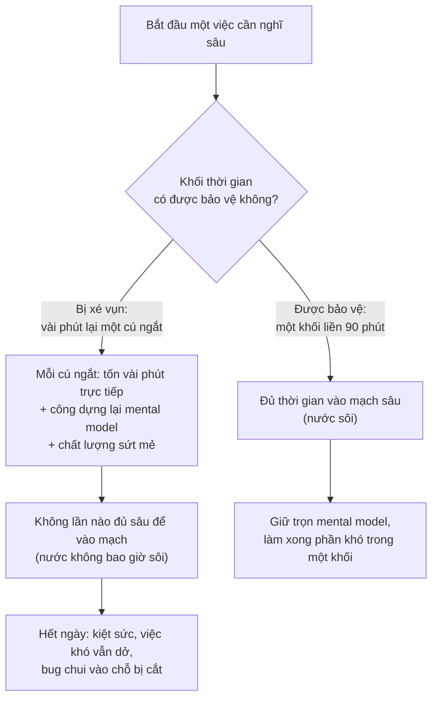
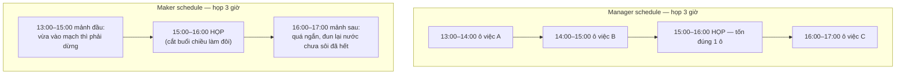

# Quản lý thời gian cho dev — Vì sao knowledge work cần khác

> **Tác giả:** Mr.Rom\
> **Phiên bản:** v1.0.0\
> **Tạo lúc:** 13/06/2026\
> **Cập nhật:** 13/06/2026\
> **Level:** Basic\
> **Tags:** career, soft-skills, time-management, productivity, context-switching, maker-schedule, energy-management, knowledge-work, deep-work\
> **Yêu cầu trước:** (không bắt buộc)

> 🎯 *Đây là bài mở màn cụm quản lý thời gian. Trước khi học các kỹ thuật cụ thể (ưu tiên, deep work, GTD), bạn cần hiểu một điều nền tảng mà ít ai nói thẳng: **công việc của dev không vận hành theo logic giờ-công** như đa số mẹo quản lý thời gian giả định. Một bug cắt ngang hay một cuộc họp lúc 3 giờ chiều có thể phá hỏng cả buổi — không phải vì nó tốn nhiều phút, mà vì nó **đập vỡ thứ quý nhất**: sự liền mạch của tư duy. Sau bài này bạn sẽ hiểu vì sao dev cần một cách quản lý thời gian riêng, biết khái niệm chi phí **context switch**, phân biệt **maker schedule vs manager schedule** (Paul Graham), nắm vì sao **quản lý năng lượng quan trọng hơn quản lý thời gian**, và gỡ được hai ngộ nhận chết người: "bận = năng suất" và "multitasking là hiệu quả".*

## 🎯 Sau bài này bạn sẽ

- [ ] Hiểu vì sao **knowledge work** (lao động tri thức) khác lao động giờ-công, và vì sao output **không tỉ lệ thuận** với số giờ ngồi
- [ ] Giải thích được chi phí thật của **interrupt + context switch** — vì sao một cú ngắt 2 phút có thể tốn cả nửa giờ
- [ ] Phân biệt **maker schedule** và **manager schedule** (Paul Graham), và vì sao một cuộc họp giữa buổi phá ngày của maker
- [ ] Hiểu nguyên tắc **quản lý năng lượng > quản lý thời gian** — xếp việc nặng vào lúc đỉnh năng lượng, không phải "lúc nào rảnh"
- [ ] Nhận diện và gỡ hai ngộ nhận: **"bận = năng suất"** và **"multitasking hiệu quả"** (cả hai đều SAI)
- [ ] Biết cụm này sẽ dạy gì tiếp theo và vì sao thứ tự đó hợp lý

---

## Tình huống — một ngày "bận tối mặt" mà chẳng xong việc nào

Hãy tua lại một ngày làm việc rất quen.

Bạn mở máy, định ngồi vào tính năng khó đang dở từ hôm qua. Vừa mở file, đọc lại được mươi dòng để nhớ mình đang nghĩ gì, thì một tin nhắn nhảy lên: "anh ơi cái này bị lỗi gấp xem giúp". Bạn nhảy sang xem — hoá ra lỗi nhỏ, mười phút. Quay lại file cũ, quên mất nãy đang định sửa hàm nào, đọc lại từ đầu. Vừa bắt nhịp thì 10 giờ có cuộc họp standup, 15 phút. Họp xong, mở lại file, lại đọc lại. Trưa. Chiều có thêm hai cuộc họp nữa rải rác lúc 2 giờ và 4 giờ — mỗi cuộc 30 phút nhưng cắt khoảng giữa thành ba mẩu vụn. Đến tối nhìn lại: bạn đã trả lời chục tin nhắn, dự ba cuộc họp, sửa hai bug vặt, và **mệt rã rời** — nhưng tính năng khó vẫn nằm y nguyên chỗ hôm qua. Bạn tự nhủ: "hôm nay bận quá, mai làm tiếp." Mai lại y hệt.

Vấn đề ở đây **không phải bạn lười** — bạn quay cuồng cả ngày cơ mà. Vấn đề là cả ngày đó bị **băm thành những mẩu nhỏ**, và không mẩu nào đủ liền để làm được phần việc thật sự cần nghĩ sâu. Tệ hơn, mỗi lần bị cắt ngang bạn lại tốn công **dựng lại cả mô hình bài toán trong đầu** từ gần như con số không. Số phút "mất trực tiếp" cho mỗi cú ngắt thì nhỏ; nhưng cái giá thật — công khởi động lại — thì lớn gấp nhiều lần.

Đây chính là lý do dev cần một cách quản lý thời gian **riêng**. Hầu hết mẹo quản lý thời gian phổ thông sinh ra cho công việc kiểu giờ-công: làm được nhiều hay ít tỉ lệ thẳng với số giờ bạn bỏ ra, và việc bị ngắt ra rồi nối lại gần như không tốn gì. Công việc của dev **không như vậy**. Bài này không dạy mẹo nào cả — nó chỉnh lại **cách bạn nhìn thời gian** trước, để các kỹ thuật ở những bài sau (ưu tiên, deep work, GTD) đặt đúng nền và không bị dùng sai.

---

## 1️⃣ Knowledge work khác lao động giờ-công ở đâu

Trước khi nói cách quản lý, phải hiểu **bản chất công việc** mình đang quản lý. Vì nếu bạn vẫn ngầm tin "làm nhiều = ngồi nhiều giờ", mọi kỹ thuật phía sau sẽ bị bóp méo.

Có hai kiểu lao động rất khác nhau về cách output sinh ra:

- **Lao động giờ-công (manual/hourly work)** — như công nhân dây chuyền, thợ may, nhân viên thu ngân. Output **tỉ lệ khá thẳng** với số giờ: may 8 tiếng ra nhiều áo hơn may 4 tiếng; bị gọi ra nghe điện thoại 2 phút thì mất đúng 2 phút, quay lại may tiếp ngay không tốn gì thêm.
- **Knowledge work (lao động tri thức)** — như lập trình, thiết kế, viết lách, phân tích. Output đến từ **suy nghĩ**, không từ thao tác tay chân. Và suy nghĩ sâu thì **không cộng tuyến tính theo giờ**, cũng **không nối lại miễn phí** sau khi bị cắt.

🪞 **Ẩn dụ**: lao động giờ-công giống **đào đất bằng xẻng** — cứ mỗi nhát là một ít đất, ngừng giữa chừng rồi đào tiếp cũng chẳng sao, tổng lượng đất tỉ lệ với số nhát. Knowledge work giống **giải một câu đố lớn trải trên bàn**: bạn phải bày hết các mảnh ra, giữ cả bức tranh trong đầu, ráp dần. Nếu ai đó gạt đổ bàn giữa chừng — dù chỉ một giây — bạn không mất "một giây", bạn mất **toàn bộ trạng thái** đã dựng và phải bày lại từ đầu. Đó là khác biệt cốt lõi: với câu đố, **sự liền mạch quý hơn số giờ**.

Hệ quả thực tế rất ngược đời với người quen tư duy giờ-công:

| Khía cạnh | Lao động giờ-công | Knowledge work (dev) |
|---|---|---|
| Output so với giờ | Tỉ lệ khá thẳng (8 giờ ≈ gấp đôi 4 giờ) | **Không tuyến tính** — 4 giờ liền có thể hơn 8 giờ vụn |
| Bị ngắt 2 phút | Mất đúng 2 phút | Mất 2 phút **+ công dựng lại bài toán** (lớn hơn nhiều) |
| Thước đo phù hợp | Số giờ / số sản phẩm | Việc **làm xong**, vấn đề **giải được** |
| "Ngồi lâu hơn" | Thường ra nhiều hơn | Có thể ra **ít hơn** nếu mệt và bị băm vụn |
| Lúc làm tốt nhất | Khá đều suốt ca | Dồn vào vài **khối tập trung sâu** ngắn ngủi |

→ Điểm cốt lõi: với dev, **giờ ngồi là một thước đo tồi**. Một ngày ngồi 10 tiếng băm vụn thua xa một ngày có 3 tiếng tập trung sâu cộng phần còn lại nghỉ ngơi tử tế. Toàn bộ cụm này xoay quanh một câu hỏi: làm sao tạo ra và bảo vệ những khối tập trung đó, thay vì cố kéo dài số giờ. Để hiểu vì sao khối liền lại quý đến thế, ta phải nhìn kỹ vào kẻ phá nó: context switch.

---

## 2️⃣ Interrupt + context switch — kẻ phá ngầm đắt nhất

Bạn vừa thấy bị-ngắt tốn hơn nhiều so với số phút trực tiếp. Phần này gọi tên cơ chế đó và chỉ vì sao nó đắt.

**Interrupt (cú ngắt)** là bất cứ thứ gì kéo bạn ra khỏi việc đang làm: một tin nhắn, một cuộc họp đột xuất, một bug "gấp", một người gọi tên bạn. **Context switch (chuyển ngữ cảnh)** là cái xảy ra **sau** cú ngắt: não phải tháo bỏ trạng thái của việc cũ và nạp trạng thái của việc mới — rồi khi quay lại việc cũ, phải nạp lại lần nữa.

Với dev, "trạng thái" này nặng bất thường. Khi đang code, trong đầu bạn đang giữ cùng lúc: cấu trúc của hàm đang viết, các nhánh logic có thể xảy ra, dữ liệu chạy qua những đâu, biến nào đang giữ gì, cái edge case vừa nghĩ ra. Đó là một mô hình tinh thần (mental model) phức tạp, dựng lên rất tốn công và **bay hơi rất nhanh** khi bị xao nhãng.

🪞 **Ẩn dụ**: vào được mạch tập trung sâu giống **đun một nồi nước lên sôi**. Phải mất một lúc nước mới nóng dần tới sôi. Mỗi lần bị ngắt và nhấc nồi ra khỏi bếp — dù chỉ một phút trả lời tin nhắn — nước **nguội lại**, và lần sau bạn phải đun lại gần từ đầu. Mười cú ngắt trong một giờ nghĩa là nồi nước **không bao giờ sôi**: bạn tốn nhiên liệu cả buổi mà chẳng nấu được gì. Một khối 90 phút liền mạch đun được nước sôi và nấu xong món; còn chín khối 10 phút thì chỉ làm nước âm ấm.

Vì sao cái giá lại lớn đến vậy? Vì nó gồm ba phần, không chỉ một:

- **Thời gian mất trực tiếp** — phần ai cũng thấy (2 phút trả lời tin nhắn). Đây thực ra là phần **nhỏ nhất**.
- **Thời gian dựng lại mental model** — sau khi quay về, bạn phải đọc lại code, nhớ lại mình đang ở đâu, gom lại các mảnh đã rơi. Đây là phần đắt và **vô hình** nên hay bị bỏ qua.
- **Chất lượng tụt** — sau nhiều cú ngắt, mental model dựng lại thường **sứt mẻ**: bạn quên mất cái edge case vừa nghĩ ra, bỏ sót một nhánh. Đây là nơi bug hay chui vào.

Khái niệm "chi phí ngắt" này khá trừu tượng, nên hãy hình dung qua sơ đồ dưới. Nó so cùng một lượng thời gian, một bên bị xé vụn bởi các cú ngắt, một bên giữ liền khối — và vì sao kết quả khác nhau một trời một vực.

> 📖 *Điểm rút ra từ sơ đồ: thời gian tập trung **không cộng tuyến tính**. Chín khối 10 phút **không** bằng một khối 90 phút — vì mỗi khối nhỏ tốn phần lớn thời gian chỉ để đun nước nóng lại, chưa kịp sôi đã hết. Đây là lý do mục tiêu của dev không phải "có nhiều giờ" mà là "có vài **khối liền** đủ dài và được bảo vệ".*

> [!NOTE]
> Một con số hay được nhắc trong giới năng suất: sau khi bị ngắt khỏi một việc cần tập trung, người ta cần một khoảng đáng kể để quay lại đúng trạng thái sâu như trước — và đôi khi không quay lại được trong phần còn lại của buổi. Con số chính xác thì khác nhau tuỳ nghiên cứu và tuỳ người, nhưng hướng thì luôn đúng: **cái giá của một cú ngắt lớn hơn nhiều so với số phút nó chiếm trực tiếp**. Đó là lý do "chỉ hỏi nhanh một câu thôi" hiếm khi "nhanh" như tên gọi.

---

## 3️⃣ Maker schedule vs manager schedule (Paul Graham)

Hiểu được context switch đắt rồi, ta cần một khung để giải thích **vì sao** lịch làm việc của dev hay xung đột với lịch của những người quanh họ. Khung kinh điển nhất là của **Paul Graham** (đồng sáng lập Y Combinator) trong bài luận *"Maker's Schedule, Manager's Schedule"* (2009).

Graham chỉ ra rằng có **hai loại lịch làm việc** vận hành theo logic hoàn toàn khác nhau:

- **Manager schedule (lịch của người quản lý)** — ngày được chia thành các **ô một tiếng**, như cuốn sổ hẹn. Mỗi ô có thể nhét một việc khác nhau: họp lúc 10 giờ, gọi điện lúc 11 giờ, duyệt tài liệu lúc 2 giờ. Với người quản lý, một cuộc họp chỉ tốn đúng **một ô** — chèn vào đâu cũng được, gần như không có "chi phí ẩn".
- **Maker schedule (lịch của người làm/sáng tạo)** — như lập trình viên, người viết, nhà thiết kế. Họ làm việc theo **khối nửa ngày trở lên**: một buổi sáng liền, một buổi chiều liền. Vì việc của họ (như giải câu đố ở §1) cần thời gian dài để vào mạch và giữ mental model. Với maker, một cuộc họp **không tốn một ô** — nó **phá vỡ cả nửa ngày**, vì nó cắt một khối lớn thành hai mẩu nhỏ, mà mỗi mẩu nhỏ thì quá ngắn để làm được việc nặng.

🪞 **Ẩn dụ**: manager schedule giống một **tủ nhiều ngăn nhỏ bằng nhau** — món gì cũng nhét vừa một ngăn, thêm bớt thoải mái. Maker schedule giống một **tấm vải lớn liền để may một bộ đồ** — bạn cần cả tấm vải nguyên. Một cuộc họp giữa buổi giống ai đó **cắt một nhát kéo ngang tấm vải**: không phải "lấy đi một mẩu nhỏ", mà là **làm tấm vải không còn đủ liền** để cắt được bộ đồ nào ra hồn. Hai mảnh vải vụn không bằng một tấm nguyên — y như chín khối 10 phút không bằng một khối 90 phút.

Sơ đồ dưới đặt hai lịch cạnh nhau cho cùng một buổi chiều có **đúng một cuộc họp lúc 3 giờ** — để thấy cùng một cuộc họp gây thiệt hại khác nhau hoàn toàn:

> 📖 *Cùng một cuộc họp lúc 3 giờ: với manager nó chỉ chiếm một ô, ba ô còn lại vẫn dùng tốt. Với maker, nó đứng **chính giữa** buổi chiều và xé khối liền 4 tiếng thành hai mẩu — mẩu đầu vừa vào mạch đã phải dừng, mẩu sau quá ngắn để vào lại. Kết quả: maker gần như mất **cả buổi chiều** cho một cuộc họp 1 tiếng. Đây là vì sao dev hay thấy "ức chế" với họp giữa buổi mà manager thì không hiểu — họ sống trên hai loại lịch khác nhau.*

Hiểu khung này không phải để trách manager, mà để **giải quyết xung đột một cách có ý thức**:

- Nếu bạn là dev (maker): **gom họp về hai đầu ngày** (đầu sáng hoặc cuối chiều), để chừa các khối giữa liền mạch cho deep work. Một cuộc họp lúc 9 giờ chỉ "ăn" phần khởi động; một cuộc họp lúc 11 giờ phá cả buổi sáng.
- Khi xếp lịch với người làm theo manager schedule, hãy **nói rõ chi phí ẩn**: "với mình một cuộc họp giữa buổi tốn cả nửa ngày code, mình xếp được vào đầu giờ không?". Người ta thường tôn trọng khi **biết** — họ chèn họp vào giữa vì tưởng nó chỉ tốn một ô.
- Bảo vệ ít nhất **một khối maker liền** mỗi ngày như bảo vệ một cuộc hẹn quan trọng. (Cách dựng và bảo vệ khối này là nội dung của [bài deep work & time blocking](02_deep-work-and-time-blocking.md) trong cụm.)

---

## 4️⃣ Quản lý năng lượng > quản lý thời gian

Đến đây có một câu hỏi tự nhiên: nếu giữ được vài khối liền rồi, thì **xếp việc gì vào khối nào**? Câu trả lời dẫn tới một nguyên tắc mà tên của cả cụm này hơi gây hiểu lầm: thứ bạn cần quản lý kỹ nhất **không phải thời gian, mà là năng lượng**.

Lý do đơn giản: **mọi giờ không bằng nhau**. Một giờ lúc đầu óc sắc bén (thường buổi sáng, sau khi tỉnh hẳn) có thể giải xong một bài toán mà một giờ lúc đầu óc cùn (kinh điển là đầu giờ chiều, sau bữa trưa) vật lộn mãi không ra. Quản lý thời gian thuần tuý coi mọi giờ như nhau — "còn 2 tiếng trống, nhét việc vào". Quản lý năng lượng hỏi thêm: "2 tiếng này là 2 tiếng **loại gì** — sắc hay cùn — và nên nhét việc **loại gì** vào?".

🪞 **Ẩn dụ**: năng lượng tinh thần trong ngày giống **pin điện thoại** — sáng đầy, vơi dần, dùng nhiều thì tụt nhanh. Việc khó (code logic phức tạp, thiết kế) là **app ngốn pin nhất**. Người khôn ngoan mở app ngốn pin khi pin còn đầy (sáng), để các app nhẹ (đọc tin nhắn, họp nhẹ, việc hành chính) cho lúc pin yếu (chiều). Người làm ngược — đợi pin gần cạn mới mở app nặng — thì máy giật lag, làm gì cũng ì ạch. Bạn **không tạo thêm được pin**, nhưng bạn **chọn được dùng nó cho việc gì vào lúc nào**.

So sánh hai cách xếp việc cho thấy khác biệt rất rõ:

| Cách xếp việc | Quản lý thời gian thuần | Quản lý năng lượng |
|---|---|---|
| Câu hỏi khi có giờ trống | "Còn trống bao lâu? Nhét việc gì cho kín?" | "Giờ này mình sắc hay cùn? Nên làm việc loại nào?" |
| Việc khó (deep work) | Làm khi nào có chỗ trống trong lịch | Làm vào **quãng đỉnh năng lượng** của riêng mình |
| Việc nhẹ (chat, họp, hành chính) | Cũng nhét vào ô trống bất kỳ | Dồn vào **quãng năng lượng thấp** |
| Coi các giờ | Như nhau, có thể hoán đổi | **Không như nhau** — giờ vàng phải để dành |
| Sai lầm hay gặp | Tiêu giờ vàng buổi sáng vào dọn email | Để dành giờ vàng cho việc khó nhất |

→ Sai lầm phổ biến nhất của người mới: sáng tỉnh táo nhất thì đem "khởi động nhẹ" bằng dọn email và lướt chat; đến đầu chiều đầu óc đã cùn mới ngồi vào việc khó. Thế là tiêu hoang **quãng vàng** vào việc vặt, rồi vật lộn với việc nặng bằng một cái đầu đã hết pin. Đảo lại thứ tự đó — việc khó vào giờ sắc, việc nhẹ vào giờ cùn — gần như là cú nâng năng suất rẻ nhất bạn làm được.

> [!TIP]
> Bạn không cần đoán quãng vàng của mình theo lời người khác ("ai bảo sáng tốt nhất"). Hãy **tự đo**: trong một tuần, mỗi vài tiếng tự chấm "mức tỉnh táo" của mình theo thang 1–5 và ghi lại. Sau một tuần một khuôn mẫu sẽ lộ ra — quãng nào điểm cao đều là **giờ vàng** của riêng bạn. Có người là "chim sớm", có người "cú đêm"; điều bất biến không phải "phải làm việc khó buổi sáng" mà là **biết giờ vàng của mình và dành nó cho việc khó nhất**.

Nói thêm cho rõ: nói "năng lượng > thời gian" **không phải** để bỏ quản lý thời gian. Thời gian vẫn là cái khung — bạn vẫn cần biết hôm nay có bao nhiêu giờ, deadline khi nào. Ý ở đây là: trong cái khung thời gian đó, **việc xếp đúng loại việc vào đúng loại năng lượng** mới là thứ quyết định bạn làm ra được nhiều hay ít. Quản lý năng lượng còn có một mặt dài hạn nữa — giữ cho cái "pin tổng" không cạn kiệt qua nhiều tháng — chính là chủ đề [nhịp độ bền vững & tránh quá tải](04_sustainable-pace-and-avoiding-overload.md) ở cuối cụm.

---

## 5️⃣ Hai ngộ nhận chết người — "bận = năng suất" và "multitasking hiệu quả"

Có hai niềm tin sai lầm phổ biến tới mức gần như mặc định trong văn hoá làm việc — và cả hai đều **trực tiếp phá** mọi thứ vừa học ở trên. Gỡ chúng là điều kiện cần để các bài sau có tác dụng.

### 5.1 Ngộ nhận "bận = năng suất" (busyness ≠ productivity)

Ngộ nhận thứ nhất: đánh đồng **trông bận** với **làm ra việc**. Người mắc nó đo bản thân bằng độ-bận: hôm nay trả lời bao nhiêu tin nhắn, dự bao nhiêu họp, mở bao nhiêu tab, ngồi mấy tiếng. Cuối ngày thấy mệt nhoài thì yên tâm "hôm nay mình làm việc chăm".

Nhưng như §1 đã chỉ, với knowledge work, **số hoạt động không đo được giá trị tạo ra**. Bận và năng suất là **hai thứ khác nhau**, đôi khi còn ngược nhau — vì phần lớn việc làm bạn "bận" (chat, họp vặt, ngắt liên tục) chính là thứ băm vụn các khối tập trung cần cho việc có giá trị thật.

🪞 **Ẩn dụ**: bận mà không năng suất giống **chạy hết tốc lực trên máy chạy bộ (treadmill)** — tim đập, mồ hôi nhễ nhại, mệt thật, nhưng nhìn lại thì bạn vẫn đứng nguyên một chỗ. Năng suất là **đi được quãng đường thật**, dù chậm rãi. Hai người có thể tốn cùng một lượng sức; người trên treadmill mệt hơn nhưng tới đích chậm hơn.

Phân biệt cho rõ:

| | "Bận" (busy) | "Năng suất" (productive) |
|---|---|---|
| Đo bằng | Số hoạt động: tin nhắn, họp, giờ ngồi | Kết quả: việc làm xong, vấn đề giải được |
| Cảm giác cuối ngày | Mệt nhoài, "quay cuồng cả ngày" | Có thứ cụ thể để chỉ ra: "xong cái này" |
| Quan hệ với ngắt quãng | Càng nhiều ngắt càng thấy "bận" | Cần ít ngắt để có khối tập trung |
| Câu tự kiểm cuối ngày | "Hôm nay mình bận lắm" | "Hôm nay mình **làm xong** được gì có giá trị?" |

→ Cú chỉnh đơn giản mà mạnh: đổi câu hỏi cuối ngày từ *"hôm nay mình có bận không"* sang *"hôm nay mình làm xong được gì đáng kể"*. Khi câu hỏi đổi, bạn thôi tối ưu cho việc trông-bận và bắt đầu tối ưu cho việc làm-ra-kết-quả. (Góc nhìn này được đào sâu hơn dưới khía cạnh remote ở [bài năng suất khi remote](../../../remote-work/lessons/01_basic/03_productivity-and-focus-remote.md), với khái niệm "productivity theater" — diễn năng suất.)

### 5.2 Ngộ nhận "multitasking hiệu quả"

Ngộ nhận thứ hai: tin rằng làm nhiều việc **cùng lúc** giúp xong nhiều hơn. Sự thật mà khoa học nhận thức đã chỉ rõ: với việc đòi hỏi tập trung, **multitasking thật sự không tồn tại** — cái bạn đang làm không phải "song song" mà là **chuyển qua chuyển lại rất nhanh** (task switching). Và mỗi lần chuyển chính là một cú **context switch** ở §2, kèm nguyên cái giá của nó.

Nói cách khác, "multitask" giữa code và chat **không phải** làm hai việc một lúc — nó là **liên tục đập vỡ và dựng lại** mental model của cả hai việc. Bạn không nhân đôi năng suất; bạn **chia nhỏ và đốt thêm** chi phí chuyển.

🪞 **Ẩn dụ**: bộ não khi multitask giống một **đầu bếp một tay** cố nấu ba món cùng lúc trên ba bếp — không phải nấu ba món song song, mà là chạy qua chạy lại giữa ba nồi, mỗi lần quay đi là một nồi có nguy cơ trào hoặc cháy. Kết quả thường là ba món đều dở và lâu hơn, so với nấu xong dứt điểm từng món một.

Bằng chứng quan sát được ở chính bạn:

- **Cả hai việc đều chậm hơn** so với làm dứt điểm từng việc — vì tổng thời gian gồm cả các cú chuyển.
- **Cả hai việc đều dễ lỗi hơn** — mental model bị sứt mẻ ở mỗi lần chuyển, đúng chỗ bug hay chui vào.
- **Mệt hơn** — chuyển ngữ cảnh tốn năng lượng nhận thức; multitask cả ngày làm bạn kiệt nhanh dù "chẳng làm xong gì ra hồn".

> [!WARNING]
> Đừng nhầm **multitasking** (làm song song việc cần tập trung — có hại) với **batching** (gom các việc nhẹ cùng loại làm một lượt — có lợi). Trả lời 10 tin nhắn dồn vào một khối 20 phút là batching, tốt. Vừa code vừa liếc chat mỗi khi có thông báo là multitasking, hại. Khác biệt: batching xử lý xong dứt điểm một loại việc rồi mới sang loại khác; multitasking đan xen liên tục giữa các việc khác loại. Quy tắc an toàn cho dev: **một khối, một việc**.

---

## 6️⃣ Vậy cụm này sẽ dạy gì tiếp theo

Bài này cố tình **không đưa kỹ thuật** — nó chỉnh lại cách nhìn để bốn bài sau đặt đúng nền. Giờ bạn đã có bốn ý nền: knowledge work không tỉ lệ giờ-công (§1), context switch đắt (§2), maker schedule cần khối liền (§3), năng lượng quý hơn thời gian (§4), và đã gỡ hai ngộ nhận chặn đường (§5). Trên nền đó, cụm đi theo thứ tự sau:

| Bài | Trả lời câu hỏi | Vì sao ở vị trí này |
|---|---|---|
| **01 — Ưu tiên công việc** (Eisenhower, 80/20, ăn con ếch) | "Việc nào đáng làm trước?" | Trước khi quản giờ giấc, phải chọn **đúng việc** — làm nhanh việc sai vẫn là lãng phí |
| **02 — Deep work & Time blocking** | "Làm sao tạo & bảo vệ khối tập trung?" | Đây là cách **dựng khối maker liền** mà §3 nói cần |
| **03 — Hệ thống quản lý task & lập kế hoạch** (GTD nhẹ) | "Làm sao đầu óc thôi bị việc cần-nhớ chiếm chỗ?" | Giảm tải bộ nhớ não để dành sức cho deep work |
| **04 — Nhịp độ bền vững & tránh quá tải** | "Làm sao giữ pin tổng không cạn qua nhiều tháng?" | Mặt **dài hạn** của quản lý năng lượng ở §4 |

→ Để ý mạch logic: **chọn đúng việc** (01) → **tạo khối làm việc đó cho sâu** (02) → **giải phóng đầu óc để khối đó hiệu quả** (03) → **giữ nhịp để chạy được đường dài** (04). Mỗi bài giải quyết một mảnh của cùng một bài toán bạn đã thấy ở tình huống đầu bài: làm sao thoát khỏi cái ngày "bận tối mặt mà chẳng xong việc nào".

> [!IMPORTANT]
> Đừng kỳ vọng đọc xong cụm này là tự nhiên hết loạn. Quản lý thời gian là một **kỹ năng cần luyện**, không phải mẹo bật-tắt. Cách dùng cụm đúng nhất: đọc hiểu nguyên tắc, chọn **một** thay đổi nhỏ để thử tuần này (ví dụ: gom họp về đầu ngày, hoặc đặt một khối deep work 90 phút buổi sáng), quan sát kết quả, rồi mới thêm thứ tiếp theo. Đổi tất cả cùng lúc gần như chắc chắn thất bại — đúng tinh thần "nhỏ và đều" của việc xây thói quen.

---

## 💡 Cạm bẫy thường gặp & Best practice

### ❌ Cạm bẫy: áp mẹo quản lý thời gian giờ-công vào công việc dev

- **Triệu chứng**: tin "ngồi nhiều giờ = làm nhiều", nhồi mọi ô trống trong lịch cho kín, đo bản thân bằng số giờ online; cuối ngày mệt nhoài nhưng việc khó vẫn dở.
- **Nguyên nhân**: dùng mô hình lao động giờ-công (output tỉ lệ giờ, ngắt rồi nối lại miễn phí) cho knowledge work — nơi output không tuyến tính và mỗi cú ngắt tốn thêm công dựng lại mental model.
- **Cách tránh**: đo bằng **việc làm xong / vấn đề giải được**, không bằng giờ ngồi; ưu tiên tạo và bảo vệ vài **khối tập trung liền** thay vì kéo dài số giờ; chấp nhận rằng 3 giờ liền có thể hơn 8 giờ vụn.

### ❌ Cạm bẫy: để cả ngày bị băm vụn bởi ngắt quãng và họp giữa buổi

- **Triệu chứng**: cứ vài phút lại liếc chat, họp rải rác khắp ngày, "việc gì nổi lên làm nấy"; không lần nào vào được mạch sâu; tính năng khó kéo dài nhiều ngày không xong.
- **Nguyên nhân**: không nhận ra chi phí ẩn của context switch (đắt hơn nhiều số phút trực tiếp); để lịch maker bị logic manager schedule xé khối liền.
- **Cách tránh**: gom họp về hai đầu ngày để chừa khối giữa liền mạch; nói rõ chi phí ẩn cho người xếp họp ("một cuộc họp giữa buổi tốn cả nửa ngày code của em"); bảo vệ ít nhất một khối maker liền mỗi ngày; gom việc nhẹ thành vài khối (batching) thay vì xử lý rải rác.

### ✅ Best practice: xếp việc theo năng lượng, không chỉ theo giờ trống

- **Vì sao**: mọi giờ không bằng nhau — một giờ lúc đầu óc sắc giải xong việc mà một giờ lúc cùn vật lộn mãi không ra; tiêu giờ vàng vào việc vặt là lãng phí lớn nhất của một ngày.
- **Cách áp dụng**: tự đo chronotype trong một tuần (chấm mức tỉnh táo 1–5 vài tiếng một lần); đặt việc khó nhất vào **quãng đỉnh năng lượng** của riêng mình, dồn việc nhẹ (chat, họp, hành chính) vào quãng năng lượng thấp.

### ✅ Best practice: một khối, một việc — gỡ thói multitasking

- **Vì sao**: multitasking giữa việc cần tập trung không phải làm song song mà là chuyển qua chuyển lại liên tục — mỗi cú chuyển là một context switch, khiến cả hai việc đều chậm hơn, lỗi hơn và mệt hơn.
- **Cách áp dụng**: trong một khối chỉ làm **một** việc, tắt thông báo, đóng tab thừa; phân biệt multitasking (đan xen việc khác loại — hại) với batching (gom việc nhẹ cùng loại làm một lượt — lợi); đổi câu hỏi cuối ngày từ "mình có bận không" sang "mình làm xong được gì đáng kể".

---

## 🧠 Tự kiểm tra (Self-check)

**Q1.** Vì sao với một dev, "ngồi 10 tiếng" lại là một thước đo tồi cho năng suất? Knowledge work khác lao động giờ-công ở điểm cốt lõi nào?

💡 Xem giải thích

Vì với knowledge work, output đến từ **suy nghĩ sâu**, mà suy nghĩ sâu **không cộng tuyến tính theo giờ** và **không nối lại miễn phí** sau khi bị cắt. Lao động giờ-công (thợ may, công nhân dây chuyền) thì output tỉ lệ khá thẳng với số giờ, và bị ngắt 2 phút thì mất đúng 2 phút. Dev thì khác: bị ngắt 2 phút còn mất thêm công **dựng lại mental model** (cấu trúc code, logic, dữ liệu) đã bay hơi — phần này lớn hơn nhiều số phút trực tiếp. Vì thế 10 tiếng băm vụn có thể thua xa 3 tiếng tập trung sâu; "giờ ngồi" không đo được giá trị tạo ra. (Ẩn dụ: knowledge work như giải câu đố bày trên bàn — sự liền mạch quý hơn số giờ; ai gạt đổ bàn thì bạn mất cả trạng thái, không chỉ mất một giây.)

**Q2.** Một đồng nghiệp bảo "anh chỉ hỏi nhanh một câu thôi mà, có 2 phút". Dựa vào khái niệm context switch, vì sao "2 phút" đó thường tốn hơn 2 phút rất nhiều?

💡 Xem giải thích

Vì cái giá của một cú ngắt gồm **ba phần**, không chỉ một: (1) **thời gian mất trực tiếp** — 2 phút trả lời, phần nhỏ nhất; (2) **thời gian dựng lại mental model** — sau khi quay về phải đọc lại code, nhớ lại mình đang ở đâu, gom lại các mảnh đã rơi (phần đắt và vô hình); (3) **chất lượng tụt** — mental model dựng lại thường sứt mẻ, quên mất edge case vừa nghĩ ra, đúng chỗ bug hay chui vào. Đây gọi là **context switch** (chuyển ngữ cảnh): não phải tháo trạng thái việc cũ, nạp việc mới, rồi nạp lại việc cũ. (Ẩn dụ: mỗi cú ngắt là một lần nhấc nồi nước khỏi bếp — nước nguội lại, lần sau phải đun gần từ đầu.) Vì thế "chỉ hỏi nhanh một câu" hiếm khi nhanh như tên gọi.

**Q3.** Phân biệt maker schedule và manager schedule. Vì sao một cuộc họp lúc 11 giờ trưa lại "ức chế" với một dev nhưng không với một quản lý?

💡 Xem giải thích

**Manager schedule** chia ngày thành các **ô một tiếng** như cuốn sổ hẹn — mỗi việc nhét vừa một ô, một cuộc họp chỉ tốn đúng một ô, chèn vào đâu cũng được. **Maker schedule** (dev, người viết, designer) làm theo **khối nửa ngày trở lên** vì việc cần thời gian dài để vào mạch và giữ mental model. Cuộc họp 11 giờ "ức chế" với dev vì nó đứng **giữa buổi sáng**, cắt khối liền thành hai mẩu: mẩu trước (9–11 giờ) vừa vào mạch đã phải dừng, mẩu sau (sau họp) quá ngắn để vào lại — nên dev gần như mất cả buổi sáng cho một cuộc họp 1 tiếng. Với manager, cùng cuộc họp đó chỉ chiếm một ô, các ô còn lại vẫn dùng tốt. Hai người sống trên hai loại lịch khác nhau. Cách giảm xung đột: gom họp về hai đầu ngày, và nói rõ chi phí ẩn cho người xếp họp. (Khung này là của Paul Graham.)

**Q4.** "Quản lý năng lượng quan trọng hơn quản lý thời gian" nghĩa là gì? Sai lầm phổ biến nhất của người mới về việc xếp việc theo năng lượng là gì?

💡 Xem giải thích

Nghĩa là: **mọi giờ không bằng nhau** — một giờ lúc đầu óc sắc (giờ vàng) làm được nhiều hơn hẳn một giờ lúc đầu óc cùn. Quản lý thời gian thuần coi mọi giờ như nhau ("còn trống thì nhét việc"); quản lý năng lượng hỏi thêm "giờ này sắc hay cùn, nên nhét việc loại nào". Nguyên tắc: việc khó (deep work) vào **quãng đỉnh năng lượng**, việc nhẹ (chat, họp, hành chính) vào quãng thấp. Sai lầm phổ biến nhất: làm **ngược lại** — sáng tỉnh táo nhất thì đem dọn email/lướt chat ("khởi động nhẹ"), đến đầu chiều đầu óc đã cùn mới ngồi vào việc khó, tức tiêu hoang giờ vàng vào việc vặt rồi vật lộn việc nặng bằng cái đầu hết pin. Không bỏ quản lý thời gian — thời gian vẫn là khung; nhưng xếp đúng loại việc vào đúng loại năng lượng mới quyết định làm ra nhiều hay ít. (Ẩn dụ: mở app ngốn pin khi pin còn đầy.)

**Q5.** Vì sao "bận = năng suất" là một ngộ nhận? Một cú chỉnh đơn giản nào giúp đo đúng hơn?

💡 Xem giải thích

Vì với knowledge work, **số hoạt động không đo được giá trị tạo ra** — bận và năng suất là hai thứ khác nhau, đôi khi ngược nhau, vì phần lớn thứ làm bạn "bận" (chat, họp vặt, ngắt liên tục) chính là thứ băm vụn các khối tập trung cần cho việc có giá trị thật. "Bận" đo bằng số tin nhắn/họp/giờ ngồi; "năng suất" đo bằng việc làm xong / vấn đề giải được. (Ẩn dụ: chạy hết sức trên treadmill — mệt thật nhưng vẫn đứng nguyên một chỗ; năng suất là đi được quãng đường thật.) Cú chỉnh đơn giản: đổi câu hỏi cuối ngày từ *"hôm nay mình có bận không"* sang *"hôm nay mình làm xong được gì đáng kể"* — câu hỏi đổi thì bạn thôi tối ưu cho trông-bận, bắt đầu tối ưu cho làm-ra-kết-quả.

**Q6.** Vì sao "multitasking hiệu quả" là sai? Phân biệt multitasking với batching.

💡 Xem giải thích

Với việc cần tập trung, **multitasking thật sự không tồn tại** — cái bạn làm không phải song song mà là **chuyển qua chuyển lại rất nhanh** (task switching), và mỗi lần chuyển là một **context switch** kèm nguyên cái giá của nó. Hệ quả quan sát được: cả hai việc đều **chậm hơn** (tổng thời gian gồm cả các cú chuyển), **dễ lỗi hơn** (mental model sứt mẻ mỗi lần chuyển), và **mệt hơn** (chuyển ngữ cảnh tốn năng lượng nhận thức). **Batching** thì khác và có lợi: gom các việc **nhẹ cùng loại** làm một lượt (vd trả lời 10 tin nhắn dồn vào một khối 20 phút). Khác biệt cốt lõi: batching xử lý dứt điểm một loại việc rồi mới sang loại khác; multitasking đan xen liên tục giữa các việc **khác loại** cần tập trung. Quy tắc an toàn cho dev: **một khối, một việc**. (Ẩn dụ: đầu bếp một tay cố nấu ba món cùng lúc — chạy qua lại giữa ba nồi, kết quả ba món đều dở và lâu hơn.)

---

## ⚡ Tra cứu nhanh (Cheatsheet)

### Bốn ý nền của quản lý thời gian cho dev

| Ý nền | Một câu cốt lõi |
|---|---|
| Knowledge work ≠ giờ-công | Output **không tỉ lệ** giờ ngồi; 3 giờ liền > 8 giờ vụn |
| Context switch đắt | Một cú ngắt tốn = số phút + công dựng lại + chất lượng tụt |
| Maker vs manager schedule | Họp giữa buổi tốn một ô với manager, cả nửa ngày với maker |
| Năng lượng > thời gian | Việc khó vào giờ vàng; mọi giờ **không** bằng nhau |

### Hai ngộ nhận phải gỡ

- ❌ "Bận = năng suất" → đo bằng **việc làm xong**, không bằng số hoạt động / giờ ngồi.
- ❌ "Multitasking hiệu quả" → multitasking = context switch liên tục → **một khối, một việc**.

### Cách dùng ngay tuần này (chọn một, đừng đổi hết)

- [ ] Gom họp về **hai đầu ngày**, chừa khối giữa liền cho việc khó
- [ ] Nói rõ chi phí ẩn cho người xếp họp: "họp giữa buổi tốn cả nửa ngày code của em"
- [ ] Đặt **một** khối deep work (vd 90 phút) vào **giờ vàng** buổi sáng, tắt thông báo
- [ ] Gom việc nhẹ thành vài khối (**batching**) thay vì xử lý rải rác
- [ ] Đổi câu hỏi cuối ngày: từ "mình có bận không" → "mình **làm xong** được gì đáng kể"
- [ ] Tự đo giờ vàng: một tuần, chấm mức tỉnh táo 1–5 vài tiếng một lần

---

## 📚 Từ Điển Thuật Ngữ (Glossary)

| EN | VN | Giải thích |
|---|---|---|
| Knowledge work | Lao động tri thức | Công việc mà output đến từ suy nghĩ (code, thiết kế, viết) — không tỉ lệ giờ ngồi |
| Manual / hourly work | Lao động giờ-công | Công việc mà output tỉ lệ khá thẳng với số giờ (may, dây chuyền) |
| Interrupt | Cú ngắt | Bất cứ thứ gì kéo bạn ra khỏi việc đang làm (tin nhắn, họp, bug gấp) |
| Context switch | Chuyển ngữ cảnh | Việc não tháo trạng thái việc cũ và nạp việc mới — tốn công, đắt với dev |
| Mental model | Mô hình tinh thần | Bức tranh đầy đủ của bài toán đang giữ trong đầu khi tập trung |
| Maker schedule | Lịch của người làm | Làm theo khối nửa ngày trở lên; cần thời gian dài liền để vào mạch |
| Manager schedule | Lịch của người quản lý | Chia ngày thành ô một tiếng; mỗi việc nhét vừa một ô |
| Energy management | Quản lý năng lượng | Xếp việc theo mức tỉnh táo (sắc/cùn) chứ không chỉ theo giờ trống |
| Chronotype | Kiểu nhịp sinh học | Nhịp năng lượng riêng của mỗi người ("chim sớm" / "cú đêm") |
| Multitasking | Làm nhiều việc cùng lúc | Với việc cần tập trung, thực chất là task switching liên tục — có hại |
| Task switching | Chuyển việc | Chuyển qua lại giữa các việc; mỗi lần là một context switch |
| Batching | Gom việc cùng loại | Gom các việc nhẹ cùng loại làm một lượt — có lợi (khác multitasking) |
| Busyness | Sự bận rộn | Số hoạt động bỏ ra — KHÔNG đồng nghĩa với năng suất |
| Deep work | Làm việc sâu | Phiên tập trung cao, không gián đoạn, cho việc khó |

---

## 🔗 Liên kết & Tài nguyên

➡️ **Bài tiếp theo:** [Ưu tiên công việc — Eisenhower, 80/20, ăn con ếch](01_prioritization.md)\
↑ **Về cụm:** [time-management — README](../../README.md)

### 🧭 Định hướng lộ trình học

- [Ưu tiên công việc — Eisenhower, 80/20, ăn con ếch](01_prioritization.md) — bước tiếp: chọn đúng việc trước khi quản giờ giấc
- [Deep work & Time blocking — Bảo vệ khối tập trung](02_deep-work-and-time-blocking.md) — cách dựng và bảo vệ khối maker liền mà bài này nói cần
- [Nhịp độ bền vững & tránh quá tải](04_sustainable-pace-and-avoiding-overload.md) — mặt dài hạn của quản lý năng lượng

### 🧩 Các chủ đề có thể bạn quan tâm

- [Năng suất & tập trung khi remote — Output trên giờ ngồi](../../../remote-work/lessons/01_basic/03_productivity-and-focus-remote.md) — cùng góc "output > giờ ngồi" + productivity theater, dưới ngữ cảnh làm việc từ xa
- [Thói quen, động lực & tránh burnout](../../../learning-how-to-learn/lessons/01_basic/04_habits-motivation-and-burnout.md) — vì sao đổi nhỏ-và-đều, và cái giá dài hạn khi cày quá sức

### 🌐 Tài nguyên tham khảo khác

- [Paul Graham — Maker's Schedule, Manager's Schedule](http://www.paulgraham.com/makersschedule.html) — bài luận gốc về hai loại lịch làm việc
- [Cal Newport — Deep Work](https://www.calnewport.com/books/deep-work/) — vì sao khối tập trung sâu là kỹ năng giá trị nhất của knowledge worker
- [The Pomodoro Technique (Francesco Cirillo)](https://www.pomodorotechnique.com/) — kỹ thuật chia phiên tập trung có nghỉ xen kẽ (dùng kỹ ở bài deep work của cụm)

---

## 📌 Nhật ký thay đổi (Changelog)

- **v1.0.0 (13/06/2026)** — Bản đầu tiên, mở màn cụm time-management. Tình huống "một ngày bận tối mặt mà chẳng xong việc nào" + knowledge work khác lao động giờ-công (bảng đối chiếu, ẩn dụ giải câu đố) + interrupt & context switch ba phần chi phí (sơ đồ xé-vụn vs liền-khối, ẩn dụ đun nước) + maker vs manager schedule Paul Graham (sơ đồ cùng-cuộc-họp-3-giờ, ẩn dụ tấm vải) + quản lý năng lượng > thời gian (bảng so sánh cách xếp việc, ẩn dụ pin điện thoại, tự đo chronotype) + gỡ hai ngộ nhận "bận = năng suất" (ẩn dụ treadmill) và "multitasking hiệu quả" (ẩn dụ đầu bếp một tay, phân biệt với batching) + bản đồ 4 bài còn lại của cụm + 2 cạm bẫy + 2 best practice + 6 self-check + cheatsheet + glossary 14 thuật ngữ.
