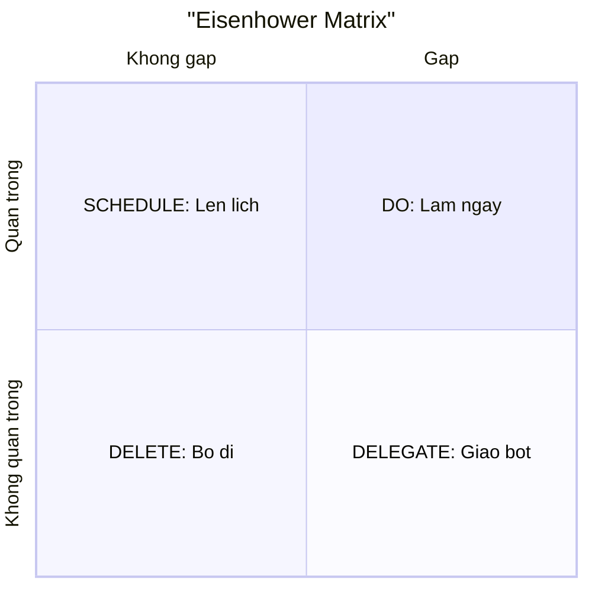

# Ưu tiên công việc — Eisenhower, 80/20, ăn con ếch

> **Tác giả:** Mr.Rom\
> **Phiên bản:** v1.0.0\
> **Tạo lúc:** 13/06/2026\
> **Cập nhật:** 13/06/2026\
> **Level:** Basic\
> **Tags:** career, soft-skills, time-management, prioritization, eisenhower, pareto, eat-the-frog, moscow, focus\
> **Yêu cầu trước:** [Quản lý thời gian cho dev](00_why-time-management-for-devs.md)

> 🎯 *Bài trước đã chỉ ra vì sao quản lý thời gian cho knowledge work khác hẳn — và rằng vấn đề lớn nhất không phải "thiếu giờ" mà là **làm sai việc**. Bài này trả lời câu hỏi kế tiếp: trong một backlog dài vô tận, **việc nào làm trước?** Bạn sẽ học bốn khung ưu tiên thực chiến (Eisenhower, Pareto 80/20, eat the frog, MoSCoW), cách phân biệt urgent với important để thoát bẫy "lúc nào cũng chữa cháy", cách chọn **đúng một ưu tiên số 1** mỗi ngày, và cách **nói "không"** để bảo vệ thời gian. Kết bài có template ưu tiên ngày để dùng ngay.*

## 🎯 Sau bài này bạn sẽ

- [ ] Phân biệt rõ **urgent (gấp)** và **important (quan trọng)** — và hiểu vì sao lẫn lộn hai thứ này là gốc của bẫy "lúc nào cũng chữa cháy"
- [ ] Dùng **Eisenhower matrix** để xếp mọi việc vào 4 ô (do / schedule / delegate / delete) và biết hành động đúng cho từng ô
- [ ] Áp dụng **Pareto 80/20** để tìm 20% việc tạo ra 80% giá trị, thay vì dàn đều sức cho mọi việc
- [ ] Dùng **eat the frog** — làm việc khó/quan trọng nhất ngay đầu ngày, trước khi pin ý chí cạn
- [ ] Dùng **MoSCoW** (Must / Should / Could / Won't) để cắt phạm vi một backlog/sprint khi không đủ thời gian làm hết
- [ ] Chọn **một ưu tiên số 1** mỗi ngày và **nói "không"** một cách chuyên nghiệp để bảo vệ nó

---

## Tình huống — backlog dài vô tận và một ngày trôi qua vô nghĩa

Hãy nhìn lại một ngày làm việc rất quen thuộc.

Sáng mở máy, bạn nhìn vào board: 23 task đang chờ. Một con bug vừa được report, ai đó @ bạn trong chat nhờ review PR, có email hỏi về tính năng cũ, ticket "refactor module thanh toán" nằm im đó cả hai tuần. Bạn bắt đầu từ thứ **nhảy vào mắt trước** — trả lời chat, vì nó đang chớp. Rồi review PR vì người ta đang chờ. Rồi sửa con bug nhỏ vì nó nhanh. Rồi lại một chat khác. Đến chiều, bạn đã đóng được bảy task — và thấy mình thật năng suất. Nhưng cái ticket refactor quan trọng nhất, thứ sẽ cứu bạn khỏi hàng chục bug tương lai, vẫn nằm im như sáng. Tuần sau cũng vậy. Tháng sau cũng vậy.

Vấn đề ở đây **không phải bạn lười** — bạn đóng bảy task cơ mà. Vấn đề là bạn để **độ gấp (urgency)** quyết định thứ tự làm việc, chứ không phải **độ quan trọng (importance)**. Cái gì chớp sáng, kêu to, có người đang chờ thì được làm trước; còn việc quan trọng-nhưng-không-ai-giục thì bị đẩy lùi mãi mãi. Đây là cái bẫy lớn nhất của một dev: **lúc nào cũng bận chữa cháy, nhưng nhà thì không bao giờ xây xong**.

Sự thật giải phóng là: bạn **không bao giờ làm hết** mọi việc trong backlog — backlog của một dev luôn dài hơn thời gian có. Cho nên kỹ năng quyết định không phải "làm nhanh hơn" mà là **chọn đúng việc để làm và đúng việc để bỏ**. Bài này cho bạn bốn khung tư duy để chọn — bắt đầu từ thứ phải gỡ trước: phân biệt gấp với quan trọng.

---

## 1️⃣ Urgent vs Important — gốc của mọi sự ưu tiên

Trước khi học bất kỳ khung nào, phải gỡ một nhầm lẫn nằm dưới mọi quyết định ưu tiên sai: lẫn lộn **urgent** với **important**. Hai từ này nghe gần giống nhau, nhưng chúng là **hai trục hoàn toàn khác**, và phần lớn người mới gộp làm một.

- **Urgent (gấp)** — việc đòi được làm **ngay**, có một deadline hoặc một người đang chờ ngay trước mặt. Nó **kêu to**: chat chớp, điện thoại reo, "alert" production. Gấp nói về **thời điểm**.
- **Important (quan trọng)** — việc đóng góp vào **mục tiêu dài hạn** của bạn (sự nghiệp, chất lượng hệ thống, sức khoẻ dự án). Nó thường **im lặng**: không ai giục bạn viết test, học một kỹ năng mới, hay refactor nợ kỹ thuật. Quan trọng nói về **giá trị**.

Mấu chốt là: **gấp và quan trọng không liên quan nhân quả gì với nhau.** Một việc có thể gấp mà không quan trọng (một chat hỏi chuyện vặt cần trả lời "ngay"), hoặc quan trọng mà không gấp (viết test, học sâu một concept). Não người có một thiên kiến mạnh — gọi là **mere-urgency effect** (hiệu ứng "cứ gấp là làm") — luôn ưu tiên thứ kêu to trước mặt, kể cả khi nó vô giá trị, vì cái gấp cho ta cảm giác "phải làm gì đó ngay".

🪞 **Ẩn dụ**: hãy tưởng tượng bạn là **lính cứu hỏa kiêm kiến trúc sư**. Việc **gấp** là những đám cháy nhỏ bùng lên khắp nơi — chuông reo inh ỏi, ai cũng hét bạn dập ngay. Việc **quan trọng** là *thiết kế một toà nhà không dễ cháy ngay từ đầu* — không ai hét bạn làm việc đó, nó im lặng, không có chuông. Nếu bạn cả ngày chỉ chạy dập từng đám cháy nhỏ (gấp), bạn sẽ kiệt sức mà toà nhà vẫn dễ cháy như cũ — ngày mai lại cháy tiếp. Người làm chủ thời gian là người **dành thời gian xây toà nhà chống cháy** (quan trọng) để ngày mai bớt cháy đi, chứ không phải người dập cháy nhanh nhất.

> [!IMPORTANT]
> Cái bẫy nguy hiểm nhất không phải việc "gấp + quan trọng" (đám cháy thật — ai cũng biết phải dập). Bẫy là việc **"gấp nhưng KHÔNG quan trọng"** — nó đội lốt việc quan trọng vì nó kêu to, nên ngốn hết ngày của bạn mà chẳng đẩy bạn tới đâu. Phần lớn chat, thông báo, "nhờ tí" rơi vào ô này. Học cách nhận ra và trì hoãn/từ chối ô này là một nửa của việc quản lý thời gian.

Hiểu được hai trục gấp–quan trọng rồi, ta có thể đặt chúng vuông góc nhau thành một lưới 2×2 — và đó chính là Eisenhower matrix ở section kế.

---

## 2️⃣ Eisenhower matrix — xếp mọi việc vào 4 ô

Nhầm lẫn urgent với important được gỡ sạch nhất bằng một công cụ hình ảnh: **Eisenhower matrix** (ma trận Eisenhower, đặt theo tên tổng thống Mỹ Dwight D. Eisenhower — người nổi tiếng câu "việc quan trọng hiếm khi gấp, việc gấp hiếm khi quan trọng").

Ý tưởng rất gọn: lấy hai trục **gấp** và **quan trọng** đặt vuông góc nhau, ta được **bốn ô**, mỗi ô có một **hành động mặc định** khác nhau. Thay vì hỏi "việc này có nên làm không", bạn hỏi "việc này nằm ô nào", và ô đó tự nói cho bạn phải làm gì.

Vì đây là một mô hình hai chiều, hình dung qua sơ đồ sẽ rõ hơn nhiều so với mô tả bằng lời. Sơ đồ dưới đặt **quan trọng** theo chiều dọc, **gấp** theo chiều ngang, và gắn hành động mặc định cho từng ô:



> 📖 *Đọc sơ đồ theo hai trục: ô **trên-phải** (gấp + quan trọng) là việc làm ngay; ô **trên-trái** (quan trọng nhưng chưa gấp) là nơi bạn nên dành phần lớn thời gian — và đây cũng là ô bị bỏ bê nhiều nhất. Hai ô dưới (không quan trọng) là nơi tiêu hao thời gian: việc dưới-phải tuy gấp nhưng không quan trọng nên giao bớt/cắt nhanh, việc dưới-trái thì bỏ thẳng.*

Bốn ô đó dịch ra hành động cụ thể cho dev như sau. Mỗi ô có một động từ mặc định và một loại việc điển hình:

| Ô | Gấp? | Quan trọng? | Hành động | Ví dụ với dev |
|---|---|---|---|---|
| **DO** (làm ngay) | ✅ | ✅ | Làm **ngay**, tự tay | Production đang down; bug chặn release hôm nay; deadline thật chiều nay |
| **SCHEDULE** (lên lịch) | ❌ | ✅ | **Đặt lịch** một khối thời gian để làm | Viết test cho module quan trọng; refactor nợ kỹ thuật; học kỹ năng cho dự án sắp tới |
| **DELEGATE** (giao bớt) | ✅ | ❌ | **Giao** cho người/công cụ phù hợp hơn, hoặc làm cực nhanh | Một số chat hỏi mà người khác trả lời được; câu hỏi tra doc được; việc lặp lại tự động hoá được |
| **DELETE** (bỏ đi) | ❌ | ❌ | **Bỏ thẳng**, không làm | Họp không liên quan; tinh chỉnh một thứ không ai dùng; "việc bận rộn" tự tạo |

🪞 **Ẩn dụ**: bốn ô giống **bốn cái khay phân loại thư**. Khay DO = "mở ngay", khay SCHEDULE = "để vào lịch hẹn xử lý", khay DELEGATE = "chuyển cho đúng người", khay DELETE = "vứt sọt rác". Sai lầm của người mới là **ném mọi lá thư vào khay DO** vì lá nào cũng "trông cần làm" — kết quả là khay DO tràn, còn việc quan trọng thật (khay SCHEDULE) chẳng bao giờ được mở vì luôn có việc "gấp hơn" chen lên.

> [!TIP]
> Ô **SCHEDULE (quan trọng nhưng chưa gấp)** là ô quyết định sự nghiệp của bạn về lâu dài — nhưng nó im lặng nên dễ bị nuốt. Mẹo cứu nó: **đặt một khối lịch thật** (calendar event) cho việc ở ô này, đối xử với nó nghiêm như một cuộc họp. Nếu không "đóng đinh" thời gian cho việc quan trọng-chưa-gấp, nó sẽ vĩnh viễn thua việc gấp. (Chi tiết cách dựng và bảo vệ khối này ở [bài tiếp về deep work & time blocking](02_deep-work-and-time-blocking.md).)

### Cách dùng matrix trong 60 giây mỗi sáng

Eisenhower matrix không phải thứ vẽ ra rồi treo tường ngắm — nó là một **bộ lọc nhanh** chạy trong đầu mỗi sáng. Quy trình ba bước:

1. **Liệt kê** mọi việc đang đòi sự chú ý hôm nay (lấy từ board, chat, email, đầu bạn).
2. **Gắn mỗi việc một ô** bằng đúng hai câu hỏi: *"Có hậu quả thật nếu không làm hôm nay không?"* (→ gấp) và *"Việc này có đẩy mục tiêu lớn của mình tiến lên không?"* (→ quan trọng).
3. **Hành động theo ô**: DO trước, SCHEDULE đặt vào lịch, DELEGATE chuyển đi, DELETE gạch khỏi danh sách.

→ Phần lớn người làm bước 1 và 3 nhưng bỏ bước 2 — họ liệt kê rồi lao vào làm theo thứ tự "cái nào kêu to nhất". Chính bước 2 (gắn ô một cách trung thực) là nơi matrix tạo ra giá trị: nó ép bạn gọi tên việc nào thật sự quan trọng, việc nào chỉ đang giả vờ gấp.

---

## 3️⃣ Pareto 80/20 — không phải việc nào cũng đáng làm như nhau

Eisenhower giúp bạn xếp việc vào ô. Nhưng ngay trong ô "đáng làm", vẫn còn một sự thật khó chịu: **không phải việc nào cũng tạo ra giá trị ngang nhau**. Đây là lúc **nguyên lý Pareto** (Pareto principle), quen gọi là **quy tắc 80/20**, vào cuộc.

Nguyên lý này — đặt theo tên nhà kinh tế Vilfredo Pareto — nói rằng trong rất nhiều việc, **một thiểu số nguyên nhân tạo ra đa số kết quả**. Công thức dễ nhớ: khoảng **20% việc tạo ra khoảng 80% giá trị** (con số 80/20 chỉ là ước lệ, không phải luật toán học chính xác — có khi là 90/10, có khi 70/30, ý là "phân bố rất lệch").

Với một dev, sự lệch này xuất hiện ở khắp nơi:

- Khoảng 20% tính năng được 80% người dùng dùng tới — phần còn lại gần như không ai chạm.
- Một số ít con bug gây ra phần lớn các báo lỗi và sự cố.
- Một vài quyết định kiến trúc đầu dự án định đoạt phần lớn việc bảo trì về sau.
- Một số ít kỹ năng cốt lõi mang lại phần lớn năng lực thật của bạn; vô số thứ "hay ho" khác đóng góp rất ít.

🪞 **Ẩn dụ**: hãy nghĩ về một **cái vườn**. Nếu bạn tưới đều mọi cây như nhau, công sức bị dàn mỏng và cả vườn èo uột. Pareto nói: vài cây trong vườn cho phần lớn quả (cây ăn quả chính), còn lại là cỏ và cây cảnh ít giá trị. Người làm vườn khôn không tưới đều — họ **đổ phần lớn nước và phân vào vài cây cho quả nhiều nhất**, và mạnh dạn nhổ bớt cỏ. Dàn đều = thua; tập trung vào số ít quan trọng nhất = thắng.

Sai lầm ngược lại với Pareto là **chủ nghĩa hoàn hảo dàn đều** — chăm chút mọi việc tới mức như nhau, kể cả việc gần như không ai để ý. Bảng dưới đối chiếu cách nghĩ "dàn đều" với cách nghĩ "Pareto" cho vài tình huống dev quen thuộc:

| Tình huống | ❌ Dàn đều mọi việc | ✅ Tư duy 80/20 |
|---|---|---|
| Một sprint dài quá sức | Cố làm hết, mỗi thứ một ít, không xong gì tới nơi | Tìm vài task tạo phần lớn giá trị cho người dùng, làm xong hẳn trước |
| Tối ưu hiệu năng | Vi chỉnh mọi hàm cho "đẹp" | Đo (profile) tìm vài chỗ nghẽn chính, chỉ tối ưu chúng |
| Học công nghệ mới | Đọc hết mọi trang doc cho "chắc" | Học 20% khái niệm cốt lõi đủ làm 80% việc thực tế, học sâu phần còn lại khi cần |
| Viết test | Cố phủ 100% mọi dòng | Phủ trước phần logic quan trọng nhất, dễ sai nhất |

→ Điểm cốt lõi của Pareto **không phải "làm ít đi"** mà là **"chọn đúng cái để dồn sức"**. Câu hỏi vàng để hỏi trước mỗi danh sách việc: *"Nếu mình chỉ được làm 20% danh sách này, mình chọn cái nào để vẫn ra được phần lớn giá trị?"* — câu hỏi đó tự động kéo những việc đáng giá nhất lên đầu.

---

## 4️⃣ Eat the frog — ăn con ếch xấu xí nhất trước

Eisenhower xếp việc vào ô, Pareto chỉ ra việc nào đáng giá nhất. Giờ tới câu hỏi **thứ tự trong ngày**: trong những việc quan trọng, **làm cái nào trước?** Câu trả lời của khung **eat the frog** rất phản trực giác nhưng cực mạnh: **làm việc khó/quan trọng/ngại nhất ngay đầu ngày**.

Tên gọi đến từ một câu thường gán cho Mark Twain: *"Nếu việc đầu tiên mỗi sáng của bạn là ăn một con ếch sống, thì phần còn lại của ngày sẽ trôi qua dễ dàng vì điều tệ nhất đã xong."* "Con ếch" ở đây là **việc quan trọng nhất mà bạn ngại nhất** — thường là việc ở ô SCHEDULE của Eisenhower (quan trọng, chưa gấp), thứ rất dễ bị trì hoãn cả tháng.

Vì sao làm việc khó nhất *trước* lại hiệu quả tới vậy? Hai lý do gắn chặt với cách bộ não hoạt động:

- **Ý chí (willpower) là pin cạn dần trong ngày.** Buổi sáng pin đầy, đầu óc sắc, ít việc gấp chen ngang. Để việc khó tới chiều — lúc pin đã cạn vì hàng chục quyết định nhỏ và đám cháy vặt — bạn gần như chắc chắn sẽ né nó sang "mai làm". Làm "con ếch" lúc pin đầy là tận dụng đúng tài nguyên quý nhất vào đúng lúc.
- **Việc khó càng để lâu càng phình to trong đầu.** Một task ngại cứ nằm trong danh sách sẽ ngốn năng lượng tinh thần dù bạn chưa đụng tới — nó lởn vởn, gây căng thẳng nền. Làm nó xong sớm giải phóng cả ngày khỏi gánh nặng đó; phần còn lại của ngày nhẹ tênh vì "con ếch đã được ăn".

🪞 **Ẩn dụ**: con ếch giống một **hoá đơn lớn phải trả**. Nếu trả nó ngay đầu tháng (lúc còn tiền, còn tỉnh táo), phần còn lại của tháng bạn sống thanh thản. Nếu cứ khất ("để cuối tháng"), nó lởn vởn ám ảnh cả tháng, và tới cuối tháng — lúc tiền đã vơi, mệt đã chồng — trả nó còn đau gấp đôi. Ai cũng có "hoá đơn" việc-khó-quan-trọng; người làm chủ thời gian trả nó trước, không khất.

Cách áp dụng eat the frog cho một ngày dev, theo từng bước:

1. **Tối hôm trước, chọn "con ếch" cho ngày mai** — đúng **một** việc quan trọng nhất, thường là việc bạn ngại nhất. (Chọn từ tối để sáng không tốn ý chí quyết định.)
2. **Sáng vào việc, làm con ếch TRƯỚC** — trước khi mở chat, trước khi đọc email, trước khi đụng vào bất cứ việc gấp-nhưng-vặt nào.
3. **Bảo vệ khối đầu ngày** cho con ếch — tắt thông báo, để chat ở chế độ không quấy rầy trong quãng này.
4. **Ăn xong ếch mới mở cửa cho việc gấp** — sau khi việc quan trọng nhất đã xong, phần còn lại của ngày dành cho chat, review, việc vặt mà không còn cảm giác tội lỗi.

> [!WARNING]
> Đừng biến eat the frog thành "mỗi sáng ăn cả một rổ ếch". Chọn **đúng một** con ếch — việc quan trọng nhất — không phải dồn tất cả việc khó vào buổi sáng. Cố làm năm việc khó liền nhau từ sáng sẽ kiệt sức trước trưa, rồi cả chiều bỏ bê. Một con ếch mỗi ngày, làm xong gọn, bền hơn nhiều so với cố ngốn cả rổ rồi bội thực.

Khung này nối thẳng với ý "một ưu tiên số 1 mỗi ngày" ở section kế — con ếch của hôm nay **chính là** ưu tiên số 1 của hôm nay.

---

## 5️⃣ Chọn một ưu tiên số 1 mỗi ngày

Bốn khung trên đều dẫn về cùng một hành động đơn giản tới mức dễ bị xem nhẹ: mỗi ngày, **chọn ra đúng một việc quan trọng nhất** — gọi là **MIT (Most Important Task)** — và cam kết làm xong nó, dù mọi việc khác có ra sao.

Vì sao **một**, không phải ba hay năm? Vì một danh sách "ưu tiên" có năm mục **không phải là ưu tiên** — nó chỉ là một cái to-do list đội lốt. Bản chất của ưu tiên là **xếp hạng**: phải có một thứ đứng nhất. Khi mọi thứ đều "ưu tiên cao", không gì thật sự được ưu tiên, và bạn lại quay về làm theo "cái nào kêu to nhất".

🪞 **Ẩn dụ**: chọn MIT giống chọn **ngôi sao Bắc Đẩu để định hướng** cho cả ngày. Bạn không cần ngắm nó từng phút, nhưng bất cứ khi nào lạc lối (bị chat kéo đi, bị việc vặt cuốn vào), bạn ngước lên nhìn nó và biết hướng phải về. Nếu trời có năm "ngôi sao chính" sáng ngang nhau, bạn chẳng định hướng được gì — đó là lý do chỉ chọn **một**.

MIT có quan hệ trực tiếp với cả ba khung trước, nên dễ chọn:

- Từ **Eisenhower**: MIT thường nằm ở ô **SCHEDULE** (quan trọng, chưa gấp) hoặc **DO** (quan trọng + gấp) — không bao giờ là việc ô DELEGATE/DELETE.
- Từ **Pareto**: MIT là việc thuộc nhóm 20% tạo ra phần lớn giá trị.
- Từ **eat the frog**: MIT chính là "con ếch" — làm nó trước nhất trong ngày.

> [!TIP]
> Quy tắc thực tế "1–3–5" nếu một MIT thấy quá ít: mỗi ngày cam kết **1 việc lớn (MIT)**, **3 việc vừa**, **5 việc nhỏ**. Nhưng thứ tự là tuyệt đối — MIT làm trước, và nếu chỉ làm được mỗi MIT thì ngày đó vẫn là một ngày thành công. Ba việc vừa và năm việc nhỏ là phần thưởng thêm, không phải nghĩa vụ ngang hàng với MIT.

Một MIT tốt phải **cụ thể và làm xong được trong ngày**. So sánh:

| ❌ MIT mơ hồ | ✅ MIT cụ thể |
|---|---|
| "Làm xong tính năng thanh toán" (quá to, nhiều ngày) | "Viết và test xong hàm xử lý thanh toán thất bại" |
| "Cải thiện hiệu năng" | "Profile trang chủ và sửa 1 query chậm nhất" |
| "Học Kubernetes" | "Tự deploy được 1 Pod chạy app demo lên minikube" |

→ MIT mơ hồ thì cuối ngày không biết mình có hoàn thành không, dễ rơi vào cảm giác "làm hoài không xong". MIT cụ thể có một vạch đích rõ — bạn biết chính xác lúc nào nó **xong**, và cảm giác hoàn thành đó nuôi động lực cho ngày mai.

---

## 6️⃣ MoSCoW — cắt phạm vi khi không đủ thời gian làm hết

Bốn khung trên giúp bạn xếp việc cá nhân trong ngày. Nhưng có một tình huống khác cần một công cụ riêng: khi đối mặt với **một backlog hoặc một sprint quá lớn so với thời gian** — bạn không thể làm hết, phải **cắt phạm vi (scope)** và quyết rõ cái gì làm, cái gì khoan, cái gì dứt khoát không làm. Đây là lúc dùng **MoSCoW**.

MoSCoW chia mọi yêu cầu/task thành **bốn nhóm ưu tiên** (chữ "o" chỉ để đọc cho xuôi miệng, không có nghĩa):

- **Must (bắt buộc)** — không có nó thì sản phẩm/bản giao **coi như thất bại**. Đây là phần xương sống không được cắt.
- **Should (nên có)** — quan trọng, đáng làm, nhưng nếu thiếu thì sản phẩm **vẫn dùng được** (chỉ kém hoàn thiện). Làm sau Must, nếu còn thời gian.
- **Could (có thì tốt)** — thứ "nice-to-have", làm nếu dư thời gian; cắt đầu tiên khi thiếu giờ mà không đau.
- **Won't (lần này không làm)** — đã bàn và **cố ý quyết định không làm** trong đợt này (có thể để đợt sau). Việc ghi rõ "Won't" cũng quan trọng như ghi "Must" — nó chặn phạm vi phình ra (scope creep).

🪞 **Ẩn dụ**: MoSCoW giống **xếp đồ vào vali trước chuyến đi mà vali có hạn**. **Must** = hộ chiếu, ví, thuốc cần thiết — thiếu là chuyến đi hỏng. **Should** = vài bộ đồ đủ mặc — nên có, thiếu thì xoay xở được. **Could** = máy ảnh xịn, sách đọc giải trí — vui nếu nhét vừa, bỏ lại cũng chẳng sao. **Won't** = nguyên tủ quần áo bạn đã quyết để ở nhà — quyết định bỏ lại có chủ đích. Người gói vali giỏi quyết "Must vs Won't" **trước**, không phải nhồi đại rồi đóng không lại.

Bảng dưới minh hoạ MoSCoW cho một ví dụ quen thuộc: làm tính năng **đăng nhập** cho một sản phẩm web, khi sprint không đủ chỗ cho mọi thứ:

| Yêu cầu | Nhóm | Lý do |
|---|---|---|
| Đăng nhập bằng email + mật khẩu | **Must** | Không có thì tính năng vô nghĩa |
| Hash mật khẩu an toàn | **Must** | Thiếu là lỗ hổng bảo mật nghiêm trọng |
| Nhớ đăng nhập ("remember me") | **Should** | Tiện cho user nhưng thiếu vẫn dùng được |
| Đăng nhập bằng Google (OAuth) | **Could** | Hay, nhưng email/mật khẩu đã đủ chạy được |
| Đăng nhập bằng vân tay | **Won't** | Quyết để đợt sau — ngoài phạm vi lần này |

→ Sức mạnh của MoSCoW nằm ở hai nhóm hay bị bỏ quên: **Must** ép cả nhóm thống nhất "tối thiểu phải có gì để không thất bại", còn **Won't** ép mọi người **nói ra rõ ràng** cái sẽ không làm — chặn kiểu "tiện tay làm thêm" khiến sprint phình ra và không bao giờ xong. Khi thời gian eo hẹp, bạn cắt từ dưới lên: bỏ Could trước, rồi mới động tới Should; Must là lằn ranh không lùi.

> [!NOTE]
> MoSCoW khác bốn khung trước ở **góc nhìn**: Eisenhower/Pareto/eat-the-frog/MIT là công cụ ưu tiên **cá nhân theo ngày**; MoSCoW là công cụ cắt phạm vi cho **một đợt giao việc / sản phẩm** (thường dùng khi lập kế hoạch sprint, planning cùng team hoặc với chính mình cho một dự án cá nhân). Hai loại bổ trợ nhau: MoSCoW quyết "đợt này làm những gì", còn Eisenhower/MIT quyết "hôm nay trong số đó làm cái nào trước".

---

## 7️⃣ Nói "không" & bảo vệ thời gian

Bốn khung ưu tiên đều có một điểm yếu chung: chúng chỉ ra việc gì quan trọng, nhưng **không tự bảo vệ thời gian** cho việc đó. Mỗi lần bạn nhận thêm một "nhờ tí", một họp không cần thiết, một task ngoài lề, bạn đang **rút thời gian khỏi ưu tiên số 1** — kể cả khi đã chọn MIT đúng. Vì thế kỹ năng cuối, và khó nhất về mặt cảm xúc, là **nói "không"**.

Sự thật phải chấp nhận trước: **mỗi lần nói "có" với một việc là một lần nói "không" với việc khác** — kể cả khi bạn không ý thức được. Thời gian là tài nguyên có tổng cố định; nhận thêm việc A nghĩa là A đang lấy chỗ của ưu tiên B nào đó. Người không bao giờ nói "không" không phải người tử tế hơn — họ chỉ đang để **người khác chọn ưu tiên thay cho mình**.

🪞 **Ẩn dụ**: thời gian của bạn giống **một cái ly đã gần đầy nước**. Mỗi yêu cầu mới là thêm một thìa nước. Nói "có" với mọi thìa thì ly tràn — và thứ tràn ra trước thường chính là việc quan trọng-chưa-gấp (vì nó không kêu cứu). Nói "không" không phải ích kỷ; nó là việc **giữ chỗ trong ly cho thứ bạn đã quyết là quan trọng nhất**. Một cái ly tràn chẳng giúp được ai.

Nói "không" hiệu quả không phải là cộc cằn — nó là một kỹ năng giao tiếp có thể học. Vài cách "không" chuyên nghiệp cho dev:

| Tình huống | ❌ Cách phản xạ (hại) | ✅ Cách "không" chuyên nghiệp |
|---|---|---|
| Bị nhờ một task ngoài lề khi đang dở MIT | "Ừ để tớ làm luôn" (bỏ dở việc quan trọng) | "Mình đang ưu tiên X cho hôm nay. Việc này có thể đợi tới chiều / mai được không?" |
| Bị kéo vào họp không liên quan | Im lặng tham gia, mất một buổi | "Mình không nghĩ mình cần thiết trong họp này — bạn tóm tắt quyết định cho mình sau nhé?" |
| Bị hỏi một câu mà người khác tự tra được | Dừng việc, trả lời ngay | "Cái này trong doc ở [link] nhé, mình đang giữa khối tập trung, có gì gấp thì nhắn lại." |
| Bị thêm việc vào sprint đã đầy | Nhận hết, rồi vỡ deadline | "Sprint đang full Must rồi. Nếu thêm cái này thì mình cần bỏ bớt cái gì — bạn muốn đổi cái nào ra?" |

→ Để ý mẫu chung của cột bên phải: **không từ chối con người, chỉ từ chối việc lúc này** — luôn kèm một lý do (ưu tiên hiện tại) và thường mở một lối khác (đợi được không / ai hợp hơn / đổi cái gì ra). "Không" kiểu này vừa bảo vệ ưu tiên của bạn vừa giữ được quan hệ — nó không phải là bức tường, mà là một cánh cửa có điều kiện.

> [!IMPORTANT]
> Nói "không" hiệu quả nhất khi bạn có một "có" rõ ràng để bảo vệ. "Mình bận" nghe yếu và dễ bị ép; "Mình đang ưu tiên việc X hôm nay" nghe vững vì nó cho thấy bạn **đã chọn có chủ đích**, không phải đang lười. Đây là lý do chọn MIT (§5) và nói "không" là một cặp: MIT cho bạn cái để bảo vệ, "không" là hàng rào bảo vệ nó.

---

## 8️⃣ Template ưu tiên ngày — ghép tất cả lại

Giờ ghép bảy phần — urgent/important, Eisenhower, Pareto, eat the frog, MIT, MoSCoW, nói "không" — thành một **template chạy được mỗi ngày**. Đây là một khung **mẫu để bạn sửa**, không phải luật; điều cần giữ là **trình tự tư duy** đằng sau nó.

Template gồm hai phần: một nghi thức ngắn **đầu ngày** (chọn ưu tiên) và một nghi thức ngắn **cuối ngày** (nhìn lại + chuẩn bị "con ếch" cho mai). Bạn có thể chép thẳng mẫu dưới vào file ghi chú hằng ngày:

```text
═══════════════════════════════════════════════
  ƯU TIÊN NGÀY — [ngày/tháng]
═══════════════════════════════════════════════

🐸 CON ẾCH HÔM NAY (MIT — đúng 1 việc, làm TRƯỚC NHẤT):
   - [ ] ______________________________________
         (cụ thể, làm xong được trong ngày, có vạch đích rõ)

📊 PHÂN LOẠI EISENHOWER (xếp việc còn lại):
   DO       (gấp + quan trọng — làm ngay):
     - [ ] ______________________________
   SCHEDULE (quan trọng, chưa gấp — đặt lịch):
     - [ ] ______________________________
   DELEGATE (gấp, không quan trọng — giao/làm nhanh):
     - [ ] ______________________________
   DELETE   (không gấp, không quan trọng — gạch bỏ):
     - [ ] ______________________________  (gạch đi!)

🎯 1–3–5 (nếu cần thêm cấu trúc):
   1 lớn  : (chính là con ếch ở trên)
   3 vừa  : ___ / ___ / ___
   5 nhỏ  : ___ / ___ / ___ / ___ / ___

🛡️ GIỜ BẢO VỆ (khối tập trung cho con ếch, tắt thông báo):
   Từ ____ đến ____

═══════════════════════════════════════════════
  CUỐI NGÀY — nhìn lại (vài phút)
═══════════════════════════════════════════════
   - Con ếch hôm nay đã ăn xong chưa?  [ ] Rồi  [ ] Chưa → vì sao?
   - Hôm nay mình tạo ra được gì có giá trị (không tính việc vặt)?
   - 🐸 Con ếch cho NGÀY MAI là: ______________________
```

→ Để ý template thể hiện đúng các nguyên tắc đã học, không nhồi cho dài:

- **Con ếch / MIT đứng đầu và làm trước nhất** (§4, §5) — đặt ở trên cùng vì nó là thứ duy nhất *bắt buộc* xong.
- **Phân loại Eisenhower** (§2) — ép bạn gắn ô cho từng việc, đặc biệt mạnh dạn dùng ô DELETE để **gạch bỏ** việc vô giá trị thay vì cố làm.
- **Giờ bảo vệ** (gắn với §7 nói "không") — đóng đinh một khối thời gian cho con ếch để nó không bị việc gấp xén; cách dựng và giữ khối này là nội dung [bài tiếp theo](02_deep-work-and-time-blocking.md).
- **Nhìn lại cuối ngày bằng output** — hỏi "tạo ra được gì có giá trị" thay vì "ngồi đủ giờ chưa", và chọn sẵn con ếch cho mai để sáng không tốn ý chí.

Còn một ví dụ áp dụng template lên một backlog dev thật để thấy nó vận hành ra sao.

### Ví dụ — áp dụng lên một backlog dev buổi sáng

Giả sử sáng nay board của bạn có sáu việc đang đòi chú ý. Đầu tiên liệt kê thô, rồi chạy qua các khung. Đây là backlog thô:

```text
1. Production API trả 500 cho 1 endpoint (vừa có alert)
2. Refactor module thanh toán (nợ kỹ thuật, để 2 tuần)
3. Review PR của đồng nghiệp (đang chờ)
4. Trả lời 4 chat hỏi linh tinh
5. Tinh chỉnh màu một nút bấm không ai phàn nàn
6. Họp "đồng bộ" mà bạn không có phần đóng góp
```

Chạy backlog này qua các khung, ta được kết quả phân loại sau. Cột cuối là hành động dứt khoát:

| # | Việc | Eisenhower | Hành động |
|---|---|---|---|
| 1 | Production trả 500 | DO (gấp + quan trọng) | Làm **ngay** đầu tiên — đây là đám cháy thật |
| 2 | Refactor thanh toán | SCHEDULE (quan trọng, chưa gấp) | **MIT/con ếch** — đặt khối bảo vệ làm sau khi dập cháy |
| 3 | Review PR | DO/DELEGATE (gấp, quan trọng vừa) | Làm trong khối liên lạc, không xé khối con ếch |
| 4 | 4 chat linh tinh | DELEGATE (gấp, không quan trọng) | Gom lại trả lời 1 lần; cái nào người khác đáp được thì chuyển |
| 5 | Tinh chỉnh màu nút | DELETE (không gấp, không quan trọng) | **Gạch bỏ** — không ai cần, đừng tốn phút nào |
| 6 | Họp không đóng góp | DELETE (không quan trọng) | **Nói "không"** lịch sự — xin tóm tắt quyết định sau |

→ So với cách "làm theo cái nào kêu to nhất" ở đầu bài, ngày này khác hẳn: việc số 1 (cháy thật) được dập trước, nhưng ngay sau đó là **con ếch số 2** (refactor — thứ trước đây bị đẩy lùi hai tuần) được bảo vệ một khối để làm xong, **trước** khi chat (số 4) và họp vô nghĩa (số 6) kịp nuốt mất ngày. Hai việc vô giá trị (số 5, 6) bị gạch/từ chối thẳng tay. Cùng một backlog, nhưng ưu tiên đúng biến một ngày "bận mà vô nghĩa" thành một ngày thật sự đẩy mọi thứ tiến lên.

---

## 💡 Cạm bẫy thường gặp & Best practice

### ❌ Cạm bẫy: lúc nào cũng chữa cháy (lẫn urgent với important)

- **Triệu chứng**: ngày nào cũng bận rộn, đóng nhiều task, nhưng việc quan trọng nhất (refactor, viết test, học kỹ năng) tuần này qua tuần khác vẫn nằm im; cuối tháng nhìn lại thấy mình giậm chân tại chỗ dù rất bận.
- **Nguyên nhân**: để **độ gấp** quyết định thứ tự làm việc thay vì **độ quan trọng** (mere-urgency effect) — cái gì kêu to, chớp sáng, có người chờ thì được làm trước; việc quan trọng-nhưng-im-lặng luôn thua việc gấp-nhưng-vặt.
- **Cách tránh**: với mỗi việc, hỏi tách bạch *"có hậu quả thật nếu không làm hôm nay không?"* (gấp) và *"việc này đẩy mục tiêu lớn của mình lên không?"* (quan trọng); xếp vào Eisenhower; **đặt khối lịch thật** cho ô SCHEDULE (quan trọng-chưa-gấp) để nó không bị việc gấp nuốt; làm "con ếch" (việc quan trọng nhất) trước nhất trong ngày.

### ❌ Cạm bẫy: danh sách "ưu tiên" có quá nhiều mục ngang hàng

- **Triệu chứng**: to-do list mỗi ngày 15-20 mục, tất cả đều dán nhãn "quan trọng/ưu tiên cao"; cuối ngày mệt, đóng được vài mục dễ, mục khó nhất vẫn còn; cảm giác "làm hoài không xong".
- **Nguyên nhân**: nhầm "liệt kê việc" với "ưu tiên việc". Khi mọi thứ đều ưu tiên cao thì không gì thật sự được ưu tiên, và bạn quay về làm theo "cái nào dễ/kêu to nhất".
- **Cách tránh**: ưu tiên là **xếp hạng** — chọn **đúng một MIT** mỗi ngày (cùng lắm dùng quy tắc 1–3–5 với thứ tự tuyệt đối); dùng Pareto hỏi *"nếu chỉ được làm 20% danh sách này, mình chọn cái nào?"*; mạnh dạn dùng ô DELETE để gạch bỏ việc vô giá trị thay vì cố nhét tất cả vào danh sách.

### ✅ Best practice: ăn con ếch trước, đo ngày bằng MIT

- **Vì sao**: ý chí là pin cạn dần trong ngày — làm việc khó nhất lúc pin còn đầy (buổi sáng, trước khi việc gấp chen vào) tận dụng đúng tài nguyên quý nhất; làm xong sớm cũng giải phóng cả ngày khỏi gánh nặng "việc khó còn treo đó".
- **Cách áp dụng**: tối hôm trước chọn sẵn con ếch (MIT) cho mai; sáng làm nó **trước** khi mở chat/email; bảo vệ một khối tập trung cho nó; coi ngày là thành công nếu con ếch xong, kể cả khi việc vặt còn dở.

### ✅ Best practice: nói "không" có một "có" để bảo vệ

- **Vì sao**: mỗi "có" với việc mới là một "không" ngầm với ưu tiên đang dở; người không bao giờ từ chối đang để người khác chọn ưu tiên thay mình. "Không" vững nhất khi nó bảo vệ một "có" rõ ràng.
- **Cách áp dụng**: từ chối **việc lúc này**, không phải con người — luôn kèm lý do (ưu tiên hôm nay là X) và mở một lối khác (đợi được không / ai hợp hơn / đổi cái gì ra khỏi sprint). Với sprint quá tải, dùng MoSCoW để cắt phạm vi: giữ Must, hi sinh Could trước, ghi rõ Won't.

---

## 🧠 Tự kiểm tra (Self-check)

**Q1.** Phân biệt "urgent" và "important". Vì sao lẫn lộn hai thứ này là gốc của bẫy "lúc nào cũng chữa cháy"?

<details>
<summary>💡 Xem giải thích</summary>

**Urgent (gấp)** nói về **thời điểm** — việc đòi làm ngay, có deadline hoặc người đang chờ; nó *kêu to* (chat chớp, alert). **Important (quan trọng)** nói về **giá trị** — việc đóng góp vào mục tiêu dài hạn; nó thường *im lặng* (viết test, học kỹ năng, refactor). Hai trục này độc lập: một việc có thể gấp mà không quan trọng, hoặc quan trọng mà không gấp. Lẫn lộn chúng dẫn tới chữa cháy mãi vì não có thiên kiến **mere-urgency effect** (cứ gấp là làm) — luôn ưu tiên thứ kêu to trước mặt, kể cả khi vô giá trị. Hệ quả: cả ngày dập đám cháy nhỏ (gấp-nhưng-vặt), còn việc quan trọng-im-lặng (xây hệ thống không dễ cháy) thì không bao giờ được làm — nên ngày mai lại cháy tiếp. Bẫy nguy hiểm nhất là ô "gấp nhưng KHÔNG quan trọng" vì nó đội lốt việc quan trọng nhờ kêu to.

</details>

**Q2.** Một con bug nhỏ ở tính năng gần như không ai dùng vừa được report, kèm chat "sửa giúp gấp nha". Cùng lúc, ticket refactor module thanh toán (nợ kỹ thuật) đã treo hai tuần. Xếp hai việc này vào ô Eisenhower nào, và xử lý ra sao?

<details>
<summary>💡 Xem giải thích</summary>

- **Bug ở tính năng gần như không ai dùng + "sửa gấp"**: gấp (có người giục) nhưng **không thật sự quan trọng** (tính năng gần như không ai dùng) → ô **DELEGATE** (hoặc thậm chí gần DELETE). Xử lý: không bỏ dở việc quan trọng để lao vào; gom vào khối liên lạc, hỏi lại mức độ thật, giao cho người hợp hơn hoặc làm nhanh sau — đừng để chữ "gấp" của người khác chiếm khối tập trung.
- **Refactor module thanh toán (treo 2 tuần)**: quan trọng (giảm bug tương lai cho phần cốt lõi) nhưng chưa gấp → ô **SCHEDULE**. Xử lý: đây chính là ứng viên **MIT/con ếch** — đặt một khối lịch thật và bảo vệ nó, làm trước khi việc gấp-nhưng-vặt kịp nuốt ngày.

Bài học: chữ "gấp" trong chat của người khác không tự động biến việc thành quan trọng. Việc quan trọng-chưa-gấp phải được *chủ động đặt lịch* mới sống được.

</details>

**Q3.** Nguyên lý Pareto 80/20 nói gì? Cho một ví dụ trong công việc dev và nêu câu hỏi vàng rút ra từ nó.

<details>
<summary>💡 Xem giải thích</summary>

Pareto (80/20) nói **một thiểu số nguyên nhân tạo ra đa số kết quả** — khoảng 20% việc tạo ra khoảng 80% giá trị (con số chỉ là ước lệ, ý là phân bố rất lệch). Ví dụ dev: ~20% tính năng được 80% user dùng; một số ít bug gây phần lớn sự cố; một vài query chậm gây phần lớn vấn đề hiệu năng; một số ít kỹ năng cốt lõi mang lại phần lớn năng lực. Sai lầm ngược lại là "dàn đều" — chăm chút mọi việc như nhau, kể cả việc gần như vô giá trị. **Câu hỏi vàng**: *"Nếu mình chỉ được làm 20% danh sách này, mình chọn cái nào để vẫn ra được phần lớn giá trị?"* — câu hỏi đó tự động kéo việc đáng giá nhất lên đầu. Cốt lõi của Pareto không phải "làm ít đi" mà "chọn đúng cái để dồn sức".

</details>

**Q4.** "Eat the frog" là gì? Nêu hai lý do (gắn với cách bộ não hoạt động) vì sao làm việc khó nhất *trước* lại hiệu quả.

<details>
<summary>💡 Xem giải thích</summary>

**Eat the frog** = làm **việc khó/quan trọng/ngại nhất ngay đầu ngày** ("con ếch" = việc quan trọng nhất mà bạn ngại nhất, thường là việc ô SCHEDULE dễ bị trì hoãn). Hai lý do: (1) **Ý chí là pin cạn dần trong ngày** — sáng pin đầy, đầu óc sắc, ít việc gấp chen ngang; để việc khó tới chiều lúc pin đã cạn thì gần như chắc chắn né sang "mai làm". (2) **Việc khó để lâu càng phình to trong đầu** — một task ngại nằm trong danh sách ngốn năng lượng tinh thần dù chưa đụng tới (căng thẳng nền); làm xong sớm giải phóng cả ngày khỏi gánh nặng đó. Lưu ý: chọn **đúng một** con ếch, không dồn cả rổ việc khó vào buổi sáng kẻo kiệt sức trước trưa.

</details>

**Q5.** Vì sao nên chọn **một** MIT mỗi ngày thay vì một danh sách năm "ưu tiên cao"? Một MIT tốt phải có đặc điểm gì?

<details>
<summary>💡 Xem giải thích</summary>

Vì bản chất của ưu tiên là **xếp hạng** — phải có một thứ đứng nhất. Một danh sách năm "ưu tiên cao" không phải ưu tiên mà là to-do list đội lốt: khi mọi thứ đều ưu tiên cao thì không gì thật sự được ưu tiên, và bạn quay về làm theo "cái nào kêu to/dễ nhất". Một MIT là ngôi sao Bắc Đẩu định hướng cả ngày — bất cứ khi nào bị kéo đi, ngước lên nó để biết hướng về. (Có thể dùng 1–3–5 nếu cần thêm cấu trúc, nhưng thứ tự tuyệt đối: MIT trước, và làm xong mỗi MIT thì ngày vẫn thành công.) Một MIT tốt phải **cụ thể và làm xong được trong ngày, có vạch đích rõ** — ví dụ "viết và test xong hàm xử lý thanh toán thất bại" thay vì "làm xong tính năng thanh toán" (quá to, mơ hồ, cuối ngày không biết có xong không).

</details>

**Q6.** Một sprint có nhiều việc hơn thời gian cho phép. Dùng MoSCoW để xử lý thế nào, và vì sao nhóm "Won't" lại quan trọng?

<details>
<summary>💡 Xem giải thích</summary>

Chia mọi yêu cầu thành bốn nhóm: **Must** (thiếu là bản giao coi như thất bại — xương sống, không cắt), **Should** (quan trọng nhưng thiếu vẫn dùng được — làm sau Must nếu còn giờ), **Could** (nice-to-have — cắt đầu tiên khi thiếu giờ mà không đau), **Won't** (cố ý quyết không làm đợt này). Khi thời gian eo hẹp, **cắt từ dưới lên**: bỏ Could trước, rồi mới động Should; Must là lằn ranh không lùi. **Won't quan trọng** vì việc *ghi rõ cái sẽ không làm* chặn scope creep (phạm vi phình ra) — nó buộc mọi người nói ra rõ ràng cái bị loại, tránh kiểu "tiện tay làm thêm" khiến sprint không bao giờ xong. MoSCoW là công cụ cắt phạm vi cho cả đợt giao việc, bổ trợ cho Eisenhower/MIT (vốn ưu tiên cá nhân theo ngày).

</details>

**Q7.** Đang dở MIT thì một đồng nghiệp nhờ "làm giúp tí" một việc ngoài lề. Một cách từ chối chuyên nghiệp là gì, và vì sao "mình đang ưu tiên việc X" mạnh hơn "mình bận"?

<details>
<summary>💡 Xem giải thích</summary>

Cách chuyên nghiệp: **không từ chối con người, chỉ từ chối việc lúc này** — kèm lý do và mở một lối khác. Ví dụ: *"Mình đang ưu tiên X cho hôm nay, việc này đợi tới chiều/mai được không?"* hoặc *"việc này [người Y] hợp hơn"*. Vì mỗi "có" với việc mới là một "không" ngầm với ưu tiên đang dở (thời gian có tổng cố định); người không bao giờ từ chối đang để người khác chọn ưu tiên thay mình. **"Mình đang ưu tiên việc X"** mạnh hơn **"mình bận"** vì: "bận" nghe yếu, mơ hồ, dễ bị ép ("bận tí thôi mà"); còn "đang ưu tiên X" cho thấy bạn **đã chọn có chủ đích**, không phải lười — nó bảo vệ một "có" rõ ràng. Đó là lý do chọn MIT và nói "không" là một cặp: MIT cho bạn cái để bảo vệ, "không" là hàng rào.

</details>

---

## ⚡ Tra cứu nhanh (Cheatsheet)

### Urgent vs Important — hai câu hỏi tách bạch

- **Gấp?** → "Có hậu quả thật nếu KHÔNG làm hôm nay không?"
- **Quan trọng?** → "Việc này có đẩy mục tiêu LỚN của mình lên không?"
- Bẫy nguy hiểm nhất: **gấp + KHÔNG quan trọng** (đội lốt quan trọng vì kêu to).

### Eisenhower matrix — 4 ô, 4 hành động

| | Gấp | Không gấp |
|---|---|---|
| **Quan trọng** | **DO** — làm ngay | **SCHEDULE** — đặt lịch (ô vàng, dễ bị bỏ bê) |
| **Không quan trọng** | **DELEGATE** — giao/làm nhanh | **DELETE** — gạch bỏ |

### Bốn khung — dùng khi nào

| Khung | Câu hỏi nó trả lời | Dùng khi |
|---|---|---|
| **Eisenhower** | Việc này nằm ô nào? | Phân loại nhanh mọi việc trong ngày |
| **Pareto 80/20** | 20% nào tạo 80% giá trị? | Chọn cái để dồn sức trong một danh sách |
| **Eat the frog** | Làm cái nào TRƯỚC? | Quyết thứ tự trong ngày — việc khó nhất trước |
| **MoSCoW** | Đợt này làm gì, bỏ gì? | Cắt phạm vi một sprint/backlog quá tải |

### Mỗi ngày

- [ ] Chọn **đúng 1 MIT** (= con ếch), cụ thể, làm xong được trong ngày
- [ ] Làm con ếch **TRƯỚC NHẤT** (trước chat/email), bảo vệ một khối tập trung
- [ ] Phân loại việc còn lại vào Eisenhower; mạnh dạn **DELETE** việc vô giá trị
- [ ] Cuối ngày: hỏi "tạo ra được gì có giá trị?" + chọn con ếch cho mai

### Nói "không" chuyên nghiệp

- Từ chối **việc lúc này**, không phải con người + kèm lý do + mở lối khác.
- "Mình đang ưu tiên **X**" > "Mình bận" (cho thấy đã chọn có chủ đích).
- Sprint quá tải → MoSCoW: giữ **Must**, hi sinh **Could** trước, ghi rõ **Won't**.

---

## 📚 Từ Điển Thuật Ngữ (Glossary)

| EN | VN | Giải thích |
|---|---|---|
| Urgent | Gấp | Việc đòi làm ngay (có deadline/người chờ); nói về thời điểm |
| Important | Quan trọng | Việc đóng góp mục tiêu dài hạn; nói về giá trị |
| Mere-urgency effect | Hiệu ứng "cứ gấp là làm" | Thiên kiến não ưu tiên thứ kêu to trước mặt dù vô giá trị |
| Eisenhower matrix | Ma trận Eisenhower | Lưới 2×2 (gấp × quan trọng) → 4 hành động: do/schedule/delegate/delete |
| Delegate | Giao bớt | Chuyển việc cho người/công cụ phù hợp hơn |
| Pareto principle | Nguyên lý Pareto (80/20) | Một thiểu số nguyên nhân (≈20%) tạo đa số kết quả (≈80%) |
| Eat the frog | Ăn con ếch | Làm việc khó/quan trọng nhất ngay đầu ngày |
| MIT (Most Important Task) | Việc quan trọng nhất | Đúng 1 việc đáng nhất mỗi ngày, làm trước nhất |
| MoSCoW | (giữ nguyên) | Cách phân nhóm ưu tiên: Must / Should / Could / Won't |
| Must / Should / Could / Won't | Bắt buộc / Nên có / Có thì tốt / Lần này không làm | Bốn mức ưu tiên của MoSCoW |
| Scope | Phạm vi | Lượng công việc/tính năng cam kết trong một đợt giao |
| Scope creep | Phạm vi phình ra | Việc tự thêm dần ngoài kế hoạch khiến đợt giao không xong |
| Backlog | Hàng chờ việc | Danh sách task/yêu cầu chưa làm |
| Willpower | Ý chí | Nguồn lực hữu hạn, cạn dần trong ngày; không nên dựa hẳn |
| Technical debt | Nợ kỹ thuật | Phần code làm tắt/tạm, để lại "lãi" là bảo trì khó về sau |

---

## 🔗 Liên kết & Tài nguyên

⬅️ **Bài trước:** [Quản lý thời gian cho dev — Vì sao knowledge work cần khác](00_why-time-management-for-devs.md)\
➡️ **Bài tiếp theo:** [Deep work & Time blocking — Bảo vệ khối tập trung](02_deep-work-and-time-blocking.md)\
↑ **Về cụm:** [Quản lý thời gian — README](../../README.md)

### 🧭 Định hướng lộ trình học

- [Quản lý thời gian cho dev — Vì sao knowledge work cần khác](00_why-time-management-for-devs.md) — nền tảng: vì sao "làm sai việc" mới là vấn đề lớn, không phải "thiếu giờ"
- [Hệ thống quản lý task & lập kế hoạch — GTD nhẹ](03_task-systems-and-planning.md) — nơi chứa và sắp xếp backlog mà bài này dạy cách ưu tiên

### 🧩 Các chủ đề có thể bạn quan tâm

- [Deep work & Time blocking — Bảo vệ khối tập trung](02_deep-work-and-time-blocking.md) — cách dựng và giữ "khối bảo vệ" cho con ếch/MIT
- [Nhịp độ bền vững & tránh quá tải](04_sustainable-pace-and-avoiding-overload.md) — vì sao nói "không" và bảo vệ thời gian giúp tránh kiệt sức dài hạn
- [Năng suất & tập trung khi remote — Output trên giờ ngồi](../../../remote-work/lessons/01_basic/03_productivity-and-focus-remote.md) — đo bản thân bằng output, đặt việc khó vào quãng đầu óc sắc nhất
- [Thói quen, động lực & tránh burnout](../../../learning-how-to-learn/lessons/01_basic/04_habits-motivation-and-burnout.md) — biến việc chọn ưu tiên thành thói quen tự chạy mỗi ngày

### 🌐 Tài nguyên tham khảo khác

- [Eisenhower Matrix — Eisenhower.me](https://www.eisenhower.me/eisenhower-matrix/) — giải thích chi tiết bốn ô và cách áp dụng
- [Pareto principle — Wikipedia](https://en.wikipedia.org/wiki/Pareto_principle) — nguồn gốc và các ví dụ của quy tắc 80/20
- [MoSCoW method — Wikipedia](https://en.wikipedia.org/wiki/MoSCoW_method) — định nghĩa chuẩn bốn nhóm Must/Should/Could/Won't

---

## 📌 Nhật ký thay đổi (Changelog)

- **v1.0.0 (13/06/2026)** — Bản đầu tiên. Tình huống mở bài "backlog dài vô tận và một ngày trôi qua vô nghĩa" + phân biệt urgent vs important (gốc của bẫy chữa cháy, mere-urgency effect, ẩn dụ lính cứu hỏa kiêm kiến trúc sư) + Eisenhower matrix (sơ đồ quadrant 4 ô do/schedule/delegate/delete, bảng hành động cho dev, quy trình 60 giây mỗi sáng) + Pareto 80/20 (ẩn dụ cái vườn, bảng dàn-đều vs 80/20, câu hỏi vàng) + eat the frog (ý chí cạn dần, ẩn dụ hoá đơn lớn, 4 bước áp dụng) + chọn một MIT mỗi ngày (quy tắc 1–3–5, bảng MIT mơ hồ vs cụ thể) + MoSCoW (ẩn dụ xếp vali, ví dụ tính năng đăng nhập, vì sao Won't quan trọng) + nói "không" & bảo vệ thời gian (ẩn dụ cái ly đầy, bảng cách từ chối chuyên nghiệp) + template ưu tiên ngày (mẫu copy-paste đầu ngày + cuối ngày) kèm ví dụ áp dụng lên backlog dev thật + 2 cạm bẫy + 2 best practice + 7 self-check + cheatsheet + glossary 15 thuật ngữ.
</content>
</invoke>
