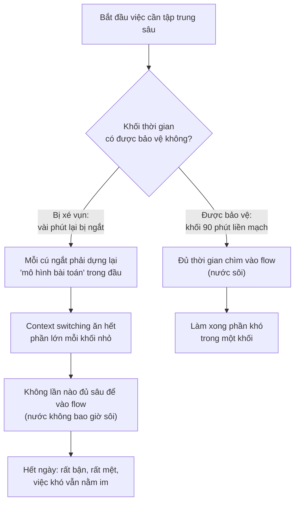

# Deep work & Time blocking — Bảo vệ khối tập trung

> **Tác giả:** Mr.Rom\
> **Phiên bản:** v1.0.0\
> **Tạo lúc:** 13/06/2026\
> **Cập nhật:** 13/06/2026\
> **Level:** Basic\
> **Tags:** career, time-management, soft-skills, deep-work, time-blocking, timeboxing, pomodoro, context-switching, batching, focus, no-meeting-block\
> **Yêu cầu trước:** [Ưu tiên công việc](01_prioritization.md)

> 🎯 *Bài trước cho bạn cách chọn **việc nào đáng làm** (Eisenhower, 80/20, ăn con ếch). Nhưng chọn đúng việc xong mà cả ngày bị chat, họp, thông báo băm vụn thì việc quan trọng nhất vẫn nằm im. Bài này dạy phần kế tiếp: **bảo vệ thời gian** để thật sự làm được việc đã chọn. Bạn sẽ phân biệt deep work với shallow work, hiểu flow và vì sao bị ngắt lại đắt tới vậy, biến calendar thành công cụ **time blocking / timeboxing** (đặt lịch cho việc chứ không chỉ cho họp), dùng Pomodoro khi đầu óc ì, giảm context switching bằng cách gom việc cùng loại (batching), quản lý interrupt và thông báo theo lô thay vì realtime, và dựng một "no-meeting block" giữ nguyên cho việc khó.*

## 🎯 Sau bài này bạn sẽ

- [ ] Phân biệt **deep work** và **shallow work**, và biết vì sao output của dev gần như chỉ sinh ra trong deep work
- [ ] Hiểu **flow state** và **chi phí context switching** — vì sao 6 khối 10 phút không bằng 1 khối 60 phút
- [ ] Dùng **time blocking / timeboxing** để đặt lịch cho **việc** trên calendar, không chỉ cho họp
- [ ] Dùng **Pomodoro** (25/5) như cú hích để vào việc những ngày đầu óc ì
- [ ] Giảm context switching bằng **batching** — gom việc cùng loại (chat, email, review, họp) vào vài khối
- [ ] Quản lý **interrupt + thông báo** theo lô (không realtime) và dựng một **no-meeting block** bất khả xâm phạm
- [ ] Ghép tất cả thành một **lịch ngày time-blocked** chạy được

---

## Tình huống — chọn đúng việc rồi mà vẫn không làm được

Hãy tua lại một ngày của bạn sau khi đã học bài ưu tiên.

Sáng nay bạn làm rất đúng bài: ngồi liệt kê, dùng Eisenhower, chọn ra **một việc quan trọng nhất** trong ngày — "viết xong module xử lý thanh toán". Bạn thấy mình kỷ luật, đầu óc rõ ràng. Rồi bạn mở máy.

Một tin Slack nhảy lên, trả lời cái đã. Mở email xem có gì gấp không — có hai cái, xử lý luôn. Quay lại module thanh toán, mở file, đọc lại code hôm qua để nhớ mình đang ở đâu. Vừa bắt được mạch thì có người mention trong channel, nhảy sang. Lại có một cuộc họp 30 phút chen vào giữa sáng. Họp xong, đầu óc rỗng tuếch, mở lại file, lại đọc lại từ đầu. Đến chiều, một cái review PR "nhờ xem nhanh giúp", một cuộc họp nữa. Đến tối nhìn lại: bạn đã **rất bận** cả ngày, mệt thật sự — nhưng module thanh toán, **việc quan trọng nhất bạn đã chọn từ sáng**, vẫn còn nguyên ở vạch xuất phát.

Đây không phải lỗi ưu tiên. Bạn đã chọn đúng việc rồi. Vấn đề là bạn **chưa dành chỗ và bảo vệ chỗ** cho việc đó. Ưu tiên trả lời câu hỏi *"việc nào đáng làm?"*; nhưng nó không tự động trả lời câu hỏi kế tiếp, khó hơn: *"khi nào mình thật sự làm nó, và làm sao giữ cho khoảng thời gian đó không bị xé vụn?"*

Đây chính là khoảng trống bài này lấp. Chọn đúng việc là điều kiện cần; **bảo vệ được khối thời gian liền mạch** để làm việc đó là điều kiện đủ. Một dev giỏi quản lý thời gian không phải người gõ phím nhanh hơn — họ là người đã biến calendar thành tấm khiên, dựng được vài khối tập trung sâu mỗi ngày và giữ chúng không cho ai (kể cả chính mình) xé vụn.

---

## 1️⃣ Deep work vs shallow work — không phải giờ nào cũng bằng nhau

Trước khi nói cách bảo vệ thời gian, phải hiểu một sự thật mà bảng chấm công không bao giờ nói cho bạn: **không phải giờ làm việc nào cũng có giá trị như nhau**. Một giờ có hai loại rất khác nhau, và lẫn lộn hai loại này là gốc của cảm giác "bận cả ngày mà không xong gì".

Khái niệm này được nhà nghiên cứu **Cal Newport** đặt tên rõ ràng trong cuốn *Deep Work*:

- **Deep work** (làm việc sâu) — những quãng **tập trung cao độ, không gián đoạn**, vào một việc đòi hỏi nhận thức cao. Với dev: viết logic phức tạp, thiết kế kiến trúc, debug một lỗi khó, học một concept mới khó nhằn. Đây là loại việc **tạo ra giá trị mới** và **khó thay thế** — và là loại việc bạn sẽ được trả lương cao để làm.
- **Shallow work** (làm việc nông) — những việc nhẹ, logic đơn giản, làm được kể cả khi đang phân tâm: trả lời chat, sắp lịch, sửa một dòng config vặt, điền form, đọc lướt thông báo. Cần thiết, nhưng **dễ và dễ bị thay thế**.

🪞 **Ẩn dụ**: hãy nghĩ về sự khác nhau giữa **phẫu thuật** và **dọn bàn**. Phẫu thuật (deep work) đòi hỏi bác sĩ tập trung tuyệt đối, không ai dám đẩy cửa hỏi "anh ơi cà phê đường hay không đường" giữa ca mổ — một cú ngắt có thể hỏng cả ca. Dọn bàn (shallow work) thì vừa dọn vừa nghe nhạc, ai gọi cũng trả lời được, dừng lúc nào cũng được. Cả ngày của bạn nếu **toàn dọn bàn** thì trông rất bận rộn nhưng không có ca mổ nào hoàn thành. Vấn đề của hầu hết dev mới không phải lười — họ dọn bàn cả ngày và tưởng đó là làm việc.

Điểm cốt lõi không phải "shallow work xấu" — nó cần thiết và không tránh được. Điểm cốt lõi là **đừng để shallow work xâm chiếm những quãng đáng ra dành cho deep work**. Vấn đề kinh điển: chat và email là shallow, **luôn có sẵn, luôn dễ làm**, nên não mệt sẽ tự động trôi về chúng — và chúng ăn mất chính những quãng vàng đáng ra dành cho việc khó. Bảng dưới so hai loại để bạn nhận ra mình đang dành quãng tốt nhất cho loại nào:

| Khía cạnh | Deep work (làm việc sâu) | Shallow work (làm việc nông) |
|---|---|---|
| Mức tập trung cần | Cao, liền mạch, không ngắt | Thấp, làm được khi phân tâm |
| Ví dụ cho dev | Viết logic khó, thiết kế, debug sâu, học mới | Trả lời chat, sắp lịch, sửa config vặt |
| Giá trị tạo ra | Cao, khó thay thế | Thấp, dễ thay thế |
| Chịu được bị ngắt? | Không — bị ngắt là hỏng mạch | Có — dừng/tiếp lúc nào cũng được |
| Khi nào nên làm | Quãng đầu óc sắc nhất, được bảo vệ | Quãng chùng, gom thành lô |

> [!NOTE]
> Bài [năng suất & tập trung khi remote](../../../remote-work/lessons/01_basic/03_productivity-and-focus-remote.md) cũng chạm vào deep work, nhưng từ góc **làm việc từ xa** (dập xao nhãng tại nhà, chống always-on, đo output thay vì giờ online). Bài này nhìn deep work từ góc **kỹ thuật quản lý thời gian thuần** — cách dùng calendar, batching và no-meeting block để dành và giữ khối tập trung, áp dụng cho cả người đi làm văn phòng lẫn remote.

Một hiểu lầm cần tránh ngay: bài này **không** nói "deep work tốt, shallow work xấu, hãy bỏ shallow work đi". Shallow work là một phần thật của công việc — review code cho đồng nghiệp, trả lời câu hỏi giúp người khác đỡ kẹt, cập nhật ticket để team nắm tình hình đều có giá trị. Vấn đề không phải *làm* shallow work, mà là **để nó tràn vào lúc nào và chiếm chỗ của gì**. Mục tiêu của cả bài là: chủ động **dành chỗ riêng** cho cả hai loại — quãng vàng liền mạch cho deep work, các khối gom lại cho shallow work — thay vì để chúng trộn lẫn rồi shallow nuốt mất deep.

---

## 2️⃣ Flow state & chi phí context switching — vì sao bị ngắt lại đắt tới vậy

Hiểu deep work là gì rồi, câu hỏi tiếp theo là: **vì sao một khối tập trung dài lại quý hơn nhiều khối ngắn cộng lại?** Câu trả lời nằm ở hai khái niệm: flow state và context switching.

**Flow state** (trạng thái dòng chảy) — khái niệm của nhà tâm lý học **Mihaly Csikszentmihalyi** — là trạng thái bạn **chìm hoàn toàn vào việc đang làm**: thời gian như biến mất, code cứ tuôn ra, bạn giữ được cả bài toán trong đầu cùng lúc. Đây là lúc dev làm việc hiệu quả nhất và cũng sướng nhất. Nhưng flow không bật được ngay — nó cần một quãng "khởi động" để chìm dần vào, và quan trọng hơn: **một cú ngắt là rơi ra khỏi flow ngay lập tức**, rồi phải khởi động lại gần từ đầu.

Đây là nơi **context switching** (chuyển ngữ cảnh) trở thành kẻ thù số một. Khi đang giữ cả mô hình bài toán trong đầu — cấu trúc code, các nhánh logic, dữ liệu chạy qua đâu — mà bị một thông báo kéo ra, bạn **không mất "vài giây"**. Bạn mất công sức dựng lại toàn bộ mô hình đó từ đầu, cộng thêm một khoảng "dư âm" khi đầu vẫn còn vương vấn việc cũ chưa chuyển hẳn sang việc mới.

🪞 **Ẩn dụ**: deep work giống **đun một nồi nước lên sôi**. Phải mất một lúc nước mới nóng dần tới sôi (chìm vào flow). Mỗi lần bị ngắt và nhấc nồi ra khỏi bếp — dù chỉ một phút trả lời chat — nước **nguội lại**, và lần sau bạn phải đun lại gần từ đầu. Mười lần ngắt trong một giờ nghĩa là nồi nước **không bao giờ sôi**: bạn tốn ga cả buổi mà chẳng nấu được gì. Một khối 90 phút liền mạch đun được nước sôi và nấu xong món; còn chín khối 10 phút thì chỉ làm nước âm ấm rồi nguội, âm ấm rồi nguội.

Hệ quả thực tế là một quy luật mà mọi dev nên khắc vào đầu: **thời gian tập trung không cộng tuyến tính**. Sáu khối 10 phút **không** bằng một khối 60 phút — vì mỗi khối nhỏ tốn phần lớn thời gian chỉ để khởi động lại, chưa kịp chìm vào flow đã hết. Khái niệm "chi phí ngắt quãng" này khá trừu tượng, nên hãy hình dung qua sơ đồ dưới: cùng một lượng thời gian, một bên bị xé vụn, một bên giữ liền khối, và vì sao kết quả khác nhau một trời một vực.



> 📖 *Điểm rút ra từ sơ đồ: hai nhánh xuất phát từ cùng một việc và cùng một lượng thời gian, nhưng chỉ khác nhau ở chỗ "khối có được bảo vệ không". Nhánh bị xé vụn tốn cả ngày mà việc vẫn nằm im vì context switching ăn hết; nhánh được bảo vệ chỉ cần một khối liền là xong phần khó. Vì thế mục tiêu của cả bài không phải "có nhiều giờ tập trung" mà là "có vài **khối liền** đủ dài và được giữ nguyên".*

### Vì sao lập trình nhạy với gián đoạn hơn nhiều việc khác

Mọi công việc đều ghét bị ngắt, nhưng lập trình bị ngắt **đắt hơn hẳn** — đáng để hiểu vì sao, vì nó là lý do nền của cả bài. Khi viết code, bạn không giữ một thứ trong đầu mà giữ cả một **giàn giáo tinh thần** đang dựng dở: biến này chứa gì, hàm kia trả về gì, nếu nhánh else chạy thì sao, dữ liệu đi từ đâu tới đâu. Giàn giáo đó không lưu được ra giấy đủ nhanh; nó sống trong trí nhớ làm việc (working memory) ngắn hạn của bạn. Một cú ngắt — dù chỉ 30 giây trả lời "ok em" — làm giàn giáo đó **sụp**, và bạn phải dựng lại gần như từ đầu.

Có ba phần chi phí ẩn mỗi lần bị ngắt mà người ngoài không thấy:

- **Mất giàn giáo** — phải đọc lại code, lần lại logic để dựng lại mô hình bài toán trong đầu.
- **Dư âm chú ý (attention residue)** — sau khi quay lại, một phần đầu óc vẫn còn vương việc bị ngắt ("nãy người ta hỏi gì nhỉ"), nên vài phút đầu bạn làm việc với công suất chưa đầy.
- **Mệt thêm** — mỗi lần dựng lại tốn năng lượng tinh thần thật; nhiều cú ngắt làm bạn kiệt sớm dù chưa làm được bao nhiêu.

→ Cộng ba chi phí này lại, một cú ngắt "30 giây" trên thực tế ăn của bạn nhiều hơn thế gấp bội. Đây là lý do một dev có thể "ngồi cả ngày" mà vẫn không xong việc khó: không phải họ chậm, mà là giàn giáo trong đầu chưa bao giờ được dựng đủ cao trước khi sụp lần nữa.

---

## 3️⃣ Time blocking & timeboxing — đặt lịch cho việc, không chỉ cho họp

Nếu deep work cần những khối dài liền mạch, thì câu hỏi rất thực tế là: làm sao **dành được chỗ** cho chúng giữa một ngày đầy chat, họp và việc vặt — những thứ luôn tự nhảy vào lấp đầy mọi khoảng trống? Câu trả lời là **time blocking**.

**Time blocking** (chia khối thời gian) là việc chia ngày thành các khối, mỗi khối **gán trước cho một việc cụ thể** ngay trên calendar — thay vì để cả ngày trôi theo "việc gì nổi lên thì làm nấy". Đây là một dịch chuyển tư duy nhỏ mà thay đổi mọi thứ: hầu hết mọi người chỉ đặt **cuộc họp** lên calendar, còn **việc tự làm** thì để trong một danh sách to-do mơ hồ. Hệ quả: calendar trống = ai cũng tưởng bạn rảnh = họp và chat tràn vào. Việc quan trọng nhất, không có ai "mời họp" cho nó, nên không bao giờ có chỗ.

> [!IMPORTANT]
> Đây là nguyên tắc trung tâm của cả bài: **đặt lịch cho VIỆC, không chỉ cho HỌP.** Khối "viết module thanh toán 9:00–11:00" phải là một sự kiện thật trên calendar y như một cuộc họp — không phải một dòng ghi nhớ trong đầu. Khi nó hiện trên calendar, hai điều xảy ra: chính bạn tôn trọng nó hơn (như tôn trọng một cuộc họp), và người khác nhìn lịch thấy bạn "bận" nên không xếp họp đè lên.

🪞 **Ẩn dụ**: một ngày không time-block giống một **cái vali nhét đồ lung tung** — bạn cứ ném đại vào theo thứ tự đồ rơi vào tay, cuối cùng vali đầy mà vẫn thiếu chỗ cho thứ quan trọng, và món to (khối deep work) không bao giờ lọt vào vì toàn món vụn (chat, email) chiếm chỗ trước. Time blocking giống **xếp vali có ngăn định sẵn**: ngăn to dành sẵn cho món to, ngăn nhỏ cho món vặt. Có ngăn riêng thì món to luôn có chỗ, và món vặt không tràn lan chiếm hết.

### Timeboxing — gán cho mỗi việc một hộp thời gian có hạn

Một biến thể quan trọng của time blocking là **timeboxing** (đóng hộp thời gian): không chỉ đặt khối cho việc, mà còn **giới hạn cứng thời gian** cho mỗi việc — "việc này làm trong đúng 90 phút, hết giờ là dừng lại đánh giá", thay vì "làm tới khi nào xong". Khác biệt tinh tế nhưng mạnh:

- **Time blocking** trả lời: *khi nào* làm việc gì.
- **Timeboxing** thêm: việc đó được *bao nhiêu thời gian* — và buộc bạn dừng lại khi hết hộp để đánh giá tiến độ.

Vì sao timeboxing hữu ích cho dev? Vì lập trình rất dễ rơi vào hố "vọc một bug nhỏ ba tiếng không dứt ra được". Một timebox ("cho bug này 45 phút, hết giờ chưa ra thì hỏi đồng nghiệp hoặc đổi cách") chặn cái hố đó lại. Nó cũng chống **định luật Parkinson** — *việc sẽ phình ra cho đầy thời gian bạn cho nó*. Cho một task "cả buổi chiều" thì nó tốn cả buổi chiều; cho nó một hộp 90 phút thì nhiều khi nó xong trong 90 phút.

### Ba bước time-block một ngày

Cách làm cụ thể, gói trong ba bước theo đúng thứ tự ưu tiên:

1. **Đặt khối deep work trước tiên, vào quãng đầu óc sắc nhất.** Việc quan trọng nhất (đã chọn ở bài ưu tiên — "con ếch" của ngày) phải được "chỗ ngồi tốt nhất". Đa số người có đầu óc sắc nhất buổi sáng — hãy đặt khối khó ở đó, **trước** khi mở chat.
2. **Gom việc vặt thành vài khối cố định** (chi tiết ở §5 — batching). Thay vì trả lời chat/email rải rác cả ngày (mỗi lần là một cú ngắt), nhốt chúng vào 2-3 khối "xử lý liên lạc".
3. **Đặt cả khối nghỉ và khối đệm (buffer).** Nghỉ không phải "thời gian thừa" — nó là một phần của lịch. Khối đệm là khoảng trống nhỏ giữa các khối để việc tràn giờ không phá đổ cả ngày (vì việc gần như luôn tràn giờ).

Để dễ hình dung, đây là một buổi sáng được time-block — chú ý khối deep work nằm **đầu tiên** và được đặt như một sự kiện calendar, còn chat bị gom lại chứ không rải rác:

```text
09:00 – 09:15  📝 Lên kế hoạch ngày: chọn 1-2 việc QUAN TRỌNG NHẤT
09:15 – 11:00  🔒 DEEP WORK — "con ếch" của ngày (chat ở chế độ DND)
11:00 – 11:15  ☕ Nghỉ ngắn (rời màn hình, đi lại)
11:15 – 11:45  💬 Khối liên lạc #1: trả lời chat/email gom lại, review PR nhẹ
11:45 – 12:30  🔒 DEEP WORK (tiếp) — hoặc việc quan trọng thứ hai
12:30 – 13:30  🍜 Nghỉ trưa thật (không vừa ăn vừa nhìn màn hình)
```

→ So với ngày "việc gì nổi lên làm nấy" ở đầu bài, lịch này khác ở chỗ deep work **được đặt chỗ trước và bảo vệ**, còn chat — thứ hay băm vụn ngày nhất — bị nhốt vào một khối 30 phút thay vì rải khắp nơi. Bạn không cần theo lịch này y hệt; điều cần giữ là **nguyên tắc**: việc khó đi trước và liền khối, việc vặt gom lại.

> [!TIP]
> Đặt tên khối deep work thẳng trên calendar là **"🔒 Focus block"** hoặc tên việc cụ thể, không để trống. Một số nơi cho phép đặt khối ở chế độ "Busy" để người khác không xếp họp đè. Mẹo nhỏ này biến một ý định trong đầu thành một cam kết công khai — và cam kết công khai dễ giữ hơn nhiều.

### Nghi thức lên lịch đầu ngày — chỗ ưu tiên gặp time blocking

Time blocking chỉ chạy được nếu bạn **biết đặt việc gì vào khối deep work**. Đây chính là chỗ bài ưu tiên trước nối vào bài này: ưu tiên chọn ra "con ếch" (việc quan trọng nhất), còn time blocking **dành chỗ và giờ** cho con ếch đó. Hai bài là hai nửa của một động tác.

Một nghi thức lên lịch đầu ngày gọn, làm trong khoảng 10 phút trước khi mở chat:

1. **Nhìn lại 1-2 việc quan trọng nhất** đã chọn (từ bài ưu tiên). Nếu chưa chọn, chọn ngay — không bắt đầu time-block khi chưa biết con ếch là con nào.
2. **Đặt con ếch vào khối deep work đầu tiên**, vào quãng đầu óc sắc nhất, dưới dạng sự kiện calendar có giờ rõ.
3. **Ước lượng và timebox** mỗi việc một hộp thời gian ("module này cho 90 phút, hết giờ đánh giá lại").
4. **Gom việc vặt** còn lại vào các khối liên lạc, không xếp xen vào khối deep work.
5. **Chừa khối đệm** cuối ngày cho việc tràn giờ và thứ bất ngờ.

→ Nghi thức này biến một danh sách to-do phẳng (việc nào cũng "ngang nhau", dễ trôi vào việc dễ trước) thành một **lịch có hình dạng**: việc khó đứng trước, có giờ riêng, được bảo vệ. Mỗi sáng bỏ ra 10 phút lên lịch tiết kiệm cho bạn nhiều giờ trôi dạt sau đó.

> [!TIP]
> Một biến thể nhẹ hơn cho người mới: thay vì time-block kín cả ngày (dễ nản khi lịch vỡ), chỉ time-block **một khối deep work duy nhất cho con ếch** mỗi sáng, để phần còn lại của ngày trôi tự do. Chỉ riêng việc bảo vệ được một khối deep work mỗi ngày đã thay đổi lớn kết quả — bạn có thể siết chặt hơn sau khi quen.

---

## 4️⃣ Pomodoro (25/5) — cú hích khi đầu óc ì

Time blocking dành chỗ cho deep work, nhưng có một vấn đề rất người: nhiều khi đã đặt khối rồi mà vẫn **không vào được việc** — ngồi xuống là thấy ngại, mở file ra là muốn lướt điện thoại, "để tí nữa làm". Đây là lúc **Pomodoro** giúp bạn.

**Pomodoro** (kỹ thuật Pomodoro, do Francesco Cirillo đặt ra) là cách chia việc thành các phiên ngắn cố định: làm **tập trung 25 phút**, rồi **nghỉ 5 phút**, lặp lại; sau khoảng bốn phiên thì nghỉ dài hơn (15–30 phút). "Pomodoro" tiếng Ý nghĩa là "quả cà chua" — theo chiếc đồng hồ hẹn giờ hình cà chua tác giả dùng. Cấu trúc một chu kỳ:

```text
🍅 Pomodoro #1: 25 phút làm   →  ☕ 5 phút nghỉ
🍅 Pomodoro #2: 25 phút làm   →  ☕ 5 phút nghỉ
🍅 Pomodoro #3: 25 phút làm   →  ☕ 5 phút nghỉ
🍅 Pomodoro #4: 25 phút làm   →  😴 15–30 phút nghỉ dài
```

Vì sao một mẹo đơn giản vậy lại hiệu quả? Vì nó đánh đúng hai điểm yếu của bộ não khi làm việc:

- **Hạ rào cản bắt đầu.** Phần khó nhất luôn là *bắt đầu*. "Làm xong cái module này" nghe nặng nề tới mức muốn trì hoãn; "tập trung đúng 25 phút rồi được nghỉ" nghe nhẹ tênh — ai cũng chịu được 25 phút. Mà một khi đã bắt đầu và vào nhịp, bạn thường làm tiếp qua cả tiếng. Pomodoro là cách lừa bản thân vượt qua sức ì ban đầu.
- **Ép nghỉ trước khi kiệt.** Nghỉ ngắn đều đặn giữ đầu óc tươi, tránh kiểu cày liền tù tì tới mức tập trung tụt dần mà không nhận ra.

🪞 **Ẩn dụ**: Pomodoro giống **chạy bộ theo quãng (interval)** thay vì cố chạy marathon một mạch không nghỉ. Người mới cố chạy liền 10 km thường gục giữa đường; chạy xen kẽ "chạy nhanh một quãng — đi bộ hồi sức — lại chạy" thì đi được xa hơn nhiều. 25 phút tập trung là một "quãng chạy", 5 phút nghỉ là "đi bộ hồi sức". Bí quyết không phải gồng để không bao giờ nghỉ, mà là **nghỉ đúng nhịp để chạy được lâu**.

Cách áp dụng cho một buổi làm việc dev, theo từng bước:

1. **Chọn đúng một việc** cho phiên này (không phải "làm linh tinh"). Ví dụ: "viết hàm xử lý thanh toán thất bại".
2. **Đặt hẹn giờ 25 phút**, bật DND, làm **chỉ việc đó** — không liếc chat, không mở tab mới.
3. **Hết 25 phút, dừng và nghỉ 5 phút** — đứng dậy, rời màn hình, nhìn ra xa, uống nước. **Không** lướt điện thoại (màn hình không phải nghỉ ngơi cho mắt và não).
4. **Lặp lại.** Sau bốn phiên (khoảng 2 giờ), nghỉ dài 15–30 phút.

> [!TIP]
> Đừng cứng nhắc với con số 25/5 — nó chỉ là điểm khởi đầu. Nếu chuông reo lúc bạn đang chìm sâu trong flow, **cứ làm tiếp** — đừng phá mạch chỉ để theo luật (lúc này hãy để nồi nước sôi). Nhiều dev thích phiên dài hơn (45–50 phút làm, 10 phút nghỉ) cho việc cần ngâm sâu. Pomodoro là công cụ phục vụ bạn, không phải luật để bạn phục tùng — dùng nó **đặc biệt cho những ngày khó vào việc**, như một cú hích để bắt đầu.

Lưu ý quan hệ giữa hai công cụ: time blocking và Pomodoro **không loại trừ nhau** mà ghép rất hợp. Time blocking quyết định **khi nào** làm deep work (đặt khối 90 phút buổi sáng trên calendar); Pomodoro quyết định **làm thế nào** để duy trì tập trung **bên trong** khối đó (chia khối 90 phút thành các phiên có nghỉ xen kẽ).

---

## 5️⃣ Giảm context switching bằng batching — gom việc cùng loại

Ở §2 ta thấy context switching đắt tới mức nào. Vũ khí chính để giảm nó là **batching** (gom theo lô): thay vì đan xen liên tục giữa việc khó và việc vặt cả ngày, **gom những việc cùng loại lại làm một lượt** trong một khối.

Lý do nằm ở bản chất của chuyển ngữ cảnh: cái đắt không phải bản thân từng việc nhỏ, mà là **mỗi lần đổi loại việc** — đổi từ "viết logic" sang "trả lời chat" rồi quay lại "viết logic" tốn hai cú khởi động lại. Nếu bạn trả lời 10 cái chat **rải rác** cả ngày, đó là 10 cú cắt mạch deep work. Nếu bạn gom 10 cái chat đó vào **một khối 20 phút**, đó chỉ là một lần đổi ngữ cảnh — và phần còn lại của ngày được giữ liền mạch.

🪞 **Ẩn dụ**: batching giống **đi chợ một lần cho cả tuần** thay vì chạy ra chợ mỗi lần thiếu một thứ. Mỗi chuyến ra chợ tốn công đi-về như nhau dù mua một món hay mười món; gom lại mua một lần thì cái "chi phí đi-về" (chuyển ngữ cảnh) chỉ trả một lần thay vì mười lần. Việc vặt cũng vậy: gộp lại trả "phí khởi động" một lần.

Những loại việc nên gom thành lô với dev:

| Loại việc (shallow) | Cách gom thành lô |
|---|---|
| Chat / tin nhắn | 2-3 khối "xử lý liên lạc" trong ngày, ngoài khối thì để DND |
| Email | Mở email 2-3 lần cố định (vd giữa sáng, đầu chiều), không để mở suốt |
| Review PR / code review | Một khối review gom nhiều PR, thay vì "nhờ xem nhanh" cắt ngang deep work |
| Họp | Dồn họp vào một nửa ngày, giữ nửa kia trống cho deep work (xem §7) |
| Việc hành chính (điền form, cập nhật ticket) | Một khối "dọn dẹp" cuối buổi, lúc đầu óc đã chùng |

→ Điểm chung: **mỗi loại việc shallow nên có "giờ riêng" của nó**, gom lại, thay vì rải đều cả ngày làm nền nhiễu liên tục. Quy tắc một câu: *gom việc giống nhau, tách việc khác nhau.*

> [!TIP]
> Một dạng batching mạnh là **theme cho từng ngày/buổi** (day theming): vd sáng luôn là deep work code, chiều thứ Năm luôn là họp + review, để não không phải đổi "chế độ" liên tục. Cách này hợp khi bạn có quyền sắp xếp lịch của mình — nó nâng batching từ mức "trong ngày" lên mức "trong tuần".

### Trước và sau khi batch — cùng một lượng việc, kết quả khác hẳn

Để thấy rõ batching thay đổi gì, hãy so cùng một ngày với cùng đống việc, chỉ khác cách sắp xếp. Phiên bản "rải rác" là cách đa số người mới làm; phiên bản "gom lô" là cùng các việc đó nhưng nhóm lại:

```text
❌ Rải rác (mỗi lần đổi việc là một cú context switching):
   code 15' → rep chat → code 10' → check email → code 20' → review 1 PR
   → code 10' → rep chat → họp → code 15' → check email ...
   Kết quả: ~10+ lần đổi ngữ cảnh, không lần nào vào sâu được flow.

✅ Gom lô (mỗi loại việc một khối):
   [Khối deep work 90'] code liền mạch — chat DND
   [Khối liên lạc 30'] rep hết chat + email + review PR một lượt
   [Khối deep work 90'] code tiếp — chat DND
   [Khối họp 60'] dồn họp + việc cần người khác
   Kết quả: ~3-4 lần đổi ngữ cảnh, hai khối deep work vào được flow.
```

→ Cùng số chat trả lời, cùng số PR review, cùng số họp — nhưng phiên bản gom lô **cắt số lần đổi ngữ cảnh xuống còn 1/3**, và quan trọng hơn, nó **chừa ra được hai khối liền** cho việc khó. Đó là toàn bộ điểm của batching: không phải làm ít việc vặt hơn, mà là **trả phí context switching ít lần hơn** để dành chỗ liền mạch cho deep work.

---

## 6️⃣ Quản lý interrupt & thông báo — theo lô, không realtime

Batching ở §5 chỉ chạy được nếu bạn cắt được nguồn ngắt lớn nhất: **thông báo realtime**. Mỗi badge đỏ, mỗi tiếng "ting" của Slack là một lời mời gọi context switching — và mặc định của hầu hết công cụ là **đẩy mọi thứ tới bạn ngay lập tức**, đúng thứ phá deep work nhất.

Gốc của vấn đề là một niềm tin sai cần gỡ bỏ: **"mọi tin nhắn đều cần trả lời ngay"**. Sự thật là tuyệt đại đa số chat **không** khẩn cấp — chúng hoàn toàn đợi được tới khối liên lạc kế tiếp. Cái cảm giác "phải trả lời ngay" do chính thông báo realtime tạo ra, không phải do nội dung tin nhắn. Bạn đổi từ chế độ **realtime** (ai nhắn là phải xử lý ngay) sang chế độ **theo lô** (xử lý liên lạc vào giờ riêng) — và năng suất deep work tăng vọt.

Cách dựng hàng rào quanh thông báo, từ nhẹ tới mạnh:

- **Tắt thông báo trong khối deep work** — đặt chat (Slack/Teams) ở chế độ Do Not Disturb, tắt thông báo điện thoại, úp màn hình điện thoại xuống. Mỗi thông báo bị chặn là một cú "nhấc nồi khỏi bếp" bị ngăn lại.
- **Tắt thông báo đẩy mặc định, chủ động đi lấy** — thay vì để chat/email "ting" suốt, hãy **tự mở chúng vào khối liên lạc**. Đảo từ "thông báo tới tìm bạn" thành "bạn tới tìm thông báo khi sẵn sàng".
- **Báo trước cho team** — đặt status kiểu "🔒 Focus tới 11:00, có việc gấp gọi điện giúp em". Người ta tôn trọng khi họ **biết**; họ ngắt bạn vì tưởng bạn rảnh.
- **Tách riêng kênh "gấp thật"** — thống nhất với team một kênh riêng cho việc thực sự khẩn (sự cố production, sếp cần gấp). Khi đã có "lối thoát hiểm" cho việc gấp thật, bạn yên tâm tắt thông báo cho mọi thứ còn lại.

> [!WARNING]
> Quản lý interrupt **không** có nghĩa là biến mất hoàn toàn rồi cuối ngày mới xuất hiện. Mấu chốt là phân biệt "gấp thật" với "tưởng gấp": hầu hết chat đợi được tới khối liên lạc kế tiếp, nhưng sự cố production thì không. Hãy báo rõ team kênh nào dùng cho "gấp thật" — rồi tắt thông báo cho phần còn lại với lương tâm trong sạch. Im lặng cả ngày không báo gì rồi nói "em làm theo deep work" là hiểu sai, không phải làm đúng.

Riêng với **interrupt từ người khác cắt ngang** (đồng nghiệp tap vai, "cho hỏi nhanh một câu" giữa giờ tập trung) — đây là loại ngắt khó từ chối nhất vì có yếu tố con người. Vài cách xử lý lịch sự mà vẫn giữ được khối:

| Tình huống interrupt | Cách giữ khối mà không mất lòng |
|---|---|
| "Cho hỏi nhanh một câu" giữa khối focus | "Mình đang trong focus block, 11h xong mình qua liền nha" — hẹn lại, không cắt mạch |
| Bị mention liên tục trong channel | Trả lời gộp một lần vào khối liên lạc, kèm câu "xin lỗi mình focus sáng nên giờ mới rep" |
| Họp đột xuất bị nhét vào | Hỏi "việc này async được không / để chiều có ổn không?" trước khi đồng ý cắt khối |

### Interrupt khó nhất là chính bạn — dùng "capture list"

Có một nguồn interrupt mà DND không chặn được, vì nó đến từ bên trong: **chính bạn tự ngắt mình**. Đang viết code thì chợt nhớ "à phải trả lời email kia", "phải kiểm tra cái deploy", "không biết tin nhắn kia có gấp không" — và tay tự động chuyển tab. Mỗi suy nghĩ lạc đó là một cú nhấc nồi khỏi bếp do chính bạn gây ra.

Cách chữa rất đơn giản và mạnh: để một **capture list** (danh sách bắt việc) — một tờ giấy hoặc một file mở sẵn cạnh bàn. Mỗi khi một suy nghĩ "phải làm cái này" nảy ra giữa khối deep work, **đừng làm nó ngay** — chỉ ghi một dòng vào capture list rồi quay lại việc đang làm. Tới khối liên lạc/khối dọn dẹp, bạn xử lý cả danh sách một lượt (đúng tinh thần batching).

Vì sao nó hiệu quả: não tự ngắt bạn phần lớn không phải vì việc đó gấp, mà vì nó **sợ quên**. Một khi suy nghĩ đã được ghi ra giấy (não tin "nó được lưu rồi, không mất đâu"), áp lực phải-làm-ngay tan đi, và bạn ở lại được trong flow. Capture list biến hàng chục cú tự-ngắt thành một danh sách xử lý sau — chuyển interrupt realtime thành batch ngay trong đầu bạn.

> [!TIP]
> Capture list không chỉ cho khối deep work — nó là một thói quen nền của mọi hệ thống quản lý task tốt (bạn sẽ gặp lại ý này ở bài [hệ thống quản lý task & lập kế hoạch](03_task-systems-and-planning.md) với GTD). Mấu chốt: **một chỗ tin cậy để "đổ" mọi thứ ra khỏi đầu**, để đầu chỉ lo việc đang làm chứ không lo nhớ.

---

## 7️⃣ No-meeting block — vùng cấm họp để giữ deep work

Có một kẻ phá deep work mà các kỹ thuật trên chưa chạm tới, vì nó không phải thông báo cũng không phải chat: **cuộc họp**. Một ngày rải rác họp 30 phút mỗi 90 phút thì **không còn khối liền nào** cho deep work cả — dù mỗi cuộc họp đều "chỉ 30 phút", khoảng giữa chúng quá ngắn để nước kịp sôi.

Giải pháp là **no-meeting block** (khối cấm họp) — một quãng thời gian cố định mà bạn (và lý tưởng là cả team) cam kết **không xếp họp**, dành riêng cho deep work. Đây không phải lười tránh họp — đây là thừa nhận rằng **deep work cũng quan trọng và cũng cần được lên lịch như họp**, thậm chí hơn.

🪞 **Ẩn dụ**: no-meeting block giống **giờ tự học bắt buộc** trong trường nội trú — một khung giờ cố định mọi người ngầm hiểu là "không ai làm ồn, không ai gọi ai". Nó hiệu quả không phải vì luật nghiêm, mà vì **mọi người cùng tôn trọng một quãng yên tĩnh chung**. Một no-meeting block của riêng bạn đã tốt; một no-meeting block cả team cùng giữ thì mạnh gấp bội.

Cách dựng no-meeting block ở các mức:

- **Mức cá nhân (làm được ngay, không cần ai duyệt)**: đặt một khối "🔒 Focus — no meetings" trên calendar mỗi sáng, để chế độ Busy. Khi ai đó định xếp họp vào đó, họ thấy bạn bận và tự né. Nếu bị nhét họp, lịch sự hỏi "mình đang giữ khối này cho việc khó, đổi sang đầu chiều được không?".
- **Mức team (mạnh hơn, cần đồng thuận)**: đề xuất team một quy ước chung — vd "sáng không họp, họp dồn vào chiều" hoặc "thứ Tư là no-meeting day". Nhiều công ty công nghệ áp dụng kiểu này vì biết rõ giá trị của khối liền cho dev.

Một khung phân bổ ngày để giữ no-meeting block, kết hợp với batching họp ở §5:

```text
🌅 Sáng (quãng vàng)   →  🔒 NO-MEETING — dành cho deep work
🌇 Chiều               →  💬 Họp + review + việc cộng tác (gom lại đây)
```

→ Ý tưởng: **dồn mọi thứ cần-có-người-khác vào một nửa ngày, giữ nửa kia hoàn toàn yên tĩnh cho việc khó**. Nửa nào dành cho deep work tùy nhịp của bạn (xem lại nguyên tắc xếp việc theo quãng đầu óc sắc nhất ở bài [năng suất & tập trung khi remote](../../../remote-work/lessons/01_basic/03_productivity-and-focus-remote.md)) — điểm bất biến là **có một nửa ngày được giữ liền, không cho họp xé**.

### Vệ sinh họp — mỗi cuộc họp tránh được là một khối deep work giữ được

No-meeting block bảo vệ một quãng cố định, nhưng họp vẫn có thể nhồi đầy nửa còn lại nếu bạn nhận mọi lời mời vô điều kiện. Một dev quản lý thời gian tốt áp dụng vài thói quen "vệ sinh họp" để mỗi cuộc họp dự đều xứng đáng với cái giá nó lấy đi (không chỉ thời gian họp, mà cả khối deep work bị nó xé):

- **Hỏi "việc này async được không?"** trước khi nhận. Rất nhiều cuộc họp thật ra là một tin nhắn dài hoặc một tài liệu — giải quyết được mà không cần ai phải dừng deep work cùng lúc.
- **Đòi agenda** — họp không có agenda rõ thường là họp lan man. Hỏi "cuộc họp này cần quyết định gì?" giúp lọc ra họp không cần bạn.
- **Đề xuất họp ngắn hơn** — mặc định 30 phút thường phình ra cho đầy (định luật Parkinson áp dụng cả cho họp); một cuộc họp 15 phút có agenda thường đủ.
- **Gom họp về sát nhau** — nếu phải họp, xin xếp các cuộc liền kề (hoặc dồn vào nửa ngày họp) thay vì rải mỗi cuộc một quãng, để không cuộc nào xé nát một khối deep work.

→ Điểm cốt lõi: với dev, **chi phí thật của một cuộc họp không phải 30 phút họp, mà là khối deep work liền mạch mà nó cắt làm đôi**. Một cuộc họp chen vào giữa sáng có thể phá hỏng một khối 2 tiếng — nên bảo vệ khối tập trung đôi khi bắt đầu từ việc lịch sự nói "không" hoặc "để async" với một cuộc họp.

---

## 8️⃣ Lịch ngày time-blocked — ghép tất cả lại

Giờ ghép mọi mảnh — deep work, time blocking/timeboxing, Pomodoro, batching, quản lý thông báo, no-meeting block — thành một **lịch ngày chạy được**. Đây là một **khung mẫu để bạn sửa**, không phải luật; điều cần giữ là **các nguyên tắc** đằng sau, sẽ chỉ ra ngay bên dưới lịch.

Lịch này giả định một người có đầu óc sắc nhất buổi sáng và giữ no-meeting block buổi sáng; bạn đổi giờ cho hợp nhịp của mình:

```text
🌅 08:45 – 09:00   Bắt đầu mềm: KHÔNG mở chat/email ngay
                   (giữ quãng vàng cho deep work, không để chat xén)

📝 09:00 – 09:15   Lên kế hoạch ngày: chọn 1-2 việc QUAN TRỌNG NHẤT ("con ếch")
                   Đặt status "🔒 Focus tới 11:00", bật DND

🔒 09:15 – 11:00   DEEP WORK #1 — việc khó nhất (NO-MEETING, chat DND, tab sạch)
                   Bên trong: các phiên Pomodoro có nghỉ ngắn xen kẽ
                   Timebox: hết 11:00 dừng lại đánh giá tiến độ

☕ 11:00 – 11:15   Nghỉ ngắn THẬT — rời màn hình, đi lại, uống nước

💬 11:15 – 12:00   Khối liên lạc #1 (batch): chat/email gom lại, review PR

🍜 12:00 – 13:00   Nghỉ trưa THẬT — không vừa ăn vừa nhìn màn hình

🔒 13:00 – 14:30   DEEP WORK #2 — việc quan trọng thứ hai
                   (nếu đầu chiều chùng: chọn việc khó VỪA, không nặng nhất)

📅 14:30 – 16:00   Khối cộng tác (batch): họp gom lại, review, việc cần người khác

🔁 16:00 – 16:45   Việc vặt / hành chính / học-đọc nhẹ / đệm cho việc tràn giờ

💬 16:45 – 17:00   Khối liên lạc #2 (batch): quét chat/email lần cuối trong ngày
```

→ Lịch trông kín, nhưng để ý nó thể hiện đúng các nguyên tắc đã học, không phải nhồi cho đầy:

- **Đặt lịch cho VIỆC, không chỉ cho họp** (§3) — hai khối deep work nằm trên calendar như sự kiện thật, không phải ghi nhớ trong đầu.
- **Deep work đi trước, vào quãng vàng** (§3) — việc khó nhất ở 09:15, không phải đầu chiều.
- **No-meeting block buổi sáng** (§7) — họp bị dồn xuống chiều (14:30–16:00), giữ sáng liền mạch cho deep work.
- **Chat/email bị gom thành lô** (§5, §6) — chỉ hai khối liên lạc, ngoài ra DND; không rải rác cả ngày.
- **Pomodoro bên trong khối** (§4) — chia khối 90 phút thành các phiên có nghỉ.
- **Timebox + khối đệm** (§3) — mỗi khối có giờ kết thúc rõ; 16:00–16:45 là đệm cho việc tràn giờ.
- **Nghỉ là một phần của lịch** — nghỉ ngắn giữa khối, nghỉ trưa thật, đều có chỗ chính thức.

So với "ngày bận mà không xong gì" ở đầu bài, lịch này có thể **ít cảm giác bận rộn hơn** nhưng làm ra **nhiều hơn hẳn** — vì nó dành những quãng tốt nhất, liền nhất cho việc quan trọng nhất, và bảo vệ chúng khỏi bị họp, chat, thông báo xé vụn. Đó chính là "bảo vệ khối tập trung" trong thực tế.

---

## 💡 Cạm bẫy thường gặp & Best practice

### ❌ Cạm bẫy: calendar chỉ có họp, không có việc

- **Triệu chứng**: calendar đầy cuộc họp của người khác, còn việc tự làm chỉ nằm trong một to-do list mơ hồ; mỗi khoảng trống trên lịch lập tức bị họp hoặc chat lấp đầy; việc quan trọng nhất ngày nào cũng bị đẩy sang "mai làm".
- **Nguyên nhân**: chỉ coi calendar là chỗ chứa họp, không phải chỗ dành thời gian cho việc; lịch trống bị mọi người (kể cả chính bạn) đọc là "đang rảnh".
- **Cách tránh**: time-block việc quan trọng nhất thành một sự kiện calendar thật ("🔒 Focus block"), để chế độ Busy. Đặt lịch cho **việc**, không chỉ cho họp — đây là nguyên tắc trung tâm của bài.

### ❌ Cạm bẫy: để chat/thông báo realtime băm vụn ngày

- **Triệu chứng**: cứ vài phút lại liếc Slack/điện thoại, trả lời mọi chat trong vài giây; không lần nào chìm được vào flow; việc khó kéo dài nhiều ngày không xong dù ngồi cả ngày.
- **Nguyên nhân**: tin rằng mọi tin nhắn đều cần trả lời ngay; để thông báo đẩy bật suốt nên mỗi cái là một cú context switching; không có khối liên lạc gom lại.
- **Cách tránh**: chuyển từ chế độ realtime sang theo lô — gom chat/email vào 2-3 khối liên lạc, ngoài ra bật DND. Phân biệt "gấp thật" (có kênh riêng) với "tưởng gấp" (đợi được). Tắt thông báo đẩy, chủ động đi lấy khi sẵn sàng.

### ✅ Best practice: bảo vệ khối deep work như bảo vệ một cuộc họp

- **Vì sao**: output của dev được tạo ra trong deep work; thời gian tập trung không cộng tuyến tính (6 khối 10 phút không bằng 1 khối 60 phút) vì mỗi lần ngắt phải khởi động lại cả mô hình bài toán và rơi khỏi flow.
- **Cách áp dụng**: đặt khối deep work thành sự kiện calendar (đặt tên "Focus block", để Busy); trong khối chỉ làm một việc, bật DND, đóng tab thừa, báo team status Focus; dựng no-meeting block giữ một nửa ngày liền mạch; giữ kênh riêng cho việc gấp thật để yên tâm tắt thông báo phần còn lại.

### ✅ Best practice: gom việc cùng loại, tách việc khác loại

- **Vì sao**: cái đắt của context switching là mỗi lần **đổi loại việc**, không phải bản thân từng việc nhỏ; trả lời 10 chat rải rác là 10 cú cắt mạch, gom vào một khối chỉ là một lần đổi ngữ cảnh.
- **Cách áp dụng**: cho mỗi loại việc shallow (chat, email, review, họp, hành chính) một "giờ riêng" gom lại thay vì rải đều; cân nhắc day theming (sáng deep work, chiều họp/review) khi có quyền sắp lịch; dùng timebox để chặn hố "vọc một việc không dứt ra".

---

## 🧠 Tự kiểm tra (Self-check)

**Q1.** Phân biệt deep work và shallow work. Vì sao vấn đề lớn không phải "shallow work xấu" mà là cái gì?

<details>
<summary>💡 Xem giải thích</summary>

**Deep work** là quãng tập trung cao độ, không gián đoạn, vào việc đòi hỏi nhận thức cao (viết logic khó, thiết kế, debug sâu, học mới) — tạo giá trị cao, khó thay thế, **không chịu được bị ngắt**. **Shallow work** là việc nhẹ làm được khi phân tâm (trả lời chat, sắp lịch, sửa config vặt) — cần thiết nhưng giá trị thấp, dễ thay thế, dừng/tiếp lúc nào cũng được. Vấn đề lớn **không phải** shallow work xấu (nó cần thiết và không tránh được) mà là **để shallow work xâm chiếm những quãng đáng ra dành cho deep work** — vì chat/email luôn có sẵn và dễ làm nên não mệt tự trôi về chúng, ăn mất quãng vàng. (Ẩn dụ: phẫu thuật vs dọn bàn — cả ngày dọn bàn thì không ca mổ nào xong.)

</details>

**Q2.** Vì sao "6 khối 10 phút không bằng 1 khối 60 phút" với deep work? Hai khái niệm nào giải thích điều này?

<details>
<summary>💡 Xem giải thích</summary>

Vì **thời gian tập trung không cộng tuyến tính**. Hai khái niệm: **flow state** (trạng thái chìm hoàn toàn vào việc) cần một quãng khởi động để vào, và **context switching** (chuyển ngữ cảnh) — mỗi khi bị ngắt bạn không mất "vài giây" mà mất công sức dựng lại cả mô hình bài toán trong đầu (cấu trúc code, các nhánh logic, dữ liệu chạy qua đâu), cộng dư âm khi đầu còn vương việc cũ. Mỗi khối 10 phút tốn phần lớn thời gian chỉ để khởi động lại, chưa kịp vào flow đã hết — nên 6 khối nhỏ phần lớn là 6 lần khởi động dở dang, còn 1 khối 60 phút đủ để chìm vào flow và làm xong phần khó. (Ẩn dụ: đun nước — mỗi lần nhấc nồi khỏi bếp nước nguội lại, ngắt liên tục thì nước không bao giờ sôi.)

</details>

**Q3.** "Đặt lịch cho việc, không chỉ cho họp" nghĩa là gì, và vì sao nó quan trọng? Timeboxing thêm gì so với time blocking?

<details>
<summary>💡 Xem giải thích</summary>

Hầu hết người ta chỉ đặt **cuộc họp** lên calendar còn **việc tự làm** để trong to-do list mơ hồ — nên lịch trống bị mọi người (kể cả chính mình) đọc là "đang rảnh", và họp/chat tràn vào lấp hết. **Time blocking** đặt cả việc deep work thành sự kiện calendar thật (vd "🔒 Focus 9:00–11:00"): chính bạn tôn trọng nó hơn, và người khác nhìn thấy bạn bận nên không xếp họp đè. **Timeboxing** thêm một lớp: không chỉ đặt khối cho việc mà còn **giới hạn cứng thời gian** ("việc này đúng 90 phút, hết giờ là dừng đánh giá") — chống hố "vọc một bug ba tiếng không dứt" và chống định luật Parkinson (việc phình ra cho đầy thời gian được cho).

</details>

**Q4.** Time blocking và Pomodoro khác vai trò gì, và chúng ghép với nhau ra sao? Khi nào Pomodoro hữu ích nhất?

<details>
<summary>💡 Xem giải thích</summary>

**Time blocking** quyết định **khi nào** làm deep work: đặt khối 90 phút lên calendar vào quãng vàng, gom việc vặt thành lô — để dành chỗ và bảo vệ deep work. **Pomodoro** quyết định **làm thế nào để duy trì tập trung bên trong** một khối: chia thành các phiên 25 phút làm / 5 phút nghỉ, sau 4 phiên nghỉ dài. Chúng ghép hợp nhau: time blocking đặt khối 90 phút buổi sáng, Pomodoro chia khối đó thành các phiên có nghỉ xen kẽ. Pomodoro hữu ích nhất cho **ngày khó vào việc** — nó hạ rào cản bắt đầu ("chỉ cần 25 phút" nghe nhẹ tênh) và ép nghỉ trước khi kiệt. Nhưng đừng cứng nhắc 25/5: nếu đang chìm sâu trong flow khi chuông reo, cứ làm tiếp, đừng phá mạch để theo luật.

</details>

**Q5.** Batching là gì, vì sao nó giảm context switching, và những loại việc nào của dev nên gom thành lô?

<details>
<summary>💡 Xem giải thích</summary>

**Batching** là gom những việc **cùng loại** lại làm một lượt trong một khối, thay vì đan xen liên tục cả ngày. Nó giảm context switching vì cái đắt không phải bản thân từng việc nhỏ mà là **mỗi lần đổi loại việc** (đổi từ "viết logic" sang "trả lời chat" rồi quay lại tốn hai cú khởi động lại). Trả lời 10 chat rải rác = 10 cú cắt mạch deep work; gom 10 chat vào một khối 20 phút = chỉ một lần đổi ngữ cảnh. Các loại nên gom: chat/tin nhắn (2-3 khối liên lạc, ngoài ra DND), email (mở 2-3 lần cố định), review PR (một khối review gom nhiều PR), họp (dồn vào một nửa ngày), việc hành chính (một khối "dọn dẹp" cuối buổi). Quy tắc: gom việc giống nhau, tách việc khác nhau. (Ẩn dụ: đi chợ một lần cho cả tuần.)

</details>

**Q6.** Niềm tin sai nào khiến thông báo realtime phá deep work, và cách quản lý interrupt/thông báo đúng là gì? Một no-meeting block giải quyết điều gì khác?

<details>
<summary>💡 Xem giải thích</summary>

Niềm tin sai: **"mọi tin nhắn đều cần trả lời ngay"** — thực tế tuyệt đại đa số chat không khẩn cấp, đợi được tới khối liên lạc kế tiếp; cảm giác "phải trả lời ngay" do chính thông báo realtime tạo ra. Cách quản lý đúng: chuyển từ chế độ **realtime** sang **theo lô** — tắt thông báo đẩy trong khối deep work (DND), chủ động đi lấy chat/email vào khối liên lạc, báo trước status "Focus", và tách riêng một kênh "gấp thật" (sự cố production) để yên tâm tắt mọi thứ còn lại. **No-meeting block** giải quyết một kẻ phá khác mà DND không chạm tới: **cuộc họp** — một ngày rải rác họp 30 phút thì không còn khối liền nào cho deep work. No-meeting block là một quãng cố định cam kết không xếp họp, dành riêng cho việc khó (mức cá nhân: đặt khối Busy trên calendar; mức team: quy ước "sáng không họp" hoặc "thứ Tư no-meeting day").

</details>

---

## ⚡ Tra cứu nhanh (Cheatsheet)

### Deep work vs shallow work

| Deep work | Shallow work |
|---|---|
| Tập trung cao, liền mạch, không ngắt | Nhẹ, làm được khi phân tâm |
| Viết logic, thiết kế, debug sâu, học mới | Chat, sắp lịch, sửa config vặt |
| Dành quãng vàng + bảo vệ | Gom thành lô, để quãng chùng |

→ Nguyên tắc: đừng để shallow work ăn mất quãng vàng của deep work.

### Quy luật flow & context switching

- Thời gian tập trung **không cộng tuyến tính**: 6 khối 10 phút ≠ 1 khối 60 phút.
- Mỗi cú ngắt = rơi khỏi flow + phải dựng lại mô hình bài toán (nhấc nồi khỏi bếp → nước nguội).
- Mục tiêu: vài **khối liền** đủ dài, không phải nhiều giờ vụn.

### Time blocking — checklist

- [ ] Đặt lịch cho **VIỆC** (không chỉ họp) — khối deep work là sự kiện calendar thật
- [ ] Khối deep work vào quãng đầu óc sắc nhất, **trước** khi mở chat
- [ ] Timebox: mỗi khối có giờ kết thúc rõ (chống vọc-không-dứt + Parkinson)
- [ ] Có khối nghỉ và khối đệm (buffer) cho việc tràn giờ
- [ ] Đặt tên khối "🔒 Focus block", để chế độ Busy

### Pomodoro (25/5)

- 25 phút làm → 5 phút nghỉ → lặp 4 lần → nghỉ dài 15–30 phút.
- Dùng cho **ngày khó vào việc** (hạ rào cản bắt đầu).
- Đang chìm trong flow khi chuông reo? Cứ làm tiếp, đừng phá mạch.

### Batching & thông báo

- Gom việc giống nhau (chat, email, review, họp), tách việc khác nhau.
- Chat/email: 2-3 khối liên lạc/ngày; ngoài ra **DND**.
- Đổi realtime → theo lô: tắt thông báo đẩy, chủ động đi lấy.
- Tách kênh "gấp thật" để yên tâm tắt mọi thứ còn lại.

### No-meeting block

- [ ] Mức cá nhân: đặt khối "🔒 No-meeting" Busy trên calendar mỗi sáng
- [ ] Mức team: đề xuất "sáng không họp" / "thứ Tư no-meeting day"
- [ ] Dồn họp + việc cộng tác vào một nửa ngày, giữ nửa kia liền mạch

---

## 📚 Từ Điển Thuật Ngữ (Glossary)

| EN | VN | Giải thích |
|---|---|---|
| Deep work | Làm việc sâu | Quãng tập trung cao độ, không gián đoạn, cho việc nhận thức cao |
| Shallow work | Làm việc nông | Việc nhẹ, làm được khi phân tâm; giá trị thấp, dễ thay thế |
| Flow state | Trạng thái dòng chảy | Trạng thái chìm hoàn toàn vào việc, thời gian như biến mất |
| Context switching | Chuyển ngữ cảnh | Chi phí dựng lại mô hình bài toán mỗi khi đổi loại việc / bị ngắt |
| Time blocking | Chia khối thời gian | Chia ngày thành các khối, mỗi khối gán trước cho một việc trên calendar |
| Timeboxing | Đóng hộp thời gian | Giới hạn cứng thời gian cho mỗi việc, hết hộp là dừng đánh giá |
| Pomodoro | Kỹ thuật Pomodoro | Chia việc thành phiên 25 phút làm / 5 phút nghỉ, sau 4 phiên nghỉ dài |
| Batching | Gom theo lô | Gom việc cùng loại làm một lượt để giảm số lần đổi ngữ cảnh |
| Day theming | Chủ đề theo ngày | Gán mỗi ngày/buổi một loại việc (sáng deep work, chiều họp) |
| Interrupt | Ngắt quãng | Một sự kiện cắt ngang sự tập trung (thông báo, người hỏi, họp) |
| No-meeting block | Khối cấm họp | Quãng cố định cam kết không xếp họp, dành riêng cho deep work |
| Do Not Disturb (DND) | Không làm phiền | Chế độ tắt thông báo để giữ tập trung |
| Parkinson's law | Định luật Parkinson | "Việc phình ra cho đầy thời gian bạn cho nó" |

---

## 🔗 Liên kết & Tài nguyên

⬅️ **Bài trước:** [Ưu tiên công việc — Eisenhower, 80/20, ăn con ếch](01_prioritization.md)\
➡️ **Bài tiếp theo:** [Hệ thống quản lý task & lập kế hoạch — GTD nhẹ](03_task-systems-and-planning.md)\
↑ **Về cụm:** [Time management cho dev — README](../../README.md)

### 🧭 Định hướng lộ trình học

- [Quản lý thời gian cho dev — Vì sao knowledge work cần khác](00_why-time-management-for-devs.md) — vì sao việc của dev đặc biệt nhạy với gián đoạn, nền cho cả bài này
- [Nhịp độ bền vững & tránh quá tải](04_sustainable-pace-and-avoiding-overload.md) — bài cuối cụm: giữ nhịp dài hạn sau khi đã biết bảo vệ khối tập trung

### 🧩 Các chủ đề có thể bạn quan tâm

- [Năng suất & tập trung khi remote — Output trên giờ ngồi](../../../remote-work/lessons/01_basic/03_productivity-and-focus-remote.md) — deep work nhìn từ góc remote: dập xao nhãng tại nhà, chống always-on
- [Luyện tập có chủ đích & học qua dự án](../../../learning-how-to-learn/lessons/01_basic/02_deliberate-practice-and-projects.md) — deliberate practice cần đúng những khối deep work mà bài này dạy cách dựng
- [Thói quen, động lực & tránh burnout](../../../learning-how-to-learn/lessons/01_basic/04_habits-motivation-and-burnout.md) — biến time blocking thành thói quen tự chạy, và vì sao nghỉ là một phần của lịch

### 🌐 Tài nguyên tham khảo khác

- [Cal Newport — Deep Work](https://www.calnewport.com/books/deep-work/) — cuốn sách nền tảng về deep work vs shallow work
- [Francesco Cirillo — The Pomodoro Technique](https://francescocirillo.com/products/the-pomodoro-technique) — nguồn gốc kỹ thuật Pomodoro 25/5
- [Cal Newport — Time-Block Planner](https://www.timeblockplanner.com/) — công cụ và phương pháp time blocking thực hành

---

## 📌 Nhật ký thay đổi (Changelog)

- **v1.0.0 (13/06/2026)** — Bản đầu tiên. Tình huống mở bài "chọn đúng việc rồi mà vẫn không làm được" nối từ bài ưu tiên + deep work vs shallow work (Cal Newport, ẩn dụ phẫu thuật vs dọn bàn, bảng so sánh) + flow state & context switching (Csikszentmihalyi, ẩn dụ đun nước, sơ đồ mermaid khối-bị-xé-vs-được-bảo-vệ + quy luật không-cộng-tuyến-tính) + time blocking & timeboxing (đặt lịch cho việc không chỉ cho họp, ẩn dụ vali có ngăn, 3 bước + lịch sáng mẫu) + Pomodoro 25/5 (ẩn dụ chạy interval, 4 bước, sơ đồ chu kỳ) + batching giảm context switching (ẩn dụ đi chợ một lần, bảng loại việc nên gom, day theming) + quản lý interrupt & thông báo theo lô không realtime (gỡ niềm tin "phải trả lời ngay", bảng xử lý interrupt lịch sự) + no-meeting block (ẩn dụ giờ tự học, mức cá nhân vs team) + lịch ngày time-blocked đầy đủ ghép tất cả + 2 cạm bẫy + 2 best practice + 6 self-check + cheatsheet (6 nhóm) + glossary 13 thuật ngữ.
