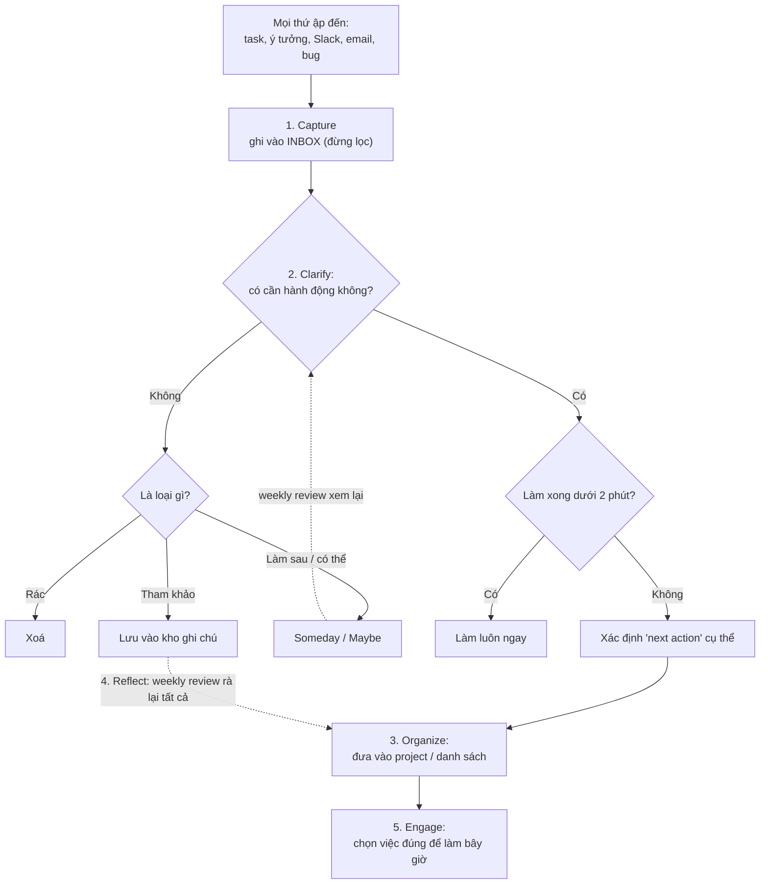

# Hệ thống quản lý task & lập kế hoạch — GTD nhẹ

> **Tác giả:** Mr.Rom\
> **Phiên bản:** v1.0.0\
> **Tạo lúc:** 13/06/2026\
> **Cập nhật:** 13/06/2026\
> **Level:** Basic\
> **Tags:** career, soft-skills, time-management, gtd, task-management, planning, weekly-review, time-estimation, planning-fallacy\
> **Yêu cầu trước:** [Deep work & Time blocking](02_deep-work-and-time-blocking.md)

> 🎯 *Bài trước dạy bạn cách **bảo vệ** một khối thời gian để làm việc khó. Nhưng khi ngồi vào khối đó, một câu hỏi vẫn ám ảnh: "rốt cuộc giờ này mình nên làm việc gì?" — và phía sau là cả tá task lởn vởn trong đầu, vài cái trong Slack, vài cái trong issue tracker, vài cái chỉ mình nhớ mang máng. Đầu óc bạn thành một cái todo-list rò rỉ. Bài này dựng cho bạn một **hệ thống quản lý task** đáng tin (theo tinh thần GTD bản nhẹ): ghi sạch mọi thứ ra khỏi đầu, dồn về **một nơi tin cậy duy nhất**, dọn nó về "inbox zero", lập kế hoạch ngày và tuần, ước lượng thời gian mà không bị **planning fallacy** lừa, và chia task lớn cho hết sợ. Khi xong, bạn không còn phải "nhớ" việc — bạn chỉ cần mở hệ thống ra và làm.*

## 🎯 Sau bài này bạn sẽ

- [ ] Hiểu vì sao "giữ task trong đầu" là gánh nặng vô hình, và năm bước của **GTD** (capture → clarify → organize → reflect → engage) ở mức thực dụng
- [ ] Dựng được **một nơi tin cậy duy nhất** (single source of truth) cho task và giữ **inbox zero** cho task
- [ ] **Lập kế hoạch ngày** (hôm trước) và **kế hoạch tuần** (đầu tuần) bằng quy trình lặp lại được
- [ ] Chạy được một **weekly review** (rà soát tuần) để hệ thống luôn đáng tin
- [ ] **Ước lượng thời gian** task tốt hơn và hiểu **planning fallacy** — vì sao ta luôn lạc quan và cách thêm buffer bằng dữ liệu quá khứ
- [ ] **Chia task lớn** thành các bước nhỏ làm được trong một phiên

---

## Tình huống — cái đầu rò rỉ task

Hãy nhìn lại một buổi sáng quen thuộc.

Bạn vừa ngồi vào khối deep work đã canh kỹ từ bài trước. Mở editor lên. Và rồi: "à, còn cái bug staging hôm qua chưa fix"... "ủa mà sếp nhắn gì trong Slack nhỉ, để check"... "thôi check luôn email"... "chết, còn phải reply cái review PR của đồng nghiệp"... "mai họp sprint, mình cần chuẩn bị gì ấy nhỉ?". Mười lăm phút trôi qua, bạn chưa gõ một dòng code, mà đầu đã mệt vì cứ chuyển qua chuyển lại giữa cả chục thứ chưa làm. Cuối ngày, bạn lờ mờ cảm giác đã quên một việc quan trọng nào đó — nhưng không nhớ nổi là việc gì. Tối đi ngủ, đầu vẫn lởn vởn "hình như mai có deadline".

Vấn đề ở đây không phải bạn lười hay vô tổ chức. Vấn đề là bạn đang dùng **bộ não làm nơi lưu trữ task** — và não cực kỳ tệ ở việc đó. Não giỏi *xử lý* (suy nghĩ, giải quyết vấn đề), nhưng dở *lưu trữ* (nhớ chính xác danh sách việc). Mỗi task chưa làm còn trong đầu là một tab trình duyệt chưa đóng — nó âm thầm ngốn RAM, kéo bạn ra khỏi việc đang làm, và gây một cảm giác lo lắng mơ hồ "còn gì đó chưa xong" mà không bao giờ tắt.

Giải pháp không phải "cố nhớ giỏi hơn" — bất khả thi. Giải pháp là **đẩy hết task ra khỏi đầu, vào một hệ thống bên ngoài đáng tin**, rồi để đầu óc trống để làm việc thật. Đó chính là ý tưởng cốt lõi của **GTD (Getting Things Done)** — phương pháp quản lý task của David Allen — mà bài này sẽ dùng ở bản nhẹ, thực dụng cho dev. Khi hệ thống đủ tin, não bạn thôi phải canh giữ danh sách việc, và bạn lấy lại được sự tập trung mà bài [Deep work](02_deep-work-and-time-blocking.md) đã dạy cách bảo vệ.

---

## 1️⃣ Vì sao phải đẩy task ra khỏi đầu

Trước khi nói cách làm, phải hiểu vì sao "giữ task trong đầu" lại độc hại tới vậy — vì nếu chưa tin điều này, bạn sẽ không chịu bỏ công ghi mọi thứ ra.

Có một hiện tượng tâm lý tên là **Zeigarnik effect** (hiệu ứng Zeigarnik): não bám lấy những việc **chưa hoàn thành** và liên tục nhắc lại chúng — chính cái cảm giác "hình như còn việc gì chưa làm" lúc nửa đêm. Đây vốn là cơ chế hữu ích thời nguyên thuỷ (đừng quên việc dở), nhưng với một dev có 30 task lửng lơ, nó biến thành một cái loa rè không bao giờ tắt. Mỗi task chưa ghi ra là một tiếng rè.

Điều quan trọng: não nhắc bạn về việc dở **không phải để bạn làm nó ngay** — nó chỉ sợ bạn *quên*. Nghiên cứu (Baumeister & Masicampo) cho thấy chỉ cần **viết task ra kèm một kế hoạch cụ thể khi nào làm**, não sẽ "yên tâm" và thôi nhắc — kể cả khi bạn chưa hề làm task đó. Nói cách khác: cái loa rè tắt không phải khi bạn *làm xong* việc, mà khi bạn *ghi nó vào một hệ thống đáng tin* mà não biết là sẽ không bị bỏ sót.

🪞 **Ẩn dụ**: bộ não giống **bộ nhớ RAM của máy tính** — cực nhanh để *xử lý*, nhưng nhỏ và **mất hết khi tắt máy**, không phải nơi để *lưu trữ* lâu dài. Hệ thống task (Todoist, issue tracker, sổ tay) giống **ổ cứng** — chậm hơn RAM nhưng lưu bền và dung lượng lớn. Bạn không lưu cả dự án vào RAM rồi cầu cho đừng mất điện; bạn ghi xuống ổ cứng. Mỗi task ôm trong đầu là một biến chiếm RAM mà đáng ra nên ghi xuống ổ cứng — giải phóng RAM ra, máy (não) mới chạy nhanh.

Đây là lý do GTD gói triết lý của nó vào một câu của David Allen: **"đầu óc là để có ý tưởng, không phải để giữ ý tưởng"** (*your mind is for having ideas, not holding them*). Mục tiêu cuối không phải là một cái list dài cho đẹp — mà là một **cái đầu trống rỗng một cách thư thái** (*mind like water*), vì mọi thứ cần nhớ đã nằm an toàn ở chỗ khác.

---

## 2️⃣ GTD ở mức thực dụng — năm bước

*GTD (Getting Things Done)* — phương pháp của David Allen — bản gốc khá đồ sộ. Nhưng phần cốt lõi gói gọn trong **năm bước**, và bạn chỉ cần năm bước này là đủ cho 95% nhu cầu của một dev. Đừng để cái tên "phương pháp" doạ bạn: về bản chất nó chỉ là một dây chuyền xử lý — thứ gì đó ập đến, bạn cho nó chạy qua dây chuyền, và nó kết thúc ở đúng chỗ.

Năm bước đó là:

1. **Capture (ghi lại)** — tóm mọi thứ trong đầu (task, ý tưởng, lo lắng, "phải nhớ làm X") và ghi ra một chỗ ngay khi nó xuất hiện. Đừng lọc, đừng đánh giá — chỉ ghi.
2. **Clarify (làm rõ)** — với mỗi thứ đã ghi, hỏi: "đây là cái gì? có cần hành động không?". Nếu có, bước hành động *tiếp theo cụ thể* là gì?
3. **Organize (sắp xếp)** — đặt mỗi thứ vào đúng chỗ: task có hành động vào danh sách/project tương ứng; thứ chỉ-để-tham-khảo vào kho ghi chú; thứ làm-sau vào "someday".
4. **Reflect (rà soát)** — định kỳ (nhất là **weekly review**) nhìn lại toàn bộ hệ thống để nó luôn cập nhật và đáng tin.
5. **Engage (bắt tay làm)** — chọn việc đúng để làm *bây giờ* dựa trên ngữ cảnh, thời gian và năng lượng bạn có — rồi làm.

Khái niệm "dây chuyền xử lý" này khá trừu tượng khi liệt kê thành năm gạch đầu dòng, nên hãy nhìn nó dưới dạng sơ đồ. Điểm mấu chốt cần thấy: mọi thứ ập đến đều đi vào **một cái inbox chung**, rồi được xử từng món một qua các câu hỏi quyết định, và **không món nào được rời inbox mà chưa có chỗ đến rõ ràng**.



> 📖 *Nhìn sơ đồ, ba điều đáng chú ý: (1) **mọi thứ** đều vào inbox trước, không có ngoại lệ — đó là chỗ Capture; (2) hai câu hỏi quyết định "có cần hành động không?" và "dưới 2 phút?" giúp xử nhanh phần lớn các món; (3) các mũi tên đứt nét là **Reflect (weekly review)** — nó quay lại quét mọi nhánh để hệ thống không bị mục nát. Bốn bước đầu là để *dựng và nuôi* hệ thống; bước Engage cuối là lúc bạn thật sự *làm việc*. Năm section tiếp theo bóc kỹ từng bước cho dev.*

---

## 3️⃣ Capture — ghi sạch mọi thứ ra khỏi đầu

Capture là bước nền tảng nhất, và cũng là bước nhiều người làm hời hợt nhất. **Capture** nghĩa là: ngay khi một task/ý tưởng/lo lắng xuất hiện trong đầu, bạn ghi nó ra **ngay lập tức** vào một chỗ — không cần làm gì với nó lúc đó, chỉ ghi.

Hai nguyên tắc làm nên hay phá Capture:

- **Ghi ngay, đừng tin vào "lát nữa nhớ".** Cái ý "lát nữa nhớ ghi" chính là thứ não dùng để rò rỉ. Nếu phải mở app, gõ mật khẩu, tìm đúng project rồi mới ghi được — bạn sẽ lười và bỏ qua. Vì thế công cụ Capture phải **nhanh tới mức không cản trở**: một phím tắt, một ô quick-add, một dòng trong sổ tay luôn mở.
- **Đừng lọc lúc ghi.** Capture không phải lúc đánh giá "việc này quan trọng không / làm thế nào". Trộn việc-ghi với việc-đánh-giá làm cả hai chậm lại và khiến bạn ngại ghi. Cứ ném mọi thứ vào inbox thô; việc lọc để dành cho bước Clarify.

🪞 **Ẩn dụ**: Capture giống **cái giỏ đựng thư ở cửa nhà**. Khi bưu tá đưa thư, bạn không đứng ngay cửa mà bóc từng phong bì ra đọc và xử lý — bạn chỉ ném tất cả vào giỏ rồi quay lại việc đang làm, để dành lúc rảnh ngồi xử cả giỏ một lượt. Cái giỏ giúp không lá thư nào rơi mất, mà cũng không bắt bạn dừng việc giữa chừng. Inbox task chính là cái giỏ đó cho mọi thứ ập vào đầu.

Là dev, "mọi thứ ập đến" của bạn tới từ **rất nhiều cửa** — và đó chính là lý do cần một chỗ Capture chung. Dưới đây là các nguồn task điển hình và cách đưa chúng về một mối:

| Nguồn task ập đến | Ví dụ | Cách capture về một mối |
|---|---|---|
| Trong đầu (tự nghĩ ra) | "Phải refactor cái module auth", "nhớ gia hạn domain" | Ghi ngay vào inbox của todo app (quick-add) |
| Chat (Slack/Teams) | Đồng nghiệp nhờ review, sếp giao việc qua tin nhắn | Chuyển thành task trong todo/issue tracker, đừng để nằm trong chat |
| Email | Yêu cầu từ khách / hệ thống báo lỗi | Biến email-cần-làm thành task, archive email gốc |
| Issue tracker (Jira/Linear/GitHub) | Bug được assign, ticket mới | Đã là task sẵn — chỉ cần là **một** tracker, đừng vài cái |
| Trong lúc code | Phát hiện chỗ cần sửa nhưng đang dở việc khác | Ghi `// TODO` rồi đẩy vào inbox cuối phiên, hoặc ghi thẳng vào inbox |

→ Điểm chung: bất kể task đến từ cửa nào, đích đến của Capture là **inbox chung** — không phải "để trong chat, lát quay lại". Cái bẫy lớn nhất của dev là dùng Slack và email như todo-list: chúng *không* phải hệ thống task, chúng là kênh liên lạc. Một việc nằm trong Slack là một việc sắp bị cuộn trôi và quên. Chuyển nó thành task ngay khi thấy.

> [!TIP]
> Hãy làm việc ghi-vào-inbox nhanh hết mức có thể. Đặt một phím tắt toàn cục cho quick-add của todo app (Todoist, Things... đều có), để bất cứ lúc nào — kể cả đang giữa khối deep work — bạn ghi một dòng trong hai giây rồi quay lại việc, không bị kéo đi. Capture càng ít ma sát, bạn càng ghi đều, và đầu càng trống.

---

## 4️⃣ Clarify & Organize — biến mớ thô thành việc làm được

Sau Capture, inbox của bạn là một mớ thô: lẫn lộn task thật, ý tưởng vu vơ, thứ chỉ để đọc, và rác. **Clarify** là bước biến mớ đó thành những thứ rõ ràng, và **Organize** là đặt chúng vào đúng chỗ. Hai bước này thường làm liền nhau, mỗi ngày một lần (cuối ngày là hợp lý).

### Clarify — hỏi đúng hai câu cho mỗi món

Cầm từng món trong inbox lên và hỏi tuần tự:

1. **"Cái này có cần hành động không?"**
   - **Không** → nó là một trong ba thứ: *rác* (xoá), *tham khảo* (lưu vào kho ghi chú để tra sau), hoặc *làm-sau-có-thể* (đẩy vào danh sách "Someday/Maybe").
   - **Có** → đi tiếp câu 2.
2. **"Hành động *tiếp theo cụ thể* là gì?"** — đây là khái niệm quan trọng nhất của GTD: **next action** (hành động kế tiếp). Không phải tên dự án mơ hồ, mà là **một hành động vật lý, làm được ngay**, bắt đầu bằng một động từ.

Khái niệm next action đáng dừng lại kỹ vì nó là nơi đa số todo-list chết. So sánh:

| ❌ Task mơ hồ (sẽ bị né mãi) | ✅ Next action cụ thể (làm được ngay) |
|---|---|
| "Làm tính năng login" | "Viết hàm `validate_password()` cho form login" |
| "Sửa cái bug staging" | "Đọc log lỗi staging từ 14h hôm qua, tìm dòng exception" |
| "Chuẩn bị họp sprint" | "Viết 3 gạch đầu dòng tiến độ task X để báo trong họp" |
| "Học Kubernetes" | "Làm xong bài 'Pod là gì' trong 20 phút tối nay" |

→ Vì sao "Làm tính năng login" cứ nằm ì trong list cả tuần? Vì mỗi lần nhìn nó, não phải *suy nghĩ* "ờ thì... bắt đầu từ đâu nhỉ?" — và suy nghĩ tốn năng lượng, nên não né. "Viết hàm `validate_password()`" thì không cần nghĩ, chỉ cần *làm*. Quy tắc: nếu một task khiến bạn do dự mỗi lần nhìn, gần như chắc chắn nó **chưa được clarify thành next action** — nó còn là một "dự án" trá hình.

> [!TIP]
> **Quy tắc 2 phút (2-minute rule)**: trong lúc Clarify, nếu một việc làm xong **dưới 2 phút**, hãy làm luôn ngay thay vì ghi vào list. Lý do: ghi nó ra, sắp xếp nó, rồi sau quay lại làm — tốn nhiều thời gian hơn cả việc làm nó luôn. Ví dụ: reply một tin "ok em nhận", merge một PR đã approve. Nhưng cẩn thận: quy tắc này chỉ áp dụng lúc *đang Clarify inbox*, không phải cái cớ để nhảy vào làm việc vặt giữa khối deep work.

### Organize — đặt mỗi thứ vào đúng chỗ

Sau khi rõ "đây là next action", đặt nó vào hệ thống. Một cấu trúc gọn, đủ cho dev:

- **Projects (dự án)** — bất cứ thứ gì cần *hơn một* next action để xong là một "project" (vd "Tính năng login"). Project chứa các next action của nó. Đây là chỗ task lớn được chia nhỏ (xem §7).
- **Next actions theo ngữ cảnh** — danh sách những việc làm được ngay. Có thể gắn nhãn theo ngữ cảnh: `@code` (cần ngồi máy tập trung), `@chat` (việc liên lạc), `@errand` (việc ngoài máy). Khi tới khối thời gian nào, lọc đúng nhãn đó.
- **Calendar (lịch)** — chỉ đặt vào lịch những thứ **gắn cứng với một thời điểm** (họp 14h, deadline thứ Sáu). Đừng nhét mọi task vào lịch — lịch là cho cam kết có giờ, không phải todo-list (kết hợp time blocking từ bài trước cho khối làm việc).
- **Someday/Maybe** — kho ý tưởng và việc-làm-sau chưa cam kết. Weekly review sẽ ghé lại đây.
- **Reference (tham khảo)** — thứ không-hành-động nhưng cần lưu (link doc, snippet). Để ở kho ghi chú, **tách khỏi** danh sách task để task list không bị loãng.

→ Mấu chốt của Organize: **một task chỉ nằm ở đúng một chỗ**, và chỗ đó phản ánh "khi nào / trong ngữ cảnh nào tôi sẽ làm nó". Đừng để task vừa trong đầu, vừa trong chat, vừa trong list — đó là cách hệ thống mất tin cậy.

---

## 5️⃣ Một nơi tin cậy duy nhất & inbox zero cho task

Cả GTD chỉ chạy được nếu thoả một điều kiện sống còn: **hệ thống phải đáng tin**. Và một hệ thống đáng tin trước hết phải là **một nơi tin cậy duy nhất** — *single source of truth* — cho mọi task của bạn.

Vì sao "duy nhất" lại quan trọng đến mức đó? Vì nếu task của bạn nằm rải ở năm chỗ (một ít trong Todoist, một ít trong Slack đã star, vài cái trong email chưa đọc, mấy dòng trong sổ tay, phần còn lại trong đầu), thì **không chỗ nào là toàn cảnh**. Mỗi lần muốn biết "mình còn việc gì", bạn phải đi gom năm chỗ — mệt tới mức bạn sẽ thôi gom, và quay về dựa vào... trí nhớ. Hệ thống vừa sụp. Não chỉ chịu **buông** task (tắt cái loa Zeigarnik ở §1) khi nó *tin chắc* rằng mở một chỗ ra là thấy hết mọi việc. Một hệ thống rải rác không bao giờ tạo được niềm tin đó.

🪞 **Ẩn dụ**: một nơi tin cậy duy nhất giống việc **chỉ có một chìa khoá nhà**. Nếu bạn cất chìa ở năm chỗ "cho chắc", thực tế là chẳng bao giờ nhớ nổi chìa nào ở đâu, và mỗi lần ra cửa là một cơn hoảng. Chỉ một chỗ cố định cho chìa khoá — lúc nào cũng biết tìm ở đâu, không phải nghĩ. Task system cũng vậy: một chỗ, luôn ở đó, luôn đầy đủ.

Vậy chọn công cụ nào làm "một nơi" đó? Công cụ ít quan trọng hơn việc **chọn một và dùng nhất quán**. Vài lựa chọn phổ biến cho dev:

| Công cụ | Hợp với ai | Ghi chú |
|---|---|---|
| **Todoist** | Quản lý task cá nhân tổng hợp (việc + đời sống) | Quick-add nhanh, có nhãn ngữ cảnh, lịch — hợp tinh thần GTD |
| **Things** | Người dùng hệ Apple, thích giao diện gọn | Thiết kế bám GTD khá sát (Inbox, Today, Projects, Someday) |
| **Linear** | Việc *trong dự án phần mềm* của team | Issue tracker hiện đại; mạnh cho task code, không cho việc cá nhân |
| **Issue tracker** (Jira/GitHub Issues) | Task công việc đã sống trong tracker của team | Dùng làm nguồn cho task *công việc*; cá nhân vẫn cần một nơi riêng |

> [!IMPORTANT]
> "Một nơi tin cậy duy nhất" **không** bắt buộc là *một app duy nhất* cho mọi mặt cuộc sống. Thực tế của dev thường là hai lớp: task **công việc-trong-dự-án** sống trong issue tracker của team (Jira/Linear/GitHub — vì cần cho cả team thấy), còn task **cá nhân/tổng hợp** (gồm cả "nhớ review PR của bạn A", "học K8s", việc đời sống) sống trong một todo app riêng. Điều bắt buộc là: với *mỗi loại* task, có đúng **một** chỗ chính thức — và bạn biết rõ loại nào ở đâu. Cái cấm là để cùng một loại task rải khắp năm nơi.

### Inbox zero cho task

Có một nơi tin cậy mới là điều kiện cần. Điều kiện đủ để nó *luôn* đáng tin là: **inbox của hệ thống task được dọn về rỗng đều đặn** — gọi là **inbox zero** (cho task, không phải cho email).

Inbox zero **không** có nghĩa là "không còn việc nào để làm" — bạn vẫn có cả đống task trong các project. Nó nghĩa là cái **inbox** (chỗ Capture thô) được **xử hết** thành các next action đã có chỗ — không còn món nào "chưa biết là gì, chưa biết để đâu". Một inbox đầy những mẩu chưa-xử dần dần giết niềm tin vào hệ thống: bạn mở ra thấy mớ hỗn độn, ngại, rồi thôi không mở nữa.

Cách giữ inbox zero, rất đơn giản:

1. **Mỗi ngày một lần** (cuối ngày là hợp lý), mở inbox và chạy Clarify+Organize cho **từng món** cho tới khi inbox rỗng.
2. Mỗi món **chỉ chạm một lần**: hoặc làm luôn (quy tắc 2 phút), hoặc biến thành next action có chỗ, hoặc xoá, hoặc đẩy vào Someday/Reference. Đừng "để lại đó xem sau".
3. Đừng để inbox tích quá nhiều ngày — inbox 60 món chưa xử là một ngọn núi khiến bạn né, còn inbox 8 món xử trong năm phút thì không đáng sợ.

> [!WARNING]
> Đừng nhầm **inbox** (nơi Capture thô, *phải* dọn rỗng) với **danh sách task** (các next action, *không* cần rỗng). Sai lầm hay gặp là cố "làm hết task cho list rỗng" rồi kiệt sức — task list luôn dài là chuyện bình thường và lành mạnh. Thứ cần về zero là cái *inbox thô*, để mọi thứ ập đến đều được phân loại, không phải số việc-cần-làm.

---

## 6️⃣ Lập kế hoạch ngày & tuần + weekly review

Hệ thống GTD lo phần "không quên việc". Nhưng *không quên* chưa đủ — bạn còn cần **chọn đúng việc** mỗi ngày và giữ hệ thống luôn tươi. Đó là việc của **lập kế hoạch** (planning) và **weekly review** (rà soát tuần) — chính là bước Reflect và Engage của GTD.

### Daily planning — lập kế hoạch ngày, làm *hôm trước*

Quy tắc vàng: **lập kế hoạch cho ngày mai vào cuối ngày hôm nay**, không phải sáng hôm sau. Vì sao "hôm trước"?

- **Sáng mai bạn vào việc ngay, không tốn quãng vàng để quyết.** Bài [Deep work](02_deep-work-and-time-blocking.md) đã chỉ: buổi sáng là quãng đầu óc sắc nhất. Tiêu nó vào việc "hôm nay làm gì ta?" là lãng phí. Nếu kế hoạch đã sẵn, bạn ngồi xuống là chạy.
- **Đầu đỡ lo buổi tối.** Ghi ra "mai làm gì đầu tiên" giúp tắt cái loa Zeigarnik (§1) — não yên tâm là việc đã có chỗ, thôi nhắc bạn lúc nửa đêm.

Quy trình daily planning gọn (3-5 phút cuối ngày), kết hợp time blocking từ bài trước:

```text
📝 LẬP KẾ HOẠCH NGÀY (làm cuối ngày cho ngày mai)

1. Dọn inbox về zero (Clarify + Organize những món hôm nay ập tới)

2. Chọn 1-3 việc QUAN TRỌNG NHẤT của ngày mai (MIT - Most Important Tasks)
   - Hỏi: "nếu mai chỉ làm xong được 1 việc, việc nào đáng nhất?"
   - Đó là MIT #1 — đặt vào khối deep work buổi sáng

3. Ghi MIT ra rõ ràng dưới dạng next action (động từ + cụ thể)

4. Time-block lịch mai: gán MIT vào quãng vàng, việc nhẹ vào quãng chùng

5. Đóng máy — đầu trống, mai chỉ việc chạy
```

→ Trái tim của daily planning là **chọn 1-3 MIT (Most Important Tasks)** — không phải liệt kê 20 việc. Một danh sách 20 việc cho một ngày là công thức của thất vọng: bạn không bao giờ xong, và cuối ngày thấy mình "thất bại" dù đã làm nhiều. Chọn 1-3 việc *quan trọng nhất* và bảo vệ chúng — phần còn lại làm được thì tốt, không thì để mai. Đây là nguyên tắc ưu tiên đã học ở bài [Ưu tiên công việc](01_prioritization.md), áp dụng cho từng ngày.

### Weekly planning & weekly review — nhịp đập của cả hệ thống

Nếu daily planning là chiến thuật từng ngày, thì **weekly review** là lúc bạn lùi lại nhìn toàn cảnh — và nó là **bước quan trọng nhất, dễ bỏ nhất** của GTD. David Allen gọi nó là "thời điểm quyết định hệ thống có sống hay chết". Không có weekly review, hệ thống dần mục: project xong rồi vẫn còn đó, task lỗi thời chất đống, Someday thành nghĩa địa — và bạn mất niềm tin, quay về dùng não.

Weekly review là một buổi cố định mỗi tuần (chọn một thời điểm yên tĩnh — vd chiều thứ Sáu hoặc sáng thứ Hai) để làm ba việc: **dọn sạch, cập nhật, nhìn tới**. Đây là một template chạy được:

```text
🔄 WEEKLY REVIEW (một buổi cố định mỗi tuần)

--- DỌN SẠCH ---
[ ] Inbox về zero: xử hết mọi món ghi vội trong tuần
[ ] Dọn inbox khác: email, Slack đã star, ghi chú rải rác → chuyển thành task
[ ] Đóng các task đã xong mà quên tick

--- NHÌN LẠI (cập nhật) ---
[ ] Rà từng project: project nào còn sống? next action kế tiếp của nó là gì?
[ ] Project nào không còn next action rõ → bổ sung, kẻo nó "đứng hình"
[ ] Xem lại calendar tuần qua: có việc nào phát sinh cần follow-up?
[ ] Xem Someday/Maybe: có gì giờ muốn kích hoạt thành project không?

--- NHÌN TỚI (lập kế hoạch tuần) ---
[ ] Xem calendar tuần tới: họp, deadline cứng nằm đâu?
[ ] Chọn 3-5 mục tiêu LỚN của tuần (kết quả muốn đạt, không phải task lẻ)
[ ] Phác sơ các MIT theo ngày để daily planning mỗi tối chỉ việc tinh chỉnh
```

> 📖 *Để ý cấu trúc ba khối: **dọn sạch** trả hệ thống về trạng thái tin cậy; **nhìn lại** đảm bảo mọi project đều có next action (project không có next action là project "chết" — nó sẽ bị né mãi); **nhìn tới** đặt khung cho cả tuần để daily planning mỗi tối nhẹ nhàng hơn. Một weekly review tốt là thứ làm bạn bước vào tuần mới với cảm giác "mình nắm hết", thay vì "không biết tuần này có gì".*

> [!TIP]
> Đừng để weekly review thành một nghi lễ nặng nề tới mức bạn bỏ. Phiên bản tối giản — chỉ làm "Inbox về zero" + "rà project lấy next action" + "chọn 3-5 mục tiêu tuần" — vẫn đem lại phần lớn giá trị. Thà một weekly review gọn làm **đều mỗi tuần** còn hơn một review hoành tráng làm được một lần rồi bỏ. Đặt nó thành sự kiện lặp lại trên calendar để khỏi quên (đúng tinh thần time blocking).

---

## 7️⃣ Ước lượng thời gian & planning fallacy

Bạn đã có hệ thống và kế hoạch. Nhưng kế hoạch chỉ tốt nếu **ước lượng thời gian** đủ đúng — và đây là chỗ gần như **mọi dev** đều sai, theo cùng một hướng: **luôn lạc quan**.

Đây không phải lỗi cá nhân bạn — nó là một thiên kiến tâm lý có tên: **planning fallacy** (ngộ nhận kế hoạch), do Kahneman & Tversky đặt ra. Nội dung: con người **luôn ước lượng thời gian/chi phí cho công việc tương lai thấp hơn thực tế**, kể cả khi biết rõ những việc tương tự trước đây đã trễ. Bạn nói "task này nửa ngày là xong" — và một cách hệ thống, nó luôn ngốn cả ngày rưỡi.

Vì sao ta lạc quan dai dẳng vậy? Vì khi ước lượng, đầu ta dựng nên **kịch bản hoàn hảo**: code chạy ngay, không bug, không họp xen ngang, không bị hỏi, không phải đợi review, thư viện không đổi API. Nhưng thực tế luôn có "ma sát": môi trường staging sập, một edge case bất ngờ, đồng nghiệp hỏi mất 20 phút, build CI đỏ. Ta quên tính phần ma sát đó — mỗi lần.

🪞 **Ẩn dụ**: ước lượng thời gian giống **đoán thời gian lái xe tới một nơi mới**. Trong đầu bạn tính theo *đường thông thoáng, không đèn đỏ, không lạc* — ra con số đẹp. Nhưng đường thật luôn có kẹt xe, đèn đỏ, một khúc quẹo nhầm. Người lái xe có kinh nghiệm không cố "đoán giỏi hơn" — họ chỉ lấy con số đẹp rồi **nhân thêm hệ số** dựa trên những chuyến trước. Bạn không sửa được sự lạc quan của não; bạn chỉ học cách bù cho nó.

Vài cách bù cho planning fallacy, từ dễ tới mạnh:

- **Thêm buffer (hệ số an toàn).** Cách thô nhưng hiệu quả: lấy ước lượng "lạc quan" của bạn rồi **nhân thêm** một hệ số (nhiều dev dùng ×1.5 tới ×2 cho việc có yếu tố chưa biết). "Nửa ngày" trong đầu → đặt kế hoạch một ngày. Buffer không phải "làm chậm" — nó là chừa chỗ cho ma sát chắc chắn sẽ tới.
- **Dùng dữ liệu quá khứ, không dùng cảm giác (outside view).** Đây là vũ khí mạnh nhất chống planning fallacy. Thay vì hỏi "task này *cảm giác* mất bao lâu?" (inside view — góc nhìn từ trong, luôn lạc quan), hãy hỏi "những task *kiểu này* trước đây mình thực tế mất bao lâu?" (outside view — góc nhìn từ ngoài, dựa số liệu). Nếu lần trước "thêm một CRUD endpoint" mất một ngày rưỡi, thì lần này cũng đừng tin con số "nửa ngày" trong đầu.
- **Ghi lại thời gian thực tế** để có dữ liệu mà dùng. Đơn giản: mỗi task lớn, ghi "ước lượng X, thực tế Y". Sau vài tuần bạn sẽ thấy *hệ số lạc quan riêng* của mình (vd "mình thường ước lượng bằng 60% thực tế") — và đó là hệ số buffer chính xác cho bạn, không phải con số đoán.

Để thấy planning fallacy "ăn" thời gian ở đâu, hãy đối chiếu kịch bản trong đầu với thực tế cho một task tưởng-chừng-đơn-giản:

| Bước của task "thêm endpoint API" | Trong đầu (lạc quan) | Thực tế (có ma sát) |
|---|---|---|
| Viết code chính | 1 giờ | 1 giờ |
| Đọc lại code/doc liên quan | (quên tính) | 30 phút |
| Viết test + sửa cho test pass | (quên tính) | 45 phút |
| CI đỏ, debug môi trường | (quên tính) | 40 phút |
| Sửa theo review của đồng nghiệp | (quên tính) | 30 phút |
| Bị hỏi/họp xen ngang | (quên tính) | 25 phút |
| **Tổng** | **1 giờ** | **~3.8 giờ** |

→ Để ý: phần code thật (1 giờ) ước lượng *đúng* — sai lầm nằm ở **những bước ta quên tính hoàn toàn**. Đây là bản chất của planning fallacy: không phải ta tính sai phần đã thấy, mà ta *không thấy* phần ma sát. Cách chữa thực dụng nhất: khi ước lượng xong, hỏi thêm "còn test, review, CI, gián đoạn thì sao?" — rồi nhân buffer.

> [!IMPORTANT]
> Khi báo deadline cho người khác (sếp, khách, team), hãy báo **con số đã cộng buffer**, không phải con số lạc quan trong đầu. Báo "nửa ngày" rồi trễ thành một ngày rưỡi làm mất niềm tin và phá kế hoạch của cả nhóm; báo "hai ngày" rồi xong trong một ngày rưỡi thì bạn là người đáng tin. Under-promise, over-deliver (hứa ít, làm nhiều hơn) gần như luôn tốt hơn ngược lại — và buffer chính là cách thực hiện nó.

---

## 8️⃣ Chia task lớn — để hết sợ và ước lượng đúng hơn

Có một loại task đặc biệt nguy hiểm: **task lớn, mơ hồ** — kiểu "build hệ thống thông báo", "refactor module thanh toán". Chúng vừa khiến bạn **trì hoãn** (vì không biết bắt đầu từ đâu), vừa khiến ước lượng **sai bét** (vì quá to để thấy hết ma sát). Vũ khí cho cả hai vấn đề là một: **chia nhỏ task**.

Vì sao chia nhỏ lại chữa được cả trì hoãn lẫn ước lượng sai?

- **Chống trì hoãn**: một task to mơ hồ kích hoạt nỗi sợ "không biết bắt đầu từ đâu" — não né. Một next action nhỏ rõ ("viết schema bảng `notifications`") thì không có gì để sợ, chỉ việc làm. Bạn đã thấy đúng cơ chế này ở §4 (next action). Chia nhỏ là cách *áp dụng next action cho task lớn*.
- **Ước lượng đúng hơn**: ước lượng một task to ("build hệ thống thông báo") gần như chắc chắn sai — nó quá lớn để não thấy hết các bước. Nhưng ước lượng từng mẩu nhỏ ("viết schema": 1 giờ; "API gửi noti": 2 giờ...) thì *từng cái* dễ đoán hơn, và tổng các mẩu sát thực tế hơn nhiều con số đoán cho cả khối.

🪞 **Ẩn dụ**: chia task lớn giống **ăn một con voi** — không ai nuốt cả con voi một lần, nhưng "ăn từng miếng một" thì xong. (Đây cũng là tinh thần "ăn con ếch" và chia nhỏ ở bài [Ưu tiên](01_prioritization.md), nhìn từ góc lập kế hoạch.) Một task to khiến bạn đứng hình vì nhìn cả con voi; cắt nó thành các miếng vừa-một-phiên thì mỗi miếng đều làm được, và làm xong miếng đầu tạo đà cho miếng sau.

Tiêu chí thực dụng để biết task đã đủ nhỏ: **mỗi mẩu nên làm xong được trong một phiên (một khối deep work / một buổi)**, và mỗi mẩu là một next action cụ thể (động từ + làm được ngay). Nếu một mẩu vẫn khiến bạn do dự "ờ thì bắt đầu sao ta?" — nó còn quá to, chia tiếp.

Ví dụ chia một task lớn của dev:

```text
❌ TASK TO (đứng hình): "Build hệ thống thông báo"

✅ CHIA NHỎ (mỗi mẩu = 1 next action làm trong 1 phiên):
   1. Viết schema bảng `notifications` (id, user_id, type, content, read_at)
   2. Viết migration tạo bảng + chạy thử trên local
   3. Viết hàm `create_notification()` + unit test
   4. Viết API `GET /notifications` (list, có phân trang)
   5. Viết API `POST /notifications/{id}/read` (đánh dấu đã đọc)
   6. Nối frontend: gọi API list, hiển thị badge số chưa đọc
   7. Viết integration test cho luồng tạo → list → đọc
```

→ Để ý: task to "build hệ thống thông báo" không có chỗ bắt đầu rõ ràng nên dễ bị né cả tuần; còn "viết schema bảng `notifications`" thì ngồi xuống làm được ngay. Khi đã chia, bạn còn được thêm hai món quà: **thấy tiến độ** (tick từng mẩu cho cảm giác đang tiến, nuôi động lực) và **ước lượng tổng sát hơn** (cộng ước lượng từng mẩu, rồi nhân buffer ở §7). Một task lớn nên được chia ngay trong lúc Clarify+Organize, hoặc trong weekly review khi rà project.

> [!TIP]
> Nếu một task lớn quá mơ hồ đến mức bạn không chia nổi ngay, thì **next action đầu tiên của nó chính là "ngồi nghĩ và chia nhỏ task này"** — một việc 15-20 phút phác ra các bước. Bản thân việc "làm rõ task" cũng là một hành động hợp lệ. Đừng bắt mình vừa-chia-vừa-làm; tách riêng "phiên lập kế hoạch cho task" khỏi "phiên thực thi" giúp cả hai nhẹ hơn.

---

## 💡 Cạm bẫy thường gặp & Best practice

### ❌ Cạm bẫy: dùng chat/email/đầu làm todo-list

- **Triệu chứng**: task nằm rải khắp — vài cái trong Slack đã "star", vài cái trong email chưa đọc, phần còn lại "để trong đầu nhớ"; thường xuyên quên việc, hoặc nhớ ra việc quan trọng lúc đã muộn.
- **Nguyên nhân**: chat và email là **kênh liên lạc**, không phải hệ thống task — việc trong đó bị cuộn trôi và quên; không có một nơi tin cậy duy nhất nên không chỗ nào là toàn cảnh.
- **Cách tránh**: chuyển *mọi* việc-cần-làm thành task trong **một nơi tin cậy** ngay khi thấy (Capture, §3); giữ inbox zero (§5) để không món nào kẹt ở trạng thái chưa-phân-loại; archive chat/email gốc sau khi đã tạo task.

### ❌ Cạm bẫy: tin vào ước lượng lạc quan trong đầu

- **Triệu chứng**: task nào cũng "nửa ngày là xong" rồi thực tế ngốn gấp đôi, gấp ba; deadline báo cho người khác liên tục trễ; cuối ngày luôn thấy "sao mình chậm thế".
- **Nguyên nhân**: **planning fallacy** — não dựng kịch bản hoàn hảo (không bug, không họp, không đợi review) và quên tính phần ma sát chắc chắn sẽ tới; dùng cảm giác (inside view) thay vì dữ liệu (outside view).
- **Cách tránh**: nhân buffer (×1.5–2) cho việc có yếu tố chưa biết; hỏi "task *kiểu này* trước đây thực tế mất bao lâu?" thay vì "cảm giác mất bao lâu?"; ghi "ước lượng X / thực tế Y" để biết hệ số lạc quan riêng; báo deadline bằng con số đã cộng buffer.

### ✅ Best practice: một nơi tin cậy duy nhất + capture không ma sát

- **Vì sao**: não chỉ chịu buông task (tắt cái loa lo lắng) khi tin chắc mở một chỗ ra là thấy hết việc; capture càng nhanh, bạn càng ghi đều, đầu càng trống để làm việc thật.
- **Cách áp dụng**: chọn một todo app và dùng nhất quán (task dự án trong issue tracker của team, task cá nhân trong một app riêng); đặt phím tắt quick-add để ghi trong hai giây; mỗi việc ập đến → ghi vào inbox ngay, đừng tin "lát nhớ".

### ✅ Best practice: chia task lớn thành next action vừa-một-phiên

- **Vì sao**: task to mơ hồ vừa kích hoạt trì hoãn (không biết bắt đầu đâu) vừa làm ước lượng sai (quá lớn để thấy hết bước); mẩu nhỏ rõ ràng thì làm được ngay và ước lượng sát hơn.
- **Cách áp dụng**: cắt mỗi task lớn thành các mẩu làm xong được trong một phiên, mỗi mẩu là next action (động từ + cụ thể); nếu một mẩu còn khiến do dự thì chia tiếp; nếu task quá mơ hồ, next action đầu tiên là "ngồi chia nhỏ task này".

---

## 🧠 Tự kiểm tra (Self-check)

**Q1.** Vì sao "giữ task trong đầu" lại có hại, và mục tiêu thật của việc capture là gì (không phải "có một cái list dài")?

<details>
<summary>💡 Xem giải thích</summary>

Não giỏi *xử lý* nhưng dở *lưu trữ* — nó giống RAM (nhanh nhưng mất khi tắt máy), không phải ổ cứng. Mỗi task chưa làm còn trong đầu kích hoạt **Zeigarnik effect**: não liên tục nhắc về việc dở (cảm giác "còn gì chưa xong" lúc nửa đêm), ngốn sự tập trung và gây lo lắng mơ hồ. Điều quan trọng: não nhắc không phải để bạn làm ngay, mà vì sợ *quên* — nên chỉ cần **ghi task ra một hệ thống đáng tin** là cái loa đó tắt, kể cả khi chưa làm. Mục tiêu thật của capture không phải một list dài cho đẹp, mà là **một cái đầu trống một cách thư thái** (mind like water) để dành cho việc nghĩ và làm, vì mọi thứ cần nhớ đã nằm an toàn bên ngoài.

</details>

**Q2.** Kể năm bước của GTD và nói ngắn gọn mỗi bước làm gì. Bước nào hay bị bỏ nhất và vì sao nó quan trọng?

<details>
<summary>💡 Xem giải thích</summary>

Năm bước: (1) **Capture** — ghi mọi thứ ập đến vào một inbox, không lọc; (2) **Clarify** — với mỗi món hỏi "có cần hành động không?" và "next action cụ thể là gì?"; (3) **Organize** — đặt mỗi thứ vào đúng chỗ (project, danh sách ngữ cảnh, calendar, someday, reference); (4) **Reflect** — định kỳ rà soát hệ thống, nhất là **weekly review**; (5) **Engage** — chọn việc đúng để làm bây giờ rồi làm. Bước hay bị bỏ nhất là **Reflect (weekly review)** — vì nó không cấp bách từng ngày. Nhưng nó quyết định hệ thống sống hay chết: không weekly review, project xong vẫn còn đó, task lỗi thời chất đống, Someday thành nghĩa địa, và bạn mất niềm tin nên quay về dùng não.

</details>

**Q3.** Phân biệt một task mơ hồ với một "next action". Cho ví dụ, và giải thích vì sao task mơ hồ hay bị né mãi trong list.

<details>
<summary>💡 Xem giải thích</summary>

Một **task mơ hồ** thực ra là tên một *dự án* hoặc một mong muốn ("làm tính năng login", "sửa bug staging") — nó không nói rõ phải *làm gì ngay*. Một **next action** là một hành động vật lý, làm được ngay, bắt đầu bằng động từ ("viết hàm `validate_password()`", "đọc log lỗi staging từ 14h hôm qua tìm dòng exception"). Task mơ hồ hay bị né vì mỗi lần nhìn nó, não phải *suy nghĩ* "bắt đầu từ đâu?" — mà suy nghĩ tốn năng lượng nên não né để làm việc dễ hơn. Next action thì không cần nghĩ, chỉ cần làm. Dấu hiệu: nếu một task khiến bạn do dự mỗi lần nhìn, gần như chắc chắn nó chưa được clarify thành next action — nó còn là một "dự án" trá hình cần chia nhỏ.

</details>

**Q4.** "Một nơi tin cậy duy nhất" nghĩa là gì, và nó có bắt buộc là *một app duy nhất* cho mọi thứ không? "Inbox zero cho task" khác gì với "không còn việc để làm"?

<details>
<summary>💡 Xem giải thích</summary>

**Một nơi tin cậy duy nhất** (single source of truth) nghĩa là: với mỗi loại task, có đúng *một* chỗ chính thức chứa toàn cảnh — để não tin chắc mở chỗ đó ra là thấy hết việc, nhờ vậy mới chịu buông task. Nó **không** bắt buộc là một app duy nhất cho cả đời sống: thực tế dev thường hai lớp — task dự án sống trong issue tracker của team (Jira/Linear/GitHub vì cả team cần thấy), task cá nhân sống trong một todo app riêng. Cái cấm là để *cùng một loại* task rải khắp năm nơi (đầu + Slack + email + sổ + app). **Inbox zero cho task** nghĩa là cái *inbox thô* (chỗ Capture) được dọn hết thành next action có chỗ — **không** có nghĩa "hết việc để làm"; danh sách task vẫn dài là bình thường và lành mạnh. Thứ cần về zero là inbox phân loại, không phải số việc cần làm.

</details>

**Q5.** Vì sao nên lập kế hoạch ngày vào *cuối ngày hôm trước* thay vì sáng hôm sau? Và vì sao nên chọn 1-3 MIT thay vì liệt kê 20 việc?

<details>
<summary>💡 Xem giải thích</summary>

Lập kế hoạch *hôm trước* có hai lợi ích: (1) sáng mai bạn vào việc ngay, không tiêu quãng vàng (đầu óc sắc nhất buổi sáng) vào việc "hôm nay làm gì ta?"; (2) ghi ra "mai làm gì đầu tiên" giúp tắt loa Zeigarnik buổi tối — não yên tâm việc đã có chỗ, thôi nhắc lúc nửa đêm. Chọn **1-3 MIT (Most Important Tasks)** thay vì 20 việc vì một list 20 việc/ngày là công thức của thất vọng: không bao giờ xong, và cuối ngày thấy mình "thất bại" dù đã làm nhiều. Chọn 1-3 việc quan trọng nhất (hỏi "nếu chỉ xong 1 việc, việc nào đáng nhất?"), đặt MIT #1 vào khối deep work buổi sáng và bảo vệ nó; phần còn lại làm được thì tốt, không thì để mai.

</details>

**Q6.** Planning fallacy là gì? Vì sao ta luôn lạc quan, và "outside view" (dùng dữ liệu quá khứ) chống nó thế nào?

<details>
<summary>💡 Xem giải thích</summary>

**Planning fallacy** (ngộ nhận kế hoạch, Kahneman & Tversky) là thiên kiến khiến ta **luôn ước lượng thời gian/chi phí thấp hơn thực tế**, kể cả khi biết việc tương tự trước đây đã trễ. Ta lạc quan dai dẳng vì khi ước lượng, đầu dựng nên **kịch bản hoàn hảo** (code chạy ngay, không bug, không họp xen, không đợi review) và quên tính phần "ma sát" chắc chắn sẽ tới (staging sập, edge case, bị hỏi, CI đỏ). **Outside view** chống nó bằng cách đổi câu hỏi: thay vì "task này *cảm giác* mất bao lâu?" (inside view — luôn lạc quan), hỏi "những task *kiểu này* trước đây mình thực tế mất bao lâu?" (outside view — dựa số liệu). Kèm theo: nhân buffer (×1.5–2) cho việc có yếu tố chưa biết, và ghi "ước lượng X / thực tế Y" để biết hệ số lạc quan riêng của mình. Báo deadline cho người khác bằng con số đã cộng buffer.

</details>

**Q7.** Chia task lớn chữa được hai vấn đề nào cùng lúc, và tiêu chí để biết một mẩu đã "đủ nhỏ" là gì?

<details>
<summary>💡 Xem giải thích</summary>

Chia task lớn chữa cùng lúc: (1) **trì hoãn** — task to mơ hồ kích hoạt nỗi sợ "không biết bắt đầu đâu" nên não né; mẩu nhỏ rõ ràng là một next action không có gì để sợ, chỉ việc làm; (2) **ước lượng sai** — task to quá lớn để não thấy hết bước nên đoán sai bét, còn ước lượng từng mẩu nhỏ dễ hơn và tổng các mẩu sát thực tế hơn. Tiêu chí "đủ nhỏ": mỗi mẩu **làm xong được trong một phiên** (một khối deep work / một buổi) và là một next action cụ thể (động từ + làm được ngay). Nếu một mẩu vẫn khiến bạn do dự "bắt đầu sao ta?" thì còn quá to, chia tiếp. Nếu task quá mơ hồ để chia ngay, next action đầu tiên chính là "ngồi nghĩ và chia nhỏ task này". (Ẩn dụ: ăn voi từng miếng một.)

</details>

---

## ⚡ Tra cứu nhanh (Cheatsheet)

### Năm bước GTD

| Bước | Một câu |
|---|---|
| Capture | Ghi mọi thứ ập đến vào inbox — đừng lọc |
| Clarify | "Có cần hành động không?" → next action cụ thể là gì? |
| Organize | Đặt vào đúng chỗ: project / list ngữ cảnh / calendar / someday / reference |
| Reflect | Rà soát định kỳ — nhất là weekly review |
| Engage | Chọn việc đúng để làm bây giờ rồi làm |

### Quy tắc lõi cần nhớ

- **Quy tắc 2 phút**: lúc clarify, việc dưới 2 phút → làm luôn, đừng ghi.
- **Next action**: động từ + cụ thể + làm được ngay (không phải tên dự án).
- **Một nơi tin cậy duy nhất**: mỗi loại task có đúng một chỗ chính thức.
- **Inbox zero ≠ hết việc**: chỉ cần *inbox thô* về rỗng, không phải task list.

### Daily planning (cuối ngày, cho mai)

- [ ] Dọn inbox về zero
- [ ] Chọn 1-3 MIT (việc quan trọng nhất)
- [ ] Ghi MIT thành next action rõ ràng
- [ ] Time-block: MIT vào quãng vàng, việc nhẹ vào quãng chùng

### Weekly review (một buổi cố định/tuần)

- [ ] **Dọn**: inbox về zero, dọn email/Slack rải rác, đóng task đã xong
- [ ] **Nhìn lại**: rà từng project có next action chưa, xem Someday/Maybe
- [ ] **Nhìn tới**: xem calendar tuần tới, chọn 3-5 mục tiêu lớn của tuần

### Ước lượng chống planning fallacy

- [ ] Hỏi "task *kiểu này* trước thực tế mất bao lâu?" (outside view), không "cảm giác"
- [ ] Nhân buffer ×1.5–2 cho việc có yếu tố chưa biết
- [ ] Ghi "ước lượng X / thực tế Y" để biết hệ số lạc quan của mình
- [ ] Báo deadline bằng con số đã cộng buffer (under-promise, over-deliver)

### Chia task lớn

- [ ] Cắt thành mẩu làm xong được trong một phiên
- [ ] Mỗi mẩu là next action (động từ + cụ thể)
- [ ] Mẩu còn khiến do dự → chia tiếp
- [ ] Task quá mơ hồ → next action đầu là "ngồi chia nhỏ task này"

---

## 📚 Từ Điển Thuật Ngữ (Glossary)

| EN | VN | Giải thích |
|---|---|---|
| GTD (Getting Things Done) | Hoàn thành việc | Phương pháp quản lý task của David Allen, 5 bước capture → engage |
| Capture | Ghi lại | Ghi mọi task/ý tưởng ra một chỗ ngay khi nó xuất hiện, không lọc |
| Clarify | Làm rõ | Xử mỗi món trong inbox: có cần hành động không, next action là gì |
| Organize | Sắp xếp | Đặt mỗi thứ vào đúng chỗ (project, list, calendar, someday, reference) |
| Reflect | Rà soát | Nhìn lại hệ thống định kỳ để nó luôn cập nhật, đáng tin |
| Engage | Bắt tay làm | Chọn việc đúng theo ngữ cảnh/thời gian/năng lượng rồi làm |
| Inbox | Hộp thư vào | Nơi chứa task thô vừa capture, chưa phân loại |
| Inbox zero | Hộp thư rỗng | Trạng thái inbox thô đã xử hết (không phải hết việc để làm) |
| Next action | Hành động kế tiếp | Một hành động vật lý, làm được ngay, bắt đầu bằng động từ |
| Project | Dự án | Bất cứ thứ gì cần hơn một next action để hoàn thành |
| Someday / Maybe | Làm sau / có thể | Kho ý tưởng và việc-làm-sau chưa cam kết |
| Single source of truth | Một nơi tin cậy duy nhất | Một chỗ chính thức chứa toàn cảnh task của mỗi loại |
| Weekly review | Rà soát tuần | Buổi cố định mỗi tuần để dọn, cập nhật, lập kế hoạch tuần |
| MIT (Most Important Tasks) | Việc quan trọng nhất | 1-3 task đáng nhất của ngày, làm trước mọi thứ khác |
| Time estimation | Ước lượng thời gian | Đoán một task sẽ mất bao lâu |
| Planning fallacy | Ngộ nhận kế hoạch | Thiên kiến luôn ước lượng thời gian thấp hơn thực tế |
| Buffer | Hệ số an toàn / khoảng đệm | Thời gian thêm vào ước lượng để bù cho ma sát chắc chắn xảy ra |
| Inside view | Góc nhìn từ trong | Ước lượng theo cảm giác về task cụ thể — thường lạc quan |
| Outside view | Góc nhìn từ ngoài | Ước lượng dựa dữ liệu các task tương tự trong quá khứ |
| Zeigarnik effect | Hiệu ứng Zeigarnik | Não bám và liên tục nhắc về việc chưa hoàn thành |
| 2-minute rule | Quy tắc 2 phút | Lúc clarify, việc dưới 2 phút thì làm luôn thay vì ghi vào list |

---

## 🔗 Liên kết & Tài nguyên

⬅️ **Bài trước:** [Deep work & Time blocking — Bảo vệ khối tập trung](02_deep-work-and-time-blocking.md)\
➡️ **Bài tiếp theo:** [Nhịp độ bền vững & tránh quá tải](04_sustainable-pace-and-avoiding-overload.md)\
↑ **Về cụm:** [Quản lý thời gian cho dev — README](../../README.md)

### 🧭 Định hướng lộ trình học

- [Quản lý thời gian cho dev — Vì sao knowledge work cần khác](00_why-time-management-for-devs.md) — nền tảng vì sao công việc tri thức cần cách quản lý thời gian riêng
- [Ưu tiên công việc — Eisenhower, 80/20, ăn con ếch](01_prioritization.md) — cách chọn *việc nào* đáng làm, bổ trợ cho việc chọn MIT mỗi ngày

### 🧩 Các chủ đề có thể bạn quan tâm

- [Deep work & Time blocking — Bảo vệ khối tập trung](02_deep-work-and-time-blocking.md) — time blocking để đặt MIT vào khối được bảo vệ
- [Nhịp độ bền vững & tránh quá tải](04_sustainable-pace-and-avoiding-overload.md) — vì sao một hệ thống task tốt cũng cần giới hạn khối lượng để không quá tải

### 🌐 Tài nguyên tham khảo khác

- [Getting Things Done (David Allen)](https://gettingthingsdone.com/) — sách gốc và trang chính thức của phương pháp GTD
- [The Planning Fallacy (Kahneman, Thinking Fast and Slow)](https://en.wikipedia.org/wiki/Planning_fallacy) — tổng quan thiên kiến planning fallacy và inside vs outside view
- [Todoist — Getting Things Done guide](https://todoist.com/productivity-methods/getting-things-done) — hướng dẫn áp dụng GTD bằng một todo app cụ thể

---

## 📌 Nhật ký thay đổi (Changelog)

- **v1.0.0 (13/06/2026)** — Bản đầu tiên. Tình huống mở bài "cái đầu rò rỉ task" + vì sao đẩy task ra khỏi đầu (Zeigarnik effect, ẩn dụ RAM vs ổ cứng) + năm bước GTD thực dụng (sơ đồ flowchart capture → engage với hai câu hỏi quyết định) + Capture (bảng nguồn task về một mối, ẩn dụ giỏ thư) + Clarify & Organize (next action vs task mơ hồ, quy tắc 2 phút, cấu trúc project/list/calendar/someday/reference) + một nơi tin cậy duy nhất (bảng Todoist/Things/Linear/issue tracker, ẩn dụ một chìa khoá) + inbox zero cho task + daily planning hôm trước (template + MIT) và weekly review (template ba khối dọn/nhìn lại/nhìn tới) + ước lượng thời gian & planning fallacy (bảng kịch bản lạc quan vs thực tế, buffer, inside vs outside view, ẩn dụ đoán giờ lái xe) + chia task lớn (ví dụ chia hệ thống thông báo, ẩn dụ ăn voi từng miếng) + 2 cạm bẫy + 2 best practice + 7 self-check + cheatsheet (6 khối) + glossary 21 thuật ngữ.
