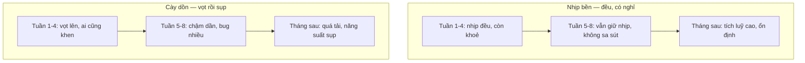

# Nhịp độ bền vững & tránh quá tải

> **Tác giả:** Mr.Rom\
> **Phiên bản:** v1.0.0\
> **Tạo lúc:** 13/06/2026\
> **Cập nhật:** 13/06/2026\
> **Level:** Basic\
> **Tags:** career, time-management, soft-skills, sustainable-pace, procrastination, meetings, batching, overcommitment, wip-limit, overload\
> **Yêu cầu trước:** [Hệ thống quản lý task & lập kế hoạch](03_task-systems-and-planning.md)

> 🎯 *Bốn bài trước đã cho bạn cả bộ công cụ quản lý thời gian: biết ưu tiên (Eisenhower, 80/20), biết bảo vệ khối tập trung (deep work, time blocking), và biết một hệ thống task gọn để không quên việc (GTD nhẹ). Nhưng tất cả công cụ đó vô nghĩa nếu bạn chỉ trụ được vài tuần rồi cháy. Bài cuối cụm này dạy phần khó nhất và ít ai dạy: chạy ở một **nhịp bền** (sustainable pace) để năng suất kéo dài hàng năm thay vì bùng vài tuần rồi tắt. Bạn sẽ học cách chống **procrastination** (trì hoãn) bằng cách giảm ma sát bắt đầu, dọn sạch lịch họp ngốn thời gian, gom việc lặt vặt (batching), chống **overcommitment** (nhận quá tay) bằng ước lượng thực tế và WIP limit cá nhân, đọc được **dấu hiệu quá tải** trên chính mình, và hiểu vì sao nghỉ ngơi là một phần của năng suất chứ không phải kẻ thù của nó. Kết bài có checklist audit lịch + bảng tín hiệu quá tải dùng ngay.*

## 🎯 Sau bài này bạn sẽ

- [ ] Hiểu **sustainable pace** (nhịp bền) là gì và vì sao năng suất dài hạn quan trọng hơn một sprint kiệt sức
- [ ] Chống **procrastination** bằng ba kỹ thuật: chia nhỏ, 2-minute rule, và giảm ma sát bắt đầu
- [ ] **Audit lịch họp** của mình, từ chối họp vô ích đúng cách, và gom họp để giữ khối làm việc liền mạch
- [ ] Dùng **batching** để gom việc lặt vặt thay vì để chúng băm vụn cả ngày
- [ ] Chống **overcommitment** bằng ước lượng thực tế, đệm thời gian (buffer) và **WIP limit** cá nhân
- [ ] Đọc được **dấu hiệu quá tải công việc** trên chính bạn và biết cách phục hồi
- [ ] Coi nghỉ ngơi là một phần của năng suất và thiết kế nó vào nhịp làm việc của mình

---

## Tình huống — quý đầu rực rỡ, quý sau cạn kiệt

Hãy nhìn lại lần gần nhất bạn vào một guồng làm việc dữ dội.

Tháng đầu nhận việc mới, bạn muốn chứng tỏ mình. Bạn nhận mọi task được giao, không bao giờ từ chối. Có người nhờ là gật. Sếp hỏi "việc này tuần sau xong được không?", bạn nói "được" dù trong lòng chưa chắc. Bạn làm thêm buổi tối, cuối tuần cũng mở máy "cho kịp". Tháng đầu trông thật ấn tượng — bạn giao được nhiều, ai cũng khen "nhiệt huyết". Bạn thấy mình bất khả chiến bại.

Rồi tới tháng thứ ba. Bạn vẫn ngồi vào bàn mỗi ngày, nhưng mọi thứ chậm lại. Một task lẽ ra nửa buổi giờ kéo cả ngày. Bạn mở file ra rồi lại đóng, không vào được việc. Lịch họp dày tới mức không còn khoảng nào để code. Danh sách "đang làm" của bạn có tám việc dở dang, không cái nào xong. Bạn cáu kỉnh, ngủ dậy đã thấy mệt, và bắt đầu sợ mở laptop. Cái "nhiệt huyết" tháng đầu giờ thành một cảm giác chìm chìm: làm mãi mà chẳng tới đâu.

Đây không phải vì bạn kém đi. Đây là một **lỗi nhịp độ**. Bạn đã chạy quý đầu với tốc độ của một cuộc chạy nước rút (sprint) — nhưng sự nghiệp là một cuộc marathon. Ai chạy nước rút trong một cuộc marathon đều gục trước vạch đích. Vấn đề không nằm ở những giờ bạn bỏ ra; nó nằm ở chỗ bạn **nhận quá tay, không có khoảng đệm, và không bao giờ thật sự dừng để hồi sức**.

Người làm việc bền lâu không phải người gồng khoẻ hơn bạn. Họ là người đã học cách **giữ một nhịp chạy được mãi**: nhận đúng sức, dọn sạch những thứ ngốn thời gian vô ích, gom việc lại cho gọn, và xây nghỉ ngơi vào lịch như một phần chính thức chứ không phải phần thừa. Bài này cho bạn đúng bộ kỹ năng đó — để quý sau bạn vẫn còn khoẻ mà chạy, thay vì cạn kiệt rồi phải bỏ cuộc.

---

## 1️⃣ Sustainable pace — vì sao nhịp bền thắng sprint kiệt sức

Trước khi nói các kỹ thuật cụ thể, phải chỉnh lại một niềm tin gốc trong đầu bạn: **làm nhiều giờ hơn không đồng nghĩa làm được nhiều hơn về lâu dài.**

**Sustainable pace** (nhịp độ bền vững) là một nguyên tắc gốc của Agile — nằm ngay trong [Agile Manifesto](https://agilemanifesto.org/principles.html): *"Agile processes promote sustainable development. The sponsors, developers, and users should be able to maintain a constant pace indefinitely."* Dịch thoát: một nhóm tốt phải giữ được một nhịp làm việc **đều, kéo dài vô hạn định** — chứ không phải bùng lên rồi tụt. Nguyên tắc này sinh ra vì ngành phần mềm từng đầy những đợt "death march" (hành quân tới chết): cày thâu đêm trước deadline, rồi cả đội kiệt sức, code đầy bug, người giỏi nghỉ việc. Bài học rút ra: tốc độ bạn duy trì được **mãi** mới là tốc độ thật của bạn.

🪞 **Ẩn dụ**: nghĩ về sự khác nhau giữa **chạy nước rút (sprint)** và **chạy marathon**. Người chạy nước rút dồn toàn lực trong 100 mét rồi phải dừng thở dốc — không ai chạy nước rút được 42 km. Người chạy marathon giữ một nhịp **chậm hơn nhưng đều**, tiết kiệm sức, và về đích trong khi người sprint đã gục từ lâu. Sự nghiệp dev là marathon: bạn sẽ code trong nhiều năm, học không ngừng vì công nghệ đổi liên tục. Chạy với tốc độ sprint nghĩa là chắc chắn gục giữa đường. Nhịp bền không phải "lười hơn" — nó là **khôn hơn về phân phối sức**.

Vì sao cày dồn thua nhịp bền, một cách cụ thể:

- **Năng suất không phẳng theo số giờ.** Vài giờ tập trung tốt đầu ngày tạo ra phần lớn giá trị; những giờ thêm vào lúc đã kiệt cho ra code đầy bug mà ngày mai bạn phải sửa. Làm 12 giờ lúc cạn pin có khi còn **âm** giá trị (vì để lại bug và nợ kỹ thuật).
- **Cày dồn ăn vào ngày mai.** Làm khuya cướp giấc ngủ; thiếu ngủ làm tụt tập trung hôm sau. Bạn không tạo thêm năng suất — bạn **vay** từ ngày mai với lãi suất cao.
- **Kiệt sức kéo dài tốn nhiều hơn cái nó tiết kiệm.** Một đợt cày tới quá tải (xem §6) có thể khiến bạn chậm hoặc dừng hẳn nhiều tuần sau đó — lỗ ròng so với việc cứ giữ nhịp đều từ đầu.

Khái niệm "nhịp bền thắng cày dồn" khá trừu tượng, nên hãy hình dung qua hai đường năng suất tích luỹ theo thời gian. Một đường cày dồn vọt lên rồi sụp; một đường nhịp bền tăng chậm mà đi xa hơn hẳn về cuối.

> 📖 *So hai nhánh: nhánh nhịp bền tăng chậm nhưng không bao giờ sụp, nên về dài tích luỹ vượt xa. Nhánh cày dồn được khen ở tháng đầu rồi sụp đúng lúc cần bền nhất — và phần "sụp" đó (quá tải, bug, phải nghỉ) ăn lại hết cái lợi của tháng đầu. Đây là lý do người làm bền lâu gần như luôn thắng người bùng-rồi-tắt, dù tháng đầu trông kém ấn tượng hơn.*

> [!IMPORTANT]
> "Nhịp bền" **không** có nghĩa là không bao giờ có ngày dồn sức. Sẽ có những đợt sự cố production hay deadline thật cần bạn làm căng hơn — điều đó bình thường. Mấu chốt là **đường mặc định**: mặc định của bạn phải là một nhịp đều giữ được mãi, còn những đợt dồn sức là **ngoại lệ có chủ đích** rồi quay lại nhịp bền, không phải trạng thái thường trực. Một chế độ chỉ-toàn-dồn-sức chính là công thức của quá tải.

Phần còn lại của bài là các đòn bẩy cụ thể để giữ được nhịp bền đó: chống trì hoãn để bắt đầu việc dễ hơn (§2), cắt những thứ ngốn thời gian vô ích như họp (§3) và việc lặt vặt rải rác (§4), nhận đúng sức để khỏi quá tải (§5), đọc tín hiệu quá tải sớm (§6), và xây nghỉ ngơi vào nhịp (§7).

---

## 2️⃣ Chống procrastination — giảm ma sát bắt đầu

Kẻ thù đầu tiên của một nhịp bền không phải là làm quá nhiều — mà là **không bắt đầu được**. Bạn biết phải làm task khó kia, nhưng cứ lần lữa: mở mạng xã hội, pha thêm cà phê, "dọn bàn cho gọn đã". Đó là **procrastination** (sự trì hoãn).

Điều quan trọng cần hiểu trước tiên: procrastination **không phải lười**. Người lười không thấy day dứt; người trì hoãn thì có — họ muốn làm, biết mình nên làm, nhưng vẫn né. Lý do thật thường là **cảm xúc**: task đó gợi cảm giác khó chịu (khó, mơ hồ, sợ làm sai, nhàm chán), và não né cái khó chịu đó bằng cách lảng sang một việc dễ chịu hơn. Trì hoãn là một cách **trốn cảm xúc tiêu cực**, không phải dấu hiệu yếu kém.

🪞 **Ẩn dụ**: bắt đầu một task khó giống **đẩy một tảng đá lớn từ trạng thái đứng yên**. Lúc đầu cực nặng — ma sát tĩnh rất lớn, đẩy mãi đá không nhúc nhích, nên ta nản và bỏ. Nhưng một khi đá đã lăn được một chút, nó tự có đà, đẩy tiếp nhẹ tênh. Mọi kỹ thuật chống trì hoãn đều có cùng một mục tiêu: **làm cho cú đẩy đầu tiên nhỏ tới mức không thể từ chối** — chỉ cần đá lăn được một xíu là phần còn lại tự chạy.

Khái niệm "giảm ma sát bắt đầu" này áp dụng được qua ba kỹ thuật cụ thể, đi từ trước khi làm tới ngay lúc làm.

### 2.1 Chia nhỏ — biến tảng đá thành sỏi

Sai lầm kinh điển là nhìn task ở dạng **to và mơ hồ** ("làm tính năng đăng nhập"). Một task to và mơ hồ thì gợi nhiều lo âu (không biết bắt đầu từ đâu), nên dễ bị né. Cách chữa là **chia nhỏ** task thành các bước cụ thể tới mức rõ ràng từng việc một.

So sánh hai cách viết cùng một task:

| ❌ Task to và mơ hồ | ✅ Đã chia nhỏ thành bước cụ thể |
|---|---|
| "Làm tính năng đăng nhập" | • Tạo form HTML có 2 ô email + mật khẩu • Viết hàm validate định dạng email • Gọi API `POST /login`, xử lý token trả về • Hiện lỗi khi sai mật khẩu |

→ Bước đầu tiên ("tạo form HTML có 2 ô") nhỏ và rõ tới mức bạn biết chính xác phải gõ gì — gần như không có lý do để né. Đây cũng chính là tinh thần của việc chia task thành "next action" cụ thể đã học ở bài [hệ thống quản lý task](03_task-systems-and-planning.md): một việc chỉ thật sự **làm được** khi nó cụ thể tới mức bạn biết động tác đầu tiên là gì.

### 2.2 2-minute rule — nếu dưới hai phút, làm ngay

**2-minute rule** (quy tắc hai phút) có hai cách dùng, cả hai đều chống trì hoãn:

- **Cách 1 (từ GTD):** nếu một việc tốn **dưới hai phút**, đừng ghi vào danh sách hay để dành — **làm luôn ngay**. Trả lời một tin nhắn ngắn, xác nhận một cuộc họp, merge một PR đã duyệt. Việc nhỏ mà cứ để dành thì chi phí "quản lý" nó (nhớ, ghi, đọc lại) còn lớn hơn chính việc đó.
- **Cách 2 (từ Atomic Habits):** với task lớn không thể xong trong hai phút, hãy **cam kết chỉ làm hai phút đầu**. "Viết test cho module thanh toán" nghe nặng; "mở file test và viết đúng một dòng assert" thì hai phút là xong. Mẹo nằm ở chỗ: một khi đá đã lăn (bạn đã mở file và gõ dòng đầu), bạn gần như luôn làm tiếp — vì phần khó nhất, *bắt đầu*, đã qua.

> [!TIP]
> Đừng lạm dụng cách 1 thành cái cớ phá khối tập trung. Nếu đang trong một khối deep work (xem bài [deep work & time blocking](02_deep-work-and-time-blocking.md)), một tin nhắn "dưới hai phút" vẫn là một cú ngắt mạch — hãy gom nó vào khối liên lạc sau (xem §4 về batching), đừng nhảy ra trả lời ngay. 2-minute rule dành cho lúc bạn đang **xử lý việc vặt**, không phải lúc đang ngâm sâu một bài toán khó.

### 2.3 Giảm ma sát môi trường — để việc đúng thành việc dễ nhất

Kỹ thuật mạnh nhất lại ít tốn ý chí nhất: **sắp đặt môi trường để bắt đầu việc tốt cần ít bước nhất, còn việc gây xao nhãng cần nhiều bước nhất.** Ý chí thua môi trường gần như mọi lần — mỗi cú click hay mỗi rào cản nhỏ đều có sức nặng lớn hơn ta tưởng với một bộ não đang ngại.

| Mục tiêu | Giảm ma sát cho việc tốt | Tăng ma sát cho việc xấu |
|---|---|---|
| Sáng ngồi vào code ngay | Tối qua để sẵn editor mở đúng file đang dở, ghi sẵn dòng "mai làm gì đầu tiên" | Đăng xuất mạng xã hội trên máy làm việc |
| Vào việc khó không lần lữa | Chia sẵn bước đầu tiên cực nhỏ (§2.1) để biết gõ gì ngay | Để điện thoại ở phòng khác trong khối tập trung |
| Tránh sa đà lướt feed | Mở sẵn tab/tài liệu cần dùng | Bật chế độ chặn site gây xao nhãng trong giờ làm |

→ Quy luật chung: **giảm số bước để bắt đầu việc tốt, tăng số bước để sa đà việc xấu**. "Để sẵn file đang dở mở từ tối qua" nghe nhỏ nhặt, nhưng nó xoá đi đúng cái khoảnh khắc nguy hiểm nhất — lúc bạn mở máy lên, mặt bàn trống trơn, và không biết bắt đầu từ đâu nên quay sang lướt điện thoại.

---

## 3️⃣ Quản lý họp — audit lịch, từ chối khéo, gom họp

Trì hoãn ăn thời gian từ bên trong. Họp ăn thời gian từ bên ngoài — và với nhiều dev, nó là kẻ ngốn thời gian **âm thầm và lớn nhất**. Một ngày tám tiếng mà có ba cuộc họp rải rác thì gần như không còn khối nào đủ dài để code. Đáng sợ hơn: một cuộc họp một tiếng với năm người không tốn "một tiếng" — nó tốn **năm tiếng người**.

🪞 **Ẩn dụ**: lịch của bạn giống một **mảnh đất**. Mỗi cuộc họp là một cái cọc đóng xuống đất. Vấn đề không chỉ là cái cọc chiếm chỗ của nó — mà là một cái cọc đóng giữa buổi sáng **chẻ đôi** mảnh đất, khiến hai nửa còn lại đều quá nhỏ để xây thứ gì lớn (một khối deep work). Quản lý họp không chỉ là "bớt cọc đi" — mà là **dồn các cọc về một góc**, để phần đất còn lại liền một mảnh, đủ rộng mà xây.

Quản lý họp gồm ba việc: soi lại để biết mình đang mất bao nhiêu (audit), cắt những cuộc vô ích (từ chối khéo), và dồn phần còn lại lại (gom họp).

### 3.1 Audit lịch họp — soi xem thời gian đi đâu

Bạn không thể cắt thứ mình chưa nhìn rõ. **Audit lịch** là việc nhìn lại một tuần lịch của mình và phân loại từng cuộc họp. Với mỗi cuộc, hỏi bốn câu:

- **Mình có cần ở đây không?** Mình đóng góp gì, hay chỉ ngồi nghe? Nếu chỉ cần biết kết quả, đọc biên bản (notes) là đủ.
- **Cuộc này có cần là một cuộc họp không?** Hay một tin nhắn / một tài liệu async là xong? (Đây là tinh thần [cộng tác async](../../../remote-work/lessons/01_basic/02_async-collaboration-remote.md) — nhiều cuộc họp thật ra là một email bị kéo dài.)
- **Cuộc này có agenda (chương trình) rõ không?** Họp không có agenda gần như luôn lan man và tốn giờ.
- **Nó rơi vào đâu trong ngày?** Một cuộc giữa buổi sáng chẻ đôi quãng vàng còn tệ hơn chính độ dài của nó.

Để audit có hệ thống, gom kết quả vào một bảng phân loại — cuộc nào giữ, cuộc nào chuyển async, cuộc nào rời lịch:

| Loại cuộc họp | Dấu hiệu | Xử lý |
|---|---|---|
| Cần và đúng định dạng | Mình đóng góp/quyết định; có agenda rõ | Giữ — và bảo vệ nó |
| Chỉ cần thông tin | Mình chỉ ngồi nghe, không phát biểu | Xin đọc notes thay vì dự; hoặc dự không bắt buộc |
| Lẽ ra là async | Cập nhật trạng thái, chia sẻ thông tin một chiều | Đề xuất thay bằng tin nhắn/tài liệu |
| Không agenda / lan man | Họp "cho có", lặp lại theo lệ mà không rõ mục tiêu | Đề xuất bỏ hoặc gộp |

→ Sau một lượt audit, hầu hết mọi người ngạc nhiên vì có bao nhiêu cuộc rơi vào ba loại dưới. Chính ba loại đó là nguồn thời gian bạn có thể đòi lại.

### 3.2 Từ chối họp vô ích — khéo nhưng dứt khoát

Audit ra rồi thì phải dám từ chối. Nhiều dev ngại từ chối vì sợ bị coi là không hợp tác — nhưng từ chối **đúng cách** không phải bất hợp tác, nó là bảo vệ thời gian để làm ra việc thật. Bí quyết là từ chối **cái họp**, không phải từ chối **con người**, và luôn kèm một lối thay thế:

- ✅ "Em không chắc cần có mặt cả buổi này — bên mình có thể gửi em notes phần liên quan tới task X được không? Em sẽ đọc và phản hồi async."
- ✅ "Cuộc này hình như có thể giải quyết nhanh qua chat — mình thử trao đổi trên kênh trước, nếu cần thì lập họp sau nha?"
- ✅ "Sáng là khối em tập trung làm tính năng Y đang gấp — mình dời cuộc này sang đầu chiều được không?"

→ Để ý điểm chung: mỗi câu từ chối đều **đề xuất một cách khác đạt cùng mục tiêu** (đọc notes, chat trước, dời giờ), nên người kia không thấy bị gạt đi. Từ chối kèm giải pháp thay thế là từ chối mà vẫn giữ được quan hệ tốt — đây là một kỹ năng [giao tiếp](../../../communication/README.md) đáng luyện.

> [!TIP]
> Nếu bạn không có quyền từ chối một cuộc họp (vd sếp triệu tập), vẫn còn đòn bẩy: hỏi **agenda trước**. Một câu "cuộc này mình muốn đạt gì để em chuẩn bị ạ?" vừa giúp bạn dự hiệu quả, vừa nhẹ nhàng đẩy người tổ chức phải có agenda rõ — và một cuộc có agenda rõ thường ngắn hơn hẳn cuộc lan man.

### 3.3 Gom họp — dồn cọc về một góc

Với những cuộc **không thể cắt**, đòn bẩy còn lại là **gom chúng lại** thay vì để rải rác. Như ẩn dụ mảnh đất: ba cuộc họp dồn vào một buổi để lại một buổi kia liền mạch cho deep work; còn ba cuộc rải mỗi buổi một ít thì cả ngày không còn khối nào đủ dài.

Cách gom họp cụ thể:

- **Đề xuất giờ họp cố định trong ngày/tuần.** Nhiều đội đặt quy ước kiểu "họp dồn vào đầu chiều" hoặc "thứ Tư là ngày họp" — phần còn lại để yên cho làm việc.
- **Chủ động dời cuộc mới vào sát các cuộc đã có.** Khi ai đó mời họp và cho chọn giờ, chọn khung **liền kề** một cuộc đã có sẵn, thay vì một khung trống giữa quãng deep work của bạn.
- **Đặt khối deep work thành sự kiện thật trên calendar** (đã học ở bài [deep work & time blocking](02_deep-work-and-time-blocking.md)) — để người khác nhìn lịch thấy bạn "bận" và không xếp họp đè lên quãng vàng.
- **Giữ một ngày / nửa ngày "no-meeting"** nếu đội cho phép — một khối lớn không họp mỗi tuần cho những việc cần ngâm sâu.

→ Mục tiêu cuối không phải "không bao giờ họp" — họp cần thì vẫn họp. Mục tiêu là giữ cho lịch còn lại có **những mảng liền**, vì giá trị của một khối hai giờ liền lớn hơn nhiều bốn khối ba mươi phút rời rạc cộng lại.

---

## 4️⃣ Batching — gom việc lặt vặt thay vì để chúng băm vụn ngày

Họp là kẻ ngốn thời gian to và dễ thấy. Nhưng có một kẻ ngốn thời gian nhỏ và khó thấy hơn: hàng chục **việc lặt vặt** rải rác — đọc và trả lời một email, duyệt một PR nhỏ, cập nhật một dòng trạng thái, trả lời một câu hỏi trong chat. Mỗi việc chỉ vài phút, nhưng cái giá thật không nằm ở vài phút đó — nó nằm ở **cú chuyển ngữ cảnh** mỗi lần.

Đây là chỗ **batching** (gom việc cùng loại) cứu bạn. Batching là gom các việc nhỏ cùng loại lại làm **một lượt vào một khối cố định**, thay vì làm rải rác mỗi khi chúng nảy ra. Lý do nằm ở chi phí ẩn của việc nhảy qua nhảy lại: mỗi lần chuyển từ "đang code sâu" sang "đọc email" rồi quay lại, bạn không chỉ mất mấy phút đọc email — bạn mất công sức **dựng lại cả mô hình bài toán trong đầu**. Khái niệm này gọi là **context switching** (chuyển ngữ cảnh), và nó là thuế ẩn đắt nhất của một ngày bị băm vụn.

🪞 **Ẩn dụ**: làm việc vặt rải rác giống **nấu một bữa mà cứ thái một củ hành rồi rửa dao, rồi thái một củ cà rốt rồi lại rửa dao**. Phần lớn thời gian trôi vào việc rửa dao lặp lại, không phải vào việc thái. Batching giống **thái hết rau một lượt rồi mới rửa dao một lần** — cùng lượng rau, ít thao tác thừa hơn nhiều. "Rửa dao" ở đây chính là cái giá chuyển ngữ cảnh: gom việc lại để trả thuế đó **một lần** thay vì hàng chục lần.

Cách áp dụng batching cho một ngày của dev:

- **Email & chat:** đừng kiểm tra liên tục. Gom thành 2-3 "khối liên lạc" cố định (vd giữa buổi sáng, đầu giờ chiều). Ngoài các khối đó, để chat ở chế độ không-quấy-rầy.
- **Code review:** thay vì nhảy vào duyệt PR ngay mỗi khi có thông báo, gom các PR lại duyệt một lượt — vd đầu giờ chiều, sau khi khối deep work buổi sáng đã xong.
- **Việc hành chính:** điền form, cập nhật ticket, trả lời câu hỏi nhỏ — gom vào một khối "việc vặt" cuối ngày khi đầu óc đã chùng (không phí quãng vàng cho chúng).
- **Họp:** gom họp (§3.3) thực ra cũng là một dạng batching — cùng một nguyên lý dồn việc cùng loại lại.

→ Để ý batching ăn khớp hoàn hảo với hai bài trước trong cụm: nó **bảo vệ khối deep work** ([bài 02](02_deep-work-and-time-blocking.md)) bằng cách nhốt việc vặt ra ngoài, và nó dựa trên việc bạn đã **gom việc vào một hệ thống tin cậy** ([bài 03](03_task-systems-and-planning.md)) nên không sợ quên — việc vặt nằm yên trong danh sách chờ tới khối của nó, không cần xử lý ngay vì sợ trôi mất.

> [!WARNING]
> Cái bẫy phổ biến nhất phá batching là **để thông báo bật suốt**. Mỗi tiếng "ting" của email/chat là một lời mời chuyển ngữ cảnh, và phần lớn người không cưỡng được việc liếc xem. Batching chỉ thật sự hoạt động khi bạn **tắt thông báo** ngoài các khối liên lạc — nếu không, bạn vẫn bị băm vụn y như cũ, chỉ là tự nhủ rằng mình đang batch.

---

## 5️⃣ Chống overcommitment — nhận đúng sức

Tới đây bạn đã biết cách bắt đầu việc (§2) và cắt những thứ ngốn thời gian (§3, §4). Nhưng nguồn gốc sâu nhất của quá tải thường nằm ở một chỗ khác, từ trước cả khi bạn ngồi vào bàn: bạn đã **nhận quá nhiều việc ngay từ đầu**. Đây là **overcommitment** (nhận quá tay) — và nó là lỗi nhịp độ chí mạng nhất, vì không kỹ thuật năng suất nào cứu nổi một người đã ôm gấp đôi lượng việc khả thi.

Vì sao ta hay nhận quá tay? Ba lý do rất người:

- **Lạc quan về thời gian** — đây là *planning fallacy* (ngộ nhận khi lập kế hoạch): con người gần như luôn ước lượng việc sẽ xong **nhanh hơn thực tế**, vì ta hình dung kịch bản trơn tru mà quên các trục trặc luôn xảy ra.
- **Ngại từ chối** — sợ làm mất lòng, sợ bị coi là không nhiệt tình, nên gật với mọi yêu cầu.
- **Không thấy được tổng tải** — khi nhận từng việc một, mỗi cái nghe đều "làm được"; chỉ khi cộng tất cả lại mới lộ ra là bất khả thi.

Chống overcommitment có ba đòn bẩy: ước lượng thực tế hơn, chừa khoảng đệm, và đặt một giới hạn cứng cho số việc làm song song.

### 5.1 Ước lượng thực tế — nhân đôi và cộng đệm

Vì bộ não mặc định ước lượng quá lạc quan, cách chữa đơn giản là **chủ động sửa lại con số ước lượng lên**. Một quy tắc kinh nghiệm phổ biến: lấy ước lượng đầu tiên của bạn rồi **nhân lên** (nhiều người dùng hệ số ×1.5 đến ×2 cho việc lạ/khó), vì con số đầu tiên gần như luôn thiếu.

Vài cách ước lượng tốt hơn:

- **Nhớ lại việc tương tự đã làm** — "lần trước làm tính năng giống thế này mất bao lâu thật?" đáng tin hơn nhiều cảm giác "chắc nhanh thôi".
- **Cộng phần ẩn người ta hay quên** — viết test, review, sửa sau review, viết tài liệu, xử lý trục trặc. Ước lượng "code xong" mà quên phần này thường thiếu một nửa.
- **Ước lượng theo khoảng, không theo một con số** — "khoảng 2-4 ngày" trung thực hơn "2 ngày", và buộc bạn nói cả kịch bản xấu.

### 5.2 Đệm thời gian (buffer) — chừa chỗ cho điều bất ngờ

Một lịch không có khoảng đệm là một lịch **chắc chắn vỡ** — vì điều bất ngờ (một bug khó, một việc gấp xen vào, một cuộc họp đột xuất) không phải ngoại lệ, nó là **thường lệ**. Lập kế hoạch như thể mọi thứ sẽ trơn tru là tự đặt bẫy.

🪞 **Ẩn dụ**: lịch không có đệm giống **lái xe bám sát đuôi xe trước không chừa khoảng cách**. Chỉ cần xe trước phanh gấp một lần (một việc xen vào) là dồn toa cả dây. Đệm thời gian giống **giữ khoảng cách an toàn**: một cú phanh bất ngờ không thành tai nạn, vì bạn có chỗ để phản ứng. Người lập kế hoạch giỏi không lấp đầy 100% lịch — họ cố tình để trống một phần cho cái-chắc-chắn-sẽ-xảy-ra-mà-không-biết-là-gì.

Cách chừa đệm cụ thể:

- **Đừng lấp đầy 100% lịch.** Nhắm khoảng 60-70% lịch cho việc đã định, để dành phần còn lại cho việc xen vào và việc tràn giờ. Một ngày "kín lịch" là một ngày không có khả năng hấp thụ bất ngờ.
- **Chèn khối đệm giữa các việc lớn.** Một khoảng trống nhỏ sau một khối deep work để việc tràn giờ không đổ domino sang việc kế.
- **Khi hứa deadline, hứa con số đã cộng đệm.** Nếu ước lượng "khoảng 3 ngày", hứa "cuối tuần" thay vì "đúng 3 ngày" — về sớm thì được khen, trễ thì không thành sự cố.

### 5.3 WIP limit cá nhân — giới hạn việc làm song song

Đòn bẩy mạnh nhất chống overcommitment mượn thẳng từ Kanban (xem [agile-scrum](../../../agile-scrum/README.md)): **WIP limit** (Work In Progress limit — giới hạn việc đang làm dở). Ý tưởng: đặt một con số tối đa cho số việc bạn cho phép mình **làm dở cùng lúc**, và không bắt đầu việc mới khi đã chạm trần — phải **làm xong một việc đang dở trước**.

Vì sao giới hạn việc làm song song lại tăng năng suất, nghe có vẻ ngược? Vì mỗi việc dở dang là một gánh nặng: nó chiếm chỗ trong đầu (bạn phải nhớ nó còn dở), và chuyển qua chuyển lại giữa nhiều việc dở tốn đúng cái thuế context switching ở §4. Tám việc dở dang nghĩa là tám lần "vừa khởi động vừa quên", không cái nào xong. Một việc làm tới xong rồi mới sang việc kế thì luôn có thứ **hoàn thành**, và "hoàn thành" mới là thứ tạo giá trị.

🪞 **Ẩn dụ**: làm nhiều việc song song giống **tung hứng nhiều quả bóng cùng lúc**. Người mới tưởng tung càng nhiều bóng càng giỏi — nhưng quá số bóng kham nổi là rơi hết. WIP limit là tự giới hạn số bóng đang trên không xuống đúng mức bạn giữ được, để không có quả nào rơi. Ít bóng mà không rơi quả nào tốt hơn nhiều bóng mà rơi cả nắm.

Cách đặt WIP limit cá nhân:

- **Chọn một con số nhỏ** cho số task lớn làm song song — nhiều người thấy **2-3** là vừa (một việc chính, tối đa một-hai việc chờ/phụ).
- **Quy tắc cứng: chạm trần thì không nhận việc mới** cho tới khi đẩy xong một việc đang dở. Đây cũng là một câu từ chối tự nhiên: "Mình đang ôm 3 việc rồi, nhận thêm thì cả 3 đều chậm — để mình xong một cái đã rồi nhận nha."
- **"Xong" phải là xong thật** — đã merge, đã deploy, đã đóng ticket — không phải "code xong còn chờ review". Việc còn đuôi vẫn chiếm một suất WIP.

> [!TIP]
> WIP limit cũng là **một cái khiên để từ chối có cơ sở**. Thay vì từ chối bằng cảm tính ("em hơi bận"), bạn có một con số cụ thể: "WIP của em đang đầy (3 việc), nhận thêm là cả 3 đều trễ." Một lý do dựa trên con số dễ được tôn trọng hơn nhiều, và nó dịch chuyển cuộc trò chuyện từ "làm được hay không" sang "vậy hạ ưu tiên việc nào để nhường chỗ?" — đúng tinh thần [ưu tiên công việc](01_prioritization.md) ở bài đầu cụm.

---

## 6️⃣ Dấu hiệu quá tải & cách phục hồi

Bạn có thể làm đúng mọi thứ ở trên mà vẫn trượt dần vào quá tải — vì nhu cầu công việc thay đổi, vì một đợt dồn sức kéo dài hơn dự kiến, vì bạn không để ý các tín hiệu nhỏ tích lại. Phần này dạy cách **đọc các tín hiệu sớm** trước khi chúng thành một cú sập, và cách **phục hồi** khi đã chạm quá tải.

> [!NOTE]
> Bài này nhìn quá tải dưới góc **quản lý thời gian / khối lượng công việc** — quá nhiều việc, không đủ khoảng thở. Khía cạnh sức khoẻ tinh thần và burnout sâu hơn (động lực, mindset, phục hồi tâm lý) được mổ kỹ ở bài [thói quen, động lực & tránh burnout](../../../learning-how-to-learn/lessons/01_basic/04_habits-motivation-and-burnout.md) bên cụm learning. Hai bài bổ trợ nhau: bài kia lo "vì sao bạn cháy", bài này lo "lượng việc đang đè bạn".

**Quá tải công việc** (work overload) là trạng thái lượng việc và áp lực vượt quá khả năng xử lý bền vững của bạn trong thời gian dài. Nó khác "bận một hôm" — bận một hôm thì nghỉ là khoẻ lại; quá tải kéo dài thì nghỉ một hôm không đủ, và nếu mặc kệ thì trượt thẳng vào burnout.

🪞 **Ẩn dụ**: làm việc quá tải lâu giống **chạy động cơ xe luôn ở vạch đỏ vòng tua mà không bao giờ về số thấp hay tắt máy**. Một thời gian thì máy nóng, công suất tụt, rồi hỏng. Các tín hiệu quá tải giống **kim đồng hồ báo nhiệt độ leo lên vùng đỏ** — chúng là lời cảnh báo *trước khi* máy cháy, để bạn kịp giảm tải. Bỏ qua kim báo nhiệt không làm máy bớt nóng; nó chỉ làm cú hỏng tới bất ngờ hơn.

Quá tải hiếm khi ập đến đột ngột; nó bò tới qua nhiều tín hiệu nhỏ. Nhận ra sớm thì chỉ cần giảm tải là phục hồi; để muộn thì cần dừng hẳn rất lâu. Các tín hiệu sớm đáng để ý, chia theo nhóm:

| Nhóm | Dấu hiệu quá tải sớm |
|---|---|
| Khối lượng | Danh sách "đang làm" cứ dài thêm mà không cái nào xong; luôn thấy "không bao giờ hết việc" |
| Năng suất | Việc trước đây làm nhanh giờ kéo dài; ngồi lâu mà ra ít; sai sót/bug tăng |
| Năng lượng | Mệt dai dẳng dù ngủ đủ; sáng dậy đã thấy nặng; cuối ngày cạn kiệt |
| Cảm xúc | Cáu kỉnh, dễ nản, sợ mở danh sách việc; mất hứng với thứ từng thích làm |
| Hành vi | Bỏ nghỉ trưa/nghỉ ngắn để "làm cho kịp"; làm thêm tối/cuối tuần thành thường lệ; trì hoãn cả việc dễ |
| Ranh giới | Không còn lúc nào thật sự "tắt máy"; công việc lấn vào giấc ngủ và thời gian riêng |

> [!WARNING]
> Tín hiệu nguy hiểm nhất mà cũng dễ tự biện minh nhất là **"bỏ nghỉ để làm cho kịp"**. Nghe có vẻ chăm chỉ, nhưng nó là vòng xoáy tự siết: bỏ nghỉ → kiệt hơn → làm chậm hơn → càng thấy không kịp → lại bỏ nghỉ nữa. Khi bạn thấy mình bắt đầu cắt những khoảng nghỉ để chạy theo việc, đó chính là lúc cần làm **ngược lại** — dừng và giảm tải — chứ không phải gồng thêm.

### Cách phục hồi & giảm tải

Khi đã đọc ra tín hiệu quá tải, việc cần làm là **giảm tải có chủ đích**, không phải gồng qua bằng ý chí (gồng qua thường làm nặng thêm). Theo thứ tự ưu tiên:

1. **Dừng nhận việc mới ngay** — đóng cửa đầu vào trước. Đã quá tải mà còn nhận thêm là đổ nước vào ly đang tràn. Dùng WIP limit (§5.3) làm lý do.
2. **Cắt bớt việc đang ôm** — không phải mọi việc đều phải bạn làm và làm ngay. Quay lại [ưu tiên công việc](01_prioritization.md): cái gì không quan trọng-khẩn thì hoãn, uỷ thác, hoặc bỏ. Giảm tải nghĩa là dám để vài việc **không** được làm.
3. **Nói ra sớm, đừng giấu** — báo cho sếp/team rằng bạn đang quá tải và cần điều chỉnh ưu tiên. Người quản lý tốt thà biết sớm để giãn deadline còn hơn nhận một cú trễ bất ngờ vào phút chót. Im lặng cày tới sập hại cả bạn lẫn dự án.
4. **Phục hồi năng lượng thật** — ngủ đủ, nghỉ tách khỏi màn hình (đi bộ, vận động, gặp người). Não hồi sức trong lúc nghỉ, không phải lúc cày — phục hồi không phải phần thưởng sau khi xong việc, nó là điều kiện để làm được việc.
5. **Hạ kỳ vọng tạm thời** — trong giai đoạn phục hồi, đặt mục tiêu mỗi ngày ở mức nhỏ nhất giữ được nhịp mà không áp lực, rồi tăng dần khi đã khoẻ lại.

→ Nếu các dấu hiệu đã sâu và kéo dài (không chỉ "quá tải một đợt" mà đã kiệt thật sự), đó là lúc cần dừng lớn hơn và tìm hỗ trợ — xem kỹ ở bài [burnout](../../../learning-how-to-learn/lessons/01_basic/04_habits-motivation-and-burnout.md). Quá tải bắt sớm thì chỉ cần chỉnh nhịp; để thành burnout thì tốn kém hơn nhiều.

---

## 7️⃣ Nghỉ ngơi là một phần của năng suất

Cả bài này dẫn tới một ý cuối, và là ý dễ bị bỏ qua nhất với người chăm chỉ: **nghỉ ngơi không phải kẻ thù của năng suất — nó là một phần của năng suất.** Người làm bền lâu không phải người nghỉ ít nhất; họ là người nghỉ **đúng cách** để giữ được nhịp.

Niềm tin sai cần gỡ bỏ trước là: *"mỗi giờ nghỉ là một giờ mất đi của công việc"*. Sự thật ngược lại. Năng suất của một dev đến từ chất lượng tập trung, mà chất lượng tập trung phụ thuộc trực tiếp vào việc bạn có hồi sức không. Một giờ làm việc lúc đầu óc tươi đáng giá gấp nhiều lần một giờ làm việc lúc cạn pin — nên thời gian nghỉ để "nạp pin" thực ra **làm tăng** tổng sản lượng, không giảm.

🪞 **Ẩn dụ**: nghỉ ngơi với năng suất giống **thay dầu và để máy nguội với một động cơ**. Không ai gọi việc thay dầu là "lãng phí thời gian chạy xe" — nó là điều kiện để xe chạy được lâu mà không hỏng. Bỏ thay dầu để "chạy được nhiều hơn" là cách nhanh nhất làm cháy máy. Người chăm chỉ mà không nghỉ đang lái xe không bao giờ thay dầu — chạy ấn tượng một thời gian rồi nằm bãi.

Nghỉ ngơi hiệu quả không phải ngẫu nhiên — nó được **thiết kế vào nhịp** ở ba tầng:

- **Nghỉ trong phiên (micro-break):** làm theo từng đợt có nghỉ ngắn xen kẽ (vd kỹ thuật Pomodoro — làm một khoảng rồi nghỉ vài phút), thay vì ngồi liền tù tì hàng giờ. Não tập trung tốt theo đợt, không phải một mạch dài. Nghỉ ngắn nghĩa là **rời màn hình thật** (đứng dậy, nhìn xa, uống nước) — lướt điện thoại không phải nghỉ cho não.
- **Nghỉ trong ngày (giờ tắt rõ ràng):** có một giờ dừng làm cố định và **tôn trọng nó**. "Làm tới khi nào mệt thì nghỉ" luôn dẫn tới làm tới khi kiệt. Một nghi thức tắt máy cuối ngày (ghi việc mai, đóng laptop hẳn, rời bàn) giúp não nhận tín hiệu "hết giờ rồi" — chi tiết ở bài [năng suất khi remote](../../../remote-work/lessons/01_basic/03_productivity-and-focus-remote.md).
- **Nghỉ trong tuần (ngày nghỉ thật):** có ít nhất một ngày không đụng việc mà không thấy tội lỗi. Đó là ngày để máy nguội hẳn — và là một phần chính thức của một nhịp bền, không phải "nếu rảnh thì nghỉ".

> [!NOTE]
> Để ý cả ba tầng nghỉ này khớp với mọi thứ ở trên: nghỉ trong phiên giúp giữ chất lượng deep work, giờ tắt rõ ràng chống always-on, ngày nghỉ thật là khoảng đệm cho cả tuần. Một nhịp bền **xây nghỉ ngơi vào lịch ngay từ đầu** như một phần chính thức — chứ không coi nó là phần thưởng được phép có sau khi đã làm xong hết việc (vì việc thì không bao giờ "xong hết").

---

## 💡 Cạm bẫy thường gặp & Best practice

### ❌ Cạm bẫy: chạy mọi lúc ở tốc độ sprint

- **Triệu chứng**: cày dữ dội mỗi đợt — làm thêm tối, cuối tuần mở máy "cho kịp", nhận mọi việc — ấn tượng vài tuần đầu rồi chậm dần, bug tăng, mệt mãi không hết, sợ mở laptop.
- **Nguyên nhân**: tin rằng nhiều giờ = nhiều việc, và chứng tỏ bằng cường độ. Coi nhịp dồn sức là mặc định thay vì ngoại lệ. Quên rằng sự nghiệp là marathon, không phải chạy nước rút.
- **Cách tránh**: đặt **nhịp bền** làm đường mặc định — một tốc độ giữ được mãi (§1); để dồn sức làm ngoại lệ có chủ đích rồi quay lại nhịp đều; nhớ năng suất không phẳng theo giờ và giờ làm lúc cạn pin có khi âm giá trị.

### ❌ Cạm bẫy: overcommitment — nhận quá tay rồi vỡ trận

- **Triệu chứng**: gật với mọi yêu cầu, hứa deadline lạc quan, ôm 6-8 việc dở dang cùng lúc, không cái nào xong; cuối cùng trễ hàng loạt và kiệt sức.
- **Nguyên nhân**: planning fallacy (ước lượng quá lạc quan), ngại từ chối, và không thấy được tổng tải vì nhận từng việc một cái nào cũng nghe "làm được".
- **Cách tránh**: ước lượng thực tế (nhân hệ số, cộng phần ẩn, dùng khoảng) (§5.1); chừa đệm — lấp 60-70% lịch, không 100% (§5.2); đặt **WIP limit cá nhân** (2-3 việc) và không nhận mới khi chạm trần (§5.3); từ chối kèm giải pháp thay thế.

### ❌ Cạm bẫy: bỏ nghỉ để "làm cho kịp"

- **Triệu chứng**: cắt nghỉ trưa, bỏ nghỉ ngắn, không còn ngày nghỉ thật, làm tới khi kiệt; càng cắt nghỉ càng chậm, càng chậm càng cắt nghỉ.
- **Nguyên nhân**: tin "mỗi giờ nghỉ là một giờ mất của việc" và "nhiều giờ = nhiều tiến bộ".
- **Cách tránh**: hiểu nghỉ ngơi là **một phần của năng suất** — chất lượng tập trung phụ thuộc vào hồi sức (§7); thiết kế nghỉ vào nhịp ở ba tầng (trong phiên / trong ngày / trong tuần); khi thấy mình bắt đầu cắt nghỉ để chạy theo việc, làm ngược lại — dừng và giảm tải.

### ✅ Best practice: audit lịch định kỳ và bảo vệ những mảng liền

- **Vì sao**: họp là kẻ ngốn thời gian âm thầm lớn nhất; một cuộc chẻ giữa buổi sáng phá cả quãng vàng còn tệ hơn độ dài của nó. Bạn không cắt được thứ chưa nhìn rõ.
- **Cách áp dụng**: audit lịch một tuần, phân loại từng cuộc (giữ / async / bỏ) (§3.1); từ chối họp vô ích kèm giải pháp thay thế (§3.2); gom họp về một góc và đặt khối deep work thành sự kiện calendar để giữ những mảng liền (§3.3).

### ✅ Best practice: gom việc cùng loại (batching) và giảm ma sát bắt đầu

- **Vì sao**: việc vặt rải rác đắt không vì vài phút mỗi cái mà vì cú chuyển ngữ cảnh mỗi lần; và phần khó nhất của mọi task là cú đẩy đầu tiên.
- **Cách áp dụng**: gom email/chat/review/việc hành chính vào vài khối cố định, tắt thông báo ngoài các khối đó (§4); chống trì hoãn bằng chia nhỏ task, 2-minute rule, và để sẵn bước đầu cực nhỏ + môi trường ít ma sát (§2).

---

## 🧠 Tự kiểm tra (Self-check)

**Q1.** "Sustainable pace" (nhịp bền) là gì, nó đến từ đâu, và vì sao về dài hạn nó thắng kiểu cày dồn dù tháng đầu trông kém ấn tượng hơn?

💡 Xem giải thích

**Sustainable pace** là nhịp làm việc **đều, giữ được kéo dài vô hạn định** — không bùng lên rồi tụt. Nó là một nguyên tắc gốc của Agile (trong Agile Manifesto: nhóm nên duy trì được một nhịp ổn định mãi), sinh ra từ bài học về những đợt "death march" cày tới sập khiến code đầy bug và người giỏi nghỉ việc. Về dài hạn nó thắng cày dồn vì: (1) năng suất không phẳng theo giờ — giờ làm lúc cạn pin cho ra bug phải sửa, có khi **âm** giá trị; (2) cày dồn **vay** từ ngày mai (làm khuya cướp giấc ngủ làm tụt tập trung hôm sau); (3) kiệt sức kéo dài tốn nhiều hơn cái nó tiết kiệm (phải chậm/dừng nhiều tuần sau). Tốc độ bạn duy trì được *mãi* mới là tốc độ thật. (Ẩn dụ: marathon, không phải chạy nước rút.) Lưu ý: nhịp bền vẫn cho phép ngày dồn sức như ngoại lệ có chủ đích, miễn mặc định là nhịp đều.

**Q2.** Procrastination thật ra bắt nguồn từ đâu (không phải "lười"), và ba kỹ thuật để giảm ma sát bắt đầu là gì?

💡 Xem giải thích

Procrastination thường là một cách **trốn cảm xúc tiêu cực**, không phải lười: task gợi cảm giác khó chịu (khó, mơ hồ, sợ sai, nhàm), và não né cái khó chịu đó bằng cách lảng sang việc dễ chịu hơn — người trì hoãn vẫn day dứt, khác hẳn người lười. Phần khó nhất là **cú đẩy đầu tiên** (ma sát tĩnh của tảng đá). Ba kỹ thuật: (1) **chia nhỏ** task to/mơ hồ thành bước cụ thể tới mức biết phải gõ gì ngay; (2) **2-minute rule** — việc dưới 2 phút làm luôn; việc lớn thì cam kết chỉ làm 2 phút đầu (đá lăn rồi thường làm tiếp); (3) **giảm ma sát môi trường** — để sẵn file đang dở, chia sẵn bước đầu cực nhỏ, đăng xuất mạng xã hội, để điện thoại xa. Quy luật: giảm bước cho việc tốt, tăng bước cho việc xấu.

**Q3.** Bạn audit lịch và thấy một cuộc họp tuần mà mình chỉ ngồi nghe, không phát biểu. Dựa vào bài, bạn xử lý thế nào, và nói câu từ chối ra sao để không bị coi là bất hợp tác?

💡 Xem giải thích

Cuộc này rơi vào loại **"chỉ cần thông tin"** — mình không đóng góp/quyết định, chỉ ngồi nghe. Xử lý: xin **đọc notes** thay vì dự, hoặc để nó thành cuộc không bắt buộc. Bí quyết từ chối: từ chối **cái họp** chứ không từ chối **con người**, và luôn kèm một **lối thay thế đạt cùng mục tiêu** — vd: "Em không chắc cần có mặt cả buổi — bên mình gửi em notes phần liên quan tới task X được không? Em đọc và phản hồi async." Vì có giải pháp thay thế (đọc notes), người kia không thấy bị gạt đi nên không thấy bất hợp tác. Nếu không có quyền từ chối (sếp triệu tập), vẫn có thể hỏi **agenda trước** để dự hiệu quả và nhẹ nhàng đẩy cuộc họp phải gọn hơn.

**Q4.** Vì sao batching việc vặt (email, review, việc hành chính) lại tiết kiệm thời gian, dù tổng lượng việc không đổi? Cái bẫy nào phá batching?

💡 Xem giải thích

Vì cái giá thật của việc vặt rải rác không nằm ở vài phút mỗi việc, mà ở **cú chuyển ngữ cảnh (context switching)** mỗi lần: chuyển từ "đang code sâu" sang "đọc email" rồi quay lại, bạn phải dựng lại cả mô hình bài toán trong đầu. Gom việc cùng loại vào một khối nghĩa là trả thuế chuyển ngữ cảnh đó **một lần** thay vì hàng chục lần. (Ẩn dụ: thái hết rau rồi mới rửa dao một lần, thay vì rửa dao sau mỗi củ.) Cách áp dụng: gom email/chat thành 2-3 khối liên lạc cố định, gom review PR một lượt, gom việc hành chính vào khối cuối ngày. Cái bẫy phá batching là **để thông báo bật suốt** — mỗi tiếng "ting" là một lời mời chuyển ngữ cảnh; batching chỉ chạy khi tắt thông báo ngoài các khối liên lạc.

**Q5.** Overcommitment là gì, ba lý do khiến ta hay nhận quá tay, và "WIP limit cá nhân" chống nó ra sao? Vì sao giới hạn việc làm song song lại tăng năng suất?

💡 Xem giải thích

**Overcommitment** là nhận quá nhiều việc vượt sức — lỗi nhịp độ chí mạng nhất vì không kỹ thuật nào cứu nổi người đã ôm gấp đôi lượng việc khả thi. Ba lý do: (1) **planning fallacy** — ước lượng việc xong nhanh hơn thực tế vì tưởng tượng kịch bản trơn tru; (2) **ngại từ chối**; (3) **không thấy tổng tải** — nhận từng việc thì cái nào cũng nghe "làm được", chỉ khi cộng lại mới lộ ra bất khả thi. **WIP limit** (Work In Progress limit, mượn từ Kanban) là đặt số tối đa việc làm dở cùng lúc (vd 2-3) và **không nhận việc mới khi chạm trần** — phải xong một việc đang dở trước. Giới hạn việc song song tăng năng suất vì mỗi việc dở dang là một gánh (chiếm chỗ trong đầu + tốn context switching khi nhảy qua lại); tám việc dở = tám lần "vừa khởi động vừa quên", không cái nào xong. Làm một việc tới xong rồi mới sang việc kế thì luôn có thứ **hoàn thành** — và hoàn thành mới tạo giá trị. (Ẩn dụ: tung hứng vừa đủ số bóng giữ được, không rơi quả nào.)

**Q6.** Kể ít nhất bốn dấu hiệu sớm của quá tải công việc. Khi đã đọc ra mình đang quá tải, các bước phục hồi theo thứ tự là gì?

💡 Xem giải thích

Dấu hiệu sớm (kể bốn bất kỳ): danh sách "đang làm" cứ dài thêm mà không cái nào xong; việc trước đây làm nhanh giờ kéo dài / bug tăng; mệt dai dẳng dù ngủ đủ; cáu kỉnh, sợ mở danh sách việc, mất hứng; **bỏ nghỉ trưa/nghỉ ngắn để "làm cho kịp"** và làm thêm tối/cuối tuần thành thường lệ; không còn lúc nào thật sự tắt máy. (Dấu hiệu nguy hiểm nhất là bỏ nghỉ để chạy theo việc — đó là vòng xoáy tự siết.) Các bước phục hồi theo thứ tự: (1) **dừng nhận việc mới ngay** (đóng đầu vào, dùng WIP limit làm lý do); (2) **cắt bớt việc đang ôm** — hoãn/uỷ thác/bỏ thứ không quan trọng-khẩn, dám để vài việc không được làm; (3) **nói ra sớm** với sếp/team để điều chỉnh ưu tiên, đừng giấu rồi sập; (4) **phục hồi năng lượng thật** (ngủ đủ, tách màn hình); (5) **hạ kỳ vọng tạm thời** rồi tăng dần. Gồng qua bằng ý chí thường làm nặng thêm.

**Q7.** "Mỗi giờ nghỉ là một giờ mất của công việc" — vì sao niềm tin này sai? Nghỉ ngơi nên được thiết kế vào nhịp ở những tầng nào?

💡 Xem giải thích

Sai vì năng suất của dev đến từ **chất lượng tập trung**, mà chất lượng tập trung phụ thuộc trực tiếp vào việc có hồi sức không: một giờ làm lúc đầu óc tươi đáng giá gấp nhiều lần một giờ lúc cạn pin, nên thời gian nghỉ để nạp pin thực ra **làm tăng** tổng sản lượng. (Ẩn dụ: thay dầu và để máy nguội không phải "lãng phí thời gian chạy xe" mà là điều kiện để xe chạy bền.) Nghỉ ngơi nên thiết kế vào nhịp ở **ba tầng**: (1) **nghỉ trong phiên** (micro-break, kiểu Pomodoro — làm một khoảng rồi nghỉ vài phút, rời màn hình thật); (2) **nghỉ trong ngày** (giờ tắt cố định + nghi thức tắt máy để não nhận tín hiệu "hết giờ"); (3) **nghỉ trong tuần** (ít nhất một ngày không đụng việc, không thấy tội lỗi). Nhịp bền xây nghỉ vào lịch ngay từ đầu như phần chính thức, không coi nó là phần thưởng sau khi "xong hết việc" — vì việc không bao giờ xong hết.

---

## ⚡ Tra cứu nhanh (Cheatsheet)

### Nhịp bền — nguyên tắc gốc

| ❌ Sprint kiệt sức | ✅ Nhịp bền |
|---|---|
| Cày dồn, làm thêm tối/cuối tuần thành thường lệ | Nhịp đều giữ được mãi; dồn sức là ngoại lệ có chủ đích |
| Đo bằng số giờ bỏ ra | Đo bằng việc làm ra bền vững theo thời gian |
| Lấp đầy 100% lịch | Lấp 60-70%, chừa đệm cho bất ngờ |

### Chống procrastination — 3 đòn

- [ ] **Chia nhỏ** task to/mơ hồ thành bước cụ thể (biết gõ gì ngay)
- [ ] **2-minute rule** — dưới 2 phút làm luôn; việc lớn cam kết chỉ làm 2 phút đầu
- [ ] **Giảm ma sát** — để sẵn file đang dở, môi trường ít cám dỗ

### Audit lịch họp — 4 câu hỏi mỗi cuộc

- [ ] Mình có cần ở đây không (đóng góp hay chỉ ngồi nghe)?
- [ ] Cuộc này có cần là họp, hay một tin nhắn/tài liệu async là xong?
- [ ] Có agenda (chương trình) rõ không?
- [ ] Nó rơi vào đâu trong ngày (có chẻ đôi quãng vàng không)?

→ Từ chối kèm giải pháp thay thế (đọc notes / chat trước / dời giờ). Gom họp về một góc, giữ những mảng liền cho deep work.

### Batching — gom việc cùng loại

- [ ] Email/chat: 2-3 khối liên lạc cố định, ngoài đó để DND
- [ ] Code review: gom một lượt (vd đầu giờ chiều)
- [ ] Việc hành chính: gom vào khối cuối ngày (lúc đầu óc chùng)
- [ ] **Tắt thông báo** ngoài các khối — nếu không, batching vô nghĩa

### Chống overcommitment

- [ ] Ước lượng thực tế: nhân hệ số (×1.5–2), cộng phần ẩn (test/review/doc), dùng khoảng
- [ ] Chừa đệm: lấp 60-70% lịch, hứa deadline đã cộng buffer
- [ ] **WIP limit cá nhân: 2-3 việc** — chạm trần thì không nhận mới, xong một cái đã

### Tín hiệu quá tải (dừng & giảm tải khi thấy)

- [ ] Danh sách "đang làm" dài thêm mà không cái nào xong
- [ ] Việc từng làm nhanh giờ kéo dài; bug/sai sót tăng
- [ ] Mệt dai dẳng dù ngủ đủ; cáu kỉnh; sợ mở danh sách việc
- [ ] **Bỏ nghỉ để "làm cho kịp"** (dấu hiệu nguy hiểm nhất)
- [ ] Làm thêm tối/cuối tuần thành thường lệ; không còn lúc tắt máy

### Phục hồi khi quá tải — theo thứ tự

1. Dừng nhận việc mới ngay (đóng đầu vào)
2. Cắt bớt việc đang ôm (hoãn / uỷ thác / bỏ)
3. Nói ra sớm với sếp/team, đừng giấu
4. Phục hồi năng lượng thật (ngủ đủ, tách màn hình)
5. Hạ kỳ vọng tạm thời rồi tăng dần

### Nghỉ ngơi — 3 tầng xây vào nhịp

| Tầng | Cách làm |
|---|---|
| Trong phiên | Pomodoro / nghỉ ngắn rời màn hình thật |
| Trong ngày | Giờ tắt cố định + nghi thức tắt máy |
| Trong tuần | Ít nhất một ngày nghỉ thật, không tội lỗi |

---

## 📚 Từ Điển Thuật Ngữ (Glossary)

| EN | VN | Giải thích |
|---|---|---|
| Sustainable pace | Nhịp độ bền vững | Nhịp làm việc đều, giữ được kéo dài vô hạn định — nguyên tắc gốc Agile |
| Sprint | Chạy nước rút | Dồn toàn lực một đợt ngắn; không giữ được lâu |
| Death march | Hành quân tới chết | Đợt cày thâu đêm trước deadline khiến cả đội kiệt sức, code đầy bug |
| Procrastination | Trì hoãn | Né một task (vì cảm xúc khó chịu) dù biết nên làm — không phải lười |
| 2-minute rule | Quy tắc hai phút | Việc dưới 2 phút làm ngay; hoặc cam kết chỉ làm 2 phút đầu của việc lớn |
| Friction | Ma sát | Số bước/rào cản phải vượt để bắt đầu một việc; giảm nó là chống trì hoãn |
| Audit (lịch) | Soi lại / rà soát | Nhìn lại và phân loại từng mục để biết thời gian đi đâu |
| Agenda | Chương trình họp | Danh sách mục tiêu/nội dung cần đạt của một cuộc họp |
| Async | Bất đồng bộ | Trao đổi không cần cùng lúc (tin nhắn, tài liệu) thay cho họp trực tiếp |
| Batching | Gom việc cùng loại | Gom các việc nhỏ cùng loại làm một lượt vào một khối cố định |
| Context switching | Chuyển ngữ cảnh | Chi phí ẩn khi nhảy giữa các việc — phải dựng lại mô hình bài toán trong đầu |
| Overcommitment | Nhận quá tay | Nhận quá nhiều việc vượt khả năng xử lý bền vững |
| Planning fallacy | Ngộ nhận khi lập kế hoạch | Xu hướng ước lượng việc xong nhanh hơn thực tế |
| Buffer | Khoảng đệm | Thời gian trống chừa sẵn cho việc bất ngờ / việc tràn giờ |
| WIP limit | Giới hạn việc đang làm | Số tối đa việc làm dở cùng lúc (mượn từ Kanban); chạm trần thì không nhận mới |
| Work overload | Quá tải công việc | Lượng việc/áp lực vượt khả năng xử lý bền vững trong thời gian dài |
| Burnout | Kiệt sức | Cạn kiệt thể chất/cảm xúc/động lực do gắng sức quá lâu không phục hồi |
| Micro-break | Nghỉ ngắn | Quãng nghỉ vài phút xen giữa các đợt làm, rời màn hình thật |
| Shutdown ritual | Nghi thức tắt máy | Chuỗi hành động cuối ngày báo não "hết giờ" (đóng laptop, rời bàn) |

---

## 🔗 Liên kết & Tài nguyên

⬅️ **Bài trước:** [Hệ thống quản lý task & lập kế hoạch — GTD nhẹ](03_task-systems-and-planning.md)\
↑ **Về cụm:** [time-management — README](../../README.md)

### 🧭 Định hướng lộ trình học

- [Ưu tiên công việc — Eisenhower, 80/20, ăn con ếch](01_prioritization.md) — nền để giảm tải đúng: cái gì không quan trọng-khẩn thì hoãn/uỷ thác/bỏ
- [Deep work & Time blocking — Bảo vệ khối tập trung](02_deep-work-and-time-blocking.md) — gom họp và batching chính là để giữ những khối liền này

### 🧩 Các chủ đề có thể bạn quan tâm

- [Thói quen, động lực & tránh burnout](../../../learning-how-to-learn/lessons/01_basic/04_habits-motivation-and-burnout.md) — góc sức khoẻ tinh thần của quá tải: vì sao bạn cháy và cách phục hồi tâm lý
- [Năng suất & tập trung khi remote — Output trên giờ ngồi](../../../remote-work/lessons/01_basic/03_productivity-and-focus-remote.md) — chống always-on và nghi thức tắt máy cho người làm tại nhà
- [Cộng tác async khi remote](../../../remote-work/lessons/01_basic/02_async-collaboration-remote.md) — vì sao nhiều cuộc họp thật ra là một email bị kéo dài

### 🌐 Tài nguyên tham khảo khác

- [Agile Manifesto — 12 Principles](https://agilemanifesto.org/principles.html) — nguồn gốc nguyên tắc "sustainable pace" (nguyên tắc thứ 8)
- [James Clear — How to Stop Procrastinating](https://jamesclear.com/procrastination) — phân tích procrastination và 2-minute rule
- [Cal Newport — Deep Work](https://calnewport.com/books/deep-work/) — chi phí context switching và giá trị của khối tập trung liền

---

## 📌 Nhật ký thay đổi (Changelog)

- **v1.0.0 (13/06/2026)** — Bản đầu tiên, đóng cụm time-management và module 16_career-soft-skills. Tình huống mở bài "quý đầu rực rỡ, quý sau cạn kiệt" + sustainable pace là nguyên tắc Agile (sơ đồ nhịp-bền-vs-cày-dồn) + chống procrastination (chia nhỏ, 2-minute rule, giảm ma sát môi trường) + quản lý họp (audit 4 câu hỏi + bảng phân loại, từ chối kèm giải pháp thay thế, gom họp) + batching việc lặt vặt (context switching) + chống overcommitment (ước lượng thực tế, đệm thời gian/buffer, WIP limit cá nhân 2-3) + dấu hiệu quá tải (bảng tín hiệu theo nhóm) + cách phục hồi 5 bước + nghỉ ngơi là một phần năng suất (3 tầng) + các ẩn dụ marathon-vs-sprint / tảng-đá-lăn / cọc-trên-mảnh-đất / thái-rau-rửa-dao / lái-xe-giữ-khoảng-cách / tung-hứng-bóng / kim-báo-nhiệt / thay-dầu-động-cơ + 3 cạm bẫy + 2 best practice + 7 self-check + cheatsheet (8 khối) + glossary 19 thuật ngữ.
