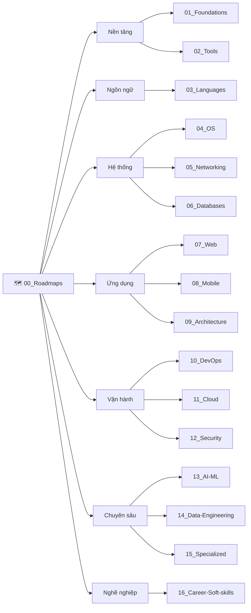

# 🚀 Dev-Knowledge — Kho Tri Thức CNTT Toàn Diện (Tiếng Việt)

> **Tác giả:** Mr.Rom\
> **Phiên bản:** v0.1.2 (Sitemap Redesign & Minimalist README)\
> **Tạo lúc:** 16/05/2026\
> **Cập nhật:** 26/05/2026

> 🎯 *Không chỉ là một kho lưu trữ bài viết kỹ thuật khô khan. Đây là một **bản đồ tri thức sống động, được dẫn dắt bằng câu chuyện (Narrative-driven)**, được viết bằng ngôn từ tiếng Việt tinh tế, giàu ẩn dụ trực quan và có tính thực chiến cực cao. Kho tri thức phục vụ đồng thời cả 4 nhóm: beginner zero-base, người chuyển ngành, junior/mid-level củng cố gốc rễ, và senior tra cứu nhanh.*

---

## 🚀 Bắt Đầu Nhanh (Quick Start)

Kho tri thức này được thiết kế theo cấu trúc mô-đun hóa đồng bộ. Hãy chọn "chân dung" phù hợp nhất với bạn dưới đây để bắt đầu hành trình chinh phục công nghệ một cách thông thái nhất:

### 🟢 1. Bạn là người hoàn toàn mới (Zero-base)?
> Bạn chưa từng gõ một dòng code nào, chưa biết gì về IT, hoặc là người chuyển ngành từ lĩnh vực khác sang.
- 👉 **Điểm xuất phát bắt buộc**: [**Lộ trình Zero-to-Coder Career Roadmap**](00_Roadmaps/career/zero-to-coder_career-roadmap.md)
- *Lộ trình này sẽ dẫn dắt bạn đi qua 5 Stage cực kỳ logic: từ việc hiểu bản đồ ngành IT, cấu trúc máy tính, Terminal, Git, cho đến ngôn ngữ lập trình Python và dự án Portfolio đầu tay.*

### 🟡 2. Bạn đã biết code cơ bản và muốn chuyên sâu?
> Bạn đã nắm vững logic lập trình cơ bản và muốn chọn một lộ trình nghề nghiệp rõ ràng để đi làm.
- 👉 **Điểm xuất phát**: [**Thư mục 17 Career Roadmaps**](00_Roadmaps/)
- *Hãy chọn ra nghề nghiệp bạn muốn theo đuổi (Backend Developer, Frontend Developer, DevOps Engineer, AI Engineer...) để xem chi tiết danh sách các bài học MUST-KNOW cần chinh phục.*

### 🟠 3. Bạn là Senior cần ôn tập hoặc tra cứu nhanh?
> Bạn cần ôn lại kiến thức cốt lõi trước buổi phỏng vấn hoặc tìm kiếm các "mẹo vặt" giải quyết lỗi thực chiến.
- 👉 **Lối tắt nhanh**: Vào trực tiếp L1 phù hợp → Đọc file `_cheatsheet.md` hoặc `_glossary.md` để tra cứu thuật ngữ.
- 👉 **Giải quyết sự cố thực chiến**: Tìm kiếm các tình huống xử lý lỗi cực kỳ chi tiết trong thư mục `recipes/` của từng chủ đề con.

### 🔵 Bạn muốn đóng góp cho dự án?
- → Đọc kỹ [**`CONTRIBUTING.md`**](CONTRIBUTING.md) trước.\
- → Tra cấu trúc thiết kế kho chi tiết tại [**`_Blueprint/`**](_Blueprint/).\
- → Copy template chuẩn từ [**`_Blueprint/templates/`**](_Blueprint/templates/) để bắt đầu viết bài mới.

---

## 🗺️ Cấu Trúc Luồng Tri Thức (Sitemap)

Dự án được thiết kế theo mô hình các mảng tri thức ngang hàng và độc lập tương đối. Lộ trình định hướng (Roadmaps) đóng vai trò là "chất keo" dẫn dắt người học đi qua các mảng tri thức phù hợp nhất với mục tiêu của họ:

| # | Chủ đề | Nội dung chính |
|---|---|---|
| 00 | 🗺️ [Roadmaps](00_Roadmaps/) | Lộ trình chi tiết theo từng nhánh nghề nghiệp + Lab series thực chiến |
| 01 | 🧠 [Foundations](01_Foundations/) | Lý thuyết khoa học máy tính: Bản đồ ngành, Cấu trúc máy tính, Môi trường chạy |
| 02 | 🛠️ [Tools](02_Tools/) | Bộ công cụ phối hợp: VS Code, Git, GitHub, Shell Customize |
| 03 | 💻 [Languages](03_Languages/) | Ngôn ngữ lập trình cốt lõi: Python, Go, JS/TS, Rust... |
| 04 | 🖥️ [OS](04_OS/) | Làm chủ hệ điều hành: Linux, MacOS, Windows |
| 05 | 🌐 [Networking](05_Networking/) | Mạng máy tính thực chiến: TCP/IP, HTTP, DNS, Load Balancer, TLS |
| 06 | 🗄️ [Databases](06_Databases/) | Cơ sở dữ liệu: SQL, NoSQL, Postgres, Vector DB |
| 07 | 🕸️ [Web](07_Web/) | Phát triển ứng dụng Web: Frontend, Backend, API REST/GraphQL |
| 08 | 📱 [Mobile](08_Mobile/) | Phát triển ứng dụng di động: iOS, Android, Cross-platform |
| 09 | 🏛️ [Architecture](09_Architecture/) | Kiến trúc & Thiết kế hệ thống: Design patterns, System design |
| 10 | ⚙️ [DevOps](10_DevOps/) | Tự động hóa & Vận hành: Docker, K8s, CI/CD, IaC, Observability |
| 11 | ☁️ [Cloud](11_Cloud/) | Điện toán đám mây: AWS, GCP, Azure, DigitalOcean |
| 12 | 🔒 [Security](12_Security/) | Bảo mật an toàn thông tin: Cybersec, Cryptography, Auth |
| 13 | 🤖 [AI-ML](13_AI-ML/) | Trí tuệ nhân tạo: ML, DL, LLM, RAG, AI Agent |
| 14 | 📊 [Data-Engineering](14_Data-Engineering/) | Kỹ thuật dữ liệu lớn: ETL, Data Warehouse, Streaming |
| 15 | 🎮 [Specialized](15_Specialized/) | Ngành chuyên biệt: Game Dev, Embedded/IoT, Blockchain |
| 16 | 💼 [Career-Soft-skills](16_Career-Soft-skills/) | Kỹ năng mềm & Phát triển sự nghiệp: Agile, Communication |

---

## 🏗️ Triết Lý Bài Viết

Để đảm bảo mỗi bài viết trong kho tri thức này đều có chất lượng vượt trội và mang lại trải nghiệm học tập tốt nhất, chúng mình luôn bám sát **5 nguyên tắc sinh mệnh**:

1. **WHY → WHAT → HOW**: Không bao giờ ném định nghĩa khô khan cho người đọc. Chúng mình luôn giải thích *Tại sao công nghệ này ra đời (nỗi đau thực tế là gì)*, rồi mới giải thích *Nó là cái gì (định nghĩa + ẩn dụ)*, và cuối cùng mới là *Sử dụng nó thế nào (hands-on thực hành)*.
2. **Ẩn Dụ Đời Thường (Metaphor First)**: Mọi khái niệm kỹ thuật phức tạp (như CPU, RAM, Git, Docker, Kubernetes) đều được đi kèm ít nhất một phép ẩn dụ đời thường cực kỳ trực quan (như căn bếp, thợ xây, thợ điện nước) giúp bạn "nhìn thấy" công nghệ bằng mắt thường.
3. **Dẫn Dắt Bằng Câu Chuyện (Narrative Master)**: Các chương, các phần và các bài viết không đứng riêng lẻ. Chúng được nối kết bằng các **câu bắc cầu logic** mượt mà, giúp dòng chảy tư duy của bạn không bị đứt gãy hay vấp váp.
4. **Hands-on Thực Chiến**: Mọi đoạn code mẫu, file cấu hình YAML hay lệnh Terminal được đưa vào bài học đều phải đảm bảo **chạy được ngay 100% (copy-paste và chạy)** mà không bỏ qua bất kỳ bước cài đặt hay cấu hình ẩn nào.
5. **Thiết Kế 4 Tầng Đọc**: Một bài viết phục vụ đồng thời cả 4 nhóm: Beginner đọc hiểu bản chất, Junior học thực hành, Senior tra cứu nhanh cheatsheet, và Expert tìm kiếm các recipes xử lý sự cố.

---

## 📊 Trạng Thái Kho Tri Thức

| Hạng mục | Trạng thái / Số lượng |
|---|---|
| 16 L1 + Roadmaps | ✅ Cấu trúc khung xương (Skeleton) đã hoàn thành |
| Bài viết hoàn chỉnh | 🚧 Đang xây dựng & Cải tiến cuốn chiếu |
| Bài học mẫu | 5 bài học mẫu chuẩn Blueprint trong `_Blueprint/examples/` |

Theo dõi tiến độ chi tiết của từng bài viết tại: [**`MASTER-CATALOG.md`**](MASTER-CATALOG.md)

---

## 🤝 Đóng Góp

Mọi đóng góp nhằm nâng cao chất lượng kho tri thức đều được trân quý. Xin vui lòng xem kỹ hướng dẫn tại [**`CONTRIBUTING.md`**](CONTRIBUTING.md). Các quy tắc thiết kế cấu trúc bài viết và quy chuẩn thư mục chi tiết đã được quy định đầy đủ tại [**`_Blueprint/`**](_Blueprint/).

---

## 📌 Changelog

- **v0.1.2 (26/05/2026)** — Tinh giản README chính theo phản hồi của bạn:
  - Vẽ lại sơ đồ Mermaid ngang hàng (graph LR) rành mạch và trực quan, thể hiện rõ tính chất Roadmap trỏ đến các mảng tri thức độc lập, song song, không cưỡng ép theo thứ tự Stage cứng nhắc.
  - Gỡ bỏ hoàn toàn mục *"Cấu Trúc Thư Mục Tiêu Chuẩn"* rườm rà tại README root vì đã được quy định rất kỹ trong bộ [**`_Blueprint/`**](_Blueprint/).
  - Giữ lại nguyên vẹn phần **"## 🏗️ Triết Lý Bài Viết"** đầy chất thơ, tinh tế và giàu ẩn dụ để người đọc cảm nhận được giá trị sâu sắc của repo.
  - Đồng bộ quy ước đặt tên file cheatsheet thành `_cheatsheet.md` trong L2.
- **v0.1.1 (26/05/2026)** — Tái cấu trúc sitemap & Nâng cấp roadmap học tập (Narrative Master):
  - Chuyển Git từ `01_Foundations/version-control/git/` quay trở lại `02_Tools/git/` và dọn dẹp thư mục trống `01_Foundations/version-control/`.
  - Bổ sung bài học Nền tảng Khoa học Máy tính mới `00_how-computer-works.md` vào `01_Foundations/computer-architecture-theory/`.
  - Viết lại roadmap `zero-to-coder_career-roadmap.md` thành bản dẫn truyện có chiều sâu, kết hợp các câu bắc cầu logic.
  - Cập nhật đồng bộ `_Blueprint/`, `README.md`, `MASTER-CATALOG.md` và `CONTRIBUTING.md`.
- **v0.1.0 (16/05/2026)** — Skeleton phase: tạo 17 folder L1 + Roadmaps subfolders. Root README + CONTRIBUTING + MASTER-CATALOG. Sẵn sàng cho contributor.
