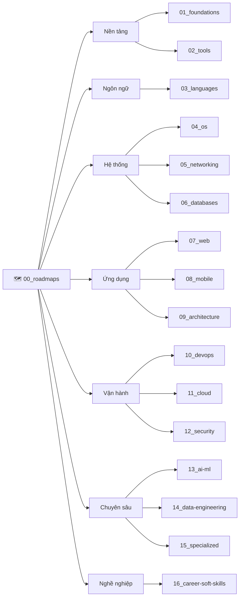

# 🚀 Dev-Knowledge — Kho Tri Thức CNTT Toàn Diện

> **Tác giả:** Mr.Rom\
> **Phiên bản:** v0.2.0\
> **Tạo lúc:** 16/05/2026\
> **Cập nhật:** 01/06/2026

> 🎯 *Bản đồ tri thức CNTT đi từ nền tảng đến chuyên sâu. Mỗi khái niệm bắt đầu từ **"vì sao cần"**, kèm **ẩn dụ đời thường** để dễ hình dung, và **thực hành chạy được ngay**. Có lộ trình nghề nghiệp dẫn đường và bài tập thực chiến cho từng chủ đề.*

---

## 🚀 Bắt đầu từ đâu?

Chọn theo việc bạn muốn làm:

### 🟢 Mới hoàn toàn — chưa từng viết một dòng code

👉 Vào lộ trình [**Zero-to-Coder**](00_roadmaps/career/zero-to-coder_career-roadmap.md).

Lộ trình dẫn bạn qua 5 chặng logic: hiểu bản đồ ngành IT → cấu trúc máy tính → Terminal → Git → Python → dự án portfolio đầu tay. Mỗi chặng chỉ tới đúng bài cần học, không lạc đường.

### 🟡 Đã biết code — muốn đi sâu theo một nghề

👉 Mở [**17 Career Roadmaps**](00_roadmaps/) và chọn nghề bạn theo đuổi (Backend, Frontend, DevOps, Cloud, Data, AI Engineer...).

Mỗi roadmap liệt kê các bài MUST-KNOW cần chinh phục theo thứ tự, kèm checklist tự kiểm.

### 🟠 Cần tra cứu nhanh hoặc ôn tập

👉 Vào thẳng chủ đề cần → đọc `_cheatsheet.md` (lệnh/cú pháp) hoặc `_glossary.md` (thuật ngữ).
👉 Gặp lỗi thực chiến → tìm trong thư mục `recipes/` của chủ đề đó.

---

## 🗺️ Bản đồ tri thức (Sitemap)

Các mảng tri thức ngang hàng, độc lập tương đối. Roadmap đóng vai trò "chất keo" dẫn bạn đi qua các mảng phù hợp với mục tiêu:

| # | Chủ đề | Nội dung chính |
|---|---|---|
| 00 | 🗺️ [Roadmaps](00_roadmaps/) | Lộ trình theo từng nhánh nghề nghiệp + Lab series thực chiến |
| 01 | 🧠 [Foundations](01_foundations/) | Khoa học máy tính: bản đồ ngành, cấu trúc máy tính, môi trường chạy |
| 02 | 🛠️ [Tools](02_tools/) | Công cụ: Git, Shell, Editor/IDE, terminal, productivity |
| 03 | 💻 [Languages](03_languages/) | Ngôn ngữ lập trình: Python, Go, JS/TS, Rust... |
| 04 | 🖥️ [OS](04_os/) | Hệ điều hành: Linux, macOS, Windows |
| 05 | 🌐 [Networking](05_networking/) | Mạng: TCP/IP, HTTP, DNS, Load Balancer, TLS |
| 06 | 🗄️ [Databases](06_databases/) | Cơ sở dữ liệu: SQL, NoSQL, Postgres, Vector DB |
| 07 | 🕸️ [Web](07_web/) | Phát triển web: Frontend, Backend, API REST/GraphQL |
| 08 | 📱 [Mobile](08_mobile/) | Ứng dụng di động: iOS, Android, Cross-platform |
| 09 | 🏛️ [Architecture](09_architecture/) | Kiến trúc & thiết kế hệ thống: Design patterns, System design |
| 10 | ⚙️ [DevOps](10_devops/) | Tự động hóa & vận hành: Docker, K8s, CI/CD, IaC, Observability |
| 11 | ☁️ [Cloud](11_cloud/) | Điện toán đám mây: AWS, GCP, Azure, DigitalOcean |
| 12 | 🔒 [Security](12_security/) | An toàn thông tin: Cryptography, Auth, OWASP |
| 13 | 🤖 [AI-ML](13_ai-ml/) | Trí tuệ nhân tạo: ML, DL, LLM, RAG, AI Agent |
| 14 | 📊 [Data-Engineering](14_data-engineering/) | Kỹ thuật dữ liệu: ETL, Data Warehouse, Streaming |
| 15 | 🎮 [Specialized](15_specialized/) | Ngành chuyên biệt: Game Dev, Embedded/IoT, Blockchain |
| 16 | 💼 [Career-Soft-skills](16_career-soft-skills/) | Kỹ năng mềm & sự nghiệp: Agile, Communication |

---

## 🧭 Cách một chủ đề được tổ chức

Mỗi chủ đề con đặt nội dung vào các thư mục có vai trò rõ ràng — bạn biết ngay nên mở cái nào:

| Thư mục | Mở khi bạn muốn |
|---|---|
| `lessons/01_basic` → `02_intermediate` → `03_advanced` | Học từ đầu, theo thứ tự độ khó |
| `setup/` | Cài đặt môi trường trước khi học |
| `exercises/` | Luyện tập, làm bài tập |
| `projects/` | Làm tình huống lớn ra sản phẩm |
| `recipes/` | Tra cách xử lý lỗi / pattern thực chiến |
| `_cheatsheet.md` · `_glossary.md` | Tra nhanh lệnh / thuật ngữ |

Mỗi `README.md` trong từng chủ đề liệt kê các bài đã có + lộ trình đề xuất.

---

## 📊 Trạng thái kho tri thức

| Hạng mục | Trạng thái |
|---|---|
| 16 mảng L1 + Roadmaps | ✅ Khung xương hoàn chỉnh |
| 17 Career Roadmaps | ✅ Hoàn chỉnh |
| Bài viết hoàn chỉnh | 🚧 Xây dựng cuốn chiếu (nhiều cụm đã đầy đủ: Git, Linux, Networking, Databases, Docker/K8s, Cloud, Security, LLM...) |

Theo dõi chi tiết từng bài tại [**`MASTER-CATALOG.md`**](MASTER-CATALOG.md).

---

## 🤝 Đóng góp

Mọi đóng góp nâng cao chất lượng kho đều được trân quý:

- Đọc [**`CONTRIBUTING.md`**](CONTRIBUTING.md) để biết quy trình.
- Tra quy chuẩn thiết kế & cách viết bài tại [**`_blueprint/`**](_blueprint/).
- Copy template chuẩn từ [**`_blueprint/templates/`**](_blueprint/templates/) để bắt đầu bài mới.

---

## 📌 Nhật ký thay đổi (Changelog)

- **v0.2.0 (01/06/2026)** — Tinh gọn README về thuần kiến thức & điều hướng:
  - Điều hướng "Bắt đầu từ đâu?" chuyển sang theo **nhu cầu** (mới học / theo nghề / tra cứu) thay vì mô tả nhóm đối tượng.
  - Thêm mục "Cách một chủ đề được tổ chức" giúp người mới hiểu bố cục thư mục.
  - Bảng trạng thái phản ánh đúng các cụm bài đã hoàn chỉnh.
- **v0.1.2 (26/05/2026)** — Vẽ lại sơ đồ Mermaid ngang hàng; gỡ mục "Cấu Trúc Thư Mục Tiêu Chuẩn" (đã có trong `_blueprint/`).
- **v0.1.0 (16/05/2026)** — Skeleton phase: 17 folder L1 + Roadmaps, README + CONTRIBUTING + MASTER-CATALOG.
