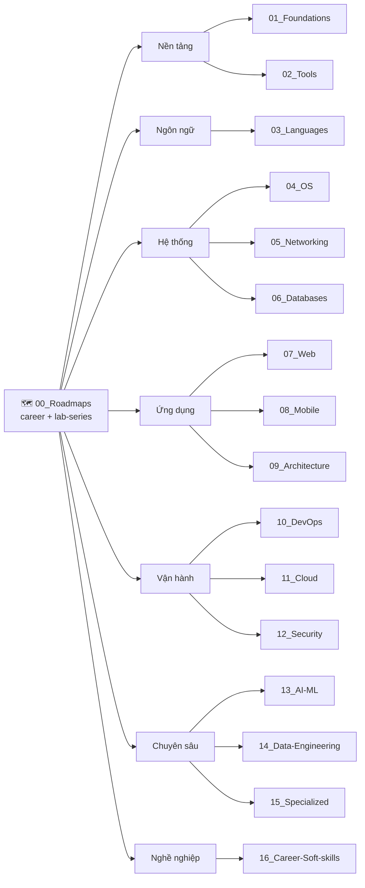

# 📚 Repo Tri Thức CNTT — Tiếng Việt

> **Tác giả:** Mr.Rom\
> **Phiên bản:** v0.1.0 (skeleton phase)\
> **Tạo lúc:** 16/05/2026\
> **Cập nhật:** 16/05/2026

> 🎯 *Kho tri thức Công nghệ thông tin **toàn diện, tiếng Việt**, phục vụ 4 nhóm: beginner zero-base, người chuyển ngành, senior ôn lại, người tra cứu nhanh. Bài viết **chi tiết, liền mạch, có ẩn dụ, hands-on copy-paste**.*

---

## 🚀 Bắt đầu nhanh

### Bạn là người đọc

| Bạn là... | Đọc gì trước |
|---|---|
| 🟢 **Beginner** chưa biết gì | [`00_Roadmaps/career/zero-to-coder_career-roadmap.md`](00_Roadmaps/career/) khi có |
| 🟡 **Người chuyển ngành** | Chọn 1 roadmap trong [`00_Roadmaps/career/`](00_Roadmaps/career/) phù hợp với nghề mong muốn |
| 🟠 **Senior ôn lại** | Vào L1 phù hợp → `99_cheatsheet.md` hoặc `_glossary.md` |
| 🔵 **Tra cứu nhanh** | Search keyword → `recipes/` trong L1 phù hợp |
| 🧪 **Học theo chuỗi bài tập** | [`00_Roadmaps/lab-series/`](00_Roadmaps/lab-series/) |

### Bạn là người đóng góp

→ Đọc [`CONTRIBUTING.md`](CONTRIBUTING.md) trước.\
→ Tra cấu trúc kho ở [`_Blueprint/`](_Blueprint/).\
→ Copy template từ [`_Blueprint/templates/`](_Blueprint/templates/).

---

## 🗺️ Cấu trúc kho

### 16 chủ đề L1 + Roadmaps

| # | Chủ đề | Nội dung chính |
|---|---|---|
| 00 | 🗺️ [Roadmaps](00_Roadmaps/) | Lộ trình theo nghề + lab series |
| 01 | 🧠 [Foundations](01_Foundations/) | CS fundamentals: DSA, OS theory, math |
| 02 | 🛠️ [Tools](02_Tools/) | Git, Shell, Editor, productivity |
| 03 | 💻 [Languages](03_Languages/) | Python, Go, JS/TS, Rust... |
| 04 | 🖥️ [OS](04_OS/) | Linux, MacOS, Windows |
| 05 | 🌐 [Networking](05_Networking/) | TCP/IP, HTTP, DNS, LB, proxy |
| 06 | 🗄️ [Databases](06_Databases/) | SQL, NoSQL, Vector DB |
| 07 | 🕸️ [Web](07_Web/) | Frontend, Backend, REST/GraphQL |
| 08 | 📱 [Mobile](08_Mobile/) | iOS, Android, cross-platform |
| 09 | 🏛️ [Architecture](09_Architecture/) | Design patterns, System design |
| 10 | ⚙️ [DevOps](10_DevOps/) | Docker, K8s, CI/CD, IaC, Observability |
| 11 | ☁️ [Cloud](11_Cloud/) | AWS, GCP, Azure |
| 12 | 🔒 [Security](12_Security/) | Cybersec, Crypto, Auth |
| 13 | 🤖 [AI-ML](13_AI-ML/) | ML, DL, LLM, GenAI |
| 14 | 📊 [Data-Engineering](14_Data-Engineering/) | ETL, Warehouse, Streaming |
| 15 | 🎮 [Specialized](15_Specialized/) | Game, Embedded, Blockchain, IoT |
| 16 | 💼 [Career-Soft-skills](16_Career-Soft-skills/) | Communication, Agile, Career path |

---

## 📂 Cấu trúc trong mỗi L1 (nếu áp dụng)

Mỗi chủ đề L1 có **2 nhóm**:

### Meta content (prefix `_`)
- `_notes/` (OPT) — ghi chú xuyên L2, philosophy
- `_concepts/` (OPT) — khái niệm xuyên L2 (vd: GitOps trong DevOps)
- `_capstone-projects/` (OPT, hiếm) — project lớn xuyên L2
- `_glossary.md` (OPT) — thuật ngữ chung

### L2 chủ đề con (không prefix)
Trong mỗi L2 có **menu 7 loại** (chọn loại nào phù hợp):
- 📖 `lessons/` — bài học lý thuyết (3 level: basic/intermediate/advanced)
- ⚙️ `setup/` — cài đặt môi trường
- 🧪 `exercises/` — bài tập độc lập
- 🎯 `projects/` — tình huống lớn nhiều bước
- 📚 `recipes/` — troubleshooting + patterns + operations
- ⚡ `99_cheatsheet.md` — tra cứu nhanh
- 📘 `_glossary.md` — thuật ngữ EN↔VN

→ Chi tiết: [`_Blueprint/02_folder-structure.md`](_Blueprint/02_folder-structure.md)

---

## 🏗️ Triết lý

| Nguyên tắc | Ý nghĩa |
|---|---|
| **WHY → WHAT → HOW** | Mọi bài giải thích vì sao quan trọng trước, rồi mới chi tiết, cuối cùng cách dùng |
| **Câu dẫn liền mạch** | Section nối nhau bằng câu bắc cầu — đọc không vấp |
| **Ẩn dụ bắt buộc** | Mọi WHAT có ≥1 metaphor đời thường để beginner hình dung |
| **Hands-on copy-paste** | Mọi code mẫu chạy được, không bỏ bước |
| **4 tầng đọc cùng file** | Beginner đọc đầu, senior nhảy cheatsheet, người tra cứu vào recipes — 1 bài phục vụ 4 nhóm |

→ Chi tiết: [`_Blueprint/03_writing-style.md`](_Blueprint/03_writing-style.md)

---

## 📊 Trạng thái kho

| | Số |
|---|---|
| 16 L1 + Roadmaps | ✅ Skeleton đã tạo |
| Bài đã viết | 0 (đang chờ contributor) |
| Bài mẫu trong `_Blueprint/examples/` | 5 (tham khảo template) |

Theo dõi tiến độ chi tiết: [`MASTER-CATALOG.md`](MASTER-CATALOG.md)

---

## 🛠️ Thư mục đặc biệt

| Folder | Vai trò |
|---|---|
| [`_Blueprint/`](_Blueprint/) | **Bản thiết kế** kho (8 file spec + templates + examples) — đọc trước khi viết bài |
| [`../_Ref/`](../_Ref/) | Reference content cũ — chỉ **cherry-pick ý hay**, KHÔNG migrate |
| `_idea-overview.md` | Tầm nhìn ban đầu của kho |

---

## 🤝 Đóng góp

Xem [`CONTRIBUTING.md`](CONTRIBUTING.md) — bao gồm:
- Quy trình PR
- Quy ước văn phong
- Anti-patterns cần tránh
- Workflow tham khảo `_Ref/`

---

## 📌 Changelog

- **v0.1.0 (16/05/2026)** — Skeleton phase: tạo 17 folder L1 + Roadmaps subfolders. Root README + CONTRIBUTING + MASTER-CATALOG. Sẵn sàng cho contributor.
