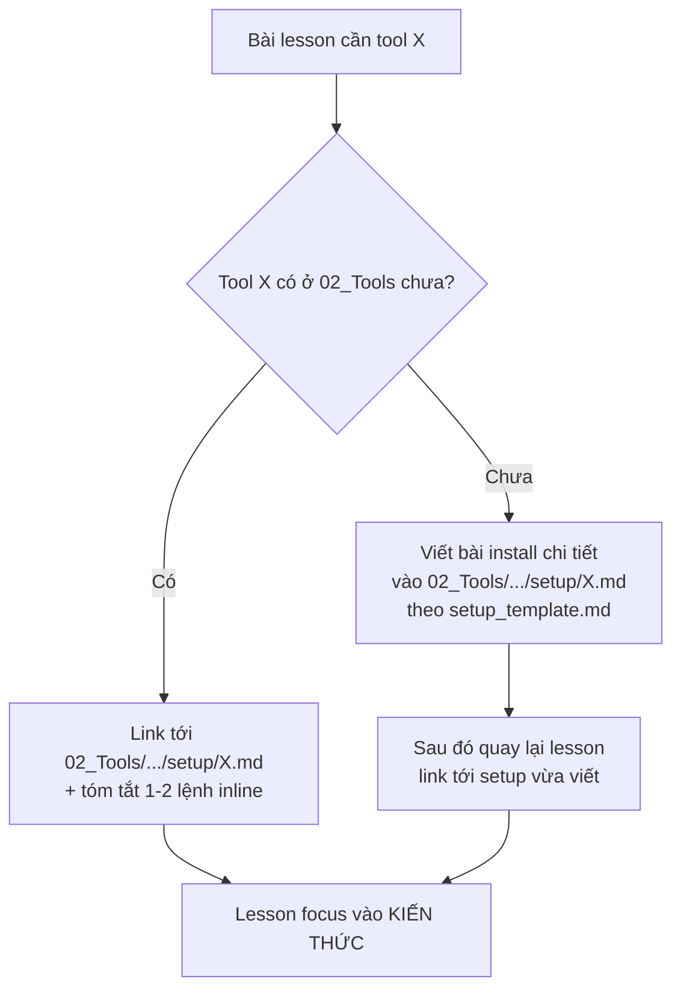

# 🏗️ Folder Structure — Cấu trúc thư mục chuẩn

> **Tác giả:** Mr.Rom\
> **Phiên bản:** v0.5.0\
> **Tạo lúc:** 15/05/2026\
> **Cập nhật:** 16/05/2026

> 🎯 *File này định nghĩa cấu trúc folder/file chuẩn cho mọi cấp: gốc kho → L1 → L2 → L3 (các loại nội dung) → L4 (file cụ thể). Khi tạo chủ đề mới hoặc bài mới, tra file này để biết đặt vào đâu, đặt tên gì.*

---

## 1️⃣ Cấu trúc gốc kho

```
<repo-root>/
├── README.md                        ← giới thiệu toàn kho, link Blueprint, link tới các L1
├── CONTRIBUTING.md                  ← quy ước đóng góp, "Nội dung cần tránh"
├── MASTER-CATALOG.md                ← tracking trạng thái mọi bài (✅ done / 🚧 WIP / ❌ chưa)
├── _Blueprint/                      ← bản thiết kế (đang dùng — không phải nội dung)
├── 00_Roadmaps/                     ← lộ trình học (career + lab-series)
├── 01_Foundations/                  ← L1 #01
├── 02_Tools/                        ← L1 #02
├── 03_Languages/                    ← L1 #03
├── ...
├── 16_Career-Soft-skills/           ← L1 #16
├── _assets/                         ← (OPT) ảnh/diagram chung cho toàn kho
└── _scripts/                        ← (OPT) script utility (vd: generate index, check links)
```

| Slot gốc | Bắt buộc | Vai trò |
|---|---|---|
| `README.md` | ✅ | Cửa ngõ — giới thiệu kho, hướng dẫn dùng |
| `CONTRIBUTING.md` | ✅ | Quy ước đóng góp + "Nội dung cần tránh" (xem template ở `_Blueprint/templates/`) |
| `MASTER-CATALOG.md` | ✅ | **Tracking**: list mọi bài trong kho + trạng thái. Một bài có thể `✅ Done`, `🚧 WIP`, `❌ Chưa có`, `🔄 Cần cập nhật` |
| `_Blueprint/` | ✅ | Đặc tả thiết kế của kho (file bạn đang đọc thuộc đây) |
| `00_Roadmaps/` | ✅ | Lộ trình điều hướng (career + lab-series) |
| `<NN>_<Name>/` | ✅ | 16 chủ đề L1 đánh số |
| `_assets/` | 🟡 OPT | Diagram/ảnh dùng chung nhiều L1 |
| `_scripts/` | 🟡 OPT | Tooling phụ trợ (check link, generate TOC, ...) |

### Spec `MASTER-CATALOG.md` (chi tiết)

File **tracking trạng thái** mọi bài trong kho. Format:

```markdown
# 📊 Master Catalog

> Trạng thái mọi bài trong kho. Cập nhật khi có bài mới hoặc đổi trạng thái.

## Ký hiệu
| Ký hiệu | Ý nghĩa |
|---|---|
| ✅ | Done — đã viết hoàn chỉnh, qua quality checklist |
| 🚧 | WIP — đang viết |
| ❌ | Chưa có — folder rỗng / placeholder |
| 🔄 | Cần cập nhật — outdated hoặc cần refactor |
| 🌟 | MUST-KNOW — bài bắt buộc trong lộ trình |

## Theo L1
### 01_Foundations
- ✅ `00_overview.md`
- 🚧 `dsa/lessons/01_basic/00_array.md`
- ❌ `dsa/lessons/01_basic/01_linked-list.md`
- 🌟 ✅ `dsa/lessons/01_basic/02_big-o.md`

### 02_Tools
...
```

Quy ước cập nhật:
- Cập nhật MỖI khi tạo bài mới, đổi trạng thái, đổi vai trò MUST-KNOW
- 1 PR có thể cập nhật cả MASTER-CATALOG + bài content cùng lúc
- Tool gen tự động (OPT): script trong `_scripts/gen-catalog.sh` quét folder + status từ frontmatter

Template đầy đủ → xem [`templates/master-catalog_template.md`](./templates/master-catalog_template.md).

### Spec `CONTRIBUTING.md` (chi tiết)

File **quy ước đóng góp**. Cấu trúc tối thiểu:

```markdown
# 🤝 Contributing

## Quy trình đóng góp
1. Fork / clone repo
2. Đọc `_Blueprint/` để hiểu cấu trúc + chuẩn viết
3. Copy template từ `_Blueprint/templates/` cho loại bài bạn viết
4. Viết theo `_Blueprint/03_writing-style.md`
5. Soát qua `_Blueprint/07_quality-checklist.md`
6. Cập nhật `MASTER-CATALOG.md` với bài mới
7. Mở PR theo template

## Nội dung cần tránh (anti-patterns)
- ❌ Bài thiếu câu dẫn — section nhảy ngang
- ❌ Code mẫu chưa test
- ❌ Heading tiếng Anh trong bài VN
- ❌ Ước tính thời gian thiếu căn cứ
- ❌ Copy-paste từ nguồn khác không thêm value
- ❌ Outdated content (vd: API version cũ)
- ❌ Hardcode credential thật
- ❌ Hardcode đường dẫn tuyệt đối trên máy author
- ❌ File rỗng không có placeholder

## Badges level (tag trong metadata)
- `[BEGINNER]` / `[INTERMEDIATE]` / `[ADVANCED]` — độ khó
- `[MUST-KNOW]` — bài bắt buộc trong lộ trình tương ứng

## Văn phong
Tuân theo `_Blueprint/03_writing-style.md`.

## Đặt tên
Tuân theo `_Blueprint/04_naming-convention.md`.

## Liên kết
Tuân theo `_Blueprint/05_linking-strategy.md`.
```

Template đầy đủ → xem [`templates/contributing_template.md`](./templates/contributing_template.md).

---

## 2️⃣ Cấu trúc L1 — 1 chủ đề lớn

Một L1 = 1 thư mục đánh số (vd `10_DevOps/`). Bên trong có **2 nhóm**:

- **Meta slot** (prefix `_`) — nội dung xuyên L2 (notes, concepts, capstone)
- **L2 children** (không prefix) — các chủ đề con

```
10_DevOps/
├── 📄 README.md                     ✅ REQUIRED
├── 📄 00_overview.md                ✅ REQUIRED
│
├── 📦 _notes/                       🟡 OPT — ghi chú meta xuyên L2
│   ├── devops-philosophy.md
│   ├── industry-trends.md
│   └── common-pitfalls.md
│
├── 📦 _concepts/                    🟡 OPT — khái niệm xuyên L2
│   ├── infrastructure-as-code.md
│   ├── gitops.md
│   └── observability-pillars.md
│
├── 📦 _capstone-projects/           🟡 OPT, RARE — project xuyên L2 không tách
│   └── master-devops-platform/
│
├── 📦 docker/                       ← L2 chủ đề con
├── 📦 kubernetes/                   ← L2
├── 📦 ci-cd/                        ← L2
├── 📦 iac/                          ← L2
├── 📦 observability/                ← L2
├── 📦 service-mesh/                 ← L2
├── 📦 gitops/                       ← L2
│
└── 📄 _glossary.md                  🟡 OPT — thuật ngữ chung cho cả L1
```

### Spec từng slot L1

#### 📄 `README.md` (REQUIRED) — **Parent README pattern**

README ở mỗi cấp đóng vai trò **parent** cho cấp dưới. Có 3 cấp parent README:

| Cấp | Parent role | Children |
|---|---|---|
| `<L1>/README.md` | Parent của các L2 con | docker/, kubernetes/, ci-cd/, ... |
| `<L2>/README.md` | Parent của các loại nội dung | lessons/, setup/, exercises/, ... |
| `<L2>/lessons/README.md` | Parent của các level | 01_basic/, 02_intermediate/, ... |

**Quy tắc bắt buộc cho mọi parent README:**

1. 🎯 **Mục tiêu tổng** — sau khi đi hết children, người đọc đạt gì
2. 📂 **Danh sách children** với trạng thái + mô tả ngắn
3. 🚀 **Lộ trình đề xuất** — đi qua children theo thứ tự nào
4. 🎓 **Bài tập tổng hợp** (nếu có) — exercise/project cuối parent để chốt kiến thức
5. 💡 **Common pitfalls** (nếu có) — lỗi hay gặp khi học chủ đề này
6. 🔗 **Navigation** — link tới parent cha (nếu có) và sibling

**Cấu trúc tối thiểu** cho `<L1>/README.md`:

```markdown
# <Tên L1>

> Metadata header

## 🎯 Mục tiêu tổng

Sau khi đi qua chủ đề này, bạn sẽ:
- [ ] Mục tiêu 1
- [ ] Mục tiêu 2

## 📂 Danh sách L2 chủ đề con

| L2 | Mô tả ngắn | Trạng thái |
|---|---|---|
| [`docker/`](./docker/) | Containerization basics + Dockerfile + Compose | ✅ Done |
| [`kubernetes/`](./kubernetes/) | Orchestration + workloads + networking | 🚧 WIP |
| [`ci-cd/`](./ci-cd/) | Jenkins, GitHub Actions, GitLab CI | ❌ Chưa có |

## 🚀 Lộ trình đề xuất

| Bạn là... | Thứ tự đi |
|---|---|
| 🟢 Beginner | `docker/` → `kubernetes/` → `ci-cd/` |
| 🟠 Senior ôn lại | Nhảy thẳng L2 cần |
| 🔵 Theo roadmap | Xem [`00_Roadmaps/career/devops-engineer_career-roadmap.md`](../00_Roadmaps/career/devops-engineer_career-roadmap.md) |

## 🎓 Bài tập tổng hợp (nếu có)

- [Lab series: Docker → K8s](../00_Roadmaps/lab-series/docker-to-k8s_lab-series.md) — 50 bài chuỗi

## 💡 Common pitfalls khi học DevOps

- ❌ Học K8s mà chưa nắm Docker cơ bản
- ❌ Bỏ qua observability (chỉ học deploy)

## 📝 Meta content (nếu có)
- [_notes/](./_notes/)
- [_concepts/](./_concepts/)
- [_capstone-projects/](./_capstone-projects/)
```

> 📌 Quy tắc tương tự cho `<L2>/README.md` và `<L2>/lessons/README.md` — chỉ đổi children và scope mục tiêu.

#### 📄 `00_overview.md` (REQUIRED)

"Chủ đề này là gì, vì sao học, học để làm gì". Format theo template (xem `templates/overview_template.md` sẽ tạo sau).

#### 📦 `_notes/` (OPT)

Mỗi file là 1 ghi chú độc lập. Không cần đánh số (không có thứ tự bắt buộc).

```
_notes/
├── devops-philosophy.md
├── industry-trends.md
└── common-pitfalls.md
```

#### 📦 `_concepts/` (OPT)

Khái niệm xuyên L2 — mỗi file giải thích 1 khái niệm. Có thể đánh số nếu có thứ tự nên đọc, không thì để phẳng.

#### 📦 `_capstone-projects/` (OPT, RARE)

Mỗi capstone là 1 subfolder. Bên trong giống cấu trúc 1 project nhỏ (xem §3.4).

#### 📄 `_glossary.md` (OPT)

Bảng thuật ngữ EN ↔ VN cho cả L1. Mỗi L2 vẫn có glossary riêng cho thuật ngữ đặc thù của L2 đó.

---

## 3️⃣ Cấu trúc L2 — 1 chủ đề con

L2 (vd `kubernetes/`) là nơi **nội dung kiến thức thực sự** nằm. Tổ chức theo **menu 7 loại lõi** (lessons/setup/exercises/projects/recipes/cheatsheet/glossary) — chọn loại nào áp dụng.

```
kubernetes/
├── 📄 README.md                     ✅ REQUIRED
├── 📄 00_overview.md                ✅ REQUIRED
│
├── 📦 lessons/                      📖 (loại 1) bài học lý thuyết
├── 📦 setup/                        ⚙️ (loại 2) cài đặt môi trường
├── 📦 exercises/                    🧪 (loại 3) bài tập nhỏ
├── 📦 projects/                     🎯 (loại 4) tình huống lớn
├── 📦 recipes/                      📚 (loại 5) troubleshooting & patterns
│
├── 📄 99_cheatsheet.md              ⚡ (loại 6) tra cứu nhanh
└── 📄 _glossary.md                  📘 (loại 7) thuật ngữ EN↔VN
```

### Khi nào dùng loại nào?

| Loại | Có nếu… | Bỏ qua nếu… |
|---|---|---|
| 📖 `lessons/` | Có bài học lý thuyết | Chủ đề chỉ là cookbook (vd: tools cheatsheet) |
| ⚙️ `setup/` | Chủ đề cần cài đặt môi trường trước khi học | Chủ đề thuần lý thuyết (vd: DSA) |
| 🧪 `exercises/` | Có khái niệm cần luyện tập | Chủ đề thuần đọc hiểu |
| 🎯 `projects/` | Có tình huống nhiều bước có thể xây ra sản phẩm | Chủ đề thuần lý thuyết |
| 📚 `recipes/` | Có tình huống thực tế lặp đi lặp lại (troubleshooting, patterns) | Chủ đề học thuật |
| ⚡ `99_cheatsheet.md` | Có nhiều lệnh/cú pháp người đọc sẽ tra | Chủ đề concept-only |
| 📘 `_glossary.md` | Có thuật ngữ EN trong nội dung | Chủ đề ít thuật ngữ EN |

### 3.0 ⚖️ Phân biệt vai trò: Intro vs Lesson chi tiết — TRÁNH LẪN LỘN

> ⚠️ **Quy ước quan trọng**: trong cùng 1 chủ đề, **bài intro** và **bài lesson chi tiết** phải tách rõ — không trộn vào nhau.

#### Vấn đề nếu lẫn

Bài "ôm hết" (vừa intro vừa dạy chi tiết) gây:
- 🔴 Bài 1000+ dòng — beginner ngán
- 🔴 Lesson chuyên sâu kế tiếp không biết có nên lặp lại căn bản
- 🔴 Khó tham chiếu — link "bài cơ bản" lại đến cả intro + dạy lệnh
- 🔴 Vi phạm Single Responsibility — 1 bài = 1 mục đích

#### 2 loại bài + cách phân biệt

| Loại | Tên file pattern | Mục đích | Có dạy lệnh/syntax chi tiết? |
|---|---|---|---|
| 🌱 **Intro / What-is** | `00_what-is-<topic>.md` (không số trong tên) hoặc `00_overview.md` | Topic là gì, vì sao có, cách khởi tạo, ẩn dụ, cấu trúc tổng quan | ❌ KHÔNG — chỉ liệt kê 5-10 lệnh/khái niệm chính + 1 dòng giới thiệu |
| 🌳 **Lesson chi tiết** | `01_<nhóm-cmd-hoặc-concept>.md`, `02_...md`, ... | Dạy 1 nhóm lệnh/khái niệm với hands-on, deep dive, pitfall | ✅ CÓ — đầy đủ 8-section template |

#### Ví dụ áp dụng cho `02_Tools/shell/`

```
shell/
└── lessons/01_basic/
    ├── 00_what-is-terminal.md          ← INTRO: terminal/shell là gì, mở 3 OS, prompt
    │                                      (KHÔNG dạy `pwd`/`ls`/`cd` chi tiết)
    ├── 01_navigation.md                ← LESSON: pwd, ls, cd, ~, ..
    ├── 02_file-operations.md           ← LESSON: mkdir, touch, cp, mv, rm
    ├── 03_view-file-content.md         ← LESSON: cat, less, head, tail
    ├── 04_text-search-and-pipes.md     ← LESSON: grep, find, |, >, >>
    └── ...
```

#### Khi viết bài, hỏi 3 câu

1. **Bài này dạy *là gì* hay dạy *cách dùng*?**
   - "Là gì" → bài intro
   - "Cách dùng" → bài lesson
2. **Có code/lệnh hands-on >5 ví dụ?**
   - Có → bài lesson
   - Không → bài intro
3. **Người đọc sau bài này có thể tự làm 1 task cụ thể?**
   - Có → bài lesson (focus 1 nhóm task)
   - Không → bài intro (chỉ hiểu khái niệm)

#### Quy chuẩn

| Yếu tố | Bài intro | Bài lesson |
|---|---|---|
| Độ dài | 200-500 dòng | 400-800 dòng |
| Số section H2 (Nội dung) | 1-3 | 3-7 |
| Số code example hands-on | 0-3 (chỉ demo) | 8-20 |
| Pitfall section | Optional | Often Required |
| Cheatsheet section | Không | Often Yes |
| Glossary section | Yes (concept gốc) | Yes (terms trong bài) |

> 💡 Quy ước này áp dụng cho **mọi chủ đề L2** trong kho — không riêng shell. Vd: `kubernetes/lessons/01_basic/00_what-is-k8s.md` (intro) vs `01_pod.md` (lesson).

### Spec từng loại

---

#### 📖 3.1 `lessons/` — Bài học lý thuyết

Tổ chức theo **3 level**: basic / intermediate / advanced. Mỗi file trong level đánh số theo thứ tự đọc.

```
lessons/
├── 📄 README.md                     ← index của lessons + lộ trình đọc đề xuất
├── 📦 01_basic/
│   ├── 00_<topic-1>.md
│   ├── 01_<topic-2>.md
│   └── ...
├── 📦 02_intermediate/
│   ├── 00_<topic>.md
│   └── ...
└── 📦 03_advanced/
    ├── 00_<topic>.md
    └── ...
```

**Quy ước file trong lessons/**:
- Đánh số `00_`, `01_`, ... theo thứ tự nên đọc
- Tên file = topic chính của bài (kebab-case, EN)
- Mỗi file dùng template `lesson_template.md` (xem `templates/`)

**Khi nào subfolder trong level**:
- Nếu 1 level quá nhiều file (>15), có thể chia subfolder:
  ```
  01_basic/
  ├── workloads/      ← Pod, Deployment, ReplicaSet, ...
  ├── networking/     ← Service, Ingress, ...
  └── storage/        ← Volume, PV, PVC, ...
  ```
- Subfolder không cần `NN_` (đã ở trong level)

---

#### ⚙️ 3.2 `setup/` — Cài đặt môi trường

Mỗi tool/option cài đặt là 1 file độc lập. Không đánh số (không có thứ tự bắt buộc — user chọn 1 option).

```
setup/
├── 📄 README.md                     ← so sánh các option, gợi ý chọn
├── 📄 00_overview.md                ← (OPT) phần lý thuyết chung trước khi cài
├── 📄 minikube.md                   ← cài Minikube
├── 📄 kind.md                       ← cài Kind
├── 📄 docker-desktop.md
└── ...
```

**Quy ước file trong setup/**:
- Tên file = tên tool/distro (kebab-case)
- README.md so sánh các option, giúp user chọn
- Mỗi file dùng template `setup_template.md` — 9 section (xem `templates/`)

**Mức độ chi tiết của setup file phụ thuộc vai trò chủ đề (xem §3.2bis bên dưới)**

#### ⚙️ 3.2bis `02_Tools/` — Central Setup Hub (vai trò đặc biệt)

> 🎯 **Quy ước quan trọng**: `02_Tools/` là **NƠI CANONICAL** cho mọi setup/install/cấu hình chi tiết của tool, software, extension, terminal utility trong kho. Lessons ở L1 khác chỉ giới thiệu sơ bộ rồi link về đây.

##### Vì sao cần Central Setup Hub

| Vấn đề (không có hub) | Giải pháp (có hub) |
|---|---|
| Mỗi bài lesson lặp lại "cài Docker như sau..." → DRY violation | 1 chỗ canonical `02_Tools/.../setup/docker.md` |
| Beginner stuck ở khâu cài, không đến được lesson | Có 1 chỗ chi tiết để gỡ vướng |
| Install instructions phân tán, khó update | Update 1 file, mọi link tới đó tự đúng |
| Không biết tool nào nên cài | Hub có comparison + recommend |

##### Phân biệt mức độ chi tiết setup theo vị trí

| Vị trí setup | Mức chi tiết | Ví dụ |
|---|---|---|
| **`02_Tools/<l2>/setup/<tool>.md`** | 🔴 **CHI TIẾT TỐI ĐA** — multi-option, troubleshooting, extensions, comparison, alternative (template `setup_template.md` 9 section) | `02_Tools/editor/setup/vs-code.md` (cài VS Code đầy đủ + extensions + troubleshooting) |
| **`<L1>/<L2>/setup/<tool>.md`** (L1 khác, không phải 02_Tools) | 🟡 **TÓM TẮT** — 5-10 dòng quick install + link về 02_Tools cho chi tiết | `10_DevOps/kubernetes/setup/minikube.md` (cài minikube nhanh) |
| **Inline trong lesson** | 🟢 **1-2 lệnh** — chỉ command cần thiết để chạy demo, link về setup file cho chi tiết | "Cài kubectl: `brew install kubectl` (chi tiết xem [setup/kubectl.md](...))" |

##### Quy tắc khi viết bài cần tool



##### Cấu trúc 02_Tools/ đặc biệt

```
02_Tools/
├── git/
│   ├── setup/
│   │   ├── README.md                ← so sánh git, sourcetree, fork, ...
│   │   ├── git.md                   ← cài git (multi-OS, multi-option)
│   │   └── ssh-key-github.md        ← setup SSH key
│   ├── lessons/                     ← học DÙNG git (sau khi cài)
│   └── ...
├── editor/
│   ├── setup/
│   │   ├── README.md                ← so sánh VS Code, Cursor, JetBrains
│   │   ├── vs-code.md               ← cài VS Code + extensions phổ biến
│   │   ├── cursor.md
│   │   └── vim-neovim.md
│   └── lessons/                     ← học DÙNG editor
├── shell/
│   ├── setup/
│   │   ├── iterm2.md
│   │   ├── warp.md
│   │   ├── zsh-omz.md               ← cài zsh + Oh My Zsh
│   │   └── powerlevel10k.md
│   └── lessons/                     ← học commands
└── ...
```

##### Khi nào tách `setup/` ra ngoài 02_Tools

Tool **rất chuyên biệt** cho 1 L1 không liên quan đến tool khác → đặt setup trong L1 đó.

| Ví dụ | Đặt setup ở đâu | Vì sao |
|---|---|---|
| Cài Minikube (chỉ K8s dùng) | `10_DevOps/kubernetes/setup/minikube.md` | Chỉ K8s dùng, không cross-cutting |
| Cài Postgres | `06_Databases/postgresql/setup/install.md` | Chỉ Postgres |
| Cài VS Code (mọi coder dùng) | `02_Tools/editor/setup/vs-code.md` | Cross-cutting toàn kho |
| Cài Git | `01_Foundations/version-control/git/setup/git.md` | Cross-cutting |
| Cài Docker Desktop (dùng cho K8s + dev local + ...) | `02_Tools/...` ? hoặc `10_DevOps/docker/setup/` | Cân nhắc — Docker primarily là DevOps tool, nhưng web dev cũng dùng. Đề xuất: `10_DevOps/docker/setup/docker-desktop.md` (canonical) + `02_Tools/` link tới |

> 💡 **Nguyên tắc cuối**: tool **cross-cutting** (≥2 L1 dùng) → `02_Tools/`. Tool **specific 1 L1** → L1 đó.

#### ⚙️ 3.2ter `02_Tools/` — Scope (chứa gì, KHÔNG chứa gì)

> 🎯 **Nguyên tắc vàng**: *"Ở 02_Tools là **những cái ở chỗ khác không có**"*. KHÔNG lặp content đã có chi tiết ở L1 khác.

##### ✅ 02_Tools CHỨA

| Loại | Ví dụ |
|---|---|
| **Setup chi tiết** | Cài VS Code, cài iTerm2, cài Git, cài Oh My Zsh |
| **Tool-specific features** | VS Code shortcuts, Git rebase strategies, bash aliases, tmux keybindings |
| **Tool customize** | VS Code settings.json, prompt PS1, Powerlevel10k theme |
| **Tool scripting** | Bash scripting (shell-as-tool), Vim scripting |
| **Tool comparison** | VS Code vs Cursor vs Vim, bash vs zsh vs fish |

##### ❌ 02_Tools KHÔNG chứa

| Loại | Thuộc về | Vì sao |
|---|---|---|
| Lệnh POSIX (`pwd`, `ls`, `cd`, `grep`, `find`, `chmod`) | `04_OS/linux/lessons/` | Là lệnh OS — Linux/Mac/WSL đều dùng. KHÔNG phải shell-tool feature. |
| Khái niệm CS (DSA, OS theory) | `01_Foundations/` | Khái niệm chung |
| Khái niệm ngôn ngữ (Python syntax, JS event loop) | `03_Languages/` | Thuộc ngôn ngữ cụ thể |
| Kiến trúc phần mềm | `09_Architecture/` | |

##### Test khi đắn đo

Hỏi 3 câu khi không chắc bài thuộc 02_Tools hay L1 khác:

1. **Content này có thể di chuyển sang 1 L1 khác (Linux/Python/...) mà vẫn hợp lý không?**
   - Có → đặt ở L1 đó, KHÔNG ở 02_Tools
   - Không (chỉ tool đó có) → đặt ở 02_Tools

2. **Content có specific cho 1 tool/software duy nhất không?**
   - Có → 02_Tools (vd: bash aliases — chỉ bash có, GitLens — chỉ VS Code có)
   - Không (chung cho cả mảng) → L1 khác

3. **Người đọc search Google sẽ tìm bằng từ khoá nào?**
   - "Linux cd command" → 04_OS/linux/
   - "bash alias" → 02_Tools/shell/
   - "VS Code keybindings" → 02_Tools/editor/

##### Ví dụ chuẩn cho 02_Tools/shell/

```
shell/
├── setup/                                  ⚙️ Setup
│   ├── README.md
│   ├── iterm2.md                           ← Cài terminal app
│   ├── warp.md
│   ├── windows-terminal.md
│   ├── zsh-omz.md                          ← Cài Oh My Zsh
│   └── powerlevel10k.md                    ← Cài theme
│
├── lessons/
│   └── 01_basic/                           📖 Shell-as-tool features (KHÔNG dạy lệnh OS)
│       ├── 00_what-is-terminal.md          ← Intro shell/terminal concept (cross-OS)
│       ├── 01_choosing-a-shell.md          ← bash vs zsh vs fish (tool comparison)
│       ├── 02_aliases.md                   ← Tạo alias (shell feature)
│       ├── 03_prompt-customization.md      ← PS1, p10k (shell feature)
│       ├── 04_history-and-completion.md    ← History, Tab completion (shell feature)
│       └── 05_shell-scripting-intro.md     ← if/loop trong shell (shell-as-language)
│
└── _glossary.md
```

→ **Không có** `01_navigation.md` (pwd/ls/cd) ở đây — đã chuyển sang `04_OS/linux/lessons/01_basic/`.

---

#### 🧪 3.3 `exercises/` — Bài tập nhỏ

Bài tập độc lập, mỗi bài luyện 1 khái niệm. Đánh số theo độ khó tăng dần.

```
exercises/
├── 📄 README.md                     ← danh mục + độ khó + thời gian ước tính
├── 📄 01_<exercise-name>.md
├── 📄 02_<exercise-name>.md
└── ...
```

**Quy ước file trong exercises/**:
- Đánh số `01_`, `02_`, ... theo độ khó
- Tên file = verb-phrase ngắn gọn (vd `create-first-pod`, `scale-deployment`)
- Mỗi bài có: yêu cầu, gợi ý (có thể ẩn `<details>`), đáp án (có thể ẩn), kiểm tra

---

#### 🎯 3.4 `projects/` — Tình huống lớn

Mỗi project là **1 subfolder** (vì project có nhiều file: README, code, các bước).

```
projects/
├── 📄 README.md                     ← danh mục project + prerequisite
├── 📦 01_<project-name>/
│   ├── README.md                    ← intro project, mục tiêu, prerequisite
│   ├── 00_setup.md
│   ├── 01_<step-1>.md
│   ├── 02_<step-2>.md
│   ├── ...
│   ├── code/                        ← (OPT) source code project
│   └── _references.md               ← (OPT) tài nguyên ngoài
└── 📦 02_<project-name>/
```

**Quy ước subfolder project**:
- Đánh số `01_`, `02_`, ... theo độ phức tạp
- Tên subfolder = mục tiêu project (kebab-case)
- Bên trong: README.md bắt buộc + các step file đánh số
- Code có thể trong `code/` subfolder hoặc link tới repo ngoài

---

#### 📚 3.5 `recipes/` — Công thức / Troubleshooting

Chia 3 sub-folder theo dạng công thức:

```
recipes/
├── 📄 README.md                     ← index theo problem
├── 📦 troubleshooting/              ← lỗi cụ thể + cách fix
│   ├── <error-name>.md
│   └── ...
├── 📦 patterns/                     ← pattern thiết kế / triển khai
│   ├── <pattern-name>.md
│   └── ...
└── 📦 operations/                   ← thao tác vận hành (vd: backup, upgrade)
    ├── <operation-name>.md
    └── ...
```

**Quy ước file trong recipes/**:
- Tên file = vấn đề/pattern (kebab-case), không đánh số (recipe độc lập)
- Mỗi file ngắn gọn: problem → cause → solution → verify
- Có thể có thêm `one-liners/` nếu có nhiều lệnh tra cứu nhanh

---

#### ⚡ 3.6 `99_cheatsheet.md` — Tra cứu nhanh

Single file. Đặt prefix `99_` để luôn ở cuối folder khi sort. Cấu trúc:

```markdown
# <Topic> Cheatsheet

## Cài đặt nhanh
## Lệnh thường dùng
## Cú pháp tham khảo
## Format / config thường gặp
```

Nếu cheatsheet quá dài → tách thành folder `99_cheatsheets/` với nhiều file con.

---

#### 📘 3.7 `_glossary.md` — Thuật ngữ EN↔VN

Single file. Prefix `_` để đứng đầu folder khi sort (sau files thường, trước số `99_`).

Cấu trúc:

```markdown
# Glossary — <Topic>

| EN | VN | Giải thích |
|---|---|---|
| Pod | Pod | Đơn vị nhỏ nhất K8s deploy, gồm 1+ container chia sẻ network/storage |
| Node | Node | Máy worker chạy Pod (VM hoặc physical) |
| ... | ... | ... |
```

---

## 4️⃣ Cấu trúc loại bổ sung (ngoài 7 lõi)

Khi cần loại mới (xem §0.5 của `01_sitemap-detail.md`):

| Loại | Tên folder | Cấu trúc |
|---|---|---|
| 📚 References | `references/` | Files theo nguồn: `books.md`, `papers.md`, `videos.md`, `blogs.md` |
| 🎤 Interview | `interview-questions/` | Files theo chủ đề con: `data-structures.md`, `system-design.md` |
| 📰 Case studies | `case-studies/` | Mỗi case 1 file: `<company-or-scenario>.md` |
| 🔄 Migration | `migration-guides/` | Mỗi migration 1 file: `<from>-to-<to>.md` |
| 🧰 Tools comparison | `tools-comparison/` | Mỗi cặp/nhóm tools 1 file |

**Khi tạo loại mới** → cập nhật chính file này (mục §4) + bump version.

---

## 5️⃣ Quy ước file naming ở mọi cấp

→ **Canonical**: [`04_naming-convention.md`](./04_naming-convention.md)

Tóm tắt nhanh prefix dùng trong cấu trúc folder/file:

| Prefix | Ý nghĩa rút gọn |
|---|---|
| `NN_` | Thứ tự (folder hoặc file trong series) |
| `00_` | "Đầu tiên" — overview / intro |
| `99_` | "Cuối cùng" — cheatsheet / reference |
| `_` | Meta / không phải nội dung học |
| (không prefix) | Folder / file không có thứ tự bắt buộc |

Chi tiết đầy đủ (anchor, image, code, branch/commit, forbidden names...) → xem `04_naming-convention.md`.

---

## 6️⃣ Folder rỗng (placeholder)

Khi tạo skeleton mà chưa có content:

```
<empty-folder>/
└── README.md       ← placeholder, ghi "🚧 Chủ đề này chưa có content. Dự kiến: ..."
```

Lý do: Git không track folder rỗng → cần ít nhất 1 file. README placeholder vừa giữ folder vừa báo trạng thái.

Format README placeholder tối thiểu:

```markdown
# <Tên chủ đề>

> 🚧 **Status:** Skeleton — chưa có content

## 📋 Dự kiến nội dung

- <bullet 1>
- <bullet 2>

## 🤝 Đóng góp

Muốn viết bài cho chủ đề này? Tra `_Blueprint/` để biết template, sau đó PR.
```

---

## 7️⃣ Khi nào tạo subfolder vs file phẳng

| Số file dự kiến | Cách tổ chức |
|---|---|
| 1-5 file | File phẳng, không subfolder |
| 6-15 file | Cân nhắc subfolder nếu có nhóm logic rõ ràng |
| >15 file | Bắt buộc chia subfolder theo chủ đề con |

**Ví dụ K8s lessons/01_basic/**:
- Nếu chỉ ~8 file → để phẳng: `00_architecture.md`, `01_pod.md`, ...
- Nếu nhiều hơn → chia: `workloads/`, `networking/`, `storage/`

**Nguyên tắc**: subfolder chỉ tạo khi nó **giảm tải nhận thức** cho người đọc. Đừng nesting cho có.

---

## 8️⃣ Đặc biệt: cấu trúc `00_Roadmaps/`

Roadmap không theo menu 7 loại — nó là **layer điều hướng**. Cấu trúc đơn giản:

```
00_Roadmaps/
├── 📄 README.md                     ← danh mục cả 2 loại roadmap
├── 📦 career/                       🧭 lộ trình theo nghề
│   ├── <role>_career-roadmap.md
│   └── ...
└── 📦 lab-series/                   🧪 chuỗi bài tập xuyên L2
    ├── <series-name>_lab-series.md
    └── ...
```

Chi tiết template và cách viết roadmap → xem `06_roadmap-design.md`.

---

## 9️⃣ Tóm tắt cây cấp đầy đủ

```
<repo-root>/                         ← gốc kho
├── README.md
├── _Blueprint/                      ← đang đọc
├── 00_Roadmaps/
│   ├── career/
│   └── lab-series/
└── <NN>_<L1-Name>/                  ← L1 (16 chủ đề)
    ├── README.md
    ├── 00_overview.md
    ├── _notes/                      ← L1-meta (OPT)
    ├── _concepts/                   ← L1-meta (OPT)
    ├── _capstone-projects/          ← L1-meta (OPT, RARE)
    ├── _glossary.md                 ← L1-meta (OPT)
    └── <L2-Name>/                   ← L2 chủ đề con
        ├── README.md
        ├── 00_overview.md
        ├── lessons/                 ← L3: 7 loại lõi
        │   ├── 01_basic/            ← L4: level
        │   │   └── 00_<topic>.md    ← L5: file
        │   ├── 02_intermediate/
        │   └── 03_advanced/
        ├── setup/                   ← L3
        ├── exercises/               ← L3
        ├── projects/                ← L3
        │   └── 01_<project>/        ← L4: project folder
        │       ├── README.md        ← L5
        │       └── 01_<step>.md
        ├── recipes/                 ← L3
        │   ├── troubleshooting/     ← L4
        │   ├── patterns/
        │   └── operations/
        ├── 99_cheatsheet.md
        └── _glossary.md
```

→ Tối đa **5 cấp** (repo → L1 → L2 → L3 → L4 → file). Không nest sâu hơn.

---

## 📌 Changelog

- **v0.5.0 (16/05/2026)** — Thêm §3.2ter **02_Tools Scope** sau feedback user phát hiện mình đặt sai lệnh POSIX trong shell/:
  - Định nghĩa rõ 02_Tools CHỨA gì (setup + tool features + customize + scripting)
  - Định nghĩa rõ 02_Tools KHÔNG chứa gì (lệnh OS, khái niệm CS, syntax ngôn ngữ — thuộc L1 khác)
  - 3 câu hỏi test khi đắn đo
  - Nguyên tắc vàng: "ở đây là những cái chỗ khác không có"
- **v0.4.0 (16/05/2026)** — Thêm §3.0 **Phân biệt Intro vs Lesson chi tiết** sau feedback user khi viết bài terminal:
  - Bài intro (`00_what-is-X.md`) — concept là gì, KHÔNG dạy lệnh chi tiết
  - Bài lesson (`01_<nhóm>.md`, `02_...`) — dạy 1 nhóm lệnh/concept với hands-on
  - 3 câu hỏi để xác định loại bài + bảng quy chuẩn (độ dài, số code example, ...)
- **v0.3.0 (16/05/2026)** — Thêm §3.2bis **`02_Tools/` Central Setup Hub** sau feedback user:
  - `02_Tools/` là canonical cho mọi setup chi tiết cross-cutting tools (VS Code, Git, terminal apps...)
  - Lessons ở L1 khác chỉ giới thiệu sơ bộ + link về `02_Tools/`
  - Quy tắc 3 mức chi tiết setup: 🔴 hub canonical / 🟡 tóm tắt L1-specific / 🟢 inline trong lesson
  - Setup file dùng template `setup_template.md` (9 section: tool là gì → yêu cầu → multi-option → verify → cấu hình → extensions → lỗi → update/uninstall → alternative)
  - Mermaid flowchart quy trình khi viết bài cần tool
- **v0.2.0 (15/05/2026)** — Áp dụng SSOT + 3 recommendations:
  - §1: thêm spec `MASTER-CATALOG.md` (tracking) + `CONTRIBUTING.md` (quy ước đóng góp) ở gốc kho
  - §2: chính thức hóa **Parent README pattern** — README ở mỗi cấp có 6 mục bắt buộc (mục tiêu tổng, children, lộ trình, bài tập tổng hợp, pitfall, navigation)
  - §5: slim phần naming prefix — chỉ giữ tóm tắt + link tới `04_naming-convention.md` (SSOT)
- **v0.1.0 (15/05/2026)** — Bản đầu tiên.
