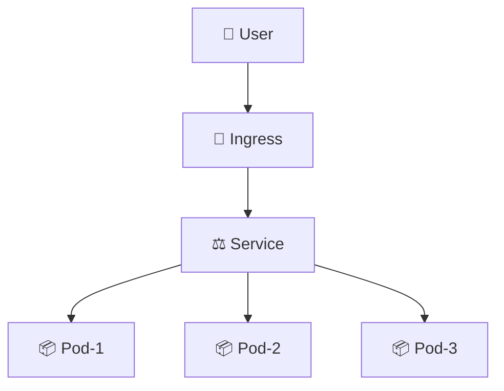
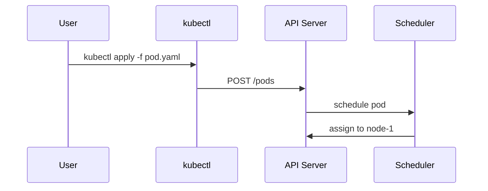

# ✍️ Writing Style — Chuẩn viết nội dung

> **Tác giả:** Mr.Rom\
> **Phiên bản:** v0.5.1\
> **Tạo lúc:** 15/05/2026\
> **Cập nhật:** 19/05/2026

> 🎯 *File này định nghĩa **cách viết** một bài (lesson, exercise, project, recipe...) — từ cấu trúc bài, văn phong, đến cách dùng diagram và emoji. Khi viết bài mới, copy template từ `templates/` rồi follow file này.*

---

## 1️⃣ Khung 8 phần — REQUIRED và OPTIONAL

Khung 8 phần này **áp dụng cho `lessons/`** (bài học lý thuyết). Các loại nội dung khác (`exercises/`, `recipes/`, `projects/`, `setup/`) có cấu trúc + template riêng — xem `_Blueprint/templates/`:

| Loại nội dung | Template + cấu trúc |
|---|---|
| 📖 `lessons/` | Khung 8 phần ở §1 này (file đang đọc) — template `lesson_template.md` |
| 🧪 `exercises/` | Đề bài → Gợi ý ẩn → Đáp án ẩn → Verify → Mở rộng — template `exercise_template.md` |
| 📚 `recipes/` | Problem → Cause → Solution → Verify → Prevention — template `recipe_template.md` |
| 🎯 `projects/` | README chính + step files đánh số — template `topic-readme_template.md` cho README; step file thường ngắn 500-1500 từ |
| ⚙️ `setup/` | Prerequisites → Steps → Verify → Common issues — không có template riêng (đơn giản, dùng cấu trúc tự nhiên) |
| 🗺️ Roadmap | Career hoặc lab-series — template `roadmap_template.md` |

Mọi bài trong `lessons/` tuân khung 8 phần. Phần `✅ REQUIRED` bắt buộc có; phần `🟡 OPTIONAL` chỉ thêm khi cần — không "chế cháo" cho đủ.

| # | Phần | Yêu cầu | Phục vụ |
|---|---|---|---|
| 1 | 📋 **Metadata** | ✅ | Tất cả |
| 2 | 🎯 **Câu dẫn + Mục tiêu** | ✅ | Tất cả |
| 3 | 📖 **Nội dung chính** (lý thuyết + diagram + hands-on tích hợp) | ✅ | Beginner |
| 4 | 💡 **Pitfall & Best practice** | 🟡 | Intermediate |
| 5 | 🧠 **Self-check** (Q&A) | 🟡 | Beginner/Inter |
| 6 | ⚡ **Cheatsheet** | 🟡 | Senior/tra cứu |
| 7 | 📚 **Glossary** (nếu có thuật ngữ EN) | ✅ (có điều kiện) | Tất cả |
| 8 | 🔗 **Liên kết & Tài nguyên** | 🟡 | Tất cả |

### Khi nào dùng OPTIONAL

| Phần | Áp dụng khi… |
|---|---|
| Pitfall | Có khái niệm dễ nhầm / lệnh dễ sai cú pháp |
| Self-check | Bài đủ sâu để có nội dung kiểm tra (>10 phút đọc) |
| Cheatsheet | Có nhiều lệnh / cú pháp người đọc sẽ tra |
| Liên kết | Có bài liên quan / tài nguyên ngoài đáng tin |

> ⚠️ Bài ngắn (quick note, <5 phút đọc) có thể chỉ dùng 3 phần REQUIRED.

---

## 2️⃣ Spec chi tiết từng phần

### 2.1 📋 Metadata (REQUIRED)

Đặt **ngay sau** H1, dạng block quote:

```markdown
> **Tác giả:** Mr.Rom\
> **Phiên bản:** v1.0.0\
> **Tạo lúc:** DD/MM/YYYY\
> **Cập nhật:** DD/MM/YYYY\
> **Level:** Basic | Intermediate | Advanced\
> **Tags:** [MUST-KNOW] (nếu áp dụng)\
> **Thời lượng đọc:** ~X phút\
> **Prerequisites:** [link bài tiên quyết](...) (nếu có)
```

| Field | Ghi chú |
|---|---|
| Tác giả | Luôn `Mr.Rom` (xem `naming/metadata-headers.md`) |
| Phiên bản | SemVer — bump khi sửa bài (v1.0.0 lần đầu, v1.0.1 sửa lỗi typo, v1.1.0 thêm section, v2.0.0 viết lại) |
| Ngày | Format `DD/MM/YYYY` |
| Level | 1 trong 3 (chỉ áp dụng cho `lessons/`) |
| Tags | `[MUST-KNOW]` — bài bắt buộc trong lộ trình tương ứng. Có thể bỏ nếu không áp dụng. Tag khác (vd `[DEPRECATED]`, `[ADVANCED-ONLY]`) thêm sau khi nhu cầu rõ |
| Thời lượng | Ước tính đọc (không tính làm exercise) |
| Prerequisites | Link tới bài tiên quyết — quan trọng cho navigation |

#### Cách dùng tag `[MUST-KNOW]`

- Đánh dấu khi bài là **kiến thức bắt buộc** trong roadmap tương ứng (vd: "Pod" là MUST-KNOW cho `devops-engineer_career-roadmap`)
- Hiển thị nổi bật trong `MASTER-CATALOG.md` với biểu tượng 🌟
- Trong roadmap, MUST-KNOW lessons không thể skip — phải làm verify checklist
- Không phải bài nào cũng cần MUST-KNOW — chỉ ~20-30% các bài cốt lõi

### 2.2 🎯 Câu dẫn + Mục tiêu (REQUIRED)

Đặt **ngay sau** metadata. Bao gồm 2 phần liền nhau:

1. **Câu dẫn** — *1 block quote duy nhất* với `> 🎯 *...*` (in nghiêng). Nội dung 1-2 câu: bắt cầu từ bài trước → giới thiệu bài này → kết quả đạt được. **KHÔNG dùng nhiều hơn 1 block quote câu dẫn** ở đây.
2. **Mục tiêu** — heading `## 🎯 Sau bài này bạn sẽ` (không số) + bullet checklist.

```markdown
> 🎯 *Trước khi học Pod, bạn cần hiểu Container (xem `docker/lessons/01_basic/`). Sau bài này bạn sẽ tự tạo, kiểm tra, debug được 1 Pod trong K8s.*

## 🎯 Sau bài này bạn sẽ

- [ ] Hiểu Pod là gì, vì sao K8s dùng Pod thay vì Container trực tiếp
- [ ] Tạo Pod bằng cả imperative (`kubectl run`) và declarative (YAML)
- [ ] Đọc được trạng thái Pod (`kubectl get`, `kubectl describe`)
- [ ] Debug Pod khi gặp lỗi cơ bản
```

**Quy tắc**:
- **1 câu dẫn duy nhất** giữa metadata và Mục tiêu — không lặp, không dùng 2 block quote `> 🎯`
- **Độ dài câu dẫn**: 1-2 câu là vừa. >3 câu nên cắt — chi tiết hơn thì để vào WHY (§2.3)
- Câu dẫn **bắt cầu** từ bài trước → giới thiệu bài này → nói rõ sau bài học được gì
- Mục tiêu dạng checklist (`- [ ]`) — người đọc tích khi học xong
- 3-6 mục tiêu cụ thể, đo lường được (verb-phrase: "hiểu", "tạo", "debug", ...)

### 2.2bis 🔢 Quy ước H2 trong bài — câu hỏi tự nhiên, không khuôn cứng

> ⚠️ **Đổi từ v0.5.0**: H2 nội dung chính KHÔNG dùng `## 1️⃣ Vì sao (WHY)`, `## 2️⃣ X là gì (WHAT)` nữa. Thay bằng **câu hỏi/câu dẫn tự nhiên** mà người đọc thật sự nghĩ trong đầu khi đọc tới đó.

| Heading | Có số? | Ví dụ |
|---|---|---|
| Mục tiêu | ❌ | `## 🎯 Sau bài này bạn sẽ` |
| Nội dung chính | ✅ Có số (1️⃣ 2️⃣ 3️⃣) HOẶC ❌ không số — tuỳ bài | `## 1️⃣ Vậy K8s là gì?` HOẶC `## Vậy K8s là gì?` |
| Pitfall | ❌ | `## 💡 Pitfall thường gặp` |
| Self-check | ❌ | `## 🧠 Self-check` |
| Cheatsheet | ❌ | `## ⚡ Cheatsheet` |
| Glossary | ❌ | `## 📚 Glossary` |
| Liên kết | ❌ | `## 🔗 Liên kết & Tài nguyên` |

**Mẫu H2 cho nội dung chính** (chọn theo ngữ cảnh):

| Vai trò | Ví dụ H2 tự nhiên |
|---|---|
| Đặt vấn đề mở bài | `## Tình huống` / `## Nếu bạn đã quen Docker, hãy thử nghĩ...` |
| Định nghĩa | `## Vậy K8s là gì?` / `## Pod thực ra là gì?` |
| Năng lực / chức năng | `## Nó làm được gì?` / `## K8s giải quyết những gì?` |
| Cách dùng | `## Cách bắt đầu thử K8s ở local` / `## Tạo Pod đầu tiên` |
| So sánh | `## Khác gì so với Docker Compose?` |
| Bên dưới UI | `## Bên dưới ngầm chạy gì?` |

→ **Quy tắc**: H2 phải đọc lên như "câu hỏi người học đang nghĩ trong đầu", không như "đề mục giáo trình". Số 1️⃣ 2️⃣ 3️⃣ chỉ để giữ thứ tự khi bài dài, có thể bỏ.

### 2.3 📖 Nội dung chính (REQUIRED)

Trái tim của bài.

#### 🔑 Nguyên tắc cốt lõi (từ v0.5.1)

> **Bố cục KHÔNG ràng buộc. Tiêu chí duy nhất: bài có trả lời được các câu hỏi WHY/WHAT/HOW không.**

- Một bài (lesson/tool) **có giá trị** khi người đọc sau khi đọc xong **giải đáp được** 3 nhóm câu hỏi cốt lõi (vì sao cần / nó là gì / dùng như nào).
- **Cách thể hiện tuỳ bài** — tuỳ bản chất nội dung. Bài đơn giản có thể 1 đoạn trả lời cả 3. Bài phức tạp có thể 5-7 mục với câu hỏi tự nhiên làm header.
- Header có thể là `## Vậy K8s là gì?` / `## Tình huống thực tế` / `## Bên dưới ngầm chạy gì?` — hoặc dạng bất kỳ miễn đọc lên thấy tự nhiên.
- **Không có quy tắc "phải có đủ section A B C"**. Có quy tắc "đọc xong người đọc hiểu chưa".

#### ⚠️ WHY/WHAT/HOW là **tiêu chí đánh giá**, KHÔNG phải tiêu đề

❌ **Tránh** — viết kiểu "khuôn 3 chữ":
```markdown
## 1️⃣ Vì sao cần K8s (WHY)
[giải thích why]

## 2️⃣ K8s là gì (WHAT)
[giải thích what]

## 3️⃣ Cách dùng K8s (HOW)
[hands-on]
```
→ Người học đọc bị "vẹt theo khuôn", không hấp dẫn, không nhớ.

✅ **Đúng** — dẫn dắt bằng **tình huống** hoặc **câu hỏi gợi suy nghĩ**, header dùng câu hỏi tự nhiên:

```markdown
[Mở bằng tình huống thực tế]
Bạn đã học Docker, biết bật vài service bằng `docker-compose up`. 
Nhưng app thật ngoài đời không chỉ vài service — Netflix chạy hàng 
nghìn microservice, Twitter cả chục nghìn... Vậy bạn có ngồi gõ 
`docker run` cho từng service được không? Hay 1 container chết giữa 
đêm, bạn có biết và start con khác liền không? Chắc chắn không.

Chính vì thế K8s ra đời.

## Vậy K8s là gì?

K8s (viết tắt Kubernetes — tiếng Hy Lạp nghĩa "thuyền trưởng") là 
một hệ thống điều phối container do Google open source năm 2014...

## Nó làm được gì?

Quay lại tình huống đầu bài:
- Hàng nghìn service → K8s tự bật/tắt qua `Deployment`
- Container chết giữa đêm → K8s tự `restart` con mới trong vài giây
- ...

Ngoài ra còn:
- Load balancing tự động
- Rolling update không downtime
- ...

## Làm sao bắt đầu thử ở local?

[hands-on copy-paste được]
```

#### Tiêu chí WHY / WHAT / HOW — dùng để **review** chứ không phải để đặt tiêu đề

| Tiêu chí | Câu hỏi review | Vị trí trong bài (thường) |
|---|---|---|
| 🤔 **WHY** | Bài có làm rõ "không có topic này thì khổ thế nào"? | Mở bài — tình huống/câu hỏi gợi mở |
| 📖 **WHAT** | Bài có định nghĩa rõ + ẩn dụ dễ hình dung + diagram (nếu cần)? | Phần giữa — header "X là gì?" / "Bên dưới ngầm chạy gì?" |
| 🛠️ **HOW** | Bài có hands-on copy-paste được + ví dụ thật? | Cuối — header "Cách bắt đầu" / "Làm thử ngay" |

→ Khi review bài viết xong, tự hỏi 3 câu trên. Nếu thiếu — bổ sung. **Không** ép tiêu đề `WHY/WHAT/HOW`.

#### Khung 3 kiểu mở bài (chọn 1 theo ngữ cảnh)

| Kiểu mở | Khi nào dùng | Ví dụ |
|---|---|---|
| **A. Tình huống thực tế** | Có "pain point" rõ ràng (như K8s vs hàng nghìn service) | "Bạn đã học Docker... nhưng app thật có cả nghìn service..." |
| **B. Câu hỏi gợi suy nghĩ** | Concept ai cũng từng nghĩ tới | "Bạn có bao giờ tự hỏi tại sao `git pull` chậm hơn `git fetch`?" |
| **C. So sánh với cái đã biết** | Topic là bản nâng cấp của cái cũ | "Hồi học C, ta dùng `malloc`/`free` thủ công. Python tự lo cho ta — bằng cách nào?" |

→ **Cấm** mở bằng định nghĩa khô: "K8s là một hệ thống...". Người đọc chưa biết tại sao mình cần biết K8s.

#### 🪞 Định nghĩa kiểu "trả lời tình huống" (preferred)

Định nghĩa nên xuất hiện sau khi đã có **1 tình huống cụ thể** đặt ra trước đó — như "trả lời" cho tình huống. Cách này dễ tiếp thu hơn định nghĩa khô.

❌ **Định nghĩa khô**:
```
Kubernetes là một hệ thống điều phối container mã nguồn mở, được Google 
phát triển và open source năm 2014, cho phép tự động hoá việc deploy, 
scale, và quản lý vòng đời container ở quy mô lớn.
```
→ Đúng, nhưng người đọc đọc xong vẫn ngơ — "thế thì sao?".

✅ **Định nghĩa trả lời tình huống**:
```
[Trước đó đã đặt tình huống: 8000 container, 3h sáng 1 con chết, bạn 
ngồi gõ docker run thủ công không kham nổi]

Chính vì thế K8s ra đời.

**Vậy K8s là gì?** Nó là "người quản lý chung cư 1000 phòng" cho bạn. 
Bạn chỉ cần khai báo "muốn lúc nào cũng có 50 container dịch vụ A 
sống" — K8s tự lo phòng nào hỏng thì sửa, mùa cao điểm mở thêm tầng. 
Về kỹ thuật, đây là 1 hệ thống điều phối container Google open source 
năm 2014...
```
→ Định nghĩa đến **SAU** tình huống, đóng vai "lời giải". Người đọc đã "đói" câu trả lời rồi, định nghĩa đi vào trí nhớ mạnh hơn.

**Quy tắc viết định nghĩa:**

| Bước | Việc |
|---|---|
| 1 | Đặt tình huống / câu hỏi gợi mở **trước** |
| 2 | Nói gọn "X ra đời để giải quyết điều đó" |
| 3 | Đưa ẩn dụ đời thường (nếu áp dụng được) |
| 4 | Mới đưa định nghĩa kỹ thuật chính thức |

→ Định nghĩa kỹ thuật **không cấm** — chỉ đừng để nó đứng cô đơn ở đầu bài.

#### 🪞 Quy tắc ẩn dụ (metaphor) trong WHAT

> ✅ **Bắt buộc**: mọi section WHAT phải có **≥1 ẩn dụ/metaphor** so sánh concept kỹ thuật với 1 thứ đời thường để người mới hình dung.

| Concept kỹ thuật | Ẩn dụ đời thường |
|---|---|
| Pod | "1 căn phòng — chứa 1-2 người (container) cùng dùng chung wifi (network) và tủ đồ (storage)" |
| Service | "1 quầy lễ tân — khách (request) không cần biết nhân viên (Pod) nào đang trực, lễ tân tự điều phối" |
| Container | "1 hộp lego đóng kín — bên trong có app + thư viện + config, plug-and-play ở mọi máy có lego connector" |
| Volume | "USB cắm vào Pod — Pod chết, USB còn data" |
| Deployment | "Bản kế hoạch sản xuất — luôn đảm bảo có đủ 3 Pod (số replicas), Pod chết thì tự thay" |
| Namespace | "Hộp phòng làm việc — team A và team B làm trong 2 hộp khác nhau, không nhìn thấy đồ của nhau" |
| Ingress | "Bảo vệ cổng — quyết định request nào đi vào Service nào dựa trên URL" |
| CRD (Custom Resource Definition) | "Tự thiết kế biểu mẫu mới — K8s học thêm 1 'kind' mới ngoài Pod/Service mặc định" |

Format khi viết:

```markdown
### Pod là gì

**Định nghĩa chính thức**: Pod là đơn vị deploy nhỏ nhất K8s, chứa 1+ container chia sẻ network namespace và storage volume.

**Ẩn dụ đời thường**: 🪞 *Pod giống như 1 **căn phòng** — bên trong có 1-2 người (container), cùng dùng wifi chung (network), tủ đồ chung (volume), và cùng vào/ra qua 1 cửa.*

**Giải thích đơn giản**: ...
```

→ Ẩn dụ là **phần đặc trưng** của repo — giúp beginner hiểu nhanh thay vì đọc định nghĩa khô. Bài thiếu ẩn dụ ở WHAT → fail quality checklist.

**Khi nào skip metaphor**:
- Concept quá đơn giản (vd `git status`) — định nghĩa đã đủ rõ
- Concept đã là metaphor sẵn (vd "thread", "queue" — bản thân tên đã ẩn dụ) — chỉ cần unpack ẩn dụ trong tên

#### Flow 4 bước (low-level — cho mỗi section trong WHAT/HOW)

```
1. Concept (lý thuyết) — "X là gì, vì sao có X"
       ↓ câu dẫn
2. Diagram — visualize concept
       ↓ câu dẫn
3. Hands-on — lệnh / code thử ngay
       ↓ câu dẫn
4. Giải thích — phân tích kết quả, làm rõ từng phần
```

#### Ví dụ áp dụng — bài "Pod"

```markdown
# Pod — Đơn vị deploy K8s

> 🎯 Câu dẫn + mục tiêu

[Mở bằng câu hỏi gợi suy nghĩ]
Bạn vừa học K8s và biết "mọi thứ chạy bằng container". Nhưng nếu 
gõ `kubectl get pods` ta thấy không phải "container", mà là "Pod". 
Vì sao K8s lại sinh ra thêm 1 lớp khái niệm — chẳng phải container 
là đủ rồi sao?

## Pod ra đời để giải quyết gì?
- Trước khi có Pod: deploy container đơn lẻ, khó share network/storage
- Pod ra đời: gom 1-N container gắn chặt vào 1 đơn vị

## Vậy Pod là gì?
- Định nghĩa chính thức: ...
- 🪞 Ẩn dụ: "1 căn phòng chứa 1-2 người (container), cùng dùng wifi 
  chung (network), tủ đồ chung (volume), cùng 1 cửa vào/ra"
- Diagram cấu trúc

## Tạo Pod đầu tiên trong 30 giây
- Imperative: `kubectl run`
- Declarative: YAML
- Kiểm tra + debug
```

→ Vẫn cover đủ 3 tiêu chí WHY/WHAT/HOW, nhưng dẫn dắt bằng câu hỏi "vì sao có Pod khi đã có container?" — tự nhiên hơn nhiều so với header "1️⃣ Vì sao cần Pod (WHY)".

**Quy tắc viết**:

- **Câu dẫn giữa các section** — không nhảy ngang. Ví dụ:
  > *"Hiểu Pod là gì rồi, giờ ta xem cấu trúc bên trong nó qua diagram."*
  > *"Diagram đã rõ, mình thử tạo 1 Pod thật bằng `kubectl`."*
  > *"Pod đã chạy, ta cùng đọc kỹ kết quả `kubectl describe`."*

- **Beginner-friendly mặc định** — giả định người đọc *không biết gì* về topic này. Đừng dùng thuật ngữ chưa giải thích.

- **Hands-on có thể copy-paste ngay** — không bỏ bước, không "ellipsis" `...`. Nếu lệnh dài → tách thành nhiều bước có chú thích.

- **Code block phải kèm ngôn ngữ** (` ```bash`, ` ```python`, ` ```yaml`, ...) để highlight.

- **Output mẫu** sau lệnh — để người đọc biết kết quả đúng trông như nào:

  ````markdown
  ```bash
  kubectl get pods
  ```

  Kết quả mong đợi:

  ```
  NAME         READY   STATUS    RESTARTS   AGE
  myapp-pod    1/1     Running   0          5s
  ```
  ````

### 2.4 💡 Pitfall & Best practice (OPTIONAL)

Format chuẩn:

```markdown
## 💡 Pitfall thường gặp & Best practice

### ❌ Pitfall: <tên cạm bẫy>
- **Triệu chứng**: ...
- **Nguyên nhân**: ...
- **Cách tránh**: ...

### ✅ Best practice: <tên best practice>
- **Vì sao**: ...
- **Cách áp dụng**: ...
```

### 2.5 🧠 Self-check (OPTIONAL)

3-5 câu hỏi ôn tập với **đáp án ẩn** dùng `<details>`:

```markdown
## 🧠 Self-check

**Q1.** Pod khác Container như thế nào?

<details>
<summary>💡 Đáp án</summary>

Pod là đơn vị nhỏ nhất K8s deploy, chứa 1+ container chia sẻ network namespace và storage. Container là đơn vị runtime (Docker), không có khái niệm "shared network namespace" với container khác.

</details>

**Q2.** Có thể chạy 2 container trong 1 Pod không? Khi nào nên?

<details>
<summary>💡 Đáp án</summary>

Có. Khi 2 container cần chia sẻ data tightly (vd: sidecar pattern — main app + log collector).

</details>
```

### 2.6 ⚡ Cheatsheet (OPTIONAL)

Bảng lệnh/cú pháp tra cứu nhanh. Đặt CUỐI BÀI (trước Glossary/Liên kết).

```markdown
## ⚡ Cheatsheet

| Mục đích | Lệnh |
|---|---|
| Tạo pod | `kubectl run mypod --image=nginx` |
| List pod | `kubectl get pods` |
| Xem chi tiết | `kubectl describe pod mypod` |
| Exec vào | `kubectl exec -it mypod -- bash` |
| Xóa | `kubectl delete pod mypod` |
```

### 2.7 📚 Glossary (REQUIRED nếu có thuật ngữ EN)

Bảng `EN | VN | Giải thích` cho mọi thuật ngữ EN xuất hiện trong bài:

```markdown
## 📚 Glossary

| EN | VN | Giải thích |
|---|---|---|
| Pod | Pod (giữ nguyên) | Đơn vị deploy nhỏ nhất K8s, gồm 1+ container chia sẻ network/storage |
| Namespace | Không gian tên | Cô lập logic resource trong cluster |
| Manifest | File khai báo | File YAML/JSON mô tả desired state của resource |
```

### 2.8 🔗 Liên kết & Tài nguyên (OPTIONAL)

```markdown
## 🔗 Liên kết & Tài nguyên

### Bài tiếp theo trong kho
- [Deployment — quản lý nhiều Pod](../02_deployment.md)
- [Service — expose Pod ra ngoài](../04_service.md)

### Tài nguyên ngoài
- [Official K8s docs — Pod](https://kubernetes.io/docs/concepts/workloads/pods/) — chi tiết spec
- [Kubernetes the Hard Way (GitHub)](https://github.com/kelseyhightower/kubernetes-the-hard-way) — build cluster from scratch
```

#### Khi nào skip section này

| Tình huống | Xử lý |
|---|---|
| Có bài liên quan **trong kho** | ✅ Bắt buộc — list ra |
| Có tài nguyên ngoài **đáng tin** | ✅ Bắt buộc — list ra (kể cả khi chưa có bài internal) |
| Chưa có bài liên quan internal, chưa có tài nguyên ngoài đáng list | ❌ Bỏ section hoàn toàn — không "chế cháo" link cho có |
| Bài thuộc roadmap/series | ✅ Bắt buộc — link ngược về roadmap/index |

→ Nguyên tắc: **bỏ section khi không có gì đáng link**, không bỏ vì "kho chưa có content khác". Tài nguyên ngoài 1-2 link cũng đủ.

---

## 3️⃣ Văn phong

### 3.1 Ngôn ngữ

| Quy tắc | Chi tiết |
|---|---|
| Tiếng Việt có dấu | UTF-8 NFC, đầy đủ dấu — không "viet khong dau" |
| Xưng hô | Tác giả = "mình"/"Mr.Rom", người đọc = "bạn" |
| Tránh dịch máy | Không "Đây là một bài viết tuyệt vời về..." — viết tự nhiên |
| Thuật ngữ EN | Giữ nguyên, *in nghiêng lần đầu* + giải thích trong ngoặc |

### 3.2 Tone

- **Friendly nhưng professional** — không quá thân mật ("ê bạn"), không quá cứng ("kính gửi quý độc giả")
- **Patient teacher** — giải thích kỹ, có ví dụ, không assume kiến thức
- **Honest về uncertainty** — nếu không chắc, dùng *"mình không chắc lắm, cần kiểm tra thêm"* hoặc cite source

### 3.3 Câu dẫn liền mạch (điểm khác biệt quan trọng)

❌ **Tránh** — nhảy ngang không có nối:
```markdown
## Pod là gì
[nội dung]

## Diagram Pod
[diagram]
```

✅ **Đúng** — có câu bắc cầu:
```markdown
## Pod là gì
[nội dung]

Hiểu định nghĩa rồi, ta xem cấu trúc Pod qua diagram bên dưới để hình dung rõ hơn.

## Diagram Pod
[diagram]
```

→ **Câu dẫn = thứ blog VN thiếu nhất**. Bù được điều này là khác biệt rõ rệt của repo.

### 3.4 Cấm cú pháp sáo rỗng

| ❌ Không dùng | ✅ Dùng thay |
|---|---|
| "Như đã biết, Pod là..." | "Pod là..." (đi thẳng vào) |
| "Đây là một câu hỏi rất hay..." | (bỏ, trả lời thẳng) |
| "Tôi nghĩ rằng có thể là..." | "Pod có thể..." |
| "Để tổng kết lại..." | "Tóm lại:" |
| "Hy vọng bài viết hữu ích" | (bỏ, kết thúc bằng "Liên kết") |

---

## 4️⃣ Diagram & Visualization

### 4.1 Khi nào dùng diagram

| Tình huống | Diagram phù hợp |
|---|---|
| Quan hệ giữa các thành phần | Mermaid `graph TD` hoặc `graph LR` |
| Luồng theo thời gian / call sequence | Mermaid `sequenceDiagram` |
| Trạng thái và transition | Mermaid `stateDiagram-v2` |
| Cấu trúc folder / file | ASCII tree |
| Layout UI / kiến trúc đơn giản | ASCII box |
| Cấu trúc dữ liệu phức tạp | Image (PNG/SVG) trong `_assets/` |
| Screenshot UI | Image |

### 4.2 Mermaid (ưu tiên — render được trong markdown)

**Architecture / quan hệ**:

````markdown

````

**Sequence**:

````markdown

````

### 4.3 ASCII tree (cho folder/file)

```
my-project/
├── src/
│   ├── main.py
│   └── utils.py
├── tests/
└── README.md
```

### 4.4 ASCII box (kiến trúc đơn giản)

```
┌─────────┐    HTTP    ┌─────────┐    SQL    ┌──────────┐
│ Browser │ ─────────> │  API    │ ────────> │ Postgres │
└─────────┘            └─────────┘           └──────────┘
```

### 4.5 Image (khi mermaid/ASCII không đủ)

- Đặt trong `_assets/` ở cấp gần nhất (vd: `kubernetes/_assets/pod-lifecycle.png`)
- Hoặc dùng `_assets/` chung của repo nếu reuse nhiều L1
- Alt text **bắt buộc**: ``

---

## 5️⃣ Emoji — bộ chuẩn nhất quán

Dùng emoji **làm section marker nhất quán** — cùng emoji = cùng vai trò, không random.

### 5.1 Section emoji (đầu H2/H3)

| Emoji | Vai trò |
|---|---|
| 🎯 | Mục tiêu / câu dẫn |
| 📋 | Metadata / overview |
| 📖 | Lý thuyết / nội dung chính |
| 🛠️ | Hands-on / demo |
| 💡 | Pitfall / best practice / mẹo |
| 🧠 | Self-check / câu hỏi ôn |
| ⚡ | Cheatsheet / tra cứu nhanh |
| 📚 | Glossary / từ điển |
| 🔗 | Liên kết / tài nguyên |
| 🗺️ | Roadmap / sitemap |
| 🏗️ | Cấu trúc / kiến trúc |
| ✍️ | Chuẩn viết |
| ⚙️ | Setup / config |
| 🧪 | Exercise / thử nghiệm |
| 🎓 | Lesson / bài học |
| 🚀 | Quickstart / bắt đầu |
| 🤝 | Đóng góp / contribute |
| 📌 | Ghi chú / changelog |
| 🌟 | Highlight / điểm nổi bật |

### 5.2 Inline emoji (cảnh báo / dấu hiệu)

| Emoji | Vai trò |
|---|---|
| ✅ | OK / đúng / nên làm |
| ❌ | Không OK / sai / tránh |
| ⚠️ | Cảnh báo |
| 🟢🟡🔴 | Mức độ (xanh OK / vàng cẩn thận / đỏ nguy hiểm) |
| 🆕 | Mới |
| 🚧 | Đang xây dựng / WIP |
| ⏳ | Chưa hoàn thành / pending |
| 🔄 | Cần cập nhật / loop |
| 📦 | Thư mục |
| 📄 | File |
| 🐛 | Bug / lỗi |
| 🔥 | Hot / quan trọng |

> 📌 **Quy tắc**: Dùng nhất quán, KHÔNG random. Nếu thêm emoji mới → cập nhật bảng này.

---

## 6️⃣ Code blocks & syntax

### 6.1 Luôn kèm language hint

````markdown
```bash
ls -la
```

```python
print("hello")
```

```yaml
apiVersion: v1
kind: Pod
```
````

### 6.2 Tránh ellipsis trong code mẫu

❌ **Tránh**:
````markdown
```yaml
apiVersion: v1
kind: Pod
metadata:
  ...
spec:
  ...
```
````

✅ **Dùng**:
````markdown
```yaml
apiVersion: v1
kind: Pod
metadata:
  name: myapp-pod
  labels:
    app: myapp
spec:
  containers:
    - name: myapp
      image: nginx:1.25
```
````

### 6.3 Comment trong code

| Loại comment | Ngôn ngữ |
|---|---|
| Comment ngắn inline | EN |
| Block comment giải thích logic VN OK | VN |

Ví dụ:

```python
# Đếm số lượt truy cập tăng dần (atomic operation)
count = redis.incr('visit_count')
```

---

## 7️⃣ Bảng (Tables)

### 7.1 Khi nào dùng

| Tình huống | Bảng phù hợp |
|---|---|
| So sánh 2-N option | ✅ |
| List có nhiều thuộc tính / item | ✅ |
| Định nghĩa thuật ngữ | ✅ |
| Sequence các bước | ❌ — dùng numbered list |
| Mô tả workflow | ❌ — dùng diagram |

### 7.2 Format chuẩn

- Header dùng `**bold**` cho cột tiêu đề
- Căn lề: trái cho text, phải cho số/version
- Tối đa 5-6 cột — nhiều hơn thì cân nhắc bỏ cột hoặc transpose

---

## 8️⃣ Câu list (Lists)

| Tình huống | Loại list |
|---|---|
| Có thứ tự (sequence) | Numbered (`1.`, `2.`, ...) |
| Không thứ tự | Bullet (`-`) |
| Checklist (sự kiện rời) | Task (`- [ ]`) |

Nested list — tối đa 2 cấp. Nếu cần sâu hơn → tách section.

---

## 9️⃣ Liên kết (Links)

- **Internal** dùng relative path: `[Pod](../02_deployment.md)` thay vì absolute
- **External** mở tab mới (markdown render thường tự xử lý)
- **Tránh** link text "click here" / "ở đây" — link text phải mô tả đích đến

❌ "Đọc thêm [ở đây](url)"\
✅ "Đọc thêm [official K8s Pod docs](url)"

Chi tiết quy ước link → xem `05_linking-strategy.md`.

---

## 🔟 Length & độ dài

| Loại bài | Độ dài khuyến nghị | Ghi chú |
|---|---|---|
| Quick note (lessons basic) | 300-800 từ | Ngắn gọn, đủ 3 phần REQUIRED |
| Standard lesson | 1000-2500 từ | Đủ 8 phần |
| Deep dive (advanced) | 2500-5000 từ | Có nhiều diagram + ví dụ |
| Project step | 500-1500 từ/step | Chia thành nhiều file step |
| Recipe | 200-500 từ | Tập trung problem → solution |

**Nguyên tắc**: bài dài hơn 5000 từ → tách thành nhiều file. Người đọc cuộn dài dễ bỏ.

---

## 🔚 Tổng kết

| Nguyên tắc cốt lõi | Phương châm |
|---|---|
| 1. Bài có câu dẫn liền mạch | "Đọc 1 mạch không vấp" |
| 2. Hands-on copy-paste được | "Không bỏ bước" |
| 3. Diagram khi có thể | "Hình hơn nghìn chữ" |
| 4. Beginner-friendly | "Giả định người đọc không biết gì" |
| 5. Đầy đủ glossary | "Thuật ngữ EN luôn có giải nghĩa" |
| 6. Emoji nhất quán | "Cùng emoji = cùng vai trò" |
| 7. Không sáo rỗng | "Đi thẳng vào nội dung" |

---

## 📌 Changelog

- **v0.5.1 (19/05/2026)** — Siết lại §2.3: khẳng định **bố cục KHÔNG ràng buộc**, tiêu chí duy nhất là bài có giải đáp WHY/WHAT/HOW questions không — cách thể hiện tuỳ bản chất bài. Thêm §2.3 "Định nghĩa kiểu trả lời tình huống" — quy tắc 4 bước (tình huống → "X ra đời giải quyết..." → ẩn dụ → định nghĩa kỹ thuật). Định nghĩa khô không bị cấm tuyệt đối, chỉ cấm đứng cô đơn ở đầu bài.
- **v0.5.0 (19/05/2026)** — **Đổi nguyên tắc lớn**: WHY/WHAT/HOW từ "tiêu đề bắt buộc" → "tiêu chí đánh giá nội dung". Header nội dung chính dùng **câu hỏi tự nhiên** ("Vậy K8s là gì?", "Nó làm được gì?") thay vì khuôn `1️⃣ Vì sao cần X (WHY)`. Thêm §2.3 khung 3 kiểu mở bài (tình huống / câu hỏi gợi mở / so sánh) + cấm mở bằng định nghĩa khô. Update §2.2bis với mẫu H2 tự nhiên + ví dụ Pod redesign.
- **v0.4.0 (16/05/2026)** — Apply 1 fix sau khi review reports `_Ref/`:
  - §2.3: thêm **quy tắc ẩn dụ (metaphor) bắt buộc** trong WHAT section — kèm bảng 8 ví dụ metaphor (Pod, Service, Container, ...) + format viết. Bài thiếu metaphor ở WHAT → fail quality. Skip được nếu concept quá đơn giản (vd `git status`).
- **v0.3.0 (15/05/2026)** — Apply 5 fixes sau dogfood:
  - §1: làm rõ khung 8 phần **chỉ áp dụng cho `lessons/`** — exercise/recipe/project có template riêng (thêm bảng đối chiếu)
  - §2.2: làm rõ "1 câu dẫn duy nhất" (tránh 2 block quote chồng chéo) + độ dài 1-2 câu
  - §2.2bis: thêm bảng quy ước đánh số H2 — chỉ Nội dung chính có 1️⃣ 2️⃣ 3️⃣, các phần khung khác không số
  - §2.8: thêm bảng "khi nào skip Liên kết" — bỏ khi không có gì đáng link, không vì kho chưa có content
- **v0.2.0 (15/05/2026)** — Apply 2 recommendations:
  - §2.1: thêm field `Tags` trong metadata với tag `[MUST-KNOW]` — đánh dấu bài bắt buộc trong roadmap tương ứng
  - §2.3: chính thức hóa framework **WHY → WHAT → HOW** (high-level cho toàn bài) + flow 4 bước (low-level cho mỗi section). Thêm ví dụ mapping cụ thể
- **v0.1.0 (15/05/2026)** — Bản đầu tiên.
