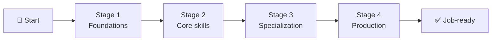
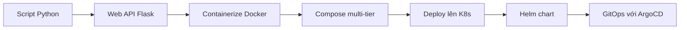

# 🗺️ Roadmap Design — Cách thiết kế lộ trình học

> **Tác giả:** Mr.Rom\
> **Phiên bản:** v0.1.0\
> **Tạo lúc:** 15/05/2026\
> **Cập nhật:** 15/05/2026

> 🎯 *File này định nghĩa cách thiết kế và viết roadmap. Roadmap là **layer điều hướng** — không chứa kiến thức, chỉ chứa thứ tự + link tới các bài/project ở các chủ đề L1/L2. Có 2 loại: career roadmap và lab series.*

---

## 1️⃣ Triết lý roadmap

| Nguyên tắc | Diễn giải |
|---|---|
| **DRY** | Roadmap không lặp content. Chỉ chứa link + thứ tự + thời gian |
| **Action-oriented** | Mỗi step có thể tick `[ ]` — người học track tiến độ |
| **Realistic timeline** | Cho ước lượng thời gian dựa trên người học toàn thời gian (8h/ngày) hoặc part-time (1-2h/ngày) |
| **Modular** | Step độc lập — bỏ qua được nếu đã biết. Có cách "skip + verify" |
| **Branching** | Cho nhánh khi roadmap có nhiều con đường (vd: chọn FE vs BE sau cơ bản) |
| **Có exit criteria** | Mỗi stage có "Sau stage này bạn làm được X" — đo lường được |

---

## 2️⃣ Hai loại roadmap

| | 🧭 Career Roadmap | 🧪 Lab Series |
|---|---|---|
| **Mục đích** | Lộ trình nghề (vd: Backend Developer) | Chuỗi bài tập thực hành theo thứ tự (vd: Docker → K8s) |
| **Thời gian** | 6-12 tháng | 1-4 tuần |
| **Độ trừu tượng** | Cao — gồm cả kiến thức lý thuyết | Cụ thể — chỉ bài tập/project |
| **Đối tượng** | Người định hướng nghề | Người muốn cày hands-on |
| **Vị trí file** | `00_Roadmaps/career/<role>_career-roadmap.md` | `00_Roadmaps/lab-series/<name>_lab-series.md` |
| **Số stage** | 4-8 stage lớn | 5-15 stage nhỏ |
| **Link tới** | Cả lessons, projects, exercises, recipes | Chủ yếu projects + exercises, có thể có lessons làm reference |

---

## 3️⃣ Cấu trúc Career Roadmap

### 3.1 Template

```markdown
# 🧭 <Role> Career Roadmap

> **Tác giả:** Mr.Rom\
> **Phiên bản:** v1.0.0\
> **Tạo lúc:** DD/MM/YYYY\
> **Cập nhật:** DD/MM/YYYY\
> **Đối tượng:** <ai phù hợp với roadmap này>\
> **Thời gian ước tính:** <X tháng full-time / Y tháng part-time>

> 🎯 *Câu dẫn ngắn: "Sau lộ trình này bạn sẽ làm được X, đáp ứng yêu cầu phổ biến của Y."*

---

## 🎯 Mục tiêu cuối cùng

Sau khi hoàn thành roadmap này, bạn sẽ:
- [ ] <Mục tiêu 1 — kiểm chứng được>
- [ ] <Mục tiêu 2>
- [ ] <Mục tiêu 3>
- [ ] <Mục tiêu 4>

## 🗺️ Overview các stage



| Stage | Tên | Thời gian | Output cuối stage |
|---|---|---|---|
| 1 | Foundations | 1-2 tháng | <output> |
| 2 | Core skills | 2-3 tháng | <output> |
| 3 | Specialization | 2-3 tháng | <output> |
| 4 | Production | 1-2 tháng | <output> |

---

## Stage 1 — Foundations (1-2 tháng)

> 🎯 *Mục tiêu stage: nắm vững <X> trước khi bước sang core skills.*

### 📚 Lý thuyết cần đọc

- [ ] [<Topic 1>](../../<L1>/<L2>/lessons/01_basic/<file>.md) — *X phút đọc*
- [ ] [<Topic 2>](../../<L1>/<L2>/lessons/01_basic/<file>.md) — *Y phút*

### 🛠️ Setup môi trường

- [ ] [<Setup tool>](../../<L1>/<L2>/setup/<file>.md)

### 🧪 Bài tập

- [ ] [<Exercise 1>](../../<L1>/<L2>/exercises/01_<name>.md)
- [ ] [<Exercise 2>](../../<L1>/<L2>/exercises/02_<name>.md)

### 🎯 Project nhỏ (cuối stage)

- [ ] [<Project nhỏ>](../../<L1>/<L2>/projects/01_<name>/)

### ✅ Verify — Sau stage 1 bạn phải

- [ ] Trả lời được "<câu hỏi key 1>"
- [ ] Tự build được "<sản phẩm nhỏ>"
- [ ] Đọc được code "<dạng code>"

---

## Stage 2 — Core skills (2-3 tháng)

(tương tự stage 1)

---

## 📌 Tài nguyên bổ sung

### Sách
- "<Tên sách>" — <ai recommend, vì sao>

### Khoá học (paid hoặc free đáng giá)
- <Tên> — <link>

### Cộng đồng
- <Discord/Reddit/Slack> — <vì sao tham gia>

---

## 🔄 Khi nào điều chỉnh roadmap

- Nếu bạn đã biết Stage 1 → bỏ qua, làm verify để chắc
- Nếu Stage 2 quá nhanh → thêm side project (xem `projects/`)
- Nếu Stage 3 không phù hợp → đổi specialization (link sang roadmap khác)

---

## 📌 Changelog

- **v1.0.0 (<date>)** — Bản đầu tiên.
```

### 3.2 Ví dụ rút gọn — Backend Developer

```markdown
# 🧭 Backend Developer Career Roadmap

...metadata...

## 🎯 Mục tiêu cuối cùng

- [ ] Build được REST API có auth, có DB, có testing
- [ ] Deploy được app lên cloud (AWS/GCP)
- [ ] Hiểu fundamentals: HTTP, DB, caching, queue
- [ ] Trả lời được câu hỏi system design entry-level

## Stage 1 — Programming Foundations (1-2 tháng)
📚 [Python basics](../../03_Languages/python/lessons/01_basic/)
🧪 [exercises 01-10](../../03_Languages/python/exercises/)
🎯 Build [CLI app đơn giản](../../03_Languages/python/projects/01_cli-todo/)

## Stage 2 — Web fundamentals (2 tháng)
📚 [HTTP & REST](../../07_Web/backend/rest-api/)
🛠️ [Setup FastAPI](../../07_Web/backend/python-fastapi/setup/)
🎯 Build [REST API CRUD](../../07_Web/backend/projects/01_crud-api/)

## Stage 3 — Database (1-2 tháng)
...

## Stage 4 — Production (1-2 tháng)
...
```

---

## 4️⃣ Cấu trúc Lab Series

### 4.1 Template

```markdown
# 🧪 <Series Name> Lab Series

> **Tác giả:** Mr.Rom\
> **Phiên bản:** v1.0.0\
> **Tạo lúc:** DD/MM/YYYY\
> **Cập nhật:** DD/MM/YYYY\
> **Đối tượng:** <yêu cầu nền tảng tối thiểu>\
> **Thời gian:** <X-Y giờ tổng>\
> **Output cuối:** <sản phẩm cuối cùng>

> 🎯 *Câu dẫn: "Chuỗi N bài thực hành xuyên qua <các topic>. App `<tên-app>` được tiến hóa dần từ <start> tới <end>."*

---

## 🎯 App xuyên suốt

Mô tả app: `<tên-app>` — bắt đầu là <X>, dần phát triển thành <Y>, kết thúc deploy lên <Z>.



## 📋 Mục lục stage

| Stage | Phạm vi | Số bài | Thời gian |
|---|---|---|---|
| Stage 1 | Docker basics | 8 bài | ~6h |
| Stage 2 | Docker runtime | 9 bài | ~6h |
| Stage 3 | K8s basics | 6 bài | ~5h |
| Stage 4 | K8s production | 8 bài | ~8h |
| ... | ... | ... | ... |
| **Tổng** | | **50 bài** | **~40h** |

---

## Stage 1 — Docker basics (8 bài, ~6h)

> 📍 **Đi tới**: [`10_DevOps/docker/lessons/01_basic/`](../../10_DevOps/docker/lessons/01_basic/)
> 📍 **Project**: [`10_DevOps/docker/projects/01_python-app-docker/`](../../10_DevOps/docker/projects/01_python-app-docker/)
> ⚠️ **Output**: image `myapp:1.2` đã build

- [ ] Bài 01: Pull image đầu tiên
- [ ] Bài 02: Kiểm tra image
- [ ] Bài 03: Tạo Dockerfile đầu tiên
- [ ] ... (tới Bài 08)

### ✅ Verify stage 1

- [ ] `docker images` thấy `myapp:1.2`
- [ ] `docker run myapp:1.2` chạy được

---

## Stage 2 — Docker runtime (9 bài, ~6h)

> 📍 **Đi tới**: [`10_DevOps/docker/lessons/02_intermediate/`](../../10_DevOps/docker/lessons/02_intermediate/)
> ⚠️ **Prerequisite**: Hoàn thành Stage 1

(tương tự stage 1)

---

## Stage 3 — K8s basics (6 bài, ~5h)

> 📍 **Setup**: [`10_DevOps/kubernetes/setup/minikube.md`](../../10_DevOps/kubernetes/setup/minikube.md)
> 📍 **Bài học**: [`10_DevOps/kubernetes/lessons/01_basic/`](../../10_DevOps/kubernetes/lessons/01_basic/)
> 📍 **Project**: [`10_DevOps/kubernetes/projects/01_first-pod/`](../../10_DevOps/kubernetes/projects/01_first-pod/)
>
> ⚠️ **Cross-L2 reference**: Cần image từ Stage 2 — có 3 cách:
> 1. Đi qua từ Stage 2, đã có image local
> 2. Clone repo mẫu: `git clone <repo>`
> 3. Build từ đầu theo `docker/lessons/01_basic/`

(...)

---

## 📌 Sản phẩm cuối series

Sau 50 bài, bạn sẽ có:
- Repo source `myapp` với code Python + Dockerfile + Helm chart
- Cluster K8s local với app chạy production-style
- CI/CD pipeline tự deploy khi push code

---

## 📌 Changelog

- **v1.0.0 (<date>)** — Bản đầu tiên.
```

### 4.2 Ví dụ cụ thể — Docker to K8s Lab Series

Đây là roadmap chuyển thể từ file `docker-k8s-practice.md` của user:

```markdown
# 🧪 Docker → K8s Lab Series

> **Đối tượng**: Biết Linux cơ bản, biết 1 ngôn ngữ lập trình
> **Thời gian**: ~40h (1 tháng part-time)
> **Output**: app `myapp` Python deploy đầy đủ lên K8s với Helm + ArgoCD + Istio

(...50 bài chia 9 stage)
```

→ File điều hướng. Content nằm ở:
- `10_DevOps/docker/lessons/`, `docker/projects/`
- `10_DevOps/kubernetes/lessons/`, `kubernetes/projects/`
- `10_DevOps/gitops/` (cho ArgoCD)
- `10_DevOps/service-mesh/` (cho Istio)

---

## 5️⃣ Pattern thiết kế stage

### 5.1 Mỗi stage nên có

| Thành phần | Mục đích |
|---|---|
| 🎯 Mục tiêu stage | "Sau stage này bạn làm được X" |
| 📚 Lý thuyết cần đọc | Link tới `lessons/` |
| 🛠️ Setup (nếu cần) | Link tới `setup/` |
| 🧪 Exercise / Project | Link tới `exercises/`, `projects/` |
| ✅ Verify checklist | Cách kiểm chứng đã đạt mục tiêu |
| ⏭️ Output cho stage tiếp | Gì cần có khi bắt đầu stage sau |

### 5.2 Tránh các lỗi thường gặp

| ❌ Lỗi | 💡 Cách tránh |
|---|---|
| Stage quá dài (>2 tuần) | Tách thành 2 stage nhỏ hơn |
| Quá nhiều theory đầu stage | Xen kẽ theory + practice |
| Không có verify checklist | Thêm 3-5 câu hỏi/task verify |
| Link 1 chiều (chỉ stage → bài) | Bài cũng nên link ngược về roadmap |
| Roadmap quá cứng | Đánh dấu OPTIONAL/SKIP-IF cho phần advanced |

---

## 6️⃣ Roadmap README — Index của `00_Roadmaps/`

```markdown
# 🗺️ Roadmaps

> Bộ sưu tập lộ trình học. Có 2 loại — chọn loại phù hợp.

## 🧭 Career Roadmap (lộ trình nghề)

Lộ trình 6-12 tháng để vào 1 nghề cụ thể.

| Roadmap | Đối tượng | Thời gian |
|---|---|---|
| [Zero-to-coder](./career/zero-to-coder_career-roadmap.md) | Người chưa biết gì | 3-6 tháng |
| [Backend Developer](./career/backend-developer_career-roadmap.md) | Người muốn làm backend | 6-12 tháng |
| ... | ... | ... |

## 🧪 Lab Series (chuỗi bài tập)

Chuỗi bài thực hành nhiều stage, có output cuối.

| Series | Phạm vi | Thời gian |
|---|---|---|
| [Docker → K8s](./lab-series/docker-to-k8s_lab-series.md) | Containerization → orchestration | ~40h |
| [Full-stack web](./lab-series/full-stack-web-app_lab-series.md) | FE + BE + DB + Deploy | ~30h |
| ... | ... | ... |
```

---

## 7️⃣ Quy ước version cho roadmap

Roadmap có version riêng. Bump khi:

| Thay đổi | Bump |
|---|---|
| Sửa typo / link vỡ | Patch (1.0.0 → 1.0.1) |
| Thêm/sửa 1 stage | Minor (1.0.x → 1.1.0) |
| Thay đổi định hướng lớn | Major (1.x.x → 2.0.0) |


## 8️⃣ Vai trò Glue Layer & Đảm bảo Tính cô lập Modular

> [!IMPORTANT]
> **Vai trò của Roadmap:** Roadmap không sở hữu nội dung bài giảng. Nó đóng vai trò là **lớp chất keo (Glue Layer)** kết nối các mô-đun độc lập bên dưới.

### Cách thức hoạt động:
1. **Deep-link một chiều đi xuống:** Roadmap trỏ trực tiếp đến các file bài học (`lessons/**/*.md`) hoặc bài tập (`exercises/**/*.md`) của các mô-đun kiến thức cụ thể.
2. **Không trỏ ngược trực tiếp:** Tuyệt đối không yêu cầu các mô-đun trỏ ngược lại chính xác tên hay anchor của Roadmap.
3. **Exit criteria rõ ràng:** Tại mỗi cuối stage trong Roadmap, cần ghi rõ "Exit Criteria" kèm chỉ dẫn kiểm thử/xác minh, và cung cấp hướng dẫn rõ ràng để người học biết khi nào nên đi tiếp hoặc quay trở lại lộ trình chung sau khi hoàn thành một mô-đun bên ngoài.

---

## 📌 Changelog

- **v0.2.0 (26/05/2026)** — Thêm mục "Vai trò Glue Layer & Đảm bảo Tính cô lập Modular" để định vị rõ trách nhiệm liên kết của Roadmap.
- **v0.1.0 (15/05/2026)** — Bản đầu tiên. Spec 2 loại roadmap (career + lab-series). Template đầy đủ cho cả 2. Pattern thiết kế stage (mục tiêu + theory + practice + verify). Quy ước index `00_Roadmaps/README.md`.

