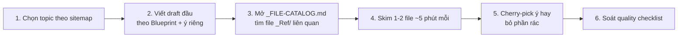

# ✅ Quality Checklist — Soát trước khi publish

> **Tác giả:** Mr.Rom\
> **Phiên bản:** v0.3.0\
> **Tạo lúc:** 15/05/2026\
> **Cập nhật:** 16/05/2026

> 🎯 *File này là checklist cuối cùng để soát 1 bài (lesson, exercise, project, recipe, roadmap) trước khi commit. Đi qua từng mục — chỉ publish khi tất cả ✅.*

---

## 0️⃣ Quy ước dùng checklist

| Mức | Áp dụng cho | Số mục bắt buộc |
|---|---|---|
| 🟢 **Minimal** | Quick note, bài <500 từ | Section 1 + 8 |
| 🟡 **Standard** | Lesson, exercise, recipe thường | Section 1-4 + 8 |
| 🔴 **Comprehensive** | Project, roadmap, lesson advanced | Tất cả section |

---

## 1️⃣ Cấu trúc bài (REQUIRED — mọi bài)

- [ ] **H1 chỉ 1 lần** ở đầu file
- [ ] **Metadata header** đầy đủ ngay sau H1:
  - [ ] Tác giả: `Mr.Rom`
  - [ ] Version (SemVer)
  - [ ] Tạo lúc + Cập nhật (DD/MM/YYYY)
  - [ ] Level (cho lessons): Basic / Intermediate / Advanced
  - [ ] Thời lượng đọc ước tính
  - [ ] Prerequisites (nếu có)
- [ ] **Câu dẫn + Mục tiêu** đầu file (REQUIRED — section 1.2 của `03_writing-style.md`)
- [ ] **Nội dung chính** có cấu trúc rõ ràng (H2/H3 hợp lý)
- [ ] **Changelog** cuối file với ít nhất entry v1.0.0

---

## 2️⃣ Văn phong (REQUIRED)

- [ ] **Xưng hô đúng**: tác giả = "mình"/"Mr.Rom", người đọc = "bạn"
- [ ] **Tiếng Việt có dấu đầy đủ** — không "tieng viet khong dau"
- [ ] **Không sáo rỗng**: bỏ "Như đã biết", "Hy vọng bài viết hữu ích", "Đây là một câu hỏi rất hay"
- [ ] **Câu dẫn giữa các section** — không nhảy ngang
- [ ] **Thuật ngữ EN** in nghiêng lần đầu + giải nghĩa trong ngoặc
- [ ] **Không ngôi thứ 3** ("Người dùng nên..." → "Bạn nên...")

---

## 3️⃣ Code & Hands-on (REQUIRED nếu có code)

- [ ] **Mọi code block có language hint** (` ```bash`, ` ```python`, ` ```yaml`)
- [ ] **Code copy-paste chạy được** — không ellipsis `...` mơ hồ
- [ ] **Output mẫu** sau lệnh (cho người đọc biết kết quả đúng)
- [ ] **Đã test thật** lệnh/code trước khi commit (KHÔNG copy code chưa test)
- [ ] **Comment in code**: ngắn EN, dài VN OK
- [ ] **Path tuyệt đối → tương đối** trong code mẫu (`./data/` thay `/Users/me/data/`)
- [ ] **Không hardcode credential** (password, API key thật) — dùng placeholder `<your-api-key>`

---

## 4️⃣ Diagram & Visualization (REQUIRED nếu có)

- [ ] **Mermaid render thử** đã work (mở file trong GitHub preview hoặc VSCode)
- [ ] **Alt text bắt buộc** cho image: `` — không để rỗng `[]`
- [ ] **Image path tương đối** từ file hiện tại
- [ ] **Image trong `_assets/`** ở cấp phù hợp (xem `02_folder-structure.md` §5)
- [ ] **ASCII tree** dùng box-drawing chars: `├──`, `└──`, `│`
- [ ] **Diagram có heading** trên — không "diagram dưới đây", phải nói rõ "Diagram X cho thấy..."

---

## 5️⃣ Link & Navigation (STANDARD trở lên)

- [ ] **Internal link dùng relative path** — không absolute
- [ ] **Trailing slash đúng**: `/` cho folder, không có `/` cho file
- [ ] **Anchor link đã test** — đặc biệt anchor tiếng Việt có dấu
- [ ] **Link text mô tả đích** — không "click here", "ở đây"
- [ ] **Navigation footer** cuối bài (nếu là lesson):
  - [ ] Bài trước / Bài tiếp / Bài liên quan
  - [ ] Index L2
  - [ ] Tài nguyên ngoài (nếu có)
- [ ] **External link còn live** — test mở thử (link rot là cơn ác mộng)

---

## 6️⃣ Glossary & Thuật ngữ (REQUIRED nếu có thuật ngữ EN)

- [ ] **Mọi thuật ngữ EN trong bài** đã có entry trong glossary (cấp 1 hoặc cấp 2)
- [ ] **Format glossary chuẩn**: bảng `EN | VN | Giải thích`
- [ ] **Giải thích ≤25 từ**, đủ để hiểu, không lan man
- [ ] **VN dịch hoặc "giữ nguyên"** nếu không có VN tương đương

---

## 7️⃣ Cấu trúc folder & file (REQUIRED)

- [ ] **File ở đúng vị trí** theo `02_folder-structure.md`
- [ ] **Tên file đúng convention** theo `02_folder-structure.md`:
  - [ ] Lowercase (trừ folder L1)
  - [ ] Hyphen `-` trong name, underscore `_` giữa segment
  - [ ] Không space, không dấu tiếng Việt
- [ ] **Đánh số `NN_`** đúng (nếu file thuộc series có thứ tự)
- [ ] **README.md tồn tại** ở folder nếu folder có >3 file
- [ ] **Prefix `_`** đúng nghĩa cho meta content
- [ ] **`00_overview.md`** và `_cheatsheet.md` (nếu có) đúng tên

---

## 8️⃣ Self-check nội dung (REQUIRED)

Đọc lại file 1 lần, tự hỏi:

- [ ] **Beginner đọc hiểu được không?** — giả định người đọc không biết gì
- [ ] **Có câu nào không cần thiết?** — cắt bỏ
- [ ] **Có chỗ nào unclear?** — viết lại cho rõ
- [ ] **Tiêu đề có khớp nội dung?** — đừng câu view
- [ ] **Có self-check (nếu là lesson sâu)?** — câu hỏi ôn tập
- [ ] **Cheatsheet (nếu áp dụng)?** — tra cứu nhanh cho senior

---

## 9️⃣ Markdown render (REQUIRED)

- [ ] **Preview thử** trên GitHub hoặc VSCode markdown preview
- [ ] **Heading level** đi đúng (H1 → H2 → H3, không nhảy H1 → H4)
- [ ] **Table** render đúng (đủ dấu `|`, header có separator)
- [ ] **Code block** đóng đầy đủ (3 backtick đầu + cuối)
- [ ] **Bullet list** consistent (cùng dùng `-` hoặc cùng `*`)
- [ ] **Bold/italic** không dư `*`/`_`
- [ ] **Block quote** dùng `>` đúng

---

## 🔟 Đặc biệt cho từng loại bài

### 📖 Lesson

- [ ] Có cả 3 phần REQUIRED (Metadata + Câu dẫn + Nội dung)
- [ ] Câu dẫn liền mạch (test: đọc to thử, có vấp không)
- [ ] Có ít nhất 1 diagram nếu khái niệm phức tạp
- [ ] Hands-on copy-paste được (đã test)
- [ ] Glossary đầy đủ thuật ngữ EN

### 🧪 Exercise

- [ ] **Yêu cầu rõ ràng** — không mơ hồ
- [ ] **Có gợi ý ẩn** (`<details>`) nếu khó
- [ ] **Đáp án ẩn** (`<details>`) ở cuối
- [ ] **Tiêu chí "đạt"** rõ ràng — kiểm chứng được

### 🎯 Project

- [ ] **README có Prerequisites** (skill / tool / source cần có trước)
- [ ] **Mỗi step file** ngắn (500-1500 từ)
- [ ] **Đánh số step rõ ràng** (`01_`, `02_`, ...)
- [ ] **Output cuối project** mô tả rõ
- [ ] **Code mẫu nằm trong `code/`** hoặc link tới repo

### 📚 Recipe

- [ ] **Problem → Cause → Solution → Verify** đầy đủ
- [ ] **Ngắn gọn** (200-500 từ) — đi vào việc
- [ ] **Output / verify command** cụ thể

### 🧭 Career Roadmap

- [ ] **Mục tiêu cuối** rõ ràng, đo lường được
- [ ] **Mỗi stage** có verify checklist
- [ ] **Timeline thực tế** (không quá tham, không quá lỏng)
- [ ] **Link tới content** đầy đủ — không stage "trống"
- [ ] **Tài nguyên bổ sung** (sách, khoá, cộng đồng)

### 🧪 Lab Series

- [ ] **App xuyên suốt** mô tả rõ
- [ ] **Mỗi stage** có output cụ thể (`docker images`, ...)
- [ ] **Cross-L2 reference** dùng pattern chuẩn (xem `05_linking-strategy.md` §3)
- [ ] **Sản phẩm cuối series** mô tả rõ

---

## 1️⃣1️⃣ Checklist meta — khi PR / commit

- [ ] **Branch name** theo convention: `feature/<L1>-<L2>-<topic>`
- [ ] **Commit message** rõ ràng: `feat: add Pod lesson basic`
- [ ] **Liên quan các file khác?** — đã cập nhật chưa (vd: glossary, README L2)
- [ ] **Bump version** của file nếu là update, không phải tạo mới

---

## 1️⃣2️⃣ Common mistakes — flag đặc biệt

Những lỗi hay gặp phải check kỹ:

| ❌ Lỗi | 🔍 Cách check |
|---|---|
| Link vỡ sau khi rename file | `grep -rn "<old-name>" .` |
| Anchor lỗi sau khi sửa heading | Search file, kiểm tra link `#anchor` |
| Mermaid syntax sai → render lỗi | Mở GitHub preview |
| Tiếng Việt missing dấu | Spell-check VN trong editor |
| Code mẫu copy từ chỗ khác chưa test | Chạy thử local trước commit |
| Image path sai sau khi move file | Grep `` |
| Glossary thiếu thuật ngữ EN xuất hiện trong bài | Đối chiếu bài ↔ glossary |
| Câu dẫn sáo rỗng "Hy vọng bài viết..." | Search keyword sáo rỗng |
| Heading nhảy cấp (H2 → H4) | Mở outline view |

---

## 1️⃣3️⃣ Workflow tự động (OPT)

Khi kho lớn → setup tooling tự check:

| Tool | Check gì |
|---|---|
| `markdownlint` | Markdown syntax, heading order, table format |
| `markdown-link-check` | Link vỡ (cả internal + external) |
| `vale` | Văn phong (custom rule) |
| `cspell` | Typo (EN + VN) |
| Custom script | Glossary coverage, missing prerequisites, ... |

Tích hợp vào pre-commit hook hoặc CI.

---

## 1️⃣4️⃣ Final 3-bước trước khi commit

```
1. ✏️  Edit + Save
2. 👁️  Preview render (GitHub / VSCode)
3. 📋 Đi qua checklist này — tick mọi mục
4. ✅ Commit
```

> ⚠️ **Đừng skip step 3** dù gấp đến đâu. Bài lỗi sẽ tốn 10x công sửa sau.

---

## 1️⃣5️⃣ 🔁 Reference workflow — Khi tham khảo `_Ref/` để bổ sung bài

> ⚠️ **KHÔNG migrate, KHÔNG copy nguyên file**. `_Ref/` có nhiều content lỗi thời / rác / trùng lặp. Approach Blueprint mới (16 L1, 8 phần, WHY→WHAT→HOW, metaphor) khác hẳn structure cũ → migrate kéo cả rác lẫn cấu trúc cũ vào.

> ✅ **Approach đúng**: Viết bài theo **Blueprint + ý tưởng riêng** làm CHỦ ĐẠO. Sau đó tham khảo `_Ref/` xem có ý nào hay đáng adopt thêm — *cherry-pick, không copy*.

### Quy trình tham khảo 6 bước



| Bước | Việc | Lưu ý |
|---|---|---|
| 1 | Chọn topic theo sitemap (`_Blueprint/01_sitemap-detail.md`) | — |
| 2 | **Viết draft đầu tiên** theo template + ý tưởng riêng | Tuyệt đối KHÔNG mở `_Ref/` ở bước này — tránh bị influence sai hướng |
| 3 | Mở `_Ref/_FILE-CATALOG.md` tìm file liên quan | Time-box: tối đa 5 phút tìm |
| 4 | Skim 1-2 file `_Ref/` liên quan nhất | Tối đa ~5 phút/file, không đọc kỹ |
| 5 | **Cherry-pick** từng yếu tố hay nếu có | Bỏ phần rác/lỗi thời — không "tiếc" |
| 6 | Đi qua quality checklist (§1-§14 file này) | Như mọi bài thường |

### Cherry-pick gì từ `_Ref/`

| Yếu tố hay | Cherry-pick vào |
|---|---|
| 🪞 Ẩn dụ tốt | WHAT section (đọc thêm `03_writing-style.md` §2.3) |
| 🧪 Ví dụ hands-on thực tế | HOW section |
| 📊 Diagram thú vị | Vẽ lại bằng mermaid theo style mình |
| 💡 Pitfall thực tế từng gặp | Pitfall & Best practice section |
| ⚡ Lệnh / shortcut hay | Cheatsheet |
| 📚 Thuật ngữ giải nghĩa hay | Glossary |
| 🎯 Use case industry | Có thể vào Project / Recipe |

### Cherry-pick KHÔNG bao gồm

| Không cherry-pick | Tại sao |
|---|---|
| ❌ Toàn bộ structure bài cũ | Bài mới có structure 8 phần riêng |
| ❌ Văn phong cũ | Blueprint có chuẩn văn phong (§3 writing-style) |
| ❌ Tiêu đề cũ | Naming convention mới khác |
| ❌ Glossary cũ nguyên bảng | Glossary mới phải dùng thuật ngữ trong bài, không over-glossary |
| ❌ Code mẫu chưa test | Phải test mới cho vào bài mới |

### 🔀 Khi `_Ref/` có 2+ file cùng topic

Vd: `K8s/8_Pod-la-gi.md` + `K8s-training/03_pod-and-kubectl/` + `Dev-knowledge/09_DevOps/k8s/pod.md` — 3 file cùng nói về Pod.

| Approach |
|---|
| ✅ Skim cả 3, tổng hợp lấy điểm hay nhất từ mỗi file vào bài mới |
| ✅ Note ở `_REVIEW_LOG.md`: *"Bài Pod đã cherry-pick từ X, Y, Z. Lấy ẩn dụ từ X, ví dụ từ Y, pitfall từ Z."* |
| ❌ Không pick 1 file làm "canonical" rồi merge — bài mới là sản phẩm độc lập, không phải merge của cũ |

### ⏱️ Time-box

| Hoạt động | Thời gian tối đa |
|---|---|
| Viết draft đầu (bước 2) | Không giới hạn |
| Tham khảo `_Ref/` (bước 3-5) | **15 phút/bài** |
| Quality check (bước 6) | 10 phút |

→ Nếu bước 3-5 quá 15 phút, có nghĩa đang sa lầy. Dừng lại, finalize bài với ý đã có.

### 🎯 Nguyên tắc vàng

| Nguyên tắc | Vì sao |
|---|---|
| **Blueprint + ý riêng = CHỦ ĐẠO** | `_Ref/` là phụ — chỉ cherry-pick |
| **Cherry-pick, không copy** | Copy = kéo rác + cấu trúc cũ vào |
| **Khi nghi ngờ "đoạn này hay?" → bỏ** | 1 bài rõ ràng hơn 1 đoạn rời rạc |
| **Bài mới phải đứng độc lập** | Người đọc không cần biết bài cũ tồn tại |

> 💡 **Bài cũ ở `_Ref/` chỉ là source of inspiration, không phải source of truth**. Source of truth là Blueprint + kiến thức hiện tại của bạn.

---

## 📌 Changelog

- **v0.3.0 (16/05/2026)** — Rewrite §15 sau feedback user:
  - Đổi mindset từ "Migration workflow" → "**Reference workflow**" — `_Ref/` chỉ để **cherry-pick ý hay**, không migrate
  - Bỏ label A/B/C/D (migration thinking)
  - Quy trình 6 bước: viết draft đầu theo Blueprint + ý riêng → tham khảo `_Ref/` cherry-pick → quality check
  - **Time-box** 15 phút/bài cho tham khảo
  - Bảng "cherry-pick gì" vs "cherry-pick KHÔNG bao gồm"
  - Nguyên tắc vàng: Blueprint + ý riêng = CHỦ ĐẠO, `_Ref/` chỉ là source of inspiration
- **v0.2.0 (16/05/2026)** — Thêm §15 Migration workflow *(đã bị deprecated trong v0.3.0)*.
- **v0.1.0 (15/05/2026)** — Bản đầu tiên. Checklist 14 mục cho mọi loại bài. 3 mức Minimal/Standard/Comprehensive. Common mistakes flag. Workflow tự động (OPT).
