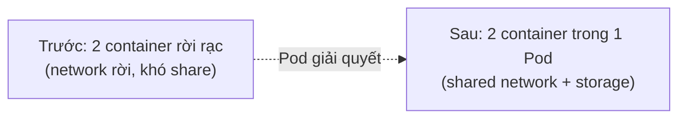

# 📋 Overview — Kubernetes Pod

> **Tác giả:** Mr.Rom\
> **Phiên bản:** v1.0.0\
> **Tạo lúc:** 15/05/2026\
> **Cập nhật:** 15/05/2026

> 🎯 *Pod là đơn vị deploy nhỏ nhất của Kubernetes — chứa 1 hoặc nhiều container chia sẻ network và storage. Tất cả resource cấp cao hơn (Deployment, StatefulSet, Job) đều quản lý Pod.*

---

## 1️⃣ Pod là gì

Pod là **nhóm 1 hoặc nhiều container** chạy cùng nhau trên 1 Node, **chia sẻ network namespace** (cùng IP, cùng port space) và **storage volume**. K8s không deploy container trực tiếp — luôn deploy Pod.

## 2️⃣ Vì sao có Pod (thay vì deploy Container trực tiếp)

### Trước khi có Pod (thời Docker bare)

Bạn deploy container đơn lẻ. Khi cần 2 container *gắn chặt* (vd: web app + log forwarder), bạn phải tự cấu hình network giữa chúng — phức tạp.

### Sau khi có Pod

Pod gom 2+ container gắn chặt lại. Chúng tự động chia sẻ network/storage — đơn giản hơn nhiều.

## 3️⃣ Khi nào dùng "multi-container Pod"

| Tình huống | Có nên |
|---|---|
| Sidecar pattern (vd: app + log collector) | ✅ Có |
| Init container (chạy 1 lần khi Pod start) | ✅ Có |
| Ambassador pattern (proxy cho app) | ✅ Có |
| 2 microservice độc lập | ❌ Không — mỗi service 1 Pod riêng |
| Web + DB | ❌ Không — DB nên là StatefulSet riêng |

## 4️⃣ Các khái niệm cốt lõi

- **Container trong Pod**: ≥1, chia sẻ network và storage volume.
- **Pod IP**: mỗi Pod có 1 IP duy nhất trong cluster (do CNI cấp).
- **Lifecycle**: Pending → Running → Succeeded/Failed/Unknown.
- **Restart policy**: Always / OnFailure / Never — quy định khi container exit.

> 📖 *Chi tiết Pod xem [`lessons/01_basic/01_pod.md`](./lessons/01_basic/01_pod.md).*

## 5️⃣ Hệ sinh thái liên quan

| Resource cấp cao | Vai trò | Khi dùng |
|---|---|---|
| **Deployment** | Quản lý ReplicaSet → Pod | Stateless app, cần scale |
| **StatefulSet** | Pod có identity ổn định | Database, cluster có ordering |
| **DaemonSet** | 1 Pod / Node | Log/metrics collector |
| **Job / CronJob** | Pod chạy 1 lần / schedule | Batch task, cron |

## 6️⃣ Lộ trình học đề xuất

| Bước | Đọc gì |
|---|---|
| 1 | [Pod basic](./lessons/01_basic/01_pod.md) |
| 2 | (sẽ có khi viết tiếp) Deployment, Service, ConfigMap, ... |

## 7️⃣ Câu hỏi thường gặp

**Q: Pod chết thì K8s tự tạo lại không?**

A: **Không** nếu Pod tạo trực tiếp (`kubectl run`). **Có** nếu Pod thuộc Deployment/ReplicaSet/StatefulSet — controller sẽ tạo Pod mới.

**Q: 2 container trong 1 Pod gọi nhau qua port nào?**

A: `localhost:<port>` vì chia sẻ network namespace. Không cần Service.

---

## 🔗 Liên kết

- [README chủ đề](./README.md)
- [Glossary](./_glossary.md)
- [Official K8s Pod docs](https://kubernetes.io/docs/concepts/workloads/pods/) — chi tiết spec

---

## 📌 Changelog

- **v1.0.0 (15/05/2026)** — Bản đầu tiên — mẫu cho Blueprint.
