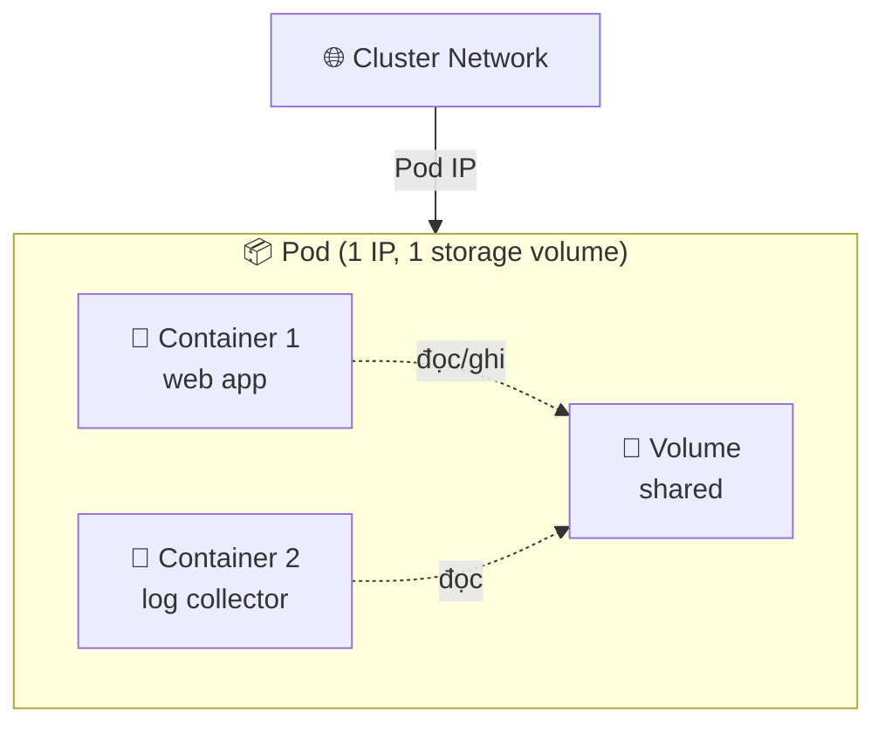
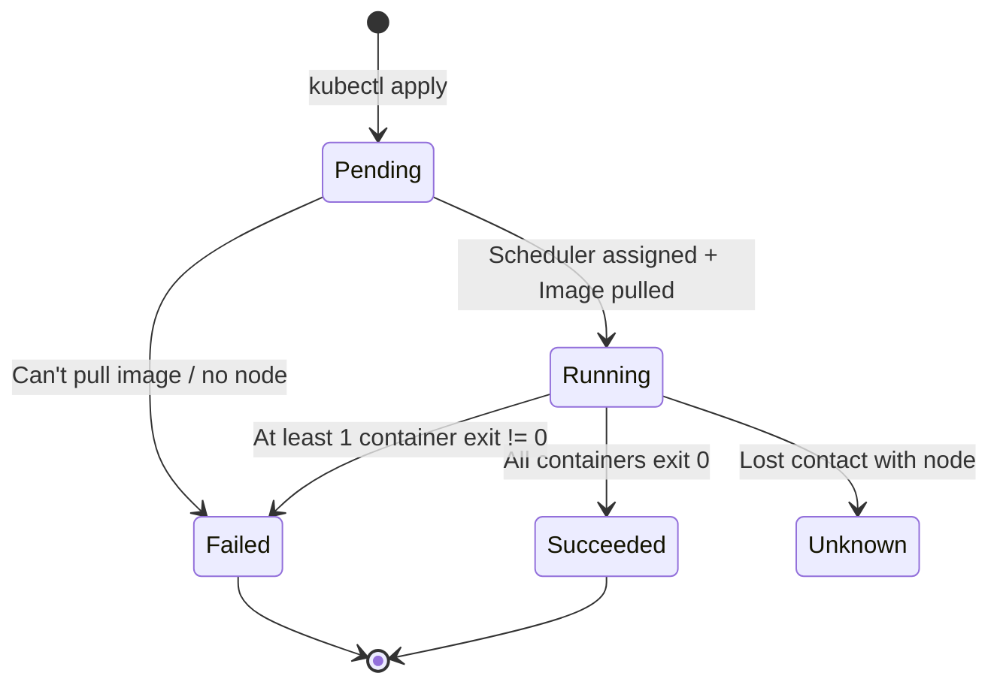

# Pod — Đơn vị deploy nhỏ nhất của Kubernetes

> **Tác giả:** Mr.Rom\
> **Phiên bản:** v1.0.0\
> **Tạo lúc:** 15/05/2026\
> **Cập nhật:** 15/05/2026\
> **Level:** Basic\
> **Thời lượng đọc:** ~15 phút\
> **Prerequisites:** Đã biết Docker container cơ bản

> 🎯 *Trước khi học Pod cần hiểu Container (xem Docker basics). Sau bài này bạn sẽ tự tạo, kiểm tra, debug được 1 Pod trong K8s — kiến thức gốc cho mọi resource cấp cao hơn.*

## 🎯 Sau bài này bạn sẽ

- [ ] Giải thích được Pod là gì, khác Container thế nào
- [ ] Tạo Pod bằng cả imperative (`kubectl run`) và declarative (YAML)
- [ ] Đọc được trạng thái Pod (`kubectl get`, `kubectl describe`)
- [ ] Debug Pod cơ bản khi `CrashLoopBackOff` / `Pending`

---

## 1️⃣ Pod là gì

**Pod** là đơn vị deploy nhỏ nhất của Kubernetes. Mỗi Pod chứa **1 hoặc nhiều container**, các container này:

- Chia sẻ **network namespace** — cùng IP, có thể gọi nhau qua `localhost`
- Chia sẻ **storage volume** (nếu khai báo)
- Luôn chạy trên **cùng 1 Node**
- Cùng start, cùng stop

> 💡 *Hiểu định nghĩa rồi, ta xem cấu trúc Pod qua diagram để hình dung rõ hơn.*

### Diagram — Pod chứa 2 container



→ 2 container gọi nhau bằng `localhost:<port>` thay vì qua network ngoài. Đây là lợi thế chính của Pod.

> 📖 *Diagram đã rõ, mình thử tạo 1 Pod thật bằng `kubectl` để thấy cụ thể.*

---

## 2️⃣ Hands-on — Tạo Pod đầu tiên

> ⚙️ **Yêu cầu**: đã có cluster K8s chạy (Minikube/Kind/Docker Desktop). Chưa có → xem [setup K8s].

### 🛠️ Bước 1: Tạo Pod bằng imperative

Cách nhanh nhất — 1 lệnh tạo Pod chạy nginx:

```bash
kubectl run my-pod --image=nginx:1.25
```

Kết quả mong đợi:

```
pod/my-pod created
```

> 📖 *Pod đã tạo, giờ ta kiểm tra trạng thái.*

### 🛠️ Bước 2: Kiểm tra Pod

```bash
kubectl get pods
```

Output:

```
NAME     READY   STATUS    RESTARTS   AGE
my-pod   1/1     Running   0          15s
```

**Giải thích cột:**

| Cột | Ý nghĩa |
|---|---|
| `NAME` | Tên Pod |
| `READY` | Số container ready / tổng số container trong Pod (1/1 = OK) |
| `STATUS` | Trạng thái (Pending → Running → Succeeded/Failed) |
| `RESTARTS` | Số lần container restart |
| `AGE` | Thời gian từ khi tạo |

### 🛠️ Bước 3: Xem chi tiết Pod

```bash
kubectl describe pod my-pod
```

Output (rút gọn):

```
Name:         my-pod
Namespace:    default
Node:         minikube/192.168.49.2
Status:       Running
IP:           10.244.0.5
Containers:
  my-pod:
    Image:    nginx:1.25
    State:    Running
Events:
  Normal  Scheduled  20s   Successfully assigned to node minikube
  Normal  Pulling    19s   Pulling image "nginx:1.25"
  Normal  Pulled     14s   Successfully pulled image
  Normal  Started    13s   Started container my-pod
```

> 📖 *Đã chạy thành công, giờ ta thử cách "đúng chuẩn production" — declarative bằng YAML.*

### 🛠️ Bước 4: Tạo Pod bằng YAML (declarative)

Tạo file `pod.yaml`:

```yaml
apiVersion: v1
kind: Pod
metadata:
  name: my-pod-yaml
  labels:
    app: nginx
    env: dev
spec:
  containers:
    - name: nginx
      image: nginx:1.25
      ports:
        - containerPort: 80
```

Apply:

```bash
kubectl apply -f pod.yaml
```

Verify:

```bash
kubectl get pods -l app=nginx
```

```
NAME           READY   STATUS    RESTARTS   AGE
my-pod-yaml    1/1     Running   0          10s
```

→ Khác imperative: Pod có **labels** (`app=nginx`, `env=dev`) — sau này dùng để Service/Deployment tìm Pod.

### 🛠️ Bước 5: Xóa Pod

```bash
kubectl delete pod my-pod my-pod-yaml
```

```
pod "my-pod" deleted
pod "my-pod-yaml" deleted
```

---

## 3️⃣ Vòng đời Pod (Pod lifecycle)



**Phase chính:**

- **Pending**: Pod đã create, đang chờ schedule lên Node hoặc pull image
- **Running**: Container đang chạy
- **Succeeded**: Container exit code = 0 (thường cho Job)
- **Failed**: ít nhất 1 container exit code != 0
- **Unknown**: K8s không liên lạc được Node

---

## 💡 Pitfall & Best practice

### ❌ Pitfall: tạo Pod trực tiếp trong production

- **Triệu chứng**: Pod chết → K8s không tự tạo lại Pod mới
- **Nguyên nhân**: Pod đơn lẻ không có controller (ReplicaSet/Deployment) quản lý
- **Cách tránh**: Production luôn dùng **Deployment** thay vì Pod trực tiếp. Pod thủ công chỉ cho debug/test.

### ❌ Pitfall: `CrashLoopBackOff`

- **Triệu chứng**: STATUS hiển thị `CrashLoopBackOff`, RESTARTS tăng liên tục
- **Nguyên nhân**: Container exit ngay khi start (sai command, thiếu config, lỗi code)
- **Cách tránh**: Xem log bằng `kubectl logs <pod-name>` để biết lỗi cụ thể

### ✅ Best practice: luôn set `resources.requests` và `resources.limits`

- **Vì sao**: không có resources, Scheduler không biết Node nào đủ chỗ; container dùng vô hạn dễ làm Node sập
- **Cách áp dụng**: thêm vào spec container:
  ```yaml
  resources:
    requests:
      cpu: "100m"
      memory: "128Mi"
    limits:
      cpu: "500m"
      memory: "512Mi"
  ```

### ✅ Best practice: dùng labels có nghĩa

- **Vì sao**: labels là cách Service/Deployment tìm Pod, cũng để monitoring/filter sau này
- **Cách áp dụng**: tối thiểu có `app=<name>`, `env=<dev|staging|prod>`, `version=<x.y.z>`

---

## 🧠 Self-check

**Q1.** Pod khác Container như thế nào?

<details>
<summary>💡 Đáp án</summary>

Pod là đơn vị deploy nhỏ nhất K8s, chứa **1+ container** chia sẻ network namespace và storage volume. Container là đơn vị runtime (Docker), không có khái niệm "shared network" với container khác.

K8s **không deploy Container trực tiếp** — luôn deploy Pod (kể cả Pod có 1 container).

</details>

**Q2.** Có thể chạy 2 container trong 1 Pod không? Khi nào nên?

<details>
<summary>💡 Đáp án</summary>

**Có**. Nên dùng khi 2 container *gắn chặt* (cần share network/storage):

- **Sidecar pattern**: main app + log forwarder
- **Init container**: chạy 1 lần để chuẩn bị data, rồi exit, main container mới start
- **Ambassador pattern**: proxy nối main app ra ngoài

Không dùng khi: 2 service độc lập, hoặc app + DB (DB nên StatefulSet riêng).

</details>

**Q3.** Pod IP có ổn định không? Nếu Pod chết và tạo lại?

<details>
<summary>💡 Đáp án</summary>

**Không ổn định**. Pod mới có IP mới. Đó là lý do cần **Service** đứng trước nhóm Pod — Service có IP cố định và route tới các Pod (qua labels selector).

</details>

---

## ⚡ Cheatsheet

| Mục đích | Lệnh |
|---|---|
| Tạo Pod nhanh | `kubectl run my-pod --image=nginx` |
| Tạo Pod từ YAML | `kubectl apply -f pod.yaml` |
| List Pod | `kubectl get pods` |
| List với label filter | `kubectl get pods -l app=nginx` |
| Xem chi tiết | `kubectl describe pod my-pod` |
| Xem log | `kubectl logs my-pod` |
| Xem log realtime | `kubectl logs -f my-pod` |
| Exec vào Pod | `kubectl exec -it my-pod -- bash` |
| Copy file vào Pod | `kubectl cp ./file my-pod:/tmp/file` |
| Xóa Pod | `kubectl delete pod my-pod` |
| Xem YAML hiện tại | `kubectl get pod my-pod -o yaml` |

---

## 📚 Glossary

| EN | VN | Giải thích |
|---|---|---|
| Pod | Pod (giữ nguyên) | Đơn vị deploy nhỏ nhất K8s, gồm 1+ container chia sẻ network/storage |
| Container | Container (giữ nguyên) | Đơn vị runtime ứng dụng (Docker, containerd) |
| Namespace | Không gian tên | Cô lập logic resource trong cluster |
| Node | Node | Máy worker chạy Pod (VM hoặc physical) |
| Manifest | File khai báo | YAML/JSON mô tả desired state của resource |
| Label | Nhãn | Key-value gắn vào resource để filter/select |
| Selector | Bộ chọn | Quy tắc match label, dùng bởi Service/Deployment |
| Imperative | Mệnh lệnh | Cách "ra lệnh trực tiếp" qua `kubectl run`, `kubectl create` |
| Declarative | Khai báo | Cách "khai báo trạng thái mong muốn" qua YAML + `kubectl apply` |
| CrashLoopBackOff | (giữ nguyên) | Trạng thái Pod restart liên tục do container crash |

---

## 🔗 Liên kết & Tài nguyên

### Bài liên quan trong kho

| Hướng | Bài |
|---|---|
| ⬅️ Bài trước | (chưa có — đây là bài đầu) |
| ➡️ Bài tiếp | (sẽ có — Deployment) |
| 🔗 Liên quan | (sẽ có — Service, ReplicaSet) |
| ⬆️ Index L2 | [Pod overview](../../00_overview.md) |

### Tài nguyên ngoài

- [Official K8s docs — Pod](https://kubernetes.io/docs/concepts/workloads/pods/) — spec đầy đủ
- [Kubernetes the Hard Way](https://github.com/kelseyhightower/kubernetes-the-hard-way) — build cluster from scratch để hiểu sâu

---

## 📌 Changelog

- **v1.0.0 (15/05/2026)** — Bản đầu tiên — bài mẫu cho Blueprint, đầy đủ 8 phần.
