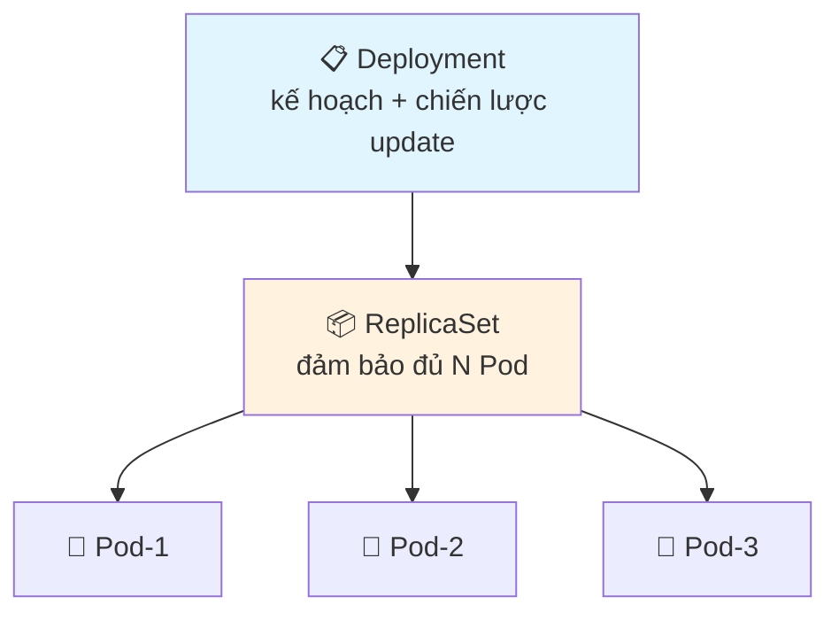

# Deployment — Quản lý nhóm Pod thay bạn

> **Tác giả:** Mr.Rom\
> **Phiên bản:** v1.0.0\
> **Tạo lúc:** 16/05/2026\
> **Cập nhật:** 16/05/2026\
> **Level:** Basic\
> **Tags:** [MUST-KNOW]\
> **Thời lượng đọc:** ~20 phút\
> **Prerequisites:** [Pod](../sample_kubernetes-pod/lessons/01_basic/01_pod.md), [ReplicaSet (khái niệm)](#)

> 🎯 *Pod đơn lẻ chết là mất — Deployment giải quyết bằng cách "quản lý 1 nhóm Pod giống nhau" + có khả năng cập nhật, rollback. Sau bài này bạn sẽ tự deploy 1 app trên K8s đúng chuẩn production.*

## 🎯 Sau bài này bạn sẽ

- [ ] Hiểu Deployment quản lý Pod như thế nào (qua ReplicaSet)
- [ ] Tạo Deployment bằng cả imperative (`kubectl create deployment`) và declarative (YAML)
- [ ] Scale Deployment up/down
- [ ] Cập nhật image bằng rolling update — không downtime
- [ ] Rollback khi update có lỗi

---

## 1️⃣ Vì sao cần Deployment (WHY)

Bạn đã biết Pod là đơn vị deploy nhỏ nhất. Nhưng Pod đơn lẻ có 2 vấn đề lớn trong production:

| Vấn đề | Pod đơn lẻ | Deployment giải quyết |
|---|---|---|
| Pod chết → app down | Phải tự tạo lại bằng tay | Deployment tự tạo Pod mới |
| Cập nhật code | Phải xóa Pod cũ → tạo Pod mới → downtime | Rolling update — Pod mới thay dần Pod cũ |
| Scale lên 10 Pod | Tạo 10 file YAML | 1 dòng `replicas: 10` |
| Phát hiện bug sau update | Phải build lại image cũ + apply | `kubectl rollout undo` 1 lệnh |

→ **Deployment = controller cấp cao quản lý Pod thay bạn**. Đa số production workload (web, API, worker) đều chạy qua Deployment, không bao giờ tạo Pod trực tiếp.

> 💡 *Hiểu vì sao rồi, giờ ta xem Deployment thực ra là gì.*

## 2️⃣ Deployment là gì (WHAT)

**Định nghĩa chính thức**: Deployment là K8s resource quản lý 1 nhóm Pod giống nhau (gọi là *replicas*) thông qua trung gian *ReplicaSet*. Deployment hỗ trợ scale, rolling update, rollback.

**🪞 Ẩn dụ đời thường**: *Deployment giống như **quản lý ca trực** của 1 nhà hàng — bạn ra lệnh "luôn có 3 nhân viên trực" (replicas: 3), manager (Deployment) tự lo: ai nghỉ ca thì gọi thêm, đổi ca thì xếp lại, đào tạo phiên bản mới thì rolling thay từng người, lỗi thì rút về phiên bản cũ.*

**Cấu trúc 3 lớp**:



| Lớp | Vai trò |
|---|---|
| **Deployment** | Lớp cao nhất bạn tương tác. Lưu "trạng thái mong muốn" + chiến lược update |
| **ReplicaSet** | Lớp giữa, do Deployment tự tạo. Đảm bảo có đủ N Pod chạy. Mỗi lần update Deployment → tạo ReplicaSet mới |
| **Pod** | Đơn vị thực thi |

> 💡 Bạn **hiếm khi tương tác trực tiếp với ReplicaSet** — luôn qua Deployment.

## 3️⃣ Cách dùng Deployment (HOW)

### 🛠️ 3.1 Tạo Deployment — imperative (nhanh, test)

```bash
kubectl create deployment my-web --image=nginx:1.25 --replicas=3
```

Kết quả:

```
deployment.apps/my-web created
```

Verify:

```bash
kubectl get deployment my-web
kubectl get pods -l app=my-web
```

```
NAME      READY   UP-TO-DATE   AVAILABLE   AGE
my-web    3/3     3            3           10s

NAME                      READY   STATUS    AGE
my-web-7d8c9b6f4-abc12    1/1     Running   8s
my-web-7d8c9b6f4-def34    1/1     Running   8s
my-web-7d8c9b6f4-ghi56    1/1     Running   8s
```

→ 3 Pod được tạo tự động. Tên Pod = `<deployment>-<replicaset-hash>-<pod-hash>`.

> 💡 *3 cột READY/UP-TO-DATE/AVAILABLE — đều phải bằng 3 thì Deployment mới khoẻ.*

### 🛠️ 3.2 Tạo Deployment — declarative (production)

Tạo file `deployment.yaml`:

```yaml
apiVersion: apps/v1
kind: Deployment
metadata:
  name: my-web
  labels:
    app: my-web
spec:
  replicas: 3
  selector:
    matchLabels:
      app: my-web
  template:
    metadata:
      labels:
        app: my-web
    spec:
      containers:
        - name: nginx
          image: nginx:1.25
          ports:
            - containerPort: 80
          resources:
            requests:
              cpu: "100m"
              memory: "128Mi"
            limits:
              cpu: "500m"
              memory: "256Mi"
```

Apply:

```bash
kubectl apply -f deployment.yaml
```

> 📖 *Note 3 chỗ quan trọng trong YAML:*
> - `spec.replicas: 3` — số Pod muốn có
> - `spec.selector.matchLabels` — Deployment tìm Pod nào để quản lý (qua label)
> - `spec.template` — "khuôn" Pod sẽ được tạo (giống pod.yaml nhưng không có `apiVersion/kind/metadata.name` ở Pod level)

### 🛠️ 3.3 Scale lên/xuống

Imperative:

```bash
kubectl scale deployment my-web --replicas=5
```

Declarative: sửa `replicas: 5` trong YAML → `kubectl apply -f deployment.yaml`.

Verify:

```bash
kubectl get deployment my-web -w
# Press Ctrl+C khi đủ 5/5
```

### 🛠️ 3.4 Rolling update — cập nhật không downtime

Đổi image:

```bash
kubectl set image deployment/my-web nginx=nginx:1.26
```

Quan sát rolling update realtime:

```bash
kubectl rollout status deployment/my-web
```

```
Waiting for deployment "my-web" rollout to finish: 1 of 3 updated...
Waiting for deployment "my-web" rollout to finish: 2 of 3 updated...
deployment "my-web" successfully rolled out
```

→ K8s tạo dần Pod mới (nginx:1.26), giết dần Pod cũ (nginx:1.25). Bất kỳ thời điểm nào cũng có Pod chạy → user không thấy downtime.

> 💡 *Behind the scenes*: Deployment tạo ReplicaSet mới (image 1.26), tăng dần replicas của RS mới + giảm dần RS cũ.

### 🛠️ 3.5 Xem lịch sử + Rollback

Xem lịch sử update:

```bash
kubectl rollout history deployment/my-web
```

```
REVISION  CHANGE-CAUSE
1         <none>
2         <none>
```

Rollback về revision trước:

```bash
kubectl rollout undo deployment/my-web
```

Hoặc về revision cụ thể:

```bash
kubectl rollout undo deployment/my-web --to-revision=1
```

> 💡 Để `CHANGE-CAUSE` có thông tin, dùng `--record` khi update hoặc thêm annotation `kubernetes.io/change-cause` vào YAML.

---

## 💡 Pitfall & Best practice

### ❌ Pitfall: tạo Pod trực tiếp trong production

- **Triệu chứng**: Pod chết → app down vĩnh viễn, K8s không tự tạo lại
- **Nguyên nhân**: Pod đơn lẻ không có controller
- **Cách tránh**: **Luôn dùng Deployment** cho stateless workload. Pod thủ công chỉ cho debug/test

### ❌ Pitfall: `selector.matchLabels` khác `template.metadata.labels`

```yaml
spec:
  selector:
    matchLabels:
      app: my-web      ← phải khớp...
  template:
    metadata:
      labels:
        app: web        ← ... với cái này — KHÁC = Deployment không tìm thấy Pod
```

- **Triệu chứng**: Deployment báo `0/3 ready` dù Pod đang chạy
- **Cách tránh**: copy label từ `template.metadata.labels` sang `selector.matchLabels` (giữ giống nhau)

### ❌ Pitfall: quên set `resources.requests/limits`

- **Triệu chứng**: Pod không schedule được, hoặc Node bị OOM khi Pod ăn quá nhiều RAM
- **Cách tránh**: luôn khai báo `requests` + `limits` cho cả CPU và memory

### ✅ Best practice: dùng readinessProbe

```yaml
readinessProbe:
  httpGet:
    path: /health
    port: 80
  initialDelaySeconds: 5
  periodSeconds: 5
```

- **Vì sao**: rolling update chỉ chuyển traffic sang Pod mới khi `readinessProbe` pass → user không gặp 503

### ✅ Best practice: `maxSurge` và `maxUnavailable` trong rolling update

```yaml
spec:
  strategy:
    type: RollingUpdate
    rollingUpdate:
      maxSurge: 1           # tối đa 1 Pod thừa khi update (default 25%)
      maxUnavailable: 0     # không cho phép thiếu Pod (default 25%)
```

- **Vì sao**: control tốc độ + an toàn rollout

---

## 4️⃣ Hai chiến lược update — RollingUpdate vs Recreate

Mặc định Deployment dùng **RollingUpdate** (đã giới thiệu ở §3.4). Nhưng K8s còn 1 strategy khác — **Recreate** — cho tình huống đặc thù.

| Strategy | Cơ chế | Downtime | Khi dùng |
|---|---|---|---|
| 🔄 **RollingUpdate** (default) | Thay dần Pod cũ bằng Pod mới | ❌ Không | Production stateless: web, API |
| ⚠️ **Recreate** | Giết hết Pod cũ → tạo lại Pod mới | ✅ Có | DB migration, app không cho phép 2 version chạy song song, dev/staging tiết kiệm RAM |

YAML cho `Recreate`:

```yaml
spec:
  strategy:
    type: Recreate
```

> 💡 *Khi nào thực sự cần Recreate?*
>
> - **DB schema migration**: 2 version app cùng đọc DB schema khác nhau → conflict. Recreate đảm bảo chỉ 1 version chạy tại 1 thời điểm.
> - **Singleton service**: app không thiết kế để 2 instance chạy đồng thời (vd: leader election chưa support)
> - **Resource-tight cluster**: dev/staging chỉ đủ RAM cho N Pod, không đủ surge thêm Pod mới

→ Production stateless **luôn dùng RollingUpdate**. Chỉ chọn Recreate khi 1 trong 3 lý do trên áp dụng.

---

## 🧠 Self-check

**Q1.** Deployment khác Pod thế nào? Khi nào dùng Pod đơn lẻ?

<details>
<summary>💡 Đáp án</summary>

Pod = đơn vị runtime (1 hoặc nhiều container chạy cùng). Deployment = controller quản lý nhóm Pod (tự tạo/xóa qua ReplicaSet).

Dùng Pod đơn lẻ khi: debug, test nhanh, hoặc workload "1 lần xong" (cái này thường dùng Job thay vì Pod trực tiếp).

Production stateless → luôn Deployment.

</details>

**Q2.** Khi `kubectl set image` để update Deployment, có downtime không? Vì sao?

<details>
<summary>💡 Đáp án</summary>

**Không downtime** nếu:
- Có nhiều hơn 1 replica (vd ≥3)
- Có readinessProbe
- `maxUnavailable: 0` (hoặc default)

K8s rolling update tạo dần Pod mới, chờ Pod mới READY (qua readinessProbe), rồi mới giết Pod cũ. Service luôn route tới Pod READY.

Nếu replicas=1 → có downtime ngắn (mất 1 Pod cũ trước Pod mới ready).

</details>

**Q3.** ReplicaSet vai trò gì trong Deployment?

<details>
<summary>💡 Đáp án</summary>

ReplicaSet là **lớp trung gian** giữa Deployment và Pod. Vai trò: đảm bảo có đúng N Pod chạy (N = replicas).

Mỗi lần Deployment update (đổi image, đổi env, ...), Deployment **tạo ReplicaSet MỚI** với spec mới, đồng thời giảm dần ReplicaSet cũ. Đây là cơ chế thực hiện rolling update.

ReplicaSet cũ không bị xóa ngay — vẫn tồn tại với replicas=0, giúp `kubectl rollout undo` rollback nhanh.

</details>

---

## ⚡ Cheatsheet

| Mục đích | Lệnh |
|---|---|
| Tạo nhanh | `kubectl create deployment <name> --image=` |
| Tạo từ YAML | `kubectl apply -f deployment.yaml` |
| List | `kubectl get deployments` (alias `deploy`) |
| Chi tiết | `kubectl describe deploy <name>` |
| Scale | `kubectl scale deploy <name> --replicas=5` |
| Update image | `kubectl set image deploy/<name> <container>=<new-img>` |
| Xem rollout | `kubectl rollout status deploy/<name>` |
| Lịch sử | `kubectl rollout history deploy/<name>` |
| Rollback | `kubectl rollout undo deploy/<name>` |
| Rollback cụ thể | `kubectl rollout undo deploy/<name> --to-revision=2` |
| Pause rollout | `kubectl rollout pause deploy/<name>` |
| Resume rollout | `kubectl rollout resume deploy/<name>` |
| Xóa | `kubectl delete deploy <name>` |

---

## 📚 Glossary

| EN | VN | Giải thích |
|---|---|---|
| Deployment | Deployment (giữ nguyên) | Controller cấp cao quản lý nhóm Pod giống nhau qua ReplicaSet |
| ReplicaSet | (giữ nguyên) | Lớp trung gian đảm bảo có đúng N Pod chạy |
| Replicas | Số bản sao | Số Pod mong muốn chạy đồng thời |
| Selector | Bộ chọn | Label-based query để controller tìm Pod nó quản lý |
| Template | Khuôn Pod | Spec mô tả "Pod sẽ trông như thế nào" khi controller tạo |
| Rolling update | Cập nhật cuộn | Chiến lược update: thay dần Pod cũ bằng Pod mới, không downtime |
| Rollout | Quá trình triển khai | 1 lần update Deployment từ lúc thay đổi → khi tất cả Pod mới ready |
| Rollback | Trở về | Quay lại revision trước đó của Deployment |
| Revision | Phiên bản | Mỗi lần Deployment thay đổi → tạo 1 revision mới (lưu lịch sử) |
| MaxSurge | Số Pod thừa tối đa | Trong rolling update, được phép có bao nhiêu Pod nhiều hơn `replicas` tạm thời |
| MaxUnavailable | Số Pod thiếu tối đa | Trong rolling update, được phép thiếu bao nhiêu Pod tạm thời |
| Strategy | Chiến lược update | `RollingUpdate` (default) hoặc `Recreate` (xóa hết rồi tạo lại — có downtime) |

---

## 🔗 Liên kết & Tài nguyên

### Bài liên quan trong kho

| Hướng | Bài |
|---|---|
| ⬅️ Bài trước | [Pod](../sample_kubernetes-pod/lessons/01_basic/01_pod.md) |
| ➡️ Bài tiếp | Service — expose Deployment (chưa có) |
| 🔗 Liên quan | StatefulSet (chưa có), HPA — auto-scaling Deployment (chưa có) |

### Tài nguyên ngoài

- [Official K8s docs — Deployment](https://kubernetes.io/docs/concepts/workloads/controllers/deployment/) — chi tiết spec + edge cases
- [Kubernetes The Hard Way — Deployments lab](https://github.com/kelseyhightower/kubernetes-the-hard-way) — implement từ scratch

---

## 📌 Changelog

- **v1.1.0 (16/05/2026)** — Cherry-pick từ `_Ref/K8s-training/07_deployment/`:
  - Thêm §4 *Recreate strategy* + 3 use case cụ thể (DB migration, singleton service, resource-tight cluster)
  - Update note `maxSurge`/`maxUnavailable` mặc định = 25%
- **v1.0.0 (16/05/2026)** — Bản đầu tiên (draft solo theo Blueprint, chưa cherry-pick).
