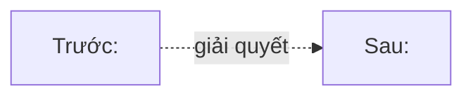

# 📋 Overview — <Tên chủ đề>

> **Tác giả:** Mr.Rom\
> **Phiên bản:** v1.0.0\
> **Tạo lúc:** DD/MM/YYYY\
> **Cập nhật:** DD/MM/YYYY

> 🎯 *<Câu dẫn: "Chủ đề này là gì, vì sao tồn tại, học để làm gì.">*

---

## 1️⃣ <Chủ đề> là gì

<Định nghĩa ngắn gọn, 2-3 câu. Tránh dài dòng, đi thẳng vào bản chất.>

## 2️⃣ Vì sao có <chủ đề>

<Bối cảnh lịch sử / vấn đề mà chủ đề này giải quyết. 1-2 đoạn.>

### Trước khi có <chủ đề>

<Mô tả tình huống cũ — vấn đề gì khó khăn.>

### Sau khi có <chủ đề>

<Vấn đề được giải quyết thế nào.>

> 💡 *Diagram so sánh (nếu phù hợp):*

## 3️⃣ Khi nào dùng <chủ đề>

| Tình huống | Có nên dùng |
|---|---|
| <Use case 1> | ✅ Có |
| <Use case 2> | ✅ Có |
| <Anti-use case 1> | ❌ Không — dùng <alternative> thay |
| <Anti-use case 2> | ❌ Không |

## 4️⃣ Các khái niệm cốt lõi

<Liệt kê 3-5 khái niệm quan trọng nhất. Mỗi cái có 1 câu giải thích.>

- **<Khái niệm 1>**: <1 câu>
- **<Khái niệm 2>**: <1 câu>
- **<Khái niệm 3>**: <1 câu>

> 📖 *Chi tiết từng khái niệm xem trong [`lessons/01_basic/`](./lessons/01_basic/).*

## 5️⃣ Hệ sinh thái & công cụ liên quan

| Công cụ | Vai trò | Liên kết |
|---|---|---|
| <Tool 1> | <Vai trò> | [<L2 trong kho>](../<L1>/<L2>/) |
| <Tool 2> | <Vai trò> | [<L2 trong kho>](../<L1>/<L2>/) |

## 6️⃣ Lộ trình học đề xuất

| Bước | Đọc gì | Thời gian |
|---|---|---|
| 1 | [Lessons basic](./lessons/01_basic/) | <X tuần> |
| 2 | [Lessons intermediate](./lessons/02_intermediate/) | <Y tuần> |
| 3 | [Project 01](./projects/01_<name>/) | <Z giờ> |
| 4 | [Lessons advanced](./lessons/03_advanced/) | <W tuần> |
| 5 | [Project 02](./projects/02_<name>/) | <V giờ> |

## 7️⃣ Câu hỏi thường gặp

**Q: <Câu hỏi 1>**

A: <Trả lời ngắn>

**Q: <Câu hỏi 2>**

A: <Trả lời>

**Q: <Câu hỏi 3>**

A: <Trả lời>

---

## 🔗 Liên kết & Tài nguyên

### Trong kho
- [README chủ đề](./README.md)
- [Glossary](./_glossary.md)
- [Cheatsheet](./99_cheatsheet.md)

### Tài nguyên ngoài
- [<Official docs>](<URL>) — <ngắn gọn>
- [<Sách / khóa học>](<URL>) — <ngắn gọn>

---

## 📌 Changelog

- **v1.0.0 (DD/MM/YYYY)** — Bản đầu tiên.
