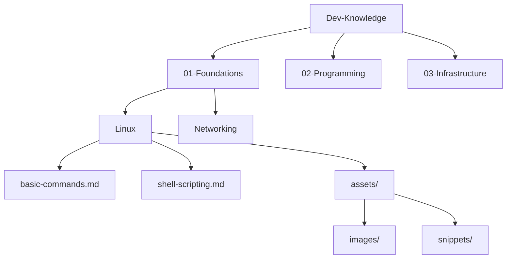

# 🏗️ Kế Hoạch Tái Cấu Trúc Kho Tri Thức @Dev-Knowledge

## 📑 Mục Lục
- [1. Tổng Quan](#1-tổng-quan)
- [2. Yêu Cầu Chức Năng](#2-yêu-cầu-chức-năng)
- [3. Thiết Kế Cấu Trúc & Luồng Người Dùng](#3-thiết-kế-cấu-trúc--luồng-người-dùng)
- [4. Giai Đoạn Thực Hiện (WBS)](#4-giai-đoạn-thực-hiện-wbs)
- [5. Tiêu Chí Kiểm Thử & Chất Lượng](#5-tiêu-chí-kiểm-thử--chất-lượng)
- [6. Quy Định Bảo Trì & Vận Hành](#6-quy-định-bảo-trì--vận-hành)

---

## 1. Tổng Quan

### 1.1 Mục tiêu
Xây dựng một kho tri thức tập trung, logic và dễ bảo trì dành cho Developer, kế thừa các giá trị từ hệ thống cũ (@04-Knowledge, @.Old) nhưng được chuẩn hóa theo tiêu chuẩn công nghiệp.

### 1.2 Phạm vi
- **Nguồn:** Toàn bộ nội dung trong `@04-Knowledge` và `@.Old`.
- **Đầu ra:** Hệ thống `@Dev-Knowledge` mới trên nền tảng Markdown.
- **Đối tượng:** Developer (Junior/Senior).

### 1.3 Chỉ số KPI
| Chỉ số | Mục tiêu |
|--------|----------|
| **Số bài viết** | > 100 bài chuẩn hóa |
| **Tỷ lệ trùng lặp** | < 5% |
| **Thời gian đọc trung bình** | 5 - 15 phút/bài |
| **Tỷ lệ hoàn thành Lab** | > 80% (dựa trên feedback) |
| **Bounce Rate (nếu web)** | < 40% |

---

## 2. Yêu Cầu Chức Năng

### 2.1 Tính năng cốt lõi
- **Tìm kiếm:** Tìm kiếm toàn văn (Full-text search) qua các file Markdown.
- **Filter/Tagging:** Phân loại theo Level (Junior/Senior), Tech Stack (Docker, Python, React), và Loại bài (Tutorial, Lab, Cheatsheet).
- **Phiên bản song ngữ:** Ưu tiên Tiếng Việt cho diễn giải, Tiếng Anh cho thuật ngữ kỹ thuật.
- **Dark/Light Mode:** Hỗ trợ giao diện đọc linh hoạt.

### 2.2 Tính năng nâng cao
- **Auto-TOC:** Tự động tạo mục lục cho từng bài và toàn bộ kho.
- **Code Playground:** Tích hợp liên kết đến các môi trường thực hành (Docker, CodeSandbox).
- **Feedback Loop:** Hệ thống comment/đánh giá (sử dụng Giscus hoặc tương đương).
- **Version Control:** Theo dõi lịch sử thay đổi qua Git.

---

## 3. Thiết Kế Cấu Trúc & Luồng Người Dùng

### 3.1 Sơ đồ cây thư mục (3-4 Cấp)



### 3.2 Template chuẩn (Article Template)

```markdown
---
title: "Tên bài viết"
description: "Mô tả ngắn gọn nội dung"
tags: [tag1, tag2]
author: "ThanhRòm"
date: 2026-05-07
version: 1.0.0
level: Junior
---

# 🎯 Mục tiêu
- [ ] Mục tiêu 1
- [ ] Mục tiêu 2

## 📚 Prerequisite
- Kiến thức cần có trước khi đọc.

## 📖 Nội dung chính
...

## 🛠 Hands-on Lab
...

## ❓ Quiz / Kiểm tra
...

## 🔗 Tài liệu tham khảo
...
```

---

## 4. Giai Đoạn Thực Hiện (WBS)

| Giai đoạn | Công việc chính | Deliverable | Người phụ trách |
|-----------|-----------------|-------------|-----------------|
| **Phase 1: Audit** | Quét toàn bộ kho cũ, phân loại bài viết, xóa trùng lặp. | Báo cáo Audit & List bài giữ lại. | Senior Dev |
| **Phase 2: Design** | Thiết lập cấu trúc folder, Template, CI/CD config. | Folder Skeleton & CI Pipeline. | Architect |
| **Phase 3: Migrate** | Chuyển nội dung cũ sang template mới, cập nhật kiến thức. | Kho tri thức @Dev-Knowledge. | Content Squad |
| **Phase 4: Optimize** | Test link, kiểm tra code snippet, SEO/TOC. | Production Ready KB. | QA/QC |

### Rủi ro & Biện pháp
- **Rủi ro:** Nội dung bị lỗi thời khi migrate. -> **Biện pháp:** Review chéo và cập nhật tech version mới nhất.
- **Rủi ro:** Mất liên kết (broken links). -> **Biện pháp:** Sử dụng công cụ check-link tự động trong CI.

---

## 5. Tiêu Chí Kiểm Thử & Chất Lượng

### 5.1 Checklist chất lượng nội dung
- [ ] Ngữ pháp rõ ràng, không sai lỗi chính tả.
- [ ] Code snippet phải copy-paste chạy được.
- [ ] Hình ảnh có caption và bản quyền/nguồn rõ ràng.
- [ ] Link nội bộ và link ngoài hoạt động 100%.
- [ ] Có metadata đầy đủ theo template.

### 5.2 Kiểm thử hệ thống
- **Performance:** Thời gian render/load trang < 2s.
- **Security:** HTTPS, CSP bảo mật, Rate-limit cho API (nếu có).
- **Search:** Trả về kết quả đúng với keyword trong < 500ms.

---

## 6. Quy Định Bảo Trì & Vận Hành

- **Lịch Review:** 3 tháng/lần cho các bài viết cốt lõi.
- **Quy trình đóng góp:** 
  1. Tạo Issue đề xuất chủ đề.
  2. Viết bài theo Template.
  3. Pull Request & Review (ít nhất 1 người approve).
- **Backup:** Tự động backup hàng tuần lên Cloud Storage.
- **Rollback:** Sử dụng Git tag để quay lại phiên bản ổn định trước đó.
