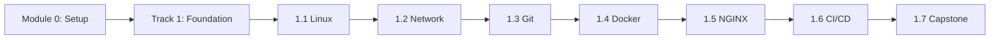

# 🚀 DevOps Training Course

**Khóa học DevOps toàn diện từ Zero đến Hero**

---

## 📋 Giới thiệu

Đây là khóa học DevOps **hoàn toàn miễn phí**, được thiết kế từ **beginner đến advanced**. Khóa học bao gồm:

- ✅ **Lý thuyết chi tiết** với ví dụ thực tế
- ✅ **Labs thực hành** từng bước copy-paste
- ✅ **Bài tập tình huống** để rèn luyện tư duy
- ✅ **Quiz ôn tập** củng cố kiến thức
- ✅ **Dự án thực tế** có thể đưa vào portfolio

---

## 🎯 Đối tượng

| Cấp độ | Mô tả | Tracks phù hợp |
|--------|-------|----------------|

| **Beginner** | Chưa có kiến thức IT | Track 0 → Track 1 |
| **Intermediate** | Đã biết Linux, cơ bản về Docker | Track 2 → Track 3 |
| **Advanced** | Đã làm DevOps/SysAdmin | Track 4 → Track 5 |

---

## 📚 Mục lục khóa học

### 🔧 Module 0 – Setup Environment

> **Thời lượng:** 2-3 giờ | **Mục tiêu:** Chuẩn bị môi trường học tập

| File | Mô tả |
|------|-------|
| [📖 README](./0.Setup_Environment/README.md) | Hướng dẫn cài đặt môi trường |
| [📝 CHEATSHEET](./0.Setup_Environment/CHEATSHEET.md) | Lệnh cài đặt nhanh |
| [🔬 LABS](./0.Setup_Environment/LABS.md) | Thực hành cài đặt |
| [❓ QUIZ](./0.Setup_Environment/QUIZ.md) | Câu hỏi ôn tập |
| [✏️ EXERCISES](./0.Setup_Environment/EXERCISES.md) | Bài tập kiểm tra |
| [✅ SOLUTIONS](./0.Setup_Environment/SOLUTIONS.md) | Đáp án |
| [🚀 PROJECT](./0.Setup_Environment/PROJECT.md) | Dự án mini |

---

### 🌱 Track 1 – Foundation & Static Web

> **Thời lượng:** 40-50 giờ | **Mục tiêu:** Deploy website tĩnh bằng CI/CD

| Module | Tên | Links |
|--------|-----|-------|
| 1.1 | **Linux & Bash** | [📖](./Track1_Foundation_StaticWeb/1.1_Linux_Bash/README.md) [📝](./Track1_Foundation_StaticWeb/1.1_Linux_Bash/CHEATSHEET.md) [🔬](./Track1_Foundation_StaticWeb/1.1_Linux_Bash/LABS.md) [✏️](./Track1_Foundation_StaticWeb/1.1_Linux_Bash/EXERCISES.md) [✅](./Track1_Foundation_StaticWeb/1.1_Linux_Bash/SOLUTIONS.md) [❓](./Track1_Foundation_StaticWeb/1.1_Linux_Bash/QUIZ.md) [🚀](./Track1_Foundation_StaticWeb/1.1_Linux_Bash/PROJECT.md) |
| 1.2 | **Network Basics** | [📖](./Track1_Foundation_StaticWeb/1.2_Network_Basics/README.md) [📝](./Track1_Foundation_StaticWeb/1.2_Network_Basics/CHEATSHEET.md) [🔬](./Track1_Foundation_StaticWeb/1.2_Network_Basics/LABS.md) [✏️](./Track1_Foundation_StaticWeb/1.2_Network_Basics/EXERCISES.md) [✅](./Track1_Foundation_StaticWeb/1.2_Network_Basics/SOLUTIONS.md) [❓](./Track1_Foundation_StaticWeb/1.2_Network_Basics/QUIZ.md) [🚀](./Track1_Foundation_StaticWeb/1.2_Network_Basics/PROJECT.md) |
| 1.3 | **Git & GitLab** | [📖](./Track1_Foundation_StaticWeb/1.3_Git_GitLab/README.md) [📝](./Track1_Foundation_StaticWeb/1.3_Git_GitLab/CHEATSHEET.md) [🔬](./Track1_Foundation_StaticWeb/1.3_Git_GitLab/LABS.md) [✏️](./Track1_Foundation_StaticWeb/1.3_Git_GitLab/EXERCISES.md) [✅](./Track1_Foundation_StaticWeb/1.3_Git_GitLab/SOLUTIONS.md) [❓](./Track1_Foundation_StaticWeb/1.3_Git_GitLab/QUIZ.md) [🚀](./Track1_Foundation_StaticWeb/1.3_Git_GitLab/PROJECT.md) |
| 1.4 | **Docker Fundamentals** | [📖](./Track1_Foundation_StaticWeb/1.4_Docker_Fundamentals/README.md) [📝](./Track1_Foundation_StaticWeb/1.4_Docker_Fundamentals/CHEATSHEET.md) [🔬](./Track1_Foundation_StaticWeb/1.4_Docker_Fundamentals/LABS.md) [✏️](./Track1_Foundation_StaticWeb/1.4_Docker_Fundamentals/EXERCISES.md) [✅](./Track1_Foundation_StaticWeb/1.4_Docker_Fundamentals/SOLUTIONS.md) [❓](./Track1_Foundation_StaticWeb/1.4_Docker_Fundamentals/QUIZ.md) [🚀](./Track1_Foundation_StaticWeb/1.4_Docker_Fundamentals/PROJECT.md) |
| 1.5 | **NGINX Basic** | [📖](./Track1_Foundation_StaticWeb/1.5_NGINX_Basic/README.md) [📝](./Track1_Foundation_StaticWeb/1.5_NGINX_Basic/CHEATSHEET.md) [🔬](./Track1_Foundation_StaticWeb/1.5_NGINX_Basic/LABS.md) [✏️](./Track1_Foundation_StaticWeb/1.5_NGINX_Basic/EXERCISES.md) [✅](./Track1_Foundation_StaticWeb/1.5_NGINX_Basic/SOLUTIONS.md) [❓](./Track1_Foundation_StaticWeb/1.5_NGINX_Basic/QUIZ.md) [🚀](./Track1_Foundation_StaticWeb/1.5_NGINX_Basic/PROJECT.md) |
| 1.6 | **CI/CD Basic** | [📖](./Track1_Foundation_StaticWeb/1.6_CICD_Basic/README.md) [📝](./Track1_Foundation_StaticWeb/1.6_CICD_Basic/CHEATSHEET.md) [🔬](./Track1_Foundation_StaticWeb/1.6_CICD_Basic/LABS.md) [✏️](./Track1_Foundation_StaticWeb/1.6_CICD_Basic/EXERCISES.md) [✅](./Track1_Foundation_StaticWeb/1.6_CICD_Basic/SOLUTIONS.md) [❓](./Track1_Foundation_StaticWeb/1.6_CICD_Basic/QUIZ.md) [🚀](./Track1_Foundation_StaticWeb/1.6_CICD_Basic/PROJECT.md) |
| 1.7 | **🏆 Capstone Project** | [📖](./Track1_Foundation_StaticWeb/1.7_Capstone_Project/README.md) [🚀](./Track1_Foundation_StaticWeb/1.7_Capstone_Project/PROJECT.md) |

---

### ⚙️ Track 2 – Orchestration & Automation

> **Thời lượng:** 50-60 giờ | **Mục tiêu:** Deploy microservices trên Kubernetes

| Module | Tên | Links |
|--------|-----|-------|
| 2.1 | **Docker Advanced** | [📖](./Track2_Orchestration_Automation/2.1_Docker_Advanced/README.md) [📝](./Track2_Orchestration_Automation/2.1_Docker_Advanced/CHEATSHEET.md) [🔬](./Track2_Orchestration_Automation/2.1_Docker_Advanced/LABS.md) [✏️](./Track2_Orchestration_Automation/2.1_Docker_Advanced/EXERCISES.md) [✅](./Track2_Orchestration_Automation/2.1_Docker_Advanced/SOLUTIONS.md) [❓](./Track2_Orchestration_Automation/2.1_Docker_Advanced/QUIZ.md) [🚀](./Track2_Orchestration_Automation/2.1_Docker_Advanced/PROJECT.md) |
| 2.2 | **Docker Compose** | [📖](./Track2_Orchestration_Automation/2.2_Docker_Compose/README.md) [📝](./Track2_Orchestration_Automation/2.2_Docker_Compose/CHEATSHEET.md) [🔬](./Track2_Orchestration_Automation/2.2_Docker_Compose/LABS.md) [✏️](./Track2_Orchestration_Automation/2.2_Docker_Compose/EXERCISES.md) [✅](./Track2_Orchestration_Automation/2.2_Docker_Compose/SOLUTIONS.md) [❓](./Track2_Orchestration_Automation/2.2_Docker_Compose/QUIZ.md) [🚀](./Track2_Orchestration_Automation/2.2_Docker_Compose/PROJECT.md) |
| 2.3 | **Jenkins** | [📖](./Track2_Orchestration_Automation/2.3_Jenkins/README.md) [📝](./Track2_Orchestration_Automation/2.3_Jenkins/CHEATSHEET.md) [🔬](./Track2_Orchestration_Automation/2.3_Jenkins/LABS.md) [✏️](./Track2_Orchestration_Automation/2.3_Jenkins/EXERCISES.md) [✅](./Track2_Orchestration_Automation/2.3_Jenkins/SOLUTIONS.md) [❓](./Track2_Orchestration_Automation/2.3_Jenkins/QUIZ.md) [🚀](./Track2_Orchestration_Automation/2.3_Jenkins/PROJECT.md) |
| 2.4 | **Kubernetes Core** | [📖](./Track2_Orchestration_Automation/2.4_Kubernetes_Core/README.md) [📝](./Track2_Orchestration_Automation/2.4_Kubernetes_Core/CHEATSHEET.md) [🔬](./Track2_Orchestration_Automation/2.4_Kubernetes_Core/LABS.md) [✏️](./Track2_Orchestration_Automation/2.4_Kubernetes_Core/EXERCISES.md) [✅](./Track2_Orchestration_Automation/2.4_Kubernetes_Core/SOLUTIONS.md) [❓](./Track2_Orchestration_Automation/2.4_Kubernetes_Core/QUIZ.md) [🚀](./Track2_Orchestration_Automation/2.4_Kubernetes_Core/PROJECT.md) |
| 2.5 | **Monitoring & Logging** | [📖](./Track2_Orchestration_Automation/2.5_Monitoring_Logging/README.md) [📝](./Track2_Orchestration_Automation/2.5_Monitoring_Logging/CHEATSHEET.md) [🔬](./Track2_Orchestration_Automation/2.5_Monitoring_Logging/LABS.md) [✏️](./Track2_Orchestration_Automation/2.5_Monitoring_Logging/EXERCISES.md) [✅](./Track2_Orchestration_Automation/2.5_Monitoring_Logging/SOLUTIONS.md) [❓](./Track2_Orchestration_Automation/2.5_Monitoring_Logging/QUIZ.md) [🚀](./Track2_Orchestration_Automation/2.5_Monitoring_Logging/PROJECT.md) |
| 2.6 | **🏆 Capstone Project** | [📖](./Track2_Orchestration_Automation/2.6_Capstone_Project/README.md) [🚀](./Track2_Orchestration_Automation/2.6_Capstone_Project/PROJECT.md) |

---

### ☁️ Track 3 – Cloud, Network & System Design

> **Thời lượng:** 60-70 giờ | **Mục tiêu:** Xây dựng hạ tầng cloud với Terraform

| Module | Tên | Links |
|--------|-----|-------|
| 3.1 | **Network Advanced** | [📖](./Track3_Cloud_Network_Design/3.1_Network_Advanced/README.md) [📝](./Track3_Cloud_Network_Design/3.1_Network_Advanced/CHEATSHEET.md) [🔬](./Track3_Cloud_Network_Design/3.1_Network_Advanced/LABS.md) [✏️](./Track3_Cloud_Network_Design/3.1_Network_Advanced/EXERCISES.md) [✅](./Track3_Cloud_Network_Design/3.1_Network_Advanced/SOLUTIONS.md) [❓](./Track3_Cloud_Network_Design/3.1_Network_Advanced/QUIZ.md) [🚀](./Track3_Cloud_Network_Design/3.1_Network_Advanced/PROJECT.md) |
| 3.2 | **AWS Core Services** | [📖](./Track3_Cloud_Network_Design/3.2_AWS_Core_Services/README.md) [📝](./Track3_Cloud_Network_Design/3.2_AWS_Core_Services/CHEATSHEET.md) [🔬](./Track3_Cloud_Network_Design/3.2_AWS_Core_Services/LABS.md) [✏️](./Track3_Cloud_Network_Design/3.2_AWS_Core_Services/EXERCISES.md) [✅](./Track3_Cloud_Network_Design/3.2_AWS_Core_Services/SOLUTIONS.md) [❓](./Track3_Cloud_Network_Design/3.2_AWS_Core_Services/QUIZ.md) [🚀](./Track3_Cloud_Network_Design/3.2_AWS_Core_Services/PROJECT.md) |
| 3.3 | **Terraform IaC** | [📖](./Track3_Cloud_Network_Design/3.3_Terraform_IaC/README.md) [📝](./Track3_Cloud_Network_Design/3.3_Terraform_IaC/CHEATSHEET.md) [🔬](./Track3_Cloud_Network_Design/3.3_Terraform_IaC/LABS.md) [✏️](./Track3_Cloud_Network_Design/3.3_Terraform_IaC/EXERCISES.md) [✅](./Track3_Cloud_Network_Design/3.3_Terraform_IaC/SOLUTIONS.md) [❓](./Track3_Cloud_Network_Design/3.3_Terraform_IaC/QUIZ.md) [🚀](./Track3_Cloud_Network_Design/3.3_Terraform_IaC/PROJECT.md) |
| 3.4 | **System Design & Reliability** | [📖](./Track3_Cloud_Network_Design/3.4_System_Design_Reliability/README.md) [📝](./Track3_Cloud_Network_Design/3.4_System_Design_Reliability/CHEATSHEET.md) [🔬](./Track3_Cloud_Network_Design/3.4_System_Design_Reliability/LABS.md) [✏️](./Track3_Cloud_Network_Design/3.4_System_Design_Reliability/EXERCISES.md) [✅](./Track3_Cloud_Network_Design/3.4_System_Design_Reliability/SOLUTIONS.md) [❓](./Track3_Cloud_Network_Design/3.4_System_Design_Reliability/QUIZ.md) [🚀](./Track3_Cloud_Network_Design/3.4_System_Design_Reliability/PROJECT.md) |
| 3.5 | **🏆 Capstone Project** | [📖](./Track3_Cloud_Network_Design/3.5_Capstone_Project/README.md) [🚀](./Track3_Cloud_Network_Design/3.5_Capstone_Project/PROJECT.md) |

---

### 🔐 Track 4 – DevSecOps

> **Thời lượng:** 30-40 giờ | **Mục tiêu:** CI/CD với security scanning và hardening

| Module | Tên | Links |
|--------|-----|-------|
| 4.1 | **Security in Pipeline** | [📖](./Track4_DevSecOps/4.1_Security_in_Pipeline/README.md) [📝](./Track4_DevSecOps/4.1_Security_in_Pipeline/CHEATSHEET.md) [🔬](./Track4_DevSecOps/4.1_Security_in_Pipeline/LABS.md) [✏️](./Track4_DevSecOps/4.1_Security_in_Pipeline/EXERCISES.md) [✅](./Track4_DevSecOps/4.1_Security_in_Pipeline/SOLUTIONS.md) [❓](./Track4_DevSecOps/4.1_Security_in_Pipeline/QUIZ.md) [🚀](./Track4_DevSecOps/4.1_Security_in_Pipeline/PROJECT.md) |
| 4.2 | **Infra Security** | [📖](./Track4_DevSecOps/4.2_Infra_Security/README.md) [📝](./Track4_DevSecOps/4.2_Infra_Security/CHEATSHEET.md) [🔬](./Track4_DevSecOps/4.2_Infra_Security/LABS.md) [✏️](./Track4_DevSecOps/4.2_Infra_Security/EXERCISES.md) [✅](./Track4_DevSecOps/4.2_Infra_Security/SOLUTIONS.md) [❓](./Track4_DevSecOps/4.2_Infra_Security/QUIZ.md) [🚀](./Track4_DevSecOps/4.2_Infra_Security/PROJECT.md) |
| 4.3 | **🏆 Capstone Project** | [📖](./Track4_DevSecOps/4.3_Capstone_Project/README.md) [🚀](./Track4_DevSecOps/4.3_Capstone_Project/PROJECT.md) |

---

### 🎯 Track 5 – Career Path

> **Thời lượng:** 20-30 giờ | **Mục tiêu:** Portfolio và CV hoàn chỉnh

| Module | Tên | Links |
|--------|-----|-------|
| 5.1 | **Certifications** | [📖](./Track5_Career_Path/5.1_Certifications/README.md) [📝](./Track5_Career_Path/5.1_Certifications/CHEATSHEET.md) [🔬](./Track5_Career_Path/5.1_Certifications/LABS.md) [✏️](./Track5_Career_Path/5.1_Certifications/EXERCISES.md) [✅](./Track5_Career_Path/5.1_Certifications/SOLUTIONS.md) [❓](./Track5_Career_Path/5.1_Certifications/QUIZ.md) [🚀](./Track5_Career_Path/5.1_Certifications/PROJECT.md) |
| 5.2 | **Interview Prep** | [📖](./Track5_Career_Path/5.2_Interview_Prep/README.md) [📝](./Track5_Career_Path/5.2_Interview_Prep/CHEATSHEET.md) [🔬](./Track5_Career_Path/5.2_Interview_Prep/LABS.md) [✏️](./Track5_Career_Path/5.2_Interview_Prep/EXERCISES.md) [✅](./Track5_Career_Path/5.2_Interview_Prep/SOLUTIONS.md) [❓](./Track5_Career_Path/5.2_Interview_Prep/QUIZ.md) [🚀](./Track5_Career_Path/5.2_Interview_Prep/PROJECT.md) |
| 5.3 | **🏆 Capstone Project** | [📖](./Track5_Career_Path/5.3_Capstone_Project/README.md) [🚀](./Track5_Career_Path/5.3_Capstone_Project/PROJECT.md) |

---

## 📖 Tài liệu bổ trợ

| Tài liệu | Mô tả |
|----------|-------|
| [📚 GLOSSARY](./resources/GLOSSARY.md) | Từ điển thuật ngữ DevOps A-Z |
| [🔧 SOFTWARE LINKS](./resources/SOFTWARE_LINKS.md) | Link tải tool từ nguồn chính thức |

---

## 🚀 Bắt đầu từ đâu?

### Người mới hoàn toàn

### Đã có kiến thức cơ bản

1. Làm **Module 0** để thiết lập môi trường
2. Làm **Quiz** của Track 1 để kiểm tra kiến thức
3. Nếu đạt ≥70% → Chuyển sang Track 2
4. Nếu <70% → Học lại các module chưa vững

---

## 📱 Cấu trúc mỗi Module

Mỗi module bao gồm **7 file** tiêu chuẩn:

| File | Icon | Mục đích |
|------|------|----------|
| `README.md` | 📖 | Lý thuyết, định nghĩa, diagram |
| `CHEATSHEET.md` | 📝 | Tra cứu nhanh lệnh, config |
| `LABS.md` | 🔬 | Thực hành có hướng dẫn từng bước |
| `EXERCISES.md` | ✏️ | Bài tập tình huống tự suy luận |
| `SOLUTIONS.md` | ✅ | Đáp án chi tiết với giải thích |
| `QUIZ.md` | ❓ | Câu hỏi trắc nghiệm ôn tập |
| `PROJECT.md` | 🚀 | Dự án mini tổng hợp kiến thức |

---

## 🛠️ Công cụ cần chuẩn bị

- **Windows:** WSL2 + Docker Desktop + VS Code
- **macOS:** Docker Desktop + VS Code
- **Linux:** Docker + VS Code

> 📖 Xem chi tiết tại [SOFTWARE LINKS](./resources/SOFTWARE_LINKS.md)

---

## 📊 Tiến độ học tập

Theo dõi tiến độ của bạn:

- [ ] Module 0 – Setup Environment
- [ ] Track 1 – Foundation & Static Web
  - [ ] 1.1 Linux & Bash
  - [ ] 1.2 Network Basics
  - [ ] 1.3 Git & GitLab
  - [ ] 1.4 Docker Fundamentals
  - [ ] 1.5 NGINX Basic
  - [ ] 1.6 CI/CD Basic
  - [ ] 1.7 Capstone Project
- [ ] Track 2 – Orchestration & Automation
- [ ] Track 3 – Cloud, Network & System Design
- [ ] Track 4 – DevSecOps
- [ ] Track 5 – Career Path

---

## 🤝 Đóng góp

Mọi đóng góp đều được hoan nghênh! Xem [.design/MAIN_design.md](./.design/MAIN_design.md) để hiểu cấu trúc dự án.

---

## 📜 License

MIT License - Tự do sử dụng, sửa đổi, và chia sẻ.

---

**Chúc bạn học tốt! 🎉**

*Made with ❤️ for DevOps Community*

