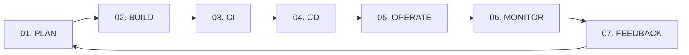
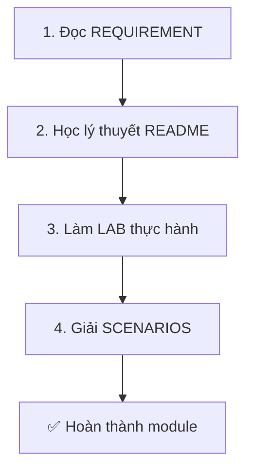

# 🚀 DevOps Zero to Hero

> **Khóa học DevOps toàn diện từ cơ bản đến nâng cao**

[](https://opensource.org/licenses/MIT)

---

## 📖 Giới thiệu

Chào mừng bạn đến với **DevOps Zero to Hero** - khóa học thực hành DevOps hoàn chỉnh với 7 modules theo đúng vòng đời DevOps, được thiết kế để đưa bạn từ người mới bắt đầu đến DevOps Engineer tự tin.

### ❓ DevOps là gì?

**DevOps** = **Dev**elopment (Phát triển) + **Op**eration**s** (Vận hành)

**Ẩn dụ đơn giản**:
> Tưởng tượng bạn là đầu bếp (Dev) nấu món ăn ngon. Nhưng nếu không có người phục vụ (Ops) mang món ra bàn khách hàng đúng lúc, món ăn ngon mấy cũng vô nghĩa. DevOps là khi đầu bếp VÀ người phục vụ làm việc như một đội - hiểu nhau, hỗ trợ nhau, để khách hàng hài lòng nhất.

### ✨ Đặc điểm khóa học

- ✅ **Dễ hiểu** - Giải thích rõ ràng, trực tiếp
- ✅ **Ẩn dụ đời thường** - Khái niệm phức tạp qua ví dụ thực tế
- ✅ **35 Scenarios thực chiến** - Học từ tình huống production
- ✅ **Hands-on Labs** - Thực hành với dự án thực tế
- ✅ **Mermaid Diagrams** - Sơ đồ trực quan dễ hiểu
- ✅ **Production-ready** - Code mẫu sẵn sàng sử dụng

---

## 🗺️ Lộ trình 7 giai đoạn



| Module | Tên | Nội dung chính | Thời lượng |
|--------|-----|----------------|------------|
| **01** | [PLAN](01_PLAN/) | Strategy, Agile, Git, Documentation | 4-6h |
| **02** | [BUILD](02_BUILD/) | Docker, Containerization, Git Workflow | 8-10h |
| **03** | [CI](03_CI/) | GitHub Actions, Automated Testing | 6-8h |
| **04** | [CD](04_CD/) | Kubernetes, GitOps, ArgoCD | 10-12h |
| **05** | [OPERATE](05_OPERATE/) | Terraform, Ansible, IaC | 8-10h |
| **06** | [MONITOR](06_MONITOR/) | Prometheus, Grafana, Observability | 6-8h |
| **07** | [FEEDBACK](07_FEEDBACK/) | Post-Mortem, ChatOps, DORA Metrics | 4-6h |

**Tổng thời lượng:** ~50-60 giờ học (6-8 tuần nếu học 8-10 giờ/tuần)

---

## 🎯 Dự án xuyên suốt: The Counter App

Thay vì học lý thuyết khô khan, bạn sẽ xây dựng và triển khai một ứng dụng thực tế từ đầu đến cuối.

### Mô tả app

- **Tên**: The Counter App (App đếm số)
- **Frontend**: HTML + CSS (đơn giản, đẹp mắt)
- **Backend**: Python Flask
- **Database**: Redis
- **Tính năng**:
  - ➕ Tăng số đếm
  - 🔄 Reset về 0
  - 💾 Lưu trữ persistent (không mất data khi restart)

### Tại sao chọn app này?

1. **Đủ đơn giản** để tập trung vào DevOps, không lạc vào code logic phức tạp
2. **Đủ phức tạp** để áp dụng đầy đủ pipeline: Build → Test → Deploy → Monitor
3. **Thực tế** - Tương tự cách deploy app production thật sự

👉 Xem source code: [source-code/](source-code/)

---

## 💻 Chuẩn bị môi trường

### Yêu cầu tối thiểu

- **OS**: Windows 10/11, macOS, hoặc Linux
- **RAM**: 8GB+ (16GB khuyến nghị)
- **Disk**: 20GB trống
- **Internet**: Ổn định để download tools

### Tools cần cài đặt

#### 1. **Git** (Version Control)

```bash
# Windows
winget install Git.Git

# macOS
brew install git

# Linux (Ubuntu/Debian)
sudo apt-get install git
```

Verify:

```bash
git --version
# Output: git version 2.x.x
```

#### 2. **Docker Desktop** (Container Platform)

- Download: <https://www.docker.com/products/docker-desktop>
- Cài đặt và start Docker Desktop
- Verify:

```bash
docker --version
docker-compose --version
```

#### 3. **Visual Studio Code** (Code Editor)

- Download: <https://code.visualstudio.com>
- Extensions khuyến nghị:
  - Python
  - Docker
  - YAML
  - Kubernetes
  - GitLens

#### 4. **Python 3.11+** (Programming Language)

```bash
# Windows
winget install Python.Python.3.11

# macOS
brew install python@3.11

# Linux
sudo apt-get install python3.11
```

Verify:

```bash
python --version  # or python3 --version
# Output: Python 3.11.x
```

#### 5. **Tài khoản cần tạo** (Free tier)

- ✅ [GitHub](https://github.com) - Code repository
- ✅ [Docker Hub](https://hub.docker.com) - Container registry
- ✅ (Tùy chọn) [AWS Free Tier](https://aws.amazon.com/free) - Cloud platform (dùng ở Module 04-05)

---

## 🚀 Bắt đầu nhanh

### Clone repo

```bash
git clone https://github.com/thanhlehoang0107/devops-course.git
cd devops-course
```

### Chạy The Counter App

```bash
cd source-code
docker-compose up -d
```

Truy cập: <http://localhost:5000>

### Kiểm tra sẵn sàng

Trước khi bắt đầu Module 01, hãy đảm bảo:

- [ ] Đã cài đặt Git, Docker, Python, VS Code
- [ ] Đã tạo tài khoản GitHub và Docker Hub
- [ ] Docker Desktop đang chạy
- [ ] Đã clone repo source code về máy
- [ ] Chạy được `The Counter App` ở local

### Test nhanh

```bash
# Chạy app bằng Docker
docker-compose up --build

# Mở browser: http://localhost:5000
# Nếu thấy app chạy → Bạn đã sẵn sàng! 🎉
```

---

## 📚 Cấu trúc học liệu

Mỗi module có 4 files:

### 1. **REQUIREMENT.md** - Đề bài

- ✅ Mục tiêu module
- ✅ Danh sách thuật ngữ
- ✅ Checklist bài tập
- ✅ Checklist tình huống

### 2. **README.md** - Lý thuyết

- 💡 Giải thích khái niệm bằng ẩn dụ
- 📊 Sơ đồ minh họa (Mermaid)
- ❓ Trả lời "Tại sao?" trước "Làm như thế nào?"

### 3. **LABS.md** - Thực hành

- 👨‍💻 Hướng dẫn step-by-step
- 💻 Code mẫu có comment chi tiết
- ✅ Expected Output

### 4. **SCENARIOS.md** - Tình huống thực chiến

- 🚨 5 tình huống xử lý sự cố
- 🕵️ Cách điều tra
- 💡 Giải pháp
- 🧠 Bài học rút ra

---

## 🎓 Phương pháp học hiệu quả

### Quy trình 4 bước



### Tips

1. **Đừng skip LAB** - Học DevOps mà không làm thì = 0
2. **Làm SCENARIOS nghiêm túc** - Đây là phần giúp bạn tư duy như DevOps thực thụ
3. **Tham gia community** - Hỏi đáp, chia sẻ trên GitHub Discussions
4. **Practice daily** - 1-2 giờ mỗi ngày hiệu quả hơn 10 giờ cuối tuần
5. **Build portfolio** - Đẩy tất cả code lên GitHub public repo để showcase

---

## 📖 Cấu trúc thư mục

```
devops-course/
├── README.md                  # File này - hướng dẫn tổng quan
├── LICENSE                    # MIT License
├── .gitignore                 
├── source-code/               # The Counter App
│   ├── app.py
│   ├── Dockerfile
│   ├── docker-compose.yml
│   └── README.md
├── 01_PLAN/                   # Module 1
│   ├── REQUIREMENT.md
│   ├── README.md
│   ├── LABS.md
│   └── SCENARIOS.md
├── 02_BUILD/                  # Module 2
├── 03_CI/                     # Module 3
├── 04_CD/                     # Module 4
├── 05_OPERATE/                # Module 5
├── 06_MONITOR/                # Module 6
└── 07_FEEDBACK/               # Module 7
```

---

## 🎓 Ai nên học khóa này?

- ✅ Developers muốn chuyển sang DevOps
- ✅ System Admins muốn học automation
- ✅ Students học về cloud và modern IT
- ✅ Tech leads muốn hiểu DevOps workflow
- ✅ Bất kỳ ai quan tâm đến DevOps

---

## 🌟 Highlights

### 35 Scenarios Thực chiến

Mỗi module có 5 tình huống thực tế với:

- 🚨 Bối cảnh
- 🕵️ Điều tra
- 💡 Giải pháp
- 🧠 Bài học

**Ví dụ Scenarios:**

- Bus Factor (Module 01)
- Docker Image quá lớn (Module 02)
- Flaky Tests (Module 03)
- CrashLoopBackOff (Module 04)
- Terraform State corrupt (Module 05)
- Alert Fatigue (Module 06)
- Blame Culture (Module 07)

### Ẩn dụ Dễ hiểu

Mỗi concept được giải thích bằng ví dụ đời thường:

- Docker = Hộp cơm trưa
- Kubernetes = Bến cảng container
- CI/CD = Dây chuyền sản xuất tự động
- Git = Google Docs với version history

---

## ⏭️ Bắt đầu học

Khi đã sẵn sàng, hãy bắt đầu với:

👉 **[Module 01: PLAN - Chiến lược & Thiết kế](./01_PLAN/README.md)**

---

## 📚 Tài nguyên bổ sung

### 🛠️ Cài đặt & Setup

| Tài liệu | Mô tả |
|----------|-------|
| **[SETUP_GUIDE.md](SETUP_GUIDE.md)** | Hướng dẫn chi tiết cài đặt cho macOS/Linux/Windows |
| **[scripts/](scripts/)** | Scripts tự động cài đặt môi trường |

### 🎓 Học tập & Phát triển

| Tài liệu | Mô tả |
|----------|-------|
| **[CAPSTONE_PROJECT/](CAPSTONE_PROJECT/)** | Dự án tổng hợp cuối khóa |
| **[CAREER_PATH.md](CAREER_PATH.md)** | Lộ trình sự nghiệp DevOps Engineer |

---

## 🤝 Đóng góp

Mọi đóng góp đều được hoan nghênh!

1. Fork repo này
2. Tạo branch mới (`git checkout -b feature/amazing-feature`)
3. Commit changes (`git commit -m 'Add amazing feature'`)
4. Push to branch (`git push origin feature/amazing-feature`)
5. Mở Pull Request

---

## 📝 License

[MIT License](LICENSE)

---

## 👨‍💻 Tác giả

**ThanhRòm**

- GitHub: [@thanhlehoang0107](https://github.com/thanhlehoang0107)

---

## 🙏 Acknowledgments

Khóa học này được tạo ra với mục đích chia sẻ kiến thức DevOps thực chiến. Cảm ơn tất cả những ai đã đóng góp và sử dụng tài liệu này!

---

## 📬 Liên hệ & Hỗ trợ

- 🐛 Báo lỗi: [Issues](https://github.com/thanhlehoang0107/devops-course/issues)
- 💬 Thảo luận: [Discussions](https://github.com/thanhlehoang0107/devops-course/discussions)
- ⭐ Nếu thấy hữu ích, hãy cho repo một star!

---

**Chúc bạn học tốt và trở thành DevOps Engineer xuất sắc! 🚀**

*"DevOps is not a destination, it's a journey."*
