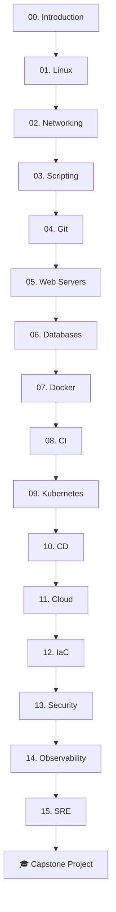
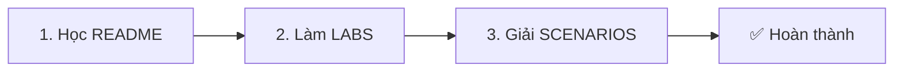

# 🚀 DevOps Mastery

<div align="center">


**Khóa học DevOps toàn diện từ Zero đến Production - 16 Modules đầy đủ**

[](https://opensource.org/licenses/MIT)
[](https://github.com/thanhlehoang0107/DevOps-Mastery/stargazers)
[](https://github.com/thanhlehoang0107/DevOps-Mastery/network/members)
[](https://github.com/thanhlehoang0107/DevOps-Mastery/issues)
[](https://github.com/thanhlehoang0107/DevOps-Mastery/pulls)

### 🛠️ Technologies Covered


---

**[📖 Bắt đầu học](#-bắt-đầu-học)** · **[📋 Modules](#-danh-sách-modules)** · **[🛠️ Setup](#-yêu-cầu--chuẩn-bị)** · **[🤝 Đóng góp](#-đóng-góp)**

</div>

---

## 📖 Giới thiệu

Chào mừng bạn đến với **DevOps Mastery** - khóa học DevOps hoàn chỉnh nhất, được thiết kế để đưa bạn từ người mới bắt đầu đến DevOps Engineer tự tin.

### ❓ DevOps là gì?

**DevOps** = **Dev**elopment (Phát triển) + **Op**eration**s** (Vận hành)

**Ẩn dụ đơn giản**:
> Tưởng tượng bạn là **đầu bếp** (Dev) nấu món ăn ngon. Nhưng nếu không có **bồi bàn** (Ops) mang món ra bàn khách hàng đúng lúc, món ăn ngon mấy cũng vô nghĩa. DevOps là khi đầu bếp VÀ bồi bàn làm việc như một đội - hiểu nhau, hỗ trợ nhau, để khách hàng hài lòng nhất.

---

## ✨ Đặc điểm khóa học

| Feature | Mô tả |
|---------|-------|
| ✅ **16 Modules đầy đủ** | Từ Linux cơ bản đến SRE nâng cao |
| ✅ **Dễ hiểu** | Gãy gọn, thực tế, không văn hoa |
| ✅ **Ẩn dụ đời thường** | Mỗi khái niệm có ví dụ so sánh |
| ✅ **75+ Scenarios thực chiến** | Học từ tình huống production |
| ✅ **Hands-on Labs** | Thực hành với dự án xuyên suốt |
| ✅ **Mermaid Diagrams** | Sơ đồ trực quan, dễ hiểu |
| ✅ **Production-ready** | Code mẫu sẵn sàng sử dụng |

---

## 🗺️ Lộ trình 16 Modules



### 📋 Danh sách Modules

| # | Module | Nội dung chính | Thời lượng |
|---|--------|----------------|------------|
| 00 | [INTRODUCTION](00_INTRODUCTION/) | DevOps, Agile, Setup môi trường | 2-3h |
| 01 | [LINUX](01_LINUX/) | CLI, Permissions, Services | 6-8h |
| 02 | [NETWORKING](02_NETWORKING/) | TCP/IP, DNS, HTTP, Firewall | 4-6h |
| 03 | [SCRIPTING](03_SCRIPTING/) | Bash, Python, Automation | 6-8h |
| 04 | [GIT](04_GIT/) | Version Control, Workflow, GitHub | 4-6h |
| 05 | [WEB_SERVERS](05_WEB_SERVERS/) | NGINX, Load Balancing, SSL | 4-6h |
| 06 | [DATABASES](06_DATABASES/) | SQL, NoSQL, Redis | 4-6h |
| 07 | [DOCKER](07_DOCKER/) | Containers, Compose, Registry | 8-10h |
| 08 | [CI](08_CI/) | GitHub Actions, Testing | 6-8h |
| 09 | [KUBERNETES](09_KUBERNETES/) | Pods, Services, Helm | 10-12h |
| 10 | [CD](10_CD/) | GitOps, ArgoCD, Strategies | 6-8h |
| 11 | [CLOUD](11_CLOUD/) | AWS, GCP, Serverless | 8-10h |
| 12 | [IAC](12_IAC/) | Terraform, Ansible | 8-10h |
| 13 | [SECURITY](13_SECURITY/) | DevSecOps, Vault, Scanning | 4-6h |
| 14 | [OBSERVABILITY](14_OBSERVABILITY/) | Prometheus, Grafana, Logging | 6-8h |
| 15 | [SRE](15_SRE/) | Incidents, Post-mortem, Chaos | 4-6h |
| 🎓 | [CAPSTONE](CAPSTONE_PROJECT/) | Dự án tổng hợp | 20-30h |

**Tổng thời lượng:** ~110-150 giờ (10-15 tuần nếu học 10 giờ/tuần)

---

## 🎯 Dự án xuyên suốt: The Counter App

Thay vì học lý thuyết khô khan, bạn sẽ xây dựng và triển khai một ứng dụng thực tế từ đầu đến cuối.

### Mô tả app

```
┌────────────────────────────────┐
│        THE COUNTER APP         │
├────────────────────────────────┤
│                                │
│           [ 42 ]               │
│                                │
│    [+1]  [+10]  [Reset]        │
│                                │
└────────────────────────────────┘
```

- **Frontend**: HTML + CSS
- **Backend**: Python Flask
- **Database**: Redis (lưu số đếm)
- **Features**: Tăng số, Reset, Lưu persistent

### Tại sao chọn app này?

1. **Đủ đơn giản** - Tập trung vào DevOps, không lạc vào code logic
2. **Đủ phức tạp** - Áp dụng đầy đủ: Build → Test → Deploy → Monitor
3. **Thực tế** - Tương tự cách deploy app production

👉 **[Xem source code](source-code/)**

---

## 💻 Yêu cầu & Chuẩn bị

### Yêu cầu hệ thống

- **OS**: Windows 10/11 (WSL2), macOS, hoặc Linux
- **RAM**: 8GB+ (16GB khuyến nghị)
- **Disk**: 30GB trống
- **Internet**: Ổn định

### Tài khoản cần tạo (Miễn phí)

- ✅ [GitHub](https://github.com) - Code repository
- ✅ [Docker Hub](https://hub.docker.com) - Container registry
- ✅ [AWS Free Tier](https://aws.amazon.com/free) - Cloud platform (tùy chọn)

### Setup môi trường

```bash
# Clone repo
git clone https://github.com/thanhlehoang0107/DevOps-Mastery.git
cd DevOps-Mastery

# Chạy setup script
# macOS
bash scripts/setup-mac.sh

# Linux
bash scripts/setup-linux.sh

# Windows (PowerShell Admin)
.\scripts\setup-windows.ps1

# Kiểm tra
bash scripts/verify-tools.sh
```

👉 **[Xem hướng dẫn chi tiết](RESOURCES/SETUP_GUIDE.md)**

---

## 📚 Cấu trúc học liệu

Mỗi module có **3 files**:

| File | Nội dung |
|------|----------|
| **README.md** | Lý thuyết + Ẩn dụ + Diagrams |
| **LABS.md** | Thực hành step-by-step |
| **SCENARIOS.md** | Tình huống thực chiến |

---

## 🎓 Phương pháp học

### Quy trình 3 bước



### Tips học hiệu quả

1. 💪 **Đừng skip LAB** - Học DevOps mà không làm = 0
2. 🧠 **Làm SCENARIOS nghiêm túc** - Đây là phần giúp tư duy như DevOps thật
3. 📅 **Practice daily** - 1-2 giờ/ngày hiệu quả hơn 10 giờ cuối tuần
4. 🚀 **Build portfolio** - Push code lên GitHub public repo

---

## 📦 Cấu trúc thư mục

```
DevOps-Mastery/
├── README.md                      # File này
├── LICENSE
│
├── 00_INTRODUCTION/               # Giới thiệu & Setup
├── 01_LINUX/ → 15_SRE/            # 16 Modules chính
│
├── CAPSTONE_PROJECT/              # Dự án cuối khóa
├── APPENDIX/                      # Nội dung nâng cao
├── RESOURCES/                     # Tài nguyên bổ sung
│   ├── SETUP_GUIDE.md
│   ├── INTERVIEW_PREP.md
│   ├── CERTIFICATION_GUIDE.md
│   ├── CAREER_PATH.md
│   └── FAQ.md
│
├── scripts/                       # Setup scripts
└── source-code/                   # The Counter App
```

---

## 🌟 Tài nguyên bổ sung

### 📚 Hướng dẫn & Tham khảo

| Tài liệu | Mô tả |
|----------|-------|
| **[SETUP_GUIDE.md](RESOURCES/SETUP_GUIDE.md)** | Hướng dẫn cài đặt chi tiết |
| **[INTERVIEW_PREP.md](RESOURCES/INTERVIEW_PREP.md)** | Chuẩn bị phỏng vấn DevOps |
| **[CERTIFICATION_GUIDE.md](RESOURCES/CERTIFICATION_GUIDE.md)** | Hướng dẫn thi chứng chỉ |
| **[CAREER_PATH.md](RESOURCES/CAREER_PATH.md)** | Lộ trình sự nghiệp |
| **[FAQ.md](RESOURCES/FAQ.md)** | Câu hỏi thường gặp |

### 🔧 Quick Reference

| Tài liệu | Mô tả |
|----------|-------|
| **[CHEATSHEETS.md](RESOURCES/CHEATSHEETS.md)** | 📋 Tổng hợp commands thường dùng |
| **[TROUBLESHOOTING_GUIDE.md](RESOURCES/TROUBLESHOOTING_GUIDE.md)** | 🔧 Hướng dẫn debug lỗi |
| **[PROJECT_TEMPLATES.md](RESOURCES/PROJECT_TEMPLATES.md)** | 📁 Templates cho projects |
| **[GLOSSARY.md](RESOURCES/GLOSSARY.md)** | 📚 Từ điển thuật ngữ A-Z |
| **[ROADMAP.md](RESOURCES/ROADMAP.md)** | 🗺️ Lộ trình học tập chi tiết |
| **[REFERENCES.md](RESOURCES/REFERENCES.md)** | 🔗 Links và tài liệu tham khảo |
| **[APPENDIX](APPENDIX/README.md)** | 📎 Nội dung bổ sung nâng cao |

---

## 🎯 Ai nên học khóa này?

- ✅ **Developers** muốn chuyển sang DevOps
- ✅ **System Admins** muốn học automation
- ✅ **Students** học về cloud và modern IT
- ✅ **Tech leads** muốn hiểu DevOps workflow
- ✅ Bất kỳ ai quan tâm đến DevOps

---

## ⏭️ Bắt đầu học

Khi đã sẵn sàng, hãy bắt đầu với:

👉 **[Module 00: Introduction](00_INTRODUCTION/README.md)**

---

## 🤝 Đóng góp

Mọi đóng góp đều được hoan nghênh!

1. Fork repo này
2. Tạo branch mới (`git checkout -b feature/amazing-feature`)
3. Commit changes (`git commit -m 'Add amazing feature'`)
4. Push to branch (`git push origin feature/amazing-feature`)
5. Mở Pull Request

👉 **[Xem hướng dẫn đóng góp](CONTRIBUTING.md)**

---

## 📝 License

[MIT License](LICENSE)

---

## 👨‍💻 Tác giả

**ThanhRòm**

- GitHub: [@thanhlehoang0107](https://github.com/thanhlehoang0107)

---

## 📬 Liên hệ & Hỗ trợ

- 🐛 Báo lỗi: [Issues](https://github.com/thanhlehoang0107/DevOps-Mastery/issues)
- 💬 Thảo luận: [Discussions](https://github.com/thanhlehoang0107/DevOps-Mastery/discussions)
- 📋 Changelog: [CHANGELOG.md](CHANGELOG.md)
- 🔒 Security: [SECURITY.md](SECURITY.md)

---

<div align="center">

### ⭐ Nếu thấy hữu ích, hãy cho repo một star

[](https://star-history.com/#thanhlehoang0107/DevOps-Mastery&Date)

---

**Made with ❤️**


*"The only way to do great work is to love what you do."* - Steve Jobs

**🚀 Happy Learning! 🚀**

</div>
