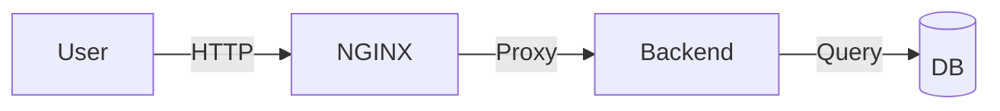

# MASTER BLUEPRINT

---

## 📋 DOCUMENT INFORMATION (Thông tin tài liệu)

| Thuộc tính | Giá trị |
|------------|---------|

| **Tên dự án** | DevOps-Journey |
| **Phiên bản** | 1.0.0 |
| **Ngày tạo** | 2025-12-27 |
| **Cập nhật lần cuối** | 2025-12-27 |
| **Tác giả** | ThanhRòm |

---

## 1. Mục đích & Tổng quan

### 1.1 Mục tiêu

Định nghĩa cấu trúc, nội dung, tiêu chuẩn thiết kế và tiến độ thực hiện cho toàn bộ khoá học DevOps.

### 1.2 Đối tượng

- **Beginner:** Người mới bắt đầu, chưa có kiến thức IT

- **Intermediate:** Đã có kiến thức cơ bản về Linux/Networking
- **Advanced:** Đã làm việc trong lĩnh vực IT/Dev

### 1.3 Định dạng chuẩn

Mỗi **Module** nằm trong một thư mục riêng và chứa **7 file Markdown** tiêu chuẩn:

| File | Mục đích |
|------|----------|

| `README.md` | Giáo trình lý thuyết, diagram, best-practice |
| `CHEATSHEET.md` | Tra cứu nhanh lệnh, snippet, code mẫu (nếu có), các lỗi hay gặp và cách xử lý, v.v.. |
| `LABS.md` | Các bài thực hành đơn giản theo từng module có hướng dẫn chi tiết từng bước |
| `QUIZ.md` | 10-50 câu hỏi trắc nghiệm tùy module |
| `EXERCISES.md` | 5-10 bài tập tình huống yêu cầu người học tự suy luận và giải quyết |
| `PROJECT.md` | Dự án mini tổng hợp các kiến thức của module |
| `SOLUTIONS.md` | Đáp án và lời giải chi tiết có hướng dẫn cho Quiz, Exercises & Project |

---

### 1.4 Quy tắc đặt tên

| Loại | Format | Ví dụ |
|------|--------|-------|

| Track folder | `Track{N}_{TênTrack}` | `Track1_Foundation_StaticWeb` |
| Module folder | `{N.M}_{TênModule}` | `1.1_Linux_Bash`, `2.3_Jenkins` |
| Capstone | `{N.X}_Capstone_Project` | `1.7_Capstone_Project` |
| Image file | `module_X.Y_step_Z_mota.png` | `1.4_step_2_docker_build.png` |

---

## 2. DIRECTORY STRUCTURE (Cây thư mục)


```
DevOps-Journey/
├── .design/                            # Thư mục chứa các file thiết kế chuẩn
│   ├── MAIN_design.md                    # Tài liệu quy định, thiết kế tổng thể
│   ├── README_design.md                  # Thiết kế cho README.md
│   ├── CHEATSHEET_design.md              # Thiết kế cho CHEATSHEET.md
│   ├── LABS_design.md                    # Thiết kế cho LABS.md
│   ├── QUIZ_design.md                    # Thiết kế cho QUIZ.md
│   ├── EXERCISES_design.md               # Thiết kế cho EXERCISES.md
│   ├── PROJECT_design.md                 # Thiết kế cho PROJECT.md
│   └── SOLUTIONS_design.md               # Thiết kế cho SOLUTIONS.md
│
├── assets/                             # Thư mục chứa tài nguyên chung
│   └── images/                           # Ảnh chung, logo
│
├── resources/                          # Tài liệu bổ trợ
│   ├── GLOSSARY.md                       # Tổng hợp từ điển thuật ngữ
│   └── SOFTWARE_LINKS.md                 # Link tải tool chính thức
│
├── Setup_Environment/                # Setup Environment
|   ├── images/                           # Thư mục chứa ảnh riêng module
|   ├── scripts/                          # Thư mục chứa các script giúp cài đặt chuẩn hóa môi trường
│   │   ├── setup-windows.ps1               # Script cho Windows
│   │   ├── setup-mac.sh                    # Script cho macOS
│   │   ├── setup-linux.sh                  # Script cho Linux
│   |   └── verify_env.sh                   # Script kiểm tra môi trường
|   |
│   ├── README.md                         # Giáo trình
│   ├── CHEATSHEET.md                     # Bảng tra cứu nhanh
│   ├── LABS.md                           # Hướng dẫn thực hành
│   ├── QUIZ.md                           # Câu hỏi trắc nghiệm
│   ├── EXERCISES.md                      # Bài tập tình huống
│   ├── PROJECT.md                        # Dự án mini tổng hợp kiến thức
│   └── SOLUTIONS.md                      # Đáp án và lời giải và hướng dẫn chi tiết
│
├── Track1_Foundation_StaticWeb/          # Track 1 – Platform and Static Web (Nền tảng và Web tĩnh)
│   ├── 1.1_Linux_Bash/
|   |   ├── images/                           # Thư mục chứa ảnh riêng module
|   |   |
│   |   ├── README.md                         # Giáo trình
│   |   ├── CHEATSHEET.md                     # Bảng tra cứu nhanh
│   |   ├── LABS.md                           # Hướng dẫn thực hành
│   |   ├── QUIZ.md                           # Câu hỏi trắc nghiệm
│   |   ├── EXERCISES.md                      # Bài tập tình huống
│   |   ├── PROJECT.md                        # Dự án mini tổng hợp kiến thức
│   |   └── SOLUTIONS.md                      # Đáp án và lời giải và hướng dẫn chi tiết
│   |
│   ├── 1.2_Network_Basics/
|   |   ├── images/                           # Thư mục chứa ảnh riêng module
|   |   |
│   |   ├── README.md                         # Giáo trình
│   |   ├── CHEATSHEET.md                     # Bảng tra cứu nhanh
│   |   ├── LABS.md                           # Hướng dẫn thực hành
│   |   ├── QUIZ.md                           # Câu hỏi trắc nghiệm
│   |   ├── EXERCISES.md                      # Bài tập tình huống
│   |   ├── PROJECT.md                        # Dự án mini tổng hợp kiến thức
│   |   └── SOLUTIONS.md                      # Đáp án và lời giải và hướng dẫn chi tiết
|   |
│   ├── 1.3_Git_GitLab/
|   |   ├── images/                           # Thư mục chứa ảnh riêng module
|   |   |
│   |   ├── README.md                         # Giáo trình
│   |   ├── CHEATSHEET.md                     # Bảng tra cứu nhanh
│   |   ├── LABS.md                           # Hướng dẫn thực hành
│   |   ├── QUIZ.md                           # Câu hỏi trắc nghiệm
│   |   ├── EXERCISES.md                      # Bài tập tình huống
│   |   ├── PROJECT.md                        # Dự án mini tổng hợp kiến thức
│   |   └── SOLUTIONS.md                      # Đáp án và lời giải và hướng dẫn chi tiết
|   |
│   ├── 1.4_Docker_Fundamentals/
|   |   ├── images/                           # Thư mục chứa ảnh riêng module
|   |   |
│   |   ├── README.md                         # Giáo trình
│   |   ├── CHEATSHEET.md                     # Bảng tra cứu nhanh
│   |   ├── LABS.md                           # Hướng dẫn thực hành
│   |   ├── QUIZ.md                           # Câu hỏi trắc nghiệm
│   |   ├── EXERCISES.md                      # Bài tập tình huống
│   |   ├── PROJECT.md                        # Dự án mini tổng hợp kiến thức
│   |   └── SOLUTIONS.md                      # Đáp án và lời giải và hướng dẫn chi tiết
|   |
│   ├── 1.5_NGINX_Basic/
|   |   ├── images/                           # Thư mục chứa ảnh riêng module
|   |   |
│   |   ├── README.md                         # Giáo trình
│   |   ├── CHEATSHEET.md                     # Bảng tra cứu nhanh
│   |   ├── LABS.md                           # Hướng dẫn thực hành
│   |   ├── QUIZ.md                           # Câu hỏi trắc nghiệm
│   |   ├── EXERCISES.md                      # Bài tập tình huống
│   |   ├── PROJECT.md                        # Dự án mini tổng hợp kiến thức
│   |   └── SOLUTIONS.md                      # Đáp án và lời giải và hướng dẫn chi tiết
|   |
│   ├── 1.6_CICD_Basic/
|   |   ├── images/                           # Thư mục chứa ảnh riêng module
|   |   |
│   |   ├── README.md                         # Giáo trình
│   |   ├── CHEATSHEET.md                     # Bảng tra cứu nhanh
│   |   ├── LABS.md                           # Hướng dẫn thực hành
│   |   ├── QUIZ.md                           # Câu hỏi trắc nghiệm
│   |   ├── EXERCISES.md                      # Bài tập tình huống
│   |   ├── PROJECT.md                        # Dự án mini tổng hợp kiến thức
│   |   └── SOLUTIONS.md                      # Đáp án và lời giải và hướng dẫn chi tiết
|   |
│   └── 1.7_Capstone_Project/
|       ├── images/                           # Thư mục chứa ảnh riêng module
|       |
|       ├── README.md                         # Giáo trình bao gồm mô tả dự án có gợi ý
|       └── SOLUTIONS.md                      # Lời giải và hướng dẫn chi tiết cho dự án
|
│
├── Track2_Orchestration_Automation/      # Track 2 – Coordination & Automation (Điều phối & Tự động hóa)
│   ├── 2.1_Docker_Advanced/
|   |   ├── images/                           # Thư mục chứa ảnh riêng module
|   |   |
│   |   ├── README.md                         # Giáo trình
│   |   ├── CHEATSHEET.md                     # Bảng tra cứu nhanh
│   |   ├── LABS.md                           # Hướng dẫn thực hành
│   |   ├── QUIZ.md                           # Câu hỏi trắc nghiệm
│   |   ├── EXERCISES.md                      # Bài tập tình huống
│   |   ├── PROJECT.md                        # Dự án mini tổng hợp kiến thức
│   |   └── SOLUTIONS.md                      # Đáp án và lời giải và hướng dẫn chi tiết
|   |
│   ├── 2.2_Docker_Compose/
|   |   ├── images/                           # Thư mục chứa ảnh riêng module
|   |   |
│   |   ├── README.md                         # Giáo trình
│   |   ├── CHEATSHEET.md                     # Bảng tra cứu nhanh
│   |   ├── LABS.md                           # Hướng dẫn thực hành
│   |   ├── QUIZ.md                           # Câu hỏi trắc nghiệm
│   |   ├── EXERCISES.md                      # Bài tập tình huống
│   |   ├── PROJECT.md                        # Dự án mini tổng hợp kiến thức
│   |   └── SOLUTIONS.md                      # Đáp án và lời giải và hướng dẫn chi tiết
|   |
│   ├── 2.3_Jenkins/
|   |   ├── images/                           # Thư mục chứa ảnh riêng module
|   |   |
│   |   ├── README.md                         # Giáo trình
│   |   ├── CHEATSHEET.md                     # Bảng tra cứu nhanh
│   |   ├── LABS.md                           # Hướng dẫn thực hành
│   |   ├── QUIZ.md                           # Câu hỏi trắc nghiệm
│   |   ├── EXERCISES.md                      # Bài tập tình huống
│   |   ├── PROJECT.md                        # Dự án mini tổng hợp kiến thức
│   |   └── SOLUTIONS.md                      # Đáp án và lời giải và hướng dẫn chi tiết
|   |
│   ├── 2.4_Kubernetes_Core/
|   |   ├── images/                           # Thư mục chứa ảnh riêng module
|   |   |
│   |   ├── README.md                         # Giáo trình
│   |   ├── CHEATSHEET.md                     # Bảng tra cứu nhanh
│   |   ├── LABS.md                           # Hướng dẫn thực hành
│   |   ├── QUIZ.md                           # Câu hỏi trắc nghiệm
│   |   ├── EXERCISES.md                      # Bài tập tình huống
│   |   ├── PROJECT.md                        # Dự án mini tổng hợp kiến thức
│   |   └── SOLUTIONS.md                      # Đáp án và lời giải và hướng dẫn chi tiết
|   |
│   ├── 2.5_Monitoring_Logging/
|   |   ├── images/                           # Thư mục chứa ảnh riêng module
|   |   |
│   |   ├── README.md                         # Giáo trình
│   |   ├── CHEATSHEET.md                     # Bảng tra cứu nhanh
│   |   ├── LABS.md                           # Hướng dẫn thực hành
│   |   ├── QUIZ.md                           # Câu hỏi trắc nghiệm
│   |   ├── EXERCISES.md                      # Bài tập tình huống
│   |   ├── PROJECT.md                        # Dự án mini tổng hợp kiến thức
│   |   └── SOLUTIONS.md                      # Đáp án và lời giải và hướng dẫn chi tiết
|   |
│   └── 2.6_Capstone_Project/
|       ├── images/                           # Thư mục chứa ảnh riêng module
|       |
|       ├── README.md                         # Giáo trình bao gồm mô tả dự án có gợi ý
|       └── SOLUTIONS.md                      # Lời giải và hướng dẫn chi tiết cho dự án
|
|
├── Track3_Cloud_Network_Design/          # Track 3 – System, network, and cloud design (Thiết kế hệ thống, mạng và đám mây)
│   ├── 3.2_AWS_Core_Services/
|   |   ├── images/                           # Thư mục chứa ảnh riêng module
|   |   |
│   |   ├── README.md                         # Giáo trình
│   |   ├── CHEATSHEET.md                     # Bảng tra cứu nhanh
│   |   ├── LABS.md                           # Hướng dẫn thực hành
│   |   ├── QUIZ.md                           # Câu hỏi trắc nghiệm
│   |   ├── EXERCISES.md                      # Bài tập tình huống
│   |   ├── PROJECT.md                        # Dự án mini tổng hợp kiến thức
│   |   └── SOLUTIONS.md                      # Đáp án và lời giải và hướng dẫn chi tiết
|   |
│   ├── 3.3_Terraform_IaC/
|   |   ├── images/                           # Thư mục chứa ảnh riêng module
|   |   |
│   |   ├── README.md                         # Giáo trình
│   |   ├── CHEATSHEET.md                     # Bảng tra cứu nhanh
│   |   ├── LABS.md                           # Hướng dẫn thực hành
│   |   ├── QUIZ.md                           # Câu hỏi trắc nghiệm
│   |   ├── EXERCISES.md                      # Bài tập tình huống
│   |   ├── PROJECT.md                        # Dự án mini tổng hợp kiến thức
│   |   └── SOLUTIONS.md                      # Đáp án và lời giải và hướng dẫn chi tiết
|   |
│   ├── 3.4_System_Design_Reliability/
|   |   ├── images/                           # Thư mục chứa ảnh riêng module
|   |   |
│   |   ├── README.md                         # Giáo trình
│   |   ├── CHEATSHEET.md                     # Bảng tra cứu nhanh
│   |   ├── LABS.md                           # Hướng dẫn thực hành
│   |   ├── QUIZ.md                           # Câu hỏi trắc nghiệm
│   |   ├── EXERCISES.md                      # Bài tập tình huống
│   |   ├── PROJECT.md                        # Dự án mini tổng hợp kiến thức
│   |   └── SOLUTIONS.md                      # Đáp án và lời giải và hướng dẫn chi tiết
|   |
│   └── 3.5_Capstone_Project/
|       ├── images/                           # Thư mục chứa ảnh riêng module
|       |
|       ├── README.md                         # Giáo trình bao gồm mô tả dự án có gợi ý
|       └── SOLUTIONS.md                      # Lời giải và hướng dẫn chi tiết cho dự án
|
│
├── Track4_DevSecOps/                     # Track 4 – DevSecOps
│   ├── 4.1_Security_in_Pipeline/
|   |   ├── images/                           # Thư mục chứa ảnh riêng module
|   |   |
│   |   ├── README.md                         # Giáo trình
│   |   ├── CHEATSHEET.md                     # Bảng tra cứu nhanh
│   |   ├── LABS.md                           # Hướng dẫn thực hành
│   |   ├── QUIZ.md                           # Câu hỏi trắc nghiệm
│   |   ├── EXERCISES.md                      # Bài tập tình huống
│   |   ├── PROJECT.md                        # Dự án mini tổng hợp kiến thức
│   |   └── SOLUTIONS.md                      # Đáp án và lời giải và hướng dẫn chi tiết
|   |
│   ├── 4.2_Infra_Security/
|   |   ├── images/                           # Thư mục chứa ảnh riêng module
|   |   |
│   |   ├── README.md                         # Giáo trình
│   |   ├── CHEATSHEET.md                     # Bảng tra cứu nhanh
│   |   ├── LABS.md                           # Hướng dẫn thực hành
│   |   ├── QUIZ.md                           # Câu hỏi trắc nghiệm
│   |   ├── EXERCISES.md                      # Bài tập tình huống
│   |   ├── PROJECT.md                        # Dự án mini tổng hợp kiến thức
│   |   └── SOLUTIONS.md                      # Đáp án và lời giải và hướng dẫn chi tiết
|   |
│   └── 4.3_Capstone_Project/
|       ├── images/                           # Thư mục chứa ảnh riêng module
|       |
|       ├── README.md                         # Giáo trình bao gồm mô tả dự án có gợi ý
|       └── SOLUTIONS.md                      # Lời giải và hướng dẫn chi tiết cho dự án
|
│
└── Track5_Career_Path/                   # Track 5 – Career Path (Lộ trình nghề nghiệp)
    ├── 5.1_Certifications/
    |   ├── images/                           # Thư mục chứa ảnh riêng module
    |   |
    |   ├── README.md                         # Giáo trình
    |   ├── CHEATSHEET.md                     # Bảng tra cứu nhanh
    |   ├── LABS.md                           # Hướng dẫn thực hành
    |   ├── QUIZ.md                           # Câu hỏi trắc nghiệm
    |   ├── EXERCISES.md                      # Bài tập tình huống
    |   ├── PROJECT.md                        # Dự án mini tổng hợp kiến thức
    |   └── SOLUTIONS.md                      # Đáp án và lời giải và hướng dẫn chi tiết
    |
    ├── 5.2_Interview_Prep/
    |   ├── images/                           # Thư mục chứa ảnh riêng module
    |   |
    |   ├── README.md                         # Giáo trình
    |   ├── CHEATSHEET.md                     # Bảng tra cứu nhanh
    |   ├── LABS.md                           # Hướng dẫn thực hành
    |   ├── QUIZ.md                           # Câu hỏi trắc nghiệm
    |   ├── EXERCISES.md                      # Bài tập tình huống
    |   ├── PROJECT.md                        # Dự án mini tổng hợp kiến thức
    |   └── SOLUTIONS.md                      # Đáp án và lời giải và hướng dẫn chi tiết
    |
    └── 5.3_Capstone_Project/
        ├── images/                           # Thư mục chứa ảnh riêng module
        |
        ├── README.md                         # Giáo trình bao gồm mô tả dự án có gợi ý
        └── SOLUTIONS.md                      # Lời giải và hướng dẫn chi tiết cho dự án
```


## 3. FULL SYLLABUS (Lộ trình đào tạo)

### Module 0 – Setup Environment

| Thuộc tính | Nội dung |
|------------|---------|

| **Yêu cầu** | Có kiến thức cơ bản về máy tính |
| **Học được** | Cài đặt và chuẩn hóa môi trường học tập |
| **Mục tiêu** | Môi trường học tập đồng nhất cho tất cả học viên |

---

### Track 1 – Foundation & Static Web

| Thuộc tính | Nội dung |
|------------|----------|

| **Yêu cầu** | Có kiến thức cơ bản về máy tính |
| **Học được** | Nắm vững nền tảng Linux, Network, Git, Docker, NGINX và CI/CD |
| **Mục tiêu** | Xây dựng và triển khai website tĩnh với CI/CD |

| Module | Tên | Nội dung chính |
|--------|-----|----------------|

| 1.1 | Linux & Bash | WSL2/Ubuntu, lệnh cơ bản, script Bash, quản lý package |
| 1.2 | Network Basics | TCP/IP, subnet, DNS, ping, traceroute, ifconfig/ip |
| 1.3 | Git & GitLab | Repository, commit, branch, merge, remote, CI pipeline |
| 1.4 | Docker Fundamentals | Dockerfile, build/run container, image, networking |
| 1.5 | NGINX Basic | Server block, reverse proxy, log, reload |
| 1.6 | CI/CD Basic | GitHub Actions (build, test, deploy), secrets, cache |
| 1.7 | Capstone Project | Website tĩnh CI/CD hoàn chỉnh |

---

### Track 2 – Orchestration & Automation

| Thuộc tính | Nội dung |
|------------|----------|

| **Yêu cầu** | Hoàn thành Track 1 hoặc có kiến thức tương đương |
| **Học được** | Nắm vững Docker nâng cao, Docker Compose, Jenkins, Kubernetes, monitoring & logging |
| **Mục tiêu** | Triển khai microservices trên Kubernetes với CI/CD |

| Module | Tên | Nội dung chính |
|--------|-----|----------------|

| 2.1 | Docker Advanced | Multi-stage builds, volume, healthcheck, security |
| 2.2 | Docker Compose | Multi-service, mạng, phụ thuộc, scaling |
| 2.3 | Jenkins | Pipeline Declarative, Docker integration |
| 2.4 | Kubernetes Core | POD, Service, Deployment, ConfigMap, Secret |
| 2.5 | Monitoring & Logging | Prometheus/Grafana, Loki/EFK, alerting |
| 2.6 | Capstone Project | Microservices trên Kubernetes với CI/CD |

---

### Track 3 – Cloud, Network & System Design

| Thuộc tính | Nội dung |
|------------|----------|

| **Yêu cầu** | Hoàn thành Track 2 hoặc có kiến thức tương đương |
| **Học được** | Nắm vững mạng nâng cao, dịch vụ AWS, Terraform IaC, thiết kế hệ thống & độ tin cậy |
| **Mục tiêu** | Xây dựng môi trường cloud-native với Terraform |

| Module | Tên | Nội dung chính |
|--------|-----|----------------|

| 3.1 | Network Advanced | VPC, subnet, routing, security groups, NAT |
| 3.2 | AWS Core Services | IAM, EC2, S3, RDS, Load Balancer |
| 3.3 | Terraform IaC | Provision AWS, state management, modules |
| 3.4 | System Design & Reliability | SLA/SLO/SLI, HA, auto-scaling, DR |
| 3.5 | Capstone Project | Cloud-native environment với Terraform |

---

### Track 4 – DevSecOps

| Thuộc tính | Nội dung |
|------------|----------|

| **Yêu cầu** | Hoàn thành Track 3 hoặc có kiến thức tương đương |
| **Học được** | Nắm vững bảo mật trong pipeline, bảo mật hạ tầng |
| **Mục tiêu** | Xây dựng pipeline CI/CD an toàn và hạ tầng bảo mật |

| Module | Tên | Nội dung chính |
|--------|-----|----------------|

| 4.1 | Security in Pipeline | Image scanning, SAST, secrets management |
| 4.2 | Infra Security | Harden Linux, network policies, audit, compliance |
| 4.3 | Capstone Project | Secure CI/CD pipeline |

---

### Track 5 – Career Path

| Thuộc tính | Nội dung |
|------------|----------|

| **Yêu cầu** | Hoàn thành Track 4 hoặc có kiến thức tương đương |
| **Học được** | Chuẩn bị chứng chỉ, phỏng vấn, portfolio |
| **Mục tiêu** | Sẵn sàng cho con đường nghề nghiệp DevOps |

| Module | Tên | Nội dung chính |
|--------|-----|----------------|

| 5.1 | Certifications | CKA, AWS DevOps, GCP DevOps – ôn tập, đề mẫu |
| 5.2 | Interview Prep | Câu hỏi kỹ thuật, mock interview, soft skills |
| 5.3 | Capstone Project | Portfolio và CV hoàn chỉnh |

---

## 4.  DESIGN FILES (Bộ thiết kế)

### 4.1 Danh sách file thiết kế

| File | Mục đích | Link |
|------|----------|------|
| `README_design.md` | Template cho README.md | [Xem](./README_design.md) |
| `CHEATSHEET_design.md` | Template cho CHEATSHEET.md | [Xem](./CHEATSHEET_design.md) |
| `LABS_design.md` | Template cho LABS.md | [Xem](./LABS_design.md) |
| `EXERCISES_design.md` | Template cho EXERCISES.md | [Xem](./EXERCISES_design.md) |
| `SOLUTIONS_design.md` | Template cho SOLUTIONS.md | [Xem](./SOLUTIONS_design.md) |
| `QUIZ_design.md` | Template cho QUIZ.md | [Xem](./QUIZ_design.md) |
| `PROJECT_design.md` | Template cho PROJECT.md | [Xem](./PROJECT_design.md) |

### 4.2 Tài liệu bổ trợ

| File | Mục đích | Link |
|------|----------|------|
| `GLOSSARY.md` | Từ điển thuật ngữ DevOps | [Xem](../resources/GLOSSARY.md) |
| `SOFTWARE_LINKS.md` | Link tải tool chính thức | [Xem](../resources/SOFTWARE_LINKS.md) |

### 4.3 Cấu trúc chung của mỗi file thiết kế

Mỗi file `*_design.md` bao gồm:

1. **Purpose** – Mục đích của file
2. **File Header (Metadata)** – YAML front-matter chuẩn
3. **Required Sections** – Các section bắt buộc
4. **Formatting Rules** – Quy tắc định dạng
5. **Style Guide** – Hướng dẫn phong cách
6. **Review Checklist** – Checklist kiểm tra
7. **Do's and Don'ts** – Những điều nên/không nên làm
8. **Example Template** – Mẫu hoàn chỉnh để copy-paste

---

## 5. Language & Tone Rules (Quy tắc ngôn ngữ) ⭐

### 5.1 Thuật ngữ chuyên ngành

| Thành phần | Quy tắc | Ví dụ |
|------------|---------|-------|
| Tiêu đề (H1, H2) | Tiếng Anh hoặc Song ngữ | `## Docker Fundamentals` |
| Nội dung giải thích | Ngôn ngữ tự nhiên, dễ hiểu | "Chúng ta sẽ tạo một container..." |
| Thuật ngữ chuyên ngành | **Giữ nguyên tiếng Anh** | Container, Pod, Cluster, Pipeline... |

### 5.2 KHÔNG dịch thuật ngữ

| ❌ SAI | ✅ ĐÚNG |
|--------|---------|
| "Triển khai một vỏ đậu lên cụm" | "Deploy một Pod lên Cluster" |
| "Đường ống tích hợp liên tục" | "CI/CD Pipeline" |
| "Thùng chứa ảo" | "Container" |

### 5.3 Phong cách viết (Tone of Voice)

- **Đại từ:** Dùng "Bạn" và "Chúng ta"
- **Văn phong:** Cổ vũ, khuyến khích (Enthusiastic)

### 5.4 Callout/Blockquote

```markdown
> 💡 **Mẹo:** Dùng phím Tab để tự động điền lệnh.

> ⚠️ **Cảnh báo:** Không chạy lệnh này trên production!

> 📝 **Ghi chú:** Xem thêm tại Glossary.

> ✅ **Thực hành tốt:** Luôn sử dụng multi-stage build.
```

---

## 6. Image Guidelines (Quy định hình ảnh) ⭐

### 6.1 Loại hình ảnh và công cụ

| Loại | Công cụ | Format | Khi nào dùng |
|------|---------|--------|--------------|
| Architecture/Flow | **Mermaid.js** (ưu tiên) | Inline code | Logic diagram, flowchart |
| Diagram phức tạp | Excalidraw, Draw.io | SVG/PNG | Khi Mermaid không đủ |
| Screenshot Terminal | **Text block** | Code block | Để học viên copy được |
| Screenshot GUI | PNG/WebP | < 500KB | Giao diện thực tế |

### 6.2 Mermaid.js (Ưu tiên sử dụng)

**Ưu điểm:**

- Dễ sửa (chỉ cần edit text)
- Nhẹ (không cần file ảnh)
- Render đẹp trên GitHub/GitLab
- Version control friendly

**Ví dụ:**

```markdown


```

### 6.3 Đặt tên file ảnh

```

module_X.Y_step_Z_mota.png

```

| Ví dụ | Mô tả |
|-------|-------|
| `1.4_step_2_docker_build.png` | Module 1.4, Step 2, Docker build |
| `2.1_architecture_overview.png` | Module 2.1, Architecture overview |
| `3.2_aws_console_iam.png` | Module 3.2, AWS Console IAM |

### 6.4 Vị trí lưu ảnh

| Loại ảnh | Vị trí | Ví dụ |
|----------|--------|-------|
| Ảnh chung (logo, icon) | `/assets/images/` | `/assets/images/logo.png` |
| Ảnh riêng module | `<module_folder>/images/` | `1.4_Docker_Fundamentals/images/` |

---

## 7. Navigation & Linking (Điều hướng)

### 7.1 Navigation Footer (Bắt buộc)

Cuối mỗi file `README.md` phải có:

```markdown
---

[⬅️ Bài trước: X.Y-1 <Tên>](../X.Y-1_Folder/README.md) | [📚 Mục lục](../../README.md) | [Bài tiếp: X.Y+1 <Tên> ➡️](../X.Y+1_Folder/README.md)
```

### 7.2 Linking thuật ngữ

Lần đầu xuất hiện thuật ngữ → Link về GLOSSARY.md:

```markdown
[Docker](../../resources/GLOSSARY.md#docker) là nền tảng [containerization](../../resources/GLOSSARY.md#container) phổ biến nhất.
```

### 7.3 Linking nội bộ

Dùng đường dẫn tương đối:

```markdown
Xem thêm: [LABS.md](./LABS.md)
Tham khảo: [Module 1.3 Git](../1.3_Git_GitLab/README.md)
```

---

## 8. Quy trình tạo module mới

### Step 1: Tạo thư mục module

```bash
# Ví dụ: Tạo module 1.4 Docker Fundamentals
mkdir -p Track1_Foundation_StaticWeb/1.4_Docker_Fundamentals/images
cd Track1_Foundation_StaticWeb/1.4_Docker_Fundamentals
```

### Step 2: Tạo 7 file từ template

```bash
touch README.md CHEATSHEET.md LABS.md QUIZ.md EXERCISES.md PROJECT.md SOLUTIONS.md 
```

### Step 3: Copy nội dung từ design files

1. Mở file `.design/README_design.md`
2. Copy phần **Example Template**
3. Paste vào `README.md` của module
4. Thay thế `X.Y` và `<Tên Module>` bằng giá trị thực

### Step 4: Điền nội dung thực tế

- Sử dụng Mermaid.js cho diagram (không dùng ảnh PNG cho logic)
- Link thuật ngữ về GLOSSARY.md lần đầu xuất hiện
- Thêm Navigation Footer cuối file
- Đảm bảo YAML front-matter đầy đủ

### Step 5: Review và commit

1. Sử dụng **Review Checklist** trong mỗi design file
2. Chạy markdown linter nếu có
3. Commit với message rõ ràng

### Step 6: Cập nhật Progress Tracker

Cập nhật bảng tiến độ ở section 10 của file này.

---

## 9. Tiêu chuẩn kỹ thuật

### 9.1 YAML Front-matter

Mỗi file cần có front-matter:

```yaml
---
module: "X.Y"
title: "<Tên Module>"
track: "<Số Track>"
version: "1.0"
last_updated: "YYYY-MM-DD"
---
```

### 9.2 Markdown Linting

Khuyến nghị sử dụng [markdownlint](https://github.com/DavidAnson/markdownlint) để kiểm tra:

```bash
npx markdownlint "**/*.md"
```

### 9.3 Mermaid.js Support

Đảm bảo môi trường render hỗ trợ Mermaid:

- GitHub: Native support ✅
- GitLab: Native support ✅
- VS Code: Extension "Markdown Preview Mermaid Support"

---

## 10. Tiến độ công việc (Progress Tracker)

### 10.1 Tổng quan

| Track | Tổng module | Hoàn thành | Tiến độ |
|-------|-------------|------------|---------|
| Track 0 | 1 | 0 | 0% |
| Track 1 | 7 | 0 | 0% |
| Track 2 | 6 | 0 | 0% |
| Track 3 | 5 | 0 | 0% |
| Track 4 | 3 | 0 | 0% |
| Track 5 | 3 | 0 | 0% |
| **Tổng** | **25** | **0** | **0%** |

### 10.2 Chi tiết theo module

| Module | README | CHEATSHEET | LABS | EXERCISES | SOLUTIONS | QUIZ | PROJECT | Trạng thái |
|--------|--------|------------|------|-----------|-----------|------|---------|------------|
| 0.Setup | ⬜ | ⬜ | ⬜ | ⬜ | ⬜ | ⬜ | ⬜ | ⏳ Chưa bắt đầu |
| 1.1 Linux | ⬜ | ⬜ | ⬜ | ⬜ | ⬜ | ⬜ | ⬜ | ⏳ Chưa bắt đầu |
| 1.2 Network | ⬜ | ⬜ | ⬜ | ⬜ | ⬜ | ⬜ | ⬜ | ⏳ Chưa bắt đầu |
| 1.3 Git | ⬜ | ⬜ | ⬜ | ⬜ | ⬜ | ⬜ | ⬜ | ⏳ Chưa bắt đầu |
| 1.4 Docker | ⬜ | ⬜ | ⬜ | ⬜ | ⬜ | ⬜ | ⬜ | ⏳ Chưa bắt đầu |
| 1.5 NGINX | ⬜ | ⬜ | ⬜ | ⬜ | ⬜ | ⬜ | ⬜ | ⏳ Chưa bắt đầu |
| 1.6 CI/CD | ⬜ | ⬜ | ⬜ | ⬜ | ⬜ | ⬜ | ⬜ | ⏳ Chưa bắt đầu |
| 1.7 Capstone | ⬜ | ⬜ | ⬜ | ⬜ | ⬜ | ⬜ | ⬜ | ⏳ Chưa bắt đầu |

**Chú thích:** ✅ Hoàn thành | 🔄 Đang làm | ⬜ Chưa làm | ⏳ Chưa bắt đầu

---

## 11. Lịch sử thay đổi (Change Log)

| Ngày | Phiên bản | Người cập nhật | Thay đổi |
|------|-----------|----------------|----------|

---

## 12. Checklist định kỳ

### Hàng tuần

- [ ] Kiểm tra các module đã hoàn thành, cập nhật Progress Tracker
- [ ] Review nội dung mới theo checklist trong design files
- [ ] Cập nhật Change Log nếu có thay đổi quan trọng

### Hàng tháng

- [ ] Đánh giá lại nội dung dựa trên phản hồi học viên
- [ ] Cập nhật các file design nếu cần
- [ ] Kiểm tra tính nhất quán của placeholder và version
- [ ] Cập nhật GLOSSARY.md với thuật ngữ mới
- [ ] Kiểm tra link hỏng trong Navigation

---

## 13. Liên hệ & Hỗ trợ

- **Repository:** [Link GitHub]
- **Issues:** [Link Issues]
- **Email:** <devops-team@example.com>

---

*Tài liệu này là nguồn tham chiếu duy nhất cho toàn bộ quá trình phát triển khóa học DevOps.*
