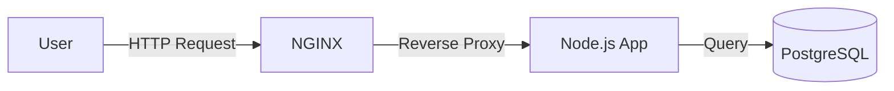
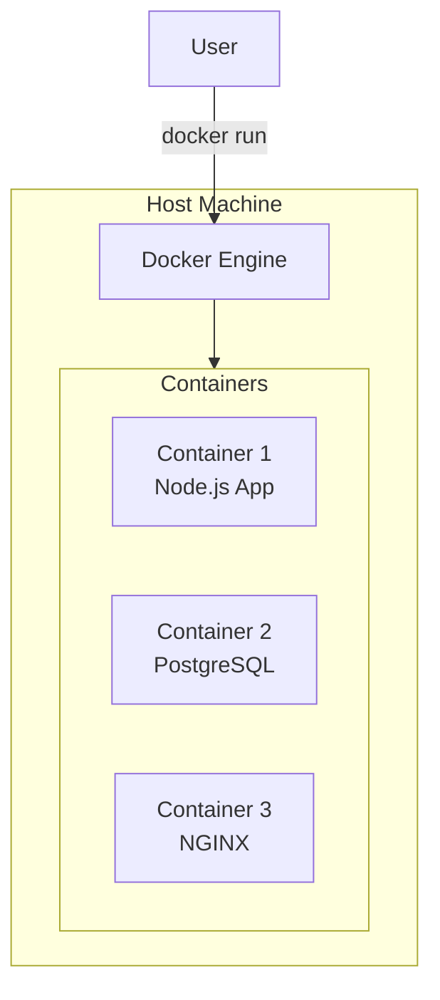
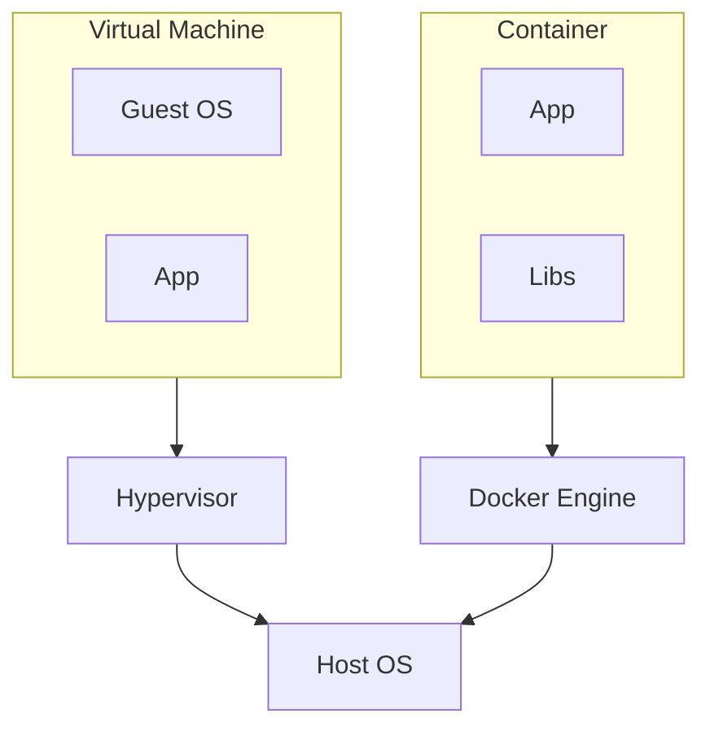

# README.md Design Specification

## 1. Purpose & Audience

- **Mục đích:** Cung cấp lý thuyết, định nghĩa, ví dụ thực tế và sơ đồ minh hoạ cho mỗi module, giúp học viên nắm vững khái niệm trước khi thực hành.
- **Yêu cầu ngôn ngữ:** Tất cả nội dung tài liệu phải được viết bằng tiếng Việt.
- **Đối tượng:** Học viên, từ người mới bắt đầu tới người đã có kiến thức nền tảng DevOps.

---

## 2. File Header (Metadata)

Mỗi `README.md` **bắt buộc** bắt đầu bằng khối front‑matter YAML:

```yaml
---
module: "X.Y"                    # Số module (ví dụ: 1.1, 2.3)
title: "<Tên Module>"            # Tên đầy đủ của module
track: "<Số Track>"              # Track number (1, 2, 3, 4, 5)
version: "1.0"                   # Phiên bản nội dung
last_updated: "YYYY-MM-DD"       # Ngày cập nhật cuối
author: "<Tên tác giả>"          # Người viết/cập nhật
---
```

---

## 3. Required Sections (theo thứ tự bắt buộc)

### 3.1. Module Title

```markdown
## MODULE X.Y – <Tên Module>
```

### 3.2. Giới thiệu (Introduction)

- 2‑3 câu giải thích **tại sao** học viên cần học bài này
- Nó giải quyết **vấn đề gì** trong thực tế DevOps
- Lần đầu xuất hiện thuật ngữ → link về [GLOSSARY.md](../../resources/GLOSSARY.md)

### 3.3. Mục tiêu học tập (Learning Objectives)

```markdown
### Mục tiêu học tập

Sau khi hoàn thành module này, bạn sẽ:

- [ ] Hiểu được khái niệm A và ứng dụng của nó
- [ ] Thực hiện được thao tác B một cách thành thạo
- [ ] Tránh được các lỗi phổ biến C trong thực tế
```

### 3.4. Architecture Diagram (Sơ đồ kiến trúc)

**Ưu tiên sử dụng Mermaid.js** để vẽ sơ đồ ngay trong Markdown:

```markdown
### Kiến trúc hệ thống



```

> 💡 **Mẹo:** Mermaid.js dễ sửa, nhẹ, render đẹp trên GitHub/GitLab. Chỉ dùng ảnh PNG cho screenshot giao diện thực tế.

**Các loại diagram Mermaid thường dùng:**

| Loại | Syntax | Dùng cho |
|------|--------|----------|
| Flowchart | `graph LR/TD` | Luồng xử lý, kiến trúc |
| Sequence | `sequenceDiagram` | Tương tác giữa các components |
| Class | `classDiagram` | Cấu trúc object |
| State | `stateDiagram-v2` | Trạng thái hệ thống |

### 3.5. Lý thuyết chi tiết (Theory)

Bao gồm:

- **Định nghĩa chi tiết** (không rút gọn)
- **Ví dụ thực tế / câu chuyện** để liên tưởng
- **Hình ảnh minh hoạ** (Mermaid hoặc screenshot)
- **Bảng so sánh** (nếu có nhiều khái niệm liên quan)

**Callout/Blockquote cho mẹo:**

```markdown
> 💡 **Mẹo:** Dùng phím Tab để tự động điền lệnh trong terminal.

> ⚠️ **Cảnh báo:** Không chạy lệnh này trên production!

> 📝 **Ghi chú:** Xem thêm tại [Glossary](../../resources/GLOSSARY.md#container).
```

### 3.6. Bước thực hành ngắn (Quick Practice)

- 1‑2 lệnh CLI ngắn gọn minh hoạ cách áp dụng lý thuyết
- Dùng code block với ngôn ngữ thích hợp

### 3.7. Tham khảo (References)

- Link tới docs chính thức
- Video hướng dẫn
- Blog posts hữu ích

### 3.8. Navigation Footer (Điều hướng) ⭐ BẮT BUỘC

Cuối mỗi file README.md **phải có** footer điều hướng:

```markdown
---

[⬅️ Bài trước: X.Y-1 <Tên>](../X.Y-1_Folder/README.md) | [📚 Mục lục](../../README.md) | [Bài tiếp: X.Y+1 <Tên> ➡️](../X.Y+1_Folder/README.md)
```

---

## 4. Formatting Rules

| Thành phần | Quy tắc |
|------------|---------|
| Tiêu đề module | `##` (H2) |
| Mục con | `###` (H3) |
| Danh sách | `-` cho bullet, `1.` cho ordered list |
| Code blocks | Ba backticks + ngôn ngữ (`bash`, `yaml`, `dockerfile`) |
| Diagram | Ưu tiên Mermaid.js, PNG cho screenshot |
| Link nội bộ | Đường dẫn tương đối |
| Nhấn mạnh | `**bold**` cho quan trọng, `*italic*` cho chú thích |
| Thuật ngữ | Link về GLOSSARY.md lần đầu xuất hiện |

---

## 5. Language & Tone Rules (Quy tắc ngôn ngữ)

### 5.1. Thuật ngữ chuyên ngành

| Thành phần | Quy tắc |
|------------|---------|
| Tiêu đề (H1, H2) | Tiếng Anh hoặc Song ngữ |
| Nội dung giải thích | Ngôn ngữ tự nhiên, dễ hiểu |
| Thuật ngữ chuyên ngành | **Giữ nguyên tiếng Anh** |

**Đúng:**
> Chúng ta sẽ deploy một Pod lên Cluster.

**Sai:**
> Chúng ta sẽ triển khai một vỏ đậu lên cụm.

### 5.2. Phong cách viết (Tone of Voice)

- Dùng ngôi **"Bạn"** và **"Chúng ta"**
- Văn phong: **Cổ vũ, khuyến khích (Enthusiastic)** nhưng **ngắn gọn (Concise)**
- Câu ngắn: Mỗi câu ≤ 50 từ, mỗi đoạn ≤ 5 câu

---

## 6. Image Guidelines (Quy định hình ảnh)

### 6.1. Loại hình ảnh

| Loại | Công cụ | Format |
|------|---------|--------|
| Architecture/Logic | **Mermaid.js** (ưu tiên) hoặc Excalidraw | SVG/PNG |
| Screenshot Terminal | **Text block** (để copy được) | - |
| Screenshot GUI | PNG/WebP | < 500KB |

### 6.2. Đặt tên file ảnh

```
module_X.Y_step_Z_mota.png
```

**Ví dụ:**

- `1.4_step_2_docker_build.png`
- `2.1_architecture_overview.png`

### 6.3. Vị trí lưu ảnh

- Ảnh chung: `/assets/images/`
- Ảnh riêng module: `<module_folder>/images/`

---

## 7. Review Checklist

- [ ] Front‑matter YAML đầy đủ
- [ ] Tiêu đề module đúng định dạng `## MODULE X.Y – …`
- [ ] Có đầy đủ 8 mục bắt buộc theo thứ tự
- [ ] Diagram sử dụng Mermaid.js (không dùng ảnh cho logic diagram)
- [ ] Thuật ngữ lần đầu link về GLOSSARY.md
- [ ] Có Navigation Footer cuối file
- [ ] Không có lỗi chính tả
- [ ] `last_updated` là ngày hiện tại

---

## 8. Do's and Don'ts

### ✅ Nên làm

- Sử dụng Mermaid.js cho architecture/flow diagram
- Link thuật ngữ về GLOSSARY.md lần đầu xuất hiện
- Thêm Navigation Footer cuối mỗi file
- Sử dụng callout (💡, ⚠️, 📝) cho mẹo/cảnh báo
- Kiểm tra tất cả lệnh trước khi đưa vào

### ❌ Không nên làm

- Không dịch thuật ngữ chuyên ngành (giữ nguyên tiếng Anh)
- Dùng ảnh PNG cho diagram logic (dùng Mermaid)
- Bỏ qua Navigation Footer
- Viết câu dài quá 50 từ
- Để lại placeholder không thay thế

---

## 9. Example Template (Copy-Paste)

````markdown
---
module: "1.4"
title: "Docker Fundamentals"
track: "1"
version: "1.0"
last_updated: "2025-12-27"
author: "DevOps Team"
---

## MODULE 1.4 – Docker Fundamentals

### Giới thiệu

[Docker](../../resources/GLOSSARY.md#docker) là nền tảng [containerization](../../resources/GLOSSARY.md#container) phổ biến nhất hiện nay. Việc hiểu Docker giúp bạn đóng gói ứng dụng và môi trường vào một [image](../../resources/GLOSSARY.md#image) duy nhất.

### Mục tiêu học tập

Sau khi hoàn thành module này, bạn sẽ:

- [ ] Hiểu được khái niệm container và sự khác biệt với VM
- [ ] Viết được Dockerfile cơ bản
- [ ] Build và chạy được Docker container
- [ ] Quản lý được images và containers

### Kiến trúc hệ thống



### Lý thuyết

#### 1. Docker là gì?

**Docker** là một nền tảng mã nguồn mở cho phép bạn:

- Đóng gói ứng dụng cùng với tất cả các dependencies
- Chạy ứng dụng trong môi trường cô lập (container)
- Đảm bảo ứng dụng chạy giống nhau trên mọi môi trường

> 💡 **Mẹo:** Hãy nghĩ Container như một "hộp" chứa mọi thứ ứng dụng cần để chạy.

#### 2. Container vs Virtual Machine



| Tiêu chí | Container | Virtual Machine |
|----------|-----------|-----------------|
| Khởi động | Vài giây | Vài phút |
| Kích thước | MB | GB |
| Hiệu năng | Gần native | Overhead lớn |
| Isolation | Process level | Hardware level |

### Bước thực hành ngắn

```bash
# Pull image từ Docker Hub
docker pull nginx:alpine

# Chạy container
docker run -d -p 8080:80 --name my-nginx nginx:alpine

# Kiểm tra container đang chạy
docker ps
```

> ⚠️ **Cảnh báo:** Đảm bảo Docker Desktop đang chạy trước khi thực hiện các lệnh trên.

### Tham khảo

- [Docker Official Documentation](https://docs.docker.com/)
- [Dockerfile Best Practices](https://docs.docker.com/develop/develop-images/dockerfile_best-practices/)
- [Docker Cheat Sheet](../../resources/SOFTWARE_LINKS.md)

---

[⬅️ Bài trước: 1.3 Git & GitLab](../1.3_Git_GitLab/README.md) | [📚 Mục lục](../../README.md) | [Bài tiếp: 1.5 NGINX Basic ➡️](../1.5_NGINX_Basic/README.md)
````

---

*File này là chuẩn mẫu cho mọi `README.md` trong khoá học DevOps.*
