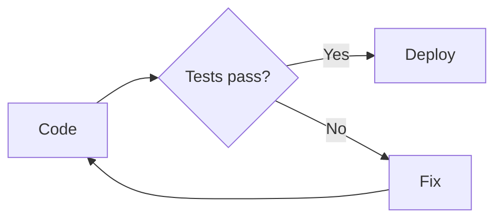

# 🤝 Hướng dẫn đóng góp — Dev-Knowledge

> **Tài liệu chủ đạo (Single Source of Truth).** Mọi bài viết, cấu trúc, naming, nội dung đều phải tuân thủ file này.
> Đọc **1 file này** là đủ: quy tắc đặt tên, phân loại bài, bố cục từng loại bài, phong cách viết, checklist, **và** outline chi tiết toàn bộ ~412 bài trong repo.

---

## MỤC LỤC

**Phần 1 — Quy tắc & Tiêu chuẩn**

1. [Tổng quan dự án](#1-tổng-quan-dự-án)
2. [Quy tắc đặt tên file](#2-quy-tắc-đặt-tên-file)
3. [Hệ thống Suffix — Phân loại bài viết](#3-hệ-thống-suffix--phân-loại-bài-viết)
4. [Bộ file chuẩn cho mỗi loại chủ đề](#4-bộ-file-chuẩn-cho-mỗi-loại-chủ-đề)
5. [Nguyên tắc phân tầng nội dung](#5-nguyên-tắc-phân-tầng-nội-dung)
6. [Nội dung bắt buộc & Bố cục theo từng Suffix](#6-nội-dung-bắt-buộc--bố-cục-theo-từng-suffix)
7. [Template bài viết bắt buộc](#7-template-bài-viết-bắt-buộc)
8. [Phong cách viết & Code Examples](#8-phong-cách-viết--code-examples)
9. [Cấp độ bài viết](#9-cấp-độ-bài-viết)
10. [Quy tắc đặc thù theo domain](#10-quy-tắc-đặc-thù-theo-domain)
11. [Quy trình thêm bài mới & Checklist](#11-quy-trình-thêm-bài-mới--checklist)
12. [Nội dung cần tránh](#12-nội-dung-cần-tránh)
13. [Template copy-paste theo domain](#13-template-copy-paste-theo-domain)

**Phần 2 — Bố cục Repo & Outline chi tiết**

14. [Cây thư mục tổng thể](#14-cây-thư-mục-tổng-thể)
15. [00 — Roadmaps](#15-00--roadmaps)
16. [01 — CS Fundamentals](#16-01--cs-fundamentals)
17. [02 — Version Control](#17-02--version-control)
18. [03 — Terminal & OS](#18-03--terminal--os)
19. [04 — Networking](#19-04--networking)
20. [05 — Languages](#20-05--languages)
21. [06 — Frontend](#21-06--frontend)
22. [07 — Backend](#22-07--backend)
23. [08 — Databases](#23-08--databases)
24. [09 — DevOps & Infrastructure](#24-09--devops--infrastructure)
25. [10 — Cloud](#25-10--cloud)
26. [11 — Architecture & System Design](#26-11--architecture--system-design)
27. [12 — Security](#27-12--security)
28. [13 — Testing & QA](#28-13--testing--qa)
29. [14 — AI / Machine Learning](#29-14--ai--machine-learning)
30. [15 — Data Engineering](#30-15--data-engineering)
31. [16 — Mobile Development](#31-16--mobile-development)
32. [17 — Game Development](#32-17--game-development)
33. [18 — Blockchain & Web3](#33-18--blockchain--web3)
34. [19 — Embedded & IoT](#34-19--embedded--iot)
35. [20 — Developer Tools](#35-20--developer-tools)
36. [21 — Soft Skills & Career](#36-21--soft-skills--career)
37. [Thống kê tổng hợp](#37-thống-kê-tổng-hợp)

---
# 📐 Phần 1: Quy tắc & Tiêu chuẩn

## 1. Tổng quan dự án

**Dev-Knowledge** là kho kiến thức mở, bao phủ **toàn bộ lĩnh vực phát triển phần mềm** — từ nền tảng CS, ngôn ngữ lập trình, frontend, backend, DevOps, cloud, AI/ML, mobile, game dev, blockchain, embedded/IoT cho đến kỹ năng mềm & sự nghiệp.

**Đối tượng:** Người học từ **không biết gì** đến chuyên gia. Mọi bài viết phải giả định người đọc chưa biết chủ đề đó — giải thích rõ ràng, có hình ảnh minh họa, có ví dụ thực tế.

**Triết lý viết bài:**

| Nguyên tắc | Mô tả |
|---|---|
| **Beginner-first** | Luôn giải thích từ zero. Dùng analogy đời thường trước khi đi vào kỹ thuật |
| **Show, don't just tell** | Mỗi khái niệm PHẢI có ví dụ code/diagram/hình ảnh kèm theo |
| **Real-world context** | Dùng ví dụ thực tế (user, product, order), không `foo/bar/baz` |
| **Why before What** | Luôn giải thích TẠI SAO trước khi dạy CÁI GÌ/CÁCH LÀM |
| **Progressive complexity** | basics → advanced → deep-dive. Không nhảy cấp |
| **Visual learning** | Mỗi bài ít nhất 1 diagram/bảng/hình ảnh. Càng nhiều visual càng tốt |

---

## 2. Quy tắc đặt tên file

### Format: `[STT]-[tên-kebab-case]-[suffix].md`

**Ví dụ:**

```
01-python-basics.md
02-python-advanced.md
03-python-packaging-setup.md
06-python-cheatsheet.md
```

| Thành phần | Quy tắc |
|---|---|
| `STT` | Số thứ tự 2 chữ số (01, 02…) — thứ tự **HỌC đề xuất** trong folder, KHÔNG phải mức độ khó |
| `tên-kebab-case` | Mô tả nội dung bằng **kebab-case tiếng Anh** |
| `suffix` | **Bắt buộc** — chọn đúng 1 suffix từ bảng ở mục 4 |

**Thứ tự STT đề xuất trong 1 folder:**

```
overview → fundamentals → basics → advanced → deep-dive →
patterns → practices → setup → examples →
cheatsheet → compare → cert → translated
```

---

## 3. Hệ thống Suffix — Phân loại bài viết

Mỗi bài viết PHẢI có **đúng 1 suffix** từ danh sách dưới đây. Suffix quyết định **loại nội dung** và **bố cục bắt buộc** của bài.

### 3.1 Lý thuyết (Theory)

| Suffix | Ý nghĩa | Ví dụ | Nội dung chính |
|---|---|---|---|
| `-fundamentals` | Nền tảng lý thuyết **THUẦN** — không phụ thuộc tool cụ thể | `oop-fundamentals`, `tcp-ip-fundamentals` | Khái niệm trừu tượng, mental models, diagrams. **Không gắn vào 1 tool/ngôn ngữ** |
| `-basics` | Nhập môn **thực hành** 1 tool/ngôn ngữ cụ thể | `python-basics`, `docker-basics` | Cài đặt, hello world, cú pháp/lệnh cơ bản, CRUD. **Code phải chạy được** |
| `-advanced` | Nâng cao — cần kinh nghiệm basics | `python-advanced`, `k8s-networking-advanced` | Patterns phức tạp, production concerns, performance, security |
| `-deep-dive` | Mổ xẻ internals (under the hood) | `tcp-deep-dive`, `database-deep-dive` | Cách hoạt động bên dưới, source code analysis, architecture diagram |

### 3.2 Thực hành & Quy trình (Practice)

| Suffix | Ý nghĩa | Ví dụ | Nội dung chính |
|---|---|---|---|
| `-practices` | Best practices, quy trình, methodology | `tdd-practices`, `code-review-practices` | Workflows, rules, conventions, kinh nghiệm thực tế |
| `-examples` | Code mẫu, project thực tế, case studies | `api-design-examples`, `git-examples` | Hands-on projects, real-world solutions, step-by-step |
| `-setup` | Hướng dẫn cài đặt, cấu hình **thuần** | `python-packaging-setup`, `fastlane-setup` | Step-by-step installation, configuration. **Không dạy concept** |

### 3.3 Mẫu thiết kế (Patterns)

| Suffix | Ý nghĩa | Ví dụ | Nội dung chính |
|---|---|---|---|
| `-patterns` | Design patterns, chiến lược tái sử dụng | `gof-patterns`, `caching-strategies-patterns` | Reusable solutions, khi nào dùng pattern nào, trade-offs |

### 3.4 Tra cứu & Ra quyết định (Reference)

| Suffix | Ý nghĩa | Ví dụ | Nội dung chính |
|---|---|---|---|
| `-cheatsheet` | Bảng tra cứu tóm tắt | `git-cheatsheet`, `sql-cheatsheet` | Cú pháp, lệnh, snippets. Format bảng, ít giải thích |
| `-compare` | So sánh ≥2 công nghệ | `frontend-frameworks-compare` | Pros/cons, when to use, decision matrix, benchmarks |
| `-overview` | Tổng quan hệ sinh thái | `dotnet-ecosystem-overview` | Landscape, lộ trình học, roadmap trong hệ sinh thái |

### 3.5 Đặc thù (Specialized)

| Suffix | Ý nghĩa | Ví dụ | Nội dung chính |
|---|---|---|---|
| `-roadmap` | Lộ trình học (chỉ trong `00-Roadmaps/`) | `frontend-roadmap` | Step-by-step learning path |
| `-cert` | Ôn thi chứng chỉ | `aws-saa-cert`, `cka-cert` | Exam guide, study plan, tips, practice resources |
| `-translated` | Bản dịch chuẩn xác từ nguồn nước ngoài | `kubernetes-docs-translated` | Dịch chính xác, ghi rõ nguồn gốc và giấy phép |

### ⚠️ Phân biệt dễ nhầm

| Cặp | Cách phân biệt |
|---|---|
| `-fundamentals` vs `-basics` | `fundamentals` = lý thuyết thuần, không tool cụ thể (VD: OOP, TCP/IP). `basics` = thực hành tool cụ thể (VD: Docker, React) |
| `-patterns` vs `-practices` | `patterns` = mẫu thiết kế trừu tượng, tái sử dụng. `practices` = quy trình/kinh nghiệm thực tế, do's & don'ts |
| `-deep-dive` vs `-advanced` | `deep-dive` = mổ xẻ internals (how it works bên dưới). `advanced` = kỹ thuật nâng cao (how to use better) |
| `-basics` vs `-setup` | `basics` = học concept + thực hành cơ bản. `setup` = CHỈ cài đặt/cấu hình (không dạy concept) |
| `-examples` vs `-basics` | `basics` = dạy concept kèm ví dụ ngắn. `examples` = project/case study hoàn chỉnh, code chạy được từ A-Z |

---

## 4. Bộ file chuẩn cho mỗi loại chủ đề

Mỗi chủ đề nên có **bộ file phù hợp** tùy đặc thù. Thứ tự học gợi ý:

> **Không phải chủ đề nào cũng cần TẤT CẢ suffix.** Chọn suffix phù hợp với đặc thù chủ đề.

### 4.1 Ngôn ngữ lập trình

```
{language}/
  01-{lang}-basics.md           ← Cài đặt, cú pháp, types, control flow, functions,
                                   collections, OOP/struct, errors, modules, I/O
  02-{lang}-advanced.md         ← Concurrency, generics, metaprogramming, performance
  03-{lang}-{topic}-setup.md    ← Packaging, toolchain (nếu phức tạp)
  04-{lang}-testing-practices.md
  05-{lang}-performance-practices.md
  06-{lang}-cheatsheet.md       ← Bảng tra cú pháp, built-in, common patterns
  (tùy chọn) {lang}-examples.md / {lang}-compare.md
```

> **Quy tắc `-basics` cho ngôn ngữ:**
> PHẢI cover: cài đặt, syntax, types, operators, control flow, functions, collections, OOP/structs, error handling, modules, I/O cơ bản, gotchas, bài tập. Người đọc xong phải viết được chương trình đơn giản.

### 4.2 Framework / Tool

```
{tool}/
  01-{tool}-basics.md           ← Tại sao, cài đặt, khái niệm cốt lõi, CRUD cơ bản
  02-{tool}-advanced.md         ← Production, security, performance, patterns
  03-{tool}-{sub}-basics.md     ← Module con (nếu có, VD: docker-compose)
  04-{tool}-cheatsheet.md       ← Bảng tra lệnh / API
  (tùy chọn) {tool}-examples.md / {tool}-setup.md
```

### 4.3 Cloud Provider

```
{provider}/
  01-{provider}-core-basics.md       ← Compute, Storage, IAM
  02-{provider}-networking-basics.md ← VPC, LB, DNS
  03-{provider}-serverless-basics.md ← Functions, Queues, Events
  04-{provider}-containers-basics.md ← Managed K8s, Container registry
  05-{provider}-data-basics.md       ← Data warehouse, streaming, ETL
  06-{provider}-{cert}-cert.md       ← Exam guide, study plan
```

> **Đặc thù Cloud:** Mỗi provider chia theo **domain**, cuối là file `-cert`. File `cloud-overview` so sánh tổng thể.

### 4.4 Khái niệm / Lý thuyết thuần

```
{concept}/
  01-{concept}-fundamentals.md  ← WHY, WHAT, HOW (diagram, pseudocode), WHEN
  02-{concept}-examples.md      ← Case studies, project thực tế
  03-{concept}-patterns.md      ← Patterns liên quan (nếu có)
  04-{concept}-cheatsheet.md    ← Số liệu, công thức, bảng tra
```

### 4.5 Kubernetes (đặc thù phức tạp)

```
kubernetes/
  01-kubernetes-basics.md           ← Pod, Deployment, Service, kubectl
  02-helm-basics.md
  03-k8s-networking-advanced.md
  04-k8s-security-advanced.md
  05-k8s-storage-advanced.md
  06-k8s-monitoring-advanced.md
  07-k8s-production-practices.md
  08-kubectl-cheatsheet.md
  09-cka-cert.md
```

---

## 5. Nguyên tắc phân tầng nội dung

### 5.1 `-basics` (nhập môn thực hành)

**Mục tiêu:** Người đọc xong phải **chạy được** chương trình/tool cơ bản và hiểu cú pháp + khái niệm nền.

**✅ Thuộc basics (ví dụ ngôn ngữ):**

- Giới thiệu: tại sao dùng, so sánh ngắn
- Cài đặt & hello world
- Cú pháp: biến, kiểu, hằng, toán tử, comment
- Biểu thức & khai báo: cách khai báo biến/hàm, scope cơ bản
- Điều khiển luồng: if/else, for, while, switch
- Hàm: khai báo, tham số, return
- Collections: array/list/slice, map/dict, set
- OOP / Struct: class/struct, method, interface đơn giản
- Xử lý lỗi: try/catch hoặc error return cơ bản
- Module / package / import
- I/O cơ bản: đọc/ghi file, stdin/stdout
- Gotchas: 3-5 lỗi phổ biến
- Bài tập: 3-5 bài tăng dần
- Tài nguyên: docs chính thức, tutorials

**❌ KHÔNG thuộc basics (→ sang -advanced hoặc file riêng):**

- Concurrency (goroutines, channels, async sâu, worker pool)
- Tooling (test, benchmark, linter, build flags)
- Performance (profiling, GC, zero-allocation)
- Metaprogramming, reflection, generics phức tạp
- Design patterns phức tạp, best practices production

**Với tool/framework:** Thay "biến/for/struct" bằng khái niệm cốt lõi (image, container, component…), lệnh cơ bản, workflow cơ bản.

### 5.2 `-advanced` (nâng cao)

**Mục tiêu:** Dành cho người đã nắm basics. Nội dung production-grade.

- Prerequisite rõ ràng (link tới file basics)
- Patterns nâng cao, concurrency, generics
- Production concerns: security, observability, scaling
- Ví dụ thực tế từ production
- Trade-offs: khi nào dùng, khi nào không
- Gotchas production

### 5.3 `-fundamentals` (lý thuyết nền tảng)

**Mục tiêu:** Khái niệm **không phụ thuộc** tool/ngôn ngữ. Mental models.

- WHY (≈30%): Tại sao quan trọng
- WHAT (≈30%): Định nghĩa, mental model, **diagram bắt buộc**
- HOW (≈30%): Minh họa bằng pseudocode hoặc đa ngôn ngữ
- WHEN (≈10%): Khi nào áp dụng, trade-offs
- **Tuyệt đối không gắn chặt vào 1 tool cụ thể**

### 5.4 Ví dụ phân tầng cụ thể

**Go:**

| File | Nội dung | KHÔNG chứa |
|---|---|---|
| `01-go-basics.md` | syntax, types, if/for/switch, functions, slices/maps, structs, error handling, packages, I/O | goroutines, channels, go test, pprof, generics phức tạp |
| `02-go-concurrency-advanced.md` | goroutines, channels, select, WaitGroup, context | — |
| `03-go-tooling-practices.md` | go mod, go test, benchmarks, linter | — |

**Docker:**

| File | Nội dung | KHÔNG chứa |
|---|---|---|
| `01-docker-basics.md` | Dockerfile, build/run, volumes, networks, compose cơ bản | Multi-stage builds, BuildKit, distroless, security scan |
| `02-docker-advanced.md` | Multi-stage, BuildKit, security, distroless, Scout | — |

---

## 6. Nội dung bắt buộc & Bố cục theo từng Suffix

Khi viết bài, xem bảng dưới đây để biết **section nào bắt buộc** và **nội dung từng section**.

### 6.1 `-basics` — Nhập môn thực hành

| # | Section | Nội dung sẽ trình bày |
|---|---------|------------------------|
| 0 | **Header + Badge** | Level `[BEGINNER]`, Prerequisite (nếu có), mô tả 1 dòng |
| 1 | **Tại sao (WHY)** | Vấn đề giải quyết, analogy đời thường, bảng so sánh ngắn với công nghệ khác, khi nào chọn |
| 2 | **Cài đặt** | Step-by-step cho Windows / macOS / Linux, verify (`--version`), troubleshoot phổ biến |
| 3 | **Hello world** | Chạy được 1 chương trình / 1 lệnh tối thiểu, **có screenshot/output kèm** |
| 4 | **Cú pháp / Khái niệm cốt lõi** | Biến, kiểu dữ liệu, hằng, toán tử, comment. Với tool: image, container, component… |
| 5 | **Điều khiển luồng** | if/else, for, while, switch. Ví dụ thực tế (user, product), **không** foo/bar |
| 6 | **Hàm / Thủ tục** | Khai báo, tham số, return; đặc thù ngôn ngữ nếu có |
| 7 | **Collections** | Array/slice/list, map/dict, set. CRUD, duyệt |
| 8 | **OOP / Struct** | Class/struct, method, interface đơn giản. Không đi sâu inheritance |
| 9 | **Xử lý lỗi** | Cơ chế chuẩn + 1-2 ví dụ |
| 10 | **Module / Package / Import** | Cách import, cấu trúc thư mục tối thiểu |
| 11 | **I/O cơ bản** | Đọc/ghi file hoặc stdin/stdout |
| 12 | **Gotchas** | 3-5 lỗi phổ biến: ❌ sai → ✅ đúng |
| 13 | **Bài tập thực hành** | 3-5 bài tăng dần độ khó, có mô tả rõ ràng |
| 14 | **Tài nguyên** | Docs chính thức, 1-2 tutorial chất lượng |

> **Lưu ý:** Với tool/framework không có "biến/for/struct", thay section 4-11 bằng: khái niệm cốt lõi → lệnh/cú pháp cơ bản → workflow cơ bản (build → run → debug).

### 6.2 `-advanced` — Nâng cao

| # | Section | Nội dung sẽ trình bày |
|---|---------|------------------------|
| 0 | **Prerequisite** | Ghi rõ cần đọc file nào trước (link) |
| 1 | **Patterns nâng cao** | Concurrency, generics, metaprogramming (tùy chủ đề) |
| 2 | **Production concerns** | Performance, security, observability, scaling |
| 3 | **Ví dụ thực tế** | Code/flow từ production, không hello world |
| 4 | **Trade-offs** | Khi nào dùng, khi nào không, so sánh approach |
| 5 | **Gotchas (production)** | Lỗi/bug phổ biến khi dùng nâng cao |
| 6 | **Tài nguyên** | Docs nâng cao, blog posts, conference talks |

### 6.3 `-fundamentals` — Lý thuyết nền tảng

| # | Section | Nội dung sẽ trình bày |
|---|---------|------------------------|
| 1 | **WHY (≈30%)** | Tại sao khái niệm quan trọng, context thực tế, analogy |
| 2 | **WHAT (≈30%)** | Định nghĩa, mental model, **diagram bắt buộc** (ASCII/Mermaid/hình) |
| 3 | **HOW (≈30%)** | Minh họa pseudocode hoặc đa ngôn ngữ |
| 4 | **WHEN (≈10%)** | Khi nào áp dụng, trade-offs, limitations |
| 5 | *(quy tắc)* | Không phụ thuộc 1 tool/ngôn ngữ cụ thể |

### 6.4 `-deep-dive` — Chuyên sâu internals

| # | Section | Nội dung sẽ trình bày |
|---|---------|------------------------|
| 1 | **Architecture diagram** | Sơ đồ kiến trúc bên dưới |
| 2 | **How it works** | Luồng xử lý step-by-step, có diagram |
| 3 | **Source / implementation** | Trích dẫn source hoặc mô tả implementation |
| 4 | **Performance implications** | Tại sao hiểu internals giúp debug/tối ưu |

### 6.5 `-practices` — Best practices & Quy trình

| # | Section | Nội dung sẽ trình bày |
|---|---------|------------------------|
| 1 | **Workflow / Process** | Quy trình step-by-step, có flowchart |
| 2 | **Do's & Don'ts** | ✅ nên, ❌ không nên — có ví dụ cụ thể |
| 3 | **Ví dụ thực tế** | Case study từ production |
| 4 | **Automation** | Tool, script, tích hợp CI nếu có |

### 6.6 `-examples` — Code mẫu & Case studies

| # | Section | Nội dung sẽ trình bày |
|---|---------|------------------------|
| 1 | **Context / Bối cảnh** | Bài toán / use case — **giải thích RÕ trước khi đưa code** |
| 2 | **Code / Config** | Đoạn code hoặc config đầy đủ, **chạy được** |
| 3 | **Giải thích từng phần** | Paragraph giải thích — không chỉ comment inline |
| 4 | **Cách chạy / Mở rộng** | Lệnh chạy, gợi ý mở rộng thêm |

> **QUAN TRỌNG:** Bài `-examples` KHÔNG PHẢI chỉ ghi tiêu đề + code. Mỗi example PHẢI có:
> 1. **Đoạn giới thiệu** (1-2 paragraph): Đây là gì? Tại sao ta cần viết code này? Tổng quan nó làm gì?
> 2. **Code có annotation**: Comments trong code giải thích logic chính
> 3. **Đoạn giải thích sau code**: Phân tích chi tiết, tại sao viết như vậy, có thể cải thiện gì

### 6.7 `-setup` — Cài đặt & Cấu hình

| # | Section | Nội dung sẽ trình bày |
|---|---------|------------------------|
| 1 | **Yêu cầu** | OS, phiên bản dependency |
| 2 | **Các bước cài đặt** | Step-by-step, verify ở mỗi bước, screenshot |
| 3 | **Cấu hình cơ bản** | File config, biến môi trường |
| 4 | *(quy tắc)* | **Không dạy concept** — để file -basics/-fundamentals |

### 6.8 `-patterns` — Design patterns & Chiến lược

| # | Section | Nội dung sẽ trình bày |
|---|---------|------------------------|
| 1 | **Tên pattern / chiến lược** | Định nghĩa ngắn gọn |
| 2 | **Vấn đề giải quyết** | Khi nào dùng, bối cảnh |
| 3 | **Cấu trúc / diagram** | Sơ đồ thành phần, UML hoặc ASCII |
| 4 | **Ví dụ code** | 1 ngôn ngữ hoặc pseudocode |
| 5 | **Trade-offs** | Ưu/nhược, so sánh pattern khác |

### 6.9 `-cheatsheet` — Tra cứu nhanh

| # | Section | Nội dung sẽ trình bày |
|---|---------|------------------------|
| 1 | **Format bảng là chính** | Tables, code blocks ngắn |
| 2 | **Ít giải thích** | Chỉ syntax + ví dụ 1 dòng |
| 3 | **Nhóm theo category** | Basics → Intermediate → Advanced |
| 4 | **Ctrl+F friendly** | Từ khóa dễ tìm, headers rõ ràng |

### 6.10 `-compare` — So sánh

| # | Section | Nội dung sẽ trình bày |
|---|---------|------------------------|
| 1 | **Giới thiệu** | Tại sao cần so sánh, bối cảnh |
| 2 | **Bảng so sánh** | Feature matrix — từng tiêu chí |
| 3 | **Khi nào dùng gì** | Decision tree / flowchart |
| 4 | **Pros / Cons** | Từng công nghệ |
| 5 | **Benchmarks** | Số liệu performance (nếu có) |
| 6 | **Kết luận** | Recommendation theo use case |

### 6.11 `-overview` — Tổng quan

| # | Section | Nội dung sẽ trình bày |
|---|---------|------------------------|
| 1 | **Landscape** | Bản đồ hệ sinh thái (diagram) |
| 2 | **Lộ trình học** | Thứ tự đề xuất basics → advanced → … |
| 3 | **Liên kết** | Link tới các file trong repo |

### 6.12 `-cert` — Chứng chỉ

| # | Section | Nội dung sẽ trình bày |
|---|---------|------------------------|
| 1 | **Exam overview** | Format, thời gian, passing score, phí thi |
| 2 | **Domain / Service mappings** | Bảng exam objectives ↔ services/khái niệm |
| 3 | **Study plan** | 4-8 tuần, từng tuần học gì |
| 4 | **Tips** | Kinh nghiệm thi, bẫy thường gặp |
| 5 | **Tài nguyên** | Practice exam, docs. Cloud: ghi rõ mã exam |

### 6.13 `-translated` — Bản dịch

| # | Section | Nội dung sẽ trình bày |
|---|---------|------------------------|
| 1 | **Nguồn** | Link bản gốc, giấy phép |
| 2 | **Bản dịch** | Dịch chính xác, giữ thuật ngữ kỹ thuật (có chú thích TV) |

---

## 7. Template bài viết bắt buộc

Mọi bài mới **PHẢI** theo cấu trúc cơ bản sau (điều chỉnh section theo suffix ở mục 7):

```markdown
# 🔥 Tiêu đề — Mô tả ngắn

> `[LEVEL]` ⭐ `[MUST-KNOW]` (nếu cần) — Mô tả 1 dòng
> **Prerequisite:** `folder/file-name.md` (nếu có)

---

## Tại sao cần [Topic]?

[Giải thích WHY — vấn đề được giải quyết, real-world context, analogy đời thường]

[Hình minh họa / diagram nếu có]

---

## 1. [Section 1 — tên tiếng Việt]

[Đoạn giới thiệu: section này nói về gì, tại sao quan trọng]

[Nội dung chính + code examples + hình ảnh/diagram]

[Đoạn tóm tắt / chuyển tiếp sang section tiếp]

---

## 2. [Section 2]

[Tương tự...]

---

## Gotchas — Những lỗi thường gặp

| # | ❌ Sai | ✅ Đúng | Giải thích |
|---|--------|---------|------------|
| 1 | ... | ... | ... |

---

## Bài tập thực hành

- [ ] **Bài 1 (Dễ):** Mô tả rõ yêu cầu
- [ ] **Bài 2 (Trung bình):** ...
- [ ] **Bài 3 (Khó):** ...

---

## Tài nguyên thêm

- [Tên](url) — Mô tả ngắn
- [Tên](url) — Mô tả ngắn
```

---

## 8. Phong cách viết & Code Examples

### 8.1 Tỷ lệ nội dung bắt buộc

| Phần | Tỷ lệ | Mô tả |
|---|---|---|
| **WHY** | 30% | Tại sao cần biết? Context, motivation, analogy đời thường |
| **WHAT** | 20% | Khái niệm, thuật ngữ, diagrams, mental models |
| **HOW** | 40% | Code examples có **giải thích từng bước bằng paragraph** |
| **WHEN** | 10% | Khi nào dùng/không dùng, trade-offs |

> **Quy tắc 30-20-40-10:** Mọi bài viết nên tuân thủ tỷ lệ này. Không chấp nhận bài chỉ toàn code mà không giải thích.

### 8.2 Code examples

| Quy tắc | Mô tả |
|---|---|
| ✅ Ví dụ thực tế | Dùng `user`, `product`, `order`, `payment`… KHÔNG dùng `foo/bar/baz` |
| ✅ Comments tiếng Anh | Code comments luôn bằng tiếng Anh |
| ✅ Giải thích bằng paragraph | **Trước mỗi code block**: 1-2 câu giới thiệu code này làm gì, tại sao. **Sau code block**: giải thích chi tiết nếu phức tạp |
| ✅ Phân biệt đúng/sai | Khi cần: ❌ cách sai → ✅ cách đúng, giải thích khác biệt |
| ✅ Code chạy được | Syntax đúng, có thể copy-paste chạy ngay |
| ✅ Giải thích WHY | Không chỉ nói "code này làm X" mà phải nói "tại sao ta viết như vậy" |

**Ví dụ cách trình bày code ĐÚNG:**

```markdown
### Tạo user mới và validate dữ liệu

Trước khi lưu user vào database, ta cần kiểm tra xem email có hợp lệ không
và tên có đủ dài không. Đây là pattern phổ biến trong mọi ứng dụng web —
nếu không validate, dữ liệu rác sẽ tràn vào hệ thống.

‎```python
def create_user(name: str, email: str) -> User:
    # Validate input before processing
    if len(name) < 2:
        raise ValueError("Name must be at least 2 characters")
    if "@" not in email:
        raise ValueError("Invalid email format")
    
    user = User(name=name, email=email.lower())
    db.save(user)
    return user
‎```

Lưu ý: ta convert email sang lowercase để tránh trùng lặp (VD: `User@Gmail.com`
và `user@gmail.com` là cùng 1 người). Đây là best practice phổ biến vì email
theo chuẩn RFC 5321 không phân biệt hoa thường ở domain part.
```

**❌ Cách trình bày code SAI (chỉ code, không giải thích):**

```markdown
### Tạo user

‎```python
def create_user(name, email):
    user = User(name=name, email=email)
    db.save(user)
    return user
‎```
```

### 8.3 Ngôn ngữ viết

| Phần | Ngôn ngữ |
|---|---|
| Tiêu đề section, giải thích, analogy | **Tiếng Việt** |
| Code, tên biến, comments trong code | **Tiếng Anh** |
| Thuật ngữ kỹ thuật | Tiếng Anh + giải thích TV **lần đầu xuất hiện** |

**Ví dụ thuật ngữ:** *Event Loop (vòng lặp xử lý sự kiện)*, *Middleware (phần mềm trung gian)*

Từ lần thứ 2 trở đi, dùng thuật ngữ tiếng Anh trực tiếp (không cần giải thích lại).

### 8.4 Visual aids — Hình ảnh & Diagram

| Quy tắc | Chi tiết |
|---|---|
| **Bắt buộc** | Mỗi bài PHẢI có **ít nhất 1** diagram/table/hình ảnh minh họa |
| **Khuyến khích nhiều** | Càng nhiều visual càng tốt — giúp người mới hình dung dễ hơn |
| **ASCII diagrams** | Cho architecture, flow, comparison (có thể render trong Markdown) |
| **Mermaid diagrams** | Cho flowchart, sequence diagram, ER diagram |
| **Tables** | Cho so sánh, danh sách features, matrix |
| **Screenshots** | Cho UI, output console, dashboard |
| **Emoji headings** | 🔥 ⚡ 📦 🎯 ✅ ❌ — sử dụng hợp lý, không quá nhiều |

**Ví dụ ASCII diagram:**

```
┌─────────────┐     ┌─────────────┐     ┌─────────────┐
│  Working     │     │  Staging     │     │  Repository  │
│  Directory   │────▶│  Area        │────▶│  (.git)      │
│              │ add │              │commit│              │
└─────────────┘     └─────────────┘     └─────────────┘
```

**Ví dụ Mermaid flowchart:**

````markdown

````

### 8.5 Cách giải thích cho người mới

| Kỹ thuật | Ví dụ |
|---|---|
| **Analogy đời thường** | "Container giống như hộp cơm — mỗi hộp chứa đủ thức ăn (dependencies) để ăn (chạy app), không cần nhờ người khác" |
| **Trước/Sau** | "Trước khi có Docker: cài Node trên máy → conflict version. Sau khi có Docker: mỗi app 1 container riêng" |
| **Hỏi rồi trả lời** | "Vậy tại sao ta không dùng VM? Vì VM nặng hơn, khởi động chậm hơn. Container chia sẻ kernel nên nhẹ hơn nhiều" |
| **Step-by-step** | "Bước 1: Viết Dockerfile. Bước 2: Build image. Bước 3: Chạy container. Xong!" |
| **Highlight từ khóa** | Dùng **bold** cho khái niệm quan trọng lần đầu xuất hiện |

---

## 9. Cấp độ bài viết

Gắn ở **đầu mỗi bài** trong block quote:

| Badge | Ý nghĩa |
|---|---|
| `[BEGINNER]` | Không cần kiến thức trước |
| `[INTERMEDIATE]` | Cần biết nền tảng (ghi rõ prerequisite) |
| `[ADVANCED]` | Yêu cầu kinh nghiệm thực tế |
| `[MUST-KNOW]` ⭐ | Kiến thức cốt lõi, không thể thiếu |

Có thể kết hợp: `[BEGINNER → INTERMEDIATE]` ⭐ `[MUST-KNOW]`

---

## 10. Quy tắc đặc thù theo domain

### 10.1 Languages (05-Languages/)

- **basics:** BẮT BUỘC cover đầy đủ syntax, types, control flow, functions, collections, OOP/struct, error handling, modules, I/O. **Không** đưa concurrency sâu, tooling, performance.
- **advanced:** Concurrency, tooling, performance, patterns → tách file riêng nếu dài.
- Mỗi ngôn ngữ tối thiểu: `basics` + `advanced` + `cheatsheet`.

### 10.2 Frontend (06-Frontend/)

- HTML/CSS/JS basics trước → framework (React, Vue, Next…) → state, build tools → performance, testing, a11y.
- Mỗi framework: `basics` → `advanced` → `patterns` → `cheatsheet`.

### 10.3 Backend (07-Backend/)

- API design (REST, GraphQL, gRPC) là nền tảng → framework cụ thể → infrastructure patterns.
- Mỗi framework: `basics` + (advanced nếu cần).

### 10.4 Databases (08-Databases/)

- SQL: `basics` → specific engine (PostgreSQL, MySQL) → optimization → transactions → replication.
- NoSQL: mỗi DB 1 file `basics`.
- ORM, data modeling: `fundamentals` + `practices`.

### 10.5 DevOps (09-DevOps/)

- Docker: `basics` → `advanced` → compose → `cheatsheet`.
- Kubernetes: `basics` → Helm → advanced topics → practices → `cheatsheet` → `cert`.
- CI/CD: mỗi tool 1 file `basics` + compare tổng.

### 10.6 Cloud (10-Cloud/)

- Mỗi provider chia theo domain: core, networking, serverless, containers, data.
- Cuối: file `-cert` cho chứng chỉ (ghi rõ mã exam).
- File compare tổng: so sánh cross-provider.
- FinOps: file riêng (cost optimization).

### 10.7 Architecture (11-Architecture/)

- Design patterns → System design (fundamentals + case studies) → Clean/Hexagonal → DDD → Microservices.
- System design case studies: mỗi case 1 section riêng (URL shortener, Twitter, Uber…).

### 10.8 Security (12-Security/)

- Web security + auth là nền tảng → encryption → authorization → DevSecOps → compliance.
- Mỗi subtopic có thể có file `basics` và `advanced`.
- Cert: không bắt buộc, nhưng có thể có file ôn cert bảo mật (vd: CEH, OSCP overview).

### 10.9 AI/ML (14-AI-ML/)

- Foundations (math, sklearn, numpy/pandas) → Deep Learning → LLMs/GenAI → MLOps.
- LLM: prompt engineering → RAG → fine-tuning → agents → evaluation.

### 10.10 Mobile (16-Mobile/)

- Cross-platform (RN, Flutter) hoặc Native (iOS, Android).
- Mỗi framework: `basics` + (advanced nếu cần).
- DevOps mobile: fastlane, app store deploy riêng.

---

## 11. Quy trình thêm bài mới & Checklist

### Quy trình 6 bước

1. **Xem Phần 2** → tìm bài muốn viết, xem outline chi tiết
2. **Xác định suffix** → kiểm tra bảng mục 4
3. **Xem bố cục bắt buộc** → mục 7 (theo suffix)
4. **Tạo file** → đúng thư mục + naming convention (mục 3)
5. **Viết nội dung** → theo template (mục 8) + phong cách (mục 9)
6. **Kiểm tra checklist** → mục dưới đây

### ✅ Checklist trước khi đăng bài

| # | Tiêu chí | Chi tiết |
|---|----------|----------|
| 1 | **Suffix đúng** | Đã chọn đúng suffix từ bảng mục 4 |
| 2 | **Phân tầng** | basics KHÔNG chứa nội dung advanced (mục 6) |
| 3 | **Bố cục** | Đã theo đúng section trong mục 7 (theo suffix) |
| 4 | **Template** | Có Header, WHY, sections đánh số, Gotchas, Bài tập, Tài nguyên |
| 5 | **Code** | Ví dụ thực tế, comment tiếng Anh, giải thích bằng paragraph tiếng Việt |
| 6 | **Giải thích** | Mỗi code block có paragraph giới thiệu trước VÀ giải thích sau |
| 7 | **Visual** | Ít nhất 1 bảng hoặc diagram/hình ảnh |
| 8 | **Beginner-friendly** | Có analogy, có giải thích thuật ngữ lần đầu, không giả định người đọc biết sẵn |
| 9 | **Dung lượng** | Ít nhất 200 dòng nội dung thực (không tính blank lines) |

### Trạng thái bài viết

| Icon | Ý nghĩa | Tiêu chí |
|---|---|---|
| ✅ | Bài đầy đủ | Đủ template, code, bài tập, tài nguyên. Ít nhất 200 dòng |
| 🚧 | Có skeleton | Có file nhưng nội dung sơ sài hoặc chưa đủ tiêu chuẩn |
| ❌ | Chưa có | File chưa tồn tại hoặc chỉ có header |

---

## 12. Nội dung cần tránh

| ❌ Tránh | ✅ Thay bằng |
|---|---|
| Thời gian ước tính ("mất 2 tuần học") | Để người đọc tự đánh giá |
| Thông tin outdated/deprecated | Kiểm tra version, ghi rõ version áp dụng |
| Copy-paste docs gốc không thêm giá trị | Giải thích thêm, ví dụ thực tế, trade-offs |
| Bài không có cấu trúc | Luôn theo template mục 8 |
| Code không giải thích | Paragraph giải thích trước/sau mỗi code block |
| Chỉ có code, không WHY | Tối thiểu 30% WHY + 20% WHAT |
| Tiêu đề section bằng tiếng Anh | Tiếng Việt (trừ tên riêng / technical terms) |
| Thiếu Bài tập / Tài nguyên | Bắt buộc ít nhất 3 bài tập (basics/advanced) |
| `-basics` thiếu syntax/install | Phải cover TOÀN BỘ cơ bản (mục 6.1) |
| `-basics` chứa patterns nâng cao | Chuyển sang `-advanced` hoặc `-patterns` |
| Dùng `foo`, `bar`, `baz` | Dùng `user`, `product`, `order`, `payment` |
| Code không chạy được | Kiểm tra syntax, test trước khi commit |
| Bài chỉ 50-100 dòng | Ít nhất 200 dòng nội dung thực |
| Không có diagram/hình ảnh | Ít nhất 1 visual mỗi bài |
| Giả định người đọc biết sẵn | Giải thích từ đầu, có analogy |
| Thuật ngữ không giải thích | Giải thích tiếng Việt lần đầu xuất hiện |

---

## 13. Template copy-paste theo domain

> Khi tạo bài mới, copy template dưới đây vào file rồi điền nội dung.

### 13.1 Ngôn ngữ: `01-xx-basics.md`

```markdown
# [Ngôn ngữ] — [Mô tả ngắn]
> [LEVEL] — [Prerequisite nếu có]

---
## Tại sao [Ngôn ngữ]?
- Vấn đề giải quyết (1–2 đoạn)
- Bảng so sánh với Node/Python/Java/Rust (type, speed, concurrency, use case)
- Khi nào chọn ngôn ngữ này

---
## Cài đặt
- Step: Windows / macOS / Linux
- Verify: lệnh version
- Hello world: chạy được 1 file

---
## 1. Cú pháp cơ bản
- Package / import
- Biến: var, short declaration (:=)
- Kiểu: int, string, bool, float, (nil)
- Hằng, comment, scope cơ bản

---
## 2. Điều khiển luồng
- if / else
- for (3 dạng: C-style, range, while-style)
- switch

---
## 3. Hàm
- Khai báo, tham số, return
- Multiple return (result, error)
- Variadic (nếu có)

---
## 4. Collections
- Slice/Array: khai báo, append, slice expression
- Map: khai báo, thêm/xóa/kiểm tra key

---
## 5. Struct & Methods
- Struct definition
- Methods (receiver)
- Interface đơn giản (1–2 ví dụ)

---
## 6. Xử lý lỗi
- Error type, return error
- if err != nil, fmt.Errorf
- defer (cơ bản)

---
## 7. Package & modules
- package, import
- go mod init, cấu trúc thư mục

---
## 8. I/O cơ bản
- fmt, os.Stdin/Stdout
- Đọc/ghi file đơn giản

---
## Gotchas
- ❌ → ✅ (3–5 lỗi phổ biến)

---
## Bài tập thực hành
- [ ] Bài 1 (dễ)
- [ ] Bài 2 (trung bình)
- [ ] Bài 3–5 (tăng dần)

---
## Tài nguyên
- Official docs, tutorial
```

### 13.2 Framework/Tool: `01-xx-basics.md`

```markdown
# [Tool] — [Mô tả]
> [LEVEL]

---
## Tại sao [Tool]?
- Vấn đề: "works on my machine", môi trường đồng nhất
- So sánh ngắn: VM vs container (hoặc tương đương)

---
## Cài đặt
- Step-by-step, verify

---
## 1. Khái niệm cốt lõi
- Image, Container, Dockerfile (hoặc tương đương)
- Registry

---
## 2. [Concept cốt lõi 1]
- Sub-concepts, lệnh cơ bản

---
## 3. [Concept cốt lõi 2]
- Sub-concepts, ví dụ

---
## Gotchas
- ❌ → ✅

---
## Bài tập
- Build/chạy 1 project đơn giản

---
## Tài nguyên
```

### 13.3 Cloud: `01-xx-core-basics.md`

```markdown
# [Provider] Core — [Services chính]
> [LEVEL]

---
## Tại sao [Provider] / Cloud?
- Shared responsibility, billing model

---
## Tài khoản & Console
- Đăng ký, MFA, billing alert

---
## 1. [Compute service] cơ bản
- Instance types, launch, SSH

---
## 2. [Storage service] cơ bản
- Bucket/object, classes, upload/download

---
## 3. [Database service] cơ bản
- Engine, instance, kết nối

---
## 4. [IAM] cơ bản
- User, group, role, policy, least privilege

---
## Gotchas
- Chi phí, shutdown, IAM best practice

---
## Bài tập
- Tạo instance, cài app, upload file

---
## Tài nguyên
```

### 13.4 Lý thuyết thuần: `01-xx-fundamentals.md`

```markdown
# [Khái niệm] — Nền tảng lý thuyết
> [LEVEL] — Không phụ thuộc ngôn ngữ

---
## Tại sao [Khái niệm]?
- Tổ chức code, mô hình hóa, context

---
## 1. [Sub-concept 1]
- Định nghĩa, diagram
- Ví dụ pseudocode / đa ngôn ngữ

---
## 2. [Sub-concept 2]
- Định nghĩa, ví dụ

---
## 3. [Sub-concept N]
- Khi nào dùng gì, trade-offs

---
## Tài nguyên
```

### 13.5 Cheatsheet: `0N-xx-cheatsheet.md`

```markdown
# [Chủ đề] — Cheatsheet

---
## Basics
| Mục | Cú pháp / Lệnh | Ví dụ |
|-----|----------------|-------|
| ... | ... | ... |

---
## Intermediate
| ... | ... | ... |

---
## Advanced
| ... | ... | ... |

---
## Quick reference
- Link docs
```

---

# 📐 Phần 2: Bố cục Repo & Outline chi tiết từng bài

> **Quy ước:** ✅ = Bài đầy đủ | 🚧 = Có skeleton | ❌ = Chưa có

---

## 14. Cây thư mục tổng thể

```
Dev-Knowledge/
├── 00-Roadmaps/                    13 bài — Lộ trình học theo vai trò
├── 01-CS-Fundamentals/             24 bài — Nền tảng CS (OS, DSA, OOP, FP, Type Systems)
│   ├── cs/                            7 bài — Kiến thức máy tính nền tảng
│   ├── programming/                   7 bài — Lập trình tổng quát (OOP, FP, Async, Memory)
│   └── dsa/                          10 bài — Cấu trúc dữ liệu & Giải thuật
├── 02-Version-Control/              7 bài — Git, GitHub, GitLab
│   └── git/
├── 03-Terminal-OS/                  9 bài — CLI, Bash, Linux, Vim, Regex
│   ├── terminal/
│   ├── linux/
│   └── regex/
├── 04-Networking/                  12 bài — HTTP, TCP/IP, DNS, TLS, CDN, Proxies
├── 05-Languages/                   36 bài — Ngôn ngữ lập trình
│   ├── python/ , javascript/ , typescript/
│   ├── go/ , java/ , csharp/ , rust/
│   ├── c/ , cpp/ , php/ , ruby/ , kotlin/ , swift/
│   ├── scala/ , elixir/ , dart/ , r/ , lua/ , assembly/
│   └── (file compare tổng)
├── 06-Frontend/                    49 bài — Web Frontend
│   ├── html/ , css/
│   ├── react/ , vue/ , nextjs/ , angular/ , svelte/
│   ├── nuxtjs/ , astro/ , remix/ , jquery/
│   ├── state-management/ , build-tools/ , package-managers/
│   ├── css-frameworks/ , design-systems/
│   ├── performance/ , seo/ , testing/
│   ├── accessibility/ , pwa/ , i18n/ , ux/
│   ├── web-apis/ , micro-frontends/
│   └── (file compare tổng)
├── 07-Backend/                     31 bài — Server & API
│   ├── api-design/
│   ├── frameworks/                    FastAPI, Express, Django, NestJS, Spring Boot...
│   ├── messaging/ , realtime/ , background-jobs/
│   ├── caching/ , backend-patterns/
│   ├── file-handling/ , performance/ , ssh/
│   └── (file compare tổng)
├── 08-Databases/                   31 bài — SQL, NoSQL, ORM, Data Modeling
│   ├── sql/ , nosql/
│   ├── orm/ , data-modeling/
│   └── data-formats/
├── 09-DevOps/                      43 bài — Docker, K8s, CI/CD, IaC, Observability, SRE
│   ├── docker/ , kubernetes/
│   ├── cicd/ , iac/
│   ├── nginx/ , observability/
│   ├── sre/ , secrets/
│   └── (file compare tổng)
├── 10-Cloud/                       23 bài — AWS, Azure, GCP, Cloudflare, Serverless, FinOps
│   ├── aws/ , azure/ , gcp/ , cloudflare/
│   ├── serverless/ , finops/ , multi-cloud/
│   └── (file compare tổng)
├── 11-Architecture/                16 bài — Design Patterns, System Design, DDD, Microservices
│   ├── system-design/ , design-patterns/
│   ├── clean-architecture/ , ddd/
│   └── microservices/
├── 12-Security/                    16 bài — OWASP, Auth, Encryption, DevSecOps, Compliance
│   ├── encryption/ , authorization/
│   ├── database-security/ , devsecops/
│   ├── network-security/ , compliance/ , pentest/
│   └── (file gốc: web-security, auth)
├── 13-Testing/                     16 bài — Unit, Integration, E2E, TDD, BDD, Performance
│   ├── unit-testing/ , integration-testing/
│   ├── e2e-testing/ , performance-testing/
│   ├── security-testing/ , methodologies/
│   ├── contract-testing/ , code-quality/
│   └── (file gốc: testing-fundamentals)
├── 14-AI-ML/                       19 bài — ML, DL, LLM, MLOps
│   ├── deep-learning/ , llm/
│   └── mlops/
├── 15-Data-Engineering/            12 bài — ETL, Orchestration, Streaming, Data Lake
│   ├── etl/ , orchestration/ , transformation/
│   ├── processing/ , streaming/
│   ├── storage/ , quality/ , ingestion/
│   └── (file gốc: overview)
├── 16-Mobile/                      12 bài — React Native, Flutter, iOS, Android
│   ├── react-native/ , flutter/
│   ├── ios/ , android/
│   ├── cross-platform/ , mobile-devops/ , mobile/
│   └── (file compare tổng)
├── 17-GameDev/                      8 bài — Unity, Unreal, Godot, Web Games
│   ├── unity/ , unreal/ , godot/
│   └── web-game/ , concepts/
├── 18-Blockchain/                   5 bài — Blockchain, Ethereum, Web3, DeFi
│   └── ethereum/ , web3/ , defi/
├── 19-Embedded-IoT/                 7 bài — MCU, RTOS, Linux Embedded, MQTT
│   └── embedded/ , iot/ , systems/
├── 20-Tools/                       13 bài — Editors, API Clients, AI Tools, Documentation
│   ├── editors/ , api-clients/ , databases/
│   ├── ai-tools/ , monitoring/ , documentation/
│   └── makefile/
├── 21-Soft-Skills/                 10 bài — Code review, Interviews, Career
└── _templates/                     Mẫu tài liệu chuẩn
```

---

## 15. 00 — Roadmaps

> Lộ trình học theo vai trò. Mỗi bài vẽ đường đi từ zero đến job-ready.

```
00-Roadmaps/
  00-overview.md                    ✅
  frontend-roadmap.md               ✅
  backend-roadmap.md                ✅
  fullstack-roadmap.md              ✅
  devops-roadmap.md                 ✅
  data-engineer-roadmap.md          ✅
  ai-ml-roadmap.md                  ✅
  mobile-roadmap.md                 ✅
  qa-roadmap.md                     ✅
  security-roadmap.md               ✅
  blockchain-roadmap.md             ✅
  game-dev-roadmap.md               ✅
  embedded-iot-roadmap.md           ✅
```

---

#### 📄 `00-overview.md` ✅

> `[BEGINNER]` ⭐ `[MUST-KNOW]`

1. **Ngành phát triển phần mềm là gì?** — Tổng quan, các mảng chính
2. **Các vai trò phổ biến** — FE, BE, Fullstack, DevOps, Data, AI/ML, Mobile, QA, Security — mỗi vai trò: mô tả, kỹ năng, mức lương tham khảo
3. **Lộ trình gợi ý theo mục tiêu** — Bảng: "Nếu muốn X → bắt đầu từ Y"
4. **Cách sử dụng kho Dev-Knowledge** — Navigate, thứ tự học
5. **Tài nguyên**

#### 📄 `frontend-roadmap.md` ✅

> `[BEGINNER]` ⭐ — HTML→CSS→JS→TS→Framework→State→Build→Testing→Performance — diagram lộ trình

#### 📄 `backend-roadmap.md` ✅

> `[BEGINNER]` ⭐ — Language→Framework→DB→API→Auth→Caching→Queue→Deploy — diagram lộ trình

#### 📄 `fullstack-roadmap.md` ✅

> `[BEGINNER]` — FE + BE + monorepo + deployment — diagram lộ trình

#### 📄 `devops-roadmap.md` ✅

> `[BEGINNER]` ⭐ — Linux→Docker→K8s→CI/CD→IaC→Cloud→Monitoring→SRE — diagram lộ trình

#### 📄 `data-engineer-roadmap.md` ✅

> `[BEGINNER]` — SQL→Python→ETL→Orchestration→Spark→Warehouse→Streaming — diagram lộ trình

#### 📄 `ai-ml-roadmap.md` ✅

> `[BEGINNER]` — Math→Python→Sklearn→DL→LLM→MLOps — diagram lộ trình

#### 📄 `mobile-roadmap.md` ✅

> `[BEGINNER]` — Chọn hướng (RN/Flutter/Native) → Phase theo hướng → DevOps → Stores

#### 📄 `qa-roadmap.md` ✅

> `[BEGINNER]` — Manual→Automation (Playwright)→API testing→Performance→Security

#### 📄 `security-roadmap.md` ✅

> `[BEGINNER]` — Networking→Web security→Crypto→Pentest→DevSecOps→Compliance

#### 📄 `blockchain-roadmap.md` ✅

> `[BEGINNER]` — Crypto basics→Solidity→dApp→DeFi→Tooling

#### 📄 `game-dev-roadmap.md` ✅

> `[BEGINNER]` — Chọn engine→Math→Physics→Gameplay→Networking→Publishing

#### 📄 `embedded-iot-roadmap.md` ✅

> `[BEGINNER]` — C/C++→MCU→RTOS→Linux Embedded→IoT protocols→Cloud IoT

---

## 16. 01 — CS Fundamentals

> Nền tảng khoa học máy tính — kiến thức "không bao giờ lỗi thời". Chia 3 nhóm: CS core, Programming concepts, DSA.

### 16.1 CS Core

```
cs/
  01-how-computers-work-fundamentals.md     ❌
  02-os-concepts-fundamentals.md            ✅
  03-concurrency-parallelism-fundamentals.md ✅
  04-compilers-interpreters-deep-dive.md    ❌
  05-character-encoding-fundamentals.md     ❌
  06-number-systems-fundamentals.md         ❌
  07-design-by-contract-patterns.md         ❌
```

#### 📄 `cs/01-how-computers-work-fundamentals.md` ❌

> `[BEGINNER]` ⭐ `[MUST-KNOW]`

1. **Tại sao developer cần hiểu máy tính?** — Debug, performance, architectural decisions
2. **Phần cứng cơ bản** — CPU, RAM, Storage, Bus — diagram kiến trúc Von Neumann
3. **CPU hoạt động thế nào?** — Registers, ALU, clock cycle, instruction pipeline, L1/L2/L3 cache
4. **RAM & Memory** — Stack vs Heap, virtual memory, paging, address space
5. **Quy trình khởi động (Boot process)** — BIOS/UEFI → bootloader → kernel → init
6. **OS Kernel cơ bản** — Kernel space vs user space, system calls, interrupts
7. **Tổng kết** — Diagram tổng thể: phần cứng → OS → application
8. **Tài nguyên**

---

#### 📄 `cs/02-os-concepts-fundamentals.md` ✅

> `[BEGINNER → INTERMEDIATE]` ⭐ `[MUST-KNOW]`

1. **Tại sao cần hiểu OS?** — Mọi app đều chạy trên OS
2. **Process vs Thread** — Định nghĩa, diagram, ví dụ thực tế (Chrome tabs vs JS engine)
3. **Process scheduling** — CFS, priority, preemptive, context switch
4. **IPC (Inter-Process Communication)** — Pipe, socket, shared memory, message queue
5. **File system** — Inode, file descriptor, permissions, journaling
6. **Virtualization cơ bản** — cgroups, namespaces (nền tảng cho Docker)
7. **Gotchas** — Zombie process, file descriptor leak
8. **Tài nguyên**

---

#### 📄 `cs/03-concurrency-parallelism-fundamentals.md` ✅

> `[INTERMEDIATE]` ⭐ `[MUST-KNOW]`

1. **Concurrency vs Parallelism** — Diagram minh họa, analogy (nhà bếp 1 đầu bếp vs nhiều đầu bếp)
2. **Race condition** — Ví dụ counter, diagram, tại sao nguy hiểm
3. **Synchronization primitives** — Mutex, Semaphore, RWLock — khi nào dùng cái nào
4. **Deadlock** — 4 điều kiện Coffman, ví dụ dining philosophers, phòng tránh
5. **Lock-free & Wait-free** — CAS (Compare-And-Swap), atomic operations
6. **Models** — Event loop (JS/Python), CSP (Go channels), Actor model (Erlang/Akka)
7. **Trade-offs** — Threads vs async vs processes — bảng so sánh
8. **Tài nguyên**

---

#### 📄 `cs/04-compilers-interpreters-deep-dive.md` ❌

> `[INTERMEDIATE → ADVANCED]`

1. **Tại sao cần hiểu compiler?** — Debug, performance, ngôn ngữ mới
2. **Compiled vs Interpreted vs JIT** — Bảng so sánh (C/Go vs Python/JS vs Java/C#)
3. **Pipeline biên dịch** — Lexing → Parsing → AST → Semantic Analysis → Code Gen — diagram
4. **Lexer & Parser** — Tokens, grammar, BNF, ví dụ đơn giản
5. **AST (Abstract Syntax Tree)** — Cấu trúc, ví dụ `2 + 3 * 4`
6. **Code generation** — IR, optimization passes
7. **JIT Compilation** — V8 (TurboFan), JVM (HotSpot), GraalVM
8. **Garbage Collection** — Mark-and-sweep, generational GC, reference counting
9. **Ví dụ thực tế** — Python bytecode, Java class file
10. **Tài nguyên**

---

#### 📄 `cs/05-character-encoding-fundamentals.md` ❌

> `[BEGINNER]`

1. **Tại sao encoding quan trọng?** — Mojibake bugs, emoji, đa ngôn ngữ
2. **ASCII** — 7-bit, 128 ký tự, limitations
3. **Unicode** — Code points (U+0041), planes, BMP
4. **UTF-8 / UTF-16 / UTF-32** — Bảng so sánh, byte sequences, khi nào dùng gì
5. **BOM (Byte Order Mark)** — Là gì, khi nào cần
6. **Base64** — Encoding binary → text, use cases (email, JWT, data URIs)
7. **Gotchas** — String length vs byte length, emoji = 2+ code points, MySQL utf8 vs utf8mb4
8. **Tài nguyên**

---

#### 📄 `cs/06-number-systems-fundamentals.md` ❌

> `[BEGINNER]`

1. **Tại sao cần biết hệ số?** — Debug, bit manipulation, networking (IP)
2. **Binary (cơ số 2)** — Đếm, convert, ví dụ thực tế
3. **Hexadecimal (cơ số 16)** — Colors (#FF0000), memory addresses
4. **Octal (cơ số 8)** — File permissions (chmod 755)
5. **Two's complement** — Số âm trong máy tính, overflow
6. **IEEE 754 Float** — Tại sao 0.1 + 0.2 ≠ 0.3, NaN, Infinity
7. **Bài tập** — Convert giữa các hệ, tìm lỗi float
8. **Tài nguyên**

---

#### 📄 `cs/07-design-by-contract-patterns.md` ❌

> `[INTERMEDIATE]`

1. **Design by Contract là gì?** — Khái niệm Bertrand Meyer (Eiffel)
2. **Preconditions** — Điều kiện trước khi gọi function
3. **Postconditions** — Đảm bảo sau khi function chạy xong
4. **Invariants** — Bất biến của class/module
5. **Assertions trong thực tế** — Python assert, Java assert, Go testing
6. **So sánh với Defensive Programming** — Khi nào dùng gì
7. **Tài nguyên**

---

### 16.2 Programming Concepts

```
programming/
  01-oop-fundamentals.md                    ❌
  02-functional-programming-fundamentals.md ❌
  03-async-programming-fundamentals.md      ❌
  04-memory-management-deep-dive.md         ❌
  05-type-systems-fundamentals.md           ❌
  06-design-principles-patterns.md          ❌
  07-concurrency-patterns.md               ❌
```

#### 📄 `programming/01-oop-fundamentals.md` ❌

> `[BEGINNER]` ⭐ `[MUST-KNOW]` — Không phụ thuộc ngôn ngữ

1. **Tại sao OOP?** — Tổ chức code, mô hình hóa thế giới thực, analogy (xe hơi = class, xe cụ thể = object)
2. **4 trụ cột OOP:**
   - **Encapsulation** — Đóng gói data + behavior, ví dụ pseudocode + diagram
   - **Inheritance** — Kế thừa, is-a relationship, ví dụ Animal → Dog
   - **Polymorphism** — Đa hình, override, interface, ví dụ Shape → draw()
   - **Abstraction** — Trừu tượng, abstract class vs interface
3. **SOLID Principles** — Mỗi nguyên tắc 1 section con: S, O, L, I, D + ví dụ ngắn
4. **Composition vs Inheritance** — Khi nào dùng gì, ví dụ thực tế
5. **Ví dụ đa ngôn ngữ** — Pseudocode + Python + Java + Go (struct)
6. **Tài nguyên**

---

#### 📄 `programming/02-functional-programming-fundamentals.md` ❌

> `[BEGINNER → INTERMEDIATE]` — Không phụ thuộc ngôn ngữ

1. **Tại sao FP?** — Predictability, testability, concurrency-friendly
2. **Pure functions** — Không side effect, same input → same output
3. **Immutability** — Tại sao quan trọng, ví dụ bug khi mutate
4. **First-class functions** — Function as value, higher-order functions
5. **Map / Filter / Reduce** — Ví dụ pseudocode + JS + Python
6. **Currying & Partial application** — Ví dụ thực tế
7. **Function composition** — Pipeline, pipe operator
8. **Functor / Monad (nhẹ)** — Optional/Maybe, Promise as Monad
9. **FP vs OOP** — Bảng so sánh, khi nào dùng gì, hybrid approach
10. **Tài nguyên**

---

#### 📄 `programming/03-async-programming-fundamentals.md` ❌

> `[INTERMEDIATE]` ⭐ `[MUST-KNOW]`

1. **Tại sao async?** — I/O blocking, user experience, throughput
2. **Sync vs Async** — Diagram timeline, analogy (quán cà phê 1 nhân viên)
3. **Callbacks** — Khái niệm, callback hell, ví dụ JS
4. **Promises / Futures** — Giải quyết callback hell, chaining, error handling
5. **Async/Await** — Syntax sugar, ví dụ JS + Python
6. **Event Loop** — JS event loop chi tiết: call stack → microtask → macrotask — diagram
7. **Các model khác** — asyncio (Python), goroutines (Go), Virtual threads (Java)
8. **Backpressure** — Khi producer nhanh hơn consumer
9. **Bảng so sánh models** — Callbacks vs Promises vs Async/Await vs Goroutines
10. **Gotchas** — Unhandled rejection, async in loops, race conditions
11. **Tài nguyên**

---

#### 📄 `programming/04-memory-management-deep-dive.md` ❌

> `[INTERMEDIATE → ADVANCED]`

1. **Tại sao cần hiểu memory?** — Memory leaks, performance, debugging
2. **Stack vs Heap** — Diagram, khi nào dùng gì, ví dụ
3. **Manual memory management** — malloc/free (C), new/delete (C++), ví dụ use-after-free
4. **RAII (Resource Acquisition Is Initialization)** — C++ smart pointers, Rust ownership
5. **Reference counting** — Python, Swift, circular reference problem
6. **Mark-and-Sweep GC** — Algorithm, stop-the-world, generational GC (Java, Go)
7. **Ownership & Borrowing (Rust)** — Compile-time memory safety
8. **Memory leaks patterns** — Event listeners, closures, caches, DOM references
9. **Debugging tools** — Valgrind, AddressSanitizer, Chrome heap snapshot
10. **Tài nguyên**

---

#### 📄 `programming/05-type-systems-fundamentals.md` ❌

> `[INTERMEDIATE]`

1. **Tại sao type system quan trọng?** — Bug prevention, documentation, tooling
2. **Static vs Dynamic** — TypeScript vs JavaScript, Go vs Python
3. **Strong vs Weak** — Python vs JavaScript (implicit coercion)
4. **Nominal vs Structural** — Java/C# vs TypeScript/Go
5. **Duck typing** — Python, Ruby — "nếu nó kêu như vịt…"
6. **Type inference** — Rust, TypeScript, Kotlin — compiler tự suy luận
7. **Generics** — Ví dụ đa ngôn ngữ, tại sao cần
8. **Bảng so sánh** — Ngôn ngữ × đặc tính type system
9. **Tài nguyên**

---

#### 📄 `programming/06-design-principles-patterns.md` ❌

> `[BEGINNER → INTERMEDIATE]` ⭐ `[MUST-KNOW]`

1. **Tại sao cần design principles?** — Maintainability, teamwork, code quality
2. **DRY (Don't Repeat Yourself)** — Ví dụ vi phạm → fix, khi nào DRY quá mức
3. **KISS (Keep It Simple, Stupid)** — Over-engineering examples
4. **YAGNI (You Ain't Gonna Need It)** — Premature abstraction
5. **Separation of Concerns** — Ví dụ MVC, layers
6. **Law of Demeter** — "Chỉ nói chuyện với bạn bè trực tiếp"
7. **Composition Root** — Wiring dependencies ở 1 nơi
8. **Tổng hợp** — Bảng tóm tắt tất cả principles
9. **Tài nguyên**

---

#### 📄 `programming/07-concurrency-patterns.md` ❌

> `[ADVANCED]` — Prerequisite: `cs/03-concurrency-parallelism-fundamentals.md`

1. **Thread Pool** — Tái sử dụng threads, sizing, ví dụ Java/Python
2. **Producer-Consumer** — Bounded buffer, blocking queue
3. **Reactor Pattern** — Event-driven I/O, libuv (Node), epoll (Linux)
4. **Proactor Pattern** — Async I/O completion, IOCP (Windows)
5. **Half-Sync/Half-Async** — Chia tầng sync/async
6. **Active Object** — Method invocation decoupled from execution
7. **Monitor Object** — Synchronized methods
8. **Bảng so sánh patterns** — Use case, trade-offs
9. **Tài nguyên**

---

### 16.3 Data Structures & Algorithms

```
dsa/
  01-dsa-fundamentals.md                    ✅
  02-linked-lists-fundamentals.md           ❌
  03-trees-graphs-fundamentals.md           ❌
  04-heaps-priority-queues-fundamentals.md  ❌
  05-dynamic-programming-fundamentals.md    ❌
  06-greedy-algorithms-fundamentals.md      ❌
  07-string-algorithms-fundamentals.md      ❌
  08-bit-manipulation-fundamentals.md       ❌
  09-math-algorithms-fundamentals.md        ❌
  10-competitive-coding-cheatsheet.md       ❌
```

#### 📄 `dsa/01-dsa-fundamentals.md` ✅

> `[BEGINNER → INTERMEDIATE]` ⭐ `[MUST-KNOW]`

1. **Tại sao DSA?** — Interview, optimization, problem solving
2. **Big O Notation** — O(1), O(n), O(log n), O(n²) — biểu đồ so sánh
3. **Arrays** — Access, insert, delete — complexity table
4. **Hash Maps** — Hash function, collision, load factor
5. **Stacks & Queues** — LIFO/FIFO, use cases (undo, BFS)
6. **Sorting** — Merge Sort, Quick Sort, Heap Sort — complexity + stability
7. **Binary Search** — Algorithm, variants, khi nào dùng
8. **Bài tập** — 5 bài tăng dần (Two Sum, Valid Parentheses…)
9. **Tài nguyên**

---

#### 📄 `dsa/02-linked-lists-fundamentals.md` ❌

> `[BEGINNER → INTERMEDIATE]`

1. **Linked List là gì?** — Diagram, so sánh với Array
2. **Singly Linked List** — Implementation, insert/delete/traverse
3. **Doubly Linked List** — Ưu/nhược so với singly
4. **Cycle detection** — Floyd's algorithm (tortoise & hare) — diagram
5. **Reverse linked list** — Iterative vs Recursive
6. **LRU Cache** — Linked list + hash map — diagram architecture
7. **Interview patterns** — Fast/slow pointers, merge sorted lists
8. **Bài tập** — 5 bài (reverse, detect cycle, merge 2 sorted…)
9. **Tài nguyên**

---

#### 📄 `dsa/03-trees-graphs-fundamentals.md` ❌

> `[INTERMEDIATE]` ⭐ `[MUST-KNOW]`

1. **Tree concepts** — Root, node, edge, leaf, height, depth — diagram
2. **Binary Tree traversal** — Inorder, Preorder, Postorder, Level-order — diagram từng loại
3. **BST (Binary Search Tree)** — Insert, search, delete, balanced vs unbalanced
4. **AVL Tree** — Rotation (LL, RR, LR, RL) — diagram
5. **Trie** — Prefix tree, autocomplete use case
6. **Graph concepts** — Directed/Undirected, weighted, adjacency list/matrix
7. **BFS (Breadth-First Search)** — Queue-based, shortest path (unweighted)
8. **DFS (Depth-First Search)** — Stack/recursion, connected components
9. **Topological Sort** — DAG, course scheduling
10. **Dijkstra** — Shortest path (weighted), priority queue
11. **A* algorithm** — Heuristic, game pathfinding
12. **Bài tập** — 5 bài (max depth, level order, number of islands…)
13. **Tài nguyên**

---

#### 📄 `dsa/04-heaps-priority-queues-fundamentals.md` ❌

> `[INTERMEDIATE]`

1. **Heap là gì?** — Complete binary tree, min-heap vs max-heap — diagram
2. **Heapify** — Build heap from array, sift-up/sift-down
3. **Heap Sort** — Algorithm, O(n log n) guaranteed
4. **Priority Queue** — Interface, use cases (task scheduling, Dijkstra)
5. **Top-K problems** — Min-heap for top-K largest
6. **Kth largest element** — Quickselect vs heap approach
7. **Bài tập** — 3-5 bài
8. **Tài nguyên**

---

#### 📄 `dsa/05-dynamic-programming-fundamentals.md` ❌

> `[INTERMEDIATE → ADVANCED]`

1. **DP là gì?** — Overlapping subproblems, optimal substructure
2. **Memoization (Top-down)** — Recursion + cache, ví dụ Fibonacci
3. **Tabulation (Bottom-up)** — Iterative, space optimization
4. **1D DP** — Climbing stairs, House robber
5. **2D DP** — Knapsack, LCS (Longest Common Subsequence)
6. **String DP** — Edit Distance, Palindrome
7. **Interval DP** — Matrix Chain Multiplication
8. **DP on Trees** — Diameter, path sum
9. **Nhận diện bài DP** — Checklist: optimal, overlapping, substructure
10. **Bài tập** — 5-7 bài kinh điển
11. **Tài nguyên**

---

#### 📄 `dsa/06-greedy-algorithms-fundamentals.md` ❌

> `[INTERMEDIATE]`

1. **Greedy là gì?** — Greedy choice property, optimal substructure
2. **Activity Selection** — Classic greedy, proof of correctness
3. **Huffman Coding** — Compression, frequency-based tree
4. **Interval Scheduling** — Non-overlapping intervals
5. **Dijkstra as Greedy** — Why it works for non-negative weights
6. **Greedy vs DP** — Khi nào greedy đủ, khi nào cần DP
7. **Bài tập** — 3-5 bài
8. **Tài nguyên**

---

#### 📄 `dsa/07-string-algorithms-fundamentals.md` ❌

> `[INTERMEDIATE → ADVANCED]`

1. **KMP (Knuth-Morris-Pratt)** — Failure function, O(n+m) pattern matching
2. **Rabin-Karp** — Rolling hash, multiple pattern search
3. **Z-algorithm** — Z-array, pattern matching
4. **Boyer-Moore** — Bad character + good suffix heuristics
5. **Trie operations** — Insert, search, prefix count, autocomplete
6. **Suffix Array** — Construction, applications
7. **Anagram detection** — Frequency count, sliding window
8. **Bài tập** — 3-5 bài
9. **Tài nguyên**

---

#### 📄 `dsa/08-bit-manipulation-fundamentals.md` ❌

> `[INTERMEDIATE]`

1. **Bitwise operators** — AND, OR, XOR, NOT, shifts — truth tables
2. **Two's complement tricks** — Sign check, negation
3. **Brian Kernighan's algorithm** — Count set bits
4. **Power of 2 check** — `n & (n-1) == 0`
5. **Subset enumeration** — Bitmask for subsets
6. **XOR tricks** — Find single number, swap without temp
7. **Bài tập** — 3-5 bài
8. **Tài nguyên**

---

#### 📄 `dsa/09-math-algorithms-fundamentals.md` ❌

> `[INTERMEDIATE]`

1. **GCD / LCM** — Euclid's algorithm
2. **Prime Sieve (Sàng Eratosthenes)** — Algorithm, optimization
3. **Modular Arithmetic** — (a+b)%m, modular inverse, ứng dụng crypto
4. **Fast Exponentiation** — Binary exponentiation O(log n)
5. **Combinatorics** — nCr, Pascal's triangle, ứng dụng DP
6. **Bài tập** — 3-5 bài
7. **Tài nguyên**

---

#### 📄 `dsa/10-competitive-coding-cheatsheet.md` ❌

> `[INTERMEDIATE → ADVANCED]`

1. **LeetCode Patterns** — Bảng: pattern → khi nào dùng → ví dụ bài
   - Two Pointers, Sliding Window, Binary Search, BFS/DFS, DP, Greedy, Stack, Heap
2. **Blind 75** — Danh sách 75 bài + link + pattern
3. **NeetCode 150** — Danh sách mở rộng + phân loại
4. **UMPIRE Framework** — Understand, Match, Plan, Implement, Review, Evaluate
5. **Complexity cheat sheet** — Bảng Big O cho mọi data structure & algorithm
6. **Quick reference** — Template code cho mỗi pattern

---

## 17. 02 — Version Control

> Quản lý mã nguồn — kỹ năng BẮT BUỘC cho mọi developer.

```
git/
  01-version-control-fundamentals.md  ❌
  02-git-basics.md                    ✅
  03-git-advanced.md                  ✅
  04-git-workflows-practices.md       ✅
  05-github-gitlab-basics.md          ❌
  06-git-examples.md                  ❌
  07-git-cheatsheet.md                ❌
  08-github-gitlab-compare.md         ❌
```

#### 📄 `git/01-version-control-fundamentals.md` ❌

> `[BEGINNER]` ⭐ `[MUST-KNOW]` — Lý thuyết, không phụ thuộc tool

1. **Tại sao cần quản lý phiên bản?** — Analogy: Google Docs history, undo/redo cho code
2. **Version Control là gì?** — Định nghĩa, lịch sử phát triển
3. **Các loại VCS** — Local → Centralized (SVN) → Distributed (Git) — diagram so sánh
4. **Khái niệm cốt lõi** — Repository, commit, branch, merge, conflict — diagram
5. **Distributed vs Centralized** — Tại sao Git thắng SVN
6. **Khi nào cần VCS?** — Solo project, team, open source
7. **Tài nguyên**

---

#### 📄 `git/02-git-basics.md` ✅

> `[BEGINNER]` ⭐ `[MUST-KNOW]` — Prerequisite: hiểu VCS concept

1. **Tại sao Git?** — Phổ biến nhất, distributed, nhanh, free
2. **Cài đặt & Cấu hình** — Windows (Git Bash/winget), macOS (brew), Linux (apt/dnf), `git config`
3. **Hello World — Commit đầu tiên** — `init → add → commit`, giải thích mỗi bước
4. **Khái niệm cốt lõi** — Working Directory, Staging Area, Repository, HEAD — ASCII diagram
5. **Lệnh quản lý file** — `status`, `diff`, `log --oneline --graph`, `rm`, `mv`
6. **Branching** — `branch`, `switch -c`, tại sao branch quan trọng — diagram branching
7. **Merging** — Fast-forward vs 3-way merge, giải quyết conflict step-by-step
8. **Remote** — `remote add`, `push -u`, `pull` vs `fetch` + merge, `clone`
9. **.gitignore** — Syntax, templates phổ biến (Node, Python, Java), gitignore.io
10. **Gotchas** — Commit secrets → git-secrets, force push lên main, binary files
11. **Bài tập** — (1) Tạo repo + 3 commits + xem log, (2) Branch + merge, (3) Clone từ GitHub + push
12. **Tài nguyên**

---

#### 📄 `git/03-git-advanced.md` ✅

> `[INTERMEDIATE → ADVANCED]` — Prerequisite: `02-git-basics.md`

1. **Interactive rebase** — Squash, reorder, edit commits — step-by-step + diagram
2. **Cherry-pick** — Lấy commit từ branch khác, use case
3. **Bisect** — Tìm commit gây bug bằng binary search
4. **Reflog** — "Cứu" commit đã mất, reset --hard recovery
5. **Stash** — `stash push`, `stash pop`, `stash apply`, khi nào dùng
6. **Submodules** — Repo trong repo, khi nào dùng, alternatives (subtree)
7. **Git Hooks** — pre-commit, commit-msg, pre-push — ví dụ lint + format
8. **Git Attributes** — .gitattributes, LFS, line endings
9. **Gotchas** — Rebase public branch, orphan commits
10. **Tài nguyên**

---

#### 📄 `git/04-git-workflows-practices.md` ✅

> `[INTERMEDIATE]` ⭐ `[MUST-KNOW]`

1. **Tại sao cần workflow?** — Team collaboration, code quality
2. **GitFlow** — Diagram, branches (main/develop/feature/release/hotfix), khi nào dùng
3. **GitHub Flow** — Đơn giản: main + feature branches + PR, khi nào dùng
4. **Trunk-based Development** — Short-lived branches, feature flags, khi nào dùng
5. **Bảng so sánh 3 workflows** — Team size, release cadence, complexity
6. **Monorepo vs Polyrepo** — Pros/cons, tools (Nx, Turborepo)
7. **Conventional Commits** — Format, examples, automated changelog
8. **Semantic Versioning** — MAJOR.MINOR.PATCH, khi nào bump gì
9. **Tài nguyên**

---

#### 📄 `git/05-github-gitlab-basics.md` ❌

> `[BEGINNER → INTERMEDIATE]` ⭐ `[MUST-KNOW]`

1. **GitHub vs GitLab** — Bảng so sánh tổng quan (features, pricing, self-hosted)
2. **Pull Request / Merge Request** — Tạo PR, review process, approved + merge
3. **Code Review** — Best practices, commenting, requesting changes
4. **Issues & Projects** — Issue tracking, project boards, labels, milestones
5. **GitHub Actions / GitLab CI basics** — Workflow file, triggers, jobs — ví dụ CI đơn giản
6. **Pages** — Deploy static site miễn phí
7. **Protected Branches** — Rules, required reviews, status checks
8. **CODEOWNERS** — Auto-assign reviewers
9. **Gotchas** — Force push protected, PR too large, stale branches
10. **Bài tập** — (1) Fork + PR, (2) Setup branch protection, (3) CI pipeline đầu tiên
11. **Tài nguyên**

---

#### 📄 `git/06-git-examples.md` ❌

> `[BEGINNER → INTERMEDIATE]`

1. **Scenario 1: Undo last commit** — `reset --soft`, `revert`, khi nào dùng cái nào
2. **Scenario 2: Resolve merge conflict** — Step-by-step thực tế, screenshots
3. **Scenario 3: Split 1 commit thành nhiều** — Interactive rebase + reset
4. **Scenario 4: Move commits sang branch khác** — Cherry-pick / rebase
5. **Scenario 5: Clean up branch trước khi merge** — Squash, fixup
6. **Scenario 6: Recover deleted branch** — Reflog + checkout
7. **Scenario 7: Collaborate với team** — Fork → branch → PR → review → merge flow
8. **Scenario 8: Setup monorepo** — Lerna/Nx + git config
9. **Mỗi scenario:** Context → Problem → Solution step-by-step → Diagram

---

#### 📄 `git/07-git-cheatsheet.md` ❌

> `[BEGINNER → ADVANCED]`

1. **Basics** — init, clone, add, commit, status, log, diff
2. **Branching** — branch, switch, merge, rebase
3. **Remote** — remote, push, pull, fetch
4. **Undo** — reset, revert, checkout, restore, clean
5. **Stash** — stash push/pop/list/drop
6. **Advanced** — cherry-pick, bisect, reflog, blame, shortlog
7. **Config & Alias** — Useful git aliases, global config
8. **Format bảng:** Lệnh | Mô tả | Ví dụ

---

#### 📄 `git/08-github-gitlab-compare.md` ❌

> `[BEGINNER → INTERMEDIATE]`

1. **Tổng quan** — Cả 2 là gì, lịch sử, ai dùng
2. **Bảng so sánh chi tiết** — CI/CD, container registry, issue tracking, wiki, pages, pricing, self-hosted
3. **CI/CD** — GitHub Actions vs GitLab CI — syntax, runners, features
4. **Code Review** — PR vs MR, approval rules, code owners
5. **DevOps integration** — GitLab all-in-one vs GitHub ecosystem (Actions + 3rd party)
6. **Self-hosted** — GitLab CE/EE vs GitHub Enterprise
7. **Khi nào chọn gì?** — Decision matrix theo team size, budget, workflow
8. **Bitbucket** — So sánh ngắn thêm Atlassian stack (Jira integration)

---

## 18. 03 — Terminal & OS

> Dòng lệnh & Hệ điều hành — công cụ hàng ngày của developer.

```
terminal/
  01-terminal-basics.md             ✅
  02-bash-scripting-basics.md       ✅
  03-shell-tools-cheatsheet.md      ❌
  04-vim-neovim-basics.md           ❌
linux/
  01-linux-essentials-basics.md     ❌
  02-linux-administration-advanced.md ❌
  03-linux-networking-advanced.md   ❌
regex/
  01-regex-basics.md                ❌
  02-regex-advanced.md              ❌
  03-regex-cheatsheet.md            ❌
```

#### 📄 `terminal/01-terminal-basics.md` ✅

> `[BEGINNER]` ⭐ `[MUST-KNOW]`

1. **Tại sao cần terminal?** — Nhanh hơn GUI, automation, server (không có GUI)
2. **Terminal vs Shell** — Terminal emulator (iTerm2, Windows Terminal) vs Shell (bash, zsh, fish)
3. **Navigation** — `pwd`, `cd`, `ls -la`, tab completion
4. **File operations** — `mkdir`, `touch`, `cp`, `mv`, `rm`, `cat`, `less`
5. **Permissions** — `chmod`, `chown`, ý nghĩa rwx, octal notation
6. **Processes** — `ps`, `top`/`htop`, `kill`, `bg`/`fg`, `&`
7. **Pipe & Redirect** — `|`, `>`, `>>`, `<`, `2>&1`
8. **Environment variables** — `export`, `$PATH`, `.bashrc`/`.zshrc`
9. **SSH basics** — `ssh user@host`, key-based auth, `scp`
10. **Gotchas** — `rm -rf /`, wrong permissions, PATH issues
11. **Bài tập** — 3-5 bài thực hành
12. **Tài nguyên**

---

#### 📄 `terminal/02-bash-scripting-basics.md` ✅

> `[BEGINNER → INTERMEDIATE]`

1. **Tại sao scripting?** — Automation, CI/CD, system tasks
2. **Shebang & execution** — `#!/bin/bash`, `chmod +x`, `./script.sh`
3. **Variables & quoting** — `VAR="value"`, single vs double quotes, `$VAR` vs `${VAR}`
4. **Conditions** — `if/elif/else`, `[[ ]]` vs `[ ]`, string/number comparison
5. **Loops** — `for`, `while`, `until`, `break`/`continue`
6. **Functions** — Định nghĩa, arguments `$1 $2`, return vs echo
7. **Pipes & process substitution** — `|`, `<()`, `$()`
8. **Exit codes** — `$?`, `set -euo pipefail`, `trap`
9. **Text processing** — `grep`, `awk`, `sed`, `cut`, `sort`, `uniq`
10. **Xargs** — Parallel execution, `-I{}`
11. **Gotchas** — Quoting errors, word splitting, `set -e` pitfalls
12. **Bài tập** — (1) Backup script, (2) Log analyzer, (3) Deployment script
13. **Tài nguyên**

---

#### 📄 `terminal/03-shell-tools-cheatsheet.md` ❌

> `[BEGINNER → ADVANCED]`

1. **Search** — grep/ripgrep, find/fd, fzf
2. **Text processing** — awk, sed, jq (JSON), yq (YAML)
3. **Multiplexer** — tmux (sessions, windows, panes, shortcuts)
4. **Network** — curl, wget, httpie, ss, lsof, nmap
5. **Monitor** — htop, watch, vmstat, iostat
6. **File** — diff, rsync, tar, zip, tree
7. **Format bảng:** Tool | Lệnh hay dùng | Ví dụ

---

#### 📄 `terminal/04-vim-neovim-basics.md` ❌

> `[BEGINNER → INTERMEDIATE]`

1. **Tại sao Vim?** — Có mặt mọi server, edit nhanh khi SSH
2. **3 Modes** — Normal, Insert, Visual — diagram chuyển mode
3. **Motions** — `h/j/k/l`, `w/b/e`, `0/$`, `gg/G`, `f/F/t/T`
4. **Commands** — `dd`, `yy`, `p`, `u`, `Ctrl+R`, `.`, `ci"`, `di(`
5. **Search & Replace** — `/pattern`, `:%s/old/new/g`
6. **.vimrc cơ bản** — set number, syntax on, tabs
7. **Plugins intro** — NvChad, LazyVim, AstroNvim
8. **Macros** — `q{register}`, replay `@{register}`
9. **Bài tập** — Survive vimtutor
10. **Tài nguyên**

---

#### 📄 `linux/01-linux-essentials-basics.md` ❌

> `[BEGINNER]` ⭐ `[MUST-KNOW]`

1. **Tại sao Linux?** — Servers, DevOps, free, stability
2. **FHS (Filesystem Hierarchy Standard)** — /bin, /etc, /home, /var, /tmp — diagram
3. **Permissions** — chmod (symbolic + octal), chown, umask
4. **Users & Groups** — useradd, usermod, groups, sudoers
5. **Processes** — ps, kill, nice/renice, background jobs
6. **Package managers** — apt (Debian/Ubuntu), dnf (Fedora/RHEL), pacman (Arch)
7. **Services** — systemctl start/stop/enable/status
8. **Gotchas** — Root mistakes, wrong permissions, full disk
9. **Bài tập** — 3-5 bài
10. **Tài nguyên**

---

#### 📄 `linux/02-linux-administration-advanced.md` ❌

> `[INTERMEDIATE → ADVANCED]` — Prerequisite: `linux-essentials-basics.md`

1. **systemd** — Unit files, targets, timers, journal
2. **journalctl** — Log filtering, follow, since/until
3. **Cron & Crontab** — Syntax, ví dụ backup hàng ngày
4. **Syslog** — rsyslog, log rotation, centralized logging
5. **Firewall** — iptables basics, firewalld, ufw
6. **SSH Hardening** — Disable password, key-only, fail2ban, port change
7. **Performance** — vmstat, iostat, sar, /proc analysis
8. **Tài nguyên**

---

#### 📄 `linux/03-linux-networking-advanced.md` ❌

> `[ADVANCED]`

1. **Network tools** — ip, ifconfig, ss, netstat, traceroute, mtr
2. **Traffic control (tc)** — Bandwidth shaping, latency simulation
3. **Network namespaces** — Isolated network stacks (nền tảng Docker networking)
4. **eBPF basics** — Khái niệm, use cases (networking, security, tracing)
5. **nftables** — Successor to iptables, rule syntax
6. **Tài nguyên**

---

#### 📄 `regex/01-regex-basics.md` ❌

> `[BEGINNER]` ⭐ `[MUST-KNOW]`

1. **Regex là gì?** — Pattern matching, search & replace, validation
2. **Quantifiers** — `*`, `+`, `?`, `{n}`, `{n,m}` — bảng + ví dụ
3. **Character classes** — `[abc]`, `[a-z]`, `\d`, `\w`, `\s`, `.`
4. **Anchors** — `^`, `$`, `\b` (word boundary)
5. **Groups** — `(abc)`, capturing, backreference `\1`
6. **Flags** — `g` (global), `i` (case-insensitive), `m` (multiline)
7. **Greedy vs Lazy** — `.*` vs `.*?`, tại sao quan trọng
8. **Common patterns** — Email, phone, URL, IP address
9. **Thực hành** — regex101.com exercises
10. **Bài tập** — 3-5 bài
11. **Tài nguyên**

---

#### 📄 `regex/02-regex-advanced.md` ❌

> `[INTERMEDIATE → ADVANCED]`

1. **Named groups** — `(?P<name>...)` (Python), `(?<name>...)` (JS)
2. **Lookahead / Lookbehind** — `(?=...)`, `(?!...)`, `(?<=...)`, `(?<!...)`
3. **Backreferences** — `\1`, `\k<name>`, find duplicates
4. **Possessive quantifiers** — `*+`, `++` (prevent backtracking)
5. **Atomic groups** — `(?>...)`, performance optimization
6. **PCRE vs RE2** — Backtracking vs linear time, khi nào dùng gì
7. **Regex in practice** — Log parsing, data extraction, search & replace
8. **Tài nguyên**

---

#### 📄 `regex/03-regex-cheatsheet.md` ❌

> `[BEGINNER → ADVANCED]`

1. **Metacharacters** — `.` `^` `$` `*` `+` `?` `|` `\` `()` `[]` `{}` — bảng + ý nghĩa
2. **Character classes** — `\d` `\w` `\s` `\b` `[a-z]` `[^abc]` — bảng
3. **Quantifiers** — `*` `+` `?` `{n}` `{n,}` `{n,m}` — greedy vs lazy (`?`)
4. **Groups & References** — `(...)` `(?:...)` `(?P<name>...)` `\1` — bảng
5. **Lookaround** — `(?=)` `(?!)` `(?<=)` `(?<!)` — bảng + ví dụ
6. **Common patterns** — Email, URL, IP, phone, date, password strength — copy-paste
7. **Flags** — `g` `i` `m` `s` `u` — bảng theo engine (JS, Python, PCRE)

---

## 19. 04 — Networking

> Mạng máy tính — hiểu internet hoạt động thế nào, nền tảng cho mọi web developer.

```
04-Networking/
  01-http-fundamentals.md               ✅
  02-how-internet-works-fundamentals.md  ❌
  03-osi-tcp-ip-fundamentals.md          ✅
  04-tls-ssl-fundamentals.md             ✅
  05-dns-fundamentals.md                 ✅
  06-load-balancing-fundamentals.md      ❌
  07-cdn-fundamentals.md                 ❌
  08-proxies-fundamentals.md             ❌
  09-websockets-sse-fundamentals.md      ❌
  10-vpn-tunneling-fundamentals.md       ❌
  11-tcp-deep-dive.md                    ❌
  12-http3-quic-deep-dive.md             ❌
```

#### 📄 `01-http-fundamentals.md` ✅

> `[BEGINNER]` ⭐ `[MUST-KNOW]`

1. **HTTP là gì?** — Protocol nền tảng web, client-server model, analogy (thư gửi qua bưu điện)
2. **HTTP/1.1 vs HTTP/2 vs HTTP/3** — Bảng so sánh, evolution timeline
3. **Methods** — GET, POST, PUT, PATCH, DELETE — khi nào dùng gì, idempotent
4. **Status codes** — 2xx, 3xx, 4xx, 5xx — bảng codes phổ biến + ý nghĩa
5. **Headers** — Content-Type, Authorization, Cache-Control, Accept — ví dụ
6. **Cookies** — Set-Cookie, attributes (HttpOnly, Secure, SameSite), use cases
7. **CORS** — Same-origin policy, preflight, Access-Control headers — diagram
8. **Caching** — ETag, Cache-Control directives, conditional requests — flow diagram
9. **Tài nguyên**

---

#### 📄 `02-how-internet-works-fundamentals.md` ❌

> `[BEGINNER]` ⭐ `[MUST-KNOW]`

1. **Khi bạn gõ google.com** — Toàn bộ flow từ A→Z (overview tổng)
2. **DNS Lookup** — Resolver → Root → TLD → Authoritative — diagram
3. **TCP Handshake** — 3-way handshake (SYN, SYN-ACK, ACK) — diagram
4. **TLS Handshake** — Certificate exchange, key agreement — diagram
5. **HTTP Request/Response** — Headers, body, status code
6. **CDN** — Edge server, cache, nếu có CDN thì flow thay đổi thế nào
7. **Browser rendering** — HTML parse → DOM → CSSOM → Render tree → Paint
8. **Diagram tổng thể** — End-to-end flow từ URL bar đến rendered page
9. **Tài nguyên**

---

#### 📄 `03-osi-tcp-ip-fundamentals.md` ✅

> `[BEGINNER → INTERMEDIATE]` ⭐ `[MUST-KNOW]`

1. **OSI Model 7 tầng** — Physical → Data Link → Network → Transport → Session → Presentation → Application — diagram + analogy
2. **TCP/IP Model 4 tầng** — Network → Internet → Transport → Application
3. **TCP vs UDP** — Bảng so sánh chi tiết, khi nào dùng gì
4. **IP addressing** — IPv4 (32-bit), IPv6 (128-bit), private vs public
5. **CIDR & Subnetting** — Notation, subnet mask, ví dụ tính
6. **ARP** — MAC ↔ IP resolution
7. **ICMP** — Ping, traceroute
8. **Common ports** — 80 (HTTP), 443 (HTTPS), 22 (SSH), 53 (DNS), 5432 (PostgreSQL)…
9. **Tài nguyên**

---

#### 📄 `04-tls-ssl-fundamentals.md` ✅

> `[INTERMEDIATE]` ⭐ `[MUST-KNOW]`

1. **TLS là gì?** — Encryption in transit, SSL history (deprecated)
2. **TLS 1.2 Handshake** — Full flow diagram, each step explained
3. **TLS 1.3** — 1-RTT handshake, tại sao nhanh hơn, 0-RTT resume
4. **Certificate chain** — Root CA → Intermediate → Leaf — diagram trust chain
5. **CSR (Certificate Signing Request)** — Tạo CSR, submit to CA
6. **Let's Encrypt** — Free certs, ACME protocol, auto-renewal
7. **mTLS** — Mutual TLS, use cases (microservices, zero-trust)
8. **OCSP** — Certificate revocation check
9. **Tài nguyên**

---

#### 📄 `05-dns-fundamentals.md` ✅

> `[BEGINNER → INTERMEDIATE]` ⭐ `[MUST-KNOW]`

1. **DNS là gì?** — "Danh bạ điện thoại" của internet
2. **Resolution process** — Stub → Recursive → Root → TLD → Authoritative — diagram
3. **Record types** — A, AAAA, CNAME, MX, TXT, SRV, NS, PTR — bảng + use cases
4. **Zones** — Zone file, SOA record, primary vs secondary
5. **TTL** — Time to live, caching implications, migration strategy
6. **Split-horizon DNS** — Internal vs external resolution
7. **DNSSEC** — Signing zones, chain of trust
8. **Tài nguyên**

---

#### 📄 `06-load-balancing-fundamentals.md` ❌

> `[INTERMEDIATE]` ⭐ `[MUST-KNOW]`

1. **Tại sao cần Load Balancer?** — High availability, scalability, diagram
2. **Algorithms** — Round Robin, Weighted, Least Connections, IP Hash
3. **Consistent Hashing** — Tại sao quan trọng cho distributed systems — diagram
4. **L4 vs L7 Load Balancing** — Transport vs Application layer, bảng so sánh
5. **Health Checks** — Active vs passive, interval, threshold
6. **Connection Draining** — Graceful shutdown
7. **Tools** — Nginx, HAProxy, cloud LB (ALB/NLB)
8. **Tài nguyên**

---

#### 📄 `07-cdn-fundamentals.md` ❌

> `[INTERMEDIATE]`

1. **CDN là gì?** — Edge servers, PoP (Point of Presence) — diagram global
2. **Caching** — Cache-Control, cache busting (hash filename), TTL
3. **Cloudflare** — CDN + WAF + Workers, DNS proxy mode
4. **CloudFront** — AWS CDN, behaviors, origins, Lambda@Edge
5. **Edge Computing** — Code chạy ở edge, use cases
6. **Tài nguyên**

---

#### 📄 `08-proxies-fundamentals.md` ❌

> `[INTERMEDIATE]`

1. **Proxy là gì?** — Intermediary, diagram client → proxy → server
2. **Forward Proxy** — Client-side, use cases (anonymity, caching, content filtering)
3. **Reverse Proxy** — Server-side, use cases (SSL termination, load balancing, caching)
4. **SOCKS5** — Protocol-agnostic proxy
5. **Nginx proxy_pass** — Cấu hình reverse proxy ví dụ
6. **API Gateway** — Reverse proxy + auth + rate limit + transform
7. **Tài nguyên**

---

#### 📄 `09-websockets-sse-fundamentals.md` ❌

> `[INTERMEDIATE]`

1. **Tại sao cần real-time?** — Chat, notifications, live data
2. **Polling vs Long-polling vs WebSocket vs SSE** — Bảng so sánh + diagram
3. **WebSocket protocol** — Upgrade handshake, full-duplex, frame format
4. **SSE (Server-Sent Events)** — One-way server→client, EventSource API, reconnect
5. **Khi nào dùng gì?** — Decision matrix
6. **Scaling** — Redis Pub/Sub, Kafka for WS scaling
7. **Tài nguyên**

---

#### 📄 `10-vpn-tunneling-fundamentals.md` ❌

> `[INTERMEDIATE]`

1. **VPN là gì?** — Encrypted tunnel, use cases (remote work, privacy)
2. **WireGuard** — Modern, simple, fast — config example
3. **OpenVPN** — Widely supported, TLS-based
4. **IPSec** — IKEv2, transport vs tunnel mode
5. **SSH Tunneling** — Local/Remote/Dynamic port forwarding — ví dụ thực tế
6. **Site-to-site vs Client VPN** — Enterprise use cases
7. **Tài nguyên**

---

#### 📄 `11-tcp-deep-dive.md` ❌

> `[ADVANCED]`

1. **Three-way handshake chi tiết** — Sequence numbers, SYN/ACK — packet diagram
2. **Congestion control** — Slow start, CUBIC, BBR — graph
3. **Nagle's algorithm** — Small packet aggregation, TCP_NODELAY
4. **TIME_WAIT** — Tại sao cần, 2MSL, production issues
5. **TCP vs UDP tradeoffs** — Bảng chi tiết, use cases
6. **Tài nguyên**

---

#### 📄 `12-http3-quic-deep-dive.md` ❌

> `[ADVANCED]`

1. **HTTP/3 là gì?** — Built on QUIC instead of TCP
2. **QUIC transport** — UDP-based, built-in encryption (TLS 1.3)
3. **0-RTT handshake** — Tại sao nhanh hơn TCP+TLS
4. **Stream multiplexing** — No Head-of-Line blocking — diagram so sánh HTTP/2
5. **Migration** — Connection ID, seamless network change (WiFi → 4G)
6. **Adoption** — Google, Cloudflare, Chrome, Nginx support
7. **Tài nguyên**

---

## 20. 05 — Languages

> Ngôn ngữ lập trình — mỗi ngôn ngữ có bộ file basics + advanced + cheatsheet tối thiểu.

### 20.1 Python

```
python/
  01-python-basics.md               ✅
  02-python-advanced.md             ✅
  03-python-packaging-setup.md      ❌
  04-python-testing-practices.md    ❌
  05-python-performance-practices.md ❌
  06-python-cheatsheet.md           ❌
```

#### 📄 `python/01-python-basics.md` ✅

> `[BEGINNER]` ⭐ `[MUST-KNOW]`

1. **Tại sao Python?** — Đơn giản, versatile, data science + web + automation, so sánh với JS/Go/Java
2. **Cài đặt** — Windows/macOS/Linux, pyenv, verify `python --version`
3. **Hello World** — `print("Hello, World!")`, chạy file vs REPL
4. **Syntax cơ bản** — Variables (dynamic typing), types (int, float, str, bool, None), operators, comments, indentation
5. **Điều khiển luồng** — if/elif/else, for, while, range(), break/continue, match-case (3.10+)
6. **Hàm** — def, arguments (positional, keyword, *args, **kwargs), return, lambda
7. **Collections** — list, dict, set, tuple — CRUD, comprehensions, slicing
8. **OOP** — class, __init__, self, methods, inheritance, dunder methods
9. **File I/O** — open(), read/write, with statement, pathlib
10. **Exceptions** — try/except/else/finally, raise, custom exceptions
11. **Modules & venv** — import, from...import, venv, pip install
12. **Gotchas** — Mutable default args, is vs ==, GIL, indentation
13. **Bài tập** — (1) Calculator, (2) Todo list, (3) File word counter, (4) Simple API client, (5) OOP library system
14. **Tài nguyên**

---

#### 📄 `python/02-python-advanced.md` ✅

> `[INTERMEDIATE → ADVANCED]` — Prerequisite: `01-python-basics.md`

1. **Decorators** — Function decorators, class decorators, @wraps, ví dụ timing/logging
2. **Generators & yield** — Lazy evaluation, yield from, send(), memory efficiency
3. **Context Managers** — `__enter__/__exit__`, @contextmanager, use cases
4. **Metaclasses** — type(), __new__, __init_subclass__, khi nào cần
5. **Type Hints** — typing module, Protocol, TypeVar, Generic, mypy
6. **Dataclasses** — @dataclass, field(), frozen, __post_init__
7. **Asyncio deep dive** — async/await, event loop, gather, TaskGroup, semaphore
8. **Gotchas** — Circular imports, asyncio + sync code, metaclass conflicts
9. **Tài nguyên**

---

#### 📄 `python/03-python-packaging-setup.md` ❌

> `[INTERMEDIATE]`

1. **pyproject.toml** — Modern Python packaging, build-system, metadata
2. **Poetry** — Init, add, lock, build, publish — workflow
3. **pip & venv** — Virtual environments, requirements.txt, pip freeze
4. **virtualenv vs venv vs conda** — Bảng so sánh
5. **Publishing to PyPI** — Build, twine upload, TestPyPI
6. **Dependency management** — Lock files, version pinning, renovate/dependabot

---

#### 📄 `python/04-python-testing-practices.md` ❌

> `[INTERMEDIATE]`

1. **pytest** — Test discovery, assert, fixtures (scope), conftest.py
2. **Parametrize** — @pytest.mark.parametrize, data-driven tests
3. **Mocking** — unittest.mock, patch, MagicMock, when to mock
4. **Coverage** — coverage.py, pytest-cov, branch coverage
5. **Hypothesis** — Property-based testing, strategies, shrinking
6. **Tài nguyên**

---

#### 📄 `python/05-python-performance-practices.md` ❌

> `[ADVANCED]`

1. **Profiling** — cProfile, py-spy, line_profiler, snakeviz
2. **Cython** — Type annotations for C speed, .pyx files
3. **Numba** — JIT compilation, @njit, GPU (CUDA)
4. **Multiprocessing** — Process, Pool, shared memory, vs threading
5. **concurrent.futures** — ThreadPoolExecutor, ProcessPoolExecutor
6. **GIL workarounds** — multiprocessing, C extensions, subinterpreters (3.12+)
7. **Tài nguyên**

---

#### 📄 `python/06-python-cheatsheet.md` ❌

> `[BEGINNER → ADVANCED]`

1. **Syntax** — Variables, types, operators, f-strings
2. **Collections** — list/dict/set/tuple methods, comprehensions
3. **Built-in functions** — map, filter, zip, enumerate, sorted, any/all
4. **String methods** — split, join, strip, replace, format
5. **File I/O** — open, read, write, pathlib
6. **OOP** — class, inheritance, dunder methods
7. **Advanced** — Decorators, generators, context managers, type hints

---

### 20.2 JavaScript

```
javascript/
  01-js-basics.md                    ✅
  02-js-advanced.md                  ✅
  03-js-modules-fundamentals.md      ❌
  04-node-deep-dive.md               ❌
  05-js-cheatsheet.md                ❌
```

#### 📄 `javascript/01-js-basics.md` ✅

> `[BEGINNER]` ⭐ `[MUST-KNOW]`

1. **Tại sao JavaScript?** — Ngôn ngữ duy nhất chạy trên browser, full-stack, ecosystem lớn nhất
2. **Cài đặt Node.js** — nvm, verify, browser console vs Node REPL
3. **Hello World** — console.log, chạy trong browser vs Node
4. **Syntax** — let/const (không var), types (number, string, boolean, null, undefined, object, symbol), template literals
5. **Điều khiển luồng** — if/else, for, while, for...of, for...in, switch
6. **Hàm** — function, arrow function, default params, rest/spread
7. **Objects & Arrays** — Literals, destructuring, spread, array methods (map/filter/reduce/find)
8. **DOM** — getElementById, querySelector, addEventListener, innerHTML
9. **Async/Await** — Promise, fetch, async/await, try/catch
10. **ES6+ features** — Classes, modules (import/export), optional chaining, nullish coalescing
11. **Gotchas** — == vs ===, this binding, hoisting, typeof null
12. **Bài tập** — (1) Todo app DOM, (2) Fetch API data, (3) Quiz game, (4) Calculator
13. **Tài nguyên**

---

#### 📄 `javascript/02-js-advanced.md` ✅

> `[INTERMEDIATE → ADVANCED]` — Prerequisite: `01-js-basics.md`

1. **Execution context** — Global/Function/Eval, creation vs execution phase
2. **Closures** — Lexical scope, practical uses (data privacy, factory functions)
3. **Prototype chain** — `__proto__`, Object.create, prototype vs class
4. **`this` keyword** — 4 rules (default, implicit, explicit, new), arrow function this
5. **Event Loop** — Call stack → Microtask queue → Macrotask queue — diagram chi tiết
6. **WeakMap & WeakSet** — Garbage collection, use cases (private data, DOM metadata)
7. **Proxy & Reflect** — Intercept operations, use cases (validation, logging, reactive)
8. **Gotchas** — Memory leaks, event listener cleanup, circular references
9. **Tài nguyên**

---

#### 📄 `javascript/03-js-modules-fundamentals.md` ❌

> `[INTERMEDIATE]`

1. **Module history** — IIFE → CommonJS → AMD → ESM
2. **ESM (import/export)** — Named, default, re-export, dynamic import()
3. **CommonJS (require)** — module.exports, require(), khi nào còn dùng
4. **Dynamic import** — Code splitting, lazy loading
5. **Tree-shaking** — Dead code elimination, ESM requirement
6. **Module Federation** — Webpack 5, micro-frontends
7. **Tài nguyên**

---

#### 📄 `javascript/04-node-deep-dive.md` ❌

> `[ADVANCED]`

1. **libuv** — Event loop phases, thread pool — diagram
2. **V8 internals** — Hidden classes, inline caching, TurboFan JIT
3. **Worker threads** — Offload CPU-intensive work, SharedArrayBuffer
4. **Cluster** — Fork processes, load balancing
5. **Streams** — Readable, Writable, Transform, pipe, backpressure
6. **Buffer** — Binary data, encoding, allocation
7. **EventEmitter** — Custom events, memory leak (max listeners)
8. **Tài nguyên**

---

#### 📄 `javascript/05-js-cheatsheet.md` ❌

> `[BEGINNER → ADVANCED]`

1. **ES6+ syntax** — let/const, arrow, template literals, destructuring, spread
2. **Array methods** — map, filter, reduce, find, some, every, flat, at
3. **Object methods** — keys, values, entries, assign, freeze, structuredClone
4. **Promise** — then/catch/finally, all, allSettled, race, any
5. **DOM** — Selectors, events, manipulation, traversal
6. **Event handling** — Bubbling, capturing, delegation, preventDefault

---

### 20.3 TypeScript

```
typescript/
  01-typescript-basics.md            ✅
  02-typescript-advanced.md          ✅
  03-typescript-cheatsheet.md        ❌
```

#### 📄 `typescript/01-typescript-basics.md` ✅

> `[BEGINNER → INTERMEDIATE]` ⭐ `[MUST-KNOW]` — Prerequisite: JS basics

1. **Tại sao TypeScript?** — Type safety, IDE support, bảng so sánh TS vs JS
2. **Cài đặt** — npm, tsconfig.json, tsc compiler
3. **Basic types** — string, number, boolean, array, tuple, enum, any, unknown, never
4. **Interfaces** — Properties, optional, readonly, extending
5. **Type narrowing** — typeof, instanceof, in, discriminated unions
6. **Utility types** — Partial, Required, Pick, Omit, Record, Readonly
7. **tsconfig** — strict, target, module, paths, include/exclude
8. **Gotchas** — any abuse, type assertions, strict null checks
9. **Bài tập** — 3-5 bài
10. **Tài nguyên**

---

#### 📄 `typescript/02-typescript-advanced.md` ✅

> `[ADVANCED]` — Prerequisite: `01-typescript-basics.md`

1. **Generics** — Functions, classes, constraints, default types
2. **Mapped types** — `{ [K in keyof T]: ... }`, modifiers (+/-)
3. **Conditional types** — `T extends U ? X : Y`, distributive
4. **infer keyword** — Extract types from other types
5. **Template literal types** — String manipulation at type level
6. **Discriminated unions** — Pattern matching, exhaustive checks
7. **Declaration files** — .d.ts, DefinitelyTyped, type augmentation
8. **Tài nguyên**

---

#### 📄 `typescript/03-typescript-cheatsheet.md` ❌

> `[BEGINNER → ADVANCED]`

1. **Basic types** — string, number, boolean, array, tuple, enum, any, unknown, never, void
2. **Interfaces & Types** — interface vs type, extending, intersection, union
3. **Utility types** — Partial, Required, Pick, Omit, Record, Readonly, ReturnType, Parameters
4. **Generics** — `<T>`, constraints, default, common patterns
5. **Type guards** — typeof, instanceof, in, is, satisfies
6. **Advanced** — Mapped types, conditional types, template literals, infer
7. **tsconfig options** — strict, target, module, paths — bảng options phổ biến

---

### 20.4 Go

```
go/
  01-go-basics.md                    ✅
  02-go-concurrency-advanced.md      ✅
  03-go-tooling-practices.md         ✅
  04-go-performance-practices.md     ❌
  05-go-cheatsheet.md                ❌
```

#### 📄 `go/01-go-basics.md` ✅

> `[BEGINNER]` ⭐ `[MUST-KNOW]`

1. **Tại sao Go?** — Simple, fast, concurrency, cloud-native, bảng so sánh
2. **Cài đặt** — Các OS, GOPATH vs Go modules, `go version`
3. **Hello World** — package main, func main, go run
4. **Syntax** — Package, import, var, short declaration (:=), types (int/string/bool/float), const
5. **Điều khiển luồng** — if (init statement), for (3 forms), switch, defer cơ bản
6. **Hàm** — Parameters, multiple return, named returns, variadic
7. **Collections** — Slice (append, slice expression, len/cap), Map (CRUD, check key)
8. **Struct & Methods** — Struct definition, methods (value/pointer receiver), interface đơn giản
9. **Error handling** — error type, if err != nil, fmt.Errorf, errors.Is/As
10. **Packages & Modules** — go mod init, import path, package visibility
11. **I/O cơ bản** — fmt, os.ReadFile/WriteFile, bufio
12. **Gotchas** — Nil slice vs empty slice, goroutine leak (preview), unused imports
13. **Bài tập** — 5 bài
14. **Tài nguyên**

---

#### 📄 `go/02-go-concurrency-advanced.md` ✅

> `[INTERMEDIATE → ADVANCED]` — Prerequisite: `01-go-basics.md`

1. **Goroutines** — Lightweight threads, go keyword, scheduling
2. **Channels** — Unbuffered vs buffered, send/receive, direction
3. **Select** — Multiplexing channels, timeout, default
4. **WaitGroup** — sync.WaitGroup, Add/Done/Wait
5. **Mutex** — sync.Mutex, RWMutex, critical section
6. **Context** — context.Background, WithCancel, WithTimeout, propagation
7. **Worker Pool** — Pattern implementation, fan-out/fan-in
8. **errgroup** — golang.org/x/sync/errgroup
9. **Gotchas** — Goroutine leak, race detector, closure in loop
10. **Tài nguyên**

---

#### 📄 `go/03-go-tooling-practices.md` ✅

> `[INTERMEDIATE]`

1. **go modules** — go mod init/tidy/vendor, dependency management
2. **go test** — Test files, Table-driven tests, TestMain, subtests
3. **Benchmarks** — b.N, memory allocation, pprof integration
4. **go vet** — Static analysis, common issues
5. **golangci-lint** — Linters, .golangci.yml config
6. **go build/install** — Cross-compilation, ldflags
7. **embed** — //go:embed, static files
8. **Generics (Go 1.18+)** — Type parameters, constraints, when to use
9. **Tài nguyên**

---

#### 📄 `go/04-go-performance-practices.md` ❌

> `[ADVANCED]`

1. **pprof** — CPU, memory, goroutine profiling, web UI
2. **Escape analysis** — Stack vs heap allocation, `go build -gcflags="-m"`
3. **GC tuning** — GOGC, GOMEMLIMIT, GC pauses
4. **Memory layout** — Struct padding, cache-friendly design
5. **sync.Pool** — Object reuse, reduce GC pressure
6. **Zero allocation patterns** — String builder, pre-allocated slices, avoid interface{}
7. **Tài nguyên**

---

#### 📄 `go/05-go-cheatsheet.md` ❌

> `[BEGINNER → ADVANCED]`

1. **Syntax** — var, :=, const, types, zero values, pointers
2. **Control flow** — if (init), for (3 forms), switch, defer
3. **Functions** — Multiple return, variadic, closures, methods
4. **Collections** — Slice (append, copy, len/cap), Map (CRUD, range), Struct
5. **Concurrency** — go, chan, select, sync.WaitGroup, sync.Mutex
6. **Error handling** — error, fmt.Errorf, errors.Is/As, custom errors
7. **CLI** — go run/build/test/mod/vet/fmt — bảng lệnh

---

### 20.5 Java

```
java/
  01-java-basics.md                  ✅
  02-java-modern-advanced.md         ✅
  03-java-cheatsheet.md              ❌
```

#### 📄 `java/01-java-basics.md` ✅

> `[BEGINNER]`

1. **Tại sao Java?** — Enterprise, Android, "Write once, run anywhere", JVM ecosystem
2. **Cài đặt** — JDK (Temurin/Corretto), JAVA_HOME, javac + java
3. **Hello World** — public class, main method, compile & run
4. **Syntax** — Types (primitive + reference), variables, operators, strings
5. **OOP** — Classes, inheritance, interfaces, abstract, final, access modifiers
6. **Generics** — `List<T>`, bounded types, wildcards (? extends/super)
7. **Collections** — List, Set, Map, Queue — ArrayList, HashMap, TreeMap
8. **Streams API** — stream(), map, filter, collect, reduce, parallel
9. **Exceptions** — Checked vs unchecked, try-with-resources
10. **I/O** — Files, BufferedReader, NIO (Path, Files)
11. **Build tools** — Maven (pom.xml), Gradle (build.gradle.kts)
12. **Gotchas** — NullPointerException, == vs equals, autoboxing
13. **Bài tập** — 5 bài
14. **Tài nguyên**

---

#### 📄 `java/02-java-modern-advanced.md` ✅

> `[INTERMEDIATE → ADVANCED]` — Prerequisite: `01-java-basics.md`

1. **Records (Java 14+)** — Immutable data carriers, compact constructors
2. **Sealed classes (Java 17)** — Restricted hierarchies, permits
3. **Pattern matching** — instanceof (16), switch (21), record patterns
4. **Text blocks** — Multi-line strings, formatting
5. **Virtual threads (Project Loom, Java 21)** — Lightweight threads, structured concurrency
6. **Stream Gatherers (Java 22+)** — Custom intermediate operations
7. **Tài nguyên**

---

#### 📄 `java/03-java-cheatsheet.md` ❌

> `[BEGINNER → ADVANCED]`

1. **Syntax** — Types (primitive + wrapper), variables, operators, strings (immutable)
2. **OOP** — Class, interface, abstract, access modifiers, inheritance
3. **Collections** — List, Set, Map, Queue — ArrayList, HashMap, TreeMap, LinkedList
4. **Streams** — stream(), map, filter, collect, reduce, groupingBy
5. **Modern Java** — Records, sealed classes, pattern matching, text blocks, var
6. **Build** — Maven (mvn) vs Gradle (gradle) — bảng lệnh
7. **Common patterns** — Singleton, Builder, Optional, try-with-resources

---

### 20.6 C# / Rust / C / C++

#### 📄 `csharp/01-csharp-basics.md` ❌

> `[BEGINNER]`

1. **Tại sao C#?** — .NET ecosystem, game (Unity), enterprise, cross-platform
2. **Cài đặt** — .NET SDK, dotnet CLI, `dotnet new console`
3. **Syntax** — Types, var, nullable (int?), string interpolation, LINQ
4. **Async/Await** — Task, async methods, ConfigureAwait
5. **Properties** — Get/set, auto-properties, init-only
6. **Generics** — `List<T>`, constraints, covariance/contravariance
7. **Null handling** — Nullable reference types, null-conditional (?.), null-coalescing (??)
8. **Records** — Immutable, value equality, with expression
9. **Pattern matching** — is, switch expression, property patterns
10. **Bài tập** — 3-5 bài
11. **Tài nguyên**

---

#### 📄 `csharp/02-dotnet-ecosystem-overview.md` ❌

> `[BEGINNER → INTERMEDIATE]`

1. **.NET 8+ overview** — SDK, runtime, cross-platform
2. **CLR & JIT** — Common Language Runtime, Just-In-Time compilation
3. **ASP.NET Core basics** — Minimal API, MVC, middleware
4. **EF Core** — ORM, migrations, DbContext
5. **Blazor** — WebAssembly + Server, components
6. **MAUI** — Cross-platform mobile/desktop
7. **NuGet** — Package manager, nuget.org
8. **dotnet CLI** — new, run, build, publish, test
9. **Tài nguyên**

---

#### 📄 `rust/01-rust-basics.md` ❌

> `[INTERMEDIATE]`

1. **Tại sao Rust?** — Memory safety without GC, performance, concurrency
2. **Cài đặt** — rustup, cargo, `rustc --version`
3. **Ownership** — Rules, move semantics, scope — diagram
4. **Borrowing & References** — Immutable/mutable refs, rules — diagram
5. **Lifetimes** — 'a annotation, elision rules
6. **Structs & Enums** — Named fields, tuple structs, Option/Result
7. **Pattern matching** — match, if let, while let
8. **Traits** — Define, implement, trait bounds, derive
9. **Error handling** — Result<T, E>, ? operator, custom errors
10. **Cargo** — Cargo.toml, dependencies, workspaces
11. **Bài tập** — 3-5 bài
12. **Tài nguyên**

---

#### 📄 `rust/02-rust-async-advanced.md` ❌

> `[ADVANCED]` — Prerequisite: `01-rust-basics.md`

1. **Tokio runtime** — #[tokio::main], spawn, JoinHandle
2. **Async/Await** — Future trait, .await, async fn
3. **Futures** — Poll, Pin, Unpin
4. **select!** — Race multiple futures
5. **Channels** — mpsc, broadcast, oneshot (tokio)
6. **axum web framework** — Router, handlers, extractors, middleware
7. **Tài nguyên**

---

#### 📄 `c/01-c-basics.md` ❌

> `[BEGINNER → INTERMEDIATE]`

1. **Tại sao C?** — System programming, embedded, performance, "mẹ" của mọi ngôn ngữ
2. **Cài đặt** — gcc/clang, make, compile & run
3. **Syntax** — Types, variables, operators, printf/scanf
4. **Pointers** — Address, dereference, pointer arithmetic — diagram
5. **Memory** — malloc, calloc, realloc, free — memory layout diagram
6. **Structs** — Definition, typedef, nested
7. **File I/O** — fopen, fread, fwrite, fclose
8. **Preprocessor** — #include, #define, #ifdef, macros
9. **Make** — Makefile basics, targets, dependencies
10. **Gotchas** — Buffer overflow, dangling pointer, memory leak, undefined behavior
11. **Bài tập** — 3-5 bài
12. **Tài nguyên**

---

#### 📄 `cpp/01-cpp-basics.md` ❌

> `[INTERMEDIATE]`

1. **C++ vs C** — OOP, templates, STL, RAII
2. **Cài đặt** — g++/clang++, CMake basics
3. **Classes** — Constructor/destructor, access modifiers, copy/move
4. **RAII** — Resource management, scope-based cleanup
5. **References** — Lvalue/rvalue, const ref
6. **Templates basics** — Function/class templates
7. **STL** — vector, map, set, algorithm (sort, find, transform)
8. **Bài tập** — 3-5 bài
9. **Tài nguyên**

---

#### 📄 `cpp/02-cpp-modern-advanced.md` ❌

> `[ADVANCED]`

1. **Smart pointers** — unique_ptr, shared_ptr, weak_ptr
2. **Move semantics** — std::move, rvalue references, move constructor
3. **Lambdas** — Capture list, generic lambdas
4. **Concepts (C++20)** — Constraints, requires clause
5. **Ranges (C++20)** — Views, pipeline, lazy evaluation
6. **Coroutines (C++20)** — co_await, co_yield, co_return
7. **Tài nguyên**

---

### 20.7 Other Languages (outline ngắn gọn — mỗi bài theo template `-basics`)

| File | Chủ đề chính (outline) |
|---|---|
| `php/01-php-basics.md` ❌ | Tại sao PHP → cài đặt → syntax, arrays → functions, OOP (PHP 8+) → Composer → Laravel basics → Gotchas → Bài tập |
| `ruby/01-ruby-basics.md` ❌ | Tại sao Ruby → syntax → blocks/procs/lambdas → modules → gems → Rails basics → metaprogramming intro → Bài tập |
| `kotlin/01-kotlin-basics.md` ❌ | Tại sao Kotlin → null safety → extension functions → coroutines → data classes → sealed classes → Android basics → Bài tập |
| `swift/01-swift-basics.md` ❌ | Tại sao Swift → optionals → protocols → closures → async/await → SwiftUI basics → Bài tập |
| `scala/01-scala-basics.md` ❌ | Tại sao Scala → case classes → pattern matching → traits → FP (map/filter/fold) → Akka intro → Spark intro → Bài tập |
| `elixir/01-elixir-basics.md` ❌ | Tại sao Elixir → pattern matching → immutability → processes (Actor) → OTP → Phoenix → pipe operator → Bài tập |
| `dart/01-dart-basics.md` ❌ | Tại sao Dart → null safety → async (Future/Stream) → classes → mixins → generics → (cơ sở Flutter) → Bài tập |
| `r/01-r-basics.md` ❌ | Tại sao R → data.frame → ggplot2 → dplyr/tidyr → statistical functions → R Markdown → Bài tập |
| `lua/01-lua-basics.md` ❌ | Tại sao Lua → tables → metatables → coroutines → modules → game scripting (LöVE2D, Neovim) → Bài tập |
| `assembly/01-assembly-basics.md` ❌ | Tại sao Assembly → registers → instructions → stack → calling conventions → NASM/GAS → system calls → Bài tập |

#### 📄 `07-languages-compare.md` ❌

> `[BEGINNER → INTERMEDIATE]`

1. **Bảng so sánh tổng** — Python vs JS vs Go vs Java vs Rust: typing, speed, ecosystem, use cases
2. **Performance benchmark** — Fibonacci, HTTP server, file processing
3. **Ecosystem** — Package managers, frameworks, community size
4. **Learning curve** — Bảng xếp hạng dễ → khó
5. **Decision matrix** — "Nếu muốn X, chọn Y"
6. **Tài nguyên**

---

## 21. 06 — Frontend

> Phát triển giao diện web — HTML/CSS/JS core → Frameworks → State → Build Tools → Performance → Advanced.

### 21.1 Core (HTML / CSS)

#### 📄 `html/01-html-basics.md` ✅

> `[BEGINNER]` ⭐ `[MUST-KNOW]`

1. **HTML là gì?** — Markup language, cấu trúc trang web, analogy (HTML = xương, CSS = da, JS = cơ)
2. **Semantic elements** — header, nav, main, section, article, footer — tại sao semantic quan trọng
3. **Forms** — input types (text, email, password, checkbox, radio), label, validation attributes
4. **Tables** — thead/tbody/tfoot, colspan/rowspan
5. **Metadata** — head, meta (viewport, charset, description), title, link, og tags
6. **SEO tags** — h1-h6 hierarchy, alt text, structured data basics
7. **Accessibility** — ARIA roles, alt, label, semantic HTML = a11y
8. **Links & Images** — a (href, target), img (src, alt, srcset, loading=lazy)
9. **Bài tập** — (1) Trang portfolio, (2) Form đăng ký, (3) Blog layout
10. **Tài nguyên**

---

#### 📄 `html/02-html-advanced.md` ❌

> `[INTERMEDIATE]`

1. **Web Components** — Custom Elements, Shadow DOM, HTML Templates
2. **Canvas** — 2D drawing API, animations
3. **SVG** — Inline SVG, viewBox, animations
4. **Microdata** — Schema.org, JSON-LD
5. **Tài nguyên**

---

#### 📄 `html/03-html-cheatsheet.md` ❌

> `[BEGINNER → INTERMEDIATE]`

1. **Semantic tags** — header, nav, main, section, article, aside, footer
2. **Form elements** — input types, select, textarea, button, label, fieldset
3. **Head & Meta** — charset, viewport, og:, description, canonical, favicon
4. **Tables** — thead/tbody/tfoot, colspan/rowspan, caption
5. **Media** — img (srcset, loading), video, audio, picture, figure/figcaption
6. **Attributes** — id, class, data-*, aria-*, role, tabindex

---

#### 📄 `css/01-css-basics.md` ✅

> `[BEGINNER]` ⭐ `[MUST-KNOW]`

1. **CSS là gì?** — Styling, cascading, specificity
2. **Box model** — Content, padding, border, margin — diagram
3. **Selectors** — Element, class, id, attribute, pseudo-classes (:hover, :nth-child)
4. **Specificity** — Cách tính, !important (tránh), cascade order
5. **Flexbox** — display:flex, justify-content, align-items, flex-wrap, gap — diagrams
6. **Grid** — grid-template-columns/rows, grid-area, fr unit, auto-fill/fit — diagrams
7. **Responsive design** — Media queries, mobile-first, viewport units (vw, vh, dvh)
8. **Pseudo-classes & pseudo-elements** — :hover, :focus, ::before, ::after
9. **Bài tập** — (1) Responsive navbar, (2) Card grid, (3) Landing page
10. **Tài nguyên**

---

#### 📄 `css/02-css-advanced.md` ✅

> `[INTERMEDIATE → ADVANCED]`

1. **Custom properties (CSS Variables)** — `--color-primary`, theming
2. **CSS Layers** — @layer, controlling cascade
3. **Container queries** — @container, size queries
4. **Houdini** — Paint API, typed OM
5. **@property** — Custom properties with types, inheritance, initial value
6. **CSS-in-JS** — styled-components, emotion, tradeoffs vs utility CSS
7. **Tài nguyên**

---

#### 📄 `css/03-sass-scss-basics.md` ❌

> `[BEGINNER → INTERMEDIATE]`

1. **SASS là gì?** — Preprocessor, SASS vs SCSS syntax
2. **Variables** — $color-primary, scoping
3. **Nesting** — Selectors, & parent, @at-root
4. **Mixins** — @mixin, @include, parameters
5. **Functions** — Built-in + custom, @function
6. **Extends** — @extend, placeholder selectors
7. **Modules** — @use, @forward (replacing @import)
8. **Compiled vs CSS vars** — When to use preprocessor vs native
9. **Tài nguyên**

---

#### 📄 `css/04-animation-fundamentals.md` ❌

> `[INTERMEDIATE]`

1. **Transitions** — transition-property/duration/timing-function/delay
2. **@keyframes** — Animation definition, animation properties
3. **CSS Performance** — will-change, composite layers, avoiding layout thrashing
4. **Framer Motion (React)** — animate, variants, AnimatePresence
5. **GSAP** — Timeline, ScrollTrigger, basics
6. **Tài nguyên**

---

#### 📄 `css/05-css-cheatsheet.md` ❌

> `[BEGINNER → ADVANCED]`

1. **Selectors** — Element, class, id, attribute, pseudo-class, pseudo-element, combinators
2. **Box model** — margin, padding, border, box-sizing — diagram
3. **Flexbox** — display, justify-content, align-items, flex-grow/shrink/basis, gap, order
4. **Grid** — grid-template, grid-area, fr, auto-fill/fit, minmax, gap
5. **Positioning** — static, relative, absolute, fixed, sticky, z-index
6. **Units** — px, em, rem, %, vw/vh/dvh, ch, clamp()
7. **Colors** — hex, rgb, hsl, oklch, opacity, currentColor
8. **Responsive** — Media queries, container queries, breakpoints phổ biến

---

### 21.2 Frameworks (outline ngắn gọn cho mỗi framework)

#### 📄 `react/01-react-basics.md` ✅

> `[BEGINNER → INTERMEDIATE]` ⭐ `[MUST-KNOW]`

1. **Tại sao React?** — Component-based, virtual DOM, ecosystem, bảng so sánh
2. **Cài đặt** — Vite (create), project structure
3. **JSX** — Syntax, expressions, conditional rendering, lists (key)
4. **Components** — Function components, props, children
5. **State (useState)** — Immutable update, batching
6. **Effects (useEffect)** — Side effects, dependency array, cleanup
7. **Refs (useRef)** — DOM access, mutable values without re-render
8. **Memo (useMemo, useCallback)** — Performance optimization, khi nào dùng
9. **Context** — createContext, Provider, useContext, khi nào dùng (vs state management)
10. **Forms** — Controlled components, form handling
11. **Gotchas** — Stale closures, infinite useEffect, key prop
12. **Bài tập** — (1) Todo app, (2) Weather app, (3) Shopping cart
13. **Tài nguyên**

---

#### 📄 `react/02-react-advanced.md` ✅

> `[ADVANCED]` — Prerequisite: `01-react-basics.md`

1. **Concurrent features** — Fiber, concurrent rendering
2. **Suspense** — Data fetching, lazy loading, boundaries
3. **React.lazy()** — Code splitting per route/component
4. **React.memo** — Shallow comparison, when to use
5. **useTransition** — Non-urgent updates, pending state
6. **Error boundaries** — componentDidCatch, fallback UI
7. **Profiler** — Performance measurement, flamegraph
8. **Compound components** — Flexible API pattern
9. **Tài nguyên**

---

#### 📄 `react/03-react-patterns.md` ❌

> `[INTERMEDIATE → ADVANCED]`

1. **HOC (Higher-Order Components)** — withAuth, withLogging, khi nào dùng
2. **Render Props** — Flexible rendering, mouse tracker example
3. **Compound Components** — Tabs, Select with dot notation
4. **Controlled vs Uncontrolled** — Form patterns
5. **Custom Hooks** — useLocalStorage, useFetch, useDebounce
6. **Provider Pattern** — Context + custom hook
7. **Tài nguyên**

---

#### 📄 `react/04-react-cheatsheet.md` ❌

> Hooks API reference, lifecycle, JSX patterns, event handling, common recipes.

---

| File | Outline |
|---|---|
| `vue/01-vue-basics.md` ✅ | Tại sao Vue → SFC → Composition API → ref/reactive → computed → watch → lifecycle → Pinia → Vue Router → Bài tập |
| `vue/02-vue-advanced.md` ✅ | Provide/inject → custom directives → teleport → Transition → renderless components → Suspense |
| `nextjs/01-nextjs-basics.md` ✅ | Tại sao Next.js → App Router → Server/Client components → SSG/SSR/ISR → API routes → Server Actions → metadata → Middleware → Bài tập |
| `nextjs/02-nextjs-advanced.md` ✅ | Edge runtime → Partial Prerendering → cache → Turbopack → tRPC → next-auth |
| `angular/01-angular-basics.md` ❌ | Tại sao Angular → Components → modules → services → DI → templates → RxJS → HttpClient → routing → Signals → Bài tập |
| `angular/02-angular-advanced.md` ❌ | Standalone components → lazy loading → NgRx → CDK → custom pipes → testing |
| `svelte/01-svelte-basics.md` ❌ | Tại sao Svelte → Components → reactivity ($:) → stores → lifecycle → SvelteKit → Svelte 5 Runes → Bài tập |
| `nuxtjs/01-nuxtjs-basics.md` ❌ | Nuxt 3 → file-based routing → composables → server routes → plugins → Nitro → Bài tập |
| `astro/01-astro-basics.md` ❌ | Islands architecture → .astro components → content collections → integrations → Bài tập |
| `remix/01-remix-basics.md` ❌ | Loaders → actions → nested routes → error boundaries → forms → Vite → Bài tập |
| `jquery/01-jquery-basics.md` ❌ | Legacy context → selectors → DOM → events → AJAX → animations → plugins → Bài tập |

#### 📄 `06-frontend-frameworks-compare.md` ❌

> `[BEGINNER → INTERMEDIATE]`

1. **Bảng tổng so sánh** — React vs Vue vs Svelte vs Angular vs Solid
2. **DX (Developer Experience)** — Learning curve, TypeScript support, tooling
3. **Performance** — Bundle size, runtime speed, hydration
4. **Ecosystem** — Libraries, community, job market
5. **Decision matrix** — Theo project type, team size, experience
6. **Tài nguyên**

---

### 21.3 State Management

| File | Outline |
|---|---|
| `state-management/01-redux-toolkit-basics.md` ❌ | Tại sao Redux → createSlice → createAsyncThunk → RTK Query → middleware → DevTools → khi nào dùng → Bài tập |
| `state-management/02-zustand-basics.md` ❌ | Tại sao Zustand → store creation → selectors → async → persist/devtools/immer middleware → slice → Bài tập |
| `state-management/03-react-query-tanstack-basics.md` ❌ | Tại sao TanStack Query → useQuery → useMutation → cache invalidation → optimistic updates → infinite queries → Suspense → Bài tập |
| `state-management/04-jotai-recoil-basics.md` ❌ | Atomic state → atoms → selectors → derived → async atoms → DevTools → so sánh Zustand → Bài tập |
| `state-management/05-xstate-basics.md` ❌ | FSM concepts → statecharts → actors → guards → actions → invoke → @xstate/react → Bài tập |

---

### 21.4 Build Tools & Package Managers

| File | Outline |
|---|---|
| `build-tools/01-vite-basics.md` ❌ | Tại sao Vite → dev server (esbuild) → HMR → Rollup build → vite.config.ts → plugins → env vars → library mode → Bài tập |
| `build-tools/02-webpack-basics.md` ❌ | Entry/output/mode → loaders → plugins → code splitting → tree-shaking → source maps → Module Federation → Bài tập |
| `build-tools/03-esbuild-rollup-turbopack-compare.md` ❌ | Bảng so sánh → speed → features → use cases → decision |
| `build-tools/04-babel-basics.md` ❌ | Presets → plugins → polyfills → browserslist → babel vs SWC vs esbuild |
| `build-tools/05-monorepo-tools-basics.md` ❌ | Nx → Turborepo → Lerna → Changesets → decision matrix |
| `package-managers/01-npm-yarn-pnpm-basics.md` ❌ | package.json → lock files → workspaces → scripts → publish → pnpm symlinks |
| `package-managers/02-bun-basics.md` ❌ | Bun runtime → install → run → bun:sqlite → serve → vs Node comparison |

---

### 21.5 CSS Frameworks & Design Systems

| File | Outline |
|---|---|
| `css-frameworks/01-tailwindcss-basics.md` ❌ | Tại sao Tailwind → utility classes → responsive → dark mode → config → @apply → JIT → clsx/cn → Bài tập |
| `css-frameworks/02-bootstrap-basics.md` ❌ | Grid system → components → utilities → JS components → customization Sass → Bài tập |
| `css-frameworks/03-shadcn-ui-basics.md` ❌ | Component copy approach → Radix UI → theming (CSS vars) → tailwind integration → Bài tập |
| `design-systems/01-design-tokens-fundamentals.md` ❌ | Color palettes → typography scale → spacing → shadows → Style Dictionary |
| `design-systems/02-storybook-basics.md` ❌ | Stories → Controls → Args → Decorators → Addons → interaction testing → Chromatic |

---

### 21.6 Quality & Performance

| File | Outline |
|---|---|
| `performance/01-web-vitals-fundamentals.md` ❌ | LCP → CLS → INP → FID → measurement (CrUX, Lighthouse) → optimization strategies |
| `performance/02-devtools-profiling-practices.md` ❌ | Performance tab → waterfall → flamegraph → memory heap → coverage |
| `performance/03-code-splitting-practices.md` ❌ | Dynamic import → React.lazy/Suspense → route-based → preload/prefetch → bundle analysis |
| `performance/04-browser-rendering-deep-dive.md` ❌ | Critical rendering path → CSSOM → reflow vs repaint → compositor → GPU layers |
| `seo/01-seo-technical-practices.md` ❌ | robots.txt → sitemap → canonical → JSON-LD → Open Graph → Core Web Vitals SEO |
| `testing/01-unit-component-practices.md` ❌ | Jest/Vitest → RTL (getBy/findBy/queryBy) → user-event → mocking → snapshot |
| `testing/02-e2e-playwright-practices.md` ❌ | Page Object Model → locators → fixtures → API mocking → CI |
| `testing/03-visual-regression-practices.md` ❌ | Chromatic → Percy → pixel-diff vs AI-diff → baseline |

---

### 21.7 Advanced Web

| File | Outline |
|---|---|
| `accessibility/01-a11y-basics.md` ❌ | WCAG 2.1 → ARIA roles → keyboard nav → focus → color contrast → screen readers → Bài tập |
| `pwa/01-pwa-basics.md` ❌ | Manifest → Service Worker → cache strategies → push notifications → Bài tập |
| `i18n/01-internationalization-basics.md` ❌ | i18next → locale detection → pluralization → date/number (Intl) → RTL → Bài tập |
| `ux/01-ux-for-developers-fundamentals.md` ❌ | Design principles → color theory → typography → spacing (8pt) → affordances |
| `web-apis/01-browser-apis-basics.md` ❌ | Canvas 2D → WebGL → WebRTC → Geolocation → File API → Clipboard |
| `web-apis/02-web-workers-basics.md` ❌ | Dedicated workers → SharedWorker → message passing → Comlink |
| `web-apis/03-webassembly-basics.md` ❌ | Wasm concepts → Emscripten → wasm-pack → memory model → use cases |
| `micro-frontends/01-micro-frontends-basics.md` ❌ | Module Federation → single-spa → web components → routing → shared state |

---

## 22. 07 — Backend

> Server-side development — API Design → Frameworks → Infrastructure Patterns.

### 22.1 API Design

#### 📄 `api-design/01-rest-api-fundamentals.md` ✅

> `[BEGINNER → INTERMEDIATE]` ⭐ `[MUST-KNOW]`

1. **REST là gì?** — RESTful constraints (stateless, uniform interface, layered), Richardson Maturity Model
2. **HTTP verbs** — GET/POST/PUT/PATCH/DELETE, safe vs idempotent — bảng
3. **Status codes** — 200, 201, 204, 301, 400, 401, 403, 404, 409, 500 — bảng + khi nào dùng
4. **Versioning** — URI (/v1), Header, Query param — pros/cons
5. **HATEOAS** — Hypermedia links, ví dụ
6. **Pagination** — Offset, cursor-based, keyset — bảng so sánh
7. **Error format** — RFC 7807 Problem Details, consistent error response
8. **Tài nguyên**

---

#### 📄 `api-design/02-graphql-fundamentals.md` ✅

> `[INTERMEDIATE]`

1. **GraphQL là gì?** — Query language for APIs, so sánh REST
2. **SDL Schema** — Types, Query, Mutation, Subscription
3. **Queries & Mutations** — Syntax, variables, fragments
4. **Resolvers** — Field resolvers, data sources
5. **N+1 problem** — DataLoader solution
6. **Apollo Server** — Setup, context, plugins
7. **Federation** — Microservices with GraphQL, subgraphs
8. **Tài nguyên**

---

| File | Outline |
|---|---|
| `api-design/03-grpc-fundamentals.md` ❌ | Tại sao gRPC → Protocol Buffers → 4 service types (Unary/Server-stream/Client-stream/Bidirectional) → code gen → interceptors → gRPC-Web → error codes vs HTTP |
| `api-design/04-websocket-sse-fundamentals.md` ❌ | → ref `realtime/01-websockets-fundamentals.md` |
| `api-design/05-api-security-practices.md` ❌ | Rate limiting (token bucket/sliding window) → CORS → API keys → HMAC signing → IP allowlist |
| `api-design/06-openapi-swagger-setup.md` ❌ | OpenAPI 3.1 spec → Swagger UI → codegen → contract-first vs code-first |
| `api-design/07-idempotency-patterns.md` ❌ | Idempotency keys → safe/unsafe/idempotent methods → retry design → exactly-once |
| `api-design/08-third-party-integrations-practices.md` ❌ | Stripe → Twilio → SendGrid → webhook design → retry/idempotency → SDK vs raw API |
| `api-design/09-api-versioning-patterns.md` ❌ | URI vs Header vs Query → deprecation → sunset headers → migration strategy |
| `api-design/10-api-design-examples.md` ❌ | Real-world: Twitter API → Stripe API → GitHub API → pagination patterns → error handling |

---

### 22.2 Backend Frameworks

#### 📄 `frameworks/01-fastapi-basics.md` ✅

> `[BEGINNER → INTERMEDIATE]`

1. **Tại sao FastAPI?** — Python, async, auto-docs, type hints, so sánh Flask/Django
2. **Cài đặt** — pip install, uvicorn, project structure
3. **Hello World** — @app.get("/"), uvicorn run
4. **Path & Query params** — Type annotations, validation
5. **Pydantic models** — Request/response schemas, validation
6. **Dependency injection** — Depends(), scopes
7. **Middleware** — CORS, custom middleware
8. **Background tasks** — BackgroundTasks
9. **WebSocket** — Endpoint, accept, send/receive
10. **OpenAPI docs** — /docs, /redoc, automatic
11. **Bài tập** — CRUD API, auth endpoint
12. **Tài nguyên**

---

#### 📄 `frameworks/02-express-nodejs-basics.md` ✅

> `[BEGINNER → INTERMEDIATE]`

1. **Tại sao Express?** — Minimal, flexible, huge ecosystem
2. **Hello World** — app.get, app.listen
3. **Routing** — Router, params, query, nested routes
4. **Middleware** — app.use, order matters, error middleware
5. **Request/Response** — req.body, req.params, res.json, res.status
6. **Error handling** — Async errors, global error handler
7. **JSON & CORS** — express.json(), cors()
8. **File upload** — multer basics
9. **Bài tập** — REST API cho todo/blog
10. **Tài nguyên**

---

| File | Outline |
|---|---|
| `frameworks/03-django-basics.md` ❌ | Tại sao Django → MTV pattern → ORM + migrations → Admin → DRF (serializers/ViewSets) → JWT auth → Channels → Celery → Bài tập |
| `frameworks/04-nestjs-basics.md` ❌ | Tại sao NestJS → Modules → Controllers → Services → DI → Pipes → Guards → Interceptors → TypeORM/Prisma → Microservices → Bài tập |
| `frameworks/05-spring-boot-basics.md` ❌ | Tại sao Spring → IoC/DI → @RestController → Spring Data JPA → Spring Security + JWT → Actuator → Bài tập |
| `frameworks/06-aspnet-core-basics.md` ❌ | Minimal API → MVC → DI container → EF Core → Identity → middleware pipeline → Health checks → Bài tập |
| `frameworks/07-gin-go-basics.md` ❌ | Tại sao Gin → Router/RouterGroup → binding + validation → middleware → context → testing (httptest) → Bài tập |
| `frameworks/08-laravel-basics.md` ❌ | Eloquent ORM → Blade → Artisan → middleware → Jobs/Queues → Sanctum → Bài tập |
| `frameworks/09-rails-basics.md` ❌ | ActiveRecord → Routes → Controllers → Views → Devise → ActionCable → Sidekiq → Bài tập |
| `frameworks/10-flask-basics.md` ❌ | Routes → Blueprints → Flask-SQLAlchemy → Flask-Login → Flask-RESTful → Bài tập |
| `frameworks/11-backend-frameworks-compare.md` ❌ | Express vs FastAPI vs Django vs NestJS vs Spring Boot → performance → DX → ecosystem → decision |

---

### 22.3 Infrastructure Patterns

#### 📄 `messaging/01-message-queues-fundamentals.md` ✅

> `[INTERMEDIATE]` ⭐ `[MUST-KNOW]`

1. **Tại sao message queue?** — Decouple services, async processing, reliability
2. **Kafka** — Topics, partitions, consumer groups, offset — architecture diagram
3. **RabbitMQ** — Exchanges (direct/topic/fanout), queues, routing keys — diagram
4. **Pub-sub vs Work queues** — Khi nào dùng gì
5. **Delivery guarantees** — At-most-once, at-least-once, exactly-once
6. **Tài nguyên**

---

#### 📄 `realtime/01-websockets-fundamentals.md` ✅

> `[INTERMEDIATE]`

1. **WebSocket protocol** — Upgrade, full-duplex, frames
2. **FastAPI WS** — WebSocket endpoint
3. **Node WS** — ws library, socket.io
4. **Reconnect logic** — Exponential backoff, heartbeat
5. **SSE for AI streaming** — Server-Sent Events, streaming responses
6. **Scaling** — Redis Pub/Sub, sticky sessions
7. **Tài nguyên**

---

| File | Outline |
|---|---|
| `background-jobs/01-background-jobs-fundamentals.md` ❌ | Celery (tasks/workers/beat) → BullMQ (queues/workers/flows) → retry + exponential backoff → idempotency |
| `caching/01-caching-strategies-patterns.md` ✅ | Cache-aside → Read-through → Write-through → Write-behind → TTL → eviction (LRU/LFU) → CDN cache |
| `caching/02-redis-patterns.md` ❌ | Pub/sub → distributed locks (Redlock) → rate limiting → Session → Leaderboard → Bloom filter |
| `caching/03-cdn-caching-fundamentals.md` ❌ | Varnish → Fastly → cache purge → surrogate keys → stale-while-revalidate |
| `backend-patterns/01-repository-patterns.md` ❌ | Repository vs DAO → unit of work → abstracting DB layer → testability |
| `backend-patterns/02-middleware-patterns.md` ❌ | Request pipeline → cross-cutting concerns → composition order |
| `backend-patterns/03-dependency-injection-patterns.md` ❌ | IoC container → service lifetime → DI in Python/Go/Node |
| `file-handling/01-file-upload-practices.md` ❌ | Multipart → streaming → S3 presigned URLs → chunked (tus) → virus scanning |
| `performance/01-load-testing-practices.md` ❌ | k6 (scenarios, VUs) → Locust → Artillery → p95/p99 → ramp-up |
| `performance/02-backend-profiling-practices.md` ❌ | flamegraph → py-spy → pprof → async-profiler → hot paths |
| `ssh/01-ssh-advanced.md` ❌ | SSH keys (ed25519) → agent forwarding → tunnels → ProxyJump → config → hardening |

---

## 23. 08 — Databases

> Cơ sở dữ liệu — SQL → NoSQL → ORM → Data Modeling.

### 23.1 SQL

#### 📄 `sql/01-sql-basics.md` ✅

> `[BEGINNER]` ⭐ `[MUST-KNOW]`

1. **SQL là gì?** — Structured Query Language, relational databases
2. **SELECT** — FROM, WHERE, ORDER BY, LIMIT
3. **INSERT / UPDATE / DELETE** — Syntax, RETURNING
4. **JOINs** — INNER, LEFT, RIGHT, FULL, CROSS — diagram Venn
5. **GROUP BY & Aggregates** — COUNT, SUM, AVG, MAX, MIN, HAVING
6. **Subqueries** — Scalar, IN, EXISTS
7. **CTEs (Common Table Expressions)** — WITH clause, recursive CTE
8. **Window functions** — ROW_NUMBER, RANK, DENSE_RANK, LAG, LEAD, PARTITION BY
9. **Bài tập** — 5 bài tăng dần (employee/product data)
10. **Tài nguyên**

---

#### 📄 `sql/02-postgresql-advanced.md` ✅

> `[INTERMEDIATE → ADVANCED]`

1. **JSONB** — Operators (->>, @>, ?), GIN index
2. **Table partitioning** — Range, list, hash — khi nào cần
3. **Materialized views** — CREATE, REFRESH, indexed
4. **LISTEN/NOTIFY** — Pub/sub in PostgreSQL
5. **Row-Level Security** — Policies, use cases (multi-tenant)
6. **pgBouncer** — Connection pooling modes
7. **Tài nguyên**

---

#### 📄 `sql/03-query-optimization-practices.md` ✅

> `[INTERMEDIATE → ADVANCED]`

1. **EXPLAIN ANALYZE** — Đọc execution plan, nodes, cost, actual time
2. **Index types** — B-tree, Hash, GIN, GiST, BRIN — khi nào dùng
3. **Covering & Partial indexes** — INCLUDE, WHERE clause
4. **N+1 problem** — Detect, fix (JOIN, eager load)
5. **VACUUM** — Autovacuum, dead tuples, bloat
6. **Tài nguyên**

---

| File | Outline |
|---|---|
| `sql/04-transactions-isolation-fundamentals.md` ❌ | ACID → Read Uncommitted/Committed/Repeatable/Serializable → deadlocks → FOR UPDATE/SHARE → 2PC |
| `sql/05-replication-fundamentals.md` ❌ | Primary/replica → WAL streaming → logical replication → lag → failover → read scaling |
| `sql/06-mysql-basics.md` ❌ | InnoDB/MyISAM → replication → binary log → FULLTEXT → MySQL 8 features → Bài tập |
| `sql/07-sqlite-basics.md` ❌ | WAL mode → file-based → use cases → SQLite vs Postgres → Bài tập |
| `sql/08-sql-server-basics.md` ❌ | T-SQL → CTEs → window functions → columnstore → Always On AG → SSMS → Bài tập |
| `sql/09-connection-pooling-practices.md` ❌ | pgBouncer modes → HikariCP → pool sizing → monitoring |
| `sql/10-database-deep-dive.md` ❌ | B+ tree internals → WAL mechanism → MVCC → buffer pool → page format |
| `sql/11-sql-cheatsheet.md` ❌ | JOIN syntax → window functions → CTEs → aggregates → recipes |
| `data-formats/01-data-formats-compare.md` ❌ | JSON/CSV/Parquet/Avro/ORC/Protobuf/MessagePack → performance → schema evolution → decision |

---

### 23.2 NoSQL

#### 📄 `nosql/01-mongodb-basics.md` ✅

> `[BEGINNER → INTERMEDIATE]`

1. **Tại sao MongoDB?** — Document model, flexible schema, scalability
2. **Documents & Collections** — JSON/BSON, _id, embedded vs referenced
3. **CRUD** — insertOne/Many, find, updateOne/Many, deleteOne/Many
4. **Aggregation pipeline** — $match, $group, $sort, $lookup, $project
5. **Indexes** — Single, compound, text, TTL, unique
6. **Transactions** — Multi-document, sessions
7. **Atlas** — Cloud hosted, connection string
8. **Schema design tips** — Embed vs reference decision matrix
9. **Bài tập** — CRUD API + aggregation
10. **Tài nguyên**

---

#### 📄 `nosql/02-redis-basics.md` ✅

> `[BEGINNER → INTERMEDIATE]` ⭐ `[MUST-KNOW]`

1. **Tại sao Redis?** — In-memory, fast, versatile data structures
2. **Data types** — String, Hash, List, Set, Sorted Set, Stream
3. **Pub/Sub** — SUBSCRIBE, PUBLISH, patterns
4. **Lua scripts** — EVAL, atomicity
5. **Persistence** — RDB snapshots, AOF, hybrid
6. **Cluster** — Sharding, replication, sentinel
7. **Bài tập** — Caching layer, session store
8. **Tài nguyên**

---

| File | Outline |
|---|---|
| `nosql/03-cassandra-basics.md` ❌ | Wide-column → CQL → partition key → consistency levels → eventual consistency → Bài tập |
| `nosql/04-elasticsearch-basics.md` ❌ | Inverted index → mapping → Query DSL → analyzers → aggregations → ILM → OpenSearch → Bài tập |
| `nosql/05-neo4j-basics.md` ❌ | Graph model → Cypher → graph algorithms → fraud/social use cases → Bài tập |
| `nosql/06-dynamodb-basics.md` ❌ | Partition+sort key → GSI/LSI → DAX → streams → capacity modes → single-table → Bài tập |
| `nosql/07-influxdb-basics.md` ❌ | Time series → InfluxQL/Flux → retention → continuous queries → Telegraf → Bài tập |
| `nosql/08-vector-databases-basics.md` ❌ | Embeddings → ANN (HNSW/IVF) → similarity → Pinecone/Chroma/Qdrant/pgvector → hybrid search → Bài tập |
| `nosql/09-firestore-basics.md` ❌ | Document model → real-time → offline → security rules → subcollections → Bài tập |
| `nosql/10-search-engines-compare.md` ❌ | Elasticsearch vs Typesense vs Algolia vs MeiliSearch vs OpenSearch → decision |

---

### 23.3 ORM & Data Modeling

| File | Outline |
|---|---|
| `orm/01-orm-basics.md` ✅ | Prisma (schema/migrations/client) → SQLAlchemy 2.0 → ActiveRecord → Hibernate |
| `orm/02-migrations-practices.md` ❌ | Schema evolution → Alembic → Flyway/Liquibase → zero-downtime migrations |
| `data-modeling/01-relational-modeling-fundamentals.md` ❌ | ERD → normalization (1NF→BCNF) → surrogate vs natural keys → soft delete → audit columns |
| `data-modeling/02-nosql-modeling-fundamentals.md` ❌ | Embed vs reference → access patterns first → denormalization → time series schema |
| `data-modeling/03-warehouse-modeling-fundamentals.md` ❌ | Star schema → snowflake → fact/dimension → SCD types → data vault |

---

## 24. 09 — DevOps & Infrastructure

> Docker, Kubernetes, CI/CD, IaC, Observability, SRE, Secrets.

### 24.1 Containers

#### 📄 `docker/01-docker-basics.md` ✅

> `[BEGINNER]` ⭐ `[MUST-KNOW]`

1. **Tại sao Docker?** — "Works on my machine" problem, so sánh VM vs Container — diagram
2. **Cài đặt** — Docker Desktop (Win/Mac), Docker Engine (Linux), `docker --version`, `docker run hello-world`
3. **Khái niệm cốt lõi** — Image, Container, Dockerfile, Registry — diagram quan hệ
4. **Dockerfile cơ bản** — FROM, RUN, COPY, CMD, EXPOSE, WORKDIR — ví dụ Node/Python app
5. **Build & Run** — `docker build`, `docker run`, flags (-d, -p, --name, -e)
6. **Quản lý containers** — `docker ps`, `docker logs`, `docker exec -it`, `docker stop/rm`
7. **Volumes** — Bind mount vs named volume, data persistence — diagram
8. **Networks** — Bridge mặc định, `docker network create`, container communication
9. **Docker Compose cơ bản** — docker-compose.yml: services, ports, volumes, `up/down`
10. **Registry** — Docker Hub, push/pull images
11. **Gotchas** — Image size (use .dockerignore), root user, dangling images
12. **Bài tập** — (1) Containerize Node app, (2) Multi-container with Compose, (3) Persistent database
13. **Tài nguyên**

---

#### 📄 `docker/02-docker-advanced.md` ✅

> `[INTERMEDIATE → ADVANCED]` — Prerequisite: `01-docker-basics.md`

1. **Multi-stage builds** — Reduce image size, builder pattern
2. **BuildKit** — DOCKER_BUILDKIT=1, cache mounts, secrets
3. **Layer caching** — Order matters, COPY requirements first
4. **Security** — Non-root user, distroless/slim images, read-only filesystem
5. **Docker Scout** — Vulnerability scanning, SBOM
6. **Tài nguyên**

---

| File | Outline |
|---|---|
| `docker/03-docker-compose-basics.md` ❌ | Services → depends_on → healthcheck → env_file → profiles → override files → production patterns → Bài tập |
| `docker/04-docker-cheatsheet.md` ❌ | CLI commands → Dockerfile directives → compose → networking → volumes → multi-stage |

---

### 24.2 Kubernetes

#### 📄 `kubernetes/01-kubernetes-basics.md` ✅

> `[INTERMEDIATE]` ⭐ `[MUST-KNOW]`

1. **Tại sao K8s?** — Container orchestration, scaling, self-healing, so sánh Docker Compose
2. **Architecture** — Master (API server, etcd, scheduler, controller) + Worker (kubelet, kube-proxy) — diagram
3. **Pod** — Smallest unit, multi-container pod, lifecycle
4. **Deployment** — ReplicaSet, rolling update, rollback
5. **Service** — ClusterIP, NodePort, LoadBalancer — networking diagram
6. **ConfigMap & Secret** — Environment config, sensitive data
7. **Ingress** — HTTP routing, TLS termination
8. **Namespace** — Isolation, resource quotas
9. **kubectl** — get, describe, apply, delete, logs, exec, port-forward
10. **Bài tập** — Deploy app to minikube
11. **Tài nguyên**

---

| File | Outline |
|---|---|
| `kubernetes/02-helm-basics.md` ❌ | Chart structure → values.yaml → templates (go templating) → repositories → upgrade/rollback → Helmfile → Bài tập |
| `kubernetes/03-k8s-networking-advanced.md` ❌ | ClusterIP/NodePort/LB → Ingress (Nginx/Traefik) → NetworkPolicy → service mesh basics |
| `kubernetes/04-k8s-security-advanced.md` ❌ | RBAC (Role/ClusterRole/Binding) → PodSecurityAdmission → NetworkPolicy → secrets encryption |
| `kubernetes/05-k8s-storage-advanced.md` ❌ | PV/PVC → StorageClass → dynamic provisioning → StatefulSet → volume types |
| `kubernetes/06-k8s-monitoring-advanced.md` ❌ | Prometheus Operator → kube-state-metrics → ServiceMonitor → Grafana → HPA/VPA |
| `kubernetes/07-k8s-production-practices.md` ❌ | Resource requests/limits → QoS classes → node affinity → PodDisruptionBudget → cluster upgrade |
| `kubernetes/08-kubectl-cheatsheet.md` ❌ | get/describe/apply/delete → context switching → port-forward → logs → exec → patterns |
| `kubernetes/09-cka-cert.md` ❌ | CKA exam topics → cluster setup → troubleshooting → ETCD backup → scheduling → networking → security |

---

### 24.3 CI/CD

#### 📄 `cicd/01-github-actions-basics.md` ✅

> `[BEGINNER → INTERMEDIATE]` ⭐ `[MUST-KNOW]`

1. **Tại sao CI/CD?** — Automate build/test/deploy, faster feedback
2. **GitHub Actions concepts** — Workflow, trigger (on), jobs, steps, actions
3. **Workflow file** — .github/workflows/ci.yml, YAML syntax
4. **Triggers** — push, pull_request, schedule, workflow_dispatch
5. **Jobs & Steps** — runs-on, steps (uses, run), needs (dependency)
6. **Actions marketplace** — checkout, setup-node, cache
7. **Secrets** — Repository secrets, environment secrets, OIDC
8. **Matrix** — Strategy matrix, multi-version testing
9. **Environments** — Protection rules, deployment
10. **Bài tập** — (1) CI cho Node/Python, (2) Deploy to Pages, (3) Docker build + push
11. **Tài nguyên**

---

| File | Outline |
|---|---|
| `cicd/02-gitlab-ci-basics.md` ❌ | .gitlab-ci.yml → stages → jobs → runners → artifacts → environments → Container Registry → Bài tập |
| `cicd/03-jenkins-basics.md` ❌ | Jenkinsfile (Declarative/Scripted) → stages → agents → shared libraries → Blue Ocean → Bài tập |
| `cicd/04-argocd-gitops-basics.md` ❌ | GitOps principles → Application → Sync waves → App of Apps → Rollouts → Workflows → Bài tập |
| `cicd/05-release-strategies-patterns.md` ❌ | Blue/Green → Canary → Rolling update → Feature flags (LaunchDarkly) → rollback |
| `cicd/06-cicd-tools-compare.md` ❌ | GitHub Actions vs GitLab CI vs Jenkins vs ArgoCD vs CircleCI → features → pricing → DX |

---

### 24.4 Infrastructure as Code

#### 📄 `iac/01-terraform-basics.md` ✅

> `[INTERMEDIATE]` ⭐ `[MUST-KNOW]`

1. **Tại sao IaC?** — Reproducible, version-controlled infrastructure
2. **HCL syntax** — Blocks, attributes, expressions
3. **Providers** — AWS, Azure, GCP, Kubernetes
4. **Resources** — CRUD lifecycle, depends_on
5. **Variables** — Input, output, locals, tfvars
6. **Modules** — Reusable components, source
7. **State** — Local vs remote (S3/GCS), locking
8. **Workspaces** — Multi-environment management
9. **Bài tập** — (1) EC2 instance, (2) VPC + subnets, (3) Module
10. **Tài nguyên**

---

| File | Outline |
|---|---|
| `iac/02-ansible-basics.md` ❌ | Inventory → playbooks → tasks → modules → roles → Vault → Galaxy → Bài tập |
| `iac/03-pulumi-basics.md` ❌ | IaC with real code (TS/Python/Go) → Stack → Config → automation API → Bài tập |
| `iac/04-cdk-basics.md` ❌ | AWS CDK v2 → Constructs (L1/L2/L3) → Stacks → Aspects → CDK Pipelines → Bài tập |
| `iac/05-terraform-cheatsheet.md` ❌ | HCL blocks → state commands → import → workspace → patterns |

---

### 24.5 Web Servers, Observability, SRE, Secrets

| File | Outline |
|---|---|
| `nginx/01-nginx-basics.md` ❌ | server/location → proxy_pass → SSL → rate limiting → upstream → gzip → security headers → Bài tập |
| `nginx/02-caddy-basics.md` ❌ | Caddyfile → automatic HTTPS → reverse proxy → file server → plugins → Bài tập |
| `observability/01-observability-fundamentals.md` ✅ | 3 pillars (Logs/Metrics/Traces) → structured logging → Prometheus → distributed tracing |
| `observability/02-elk-stack-basics.md` ❌ | Elasticsearch + Logstash + Kibana → Beats → index templates → ILM → Bài tập |
| `observability/03-grafana-prometheus-basics.md` ❌ | PromQL → alerting → Alertmanager → Grafana dashboards → datasources → Bài tập |
| `observability/04-opentelemetry-basics.md` ❌ | OTel SDK → Collector → auto-instrumentation → OTLP → context propagation → Bài tập |
| `observability/05-datadog-basics.md` ❌ | APM → Infrastructure → Log management → Synthetic → Monitors → Dashboards |
| `observability/06-distributed-tracing-fundamentals.md` ❌ | Jaeger → Zipkin → W3C TraceContext → sampling (head/tail) → span relationships |
| `sre/01-sre-practices.md` ❌ | SLI/SLO/SLA → error budgets → toil → postmortem → on-call → runbooks |
| `sre/02-incident-management-practices.md` ❌ | Severity levels → incident commander → communication → postmortem → action items |
| `sre/03-chaos-engineering-practices.md` ❌ | Chaos Monkey → Gremlin → failure injection → game days → blast radius |
| `sre/04-capacity-planning-practices.md` ❌ | Demand forecasting → headroom → load testing → auto-scaling |
| `sre/05-high-availability-fundamentals.md` ❌ | Multi-AZ → active-active/passive → DR (RTO/RPO) → backup strategies |
| `secrets/01-vault-basics.md` ❌ | HashiCorp Vault → dynamic secrets → KV → transit → PKI → auth methods → Bài tập |
| `secrets/02-cloud-secrets-basics.md` ❌ | AWS Secrets Manager → Azure Key Vault → GCP Secret Manager → rotation → IAM |
| `secrets/03-env-config-management-basics.md` ❌ | .env files → 12-factor → ConfigMaps → environment-specific → secret injection |

---

## 25. 10 — Cloud

> Cloud Computing — AWS, Azure, GCP, Cloudflare, Serverless, FinOps.

```
10-Cloud/
  01-cloud-overview.md              ✅
  02-cloud-services-compare.md      ❌
  aws/   (6 files)
  azure/ (6 files)
  gcp/   (4 files)
  cloudflare/ (1 file)
  serverless/ (1 file)
  finops/ (1 file)
  multi-cloud/ (1 file)
```

#### 📄 `01-cloud-overview.md` ✅

> `[BEGINNER]` ⭐ `[MUST-KNOW]`

1. **Cloud Computing là gì?** — On-premise vs Cloud, analogy (thuê xe vs mua xe)
2. **Service models** — IaaS, PaaS, SaaS — diagram + ví dụ
3. **AWS vs Azure vs GCP** — Bảng so sánh tổng quan (market share, strengths)
4. **Shared Responsibility Model** — Provider vs Customer — diagram
5. **Billing** — Pay-as-you-go, reserved, spot, free tier
6. **Managed services** — Tại sao dùng managed vs self-managed
7. **Tài nguyên**

---

#### 📄 `02-cloud-services-compare.md` ❌

> `[INTERMEDIATE]`

1. **Compute** — EC2 vs VM vs Compute Engine
2. **Storage** — S3 vs Blob vs GCS
3. **Database** — RDS vs Azure SQL vs Cloud SQL
4. **Serverless** — Lambda vs Functions vs Cloud Run
5. **Containers** — ECS/EKS vs AKS vs GKE
6. **AI/ML** — SageMaker vs Azure ML vs Vertex AI
7. **Networking** — VPC vs VNet vs VPC (GCP)
8. **Format bảng chi tiết**

---

### 25.1 AWS

| File | Outline |
|---|---|
| `aws/01-aws-core-basics.md` ❌ | Tại sao AWS → Tài khoản & Console → **EC2** (instance types, AMI, ASG, Security Groups, key pair, SSH) → **S3** (buckets, storage classes, lifecycle, presigned URLs) → **RDS** (engines, instance, kết nối) → **IAM** (users, groups, roles, policies JSON, least privilege) → Gotchas (chi phí!) → Bài tập |
| `aws/02-aws-networking-basics.md` ❌ | VPC → subnets (public/private) → Route Tables → NAT GW → ALB/NLB → Route53 → CloudFront → Transit Gateway → Bài tập |
| `aws/03-aws-serverless-basics.md` ❌ | Lambda (triggers, layers, cold start) → API Gateway → SQS → SNS → EventBridge → Step Functions → Bài tập |
| `aws/04-aws-containers-basics.md` ❌ | ECS (Fargate vs EC2) → EKS → ECR → App Runner → Copilot CLI → Bài tập |
| `aws/05-aws-data-basics.md` ❌ | Redshift → Glue (ETL) → Athena → Lake Formation → Kinesis → MSK → Bài tập |
| `aws/06-aws-saa-cert.md` ❌ | SAA exam overview → domain weights → service mappings → study plan 6 tuần → tips → practice resources |

---

### 25.2 Azure

| File | Outline |
|---|---|
| `azure/01-azure-core-basics.md` ❌ | VMs → Blob Storage → Azure SQL → Entra ID → RBAC → subscriptions → resource groups → Bài tập |
| `azure/02-azure-networking-basics.md` ❌ | VNet → NSG → Application Gateway → Front Door → Private Link → VPN Gateway → Bài tập |
| `azure/03-azure-serverless-basics.md` ❌ | Functions → Service Bus → Event Grid → Logic Apps → Durable Functions → Bài tập |
| `azure/04-azure-containers-basics.md` ❌ | AKS → ACR → Container Apps → Container Instances → Bài tập |
| `azure/05-azure-data-basics.md` ❌ | Synapse → Data Factory → Cosmos DB → Databricks → Bài tập |
| `azure/06-az-104-cert.md` ❌ | AZ-104 exam overview → domain weights → study plan → tips → resources |

---

### 25.3 GCP / Cloudflare / Serverless / FinOps / Multi-cloud

| File | Outline |
|---|---|
| `gcp/01-gcp-core-basics.md` ❌ | Compute Engine → GCS → Cloud SQL → IAM → projects/folders → Bài tập |
| `gcp/02-gcp-serverless-basics.md` ❌ | Cloud Run → Cloud Functions → App Engine → Pub/Sub → Cloud Tasks → Bài tập |
| `gcp/03-gcp-data-basics.md` ❌ | BigQuery → Dataflow → Pub/Sub → Looker Studio → Bài tập |
| `gcp/04-gcp-ace-cert.md` ❌ | ACE exam overview → study plan → tips → resources |
| `cloudflare/01-cloudflare-basics.md` ❌ | DNS → CDN → WAF → Workers → R2 → Pages → Tunnel → D1 → Bài tập |
| `serverless/01-serverless-fundamentals.md` ❌ | FaaS concepts → cold start → stateless → event-driven → costs vs containers → limitations |
| `finops/01-cloud-cost-optimization-practices.md` ❌ | Reserved → Savings Plans → Spot → right-sizing → cost tags → finops principles |
| `multi-cloud/01-multi-cloud-strategy-compare.md` ❌ | Vendor lock-in → abstraction (Terraform) → data portability → latency → cost |

---

## 26. 11 — Architecture & System Design

> Design Patterns, System Design, Clean Architecture, DDD, Microservices.

### 26.1 System Design

#### 📄 `system-design/01-system-design-fundamentals.md` ✅

> `[INTERMEDIATE]` ⭐ `[MUST-KNOW]`

1. **System Design là gì?** — Thiết kế hệ thống lớn, interview + real-world
2. **RESHADED Framework** — Requirements → Estimation → Storage → High-level → API → Detailed → Evaluation → Deployment
3. **Requirements** — Functional vs Non-functional, scale estimation
4. **API Design** — REST endpoints, parameters
5. **High-level Design** — Components, data flow, architecture diagram
6. **Deep Dives** — Database choice, caching, scaling bottlenecks
7. **Trade-offs** — Consistency vs availability, cost vs performance
8. **Tài nguyên**

---

#### 📄 `system-design/02-case-studies-examples.md` ✅

> `[INTERMEDIATE → ADVANCED]`

1. **URL Shortener** — Requirements → Base62 encoding → DB design → cache → redirect flow
2. **Twitter/X Feed** — Fan-out on write vs read → timeline service → cache
3. **YouTube** — Video upload → transcoding → CDN → recommendation
4. **Uber** — Location tracking → matching → surge pricing → ETA
5. **WhatsApp** — Message delivery → presence → E2E encryption → group chat
6. **Google Docs** — Operational Transform vs CRDT → real-time collaboration
7. **Notification System** — Multi-channel → priority → rate limiting → delivery tracking
8. **Mỗi case:** Requirements → HLD diagram → Deep dive → Trade-offs

---

| File | Outline |
|---|---|
| `system-design/03-scalability-fundamentals.md` ❌ | Horizontal vs vertical → sharding (range/hash/directory) → CAP theorem → PACELC → eventual consistency → 2PC |
| `system-design/04-numbers-cheatsheet.md` ❌ | Latency numbers (L1 cache → disk → network) → throughput → storage estimation → back-of-envelope |
| `system-design/05-distributed-systems-fundamentals.md` ❌ | Vector clocks → Paxos/Raft consensus → distributed transactions (2PC/3PC/Saga) → CRDTs → ZooKeeper |

---

### 26.2 Software Architecture

#### 📄 `design-patterns/01-gof-patterns.md` ✅

> `[INTERMEDIATE]` ⭐ `[MUST-KNOW]`

1. **Design Patterns là gì?** — Reusable solutions, GoF book context
2. **Creational** — Factory Method, Abstract Factory, Singleton, Builder, Prototype — mỗi pattern: problem → solution → diagram → code
3. **Structural** — Adapter, Decorator, Proxy, Facade, Composite, Bridge, Flyweight
4. **Behavioral** — Observer, Strategy, Command, State, Template Method, Iterator, Mediator, Chain of Responsibility
5. **Khi nào dùng pattern nào** — Decision matrix
6. **Anti-patterns** — God object, Spaghetti, Golden hammer
7. **Tài nguyên**

---

| File | Outline |
|---|---|
| `design-patterns/02-enterprise-patterns.md` ❌ | Repository → Unit of Work → CQRS → Saga → Outbox → Circuit Breaker → Bulkhead |
| `clean-architecture/01-clean-architecture-fundamentals.md` ❌ | Dependency rule → Entities → Use Cases → Interface Adapters → Frameworks layer → Repository pattern → diagram |
| `clean-architecture/02-hexagonal-fundamentals.md` ❌ | Ports & Adapters → Application core → Primary/Secondary adapters → testing benefits → diagram |
| `ddd/01-domain-driven-design-fundamentals.md` ❌ | Bounded contexts → Context maps → Ubiquitous language → Strategic design → diagram |
| `ddd/02-ddd-tactical-patterns.md` ❌ | Entities → Value Objects → Aggregates → Domain Events → Domain Services → Application Services |

---

### 26.3 Microservices

| File | Outline |
|---|---|
| `microservices/01-microservices-patterns.md` ❌ | Decomposition → database per service → CQRS → Event Sourcing → Saga → Circuit Breaker → BFF → Strangler Fig |
| `microservices/02-event-driven-architecture-patterns.md` ❌ | Events vs Commands → choreography vs orchestration → Outbox/Inbox → CloudEvents → Transactional outbox |
| `microservices/03-api-gateway-basics.md` ❌ | Gateway responsibilities → Kong → Traefik → AWS API GW → rate limit → auth → request transform |
| `microservices/04-service-mesh-basics.md` ❌ | Istio (sidecar, VirtualService) → Linkerd → mTLS → traffic management → observability |

---

## 27. 12 — Security

> Bảo mật ứng dụng — OWASP, Auth, Encryption, DevSecOps, Compliance.

#### 📄 `01-web-security-fundamentals.md` ✅

> `[BEGINNER → INTERMEDIATE]` ⭐ `[MUST-KNOW]`

1. **Tại sao security?** — Data breaches, OWASP, consequences
2. **OWASP Top 10** — Mỗi vulnerability: mô tả → ví dụ attack → prevention
   - SQLi, XSS (stored/reflected/DOM), CSRF, IDOR, SSRF, Broken Auth, Security Misconfiguration…
3. **Security headers** — CSP, X-Frame-Options, HSTS, X-Content-Type-Options
4. **Input validation** — Whitelist vs blacklist, sanitization
5. **CSP (Content Security Policy)** — Directives, nonce, report-uri
6. **Tài nguyên**

---

#### 📄 `02-authentication-fundamentals.md` ✅

> `[INTERMEDIATE]` ⭐ `[MUST-KNOW]`

1. **Authentication vs Authorization** — Phân biệt rõ
2. **JWT** — Header, payload, signature — diagram, khi nào dùng, pitfalls
3. **OAuth 2.0** — Flows (Authorization Code, PKCE, Client Credentials, Device)
4. **OIDC** — Identity layer on OAuth, ID token
5. **Sessions vs Tokens** — Bảng so sánh, khi nào dùng gì
6. **RBAC** — Roles, permissions, middleware
7. **MFA** — TOTP, WebAuthn, recovery codes
8. **Passkeys** — FIDO2, WebAuthn, passwordless future
9. **Tài nguyên**

---

| File | Outline |
|---|---|
| `encryption/01-encryption-fundamentals.md` ❌ | AES-256-GCM → RSA/ECC → key exchange (ECDH) → digital signatures (Ed25519) → envelope encryption → KMS |
| `encryption/02-hashing-fundamentals.md` ❌ | bcrypt → Argon2id → scrypt (password) → SHA-256/SHA-3 (data integrity) → HMAC → rainbow tables |
| `encryption/03-pki-certificates-fundamentals.md` ❌ | X.509 → certificate chain → CSR → CA types → Let's Encrypt → cert pinning |
| `authorization/01-rbac-abac-fundamentals.md` ❌ | RBAC → ABAC → ReBAC → permission matrix design |
| `authorization/02-casbin-opa-basics.md` ❌ | Casbin models → OPA/Rego → policy as code → integration |
| `authorization/03-oauth-deep-dive.md` ❌ | Authorization Code + PKCE → Client Credentials → Device Flow → Token introspection → refresh |
| `database-security/01-db-security-practices.md` ❌ | SQL injection prevention → least-privilege → audit logging → encryption at rest |
| `devsecops/01-sast-dast-practices.md` ❌ | SAST (Semgrep, SonarQube) → DAST (ZAP, Burp) → IAST → secret scanning |
| `devsecops/02-supply-chain-practices.md` ❌ | SCA → SBOM → Sigstore → SLSA framework |
| `network-security/01-firewall-waf-fundamentals.md` ❌ | Stateful firewall → WAF rules → Cloudflare WAF → AWS WAF → rate limiting |
| `network-security/02-ddos-protection-fundamentals.md` ❌ | DDoS types → mitigation → anycast → scrubbing → Cloudflare |
| `compliance/01-gdpr-fundamentals.md` ❌ | Data subject rights → lawful basis → DPA → consent → erasure → cross-border |
| `compliance/02-soc2-pci-hipaa-fundamentals.md` ❌ | SOC 2 (TSC) → PCI-DSS → HIPAA (PHI) → ISO 27001 |
| `pentest/01-pentest-basics.md` ❌ | Recon → scanning → exploitation → post-exploitation → OWASP testing guide → Burp Suite |

---

## 28. 13 — Testing & QA

> Testing pyramid — Unit, Integration, E2E, TDD, BDD, Performance, Security.

#### 📄 `01-testing-fundamentals.md` ✅

> `[BEGINNER]` ⭐ `[MUST-KNOW]`

1. **Tại sao testing?** — Bug prevention, refactoring confidence, documentation
2. **Testing pyramid** — Unit (base) → Integration → E2E (top) — diagram + tỷ lệ
3. **Unit testing** — Isolated, fast, mock dependencies
4. **Integration testing** — Multiple components, DB/API
5. **E2E testing** — Full user flow, browser automation
6. **TDD** — Red-Green-Refactor cycle
7. **Coverage** — Line, branch, khi nào coverage đủ
8. **Mocking vs Stubbing vs Faking** — Bảng phân biệt
9. **Tài nguyên**

---

| File | Outline |
|---|---|
| `unit-testing/01-pytest-basics.md` ❌ | Fixtures (scope) → parametrize → marks → conftest → monkeypatch → coverage → hypothesis → Bài tập |
| `unit-testing/02-jest-vitest-basics.md` ❌ | describe/it/expect → vi.mock → vi.fn → spyOn → async → jsdom → coverage → Bài tập |
| `integration-testing/01-api-testing-basics.md` ❌ | Supertest → httpx → test DB → factory pattern → auth helpers → Bài tập |
| `integration-testing/02-testcontainers-basics.md` ❌ | Real DB/Redis/Kafka in Docker → Java/Go/Python SDKs → Bài tập |
| `e2e-testing/01-playwright-basics.md` ❌ | Page Object Model → locators → fixtures → network mocking → CI → Bài tập |
| `e2e-testing/02-cypress-basics.md` ❌ | cy commands → intercept → custom commands → component testing → Cloud → Bài tập |
| `performance-testing/01-k6-basics.md` ❌ | Scenarios → VUs → ramping → thresholds → checks → k6 Cloud → Bài tập |
| `performance-testing/02-locust-basics.md` ❌ | User classes → task sets → spawn rate → distributed → events API → Bài tập |
| `security-testing/01-owasp-zap-basics.md` ❌ | Automated scan → active vs passive → API scan → ZAP in CI → false positives → Bài tập |
| `methodologies/01-tdd-practices.md` ❌ | Red-Green-Refactor → outside-in vs inside-out → design benefits → when NOT to TDD |
| `methodologies/02-bdd-practices.md` ❌ | Gherkin → Cucumber/Behave → living documentation → acceptance tests |
| `methodologies/03-mutation-testing-practices.md` ❌ | Mutation operators → Mutmut → Stryker → mutation score → test quality |
| `methodologies/04-property-based-practices.md` ❌ | Hypothesis → fast-check → shrinking → generators |
| `contract-testing/01-pact-practices.md` ❌ | Consumer-driven contracts → Pact broker → provider verification |
| `code-quality/01-code-quality-metrics-practices.md` ❌ | Cyclomatic complexity → cognitive complexity → tech debt → SonarQube → coverage |

---

## 29. 14 — AI / Machine Learning

> ML Foundations → Deep Learning → LLMs & GenAI → MLOps.

### 29.1 Foundations

#### 📄 `01-ml-fundamentals.md` ✅

> `[BEGINNER → INTERMEDIATE]`

1. **ML là gì?** — Supervised vs Unsupervised vs Reinforcement — diagram + ví dụ
2. **Supervised** — Classification (logistic regression, decision tree, SVM) + Regression (linear, polynomial)
3. **Unsupervised** — Clustering (K-Means, DBSCAN), dimensionality reduction (PCA, t-SNE)
4. **Scikit-learn** — Pipelines, fit/predict, model selection
5. **Metrics** — Accuracy, Precision, Recall, F1, AUC-ROC, RMSE, MAE — khi nào dùng metric nào
6. **Train/Test/Validation** — Split, cross-validation, overfitting/underfitting
7. **Tài nguyên**

---

#### 📄 `02-numpy-pandas-basics.md` ✅

> `[BEGINNER]`

1. **NumPy** — Arrays, broadcasting, slicing, vectorized operations, random, reshape
2. **Pandas** — DataFrame, Series, read_csv, groupby, merge, pivot, time series
3. **Bài tập** — Data cleaning + analysis project
4. **Tài nguyên**

---

| File | Outline |
|---|---|
| `03-data-visualization-basics.md` ❌ | Matplotlib (figures/axes) → Seaborn → Plotly (interactive) → Altair → dashboard basics → Bài tập |
| `04-math-for-ml-fundamentals.md` ❌ | Linear algebra (matrix, SVD) → Calculus (gradient, chain rule) → Probability (Bayes, distributions) |
| `05-scikit-learn-advanced.md` ❌ | Pipeline → ColumnTransformer → cross-validation → GridSearchCV/Optuna → feature importance → persistence |
| `06-computer-vision-basics.md` ❌ | OpenCV basics → preprocessing → contours → YOLO inference → PIL → Bài tập |

---

### 29.2 Deep Learning

| File | Outline |
|---|---|
| `deep-learning/01-neural-networks-basics.md` ❌ | Perceptron → backpropagation → activations → layers → overfitting (dropout/batchnorm) → optimizers → Bài tập |
| `deep-learning/02-cnn-basics.md` ❌ | Convolution → pooling → architectures (ResNet/EfficientNet) → transfer learning → YOLO → Bài tập |
| `deep-learning/03-transformers-basics.md` ❌ | Attention (Q/K/V) → positional encoding → BERT vs GPT → fine-tuning → Bài tập |
| `deep-learning/04-pytorch-basics.md` ❌ | Tensors → autograd → nn.Module → training loop → DataLoader → torchvision → Lightning → Bài tập |

---

### 29.3 LLMs & GenAI

| File | Outline |
|---|---|
| `llm/01-prompt-engineering-practices.md` ❌ | Zero/Few-shot → Chain-of-Thought → ReAct → system prompts → JSON mode → sampling → prompt injection |
| `llm/02-rag-langchain-basics.md` ❌ | RAG pipeline → LangChain LCEL → LlamaIndex → reranking → RAGAS evaluation → Bài tập |
| `llm/03-fine-tuning-basics.md` ❌ | Full vs LoRA vs QLoRA → instruction tuning → PEFT → Unsloth → training data format → Bài tập |
| `llm/04-ai-agents-basics.md` ❌ | Tool use → ReAct agent → LangGraph → CrewAI (multi-agent) → memory types → Bài tập |
| `llm/05-llm-evaluation-basics.md` ❌ | RAGAS metrics → LLM-as-judge → human eval → benchmark datasets |
| `llm/06-llm-inference-basics.md` ❌ | vLLM → Ollama → TGI → quantization (GGUF/AWQ/GPTQ) → batching → KV cache |

---

### 29.4 MLOps

| File | Outline |
|---|---|
| `mlops/01-mlops-basics.md` ❌ | ML lifecycle → MLflow → Weights & Biases → DVC → Bài tập |
| `mlops/02-model-serving-basics.md` ❌ | BentoML → Triton → TorchServe → FastAPI for models → A/B testing |
| `mlops/03-feature-store-basics.md` ❌ | Feast → Tecton → offline vs online features → point-in-time joins |

---

## 30. 15 — Data Engineering

> ETL/ELT, Orchestration, Transformation, Processing, Streaming, Storage, Quality.

#### 📄 `01-data-eng-overview.md` ✅

> `[BEGINNER]`

1. **Data Engineer là gì?** — So sánh DE vs Analyst vs Scientist — bảng vai trò
2. **Modern Data Stack** — Source → Ingestion → Warehouse → Transform → BI — diagram
3. **Lambda vs Kappa architecture** — Batch + stream vs stream-only — diagram + tradeoffs
4. **Tài nguyên**

---

| File | Outline |
|---|---|
| `etl/01-etl-elt-basics.md` ❌ | ETL vs ELT → extract (APIs/DB/files) → transform → load → CDC (Change Data Capture) → Bài tập |
| `orchestration/01-airflow-basics.md` ❌ | DAGs → operators (Python/Bash/SQL) → hooks → XComs → sensors → dynamic DAGs → TaskFlow API → Bài tập |
| `orchestration/02-prefect-basics.md` ❌ | Flows → tasks → deployments → work pools → artifacts → caching → retries → Prefect Cloud → Bài tập |
| `transformation/01-dbt-basics.md` ❌ | Models (ref/source) → materializations → tests → docs → seeds → snapshots → Bài tập |
| `processing/01-spark-pyspark-basics.md` ❌ | RDD vs DataFrame → transformations vs actions → Spark SQL → partitioning → broadcast join → Catalyst → Bài tập |
| `streaming/01-kafka-streaming-basics.md` ❌ | Kafka Streams API → KTable/KStream → windowing → exactly-once → consumer groups → Bài tập |
| `streaming/02-flink-basics.md` ❌ | DataStream API → Table API → watermarks → windows (tumbling/sliding/session) → checkpoints → Bài tập |
| `storage/01-data-warehouse-basics.md` ❌ | Columnar storage → Snowflake → BigQuery → Redshift distribution → Bài tập |
| `storage/02-data-lake-basics.md` ❌ | Delta Lake → Apache Iceberg → Hudi → schema evolution → time travel → Bài tập |
| `quality/01-great-expectations-basics.md` ❌ | Expectations → data docs → checkpoints → integrating into pipelines → Bài tập |
| `ingestion/01-fivetran-airbyte-basics.md` ❌ | Managed ELT → connectors → incremental sync → CDC → custom connectors → Airbyte vs Fivetran |

---

## 31. 16 — Mobile Development

> Cross-platform (RN, Flutter) + Native (iOS, Android) + DevOps mobile.

| File | Outline |
|---|---|
| `react-native/01-react-native-basics.md` ❌ | Tại sao RN → Core components (View, Text, ScrollView, FlatList) → StyleSheet → React Navigation → state (Zustand+RQ) → native APIs → Expo vs bare → Bài tập |
| `react-native/02-expo-basics.md` ❌ | EAS Build → EAS Update (OTA) → expo-modules → config plugins → managed vs bare → Bài tập |
| `flutter/01-flutter-basics.md` ❌ | Tại sao Flutter → Widget tree → Stateless/Stateful → Layout (Row/Column/Stack) → Riverpod → go_router → dio → platform channels → Bài tập |
| `flutter/02-dart-basics.md` ❌ | Null safety → Future/Stream/async → isolates → classes → mixins → generics → Bài tập |
| `ios/01-swift-ios-basics.md` ❌ | Optionals → protocols → closures → Combine → Swift concurrency → UIKit basics → Instruments → Bài tập |
| `ios/02-swiftui-basics.md` ❌ | Views → State/Binding/ObservableObject → NavigationStack → animations → previews → SwiftData → Bài tập |
| `android/01-kotlin-android-basics.md` ❌ | Activity/Fragment lifecycle → ViewModel → LiveData/StateFlow → Room → Retrofit → Hilt → Bài tập |
| `android/02-jetpack-compose-basics.md` ❌ | Composables → State hoisting → LazyColumn → Navigation → Modifier → Material 3 → Bài tập |
| `cross-platform/01-mobile-frameworks-compare.md` ❌ | RN vs Flutter vs Native vs KMP → performance → DX → ecosystem → decision |
| `mobile-devops/01-fastlane-setup.md` ❌ | Lanes → actions (gym/pilot/deliver) → code signing → screenshots |
| `mobile-devops/02-app-store-deploy-practices.md` ❌ | App Store Connect → Play Console → release tracks → TestFlight → review process |
| `mobile/01-push-notifications-fundamentals.md` ❌ | APNs → FCM → deep linking → notification payload → local notif |

---

## 32. 17 — Game Development

> Unity, Unreal, Godot, Web Games, Game Concepts.

#### 📄 `01-gamedev-fundamentals.md` ✅

> `[BEGINNER → INTERMEDIATE]` — Từ ý tưởng đến game chạy được

1. **Tại sao học Game Dev?** — Kết hợp mọi kỹ năng (math, physics, AI, networking), thị trường >$200B
2. **Game Loop** — Input → Update → Render, deltaTime, requestAnimationFrame — code JS
3. **Engine vs Framework vs From Scratch** — Bảng so sánh Unity/Unreal/Godot/Phaser/Pygame
4. **Khái niệm cốt lõi** — Entity, Collision Detection (AABB, circle), State Machine — code examples
5. **Engines phổ biến** — Bảng so sánh: ngôn ngữ, platform, giá, phù hợp
6. **Ví dụ Simple Game (HTML5 Canvas)** — Space shooter hoàn chỉnh chạy được
7. **Gotchas** — Frame-dependent logic, O(n²) collision, bắt đầu game quá phức tạp
8. **Bài tập** — Pong → Space Shooter → Platformer (Godot)
9. **Tài nguyên**

---

| File | Outline |
|---|---|
| `unity/01-unity-basics.md` ❌ | Tại sao Unity → GameObjects → Components → Update loop → Physics (Rigidbody, Collider) → Animator → UI → ScriptableObject → C# in Unity → Bài tập (simple 2D game) |
| `unreal/01-unreal-basics.md` ❌ | Tại sao Unreal → Blueprints → C++ UObject → Actors → components → level design → Niagara → Lumen/Nanite → Bài tập |
| `godot/01-godot-basics.md` ❌ | Tại sao Godot → Nodes/Scenes tree → GDScript → signals → physics → UI (Control nodes) → exports → Bài tập |
| `web-game/01-threejs-basics.md` ❌ | Scene/Camera/Renderer → Meshes → Lights → Animation → GLTF loading → React Three Fiber → Bài tập |
| `web-game/02-phaser-basics.md` ❌ | Scenes (preload/create/update) → Arcade Physics → Tilemaps → sprites → input → sound → Bài tập |
| `concepts/01-game-loop-fundamentals.md` ❌ | Fixed vs variable timestep → delta time → update/render separation → game state machine |
| `concepts/02-physics-collision-fundamentals.md` ❌ | AABB → SAT → collision layers → rigidbody → trigger vs collider → determinism |
| `concepts/03-networking-multiplayer-fundamentals.md` ❌ | Client-server vs P2P → lag compensation → rollback netcode → tick rate → dedicated server (Photon/Nakama) |

---

## 33. 18 — Blockchain & Web3

> Blockchain concepts, Ethereum, Smart Contracts, Web3, DeFi.

#### 📄 `01-blockchain-fundamentals.md` ❌

> `[BEGINNER → INTERMEDIATE]`

1. **Blockchain là gì?** — Distributed ledger, analogy (sổ cái công khai)
2. **Consensus** — PoW (Bitcoin), PoS (Ethereum 2.0), dPoS — bảng so sánh
3. **Hash chaining** — Block structure, previous hash — diagram
4. **Merkle trees** — Efficient verification
5. **Wallets** — Public/private keys, mnemonic seed, HD wallet
6. **UTXO vs Account model** — Bitcoin vs Ethereum
7. **Tài nguyên**

---

| File | Outline |
|---|---|
| `ethereum/01-solidity-basics.md` ❌ | Contract syntax → types → mappings → events → modifiers → inheritance → ABI → deployment (Remix/Hardhat) → Bài tập |
| `ethereum/02-smart-contracts-advanced.md` ❌ | ERC-20/721/1155 → security (reentrancy, overflow) → testing (Hardhat/Foundry) → audit |
| `web3/01-web3js-ethers-basics.md` ❌ | Provider → Signer → Contract interaction → events → wallet (MetaMask/WalletConnect) → Bài tập |
| `defi/01-defi-fundamentals.md` ❌ | AMM (Uniswap) → liquidity pools → yield farming → lending (Aave) → stablecoins → MEV |

---

## 34. 19 — Embedded & IoT

> Microcontrollers, RTOS, Linux Embedded, MQTT, IoT Platforms.

#### 📄 `01-embedded-iot-fundamentals.md` ✅

> `[BEGINNER → INTERMEDIATE]` — Lập trình cho phần cứng thực tế

1. **Embedded là gì?** — Hệ thống nhúng, IoT = nhúng + Internet + Cloud, diagram
2. **Hardware cơ bản** — MCU architecture (CPU/RAM/Flash/GPIO/UART/I2C/ADC), bảng so sánh Arduino/ESP32/RPi Pico/RPi 4/STM32
3. **Arduino** — Blink LED, đọc sensor DHT22 — code C++
4. **ESP32 + MicroPython** — Blink, WiFi, HTTP server điều khiển LED — code Python
5. **MQTT** — Pub/Sub, topics, broker (Mosquitto), ESP32 publish + Python subscribe — code
6. **IoT Architecture** — Sensors → Edge Gateway → Cloud → Dashboard, protocols diagram
7. **Raspberry Pi** — GPIO Python, Camera + AI edge computing — code
8. **Gotchas** — delay() blocking, truyền data không mã hóa, chọn sai board
9. **Bài tập** — Sensor → Web server → MQTT → Camera face detection
10. **Tài nguyên**

---

| File | Outline |
|---|---|
| `embedded/01-microcontrollers-basics.md` ❌ | Tại sao embedded → Arduino IDE → ESP32 (WiFi/BT) → STM32 (HAL) → GPIO → ADC/PWM → I2C/SPI/UART → Bài tập (LED blink → sensor reading → WiFi) |
| `embedded/02-rtos-basics.md` ❌ | Tại sao RTOS → FreeRTOS tasks → queues → semaphores → mutexes → timers → memory management → porting → Bài tập |
| `embedded/03-linux-embedded-basics.md` ❌ | Yocto (recipes/layers/BitBake) → Buildroot → cross-compilation → device tree → U-Boot → Bài tập |
| `iot/01-mqtt-basics.md` ❌ | Pub/Sub → topics → QoS (0/1/2) → broker (Mosquitto, EMQX) → TLS → Bài tập |
| `iot/02-iot-platforms-basics.md` ❌ | AWS IoT Core → Azure IoT Hub → device shadows → MQTT bridge → time series storage |
| `systems/01-linux-kernel-deep-dive.md` ❌ | Kernel architecture → system calls → kernel modules → /proc → memory subsystem → CFS scheduler |
| `systems/02-device-drivers-deep-dive.md` ❌ | Character vs block → file_operations → kernel space I/O → interrupts → DMA |

---

## 35. 20 — Developer Tools & Productivity

> Editors, API Clients, AI Tools, Monitoring, Documentation.

#### 📄 `01-developer-tools-overview.md` ✅

> `[BEGINNER]` ⭐ `[MUST-KNOW]`

1. **IDE/Editor** — VS Code extensions, settings, keybindings
2. **Terminal** — Oh My Zsh, Starship, tmux
3. **Git config** — Aliases, global gitignore, credential helper
4. **Dotfiles** — Quản lý config, stow, chezmoi
5. **Debug** — VS Code launch.json, breakpoints, conditional breakpoints
6. **Productivity shortcuts** — Bảng tổng hợp
7. **Tài nguyên**

---

#### 📄 `02-testing-overview.md` ✅

> `[BEGINNER]`

1. **Testing pyramid** — Giải thích sơ bộ, link sang 13-Testing
2. **Unit → Integration → E2E** — Tóm tắt mỗi loại
3. **Tools** — Bảng tool theo ngôn ngữ/framework
4. **Tài nguyên**

---

| File | Outline |
|---|---|
| `editors/01-vscode-advanced.md` ❌ | Multi-cursor → tasks → launch configs → extensions (ESLint/Prettier/Vim) → workspace settings → snippets |
| `editors/02-neovim-config-advanced.md` ❌ | Lua config → LSP → Telescope → lazy.nvim → Oil.nvim → keymaps → statusline |
| `editors/03-jetbrains-basics.md` ❌ | Refactoring → live templates → run configs → Git → database tools |
| `api-clients/01-postman-basics.md` ❌ | Collections → environments → pre-request scripts → tests → mock servers → Newman CLI → Bài tập |
| `api-clients/02-bruno-httpie-basics.md` ❌ | Bruno (git-friendly) → HTTPie (CLI) → curl one-liners → Insomnia |
| `databases/01-dbeaver-tableplus-basics.md` ❌ | Connection → SQL editor → ER diagram → data export → explain visualization |
| `ai-tools/01-github-copilot-basics.md` ❌ | Autocomplete → chat → CLI → workspace context → Instructions → privacy → Bài tập |
| `ai-tools/02-cursor-windsurf-basics.md` ❌ | AI-first editors → inline edit → codebase chat → rules for AI → MCP → Bài tập |
| `monitoring/01-datadog-newrelic-basics.md` ❌ | APM → infrastructure → dashboards → alerts → log management |
| `documentation/01-mkdocs-docusaurus-basics.md` ❌ | MkDocs (Material) → Docusaurus 3 → versioning → search → GH Pages deploy → Bài tập |
| `makefile/01-makefile-basics.md` ❌ | Targets → prerequisites → variables → PHONY → pattern rules → automatic vars → Bài tập |

---

## 36. 21 — Soft Skills & Career

> Code review, Interviews, Career growth, Technical writing.

#### 📄 `01-soft-skills-overview.md` ✅

> `[BEGINNER]` ⭐ `[MUST-KNOW]`

1. **Code review etiquette** — Mindset reviewer vs author, constructive feedback
2. **Clean Code** — Naming, functions, comments, formatting
3. **Agile/Scrum** — Sprint, standup, retrospective, kanban
4. **Communication** — Slack etiquette, async communication, RFCs
5. **Estimation** — Story points, planning poker
6. **Pair programming** — Driver/navigator, remote tools
7. **Tài nguyên**

---

#### 📄 `02-agile-scrum-fundamentals.md` ✅

> `[BEGINNER]` ⭐ `[MUST-KNOW]` — Cách hầu hết team phần mềm làm việc

1. **Tại sao Agile?** — Waterfall vs Agile, feedback liên tục
2. **Agile Manifesto** — 4 giá trị cốt lõi
3. **Scrum Framework** — Roles (PO, SM, Dev), Ceremonies (Planning, Standup, Review, Retro) — diagram
4. **User Stories & Estimation** — As a… I want… So that…, Story Points, Planning Poker
5. **Kanban** — Board, WIP Limit, bảng so sánh Scrum vs Kanban
6. **Definition of Done (DoD)** — Checklist hoàn thành task
7. **Metrics** — Velocity, Burndown Chart, Lead Time, Cycle Time
8. **Agile cho Developer** — Pair Programming, Code Review, TDD, CI/CD, mindset
9. **Gotchas** — "Agile = không plan", Sprint = deadline cứng, Standup = báo cáo
10. **Bài tập** — Viết user stories, Kanban board, chạy sprint thử
11. **Tài nguyên**

---

| File | Outline |
|---|---|
| `03-technical-writing-practices.md` ❌ | README structure → ADR (Architecture Decision Records) → RFC → Runbook → Postmortem → API docs → Mermaid/C4 diagrams |
| `04-system-design-interviews-practices.md` ❌ | RESHADED framework → requirements → estimation → API → HLD → deep dives → common questions (20+ questions list) |
| `05-coding-interviews-practices.md` ❌ | UMPIRE → think-out-loud → edge cases → complexity → Blind 75 → NeetCode 150 → mock interviews |
| `06-code-review-practices.md` ❌ | PR description template → review checklist → constructive feedback → reviewer vs author |
| `07-estimating-practices.md` ❌ | Story points → t-shirt sizing → three-point → planning poker → velocity → planning fallacy |
| `08-mentoring-practices.md` ❌ | 1-on-1 → feedback (SBI model) → career ladders → growth conversations → delegation |
| `09-open-source-practices.md` ❌ | Finding projects → first contribution → good PRs → issue triage → becoming maintainer |
| `10-freelancing-practices.md` ❌ | Proposals → portfolio → pricing → contracts (IP/NDA) → client management |
| `11-salary-negotiation-practices.md` ❌ | Market research → BATNA → offer negotiation → equity (RSU/Options) → remote premium |
| `12-developer-portfolio-practices.md` ❌ | GitHub profile README → project showcase → portfolio website → blog/writing → LinkedIn optimization → CV for devs |

---

## 37. Thống kê tổng hợp

| # | Phần | Tổng | ✅ | ❌/🚧 |
|---|---|---|---|---|
| 00 | Roadmaps | 13 | 13 | 0 |
| 01 | CS Fundamentals | 24 | 3 | 21 |
| 02 | Version Control | 8 | 3 | 5 |
| 03 | Terminal & OS | 10 | 2 | 8 |
| 04 | Networking | 12 | 5 | 7 |
| 05 | Languages | 39 | 10 | 29 |
| 06 | Frontend | 51 | 10 | 41 |
| 07 | Backend | 31 | 6 | 25 |
| 08 | Databases | 31 | 6 | 25 |
| 09 | DevOps & Infra | 43 | 5 | 38 |
| 10 | Cloud | 23 | 1 | 22 |
| 11 | Architecture | 16 | 4 | 12 |
| 12 | Security | 16 | 2 | 14 |
| 13 | Testing & QA | 16 | 1 | 15 |
| 14 | AI / ML | 19 | 2 | 17 |
| 15 | Data Engineering | 12 | 1 | 11 |
| 16 | Mobile | 12 | 0 | 12 |
| 17 | Game Dev | 9 | 1 | 8 |
| 18 | Blockchain | 5 | 0 | 5 |
| 19 | Embedded/IoT | 8 | 1 | 7 |
| 20 | Tools | 13 | 2 | 11 |
| 21 | Soft Skills | 12 | 2 | 10 |
| **TỔNG** | | **~424** | **~80** | **~344** |

> 🎯 **Bao phủ ~98% kiến thức dev hiện đại** — Web, Mobile, DevOps, Cloud, AI/ML, Security, Embedded, Game Dev, Blockchain, Soft Skills.
>
> 📌 **Ưu tiên viết:** CS Fundamentals → Version Control → Terminal → Networking → Languages → Backend → Frontend → DevOps → Cloud → Architecture → Security → AI/ML → Specialized
>
> 📖 **Cách dùng file này:** Tìm bài cần viết → đọc outline → xem quy tắc suffix ở Phần 1 → viết theo outline + template.

