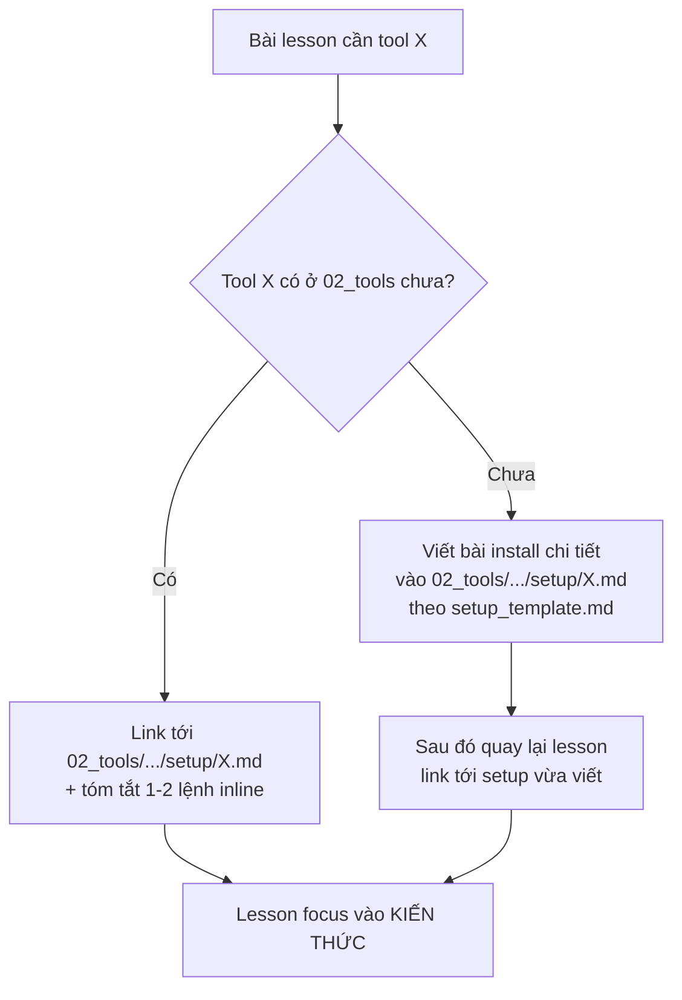

# 🏗️ Folder Structure & Naming — Cấu trúc thư mục & Quy ước đặt tên chuẩn

> **Tác giả:** Mr.Rom\
> **Phiên bản:** v1.0.0\
> **Tạo lúc:** 15/05/2026\
> **Cập nhật:** 26/05/2026

> 🎯 *File này định nghĩa **cấu trúc thư mục** và **quy ước đặt tên** chuẩn ở mọi cấp trong kho: từ gốc kho → L1 → L2 → L3 (loại nội dung) → L4 (file cụ thể). Khi tạo chủ đề mới hoặc viết bài mới, tra file này để biết đặt vào đâu và đặt tên ra sao.*

---

## 1️⃣ Cấu trúc gốc kho

```
<repo-root>/
├── README.md                        ← giới thiệu toàn kho, link Blueprint, link tới các L1
├── CONTRIBUTING.md                  ← quy ước đóng góp, "Nội dung cần tránh"
├── MASTER-CATALOG.md                ← tracking trạng thái mọi bài (✅ done / 🚧 WIP / ❌ chưa)
├── _blueprint/                      ← bản thiết kế (đang dùng — không phải nội dung)
├── 00_roadmaps/                     ← lộ trình học (career + lab-series)
├── 01_foundations/                  ← L1 #01
├── 02_tools/                        ← L1 #02
├── 03_languages/                    ← L1 #03
├── ...
├── 16_career-soft-skills/           ← L1 #16
├── _assets/                         ← (OPT) ảnh/diagram chung cho toàn kho
└── _scripts/                        ← (OPT) script utility (vd: generate index, check links)
```

| Slot gốc | Bắt buộc | Vai trò |
|---|---|---|
| `README.md` | ✅ | Cửa ngõ — giới thiệu kho, hướng dẫn dùng |
| `CONTRIBUTING.md` | ✅ | Quy ước đóng góp + "Nội dung cần tránh" (xem template ở `_blueprint/templates/`) |
| `MASTER-CATALOG.md` | ✅ | **Tracking**: list mọi bài trong kho + trạng thái. Một bài có thể `✅ Done`, `🚧 WIP`, `❌ Chưa có`, `🔄 Cần cập nhật` |
| `_blueprint/` | ✅ | Đặc tả thiết kế của kho (file bạn đang đọc thuộc đây) |
| `00_roadmaps/` | ✅ | Lộ trình điều hướng (career + lab-series) |
| `<NN>_<Name>/` | ✅ | 16 chủ đề L1 đánh số |
| `_assets/` | 🟡 OPT | Diagram/ảnh dùng chung nhiều L1 |
| `_scripts/` | 🟡 OPT | Tooling phụ trợ (check link, generate TOC, ...) |

### Spec `MASTER-CATALOG.md` (chi tiết)

File **tracking trạng thái** mọi bài trong kho. Format:

```markdown
# 📊 Master Catalog

> Trạng thái mọi bài trong kho. Cập nhật khi có bài mới hoặc đổi trạng thái.

## Ký hiệu
| Ký hiệu | Ý nghĩa |
|---|---|
| ✅ | Done — đã viết hoàn chỉnh, qua quality checklist |
| 🚧 | WIP — đang viết |
| ❌ | Chưa có — folder rỗng / placeholder |
| 🔄 | Cần cập nhật — outdated hoặc cần refactor |
| 🌟 | MUST-KNOW — bài bắt buộc trong lộ trình |

## Theo L1
### 01_foundations
- ✅ `00_overview.md`
- 🚧 `dsa/lessons/01_basic/00_array.md`
- ❌ `dsa/lessons/01_basic/01_linked-list.md`
- 🌟 ✅ `dsa/lessons/01_basic/02_big-o.md`

### 02_tools
...
```

Quy ước cập nhật:
- Cập nhật MỖI khi tạo bài mới, đổi trạng thái, đổi vai trò MUST-KNOW
- 1 PR có thể cập nhật cả MASTER-CATALOG + bài content cùng lúc
- Tool gen tự động (OPT): script trong `_scripts/gen-catalog.sh` quét folder + status từ frontmatter

Template đầy đủ → xem [`templates/master-catalog_template.md`](./templates/master-catalog_template.md).

### Spec `CONTRIBUTING.md` (chi tiết)

File **quy ước đóng góp**. Cấu trúc tối thiểu:

```markdown
# 🤝 Contributing

## Quy trình đóng góp
1. Fork / clone repo
2. Đọc `_blueprint/` để hiểu cấu trúc + chuẩn viết
3. Copy template từ `_blueprint/templates/` cho loại bài bạn viết
4. Viết theo `_blueprint/03_writing-style.md`
5. Soát qua `_blueprint/07_quality-checklist.md`
6. Cập nhật `MASTER-CATALOG.md` với bài mới
7. Mở PR theo template

## Nội dung cần tránh (anti-patterns)
- ❌ Bài thiếu câu dẫn — section nhảy ngang
- ❌ Code mẫu chưa test
- ❌ Heading tiếng Anh trong bài VN
- ❌ Ước tính thời gian thiếu căn cứ
- ❌ Copy-paste từ nguồn khác không thêm value
- ❌ Outdated content (vd: API version cũ)
- ❌ Hardcode credential thật
- ❌ Hardcode đường dẫn tuyệt đối trên máy author
- ❌ File rỗng không có placeholder

## Badges level (tag trong metadata)
- `[BEGINNER]` / `[INTERMEDIATE]` / `[ADVANCED]` — độ khó
- `[MUST-KNOW]` — bài bắt buộc trong lộ trình tương ứng

## Văn phong
Tuân theo `_blueprint/03_writing-style.md`.

## Đặt tên
Tuân theo `_blueprint/02_folder-structure.md`.

## Liên kết
Tuân theo `_blueprint/05_linking-strategy.md`.
```

Template đầy đủ → xem [`templates/contributing_template.md`](./templates/contributing_template.md).

---

## 2️⃣ Cấu trúc L1 — 1 chủ đề lớn

Một L1 = 1 thư mục đánh số (vd `10_devops/`). Bên trong có **2 nhóm**:

- **Meta slot** (prefix `_`) — nội dung xuyên L2 (notes, concepts, capstone)
- **L2 children** (không prefix) — các chủ đề con

```
10_devops/
├── 📄 README.md                     ✅ REQUIRED
├── 📄 00_overview.md                ✅ REQUIRED
│
├── 📦 _notes/                       🟡 OPT — ghi chú meta xuyên L2
│   ├── devops-philosophy.md
│   ├── industry-trends.md
│   └── common-pitfalls.md
│
├── 📦 _concepts/                    🟡 OPT — khái niệm xuyên L2
│   ├── infrastructure-as-code.md
│   ├── gitops.md
│   └── observability-pillars.md
│
├── 📦 _capstone-projects/           🟡 OPT, RARE — project xuyên L2 không tách
│   └── master-devops-platform/
│
├── 📦 docker/                       ← L2 chủ đề con
├── 📦 kubernetes/                   ← L2
├── 📦 ci-cd/                        ← L2
├── 📦 iac/                          ← L2
├── 📦 observability/                ← L2
├── 📦 service-mesh/                 ← L2
├── 📦 gitops/                       ← L2
│
└── 📄 _glossary.md                  🟡 OPT — thuật ngữ chung cho cả L1
```

### Spec từng slot L1

#### 📄 `README.md` (REQUIRED) — **Parent README pattern**

README ở mỗi cấp đóng vai trò **parent** cho cấp dưới. Có 3 cấp parent README:

| Cấp | Parent role | Children |
|---|---|---|
| `<L1>/README.md` | Parent của các L2 con | docker/, kubernetes/, ci-cd/, ... |
| `<L2>/README.md` | Parent của các loại nội dung | lessons/, setup/, exercises/, ... |
| `<L2>/lessons/README.md` | Parent của các level | 01_basic/, 02_intermediate/, ... |

**Quy tắc bắt buộc cho mọi parent README:**

1. 🎯 **Mục tiêu tổng** — sau khi đi hết children, người đọc đạt gì
2. 📂 **Danh sách children** với trạng thái + mô tả ngắn
3. 🚀 **Lộ trình đề xuất** — đi qua children theo thứ tự nào
4. 🎓 **Bài tập tổng hợp** (nếu có) — exercise/project cuối parent để chốt kiến thức
5. 💡 **Common pitfalls** (nếu có) — lỗi hay gặp khi học chủ đề này
6. 🔗 **Navigation** — link tới parent cha (nếu có) và sibling

**Cấu trúc tối thiểu** cho `<L1>/README.md`:

```markdown
# <Tên L1>

> Metadata header

## 🎯 Mục tiêu tổng

Sau khi đi qua chủ đề này, bạn sẽ:
- [ ] Mục tiêu 1
- [ ] Mục tiêu 2

## 📂 Danh sách L2 chủ đề con

| L2 | Mô tả ngắn | Trạng thái |
|---|---|---|
| [`docker/`](./docker/) | Containerization basics + Dockerfile + Compose | ✅ Done |
| [`kubernetes/`](./kubernetes/) | Orchestration + workloads + networking | 🚧 WIP |
| [`ci-cd/`](./ci-cd/) | Jenkins, GitHub Actions, GitLab CI | ❌ Chưa có |

## 🚀 Lộ trình đề xuất

| Bạn là... | Thứ tự đi |
|---|---|
| 🟢 Beginner | `docker/` → `kubernetes/` → `ci-cd/` |
| 🟠 Senior ôn lại | Nhảy thẳng L2 cần |
| 🔵 Theo roadmap | Xem [`00_roadmaps/career/devops-engineer_career-roadmap.md`](../00_roadmaps/career/devops-engineer_career-roadmap.md) |

## 🎓 Bài tập tổng hợp (nếu có)

- [Lab series: Docker → K8s](../00_roadmaps/lab-series/docker-to-k8s_lab-series.md) — 50 bài chuỗi

## 💡 Common pitfalls khi học DevOps

- ❌ Học K8s mà chưa nắm Docker cơ bản
- ❌ Bỏ qua observability (chỉ học deploy)

## 📝 Meta content (nếu có)
- [_notes/](./_notes/)
- [_concepts/](./_concepts/)
- [_capstone-projects/](./_capstone-projects/)
```

> 📌 Quy tắc tương tự cho `<L2>/README.md` và `<L2>/lessons/README.md` — chỉ đổi children và scope mục tiêu.

#### 📄 `00_overview.md` (REQUIRED)

"Chủ đề này là gì, vì sao học, học để làm gì". Format theo template (xem `templates/overview_template.md`).

#### 📦 `_notes/` (OPT)

Mỗi file là 1 ghi chú độc lập. Không cần đánh số (không có thứ tự bắt buộc).

```
_notes/
├── devops-philosophy.md
├── industry-trends.md
└── common-pitfalls.md
```

#### 📦 `_concepts/` (OPT)

Khái niệm xuyên L2 — mỗi file giải thích 1 khái niệm. Có thể đánh số nếu có thứ tự nên đọc, không thì để phẳng.

#### 📦 `_capstone-projects/` (OPT, RARE)

Mỗi capstone là 1 subfolder. Bên trong giống cấu trúc 1 project nhỏ (xem §3.4).

#### 📄 `_glossary.md` (OPT)

Bảng thuật ngữ EN ↔ VN cho cả L1. Mỗi L2 vẫn có glossary riêng cho thuật ngữ đặc thù của L2 đó.

---

## 3️⃣ Cấu trúc L2 — 1 chủ đề con

L2 (vd `kubernetes/`) là nơi **nội dung kiến thức thực sự** nằm. Tổ chức theo **menu 7 loại lõi** (lessons/setup/exercises/projects/recipes/cheatsheet/glossary) — chọn loại nào áp dụng.

```
kubernetes/
├── 📄 README.md                     ✅ REQUIRED
├── 📄 00_overview.md                ✅ REQUIRED
│
├── 📦 lessons/                      📖 (loại 1) bài học lý thuyết
├── 📦 setup/                        ⚙️ (loại 2) cài đặt môi trường
├── 📦 exercises/                    🧪 (loại 3) bài tập nhỏ
├── 📦 projects/                     🎯 (loại 4) tình huống lớn
├── 📦 recipes/                      📚 (loại 5) troubleshooting & patterns
│
├── 📄 _cheatsheet.md                ⚡ (loại 6) tra cứu nhanh
└── 📄 _glossary.md                  📘 (loại 7) thuật ngữ EN↔VN
```

### Khi nào dùng loại nào?

| Loại | Có nếu… | Bỏ qua nếu… |
|---|---|---|
| 📖 `lessons/` | Có bài học lý thuyết | Chủ đề chỉ là cookbook (vd: tools cheatsheet) |
| ⚙️ `setup/` | Chủ đề cần cài đặt môi trường trước khi học | Chủ đề thuần lý thuyết (vd: DSA) |
| 🧪 `exercises/` | Có khái niệm cần luyện tập | Chủ đề thuần đọc hiểu |
| 🎯 `projects/` | Có tình huống nhiều bước có thể xây ra sản phẩm | Chủ đề thuần lý thuyết |
| 📚 `recipes/` | Có tình huống thực tế lặp đi lặp lại (troubleshooting, patterns) | Chủ đề học thuật |
| ⚡ `_cheatsheet.md` | Có nhiều lệnh/cú pháp người đọc sẽ tra | Chủ đề concept-only |
| 📘 `_glossary.md` | Có thuật ngữ EN trong nội dung | Chủ đề ít thuật ngữ EN |

### 3.0 ⚖️ Phân biệt vai trò: Intro vs Lesson chi tiết — TRÁNH LẪN LỘN

> ⚠️ **Quy ước quan trọng**: trong cùng 1 chủ đề, **bài intro** và **bài lesson chi tiết** phải tách rõ — không trộn vào nhau.

#### Vấn đề nếu lẫn

Bài "ôm hết" (vừa intro vừa dạy chi tiết) gây:
- 🔴 Bài 1000+ dòng — beginner ngán
- 🔴 Lesson chuyên sâu kế tiếp không biết có nên lặp lại căn bản
- 🔴 Khó tham chiếu — link "bài cơ bản" lại đến cả intro + dạy lệnh
- 🔴 Vi phạm Single Responsibility — 1 bài = 1 mục đích

#### 2 loại bài + cách phân biệt

| Loại | Tên file pattern | Mục đích | Có dạy lệnh/syntax chi tiết? |
|---|---|---|---|
| 🌱 **Intro / What-is** | `00_what-is-<topic>.md` (không số trong tên) hoặc `00_overview.md` | Topic là gì, vì sao có, cách khởi tạo, ẩn dụ, cấu trúc tổng quan | ❌ KHÔNG — chỉ liệt kê 5-10 lệnh/khái niệm chính + 1 dòng giới thiệu |
| 🌳 **Lesson chi tiết** | `01_<nhóm-cmd-hoặc-concept>.md`, `02_...md`, ... | Dạy 1 nhóm lệnh/khái niệm với hands-on, deep dive, pitfall | ✅ CÓ — đầy đủ 8-section template |

#### Ví dụ áp dụng cho `02_tools/shell/`

```
shell/
└── lessons/01_basic/
    ├── 00_what-is-terminal.md          ← INTRO: terminal/shell là gì, mở 3 OS, prompt
    │                                      (KHÔNG dạy `pwd`/`ls`/`cd` chi tiết)
    ├── 01_navigation.md                ← LESSON: pwd, ls, cd, ~, ..
    ├── 02_file-operations.md           ← LESSON: mkdir, touch, cp, mv, rm
    ├── 03_view-file-content.md         ← LESSON: cat, less, head, tail
    ├── 04_text-search-and-pipes.md     ← LESSON: grep, find, |, >, >>
    └── ...
```

#### Khi viết bài, hỏi 3 câu

1. **Bài này dạy *là gì* hay dạy *cách dùng*?**
   - "Là gì" → bài intro
   - "Cách dùng" → bài lesson
2. **Có code/lệnh hands-on >5 ví dụ?**
   - Có → bài lesson
   - Không → bài intro
3. **Người đọc sau bài này có thể tự làm 1 task cụ thể?**
   - Có → bài lesson (focus 1 nhóm task)
   - Không → bài intro (chỉ hiểu khái niệm)

#### Quy chuẩn

| Yếu tố | Bài intro | Bài lesson |
|---|---|---|
| Độ dài | 200-500 dòng | 400-800 dòng |
| Số section H2 (Nội dung) | 1-3 | 3-7 |
| Số code example hands-on | 0-3 (chỉ demo) | 8-20 |
| Pitfall section | Optional | Often Required |
| Cheatsheet section | Không | Often Yes |
| Glossary section | Yes (concept gốc) | Yes (terms trong bài) |

> 💡 Quy ước này áp dụng cho **mọi chủ đề L2** trong kho — không riêng shell. Vd: `kubernetes/lessons/01_basic/00_what-is-k8s.md` (intro) vs `01_pod.md` (lesson).

### Spec từng loại

---

#### 📖 3.1 `lessons/` — Bài học lý thuyết

Tổ chức theo **3 level**: basic / intermediate / advanced. Mỗi file trong level đánh số theo thứ tự đọc.

```
lessons/
├── 📄 README.md                     ← index của lessons + lộ trình đọc đề xuất
├── 📦 01_basic/
│   ├── 00_<topic-1>.md
│   ├── 01_<topic-2>.md
│   └── ...
├── 📦 02_intermediate/
│   ├── 00_<topic>.md
│   └── ...
└── 📦 03_advanced/
    ├── 00_<topic>.md
    └── ...
```

**Quy ước file trong lessons/**:
- Đánh số `00_`, `01_`, ... theo thứ tự nên đọc
- Tên file = topic chính của bài (kebab-case, EN)
- Mỗi file dùng template `lesson_template.md` (xem `templates/`)

**Khi nào subfolder trong level**:
- Nếu 1 level quá nhiều file (>15), có thể chia subfolder:
  ```
  01_basic/
  ├── workloads/      ← Pod, Deployment, ReplicaSet, ...
  ├── networking/     ← Service, Ingress, ...
  └── storage/        ← Volume, PV, PVC, ...
  ```
- Subfolder không cần `NN_` (đã ở trong level)

##### 3.1.1 ⚖️ Quy tắc phân tầng nội dung bài học lý thuyết

Để đảm bảo lộ trình học tập mượt mà và không làm người học bị ngợp, nội dung trong `lessons/` bắt buộc phải được phân tầng khoa học theo đúng 3 mức độ khó:

###### A. Cấp độ `01_basic` (Nhập môn thực hành)
*   **Mục tiêu**: Giúp người học từ zero-base có thể hiểu bản chất khái niệm, tự cài đặt và viết/chạy được chương trình/công cụ cơ bản.
*   **Nội dung BẮT BUỘC phải chứa (theo từng domain)**:
    *   **Ngôn ngữ lập trình**: Cài đặt & Hello World, cú pháp cơ bản (biến, kiểu dữ liệu, hằng, comment), điều khiển luồng (if/else, vòng lặp, switch), hàm (khai báo, tham số, return), collections cơ bản (mảng, list, map), OOP hoặc Struct cơ bản, xử lý lỗi (error handling) cơ bản, module/import, I/O cơ bản (đọc/ghi file).
    *   **Công cụ / Framework**: Tại sao cần dùng, cài đặt & cấu hình cơ bản, khái niệm cốt lõi (ví dụ: Docker có Image, Container, Dockerfile; React có Component, JSX, Props, State), workflow cơ bản (build -> run -> debug).
    *   **Database**: Cú pháp SQL cơ bản (SELECT, INSERT, UPDATE, DELETE), các kiểu dữ liệu, điều kiện (WHERE, ORDER BY), các hàm tập hợp (COUNT, SUM), JOIN cơ bản.
*   **⚠️ CẤM TUYỆT ĐỐI đưa vào Basic**:
    *   Các khái niệm Concurrency (async/await sâu, luồng song song, channels, goroutines).
    *   Các chủ đề tối ưu hiệu năng (Performance tuning, Garbage Collection, Memory profiling).
    *   Các mẫu thiết kế phức tạp (Advanced design patterns), Security hardening, hay best practices cho Production quy mô lớn.

###### B. Cấp độ `02_intermediate` (Nâng cao & Vận hành)
*   **Mục tiêu**: Dành cho người đã nắm vững Basic, muốn học cách xây dựng ứng dụng thực tế hoặc vận hành công cụ chuyên sâu hơn.
*   **Nội dung đề xuất**:
    *   **Ngôn ngữ lập trình**: Concurrency cơ bản, Generics, Testing practices, Lập trình hướng đối tượng nâng cao (Inheritance, Polymorphism), làm việc với Database từ code.
    *   **Công cụ / Framework**: Các tính năng trung cấp (ví dụ: Docker Compose, Multi-stage builds; React có Context API, Custom Hooks, Forms validation), cấu hình môi trường nhiều phía.
    *   **Database**: Indexing cơ bản, Transactions, Constraints, Subqueries, Store Procedures.

###### C. Cấp độ `03_advanced` (Chuyên sâu & Production-grade)
*   **Mục tiêu**: Đào sâu vào cơ chế hoạt động bên dưới (internals) và các bài toán quy mô Production khổng lồ.
*   **Nội dung đề xuất**:
    *   **Ngôn ngữ lập trình**: Cơ chế Garbage Collection, Memory management, Metaprogramming/Reflection, Concurrency nâng cao (Worker pools, Race conditions), Performance profiling.
    *   **Công cụ / Framework**: Internals architecture (mổ xẻ bên dưới hoạt động ra sao), Security hardening, High Availability (HA), Multi-cluster scaling, rolling update không downtime.
    *   **Database**: Replication, Sharding, Partitioning, Query optimization, NoSQL internals.

---


#### ⚙️ 3.2 `setup/` — Cài đặt môi trường

Mỗi tool/option cài đặt là 1 file độc lập. Không đánh số (không có thứ tự bắt buộc — user chọn 1 option).

```
setup/
├── 📄 README.md                     ← so sánh các option, gợi ý chọn
├── 📄 00_overview.md                ← (OPT) phần lý thuyết chung trước khi cài
├── 📄 minikube.md                   ← cài Minikube
├── 📄 kind.md                       ← cài Kind
├── 📄 docker-desktop.md
└── ...
```

**Quy ước file trong setup/**:
- Tên file = tên tool/distro (kebab-case)
- README.md so sánh các option, giúp user chọn
- Mỗi file dùng template `setup_template.md` — 9 section (xem `templates/`)

**Mức độ chi tiết của setup file phụ thuộc vai trò chủ đề (xem §3.2bis bên dưới)**

#### ⚙️ 3.2bis `02_tools/` — Central Setup Hub (vai trò đặc biệt)

> 🎯 **Quy ước quan trọng**: `02_tools/` là **NƠI CANONICAL** cho mọi setup/install/cấu hình chi tiết của tool, software, extension, terminal utility trong kho. Lessons ở L1 khác chỉ giới thiệu sơ bộ rồi link về đây.
> *Đặc biệt:* **Git** bắt buộc phải nằm vĩnh viễn tại `02_tools/git/` (Central Setup Hub) thay vì `01_foundations/` vì Git là công cụ nền tảng dùng chung cho toàn bộ các mô-đun khác trong dự án.

##### Vì sao cần Central Setup Hub

| Vấn đề (không có hub) | Giải pháp (có hub) |
|---|---|
| Mỗi bài lesson lặp lại "cài Docker như sau..." → DRY violation | 1 chỗ canonical `02_tools/.../setup/docker.md` |
| Beginner stuck ở khâu cài, không đến được lesson | Có 1 chỗ chi tiết để gỡ vướng |
| Install instructions phân tán, khó update | Update 1 file, mọi link tới đó tự đúng |
| Không biết tool nào nên cài | Hub có comparison + recommend |

##### Phân biệt mức độ chi tiết setup theo vị trí

| Vị trí setup | Mức chi tiết | Ví dụ |
|---|---|---|
| **`02_tools/<l2>/setup/<tool>.md`** | 🔴 **CHI TIẾT TỐI ĐA** — multi-option, troubleshooting, extensions, comparison, alternative (template `setup_template.md` 9 section) | `02_tools/ide/vs-code.md` (cài VS Code đầy đủ + extensions + troubleshooting) |
| **`<L1>/<L2>/setup/<tool>.md`** (L1 khác, không phải 02_tools) | 🟡 **TÓM TẮT** — 5-10 dòng quick install + link về 02_tools cho chi tiết | `10_devops/kubernetes/setup/minikube.md` (cài minikube nhanh) |
| **Inline trong lesson** | 🟢 **1-2 lệnh** — chỉ command cần thiết để chạy demo, link về setup file cho chi tiết | "Cài kubectl: `brew install kubectl` (chi tiết xem [setup/kubectl.md](...))" |

##### Quy tắc khi viết bài cần tool



##### Cấu trúc 02_tools/ đặc biệt

```
02_tools/
├── git/
│   ├── setup/
│   │   ├── README.md                ← so sánh git, sourcetree, fork, ...
│   │   ├── git.md                   ← cài git (multi-OS, multi-option)
│   │   └── ssh-key-github.md        ← setup SSH key
│   ├── lessons/                     ← học DÙNG git (sau khi cài)
│   └── ...
├── editor/
│   ├── setup/
│   │   ├── README.md                ← so sánh VS Code, Cursor, JetBrains
│   │   ├── vs-code.md               ← cài VS Code + extensions phổ biến
│   │   ├── cursor.md
│   │   └── vim-neovim.md
│   └── lessons/                     ← học DÙNG editor
├── shell/
│   ├── setup/
│   │   ├── iterm2.md
│   │   ├── warp.md
│   │   ├── zsh-omz.md               ← cài zsh + Oh My Zsh
│   │   └── powerlevel10k.md
│   └── lessons/                     ← học commands
└── ...
```

##### Khi nào tách `setup/` ra ngoài 02_tools

Tool **rất chuyên biệt** cho 1 L1 không liên quan đến tool khác → đặt setup trong L1 đó.

| Ví dụ | Đặt setup ở đâu | Vì sao |
|---|---|---|
| Cài Minikube (chỉ K8s dùng) | `10_devops/kubernetes/setup/minikube.md` | Chỉ K8s dùng, không cross-cutting |
| Cài Postgres | `06_databases/postgresql/setup/install.md` | Chỉ Postgres |
| Cài VS Code (mọi coder dùng) | `02_tools/ide/vs-code.md` | Cross-cutting toàn kho |
| Cài Git | `02_tools/git/setup/git.md` | Cross-cutting |
| Cài Docker Desktop (dùng cho K8s + dev local + ...) | `10_devops/docker/setup/docker-desktop.md` (canonical) + `02_tools/` link tới | Cân nhắc — Docker primarily là DevOps tool, nhưng web dev cũng dùng. |

> 💡 **Nguyên tắc cuối**: tool **cross-cutting** (≥2 L1 dùng) → `02_tools/`. Tool **specific 1 L1** → L1 đó.

#### ⚙️ 3.2ter `02_tools/` — Scope (chứa gì, KHÔNG chứa gì)

> 🎯 **Nguyên tắc vàng**: *"Ở 02_tools là **những cái ở chỗ khác không có**"*. KHÔNG lặp content đã có chi tiết ở L1 khác.

##### ✅ 02_tools CHỨA

| Loại | Ví dụ |
|---|---|
| **Setup chi tiết** | Cài VS Code, cài iTerm2, cài Git, cài Oh My Zsh |
| **Tool-specific features** | VS Code shortcuts, Git rebase strategies, bash aliases, tmux keybindings |
| **Tool customize** | VS Code settings.json, prompt PS1, Powerlevel10k theme |
| **Tool scripting** | Bash scripting (shell-as-tool), Vim scripting |
| **Tool comparison** | VS Code vs Cursor vs Vim, bash vs zsh vs fish |

##### ❌ 02_tools KHÔNG chứa

| Loại | Thuộc về | Vì sao |
|---|---|---|
| Lệnh POSIX (`pwd`, `ls`, `cd`, `grep`, `find`, `chmod`) | `04_os/linux/lessons/` | Là lệnh OS — Linux/Mac/WSL đều dùng. KHÔNG phải shell-tool feature. |
| Khái niệm CS (DSA, OS theory) | `01_foundations/` | Khái niệm chung |
| Khái niệm ngôn ngữ (Python syntax, JS event loop) | `03_languages/` | Thuộc ngôn ngữ cụ thể |
| Kiến trúc phần mềm | `09_architecture/` | |

##### Test khi đắn đo

Hỏi 3 câu khi không chắc bài thuộc 02_tools hay L1 khác:

1. **Content này có thể di chuyển sang 1 L1 khác (Linux/Python/...) mà vẫn hợp lý không?**
   - Có → đặt ở L1 đó, KHÔNG ở 02_tools
   - Không (chỉ tool đó có) → đặt ở 02_tools

2. **Content có specific cho 1 tool/software duy nhất không?**
   - Có → 02_tools (vd: bash aliases — chỉ bash có, GitLens — chỉ VS Code có)
   - Không (chung cho cả mảng) → L1 khác

3. **Người đọc search Google sẽ tìm bằng từ khoá nào?**
   - "Linux cd command" → 04_os/linux/
   - "bash alias" → 02_tools/shell/
   - "VS Code keybindings" → 02_tools/ide/

##### Ví dụ chuẩn cho 02_tools/shell/

```
shell/
├── setup/                                  ⚙️ Setup
│   ├── README.md
│   ├── iterm2.md                           ← Cài terminal app
│   ├── warp.md
│   ├── windows-terminal.md
│   ├── zsh-omz.md                          ← Cài Oh My Zsh
│   └── powerlevel10k.md                    ← Cài theme
│
├── lessons/
│   └── 01_basic/                           📖 Shell-as-tool features (KHÔNG dạy lệnh OS)
│       ├── 00_what-is-terminal.md          ← Intro shell/terminal concept (cross-OS)
│       ├── 01_choosing-a-shell.md          ← bash vs zsh vs fish (tool comparison)
│       ├── 02_aliases.md                   ← Tạo alias (shell feature)
│       ├── 03_prompt-customization.md      ← PS1, p10k (shell feature)
│       ├── 04_history-and-completion.md    ← History, Tab completion (shell feature)
│       └── 05_shell-scripting-intro.md     ← if/loop trong shell (shell-as-language)
│
└── _glossary.md
```

→ **Không có** `01_navigation.md` (pwd/ls/cd) ở đây — đã chuyển sang `04_os/linux/lessons/01_basic/`.

---

#### 🧪 3.3 `exercises/` — Bài tập nhỏ

Bài tập độc lập, mỗi bài luyện 1 khái niệm. Đánh số theo độ khó tăng dần.

```
exercises/
├── 📄 README.md                     ← danh mục + độ khó + thời gian ước tính
├── 📄 01_<exercise-name>.md
├── 📄 02_<exercise-name>.md
└── ...
```

**Quy ước file trong exercises/**:
- Đánh số `01_`, `02_`, ... theo độ khó
- Tên file = verb-phrase ngắn gọn (vd `create-first-pod`, `scale-deployment`)
- Mỗi bài có: yêu cầu, gợi ý (có thể ẩn `<details>`), đáp án (có thể ẩn), kiểm tra

---

#### 🎯 3.4 `projects/` — Tình huống lớn

Mỗi project là **1 subfolder** (vì project có nhiều file: README, code, các bước).

```
projects/
├── 📄 README.md                     ← danh mục project + prerequisite
├── 📦 01_<project-name>/
│   ├── README.md                    ← intro project, mục tiêu, prerequisite
│   ├── 00_setup.md
│   ├── 01_<step-1>.md
│   ├── 02_<step-2>.md
│   ├── ...
│   ├── code/                        ← (OPT) source code project
│   └── _references.md               ← (OPT) tài nguyên ngoài
└── 📦 02_<project-name>/
```

**Quy ước subfolder project**:
- Đánh số `01_`, `02_`, ... theo độ phức tạp
- Tên subfolder = mục tiêu project (kebab-case)
- Bên trong: README.md bắt buộc + các step file đánh số
- Code có thể trong `code/` subfolder hoặc link tới repo ngoài

---

#### 📚 3.5 `recipes/` — Công thức / Troubleshooting

Chia 3 sub-folder theo dạng công thức:

```
recipes/
├── 📄 README.md                     ← index theo problem
├── 📦 troubleshooting/              ← lỗi cụ thể + cách fix
│   ├── <error-name>.md
│   └── ...
├── 📦 patterns/                     ← pattern thiết kế / triển khai
│   ├── <pattern-name>.md
│   └── ...
└── 📦 operations/                   ← thao tác vận hành (vd: backup, upgrade)
    ├── <operation-name>.md
    └── ...
```

**Quy ước file trong recipes/**:
- Tên file = vấn đề/pattern (kebab-case), không đánh số (recipe độc lập)
- Mỗi file ngắn gọn: problem → cause → solution → verify
- Có thể có thêm `one-liners/` nếu có nhiều lệnh tra cứu nhanh

---

#### ⚡ 3.6 `_cheatsheet.md` — Tra cứu nhanh

Single file. Đặt prefix `_` để luôn ở đầu folder (sau files thường) giúp gom nhóm gọn gàng. Cấu trúc:

```markdown
# <Topic> Cheatsheet

## Cài đặt nhanh
## Lệnh thường dùng
## Cú pháp tham khảo
## Format / config thường gặp
```

Nếu cheatsheet quá dài → tách thành folder `_cheatsheets/` với nhiều file con.

---

#### 📘 3.7 `_glossary.md` — Thuật ngữ EN↔VN

Single file. Prefix `_` để đứng đầu folder khi sort.

Cấu trúc:

```markdown
# Glossary — <Topic>

| EN | VN | Giải thích |
|---|---|---|
| Pod | Pod | Đơn vị nhỏ nhất K8s deploy, gồm 1+ container chia sẻ network/storage |
| Node | Node | Máy worker chạy Pod (VM hoặc physical) |
| ... | ... | ... |
```

---

## 4️⃣ Cấu trúc loại bổ sung (ngoài 7 lõi)

Khi cần loại mới (xem §0.5 của `01_sitemap-detail.md`):

| Loại | Tên folder | Cấu trúc |
|---|---|---|
| 📚 References | `references/` | Files theo nguồn: `books.md`, `papers.md`, `videos.md`, `blogs.md` |
| 🎤 Interview | `interview-questions/` | Files theo chủ đề con: `data-structures.md`, `system-design.md` |
| 📰 Case studies | `case-studies/` | Mỗi case 1 file: `<company-or-scenario>.md` |
| 🔄 Migration | `migration-guides/` | Mỗi migration 1 file: `<from>-to-<to>.md` |
| 🧰 Tools comparison | `tools-comparison/` | Mỗi cặp/nhóm tools 1 file |

**Khi tạo loại mới** → cập nhật chính file này (mục §4) + bump version.

---

## 5️⃣ Quy ước đặt tên chi tiết (Naming Convention)

Để giữ tính nhất quán toàn kho, mọi folder, file, link, branch và asset đều phải tuân thủ nghiêm ngặt các quy tắc dưới đây.

### 5.0 Nguyên tắc chung

| Nguyên tắc | Mô tả |
|---|---|
| **English-first cho định danh** | Tên folder/file dùng tiếng Anh. Nội dung file dùng tiếng Việt. |
| **Lowercase mặc định** | Trừ folder L1 và proper nouns |
| **Hyphen `-` giữa từ trong 1 segment** | `multi-tier-app` không phải `multi_tier_app` |
| **Underscore `_` giữa các segment** | `NN_<name>_<type>.<ext>` |
| **Không khoảng trắng** | `pod-lifecycle.md` không phải `pod lifecycle.md` |
| **Không dấu tiếng Việt** | `gioi-thieu` không phải `giới-thiệu` |
| **Không emoji trong tên file/folder** | Emoji chỉ trong nội dung bài viết |

### 5.1 Quy ước đặt tên Folder

#### 5.1.1 Folder L1 (chủ đề lớn)
Format: `NN_<Name>` — đánh số 2 chữ số + sentence case.
*   ✅ *Đúng*: `10_devops/`, `16_career-soft-skills/`, `00_roadmaps/`
*   ❌ *Sai*: `10-DevOps/` (sai separator `-`), `10_devops/` (phải viết Sentence Case)

*Proper noun giữ nguyên*: `K8s-training/`, `MacOS/`, `iOS/`, `AWS-Architect/`.

#### 5.1.2 Folder L2 (chủ đề con)
Format: `<name>` — lowercase, không số thứ tự, multi-word dùng `-`.
*   ✅ *Đúng*: `kubernetes/`, `data-engineering/`, `react-native/`
*   ❌ *Sai*: `Kubernetes/`, `data_engineering/`

#### 5.1.3 Folder L3 (loại nội dung)
Tên cố định theo menu 7 loại + extension:
*   `lessons/`, `setup/`, `exercises/`, `projects/`, `recipes/`
*   `references/`, `interview-questions/`, `case-studies/`, `tools-comparison/`

#### 5.1.4 Folder L4 (level trong lessons hoặc subfolder)
Trong `lessons/`: bắt buộc 3 level đánh số: `01_basic/`, `02_intermediate/`, `03_advanced/`.
Trong các L3 khác (vd subfolder `recipes/`): `troubleshooting/`, `patterns/`, `operations/` (lowercase, không số).

#### 5.1.5 Folder meta (L1-level)
Prefix `_` để phân biệt với L2: `_notes/`, `_concepts/`, `_capstone-projects/`, `_assets/` (cho ảnh/diagram).

---

### 5.2 Quy ước đặt tên File

#### 5.2.1 File trong `lessons/<level>/`
Format: `NN_<topic-name>.md`
*   ✅ *Đúng*: `00_overview.md`, `01_pod.md`, `08_imperative-vs-declarative.md`
*   ❌ *Sai*: `0_overview.md` (thiếu số 0), `01_imperative_vs_declarative.md` (sai separator trong name)

#### 5.2.2 File trong `setup/`, `recipes/`
Không đánh số (mỗi file độc lập). Tên = function/problem (kebab-case):
*   ✅ *Đúng*: `minikube.md`, `pod-crashloopbackoff.md`, `backup-and-restore.md`

#### 5.2.3 File trong `exercises/`
Đánh số theo độ khó: `NN_<verb-phrase>.md`
*   ✅ *Đúng*: `01_create-first-pod.md`, `02_scale-deployment.md`

#### 5.2.4 File trong `projects/<NN>_<project>/`
*   README chính của project: `README.md`
*   Step files: `NN_<step-name>.md` (vd `01_setup.md`, `02_deploy-frontend.md`)

#### 5.2.5 File README, overview, cheatsheet, glossary
Tên cố định (không tùy biến):

| File | Vị trí |
|---|---|
| `README.md` | Mọi folder cần index |
| `00_overview.md` | L1, L2, một số L3 (lessons, setup, projects) |
| `_cheatsheet.md` | Cuối L2 (nếu áp dụng) |
| `_glossary.md` | Cuối L1 và/hoặc L2 |

---

### 5.3 Tên anchor (heading trong file)

Heading sinh anchor tự động trong markdown. Quy tắc viết heading để anchor đẹp:

#### 5.3.1 Heading H2/H3
*   Bắt đầu bằng emoji + space
*   Sentence case (chỉ chữ cái đầu hoa)
*   Anchor sinh ra sẽ lowercase + thay space bằng `-` + bỏ emoji
*   *Ví dụ*: `## 🎯 Sau bài này bạn sẽ làm được gì` → `#sau-bài-này-bạn-sẽ-làm-được-gì`

#### 5.3.2 Heading có ký tự đặc biệt
Tránh: `&`, `(`, `)`, `/`, `:`. Nếu có, anchor sẽ bỏ.
*   ❌ *Tránh*: "Pod (chi tiết) & lifecycle"
*   ✅ *Nên*: "Pod — chi tiết và lifecycle"

---

### 5.4 Tên trong code (variable, function, file path)

*   **Variable / function name**: Theo ngôn ngữ (Python: `snake_case`, JS: `camelCase`) — không Việt hóa.
*   **File path trong code**: Tuyệt đối / tương đối — không Việt hóa.
*   **String literal cho UI**: Có thể viết tiếng Việt (vì hiển thị cho người dùng).
*   *Ví dụ*: `visit_count = redis.incr('visit_count')` (Đúng) vs `soluot_truycap = redis.incr('soluot_truycap')` (Sai).

---

### 5.5 Tên image / asset

Format: `<topic>-<aspect>_<format>.<ext>`
*   ✅ *Đúng*: `pod-lifecycle_diagram.png`, `k8s-architecture_full.svg`
*   ❌ *Sai*: `pod lifecycle diagram.png` (có space), `cheatsheet.png` (không rõ topic)

#### Vị trí lưu:

| Phạm vi dùng | Lưu ở |
|---|---|
| Dùng riêng cho 1 bài | `<folder của bài>/_assets/` |
| Dùng chung trong 1 L2 | `<L2>/_assets/` |
| Dùng chung trong 1 L1 | `<L1>/_assets/` |
| Dùng chung toàn kho | `_assets/` ở gốc |

---

### 5.6 Tên link / URL

#### 5.6.1 Internal link
Dùng relative path từ file hiện tại:
`[Pod](../01_pod.md)` (lên 1 cấp) hoặc `[Cheatsheet](../../_cheatsheet.md)` (lên 2 cấp).

#### 5.6.2 External URL
`[Official K8s docs](https://kubernetes.io/docs/)` — Link text phải mô tả đích, không dùng "click here", "ở đây".

---

### 5.7 Tên branch / commit (khi dùng Git)

| Loại | Format | Ví dụ |
|---|---|---|
| Feature branch | `feature/<L1>-<L2>-<topic>` | `feature/devops-k8s-pod-lesson` |
| Fix branch | `fix/<area>-<short-desc>` | `fix/k8s-pod-typo` |
| Commit message | `<type>: <description>` | `feat: add Pod lesson basic`, `fix: typo in deployment.md` |

Commit `type`: `feat`, `fix`, `docs`, `refactor`, `chore`.

---

### 5.8 Tên không được dùng (forbidden)

*   `final_v2_FINAL_ok.md` (Lộn xộn — dùng version SemVer trong metadata)
*   `untitled.md`, `new-file.md`, `Doc1.md`, `temp.md`
*   `MyDocument.md` (PascalCase không hợp file), `tài-liệu.md` (tiếng Việt có dấu).

---

### 5.9 Tóm tắt prefix-by-cấp

| Cấp | Folder pattern | File pattern | Ví dụ |
|---|---|---|---|
| Root | `NN_<Name>/`, `_<Name>/` | `README.md` | `10_devops/`, `_blueprint/` |
| L1 | `_<name>/` (meta), `<name>/` (L2) | `README.md`, `00_overview.md`, `_glossary.md` | `_notes/`, `docker/` |
| L2 | `<name>/` (L3 types) | `README.md`, `00_overview.md`, `_cheatsheet.md`, `_glossary.md` | `lessons/`, `setup/` |
| L3 lessons | `NN_<level>/` | — | `01_basic/` |
| L3 setup | — | `<tool>.md` | `minikube.md` |
| L3 exercises | — | `NN_<verb-phrase>.md` | `01_create-pod.md` |
| L3 projects | `NN_<project>/` | `README.md`, `NN_<step>.md` | `01_first-pod/`, `01_setup.md` |
| L3 recipes | `<category>/` | `<problem-name>.md` | `troubleshooting/pod-crashloopbackoff.md` |
| L4 lessons | — | `NN_<topic>.md` | `01_pod.md` |

---

### 5.10 Quy trình rename — khi cần đổi tên

Khi đổi tên 1 file/folder đã có content:
1. ✏️ **Rename** file/folder.
2. 🔍 **Grep** mọi link trỏ tới tên cũ: `grep -rn "<old-name>" .`
3. 🔧 **Fix link** trong các file phụ thuộc.
4. 📝 **Note** trong `_redirects.md` (nếu rename đáng kể): `<old> → <new> (lý do, ngày)`
5. 📌 **Bump version** của file đã rename.

---

## 6️⃣ Folder rỗng (placeholder)

Khi tạo skeleton mà chưa có content:

```
<empty-folder>/
└── README.md       ← placeholder, ghi "🚧 Chủ đề này chưa có content. Dự kiến: ..."
```

Lý do: Git không track folder rỗng → cần ít nhất 1 file. README placeholder vừa giữ folder vừa báo trạng thái.

Format README placeholder tối thiểu:

```markdown
# <Tên chủ đề>

> 🚧 **Status:** Skeleton — chưa có content

## 📋 Dự kiến nội dung

- <bullet 1>
- <bullet 2>

## 🤝 Đóng góp

Muốn viết bài cho chủ đề này? Tra `_blueprint/` để biết template, sau đó PR.
```

---

## 7️⃣ Khi nào tạo subfolder vs file phẳng

| Số file dự kiến | Cách tổ chức |
|---|---|
| 1-5 file | File phẳng, không subfolder |
| 6-15 file | Cân nhắc subfolder nếu có nhóm logic rõ ràng |
| >15 file | Bắt buộc chia subfolder theo chủ đề con |

**Ví dụ K8s lessons/01_basic/**:
- Nếu chỉ ~8 file → để phẳng: `00_architecture.md`, `01_pod.md`, ...
- Nếu nhiều hơn → chia: `workloads/`, `networking/`, `storage/`

**Nguyên tắc**: subfolder chỉ tạo khi nó **giảm tải nhận thức** cho người học. Đừng nesting cho có.

---

## 8️⃣ Đặc biệt: cấu trúc `00_roadmaps/`

Roadmap không theo menu 7 loại — nó là **layer điều hướng**. Cấu trúc đơn giản:

```
00_roadmaps/
├── 📄 README.md                     ← danh mục cả 2 loại roadmap
├── 📦 career/                       🧭 lộ trình theo nghề
│   ├── <role>_career-roadmap.md
│   └── ...
└── 📦 lab-series/                   🧪 chuỗi bài tập xuyên L2
    ├── <series-name>_lab-series.md
    └── ...
```

Chi tiết template và cách viết roadmap → xem `06_roadmap-design.md`.

---

## 9️⃣ Tóm tắt cây cấp đầy đủ

```
<repo-root>/                         ← gốc kho
├── README.md
├── _blueprint/                      ← đang đọc
├── 00_roadmaps/
│   ├── career/
│   └── lab-series/
└── <NN>_<L1-Name>/                  ← L1 (16 chủ đề)
    ├── README.md
    ├── 00_overview.md
    ├── _notes/                      ← L1-meta (OPT)
    ├── _concepts/                   ← L1-meta (OPT)
    ├── _capstone-projects/          ← L1-meta (OPT, RARE)
    ├── _glossary.md                 ← L1-meta (OPT)
    └── <L2-Name>/                   ← L2 chủ đề con
        ├── README.md
        ├── 00_overview.md
        ├── lessons/                 ← L3: 7 loại lõi
        │   ├── 01_basic/            ← L4: level
        │   │   └── 00_<topic>.md    ← L5: file
        │   ├── 02_intermediate/
        │   └── 03_advanced/
        ├── setup/                   ← L3
        ├── exercises/               ← L3
        ├── projects/                ← L3
        │   └── 01_<project>/        ← L4: project folder
        │       ├── README.md        ← L5
        │       └── 01_<step>.md
        ├── recipes/                 ← L3
        │   ├── troubleshooting/     ← L4
        │   ├── patterns/
        │   └── operations/
        ├── _cheatsheet.md
        └── _glossary.md
```

→ Tối đa **5 cấp** (repo → L1 → L2 → L3 → L4 → file). Không nest sâu hơn.

---

## 📌 Changelog

- **v1.0.0 (26/05/2026)** — **Tái cấu trúc lớn (Gộp file & Quy chuẩn Cheatsheet)**:
  - Gộp toàn bộ nội dung quy ước đặt tên từ `04_naming-convention.md` vào section mới `## 5️⃣ Quy ước đặt tên chi tiết (Naming Convention)`.
  - Thay đổi quy chuẩn đặt tên file cheatsheet từ `_cheatsheet.md` thành `_cheatsheet.md` xuyên suốt tài liệu và sơ đồ cây.
- **v0.5.0 (16/05/2026)** — Thêm §3.2ter **02_tools Scope** sau feedback user phát hiện mình đặt sai lệnh POSIX trong shell/.
- **v0.4.0 (16/05/2026)** — Thêm §3.0 **Phân biệt Intro vs Lesson chi tiết**.
- **v0.3.0 (16/05/2026)** — Thêm §3.2bis **`02_tools/` Central Setup Hub**.
- **v0.2.0 (15/05/2026)** — Áp dụng SSOT + 3 recommendations.
- **v0.1.0 (15/05/2026)** — Bản đầu tiên.
